# Microsoft Fabric - Fabric Analyst in a Day

## 目录

- 简介
- 实验凭据：
- 排查 Snowflake 登录问题
- 实验链接：
- 导入数据流模板：
- 从数据流模板导入之前的注意事项
- 如何导入数据流模板
- 使用 T-SQL 创建视图
- 预测 ML 演示
- 要求
- 如何创建笔记本
- 将 Lakehouse 添加到笔记本
- 内联安装 Python 库
- 运行代码以创建预测
- Initialize Spark session
- Load data from your specific Spark table
- Aggregate data to monthly level
- Convert to Pandas DataFrame and prepare for Prophet
- Fit the Prophet model
- Create a DataFrame for future predictions (e.g., next 12 months)
- Forecast
- Plotting the forecast
- Data Activator 演示
- 要求
- 应用场景
- 添加 Sales Variance % 度量值
- 创建表视觉对象
- 创建 Activator
- Activator 概述
- 发送测试警报
- 语义链接演示
- 要求
- 应用场景
- 最佳做法分析器
- 内存分析器

w选择工作区设置的屏幕截图

# **简介**

本文档提供了以下功能的指南：

- 实验凭据

- 如何导入数据流模板

- 预测 ML 演示的步骤

- Data Activator 演示的步骤

- Data Mirroring 演示的步骤

**免责声明：**请注意，由于产品每天都在变化，某些屏幕截图可能已过时。我们将努力在下次更新中进行修复。

# **实验凭据：**

如果任何参与者选择在替代环境中完成实验，以下是您可能需要共享的凭据。

参与者需要使用与其实验帐户关联的用户名和密码连接到 Dataverse 和 SharePoint

- **用户名：**TE_SNOWFLAKE1

- **密码：**8UpfRpExVDXv2AC1

- **SAS 令牌：**?sv=2023-01-03&ss=btqf&srt=sco&st=2025-06-30T10%3A15%3A46Z&se=2026-06-30T10%3A15%3A00Z&sp=rl&sig=hVeyxY4F72YVH3X%2BlnIvVTg8M%2FwZgLIhDzBgHlv1580%3D

**注意：**如果您在使用环境详细信息中的凭据连接到 Snowflake 时遇到任何问题， 请使 用下面提供的凭据。

- **Snowflake 用户名：**SNOWFLAKE_BACKUP

- **Snowflake 密码：**8UpfRpExVDXv2AC1

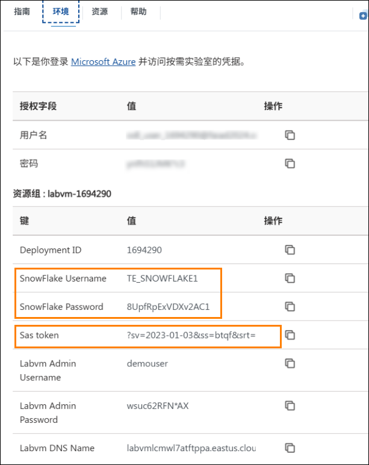

### 排查 Snowflake 登录问题

如果参与者在登录 Snowflake 时遇到问题，请按照以下步骤操作。这将提供详细的错误描述。

1. 导航到 **dlhdzca-bab11165.snowflakecomputing.com**。这是我们目前使用的 snowflake 服务器。

2. 输入**凭据**。如果出现错误，您将看到详细的错误描述，如下面的屏幕截图所示。

    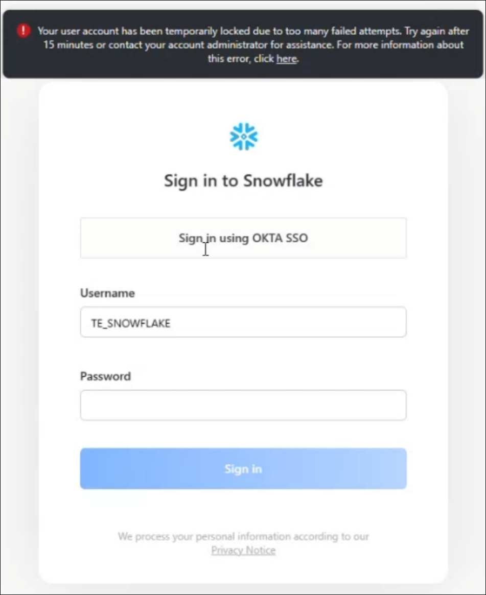

3. 如果错误仍然存在，**Azure Data Lake 中提供了 Snowflake 数据**，**C:\FAIAD\Solutions** 中提供了数据流模板 (**df_Supplier_ADLSGen2.pqt**)。您可以帮助参与者按照以下步骤导入此模板。

# **实验链接：**

- [巴西葡萄牙语](https://experience.cloudlabs.ai/#/labguidepreview/aab00958-5596-4175-9bc9-39ece2586314)

- [中文](https://experience.cloudlabs.ai/#/labguidepreview/3c8f94bd-6936-4a18-a1e3-8b606402531e)

- [英语](https://experience.cloudlabs.ai/#/labguidepreview/b63b312d-0c58-4fd0-bee1-05a94affa927)

- [法语](https://experience.cloudlabs.ai/#/labguidepreview/e9c3e273-1dd1-4db8-80e3-aedfe41a1e9b)

- [德语](https://experience.cloudlabs.ai/#/labguidepreview/e697a208-a982-4c6d-b32b-7e83d39c7186)

- [意大利语](https://experience.cloudlabs.ai/#/labguidepreview/b984b3dd-928d-492e-be2c-de1d49dd2640)

- [日语](https://experience.cloudlabs.ai/#/labguidepreview/bb29b27d-7a77-4e4e-9c0d-a12a86397a1f)

- [韩语](https://experience.cloudlabs.ai/#/labguidepreview/544a6b13-8546-454d-8270-3540fe6a9566)

- [西班牙语](https://experience.cloudlabs.ai/#/labguidepreview/16998c52-2637-4c65-b691-0fa5ac9091d7)

# **导入数据流模板：**

作为讲师，您可以选择让参与者可以选择导入数据流模板。以下是导入模板的步骤。

### 从数据流模板导入之前的注意事项

1. 如果学生**已经在湖屋中创建了表** - 需要先删除湖屋中的表，然后再加载 PQT（否则必须将新数据流中的表重命名，然后稍后在实验室中对其进行解释）。

2. 学生需要设置相关表的目标 - 取消选中**启用暂存**复选标记，最好再仔细检查一遍，因为在某些情况下它可能仍然处于选中状态。

3. df_Supplier_Snowflake 中的以下表需要目标：

    1. Supplier

    2. PO

4. df_People_SharePoint 中的以下表需要目标：

    1. People

### 如何导入数据流模板

1. 导航到**您在实验室 2** 任**务 2** 中**创建的 Fabric** 工作区，该工作区名为 **FAIAD_ <username>**。

2. 从菜单中，选择新建**项目 -> 数据流 Gen2**。

    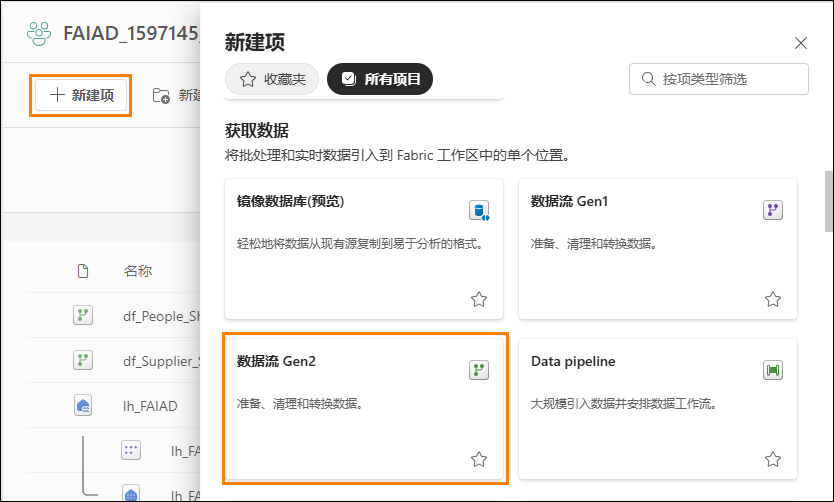

3. Power Query 窗口随即打开。在中间窗格中，选择**从 Power Query 模板导入**。

    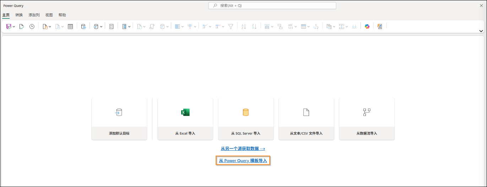

4. 导航到实验环境中的 **C:\FAIAD\Solutions** 文件夹。

5. 选择您要导入的数据流。这里我们导入 **df_People_SharePoint.pqt**

6. 选择**打开**。

    导入后，请注意查询以及查询的所有步骤均已导入。但是，您需要配置连接。此外还需要设置数据目标。请按照实验说明完成这些步骤。

    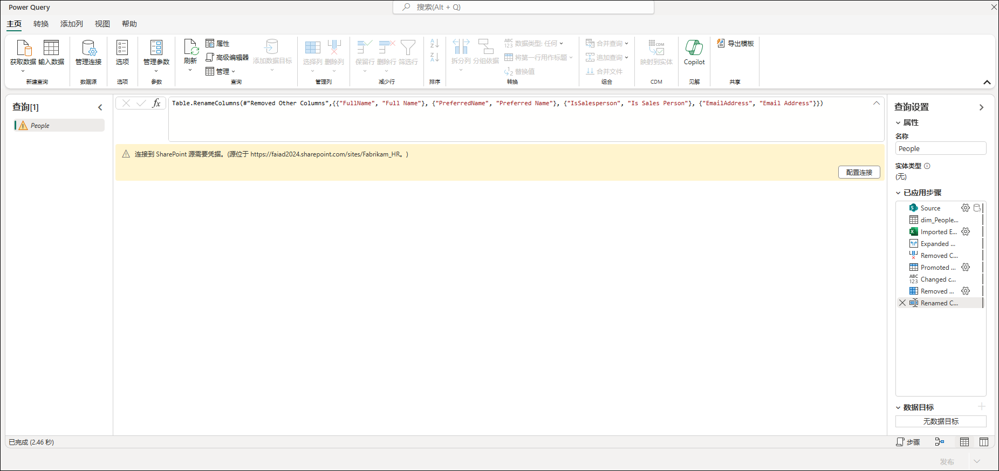

# **使用 T-SQL 创建视图**

作为讲师，您可以选择让与会者使用 T-SQL 创建视图。Geo、Product、Reseller 和 Sales 视图的 T-SQL 在 **Solutions** 文件夹中提供。请在湖屋中打开新的 SQL 查询窗口并执行以下 T-SQL 语句。如果需要删除视图，也可以在 **Solutions** 文件夹中运行 Remove-View 文件。

**注意：**这些是 CREATE 语句。在执行这些语句之前，必须删除具有相同名称的任何现有视图。

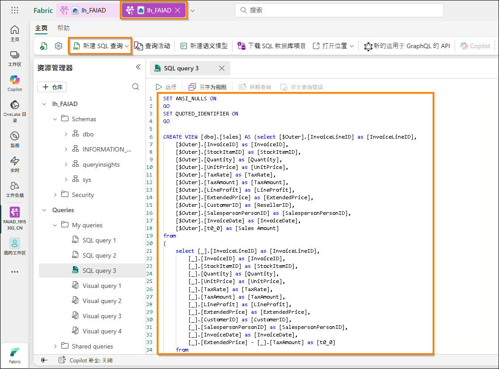

# **预测 ML 演示**

### 要求

您（讲师）需要完成实验 1-6，并在进入后续步骤之前获取所有数据。

为进行演示，您需要安装名为 **prophet** 的 Python 库。。您可以在笔记本中内联安装，或者创建一个环境。在此演示中，我们将使用内联模式。

### 如何创建笔记本

1. 导航到**您在实验室 2** 任**务 2** 中**创建的 Fabric** 工作区，该工作区名为 **FAIAD_ <username>**。

2. 从菜单中，选择 **+ 新建项目** -> 使用搜索框**搜索笔记本 ->** **选择笔记本**。

    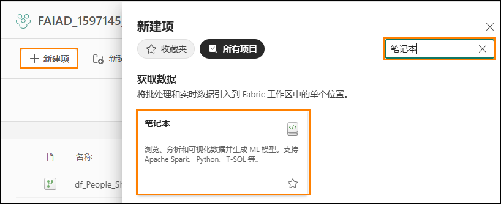

3. 提供布局的**简要概述**：笔记本、语言、环境、如何创建新单元格等。

### 将 Lakehouse 添加到笔记本

我们需要将默认的 Lakehouse 关联到笔记本。

1. 在“资源管理器”面板中，选择**数据项**选项卡。

    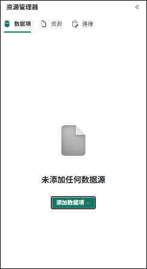

2. 从“资源管理器”面板中，选择**添加数据项**。

3. 选择**从**** OneLake** **目录**。

    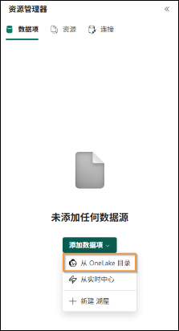

4. OneLake 数据中心对话框随即打开。选择 **lh_FAIAD** lakehouse。

5. 选择**添加**。请注意，Lakehouse 与笔记本关联。

    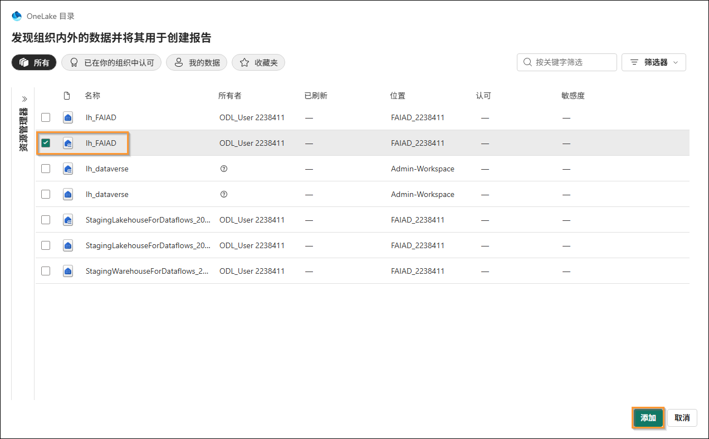

### 内联安装 Python 库

为进行演示，您需要安装名为 **prophet** 的 Python 库。这是内联安装的。

1. 要**安装 python 库**，请在单元格中输入以下代码。

    !pip install prophet

2. 通过选择单元格旁边的**播放**按钮执行代码。

    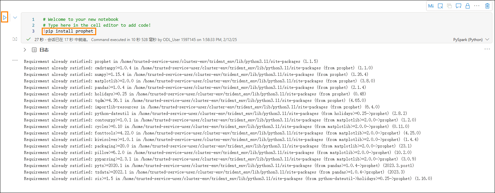

### 运行代码以创建预测

1. 创建**新单元格**。

2. 输入以下**代码**：

    from pyspark.sql import SparkSession

    from pyspark.sql.functions import month, year, col

    from prophet import Prophet

    import pandas as pd

    # Initialize Spark session

    spark = SparkSession.builder.appName("Prophet Forecasting").getOrCreate()

    # Load data from your specific Spark table

    df = spark.sql("SELECT \* FROM lh_FAIAD.Invoices i JOIN lh_FAIAD.InvoiceLineItems il ON i.InvoiceID = il.InvoiceID")

    # Aggregate data to monthly level

    monthly_df = df.withColumn("Month", month("InvoiceDate"))

    .withColumn("Year", year("InvoiceDate"))

    .groupBy("Year", "Month")

    .sum("Quantity")

    .orderBy("Year", "Month")

    # Convert to Pandas DataFrame and prepare for Prophet

    pandas_df = monthly_df.toPandas()

    pandas_df['ds'] = pd.to_datetime(pandas_df[['Year', 'Month']].assign(DAY=1))

    pandas_df['y'] = pandas_df['sum(Quantity)']

    # Fit the Prophet model

    model = Prophet(yearly_seasonality=True, weekly_seasonality=False,daily_seasonality=False)

    model.fit(pandas_df[['ds', 'y']])

    # Create a DataFrame for future predictions (e.g., next 12 months)

    future = model.make_future_dataframe(periods=12, freq='M')

    # Forecast

    forecast = model.predict(future)

    # Plotting the forecast

    model.plot(forecast)

    model.plot_components(forecast)

3. 解释**代码**的每个步骤（提示作为注释提供）。

4. 通过选择单元格旁边的**播放**按钮执行代码。

    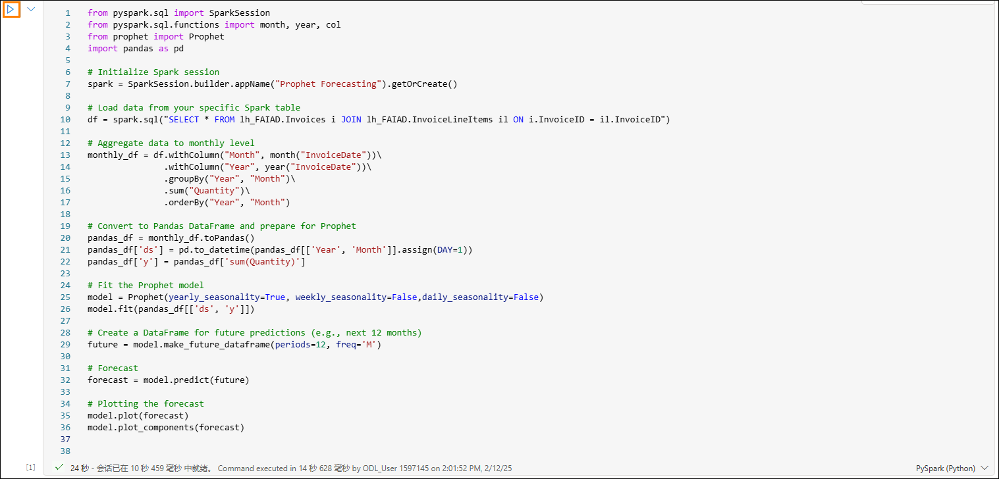

    引导参与者浏览创建的三个图表（如下）。我们有截至 2023 年 5 月的实际数据，并预测 12 个月的数据。

    请注意，**第一个图表**删除了截至 2025 年 4 月的季节性和预测。

    **第二个图表**删除了截至 2025 年 4 月的趋势并向预测添加了季节性。

    

    **第三个图表**使用趋势和季节性进行预测。该图表还提供了上限和下限。

    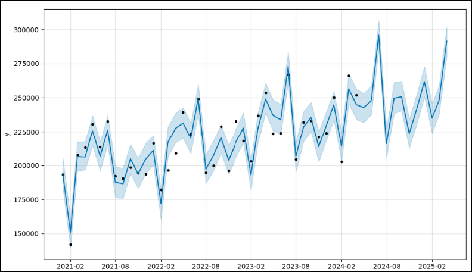

5. 创建**新单元格**。

6. 将以下**代码**添加到单元格中：

    display(forecast)

    #write forecast data to a table

    spark.createDataFrame(forecast).write.saveAsTable("Sales_Forecast", mode="overwrite")

7. 通过选择**播放**按钮执行单元格。

    

8. 引导参与者浏览**显示的数据**。

9. 向用户显示在 Lakehouse 中创建了新表：**sales_forecast**

    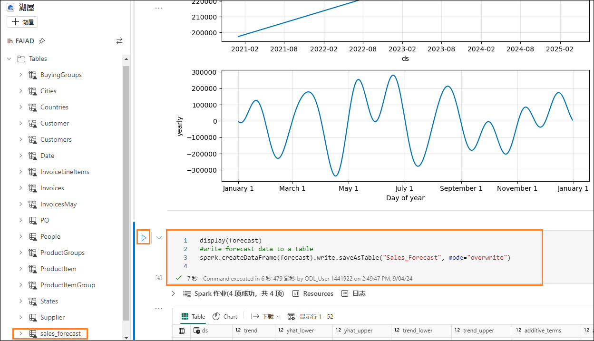

10. **查询**表并向用户显示表的内容。

# **Data Activator 演示**

### 要求

您（讲师）需要完成实验 1-7，然后再进入后续步骤。

以下链接将有最新更新。

<https://learn.microsoft.com/en-us/fabric/data-activator/data-activator-introduction>

<https://learn.microsoft.com/en-us/fabric/data-activator/data-activator-get-data-power-bi>

### 应用场景

我们知道每个月的库存销售组名称会有差异。这是由于季节性造成的。但是，如果差异百分比低于 20%，请通知我们。这将有助于我们发现和解决此类情况。

为了解决此问题，我们将使用 Data Activator。当任何库存组名称的 Sales Variance % 低于 20% 时，我们将触发警报。我们将在 2024 年 5 月进行模拟。由于 Data Activator 触发器每小时运行一次，因此我们将执行测试警报，而不是等待一个小时。

为了演示此场景，我们会执行以下操作：

- 将 Sales Variance % 度量值添加到数据集。

- 添加一个表视觉对象，按库存组名称显示 Sales Variance %。将此表筛选到 2024 年 5 月。

- 使用表视觉对象创建警报。

- 检查 Activator 并创建测试警报。

### 添加 Sales Variance % 度量值

我们将向 sm_FAIAD 语义模型添加一个新度量值。

1. 导航到 **sm_FAIAD** 语义模型。

2. 选择 **Sales** 表。

3. 从顶部菜单中，选择**主页 -> 新建度量**。

4. 创建以下**度量值**。这将提供与前一个月相比的差异百分比。

    Sales Var % =

5. var priormth = CALCULATE([Sales], PREVIOUSMONTH('Date'[Date]))

6. RETURN DIVIDE([Sales]-priormth, priormth)

7. **将**度量值的格式设置为**百分比**。

    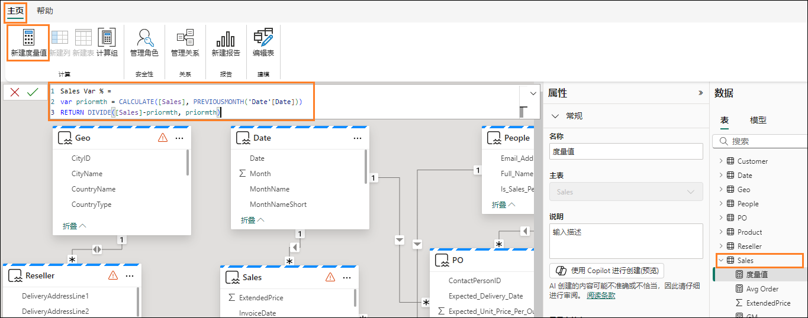

### 创建表视觉对象

我们将编辑 rpt_Sales_report 并新增一个表视觉对象。该表视觉对象将显示 2023 年 5 月按库存组名称划分的 Sales Variance %。

1. 导航到 **rpt_Sales_report**（在实验 7 中创建）。

2. 从顶部菜单中，选择**编辑**。

3. 从数据视图中，展开 **Product** 表。

4. 选择 **StockGroupName** 字段。表视觉对象创建完成。

5. 展开 **Sales** 表。

6. 选择 **Sales Var %**。请注意，表视觉对象中没有数据。这是因为 Sales Var % 需要具有月份名称才能进行计算。

    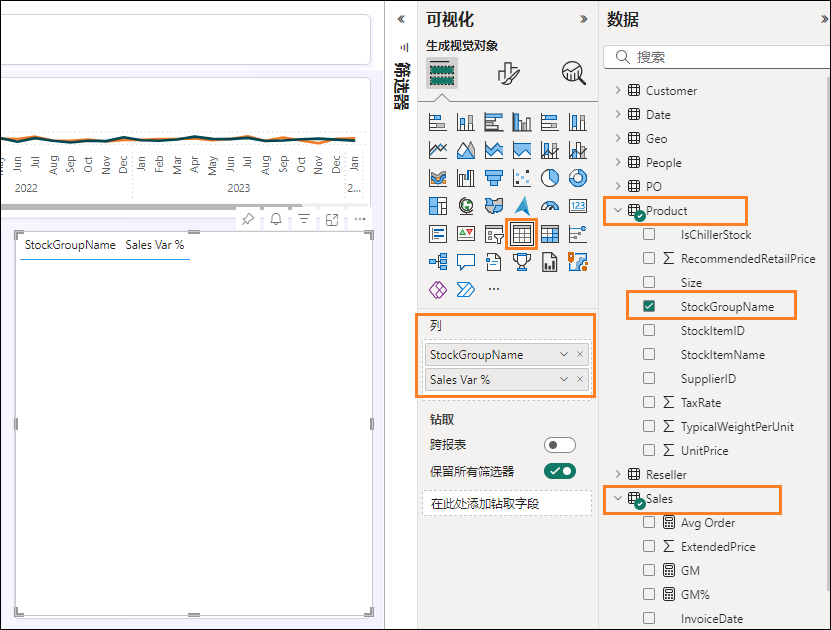

7. **展开筛选器**部分（如果它处于折叠状态）。

8. 高亮显示表视觉对象后，从**数据**部分展开** Date** 表。

9. 将 **Year** 字段拖放到此视觉对象的筛选器中。

10. 对于 **Year** 字段，从**筛选器类型**下拉菜单中选择**基本筛选**。

11. 选择 **2024**。

    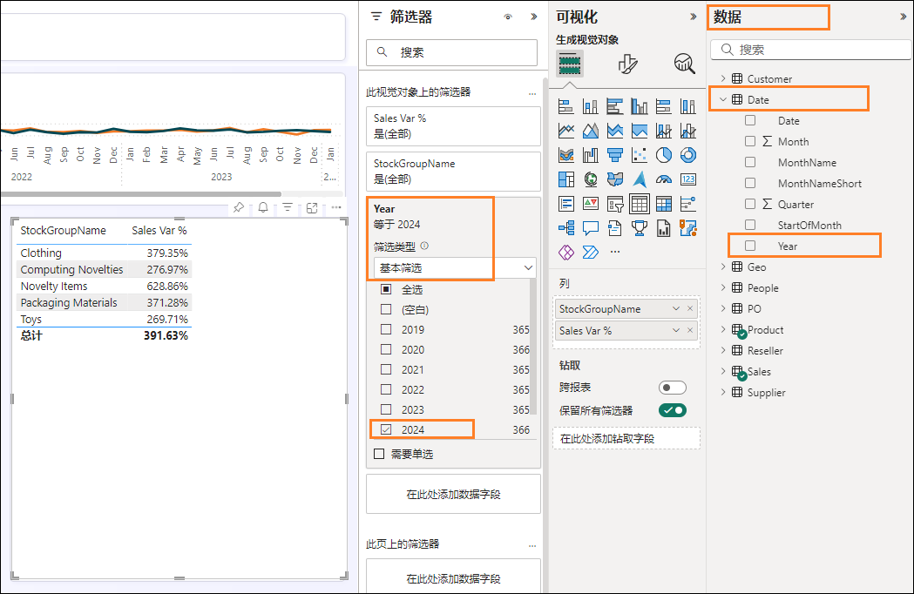

12. 将 **MonthNameShort** 字段拖放到此视觉对象部分的筛选器中。

13. 选择 **May**。

14. 选择**文件 -> 保存**，将更新保存到报表。

    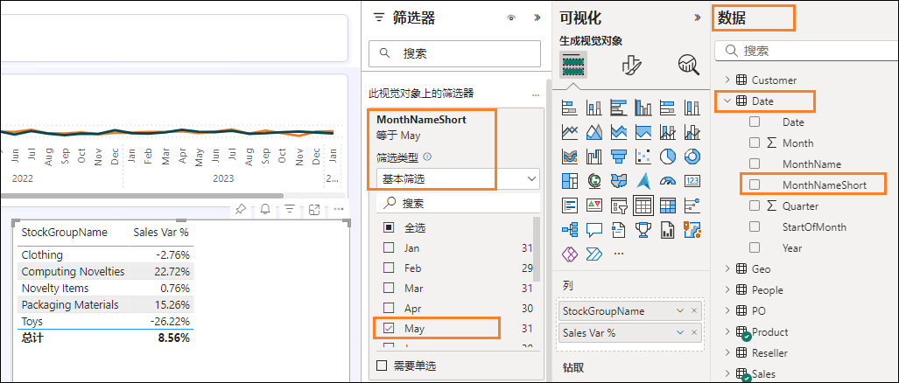

### 创建 Activator

我们将创建一个 Activator，如果任何 Stock_Group_Name 的 Sales Variance % 低于 -20%，该 Activator 将发送警报。请注意，Toys库存组名称的 Sales Variance % 为 -26.22%，达到了提醒标准。

1. 突出显示新创建的表视觉对象后，选择视觉对象左上角的**警铃**。

    

2. 设置提醒面板打开。

3. 告诉参与者应用了提醒**为每个 Stock_Group_Name**

4. 在行更改**时发出警报**下选择** Sales Var** %。

    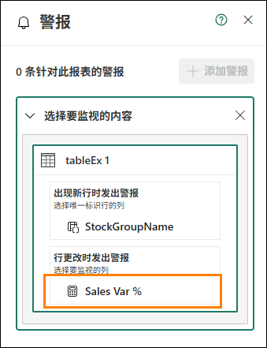

5. 选择**成为**单选按钮，并将**条件**更改为**小于**。

6. 将**阈值**设置为** -20%**。这会将触发器配置为当 Sales Variance % 低于 20% 时发出警报。

    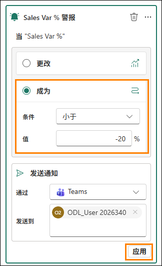

7. 讨论两个通知选项：电子邮件和 Teams。

8. 选择**应用**

9. 在底部的**我的 Power BI 激活器警报**旁边，选择**省略号 (…)**。

10. 显示不同的工作区保存位置。

    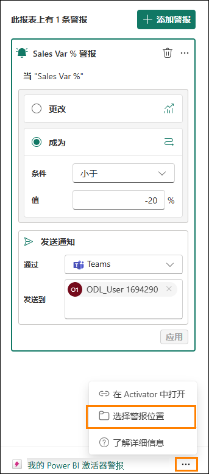

11. 创建警报后，您还可以在单击底部省略号后选择**在Activator中打开**。

    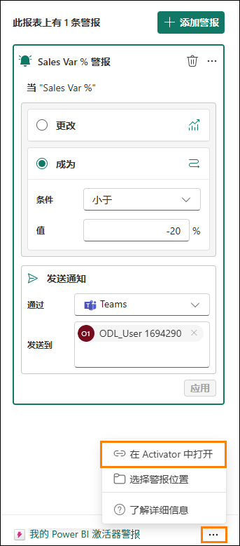

### Activator 概述

1. 系统会将您导航到 Activator **的设计**视图。

2. 带领与会者浏览**布局**，左侧是对象。请注意，这里有我们刚刚创建的一个**触发器**。
    还有**活动**部分。

3. 选择我们创建的触发器后，讨论**顶部菜单**中的选项。

    1. 主页

    1. 获取数据

    2. 使用 Power Automate 创建自定义操作

    2. 规则

    1. 删除

    2. 启动、停止、查看详细信息

    3. 向我发送测试操作

4. 讨论**定义**选项卡内包含的**监视器**和**条件**图表。

5. 向下滚动时，请注意在**操作**图表中，如果触发警报，会通知您。目前触发器每小时运行一次。因此，如果在下一个小时内数据发生变化并且满足条件，则会触发警报。

    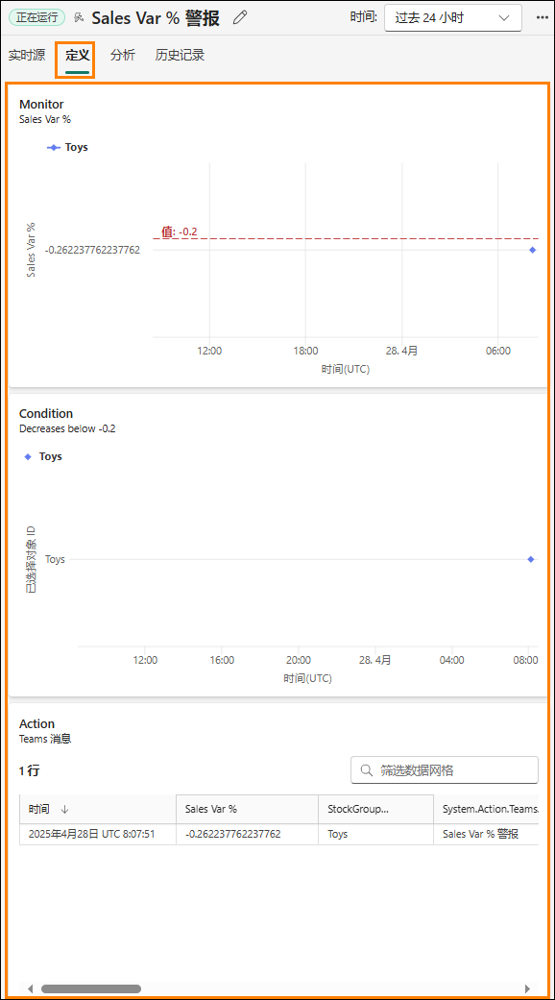

6. 在屏幕右侧，您将有配置**警报定义**的选项。这包括属性、任何筛选器或汇总、条件和操作。请注意，警报默认发送至实验室用户帐户。（目前不支持外部电子邮件地址）。

    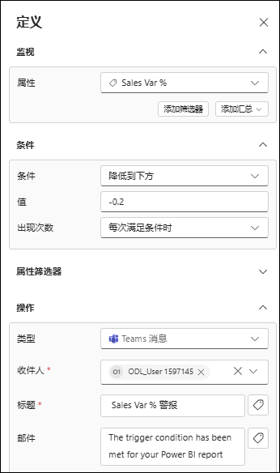

7. 请注意，您也可以在此处编辑操作详细信息。如果您选择“编辑操作”按钮，“编辑操作”窗口随即弹出。

    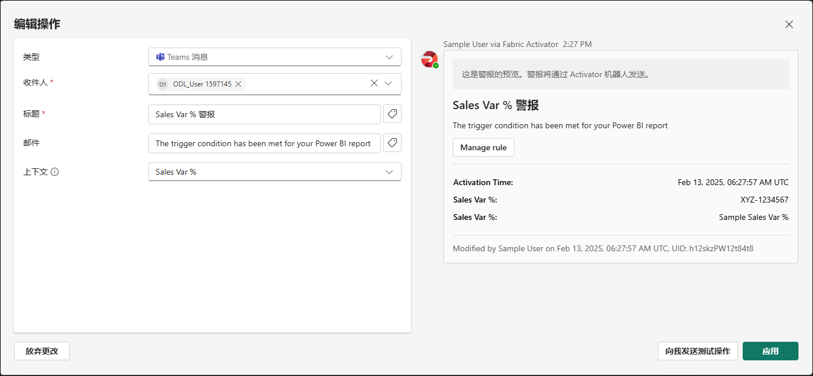

### 发送测试警报

注意：要查看警报，必须使用实验环境。

1. 选择 **Sales Var % 触发器**。

2. 从顶部菜单中，选择**向我发送测试操作**。这将向您的实验用户帐户发送测试警报。

3. 选择屏幕左上角的应用启动程序图标。

    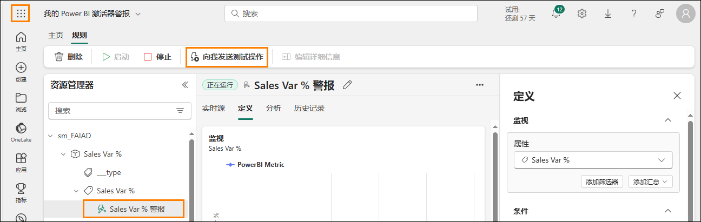

4. 选择 Teams。新的浏览器窗口随即打开。

    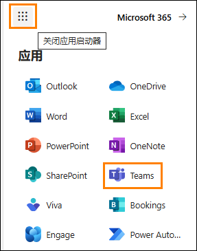

5. 您将收到一封警报邮件（可能需要几分钟时间）。请注意，这是一个测试操作。

    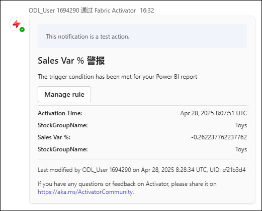

6. 当数据发生变化且满足触发条件时，将会发出警报。

    **注意：**为了演示此功能，我们筛选了一个月（2024 年 5 月）的视觉对象。我们可能会为当前月份动态设置一个触发器。

# **语义链接演示**

### 要求

您（讲师）需要完成实验室 1-7，然后再进入后续步骤。

建议讲师提前执行此演示中的笔记本，因为这两个笔记本可能需要 5-10 分钟才能完成。一种选择是在学生进行实验室 6/7 时执行笔记本。这是为了确保讲师可以向学生展示笔记本的结果。

### 应用场景

在此演示中，我们将探索**最佳做法分析器和内存分析器**。这些是强大的工具，可帮助我们评估语义模型的性能、内存使用情况和整体质量。这些工具不仅提供指标；它们还提供可行**见解**，通过突出显示您可能错过的优化机会来改进模型的设计和效率。

此功能的核心是**语义链接**，这是 Microsoft Fabric 中的一个功能，允许我们将语义模型直接与数据科学工具和经验连接起来。这意味着，我们可以使用笔记本分析、解析和**优化** sm_FAIAD 语义模型。

由于这种联系，我们可以直接针对工作区中的语义模型运行深入分析，例如最佳做法检查和内存分析。这使我们能够提高**性能**，**减**少内存占用情况，并最**终降低生产中项目的成本**。

为了演示此应用场景，我们会执行以下操作：

- 打开我们的 sm_FAIAD 语义模型并查找语义链接功能。

- 创建最佳做法分析器笔记本并查看见解。

- 创建内存分析器笔记本并查看见解。

### 最佳做法分析器

1. 导航到**您在实验室 2** 任**务 2** 中**创建的 Fabric** 工作区，该工作区名为 **FAIAD_ <username>**。

2. 打**开 sm_FAIAD** 语义模型。

    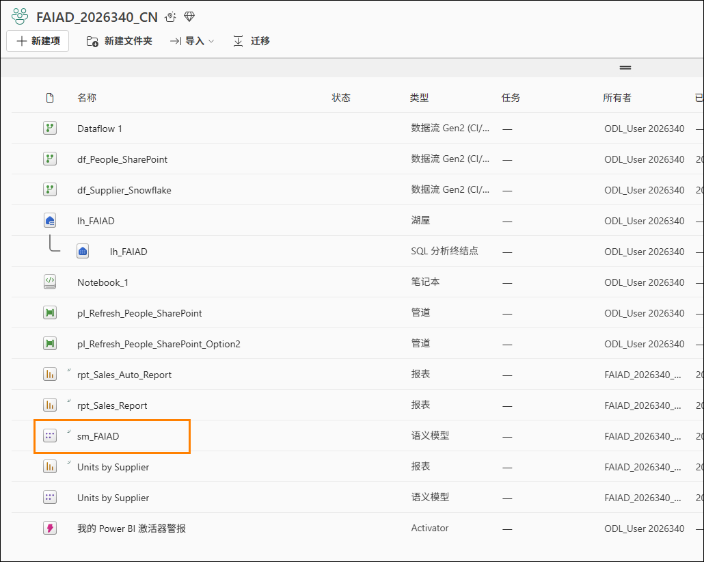

3. 在下一页上，选择打**开语义模型。**

    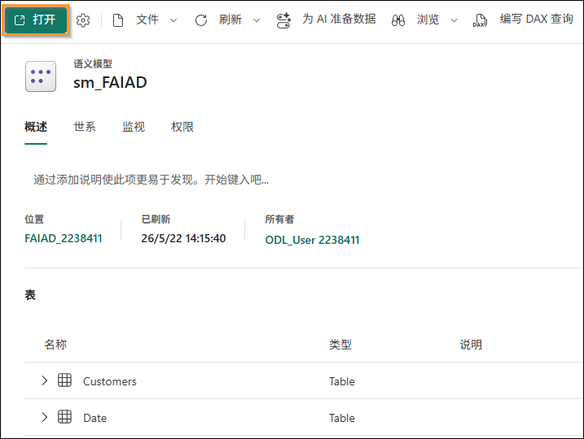

4. 请注意，在主**功能区**中，**模型运行状况**下有 3 个项目。

    1. **最佳做法分析器：**根据 Fabric 专家制定的规则，提供提示以改进语义模型的设计和性能。

    2. **内存分析器：**提供有关语义模型中对象的内存和存储统计信息。查看这些统计信息可以帮助您确定可能需要优化性能和减少内存的方面。

    3. **社区笔记本：**由 Power BI 社区创建的笔记本库，用于增强数据分析和报告。

    *注意：这些笔记本也可以在语义模型详细信息页面中找到。*

5. 单击**最佳做法分析器**。

    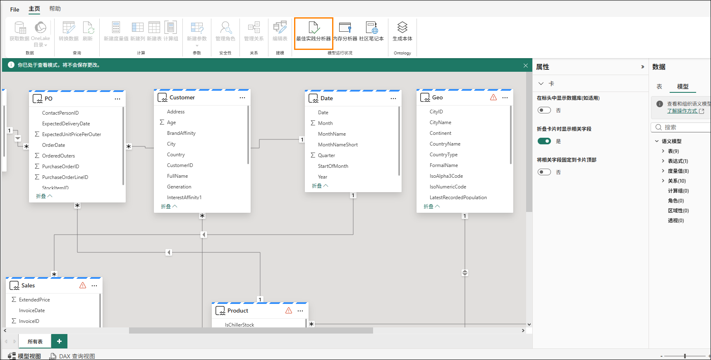

6. 将创建新的最佳做法分析器笔记本。系统会将您导航到笔记本。

7. 与学生一起了解在 Markdown 单元格中编写的详细信息。

8. 在主功能区中，选择全**部运行**。

    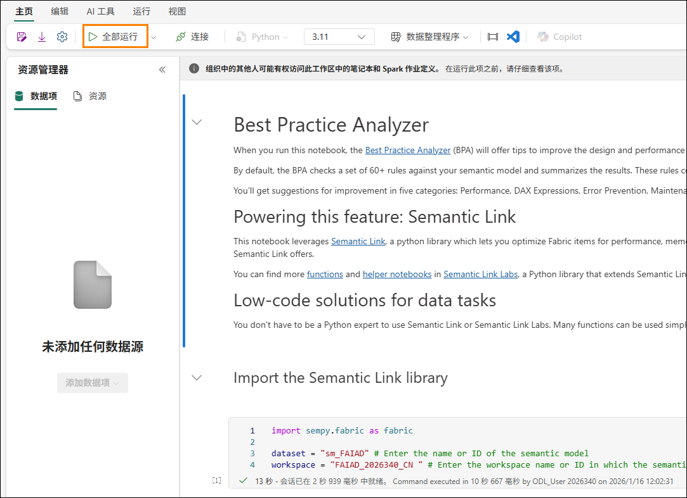

9. 笔记本完成运行后，请注意 **run_model_bpa** 函数的**结果。**

    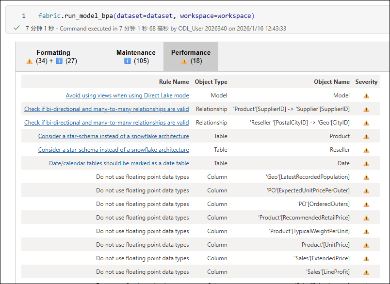

10. 本函数返回三类建议。格式**设置、维护和性能**。在给定类别中，您将看到两个不同的图标，用于表示建议的严重性。

    1. ℹ️ - 可改进模型的一项建议更改。

    2. ⚠️ - 此警告严重性指示列出的问题可能导致您的模型或使用该模型的报表出现问题。

11. 在格式**设置**下，**向下滚动并将鼠标悬停在规则名称“Format flag columns as Yes/No value strings**”上

12. 向学生说明将鼠标悬停在规则名称上会提供有关建议更改的更多详细信息。

    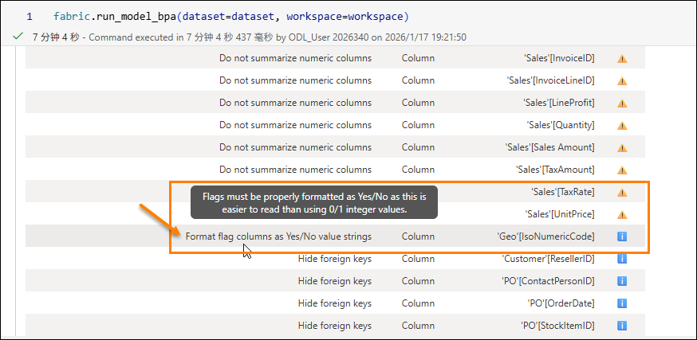

13. 在这种情况下，性能分析器建议我们将 **Geo** 表中的 **IsoNumericCode** 列的格式设置为是/否。这是一个很好的建议，因为以这种方式设置标志列的格式是对星型架构进行建模时的最佳做法。

14. 选择**维护**类别。

    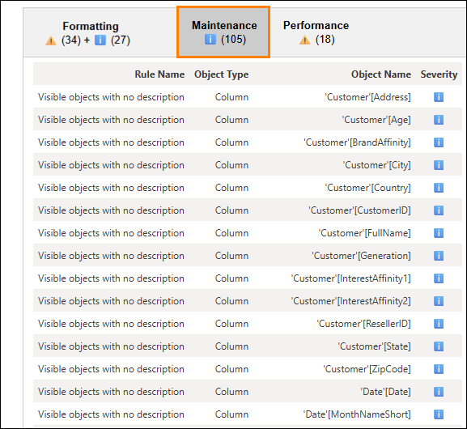

15. 学生应注意，大多数维护建议是向模型中的可见列添加描述。

16. 选择**性能**类别。

    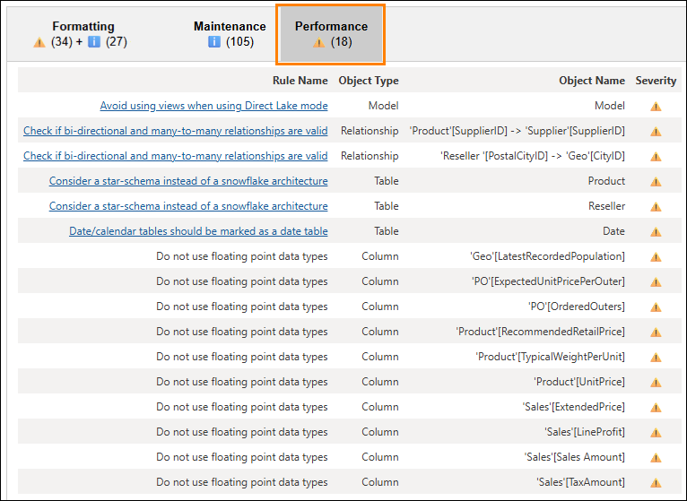

17. 将鼠标悬停在**规则名称“Avoid using views when using Direct Lake mode”**上。

18. 性能分析器提醒我们，Direct Lake 模式不支持视图。在本课程中，我们使用快捷方式快速连接到数据，然后使用视图转换数据。在某种程度上，这样做是为了详细了解我们在 Fabric 中拥有的许多数据连接方法。但是，如果我们想要将此建议应用于我们的模型，我们将需要使用另一种方法来引入和转换销售数据，例如数据流 Gen2。

    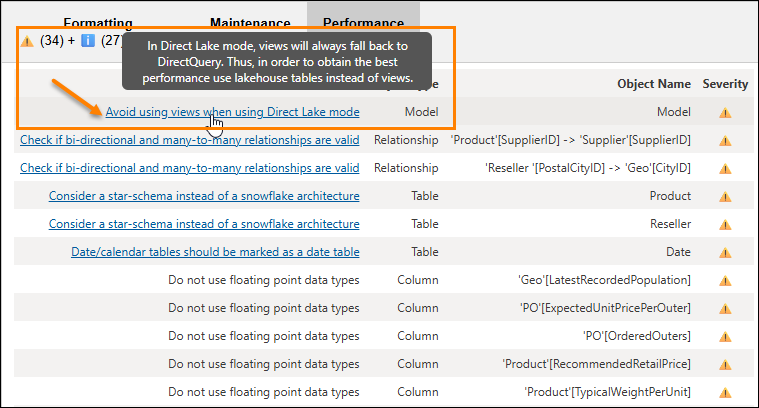

19. 如果时间允许，讲师可以演练其他建议。

### 内存分析器

1. 导航回您的 **sm_FAIAD** 语义模型的模型视图。

2. 在主功能区中，选择内存分析器。

    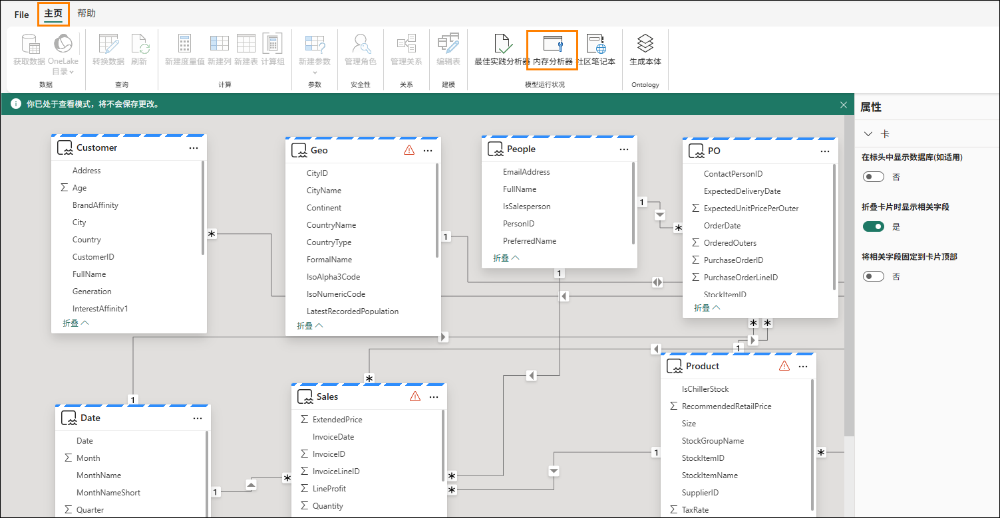

3. 将创建新的内存分析器笔记本。

4. 与学生一起了解在 Markdown 单元格中列出的详细信息。

5. 在**主功能区中，**选择**全部运行**。

    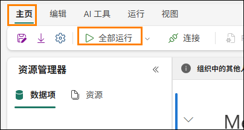

6. 完成笔记本后，查看生成的数据。有许多类别以不同的详细信息级别显示内存使用情况。

    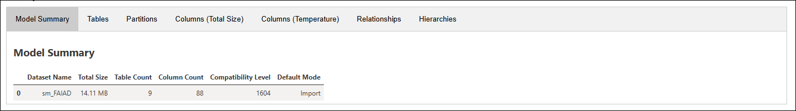

7. 学生应注意，我们可以使用所有这些信息来确定内存使用情况需要改进的方面。

8. **选择表**类别。

9. 将鼠标悬停在 **% DB 列**名称上。这样做将显示列描述。此列指示每个表的大小相对于语义模型的大小。虽然这不会自动告诉我们出了什么问题，但查看每个表使用的语义模型内存的百分比很有帮助。

    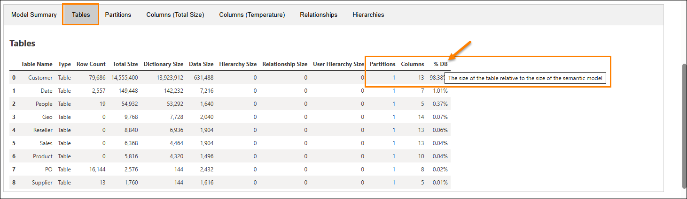

10. 如果时间允许，讲师可以演练其他类别来完成演示，并解释各种数据点。
