# Microsoft Fabric - Fabric Analyst in a Day - 实验室 1

## 目录

- 文档结构
- 应用场景/问题陈述
- Power BI Desktop 报表概览
  - 任务 1：在实验室环境中设置 Power BI Desktop
  - 任务 2：分析 Power BI Desktop 报表
  - 任务 3：查看 Power Queries
- 参考

# 文档结构

本实验室包含用户需要遵循的步骤以及可提供直观协助的关联屏幕截图。在每个屏幕截图中，以橙色框突出显示的部分指出了用户应注意的区域。

**注意：**由于正在进行的产品更新，某些屏幕截图可能已过时。

# 应用场景/问题陈述

Fabrikam, Inc. 是一家经营创意商品的批发分销商。作为批发商，Fabrikam 的客户主要是向个人售卖商品的公司。Fabrikam 向美国各地的零售客户销售产品，这些客户包括专卖店、超市、计算存储和景区商店。Fabrikam 还通过代表 Fabrikam 推广产品的代理商网络向其他批发商销售产品。虽然 Fabrikam 的所有客户目前都位于美国，但该公司正打算将业务拓展到其他国家/地区。

您是销售团队的数据分析师。您收集、清理和解释数据集以解决业务问题。还整理图表和图形等可视化对象，撰写报表，并呈现给组织中的决策者。

为了从数据中获得有价值的见解，您需要从多个系统中请求数据，对其进行清理并整理在一起。您从以下来源请求数据：

- **销售数据：**来自 ERP 系统，数据存储在 ADLS Gen2 数据库中。每天中午 12 点更新。

- **供应商数据：**来自不同的供应商，数据存储在 Snowflake 数据库中。每天凌晨 12 点更新。

- **客户数据：**来自 Customer Insights，数据存储在 Dataverse 中。此数据随时更新。

- **员工数据：**来自 HR 系统；作为导出文件存储在 SharePoint 文件夹中。每天早上
9 点更新。

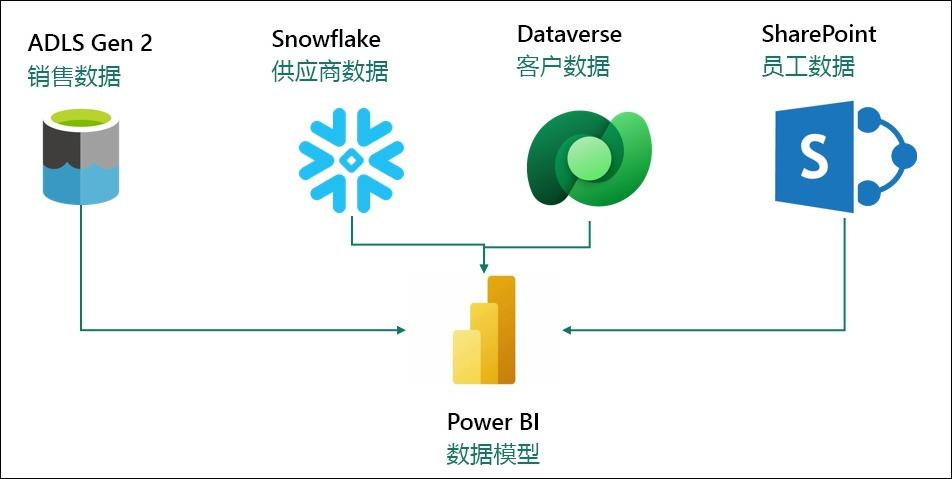

您正在 Power BI Premium 中生成一个语义模型，该模型从上述源系统中提取数据，以满足您的报告需求并为最终用户提供自助服务功能。您使用 Power Query 更新模型。

**您面临以下几个挑战：**

- 您每天要刷新数据集至少 3 次，以适应不同数据源的不同更新时间。

- 刷新需要很长时间，因为您每次都需要完全刷新，以捕获源系统中的所有更新。

- 用于提取数据的任何数据源中一旦发生任何错误，都将导致数据集刷新中断。很多时候，员工文件没有按时上传，导致数据集刷新中断。

- 由于数据量大且转换复杂，对数据模型进行任何更改都需要很长时间，因为 Power Query 需要很长时间刷新预览。

- 您需要 Windows PC 才能使用 Power BI Desktop，但企业标配的是 Mac。

您听说过 Microsoft Fabric，并决定尝试一下，看看它能否解决您的挑战。

### **Power BI Desktop 报表概览**

在开始使用 Fabric 之前，我们先来看看 Power BI Desktop 中的当前报表，以了解转换 和模型。

### 任务 1：在实验室环境中设置 Power BI Desktop

1. 打开 **FAIAD.pbix，**它位于您的实验室环境的**桌面**上的** Reports** 文件夹中。该文件将在
    Power BI Desktop 中打开。

    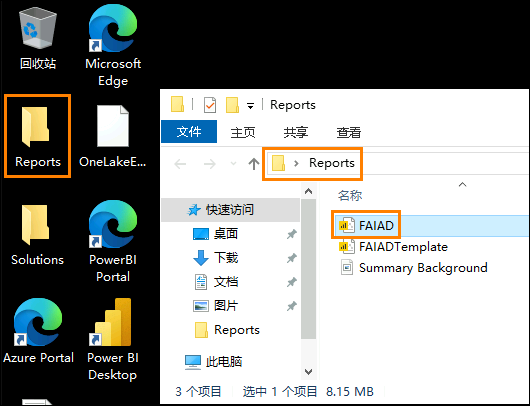

2. “输入你的电子邮件地址”对话框出现后，复制**用户名**并将其粘贴到对话框的**电子邮件**字段中，然后选择**继续**。

    - 电子邮件/用户名：<inject key="AzureAdUserEmail"></inject>

    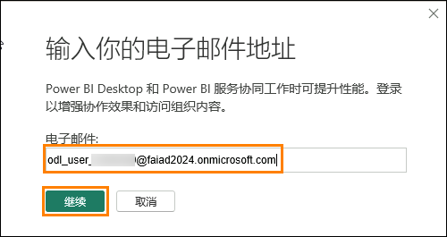

3. 在“登录到 Microsoft Azure”选项卡上，您将看到登录屏幕，输入以下电子邮件/用户名，然后单击**下一步**。

    - 电子邮件/用户名：<inject key="AzureAdUserEmail"></inject>

    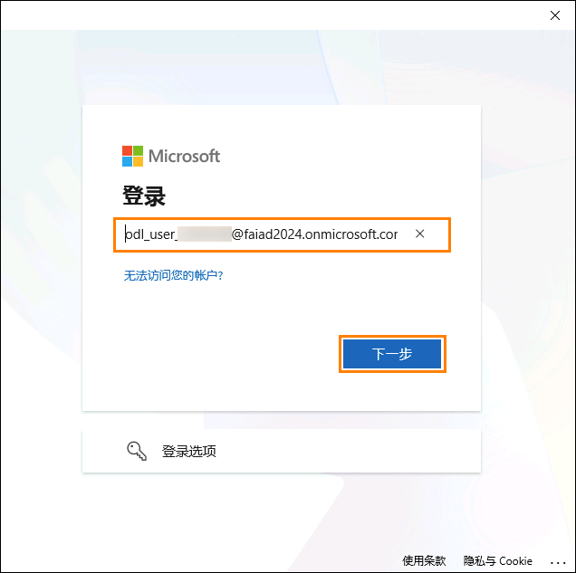

4. 现在，输入以下**临时登入密码**，然后单击**登录**。

    - 临时登入密码：<inject key="AzureAdUserPassword"></inject>

    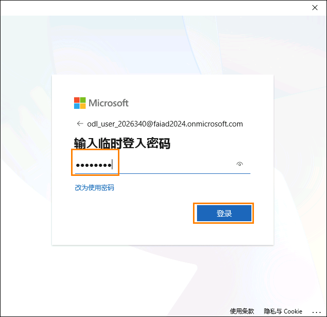

5. **保持登录到您的所有应用**对话框随即打开。选择**确定**。

    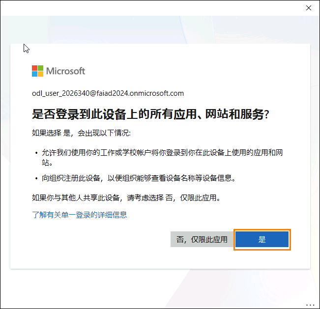

6. **您已完成所有设置！**对话框随即打开。选择完成。

    Power BI Desktop 现在将打开。

### 任务 2：分析 Power BI Desktop 报表

下面的报表分析 Fabrikam 的销售情况。页面左上角列出了 KPI。其余的视觉对象突出显示了按区域、产品组和经销商公司划分的一段时间内的销售情况。

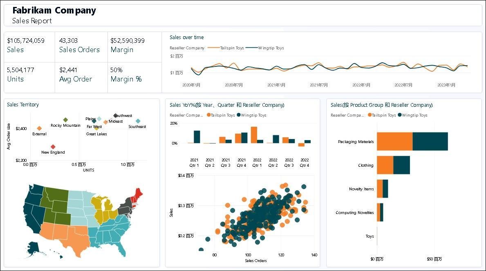

**注意：**在本次培训中，我们重点关注使用 Fabric 中提供的工具进行数据采集、转换和建模。我们不会专注于报表开发或导航。让我们花几分钟时间来理解该报表，然后继续执行后续步骤。

1. 我们按销售区域分析数据。选择**销售区域中的新英格兰**（散点图）视觉对象。从一段时间内的销售情况来看，经销商 Tailspin Toys 在新英格兰的销售额高于 Wingtip Toys。如果您查看销售额同比百分比柱形图，就会发现 Wingtip Toys 的销售额增长率一直很低，并且在去年逐季下降。在第三季度小幅反弹后，第四季度再次下跌。

    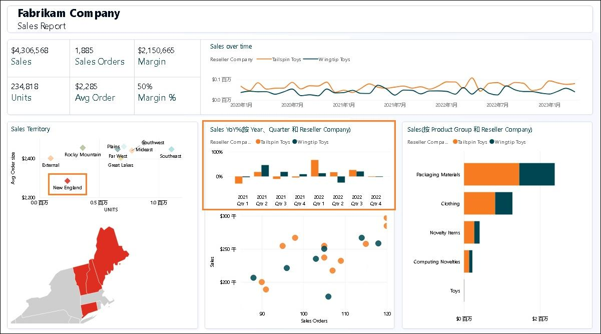

2. 我们将其与落基山脉地区的情况进行比较。选择**销售区域中的落基山脉**（散点图）视觉对象。请注意，在销售额同比百分比柱形图中，Wingtip Toys 前两个季度的销售额一直很低，但在 2023 年第四季度大幅增长。

    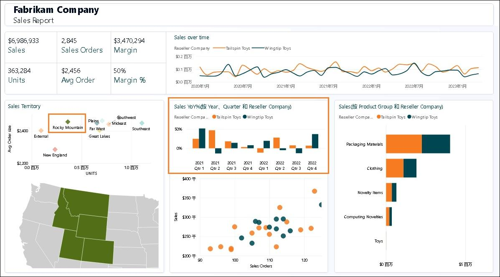

3. 选择**销售区域中的落基山脉**以删除筛选器。

4. 从屏幕底部中间的散点图视觉对象（按销售额划分的销售订单）中，选择右上角的离群值（第四象限）。请注意，利润率为 52%，高于 50% 的平均值。此外，2023 年最后两个季度的销售额同比增长。

    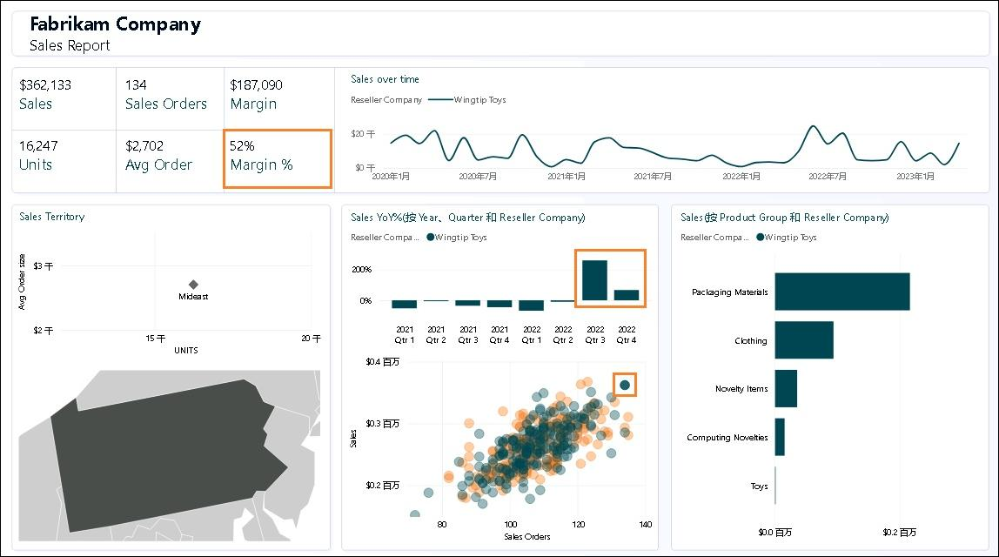

5. 在散点图视觉对象中选择离群值 Reseller 以**删除筛选器**。

6. 我们按产品组和经销商获取产品详细信息。从“按产品组和经销商公司划分的销售”条形图视觉对象中，右键单击 Tailspin Toys 的 Packaging Materials 栏的橙色部分，并从对话框中选择钻取 -> 产品详细信息。

    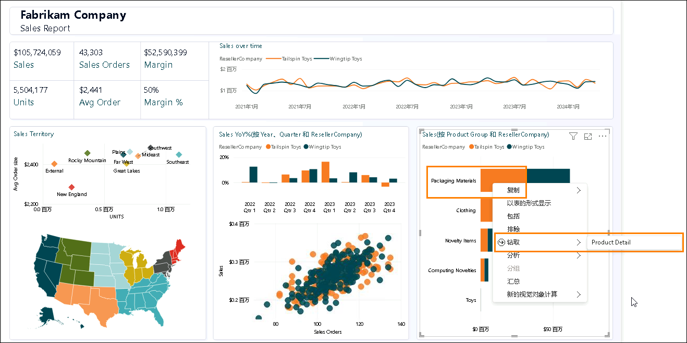

7. 您将导航到提供产品详细信息的页面。请注意，还有一些未来的订单。

8. 查看完此页面后，选择页面左上角的 **Ctrl + 后退箭头**可导航回销售报表。

    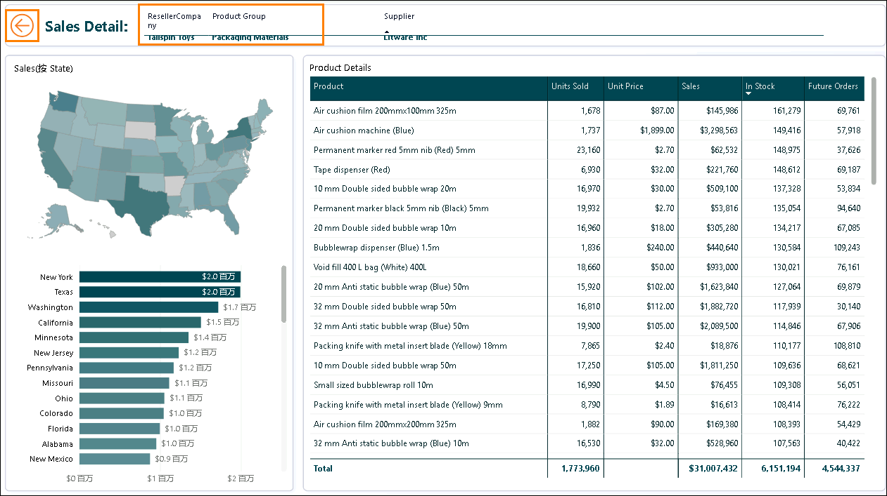

9. 您可以自行进一步分析该报表。准备好后，我们来看看模型视图。在左侧面板中，选择**模型视图图标**。

    

10. 请注意，有两个事实表：Sales 和 PO。

    a. Sales 数据的粒度是按 Date、Reseller、Product 和 People。Date、Reseller、Product 和 People 连接到 Sales。

    b. PO 数据的粒度是按 Date、Product 和 People。Date、Product 和 People 连接到 PO。

    c. 我们有按 Product 分类的 Supplier 数据。Supplier 连接到 Product。

    d. 我们有 Reseller 的按 Geo 划分的位置数据。Geo 连接到 Reseller。

    e. 我们有按 Reseller 划分的 Customer 信息。Customer 连接到 Reseller。

### 任务 3：查看 Power Queries

1. 让我们查看 Power Query 来了解数据源。从功能区中选择**主页 -> 转换数据**。

    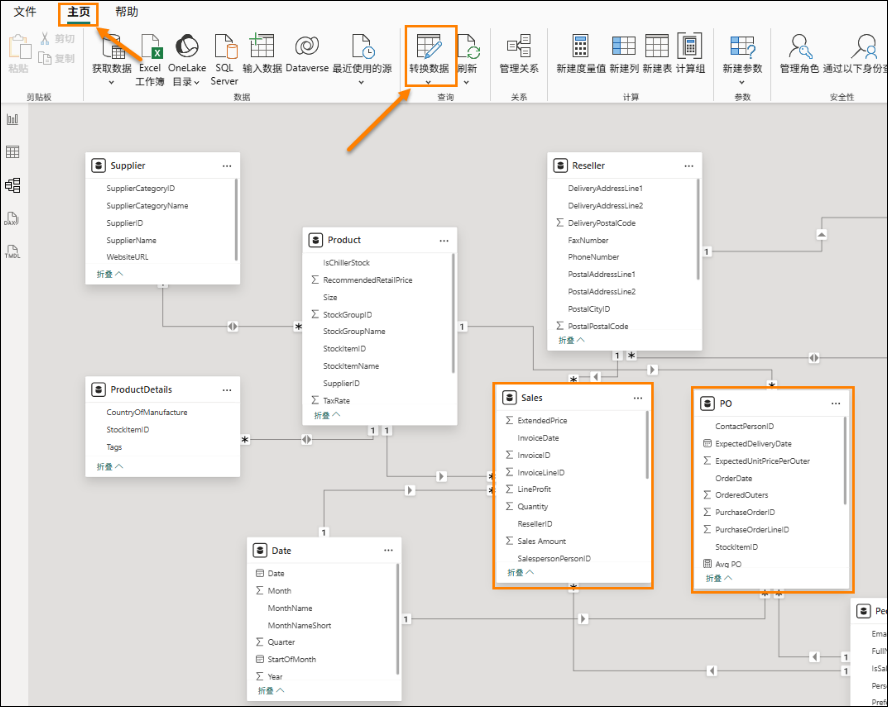

2. Power Query 窗口随即打开。从功能区中选择**主页 -> 数据源设置**。“数据源设置”对话框随即打开。滚动浏览列表时，您会注意到问题陈述中提到了四个数据源：

    - Snowflake

    - SharePoint

    - ADLS Gen2

    - Dataverse

3. 选择**关闭**以关闭“数据源设置”对话框。

    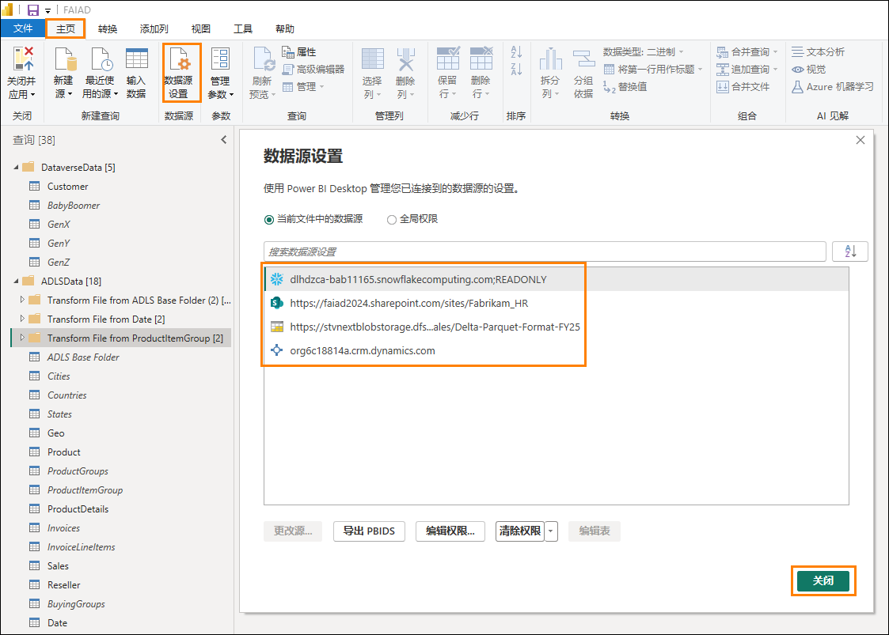

4. 在左侧的“查询”面板中，请注意查询是按数据源分组的。

5. 请注意，**DataverseData** 文件夹包含四个不同查询中可用的 Customer 数据：
    BabyBoomer、GenX、GenY 和 GenZ。追加这四个查询以创建 Customer 查询。

6. 单击“查询”窗口中的 Customer 查询。选择本查询后，您将需要重新输入 Dataverse 凭据。单击**编辑凭据**。

    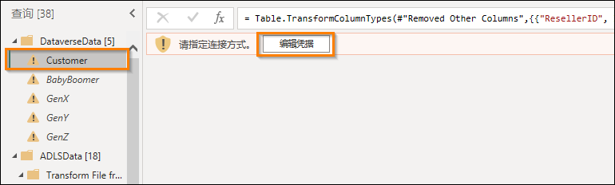

7. 单击**登录**以登录到您的帐户。

    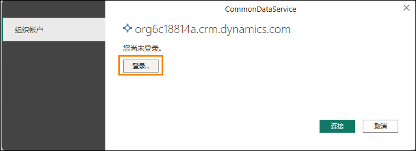

8. 您可以通过输入**用户名**和**密码**来输入 Dataverse 数据源的凭据。下面提供了凭据。完成后，选择**连接**。

    - 电子邮件/用户名：<inject key="AzureAdUserEmail"></inject>

    - 密码：<inject key="AzureAdUserPassword"></inject>

9. 单击“查询”窗口中的 **ADLS Base Folder** 查询。选择本查询后，您将需要输入凭据。
    单击**编辑凭据**。

    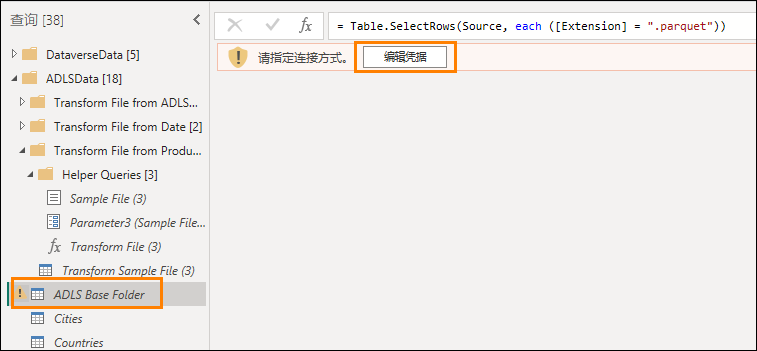

10. 对于 ADLS 数据源，选择**共享访问签名 (SAS)** 选项，然后输入下面提供的 **SAS 令牌**。然后，选择**连接**。

    - **SAS 令牌：** <inject key="Sas token"></inject>

    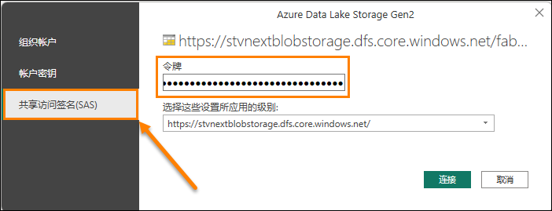

11. 请注意，**ADLSData** 文件夹具有多个维度：Geo、Product、Reseller 和 Date。还具有
    Sales 事实。

    - **Geo 维度**是通过合并 Cities、Countries 和 States 查询的数据而创建的。

    - **Product 维度**是通过合并 Product Groups 和 Product Item Group 查询中的数据而创建的。

    - **Reseller 维度**是使用 BuyingGroup 查询筛选而来的。

    - **Sales 事实**是通过合并 InvoiceLineItems 与 Invoice 查询而创建的。

12. 对于 Snowflake 数据源，选择“查询”窗口中的 **SupplierCategories** 查询。选择本查询后，系统将提示您输入凭据。单击**编辑凭据**。

    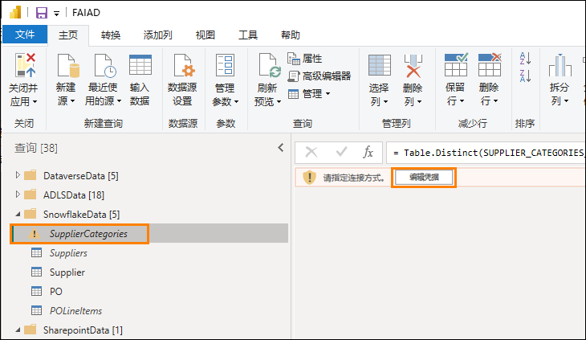

13. 输入下面提供的 **Snowflake 用户名**和** Snowflake 密码**。使用这些凭据将 Snowflake 下的所有表连接到 Snowflake，然后选择“连接”。

    - **Snowflake 用户名：** <inject key="SnowFlake Username" enableCopy="false" />

    - **Snowflake 密码：** <inject key="SnowFlake Password" enableCopy="false" />

    *注意：如果您在使用上述凭据连接到 Snowflake 时遇到任何问题，请使用下面提供的备份凭据。*

    - **Snowflake 用户名：**SNOWFLAKE_BACKUP

    - **Snowflake 密码：**8UpfRpExVDXv2AC1

14. 请注意，**SnowflakeData** 文件夹包含 Supplier 维度和 PO（订单/支出）事实。

    - **Supplier 维度**是通过合并 Suppliers 查询与 SupplierCategories 查询而创建的。

    - **PO 事实**是通过合并 PO 与 PO Line Items 查询而创建的。

15. 对于 SharePoint 数据源，选择“查询”窗口中的 **People** 查询。选择本查询后，系统将提示您输入凭据。单击**编辑凭据**。

    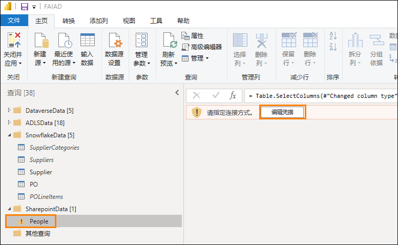

16. 选择 **Microsoft 帐户**选项，然后单击**登录**。输入下面提供的用户名和密码，然后选择
    **连接**。

    - **电子邮件/用户名：** <inject key="AzureAdUserEmail"></inject>

    - **密码：** <inject key="AzureAdUserPassword"></inject>

    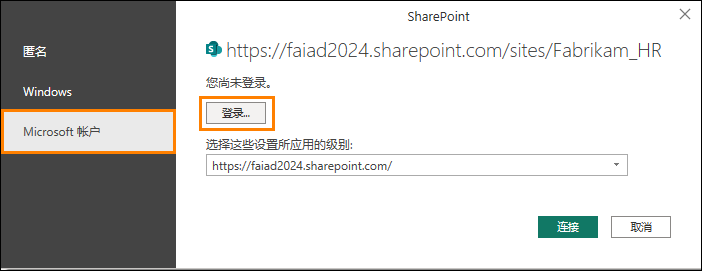

17. 请注意，**SharepointData** 文件夹具有 People 维度。

    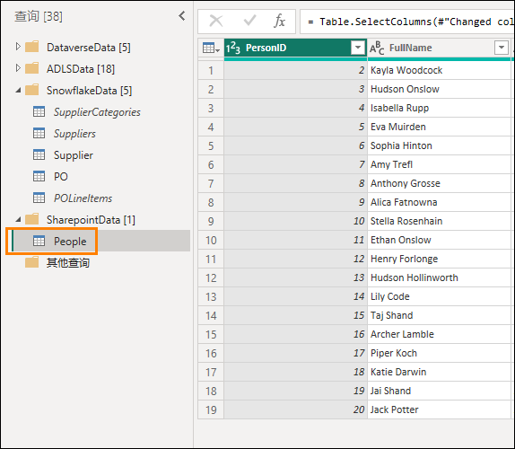

    现在我们知道我们正在处理的是什么了。在接下来的实验室中，我们将使用数据流 Gen2 创建一个类似的 Power Query 并使用湖屋进行建模。

# 参考

Fabric Analyst in a Day (FAIAD) 介绍了 Microsoft Fabric 中提供的一些主要功能。在服务菜单中，“帮助 (?)”部分包含指向一些优质资源的链接。

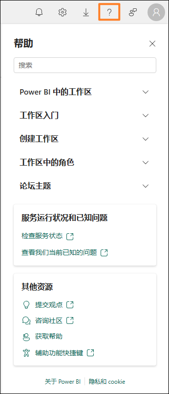

以下更多参考资源可帮助您进行与 Microsoft Fabric 相关的后续步骤。

- 请参阅博客文章以阅读完整的 [Microsoft Fabric GA 公告](https://aka.ms/Fabric-Hero-Blog-Ignite23)

- 通过[引导式教程](https://aka.ms/Fabric-GuidedTour)探索 Fabric

- 注册 [Microsoft Fabric 免费试用版](https://aka.ms/try-fabric)

- 访问 [Microsoft Fabric 网站](https://aka.ms/microsoft-fabric)

- 通过探索 [Fabric 学习模块](https://aka.ms/learn-fabric)学习新技能

- 探索 [Fabric 技术文档](https://aka.ms/fabric-docs)

- 阅读有关 [Fabric 入门的免费电子书](https://aka.ms/fabric-get-started-ebook)

- 加入 [Fabric 社区](https://aka.ms/fabric-community)发布问题、共享反馈并向他人学习

阅读更多深度 Fabric 体验公告博客：

- [Fabric 中的 Data Factory 体验博客](https://aka.ms/Fabric-Data-Factory-Blog)

- [Fabric 中的 Synapse Data Engineering 体验博客](https://aka.ms/Fabric-DE-Blog)

- [Fabric 中的 Synapse Data Science 体验博客](https://aka.ms/Fabric-DS-Blog)

- [Fabric 中的 Synapse Data Warehousing 体验博客](https://aka.ms/Fabric-DW-Blog)

- [Fabric 中的 Synapse Real-Time Analytics 体验博客](https://aka.ms/Fabric-RTA-Blog)

- [Power BI 公告博客](https://aka.ms/Fabric-PBI-Blog)

- [Fabric 中的 Data Activator 体验博客](https://aka.ms/Fabric-DA-Blog)

- [Fabric 中的管理和治理博客](https://aka.ms/Fabric-Admin-Gov-Blog)

- [Fabric 中的 OneLake 博客](https://aka.ms/Fabric-OneLake-Blog)

- [Dataverse 和 Microsoft Fabric 集成博客](https://aka.ms/Dataverse-Fabric-Blog)

© 2026 Microsoft Corporation。保留所有权利。

使用此演示/实验即表示您已同意以下条款：

本演示/实验室中的技术/功能由 Microsoft Corporation 出于获取反馈和提供学习体验的目的提供。只能将本演示/实验室用于评估这些技术特性和功能以及向 Microsoft 提供反馈。不得用于任何其他用途。不得对此演示/实验或其任何部分进行修改、复制、分发、传送、显示、执行、复制、公布、许可、转让、销售或基于以上内容创建衍生作品。

严禁将本演示/实验（或其任何部分）复制到任何其他服务器或位置以便进一步复制或再分发。

本演示/实验出于上述目的，在不涉及复杂设置或安装操作的模拟环境中提供特定软件技术/产品特性和功能，包括潜在的新功能和概念。本演示/实验中展示的技术/概念可能不是完整的功能，可能会以不同于最终版本的工作方式工作。我们也可能不会发布此类功能或概念的最终版本。在物理环境中使用此类特性和功能的体验可能也有所不同。

**反馈。**如您针对本演示/实验中所述的技术特性、功能和/或概念向 Microsoft 提供反馈，则意味着您向 Microsoft 无偿提供以任何方式、出于任何目的使用和分享您的反馈并将其商业化的权利。您同样无偿为第三方提供其产品、技术和服务使用或配合使用包含此反馈的 Microsoft 软件或服务的任何特定部分所需的任何专利权。如果根据某项许可的规定，Microsoft 由于在其软件或文档中包含了您的反馈需要向第三方授予该软件或文档的许可，请不要提供这样的反馈。这些权利在本协议终止后继续有效。

对于本演示/实验，Microsoft Corporation 不提供任何明示、暗示或法定的保证和条件，包括有关适销性、针对特定目的的适用性、所有权和不侵权的所有保证和条件。对于使用本演示/实验产生的结果或输出内容的准确性，或者出于任何目的包含本演示/实验中的信息的适用性，Microsoft 不做任何保证或陈述。

**免责声明**

本演示/实验仅包含 Microsoft Power BI 的部分新功能和增强功能。在产品的后续版本中，部分功能可能有所更改。在本演示/实验中，可了解部分新功能，但并非全部新功能。
