# Microsoft Fabric - Fabric Analyst in a Day - 实验室 3


## 目录

- 简介
- ADLS Gen2 的快捷方式
  - 任务 1：创建快捷方式
- 使用视觉对象查询转换数据
  - 任务 2：使用视觉对象查询创建 Geo 视图
  - 任务 3：使用视觉对象查询创建 Reseller 视图
- 参考

# 简介

在我们的应用场景中，销售数据来自 ERP 系统，存储在 ADLS Gen2 中。每天中午 12 点更新。我们需要将此数据转换并引入到湖屋中，并在我们的模型中使用此数据。

可通过多种方法引入此数据。

- **快捷方式**：这将创建指向数据的链接，我们可以使用视觉对象查询视图来转换它。我们将在本实验室中使用快捷方式。

- **笔记本**：这需要我们编写代码。这种方法适合开发人员。

- **数据流 Gen2**：您可能熟悉 Power Query 或数据流 Gen1。数据流 Gen2 顾名思义是数据流的新版本。它提供 Power Query/数据流 Gen1 的所有功能，并添加了将数据转换和引入到多个数据源的功能。我们将在下面几个实验室中进行介绍。

- **管道**：这是一个编排工具。可以编排活动来提取、转换和引入数据。我们将使用管道执行数据流 Gen2 活动，该活动又将执行提取、转换和引入。

我们将首先创建一个快捷方式，以将数据从 ADLS Gen2 数据源引入到湖屋中。引入后，我们将使用视觉对象查询视图来转换它。

在本实验室结束时，您将了解到：

- 如何在您的湖屋中创建快捷方式

- 如何使用视觉对象查询功能转换数据

# ADLS Gen2 的快捷方式

## 任务 1：创建快捷方式

快捷方式用于创建指向目标位置的链接。快捷方式提供对数据的访问权限，而无需将数据实际移动到湖屋中。这就像在 Windows 桌面中创建快捷方式一样。

1. 在屏幕顶部，选择 **lh_FAIAD** 选项卡以导航到湖屋。

1. 如果没有选项卡，您可以导航回工作区并从那里打开湖屋。

2. 在**资源管理器**面板中，选择表旁边的**省略号**。

3. 选择**新建快捷方式。**

    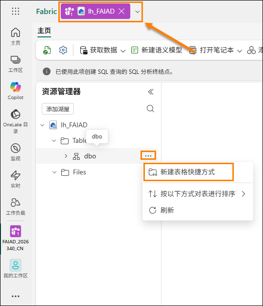

4. **新建快捷方式**对话框随即打开。在**外部源**下，选择**Azure Data Lake Storage Gen2**。

    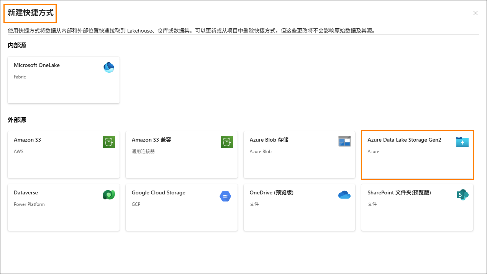

5. 选择**新建连接 (1)。**

6. 针对 **URL** 属性输入以下链接：https://stvnextblobstorage.dfs.core.windows.net/fabrikam-sales **(2)：**

7. 单击“连接”部分下的**创建新连接** (3)

8. 从“身份验证种类”下拉列表中选择**共享访问签名(SAS) (4)**。

9. 复制 SAS 令牌并将其粘贴到 SAS 令牌 (5) 字段中。

    - **SAS 令牌：** <inject key="Sas token"></inject>

10. 选择屏幕右下角的**下一步 (6)**。

    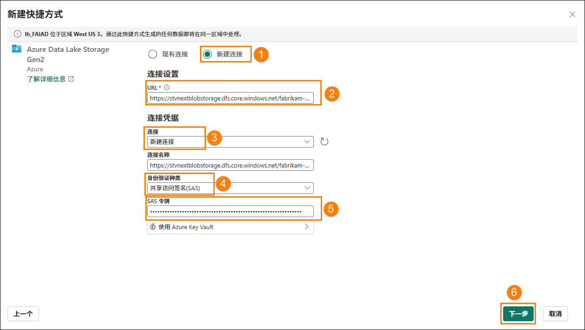

11. 您将连接到 ADLS Gen2，目录结构显示在左侧面板中。展开 **Delta-Parquet-Format-FY25 (1)**。

12. **选择**以下目录 **(2)**，然后单击**下一步 (3)**：

    1. Application.Cities

    2. Application.Countries

    3. Application.StateProvinces

    4. DateDim

    5. Sales.BuyingGroups

    6. Sales.Customers

    7. Sales.InvoiceLines

    8. Sales.Invoices

    9. Warehouse.StockGroups

    10. Warehouse.StockItemStockGroups

    11. Warehouse.StockItems

    **注意**：Sales.Invoice_May 是唯一未选择的目录。

    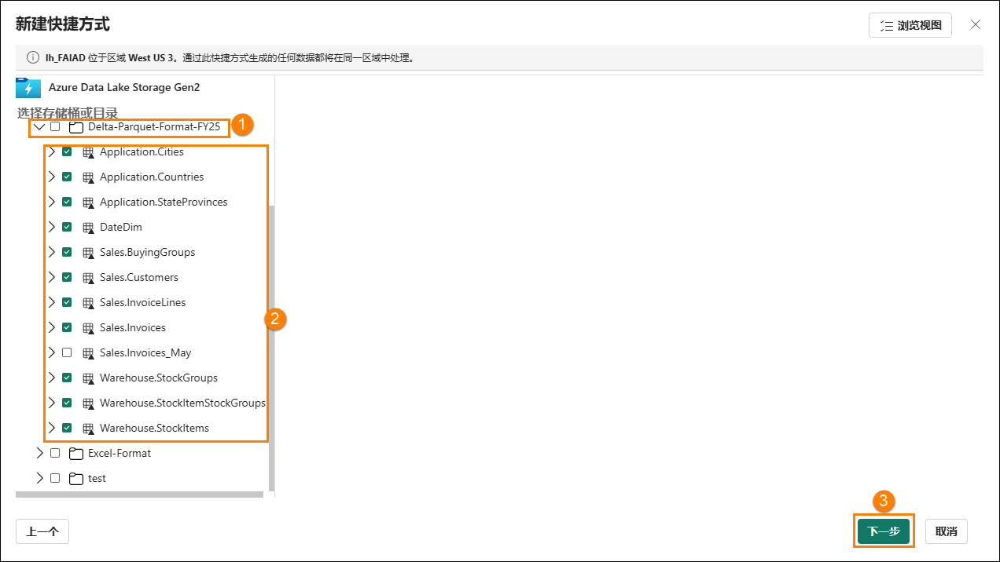

13. 系统会将您导航到下一个对话框，我们可以在其中编辑名称。针对 **Application.Cities**，
    在“操作”下选择**编辑图标 (1)**。

14. 将 **Application.Cities 重命名为 Cities (2)**。

15. 选中名称旁边的复选标记以保存更改 **(3)**。

    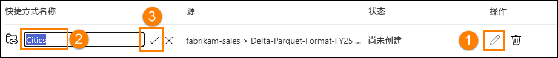

16. 同样，按如下所示重命名快捷方式名称：

    1. 将 Application.Countries 重命名为 **Countries**

    2. 将 Application.StateProvinces 重命名为 **States**

    3. 将 DateDim 重命名为 **Date**

    4. 将 Sales.BuyingGroups 重命名为 **BuyingGroups**

    5. 将 Sales.Customers 重命名为 **Customers**

    6. 将 Sales.InvoiceLines 重命名为 **InvoiceLineItems**

    7. 将 Sales.Invoices 重命名为 **Invoices**

    8. 将 Warehouse.StockGroups 重命名为 **ProductGroups**

    9. 将 Warehouse.StockItemStockGroups 重命名为 **ProductItemGroup**

    10. 将 Warehouse.StockItems 重命名为 **ProductItem**

    **注意**：仔细检查名称。拼写错误将导致实验室期间出现错误。

17. 选择**创建**以创建快捷方式。

    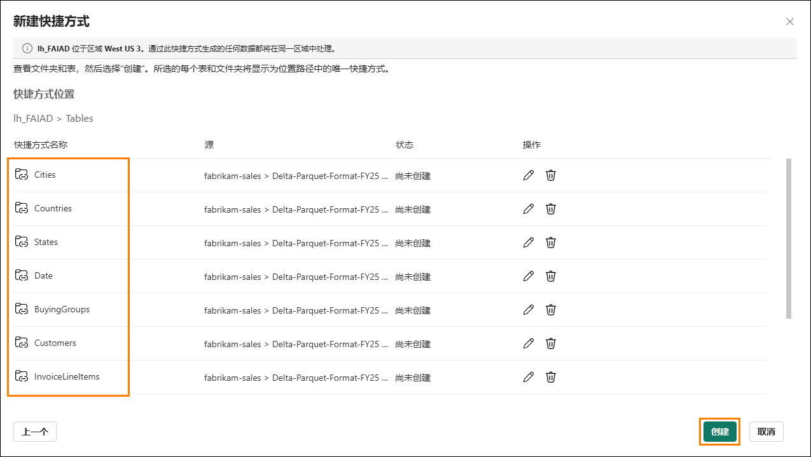

18. 请注意，所有快捷方式均以表的形式创建。选择 **BuyingGroups** 表，请注意，我们可以看到数据面板中的数据预览。

    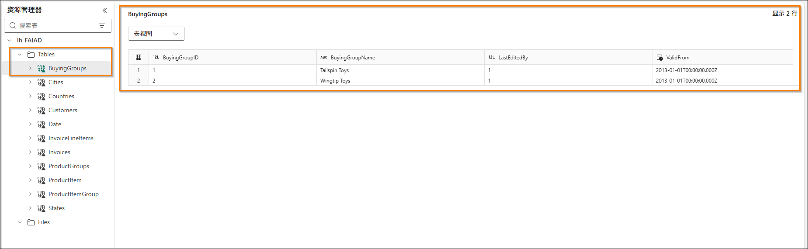

    下一步是转换数据，我们可以创建语义模型。我们将创建视图以转换数据。

# 使用视觉对象查询转换数据

## 任务 2：使用视觉对象查询创建 Geo 视图

1. 我们可以使用 SQL 终结点访问湖屋。这提供查询数据和创建视图的功能。在屏幕的**右上角**，选择**Lakehouse (1) -> SQL 分析终结点 (2)**。

    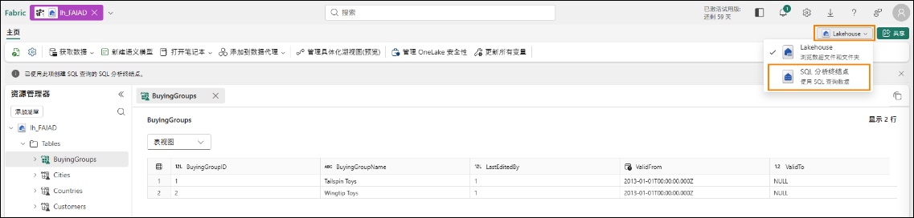

    系统会将您导航到 SQL 分析终结点。现在，您的顶部导航中有一个新项目，您可以通过选择该选项卡返回到湖屋。请注意，“资源管理器”面板已更改。现在，您可以创建视图、存储过程、查询等。我们将创建一个可提供低代码界面的视觉对象查询，例如 Power Query。我们将结果另存为视图。

    我们将首先创建 Geo 视图。我们需要合并 Cities、States 和 Countries 表的数据来创建 Geo 视图。

2. 从顶部菜单中，单击**新建 SQL 查询 (1)** 旁边的下拉列表，然后选择**新建视觉对象查询 (2)**。

    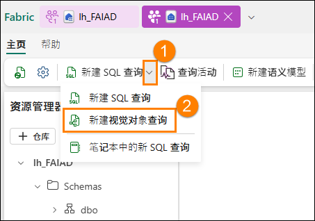

3. 若要生成查询，我们需要将表添加到“视觉对象查询”面板。单击 **Cities (1)** 表旁边的省略号，然后选择**插入画布 (2)**。

    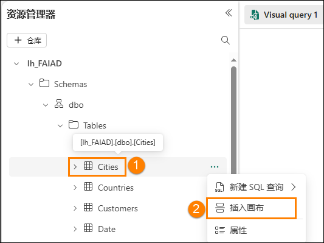

4. 针对 **States** 和 **Countries** 表重复相同步骤。

    接下来，我们需要合并这些查询。视觉对象查询编辑器附带使用 Power Query 编辑器的选项。让我们来使用此选项，由于 Power BI，我们对此很熟悉。

5. 从视觉对象查询编辑器的菜单中，选择**在弹出窗口中打开**图标（位于右侧）。系统会将您导航到 Power Query 编辑器。

    ***注意**：如果没有立即看到此图标，您可能需要向右滚动或重新打开视觉对象查询选项卡*

    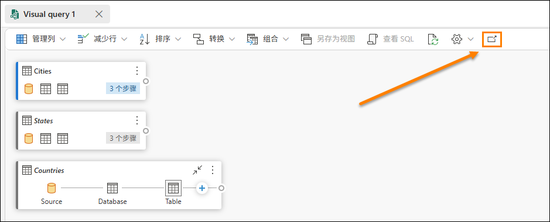

6. 选择 **Cities (1)** 查询后，从 Power Query 编辑器功能区中，选择**主页 (2) -> 合并 (3) -> 合并查询下拉列表 (4) -> 将查询合并为新查询 (5)**。“合并查询”对话框随即打开。

    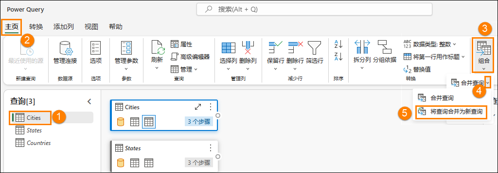

7. 在**用于合并的左表**中，选择**Cities**。

8. 在**用于合并的右表**中，选择**States**。

9. 从两个表中选择 **StateProvinceID** 列。我们将使用此列进行联接。

10. 选择**内部**作为**联接种类**。

11. 选择**确定**。

    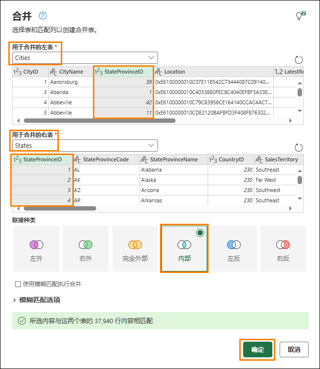

    请注意，已创建名为“**Merge**”的新查询。我们需要“States”中的几列。

12. 在**数据视图**（底部面板）中，单击**States** 列（右侧最后一列）旁边的**双箭头**。

13. 面板随即打开。确保仅选择以下列：

    1. StateProvinceCode

    2. StateProvinceName

    3. CountryID

    4. SalesTerritory

14. 选择**确定**。

    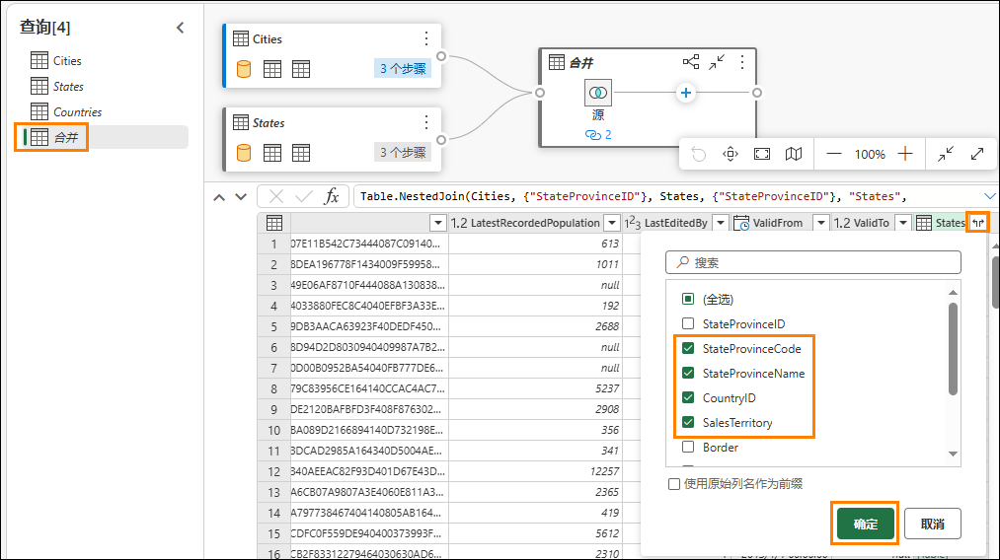

    现在，我们需要合并 Countries 查询。

15. 选择合并 **(1)** 查询后，选择**主页 (2) -> 组合 (3) -> 合并查询下拉列表 (4)** -> 合**并查询 (5)**。

    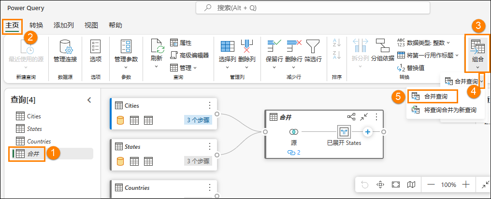

16. “合并 查询”对话框随即打开。在**用于合并的右表**中，选择**Countries**。

17. 从两个表中选择 **CountryID** 列。我们将使用此列进行联接。

18. 选择**内部**作为**联接种类**。

19. 选择**确定**。

    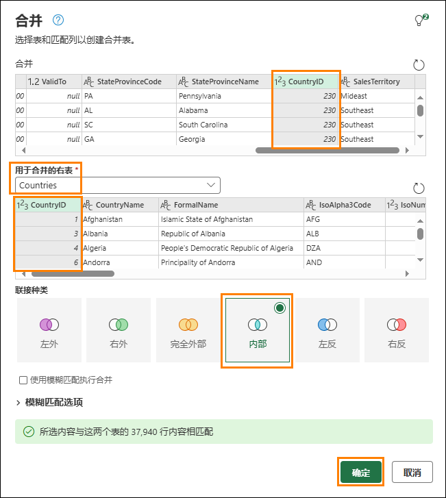

    我们需要“Countries”中的几列。

20. 在**数据视图**（底部面板）中，单击**Countries** 列旁边的**双箭头**。

21. 面板随即打开。确保仅选择以下列：

    1. CountryName

    2. FormalName

    3. IsoAlpha3Code

    4. IsoNumericCode

    5. CountryType

    6. Continent

    7. Region

    8. Subregion

22. 选择**确定**。

    **重要提示**：请确保向下滚动并全选步骤 21 中列出的 8 列。由于 UI 限制，下面的屏幕截图仅显示前 5 列。

    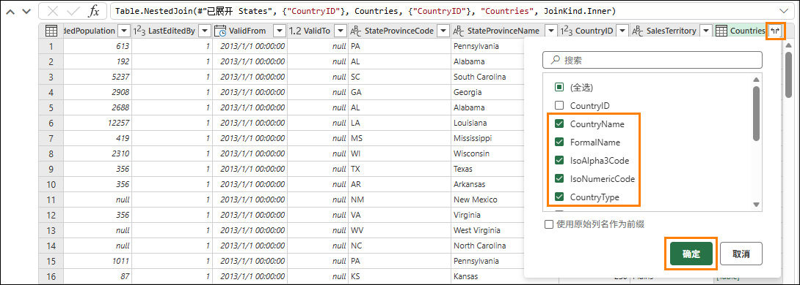

    我们不需要 **Merge** 表中的所有列。确保仅选择所需的列。

23. 选择**合并** (1) 查询后，从功能区中选择**主页 (2) -> 选择列 (3) -> 选择列 (4)**。

    **注意**：如果“选择列”选项不可见，您可以在“管理列”下找到它。

    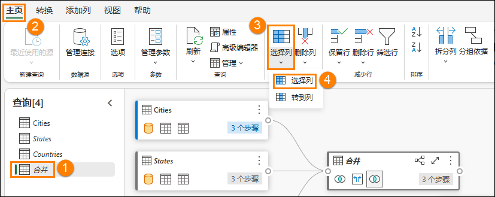

24. “选择列”对话框随即打开。**取消选中**以下列。

    1. StateProvinceID

    2. Location

    3. LastEditedBy

    4. ValidFrom

    5. ValidTo

    6. CountryID

25. 选择**确定**。

    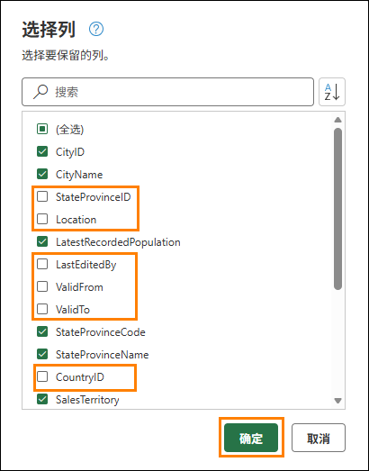

    请注意，该流程与 Power Query 类似，我们将所有步骤记录在右侧“已应用步骤”面板中和视觉对象视图中。让我们重命名 Merge 查询并选择“启用加载”，以便从此查询中加载数据。

26. **右键单击**查询（左侧）面板中的**Merge** 查询。选择**重命名**并将查询重命名为**Geo**。

27. **右键单击**查询（左侧）面板中的**Geo** 查询。选择**启用加载**以启用此查询。

28. 确保 Cities、States 和 Countries 查询**已禁用**。

29. 选择位于 Power Query 编辑器右下角的**保存**。

    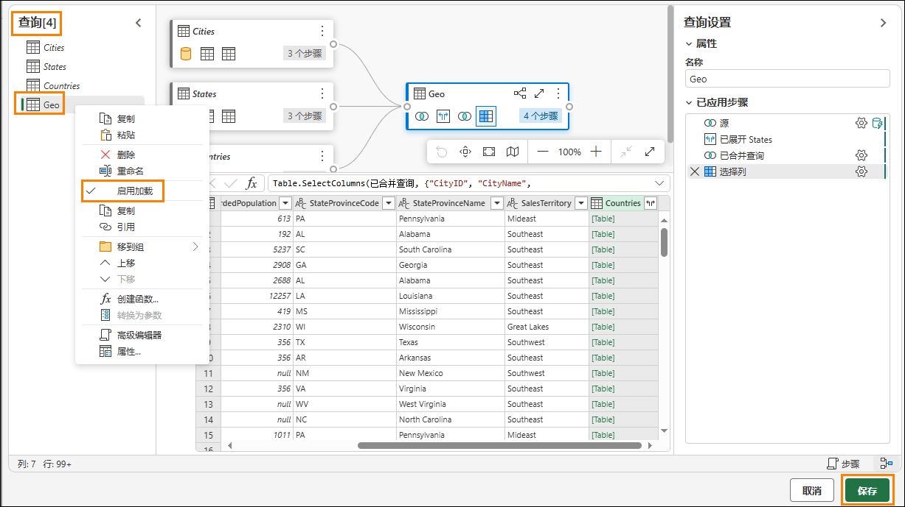

    系统会将我们导航到视觉对象查询编辑器。现在，让我们将此查询另存为视图。

    **注意**：我们使用 Power Query 编辑器执行的所有步骤也可以使用视觉对象查询编辑器执行。

30. 从“视觉对象查询编辑器”菜单中，选择**另存为视图**。

    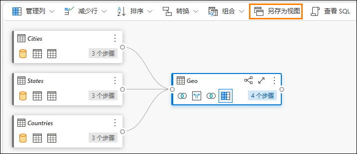

    “另存为视图”对话框随即打开。请注意，SQL 查询可用。如果您想要验证 SQL 代码，可以进行查看。

31. 输入 **Geo** 作为**视图名称**。

32. 选择**确定**以保存视图。

    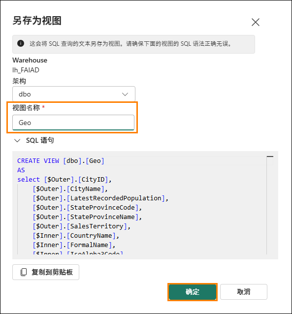

    保存视图后，您将收到警报。

33. 在资源管理器（左侧）面板中，展开**Views**。我们有新创建的 Geo 视图。

    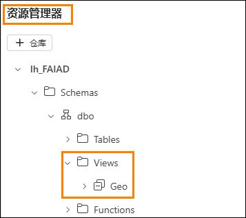

## 任务 3：使用视觉对象查询创建 Reseller 视图

1. 在 Fabric 中，我们还可以使用 SQL 查询创建视图。在顶部的功能区中，选择 **“新建 SQL 查询”**

    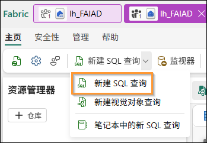

2. 在这里，我们可以编写 TSQL 来帮助创建我们所需的视图。

3. 将以下 SQL 查询粘贴到查询窗口中。这将创建三个视图：**Reseller**、**Sales** 和 **Product**。

    ```sql
    CREATE VIEW dbo.Reseller AS
    select [$Outer].[ResellerID] as [ResellerID],
        [$Outer].[ResellerName] as [ResellerName],
        [$Outer].[PostalCityID] as [PostalCityID],
        [$Outer].[PhoneNumber] as [PhoneNumber],
        [$Outer].[FaxNumber] as [FaxNumber],
        [$Outer].[WebsiteURL] as [WebsiteURL],
        [$Outer].[DeliveryAddressLine1] as [DeliveryAddressLine1],
        [$Outer].[DeliveryAddressLine2] as [DeliveryAddressLine2],
        [$Outer].[DeliveryPostalCode] as [DeliveryPostalCode],
        [$Outer].[PostalAddressLine1] as [PostalAddressLine1],
        [$Outer].[PostalAddressLine2] as [PostalAddressLine2],
        [$Outer].[PostalPostalCode] as [PostalPostalCode],
        [$Inner].[BuyingGroupName] as [ResellerCompany]
    from [lh_FAIAD].[dbo].[Customers] as [$Outer]
    inner join (
        select [_].[BuyingGroupID] as [BuyingGroupID2],
            [_].[BuyingGroupName] as [BuyingGroupName],
            [_].[LastEditedBy] as [LastEditedBy2],
            [_].[ValidFrom] as [ValidFrom2],
            [_].[ValidTo] as [ValidTo2]
        from [lh_FAIAD].[dbo].[BuyingGroups] as [_]
    ) as [$Inner] on ([$Outer].[BuyingGroupID] = [$Inner].[BuyingGroupID2] or [$Outer].[BuyingGroupID] is null and [$Inner].[BuyingGroupID2] is null)
    GO

    CREATE VIEW dbo.Sales AS
    select [$Outer].[InvoiceLineID] as [InvoiceLineID],
        [$Outer].[InvoiceID] as [InvoiceID],
        [$Outer].[StockItemID] as [StockItemID],
        [$Outer].[Quantity] as [Quantity],
        [$Outer].[UnitPrice] as [UnitPrice],
        [$Outer].[TaxRate] as [TaxRate],
        [$Outer].[TaxAmount] as [TaxAmount],
        [$Outer].[LineProfit] as [LineProfit],
        [$Outer].[ExtendedPrice] as [ExtendedPrice],
        [$Outer].[CustomerID] as [ResellerID],
        [$Outer].[SalespersonPersonID] as [SalespersonPersonID],
        [$Outer].[InvoiceDate] as [InvoiceDate],
        [$Outer].[t0_0] as [Sales Amount]
    from (
        select [_].[InvoiceLineID] as [InvoiceLineID],
            [_].[InvoiceID] as [InvoiceID],
            [_].[StockItemID] as [StockItemID],
            [_].[Quantity] as [Quantity],
            [_].[UnitPrice] as [UnitPrice],
            [_].[TaxRate] as [TaxRate],
            [_].[TaxAmount] as [TaxAmount],
            [_].[LineProfit] as [LineProfit],
            [_].[ExtendedPrice] as [ExtendedPrice],
            [_].[CustomerID] as [CustomerID],
            [_].[SalespersonPersonID] as [SalespersonPersonID],
            [_].[InvoiceDate] as [InvoiceDate],
            [_].[ExtendedPrice] - [_].[TaxAmount] as [t0_0]
        from (
            select [$Outer].[InvoiceLineID],
                [$Outer].[InvoiceID],
                [$Outer].[StockItemID],
                [$Outer].[Quantity],
                [$Outer].[UnitPrice],
                [$Outer].[TaxRate],
                [$Outer].[TaxAmount],
                [$Outer].[LineProfit],
                [$Outer].[ExtendedPrice],
                [$Inner].[CustomerID],
                [$Inner].[SalespersonPersonID],
                [$Inner].[InvoiceDate]
            from [lh_FAIAD].[dbo].[InvoiceLineItems] as [$Outer]
            inner join (
                select [_].[InvoiceID] as [InvoiceID2],
                    [_].[CustomerID] as [CustomerID],
                    [_].[BillToResellerID] as [BillToResellerID],
                    [_].[OrderID] as [OrderID],
                    [_].[DeliveryMethodID] as [DeliveryMethodID],
                    [_].[ContactPersonID] as [ContactPersonID],
                    [_].[AccountsPersonID] as [AccountsPersonID],
                    [_].[SalespersonPersonID] as [SalespersonPersonID],
                    [_].[PackedByPersonID] as [PackedByPersonID],
                    [_].[InvoiceDate] as [InvoiceDate],
                    [_].[CustomerPurchaseOrderNumber] as [CustomerPurchaseOrderNumber],
                    [_].[IsCreditNote] as [IsCreditNote],
                    [_].[CreditNoteReason] as [CreditNoteReason],
                    [_].[Comments] as [Comments],
                    [_].[DeliveryInstructions] as [DeliveryInstructions],
                    [_].[InternalComments] as [InternalComments],
                    [_].[TotalDryItems] as [TotalDryItems],
                    [_].[TotalChillerItems] as [TotalChillerItems],
                    [_].[DeliveryRun] as [DeliveryRun],
                    [_].[RunPosition] as [RunPosition],
                    [_].[ReturnedDeliveryData] as [ReturnedDeliveryData],
                    [_].[ConfirmedDeliveryTime] as [ConfirmedDeliveryTime],
                    [_].[ConfirmedReceivedBy] as [ConfirmedReceivedBy],
                    [_].[LastEditedBy] as [LastEditedBy2],
                    [_].[LastEditedWhen] as [LastEditedWhen2]
                from [lh_FAIAD].[dbo].[Invoices] as [_]
            ) as [$Inner] on ([$Outer].[InvoiceID] = [$Inner].[InvoiceID2] or [$Outer].[InvoiceID] is null and [$Inner].[InvoiceID2] is null)
        ) as [_]
    ) as [$Outer]
    where exists (
        select 1
        from (
            select [ResellerID]
            from [lh_FAIAD].[dbo].[Reseller] as [$Table]
        ) as [$Inner]
        where [$Outer].[CustomerID] = [$Inner].[ResellerID] or [$Outer].[CustomerID] is null and [$Inner].[ResellerID] is null
    )
    GO

    CREATE VIEW dbo.Product AS
    select [$Outer].[StockItemID],
        [$Outer].[StockItemName],
        [$Outer].[SupplierID],
        [$Outer].[Size],
        [$Outer].[IsChillerStock],
        [$Outer].[TaxRate],
        [$Outer].[UnitPrice],
        [$Outer].[RecommendedRetailPrice],
        [$Outer].[TypicalWeightPerUnit],
        [$Inner].[StockGroupName]
    from (
        select [$Outer].[StockItemID],
            [$Outer].[StockItemName],
            [$Outer].[SupplierID],
            [$Outer].[ColorID],
            [$Outer].[UnitPackageID],
            [$Outer].[OuterPackageID],
            [$Outer].[Brand],
            [$Outer].[Size],
            [$Outer].[LeadTimeDays],
            [$Outer].[QuantityPerOuter],
            [$Outer].[IsChillerStock],
            [$Outer].[Barcode],
            [$Outer].[TaxRate],
            [$Outer].[UnitPrice],
            [$Outer].[RecommendedRetailPrice],
            [$Outer].[TypicalWeightPerUnit],
            [$Outer].[MarketingComments],
            [$Outer].[InternalComments],
            [$Outer].[Photo],
            [$Outer].[CustomFields],
            [$Outer].[Tags],
            [$Outer].[SearchDetails],
            [$Outer].[LastEditedBy],
            [$Outer].[ValidFrom],
            [$Outer].[ValidTo],
            [$Inner].[StockGroupID]
        from [lh_FAIAD].[dbo].[ProductItem] as [$Outer]
        left outer join (
            select [_].[StockItemStockGroupID] as [StockItemStockGroupID],
                [_].[StockItemID] as [StockItemID2],
                [_].[StockGroupID] as [StockGroupID],
                [_].[LastEditedBy] as [LastEditedBy2],
                [_].[LastEditedWhen] as [LastEditedWhen]
            from [lh_FAIAD].[dbo].[ProductItemGroup] as [_]
        ) as [$Inner] on ([$Outer].[StockItemID] = [$Inner].[StockItemID2] or [$Outer].[StockItemID] is null and [$Inner].[StockItemID2] is null)
    ) as [$Outer]
    left outer join (
        select [_].[StockGroupID] as [StockGroupID2],
            [_].[StockGroupName] as [StockGroupName],
            [_].[LastEditedBy] as [LastEditedBy2],
            [_].[ValidFrom] as [ValidFrom2],
            [_].[ValidTo] as [ValidTo2]
        from [lh_FAIAD].[dbo].[ProductGroups] as [_]
    ) as [$Inner] on ([$Outer].[StockGroupID] = [$Inner].[StockGroupID2] or [$Outer].[StockGroupID] is null and [$Inner].[StockGroupID2] is null)
    GO
    ```
    
4. 粘贴完成后，选择 **“运行”**。

    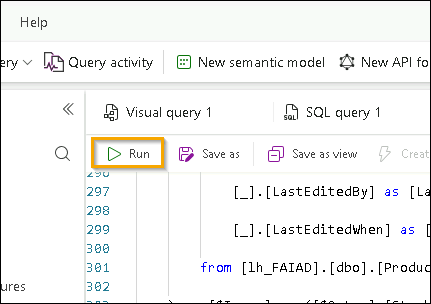

5. 在资源管理器（左侧）面板中，展开 **“视图”**。我们有新创建的视图，其中包含可供使用的数据。

    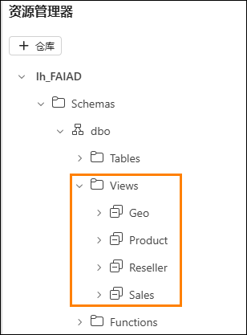

    我们已转换来自 ADLS Gen2 数据源的数据。在本实验室中，我们了解了如何创建快捷方式， 并探索了使用视觉对象查询视图转换数据的各种选项。

    在下一个实验室中，我们将了解如何使用数据流 Gen2 以及如何创建另一个湖屋的快捷方式。

# 参考

Fabric Analyst in a Day (FAIAD) 向您介绍了 Microsoft Fabric 中提供的一些主要功能。在服务菜单中，“帮助 (?)”部分包含指向一些优质资源的链接。

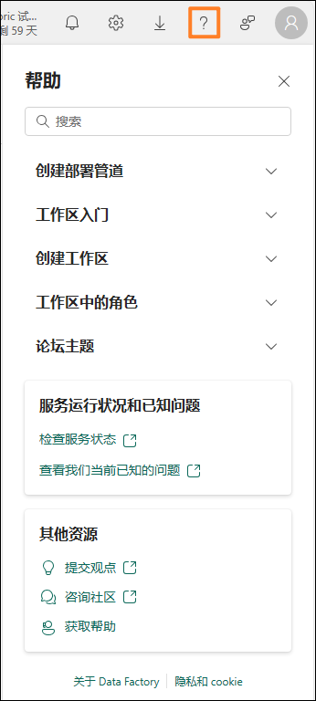

以下更多参考资源可帮助您进行与 Microsoft Fabric 相关的后续步骤。

- 请参阅博客文章以阅读完整的 [Microsoft Fabric GA 公告](https://aka.ms/Fabric-Hero-Blog-Ignite23)

- 通过[引导式教程](https://aka.ms/Fabric-GuidedTour)探索 Fabric

- 注册 [Microsoft Fabric 免费试用版](https://aka.ms/try-fabric)

- 访问 [Microsoft Fabric 网站](https://aka.ms/microsoft-fabric)

- 通过探索 [Fabric 学习模块](https://aka.ms/learn-fabric)学习新技能

- 探索 [Fabric 技术文档](https://aka.ms/fabric-docs)

- 阅读[有关 Fabric 入门指南的免费电子书](https://aka.ms/fabric-get-started-ebook)

- 加入 [Fabric 社区](https://aka.ms/fabric-community)发布问题、分享反馈并向他人学习

阅读更多深度 Fabric 体验公告博客：

- [Fabric 中的 Data Factory 体验博客](https://aka.ms/Fabric-Data-Factory-Blog)

- [Fabric 中的 Synapse Data Engineering 体验博客](https://aka.ms/Fabric-DE-Blog)

- [Fabric 中的 Synapse Data Science 体验博客](https://aka.ms/Fabric-DS-Blog)

- [Fabric 中的 Synapse Data Warehousing 体验博客](https://aka.ms/Fabric-DW-Blog)

- [Fabric 中的 Synapse Real-Time Analytics 体验博客](https://aka.ms/Fabric-RTA-Blog)

- [Power BI 公告博客](https://aka.ms/Fabric-PBI-Blog)

- [Fabric 中的 Data Activator 博客](https://aka.ms/Fabric-DA-Blog)

- [Fabric 中的管理和治理博客](https://aka.ms/Fabric-Admin-Gov-Blog)

- [Fabric 中的 OneLake 博客https://aka.ms/Fabric-OneLake-Blog](https://aka.ms/Fabric-OneLake-Blog)

- [Dataverse 和 Microsoft Fabric 集成博客](https://aka.ms/Dataverse-Fabric-Blog)

© 2026 Microsoft Corporation.保留所有权利。

使用此演示/实验即表示您已同意以下条款：

本演示/实验中的技术/功能由 Microsoft Corporation 出于获取反馈和提供学习体验的目的提供。只能将本演示/实验用于评估这些技术特性和功能以及向 Microsoft 提供反馈。不得用于任何其他用途。不得对此演示/实验或其任何部分进行修改、复制、分发、传送、显示、执行、复制、公布、许可、转让、销售或基于以上内容创建衍生作品。

严禁将本演示/实验（或其任何部分）复制到任何其他服务器或位置以便进一步复制或再分发。

本演示/实验出于上述目的，在不涉及复杂设置或安装操作的模拟环境中提供特定软件技术/产品特性和功能，包括潜在的新功能和概念。本演示/实验中展示的技术/概念可能不是完整的功能，可能会以不同于最终版本的工作方式工作。我们也可能不会发布此类功能或概念的最终版本。在物理环境中使用此类特性和功能的体验可能也有所不同。

**反馈。** 如您针对本演示/实验中所述的技术特性、功能和/或概念向 Microsoft 提供反馈，则意味着您向 Microsoft 无偿提供以任何方式、出于任何目的使用和分享您的反馈并将其商业化的权利。您同样无偿为第三方提供其产品、技术和服务使用或配合使用包含此反馈的 Microsoft 软件或服务的任何特定部分所需的任何专利权。如果根据某项许可的规定，Microsoft 由于在其软件或文档中包含了您的反馈需要向第三方授予该软件或文档的许可，请不要提供这样的反馈。这些权利在本协议终止后继续有效。

对于本演示/实验，Microsoft Corporation 不提供任何明示、暗示或法定的保证和条件，包括有关适销性、针对特定目的的适用性、所有权和不侵权的所有保证和条件。对于使用本演示/实验产生的结果或输出内容的准确性，或者出于任何目的包含本演示/实验中的信息的适用性，Microsoft 不做任何保证或陈述。

**免责声明**

本演示/实验仅包含 Microsoft Power BI 的部分新功能和增强功能。在产品的后续版本中，部分功能可能有所更改。在本演示/实验中，可了解部分新功能，但并非全部新功能。
