# Microsoft Fabric - Fabric Analyst in a Day - 实验室 0

## 目录

- 简介
- 数据流 Gen2
  - 任务 1：将 SharePoint 查询复制到数据流
  - 任务 2：创建 SharePoint 连接
  - 任务 3：为 People 查询配置数据目标
  - 任务 4：发布并重命名 SharePoint 数据流
  - 任务 5：将 Snowflake 查询复制到数据流
  - 任务 6：创建与 Snowflake 的连接
  - 任务 7：为 Supplier 和 PO 查询配置数据目标
  - 任务 8：重命名并发布 Snowflake 数据流
- 内部湖屋的快捷方式
  - 任务 9：如何创建 Dataverse 的快捷方式
  - 任务 10：创建湖屋的快捷方式
- 参考

# 简介

在我们的应用场景中，供应商数据位于 Snowflake 中，客户数据位于 Dataverse 中，员工数据位于 SharePoint 中。为了最大限度地减少数据流的数据刷新次数，我们将为 Snowflake 和 SharePoint 数据源创建单独的数据流。

**注意：**单个数据流中支持多个数据源。

IT 团队已建立与 Dataverse 的链接并已应用必要的数据转换，在 Power BI Desktop 文件中镜像这些数据转换。他们已在管理员工作区中将此数据引入到湖屋中，并向我们提供了对表的访问权限。我们将针对 IT 团队创建的湖屋创建表的快捷方式。

在本实验室结束时，您将了解到：

- 如何使用数据流 Gen2 连接到 SharePoint 并将数据引入到湖屋中

- 如何使用数据流 Gen2 连接到 Snowflake 并将数据引入到湖屋中

- 如何从共享的湖屋引入数据

# 数据流 Gen2

### 任务 1：将 SharePoint 查询复制到数据流

1. 让我们导航回您在实验室 2 任务 8 中创建的 Fabric 工作区 **FAIAD_<username> (1)**。

2. 选择左上角提供的 + **新建项目 (2)** 选项。

3. **在获取数据 (3)** 部分下，选择**数据流 Gen2 (4)。**

    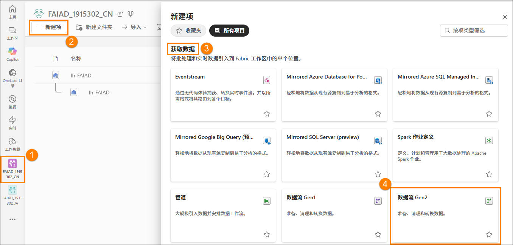

    保留默认名称。然后，选择**创建**。系统会将您导航到**数据流页面**。数据流 Gen2 界面类似于 Power BI Desktop 中的 Power Query。我们可以将 Power BI Desktop 中的查询复制到数据流 Gen2 中。让我们试一下此方法。

4. 如果您尚未打开 **FAIAD.pbix**，请打开它。它位于您的实验室环境的桌面的** Reports** 文件夹中。

5. 从功能区中选择**主页 -> 转换数据**。Power Query 窗口随即打开。您在之前的实验室中注意到，左侧面板中的查询是按数据源组织的。

6. 从左侧面板的 SharepointData 文件夹下，**选择 People** 查询。

7. **右键单击**并选择**复制**。

    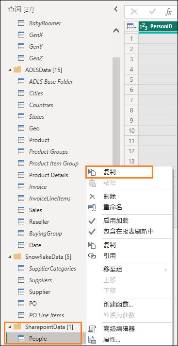

8. 导航回到浏览器中的**数据流屏幕**。

9. 在**数据流窗格**中，输入** Ctrl+V**（目前不支持右键单击“粘贴”）。如果您使用的是 MAC 设备，请使用 Cmd+V 进行粘贴。

    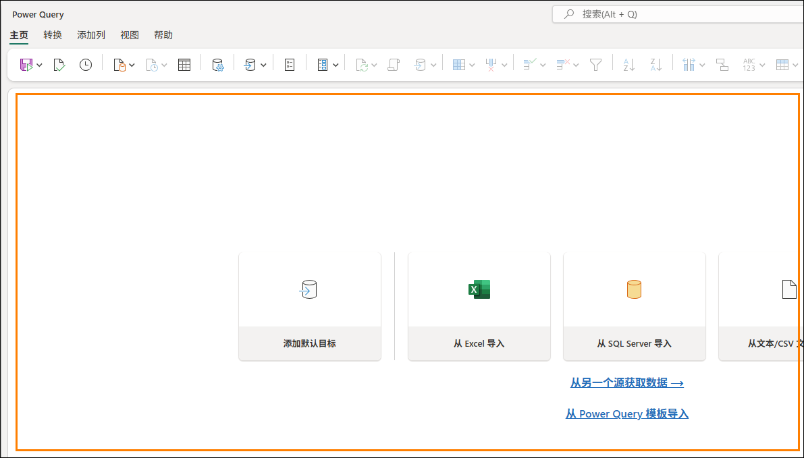

    **注意：**如果您在实验室环境中工作，请选择屏幕右上角的省略号。使用滑块**启用 VM 本机剪贴板**。在对话框中选择“确定”。粘贴查询后，您可以禁用此选项。

    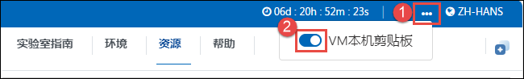

    请注意，查询已粘贴并在左侧面板中可用。由于我们没有为 SharePoint 创建连接，因此您将看到一条警告消息，要求您配置连接。

### 任务 2：创建 SharePoint 连接

1. 选择**配置连接**。

    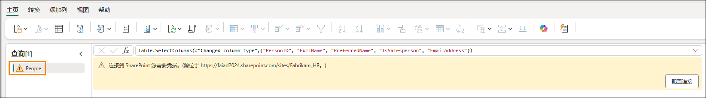

2. “连接到数据源”对话框随即打开。在**连接**下拉列表中，确保选择**创建新连接**。

3. **身份验证种类**应为**组织帐户**。

4. 选择**连接**。

    **注意：**您将使用您的凭据登录。它们将与以下屏幕截图不同。

    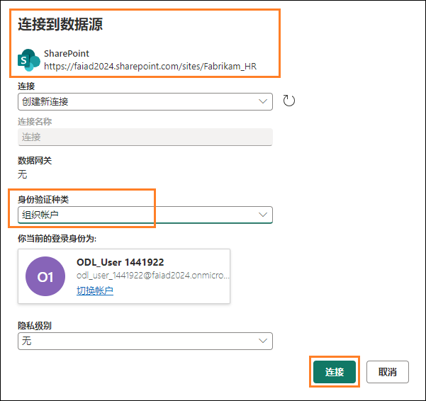

### 任务 3：为 People 查询配置数据目标

连接已建立，您可以在预览面板中查看数据。请随意浏览查询的“应用的步骤”。现在，我们需要将 People 数据引入到湖屋中。

1. 选择 **People (1)** 查询。

2. 从功能区中，选择**主页 -> 查询 (2) ->** **添加数据目标 (3) ->** **湖屋 (4)**。

    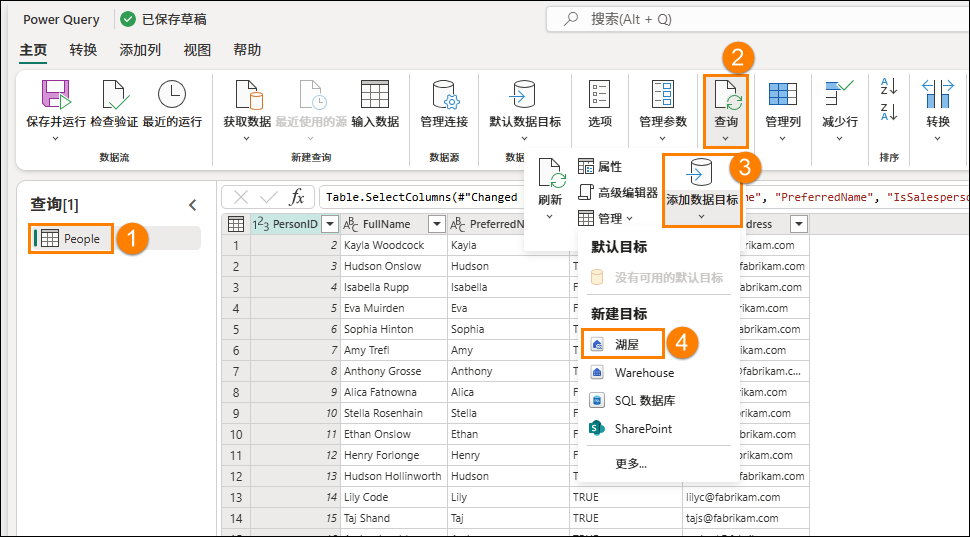

3. “连接到数据目标”对话框随即打开。我们需要创建一个与湖屋的新连接。在连接下拉列表中选择**创建新连接**并将**身份验证种类**设置为**组织帐户**后，选择**下一步**。

    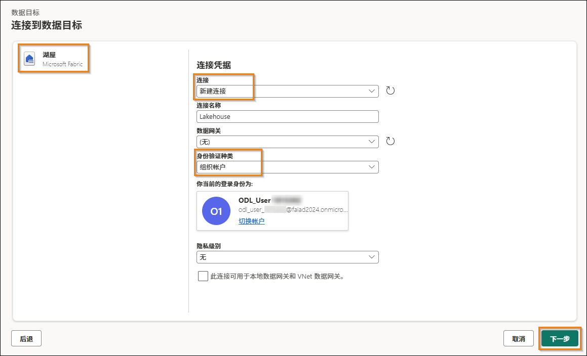

4. “选择目标”对话框随即打开。确保选中**新建表单选按钮**，因为我们要创建一个新表。

5. 我们想要在之前创建的湖屋中创建表。在左侧面板中，导航到**湖屋 -> FAIAD_<username>。**

6. 选择 **lh_FAIAD**

7. 将表名称保留为 **People**

8. 选择**下一步**。

    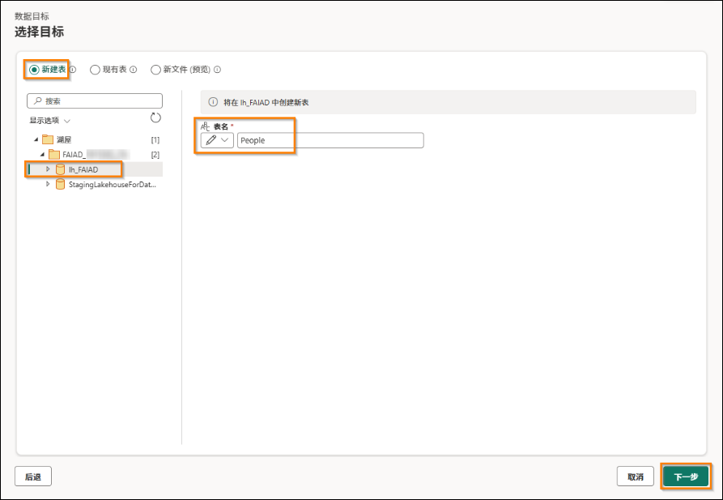

9. “选择目标设置”对话框随即打开。确保**使用自动设置**已**启用**。

    **注意：**您可以禁用自动设置，请注意，您可以选择“设置更新方法”和“架构”选项。完成浏览后，确保**使用自动设置**已**启用**。

10. 选择**保存设置**。

    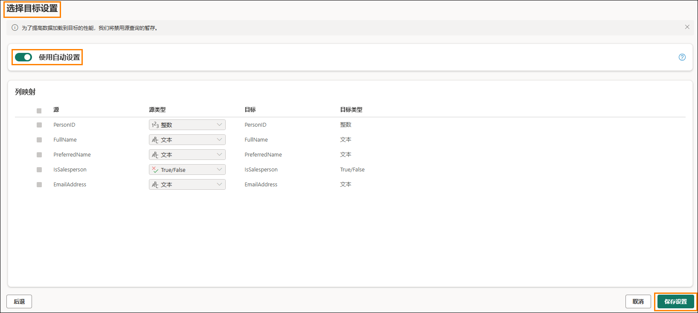

### 任务 4：发布并重命名 SharePoint 数据流

1. 系统会将您导航回 **Power Query** 窗口。请注意，右下角的数据目标设置为湖屋 **(1)**。

2. 在左上角，选择**保存并运行 (2)**。一旦您看到刷新已开始的通知，您就可以关闭数据流** (3)**

    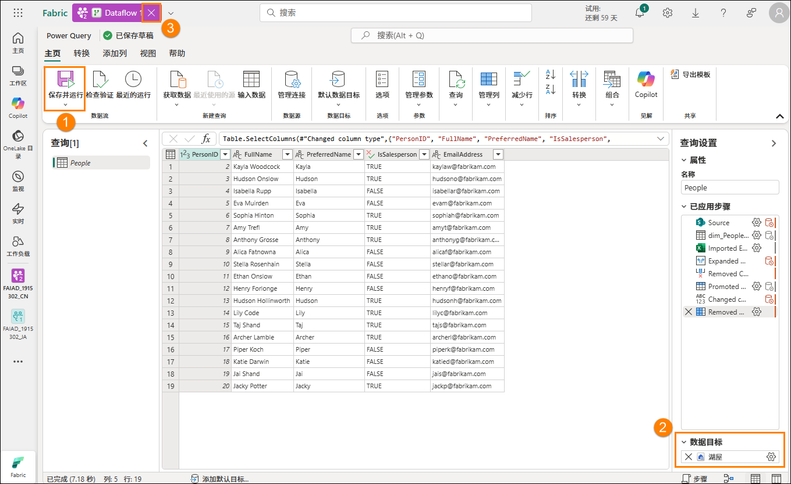

    **注意：**系统会将您导航回** FAIAD_<username>** 工作区。数据流可能需要一些**时间才能完成运行**。

3. **Dataflow 1** 是我们正在处理的数据流。让我们先将其重命名，然后再继续。单击“Dataflow 1” 旁边的**省略号 (…)**。选择**设置**（在数据流运行时，您无法访问设置）。

    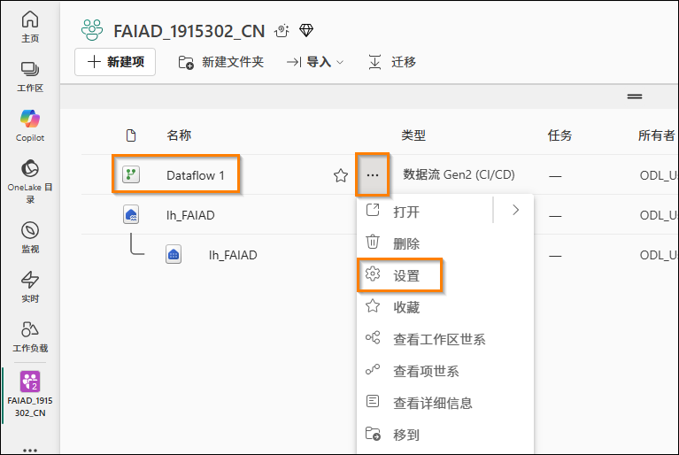

4. “数据流设置”窗口随即打**开**。将**名称**更改为** df_People_SharePoint (1)**。

5. 在**说明文本框**中，添加** Dataflow to ingest People data from SharePoint to Lakehouse (2)**。

6. 完成后，关闭设置窗口 **(3)**。

    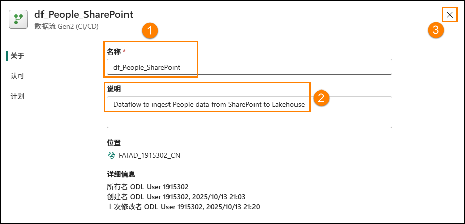

    系统会将您导航回 **FAIAD_<username> 工作区**。

7. 选择 **lh_FAIAD** 以导航到湖屋。

8. 确保您处于湖屋视图（而不是 SQL 分析终结点）中。

9. 请注意，现在 **People** 表在湖屋中可用。

    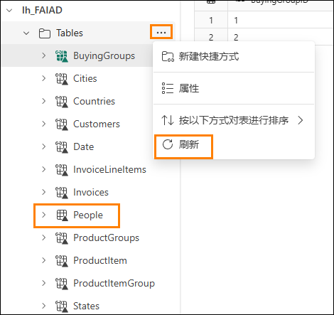

    **注意：**如果您没有看到新创建的表，请选择“表”旁边的省略号，然后选择刷新 以刷新“表”。

### 任务 5：将 Snowflake 查询复制到数据流

1. 让我们导航回 Fabric 工作区 **FAIAD_<username> (1)**。

2. 选择左上角提供的 **+ 新建项目 (2)** 选项。

3. 在“建议项目”下，选择**数据流 Gen2 (3)**。

    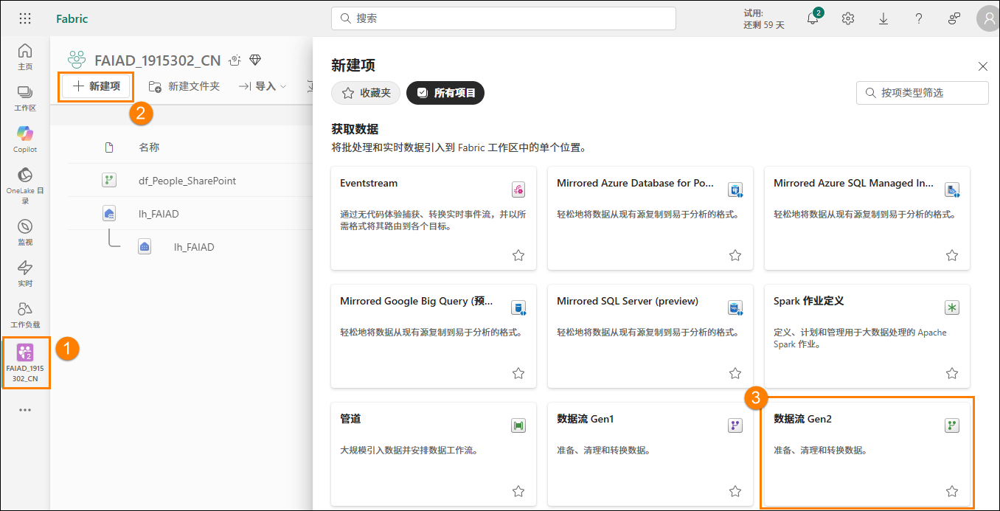

    如果收到消息“已存在具有此名称的数据流”，请将名称更改为**数据流 2**。系统会将您导航到**数据流页面**。现在，我们已经熟悉了数据流，接下来将查询从 Power BI Desktop 复制到数据流中。

4. 如果您尚未打开 **FAIAD.pbix**，请打开它。它位于您的实验室环境的桌面的** Reports** 文件夹中。

5. 从功能区中选择**主页 -> 转换数据**。Power Query 窗口随即打开。您在之前的实验室中注意到，左侧面板中的查询是按数据源组织的。

6. 从左侧面板中 **SnowflakeData** 文件夹下，按 **Ctrl+ 选择**或 Shift+ 选择以下查询：

    1. SupplierCategories

    2. Suppliers

    3. Supplier

    4. PO

    5. PO Line Items

7. **右键单击**并选择**复制**。

    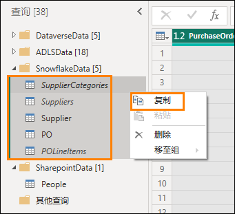

8. 导航回到**浏览器**。

9. 在**数据流窗格**中，选择**中间窗格**，然后输入** Ctrl+V**（目前不支持右键单击“粘贴”）。
    如果您使用的是 MAC 设备，请使用 Cmd+V 进行粘贴。

    **注意：**如果您在实验室环境中工作，请选择屏幕右上角的**省略号 (…)**。使用滑块**启用 VM 本机剪贴板**。在对话框中选择“确定”。粘贴查询后，您可以禁用此选项。

    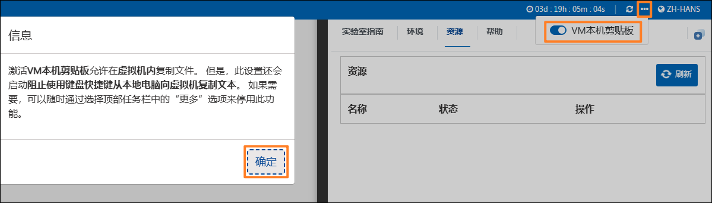

### 任务 6：创建与 Snowflake 的连接

请注意，五个查询已粘贴，现在左侧显示“查询”面板。由于我们没有为 Snowflake 创建连接，因此您将看到一条警告消息，要求您配置连接。

1. 选择**配置连接**。

    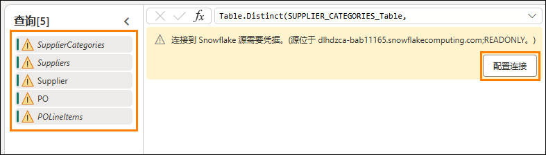

2. “连接到数据源”对话框随即打开。在**连接**下拉列表中，确保选择**创建新连接**。

3. **身份验证种类**应为** Snowflake**。

4. 输入下面提供的 **Snowflake 用户名**和** Snowflake 密码**。使用这些凭据将 Snowflake
    下的所有表连接到 Snowflake，然后选择**连接。**

    - Snowflake 用户名：TE_SNOWFLAKE1

    - Snowflake 密码：8UpfRpExVDXv2AC1

    **注意：**如果您在使用环境详细信息中的凭据连接到 Snowflake 时遇到任何问题，请使用下面提供的凭据。

    - **Snowflake 用户名：**SNOWFLAKE_BACKUP

    - **Snowflake 密码：**8UpfRpExVDXv2AC1

5. 选择**连接**。

    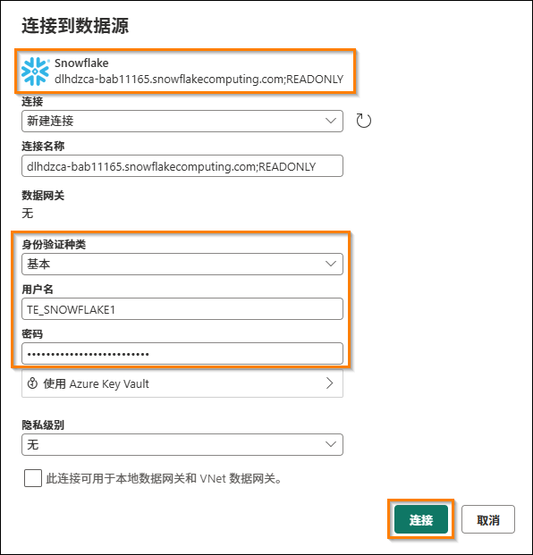

    连接已建立，您可以在预览面板中查看数据。请随意浏览查询的“应用的步骤”。Suppliers 查询基本上包含供应商的详细信息，SupplierCategories 顾名思义包含所有供应商类别。Suppliers 查询基本上包含供应商的详细信息，SupplierCategories 表顾名思义包含所有供应商类别。 同样，我们将 PO Line Items 与 PO 合并，以创建 PO 事实。现在，我们需要将 Supplier 和 PO 数据引入到湖屋中。

### 任务 7：为 Supplier 和 PO 查询配置数据目标

1. 选择 **Supplier (1)** 查询。

2. 从功能区中，选择**主页 (2) -> 添加数据目标 (3) -> 湖屋 (4)。**

    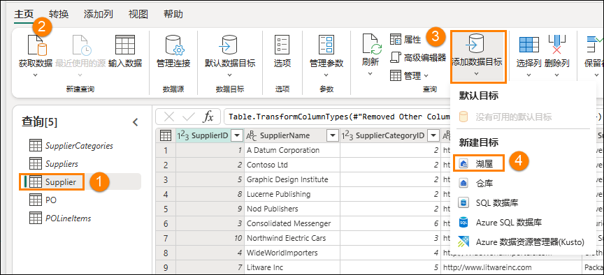

3. “连接到数据目标”对话框随即打开。从**连接**下拉列表中，选择** Lakehouse odl_user_<username> (无)。**

4. 选择**下一步**。

    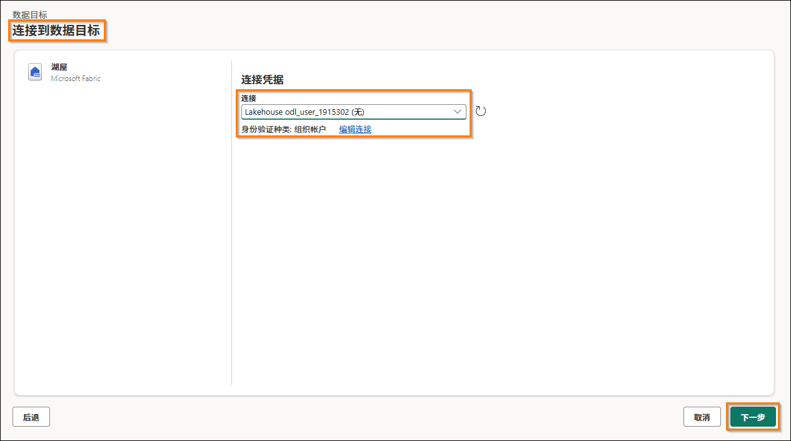

5. “选择目标”对话框随即打开。务必**选中新建表**单选按钮，因为我们要创建一个新表。

6. 我们想要在之前创建的湖屋中创建表。在左侧面板中，导航到**湖屋 -> FAIAD_<username>。**

7. 选择 **lh_FAIAD**

8. 将表名称保留为 **Supplier**

9. 选择**下一步**。

    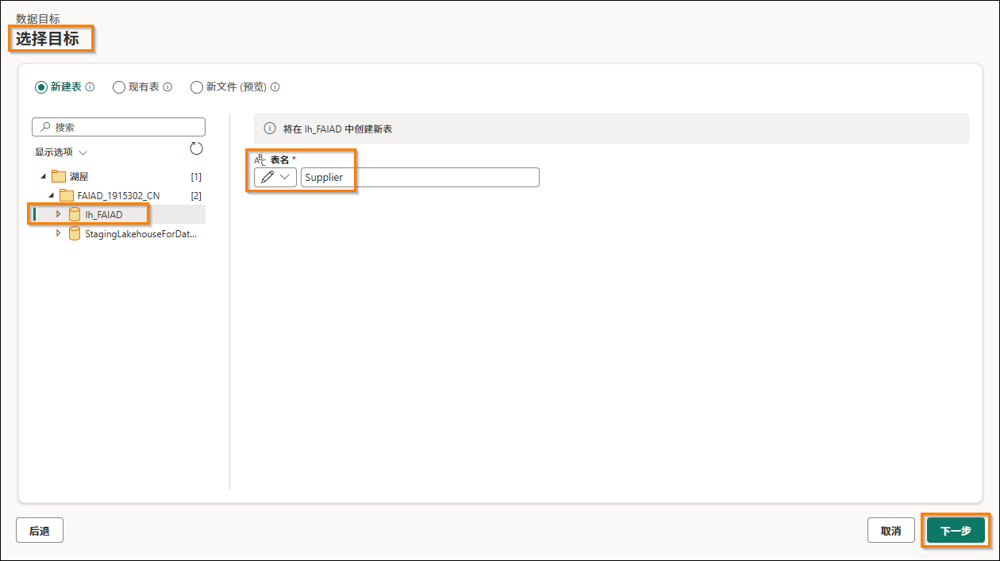

10. “选择目标设置”对话框随即打开。我们将使用自动设置，因为这将对数据进行全面更新。此外，它还会根据需要重命名列。选择**保存设置**。

    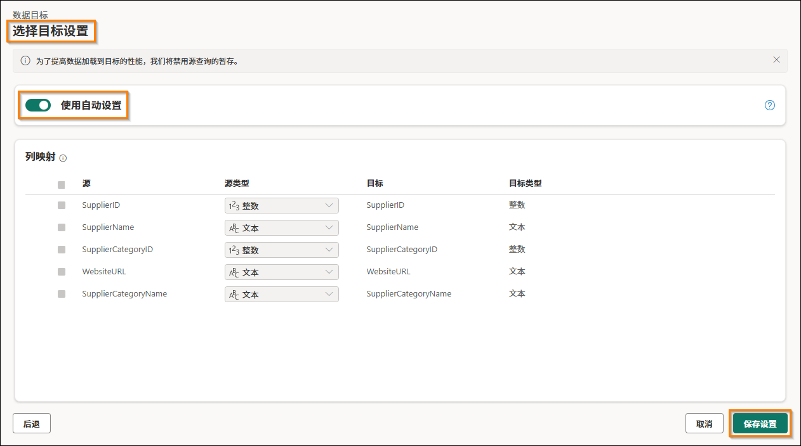

11. 系统会将您导航回 **Power Query 窗口**。请注意，**右下角的数据目标**设置为**湖屋**。同样，
    **为 PO 查询设置数据目标**。完成后，您的** PO** 查询应将**数据目标**设置为**湖屋**，如下面的屏幕截图所示。

    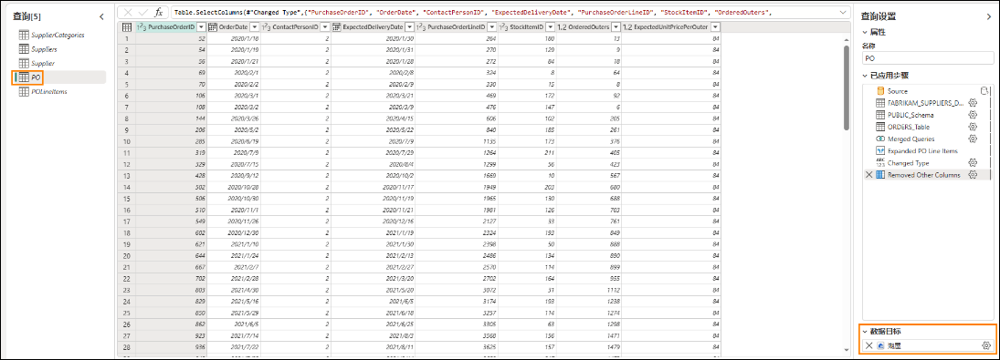

### 任务 8：重命名并发布 Snowflake 数据流

1. 从屏幕顶部，选择**数据流 2 (名称可能不同)旁边的箭头**以重命名。

2. 在对话框中，将名称更改为 **df_Supplier_Snowflake**

3. 点击 **Enter** 键以保存名称更改。

    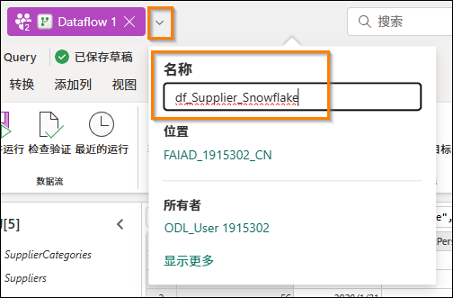

4. 在左上角，选择**保存并运行 (1)**。一旦您看到刷新已开始的通知，您就可以关闭数据流** (2)**

    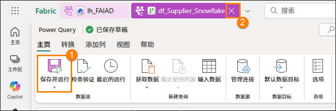

    系统会将您导航回 **FAIAD_<username> 工作区**。发布数据流可能需要一些时间。

5. 选择 **lh_FAIAD** 以导航到湖屋。

6. 确保您处于湖屋视图（而不是 SQL 分析终结点）中。

7. 请注意，现在 **PO** 和 **Supplier** 表在湖屋中可用。

    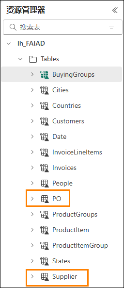

    **注意：**如果您没有看到新创建的表，请选择“表”旁边的省略号，然后选择刷新 以刷新“表”。

    现在，让我们创建一个快捷方式以从 Dataverse 引入数据。

# 内部湖屋的快捷方式

### 任务 9：如何创建 Dataverse 的快捷方式

您应该在湖屋 **lh_FAIAD** 中。确保您处于湖屋视图（而不是 SQL 分析终结点）中。

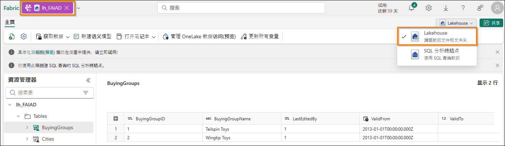

1. 在**资源管理器**面板中，选择**表**旁边的**省略号**。

2. 选择**新建快捷方式**。

    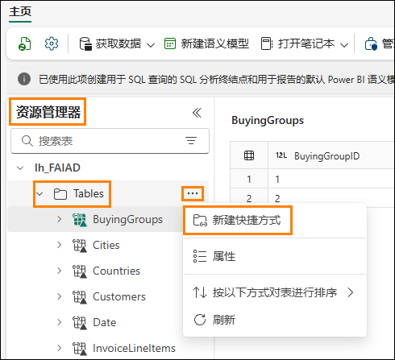

3. “新建快捷方式”对话框随即打开。在**外部源**下，选择** Dataverse**。

    **注意：**在上一个实验室中，我们已按照类似的步骤创建 Azure Data Lake Storage Gen2 的快捷方式。

    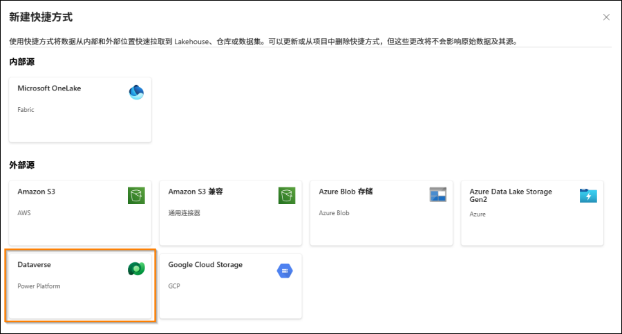

4. **选择“新建连接 (1)”，**“连接设置”对话框随即打开。
    输入 **org6c18814a.crm.dynamics.com (2)** 作为**环境域。**

5. 将**身份验证种类**保留为**组织帐户 (3)**。

6. 如果您尚未登录，请选择**登录。**

    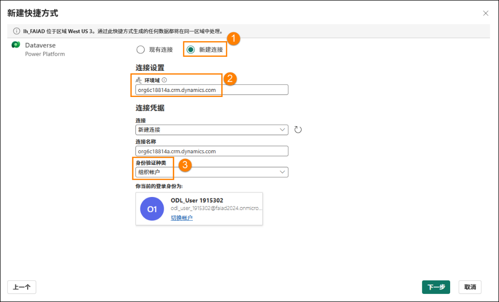

7. 从登录对话框中，选择您在这些实验室中使用的**用户帐户**。“登录到您的帐户”对话框随即打开。**选取您的帐户**以登录。**注意：**您的帐户将与以下屏幕截图不同。

    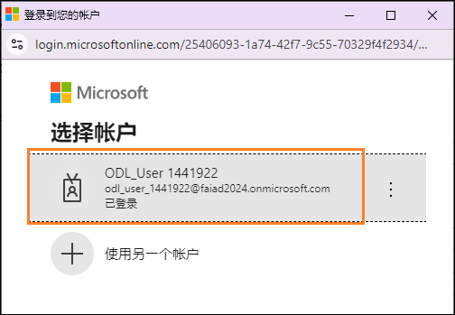

8. 在“连接设置”对话框中选择**下一步**。

    系统会将您导航到一个对话框，您可以在其中选取与 Dataverse 不同的 Bucket/目录。请注意，有许多不同的 Bucket 可用。我们可以选取所需的 Bucket，然后按照类似实验室 3（使用视觉对象查询转换数据并创建视图）的流程操作。我们还可以像之前在本实验室中使用的那样，使用数据流 Gen2 连接到 SharePoint。

    在我们的应用场景中，IT 团队已建立与 Dataverse 的链接并已应用必要的数据转换，nh 在 Power BI Desktop 文件中镜像这些数据转换。他们已在管理员工作区中将此数据引入到湖屋中，并向我们提供了对表的访问权限。由于我们的 IT 团队已经完成所有艰苦的工作， 因此我们可以在管理员工作区中创建此湖屋的快捷方式。

9. 在“新建快捷方式”对话框中选择**取消**以导航回湖屋。

    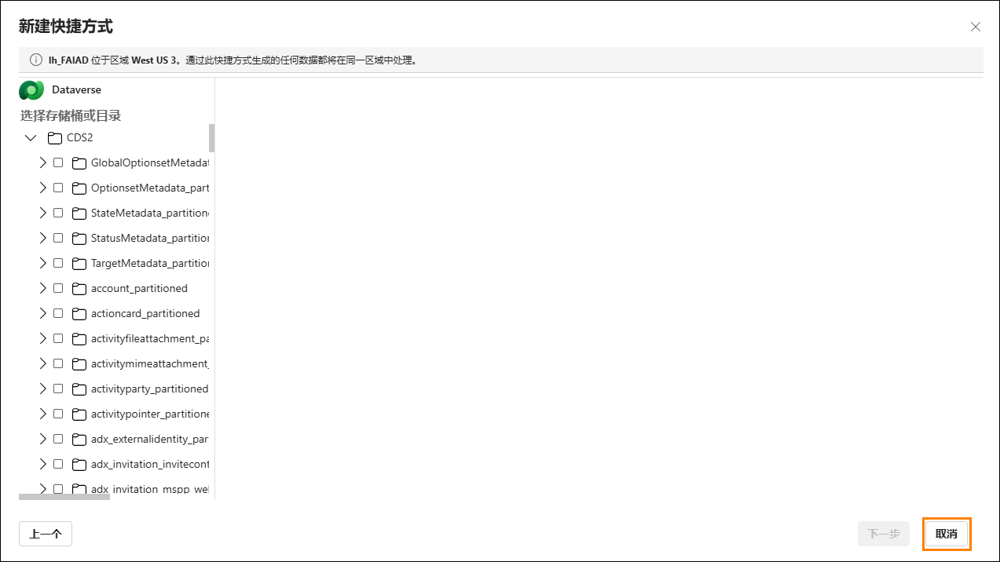

### 任务 10：创建湖屋的快捷方式

1. 在**资源管理器**面板中，选择**表**旁边的**省略号**。

2. 选择**新建快捷方式**。

    

3. “新建快捷方式”对话框随即打开。在“内部源”下选择 **Microsoft OneLake** 选项。

    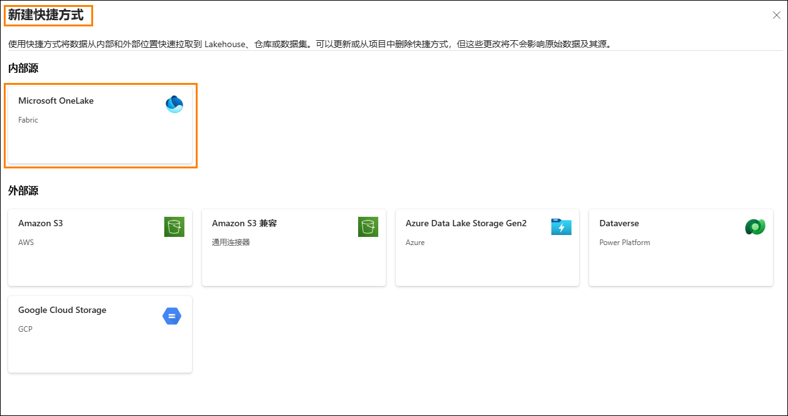

4. 选择 **lh_dataverse**。

5. 选择**下一步**。

    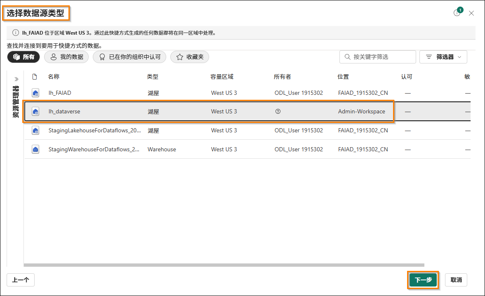

6. 在左侧面板中，展开 **lh_dataverse -> 表**。请注意，IT 管理员已提供对“Customer”表的访问权限。

7. 选择 **Customer**。

8. 选择**下一步**。

    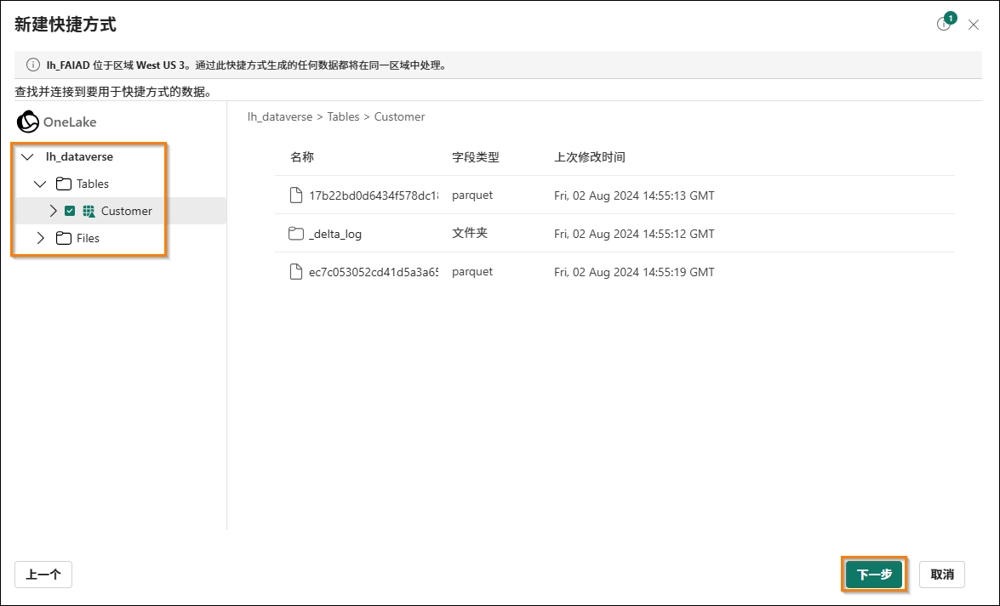

9. 在下一个对话框上，选择**创建**。系统会将您导航回 lh_FAIAD 湖屋。

    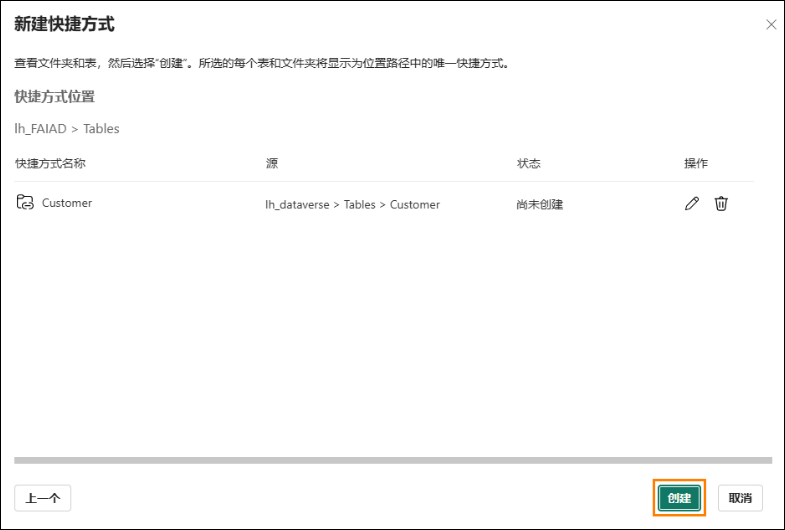

10. 请注意，在左侧的**资源管理器**面板中，已创建新的** Customer** 表。

11. 选择 **Customer** 表以在预览面板中查看数据。

    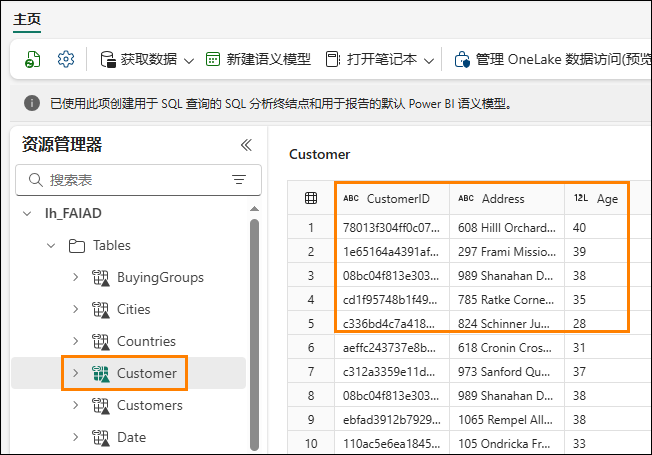

    我们已成功创建另一个湖屋的快捷方式。

    我们现在已将所有所需数据引入湖屋中。在下一个实验室中，我们将为 SharePoint 数据流安排一次刷新。

# 参考

Fabric Analyst in a Day (FAIAD) 向您介绍了 Microsoft Fabric 中提供的一些主要功能。在服务菜单中，“帮助 (?)”部分包含指向一些优质资源的链接。

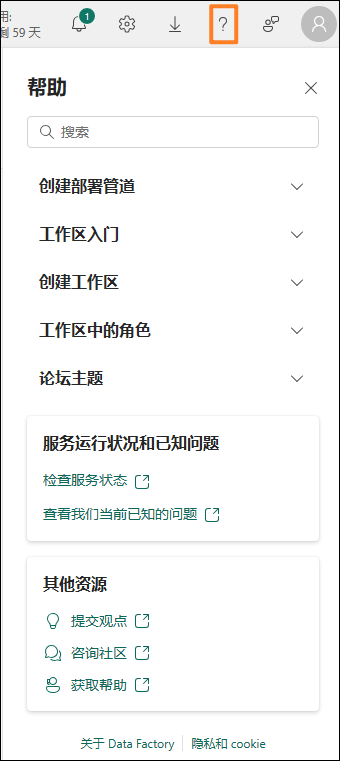

以下更多参考资源可帮助您进行与 Microsoft Fabric 相关的后续步骤。

- 请参阅博客文章以阅读完整的 [Microsoft Fabric GA 公告](https://aka.ms/Fabric-Hero-Blog-Ignite23)

- 通过[引导式教程](https://aka.ms/Fabric-GuidedTour)探索 Fabric

- 注册 [Microsoft Fabric 免费试用版](https://aka.ms/try-fabric)

- 访问 [Microsoft Fabric 网站](https://aka.ms/microsoft-fabric)

- 通过探索 [Fabric 学习模块](https://aka.ms/learn-fabric)学习新技能

- 探索 [Fabric 技术文档](https://aka.ms/fabric-docs)

- 阅读[有关 Fabric 入门指南的免费电子书](https://aka.ms/fabric-get-started-ebook)

- 加入 [Fabric 社区](https://aka.ms/fabric-community)发布问题、分享反馈并向他人学习

阅读更多深度 Fabric 体验公告博客：

- [Fabric 中的 Data Factory 体验博客](https://aka.ms/Fabric-Data-Factory-Blog)

- [Fabric 中的 Synapse Data Engineering 体验博客](https://aka.ms/Fabric-DE-Blog)

- [Fabric 中的 Synapse Data Science 体验博客](https://aka.ms/Fabric-DS-Blog)

- [Fabric 中的 Synapse Data Warehousing 体验博客](https://aka.ms/Fabric-DW-Blog)

- [Fabric 中的 Synapse Real-Time Analytics 体验博客](https://aka.ms/Fabric-RTA-Blog)

- [Power BI 公告博客](https://aka.ms/Fabric-PBI-Blog)

- [Fabric 中的 Data Activator 博客](https://aka.ms/Fabric-DA-Blog)

- [Fabric 中的管理和治理博客](https://aka.ms/Fabric-Admin-Gov-Blog)

- [Fabric 中的 OneLake 博客](https://aka.ms/Fabric-OneLake-Blog)

- [Dataverse 和 Microsoft Fabric 集成博客](https://aka.ms/Dataverse-Fabric-Blog)

© 2023 Microsoft Corporation.保留所有权利。

使用此演示/实验即表示您已同意以下条款：

本演示/实验中的技术/功能由 Microsoft Corporation 出于获取反馈和提供学习体验的目的提供。只能将本演示/实验用于评估这些技术特性和功能以及向 Microsoft 提供反馈。不得用于任何其他用途。不得对此演示/实验或其任何部分进行修改、复制、分发、传送、显示、执行、复制、公布、许可、转让、销售或基于以上内容创建衍生作品。

严禁将本演示/实验（或其任何部分）复制到任何其他服务器或位置以便进一步复制或再分发。

本演示/实验出于上述目的，在不涉及复杂设置或安装操作的模拟环境中提供特定软件技术/产品特性和功能，包括潜在的新功能和概念。本演示/实验中展示的技术/概念可能不是完整的功能，可能会以不同于最终版本的工作方式工作。我们也可能不会发布此类功能或概念的最终版本。在物理环境中使用此类特性和功能的体验可能也有所不同。

**反馈。**如您针对本演示/实验中所述的技术特性、功能和/或概念向 Microsoft 提供反馈，则意味着您向 Microsoft 无偿提供以任何方式、出于任何目的使用和分享您的反馈并将其商业化的权利。您同样无偿为第三方提供其产品、技术和服务使用或配合使用包含此反馈的 Microsoft 软件或服务的任何特定部分所需的任何专利权。如果根据某项许可的规定，Microsoft 由于在其软件或文档中包含了您的反馈需要向第三方授予该软件或文档的许可，请不要提供这样的反馈。这些权利在本协议终止后继续有效。

对于本演示/实验，Microsoft Corporation 不提供任何明示、暗示或法定的保证和条件，包括有关适销性、针对特定目的的适用性、所有权和不侵权的所有保证和条件。对于使用本演示/实验产生的结果或输出内容的准确性，或者出于任何目的包含本演示/实验中的信息的适用性，Microsoft 不做任何保证或陈述。

**免责声明**

本演示/实验仅包含 Microsoft Power BI 的部分新功能和增强功能。在产品的后续版本中，部分功能可能有所更改。在本演示/实验室中，您将了解部分新功能，但并非 全部新功能。
