# Microsoft Fabric - Fabric Analyst in a Day

## 目录

- 简介
- 数据流 Gen2
  - 任务 1：为供应商数据流配置计划刷新
- 管道
  - 任务 2：创建管道
  - 任务 3：生成简单的管道
  - 任务 4：创建新管道
  - 任务 5：创建 Until 活动
  - 任务 6：创建变量
  - 任务 7：配置 Until 活动
  - 任务 8：配置数据流活动
  - 任务 9：配置第 1 个设置变量活动
  - 任务 10：配置第 2 个设置变量活动
  - 任务 11：配置第 3 个设置变量活动
  - 任务 12：配置等待活动
  - 任务 13：为管道配置计划刷新
- 参考

# w

# 简介

我们已将来自不同数据源的数据引入到湖屋中。在本实验中，您将为数据源设置刷新计划。 简单回顾一下要求：

- **供应商数据：**存储在 Snowflake 中，每天半夜/凌晨 12 点更新。

- **员工数据：**存储在 SharePoint 中，每天上午 9 点更新。但我们注意到有时会有 5 至 15 分钟的延迟。我们需要创建一个刷新计划来进行调整。

- **客户数据：**存储在 Dataverse 中，随时更新。之前我们每天刷新四次，分别在半夜/凌晨 12 点、上午 6 点、中午 12 点和下午 6 点。现在，IT 团队创建了一个指向 Dataverse 的链接，可将此数据引入到管理员湖屋。他们还转换了此数据。我们不需要设置刷新，因为我们要链接到 IT 团队提供的湖屋。

- **销售数据：**存储在 ADLS 中，每天中午 12 点更新。我们不需要为此设置刷新，因为我们已经创建了一个快捷方式。数据一旦在 ADLS 中更新，便可使用。"

本实验结束后，您将学会：

- 如何为数据流 Gen2 配置计划刷新

- 如何创建管道

- 如何为管道配置计划刷新

# 数据流 Gen2

### 任务 1：为供应商数据流配置计划刷新

我们首先为供应商数据流配置计划刷新。

1. 让我们通过在左侧面板中选择 Fabric 工作区 **FAIAD_<username>**，导航回该工作区。

2. 若要最大化包含项目列表的面板，请选择面板右上角的双箭头。

    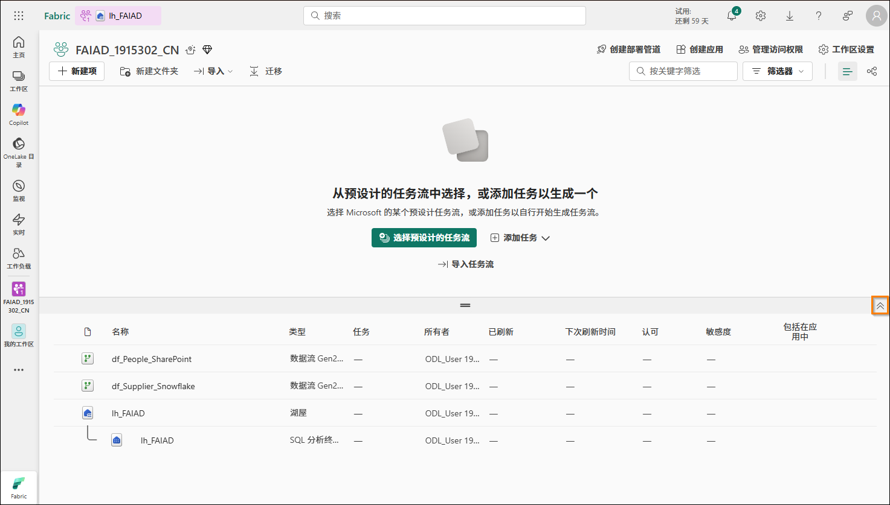

3. 此处列出了您创建的所有项目。在屏幕右侧的**搜索框**中，输入** df**。这会将项目筛选到数据流。

    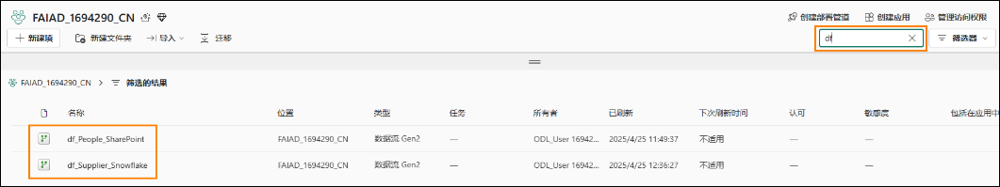

4. 将鼠标悬停在 **df_Supplier_Snowflake** 行上。选择**省略号 (…)**。

5. 请注意，有“删除”、“打开”和“刷新数据流”选项。让我们看一下刷新历史记录。选择**最近运行**。

    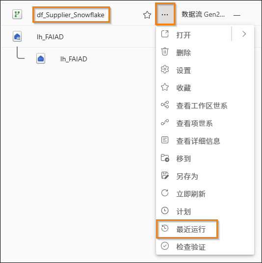

    **注意：**右侧将出现一个窗口/面板，显示刷新列表

6. 您将注意到，我们在上一个实验室中选择**保存并运行**选项时，执行了一次刷新。我们可以看到刷新的**类型**列出为**按需**，这使我们知道这是手动执行的刷新。

    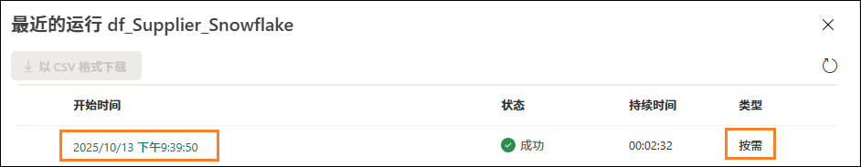

7. 选择**开始**时间链接。

    **注意：**您的开始时间会有所不同。

    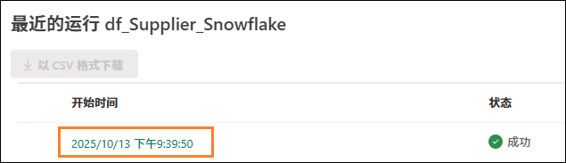

    详细信息屏幕将打开。这将提供刷新的详细信息。其中列出开始时间、结束时间和持续时间。还列出了刷新的表/活动。如果出现故障，您可以单击表/活动的名称以进一步调查。

    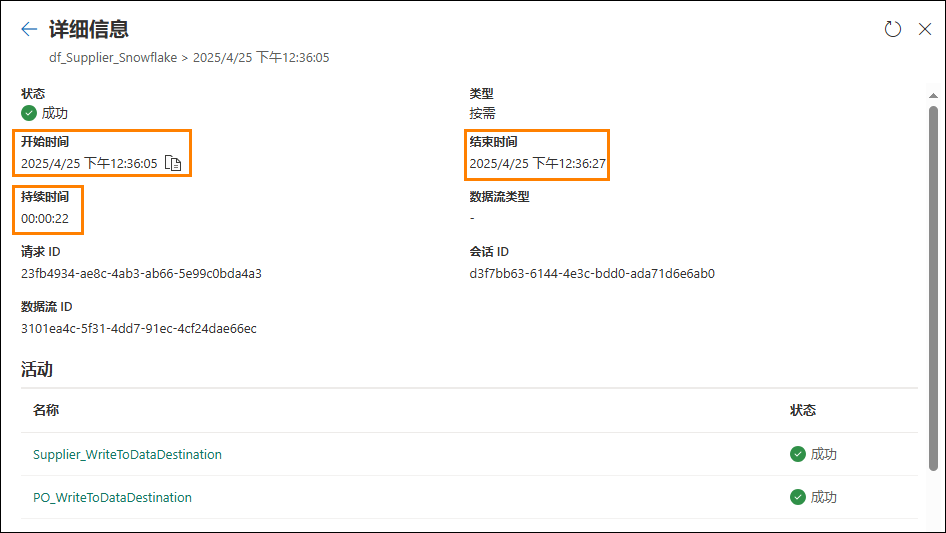

8. 我们通过单击右上角的 **X** 导航离开此页面。系统会将您导航回工作区。

9. 将鼠标悬停在 **df_Supplier_Snowflake** 行上。选择**省略号 (…)**。

10. 让我们了解如何自动计划刷新。选择**设置**选项。

    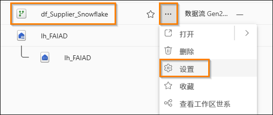

11. 在显示的**设置**面板中，您将看到我们有三个选项：

    **关于 -** 我们可以在此处更改数据流的名称并添加描述。此外，我们还可以看到谁是数据流的负责人以及上次修改数据流的时间。

    **认可 -** 这允许我们指定数据流是否带有已提升或已认证标记以供其他人查看。

    **计划 -** 这是我们计划数据流的位置。

    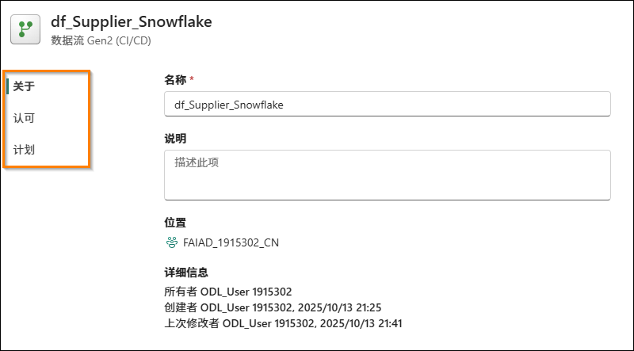

12. 选择**计划**选项

13. 若要激活计划，我们只需单击**添加计划**

    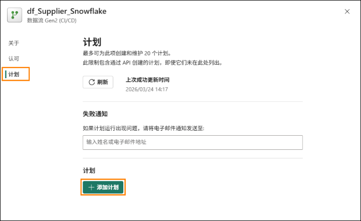

14. 现在，这允许我们通过选择**重复**属性的选项来指定刷新的节奏。对于本应用场景，我们可以选择**每天 (1)**

15. 对于**时间**属性，我们可以指定** 12:00 AM (2)**，因为我们想要在午夜刷新

    **注意：**通过单击“添加其他时间”链接，您可以添加多个刷新时间。

16. 我们还可以指定**开始日期和时间 (3)** 以及**结束日期和时间 (4)**。对于本应用场景，只需选择当天作为开始日期和结束日期。

17. 您可以指定希望时间代表的**时区 (5)**。最后，选择**保存**

    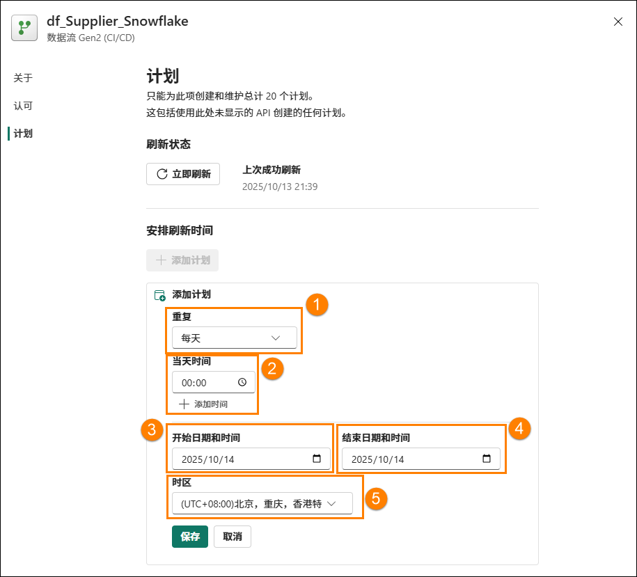

18. 您将看到计划的刷新，如果不再需要，您可以编辑或删除它，或者添加其他计划的刷新。

    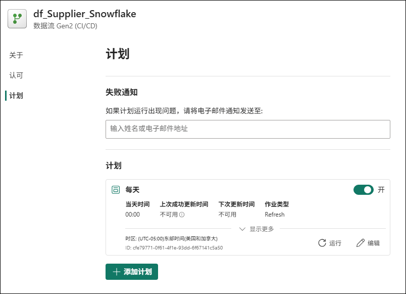

    如前所述，我们需要生成自定义逻辑来处理 SharePoint 中的员工文件未按时送达的应用场景。让我们使用管道来解决此问题。

# 管道

### 任务 2：创建管道

1. 让我们通过在左侧面板中选择 Fabric 工作区 **FAIAD_<username>**，导航回该工作区。

2. 从顶部菜单中，选择 **+ 新建项 (1) -> 管道 (2)**。

    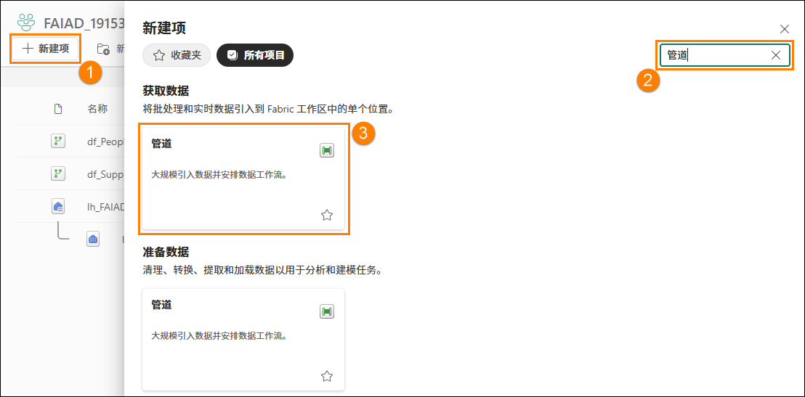

3. “新建管道”对话框随即打开。将管道命名为 **pl_Refresh_People_SharePoint**，然后选择**创建**。

    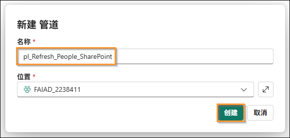

    系统会将您导航到**管道页面**。如果您使用过 Azure 数据工厂，您会觉得此屏幕很熟悉。让我们快速了解一下布局。

    您位于**主页**屏幕。在顶部菜单上，您会看到添加常用活动的选项：验证、运行管道以及查看运行历史记录。此外，在中间窗格中，您会看到开始生成管道的快速选项。

    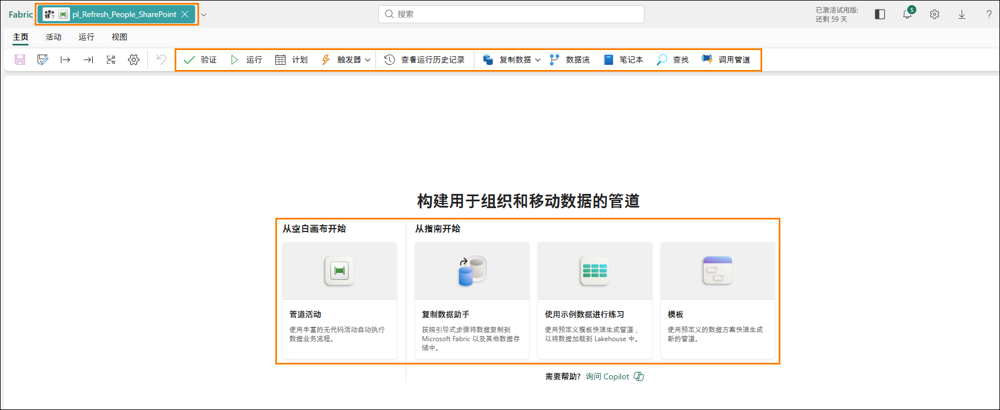

4. 从顶部菜单中选择**活动**。现在，您会在菜单中看到常用活动的列表。

5. 选择菜单右侧的**省略号 (…)**，以查看所有其他可用的活动。我们将在实验中使用其中一些活动。

    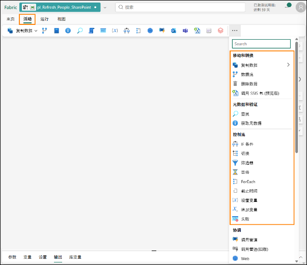

6. 点击顶部菜单中的**运行**。您将找到运行和计划管道执行的选项。还可以找到使用“查看运行历史记录”来查看执行历史记录的选项。

7. 从顶部菜单中选择**视图**。在这里可以找到以 JSON 格式查看代码的选项。还可以找到使活动自动保持一致的选项。

    **注意：**如果您在完成本实验后掌握了一些 JSON 背景知识，请自行选择“查看 JSON 代码”。 在这里，您会注意到使用设计视图进行的所有编排也可以用 JSON 编写。

    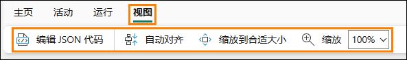

### 任务 3：生成简单的管道

我们开始生成管道。我们需要一个活动来刷新数据流。让我们找到一个可以使用的活动。

1. 在顶部菜单中，选择**活动 -> 数据流**。数据流活动已添加到中心设计窗格中。请注意，底部窗格现在具有数据流活动的配置选项。

2. 我们将配置该活动以连接到 df_People_SharePoint 数据流。从**底部窗格中**，选择**“设置”**。

    *注意：您可能需要向上拖动底部窗格才能查看设置。*

    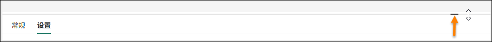

3. 确保将**工作区**设置为您的 Fabric 工作区 **FAIAD_<username>。**

4. 从**数据流下拉列表**中，选择** df_People_SharePoint**。执行此数据流活动时，它将刷新** df_People_SharePoint。**这很容易，对吧？

    在我们的应用场景中，员工数据未按计划更新。有时会有延迟。让我们来看看如何调整。

    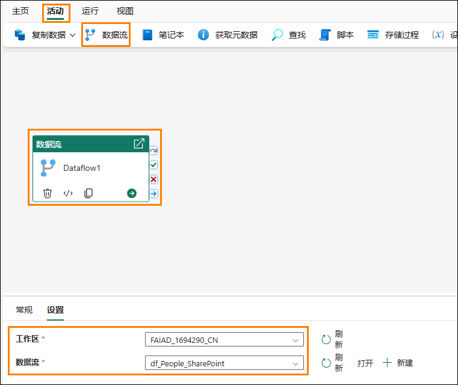

5. 在**底部窗格**中选择**常规**。我们为活动指定名称和说明。

6. 在**名称**字段中，输入** dfactivity_People_SharePoint**

7. 在**说明**字段中，输入** Dataflow activity to refresh df_People_Sharepoint dataflow**。

8. 请注意，有一个停用活动的选项。此功能在测试或调试期间非常有用。将其保留为**已激活**。

9. 有一个设置**超时**的选项。我们保留**默认值**，这样可以为数据流刷新提供足够的时间。

    **注意：**因为数据无法按计划提供，因此我们将活动设置为每 10 分钟重新执行一次，共 3 次。如果第三次尝试也失败，那么它将报告失败。

10. 将**重试次数**设置为** 3**

11. 展开**高级**部分。

12. 将**重试间隔（秒）**设置为** 600**。

13. 从菜单中选择**主页 -> 保存**图标以保存管道。

    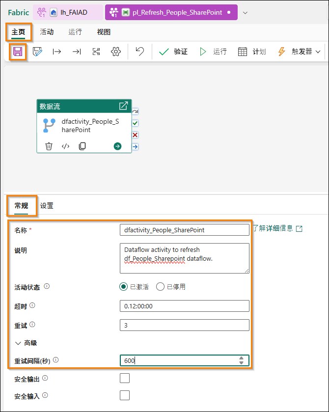

    请注意，与将数据流设置为按计划刷新相比（如同我们对早期数据流所做的那样），使用管道具有以下优势：

    - 管道提供在刷新失败之前重试多次的选项。

    - 通过管道，既可以执行其他任务，也可以刷新数据流

### 任务 4：创建新管道

我们为应用场景加大难度。我们注意到，如果在上午 9 点还未提供数据，那么通常在五分钟内会提供。如果错过该时段，则需要 15 分钟后才能获得文件。我们希望将重试时间安排在 5 分钟和 15 分钟。让我们看一下如何通过创建新管道来实现这一点。

1. 从左侧面板中，点击 **FAIAD_<username>**，以导航到工作区主页。

2. 从顶部菜单中，单击 + **新建项 (1)**，然后从弹出窗口中，单击**管道 (2)**。

    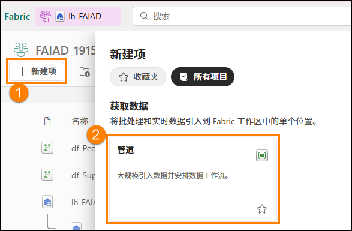

3. “新建管道”对话框随即打开。将管道**命名**为** pl_Refresh_People_SharePoint_Option2 (3)**，然后选择**创建 (4)**。

    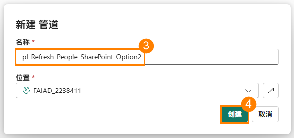

### 任务 5：创建 Until 活动

1. 系统会将您导航到管道屏幕。从菜单中，选择**活动**。

2. 点击右侧的**省略号 (…)**。

3. 从活动列表中，点击**截止时间**。

    **截止：**这是一个用于迭代直到满足条件的活动。

    在我们的应用场景中，我们将迭代并刷新数据流，直到成功或者已经尝试三次。

    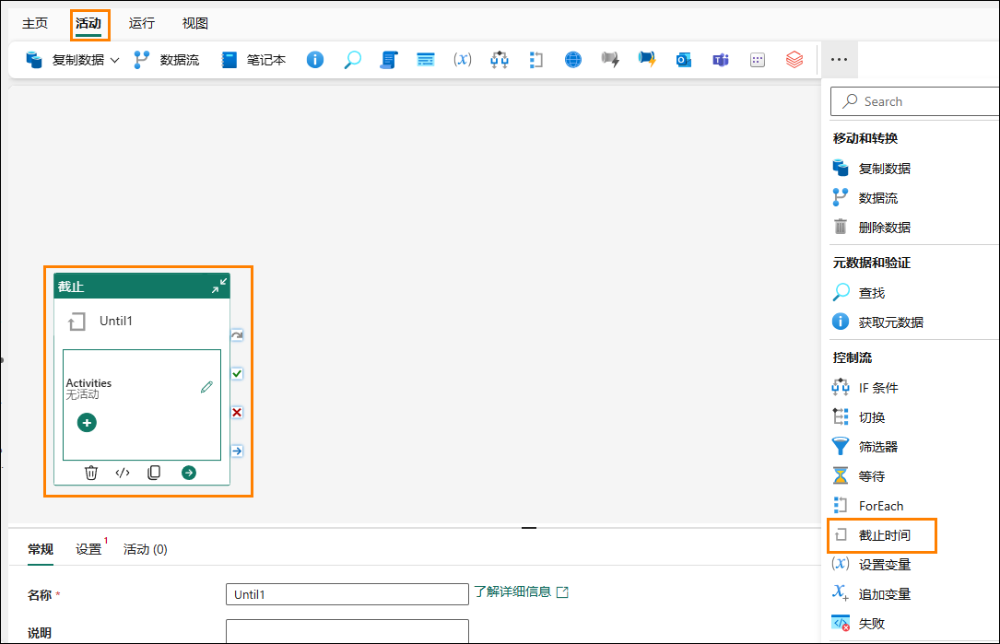

### 任务 6：创建变量

1. 我们需要创建变量用于迭代和设置状态。选择管道设计窗格中的**空白区域**。

2. 请注意底部窗格中的菜单有变化。选择**变量**。

3. 选择 **+ 新建**以添加新的变量。

4. 请注意此时会出现一行。在**名称文本框**中输入** varCounter**。我们将使用该变量迭代三次。

5. 从**类型下拉列表**选择** Integer**。

6. 输入**默认值**** 0**。

    **注意：**我们在变量名称中追加 var 是为了方便查找，这是一个有用的做法。

    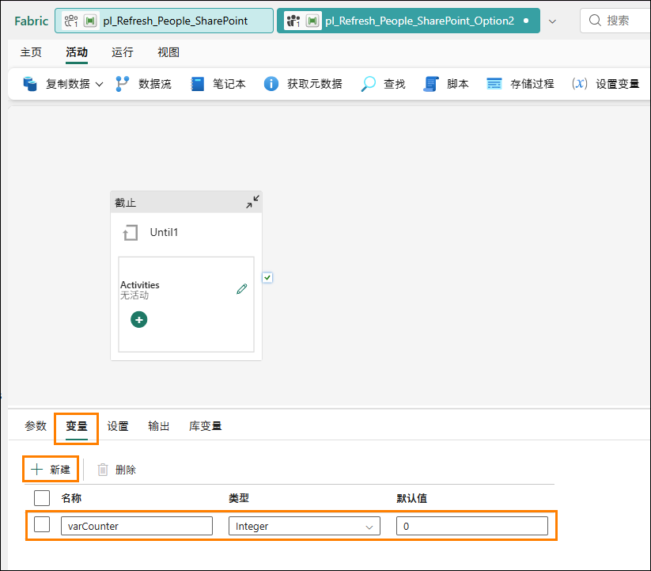

7. 选择 **+ 新建**以添加另一个新的变量。

8. 请注意此时会出现一行。在**名称文本框**中输入** varTempCounter**。我们将使用该变量递增 varCounter 变量。

9. 从**类型下拉列表**选择** Integer**。

10. 输入**默认值**** 0**。

11. 按照相似的步骤添加另外三个变量：

    1. **varIsSuccess** 类型为 **String**，默认值为** No**。该变量将用于指示数据流刷新是否成功。

    2. **varSuccess** 类型为 **String**，默认值为** Yes**。此变量将用于设置数据流刷新成功时 varIsSuccess 的值。

    3. **varWaitTime** 类型为 **Integer**，默认值为** 60**。该变量将用于设置数据流失败时的等待时间。（5 分钟/300 秒或 15 分钟/900 秒。）

    **注意：**请确保变量名称之前或之后没有空格。

    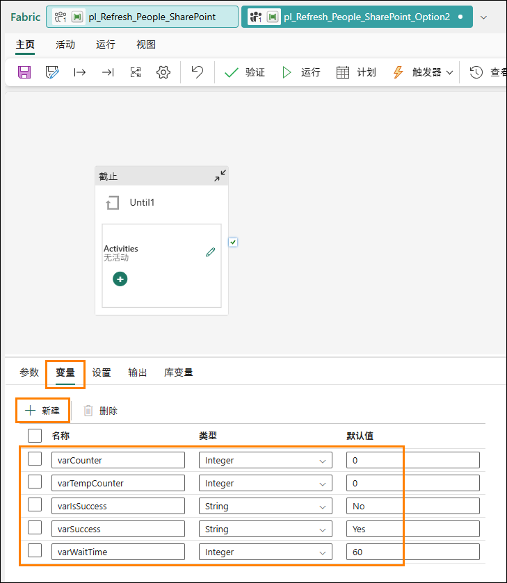

### 任务 7：配置 Until 活动

1. 选择**截止**活动。

2. 在**底部窗格**中选择**常规**。

3. 在**名称**中输入** Iterator**

4. 在描述中输入 **Iterator to refresh dataflow。It will retry up to 3 times**。

    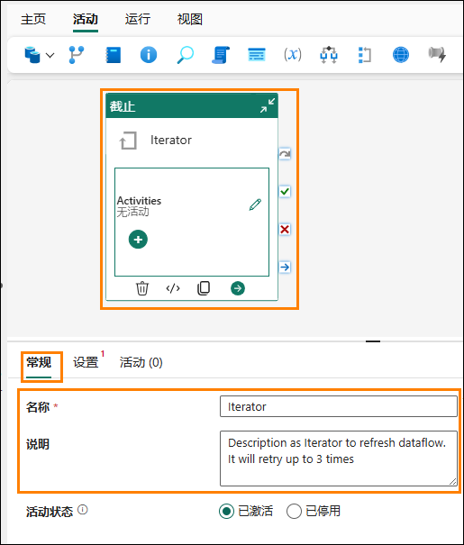

5. 从顶部窗格中，选择**设置 (1)**。

6. 选择**表达式文本框 (2)**。我们需要在此文本框中输入一个表达式，该表达式的评估结果为 true 或 false。Until 活动将继续迭代，而此表达式的评估结果为 false。一旦表达式的评估结果为 true，Until 活动就会停止迭代，并继续下一个活动。

7. 选择文本框下方显示的**添加动态内容 (3)** 链接。

    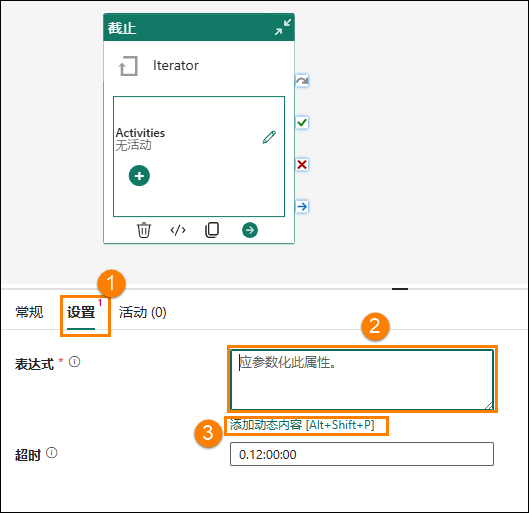

    我们需要编写一个表达式，该表达式的执行截止条件为值 **varCounter 为 3** 或者值 **varIsSuccess 为“Yes”。**（varCounter 和 varIsSuccess 是我们刚刚创建的变量。）

8. **管道表达式生成器**对话框随即打开。在对话框的下半部分将会显示一个菜单：

    1. **参数：**传递到管道的值。例如，从一个管道传递到另一个管道的值。这些值可以在任何表达式中使用，但在管道运行期间不能更改。

    2. **系统变量：**在任一服务中定义实体时，可以在表达式中使用。例如，管道 ID、管道名称、触发器名称等。

    3. **触发器参数：**触发管道的参数。例如，文件名或文件夹路径。

    4. **函数：**您可以在表达式中调用函数。函数分为几类：集合函数、转换函数、日期函数、逻辑函数、数学函数和字符串函数。例如，concat 是一个字符串函数，add 是一个数学函数，诸如此类。

    5. **变量：**管道变量是在管道运行期间可以设置和修改的值。它与管道参数不同，管道参数在管道级别定义，且在管道运行期间无法更改，而管道变量可以通过“设置变量”活动在管道内进行设置和修改。我们稍后将使用“设置变量”活动。

    6. **库变量**：库变量使用在变量库 Fabric 项目中**定义的变量**。这些变量提供一种集中方式来管理跨工作区的配置，以支持 CI/CD 工作流。它们可与管道、Notebooks、湖屋快捷方式等一起使用。

    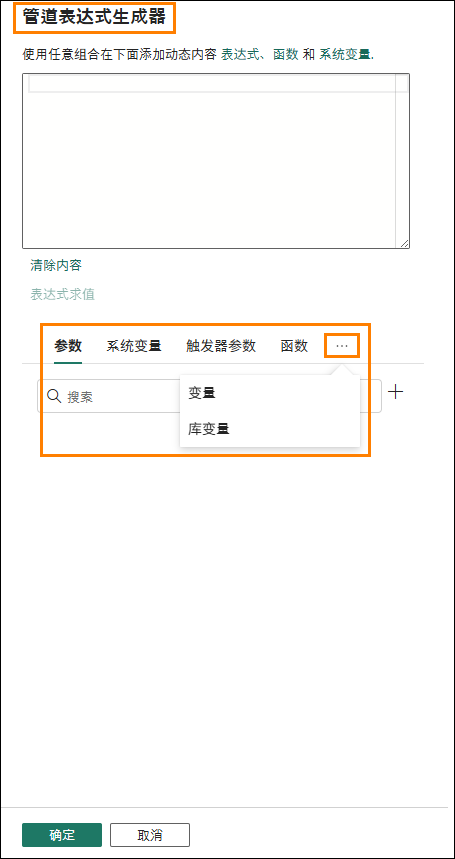

9. 从功能区或菜单中单击**函数。**

10. 从 **Logical 函数**部分中，选择** or** 函数。请注意，**@or()** 已添加到动态表达式文本框中。
    or 函数有两个参数，我们现在使用的是第一个参数。

    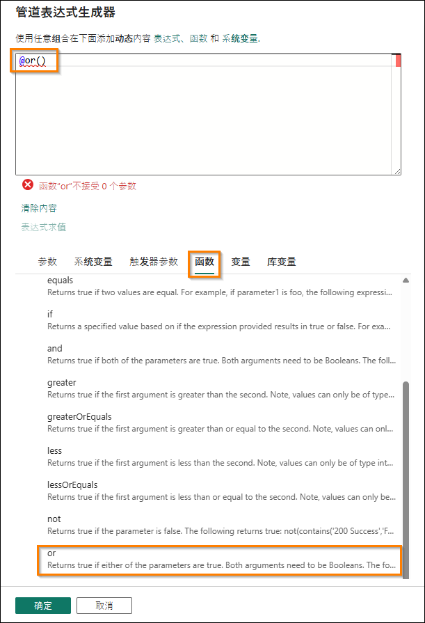

11. 将光标置于 **@or** 函数的**括号之间**。

12. 从 **Logical 函数**部分中，选择** equals** 函数。请注意，它已添加到动态表达式文本框中。

    **注意：**您的函数应类似于** @or(equals())**。equals 函数也有两个参数。我们将检查变量 varCounter 是否等于 3。

    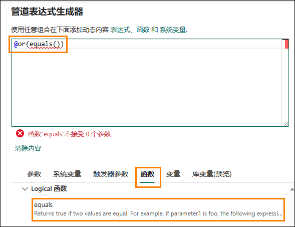

13. 现在将光标置于 **@equals** 函数的**括号之间**以添加参数。

14. 在底部菜单中选择**变量**。

15. 选择 **varCounter** 变量作为第一个参数。

16. 输入 **3** 作为 equals 函数的第二个参数。您的表达式将为 **@or(equals(variables('varCounter'),3))**，类似于下面的屏幕截图所示

    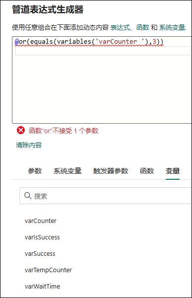

17. 我们需要将第二个参数添加到 or 函数中。在结尾的两个括号之间**添加逗号**。这次我们将尝试输入函数名称。首先输入** equ**，您将看到可用函数的下拉列表（称为 IntelliSense）。选择 **equals** 函数。

    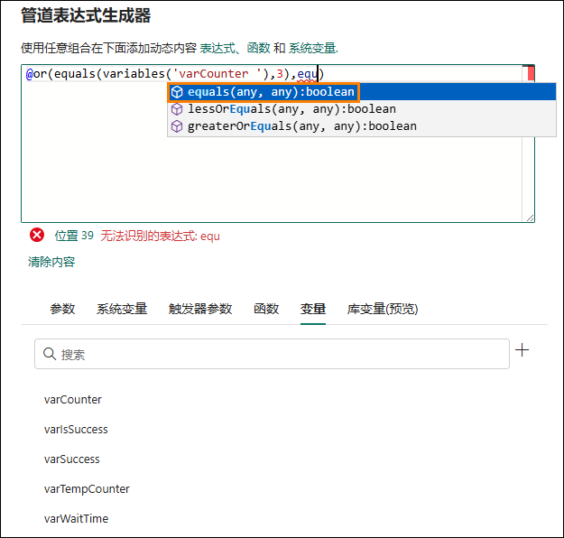

18. equals 函数的第一个参数是一个变量。将**光标置于逗号之前**。

19. 开始输入 **variables**

20. 在 IntelliSense 的帮助下，选择 **variables('varIsSuccess')**

21. 在逗号之后，输入第二个参数。开始输入 **variables**

22. 在 IntelliSense 的帮助下，选择 **variables('varSuccess')**。这里我们将 varIsSuccess 的值与 varSuccess 的值进行比较。（varSuccess 默认为“Yes”。）

    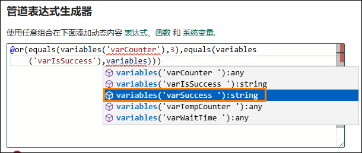

23. 您的表达式应该是：

    **@or(equals(variables('varCounter'),3),equals(variables('varIsSuccess'), variables('varSuccess')))**

24. 选择**确定**。

    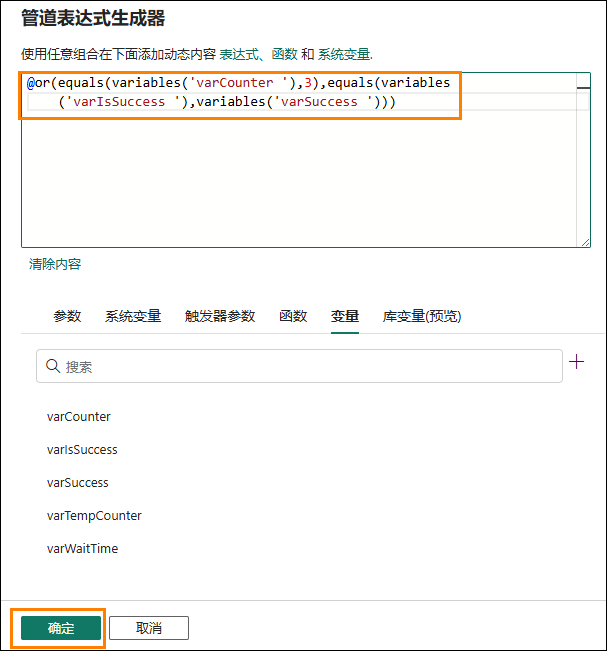

### 任务 8：配置数据流活动

1. 您将导航回到设计屏幕。选择**截止活动**后，从**底部窗格**中选择**活动**。我们现在将添加需要执行的活动。

2. 选择第一行中的**编辑图标**。您将导航到空白迭代程序设计屏幕。

    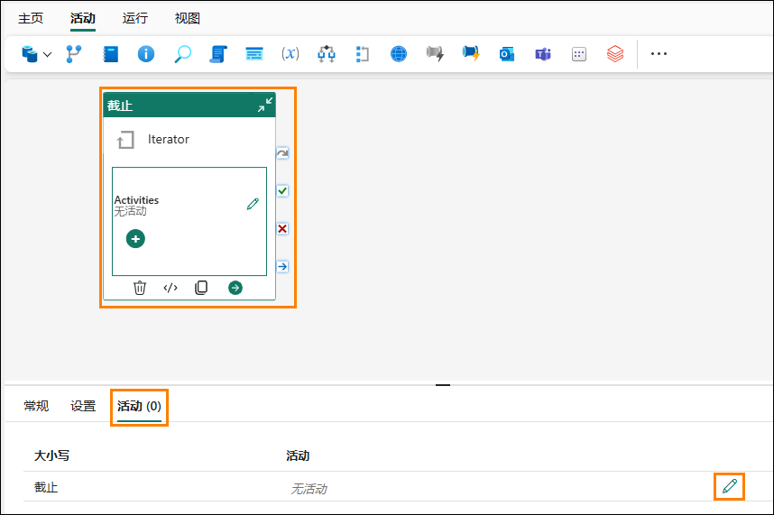

3. 在顶部菜单中，选择**活动 -> 数据流**。数据流活动已添加到设计窗格中。

4. **选择数据流活动**后，在底部窗格中选择**常规**。我们为活动指定名称和说明。

5. 在**名称**字段中，输入** dfactivity_People_SharePoint**

6. 在**说明**字段中，输入** Dataflow activity to refresh df_People_Sharepoint dataflow**。

    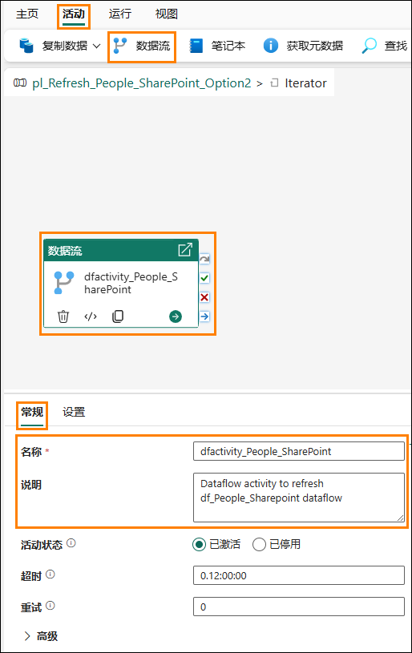

7. 从底部窗格中选择**设置**。

8. 确保将**工作区**设置为您的工作区** FAIAD_<username>。**

9. 从**数据流下拉列表**中，选择** df_People_SharePoint**。

    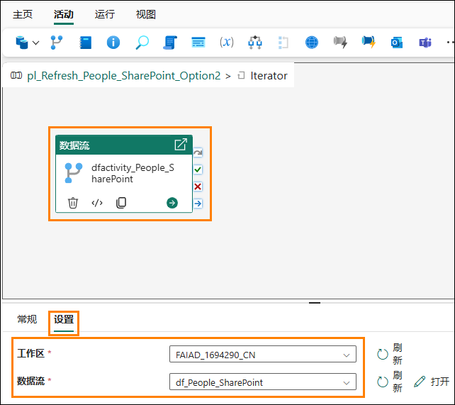

### 任务 9：配置第 1 个设置变量活动

像之前在实验中所做的那样，我们已经配置了数据流活动。我们再来添加一个新逻辑。如果数据流刷新成功，我们需要存在于截止迭代程序之外。请注意，迭代程序存在的条件之一是将 varIsSuccess 变量的值设置为“Yes”。

1. 从顶部菜单中，选择**活动 -> 设置变量**。设置变量活动已添加到设计画布中。

2. 选择**设置变量活动**后，在底部窗格中选择**常规**。我们为活动指定名称和说明。

3. 在**名称**字段中，输入** set_varIsSuccess**

4. 在**描述**字段中，输入** Set variable varIsSuccess to Yes**。

    **注意：**将光标悬停在**数据流活动**上。活动框的右侧有四个图标。这些图标可用于根据活动的结果连接到下一个活动：

1. **灰色弯曲箭头**图标用于跳过活动。

2. **绿色复选标记**图标表示活动成功。

3. **红色 x 标记**图标表示活动失败。

4. **蓝色直箭头**图标表示活动已完成。

5. 点击 dfactivity_People_SharePoint 数据流活动中的**绿色复选标记**，并拖动以连接到新的** set_varIsSuccess** **设置变量活动**。因此，在数据流刷新成功后，我们要执行“设置变量”活动。

    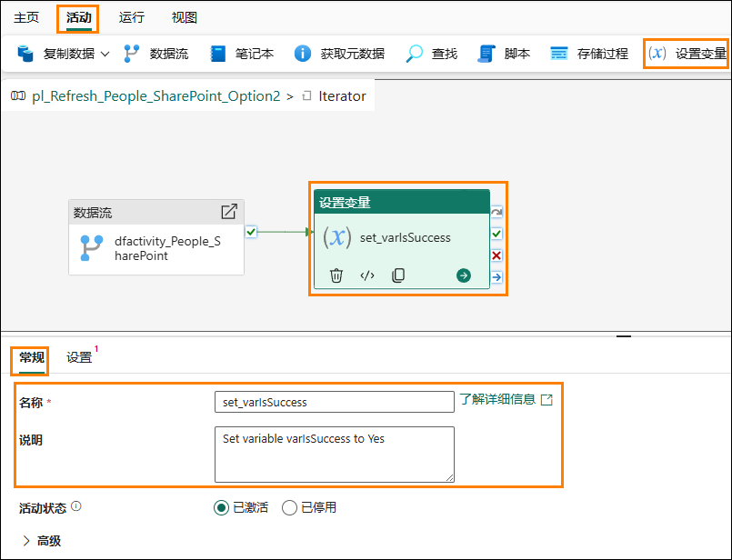

6. 选择**设置变量活动**后，点击底部菜单中的**设置**。

7. 在底部窗格中，确保**变量类型**为**管道变量**。

8. 在**名称**字段中，选择** varIsSucces。**这是我们要设置其值的变量。

9. 在**值**字段中，选择**文本框**。选择**添加动态内容**链接。

    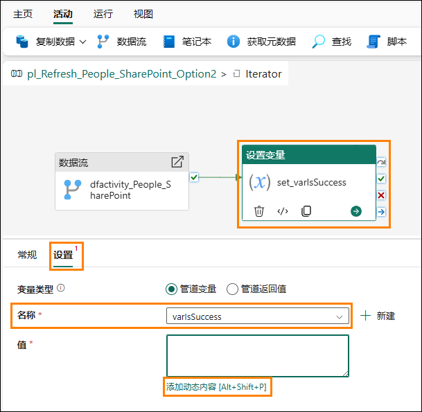

10. 管道表达式生成器对话框随即打开。选择**使用表达式、函数和系统变量文本区域的任意组合在下面添加动态内容 (1)**。

11. 从底部菜单中，单击**省略号(...)(2)**，选择**变量 (3) -> varSuccess (4)**。请注意，“在下方添加动态内容”文本区域中输入了** @variables(‘varSuccess’)**。请注意，在创建变量时，我们已将 varSuccess 变量的值预设为“Yes”。因此，我们要将“Yes”值分配到 varIsSuccess 变量。

12. 选择**确定**。您将导航回到**迭代程序设计窗格**。

    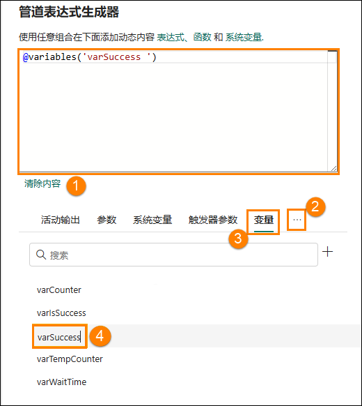

    现在，如果数据流活动失败，我们需要设置计数器。在管道中，我们不能自引用变量。这意味着我们不能通过将计数器变量 varCounter 的值加 1 (varCounter = varCounter + 1) 来递增它的值。因此，我们使用 varTempCounter 变量。

### 任务 10：配置第 2 个设置变量活动

1. 从顶部菜单中，选择**活动 -> 设置变量**。设置变量活动已添加到设计画布中。

2. 选择**设置变量活动**后，在底部窗格中选择**常规**。我们为活动指定名称和说明。

3. 在**名称**字段中，输入** set_varTempCounter**

4. 在**说明**字段中，输入** Increment variable varTempCounter**。

5. 点击数据流活动中的**红色 x 标记**前往新的设置变量活动。因此，在数据流刷新失败后，我们要执行此“设置变量”活动。

    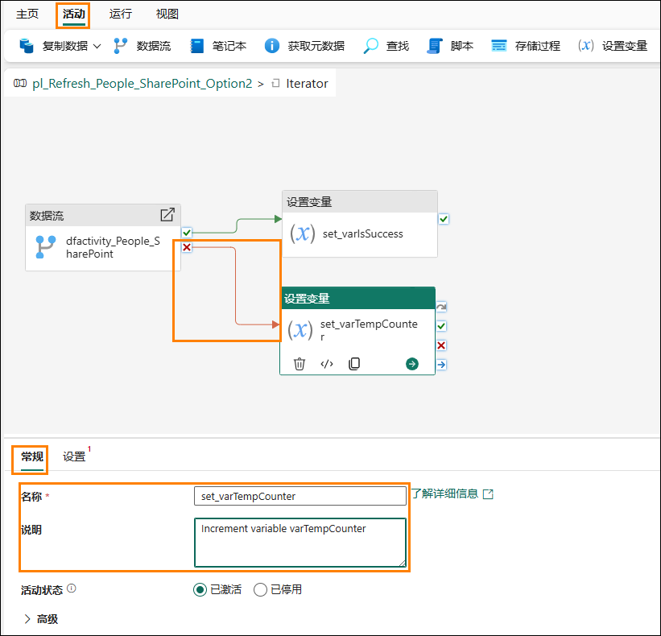

6. 选择**设置变量活动**后，选择底部菜单中的**设置**。

7. 在底部窗格中，确保**变量类型**为**管道变量**。

8. 在**名称**字段中，选择** varTempCounter。**这是我们要设置其值的变量。

9. 在**值**字段中，选择**文本框**。选择**添加动态内容**链接。

10. 管道表达式生成器对话框随即打开。输入 **@add(variables('varCounter'),1)**

    **注意：**自由输入此表达式，使用菜单选择函数，或者复制并粘贴它。该函数将变量 varTempCounter 的值设置为变量 varCounter 的值加 1，(varTempCounter = varCounter + 1)。

    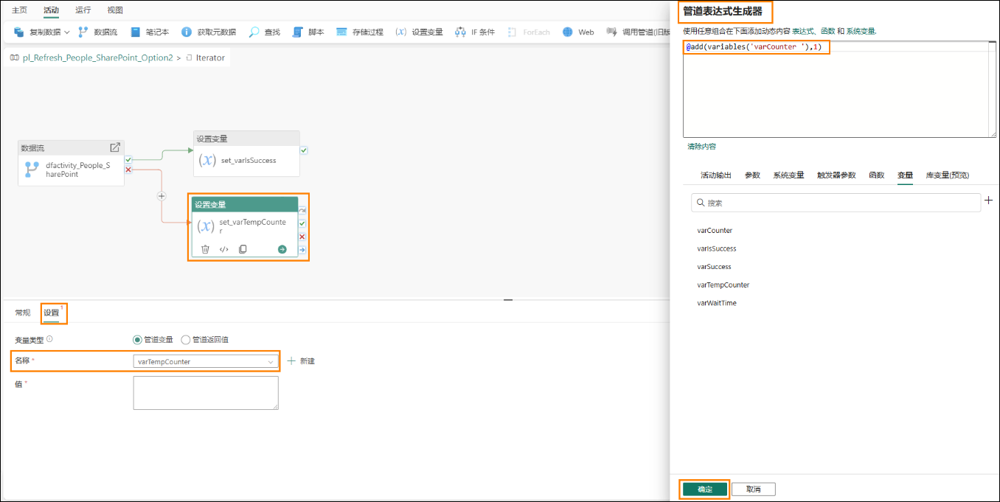

    现在我们需要将 varCounter 变量的值设置为 varTempCounter 的值。

### 任务 11：配置第 3 个设置变量活动

1. 从顶部菜单中，选择**活动 -> 设置变量**。设置变量活动已添加到设计画布中。

2. 选择**设置变量活动**后，在底部窗格中选择**常规**。我们为活动指定名称和说明。

3. 在**名称**字段中，输入** set_varCounter**

4. 在**说明**字段中，输入** Increment variable varCounter**。

5. 点击 set_varTempCounter 设置变量活动中的**绿色复选标记**，并拖动以连接到新的** set_varCounter 设置变量活动**。

    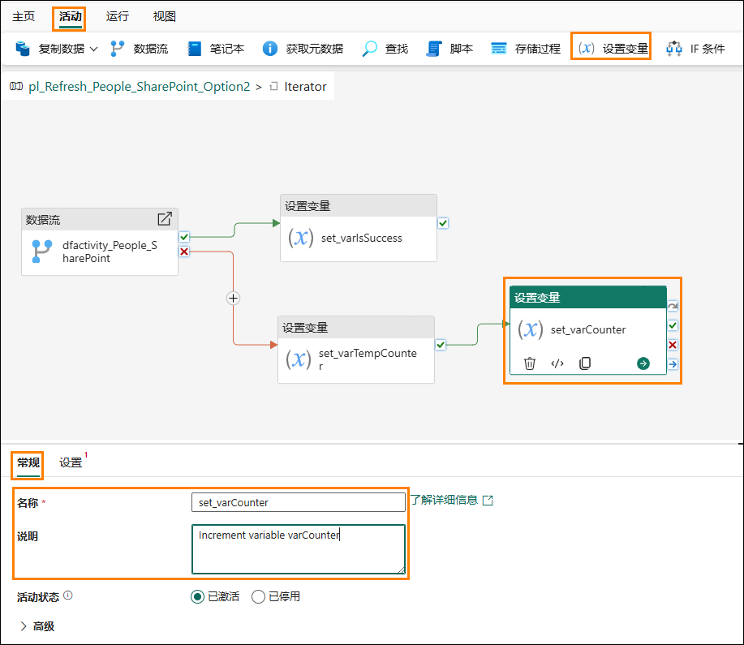

6. 选择**set_varCounter 设置变量活动**后，点击底部菜单中的**设置**。

7. 在底部窗格中，确保**变量类型**为**管道变量**。

8. 在**名称**字段中，选择** varCounter**。这是我们要设置其值的变量。

9. 在**值**字段中，选择**文本框**。选择**添加动态内容**链接。

10. 管道表达式生成器对话框随即打开。输入 **@variables('varTempCounter')**。自由输入此表达式，使用菜单选择函数，或者复制并粘贴它。

11. 单击“确定”。

    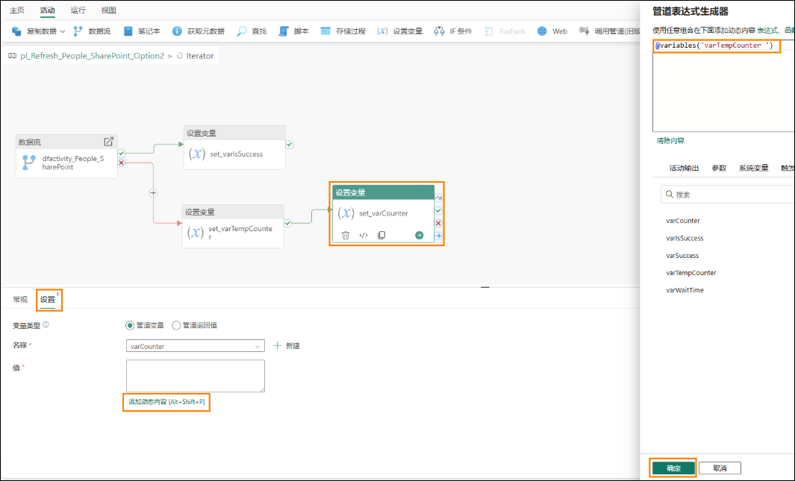

    **注意：**该函数将变量 varCounter 的值设置为变量 varTempCounter 的值 (varCounter = varTempCounter)。每次迭代结束时，varCounter 和 varTempCounter 的值都相同。

### 任务 12：配置等待活动

接下来，如果第一次数据流刷新失败，我们需要等待 5 分钟/300 秒，然后再重试。如果第二次数据流刷新失败，我们需要等待 15 分钟/900 秒，然后再重试。我们将使用等待活动和变量 varWaitTime 来设置等待时间。

1. 从顶部菜单中，选择**活动 -> 省略号 (…) -> 等待**。等待活动已添加到设计画布中。

2. 选择等待活**动**后，在底部窗格中选择常**规**。我们为活动指定名称和说明。

3. 在**名称**字段中，输入** wait_onFailure**。

4. 在**说明**字段中，输入** Wait for 300 seconds on 2nd try and 900 seconds on 3rd try**。

5. 点击 set_varCounter 设置变量活动中的**绿色复选标记**，并拖动以连接到新的** wait_onFailure 等待活动**。

    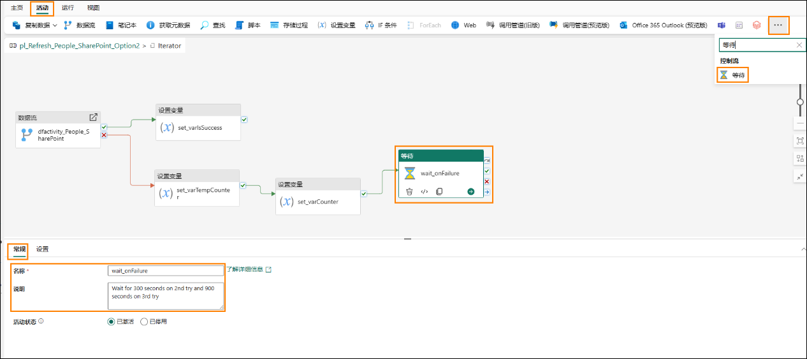

6. 选择**等待活动**后，点击底部菜单中的**设置**。

7. 在**等待时间（以秒为单位）**字段中，选择**文本框**，并选择**添加动态内容**链接。

8. 管道表达式生成器对话框随即打开。输入

    **@if(**

    **greater(variables(‘varCounter’), 1),**

    **if(equals(variables(‘varCounter’), 2),**

    **mul(variables(‘varWaitTime’),15 ),**

    **mul(variables(‘varWaitTime’), 0)**

    **),**

    **mul(variables(‘varWaitTime’),5 )**

    **)**

    自由输入此表达式，使用菜单选择函数，或者复制并粘贴它。

    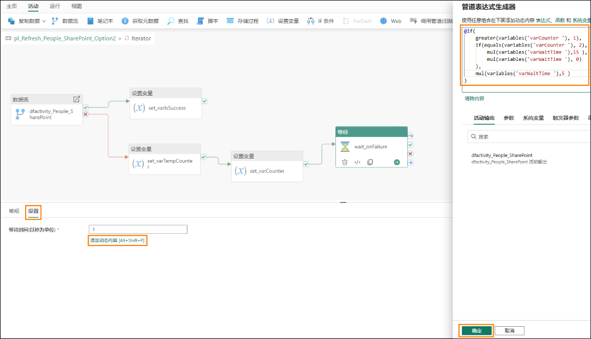

    我们在这里使用两个新函数：

    - **greater：**以两个数字为参数，比较哪个数字更大。

    - **mul：**这是一个乘法函数，它使用两个参数相乘。

    该表达式是一个嵌套的 if 语句。它检查 varCounter 变量的值是否大于 1。

    如果为 true，则检查 varCounter 变量的值是否为 2。如果为 true，则将等待时间设置为 varWaitTime 乘以 15。请注意，我们已经默认了 varWaitTime 值设置为 60。因此 60\*15 = 900 秒。如果 varCounter 变量的值不是 2（大于 2，这意味着数据流刷新已失败 3 次），我们就结束迭代。不再继续等待），等待时间设置为 varWaitTime \* 0，因此设置为 0。如果 varCounter 变量的值为 1，便乘以 varWaitTime \* 5，那就是 60\*5 = 300 秒。

9. 选择**确定**。

    **检查点：**您的** Until** 迭代程序应类似于下面的屏幕截图。

    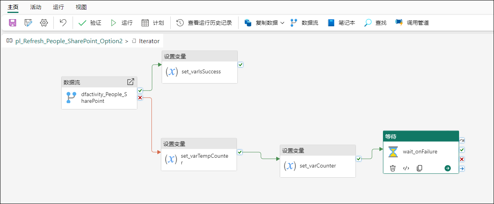

10. 从设计画布的左上角，选择 **pl_Refresh_People_Sharepoint_Option2** 或**主画布以离开** Until 迭代程序。

    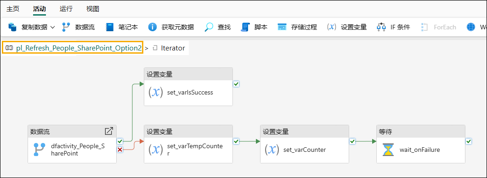

11. 我们已经完成了管道的创建。从顶部菜单中，选择**主页 -> 保存图标**以保存管道。

    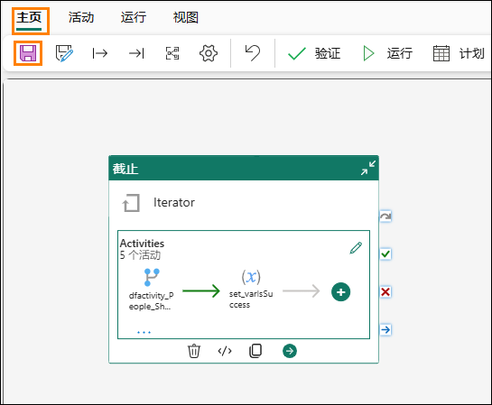

### 任务 13：为管道配置计划刷新

1. 我们可以通过选择**主页 -> 运行**来测试管道。

    **注意：**管道可能需要几分钟才能完成刷新。这是一个培训环境，因此 SharePoint 中的文件始终可用。因此，您的管道永远不会失败。

2. 我们可以将管道设置为按计划执行。从顶部菜单中，选择**主页 -> 计划**。计划对话框随即打开。

3. 选择**计划的运行**下方的**添加计划**按钮。

    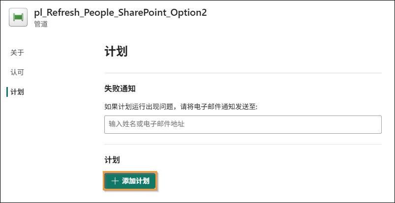

4. 将**重复下拉列表**设置为**每天**。

5. 将**时间**设置为** 9 AM**。

6. 将**开始日期和时间**设置为**今天**。

7. 将**结束日期和时间**设置为**未来的日期**。

8. 设置您的**时区**。

    **注意：**由于这是实验环境，因此您可以将时区设置为您的首选时区。在实际应用场景中， 您将根据您本人/数据源的位置设置时区。

9. 选择**保存**。

10. 选择对话框右上角的 **X** 标记将其关闭。

    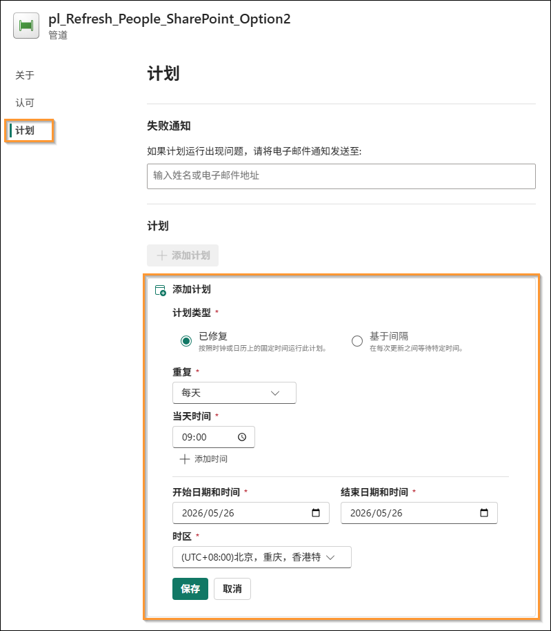

11. 从左侧面板中选择您的 Fabric 工作区 **FAIAD_<username>**，以导航到工作区。

    **注意：**在计划屏幕中，没有通知成功或失败的选项（和数据流计划一样）。可以通过在管道中添加活动来提供通知。我们不在本实验室中进行此操作，因为这是实验室环境。

    我们已经计划了各种数据源的刷新。在下一个实验室中，我们将创建具有关系、度量值其他建模操作的语义模型。

# 参考

Fabric Analyst in a Day (FAIAD) 介绍了 Microsoft Fabric 中提供的一些主要功能。在服务菜单中，“帮助 (?)”部分包含指向一些优质资源的链接。

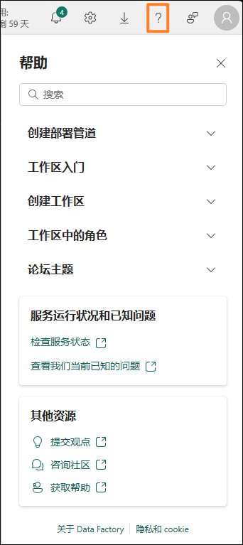

以下更多参考资源可帮助您进行与 Microsoft Fabric 相关的后续步骤。

- 请参阅博客文章以阅读完整的 [Microsoft Fabric GA 公告](https://aka.ms/Fabric-Hero-Blog-Ignite23)

- 通过[引导式教程](https://aka.ms/Fabric-GuidedTour)探索 Fabric

- 注册 [Microsoft Fabric 免费试用版](https://aka.ms/try-fabric)

- 访问 [Microsoft Fabric 网站](https://aka.ms/microsoft-fabric)

- 通过探索 [Fabric 学习模块](https://aka.ms/learn-fabric)学习新技能

- 探索 [Fabric 技术文档](https://aka.ms/fabric-docs)

- 阅读[有关 Fabric 入门指南的免费电子书](https://aka.ms/fabric-get-started-ebook)

- 加入 [Fabric 社区](https://aka.ms/fabric-community)发布问题、分享反馈并向他人学习

阅读更多深度 Fabric 体验公告博客：

- [Fabric 中的 Data Factory 体验博客](https://aka.ms/Fabric-Data-Factory-Blog)

- [Fabric 中的 Synapse Data Engineering 体验博客](https://aka.ms/Fabric-DE-Blog)

- [Fabric 中的 Synapse Data Science 体验博客](https://aka.ms/Fabric-DS-Blog)

- [Fabric 中的 Synapse Data Warehousing 体验博客](https://aka.ms/Fabric-DW-Blog)

- [Fabric 中的 Synapse Real-Time Analytics 体验博客](https://aka.ms/Fabric-RTA-Blog)

- [Power BI 公告博客](https://aka.ms/Fabric-PBI-Blog)

- [Fabric 中的 Data Activator 博客](https://aka.ms/Fabric-DA-Blog)

- [Fabric 中的管理和治理博客](https://aka.ms/Fabric-Admin-Gov-Blog)

- [Fabric 中的 OneLake 博客](https://aka.ms/Fabric-OneLake-Blog)

- [Dataverse 和 Microsoft Fabric 集成博客](https://aka.ms/Dataverse-Fabric-Blog)

© 2023 Microsoft Corporation.保留所有权利。

使用此演示/实验即表示您已同意以下条款：

本演示/实验中的技术/功能由 Microsoft Corporation 出于获取反馈和提供学习体验的目的提供。只能将本演示/实验用于评估这些技术特性和功能以及向 Microsoft 提供反馈。不得用于任何其他用途。不得对此演示/实验或其任何部分进行修改、复制、分发、传送、显示、执行、复制、公布、许可、转让、销售或基于以上内容创建衍生作品。

严禁将本演示/实验（或其任何部分）复制到任何其他服务器或位置以便进一步复制或再分发。

本演示/实验出于上述目的，在不涉及复杂设置或安装操作的模拟环境中提供特定软件技术/产品特性和功能，包括潜在的新功能和概念。本演示/实验中展示的技术/概念可能不是完整的功能，可能会以不同于最终版本的工作方式工作。我们也可能不会发布此类功能或概念的最终版本。在物理环境中使用此类特性和功能的体验可能也有所不同。

**反馈。**如您针对本演示/实验中所述的技术特性、功能和/或概念向 Microsoft 提供反馈，则意味着您向 Microsoft 无偿提供以任何方式、出于任何目的使用和分享您的反馈并将其商业化的权利。您同样无偿为第三方提供其产品、技术和服务使用或配合使用包含此反馈的 Microsoft 软件或服务的任何特定部分所需的任何专利权。如果根据某项许可的规定，Microsoft 由于在其软件或文档中包含了您的反馈需要向第三方授予该软件或文档的许可，请不要提供这样的反馈。这些权利在本协议终止后继续有效。

对于本演示/实验，Microsoft Corporation 不提供任何明示、暗示或法定的保证和条件，包括有关适销性、针对特定目的的适用性、所有权和不侵权的所有保证和条件。对于使用本演示/实验产生的结果或输出内容的准确性，或者出于任何目的包含本演示/实验中的信息的适用性，Microsoft 不做任何保证或陈述。

**免责声明**

本演示/实验仅包含 Microsoft Power BI 的部分新功能和增强功能。在产品的后续版本中，部分功能可能有所更改。在本演示/实验中，可了解部分新功能，但并非全部新功能。
