# Microsoft Fabric - Fabric Analyst in a Day - 实验室 6


## 目录

- 简介
- 湖屋 - 分析数据
  - 任务 1：使用 SQL 查询数据
  - 任务 2：可视化 T-SQL 结果
- 湖屋 - 语义建模
  - 任务 3：创建语义模型
  - 任务 4：创建关系
  - 任务 5：创建度量值
  - 任务 6：可选部分 - 创建关系
  - 任务 7：可选部分 - 创建度量值
- 参考


# **简介**

我们已将来自不同来源的数据引入到湖屋中。在本实验室中，您将使用语义模型。通常，我们在 Power BI Desktop 中执行创建关系、添加度量值等建模活动。接下来，我们将了解如何在该服务中执行这些建模活动。

在本实验室结束时，您将了解到：

- 在 SQL 分析终结点中使用 SQL 视图

- 如何创建语义模型

# **湖屋 - 分析数据**

## 任务 1：使用 SQL 查询数据

1. 让我们导航回您在实验室 2 任务 8 中创建的 Fabric 工作区 **FAIAD_<inject key="Deployment ID" enableCopy="false"/>**。

2. 您可以选择**最小化任务流**以查看完整的项目列表。

3. 您将看到与 lh_FAIAD 关联的三个元素 - 湖屋、语义模型和 SQL 终结点。我们在之前的实验室中**探索**了**湖屋**并使用 **SQL 分析终结点**创建了视觉对象查询。在左侧导航中选择 **FAIAD_<inject key="Deployment ID" enableCopy="false"/>**，然后选择 **lh_FAIAD SQL 分析终结点**选项以继续探索此选项。 系统会将您导航回资源管理器的 SQL 视图。

    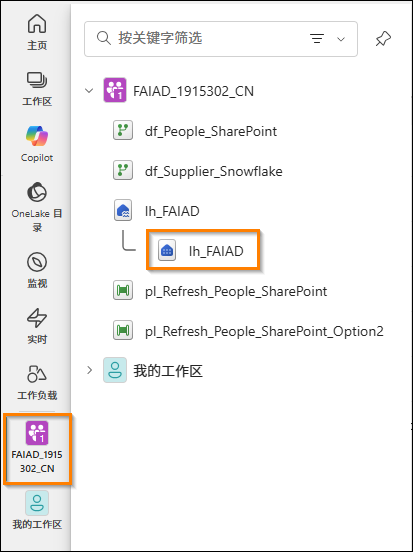

    如果您想在创建数据模型之前探索数据，可以使用 SQL 执行此操作。可通过两个选项使用 SQL。 选项 1 是视觉对象查询，我们在之前的实验室中使用了此查询，还有选项 2，即编写 TSQL 代码。此选项适合开发人员。让我们来探索一下此选项。

    假设您想要使用 SQL 快速找出供应商销售的单位数量。

    请注意，在湖屋、SQL 分析终结点的左侧面板中，您可以查看表。展开表后，可以查看组成表的列。此外，还有创建 SQL 视图、函数和存储过程的选项。如果您具备 SQL 背景知识，请随意探索这些选项。我们来尝试编写一个简单的 SQL 查询。

4. 从**顶部菜单**中选择**新建 SQL 查询**，或从屏幕中心单击**新建 SQL 查询**。您将导航到 SQL 查询视图。

    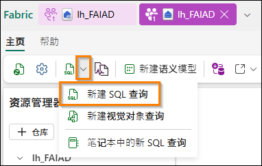

5. 将**以下 SQL 查询**粘贴到**查询窗口**中。此查询将返回“units by Supplier”名称。它将 Sales 表与 Product 和 Supplier 表联接起来以实现此目的。

    ```sql
    SELECT su.SupplierName, SUM(Quantity) as Units
    FROM dbo.Sales s
    JOIN dbo.Product p on p.StockItemID = s.StockItemID
    JOIN dbo.Supplier su on su.SupplierID = p.SupplierID
    GROUP BY su.SupplierName
    ```

6. 在 SQL 编辑器菜单中单击**运行**以查看结果。

7. 请注意，有一个选项用于通过选择**另存为视图**来将此查询另存为视图。

8. 选项 1 是视觉对象查询，我们在之前的实验室中使用了此查询，还有选项 2，即编写 TSQL 代码。这里提供一个选项用于重命名并保存该查询以供将来使用。还有一个选项用于使用 **Shared queries** 文件夹查看与您共享的查询。

    **注意**：您在之前的实验室中创建的视觉对象查询也可在“My queries”文件夹下找到。

    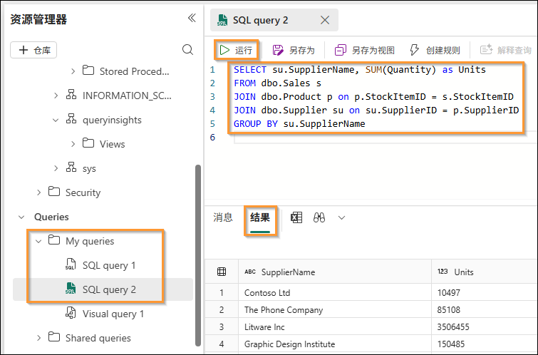

## 任务 2：可视化 T-SQL 结果

1. 我们还可以可视化该查询的结果。在查询窗格中**突出显示查询**

2. 在“结果”窗格菜单中，选择下拉列表图标 -> **可视化结果。**

    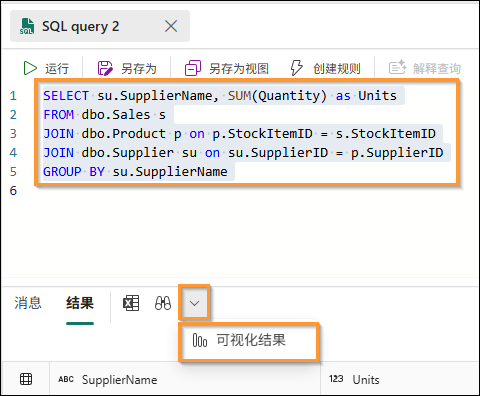

3. **可视化结果**对话框随即打开。选择**继续**。

    **可视化结果**对话框随即打开，外观类似于 Power BI Desktop 报表视图。它具有 Power BI Desktop 报表视图中提供的所有功能，您可以设置页面格式、选择不同的视觉对象、设置视觉对象格式、添加筛选器等。在本课程中，我们不会探索这些选项。

4. 展开**数据**窗格并展开 **SQL 查询 2**。

5. 选择 **Supplier_Name** 和 **Units** **字段**。表视觉对象已创建。

    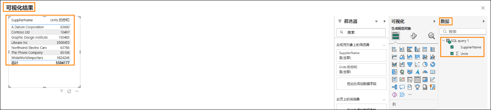

6. 从**可视化**部分中，通过选择**堆积柱形图**更改视觉对象类型。

7. 选择屏幕右下角的**另存为报表**。

    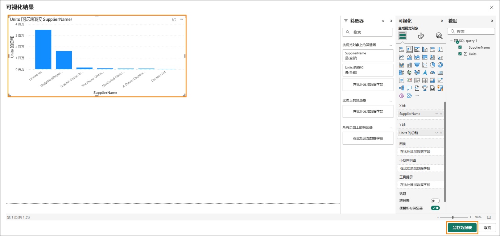

8. “保存报表”对话框随即打开。在**为报表输入名称**文本框中，键入**Units by Supplier**。

9. 确保目标工作区是您的 Fabric 工作区 **FAIAD_<inject key="Deployment ID" enableCopy="false"/>**

10. 选择**保存**。

    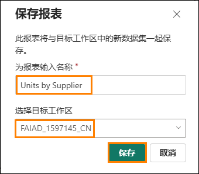

    系统会将您导航回“SQL 查询”屏幕。

# **湖屋 - 语义建模**

## 任务 3：创建语义模型

1. 从“SQL 分析终结点”菜单中，选择**新建语义模型**。

    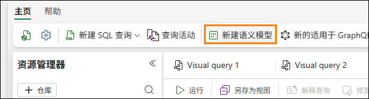

2. “新建语义模型”对话框随即打开。输入 **sm_FAIAD** 作为 Direct Lake 语义模型名称。

3. 默认情况下，我们可以选择表的子集。请记住，我们在之前的实验室中创建了视图。我们希望在模型中包含这些视图。展开 **dbo** 架构，从这里您可以查看湖屋中的所有表和视图。

    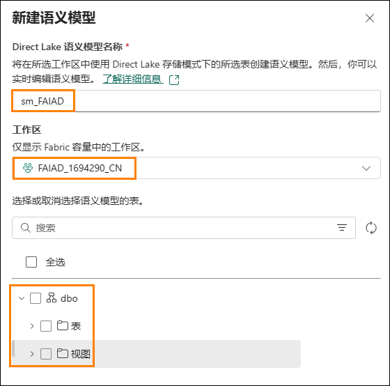

4. **选择**以下表/视图：

    1. **Customer**

    2. **Date**

    3. **People**

    4. **PO**

    5. **Supplier**

    6. **Geo**

    7. **Product**

    8. **Reseller**

    9. **Sales**

5. 选择**确认**。

    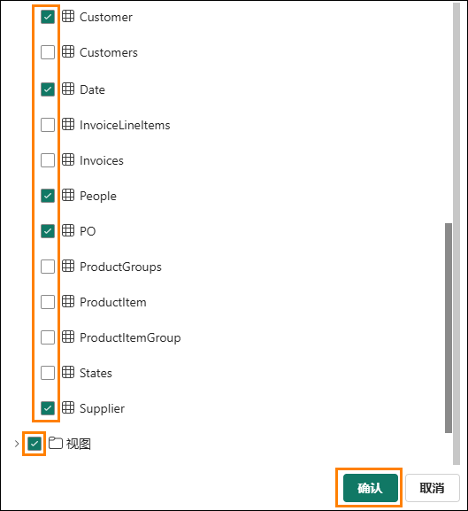

    系统会将您导航到包含所选表的新语义模型。请注意，某些表（Geo、Reseller、Sales 和 Product）的右上角会显示警告标志。这是因为这些是视图。使用这些视图中的字段创建的任何视觉对象都将处于 Direct Query 模式，而不是 Direct Lake 模式。

    **注意**：Direct Lake 模式比 Direct Query 模式更快。

## 任务 4：创建关系

如果您当前不在新创建的语义模型中，让我们来访问正确的位置

1. 让我们导航回 **Fabric 工作区**，然后选择 **sm_FAIAD** 语义模型。

    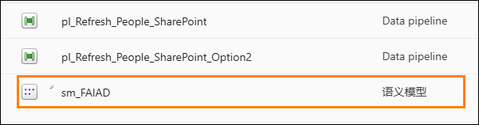

2. 单击**打开语义模型**。

    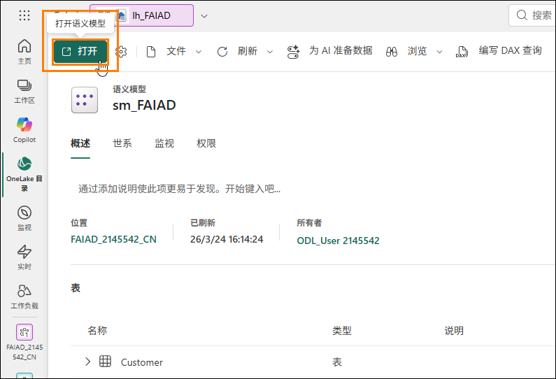

3. 在右上角，确保您处于**编辑**模式下

    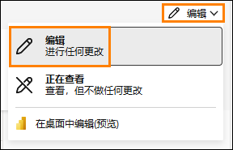

4. 第一步是创建这些表之间的关系。

    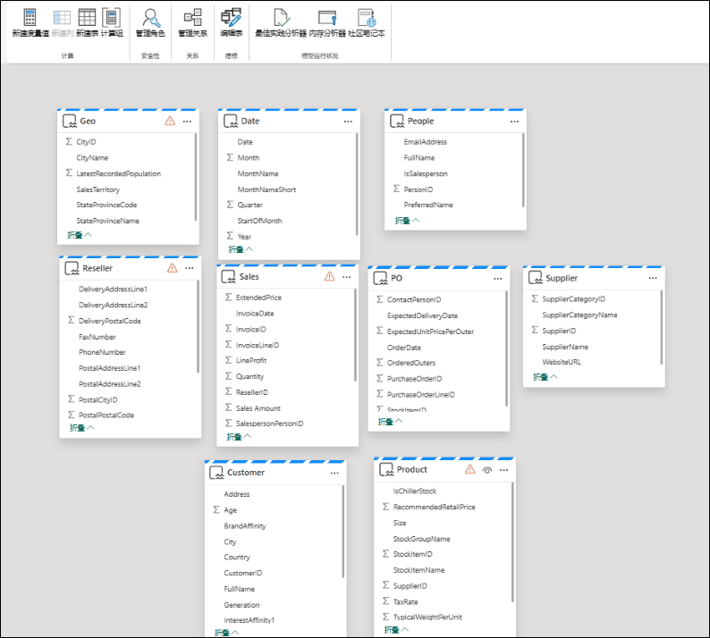

5. 让我们在 Sales 和 Reseller 表之间创建关系。从 **Sales** 表中选择 **ResellerID**，并将其拖动到 **Reseller** 表中的 **ResellerID**。

    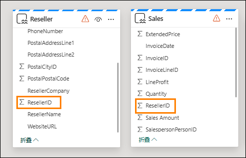

6. “新建关系”对话框随即打开。确保**从表**是 **Sales**，**列**是 **ResellerID**。

7. 确保**到表**是 **Reseller**，**列**是 **ResellerID**。

8. 确保**基数**是**多对一(\*:1)**。

9. 确保**交叉筛选器方向**是**单向**。

10. 选择**保存**。

    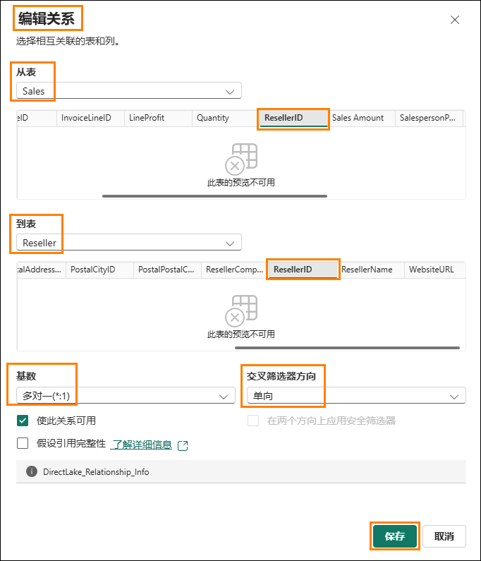

11. 同样，在 Sales 和 Date 表之间创建关系。从 **Sales** 表中选择 **InvoiceDate**，并将其拖动到 **Date** 表中的 **Date**。

12. “新建关系”对话框随即打开。确保**从表**是 **Sales**，**列**是 **InvoiceDate**。

13. 确保**到表**是 **Date**，**列**是 **Date**。

14. 确保**基数**是**多对一(\*:1)**。

15. 确保**交叉筛选器方向**是**单向**。

16. 选择**保存**。

    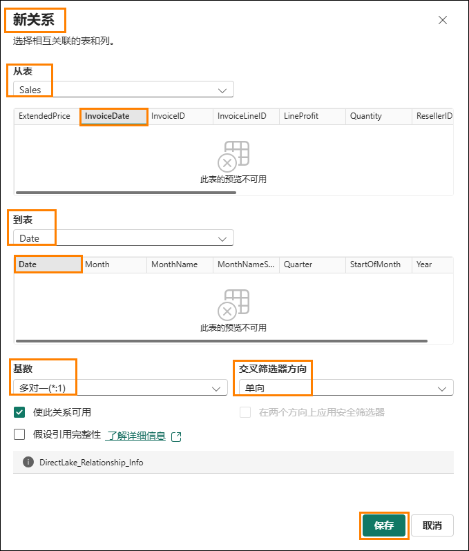

17. 同样，在 **Sales** 和 **Product** 表之间创建**多对一**关系。从**Sales** 表中选择 **StockItemID**，
    从 **Product** 表中选择 **StockItemID**。

    **注意**：我们的所有更新将自动保存。

    **检查点**：您的模型应在 Sales 和 Reseller 表、Sales 和 Date 表以及 Sales 和 Product 表之间建立三种关系，如下面的屏幕截图所示：

    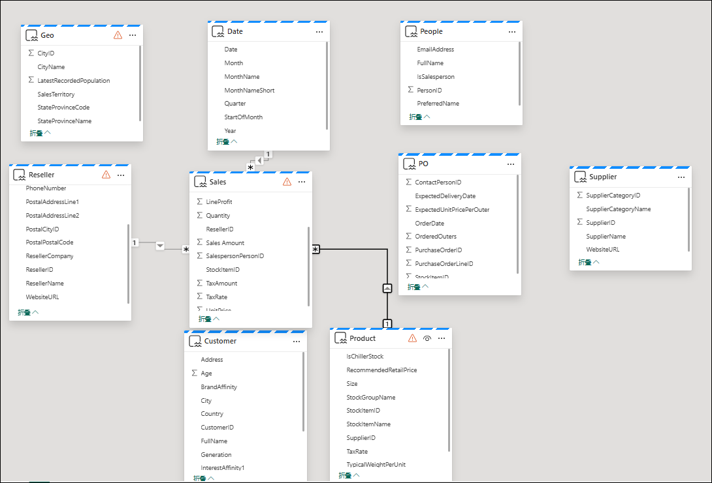

    为了节省时间，我们不会创建所有关系。如果时间允许，在实验室结束后，您可以完成可选部分。可选部分将引导您完成创建其余关系的步骤。

## 任务 5：创建度量值

让我们添加一些创建 Sales 仪表板所需的度量值。

1. 从模型视图中选择 **Sales 表**。我们想要将度量添加到 Sales 表中。

2. 从顶部菜单中，选择**主页 -> 新建度量值**。请注意，编辑栏已显示。

3. 在**编辑栏**中输入**Sales = SUM(‘Sales’[Sales Amount])**。

4. 单击编辑栏左侧的**复选标记**，或单击**Enter** 按钮。

5. 展开右侧的“属性”面板。

6. 展开**格式化**部分。

7. 从**格式**下拉菜单中，选择**货币**。

8. 将小数位数设置为 **0**。

    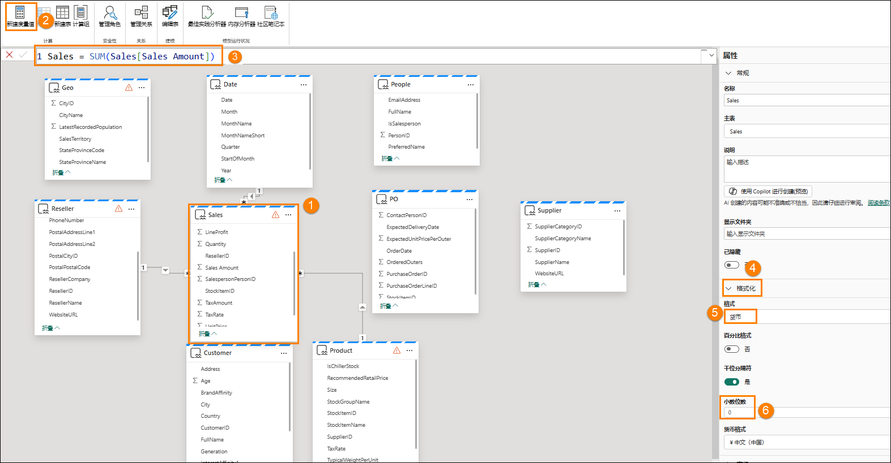

9. 从顶部菜单中选择 **Sales 表**后，选择**主页 -> 新建度量值**。请注意，编辑栏已显示。

10. 在**编辑栏**中输入**Units = SUM(‘Sales’[Quantity])**。

11. 点击编辑栏左侧的**复选标记**，或点击**Enter** 按钮。

12. 在右侧的“属性”面板中，展开**格式化**部分（加载“属性”面板可能需要一些时间）。

13. 从**格式**下拉菜单中，选择**整数**。

14. 使用滑块将**千位分隔符**设置为**是**。

    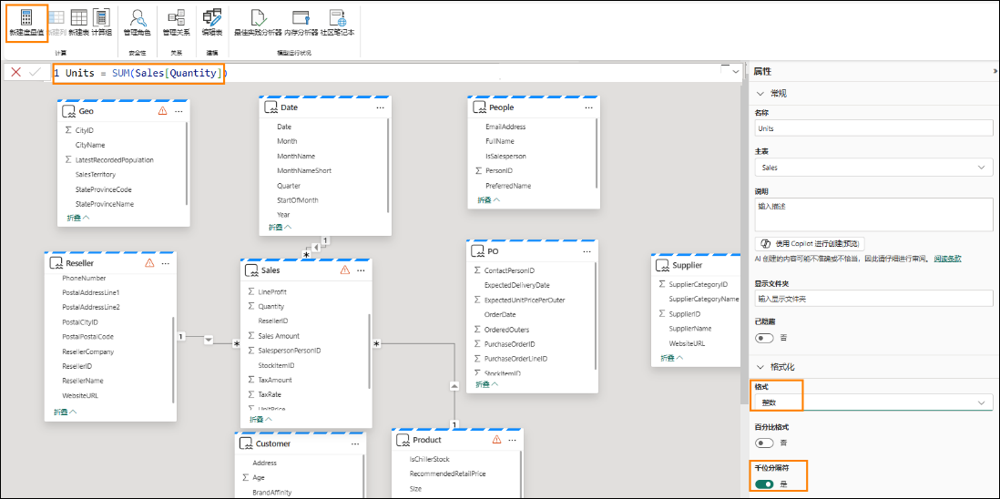

15. 从顶部菜单中选择 **Sales 表**后，选择**主页 -> 新建度量值**。请注意，编辑栏已显示。

16. 在**编辑栏**中输入**Sales Orders = DISTINCTCOUNT(‘Sales’[InvoiceID])**。

17. 点击编辑栏左侧的**复选标记**，或点击**Enter** 按钮。

18. 在右侧的“属性”面板中，展开**格式化**部分。

19. 从**格式**下拉菜单中，选择**整数**。

20. 使用滑块将**千位分隔符**设置为**是**。

    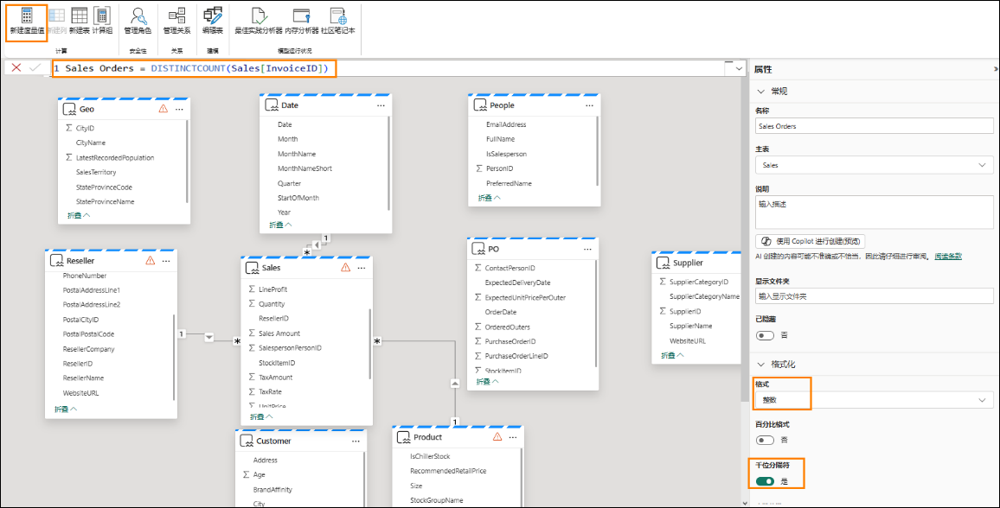

21. 在**数据面板**（右侧）中，选择**模型**。请注意，这将提供一个视图，该视图有助于组织语义模型中的所有项。

22. 展开**语义模型 -> 度量值**以查看您刚创建的所有度量值。

23. 您还可以**展开单个表**以查看每个表中的列、层次结构和度量值。

    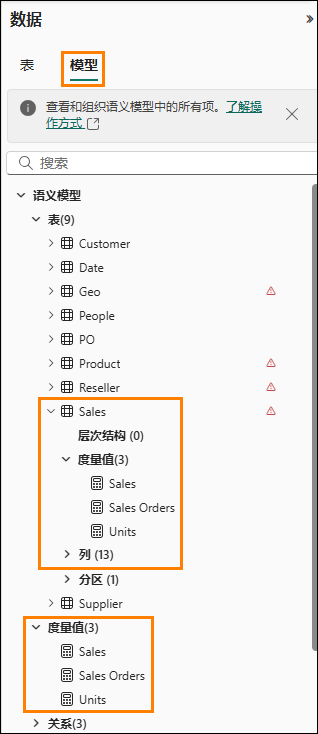

    同样，为了节省时间，我们不会创建所有度量值。如果时间允许，在实验室结束后，您可以完成可选部分。可选部分将指导您完成创建其余度量值的步骤。

    我们已经创建了语义模型，下一步是创建报表。我们将在下一个实验室中执行此操作。

## 任务 6：可选部分 - 创建关系

让我们来添加其余关系。

1. 从菜单中，选择 **“主页 -> 管理关系”**。

2. “管理关系”对话框随即打开。选择 **+ 新建关系**。

    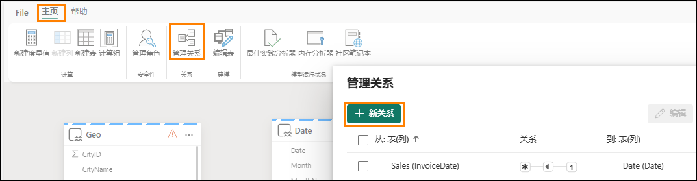

3. “新建关系”对话框随即打开。确保**从表**是**Sales**，**列**是**SalespersonPersonID**。

4. 确保**到表**是**People**，**列**是**PersonID**。

5. 确保**基数**是**多对一(\*:1)**。

6. 确保**交叉筛选器方向**是**单向**。

7. 选择**保存**。“管理关系”对话框随即打开，其中已添加新关系。

    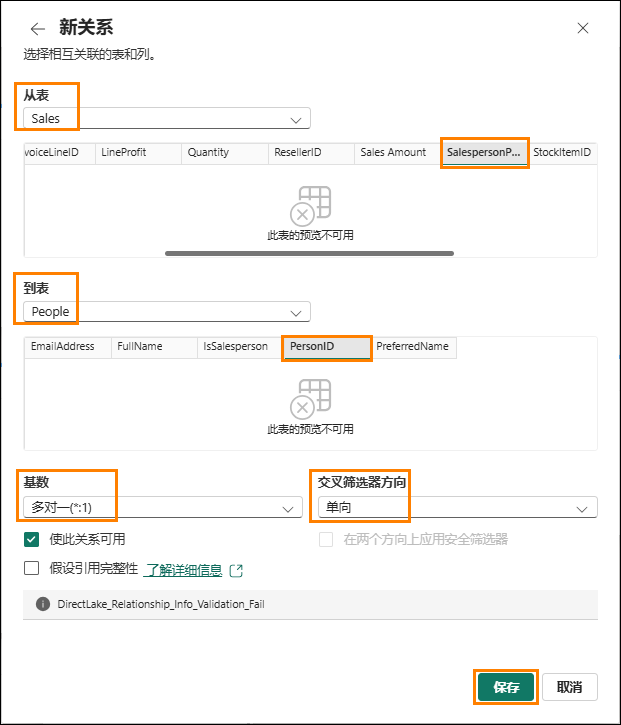

8. 现在，让我们在 Product 和 Supplier 之间创建关系。选择 **+ 新建关系**。

9. 确保**从表**是 **Product**，**列**是 **SupplierID**。

10. 确保**到表**是 **Supplier**，**列**是 **SupplierID**。

11. 确保**基数**是**多对一(\*:1)**。

12. 确保**交叉筛选器方向**是**双向**。

13. 选择**保存**。

    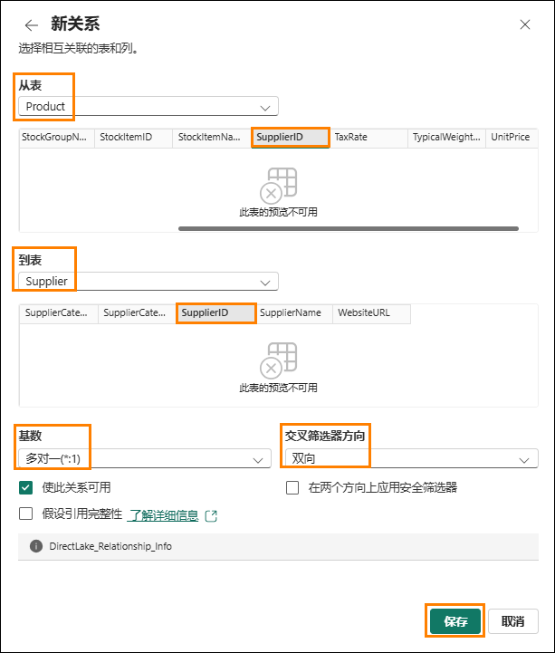

14. 现在，让我们在 Reseller 和 Geo 之间创建关系。选择 **+ 新建关系**。

15. “新建关系”对话框随即打开。确保**从表**是 **Reseller**，**列**是 **PostalCityID**。

16. 确保**到表**是 **Geo**，**列**是 **CityID**。

17. 确保**基数**是**多对一(\*:1)**。

18. 确保**交叉筛选器方向**是**双向**。

19. 选择**保存**。

    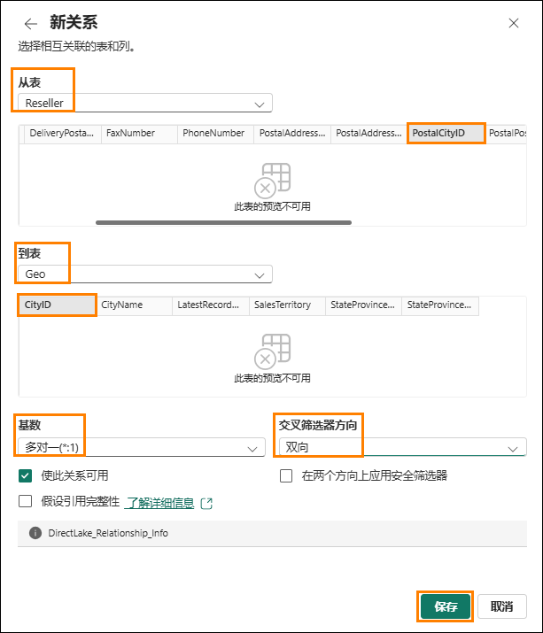

20. 同样，在 Customer 和 Reseller 之间创建关系。选择 **+ 新建关系**。

21. “新建关系”对话框随即打开。确保**从表**是 **Customer**，**列**是 **ResellerID**。

22. 确保**到表**是 **Reseller**，**列**是 **ResellerID**。

23. 确保**基数**是**多对一(\*:1)**。

24. 确保**交叉筛选器方向**是**单向**。

25. 选择**保存**。

    **检查点**：管理关系应类似于下面的屏幕截图。

    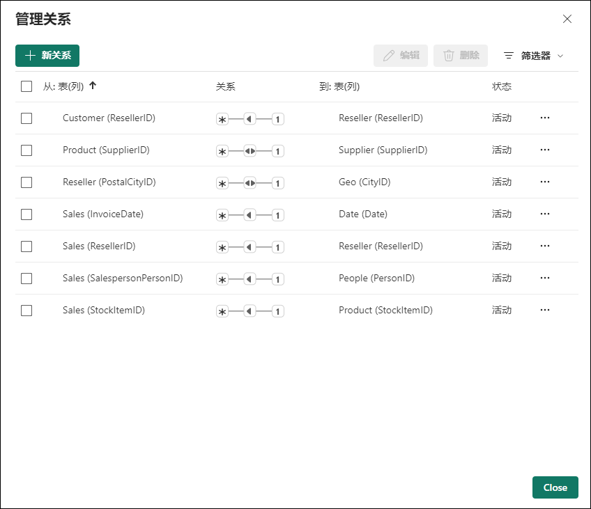

26. 同样，在 **PO** 和 **Date** 之间创建**多对一**关系。从 **PO** 中选择 **Order_Date**，从 **Date** 中选择 **Date**。

27. 同样，在 **PO** 和 **Product** 之间创建**多对一**关系。从 **PO** 中选择 **StockItemID**，从 **Product** 中选择 **StockItemID**。

28. 同样，在 **PO** 和 **People** 之间创建**多对一**关系。从 **PO** 中选择 **ContactPersonID**，从 **People** 中选择 **PersonID**。

29. 选择**关闭**以关闭“管理关系”对话框。我们已经创建了所有关系。

    **检查点**：您的模型应类似于下面的屏幕截图。

    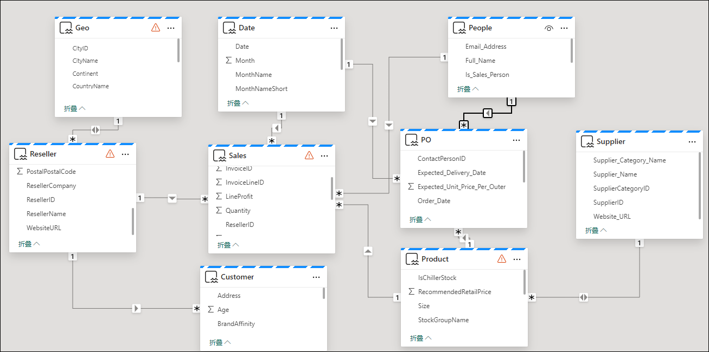

## 任务 7：可选部分 - 创建度量值

让我们来添加其余度量值。

1. 选择 **Sales** 表，然后从顶部菜单中选择**主页 -> 新建度量值**。

2. 在编辑栏中输入 **Avg Order = DIVIDE([Sales], [Sales Orders])**。

3. 单击编辑栏中的**复选标记**，或单击 Enter 按钮。

4. 展开右侧的“属性”面板。

5. 展开**格式化**部分。

6. 从**格式**下拉菜单中，选择**货币**。

7. 将小数位数设置为 0。

    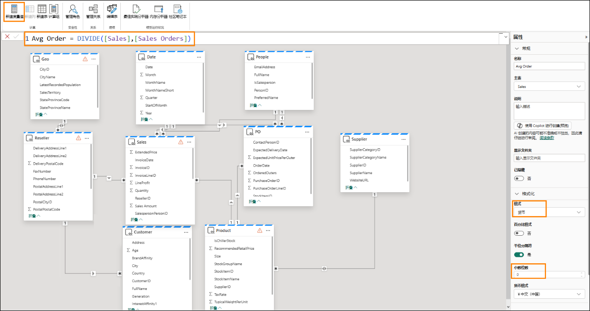

8. 按照相似的步骤添加以下度量值：

    1. 在 **Sales** 表中，**GM = SUM(‘Sales’[LineProfit])** 的格式已**设置**为**不带小数位数的货币**。

    2. 在 **Sales** 表中，**GM% = DIVIDE([GM], [Sales])** 的格式已设置为**不带小数位数的百分比**。

    3. 在 **Customer** 表中，**No of Customers = COUNTROWS(Customer)** 格式已设置为**已启用千位分隔符的整数**。

# **参考**

Fabric Analyst in a Day (FAIAD) 向您介绍了 Microsoft Fabric 中提供的一些主要功能。在服务菜单中，“帮助 (?)”部分包含指向一些优质资源的链接。

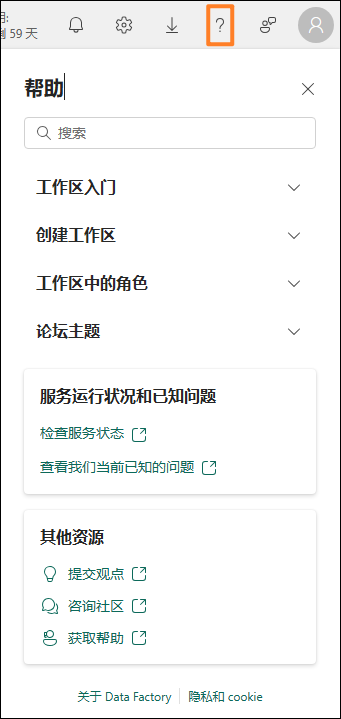

以下更多参考资源可帮助您进行与 Microsoft Fabric 相关的后续步骤。

- 请参阅博客文章以阅读完整的 [Microsoft Fabric GA 公告](https://aka.ms/Fabric-Hero-Blog-Ignite23)

- 通过[引导式教程](https://aka.ms/Fabric-GuidedTour)探索 Fabric

- 注册 [Microsoft Fabric 免费试用版](https://aka.ms/try-fabric)

- 访问 [Microsoft Fabric 网站](https://aka.ms/microsoft-fabric)

- 通过探索 [Fabric 学习模块](https://aka.ms/learn-fabric)学习新技能

- 探索 [Fabric 技术文档](https://aka.ms/fabric-docs)

- 阅读[有关 Fabric 入门指南的免费电子书](https://aka.ms/fabric-get-started-ebook)

- 加入 [Fabric 社区](https://aka.ms/fabric-community)发布问题、分享反馈并向他人学习

阅读更多深度 Fabric 体验公告博客：

- [Fabric 中的 Data Factory 体验博客](https://aka.ms/Fabric-Data-Factory-Blog)

- [Fabric 中的 Synapse Data Engineering 体验博客](https://aka.ms/Fabric-DE-Blog)

- [Fabric 中的 Synapse Data Science 体验博客](https://aka.ms/Fabric-DS-Blog)

- [Fabric 中的 Synapse Data Warehousing 体验博客](https://aka.ms/Fabric-DW-Blog)

- [Fabric 中的 Synapse Real-Time Analytics 体验博客](https://aka.ms/Fabric-RTA-Blog)

- [Power BI 公告博客](https://aka.ms/Fabric-PBI-Blog)

- [Fabric 中的 Data Activator 博客](https://aka.ms/Fabric-DA-Blog)

- [Fabric 中的管理和治理博客](https://aka.ms/Fabric-Admin-Gov-Blog)

- [Fabric 中的 OneLake 博客](https://aka.ms/Fabric-OneLake-Blog)

- [Dataverse 和 Microsoft Fabric 集成博客](https://aka.ms/Dataverse-Fabric-Blog)

© 2026 Microsoft Corporation.保留所有权利。

使用此演示/实验即表示您已同意以下条款：

本演示/实验中的技术/功能由 Microsoft Corporation 出于获取反馈和提供学习体验的目的提供。只能将本演示/实验用于评估这些技术特性和功能以及向 Microsoft 提供反馈。不得用于任何其他用途。不得对此演示/实验或其任何部分进行修改、复制、分发、传送、显示、执行、复制、公布、许可、转让、销售或基于以上内容创建衍生作品。

严禁将本演示/实验（或其任何部分）复制到任何其他服务器或位置以便进一步复制或再 分发。

本演示/实验出于上述目的，在不涉及复杂设置或安装操作的模拟环境中提供特定软件技术/产品特性和功能，包括潜在的新功能和概念。本演示/实验中展示的技术/概念可能不是完整的功能，可能会以不同于最终版本的工作方式工作。我们也可能不会发布此类功能或概念的最终版本。在物理环境中使用此类特性和功能的体验可能也有所不同。

**反馈。** 如您针对本演示/实验中所述的技术特性、功能和/或概念向 Microsoft 提供反馈，则意味着您向 Microsoft 无偿提供以任何方式、出于任何目的使用和分享您的反馈并将其商业化的权利。您同样无偿为第三方提供其产品、技术和服务使用或配合使用包含此反馈的 Microsoft 软件或服务的任何特定部分所需的任何专利权。如果根据某项许可的规定，Microsoft 由于在其软件或文档中包含了您的反馈需要向第三方授予该软件或文档的许可，请不要提供这样的反馈。这些权利在本协议终止后继续有效。

对于本演示/实验，Microsoft Corporation 不提供任何明示、暗示或法定的保证和条件，包括有关适销性、针对特定目的的适用性、所有权和不侵权的所有保证和条件。对于使用本演示/实验产生的结果或输出内容的准确性，或者出于任何目的包含本演示/实验中的信息的适用性，Microsoft 不做任何保证或陈述。

**免责声明**

本演示/实验仅包含 Microsoft Power BI 的部分新功能和增强功能。在产品的后续版本中，部分功能可能有所更改。在本演示/实验室中，您将了解部分新功能，但并非全部新功能。
