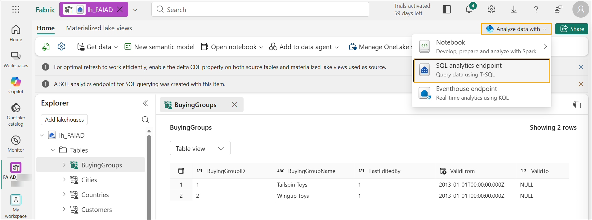

# Microsoft Fabric - Fabric Analyst in a Day - Lab 3


# Contents

- Introduction

- Shortcut to ADLS Gen2

    - Task 1: Create Shortcut

- Transform data using Visual Query

    - Task 2: Create Geo view using Visual Query

    - Task 3: Create Reseller, Sales, and Product views using a SQL Query

- References

# Introduction

In our scenario, Sales Data comes from the ERP system and is stored in an ADLS Gen2. It gets updated at noon / 12 PM every day. We need to transform and ingest this data into Lakehouse and use it in our model.

There are multiple ways to ingest this data.

- **Shortcuts:** This creates a link to the data, and we can use Visual query views to transform it. We are going to use Shortcuts in this lab.

- **Notebooks:** This requires us to write code. It is a developer friendly approach.

- **Dataflow Gen2:** You are probably familiar with Power Query or Dataflow Gen1. Dataflow Gen2, as the name indicates, is the newer version of Dataflow. It provides all the capabilities of Power Query / Dataflow Gen1 with the added ability to transform and ingest data into multiple data sources. We are going to introduce this in the next couple of labs.

- **Pipeline:** This is an orchestration tool. Activities can be orchestrated to extract, transform, and ingest data. We will be using A pipeline to execute Dataflow Gen2 activity which in turn will perform extraction, transformation, and ingestion.

We will start by creating a Shortcut to ingest data into a Lakehouse from ADLS Gen2 data source. Once ingested, we are going to use Visual query views to transform it.

By the end of this lab, you will have learned:

- How to create Shortcuts in your Lakehouse

- How to transform data using the Visual query feature

# Shortcut to ADLS Gen2

## Task 1: Create Shortcut

Shortcuts are used to create a link to the target location. Shortcuts provide access to the data without needing to physically move the data into the lakehouse. This is like creating shortcuts in Windows desktop.

1. In the top of your screen select the **lh_FAIAD** tab to navigate to the Lakehouse.

1. If you don’t have a tab you can navigate back to your Workspace and open the Lakehouse from there.

2. In the **Explorer** panel, select the **ellipsis** next to **Tables**.

3. Select **New Shortcut**.

    

4. **New Shortcut** dialog opens. Under **External sources**, select **Azure Data Lake Storage Gen2**.

    

5. Select **New connection (1)**.

6. Enter the following link for the **URL** property: https://stvnextblobstorage.dfs.core.windows.net/fabrikam-sales **(2)**

7. Click on **Create New Connection (3)** under the Connection section

8. Select **Shared Access Signature (SAS) (4)** from the Authentication kind dropdown.

9. Copy the SAS token and paste it into the SAS token (5) field.

    - **SAS token:** <inject key="Sas token"></inject>

10. Select **Next (6)** on the bottom right of the screen.

    

11. You will be connected to ADLS Gen2 with the directory structure displayed in the left panel. Expand **Delta-Parquet-Format-FY25 (1).**

12. **Select** the following directories **(2)** and then click on **Next (3):**

    1. Application.Cities

    2. Application.Countries

    3. Application.StateProvinces

    4. DateDim

    5. Sales.BuyingGroups

    6. Sales.Customers

    7. Sales.InvoiceLines

    8. Sales.Invoices

    9. Warehouse.StockGroups

    10. Warehouse.StockItemStockGroups

    11. Warehouse.StockItems

        > **Note:** Sales.Invoice_May is the only directory that is **not** selected.

        

13. You will be navigated to the next dialog where we can edit the names. Select the **Edit icon (1)** under Actions for **Application.Cities**.

14. Rename **Application.Cities** to **Cities (2).**

15. Select the check mark next to the name to save the change **(3)**.

    

16. Similarly, rename the Shortcut Names as below:

    1. Application.Countries to **Countries**

    2. Application.StateProvinces to **States**

    3. DateDim to **Date**

    4. Sales.BuyingGroups to **BuyingGroups**

    5. Sales.Customers to **Customers**

    6. Sales.InvoiceLines to **InvoiceLineItems**

    7. Sales.Invoices to **Invoices**

    8. Warehouse.StockGroups to **ProductGroups**

    9. Warehouse.StockItemStockGroups to **ProductItemGroup**

    10. Warehouse.StockItems to **ProductItem**

        > **Note**: Double check the names. A typo will cause errors during the lab.

17. Select **Create** to create the Shortcut.

    

18. Notice all the Shortcuts are created as Tables. Select **BuyingGroups** table and notice we can see a preview of the data in the data panel.

    

    The next step is to transform the data, so we can create a semantic model. We are going to create views to transform the data.

# Transform data using Visual Query

## Task 2: Create Geo view using Visual Query

1. We can access the Lakehouse using a SQL endpoint. This provides the ability to query the data and create views. On the **top right** of the screen, select **Analyze data with (1) -> SQL analytics endpoint (2)**.

    

    You will be navigated to SQL analytics endpoint. You have a new item now in your top navigation and can move back to the Lakehouse by selecting that tab. Notice the Explorer panel has changed. You now can create views, stored procedures, queries and more. We are going to create a visual query as it provides a low code, like Power Query, interface. We will save the result as a view.

    We will start by creating a Geo view. We need to merge data from the Cities, States and Countries tables to create the Geo view.

2. From the top menu, click the drop down next to **New SQL query (1)** and then select **New visual query (2)**.
    
    

3. To build a query, we need to add tables to the Visual Query panel. Click on the ellipsis next to the **Cities (1)** table and select **Insert into canvas (2).**

    

4. Repeat the same steps for the **States** and **Countries** tables.

    Next, we need to merge these queries. The visual query editor comes with the option to use Power Query editor. Let’s use this, since we are familiar with this because of Power BI.

5. **From the menu in Visual query editor**, select the **Open in popup** icon (towards the right). You will be navigated to Power Query editor.

    >**Note:** You may have to scroll to the right or re-open your visual query tab if you do not immediately see this icon*

    

6. With **Cities(1)** query selected, from the Power Query editor ribbon, select **Home (2) -> Combine (3) -> Merge queries dropdown (4) -> Merge queries as new (5)**. Merge queries dialog opens.

    

7. In the **Left table for merge**, select **Cities**.

8. In the **Right table for merge**, select **States**.

9. Select **StateProvinceID** columns from both the tables. We are going to join using this column.

10. Select **Inner** as the **Join kind**.

11. Select **OK.**

    

    Notice a new query called **Merge** has been created. We need a few columns from States.

12. In the **Data view** (bottom panel), click on the **double arrow** next to the **States** column (last column to the right).

13. A panel opens. Ensure that the only selected columns are the following:

    1. StateProvinceCode

    2. StateProvinceName

    3. CountryID

    4. SalesTerritory

14. Select **OK**.

    

    We need to merge Countries query now.

15. With the Merge query selected **(1)**, select **Home (2) -> Combine (3) -> Merge queries dropdown (4) -> Merge queries (5)**.

    

16. Merge query dialog opens. In the **Right table for merge**, select **Countries**.

17. Select **CountryID** columns from both the tables. We are going to join using this column.

18. Select **Inner** as the **Join kind**.

19. Select **OK.**

    

    We need a few columns from Countries.

20. In the **Data view** (bottom panel), click on the **double arrow** next to the **Countries** column.

21. A panel opens. Ensure that the only selected columns are the following:

    1. CountryName

    2. FormalName

    3. IsoAlpha3Code

    4. IsoNumericCode

    5. CountryType

    6. Continent

    7. Region

    8. Subregion

22. Select **OK**.

    >**Important:** Make sure to scroll down and select all eight columns listed in step 21. The screenshot below only displays the first 5 columns due to a UI limitation.

    

    We do not need all the columns in the **Merge** table. Make sure to only select those that we need.

23. With **Merge** query selected **(1)**, from the ribbon select **Home (2) -> Choose columns (3) -> Choose columns (4)**.

    >**Note:** If the Choose columns option is not visible, you can find it under Manage columns.

    

24. Choose columns dialog opens. **Uncheck** the following columns.

    1. StateProvinceID

    2. Location

    3. LastEditedBy

    4. ValidFrom

    5. ValidTo

    6. CountryID

25. Select **OK**.

    

    Notice the process is like Power Query, we have all the steps recorded both in the Applied Steps panel on the right and the visual view. Let’s rename Merge query and Enable load, so that the data is loaded from this query.

26. **Right-click** on the **Merge** query in the Queries (left) panel. Select **Rename** and rename the query to **Geo**.

27. **Right-click** on the **Geo** query in the Queries (left) panel. Select **Enable Load** to enable this query.

28. Make sure that the Cities, States and Countries queries are **disabled**.

29. Select **Save,** found in the bottom right of the power query editor.

    

    We will be navigated to the Visual query editor. Let’s now save this query as a view.

    >**Note**: All the steps we performed using Power Query editor can be performed using Visual query editor as well.

30. From the Visual query editor menu select **Save as view**.

    

    Save as view dialog opens. Notice the SQL query is available. You can review it if you want to verify the SQL code.

31. Enter **Geo** as **View name**.

32. Select **OK** to save the view.

    

    You will get an alert once the view is saved.

33. In the Explorer (left) panel, expand **Views.** We have the newly created Geo view.

    

## Task 3: Create Reseller, Sales, and Product views using a SQL Query

1. In Fabric, we can also create views using SQL queries. In the ribbon at the to select **New SQL query**.

    

2. Here, we can write TSQL to help create our views that we need.

3. Paste the **below SQL query** into the **query window**. This will create three views, Reseller, Sales, and Product.

    ```sql
    CREATE VIEW dbo.Reseller AS
    select [$Outer].[ResellerID] as [ResellerID],
        [$Outer].[ResellerName] as [ResellerName],
        [$Outer].[PostalCityID] as [PostalCityID],
        [$Outer].[PhoneNumber] as [PhoneNumber],
        [$Outer].[FaxNumber] as [FaxNumber],
        [$Outer].[WebsiteURL] as [WebsiteURL],
        [$Outer].[DeliveryAddressLine1] as [DeliveryAddressLine1],
        [$Outer].[DeliveryAddressLine2] as [DeliveryAddressLine2],
        [$Outer].[DeliveryPostalCode] as [DeliveryPostalCode],
        [$Outer].[PostalAddressLine1] as [PostalAddressLine1],
        [$Outer].[PostalAddressLine2] as [PostalAddressLine2],
        [$Outer].[PostalPostalCode] as [PostalPostalCode],
        [$Inner].[BuyingGroupName] as [ResellerCompany]
    from [lh_FAIAD].[dbo].[Customers] as [$Outer]
    inner join (
        select [_].[BuyingGroupID] as [BuyingGroupID2],
            [_].[BuyingGroupName] as [BuyingGroupName],
            [_].[LastEditedBy] as [LastEditedBy2],
            [_].[ValidFrom] as [ValidFrom2],
            [_].[ValidTo] as [ValidTo2]
        from [lh_FAIAD].[dbo].[BuyingGroups] as [_]
    ) as [$Inner] on ([$Outer].[BuyingGroupID] = [$Inner].[BuyingGroupID2] or [$Outer].[BuyingGroupID] is null and [$Inner].[BuyingGroupID2] is null)
    GO

    CREATE VIEW dbo.Sales AS
    select [$Outer].[InvoiceLineID] as [InvoiceLineID],
        [$Outer].[InvoiceID] as [InvoiceID],
        [$Outer].[StockItemID] as [StockItemID],
        [$Outer].[Quantity] as [Quantity],
        [$Outer].[UnitPrice] as [UnitPrice],
        [$Outer].[TaxRate] as [TaxRate],
        [$Outer].[TaxAmount] as [TaxAmount],
        [$Outer].[LineProfit] as [LineProfit],
        [$Outer].[ExtendedPrice] as [ExtendedPrice],
        [$Outer].[CustomerID] as [ResellerID],
        [$Outer].[SalespersonPersonID] as [SalespersonPersonID],
        [$Outer].[InvoiceDate] as [InvoiceDate],
        [$Outer].[t0_0] as [Sales Amount]
    from (
        select [_].[InvoiceLineID] as [InvoiceLineID],
            [_].[InvoiceID] as [InvoiceID],
            [_].[StockItemID] as [StockItemID],
            [_].[Quantity] as [Quantity],
            [_].[UnitPrice] as [UnitPrice],
            [_].[TaxRate] as [TaxRate],
            [_].[TaxAmount] as [TaxAmount],
            [_].[LineProfit] as [LineProfit],
            [_].[ExtendedPrice] as [ExtendedPrice],
            [_].[CustomerID] as [CustomerID],
            [_].[SalespersonPersonID] as [SalespersonPersonID],
            [_].[InvoiceDate] as [InvoiceDate],
            [_].[ExtendedPrice] - [_].[TaxAmount] as [t0_0]
        from (
            select [$Outer].[InvoiceLineID],
                [$Outer].[InvoiceID],
                [$Outer].[StockItemID],
                [$Outer].[Quantity],
                [$Outer].[UnitPrice],
                [$Outer].[TaxRate],
                [$Outer].[TaxAmount],
                [$Outer].[LineProfit],
                [$Outer].[ExtendedPrice],
                [$Inner].[CustomerID],
                [$Inner].[SalespersonPersonID],
                [$Inner].[InvoiceDate]
            from [lh_FAIAD].[dbo].[InvoiceLineItems] as [$Outer]
            inner join (
                select [_].[InvoiceID] as [InvoiceID2],
                    [_].[CustomerID] as [CustomerID],
                    [_].[BillToResellerID] as [BillToResellerID],
                    [_].[OrderID] as [OrderID],
                    [_].[DeliveryMethodID] as [DeliveryMethodID],
                    [_].[ContactPersonID] as [ContactPersonID],
                    [_].[AccountsPersonID] as [AccountsPersonID],
                    [_].[SalespersonPersonID] as [SalespersonPersonID],
                    [_].[PackedByPersonID] as [PackedByPersonID],
                    [_].[InvoiceDate] as [InvoiceDate],
                    [_].[CustomerPurchaseOrderNumber] as [CustomerPurchaseOrderNumber],
                    [_].[IsCreditNote] as [IsCreditNote],
                    [_].[CreditNoteReason] as [CreditNoteReason],
                    [_].[Comments] as [Comments],
                    [_].[DeliveryInstructions] as [DeliveryInstructions],
                    [_].[InternalComments] as [InternalComments],
                    [_].[TotalDryItems] as [TotalDryItems],
                    [_].[TotalChillerItems] as [TotalChillerItems],
                    [_].[DeliveryRun] as [DeliveryRun],
                    [_].[RunPosition] as [RunPosition],
                    [_].[ReturnedDeliveryData] as [ReturnedDeliveryData],
                    [_].[ConfirmedDeliveryTime] as [ConfirmedDeliveryTime],
                    [_].[ConfirmedReceivedBy] as [ConfirmedReceivedBy],
                    [_].[LastEditedBy] as [LastEditedBy2],
                    [_].[LastEditedWhen] as [LastEditedWhen2]
                from [lh_FAIAD].[dbo].[Invoices] as [_]
            ) as [$Inner] on ([$Outer].[InvoiceID] = [$Inner].[InvoiceID2] or [$Outer].[InvoiceID] is null and [$Inner].[InvoiceID2] is null)
        ) as [_]
    ) as [$Outer]
    where exists (
        select 1
        from (
            select [ResellerID]
            from [lh_FAIAD].[dbo].[Reseller] as [$Table]
        ) as [$Inner]
        where [$Outer].[CustomerID] = [$Inner].[ResellerID] or [$Outer].[CustomerID] is null and [$Inner].[ResellerID] is null
    )
    GO

    CREATE VIEW dbo.Product AS
    select [$Outer].[StockItemID],
        [$Outer].[StockItemName],
        [$Outer].[SupplierID],
        [$Outer].[Size],
        [$Outer].[IsChillerStock],
        [$Outer].[TaxRate],
        [$Outer].[UnitPrice],
        [$Outer].[RecommendedRetailPrice],
        [$Outer].[TypicalWeightPerUnit],
        [$Inner].[StockGroupName]
    from (
        select [$Outer].[StockItemID],
            [$Outer].[StockItemName],
            [$Outer].[SupplierID],
            [$Outer].[ColorID],
            [$Outer].[UnitPackageID],
            [$Outer].[OuterPackageID],
            [$Outer].[Brand],
            [$Outer].[Size],
            [$Outer].[LeadTimeDays],
            [$Outer].[QuantityPerOuter],
            [$Outer].[IsChillerStock],
            [$Outer].[Barcode],
            [$Outer].[TaxRate],
            [$Outer].[UnitPrice],
            [$Outer].[RecommendedRetailPrice],
            [$Outer].[TypicalWeightPerUnit],
            [$Outer].[MarketingComments],
            [$Outer].[InternalComments],
            [$Outer].[Photo],
            [$Outer].[CustomFields],
            [$Outer].[Tags],
            [$Outer].[SearchDetails],
            [$Outer].[LastEditedBy],
            [$Outer].[ValidFrom],
            [$Outer].[ValidTo],
            [$Inner].[StockGroupID]
        from [lh_FAIAD].[dbo].[ProductItem] as [$Outer]
        left outer join (
            select [_].[StockItemStockGroupID] as [StockItemStockGroupID],
                [_].[StockItemID] as [StockItemID2],
                [_].[StockGroupID] as [StockGroupID],
                [_].[LastEditedBy] as [LastEditedBy2],
                [_].[LastEditedWhen] as [LastEditedWhen]
            from [lh_FAIAD].[dbo].[ProductItemGroup] as [_]
        ) as [$Inner] on ([$Outer].[StockItemID] = [$Inner].[StockItemID2] or [$Outer].[StockItemID] is null and [$Inner].[StockItemID2] is null)
    ) as [$Outer]
    left outer join (
        select [_].[StockGroupID] as [StockGroupID2],
            [_].[StockGroupName] as [StockGroupName],
            [_].[LastEditedBy] as [LastEditedBy2],
            [_].[ValidFrom] as [ValidFrom2],
            [_].[ValidTo] as [ValidTo2]
        from [lh_FAIAD].[dbo].[ProductGroups] as [_]
    ) as [$Inner] on ([$Outer].[StockGroupID] = [$Inner].[StockGroupID2] or [$Outer].[StockGroupID] is null and [$Inner].[StockGroupID2] is null)
    GO
    ```

4. After you have it pasted, select **Run**.

    

5. In the Explorer (left) panel, expand **Views.** We have the newly created views with data ready to use.

    

    We have transformed the data from ADLS Gen2 data source. In this lab, we learned how to create shortcuts and explored various options for using visual query views to transform data.

    In the next lab, we will learn how to use Dataflow Gen2 and create Shortcut to another Lakehouse.

# References

Fabric Analyst in a Day (FAIAD) introduces you to some of the key functions available in Microsoft Fabric. In the menu of the service, the Help (?) section has links to some great resources.


Here are a few more resources that will help you with your next steps with Microsoft Fabric.

- See blog post to read the full [Microsoft Fabric GA announcement](https://aka.ms/Fabric-Hero-Blog-Ignite23)

- Explore Fabric through the [Guided Tour](https://aka.ms/Fabric-GuidedTour)

- Sign up for the [Microsoft Fabric free trial](https://aka.ms/try-fabric)

- Visit the [Microsoft Fabric website](https://aka.ms/microsoft-fabric)

- Learn new skills by exploring the [Fabric Learning modules](https://aka.ms/learn-fabric)

- Explore the [Fabric technical documentation](https://aka.ms/fabric-docs)

- Read the [free e-book on getting started with Fabric](https://aka.ms/fabric-get-started-ebook)

- Join the [Fabric community](https://aka.ms/fabric-community) to post your questions, share your feedback, and learn from others

Read the more in-depth Fabric experience announcement blogs:

- [Data Factory experience in Fabric blog](https://aka.ms/Fabric-Data-Factory-Blog)

- [Synapse Data Engineering experience in Fabric blog](https://aka.ms/Fabric-DE-Blog)

- [Synapse Data Science experience in Fabric blog](https://aka.ms/Fabric-DS-Blog)

- [Synapse Data Warehousing experience in Fabric blog](https://aka.ms/Fabric-DW-Blog)

- [Synapse Real-Time Analytics experience in Fabric blog](https://aka.ms/Fabric-RTA-Blog)

- [Power BI announcement blog](https://aka.ms/Fabric-PBI-Blog)

- [Data Activator experience in Fabric blog](https://aka.ms/Fabric-DA-Blog)

- [Administration and governance in Fabric blog](https://aka.ms/Fabric-Admin-Gov-Blog)

- [OneLake in Fabric blog](https://aka.ms/Fabric-OneLake-Blog)

- [Dataverse and Microsoft Fabric integration blog](https://aka.ms/Dataverse-Fabric-Blog)

© 2026 Microsoft Corporation. All rights reserved. 

By using this demo/lab, you agree to the following terms: 

The technology/functionality described in this demo/lab is provided by Microsoft Corporation for purposes of obtaining your feedback and to provide you with a learning experience. You may only use the demo/lab to evaluate such technology features and functionality and provide feedback to Microsoft. You may not use it for any other purpose. You may not modify, copy, distribute, transmit, display, perform, reproduce, publish, license, create derivative works from, transfer, or sell this demo/lab or any portion thereof. 

COPYING OR REPRODUCTION OF THE DEMO/LAB (OR ANY PORTION OF IT) TO ANY OTHER SERVER OR LOCATION FOR FURTHER REPRODUCTION OR REDISTRIBUTION IS EXPRESSLY PROHIBITED. 

THIS DEMO/LAB PROVIDES CERTAIN SOFTWARE TECHNOLOGY/PRODUCT FEATURES AND FUNCTIONALITY, INCLUDING POTENTIAL NEW FEATURES AND CONCEPTS, IN A SIMULATED ENVIRONMENT WITHOUT COMPLEX SET-UP OR INSTALLATION FOR THE PURPOSE DESCRIBED ABOVE. THE TECHNOLOGY/CONCEPTS REPRESENTED IN THIS DEMO/LAB MAY NOT REPRESENT FULL FEATURE FUNCTIONALITY AND MAY NOT WORK THE WAY A FINAL VERSION MAY WORK. WE ALSO MAY NOT RELEASE A FINAL VERSION OF SUCH FEATURES OR CONCEPTS. YOUR EXPERIENCE WITH USING SUCH FEATURES AND FUNCITONALITY IN A PHYSICAL ENVIRONMENT MAY ALSO BE DIFFERENT. 

**FEEDBACK**. If you give feedback about the technology features, functionality and/or concepts described in this demo/lab to Microsoft, you give to Microsoft, without charge, the right to use, share and commercialize your feedback in any way and for any purpose. You also give to third parties, without charge, any patent rights needed for their products, technologies and services to use or interface with any specific parts of a Microsoft software or service that includes the feedback. You will not give feedback that is subject to a license that requires Microsoft to license its software or documentation to third parties because we include your feedback in them. These rights survive this agreement. 

MICROSOFT CORPORATION HEREBY DISCLAIMS ALL WARRANTIES AND CONDITIONS WITH REGARD TO THE DEMO/LAB, INCLUDING ALL WARRANTIES AND CONDITIONS OF MERCHANTABILITY, WHETHER EXPRESS, IMPLIED OR STATUTORY, FITNESS FOR A PARTICULAR PURPOSE, TITLE AND NON-INFRINGEMENT. MICROSOFT DOES NOT MAKE ANY ASSURANCES OR REPRESENTATIONS WITH REGARD TO THE ACCURACY OF THE RESULTS, OUTPUT THAT DERIVES FROM USE OF DEMO/ LAB, OR SUITABILITY OF THE INFORMATION CONTAINED IN THE DEMO/LAB FOR ANY PURPOSE. 

**DISCLAIMER** 

This demo/lab contains only a portion of new features and enhancements in Microsoft Power BI. Some of the features might change in future releases of the product. In this demo/lab, you will learn about some, but not all, new features.
