# Microsoft Fabric - Fabric Analyst in a Day

## Sommaire

- Présentation
- Informations d’identification du labo :
- Résolution des problèmes de connexion à Snowflake
- Liens vers les labos :
- Importer un modèle Dataflow :
- Éléments à prendre en compte avant une importation à partir d’un modèle Dataflow
- Importation d’un modèle Dataflow
- Créer des vues à l’aide de T-SQL
- Démo de Forecast ML
- Exigence
- Création d’un notebook
- Ajouter Lakehouse au Notebook
- Installation de la bibliothèque Python en ligne
- Exécution du code afin de créer la prévision
- Initialize Spark session
- Load data from your specific Spark table
- Aggregate data to monthly level
- Convert to Pandas DataFrame and prepare for Prophet
- Fit the Prophet model
- Create a DataFrame for future predictions (e.g., next 12 months)
- Forecast
- Plotting the forecast
- Démo de Data Activator
- Exigence
- Scénario
- Ajouter une mesure Sales Variance %
- Créer un visuel de table
- Créer un Activator
- Présentation d’Activator
- Envoyer une alerte test
- Version de démonstration de Semantic Link
- Exigence
- Scénario
- Analyseur de bonnes pratiques
- Analyseur de mémoire

Capture d’écran pour la sélection de Paramètres d’espace de travail

# **Présentation**

Ce document fournit un guide pour les fonctionnalités suivantes :

- Informations d’identification du labo

- Importation d’un modèle Dataflow

- Étapes de la démonstration de Forecast ML

- Étapes de la démonstration de Data Activator

- Étapes de la démonstration de Data Mirroring

**Avertissement :** comme le produit évolue quotidiennement, veuillez noter que certaines captures d’écran peuvent être obsolètes. Nous travaillerons pour les corriger dans la prochaine mise à jour.

# **Informations d’identification du labo :**

Si l’un des participants choisit de suivre les labos dans un autre environnement, voici les informations d’identification que vous devrez peut-être partager.

Les participants auront besoin du nom d’utilisateur et du mot de passe associés à leur compte de labo pour se connecter à Dataverse et SharePoint

- **Nom d’utilisateur :** TE_SNOWFLAKE1

- **Mot de passe :** 8UpfRpExVDXv2AC1

- **Jeton SAS :** ?sv=2023-01-03&ss=btqf&srt=sco&st=2025-06-30T10%3A15%3A46Z&se=2026-06-30T10%3A15%3A00Z&sp=rl&sig=hVeyxY4F72YVH3X%2BlnIvVTg8M%2FwZgLIhDzBgHlv1580%3D

**Remarque :** si vous avez des difficultés à vous connecter à Snowflake avec les informations d’identification des détails de l’environnement, veuillez utiliser les informations d’identification fournies ci-après.

- **Nom d’utilisateur Snowflake :** SNOWFLAKE_BACKUP

- **Mot de passe Snowflake :** 8UpfRpExVDXv2AC1

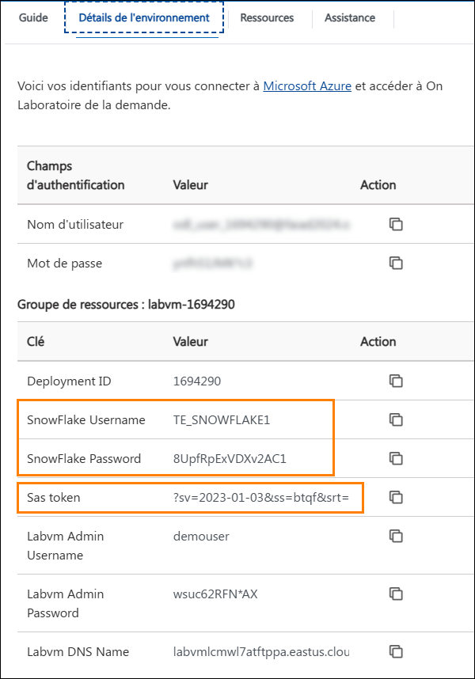

### Résolution des problèmes de connexion à Snowflake

Si les participants ont des difficultés pour se connecter à Snowflake, veuillez procéder comme suit. Cela fournira une description détaillée de l’erreur.

1. Ouvrez une nouvelle fenêtre de navigateur. Accédez à **dlhdzca-bab11165.snowflakecomputing.com**. Il s’agit du serveur Snowflake que nous utilisons.

2. Saisissez les **informations d’identification**. En cas d’erreur, vous obtiendrez une description détaillée de celle-ci, comme indiqué dans la capture d’écran ci-dessous.

    

3. Si l’erreur persiste, nous disposons de **données Snowflake** **dans Azure Data Lake** et d’un modèle Dataflow (**df_Supplier_ADLSGen2.pqt**) dans **C:\FAIAD\Solutions**. Vous pouvez aider les participants à suivre les étapes suivantes afin d’importer ce modèle.

# **Liens vers les labos :**

- [Portugais brésilien](https://experience.cloudlabs.ai/#/labguidepreview/aab00958-5596-4175-9bc9-39ece2586314)

- [Chinois](https://experience.cloudlabs.ai/#/labguidepreview/3c8f94bd-6936-4a18-a1e3-8b606402531e)

- [Anglais](https://experience.cloudlabs.ai/#/labguidepreview/b63b312d-0c58-4fd0-bee1-05a94affa927)

- [Français](https://experience.cloudlabs.ai/#/labguidepreview/e9c3e273-1dd1-4db8-80e3-aedfe41a1e9b)

- [Allemand](https://experience.cloudlabs.ai/#/labguidepreview/e697a208-a982-4c6d-b32b-7e83d39c7186)

- [Italien](https://experience.cloudlabs.ai/#/labguidepreview/b984b3dd-928d-492e-be2c-de1d49dd2640)

- [Japonais](https://experience.cloudlabs.ai/#/labguidepreview/bb29b27d-7a77-4e4e-9c0d-a12a86397a1f)

- [Coréen](https://experience.cloudlabs.ai/#/labguidepreview/544a6b13-8546-454d-8270-3540fe6a9566)

- [Espagnol](https://experience.cloudlabs.ai/#/labguidepreview/16998c52-2637-4c65-b691-0fa5ac9091d7)

# **Importer un modèle Dataflow :**

En tant que formateur, vous pouvez choisir de permettre aux participants d’importer des modèles Dataflow. Pour importer un modèle, procédez comme suit :

### Éléments à prendre en compte avant une importation à partir d’un modèle Dataflow

1. Si l’étudiant **a déjà créé les tables dans la lakehouse**, il doit d’abord supprimer la table dans la lakehouse avant de charger le PQT (sans quoi il devra renommer la table dans le nouveau flux de données, puis en tenir compte plus tard dans les labos).

2. L’étudiant doit configurer les destinations pour les tables concernées ; l’option « **activer la mise en lots** » est décochée, mais il est préférable de vérifier car dans certains cas celle-ci reste cochée.

3. Les tables qui requièrent des destinations dans df_Supplier_Snowflake sont les suivantes :

    1. Supplier

    2. PO

4. Voici la table qui requiert une destination dans df_People_SharePoint :

    1. People

### Importation d’un modèle Dataflow

1. Accédez à **l’espace de travail Fabric que vous avez créé dans le labo 2, tâche 2** et nommé **FAIAD_ <username>**.

2. Dans le menu supérieur, cliquez sur **Nouvel élément** -> **Flux de données Gen2**.

    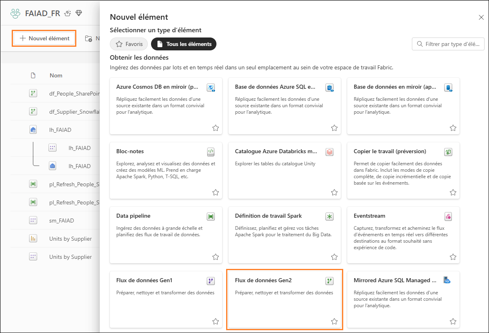

3. Une fenêtre Power Query s’ouvre alors. Dans le volet central, cliquez sur **Importer à partir d’un modèle Power Query**.

    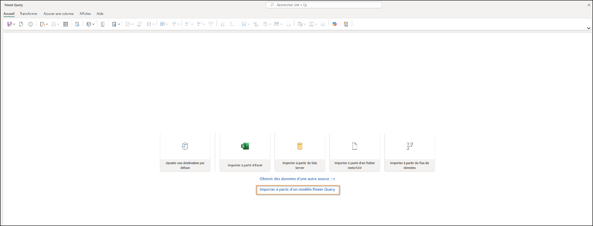

4. Accédez au dossier **C:\FAIAD\Solutions** dans l’environnement de labo.

5. Sélectionnez le Dataflow que vous souhaitez importer. Ici, nous importons **df_People_SharePoint.pqt**

6. Cliquez sur **Ouvrir**.

    Une fois l’importation effectuée, notez que la requête et toutes les étapes de la requête sont importées. Cependant, la connexion doit être configurée. De plus, la destination des données doit être définie. Pour effectuer ces étapes, veuillez suivre les instructions du labo.

    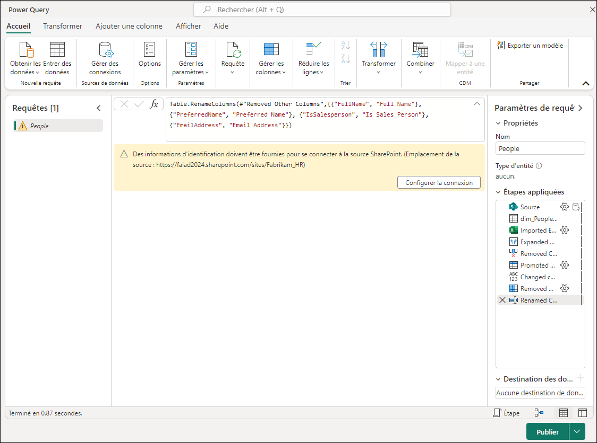

# **Créer des vues à l’aide de T-SQL**

En tant que formateur, vous pouvez choisir de laisser les participants créer des vues à l’aide de T-SQL. T-SQL pour les vues Geo, Product, Reseller et Sales est disponible dans le dossier **Solutions**. Ouvrez une nouvelle fenêtre de requête SQL dans la lakehouse et exécutez ces instructions T-SQL. Si une vue doit être supprimée, le fichier Remove-View est également disponible dans le dossier Solutions afin d’être exécuté.

**Remarque :** il s’agit d’instructions CREATE. Toutes les vues existantes portant le même nom doivent être supprimées avant d’exécuter ces instructions.

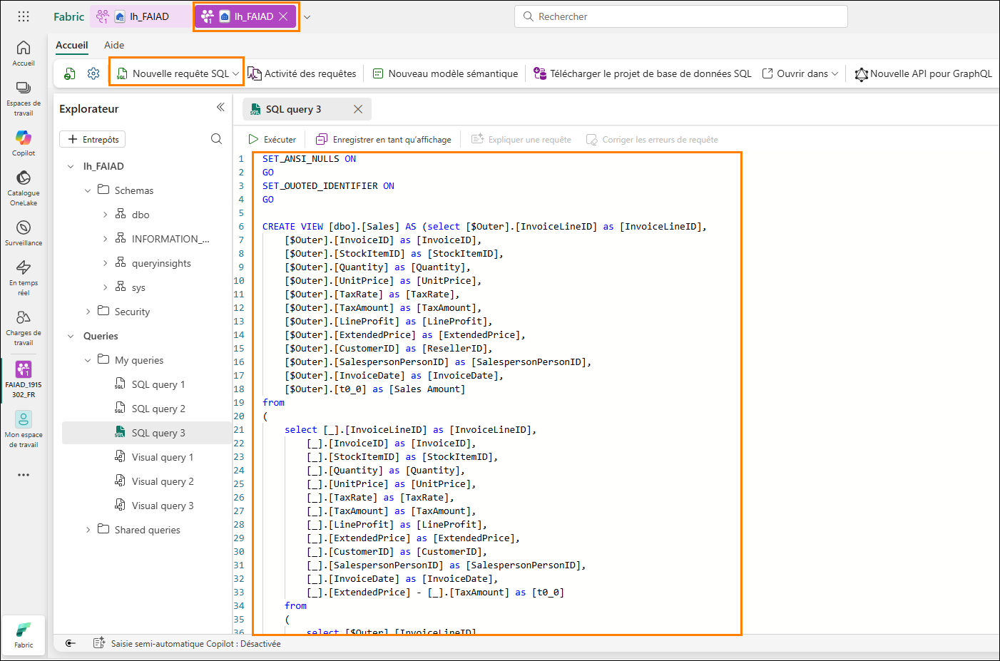

# **Démo de Forecast ML**

### Exigence

Il est nécessaire que vous, le formateur, effectuiez les labos 1 à 6 et que toutes les données soient ingérées avant de passer aux étapes suivantes.

Pour la démo, vous devez installer une bibliothèque Python dénommée **prophet.** Cela peut être installé en ligne dans le notebook, ou vous pouvez créer un environnement. Dans le cadre de cette démo, nous utiliserons le mode en ligne.

### Création d’un notebook

1. Accédez à **l’espace de travail Fabric que vous avez créé dans le labo 2, tâche 2** et nommé **FAIAD_ <username>**.

2. Dans le menu, sélectionnez **+ Nouvel élément ->** Utilisez la zone de recherche pour **rechercher Notebook ->** Choisissez **Notebook**.

    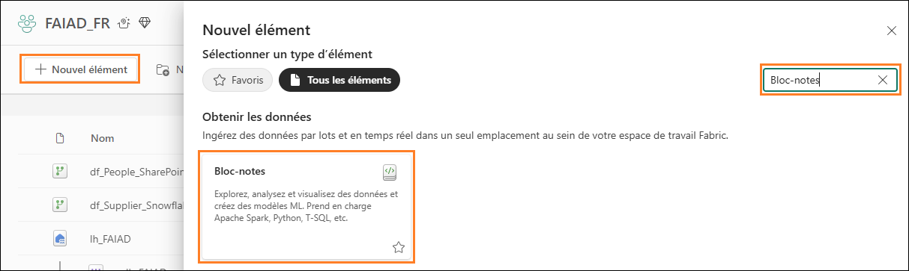

3. Fournissez une **brève présentation** de la disposition : notebook, langage, environnement, création d’une cellule, etc.

### Ajouter Lakehouse au Notebook

Nous devons associer un Lakehouse par défaut à un notebook.

1. Dans le volet Explorateur, cliquez sur l’onglet **Éléments de données.**

    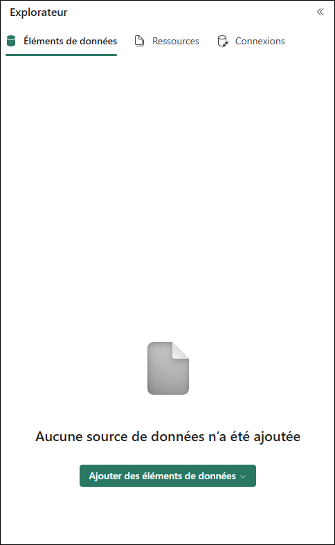

2. Cliquez sur **Ajouter des éléments de données** dans le volet Explorateur.

3. Sélectionnez **À partir du catalogue OneLake**.

    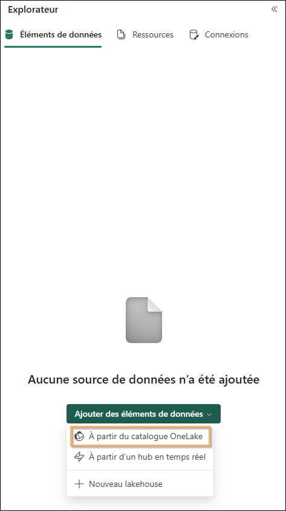

4. La boîte de dialogue du hub de données OneLake s’ouvre. Sélectionnez le lakehouse **lh_FAIAD**.

5. Cliquez **sur Ajouter**. Vous remarquerez que Lakehouse est associé au Notebook.

    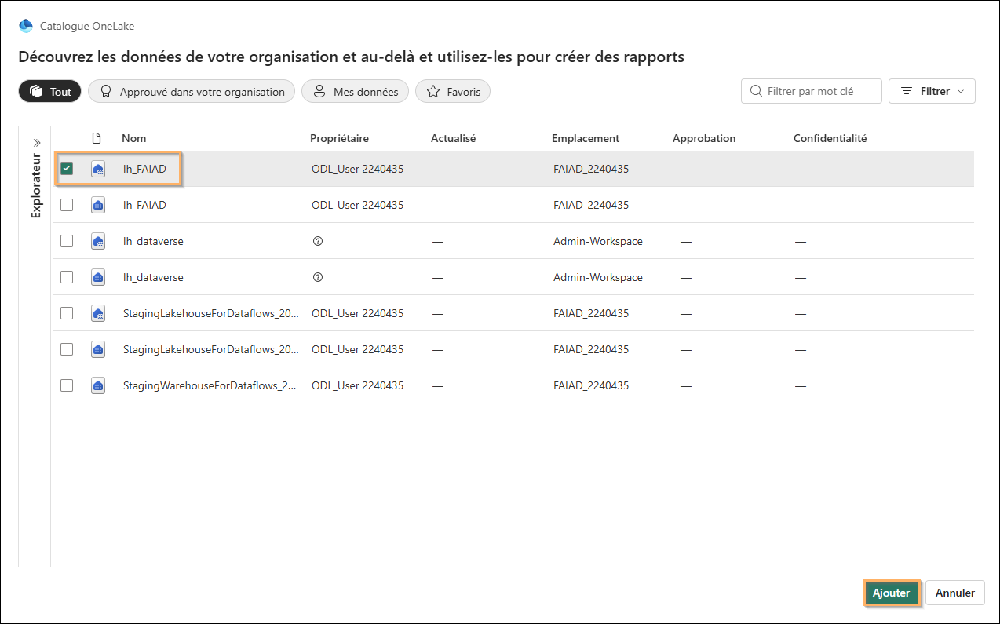

### Installation de la bibliothèque Python en ligne

Pour la démo, vous devez installer une bibliothèque Python dénommée **prophet.** Ceci est installé en ligne.

1. Pour **installer la bibliothèque python** saisissez le code suivant dans la cellule.

    !pip install prophet

2. Exécutez le code en cliquant sur le bouton **Lire** en regard de la cellule.

    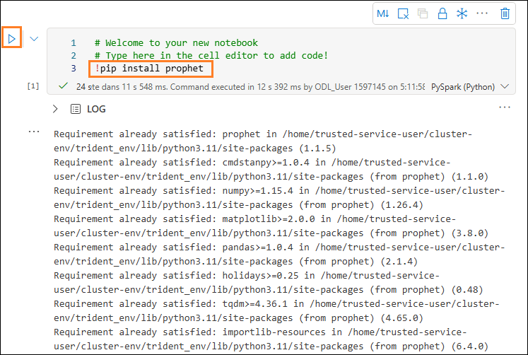

### Exécution du code afin de créer la prévision

1. Créez une **cellule**.

2. Saisissez le **code** suivant :

    from pyspark.sql import SparkSession

    from pyspark.sql.functions import month, year, col

    from prophet import Prophet

    import pandas as pd

    # Initialize Spark session

    spark = SparkSession.builder.appName("Prophet Forecasting").getOrCreate()

    # Load data from your specific Spark table

    df = spark.sql("SELECT \* FROM lh_FAIAD.Invoices i JOIN lh_FAIAD.InvoiceLineItems il ON i.InvoiceID = il.InvoiceID")

    # Aggregate data to monthly level

    monthly_df = df.withColumn("Month", month("InvoiceDate"))

    .withColumn("Year", year("InvoiceDate"))

    .groupBy("Year", "Month")

    .sum("Quantity")

    .orderBy("Year", "Month")

    # Convert to Pandas DataFrame and prepare for Prophet

    pandas_df = monthly_df.toPandas()

    pandas_df['ds'] = pd.to_datetime(pandas_df[['Year', 'Month']].assign(DAY=1))

    pandas_df['y'] = pandas_df['sum(Quantity)']

    # Fit the Prophet model

    model = Prophet(yearly_seasonality=True, weekly_seasonality=False,daily_seasonality=False)

    model.fit(pandas_df[['ds', 'y']])

    # Create a DataFrame for future predictions (e.g., next 12 months)

    future = model.make_future_dataframe(periods=12, freq='M')

    # Forecast

    forecast = model.predict(future)

    # Plotting the forecast

    model.plot(forecast)

    model.plot_components(forecast)

3. Expliquez chaque étape du **code** (conseils fournis en commentaires).

4. Exécutez le code en cliquant sur le bouton **Lire** en regard de la cellule.

    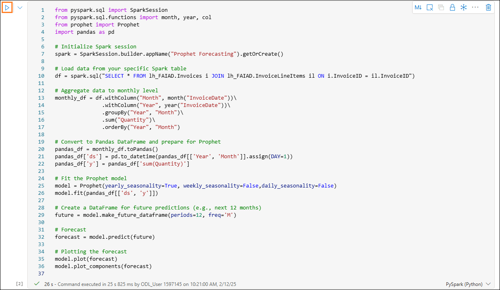

    Guidez les participants à travers les trois graphiques créés (ci-dessous). Nous avons des chiffres réels jusqu’en mai 2023 et nous effectuons une prévision sur 12 mois.

    Notez que le **premier graphique** supprime la saisonnalité et effectue une prévision jusqu’en avril 2025.

    Le **deuxième graphique** supprime la tendance et ajoute la saisonnalité pour effectuer une prévision jusqu’en avril 2025.

    

    Le **troisième graphique** effectue une prévision à l’aide de la tendance et de la saisonnalité. Ce graphique fournit également les limites supérieure et inférieure.

    

5. Créez une **cellule**.

6. Ajoutez le **code** suivant à la cellule :

    display(forecast)

    #write forecast data to a table

    spark.createDataFrame(forecast).write.saveAsTable("Sales_Forecast", mode="overwrite")

7. Exécutez la cellule en cliquant sur le bouton **Lire**.

    

8. Guidez les participants à travers les **données qui s’affichent**.

9. Montrez aux utilisateurs qu’une table a été créée dans le Lakehouse : **sales_forecast**

    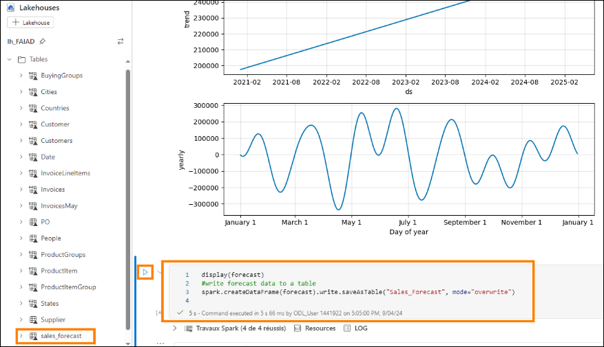

10. **Interrogez** la table et montrez son contenu aux utilisateurs.

# **Démo de Data Activator**

### Exigence

Il est nécessaire que vous, le formateur, réalisiez les labos 1 à 7 avant de passer aux étapes suivantes.

Les liens suivants comporteront les dernières mises à jour.

<https://learn.microsoft.com/en-us/fabric/data-activator/data-activator-introduction>

<https://learn.microsoft.com/en-us/fabric/data-activator/data-activator-get-data-power-bi>

### Scénario

Nous savons qu’il existe un écart dans Sales par Nom de groupe de stock chaque mois. Cela est dû à la saisonnalité. Toutefois, nous souhaiterions être informés si le pourcentage d’écart est inférieur à 20 %. Cela facilitera l’identification et la résolution de tels scénarios.

Pour remédier à cela, nous allons utiliser Data Activator. Nous allons déclencher une alerte lorsque Sales Variance % de l’un des noms de groupe de stock tombe en dessous de 20 %. Nous allons simuler cela pour le mois de mai 2024. Comme le déclencheur Data Activator fonctionne toutes les heures, au lieu d’attendre une heure, nous allons exécuter une alerte test.

Pour faire la démo de ce scénario, nous allons :

- Ajouter la mesure du Sales Variance % au jeu de données.

- Ajouter un visuel de table montrant Sales Variance % par nom de groupe de stocks et Filtrez cette table sur mai 2024.

- Créer une alerte à l’aide du visuel de table.

- Examiner l’Activator et créer une alerte test.

### Ajouter une mesure Sales Variance %

Nous allons ajouter une nouvelle mesure au modèle sémantique sm_FAIAD.

1. Accédez au modèle sémantique **sm_FAIAD**.

2. Sélectionnez la table **Sales**.

3. Dans le menu supérieur, cliquez sur **Accueil -> Nouvelle mesure**.

4. Créez la **mesure** suivante. Cela fournira un % d’écart par rapport au mois précédent.

    Sales Var % =

5. var priormth = CALCULATE([Sales], PREVIOUSMONTH('Date'[Date]))

6. RETURN DIVIDE([Sales]-priormth, priormth)

7. **Mettez** la mesure au format **Pourcentage**.

    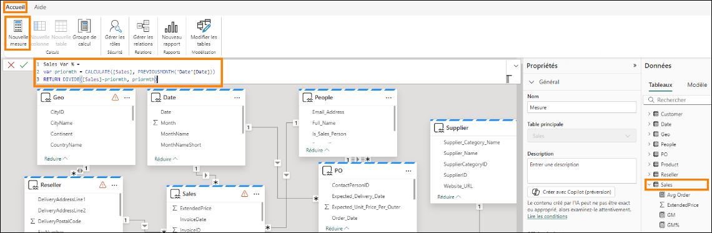

### Créer un visuel de table

Nous allons modifier rpt_Sales_report et ajouter un nouveau visuel de table. Le visuel de table indiquera Sales Variance % par nom de groupe de stocks pour mai 2023.

1. Accédez à **rpt_Sales_report** (créé dans le labo 7).

2. Dans le menu supérieur, cliquez sur **Modifier**.

3. Dans la vue Données, développez la table **Product**.

4. Cliquez sur le champ **StockGroupName**. Un visuel de table est créé.

5. Développez la table **Sales**.

6. Sélectionnez **Sales Var %**. Vous remarquerez qu’il n’y a aucune donnée dans le visuel de la table. En effet, vous devez saisir un mois pour pouvoir calculer Sales Var %.

    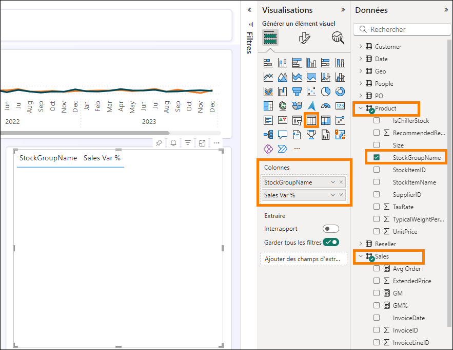

7. **Développez la section** **Filtre** (si celle-ci est réduite).

8. Avec le visuel de table en surbrillance, à partir de la section **Données**, développez la table **Date**.

9. Faites glisser le champ **Year** dans les filtres de cette section visuelle.

10. Pour le champ **Year**, sélectionnez **Filtrage de base** dans la liste déroulante **Type de filtre**.

11. Sélectionnez **2024**.

    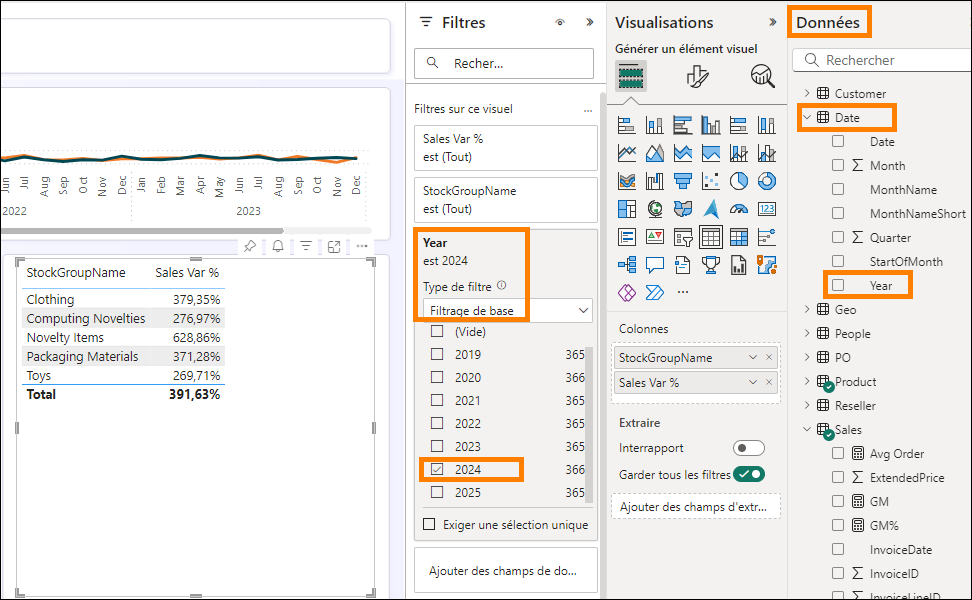

12. Faites glisser le champ **MonthNameShort** dans la partie Filtres de cette section visuelle.

13. Cliquez sur **Mai.**

14. Cliquez sur **Fichier -> Enregistrer** pour enregistrer les mises à jour sur l’état.

    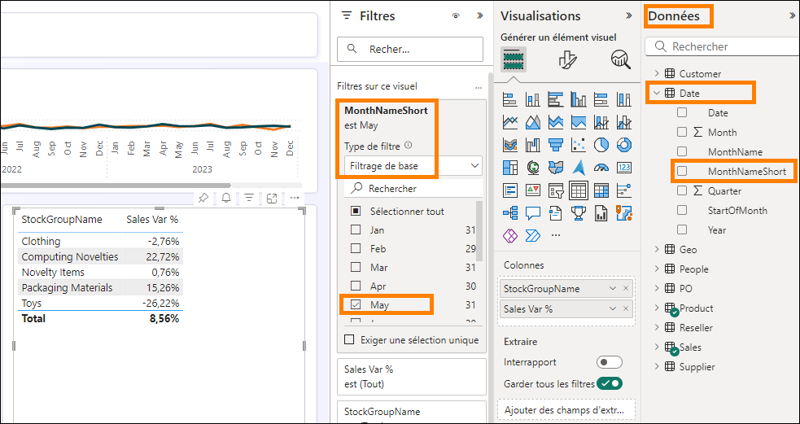

### Créer un Activator

Nous allons créer un Activator qui enverra une alerte si Sales Variance % pour l’un des Stock_Group_Name est inférieur à -20 %. Notez que le nom du groupe Stock de jouets a un Sales Variance % de -26,22 % et répond aux critères d’alerte.

1. Avec le visuel de table nouvellement créé en surbrillance, sélectionnez la **Sonnette d’alarme** dans le coin supérieur gauche du visuel.

    

2. Le panneau Définir une alerte s’ouvre.

3. Indiquez aux participants que l’alerte s’applique **À chaque Stock_Group_Name**

4. Sélectionnez **Sales Var %** sous **Alerte en cas de modification d’une ligne**.

    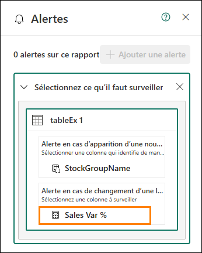

5. Sélectionnez la case d’option **Devient** et définissez la **Condition** sur **Inférieure à.**

6. Définissez le champ **Seuil** sur **-20 %.** Cela permet de configurer le déclencheur pour alerter lorsque la mesure Sales Variance % tombe en dessous de 20 %.

    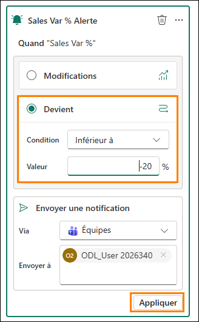

7. Évoquez les deux options de notification : E-mail et Teams.

8. Cliquez sur **Appliquer**

9. En bas, à côté de **Mes alertes Power BI Activator,** cliquez sur les **points de suspension (...)**.

10. Affichez les différents emplacements d’enregistrement de l’espace de travail.

    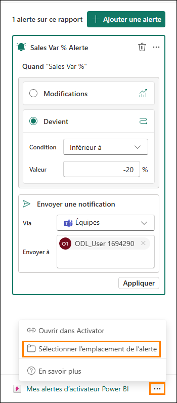

11. Une fois l’alerte créée, vous pouvez également sélectionner **Ouvrir dans Activator** après avoir cliqué sur les points de suspension dans la partie inférieure.

    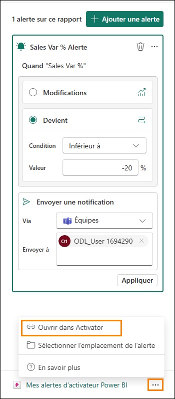

### Présentation d’Activator

1. Vous êtes alors redirigé vers la vue **Conception** d’Activator.

2. Guidez les participants à travers la **disposition,** à gauche se trouvent les objets. Veuillez noter qu’il existe un **Déclencheur** que nous venons de créer. Il existe également une section **Événements**.

3. Sélectionnez le déclencheur que nous avons créé, puis parlez des options qui se trouvent dans le **menu supérieur**.

    1. Accueil

    1. Obtenir les données

    2. Créer des actions personnalisées avec Power Automate

    2. Règles

    1. Supprimer

    2. Démarrer, Arrêter, Afficher les détails

    3. M’envoyer une action test

4. Parlez des graphiques **Surveiller** et **Condition** qui se trouvent dans l’onglet **Définition**.

5. Faites défiler la page vers le bas ; vous remarquerez que dans le tableau **Action**, l’alerte vous envoie une notification lorsqu’elle est déclenchée. Actuellement, les déclencheurs s’exécutent toutes les heures. Par conséquent, dans l’heure suivante, si les données changent et que la condition est satisfaite, une alerte est déclenchée.

    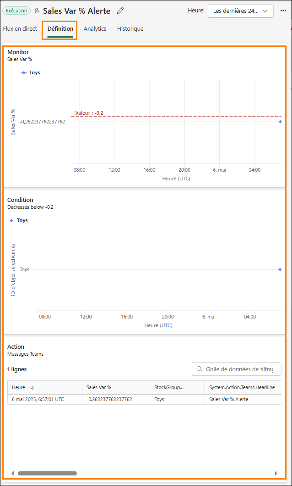

6. Sur le côté droit de l’écran, vous pourrez configurer la **Définition de l’alerte**. Celle-ci inclut l’Attribut, tout filtre ou résumé, les conditions et l’Action. Notez que l’alerte est envoyée par défaut au compte d’utilisateur du labo. (les adresses e-mail externes ne sont actuellement pas prises en charge.)

    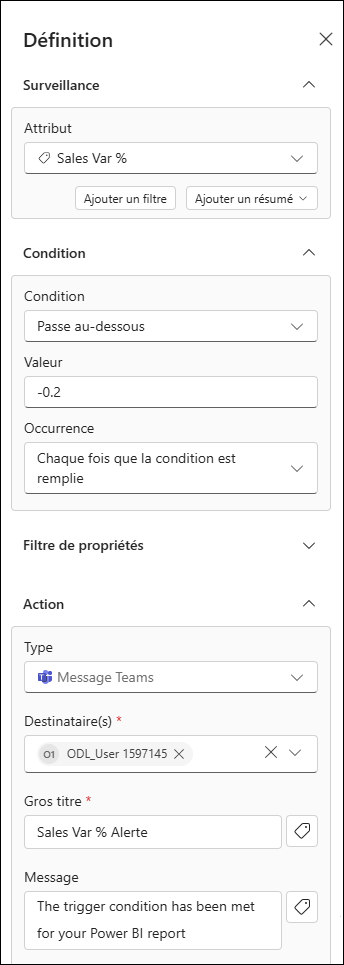

7. Notez que vous pouvez également modifier les détails de l’action ici. Si vous cliquez sur Modifier l’action, la fenêtre Modifier l’action s’affiche.

    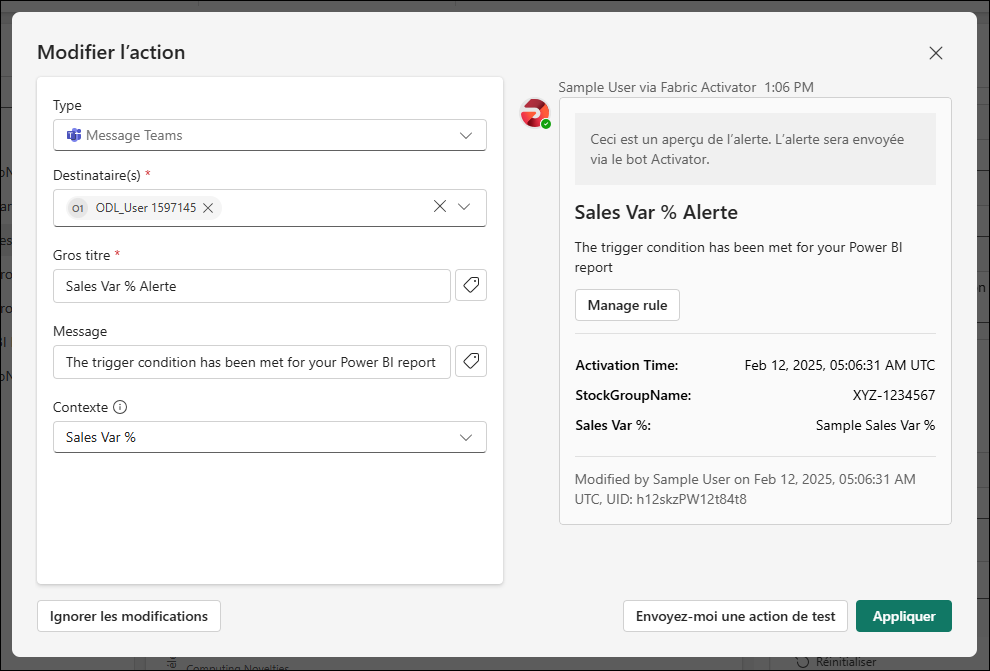

### Envoyer une alerte test

Remarque : pour afficher l’alerte, vous devez utiliser l’environnement de labo.

1. Sélectionnez le déclencheur **Sales Var %**.

2. Dans le menu supérieur, sélectionnez **M’envoyer une action test**. Cela enverra une alerte test à votre compte utilisateur de labo.

3. Sélectionnez l’**icône du lanceur d’application** en haut à gauche de l’écran.

    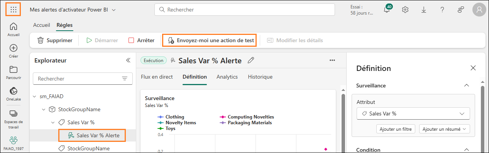

4. Sélectionnez Teams. Une nouvelle fenêtre de navigateur s’ouvre.

    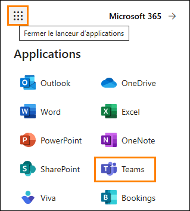

5. Vous recevrez un message d’alerte (ce qui peut prendre quelques minutes). Notez qu’il s’agit d’une action test.

    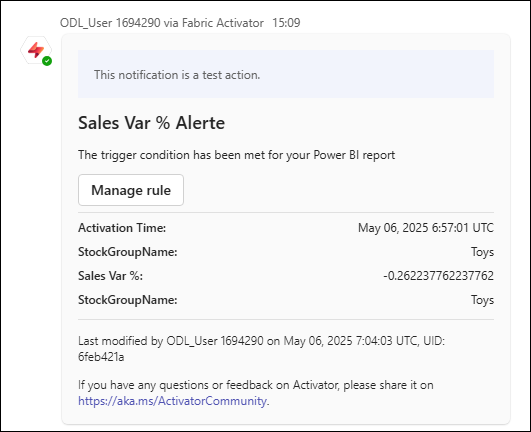

6. Lorsque les données changent et que la condition de déclenchement est remplie, des alertes sont envoyées.

    **Remarque** : pour faire une démonstration de cette fonctionnalité, nous avons filtré le visuel sur un mois (mai 2024). Un déclencheur sera probablement défini dynamiquement pour le mois en cours.

# **Version de démonstration de Semantic Link**

### Exigence

Il est obligatoire que vous, l’instructeur, ayez terminé les labos 1 à 7 avant de passer aux étapes suivantes.

Il est recommandé que l’instructeur exécute les notebooks de cette démonstration à l’avance, car chacun d’eux peut prendre entre 5 et 10 minutes pour s’exécuter. Une option consiste à lancer les notebooks pendant que les étudiants travaillent sur les labos 6 et 7. Cela permet de s’assurer que l’instructeur pourra montrer aux étudiants les résultats des notebooks.

### Scénario

Dans cette version de démonstration, nous allons explorer l’**Analyseur de bonnes pratiques** et l’**Analyseur de mémoire**. Ce sont des outils puissants qui nous aident à évaluer notre modèle sémantique en termes de performances, d’utilisation de la mémoire et de qualité globale. Ces outils ne se contentent pas de fournir des métriques ; ils offrent également **des recommandations exploitables pour améliorer la conception et l’efficacité** de votre modèle, en mettant en évidence des opportunités d’optimisation qui pourraient autrement passer inaperçues.

Au cœur de cette fonctionnalité se trouve **Semantic Link**, une fonctionnalité de Microsoft Fabric qui nous permet de connecter directement nos modèles sémantiques aux outils et expériences de science des données. Cela signifie que nous pouvons **analyser, profiler et optimiser** notre modèle sémantique sm_FAIAD à l’aide des notebooks.

Grâce à cette connexion, nous pouvons exécuter des analyses approfondies, telles que des vérifications des bonnes pratiques et le profilage de la mémoire, directement sur le modèle sémantique dans notre espace de travail. Cela nous permet d’améliorer les **performances, de réduire l’empreinte mémoire et, au final, de diminuer les coûts** de vos artefacts en production.

Pour faire la démo de ce scénario, nous allons :

- Ouvrez notre modèle sémantique sm_FAIAD et recherchez les fonctionnalités de Semantic Link.

- Créez le notebook d’analyse des bonnes pratiques et consultez les informations.

- Créez le notebook d’analyse de la mémoire et consultez les informations.

### Analyseur de bonnes pratiques

1. Accédez à **l’espace de travail Fabric que vous avez créé dans le labo 2, tâche 2** et nommé **FAIAD_ <username>**.

2. Ouvrez le modèle sémantique **sm_FAIAD**.

    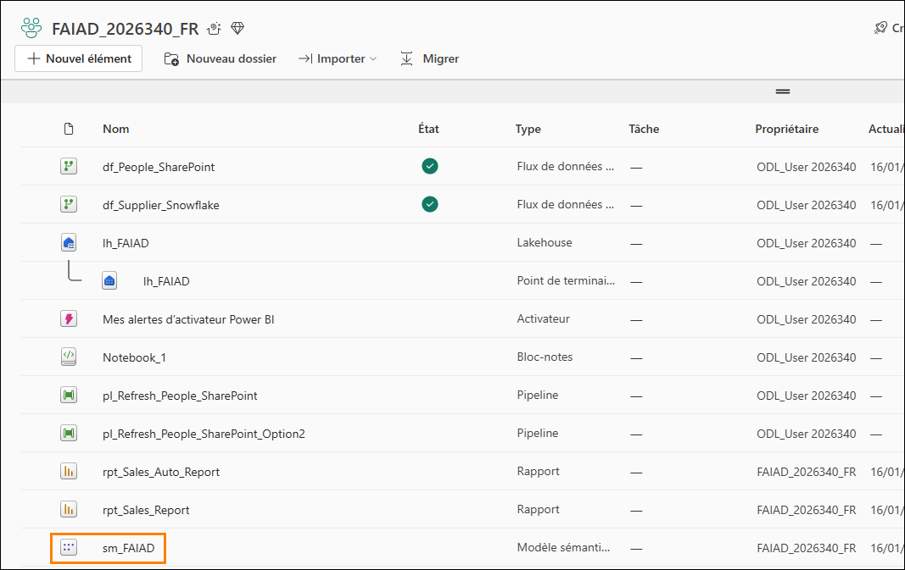

3. Sur la page suivante, sélectionnez **Ouvrir le modèle sémantique**.

    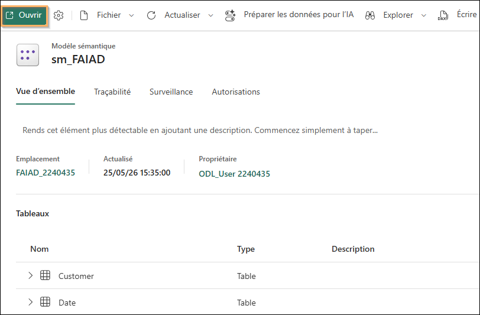

4. Dans le **ruban Accueil**, notez que vous avez 3 éléments sous **Intégrité du modèle**.

    1. **Analyseur des bonnes pratiques :** fournit des conseils pour améliorer la conception et les performances de votre modèle sémantique, basés sur des règles définies par des experts Fabric.

    2. **Analyseur de mémoire :** fournit des statistiques sur la mémoire et le stockage des objets de votre modèle sémantique. L’examen de ces statistiques peut vous aider à identifier des axes d’optimisation des performances et de réduction de la consommation mémoire.

    3. **Notebooks de la communauté :** galerie de notebooks créés par la communauté Power BI afin d’améliorer l’analyse des données et le reporting.

    *Remarque : ces notebooks se trouvent également sur la page des détails du modèle sémantique.*

5. Cliquez sur **Analyseur des bonnes pratiques**.

    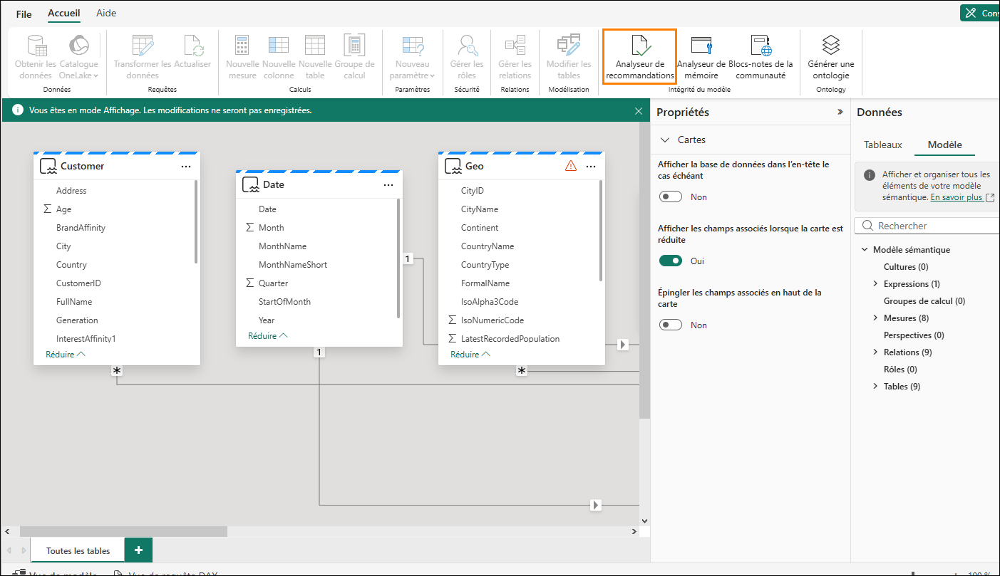

6. Un nouveau notebook d’analyse des bonnes pratiques sera créé. Vous serez redirigé vers le notebook.

7. Passez en revue avec les étudiants les détails décrits dans les cellules Markdown.

8. Dans le ruban Accueil, sélectionnez **Tout exécuter**.

    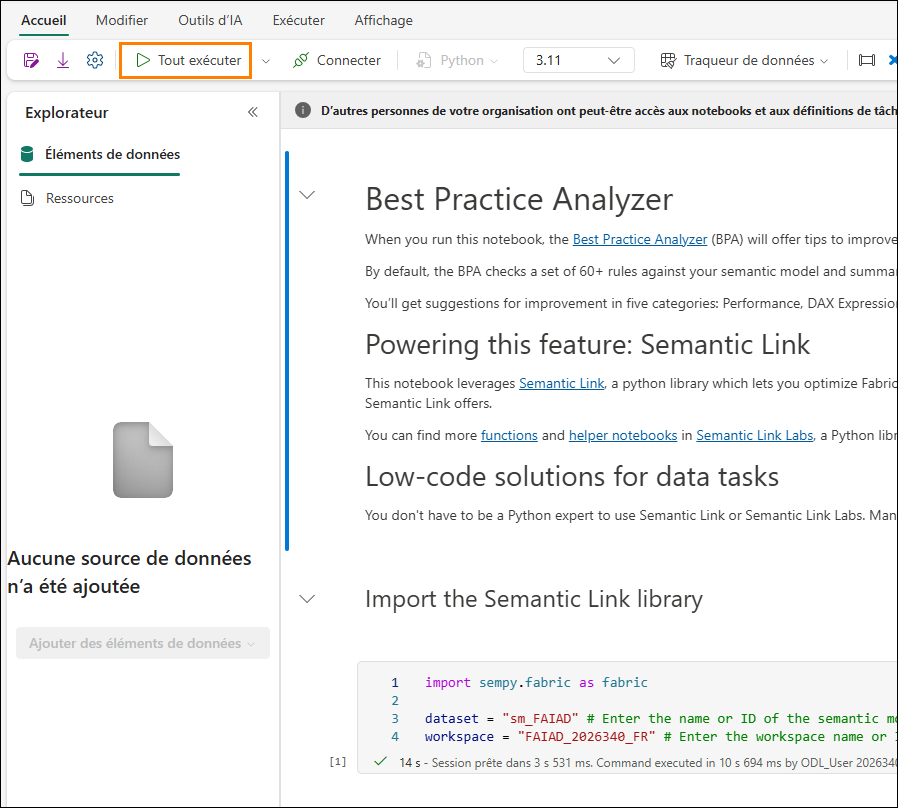

9. Une fois l’exécution du notebook terminée, observez le résultat de la fonction **run_model_bpa**.

    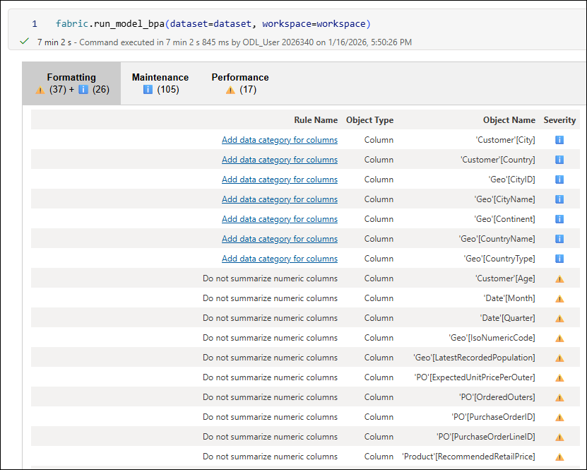

10. Cette fonction retourne trois catégories de recommandations. **Mise en forme, Maintenance et Performances**. Au sein d’une catégorie donnée, vous verrez deux icônes différentes représentant le niveau de gravité de la recommandation.

    1. ℹ️ - une modification recommandée qui peut améliorer votre modèle.

    2. ⚠️ - ce niveau d’avertissement indique que le problème répertorié pourrait entraîner des difficultés dans votre modèle ou dans les rapports qui l’utilisent.

11. Sous **Mise en forme**, faites défiler vers le bas et survolez le **nom de la règle « Format flag columns as Yes/No value strings »**

12. Expliquez aux étudiants que le survol des noms de règles permet d’afficher davantage de détails sur la modification recommandée.

    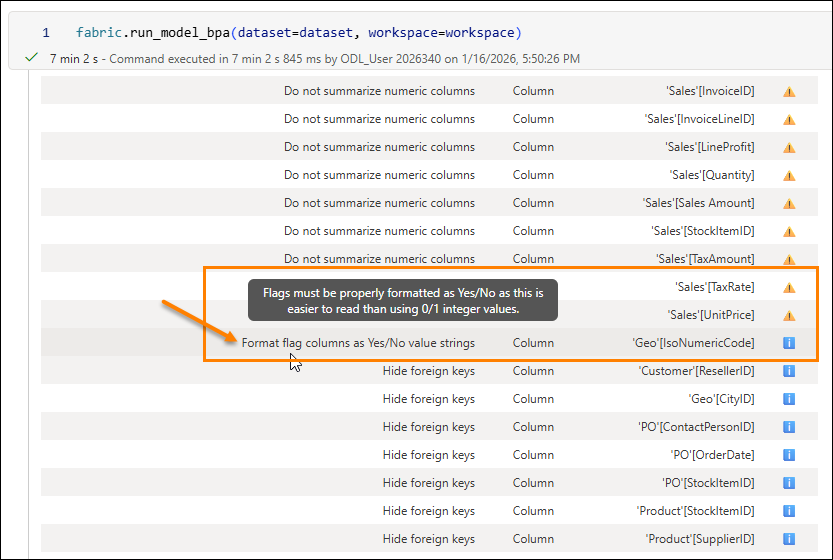

13. Dans ce cas, l’analyseur de performances recommande de mettre en forme la colonne **IsoNumericCode** de la table **Geo** en **Oui/Non**. Il s’agit d’une excellente recommandation, car le formatage des colonnes indicateurs de cette manière constitue une bonne pratique lors de la modélisation d’un schéma en étoile.

14. Sélectionnez la catégorie **Maintenance**.

    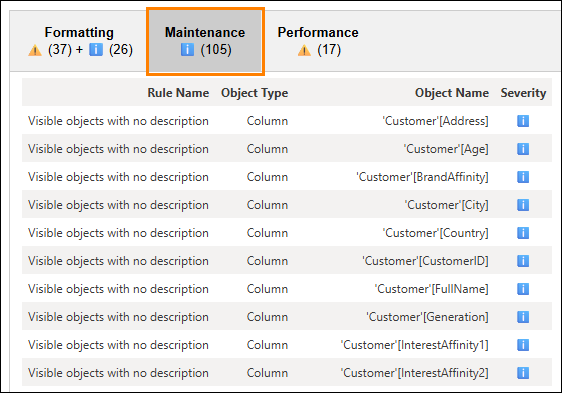

15. Précisez aux étudiants que la majorité des recommandations de maintenance consistent à ajouter des descriptions aux colonnes visibles de notre modèle.

16. Sélectionnez la catégorie **Performances**.

    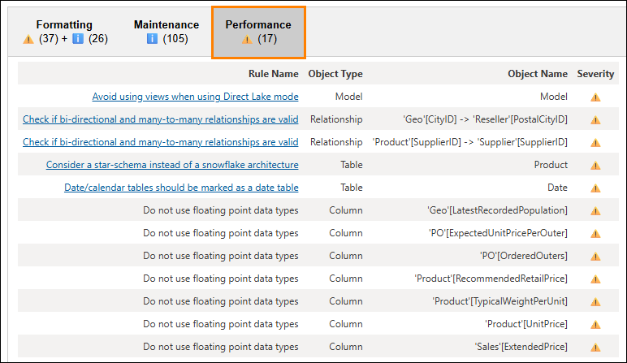

17. Survolez le **nom de la règle « Avoid using views when using Direct Lake mode ».**

18. L’analyseur de performances nous rappelle que le mode Direct Lake ne prend pas en charge les vues. Dans ce cours, nous avons utilisé des raccourcis pour nous connecter rapidement aux données, puis nous avons transformé les données à l’aide de vues. Cela a été fait en partie pour mieux comprendre les nombreuses méthodes de connexion aux données disponibles dans Fabric. Cependant, si nous souhaitions appliquer cette recommandation à notre modèle, nous devrions utiliser une autre méthode pour ingérer et transformer nos données de ventes, comme un Dataflow Gen2.

    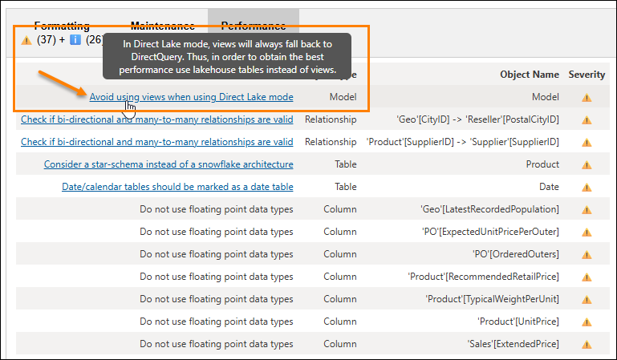

19. Si le temps le permet, l’instructeur peut passer en revue d’autres recommandations.

### Analyseur de mémoire

1. Revenez à la vue de modèle de votre modèle sémantique **sm_FAIAD**.

2. Dans **Ruban Accueil** sélectionnez **Analyseur de mémoire**.

    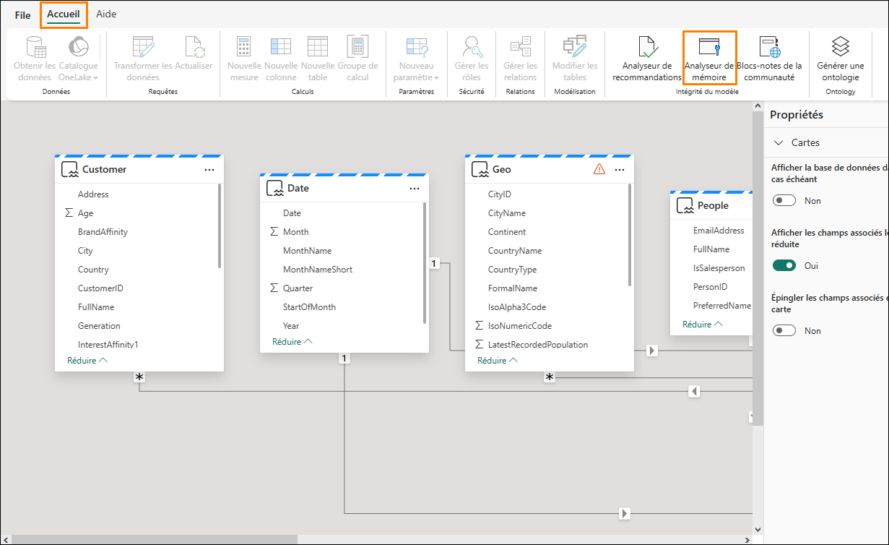

3. Un nouveau notebook d’analyse de la mémoire sera créé.

4. Passez en revue avec les étudiants les détails répertoriés dans les cellules Markdown.

5. Dans le **Ruban Accueil**, sélectionnez **Tout exécuter**.

    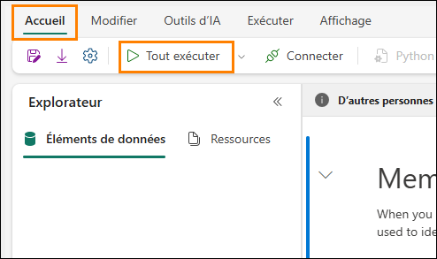

6. Une fois l’exécution du notebook terminée, examinez les données obtenues. De nombreuses catégories affichent l’utilisation de la mémoire avec différents niveaux de détail.

    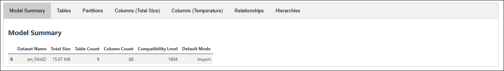

7. Indiquez aux étudiants que toutes ces informations peuvent être utilisées pour identifier des axes d’amélioration en matière d’utilisation de la mémoire.

8. Sélectionnez la catégorie **Tables**.

9. Survolez le nom de la colonne **% DB column**. Cette action affiche la description de la colonne. Cette colonne indique la taille de chaque table par rapport à la taille du modèle sémantique. Bien que cela n’indique pas automatiquement qu’un problème existe, il est utile de voir quel pourcentage de la mémoire du modèle sémantique est utilisé par chaque table.

    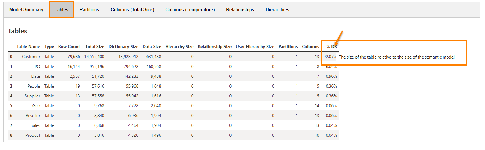

10. Si le temps le permet, l’instructeur peut terminer la démonstration en parcourant d’autres catégories et en expliquant les différents points de données.
