# Microsoft Fabric - Fabric Analyst in a Day - Labo 1

## Sommaire

- Structure du document
- Scénario/Énoncé du problème
- Présentation de l’état Power BI Desktop
  - Tâche 1 : configurer Power BI Desktop dans l’environnement de labo
  - Tâche 2 : analyser l’état Power BI Desktop
  - Tâche 3 : examiner les requêtes Power Query
- Références

# Structure du document

Le labo comprend des étapes à suivre par l’utilisateur, ainsi que des captures d’écran associées qui fournissent une aide visuelle. Dans chaque capture d’écran, des sections sont mises en évidence avec des encadrés orange afin de souligner la ou les zones sur laquelle/lesquelles l’utilisateur doit se concentrer.

**Remarque**** :** certaines captures d’écran peuvent être obsolètes en raison des mises à jour produit en cours.

# Scénario/Énoncé du problème

Fabrikam, Inc. est un grossiste en produits innovants. Ses clients sont majoritairement des sociétés qui revendent aux particuliers. Fabrikam vend à des clients de détail à travers les États-Unis, notamment des magasins spécialisés, des supermarchés, des magasins d’informatique et des magasins d’attractions touristiques. Fabrikam vend également à d’autres grossistes au moyen d’un réseau d’agents qui font la promotion des produits au nom de Fabrikam. Bien que tous les clients de Fabrikam soient actuellement basés aux États-Unis, la société a l’intention de favoriser son expansion dans d’autres pays/régions.

Vous êtes Analyste Données au sein de l’équipe commerciale. Vous recueillez, nettoyez et interprétez des jeux de données pour résoudre des problèmes métier. Vous créez également des visualisations telles que des tableaux et des graphiques, rédigez des états et les présentez aux décideurs de l’organisation.

Afin de tirer de précieux insights des données, vous extrayez les données de plusieurs systèmes, les nettoyez et les agrégez. Vous extrayez des données des sources suivantes :

- **Données ventes** **:** proviennent du système ERP et sont stockées dans une base de données ADLS Gen2. Elles sont mises à jour au quotidien à midi.

- **Données fournisseur** **:** proviennent de différents fournisseurs et les données sont stockées dans une base de données Snowflake. Elles sont mises à jour au quotidien à minuit.

- **Données client** **:** proviennent de Customer Insights et les données sont stockées dans Dataverse. Les données sont systématiquement à jour.

- **Données collaborateur** **:** proviennent du système RH ; elles sont stockées sous forme de fichiers d’exportation dans un dossier SharePoint. Elles sont mises à jour tous les matins à 9 h.

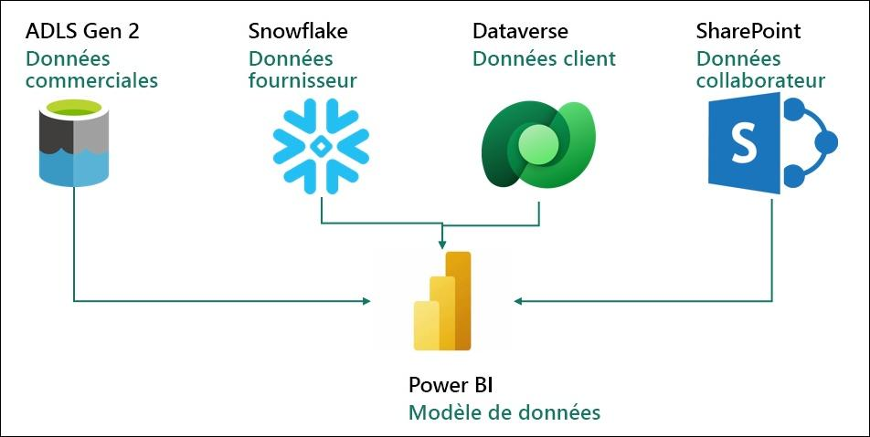

Vous créez actuellement un modèle sémantique dans Power BI Premium qui extrait les données des systèmes sources ci-dessus, afin de répondre à vos besoins en matière de reporting et de fournir un libre-service aux utilisateurs finaux. Vous mettez à jour votre modèle à l’aide de Power Query.

**Vous êtes confronté aux défis suivants :**

- Vous devez actualiser votre jeu de données au moins trois fois par jour pour tenir compte des différentes heures de mise à jour des différentes sources de données.

- Vos actualisations prennent beaucoup de temps, car vous devez effectuer chaque fois une actualisation complète pour capturer toutes les mises à jour survenues sur les systèmes sources.

- Toute erreur dans l’une des sources de données à partir desquelles vous extrayez des données entraîne une interruption de l’actualisation de votre jeu de données. Il arrive souvent que le fichier collaborateur ne soit pas chargé à temps, ce qui aboutit à une interruption de l’actualisation de votre jeu de données.

- Apporter des modifications à votre modèle de données est un processus chronophage, car Power Query prend beaucoup de temps pour actualiser vos aperçus, compte tenu du gros volume de données et des transformations complexes.

- Vous avez besoin d’un PC Windows pour utiliser Power BI Desktop, même si le standard de l’entreprise est Mac.

Vous avez entendu parler de Microsoft Fabric et décidé de l’essayer pour voir s’il peut relever vos défis.

### **Présentation de l’état Power BI Desktop**

Avant de prendre en main Fabric, examinons l’état actuel dans Power BI Desktop pour comprendre les transformations et le modèle.

### Tâche 1 : configurer Power BI Desktop dans l’environnement de labo

1. Ouvrez le fichier **FAIAD.pbix** situé dans le dossier **Reports** sur le **bureau** de votre environnement de labo. Le fichier s’ouvre alors dans Power BI Desktop.

    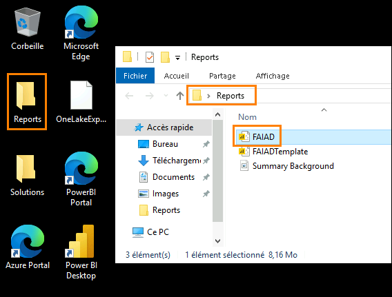

2. Lorsque la boîte de dialogue « Saisissez votre adresse e-mail » apparaît, copiez le **nom d’utilisateur** et collez-le dans le champ **E-mail** de la boîte de dialogue, puis cliquez sur **Continuer**.

    - Adresse e-mail/nom d’utilisateur :

    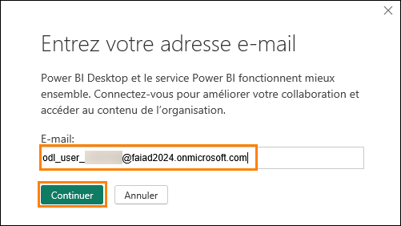

3. Sur l’onglet Se connecter à Microsoft Azure, vous verrez l’écran de connexion ; saisissez l’adresse e-mail/nom d’utilisateur suivant, puis cliquez sur **Suivant**.

    - Adresse e-mail/nom d’utilisateur :

    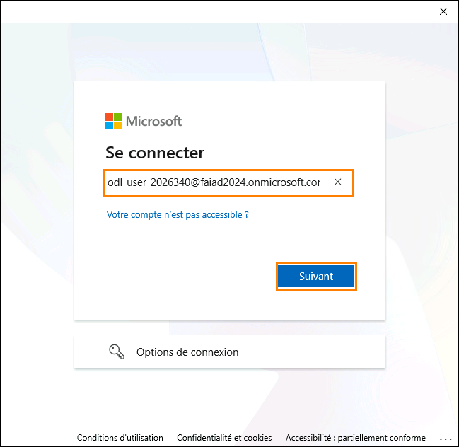

4. Saisissez maintenant le **Passe d’accès temporaire** suivant et cliquez sur **Se connecter**.

    - Passe d’accès temporaire :

    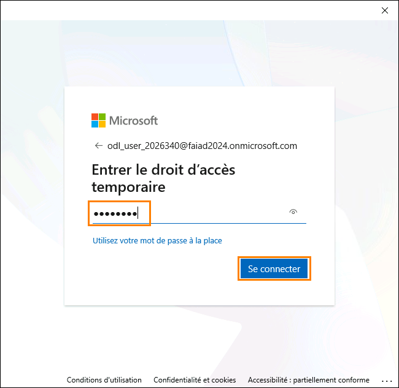

5. La boîte de dialogue **Rester connecté à toutes vos applications** s’ouvre alors. Cliquez sur **OK**.

    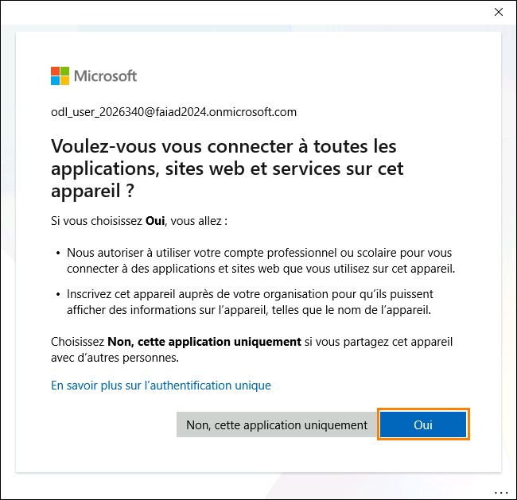

6. **Vous voilà prêt !** Une boîte de dialogue s’ouvre alors. Cliquez sur **Terminé**.

    Power BI Desktop s’ouvre alors.

### Tâche 2 : analyser l’état Power BI Desktop

L’état ci-dessous analyse les ventes de Fabrikam. Les KPI sont répertoriés en haut de la page à gauche. Les visuels restants mettent en évidence les ventes au fil du temps, par secteur de vente, groupe de produits et revendeur.

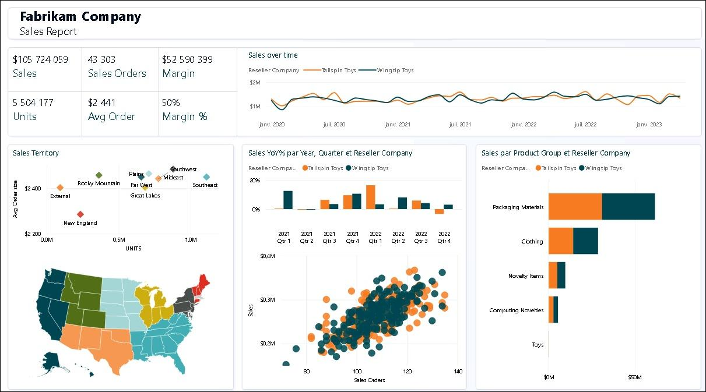

**Remarque :** dans cette formation, nous nous concentrons sur l’acquisition, la transformation et la modélisation de données à l’aide des outils disponibles dans Fabric. Nous n’aborderons pas l’élaboration d’états ou la navigation dans les états. Consacrons quelques minutes à la compréhension de l’état et passons aux étapes suivantes.

1. Analysons les données par secteur de vente. Cliquez sur **New England** dans le visuel Secteur de vente (nuage de points). Dans le visuel Ventes au fil du temps, notez que le revendeur Tailspin Toys réalise plus de ventes que Wingtip Toys en Nouvelle-Angleterre. Sur l’histogramme % des ventes en glissement annuel, notez que la croissance des ventes de Wingtip Toys a été faible et en baisse d’un trimestre à l’autre au cours de l’année écoulée. Après un léger rebond au troisième trimestre, elle a de nouveau diminué au quatrième trimestre.

    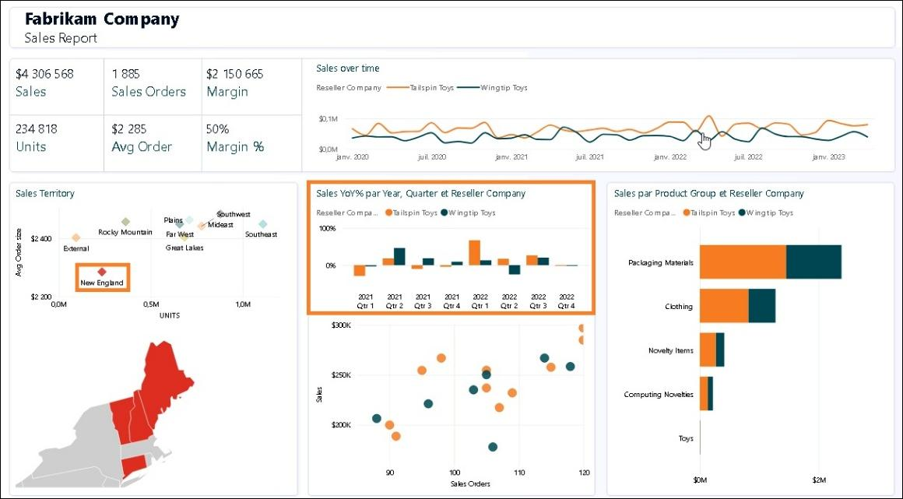

2. Comparons cela au secteur de vente des Rocheuses. Cliquez sur **Rocky Mountain** dans le visuel Secteur de vente (nuage de points). Sur l’histogramme % des ventes en glissement annuel, les ventes de Wingtip Toys ont considérablement augmenté au quatrième trimestre 2023 après avoir été faibles au cours des deux trimestres précédents.

    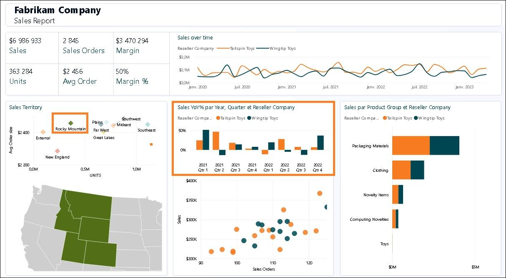

3. Cliquez sur **Rocky Mountain** dans le visuel Secteur de vente pour supprimer le filtre.

4. Dans le visuel Nuage de points en bas au centre de l’écran (Commandes vente par ventes), cliquez sur la valeur hors norme en haut à droite (4e quadrant). Notez que le % de marge est de 52 %, ce qui est supérieur à la moyenne de 50 %. En outre, le % des ventes en glissement annuel a augmenté au cours des deux derniers trimestres de 2023.

    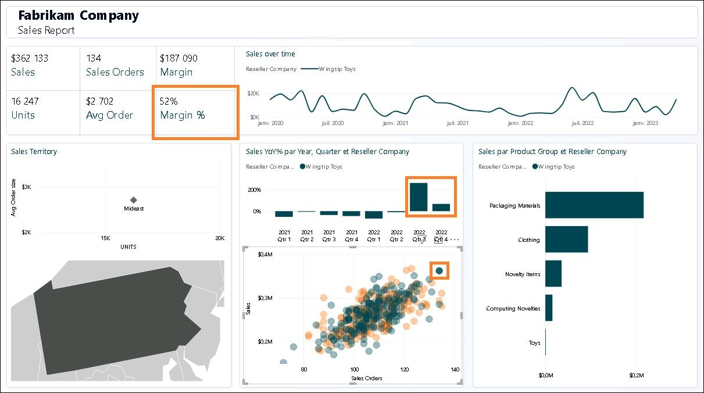

5. Cliquez sur la valeur Reseller hors norme dans le visuel Nuage de points pour **supprimer le filtre**.

6. Obtenons les détails produit par groupe de produits et revendeur. Dans le graphique à barres Ventes par groupe de produits et société revendeuse, **cliquez avec le bouton droit sur la partie orange de la barre Matériaux d’emballage pour Tailspin Toys**, puis, dans la boîte de dialogue, sélectionnez **Exploration détaillée -> Détail du produit**.

    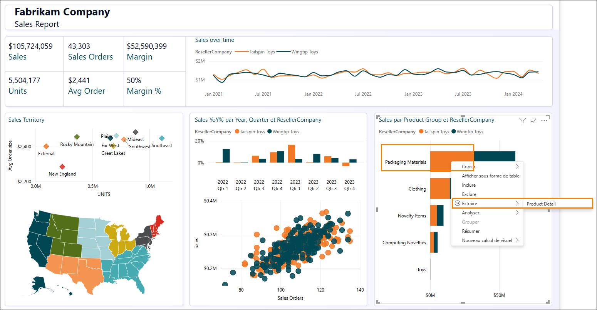

7. Vous êtes alors redirigé vers la page qui fournit les détails produit. Notez que de futures commandes sont également en cours.

8. Après avoir examiné cette page, revenez à l’état sur les ventes à l’aide du raccourci **Ctrl + flèche Précédent** en haut de la page à gauche.

    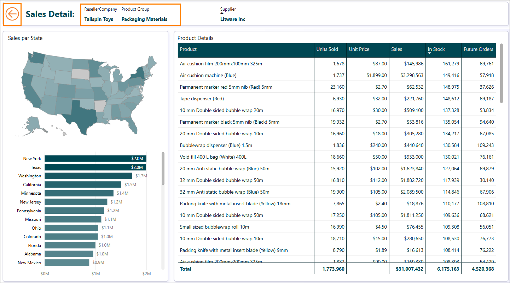

9. N’hésitez pas à analyser davantage l’état. Une fois prêt, jetez un œil à la vue de modèle.
    Dans le volet gauche, cliquez sur **Icône de vue de modèle**.

10. Notez qu’il existe deux tables de fait : Sales et PO.

    a. La granularité des données Sales est par valeur Date, Reseller, Product et People. Les valeurs Date, Reseller, Product et People sont liées à la table Sales.

    b. La granularité des données PO est par valeur Date, Product et People. Les valeurs Date, Product et People sont liées à la table PO.

    c. Nous disposons de données Supplier par Product. La valeur Supplier est liée à la table Product.

    d. Nous disposons des données d’emplacement du Reseller par Geo. La valeur Geo est liée à la valeur Reseller.

    e. Nous avons des informations Customer par Reseller. La valeur Customer est liée à la valeur Reseller.

### Tâche 3 : examiner les requêtes Power Query

1. Examinons à présent Power Query pour comprendre les sources de données. Dans le ruban, cliquez sur **Accueil -> Transformer les données**.

    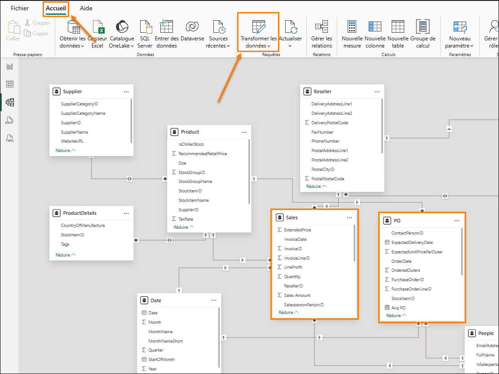

2. Une fenêtre Power Query s’ouvre alors. Dans le ruban, cliquez sur **Accueil -> Paramètres de la source de données**. La boîte de dialogue Paramètres de la source de données s’ouvre alors. En parcourant la liste, notez que quatre sources de données principales sont mentionnées dans l’énoncé du problème :

    - Snowflake

    - SharePoint

    - ADLS Gen2

    - Dataverse

3. Cliquez sur **Fermer** pour fermer la boîte de dialogue Paramètres de la source de données.

    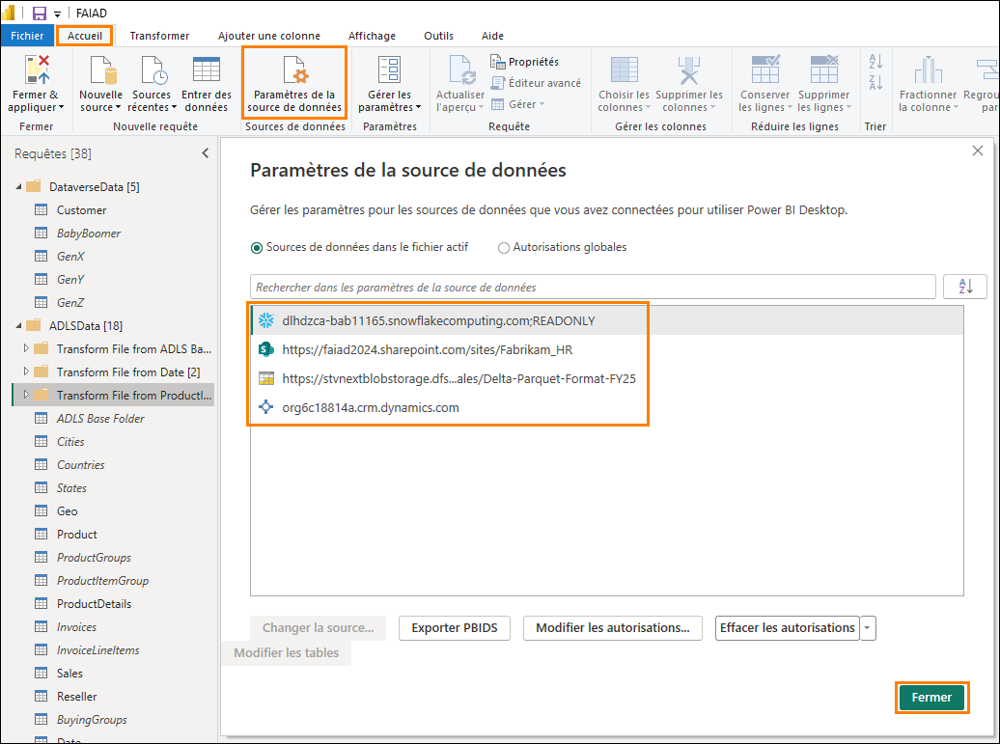

4. Dans le volet gauche Queries, notez que les requêtes sont regroupées par source de données.

5. Notez que le dossier **DataverseData** comporte des données Customer disponibles dans quatre requêtes différentes : BabyBoomer, GenX, GenY et GenZ. Ces quatre requêtes sont ajoutées pour créer la requête Customer.

6. Cliquez sur la requête Customer dans la fenêtre de requêtes. En sélectionnant cette requête, vous devrez entrer à nouveau vos informations d’identification Dataverse. Cliquez sur **Modifier les informations d’identification**.

    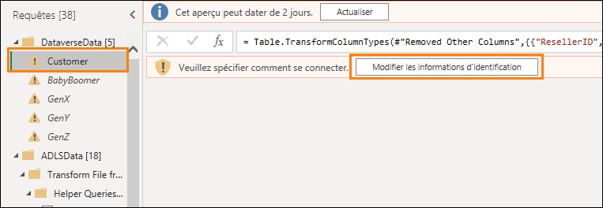

7. Cliquez sur **Se connecter** pour vous connecter à votre compte.

    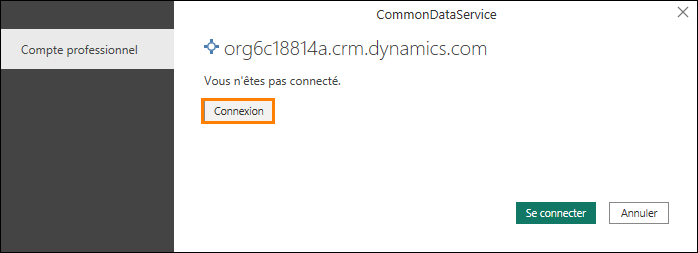

8. Vous pouvez saisir les informations d’identification de la source de données Dataverse en saisissant le **Nom d’utilisateur** et le **Mot de passe**. Les informations d’identification sont fournies ci-après. Une fois que vous avez terminé, cliquez sur **Connecter**.

    - Adresse e-mail/Nom d’utilisateur : disponible dans l’onglet Environnement

    - Mot de passe : disponible dans l’onglet Environnement

9. Cliquez sur la requête **ADLS Base Folder** dans la fenêtre de requêtes. En sélectionnant cette requête, vous devrez entrer les informations d’identification. Cliquez sur **Modifier les informations d’identification**.

    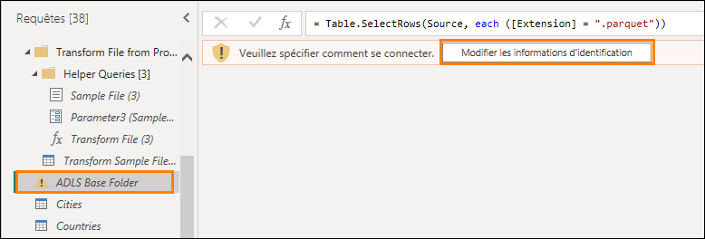

10. Pour la source de données ADLS, sélectionnez l’option **Signature d’accès partagé (SAS)**, puis saisissez le **jeton SAS** fourni ci-dessous. Cliquez ensuite sur **Connecter**.

    - **Jeton SAS :** Disponible dans l’onglet Environnement

    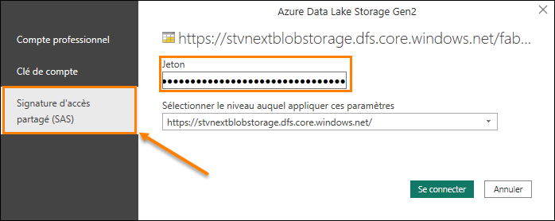

11. Notez que le dossier **ADLSData** comporte plusieurs dimensions : Geo, Product, Reseller et Date. Il comporte également des faits Sales.

    - **La dimension Geo** est créée en fusionnant les données des requêtes Cities, Countries et States.

    - **La dimension Product** est créée en fusionnant les données des requêtes Product Groups et Product Item Group.

    - **La dimension Reseller** est filtrée à l’aide de la requête BuyingGroup.

    - **Le fait Sales** est créé en fusionnant la requête InvoiceLineItems avec la requête Invoice.

12. Pour la source de données Snowflake, sélectionnez la requête **SupplierCategories** dans la fenêtre Requêtes. En sélectionnant cette requête, vous devrez saisir les informations d’identification. Cliquez sur **Modifier les informations d’identification**.

    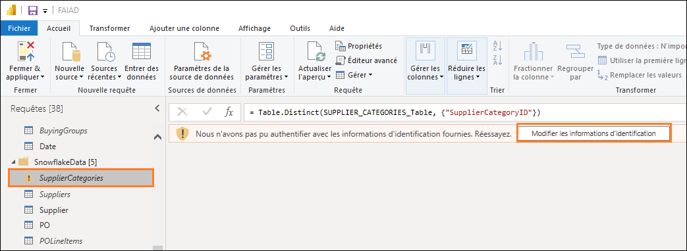

13. Saisissez le **nom d’utilisateur Snowflake** et le **mot de passe Snowflake** fournis ci-après. Utilisez ces informations d’identification pour connecter toutes les tables sous Snowflake à Snowflake, puis cliquez sur **Connecter**.

    - **Nom d’utilisateur Snowflake** : TE_SNOWFLAKE1

    - **Mot de passe Snowflake** : 8UpfRpExVDXv2AC1

    *Remarque : si vous avez des difficultés à vous connecter à Snowflake avec les informations d’identification susmentionnées, veuillez utiliser les informations d’identification de secours fournies ci-après.*

    - **Nom d’utilisateur Snowflake :** SNOWFLAKE_BACKUP

    - **Mot de passe Snowflake :** 8UpfRpExVDXv2AC1

14. Notez que le dossier SnowflakeData comporte une dimension Supplier et un fait PO (Commande/Dépense).

    - **La dimension Supplier** est créée en fusionnant la requête Suppliers avec la requête SupplierCategories.

    - **Le fait PO** est créé en fusionnant la requête PO avec la requête PO Line Items.

15. Pour la source de données SharePoint, sélectionnez la requête **People** dans la fenêtre Requêtes. En sélectionnant cette requête, vous devrez saisir les informations d’identification. Cliquez sur **Modifier les informations d’identification**.

    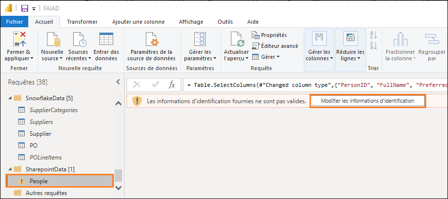

16. Cliquez sur l’option **Compte Microsoft**, puis sur **Se connecter**. Saisissez le nom d’utilisateur et le mot de passe fournis ci-dessous, puis cliquez sur Connecter.

    - **Adresse e-mail/Nom d’utilisateur :** Disponible dans l’onglet Environnement

    - **Mot de passe :** Disponible dans l’onglet Environnement

    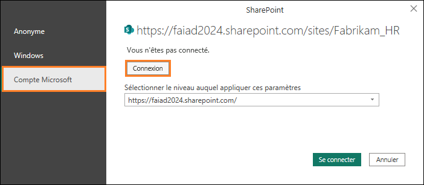

17. Notez que le dossier **SharepointData** comporte la dimension People.

    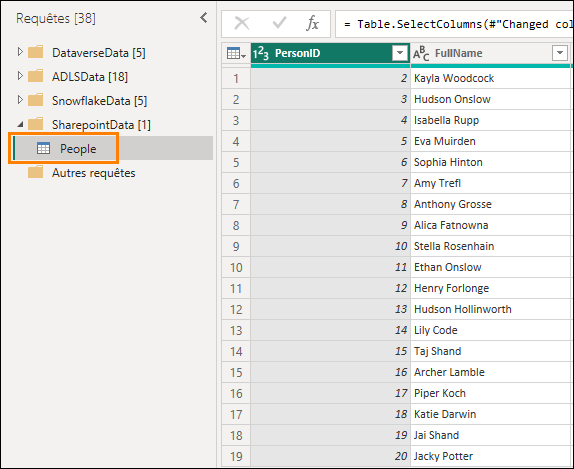

    Nous savons désormais à quoi nous avons affaire. Dans les labos suivants, nous allons créer une requête Power Query similaire à l’aide de Dataflow Gen2 et effectuer une modélisation à l’aide d’une lakehouse.

# Références

Fabric Analyst in a Day (FAIAD) vous présente certaines des fonctions clés de Microsoft Fabric. Dans le menu du service, la section Aide (?) comporte des liens vers d’excellentes ressources.

Voici quelques autres ressources qui vous aideront lors de vos prochaines étapes avec Microsoft Fabric :

- Consultez le billet de blog pour lire l’intégralité de [l’annonce de la GA de Microsoft Fabric](https://aka.ms/Fabric-Hero-Blog-Ignite23).

- Explorez Fabric grâce à la [visite guidée](https://aka.ms/Fabric-GuidedTour).

- Inscrivez-vous pour bénéficier d’un [essai gratuit de Microsoft Fabric](https://aka.ms/try-fabric).

- Rendez-vous sur le [site web Microsoft Fabric](https://aka.ms/microsoft-fabric).

- Acquérez de nouvelles compétences en explorant les [modules d’apprentissage Fabric](https://aka.ms/learn-fabric).

- Explorez la [documentation technique Fabric](https://aka.ms/fabric-docs).

- Lisez le [livre électronique gratuit sur la prise en main de Fabric](https://aka.ms/fabric-get-started-ebook).

- Rejoignez la [communauté Fabric](https://aka.ms/fabric-community) pour publier vos questions, partager vos commentaires et apprendre des autres.

Lisez les blogs d’annonces plus détaillés sur l’expérience Fabric :

- [Blog Expérience Data Factory dans Fabric ](https://aka.ms/Fabric-Data-Factory-Blog)

- [Blog Expérience Synapse Data Engineering dans Fabric](https://aka.ms/Fabric-DE-Blog)

- [Blog Expérience Synapse Data Science dans Fabric](https://aka.ms/Fabric-DS-Blog)

- [Blog Expérience Synapse Data Warehousing dans Fabric](https://aka.ms/Fabric-DW-Blog)

- [Blog Expérience Synapse Real-Time Analytics dans Fabric](https://aka.ms/Fabric-RTA-Blog)

- [Blog Annonce Power BI](https://aka.ms/Fabric-PBI-Blog)

- [Blog Expérience Data Activator dans Fabric](https://aka.ms/Fabric-DA-Blog)

- [Blog Administration et gouvernance dans Fabric](https://aka.ms/Fabric-Admin-Gov-Blog)

- [Blog OneLake dans Fabric](https://aka.ms/Fabric-OneLake-Blog)

- [Blog Intégration de Dataverse et Microsoft Fabric](https://aka.ms/Dataverse-Fabric-Blog)

© 2023 Microsoft Corporation. Tous droits réservés.

En effectuant cette démonstration/ce labo, vous acceptez les conditions suivantes :

La technologie/fonctionnalité décrite dans cette démonstration/ce labo est fournie par Microsoft Corporation en vue d’obtenir vos commentaires et de vous fournir une expérience d’apprentissage. ous pouvez utiliser cette démonstration/ce labo uniquement pour évaluer ces technologies et fonctionnalités, et pour fournir des commentaires à Microsoft. Vous ne pouvez pas l’utiliser à d’autres fins. Vous ne pouvez pas modifier, copier, distribuer, transmettre, afficher, effectuer, reproduire, publier, accorder une licence, créer des œuvres dérivées, transférer ou vendre tout ou une partie de cette démonstration/ce labo.

LA COPIE OU LA REPRODUCTION DE CETTE DÉMONSTRATION/CE LABO (OU DE TOUTE PARTIE DE CEUX-CI) SUR TOUT AUTRE SERVEUR OU AUTRE EMPLACEMENT EN VUE D’UNE AUTRE REPRODUCTION OU REDISTRIBUTION EST EXPRESSÉMENT INTERDITE.

CETTE DÉMONSTRATION/CE LABO FOURNISSENT CERTAINES FONCTIONNALITÉS DE PRODUIT/TECHNOLOGIES LOGICIELLES, NOTAMMENT D’ÉVENTUELS NOUVEAUX CONCEPTS ET FONCTIONNALITÉS, DANS UN ENVIRONNEMENT SIMULÉ SANS INSTALLATION OU CONFIGURATION COMPLEXE AUX FINS DÉCRITES CI-DESSUS. LES TECHNOLOGIES/CONCEPTS REPRÉSENTÉS DANS CETTE DÉMONSTRATION/CE LABO PEUVENT NE PAS REPRÉSENTER LES FONCTIONNALITÉS COMPLÈTES ET PEUVENT NE PAS FONCTIONNER DE LA MÊME MANIÈRE QUE DANS UNE VERSION FINALE. IL EST ÉGALEMENT POSSIBLE QUE NOUS NE PUBLIIONS PAS DE VERSION FINALE DE CES FONCTIONNALITÉS OU CONCEPTS. VOTRE EXPÉRIENCE D’UTILISATION DE CES FONCTIONNALITÉS DANS UN ENVIRONNEMENT PHYSIQUE PEUT ÉGALEMENT ÊTRE DIFFÉRENTE.

**COMMENTAIRES.** Si vous envoyez des commentaires sur les fonctionnalités, technologies et/ou concepts décrits dans cette démonstration/ce labo à Microsoft, vous accordez à Microsoft, sans frais, le droit d’utiliser, de partager et de commercialiser vos commentaires de quelque manière et à quelque fin que ce soit. Vous accordez également à des tiers, sans frais, les droits de brevet nécessaires pour leurs produits, technologies et services en vue de l’utilisation ou de l’interface avec des parties spécifiques d’un logiciel ou d’un service Microsoft incluant les commentaires. Vous n’enverrez pas de commentaires soumis à une licence exigeant que Microsoft accorde une licence pour son logiciel ou sa documentation à des tiers du fait que nous y incluons vos commentaires. Ces droits survivent à ce contrat.

MICROSOFT CORPORATION DÉCLINE TOUTES LES GARANTIES ET CONDITIONS EN CE QUI CONCERNE CETTE DÉMONSTRATION/CE LABO, Y COMPRIS TOUTES LES GARANTIES ET CONDITIONS DE QUALITÉ MARCHANDE, QU’ELLES SOIENT EXPLICITES, IMPLICITES OU LÉGALES, D’ADÉQUATION À UN USAGE PARTICULIER, DE TITRE ET D’ABSENCE DE CONTREFAÇON. MICROSOFT N’OFFRE AUCUNE GARANTIE OU REPRÉSENTATION EN CE QUI CONCERNE LA PRÉCISION DES RÉSULTATS, LA CONSÉQUENCE QUI DÉCOULE DE L’UTILISATION DE CETTE DÉMONSTRATION/CE LABO, OU L’ADÉQUATION DES INFORMATIONS CONTENUES DANS CETTE DÉMONSTRATION/CE LABO À QUELQUE FIN QUE CE SOIT.

**CLAUSE D’EXCLUSION DE RESPONSABILITÉ**

Cette démonstration/Ce labo comporte seulement une partie des nouvelles fonctionnalités et améliorations disponibles dans Microsoft Power BI. Certaines fonctionnalités sont susceptibles de changer dans les versions ultérieures du produit. Dans ce labo/cette démonstration, vous allez découvrir comment utiliser certaines nouvelles fonctionnalités, mais pas toutes.
