# Microsoft Fabric - Fabric Analyst in a Day - Labo 2

## Sommaire

- Introduction
- Licence Fabric
  - Tâche 1 : activer une licence d’essai Microsoft Fabric
- Espace de travail Fabric
  - Tâche 2 : créer un espace de travail Fabric
  - Tâche 3 : créer un lakehouse
- Présentation des expériences Fabric
  - Tâche 4 : expérience Data Factory
  - Tâche 5 : expérience Industry Solutions
  - Tâche 6 : expérience Real-Time Intelligence
  - Tâche 7 : expérience Data Engineering
- Tâches 8 : expérience Data Science
- Tâches 9 : expérience Data Warehouse
  - Tâche 10 : expérience Databases
- Références

# Introduction

Aujourd’hui, vous allez découvrir diverses fonctionnalités clés de Microsoft Fabric. Il s’agit d’un atelier d’introduction destiné à vous présenter les différentes expériences produit et les divers éléments disponibles dans Fabric. À la fin de cet atelier, vous saurez comment utiliser Lakehouse, Dataflow Gen2, un pipeline, DirectLake et plus encore.

À la fin de ce labo, vous saurez :

- comment créer un espace de travail Fabric ;

- comment créer un lakehouse.

# Licence Fabric

### Tâche 1 : activer une licence d’essai Microsoft Fabric

1. Sélectionnez **Portail Power BI** sur le bureau de la machine virtuelle. Vous serez peut-être invité à vous connecter.

    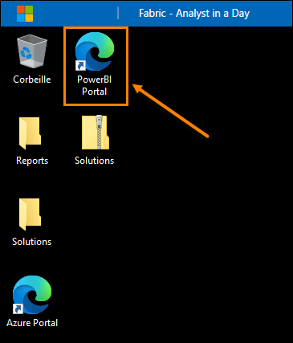

    ** *Remarque :*** *si vous utilisez l’environnement de labo, vous serez peut-être connecté automatiquement.*

    ***Remarque :** si Fabric ne s’ouvre pas, accédez à l’adresse http://app.fabric.microsoft.com/ dans le navigateur.*

2. Copiez le Nom d’utilisateur et collez-le dans le champ Messagerie de la boîte de dialogue, puis cliquez sur Envoyer.

    - **Adresse e-mail/Nom d’utilisateur :** disponible dans l’onglet Environnement

    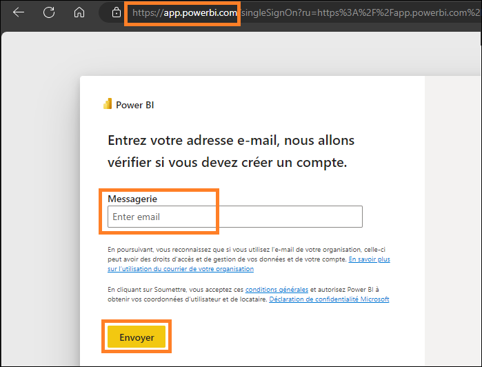

3. Dans l’onglet **Se connecter à Microsoft Azure**, vous voyez l’écran de connexion ; saisissez la valeur **EmailUsername** suivante, puis cliquez sur **Suivant**.

    - **Adresse e-mail/Nom d’utilisateur :** disponible dans l’onglet Environnement

    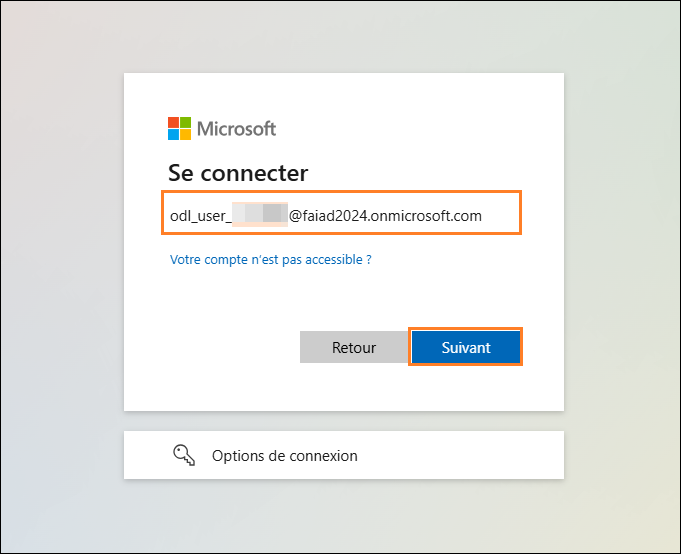

4. Saisissez maintenant le **Passe d’accès temporaire** suivant et cliquez sur **Se connecter**.

    - **Passe d’accès temporaire :** disponible dans l’onglet Environnement

    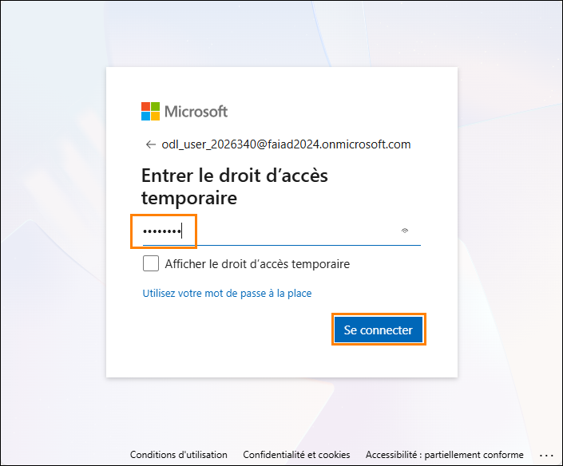

5. Vous êtes alors redirigé(e) vers la **page d’accueil Service Power BI** familière.

6. Nous supposons que vous connaissez la disposition du service Power BI. Si vous avez une question, n’hésitez pas à la poser au formateur.

    Vous êtes actuellement dans **Mon espace de travail**. Pour utiliser des éléments Fabric, vous avez besoin d’une licence d’essai et d’un espace de travail doté d’une licence Fabric. Commençons la configuration.

7. Dans le coin supérieur droit de l’écran, cliquez sur l’**icône**** utilisateur**.

8. Cliquez sur **Essai gratuit**.

    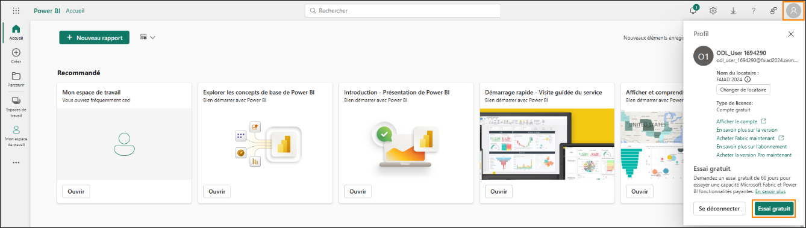

9. La boîte de dialogue de mise à niveau vers un essai gratuit Microsoft Fabric s’ouvre alors. Cliquez sur **Activer**.

    ***Remarque :** ne modifiez pas la région par défaut. Conservez-la telle quelle.*

    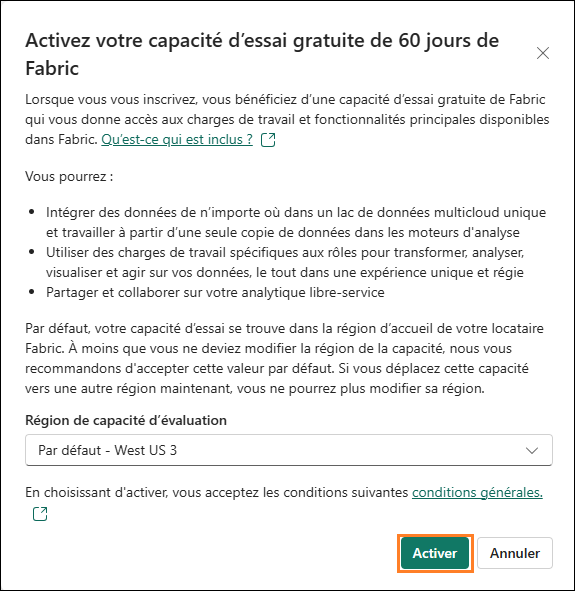

10. La boîte de dialogue Mise à niveau réussie vers Microsoft Fabric s’ouvre alors. Cliquez sur **Fabric Home Page**.

    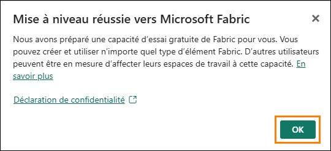

11. Vous êtes alors redirigé(e) vers la **page d’accueil Microsoft Fabric**. Une boîte de dialogue « Bienvenue dans la vue Fabric » peut s’ouvrir. Si vous le souhaitez, vous pouvez Sélectionner l’option **Démarrer la visite** ou **Annuler**.

    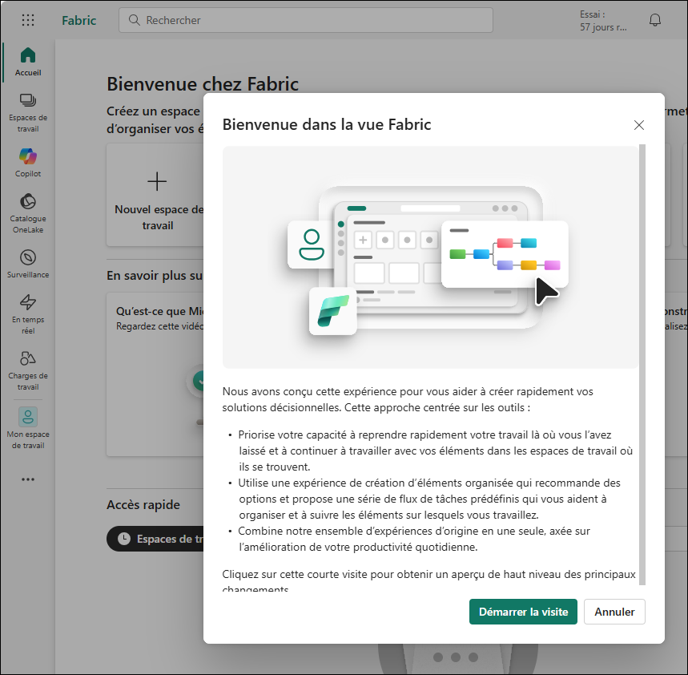

# Espace de travail Fabric

### Tâche 2 : créer un espace de travail Fabric

1. Créons maintenant un espace de travail avec la licence Fabric. Cliquez sur **Espaces de travail** (1) dans la barre de navigation gauche. Une boîte de dialogue s’ouvre alors.

2. Cliquez sur **+ Nouvel espace de travail** (2) en bas du menu contextuel.

    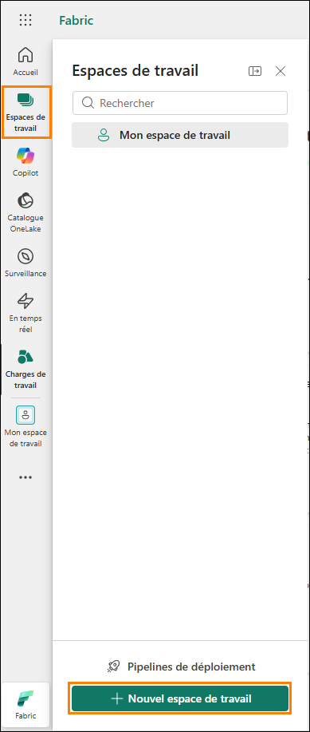

3. La boîte de dialogue **Créer un espace de travail** s’ouvre alors sur le côté droit du navigateur.

4. Dans le champ **Nom**, saisissez FAIAD_UserID (disponible dans l’onglet Environnement).

    ***Remarque :** le nom de l’espace de travail doit être unique. Assurez-vous qu’une coche verte avec « Ce nom est disponible » s’affiche sous le champ Nom.*

5. Si vous le souhaitez, vous pouvez saisir une Description pour l’espace de travail. Il s’agit d’un champ facultatif.

6. Cliquez sur **Options avancées** pour développer la section.

    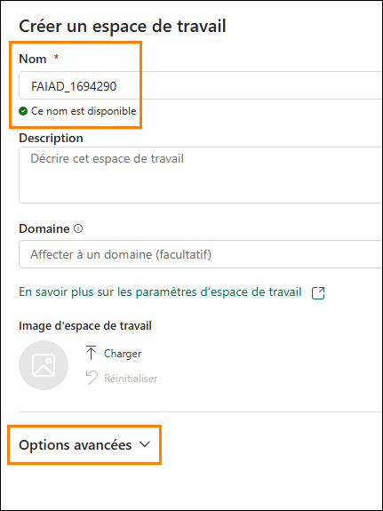

7. Sous **Modèle de Licence**, assurez-vous que la case **Essai** est cochée. (Elle devrait l’être par défaut.)

8. Cliquez sur **Appliquer** pour créer un espace de travail.

    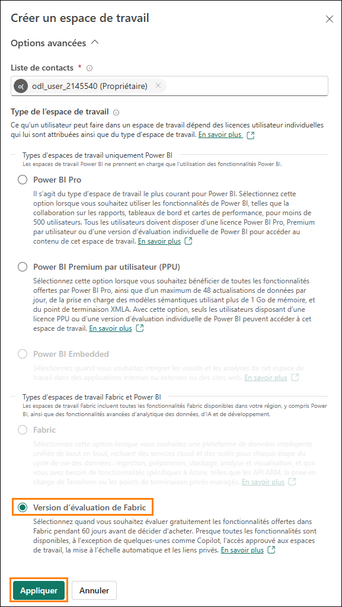

    Vous serez redirigé vers l’espace de travail que vous venez de créer. Nous allons importer les données des différentes sources de données dans un lakehouse et créer notre modèle à l’aide des données du lakehouse et en rendre compte. La première étape consiste à créer un lakehouse. Nous nous en chargerons ensuite.

### Tâche 3 : créer un lakehouse

1. Dans l’espace de travail **FAIAD_Username** venant d’être créé, recherchez le bouton **+ Nouvel élément (1)** dans le volet de navigation gauche. C’est dans cette section que vous pouvez commencer à créer des éléments dans votre espace de travail.

2. Dans la zone de recherche, saisissez **Lakehouse (2)** puis, dans les résultats de la recherche, sélectionnez l’option **Lakehouse (3)**. Vous pourrez alors créer un lakehouse pour stocker, interroger et gérer votre Big Data.

    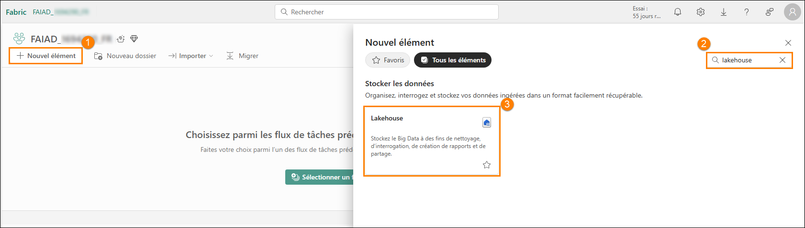

3. Une boîte de dialogue Nouveau lakehouse s’affiche alors. Saisissez **lh_FAIAD** dans la zone de texte Nom.

    ***Remarque :** lh fait ici référence à Lakehouse. Nous ajoutons le préfixe lh afin de faciliter l’identification et la recherche.*

    ***Remarque :** cette fonctionnalité n’est plus en version préliminaire, **mais nous n’avons toujours pas besoin de l’activer.***

4. Cliquez sur **Créer**.

    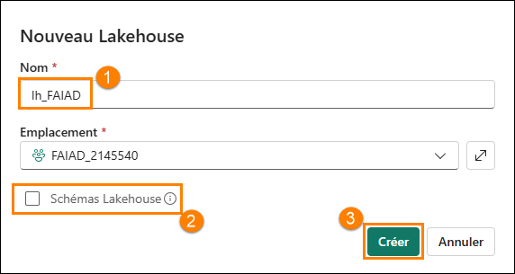

    Quelques instants après, un lakehouse est créé et vous êtes redirigé vers l’interface de l’explorateur Lakehouse. En haut à gauche, à côté du nom Fabric dans l’en-tête, se trouve l’icône Lakehouse. L’icône de l’espace de travail dans le menu de navigation de gauche indiquera désormais qu’il contient un élément

    Dans l’Explorateur Lakehouse, notez des sections Tables et Fichiers. Un lakehouse peut exposer des fichiers Azure Data Lake Storage Gen2 sous la section Fichiers ou un flux de données peut charger des données dans des tables Lakehouse. Diverses options sont disponibles. Nous allons vous montrer certaines des options dans les labos suivants.

    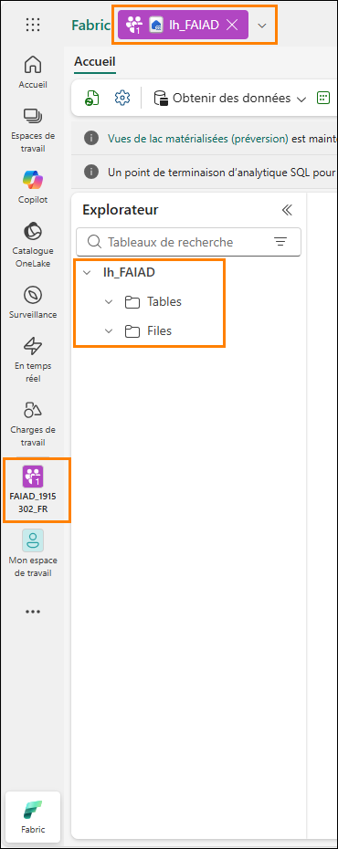

# Présentation des expériences Fabric

### Tâche 4 : expérience Data Factory

1. Cliquez sur l’icône Charges de travail à gauche de votre écran. Une boîte de dialogue avec la liste des expériences Fabric s’ouvre alors. La liste des expériences inclut Power BI, Data Factory, Industry Solutions, Real-Time Intelligence, Data Engineering, Data Science et Data Warehouse. Découvrons-les.

    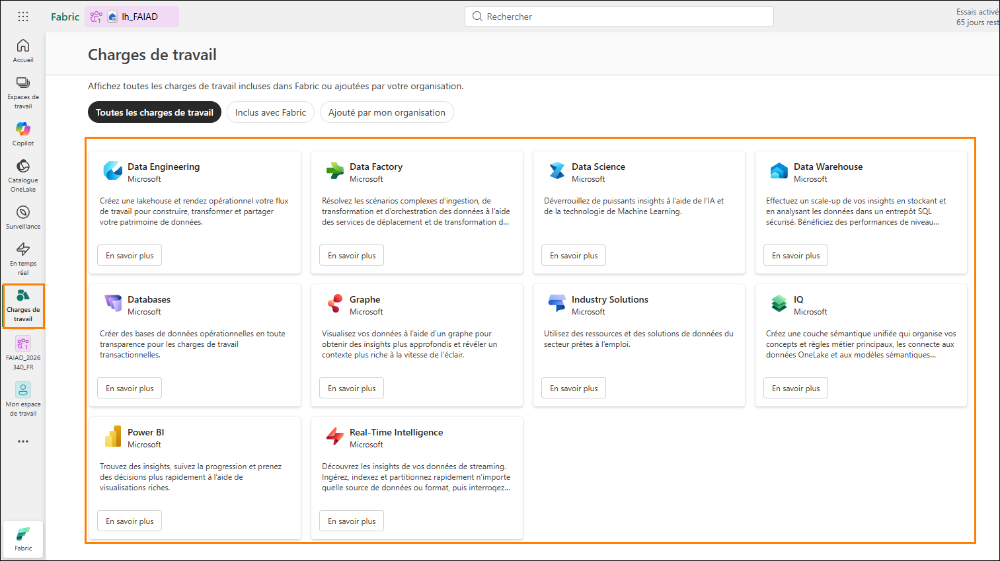

2. Cliquez sur **Data Factory**.

    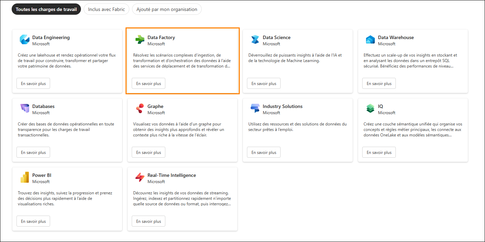

3. Vous êtes alors redirigé(e) vers la page d’accueil Data Factory. Ses sections sont présentées en détail ci-après, afin de vous guider pas à pas pour vous aider à utiliser efficacement Data Factory. Dataflow Gen2 est la nouvelle génération de Dataflow.

    **En quoi consiste Data Factory ?**

    Data Factory est un outil qui vous aide à gérer et à organiser les données issues de différentes sources. Il vous permet de recueillir, de préparer et de transformer des données pour les utiliser efficacement. Que vous soyez débutant ou expert, Data Factory fournit des outils qui rendent la transformation des données plus simple et plus efficace.

    **Types d’éléments :**

    1) **Flux de données Gen2 :** les flux de données sont comme des recettes de transformation des données. Ils proposent plus de 300 transformations différentes à appliquer à vos données. Autrement dit, vous pouvez nettoyer, combiner et modifier vos données de plusieurs manières, selon vos besoins.

    2) **Pipeline :** les pipelines sont des flux de travail qui vous aident à automatiser les processus de données. Ils vous permettent de créer des flux de travail de données flexibles qui peuvent être adaptés à vos besoins spécifiques. Cela facilite la gestion et le traitement des données d’une manière structurée.

    3) **Azure Data Factory** **:** Azure Data Factory est un service d’intégration de données informatique, qui vous permet de créer des flux de travail pilotés par les données pour orchestrer et automatiser le déplacement et la transformation des données.

    4) **Tâche Apache Airflow** **:** Apache Airflow est une plateforme open source permettant de créer, planifier et surveiller par programme des flux de travail. Dans Data Factory, elle vous permet de créer, planifier et gérer des flux de travail de données complexes.

    5) **Copier la tâche** **:** copier la tâche est une fonctionnalité qui vous permet de copier des données d’une source vers une autre. Elle fournit ainsi un moyen simple et efficace de déplacer des données entre différentes banques de données.

    6) **Mise en miroir de la base de données :** une fonctionnalité permettant de créer des versions de bases de données mises en miroir pour la sauvegarde, les tests ou un accès en lecture seule.

    7) **Mise en miroir SAP :** intégrez de manière transparente votre environnement SAP existant avec le reste de vos données dans Fabric.

    8) **Mise en miroir Oracle :** la mise en miroir dans Fabric réplique vos bases de données Oracle dans une plateforme unifiée, permettant une analyse en quasi-temps réel et à faible latence, aux côtés d’autres sources de données.

    9) **Mise en miroir Google Big Query (version préliminaire) :** la mise en miroir dans Fabric vous permet de répliquer en continu les données de Google BigQuery vers OneLake, supprimant ainsi la complexité des processus ETL et permettant une utilisation fluide des données dans les domaines de l’analyse, de l’IA et du partage de données.

    10) **Liste SharePoint Online mise en miroir (version préliminaire) :** réplique les données de liste SharePoint en quasi-temps réel dans Microsoft Fabric OneLake en tant que source prête pour l’analytique et accessible en lecture seule. Elle élimine le processus ETL et expose les données par l’intermédiaire d’un point de terminaison d’analytique SQL créé automatiquement pour Power BI et les autres charges de travail Fabric.

    11) **Bibliothèque de variables :** comporte une liste de variables et leurs valeurs par défaut. Elle peut également comporter d’autres ensembles de valeurs contenant des valeurs alternatives

    12) **Travail dbt (version préliminaire) :** permet d’utiliser dbt pour transformer des données avec SQL dans un environnement familier.

    **Prise en main :**

    Pour commencer à utiliser Data Factory, procédez comme suit :

    1) **Apprendre à utiliser Data Factory** **:** cette section vous aide à prendre en main Data Factory. Vous y trouverez des conseils afin d’utiliser efficacement l’outil.

    2) **Créez votre premier flux de données** **:** ici, vous pouvez découvrir comment créer votre premier flux de données. Les flux de données sont essentiels pour transformer vos données selon vos besoins.

    3) **Créer votre premier pipeline :** cette section vous guide afin de vous aider à créer votre premier pipeline. Les pipelines permettent d’automatiser et de gérer efficacement vos processus de traitement de données.

    4) **Apprendre à surveiller les Data Factory** **:** la surveillance est essentielle pour garantir le bon fonctionnement de vos processus de traitement des données. Cette section explique comment surveiller vos activités dans Data Factory.

    5) **Apprendre à transformer les données avec des flux de données** **:** cette section vous explique comment transformer efficacement vos données à l’aide de flux de données.

    6) **Créer votre première API pour GraphQL** **:** si vous souhaitez utiliser des API avec GraphQL, cette section vous explique comment démarrer.

    7) **Créer vos premières fonctions de données utilisateur** **:** cette section vous permet de créer des fonctions de données utilisateur, lesquelles sont utiles pour gérer et transformer les données utilisateur.

    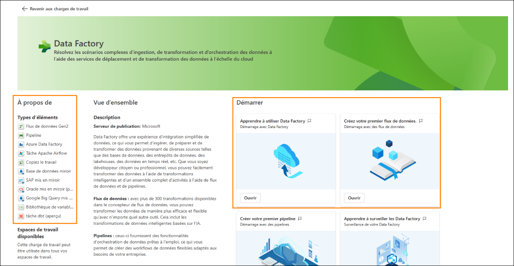

4. Cliquez sur **Revenir aux charges de travail** dans le coin supérieur gauche de l’écran. Vous êtes alors redirigé(e) vers la page principale des charges de travail, où vous pouvez explorer d’autres outils ou sections.

    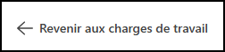

### Tâche 5 : expérience Industry Solutions

1. Sur la page **Mes charges de travail**, cliquez sur **Industry Solutions** pour continuer.

    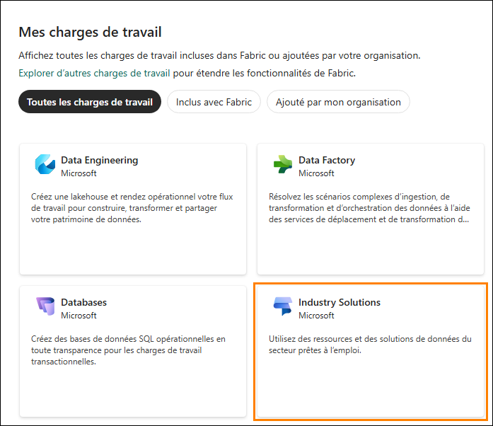

2. Vous êtes alors redirigé(e) vers la page d’accueil Industry Solutions. Vous trouverez ci-dessous une présentation détaillée des sections qui se trouvent sur cette page, lesquelles vous aideront à utiliser Industry Solutions efficacement et pas à pas.

    **En quoi consiste Industry Solutions ?**

    La charge de travail Industry Solutions représente des solutions de données prêtes à l’emploi dans Microsoft Fabric, qui fournissent des solutions et des ressources pour différents secteurs. Industry Solutions vous aide à démarrer avec des scénarios métier clés en utilisant des modèles de données, des connecteurs, des transformations, des états et d’autres ressources sectorielles.

    **Types d’éléments :**

    1) **Solutions de développement durable** **:** prennent en charge l’ingestion, la standardisation et l’analyse des données environnementales, sociales et de gouvernance (ESG).

    2) **Les solutions de données de santé :** sont conçues stratégiquement pour accélérer la création de valeur pour les clients en répondant au besoin critique de transformer efficacement les données de santé dans un format adapté à l’analyse.

    ***Remarque :** certaines solutions peuvent ne pas apparaître pour vous*

    **Prise en main :**

    Pour commencer à utiliser Industry Solutions, procédez comme suit :

    1) **Découvrir les solutions de données de santé** **:** cliquez sur « En savoir plus » pour en apprendre davantage sur les solutions de données de santé et comprendre comment les utiliser dans vos projets.

    2) **Démarrer avec les solutions de données de santé :** commencez à déployer des solutions de données de santé et à les implémenter dans vos projets.

    3) **Découvrir les solutions de développement durable** **:** cliquez sur « En savoir plus » pour en apprendre davantage sur les solutions de développement durable et comprendre comment les utiliser dans vos projets.

    4) **Démarrer avec les solutions de durabilité :** commencez à déployer des solutions de durabilité et à les implémenter dans vos projets.

    5) **Découvrir les solutions de vente au détail** **:** cliquez sur le bouton « En savoir plus » pour en apprendre davantage sur les solutions de vente au détail et comprendre comment les utiliser dans vos projets.

    6) **Démarrer avec les solutions de vente au détail :** commencez à déployer des solutions de vente au détail et à les implémenter dans vos projets.

    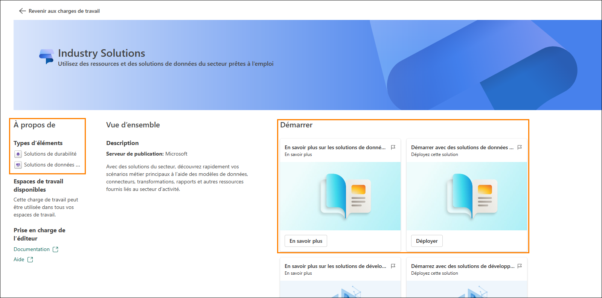

3. Cliquez sur Revenir aux charges de travail dans le coin supérieur gauche de l’écran. Vous êtes alors redirigé(e) vers la page principale des charges de travail, où vous pouvez explorer d’autres outils ou sections.

    

### Tâche 6 : expérience Real-Time Intelligence

1. Sur la page **Mes charges de travail**, cliquez sur **Real-Time Intelligence** pour continuer.

    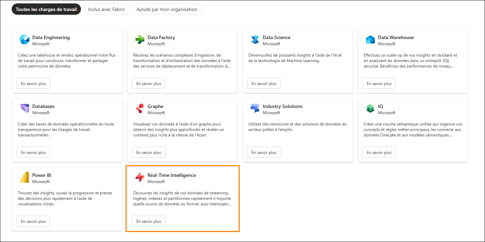

2. Vous êtes alors redirigé(e) vers la page d’accueil Real-Time Intelligence. Vous trouverez ci-dessous un aperçu détaillé des sections qui se trouvent sur cette page, lesquelles vous aideront à utiliser Real-Time Intelligence efficacement et pas à pas.

    **En quoi consiste Real-Time Intelligence ?**

    Real-Time Intelligence est un outil qui vous aide à gérer et analyser de gros volumes de données à granularité élevée issues de diverses sources. Il vous permet d’ingérer, d’analyser et d’agir sur vos données en temps réel, pour optimiser vos opérations d’entreprise grâce à des décisions et des mesures prises en temps opportun.

    **Types d’éléments :**

1. **Eventhouse**** :** permet de créer un espace de travail d’une ou plusieurs bases de données KQL, qui peuvent être partagées entre les projets.

2. **Jeu de requêtes KQL** **:** permet d’exécuter des requêtes sur les données afin de produire des tables et visuels qui peuvent être partagés.

3. **Tableau de bord en temps réel** **:** permet de visualiser des tableaux de bord en temps réel dans les secondes qui suivent l’ingestion des données.

4. **Eventstream :** permet de capturer, de transformer et d’acheminer un flux d’événements en temps réel.

5. **Activateur**** :** permet de surveiller les jeux de données, les requêtes et les flux d’événements à la recherche de modèles.

6. **Ensemble de schémas d’événements (version préliminaire) :** ils vous aident à organiser
    et à normaliser les structures de données (schémas) pour vos workflows d’analyse en temps réel, ce qui facilite le traitement et l’analyse cohérents des données en diffusion en continu.

7. Connecteur de flux personnalisé **(version préliminaire)** : vous permet d’envoyer des événements en temps réel vers un eventstream à partir de vos propres points de terminaison et de vos applications personnalisées.

8. **Détecteur d’anomalies (version préliminaire) :** la détection d’anomalies identifie automatiquement les schémas inhabituels et les valeurs aberrantes dans vos tables Eventhouse.

9. **Carte :** apportez des informations géospatiales à Real-Time Intelligence, permettant à chacun de visualiser où les événements se produisent, d’intégrer des données spatiales avec les autres fonctionnalités de Fabric et de prendre des décisions plus intelligentes et contextualisées selon la localisation.

10. **Carte (version préliminaire) :** apportez des informations géospatiales à Real-Time Intelligence, permettant à chacun de visualiser où les événements se produisent, d’intégrer des données spatiales avec les autres fonctionnalités de Fabric et de prendre des décisions plus intelligentes et contextualisées selon la localisation.

11. **Générateur de jumeau numérique (version préliminaire) :** le générateur de jumeau numérique offre aux utilisateurs des expériences low code/no code pour créer et modéliser leurs concepts métier, tels que les actifs et les processus, à l’aide d’une ontologie.

    **Démarrer :**

    Pour commencer à utiliser Real-Time Intelligence, procédez comme suit :

1. **Expériences de bout en bout dans Real-Time Intelligence :** cliquez sur le bouton « Démarrer » pour explorer l’analyse des données en temps réel avec des exemples de jeux de données.

2. **Échantillons de Real-Time Intelligence** **:** cliquez sur le bouton « Ouvrir » pour explorer l’analyse des données en temps réel avec un exemple.

3. **Explorer un exemple Eventhouse :** cliquez sur le bouton « Sélectionner » pour utiliser un exemple et découvrir Real-Time Intelligence.

4. **Présentation de Real-Time Intelligence** **:** cliquez sur le bouton « Ouvrir » pour bénéficier d’une présentation de Real-Time Intelligence et commencer à utiliser efficacement l’outil.

5. **Découvrir KQL avec des exemples de données** **:** cliquez sur le bouton « Ouvrir » pour découvrir KQL à l’aide d’exemples de données.

6. **Nature d’un hub en temps réel** **:** cliquez sur le bouton « Ouvrir » pour découvrir en quoi consiste un hub en temps réel et comment l’utiliser.

7. **Explorer un exemple d’activateur** **:** cliquez sur le bouton « Ouvrir » pour utiliser un exemple d’activateur et comprendre en quoi consistent les fonctionnalités de Real-Time Intelligence.

8. **Prise en main de l’activateur** **:** cliquez sur le bouton « Ouvrir » pour prendre en main les concepts d’activateur et commencer à utiliser efficacement l’outil.

    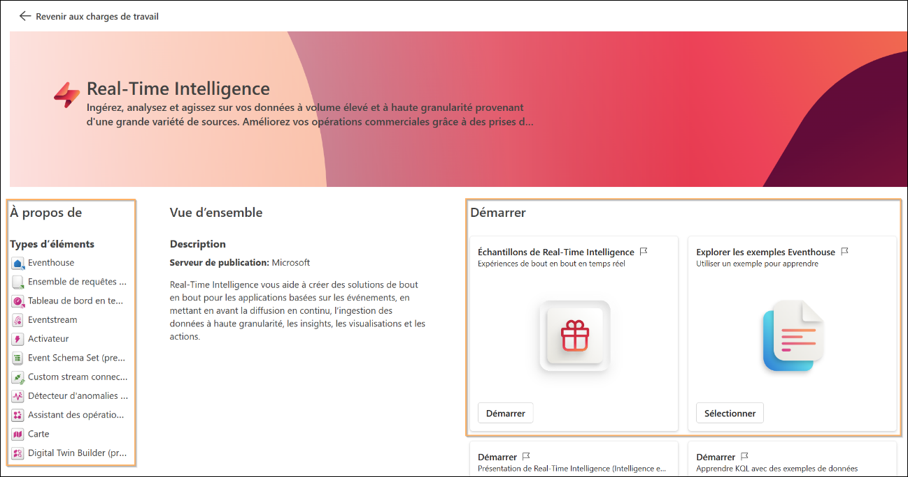

3. Cliquez sur Revenir aux charges de travail dans le coin supérieur gauche de l’écran. Vous êtes alors redirigé(e) vers la page principale des charges de travail, où vous pouvez explorer d’autres outils ou sections.

    

### Tâche 7 : expérience Data Engineering

1. Sur la page **Mes charges de travail**, cliquez sur Data Engineering pour continuer.

    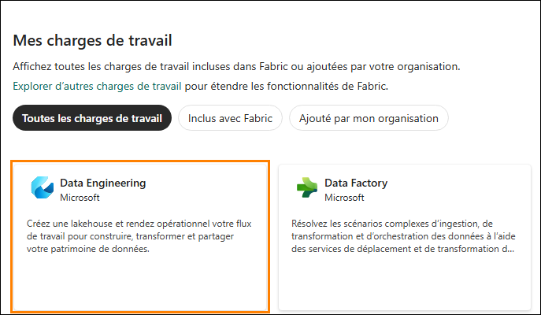

2. Vous êtes alors redirigé(e) vers la page d’accueil **Data Engineering**. Vous trouverez ci-dessous une présentation détaillée des sections qui se trouvent sur cette page, lesquelles vous aideront à utiliser **Data Engineering** efficacement et pas à pas.

    **En quoi consiste Data Engineering ?**

    Data Engineering est un outil qui vous aide à concevoir, créer et gérer des infrastructures et des systèmes de collecte, de stockage, de traitement et d’analyse de vastes volumes de données. Il vous permet de créer des lakehouses et de rendre opérationnel votre flux de travail pour créer, transformer et partager votre parc de données.

    **Types d’éléments :**

1. **Lakehouse**** :** permet de stocker le Big Data à des fins de nettoyage, d’interrogation, de reporting et de partage.

2. **Notebook**** :** utilisé pour l’ingestion de données, la préparation, l’analyse et d’autres tâches liées aux données à l’aide de divers langages tels que Python et Scala.

3. **Environnement**** :** permet de configurer les bibliothèques partagées, les paramètres de calcul Spark et les ressources pour les notebooks et les définitions de tâche Spark.

4. **Définition de tâche Spark** **:** permet de définir, planifier et gérer des tâches Apache.

5. **Fonctions de données utilisateur :** plateforme qui vous permet d’héberger et d’exécuter des applications dans Fabric.

6. **API pour GraphQL** **:** API permettant d’interroger plusieurs sources de données.

7. **Base de données Snowflake :** permet aux utilisateurs de dupliquer la base de données Snowflake dans Fabric.

    **Démarrer :**

    Pour commencer à utiliser Data Engineering, procédez comme suit :

1. **Explorer un exemple** **:** cliquez sur le bouton « Sélectionner » pour utiliser un exemple et découvrir Data Engineering.

2. **Qu'est-ce qu'un lakehouse ? :** cliquez sur le bouton « Ouvrir » pour découvrir les lakehouses et leur utilisation.

3. **Obtenir l'expérience de données dans le lakehouse** **:** cliquez sur le bouton « Ouvrir » pour commencer à utiliser l’engineering données avec les lakehouses.

4. **Démarrage avec les définitions de tâche Spark :** cliquez sur le bouton « Ouvrir » pour découvrir comment utiliser les définitions de tâche Spark à des fins de traitement des données.

5. **Développer et exécuter des notebooks** **:** cliquez sur le bouton « Ouvrir » pour découvrir comment développer et exécuter des notebooks à des fins d’analyse des données.

6. **Utilisation de NotebookUtils** **:** cliquez sur le bouton « Ouvrir » pour découvrir comment utiliser NotebookUtils à des fins d’analyse optimale des données.

7. **Tirer parti des notebooks pour votre lakehouse** **:** cliquez sur le bouton « Ouvrir » pour découvrir comment tirer parti des notebooks pour votre lakehouse.

8. **Tirer parti des jeux de données pour votre lakehouse :** cliquez sur le bouton « Ouvrir » pour tirer parti des jeux de données pour votre lakehouse.

9. **Créer vos premières fonctions de données utilisateur** **:** cliquez sur le bouton « Ouvrir » pour découvrir comment créer des fonctions de données utilisateur.

10. **Créer votre première API pour GraphQL** **:** cliquez sur le bouton « Ouvrir » pour découvrir comment créer une API pour GraphQL.

    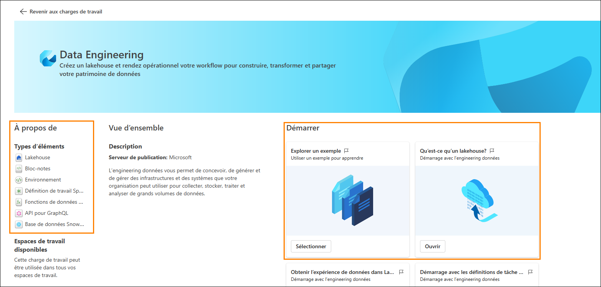

3. Cliquez sur **Revenir aux charges de travail** dans le coin supérieur gauche de l’écran. Vous êtes alors redirigé(e) vers la page principale des charges de travail, où vous pouvez explorer d’autres outils ou sections.

    

### Tâches 8 : expérience Data Science

1. Sur la page **Mes charges de travail**, cliquez sur **Data Science** pour continuer.

    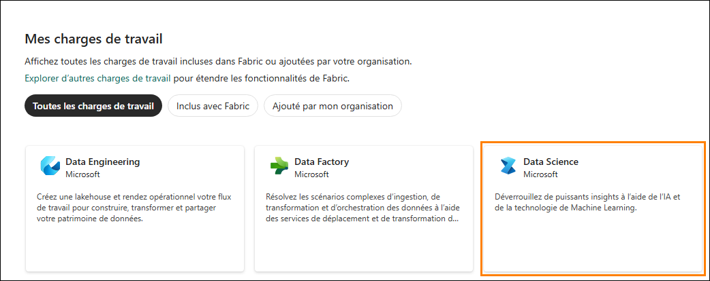

2. Vous êtes alors redirigé(e) vers la page d’accueil **Data Science**. Vous trouverez ci-dessous une présentation détaillée des sections qui se trouvent sur cette page, lesquelles vous aideront à utiliser **Data Science** efficacement.

    **En quoi consiste Data Science ?**

    Data Science est un outil qui vous permet de bénéficier de puissants insights à l’aide de technologies d’IA et de Machine Learning. Il fournit des outils d’IA conçus pour vous aider à réaliser des flux de travail de science des données à grande échelle et exploiter l’IA pour enrichir les données et bénéficier d’insights métier.

    **Types d’éléments :**

    a. **Modèle ML** **:** permet de créer des modèles Machine Learning.

    b. **Expérience**** :** permet de créer, d’exécuter et de suivre le développement de plusieurs modèles.

    c. **Notebook**** :** permet d’explorer des données et de créer des solutions de Machine Learning.

    d. **Environnement**** :** permet de configurer les bibliothèques partagées, les paramètres de calcul Spark et les ressources pour les notebooks et les définitions de tâche Spark.

    e. **Assistant Données :** permet de créer des expériences d’IA conversationnelle qui répondent aux questions sur les données stockées dans les lakehouses, les entrepôts, les modèles sémantiques Power BI et les bases de données KQL

    f. **Notebook Python** **:** permet d’importer des notebooks Python à partir d’une machine locale.

    **Démarrer :**

    Pour commencer à utiliser Data Science, procédez comme suit :

    a. **Explorer un exemple** **:** cliquez sur le bouton « Sélectionner » pour utiliser un exemple et découvrir Data Science.

    b. **Démarrage avec des modèles ML** **:** cliquez sur le bouton « Ouvrir » pour découvrir comment prendre en main les modèles Machine Learning.

    c. **Démarrage avec des expériences ML** **:** cliquez sur le bouton « Ouvrir » pour découvrir comment mener à bien des expériences Machine Learning.

    d. **Démarrer avec les notebooks :** cliquez sur « Ouvrir » pour apprendre à démarrer avec les modèles notebooks.

    e. **Développer et exécuter des notebooks :** cliquez sur le bouton « Ouvrir » pour découvrir comment développer et exécuter des notebooks à des fins d’analyse des données.

    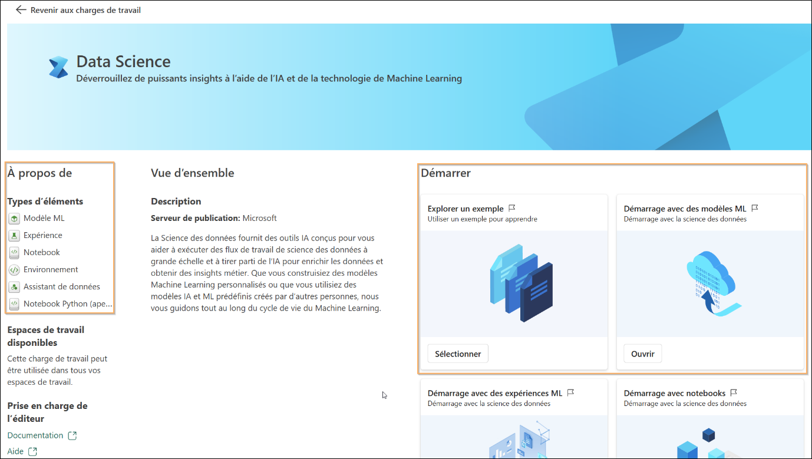

3. Cliquez sur **Revenir aux charges de travail** dans le coin supérieur gauche de l’écran. Vous êtes alors redirigé(e) vers la page principale des charges de travail, où vous pouvez explorer d’autres outils ou sections.

    

### Tâches 9 : expérience Data Warehouse

1. Sur la page **Mes charges de travail**, cliquez sur **Data Warehouse** pour continuer.

    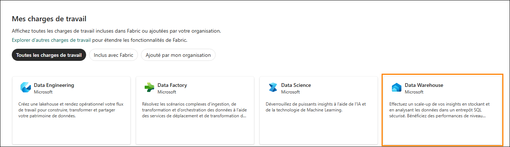

2. Vous êtes alors redirigé(e) vers la page d’accueil Data Warehouse. Vous trouverez ci-dessous une présentation détaillée des sections qui se trouvent sur cette page, lesquelles vous aideront à utiliser Data Warehouse efficacement et pas à pas.

    **En quoi consiste Data Warehouse ?**

    Data Warehouse est un outil qui vous permet de stocker et d’analyser des données dans un entrepôt SQL sécurisé. Il vous permet d’effectuer un scale-up de vos informations stratégiques en bénéficiant de performances de premier plan à l’échelle du pétaoctet dans un format de données ouvertes.

    **Types d’éléments :**

1. **Entrepôt**** :** permet de créer un entrepôt de données.

2. **Exemple d’entrepôt** **:** permet d’explorer et de tester les fonctionnalités d’entreposage de données à l’aide de jeux de données et de modèles préconfigurés.

3. **Notebook**** :** permet de créer et partager des tâches interactives d’analyse et de visualisation des données.

4. **Azure SQL Database en miroir** **:** permet de mettre en miroir Azure SQL Database.

5. **Catalogue Azure Databricks en miroir** **:** permet de mettre en miroir des données d’Azure Databricks pour une intégration et une analyse améliorées.

6. **Snowflake en miroir** **:** permet de mettre en miroir la base de données Snowflake.

7. **Mise en miroir Oracle :** permet la mise en miroir d’Oracle.

8. **Mise en miroir de Google Big Query (version préliminaire) :** permet la mise en miroir de Google Big Query.

9. **Liste SharePoint Online mise en miroir (version préliminaire) :** réplique les données de liste SharePoint en quasi-temps réel dans Microsoft Fabric OneLake en tant que source prête pour l’analytique et accessible en lecture seule. Elle élimine le processus ETL et expose les données par l’intermédiaire d’un point de terminaison d’analytique SQL créé automatiquement pour Power BI et les autres charges de travail Fabric.

10. **Mise en miroir Azure Cosmos DB :** permet la mise en miroir d’Azure Cosmos DB.

11. **Mise en miroir SQL Server :** permet la mise en miroir de SQL Server.

12. **Azure Database pour PostgreSQL en miroir :** utilisé pour mettre en miroir votre base de données Azure Database pour PostgreSQL existante

13. **Azure Database pour MySQL mis en miroir (version préliminaire) :** réplique les données MySQL dans Microsoft Fabric OneLake en tant que source accessible en lecture seule et prête pour l’analytique, permettant une analyse presque en temps réel sans ETL

14. **Azure SQL Managed Instance en miroir :** permet de mettre en miroir les bases de données gérées par Azure SQL à des fins de haute disponibilité et de récupération d’urgence.

15. **Base de données en miroir :** permet de répliquer des bases de données à des fins de haute disponibilité et de récupération d’urgence.

16. **Catalogue Dremio mis en miroir (version préliminaire) :** met en miroir les métadonnées du catalogue Dremio dans Microsoft Fabric (aucune donnée n’est copiée), en créant des raccourcis permettant aux charges de travail Fabric d’interroger les données gérées par Dremio au moyen d’un point de terminaison d’analytique SQL accessible en lecture seule.

    **Démarrer :**

    Pour commencer à utiliser Data Warehouse, procédez comme suit :

1. **Explorer un exemple d’entrepôt** **:** démarrez un nouvel entrepôt avec des exemples de données déjà chargés.

2. **Démarrer avec l'entrepôt** **:** cliquez sur le bouton « Ouvrir » pour découvrir comment analyser des données à l’aide d’un entrepôt.

    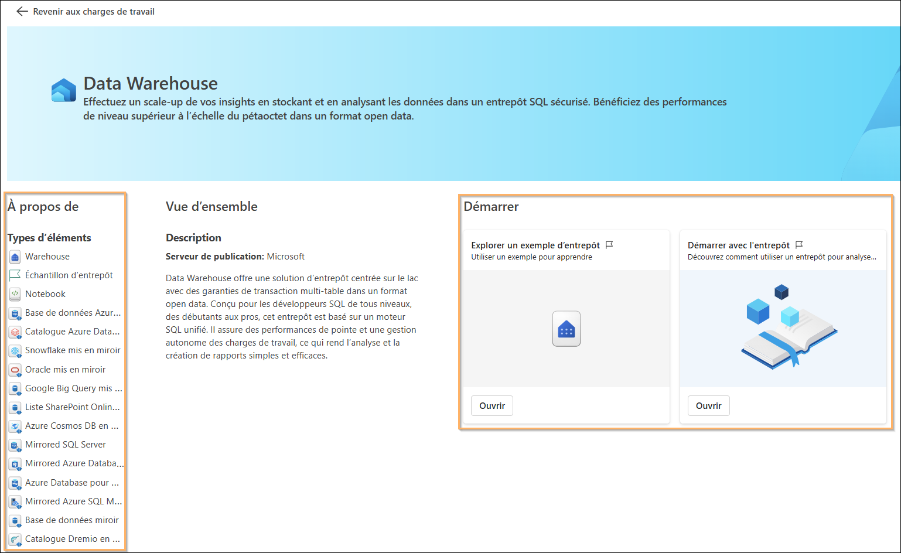

### Tâche 10 : expérience Databases

1. Sur la page **Mes charges de travail**, cliquez sur **Databases** pour continuer.

    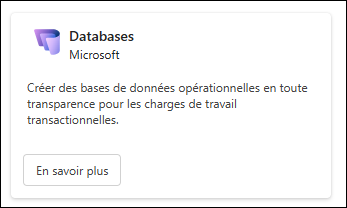

2. Vous êtes alors redirigé(e) vers la page d’accueil Databases. Vous trouverez ci-dessous une présentation détaillée des sections qui se trouvent sur cette page, lesquelles vous aideront à utiliser efficacement Databases.

    **En quoi consiste une base de données Fabric ?**

    Une base de données SQL dans Microsoft Fabric est une base de données transactionnelle conviviale pour les développeurs, basée sur Azure SQL Database, qui vous permet de créer facilement votre base de données opérationnelle dans Fabric. Une base de données SQL dans Fabric utilise le même moteur de base de données SQL qu’Azure SQL Database.

    **Types d’éléments :**

1. **SQL Database :** SQL Database dans Fabric fait partie de la charge de travail de base de données et les données sont accessibles à partir d’autres éléments de Fabric. Les données de votre base de données SQL sont également tenues à jour dans un format interrogeable dans OneLake, afin que vous puissiez utiliser tous les différents services de Fabric, comme l’exécution d’analyses avec Spark, l’exécution de notebooks, l’engineering données, la visualisation au moyen d’états Power BI, etc.

2. **Cosmos DB :** Cosmos DB dans Microsoft Fabric est une base de données NoSQL optimisée pour l’IA, offrant une expérience de gestion simplifiée. En tant que développeur, vous pouvez utiliser Cosmos DB dans Fabric pour créer des applications d’IA plus facilement, sans avoir à gérer les tâches habituelles d’administration de base de données.

    **Démarrer :**

    Pour commencer à utiliser Databases, procédez comme suit :

1. **Explorer**** :** cliquez sur « Ouvrir » pour explorer un exemple de base de données.

2. **Concepts de base de données** **:** explique les termes et concepts courants autour de la base de données transactionnelle afin que vous puissiez vous familiariser avec l’utilisation de SQL Database.

3. **Modèles de base de données** **:** parcourez une bibliothèque de modèles pré-créés de conceptions de bases de données courantes.

    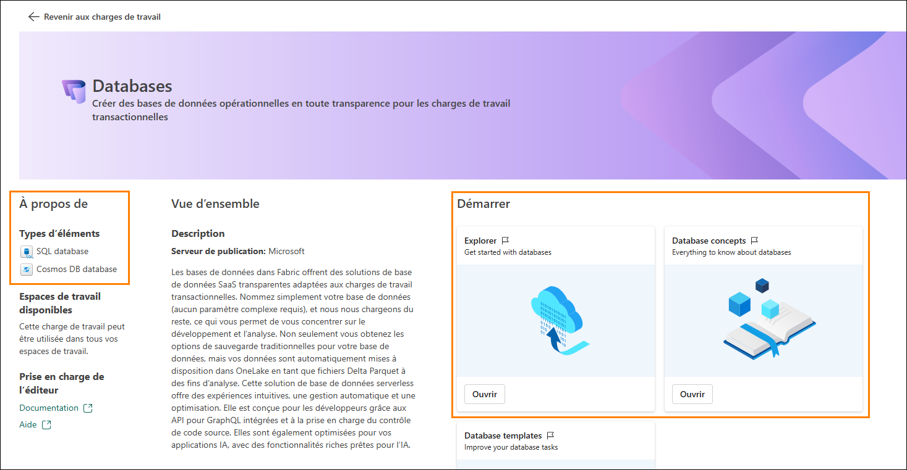

3. Cliquez sur Revenir aux charges de travail dans le coin supérieur gauche de l’écran. Vous êtes alors redirigé(e) vers la page principale des charges de travail, où vous pouvez explorer d’autres outils ou sections.

    

    Dans ce labo, nous avons exploré l’interface Fabric et créé un espace de travail Fabric et un lakehouse. Dans le prochain labo, nous allons découvrir comment les raccourcis dans Lakehouse permettent de se connecter aux données ADLS Gen2 et comment transformer ces données à l’aide de vues.

# Références

Fabric Analyst in a Day (FAIAD) vous présente certaines des fonctions clés de Microsoft Fabric. Dans le menu du service, la section Aide (?) comporte des liens vers d’excellentes ressources.

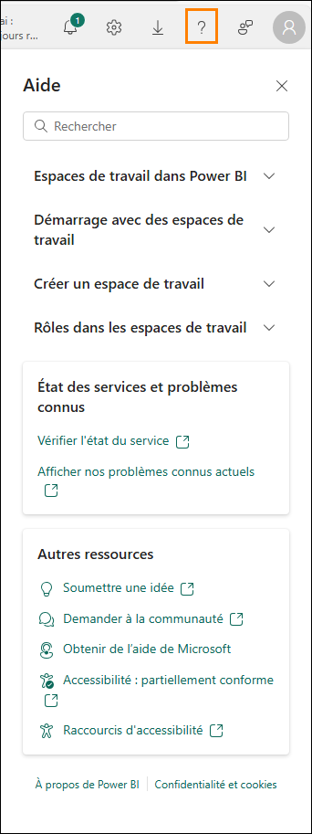

Voici quelques autres ressources qui vous aideront lors de vos prochaines étapes avec Microsoft Fabric :

- Consultez le billet de blog pour lire l’intégralité de l’annonce de la GA de Microsoft Fabric.

- Explorez Fabric grâce à la [visite guidée](https://aka.ms/Fabric-GuidedTour).

- Inscrivez-vous pour bénéficier d’un [essai gratuit de Microsoft Fabric](https://aka.ms/try-fabric).

- Rendez-vous sur le [site web Microsoft Fabric](https://aka.ms/microsoft-fabric).

- Acquérez de nouvelles compétences en explorant les [modules d’apprentissage Fabric](https://aka.ms/learn-fabric).

- Explorez la [documentation technique Fabric](https://aka.ms/fabric-docs).

- Lisez le [livre électronique gratuit sur la prise en main de Fabric](https://aka.ms/fabric-get-started-ebook).

- Rejoignez la [communauté Fabric](https://aka.ms/fabric-community) pour publier vos questions, partager vos commentaires et apprendre des autres.

Lisez les blogs d’annonces plus détaillés sur l’expérience Fabric :

- [Blog Expérience Data Factory dans Fabric](https://aka.ms/Fabric-Data-Factory-Blog)

- [Blog Expérience Synapse Data Engineering dans Fabric](https://aka.ms/Fabric-DE-Blog)

- [Blog Expérience Synapse Data Science dans Fabric](https://aka.ms/Fabric-DS-Blog)

- [Blog Expérience Synapse Data Warehousing dans Fabric](https://aka.ms/Fabric-DW-Blog)

- [Blog Expérience Synapse Real-Time Analytics dans Fabric](https://aka.ms/Fabric-RTA-Blog)

- [Blog Annonce Power BI](https://aka.ms/Fabric-PBI-Blog)

- [Blog Expérience Data Activator dans Fabric](https://aka.ms/Fabric-DA-Blog)

- [Blog Administration et gouvernance dans Fabric](https://aka.ms/Fabric-Admin-Gov-Blog)

- [Blog OneLake dans Fabric](https://aka.ms/Fabric-OneLake-Blog)

- [Blog Intégration de Dataverse et Microsoft Fabric](https://aka.ms/Dataverse-Fabric-Blog)

© 2023 Microsoft Corporation. Tous droits réservés.

En effectuant cette démonstration/ce labo, vous acceptez les conditions suivantes :

La technologie/fonctionnalité décrite dans cette démonstration/ce labo est fournie par Microsoft Corporation en vue d’obtenir vos commentaires et de vous fournir une expérience d’apprentissage. Vous pouvez utiliser cette démonstration/ce labo uniquement pour évaluer ces technologies et fonctionnalités, et pour fournir des commentaires à Microsoft. Vous ne pouvez pas l’utiliser à d’autres fins. Vous ne pouvez pas modifier, copier, distribuer, transmettre, afficher, effectuer, reproduire, publier, accorder une licence, créer des œuvres dérivées, transférer ou vendre tout ou une partie de cette démonstration/ce labo.

LA COPIE OU LA REPRODUCTION DE CETTE DÉMONSTRATION/CE LABO (OU DE TOUTE PARTIE DE CEUX-CI) SUR TOUT AUTRE SERVEUR OU AUTRE EMPLACEMENT EN VUE D’UNE AUTRE REPRODUCTION OU REDISTRIBUTION EST EXPRESSÉMENT INTERDITE.

CETTE DÉMONSTRATION/CE LABO FOURNISSENT CERTAINES FONCTIONNALITÉS DE PRODUIT/TECHNOLOGIES LOGICIELLES, NOTAMMENT D’ÉVENTUELS NOUVEAUX CONCEPTS ET FONCTIONNALITÉS, DANS UN ENVIRONNEMENT SIMULÉ SANS INSTALLATION OU CONFIGURATION COMPLEXE AUX FINS DÉCRITES CI-DESSUS. LES TECHNOLOGIES/CONCEPTS REPRÉSENTÉS DANS CETTE DÉMONSTRATION/CE LABO PEUVENT NE PAS REPRÉSENTER LES FONCTIONNALITÉS COMPLÈTES ET PEUVENT NE PAS FONCTIONNER DE LA MÊME MANIÈRE QUE DANS UNE VERSION FINALE. IL EST ÉGALEMENT POSSIBLE QUE NOUS NE PUBLIIONS PAS DE VERSION FINALE DE CES FONCTIONNALITÉS OU CONCEPTS. VOTRE EXPÉRIENCE D’UTILISATION DE CES FONCTIONNALITÉS DANS UN ENVIRONNEMENT PHYSIQUE PEUT ÉGALEMENT ÊTRE DIFFÉRENTE.

**COMMENTAIRES.** Si vous envoyez des commentaires sur les fonctionnalités, technologies et/ou concepts décrits dans cette démonstration/ce labo à Microsoft, vous accordez à Microsoft, sans frais, le droit d’utiliser, de partager et de commercialiser vos commentaires de quelque manière et à quelque fin que ce soit. Vous accordez également à des tiers, sans frais, les droits de brevet nécessaires pour leurs produits, technologies et services en vue de l’utilisation ou de l’interface avec des parties spécifiques d’un logiciel ou d’un service Microsoft incluant les commentaires. Vous n’enverrez pas de commentaires soumis à une licence exigeant que Microsoft accorde une licence pour son logiciel ou sa documentation à des tiers du fait que nous y incluons vos commentaires. Ces droits survivent à ce contrat.

MICROSOFT CORPORATION DÉCLINE TOUTES LES GARANTIES ET CONDITIONS EN CE QUI CONCERNE CETTE DÉMONSTRATION/CE LABO, Y COMPRIS TOUTES LES GARANTIES ET CONDITIONS DE QUALITÉ MARCHANDE, QU’ELLES SOIENT EXPLICITES, IMPLICITES OU LÉGALES, D’ADÉQUATION À UN USAGE PARTICULIER, DE TITRE ET D’ABSENCE DE CONTREFAÇON. MICROSOFT N’OFFRE AUCUNE GARANTIE OU REPRÉSENTATION EN CE QUI CONCERNE LA PRÉCISION DES RÉSULTATS, LA CONSÉQUENCE QUI DÉCOULE DE L’UTILISATION DE CETTE DÉMONSTRATION/CE LABO, OU L’ADÉQUATION DES INFORMATIONS CONTENUES DANS CETTE DÉMONSTRATION/CE LABO À QUELQUE FIN QUE CE SOIT.

**CLAUSE D’EXCLUSION DE RESPONSABILITÉ**

Cette démonstration/Ce labo comporte seulement une partie des nouvelles fonctionnalités et améliorations disponibles dans Microsoft Power BI. Certaines fonctionnalités sont susceptibles de changer dans les versions ultérieures du produit. Dans ce labo/cette démonstration, vous allez découvrir comment utiliser certaines nouvelles fonctionnalités, mais pas toutes.
