# Microsoft Fabric - Fabric Analyst in a Day - Labo 3

## Sommaire

- Introduction
- Raccourci vers ADLS Gen2
  - Tâche 1 : créer un raccourci
- Transformer des données à l’aide d’une requête visuelle
  - Tâche 2 : créer une vue Geo à l’aide d’une requête visuelle
  - Tâche 3 : Créer les vues Reseller, Sales et Product à l’aide d’une requête SQL
- Références


# Introduction

Dans notre scénario, les données Sales proviennent du système ERP et sont stockées dans une base de données ADLS Gen2. Elles sont mises à jour au quotidien à midi. Nous devons transformer et ingérer ces données dans le lakehouse et les utiliser dans notre modèle.

Plusieurs moyens permettent d’ingérer ces données.

- **Raccourcis :** ce moyen nous permet de créer un lien avec les données et nous pouvons les transformer à l’aide de vues Requête visuelle. Nous allons utiliser des raccourcis dans ce labo.

- **Notebooks :** ce moyen nous oblige à écrire du code. Il s’agit d’une approche conviviale pour les développeurs.

- **Dataflow Gen2 :** vous connaissez probablement Power Query ou Dataflow Gen1. Dataflow Gen2, comme son nom l’indique, est la version la plus récente de Dataflow. Elle offre toutes les fonctionnalités de Power Query/Dataflow Gen1 avec la possibilité supplémentaire de transformer et d’ingérer des données dans plusieurs sources de données. Nous allons aborder cela dans les prochains labos.

- **Pipeline :** il s’agit d’un outil d’orchestration. Les activités peuvent être orchestrées pour extraire, transformer et ingérer des données. Un pipeline va nous permettre d’exécuter l’activité Dataflow Gen2 qui à son tour effectue l’extraction, la transformation et l’ingestion.

Nous allons commencer par créer un raccourci pour ingérer des données dans un lakehouse à partir de la source de données ADLS Gen2. Une fois les données ingérées, nous allons les transformer à l’aide de vues Requête visuelle.

À la fin de ce labo, vous saurez :

- Comment créer des raccourcis vers votre lakehouse

- Comment transformer des données à l’aide d’une fonctionnalité Requête visuelle

# Raccourci vers ADLS Gen2

### Tâche 1 : créer un raccourci

Des raccourcis permettent de créer un lien vers l’emplacement cible. Les raccourcis permettent d’accéder aux données sans avoir besoin de les déplacer physiquement dans le lakehouse. Cela s’apparente à la création de raccourcis sur le bureau Windows.

1. En haut de votre écran, sélectionnez l’onglet **lh_FAIAD** pour accéder au lakehouse.

    1. Si vous n’avez pas d’onglet ouvert, vous pouvez revenir à votre espace de travail et ouvrir le lakehouse à partir de là.

2. Dans le volet **Explorateur**, cliquez sur les **points de suspension** en regard de **Tables**.

3. Cliquez sur **Nouveau raccourci**.

    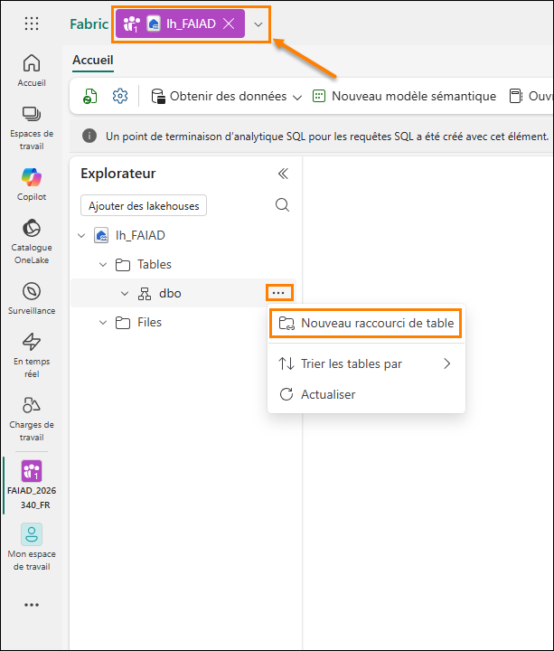

4. La boîte de dialogue **Nouveau raccourci** s’ouvre alors. Sous **Sources externes**, sélectionnez **Azure Data Lake Storage Gen2**.

    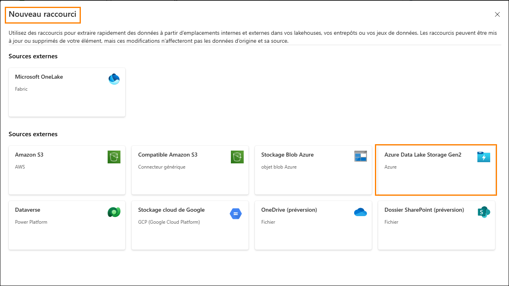

5. Cliquez sur **Nouvelle connexion (1)**.

6. Entrez le lien suivant pour la propriété **URL** :
    <https://stvnextblobstorage.dfs.core.windows.net/fabrikam-sales> **(2) :**

7. Cliquez sur **Créer une connexion** (3) dans la section Connexion

8. Sélectionnez **Signature d’accès partagé (SAS) (4)** dans la liste déroulante Type d’authentification.

9. Copiez le jeton SAS et collez-le dans le champ Jeton SAS (5).

    - **Jeton SAS :**

10. Cliquez sur **Suivant (6)** en bas de l’écran à droite.

    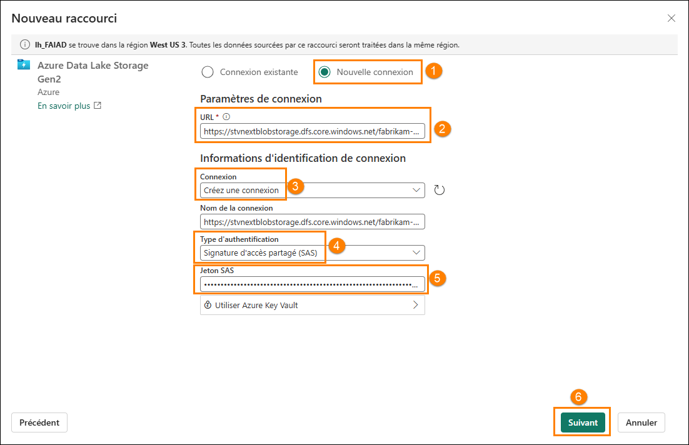

11. connecté(e) à ADLS Gen2 avec la structure de répertoires s’affichant dans le volet gauche. Développez **Delta-Parquet-Format-FY25 (1)**.

12. **Sélectionnez** les répertoires suivants **(2),** puis cliquez sur **Suivant (3) :**

    1. Application.Cities

    2. Application.Countries

    3. Application.StateProvinces

    4. DateDim

    5. Sales.BuyingGroups

    6. Sales.Customers

    7. Sales.InvoiceLines

    8. Sales.Invoices

    9. Warehouse.StockGroups

    10. Warehouse.StockItemStockGroups

    11. Warehouse.StockItems

    **Remarque :** Sales.Invoice_May est le seul répertoire **non** sélectionné.

    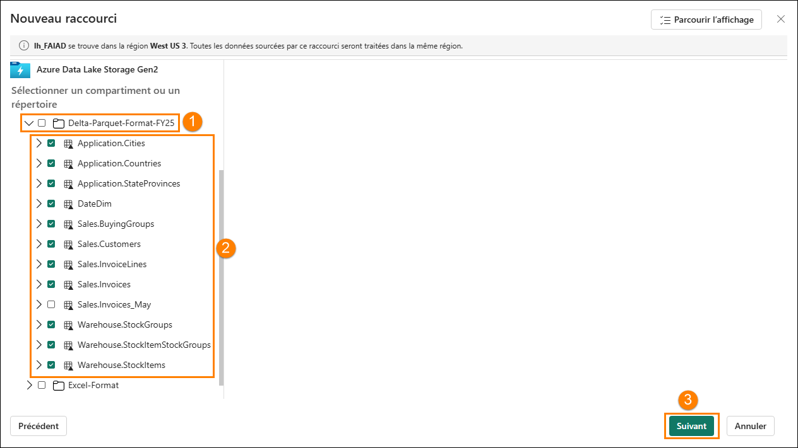

13. Vous êtes alors redirigé(e) vers la boîte de dialogue suivante dans laquelle nous pouvons modifier les noms. Cliquez sur l’**icône Modifier (1)** sous Actions pour **Application.Cities**.

14. Redéfinissez le nom du répertoire **Application.Cities sur Cities (2)**.

15. Cliquez sur la coche en regard du nom pour enregistrer la modification **(3)**.

    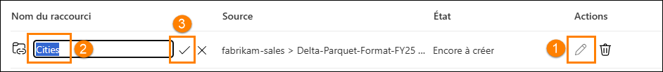

16. De même, redéfinissez le nom des raccourcis comme ci-dessous :

    1. Application.Countries sur **Countries**

    2. Application.StateProvinces sur **States**

    3. DateDim sur **Date**

    4. Sales.BuyingGroups sur **BuyingGroups**

    5. Sales.Customers sur **Customers**

    6. Sales.InvoiceLines sur **InvoiceLineItems**

    7. Sales.Invoices sur **Invoices**

    8. Warehouse.StockGroups sur **ProductGroups**

    9. Warehouse.StockItemStockGroups sur **ProductItemGroup**

    10. Warehouse.StockItems sur **ProductItem**

    **Remarque :** vérifiez les noms. Une faute de frappe peut provoquer des erreurs lors du labo.

17. Cliquez sur **Créer** pour créer le raccourci.

    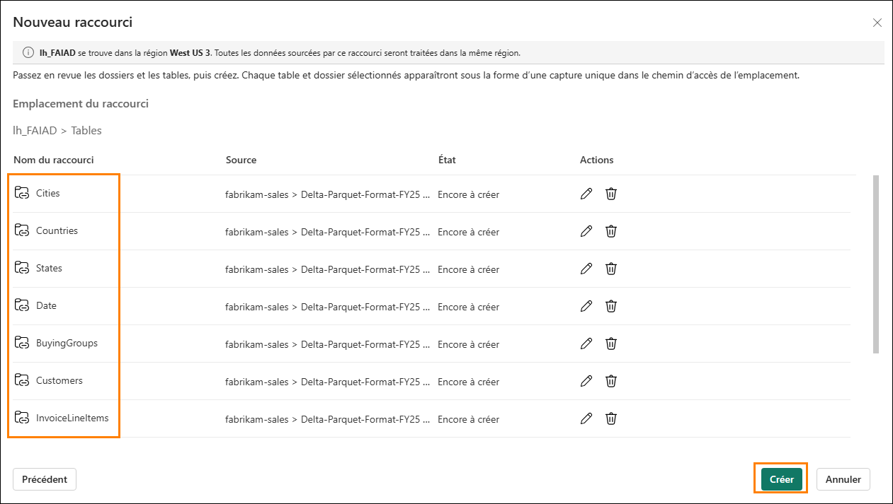

18. Notez que tous les raccourcis sont créés sous forme de tables. Sélectionnez la table **BuyingGroups** et notez que nous pouvons voir une version préliminaire des données dans le volet de données.

    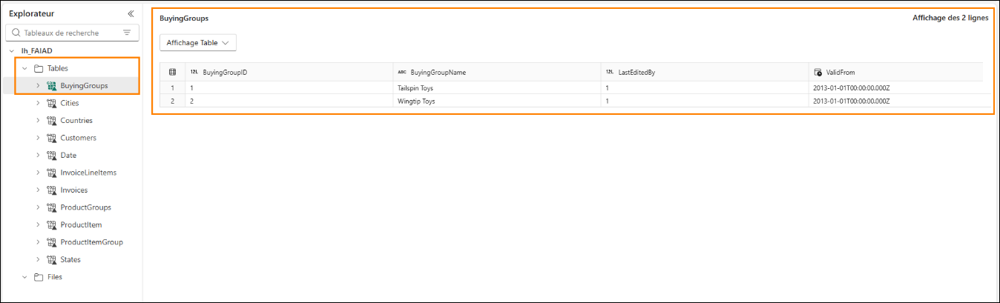

    L’étape suivante consiste à transformer les données afin de pouvoir créer un modèle sémantique. Nous allons créer des vues pour transformer les données.

# Transformer des données à l’aide d’une requête visuelle

### Tâche 2 : créer une vue Geo à l’aide d’une requête visuelle

1. Nous pouvons accéder au **lakehouse** à l’aide d’un point de terminaison SQL. Ainsi, nous pouvons interroger les données et créer des vues. En **haut à droite** de l'écran, cliquez sur **Lakehouse (1) -> Point de terminaison Analytique SQL (2)**.

    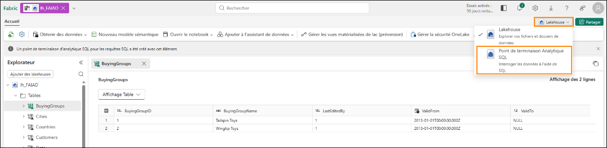

    Vous êtes alors redirigé(e) vers le point de terminaison analytique SQL. Vous avez désormais un nouvel élément dans votre barre de navigation supérieure et pouvez revenir au lakehouse en sélectionnant cet onglet. Notez que le volet Explorateur a changé. Vous pouvez désormais créer des vues, des procédures stockées, des requêtes et bien plus encore. Nous allons créer une requête visuelle, car elle fournit du low code, comme interface Power Query. Nous allons enregistrer le résultat en tant que vue.

    Nous allons commencer par créer une vue Geo. Nous devons fusionner les données des requêtes Cities, States et Countries pour créer la vue Geo.

2. Dans le menu supérieur, cliquez sur le menu déroulant en regard de **Nouvelle requête SQL (1)**, puis sélectionnez **Nouvelle requête visuelle (2)**.

    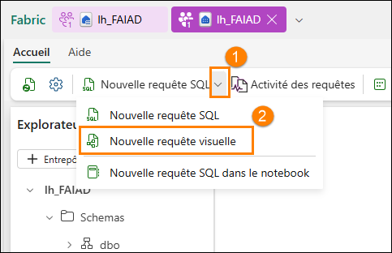

3. Pour construire une requête, nous devons ajouter des tables au volet Visual Query. Cliquez sur les points de suspension à côté de la table **Cities (1)** et sélectionnez **Insérer dans canevas (2)**.

    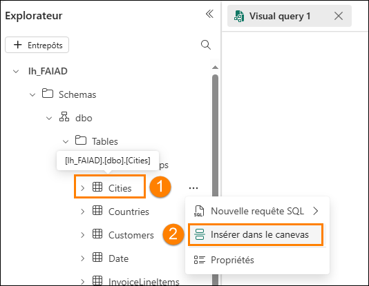

4. Procédez de la même manière pour les tables **States** et **Countries**.

    Nous devons ensuite fusionner ces requêtes. L’éditeur de requête visuelle permet d’utiliser l’éditeur Power Query. Utilisons cette option, puisque nous la connaissons déjà grâce à Power BI.

5. **Dans le menu de l’éditeur de requête visuelle**, cliquez sur l’icône **Ouvrir dans une fenêtre contextuelle** (vers la droite). Vous êtes alors redirigé(e) vers l’éditeur Power Query.

    ***Remarque :** vous devrez peut-être faire défiler vers la droite ou rouvrir votre onglet de requête visuelle si vous ne voyez pas immédiatement cette icône*

    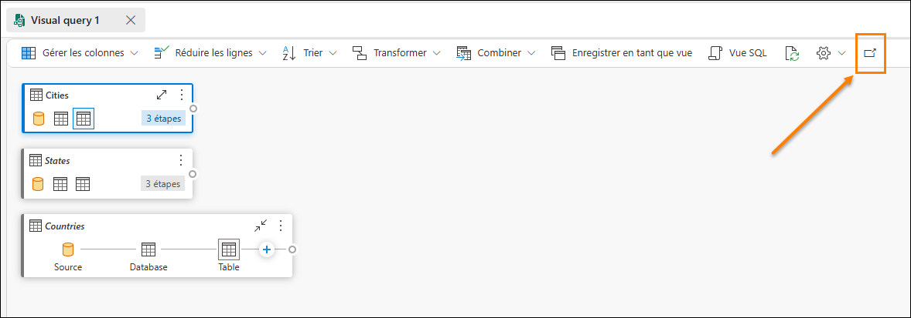

6. Avec la requête **Cities (1)** sélectionnée, cliquez sur **Accueil (2) -> Combiner (3) -> Menu déroulant Fusionner les requêtes (4) -> Fusionner les requêtes comme nouvelles (5)** dans le ruban de l’éditeur Power Query. La boîte de dialogue Fusionner des requêtes s’ouvre alors.

    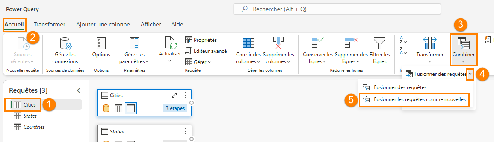

7. Dans le champ **Table de gauche pour la fusion**, sélectionnez **Cities**.

8. Dans le champ **Table de droite pour la fusion**, sélectionnez **States**.

9. Sélectionnez la colonne **StateProvinceID** dans les deux tables. Nous allons les joindre à l’aide de cette colonne.

10. Sélectionnez **Interne** comme **Type de jointure**.

11. Cliquez sur **OK**.

    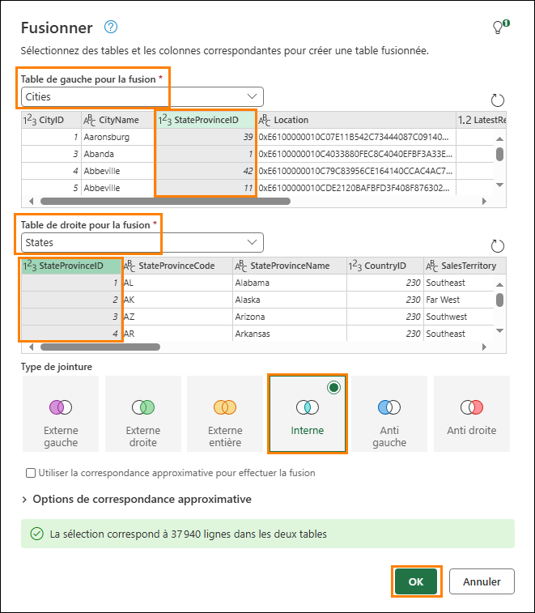

    Notez qu’une requête nommée **Merge** a été créée. Nous avons besoin de quelques colonnes de la table States.

12. Dans la **vue Données** (volet inférieur), cliquez sur la **double flèche** en regard de la colonne **States** (dernière colonne à droite).

13. Un volet s’ouvre alors. Assurez-vous que seules les colonnes suivantes sont sélectionnées :

    1. StateProvinceCode

    2. StateProvinceName

    3. CountryID

    4. SalesTerritory

14. Cliquez sur **OK**.

    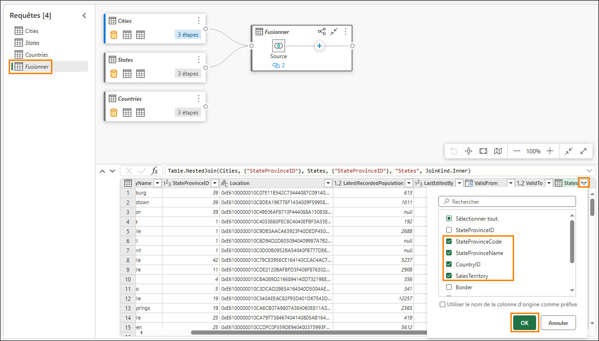

    Nous devons maintenant fusionner la requête Countries.

15. Avec la requête Merge sélectionnée **(1)**, cliquez sur **Accueil (2) -> Combiner (3) -> Menu déroulant Fusionner les requêtes (4) -> Fusionner les requêtes (5)**.

    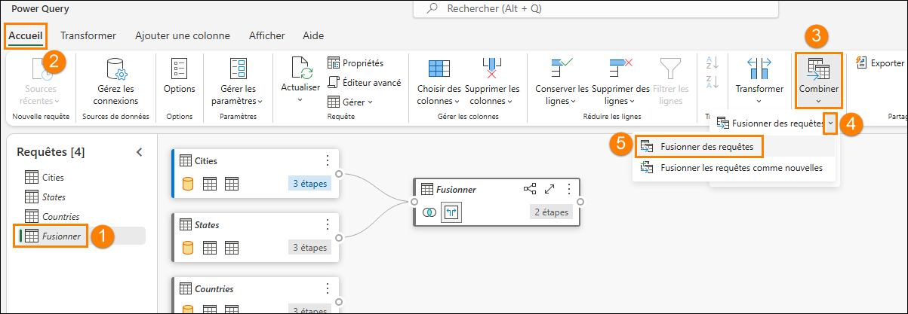

16. La boîte de dialogue Fusionner des requêtes s’ouvre alors. Dans le champ **Table de droite pour la fusion**, sélectionnez **Countries**.

17. Sélectionnez la colonne **CountryID** dans les deux tables. Nous allons les joindre à l’aide de cette colonne.

18. Sélectionnez **Interne** comme **Type de jointure**.

19. Cliquez sur **OK**.

    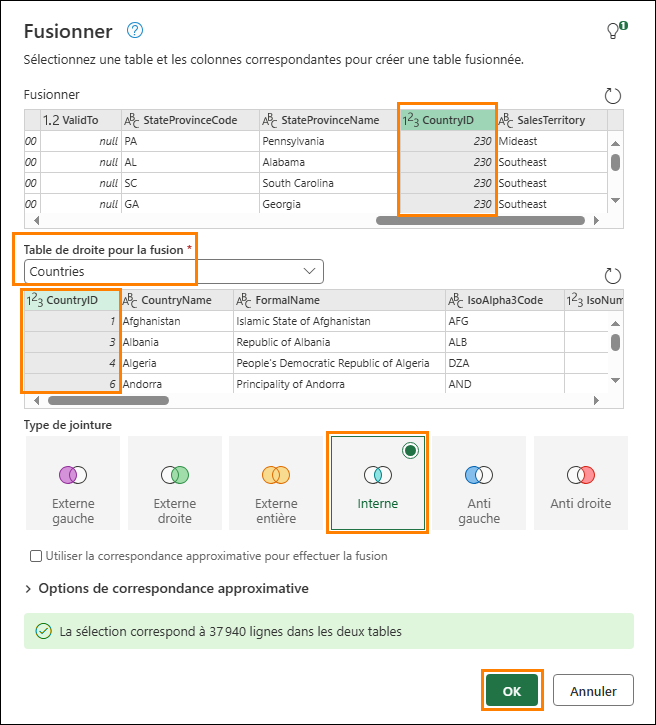

    Nous avons besoin de quelques colonnes de la table Countries.

20. Dans la **vue Données** (volet inférieur), cliquez sur la **double flèche** en regard de la colonne **Countries**.

21. Un volet s’ouvre alors. Assurez-vous que seules les colonnes suivantes sont sélectionnées :

    1. CountryName

    2. FormalName

    3. IsoAlpha3Code

    4. IsoNumericCode

    5. CountryType

    6. Continent

    7. Region

    8. Subregion

22. Cliquez sur **OK**.

    **Important :** veillez à faire défiler la page vers le bas et à sélectionner les huit colonnes listées à l’étape 21. La capture d’écran ci-dessous n’affiche que les cinq premières colonnes en raison d’une limitation de l’interface utilisateur.

    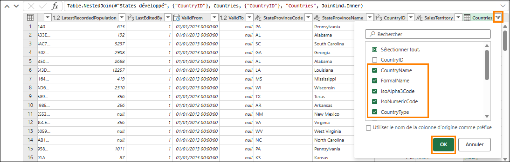

    Nous n’avons pas besoin de toutes les colonnes dans la table **Merge**. Veillez à sélectionner uniquement celles dont nous avons besoin.

23. Avec la requête **Merge** sélectionnée (1), cliquez sur **Accueil (2) - > Choisir des colonnes (3) -> Choisir des colonnes (4)** dans le ruban.

    **Remarque :** si l’option Choisir des colonnes n’est pas visible, vous pouvez la trouver sous Gérer les colonnes.

    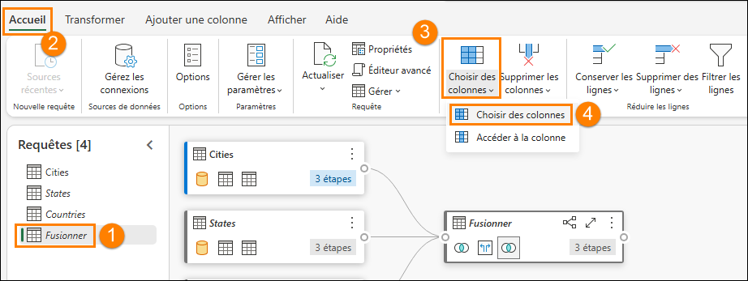

24. La boîte de dialogue Choisir des colonnes s’ouvre alors. **Décochez** les colonnes suivantes :

    1. StateProvinceID

    2. Location

    3. LastEditedBy

    4. ValidFrom

    5. ValidTo

    6. CountryID

25. Cliquez sur **OK**.

    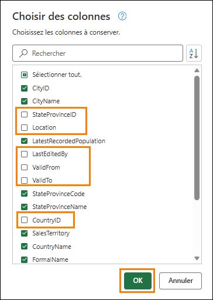

    Notez que le processus est similaire à celui de Power Query : toutes les étapes sont enregistrées à la fois dans le volet Étapes appliquées à droite et dans la vue visuelle. Renommons la requête Merge et activons le chargement, afin que les données soient chargées à partir de cette requête.

26. **Cliquez avec le bouton droit** sur la requête **Merge** dans le volet (gauche) Requêtes. Sélectionnez **Renommer** et redéfinissez le nom de la requête sur **Geo**.

27. **Cliquez avec le bouton droit** sur la requête **Geo** dans le volet (gauche) Requêtes. Sélectionnez **Activer le chargement** pour activer cette requête.

28. Assurez-vous que les requêtes Cities, States et Countries sont **désactivées**.

29. Cliquez sur **Enregistrer** en bas à droite de l’Éditeur Power Query.

    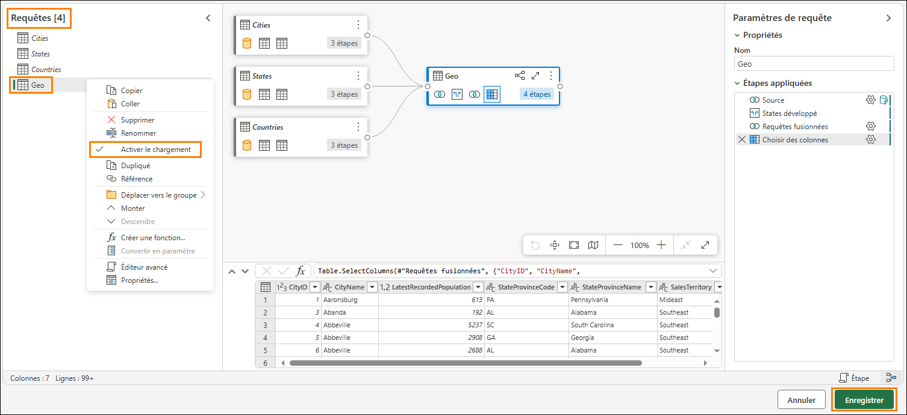

    Nous sommes alors redirigés vers l’éditeur de requête visuelle. Enregistrons maintenant cette requête en tant que vue.

    **Remarque** : toutes les étapes que nous avons effectuées à l’aide de l’éditeur Power Query peuvent également être réalisées à l’aide de l’éditeur de requête visuelle.

30. Dans le menu de l’éditeur de requête visuelle, sélectionnez **Enregistrer en tant que vue**.

    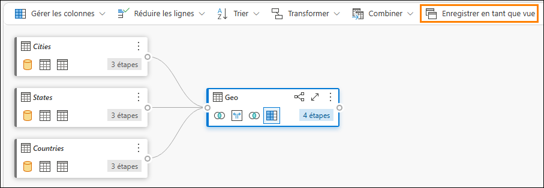

    La boîte de dialogue Enregistrer en tant que vue s’ouvre alors. Notez que la requête SQL est disponible. Vous pouvez la passer en revue si vous souhaitez vérifier le code SQL.

31. Saisissez **Geo** dans le champ **Nom de la vue**.

32. Cliquez sur **OK** pour enregistrer la vue.

    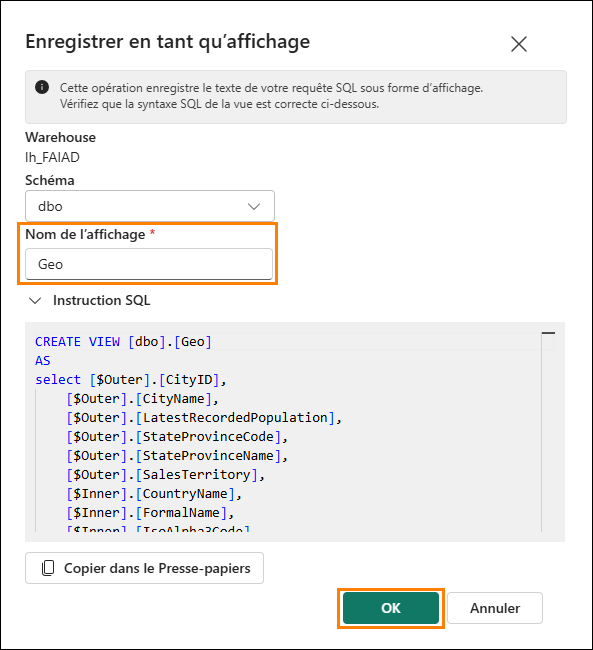

    Une alerte s’affiche une fois la vue enregistrée.

33. Dans le volet (gauche) Explorateur, développez **Views**. Nous disposons de la vue Geo venant d’être créée.

    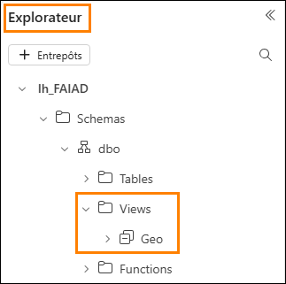

### Tâche 3 : Créer les vues Reseller, Sales et Product à l’aide d’une requête SQL

1\. Dans Fabric, nous pouvons également créer des vues à l’aide de requêtes SQL. Dans le ruban situé en haut, sélectionnez **Nouvelle requête SQL\**


2 Ici, nous pouvons écrire du TSQL afin de créer les vues dont nous avons besoin.

3 Collez la requête SQL ci-dessous dans la fenêtre Requête. Trois vues sont alors créées : Reseller, Sales et Product.

    ```sql
    CREATE VIEW dbo.Reseller AS
    select [$Outer].[ResellerID] as [ResellerID],
        [$Outer].[ResellerName] as [ResellerName],
        [$Outer].[PostalCityID] as [PostalCityID],
        [$Outer].[PhoneNumber] as [PhoneNumber],
        [$Outer].[FaxNumber] as [FaxNumber],
        [$Outer].[WebsiteURL] as [WebsiteURL],
        [$Outer].[DeliveryAddressLine1] as [DeliveryAddressLine1],
        [$Outer].[DeliveryAddressLine2] as [DeliveryAddressLine2],
        [$Outer].[DeliveryPostalCode] as [DeliveryPostalCode],
        [$Outer].[PostalAddressLine1] as [PostalAddressLine1],
        [$Outer].[PostalAddressLine2] as [PostalAddressLine2],
        [$Outer].[PostalPostalCode] as [PostalPostalCode],
        [$Inner].[BuyingGroupName] as [ResellerCompany]
    from [lh_FAIAD].[dbo].[Customers] as [$Outer]
    inner join (
        select [_].[BuyingGroupID] as [BuyingGroupID2],
            [_].[BuyingGroupName] as [BuyingGroupName],
            [_].[LastEditedBy] as [LastEditedBy2],
            [_].[ValidFrom] as [ValidFrom2],
            [_].[ValidTo] as [ValidTo2]
        from [lh_FAIAD].[dbo].[BuyingGroups] as [_]
    ) as [$Inner] on ([$Outer].[BuyingGroupID] = [$Inner].[BuyingGroupID2] or [$Outer].[BuyingGroupID] is null and [$Inner].[BuyingGroupID2] is null)
    GO

    CREATE VIEW dbo.Sales AS
    select [$Outer].[InvoiceLineID] as [InvoiceLineID],
        [$Outer].[InvoiceID] as [InvoiceID],
        [$Outer].[StockItemID] as [StockItemID],
        [$Outer].[Quantity] as [Quantity],
        [$Outer].[UnitPrice] as [UnitPrice],
        [$Outer].[TaxRate] as [TaxRate],
        [$Outer].[TaxAmount] as [TaxAmount],
        [$Outer].[LineProfit] as [LineProfit],
        [$Outer].[ExtendedPrice] as [ExtendedPrice],
        [$Outer].[CustomerID] as [ResellerID],
        [$Outer].[SalespersonPersonID] as [SalespersonPersonID],
        [$Outer].[InvoiceDate] as [InvoiceDate],
        [$Outer].[t0_0] as [Sales Amount]
    from (
        select [_].[InvoiceLineID] as [InvoiceLineID],
            [_].[InvoiceID] as [InvoiceID],
            [_].[StockItemID] as [StockItemID],
            [_].[Quantity] as [Quantity],
            [_].[UnitPrice] as [UnitPrice],
            [_].[TaxRate] as [TaxRate],
            [_].[TaxAmount] as [TaxAmount],
            [_].[LineProfit] as [LineProfit],
            [_].[ExtendedPrice] as [ExtendedPrice],
            [_].[CustomerID] as [CustomerID],
            [_].[SalespersonPersonID] as [SalespersonPersonID],
            [_].[InvoiceDate] as [InvoiceDate],
            [_].[ExtendedPrice] - [_].[TaxAmount] as [t0_0]
        from (
            select [$Outer].[InvoiceLineID],
                [$Outer].[InvoiceID],
                [$Outer].[StockItemID],
                [$Outer].[Quantity],
                [$Outer].[UnitPrice],
                [$Outer].[TaxRate],
                [$Outer].[TaxAmount],
                [$Outer].[LineProfit],
                [$Outer].[ExtendedPrice],
                [$Inner].[CustomerID],
                [$Inner].[SalespersonPersonID],
                [$Inner].[InvoiceDate]
            from [lh_FAIAD].[dbo].[InvoiceLineItems] as [$Outer]
            inner join (
                select [_].[InvoiceID] as [InvoiceID2],
                    [_].[CustomerID] as [CustomerID],
                    [_].[BillToResellerID] as [BillToResellerID],
                    [_].[OrderID] as [OrderID],
                    [_].[DeliveryMethodID] as [DeliveryMethodID],
                    [_].[ContactPersonID] as [ContactPersonID],
                    [_].[AccountsPersonID] as [AccountsPersonID],
                    [_].[SalespersonPersonID] as [SalespersonPersonID],
                    [_].[PackedByPersonID] as [PackedByPersonID],
                    [_].[InvoiceDate] as [InvoiceDate],
                    [_].[CustomerPurchaseOrderNumber] as [CustomerPurchaseOrderNumber],
                    [_].[IsCreditNote] as [IsCreditNote],
                    [_].[CreditNoteReason] as [CreditNoteReason],
                    [_].[Comments] as [Comments],
                    [_].[DeliveryInstructions] as [DeliveryInstructions],
                    [_].[InternalComments] as [InternalComments],
                    [_].[TotalDryItems] as [TotalDryItems],
                    [_].[TotalChillerItems] as [TotalChillerItems],
                    [_].[DeliveryRun] as [DeliveryRun],
                    [_].[RunPosition] as [RunPosition],
                    [_].[ReturnedDeliveryData] as [ReturnedDeliveryData],
                    [_].[ConfirmedDeliveryTime] as [ConfirmedDeliveryTime],
                    [_].[ConfirmedReceivedBy] as [ConfirmedReceivedBy],
                    [_].[LastEditedBy] as [LastEditedBy2],
                    [_].[LastEditedWhen] as [LastEditedWhen2]
                from [lh_FAIAD].[dbo].[Invoices] as [_]
            ) as [$Inner] on ([$Outer].[InvoiceID] = [$Inner].[InvoiceID2] or [$Outer].[InvoiceID] is null and [$Inner].[InvoiceID2] is null)
        ) as [_]
    ) as [$Outer]
    where exists (
        select 1
        from (
            select [ResellerID]
            from [lh_FAIAD].[dbo].[Reseller] as [$Table]
        ) as [$Inner]
        where [$Outer].[CustomerID] = [$Inner].[ResellerID] or [$Outer].[CustomerID] is null and [$Inner].[ResellerID] is null
    )
    GO

    CREATE VIEW dbo.Product AS
    select [$Outer].[StockItemID],
        [$Outer].[StockItemName],
        [$Outer].[SupplierID],
        [$Outer].[Size],
        [$Outer].[IsChillerStock],
        [$Outer].[TaxRate],
        [$Outer].[UnitPrice],
        [$Outer].[RecommendedRetailPrice],
        [$Outer].[TypicalWeightPerUnit],
        [$Inner].[StockGroupName]
    from (
        select [$Outer].[StockItemID],
            [$Outer].[StockItemName],
            [$Outer].[SupplierID],
            [$Outer].[ColorID],
            [$Outer].[UnitPackageID],
            [$Outer].[OuterPackageID],
            [$Outer].[Brand],
            [$Outer].[Size],
            [$Outer].[LeadTimeDays],
            [$Outer].[QuantityPerOuter],
            [$Outer].[IsChillerStock],
            [$Outer].[Barcode],
            [$Outer].[TaxRate],
            [$Outer].[UnitPrice],
            [$Outer].[RecommendedRetailPrice],
            [$Outer].[TypicalWeightPerUnit],
            [$Outer].[MarketingComments],
            [$Outer].[InternalComments],
            [$Outer].[Photo],
            [$Outer].[CustomFields],
            [$Outer].[Tags],
            [$Outer].[SearchDetails],
            [$Outer].[LastEditedBy],
            [$Outer].[ValidFrom],
            [$Outer].[ValidTo],
            [$Inner].[StockGroupID]
        from [lh_FAIAD].[dbo].[ProductItem] as [$Outer]
        left outer join (
            select [_].[StockItemStockGroupID] as [StockItemStockGroupID],
                [_].[StockItemID] as [StockItemID2],
                [_].[StockGroupID] as [StockGroupID],
                [_].[LastEditedBy] as [LastEditedBy2],
                [_].[LastEditedWhen] as [LastEditedWhen]
            from [lh_FAIAD].[dbo].[ProductItemGroup] as [_]
        ) as [$Inner] on ([$Outer].[StockItemID] = [$Inner].[StockItemID2] or [$Outer].[StockItemID] is null and [$Inner].[StockItemID2] is null)
    ) as [$Outer]
    left outer join (
        select [_].[StockGroupID] as [StockGroupID2],
            [_].[StockGroupName] as [StockGroupName],
            [_].[LastEditedBy] as [LastEditedBy2],
            [_].[ValidFrom] as [ValidFrom2],
            [_].[ValidTo] as [ValidTo2]
        from [lh_FAIAD].[dbo].[ProductGroups] as [_]
    ) as [$Inner] on ([$Outer].[StockGroupID] = [$Inner].[StockGroupID2] or [$Outer].[StockGroupID] is null and [$Inner].[StockGroupID2] is null)
    GO
    ```

4 Après l’avoir collé, sélectionnez Exécuter.


5 Dans le volet Explorateur (à gauche), développez Vues. Nous disposons désormais des vues nouvellement créées avec des données prêtes à être utilisées.

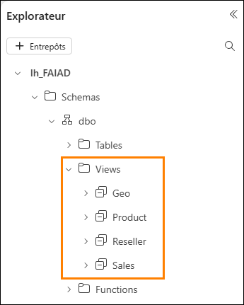

Nous avons transformé les données de la source de données ADLS Gen2. Dans ce labo, nous avons découvert comment créer des raccourcis et exploré diverses options permettant de transformer des données à l’aide de vues de requête visuelle.

Dans le prochain labo, nous allons découvrir comment utiliser Dataflow Gen2 et créer un raccourci vers une autre lakehouse.

# Références

Fabric Analyst in a Day (FAIAD) vous présente certaines des fonctions clés de Microsoft Fabric. Dans le menu du service, la section Aide (?) comporte des liens vers d’excellentes ressources.

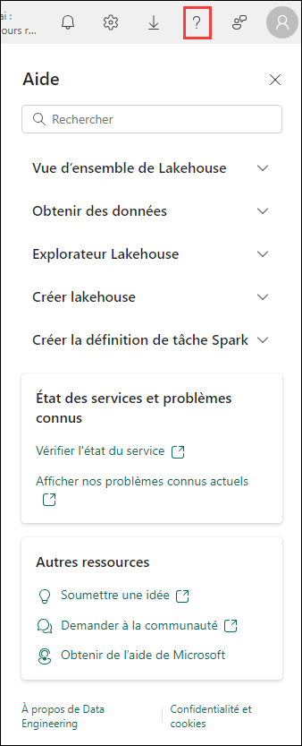

Voici quelques autres ressources qui vous aideront lors de vos prochaines étapes avec Microsoft Fabric :

- Consultez le billet de blog pour lire l’intégralité de l’[annonce de la GA de Microsoft Fabric](https://aka.ms/Fabric-Hero-Blog-Ignite23).

- Explorez Fabric grâce à la [visite guidée](https://aka.ms/Fabric-GuidedTour).

- Inscrivez-vous pour bénéficier d’un [essai gratuit de Microsoft Fabric](https://aka.ms/try-fabric).

- Rendez-vous sur le [site web Microsoft Fabric](https://aka.ms/microsoft-fabric).

- Acquérez de nouvelles compétences en explorant les [modules d’apprentissage Fabric](https://aka.ms/learn-fabric).

- Explorez la [documentation technique Fabric](https://aka.ms/fabric-docs).

- Lisez le [livre électronique gratuit sur la prise en main de Fabric](https://aka.ms/fabric-get-started-ebook).

- Rejoignez la [communauté Fabric](https://aka.ms/fabric-community) pour publier vos questions, partager vos commentaires et apprendre des autres.

Lisez les blogs d’annonces plus détaillés sur l’expérience Fabric :

- [Blog Expérience Data Factory dans Fabric](https://aka.ms/Fabric-Data-Factory-Blog)

- [Blog Expérience Synapse Data Engineering dans Fabric](https://aka.ms/Fabric-DE-Blog)

- [Blog Expérience Synapse Data Science dans Fabric](https://aka.ms/Fabric-DS-Blog)

- [Blog Expérience Synapse Data Warehousing dans Fabric](https://aka.ms/Fabric-DW-Blog)

- [Blog Expérience Synapse Real-Time Analytics dans Fabric](https://aka.ms/Fabric-RTA-Blog)

- [Blog Annonce Power BI](https://aka.ms/Fabric-PBI-Blog)

- [Blog Expérience Data Activator dans Fabric](https://aka.ms/Fabric-DA-Blog)

- [Blog Administration et gouvernance dans Fabric](https://aka.ms/Fabric-Admin-Gov-Blog)

- [Blog OneLake dans Fabric](https://aka.ms/Fabric-OneLake-Blog)

- [Blog Intégration de Dataverse et Microsoft Fabric](https://aka.ms/Dataverse-Fabric-Blog)

© 2023 Microsoft Corporation. Tous droits réservés.

En effectuant cette démonstration/ce labo, vous acceptez les conditions suivantes :

La technologie/fonctionnalité décrite dans cette démonstration/ce labo est fournie par Microsoft Corporation en vue d’obtenir vos commentaires et de vous fournir une expérience d’apprentissage. Vous pouvez utiliser cette démonstration/ce labo uniquement pour évaluer ces technologies et fonctionnalités, et pour fournir des commentaires à Microsoft. Vous ne pouvez pas l’utiliser à d’autres fins. Vous ne pouvez pas modifier, copier, distribuer, transmettre, afficher, effectuer, reproduire, publier, accorder une licence, créer des œuvres dérivées, transférer ou vendre tout ou une partie de cette démonstration/ce labo.

LA COPIE OU LA REPRODUCTION DE CETTE DÉMONSTRATION/CE LABO (OU DE TOUTE PARTIE DE CEUX-CI) SUR TOUT AUTRE SERVEUR OU AUTRE EMPLACEMENT EN VUE D’UNE AUTRE REPRODUCTION OU REDISTRIBUTION EST EXPRESSÉMENT INTERDITE.

CETTE DÉMONSTRATION/CE LABO FOURNISSENT CERTAINES FONCTIONNALITÉS DE PRODUIT/TECHNOLOGIES LOGICIELLES, NOTAMMENT D’ÉVENTUELS NOUVEAUX CONCEPTS ET FONCTIONNALITÉS, DANS UN ENVIRONNEMENT SIMULÉ SANS INSTALLATION OU CONFIGURATION COMPLEXE AUX FINS DÉCRITES CI-DESSUS. LES TECHNOLOGIES/CONCEPTS REPRÉSENTÉS DANS CETTE DÉMONSTRATION/CE LABO PEUVENT NE PAS REPRÉSENTER LES FONCTIONNALITÉS COMPLÈTES ET PEUVENT NE PAS FONCTIONNER DE LA MÊME MANIÈRE QUE DANS UNE VERSION FINALE. IL EST ÉGALEMENT POSSIBLE QUE NOUS NE PUBLIIONS PAS DE VERSION FINALE DE CES FONCTIONNALITÉS OU CONCEPTS. VOTRE EXPÉRIENCE D’UTILISATION DE CES FONCTIONNALITÉS DANS UN ENVIRONNEMENT PHYSIQUE PEUT ÉGALEMENT ÊTRE DIFFÉRENTE.

**COMMENTAIRES.** Si vous envoyez des commentaires sur les fonctionnalités, technologies et/ou concepts décrits dans cette démonstration/ce labo à Microsoft, vous accordez à Microsoft, sans frais, le droit d’utiliser, de partager et de commercialiser vos commentaires de quelque manière et à quelque fin que ce soit. Vous accordez également à des tiers, sans frais, les droits de brevet nécessaires pour leurs produits, technologies et services en vue de l’utilisation ou de l’interface avec des parties spécifiques d’un logiciel ou d’un service Microsoft incluant les commentaires. Vous n’enverrez pas de commentaires soumis à une licence exigeant que Microsoft accorde une licence pour son logiciel ou sa documentation à des tiers du fait que nous y incluons vos commentaires. Ces droits survivent à ce contrat.

MICROSOFT CORPORATION DÉCLINE TOUTES LES GARANTIES ET CONDITIONS EN CE QUI CONCERNE CETTE DÉMONSTRATION/CE LABO, Y COMPRIS TOUTES LES GARANTIES ET CONDITIONS DE QUALITÉ MARCHANDE, QU’ELLES SOIENT EXPLICITES, IMPLICITES OU LÉGALES, D’ADÉQUATION À UN USAGE PARTICULIER, DE TITRE ET D’ABSENCE DE CONTREFAÇON. MICROSOFT N’OFFRE AUCUNE GARANTIE OU REPRÉSENTATION EN CE QUI CONCERNE LA PRÉCISION DES RÉSULTATS, LA CONSÉQUENCE QUI DÉCOULE DE L’UTILISATION DE CETTE DÉMONSTRATION/CE LABO, OU L’ADÉQUATION DES INFORMATIONS CONTENUES DANS CETTE DÉMONSTRATION/CE LABO À QUELQUE FIN QUE CE SOIT.

**CLAUSE D’EXCLUSION DE RESPONSABILITÉ**

Cette démonstration/Ce labo comporte seulement une partie des nouvelles fonctionnalités et améliorations disponibles dans Microsoft Power BI. Certaines fonctionnalités sont susceptibles de changer dans les versions ultérieures du produit. Dans ce labo/cette démonstration, vous allez découvrir comment utiliser certaines nouvelles fonctionnalités, mais pas toutes.
