# Microsoft Fabric - Fabric Analyst in a Day - Labo 4

## Sommaire

- Introduction
- Dataflow Gen2
  - Tâche 1 : copier des requêtes SharePoint dans Dataflow
  - Tâche 2 : créer une connexion SharePoint
  - Tâche 3 : configurer la destination des données pour la requête People
  - Tâche 4 : publier et renommer le flux de données SharePoint
  - Tâche 5 : copier des requêtes Snowflake dans Dataflow
  - Tâche 6 : créer une connexion à Snowflake
  - Tâche 7 : configurer la destination des données pour les requêtes Supplier et PO
  - Tâche 8 : renommer et publier le flux de données Snowflake
- Raccourci vers le lakehouse interne
  - Tâche 9 : créer un raccourci vers Dataverse
  - Tâche 10 : créer un raccourci vers un lakehouse
- Références

# Introduction

Dans notre scénario, les données fournisseur se trouvent dans Snowflake, les données client dans Dataverse et les données collaborateurs dans SharePoint. Toutes ces sources de données sont mises à jour à des moments différents. Afin de réduire le nombre d’actualisations de données pour les flux de données, nous allons créer des flux de données individuels pour les sources de données Snowflake et SharePoint.

**Remarque :** plusieurs sources de données sont prises en charge dans un seul flux de données.

L’équipe informatique a déjà établi un lien vers Dataverse et appliqué les transformations de données nécessaires, en miroir de celles du fichier Power BI Desktop. Elle a ingéré ces données dans le lakehouse dans l’espace de travail Administrateur et nous a donné accès à la table/aux tables. Nous allons créer un raccourci pour la ou les tables que l’équipe informatique Lakehouse a créée(s).

À la fin de ce labo, vous saurez :

- comment vous connecter à SharePoint à l’aide de Dataflow Gen2 et ingérer des données dans le lakehouse ;

- comment vous connecter à Snowflake à l’aide de Dataflow Gen2 et ingérer des données dans le lakehouse ;

- comment ingérer des données depuis un lakehouse partagé.

# Dataflow Gen2

### Tâche 1 : copier des requêtes SharePoint dans Dataflow

1. Revenons à l’espace de travail Fabric **FAIAD_<username> (1)** que vous avez créé dans le labo 2, tâche 8.

2. Cliquez sur l’option **+ Nouvel élément (2)** qui se trouve en haut à gauche de l’écran.

3. Sous la section **Obtenir des données (3),** sélectionnez **Dataflow Gen2 (4).**

    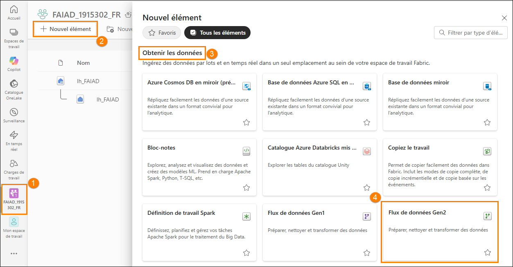

    Laissez le nom par défaut.Cliquez ensuite sur **Créer**. Vous êtes alors redirigé vers la **page Dataflow**. L’interface Dataflow Gen2 ressemble à celle de Power Query dans Power BI Desktop. Nous pouvons copier des requêtes depuis Power BI Desktop dans Dataflow Gen2. Essayons de le faire.

4. Si vous ne l’avez pas encore ouvert, ouvrez le fichier **FAIAD.pbix** situé dans le dossier **Reports** sur le bureau de votre environnement de labo.

5. Dans le ruban, cliquez sur **Accueil -> Transformer les données**. Une fenêtre Power Query s’ouvre alors. Comme vous l’avez remarqué dans les labos précédents, les requêtes du volet gauche sont organisées par source de données.

6. Dans le volet gauche, **sélectionnez la requête People** sous le dossier SharepointData.

7. **Cliquez avec le bouton droit** et sélectionnez **Copier**.

    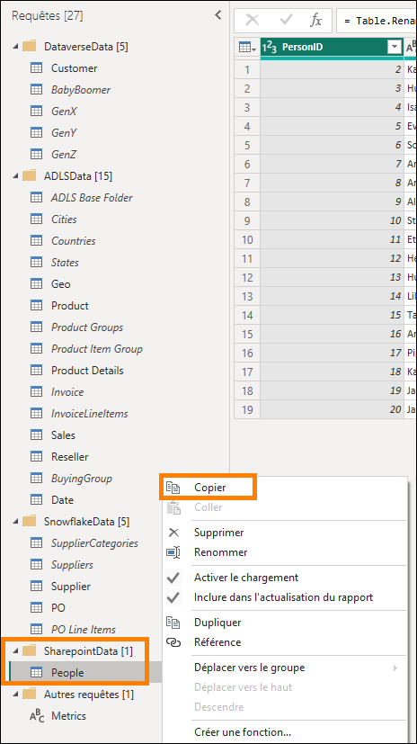

8. Revenez à l’**écran Dataflow** dans le navigateur.

9. Dans le **volet Dataflow**, utilisez le raccourci clavier **Ctrl + V**. (À l’heure actuelle, le clic droit sur Coller n’est pas pris en charge.) Si vous utilisez un appareil MAC, collez à l’aide du raccourci clavier Cmd + V.

    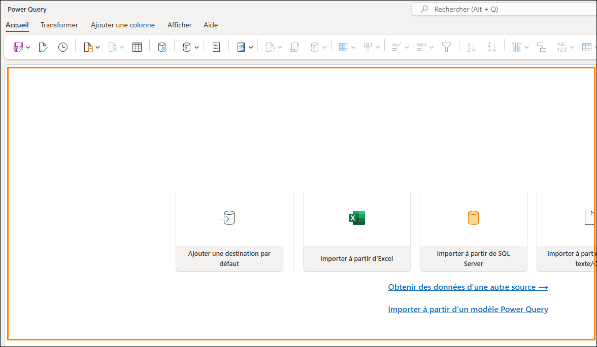

    **Remarque**** :** si vous travaillez dans un environnement de labo, cliquez sur les points de suspension en haut de l’écran à droite. Utilisez le curseur pour **activer**** le Presse-papiers natif de VM**. Cliquez sur D’ACCORD dans la boîte de dialogue. Après avoir collé les requêtes, vous pouvez désactiver cette option.

    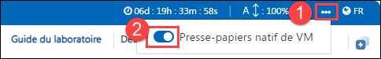

    Veuillez noter que la requête est collée et disponible dans le volet gauche. Comme nous n’avons pas de connexion créée pour SharePoint, un message d’avertissement s’affiche pour vous demander de configurer la connexion.

    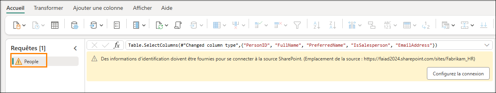

### Tâche 2 : créer une connexion SharePoint

1. Cliquez sur **Configurer la connexion**.

    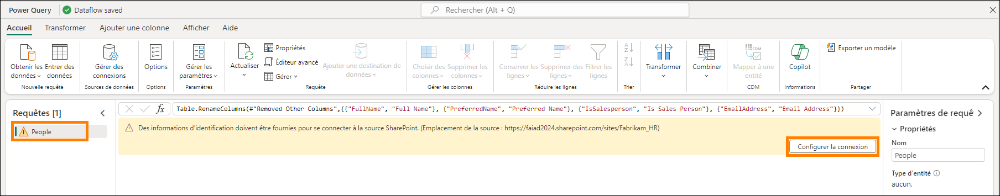

2. La boîte de dialogue Connexion à une source de données s’ouvre alors. Dans la liste déroulante **Connexion**, assurez-vous que l’option **Créer une connexion** est sélectionnée.

3. Le champ **Type d’authentification** devrait être défini sur **Compte professionnel**.

4. Cliquez sur **Connexion**.

    **Remarque :** vous êtes connecté à l’aide de vos informations d’identification. Elles sont différentes de celles figurant dans la capture d’écran ci-dessous.

    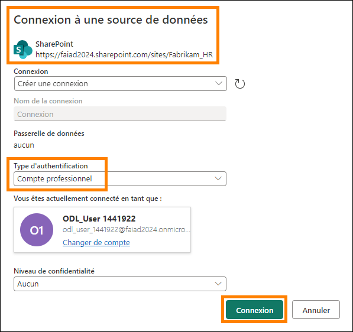

### Tâche 3 : configurer la destination des données pour la requête People

La connexion est établie et vous pouvez afficher les données dans le volet d’aperçu. N’hésitez pas à parcourir les étapes appliquées des requêtes. Nous devons maintenant ingérer les données People dans le lakehouse.

1. Sélectionnez la requête **People (1).**

2. Dans le ruban, cliquez sur **Accueil -> Requête (2) -> Ajouter une destination de données (3) -> Lakehouse (4)**.

    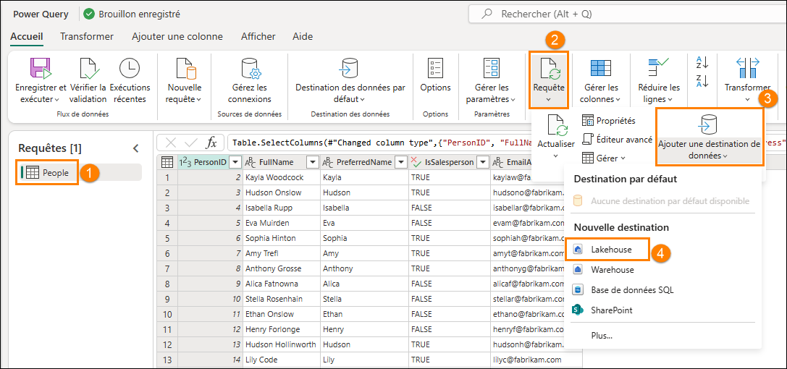

3. La boîte de dialogue Se connecter à la destination des données s’ouvre alors. Nous devons créer une connexion au lakehouse. Avec l’option **Créer une connexion** sélectionnée dans la liste déroulante Connexion et le champ **Type d’authentification** défini sur **Compte professionnel**, cliquez sur **Suivant**.

    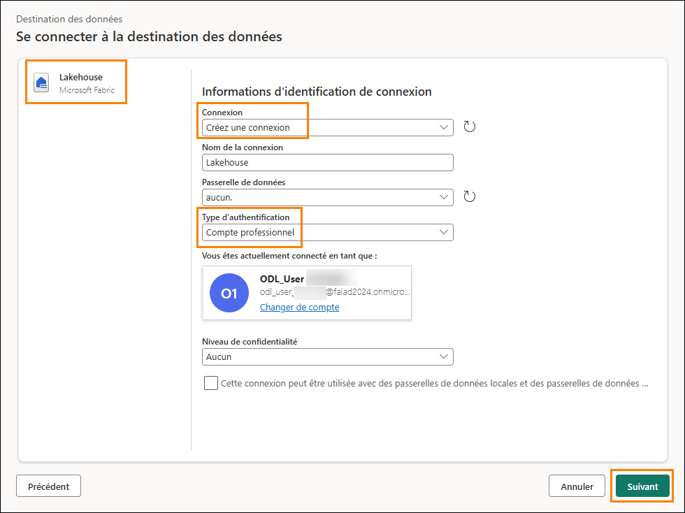

4. La boîte de dialogue Choisir la cible de destination s’ouvre alors. Assurez-vous que le bouton radio **Nouvelle table** est coché, car nous créons une table.

5. Nous souhaitons créer la table dans le lakehouse que nous avons créé plus tôt. Dans le volet gauche, accédez à **Lakehouse -> FAIAD_<username>**.

6. Sélectionnez **lh_FAIAD**.

7. Laissez le champ Nom de la table défini sur **People**.

8. Cliquez sur **Suivant**.

    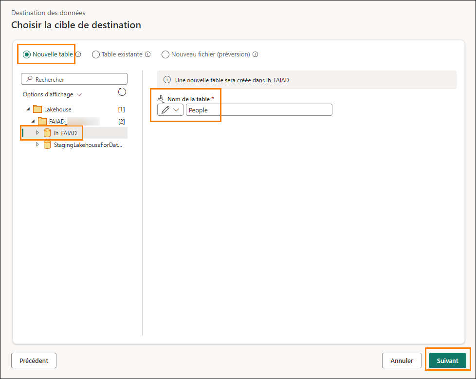

9. La boîte de dialogue Choisir les paramètres de destination s’ouvre alors. Assurez-vous que l’option « **Utiliser les paramètres automatiques** » est **activée**.

    **Remarque**** :** vous pouvez désactiver les paramètres automatiques et notez que vous disposez d’options pour définir les options Méthode de mise à jour et Schéma. Ensuite, assurez-vous que l’option « **Utiliser les paramètres automatiques** » est **activée**.

10. Cliquez sur **Enregistrer les paramètres**.

    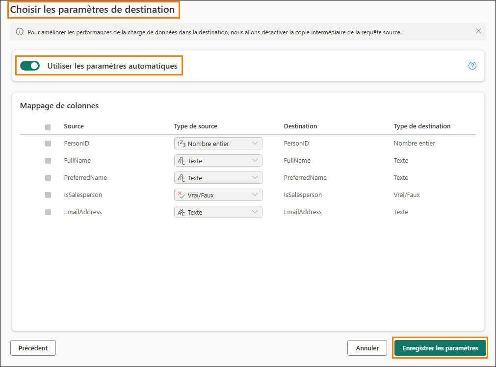

### Tâche 4 : publier et renommer le flux de données SharePoint

1. Vous êtes redirigé vers la **fenêtre Power Query**. Dans le **coin inférieur droit**, notez que la liste déroulante Destination des données est définie sur **Lakehouse (1)**.

2. Cliquez sur **Enregistrer et exécuter (2)** dans le coin supérieur gauche. Une fois que vous voyez la notification indiquant qu’une actualisation a été lancée, vous pouvez fermer le flux de données **(3)**

    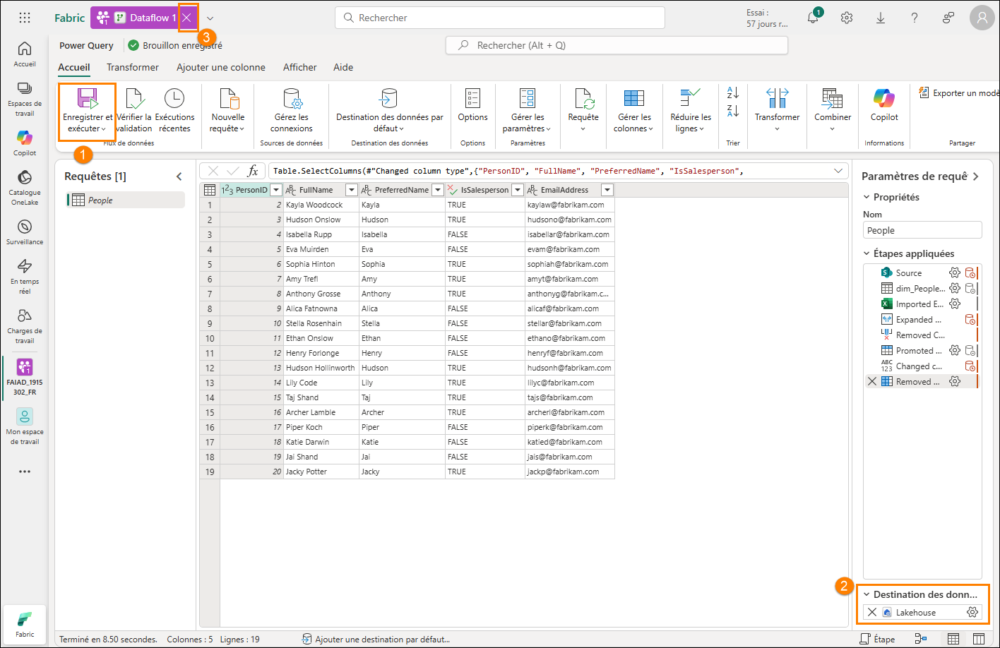

    **Remarque :** vous êtes alors redirigé(e) vers l’espace de travail **FAIAD_<username>**. L’exécution du flux de données peut prendre quelques instants avant de se terminer.

3. **Dataflow 1** est le flux de données sur lequel nous travaillions. Renommons-le avant de continuer. Cliquez sur les points de **suspension (…)** en regard de Flux de données 1. Sélectionnez **Paramètres**. (Pendant l’exécution du flux de données, vous ne pouvez pas accéder aux paramètres.)

    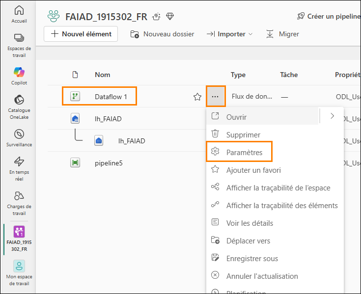

4. La fenêtre Paramètres du flux de données s’ouvre. Redéfinissez le champ **Nom** sur **df_People_SharePoint (1)**.

5. Dans la zone de texte **Description**, ajoutez **Dataflow to ingest People data from SharePoint to Lakehouse (2).**

6. Ensuite, fermez la fenêtre des paramètres **(3)**.

    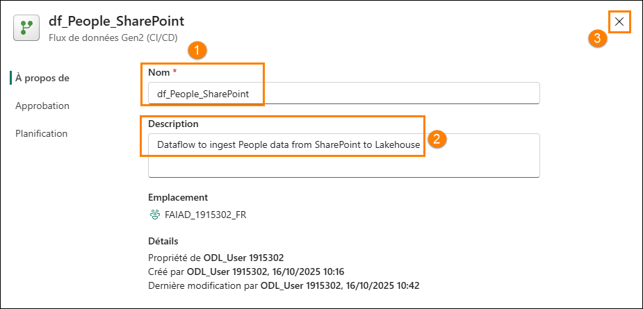

    Vous êtes alors redirigé vers l’espace de travail **FAIAD_<username>**.

7. Cliquez sur **lh_FAIAD** pour accéder au lakehouse.

8. Vérifiez que vous vous trouvez dans la vue Lakehouse (et non dans le point de terminaison analytique SQL).

9. Notez que nous disposons maintenant d’une table **People** dans au lakehouse.

    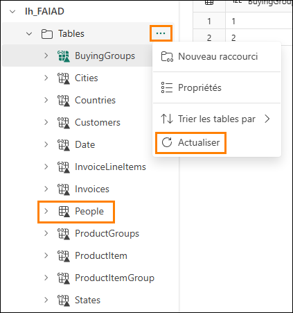

    **Remarque :** si vous ne voyez pas les tables venant d’être créées, cliquez sur les points de suspension en regard de Tables et sélectionnez Actualiser pour actualiser les tables.

### Tâche 5 : copier des requêtes Snowflake dans Dataflow

1. Revenons à l’espace de travail Fabric **FAIAD_<username> (1)**.

2. Cliquez sur l’option **+ Nouvel élément (2)** qui se trouve en haut à gauche de l’écran.

3. Sous Éléments recommandés, cliquez sur **Flux de données Gen2 (3)**.

    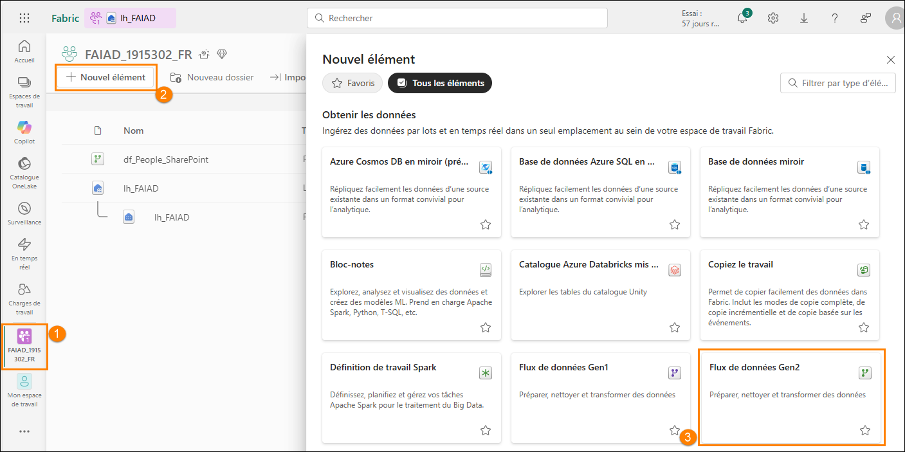

    Cliquez ensuite sur **Créer**. Si un message indique qu’un flux de données portant ce nom existe déjà, modifiez le nom en **Flux de données 2**. Vous serez ensuite redirigé(e) vers la page du **flux de données**. Maintenant que nous connaissons Dataflow, copions les requêtes de Power BI Desktop dans Dataflow.

4. Si vous ne l’avez pas encore ouvert, ouvrez le fichier **FAIAD.pbix** situé dans le dossier **Reports** sur le bureau de votre environnement de labo.

5. Dans le ruban, cliquez sur **Accueil -> Transformer les données**. Une fenêtre Power Query s’ouvre alors. Comme vous l’avez remarqué dans le labo précédent, les requêtes du volet gauche sont organisées par source de données.

6. Dans le volet gauche, sous le dossier **SnowflakeData**, appuyez sur la touche **Ctrl** ou Maj et sélectionnez les requêtes suivantes :

    1. SupplierCategories

    2. Suppliers

    3. Supplier

    4. PO

    5. PO Line Items

7. **Cliquez avec le bouton droit** et sélectionnez **Copier**.

    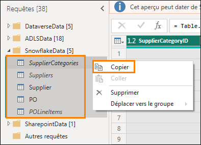

8. Revenez au **navigateur**.

9. Dans le **volet Dataflow**, cliquez sur le **volet central** et utilisez le raccourci clavier **Ctrl + V**. (À l’heure actuelle, le clic droit sur Coller n’est pas pris en charge.) Si vous utilisez un appareil MAC, collez à l’aide du raccourci clavier Cmd + V.

    **Remarque :** si vous travaillez dans l’environnement de labo, cliquez sur les **points de suspension (...)** en haut de l’écran à droite. Utilisez le curseur pour **activer**** le Presse-papiers natif de VM**. Cliquez sur D’ACCORD dans la boîte de dialogue. Après avoir collé les requêtes, vous pouvez désactiver cette option.

    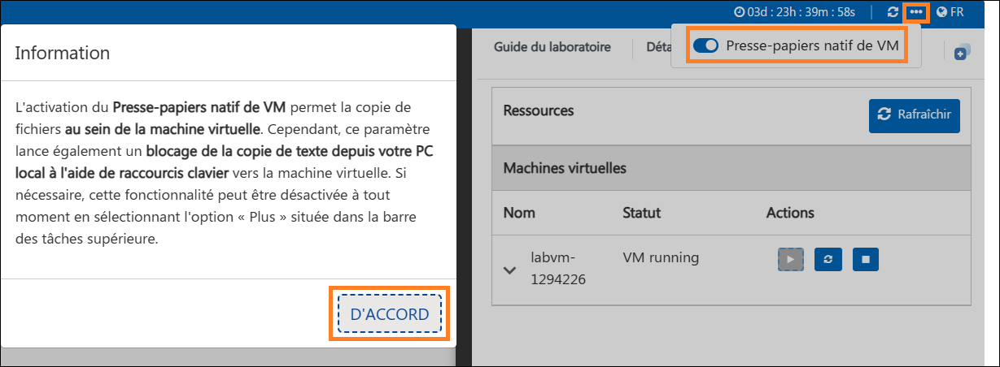

### Tâche 6 : créer une connexion à Snowflake

Notez que les cinq requêtes sont collées et que vous disposez désormais du volet Requêtes à gauche. Comme nous n’avons pas de connexion créée pour Snowflake, un message d’avertissement s’affiche pour vous demander de configurer la connexion.

1. Cliquez sur **Configurer la connexion**.

    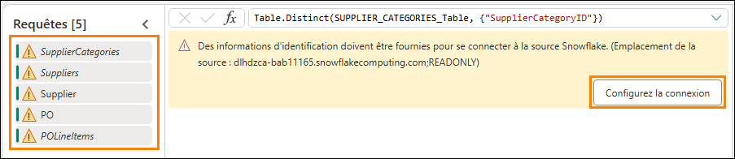

2. La boîte de dialogue Connexion à une source de données s’ouvre alors. Dans la liste déroulante **Connexion**, assurez-vous que l’option **Créer une connexion** est sélectionnée.

3. Le champ **Type d’authentification** doit être défini sur **Snowflake**.

4. Saisissez le **nom d’utilisateur Snowflake** et le **mot de passe Snowflake** fournis ci-après. Utilisez ces informations d’identification pour connecter toutes les tables sous Snowflake à Snowflake, puis cliquez sur **Connecter**.

    - Nom d’utilisateur Snowflake : TE_SNOWFLAKE1

    - Mot de passe Snowflake : 8UpfRpExVDXv2AC1

    **Remarque :** si vous avez des difficultés à vous connecter à Snowflake avec les informations d’identification des détails de l’environnement, veuillez utiliser les informations d’identification fournies ci-après.

    - **Nom d’utilisateur Snowflake :** SNOWFLAKE_BACKUP

    - **Mot de passe Snowflake :** 8UpfRpExVDXv2AC1.

5. Cliquez sur **Connexion**.

    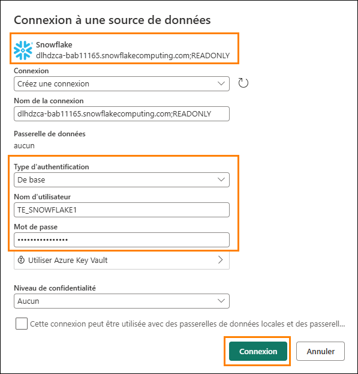

    La connexion est alors établie et vous pouvez afficher les données dans le volet d’aperçu. N’hésitez pas à parcourir les étapes appliquées des requêtes. En substance, la requête Suppliers comporte les détails des fournisseurs et la requête SupplierCategories, comme son nom l’indique, comporte toutes les catégories de fournisseurs. Ces deux tables sont jointes pour créer la dimension Supplier, avec les colonnes dont nous avons besoin. De même, nous avons fusionné la requête PO Line Items avec la requête PO pour créer le fait PO. Nous devons maintenant ingérer les données Supplier et PO dans Lakehouse.

### Tâche 7 : configurer la destination des données pour les requêtes Supplier et PO

1. Sélectionnez la requête **Supplier (1).**

2. Dans le ruban, cliquez sur **Accueil (2) -> Ajouter une destination de données (3) -> Lakehouse (4).**

    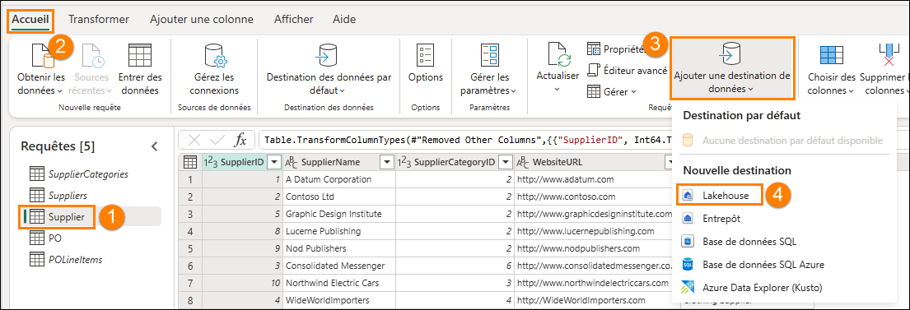

3. La boîte de dialogue Se connecter à la destination des données s’ouvre alors. Dans la liste déroulante **Connexion**, sélectionnez **Lakehouse odl_user_<username> (aucun)**.

4. Cliquez sur **Suivant**.

    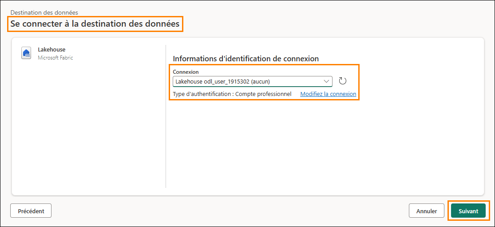

5. La boîte de dialogue Choisir la cible de destination s’ouvre alors. Assurez-vous que le **bouton** radio Nouvelle **table** est **coché**, car nous créons une table.

6. Nous souhaitons créer la table dans le lakehouse que nous avons créé plus tôt. Dans le volet gauche, accédez à **Lakehouse -> FAIAD_<username>**.

7. Sélectionnez **lh_FAIAD**.

8. Laissez le champ Nom de la table défini sur **Supplier**.

9. Cliquez sur **Suivant**.

    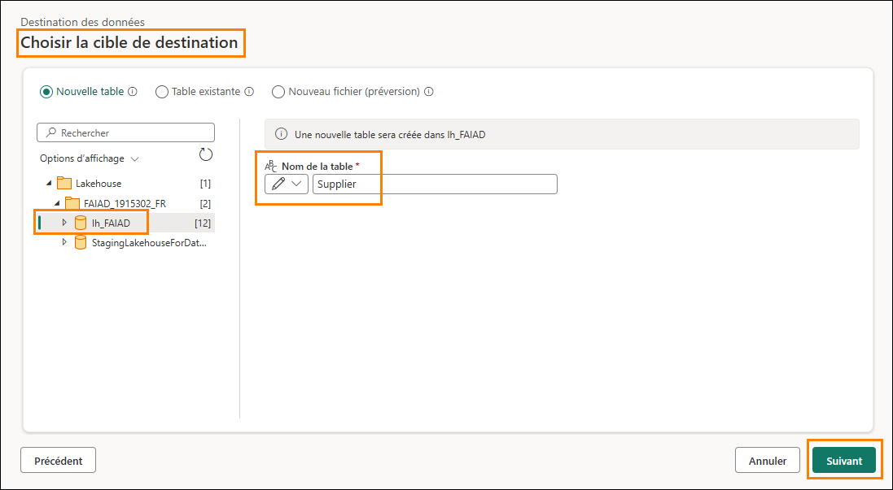

10. La boîte de dialogue Choisir les paramètres de destination s’ouvre alors. Nous allons utiliser les paramètres automatiques pour permettre une mise à jour complète des données. De plus, les colonnes seront renommées si nécessaire. Cliquez sur **Enregistrer les paramètres**.

    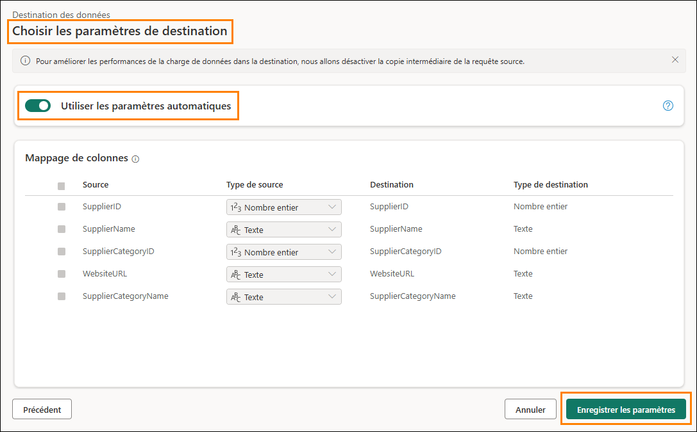

11. Vous êtes redirigé vers la **fenêtre Power Query**. Dans le **coin inférieur droit**, notez que la liste déroulante Destination des données est définie sur **Lakehouse**. De même, **configurez la destination des données pour la requête PO**. Ensuite, la liste déroulante **Destination des données** de votre requête **PO** devrait être définie sur **Lakehouse**, comme illustré dans la capture d’écran ci-dessous.

    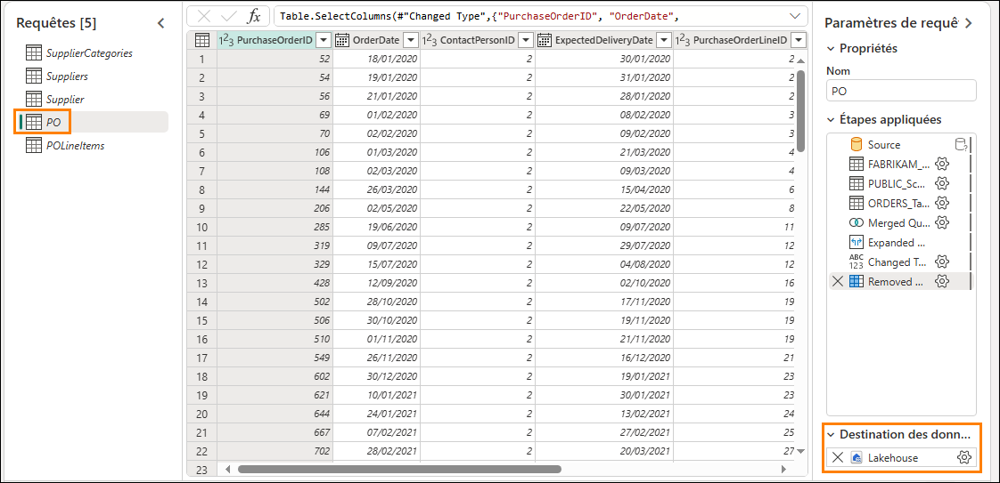

### Tâche 8 : renommer et publier le flux de données Snowflake

1. En haut de l’écran, cliquez sur la **flèche en regard de Flux de données 2 (le nom peut différer)** pour le renommer.

2. Dans la boîte de dialogue, redéfinissez le nom sur **df_Supplier_Snowflake**.

3. Appuyez sur **Entrée** pour enregistrer le changement de nom.

    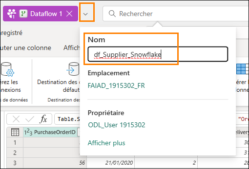

4. Cliquez sur **Enregistrer et exécuter (1)** dans le coin supérieur gauche. Une fois que vous voyez la notification indiquant qu’une actualisation a été lancée, vous pouvez fermer le flux de données **(2)**

    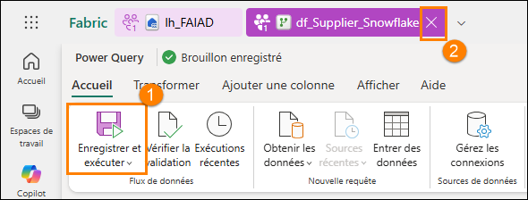

    Vous êtes alors redirigé vers l’espace de travail **FAIAD_<username>**. La publication du flux de données peut prendre quelques instants.

5. Cliquez sur **lh_FAIAD** pour accéder au lakehouse.

6. Vérifiez que vous vous trouvez dans la vue Lakehouse (et non dans le point de terminaison analytique SQL).

7. Notez que nous disposons maintenant de tables **PO** et **Supplier** dans le lakehouse.

    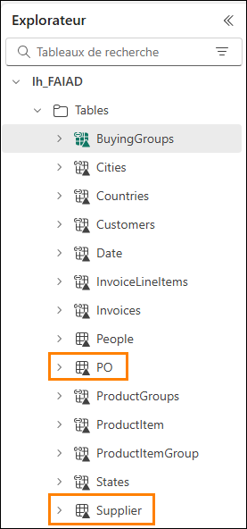

    **Remarque :** si vous ne voyez pas les tables venant d’être créées, cliquez sur les points de suspension en regard de Tables et sélectionnez Actualiser pour actualiser les tables.

    Créons maintenant un raccourci permettant d’importer les données de Dataverse.

# Raccourci vers le lakehouse interne

### Tâche 9 : créer un raccourci vers Dataverse

Vous devriez être dans le lakehouse **lh_FAIAD**. Vérifiez que vous vous trouvez dans la vue Lakehouse (et non dans le point de terminaison analytique SQL).

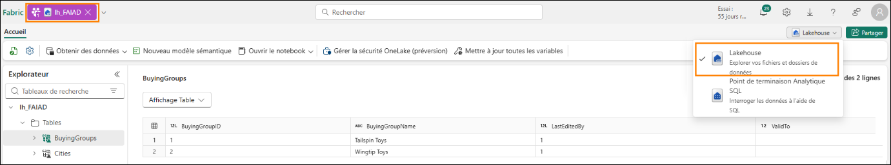

1. Dans le volet **Explorateur**, cliquez sur les **points de suspension** en regard de **Tables**.

2. Cliquez sur **Nouveau raccourci**.

    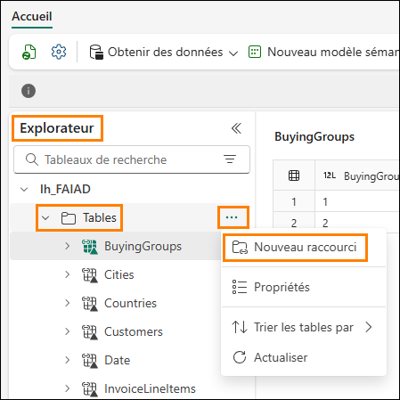

3. La boîte de dialogue Nouveau raccourci s’ouvre alors. Sous **Sources externes**, sélectionnez **Dataverse**.

    **Remarque**** :** dans le labo précédent, nous avons procédé de même pour créer un raccourci vers Azure Data Lake Storage Gen2.

    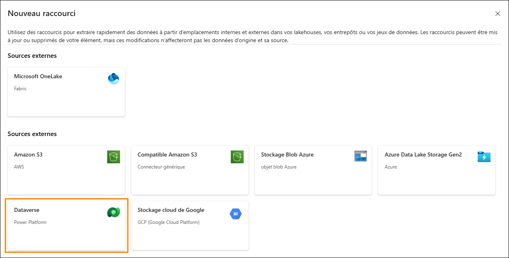

4. **Sélectionnez Nouvelle connexion (1)** pour afficher la boîte de dialogue Paramètres de connexion. Saisissez **org6c18814a.crm.dynamics.com (2)** dans le champ **Domaine de l’environnement.**

5. Laissez le champ **Type d’authentification** défini sur **Compte professionnel (3)**.

6. Cliquez sur **Se connecter** si vous n’êtes pas encore connecté.

    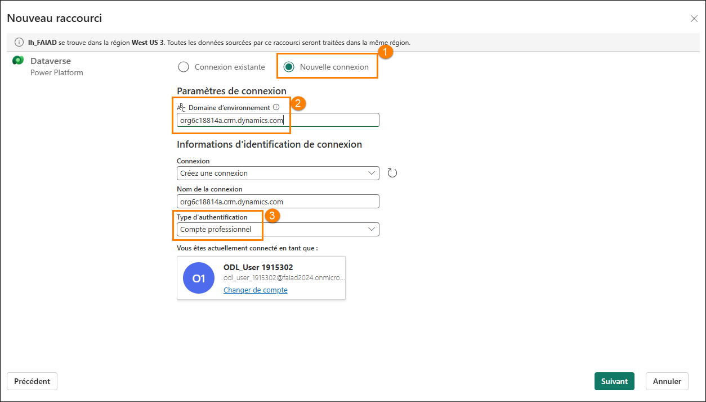

7. Dans la boîte de dialogue de connexion, sélectionnez le **compte d’utilisateur** que vous avez utilisé pour ces labos. La boîte de dialogue Connectez-vous à votre compte s’ouvre alors. Choisissez votre compte pour vous connecter. **Remarque**** :** votre compte est différent de celui figurant dans la capture d’écran ci-dessous.

    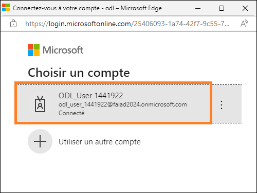

8. Cliquez sur **Suivant** dans la boîte de dialogue Paramètres de connexion.

    Vous êtes alors redirigé vers une boîte de dialogue dans laquelle vous pouvez sélectionner les différents compartiments/répertoires depuis Dataverse. Notez que de nombreux compartiments différents sont disponibles. Nous pouvons choisir le(s) compartiment(s) dont nous avons besoin et procéder de même que dans le labo 3 (transformer les données et créer des vues à l’aide d’une requête visuelle). Nous pouvons également utiliser Dataflow Gen2 comme il nous a permis précédemment dans ce labo de nous connecter à SharePoint.

    Dans notre scénario, l’équipe informatique a déjà établi un lien vers Dataverse et appliqué les transformations de données nécessaires, en miroir de celles du fichier Power BI Desktop. Elle a ingéré ces données dans le lakehouse dans l’espace de travail Administrateur et nous a donné accès à la table/aux tables. Puisque notre équipe informatique a déjà fait le plus dur, nous pouvons créer un raccourci vers ce lakehouse dans l’espace de travail Administrateur.

9. Cliquez sur **Annuler** dans la boîte de dialogue Nouveau raccourci pour revenir au lakehouse.

    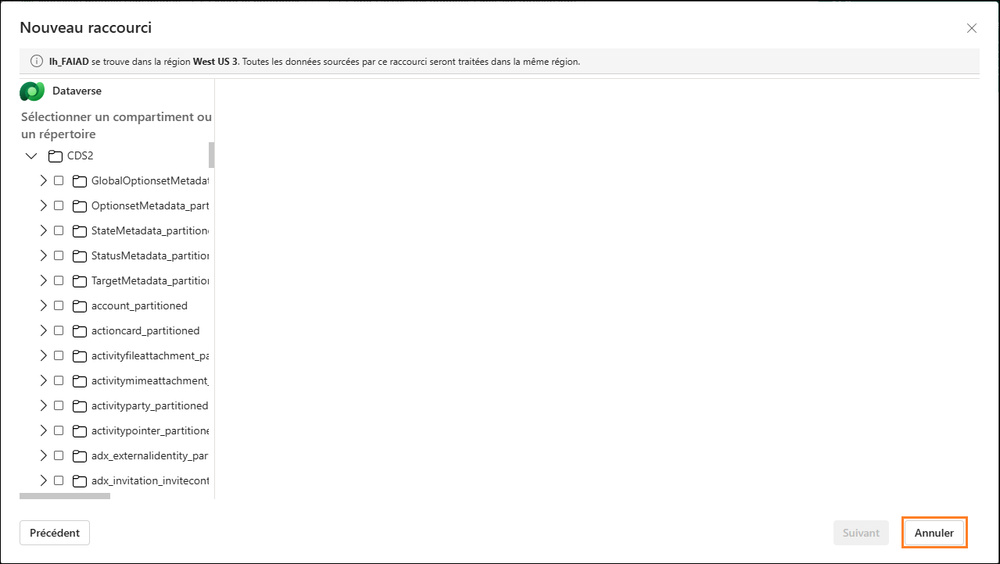

### Tâche 10 : créer un raccourci vers un lakehouse

1. Dans le volet **Explorateur**, cliquez sur les **points de suspension** en regard de **Tables**.

2. Cliquez sur **Nouveau raccourci**.

    

3. La boîte de dialogue Nouveau raccourci s’ouvre alors. Sélectionnez l’option **Microsoft OneLake** sous Sources internes.

    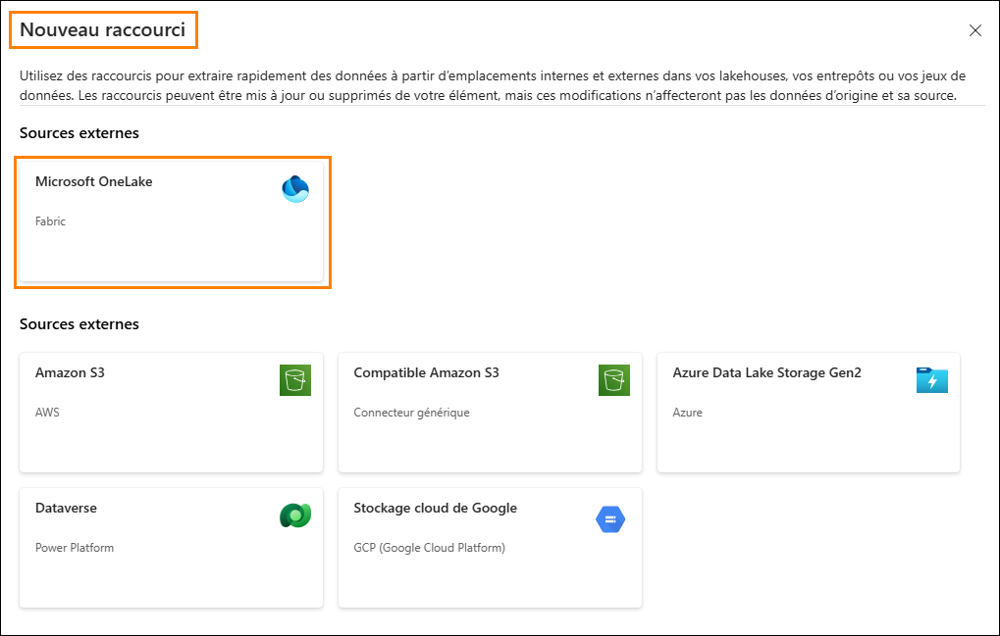

4. Sélectionnez **lh_dataverse**.

5. Cliquez sur **Suivant**.

    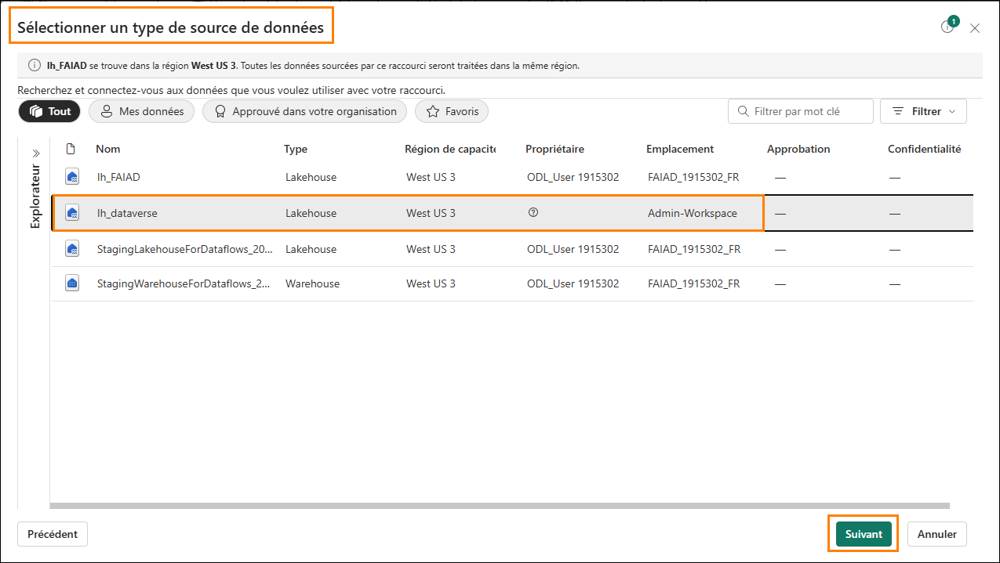

6. Dans le volet gauche, développez **lh_dataverse -> Tables**. Notez que l’administrateur informatique a accordé un accès à la table Customer.

7. Sélectionnez **Customer**.

8. Cliquez sur **Suivant**.

    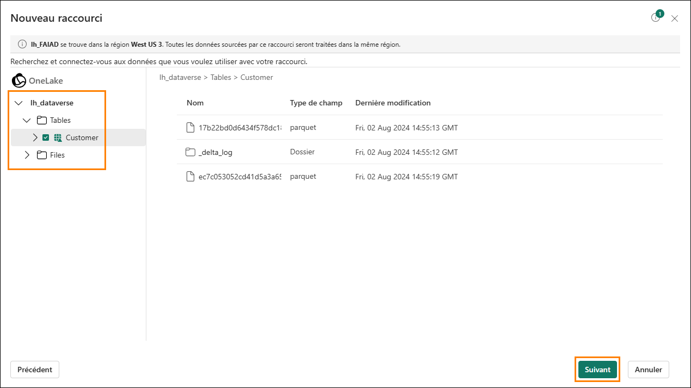

9. Cliquez sur **Créer** dans la boîte de dialogue suivante. Vous êtes alors redirigé vers le lakehouse lh_FAIAD.

    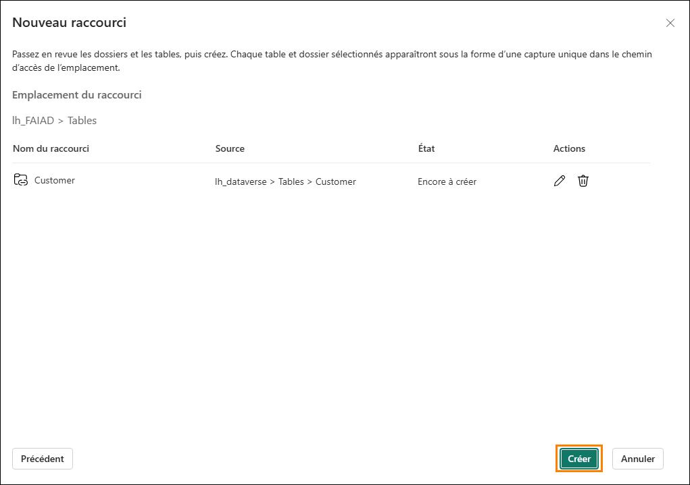

10. Dans le volet **Explorateur** à gauche, notez la création de la table **Customer**.

11. Cliquez sur la table **Customer** pour afficher les données dans le volet d’aperçu.

    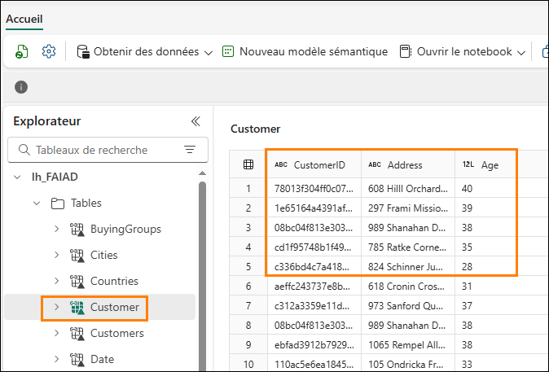

    Nous avons réussi à créer un raccourci vers un autre lakehouse.

    Nous avons maintenant ingéré toutes les données nécessaires dans notre lakehouse. Dans le prochain labo, nous allons planifier l’actualisation de notre flux de données SharePoint.

# Références

Fabric Analyst in a Day (FAIAD) vous présente certaines des fonctions clés de Microsoft Fabric. Dans le menu du service, la section Aide (?) comporte des liens vers d’excellentes ressources.

Voici quelques autres ressources qui vous aideront lors de vos prochaines étapes avec Microsoft Fabric :

- Consultez le billet de blog pour lire l’intégralité de l’[annonce de la GA de Microsoft Fabric](https://aka.ms/Fabric-Hero-Blog-Ignite23).

- Explorez Fabric grâce à la [visite guidée](https://aka.ms/Fabric-GuidedTour).

- Inscrivez-vous pour bénéficier d’un [essai gratuit de Microsoft Fabric](https://aka.ms/try-fabric).

- Rendez-vous sur le [site web Microsoft Fabric](https://aka.ms/microsoft-fabric).

- Acquérez de nouvelles compétences en explorant les [modules d’apprentissage Fabric](https://aka.ms/learn-fabric).

- Explorez la [documentation technique Fabric](https://aka.ms/fabric-docs).

- Lisez le [livre électronique gratuit sur la prise en main de Fabric](https://aka.ms/fabric-get-started-ebook).

- Rejoignez la [communauté Fabric](https://aka.ms/fabric-community) pour publier vos questions, partager vos commentaires et apprendre des autres.

Lisez les blogs d’annonces plus détaillés sur l’expérience Fabric :

- [Blog Expérience Data Factory dans Fabric](https://aka.ms/Fabric-Data-Factory-Blog)

- [Blog Expérience Synapse Data Engineering dans Fabric](https://aka.ms/Fabric-DE-Blog)

- [Blog Expérience Synapse Data Science dans Fabric](https://aka.ms/Fabric-DS-Blog)

- [Blog Expérience Synapse Data Warehousing dans Fabric](https://aka.ms/Fabric-DW-Blog)

- [Blog Expérience Synapse Real-Time Analytics dans Fabric](https://aka.ms/Fabric-RTA-Blog)

- [Blog Annonce Power BI](https://aka.ms/Fabric-PBI-Blog)

- [Blog Expérience Data Activator dans Fabric](https://aka.ms/Fabric-DA-Blog)

- [Blog Administration et gouvernance dans Fabric](https://aka.ms/Fabric-Admin-Gov-Blog)

- [Blog OneLake dans Fabric](https://aka.ms/Fabric-OneLake-Blog)

- [Blog Intégration de Dataverse et Microsoft Fabric](https://aka.ms/Dataverse-Fabric-Blog)

© 2023 Microsoft Corporation. Tous droits réservés.

En effectuant cette démonstration/ce labo, vous acceptez les conditions suivantes :

La technologie/fonctionnalité décrite dans cette démonstration/ce labo est fournie par Microsoft Corporation en vue d’obtenir vos commentaires et de vous fournir une expérience d’apprentissage. Vous pouvez utiliser cette démonstration/ce labo uniquement pour évaluer ces technologies et fonctionnalités, et pour fournir des commentaires à Microsoft. Vous ne pouvez pas l’utiliser à d’autres fins. Vous ne pouvez pas modifier, copier, distribuer, transmettre, afficher, effectuer, reproduire, publier, accorder une licence, créer des œuvres dérivées, transférer ou vendre tout ou une partie de cette démonstration/ce labo.

LA COPIE OU LA REPRODUCTION DE CETTE DÉMONSTRATION/CE LABO (OU DE TOUTE PARTIE DE CEUX-CI) SUR TOUT AUTRE SERVEUR OU AUTRE EMPLACEMENT EN VUE D’UNE AUTRE REPRODUCTION OU REDISTRIBUTION EST EXPRESSÉMENT INTERDITE.

CETTE DÉMONSTRATION/CE LABO FOURNISSENT CERTAINES FONCTIONNALITÉS DE PRODUIT/TECHNOLOGIES LOGICIELLES, NOTAMMENT D’ÉVENTUELS NOUVEAUX CONCEPTS ET FONCTIONNALITÉS, DANS UN ENVIRONNEMENT SIMULÉ SANS INSTALLATION OU CONFIGURATION COMPLEXE AUX FINS DÉCRITES CI-DESSUS. LES TECHNOLOGIES/CONCEPTS REPRÉSENTÉS DANS CETTE DÉMONSTRATION/CE LABO PEUVENT NE PAS REPRÉSENTER LES FONCTIONNALITÉS COMPLÈTES ET PEUVENT NE PAS FONCTIONNER DE LA MÊME MANIÈRE QUE DANS UNE VERSION FINALE. IL EST ÉGALEMENT POSSIBLE QUE NOUS NE PUBLIIONS PAS DE VERSION FINALE DE CES FONCTIONNALITÉS OU CONCEPTS. VOTRE EXPÉRIENCE D’UTILISATION DE CES FONCTIONNALITÉS DANS UN ENVIRONNEMENT PHYSIQUE PEUT ÉGALEMENT ÊTRE DIFFÉRENTE.

**COMMENTAIRES.** Si vous envoyez des commentaires sur les fonctionnalités, technologies et/ou concepts décrits dans cette démonstration/ce labo à Microsoft, vous accordez à Microsoft, sans frais, le droit d’utiliser, de partager et de commercialiser vos commentaires de quelque manière et à quelque fin que ce soit. Vous accordez également à des tiers, sans frais, les droits de brevet nécessaires pour leurs produits, technologies et services en vue de l’utilisation ou de l’interface avec des parties spécifiques d’un logiciel ou d’un service Microsoft incluant les commentaires. Vous n’enverrez pas de commentaires soumis à une licence exigeant que Microsoft accorde une licence pour son logiciel ou sa documentation à des tiers du fait que nous y incluons vos commentaires. Ces droits survivent à ce contrat.

MICROSOFT CORPORATION DÉCLINE TOUTES LES GARANTIES ET CONDITIONS EN CE QUI CONCERNE CETTE DÉMONSTRATION/CE LABO, Y COMPRIS TOUTES LES GARANTIES ET CONDITIONS DE QUALITÉ MARCHANDE, QU’ELLES SOIENT EXPLICITES, IMPLICITES OU LÉGALES, D’ADÉQUATION À UN USAGE PARTICULIER, DE TITRE ET D’ABSENCE DE CONTREFAÇON. MICROSOFT N’OFFRE AUCUNE GARANTIE OU REPRÉSENTATION EN CE QUI CONCERNE LA PRÉCISION DES RÉSULTATS, LA CONSÉQUENCE QUI DÉCOULE DE L’UTILISATION DE CETTE DÉMONSTRATION/CE LABO, OU L’ADÉQUATION DES INFORMATIONS CONTENUES DANS CETTE DÉMONSTRATION/CE LABO À QUELQUE FIN QUE CE SOIT.

**CLAUSE D’EXCLUSION DE RESPONSABILITÉ**

Cette démonstration/Ce labo comporte seulement une partie des nouvelles fonctionnalités et améliorations disponibles dans Microsoft Power BI. Certaines fonctionnalités sont susceptibles de changer dans les versions ultérieures du produit. Dans cette démonstration/ce labo, vous allez découvrir comment utiliser certaines nouvelles fonctionnalités, mais pas toutes.
