# Microsoft Fabric - Fabric Analyst in a Day - Labo 7

## Sommaire

- Introduction
- Power BI
  - Tâche 1 : créer automatiquement un état
  - Tâche 2 : configurer l’arrière-plan d’un nouvel état
  - Tâche 3 : ajouter un en-tête à l’état
  - Tâche 4 : ajouter des KPI à l’état
  - Tâche 5 : ajouter un graphique en courbes à l’état
  - Tâche 6 : enregistrer l’état
  - Tâche 7 : configurer la colonne Year de la table Date
  - Tâche 8 : configurer la colonne Month Name de la table Date
  - Tâche 9 : mettre en forme le graphique en courbes
  - Tâche 10 : connecter Power BI Desktop au modèle sémantique
  - Tâche 11 : ajouter de nouvelles données pour simuler le mode Direct Lake
- Nettoyer l’environnement de labo
- Références

# Introduction

Dans cette formation, vous avez découvert le lakehouse, ingéré des données de différentes sources dans le lakehouse, défini un calendrier d’actualisation pour les sources de données et créé un modèle de données. Vous allez maintenant créer un état.

À la fin de ce labo, vous saurez :

- comment créer automatiquement un état ;

- comment créer un état à partir d’un canevas vide ;

- Création d’un état à l’aide de Power BI Desktop ;

- comment bénéficier du mode Direct Lake entraînant une actualisation automatique des données.

# Power BI

## Tâche 1 : créer automatiquement un état

Commençons par utiliser l’option de création automatique d’un état. Plus tard dans le labo, nous allons recréer l’état dont nous disposons dans Power BI.

1. Revenons à **l’espace de travail Fabric FAIAD_<username>** que vous avez créé dans le labo 2, dénommé **FAIAD_<username>.**

2. Cliquez sur l’icône du **sélecteur de l’expérience Fabric** dans la partie inférieure du volet gauche.

    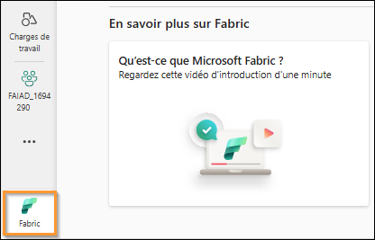

3. La boîte de dialogue Expérience Fabric s’ouvre alors. Cliquez sur **Power BI**. Vous êtes alors redirigé vers la **page d’Accueil Power BI**.

    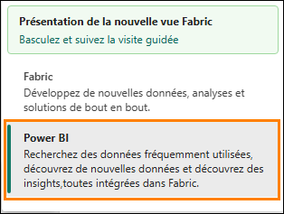

4. Cliquez sur **+ Nouveau rapport** dans le menu supérieur.

    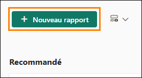

5. Vous êtes alors redirigé vers l’écran **Créer votre premier rapport**. Des options permettent de créer un état à l’aide du format Excel ou CSV, saisir des données manuellement ou choisir un modèle sémantique publié. Nous avons créé un modèle sémantique dans les labos précédents, donc utilisons-le. Sélectionnez l’option **Choisir un modèle sémantique publié**.

    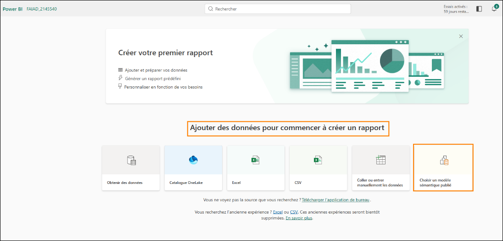

6. Choisissez un jeu de données à utiliser dans votre état lorsque la page s’ouvre. Notez que nous disposons de plusieurs options. Sélectionnez **sm_FAIAD**.

    1. **sm_FAIAD :** il s’agit du modèle sémantique que nous avons créé et à l’aide duquel nous souhaitons créer l’état.

    2. **lh_FAIAD :** il s’agit du lakehouse dans lequel nous avons ingéré toutes les données.

    3. **Units by Supplier :** il s’agit du jeu de données que nous avons créé à l’aide de T-SQL.

7. Cliquez sur la **flèche en regard du bouton Créer automatiquement un état**. Notez que deux options sont disponibles : Créer automatiquement un état et Créer un rapport vide. Essayons la création automatique, donc sélectionnons **Créer automatiquement un état**.

    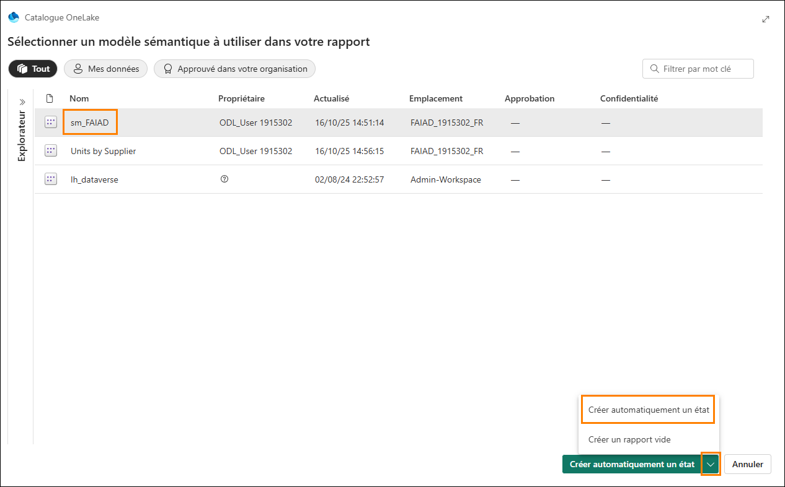

8. Power BI commence alors à créer automatiquement l’état. Une fois l’état prêt, une boîte de dialogue s’affiche en haut de l’écran à droite. Sélectionnez **Afficher l’état maintenant ou il se chargera automatiquement dans quelques secondes.**

    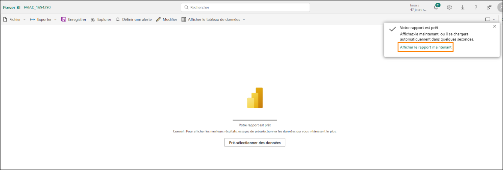

    **Point de contrôle :** vous disposez d’un état qui ressemble à la capture d’écran ci-dessous. Quelques KPI et quelques visuels de tendance sont disponibles. Il s’agit d’un bon point de départ si vous analysez un nouveau modèle.

    **Remarque :** dans le menu supérieur, notez que vous pouvez modifier l’état ou afficher certaines données sous forme de tables. N’hésitez pas à explorer ces options.

9. Enregistrons cet état. Dans le menu supérieur, cliquez sur **Enregistrer**.

10. La boîte de dialogue Enregistrer votre état s’ouvre alors. Nommez l’état **rpt_Sales_Auto_Report**.

    **Remarque :** nous ajoutons le préfixe rpt, à savoir l’abréviation du terme « report » (état) en anglais, au nom de l’état.

11. Assurez-vous que l’état est enregistré dans votre espace de travail **FAIAD_<username>.**

12. Cliquez sur **Enregistrer**.

    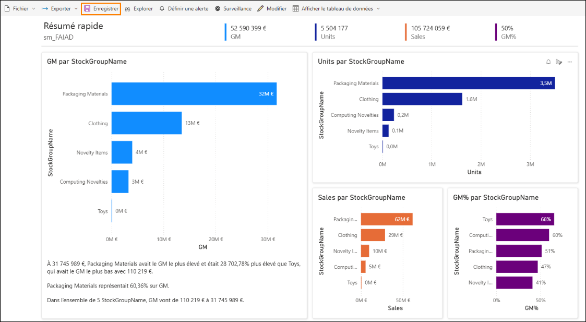

    **Remarque :** l’état créé automatiquement peut être différent pour vous, car il est « créé automatiquement ». Cela dépend également des relations et des mesures créées dans le labo précédent (Labo 6).

    La capture d’écran ci-dessus illustre à quoi **peut** ressembler l’état créé automatiquement si vous avez créé toutes les relations et mesures, y compris les relations facultatives (Labo 6).

    La capture d’écran ci-dessous illustre à quoi **peut** ressembler l’état créé automatiquement si vous n’avez pas créé les relations et mesures facultatives (Labo 6).

    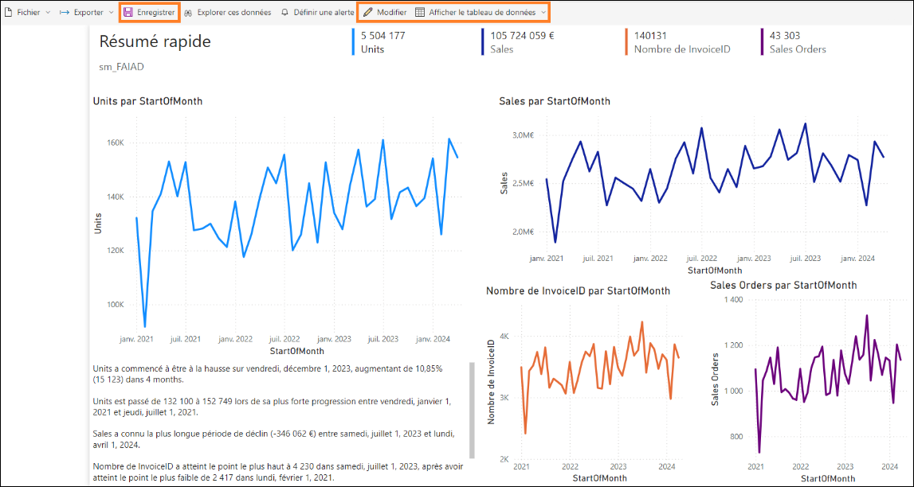

## Tâche 2 : configurer l’arrière-plan d’un nouvel état

Nous allons créer un nouvel état en utilisant un canevas vierge.

1. Dans le **panneau de gauche**, sélectionnez le nom de votre espace de travail, **FAIAD_<username>** pour naviguer dans l’espace de travail.

2. Dans le menu supérieur, cliquez sur **Nouvel élément -> Rapport.** Vous êtes alors redirigé(e) vers la page Créer votre premier état.

    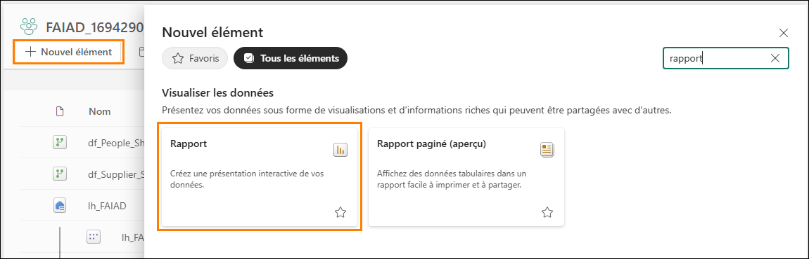

3. Sélectionnez **Choisir un modèle sémantique publié** pour pouvoir choisir le modèle que nous avons créé.

    

4. Choisissez un modèle sémantique à utiliser dans la boîte de dialogue de l’état qui s’ouvre. Sélectionnez **sm_FAIAD**.

5. Cliquez sur la **flèche en regard du bouton Créer automatiquement un état**. Vous êtes alors redirigé vers une page d’état qui ressemble à la page d’état Power BI Desktop.

    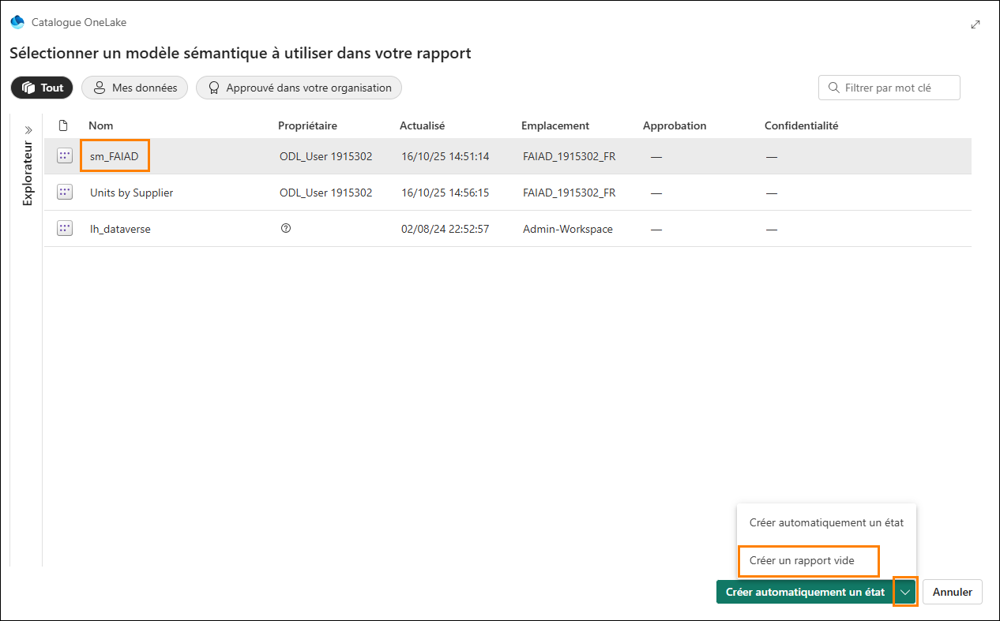

6. Si vous ne l’avez pas encore ouvert, ouvrez le fichier **FAIAD.pbix** situé dans le dossier **Reports** sur le **bureau** de votre environnement de labo.

    Cet état va nous servir de référence. Nous allons commencer par ajouter l’arrière-plan du canevas. Nous allons créer l’en-tête de l’état, ajouter quelques KPI et créer le graphique en courbes Sales over time. Pour gagner du temps et étant entendu que vous avez de l’expérience dans la création de visuels dans Power BI Desktop, nous n’allons pas créer tous les visuels.

    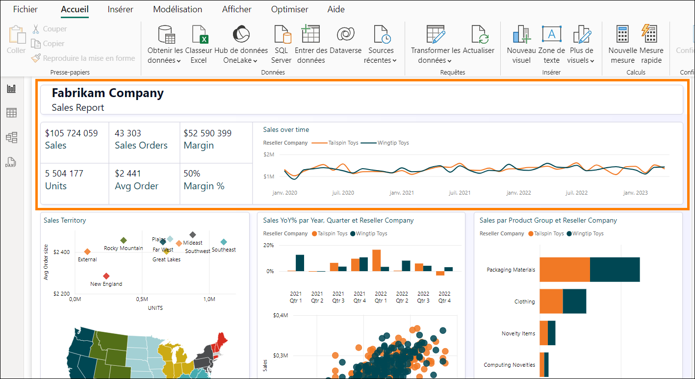

7. Revenez au **canevas Power BI** dans votre navigateur.

8. Cliquez sur l’**icône** **Mettre en forme la page** dans le volet Visualisation.

9. Développez la section **Arrière-plan du canevas**.

10. Cliquez sur **Parcourir** depuis l’option **Image**. La boîte de dialogue Explorateur de fichiers s’ouvre alors.

11. Accédez au dossier **Reports** sur le **bureau** de votre environnement de labo.

12. Sélectionnez **Summary Background.png**.

13. Définissez la liste déroulante **Ajustement de l’image** sur **Ajuster**.

14. Réglez le curseur Transparence sur **0 %**.

    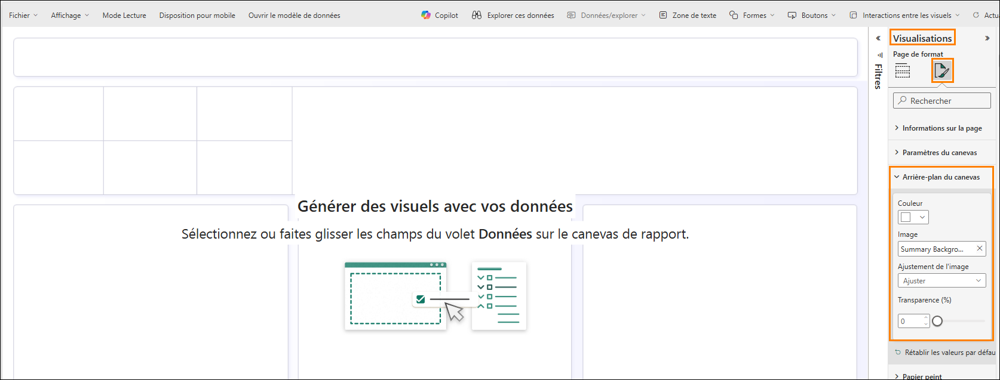

## Tâche 3 : ajouter un en-tête à l’état

1. Ajoutons l’en-tête dans la marge supérieure. Dans le **menu**, cliquez sur **Zone de texte**.

2. Saisissez **Fabrikam Company** comme première ligne de la zone de texte.

3. Saisissez **Sales Report** comme deuxième ligne de la zone de texte.

4. Mettez en surbrillance **Fabrikam Company** et définissez les champs **Police** sur **Segoe UI** et **Taille de la police** sur **18, gras**.

5. Mettez en surbrillance **État Sales** et définissez les champs **Police** sur **Segoe UI** et **Taille de la police** sur **14**.

6. Une fois la **zone de texte** sélectionnée, développez **Effets** dans le volet Format à droite.

7. Réglez le curseur **Arrière-plan** sur **Désactivé**.

8. Redimensionnez la **zone de texte pour l’adapter à la marge supérieure**.

    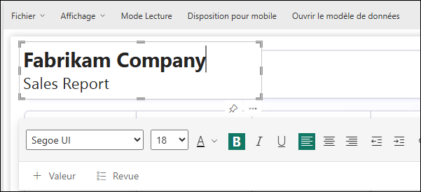

## Tâche 4 : ajouter des KPI à l’état

1. Ajoutons l’indicateur de performance clé Sales. Cliquez sur l’**espace blanc** dans le canevas pour détourner le focus de la zone de texte.

2. Dans la section **Visualisations**, cliquez sur le visuel **Carte**.

3. Dans la section **Données**, développez la **table** **Sales**.

4. Sélectionnez la mesure **Sales**.

    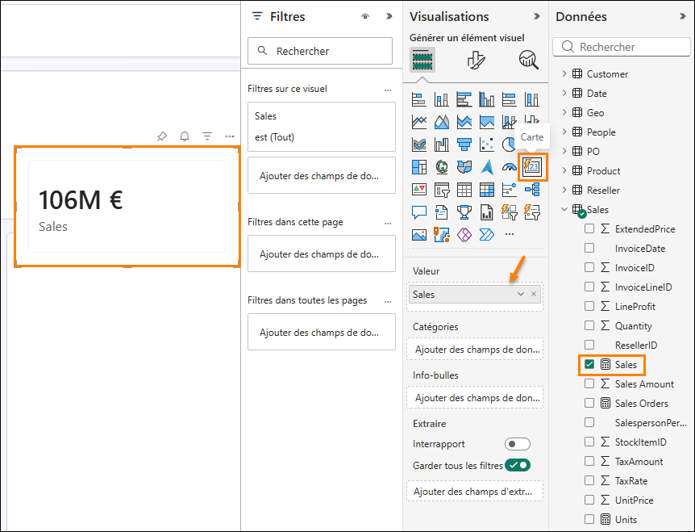

5. Une fois le visuel **Carte multiligne sélectionné**, cliquez sur l’icône **Mettre en forme le visuel** dans la section **Visualisations**.

6. Développez la section **Légende**.

7. Sélectionnez le menu déroulant **Valeur**. Modifiez la taille de la police à 12.

    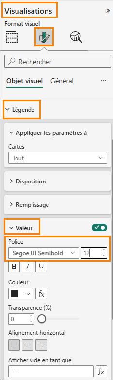

8. Avec la section **Légende** toujours sélectionnée, développez la section **Étiquette**.

9. Diminuez la **taille de la police** sur **10**.

10. Cliquez sur la **liste déroulante Couleur**. La boîte de dialogue Palette de couleurs s’ouvre alors.

11. Cliquez sur **Plus de couleurs**.

12. Définissez la valeur Hex sur **#004753**.

    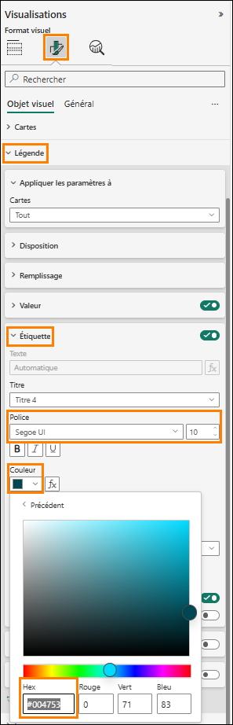

13. Développez la section **Cartes**.

14. Réglez le curseur **Barre d’accentuation** sur **Désactivé**.

    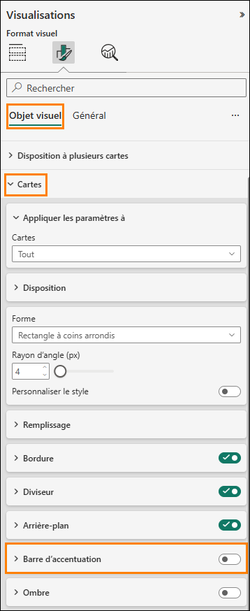

15. Cliquez sur **Général** dans le volet Visualisations.

16. Développez la section **Effets**.

17. Réglez le curseur **Arrière-plan** sur **Désactivé**.

18. Redimensionnez le **visuel** et déplacez-le vers la **case gauche, comme illustré dans la capture d’écran**.

    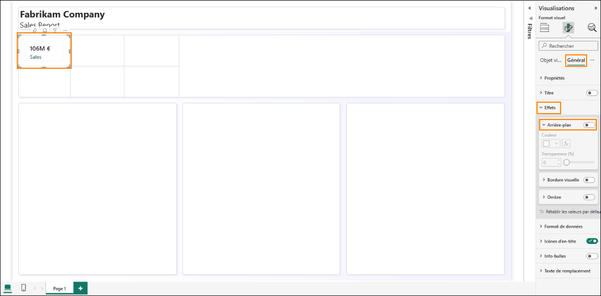

19. Ajoutons une autre carte. Sélectionnez la **carte Sales** que nous venons de créer. **Copiez** le visuel en sélectionnant **Ctrl+C** avec votre clavier.

20. **Collez** le visuel à l’aide du raccourci clavier **Ctrl + V**. Notez que le visuel est collé sur le canevas.

21. Une fois le **nouveau visuel** mis en surbrillance, supprimez la mesure **Sales** dans la section **Volet Visualisation -> Générer un élément visuel -> Champs**.

22. Dans la section **Données**, développez la table **Sales** et sélectionnez la mesure **Units**.

23. Redimensionnez le **visuel** et **placez-le dans la case située sous le visuel Sales**.

    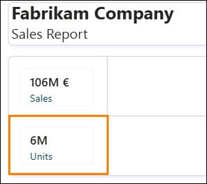

## Tâche 5 : ajouter un graphique en courbes à l’état

Créons un graphique en courbes pour visualiser Sales dans le temps par Reseller Company.

1. Cliquez sur l’**espace blanc** dans le canevas pour détourner le focus du visuel Carte multiligne.

2. Dans la **section** **Visualisations**, sélectionnez **Graphique en courbes**.

3. Dans la section **Données**, développez la table **Date**.

4. Cliquez sur le champ **Year**. Notez que le champ Year est une somme par défaut et ajouté à l’axe Y. Résolvons ce problème.

    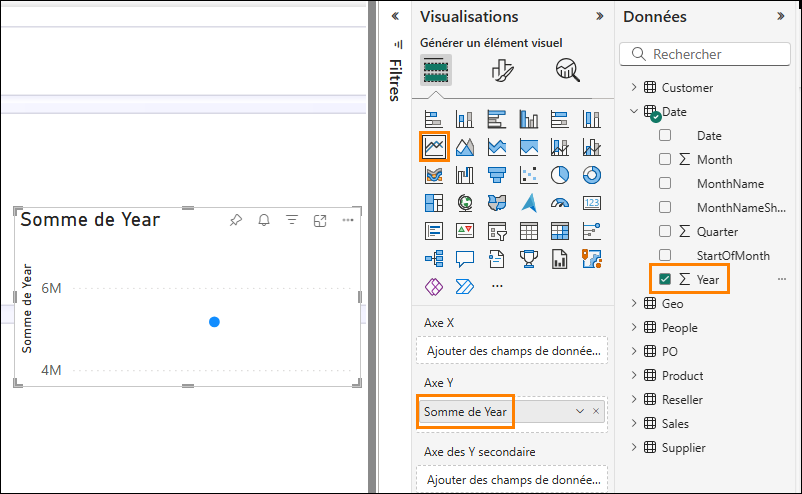

## Tâche 6 : enregistrer l’état

Nous allons enregistrer l’état avant de le quitter pour apporter des modifications au modèle.

1. Dans le menu supérieur, cliquez sur **Fichier -> Enregistrer**.

2. La boîte de dialogue Enregistrer votre état s’ouvre alors. Nommez l’état **rpt_Sales_Report**.

    **Remarque :** nous ajoutons le préfixe rpt, à savoir l’abréviation du terme « report » (état) en anglais, au nom de l’état.

3. Assurez-vous que l’état est enregistré dans l’espace de travail **FAIAD_<username>.**

4. Cliquez sur **Enregistrer**. Notez que l’état est enregistré et que vous êtes en mode Affichage.

    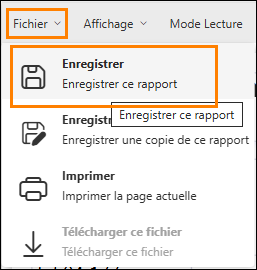

## Tâche 7 : configurer la colonne Year de la table Date

1. Dans le **menu supérieur**, cliquez sur **Modifier** pour repasser en mode Édition.

    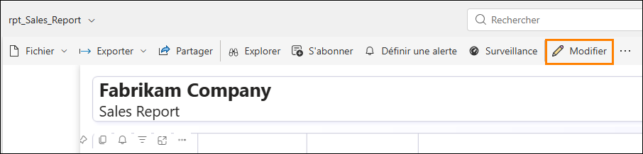

2. Dans le **menu supérieur**, sélectionnez **Ouvrir le modèle sémantique**. Notez que le modèle sémantique est ouvert dans une nouvelle fenêtre/un nouvel onglet de navigateur.

    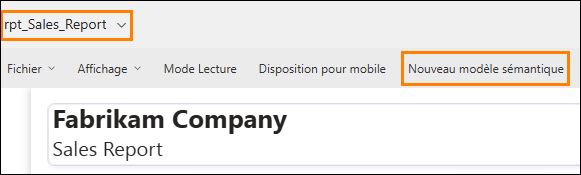

3. Dans le coin supérieur droit, passez au mode **Édition**

4. Dans le volet **Données** **à droite**, cliquez sur Tables.

5. Développez la table **Date**.

6. Cliquez sur la colonne **Year**.

7. Dans le volet **Propriétés** à gauche, développez la section **Options avancées**.

8. Dans la liste déroulante **Totaliser par**, sélectionnez **Aucun**.

    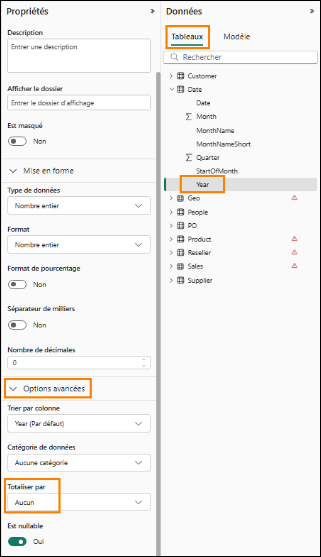

9. Revenez à **la fenêtre/l’onglet d’état** du navigateur.

10. Dans le volet **Données** à droite, développez la table **Date**. Notez que Year n’est pas un champ de somme.

11. Une fois le visuel **Graphique en courbes** sélectionné, **supprimez Somme de Year** de l’axe Y.

12. Sélectionnez le champ **Year** pour l’ajouter à l’**axe X**.

13. Développez la table **Sales** et sélectionnez la mesure **Sales**.

    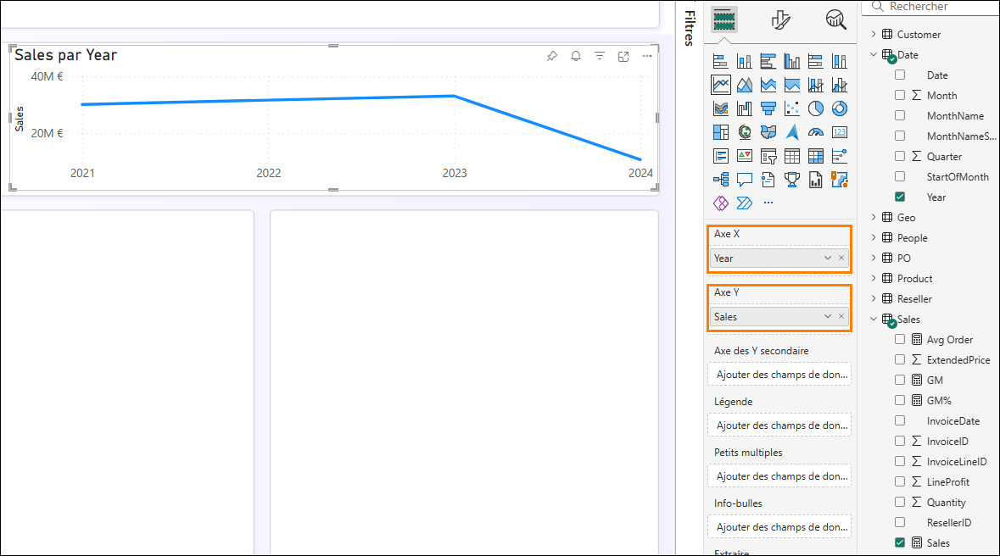

## Tâche 8 : configurer la colonne Month Name de la table Date

1. Ajoutons le mois à ce graphique. Dans la table Date, faites glisser le champ **MonthNameShort** sous **Year** sur l’**axe des X**. Notez que le visuel est trié selon Sales. Trions-le selon **MonthNameShort**.

2. Cliquez sur les **points de suspension (…)** dans le coin supérieur droit du visuel.

3. Sélectionnez **Trier axe -> Year Short_Month_Name**.

4. Cliquez sur les **points de suspension (…)** dans le coin supérieur droit du visuel.

5. Sélectionnez **Trier par -> Tri croissant**.

    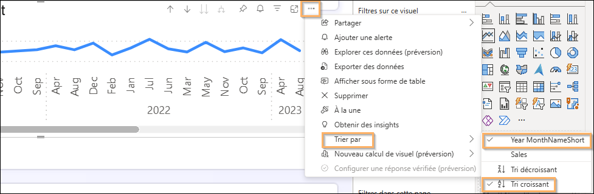

    **Remarque :** les mois sont triés par ordre alphabétique. Résolvons ce problème.

    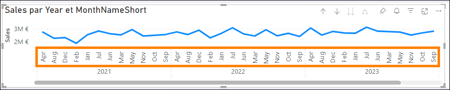

6. Revenez à **la fenêtre/l’onglet de navigateur** dans laquelle/lequel le modèle sémantique est ouvert.

7. Dans le volet **Données**, développez la table **Date**.

8. Sélectionnez la colonne **MonthNameShort**.

9. Dans le volet **Propriétés** à gauche, développez la section **Options avancées**.

10. Dans la liste déroulante **Trier par colonne**, sélectionnez **Month**.

    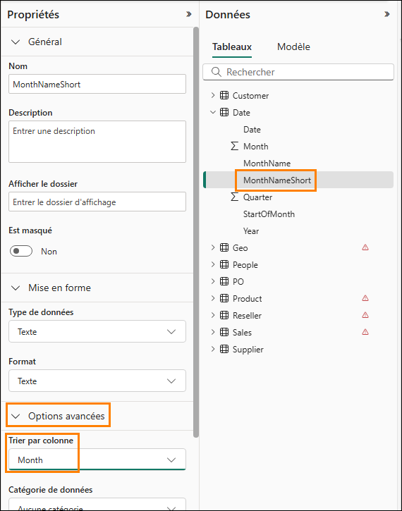

11. Revenez à **la fenêtre/l’onglet d’état** du navigateur. Notez maintenant que les mois sont triés correctement.

    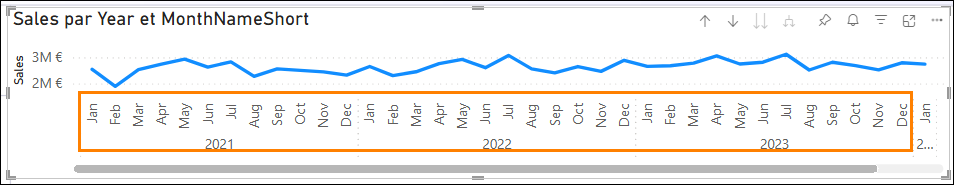

## Tâche 9 : mettre en forme le graphique en courbes

Notez à quel point il est facile de mettre à jour le modèle sémantique lors de la création des états. Cela donne des interactions fluides comme Power BI Desktop.

1. Une fois le visuel **Graphique en courbes** sélectionné, développez la table **Reseller** dans la section **Données**.

2. Faites glisser le champ **Reseller -> Reseller Company** vers la section **Légende**.

    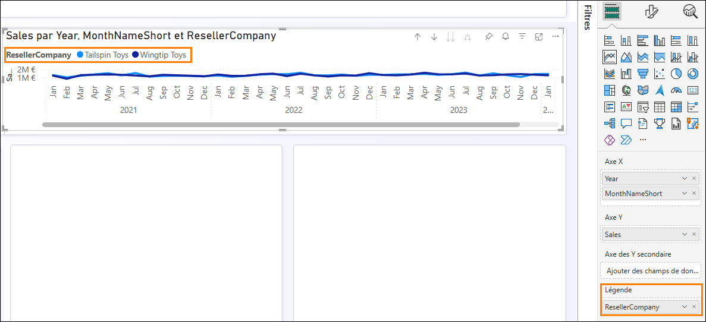

3. Une fois le visuel **Graphique en courbes** sélectionné, cliquez sur l’icône **Mettre en forme le visuel -> Général** dans la section **Visualisations**.

4. Développer la section **Titre**.

5. Définissez le texte **Titre** sur **Sales over time**.

6. Développez la section **Effets**.

7. Réglez le curseur **Arrière-plan** sur **Désactivé**.

    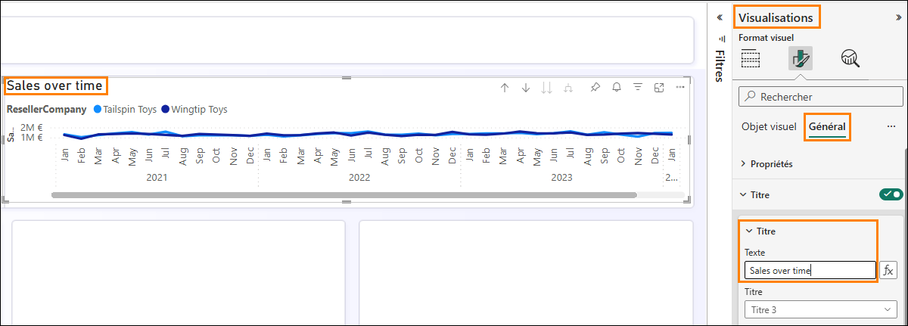

8. Dans la section **Visualisations**, cliquez sur l’icône **Mettre en forme le visuel -> Objet visuel**.

9. Développez la section **Lignes**.

10. Dans la liste déroulante **Appliquer les paramètres à -> Série,** sélectionnez **Tailspin Toys**.

11. Développez la section **Couleurs**.

12. Définissez la **couleur** sur **#F17925**.

13. Dans la liste déroulante **Appliquer les paramètres à -> Série,** sélectionnez **Wingtip Toys**.

14. Définissez la **couleur** sur **#004753**.

15. Redimensionnez le **visuel** et déplacez-le vers la **case supérieure droite, comme illustré dans la capture d’écran**.

16. Faites défiler le visuel vers la droite et **notez que nous disposons de données jusqu’en avril 2024**.

    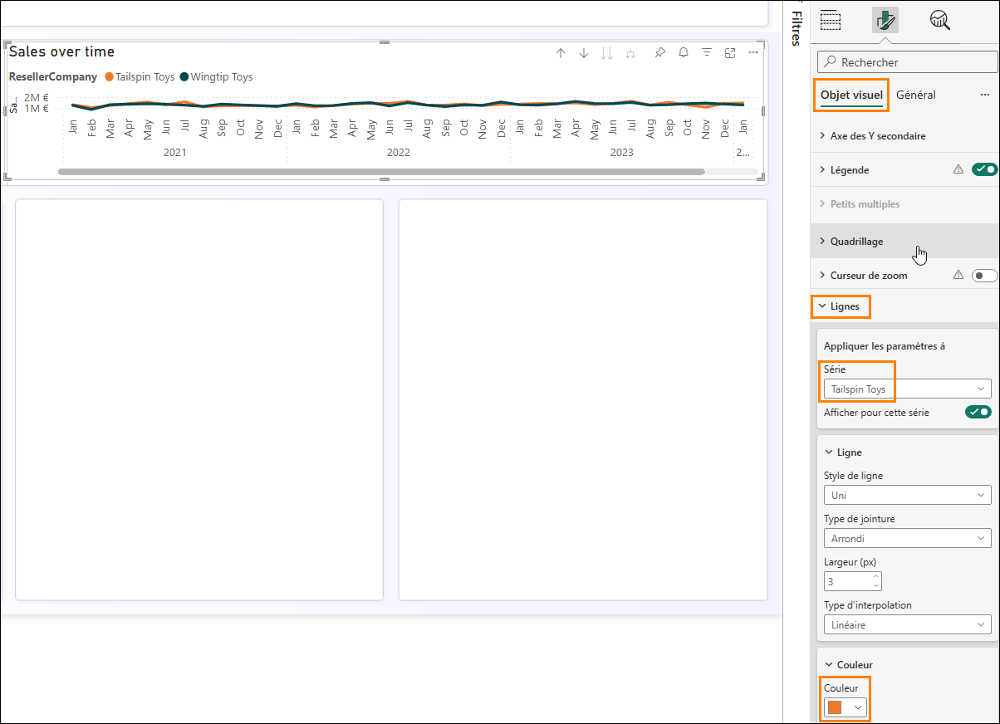

17. Enregistrons l’état en sélectionnant **Fichier -> Enregistrer** dans le menu.

    Comme indiqué précédemment, nous n’allons pas créer tous les visuels dans ce labo. À votre guise, n’hésitez pas à créer d’autres visuels.

## Tâche 10 : connecter Power BI Desktop au modèle sémantique

Voyons maintenant à quel point il est facile de connecter Power BI Desktop au modèle sémantique et de créer des visuels.

1. Ouvrez le fichier **FAIADTemplate.pbix** situé dans le dossier **Reports** sur le **bureau** de votre environnement de labo.

2. Dans le ruban, cliquez sur **Accueil -> Catalogue OneLake -> Modèles sémantiques Power BI**.

    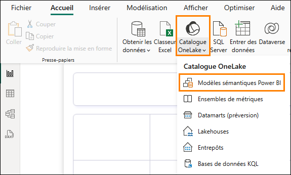

3. La boîte de dialogue Hub de données OneLake s’ouvre alors. Sélectionnez **sm_FAIAD**, le modèle sémantique que nous avons créé.

4. Cliquez sur **Connexion**. Notez que les tables du modèle sémantique se trouvent dans le volet Données.

    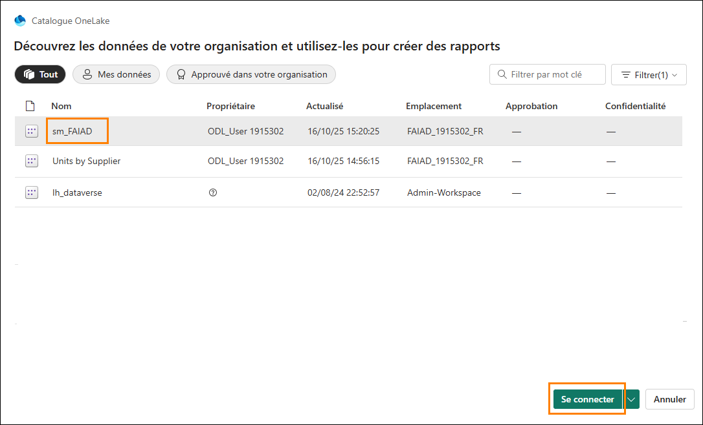

5. Dans le **volet gauche**, cliquez sur **Vue Modèle**. Notez que nous pouvons visualiser la relation entre les tables.

    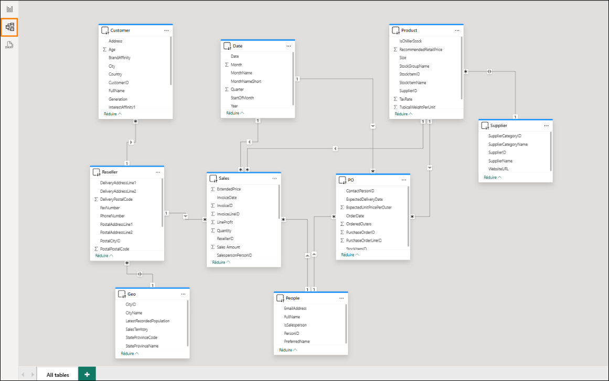

6. Dans le **volet gauche**, cliquez sur **Vue État** pour revenir à la vue État.

7. Si vous ne l’avez pas encore fait, ouvrez le fichier **FAIAD.pbix** situé dans le dossier **Reports** sur le **bureau** de votre environnement de labo.

8. Sélectionnez le **visuel Titre d’état**.

9. Dans le ruban, cliquez sur **Accueil -> Copier**.

    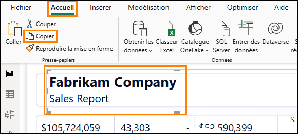

10. Accédez à **FAIADTemplate.pbix** et cliquez sur le canevas d’état.

11. Dans le ruban, cliquez sur **Accueil -> Coller**.

    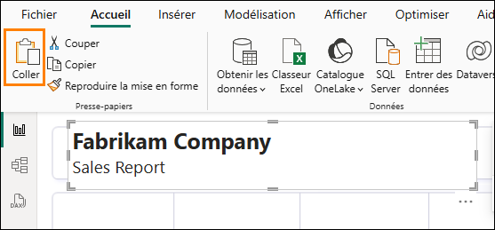

12. De même, copiez-collez les **KPI Sales et Units**. Pour votre information, plusieurs visuels peuvent être copiés-collés ensemble.

    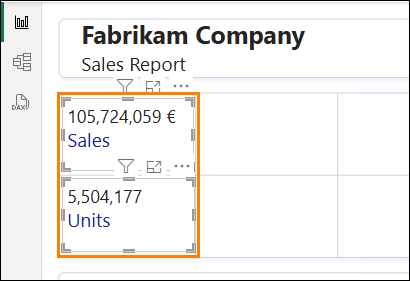

    Notez qu’il est facile de copier les visuels d’un état existant et de les coller dans un état qui se connecte au modèle sémantique. Notez que les noms de table, les noms de colonne et les noms de mesure doivent être identiques afin que le copier-coller fonctionne. S’ils ne sont pas identiques, vous pouvez avoir une erreur, mais elle peut être facilement corrigée.

13. Accédez à **FAIAD.pbix** et sélectionnez le graphique en courbes Sales over time.

14. Dans le ruban, cliquez sur **Accueil -> Copier**.

15. Accédez à **FAIADTemplate.pbix** et cliquez sur le canevas d’état.

16. Dans le ruban, cliquez sur **Accueil -> Coller**. Notez que le visuel ne s’affiche pas. En effet, à l’heure actuelle, le modèle sémantique ne crée pas de hiérarchie à partir du champ de date.

17. Résolvons ce problème. Dans le volet **Visualisation**, sous l’**axe des X**, supprimez **StartOfMonth**.

    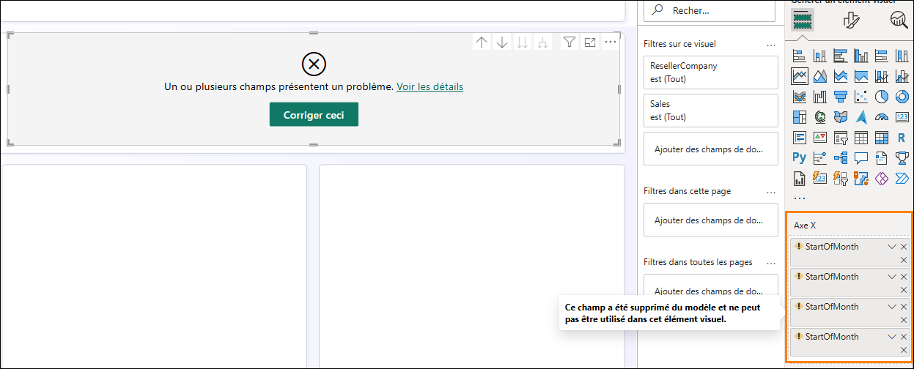

18. Dans le volet **Données**, développez la table **Date**.

19. Faites glisser le champ **StartOfMonth** sur l’**axe des X**. Cela corrige le visuel. Vous devrez peut-être mettre en forme le visuel.

    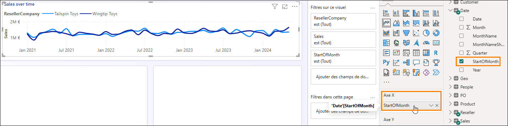

20. Enregistrons l’état en cliquant sur **Fichier -> Enregistrer** dans le ruban.

## Tâche 11 : ajouter de nouvelles données pour simuler le mode Direct Lake

En général, en mode Import, une fois les données de la source actualisées, nous devons actualiser le modèle Power BI après quoi les données de l’état sont mises à jour. Avec le mode Direct Query, une fois les données actualisées dans la source, elles sont disponibles dans l’état Power BI. Cependant, le mode Direct Query est généralement lent. Pour résoudre ce problème, Microsoft Fabric a introduit le mode Direct Lake. Direct Lake est un moyen rapide de charger les données du lac directement dans le moteur Power BI, prêtes à l’analyse.

Explorons le scénario dans lequel les données sont mises à jour dans la source ADLS Gen2 et les modifications sont immédiatement reflétées dans l’état Power BI sans exécuter d’actualisation.

Dans un scénario réel, les données sont mises à jour à la source. Puisque nous sommes dans un environnement de formation, nous allons simuler cela. Nous avons des données Sales jusqu’en avril 2024. Ajoutons les données Sales de mai 2024 en créant un raccourci vers le fichier de mai 2024 dans ADLS Gen2 et en mettant à jour la vue Sales.

1. Revenez au **navigateur**.

2. Dans le coin inférieur droit, cliquez sur le **logo Fabric** et passez à la **vue Fabric**.

3. Cliquez sur **FAIAD_<username>** dans la barre de menus gauche pour accéder à la page d’accueil de l’espace de travail.

4. Cliquez sur **lh_FAIAD** pour accéder au lakehouse.

    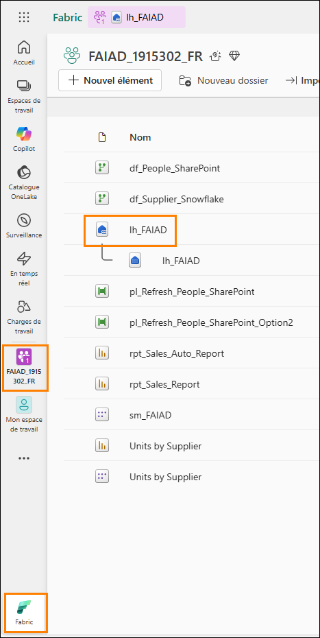

5. Dans le volet **Explorateur** à gauche, cliquez sur les **points de suspension** en regard de **Tables**.

6. Cliquez sur **Nouveau raccourci**.

    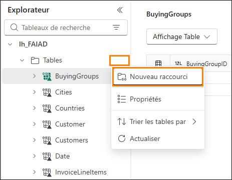

7. La boîte de dialogue Nouveau raccourci s’ouvre alors. Sous **Sources externes**, sélectionnez **Azure Data Lake Storage Gen2**.

    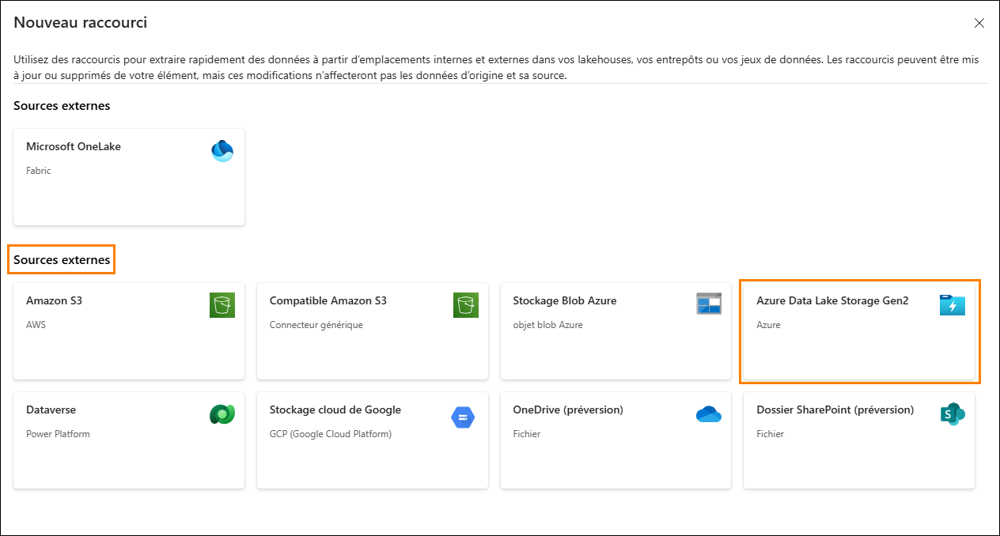

8. Comme vous avez créé une connexion plus tôt dans les labos, vous n’avez pas besoin d’en créer une nouvelle ; votre connexion ADLS apparaît sous Connexions existantes.

9. Si vous n’avez pas encore créé cette connexion, cliquez sur **Créer une connexion** et procédez comme suit :

10. Sous **Paramètres de connexion -> URL**, saisissez ce lien : <https://stvnextblobstorage.dfs.core.windows.net/fabrikam-sales>.

11. Cliquez sur **Suivant**.

    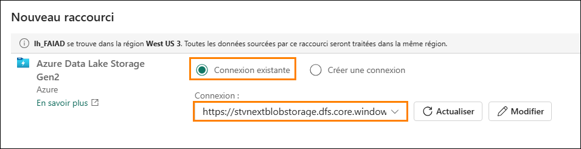

12. Vous êtes alors connecté à ADLS Gen2 avec la structure de répertoires s’affichant dans le volet gauche. Développez **Delta-Parquet-Format-FY25**.

13. Sélectionnez **Sales.Invoices_May**.

14. Cliquez sur **Suivant**.

    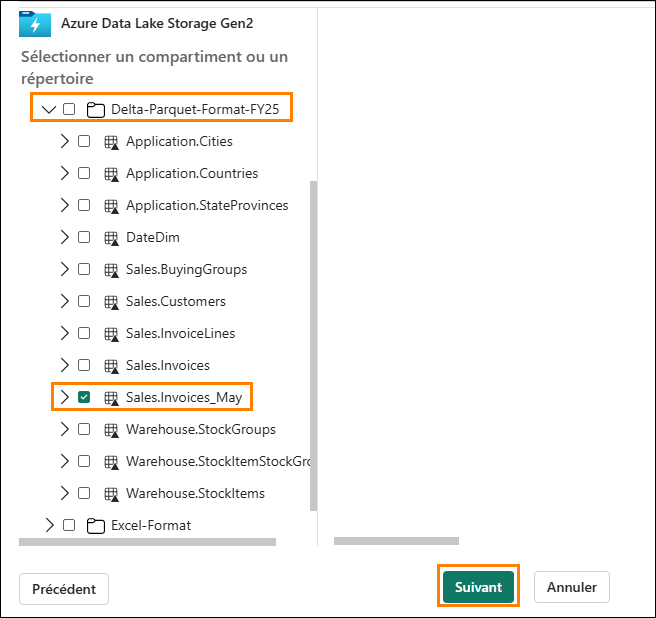

15. Vous êtes alors redirigé vers la boîte de dialogue suivante dans laquelle nous pouvons modifier les noms. Cliquez sur l’**icône Modifier** sous Actions pour **Sales.Invoices_May**.

16. Redéfinissez le nom de **Sales.Invoices_May sur InvoicesMay**.

17. Cliquez sur la **coche** en regard du nom pour enregistrer la modification.

18. Cliquez sur **Créer**.

    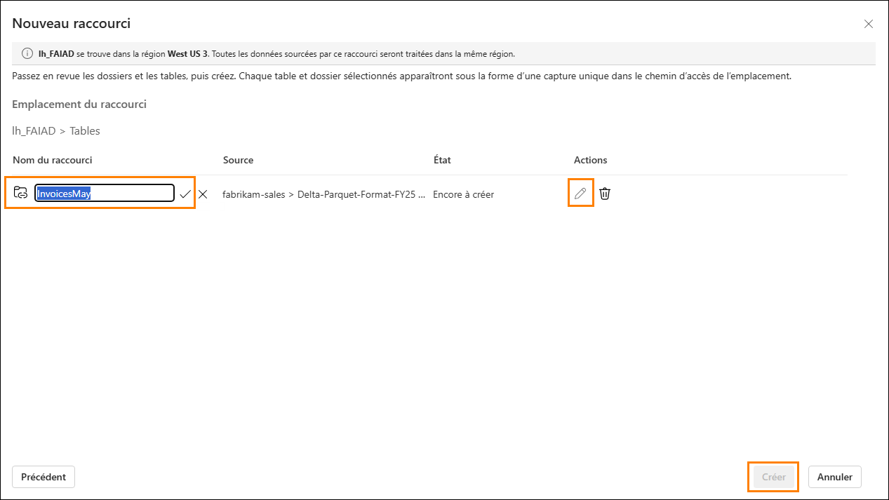

    Notez que la table InvoicesMay se trouve désormais dans le **volet Explorateur** à gauche. Nous devons maintenant mettre à jour la vue Sales.

19. En **haut** de l’écran à droite, cliquez sur **Lakehouse -> Point de terminaison analytique SQL**.

    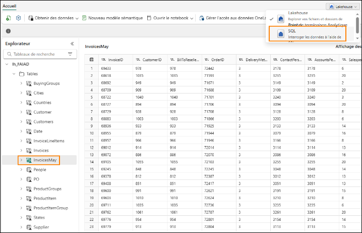

20. Dans le menu supérieur, cliquez sur **Accueil -> Nouvelle requête SQL**. Un volet de nouvelle requête SQL s’ouvre alors.

21. **Copiez** le code ci-dessous et **collez**-le dans le volet de requête SQL.

    ```sql
    ALTER VIEW [dbo].[Sales] AS (
    select [$Outer].[InvoiceLineID] as [InvoiceLineID],
        [$Outer].[InvoiceID] as [InvoiceID],
        [$Outer].[StockItemID] as [StockItemID],
        [$Outer].[Quantity] as [Quantity],
        [$Outer].[UnitPrice] as [UnitPrice],
        [$Outer].[TaxRate] as [TaxRate],
        [$Outer].[TaxAmount] as [TaxAmount],
        [$Outer].[LineProfit] as [LineProfit],
        [$Outer].[ExtendedPrice] as [ExtendedPrice],
        [$Outer].[CustomerID] as [ResellerID],
        [$Outer].[SalespersonPersonID] as [SalespersonPersonID],
        [$Outer].[InvoiceDate] as [InvoiceDate],
        [$Outer].[t0_0] as [Sales Amount]
    from 
    (
        select [_].[InvoiceLineID] as [InvoiceLineID],
            [_].[InvoiceID] as [InvoiceID],
            [_].[StockItemID] as [StockItemID],
            [_].[Quantity] as [Quantity],
            [_].[UnitPrice] as [UnitPrice],
            [_].[TaxRate] as [TaxRate],
            [_].[TaxAmount] as [TaxAmount],
            [_].[LineProfit] as [LineProfit],
            [_].[ExtendedPrice] as [ExtendedPrice],
            [_].[CustomerID] as [CustomerID],
            [_].[SalespersonPersonID] as [SalespersonPersonID],
            [_].[InvoiceDate] as [InvoiceDate],
            [_].[ExtendedPrice] - [_].[TaxAmount] as [t0_0]
        from 
        (
            select [$Outer].[InvoiceLineID],
                [$Outer].[InvoiceID],
                [$Outer].[StockItemID],
                [$Outer].[Quantity],
                [$Outer].[UnitPrice],
                [$Outer].[TaxRate],
                [$Outer].[TaxAmount],
                [$Outer].[LineProfit],
                [$Outer].[ExtendedPrice],
                [$Inner].[CustomerID],
                [$Inner].[SalespersonPersonID],
                [$Inner].[InvoiceDate]
            from [lh_FAIAD].[dbo].[InvoiceLineItems] as [$Outer]
            inner join 
            (
                select [_].[InvoiceID] as [InvoiceID2],
                    [_].[CustomerID] as [CustomerID],
                    [_].[BillToResellerID] as [BillToResellerID],
                    [_].[OrderID] as [OrderID],
                    [_].[DeliveryMethodID] as [DeliveryMethodID],
                    [_].[ContactPersonID] as [ContactPersonID],
                    [_].[AccountsPersonID] as [AccountsPersonID],
                    [_].[SalespersonPersonID] as [SalespersonPersonID],
                    [_].[PackedByPersonID] as [PackedByPersonID],
                    [_].[InvoiceDate] as [InvoiceDate],
                    [_].[CustomerPurchaseOrderNumber] as [CustomerPurchaseOrderNumber],
                    [_].[IsCreditNote] as [IsCreditNote],
                    [_].[CreditNoteReason] as [CreditNoteReason],
                    [_].[Comments] as [Comments],
                    [_].[DeliveryInstructions] as [DeliveryInstructions],
                    [_].[InternalComments] as [InternalComments],
                    [_].[TotalDryItems] as [TotalDryItems],
                    [_].[TotalChillerItems] as [TotalChillerItems],
                    [_].[DeliveryRun] as [DeliveryRun],
                    [_].[RunPosition] as [RunPosition],
                    [_].[ReturnedDeliveryData] as [ReturnedDeliveryData],
                    [_].[ConfirmedDeliveryTime] as [ConfirmedDeliveryTime],
                    [_].[ConfirmedReceivedBy] as [ConfirmedReceivedBy],
                    [_].[LastEditedBy] as [LastEditedBy2],
                    [_].[LastEditedWhen] as [LastEditedWhen2]
                from 
                (
                    select [$Table].[InvoiceID] as [InvoiceID],
                        [$Table].[CustomerID] as [CustomerID],
                        [$Table].[BillToResellerID] as [BillToResellerID],
                        [$Table].[OrderID] as [OrderID],
                        [$Table].[DeliveryMethodID] as [DeliveryMethodID],
                        [$Table].[ContactPersonID] as [ContactPersonID],
                        [$Table].[AccountsPersonID] as [AccountsPersonID],
                        [$Table].[SalespersonPersonID] as [SalespersonPersonID],
                        [$Table].[PackedByPersonID] as [PackedByPersonID],
                        [$Table].[InvoiceDate] as [InvoiceDate],
                        [$Table].[CustomerPurchaseOrderNumber] as [CustomerPurchaseOrderNumber],
                        [$Table].[IsCreditNote] as [IsCreditNote],
                        [$Table].[CreditNoteReason] as [CreditNoteReason],
                        [$Table].[Comments] as [Comments],
                        [$Table].[DeliveryInstructions] as [DeliveryInstructions],
                        [$Table].[InternalComments] as [InternalComments],
                        [$Table].[TotalDryItems] as [TotalDryItems],
                        [$Table].[TotalChillerItems] as [TotalChillerItems],
                        [$Table].[DeliveryRun] as [DeliveryRun],
                        [$Table].[RunPosition] as [RunPosition],
                        [$Table].[ReturnedDeliveryData] as [ReturnedDeliveryData],
                        [$Table].[ConfirmedDeliveryTime] as [ConfirmedDeliveryTime],
                        [$Table].[ConfirmedReceivedBy] as [ConfirmedReceivedBy],
                        [$Table].[LastEditedBy] as [LastEditedBy],
                        [$Table].[LastEditedWhen] as [LastEditedWhen]
                    from [lh_FAIAD].[dbo].[Invoices] as [$Table]
                    union all select [$Table].[InvoiceID] as [InvoiceID],
                        [$Table].[CustomerID] as [CustomerID],
                        [$Table].[BillToResellerID] as [BillToResellerID],
                        [$Table].[OrderID] as [OrderID],
                        [$Table].[DeliveryMethodID] as [DeliveryMethodID],
                        [$Table].[ContactPersonID] as [ContactPersonID],
                        [$Table].[AccountsPersonID] as [AccountsPersonID],
                        [$Table].[SalespersonPersonID] as [SalespersonPersonID],
                        [$Table].[PackedByPersonID] as [PackedByPersonID],
                        [$Table].[InvoiceDate] as [InvoiceDate],
                        [$Table].[CustomerPurchaseOrderNumber] as [CustomerPurchaseOrderNumber],
                        [$Table].[IsCreditNote] as [IsCreditNote],
                        [$Table].[CreditNoteReason] as [CreditNoteReason],
                        [$Table].[Comments] as [Comments],
                        [$Table].[DeliveryInstructions] as [DeliveryInstructions],
                        [$Table].[InternalComments] as [InternalComments],
                        [$Table].[TotalDryItems] as [TotalDryItems],
                        [$Table].[TotalChillerItems] as [TotalChillerItems],
                        [$Table].[DeliveryRun] as [DeliveryRun],
                        [$Table].[RunPosition] as [RunPosition],
                        [$Table].[ReturnedDeliveryData] as [ReturnedDeliveryData],
                        [$Table].[ConfirmedDeliveryTime] as [ConfirmedDeliveryTime],
                        [$Table].[ConfirmedReceivedBy] as [ConfirmedReceivedBy],
                        [$Table].[LastEditedBy] as [LastEditedBy],
                        [$Table].[LastEditedWhen] as [LastEditedWhen]
                    from [lh_FAIAD].[dbo].[InvoicesMay] as [$Table]
                ) as [_]
            ) as [$Inner] on ([$Outer].[InvoiceID] = [$Inner].[InvoiceID2] or [$Outer].[InvoiceID] is null and [$Inner].[InvoiceID2] is null)
        ) as [_]
    ) as [$Outer]
    where exists 
    (
        select 1
        from 
        (
            select [ResellerID]
            from [lh_FAIAD].[dbo].[Reseller] as [$Table]
        ) as [$Inner]
        where [$Outer].[CustomerID] = [$Inner].[ResellerID] or [$Outer].[CustomerID] is null and [$Inner].[ResellerID] is null
    )
    )
    ```

22. Dans le menu de requête visuelle, cliquez sur **Exécuter** pour exécuter le code.

    Une fois le code exécuté, nous avons mis à jour la table Sales pour y inclure les données de mai 2024.

    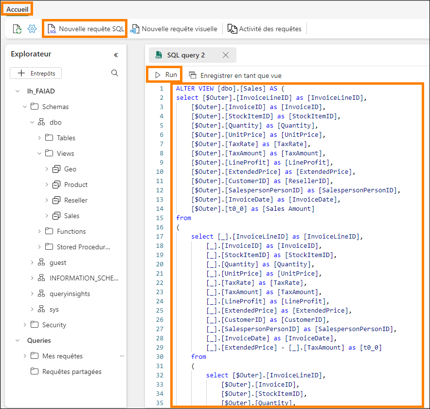

23. Cliquez sur **rpt_Sales_Report** dans la barre de menu de gauche pour revenir à l’état.

24. Dans le menu supérieur, sélectionnez **l’icône Actualiser**. Notez maintenant que le graphique en courbes comporte des données pour mai 2024. Notez également que le montant des ventes a augmenté.

    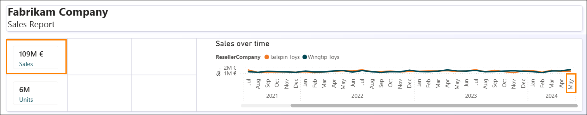

    Nous n’avons pas besoin d’actualiser le modèle de données et de signaler la modification de données. Voilà l’avantage de Direct Lake et de DirectQuery.

    Revenons sur les défis répertoriés dans l’énoncé du problème :

    - **Vous devez actualiser votre jeu de données au moins trois fois par jour pour tenir compte des différentes heures de mise à jour des différentes sources de données.**

    Nous avons résolu ce problème à l’aide de Direct Lake. Chaque flux de données individuel est actualisé selon son calendrier. Les jeux de données et les états n’ont pas besoin d’être actualisés.

    - **Vos opérations d’actualisation prennent beaucoup de temps, car vous devez effectuer chaque fois une actualisation complète pour capturer toutes les mises à jour survenues sur les systèmes sources.**

    Encore une fois, nous avons résolu ce problème à l’aide de Direct Lake. Chaque flux de données individuel est actualisé selon son calendrier. Les jeux de données et les états n’ont pas besoin d’être actualisés, donc nous n’avons pas à nous soucier d’une actualisation complète.

    - **Toute erreur dans l’une des sources de données à partir desquelles vous extrayez des données entraîne une interruption de l’actualisation de votre jeu de données. Il arrive souvent que le fichier collaborateur ne soit pas chargé à temps, ce qui aboutit à une interruption de l’actualisation de votre jeu de données.**

    Les pipelines permettent de résoudre ce problème, en rendant possible une actualisation en cas d’échec et à différents intervalles.

    - **Apporter des modifications à votre modèle de données prend beaucoup de temps, car Power Query en prend beaucoup pour actualiser vos aperçus, compte tenu du gros volume de données et des transformations complexes.**

    Nous avons remarqué que les flux de données et les lakehouses sont efficaces et faciles à modifier. En général, le chargement de l’aperçu dans les flux de données et le lakehouse ne prend pas beaucoup de temps.

    - **Vous avez besoin d’un PC Windows pour utiliser Power BI Desktop, même si le standard de l’entreprise est Mac.**

    Microsoft Fabric est une offre SaaS. Il nous suffit d’un navigateur pour accéder au service. Nous n’avons pas besoin d’installer de logiciel sur nos bureaux.

# Nettoyer l’environnement de labo

Une fois que vous êtes prêt à nettoyer l’environnement de labo, procédez comme suit :

1. Sélectionnez l’espace de travail **FAIAD_<username>** à partir du panneau de gauche pour naviguer vers la page d’accueil de l’espace de travail.

2. Dans le menu supérieur, cliquez sur **Paramètres de l’espace de travail**.

    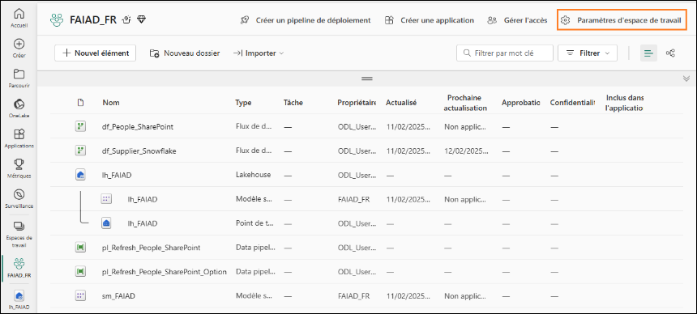

3. La boîte de dialogue Paramètres d’espace de travail s’ouvre alors. Dans la section **Général**, faites défiler vers le bas.

4. Cliquez sur **Supprimer cet espace de travail**.

5. La boîte de dialogue Supprimer l’espace de travail s’ouvre alors. Cliquez sur **Supprimer**.

    L’espace de travail et tous les éléments qu’il comporte sont alors supprimés.

    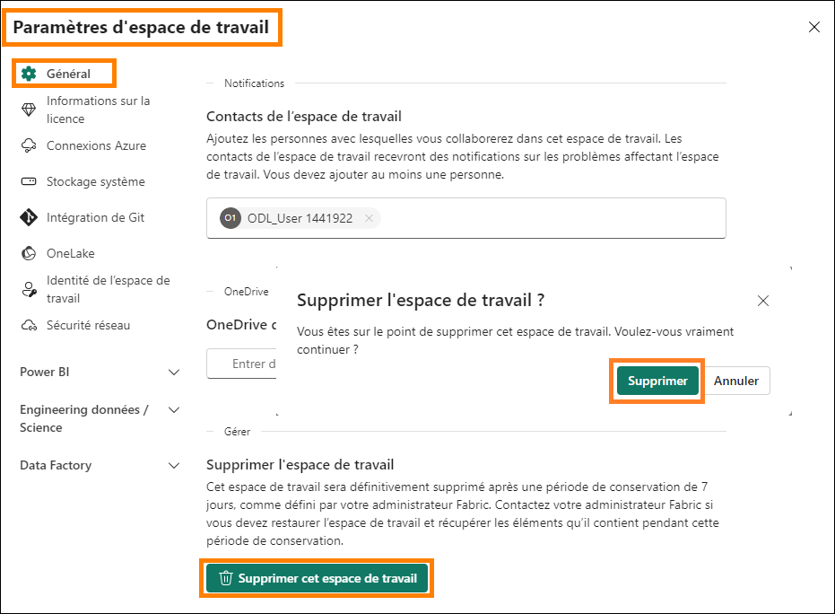

# Références

Fabric Analyst in a Day (FAIAD) vous présente certaines des fonctions clés de Microsoft Fabric. Dans le menu du service, la section Aide (?) comporte des liens vers d’excellentes ressources.


Voici quelques autres ressources qui vous aideront lors de vos prochaines étapes avec Microsoft Fabric :

- Consultez le billet de blog pour lire l’intégralité de l’[annonce de la GA de Microsoft Fabric](https://aka.ms/Fabric-Hero-Blog-Ignite23).

- Explorez Fabric grâce à la [visite guidée](https://aka.ms/Fabric-GuidedTour).

- Inscrivez-vous pour bénéficier d’un [essai gratuit de Microsoft Fabric](https://aka.ms/try-fabric).

- Rendez-vous sur le [site web Microsoft Fabric](https://aka.ms/microsoft-fabric).

- Acquérez de nouvelles compétences en explorant les [modules d’apprentissage Fabric](https://aka.ms/learn-fabric).

- Explorez la [documentation technique Fabric](https://aka.ms/fabric-docs).

- Lisez le [livre électronique gratuit sur la prise en main de Fabric](https://aka.ms/fabric-get-started-ebook).

- Rejoignez la [communauté Fabric](https://aka.ms/fabric-community) pour publier vos questions, partager vos commentaires et apprendre des autres.

Lisez les blogs d’annonces plus détaillés sur l’expérience Fabric :

- [Blog Expérience Data Factory dans Fabric](https://aka.ms/Fabric-Data-Factory-Blog)

- [Blog Expérience Synapse Data Engineering dans Fabric](https://aka.ms/Fabric-DE-Blog)

- [Blog Expérience Synapse Data Science dans Fabric](https://aka.ms/Fabric-DS-Blog)

- [Blog Expérience Synapse Data Warehousing dans Fabric](https://aka.ms/Fabric-DW-Blog)

- [Blog Expérience Synapse Real-Time Analytics dans Fabric](https://aka.ms/Fabric-RTA-Blog)

- [Blog Annonce Power BI](https://aka.ms/Fabric-PBI-Blog)

- [Blog Expérience Data Activator dans Fabric](https://aka.ms/Fabric-DA-Blog)

- [Blog Administration et gouvernance dans Fabric](https://aka.ms/Fabric-Admin-Gov-Blog)

- [Blog OneLake dans Fabric](https://aka.ms/Fabric-OneLake-Blog)

- [Blog Intégration de Dataverse et Microsoft Fabric](https://aka.ms/Dataverse-Fabric-Blog)

© 2026 Microsoft Corporation. Tous droits réservés.

En effectuant cette démonstration/ce labo, vous acceptez les conditions suivantes :

La technologie/fonctionnalité décrite dans cette démonstration/ces travaux pratiques est fournie par Microsoft Corporation en vue d’obtenir vos commentaires et de vous fournir une expérience d’apprentissage. Vous pouvez utiliser cette démonstration/ces ateliers uniquement pour évaluer ces technologies et fonctionnalités, et pour fournir des commentaires à Microsoft. Vous ne pouvez pas l’utiliser à d’autres fins. Vous ne pouvez pas modifier, copier, distribuer, transmettre, afficher, effectuer, reproduire, publier, accorder une licence, créer des œuvres dérivées, transférer ou vendre tout ou une partie de cette démonstration/ces ateliers.

LA COPIE OU LA REPRODUCTION DE CETTE DÉMONSTRATION/CES TRAVAUX PRATIQUES (OU DE TOUTE PARTIE DE CEUX-CI) SUR TOUT AUTRE SERVEUR OU AUTRE EMPLACEMENT EN VUE D’UNE AUTRE REPRODUCTION OU REDISTRIBUTION EST EXPRESSÉMENT INTERDITE.

CETTE DÉMONSTRATION/CES TRAVAUX PRATIQUES FOURNISSENT CERTAINES FONCTIONNALITÉS DE PRODUIT/TECHNOLOGIES LOGICIELLES, NOTAMMENT D’ÉVENTUELS NOUVEAUX CONCEPTS ET FONCTIONNALITÉS, DANS UN ENVIRONNEMENT SIMULÉ SANS INSTALLATION OU CONFIGURATION COMPLEXE AUX FINS DÉCRITES CI-DESSUS. LES TECHNOLOGIES/CONCEPTS REPRÉSENTÉS DANS CETTE DÉMONSTRATION/CES TRAVAUX PRATIQUES PEUVENT NE PAS REPRÉSENTER LES FONCTIONNALITÉS COMPLÈTES ET PEUVENT NE PAS FONCTIONNER DE LA MÊME MANIÈRE QUE DANS UNE VERSION FINALE. IL EST ÉGALEMENT POSSIBLE QUE NOUS NE PUBLIIONS PAS DE VERSION FINALE DE CES FONCTIONNALITÉS OU CONCEPTS. VOTRE EXPÉRIENCE D’UTILISATION DE CES FONCTIONNALITÉS DANS UN ENVIRONNEMENT PHYSIQUE PEUT ÉGALEMENT ÊTRE DIFFÉRENTE.

**COMMENTAIRES.** Si vous envoyez des commentaires sur les fonctionnalités, technologies et/ou concepts décrits dans ces ateliers/cette démonstration à Microsoft, vous accordez à Microsoft, sans frais, le droit d’utiliser, de partager et de commercialiser vos commentaires de quelque manière et à quelque fin que ce soit. Vous accordez également à des tiers, sans frais, les droits de brevet nécessaires pour leurs produits, technologies et services en vue de l’utilisation ou de l’interface avec des parties spécifiques d’un logiciel ou d’un service Microsoft incluant les commentaires. Vous n’enverrez pas de commentaires soumis à une licence exigeant que Microsoft accorde une licence pour son logiciel ou sa documentation à des tiers du fait que nous y incluons vos commentaires. Ces droits survivent à ce contrat.

MICROSOFT CORPORATION DÉCLINE TOUTES LES GARANTIES ET CONDITIONS EN CE QUI CONCERNE CETTE DÉMONSTRATION/CES TRAVAUX PRATIQUES, Y COMPRIS TOUTES LES GARANTIES ET CONDITIONS DE QUALITÉ MARCHANDE, QU’ELLES SOIENT EXPLICITES, IMPLICITES OU LÉGALES, D’ADÉQUATION À UN USAGE PARTICULIER, DE TITRE ET D’ABSENCE DE CONTREFAÇON. MICROSOFT N’OFFRE AUCUNE GARANTIE OU REPRÉSENTATION EN CE QUI CONCERNE LA PRÉCISION DES RÉSULTATS, LA CONSÉQUENCE QUI DÉCOULE DE L’UTILISATION DE CETTE DÉMONSTRATION/CES ATELIERS, OU L’ADÉQUATION DES INFORMATIONS CONTENUES DANS CETTE DÉMONSTRATION/CES ATELIERS À QUELQUE FIN QUE CE SOIT.

**CLAUSE D’EXCLUSION DE RESPONSABILITÉ**

Cette démonstration/Ce labo comporte seulement une partie des nouvelles fonctionnalités et améliorations disponibles dans Microsoft Power BI. Certaines fonctionnalités sont susceptibles de schanger dans les versions ultérieures du produit. Dans ce labo/cette démonstration, vous allez découvrir comment utiliser certaines nouvelles fonctionnalités, mais pas toutes.
