## Microsoft Fabric - Fabric Analyst in a Day - Übung 2

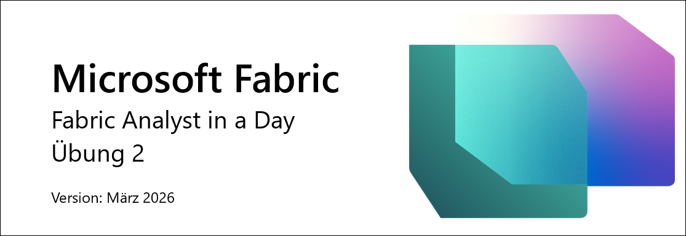

# Inhalt

- Einführung

- Fabric-Lizenz

    - Aufgabe 1: Lizenz für Testversion von Microsoft Fabric aktivieren

- Fabric-Arbeitsbereich

    - Aufgabe 2: Fabric-Arbeitsbereich erstellen

    - Aufgabe 3: Lakehouse erstellen

- Übersicht über die Funktionsbereiche in Fabric

    - Aufgabe 4: Data Factory-Funktionsbereich

    - Aufgabe 5: Industry Solutions-Funktionsbereich

    - Aufgabe 6: Real-Time Intelligence-Funktionsbereich

    - Aufgabe 7: Data Engineering-Funktionsbereich

    - Aufgabe 8: Data Science-Funktionsbereich

    - Aufgabe 9: Data Warehouse-Funktionsbereich

    - Aufgabe 10: Datenbanken-Funktionsbereich

- Referenzen

# Einführung

Heute geht es um die verschiedenen Hauptfunktionen von Microsoft Fabric. In diesem Einführungsworkshop werden die verschiedenen Funktionsbereiche und Bestandteile von Fabric vorgestellt. Am Ende des Workshops erfahren Sie zudem, wie Sie Lakehouse, Dataflow Gen2, Pipeline, DirectLake und mehr verwenden.

Am Ende dieser Übung haben Sie Folgendes gelernt:

- Wie Sie einen Fabric-Arbeitsbereich erstellen

- Wie Sie ein Lakehouse erstellen

# Fabric-Lizenz

## Aufgabe 1: Lizenz für Testversion von Microsoft Fabric aktivieren
1. Wählen Sie **Power BI-Portal** auf dem Desktop des virtuellen Computers aus. Sie werden möglicherweise aufgefordert, sich anzumelden.

    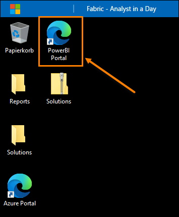

    > **Hinweis:** Gegebenenfalls werden Sie automatisch angemeldet, wenn Sie die Übungsumgebung verwenden.*

    > **Hinweis:** Wenn Fabric nicht geöffnet wird, navigieren Sie im Browser zu http://app.fabric.microsoft.com/.*

2. Kopieren Sie den Benutzernamen, fügen Sie ihn im Feld „E-Mail“ des Dialogfelds ein, und wählen Sie „Senden“ aus.

    - **E-Mail/Benutzername:** <inject key="AzureAdUserEmail"></inject>

        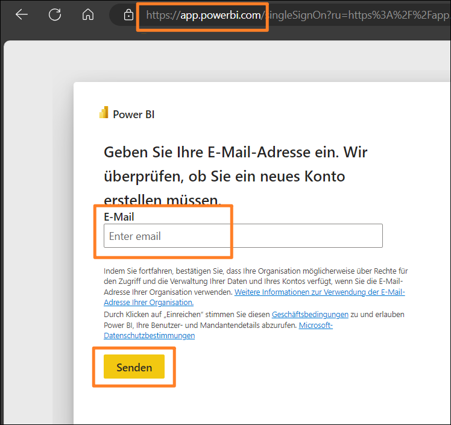

3. Auf der Registerkarte **Bei Microsoft Azure anmelden** sehen Sie den Anmeldebildschirm, in dem Sie folgenden **EmailUsername** eingeben und dann auf **Weiter** klicken.

    - **E-Mail/Benutzername:** <inject key="AzureAdUserEmail"></inject>

        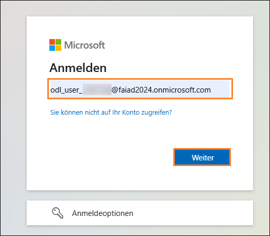

4. Geben Sie nun den folgenden **befristeten Zugriffspass** ein, und klicken Sie auf **Anmelden**.

    - **Befristeter Zugriffspass:** <inject key="AzureAdUserPassword"></inject>

        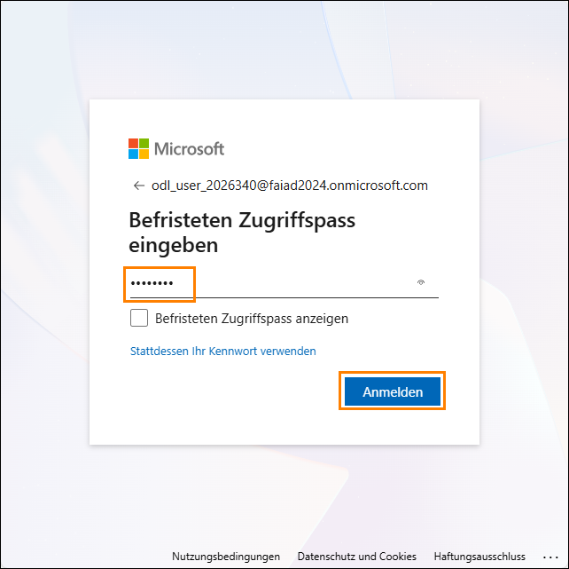

5. Sie werden zur bereits bekannten **Startseite des Power BI-Dienstes** geleitet.

6. Es wird angenommen, dass Ihnen der Aufbau des Power BI-Dienstes bekannt ist. Bei Fragen wenden Sie sich einfach an die Kursleitung.

    Sie befinden sich jetzt in **Mein Arbeitsbereich**. Wenn Sie mit Fabric-Elementen arbeiten möchten, benötigen Sie eine Testlizenz und einen Arbeitsbereich mit einer zugewiesenen Fabric-Lizenz. Lassen Sie uns das einrichten.

7. Klicken Sie oben rechts im Bildschirm auf das **Benutzersymbol**.

8. Wählen Sie **Kostenlose Testversion** aus.

    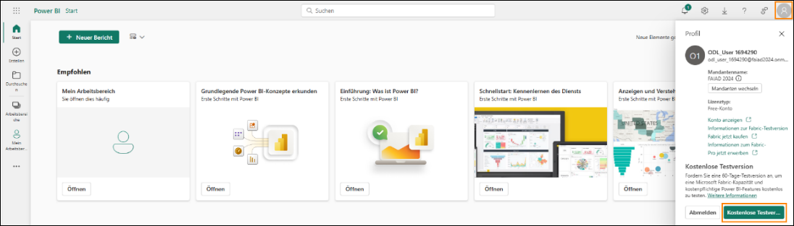

9. Das Dialogfeld „Upgrade auf eine kostenlose Testversion von Microsoft Fabric“ wird geöffnet. Wählen Sie **Aktivieren** aus.

    > **Hinweis:** Ändern Sie nicht die Standardregion. Lassen Sie sie unverändert.

    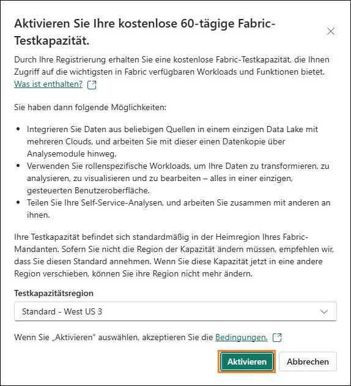

10. Das Dialogfeld „Erfolgreiches Upgrade auf Microsoft Fabric“ wird geöffnet. Wählen Sie **Fabric Home Page** aus.

    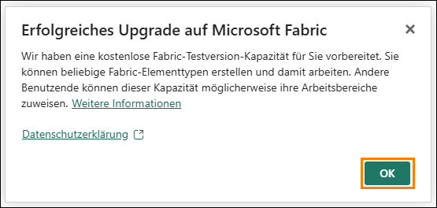

11. Sie werden zur **Startseite von Microsoft Fabric** geleitet. Möglicherweise öffnet sich das Dialogfeld „Willkommen zur Fabric-Ansicht“. Sie können entweder **Tour starten** oder **Abbrechen **auswählen.

    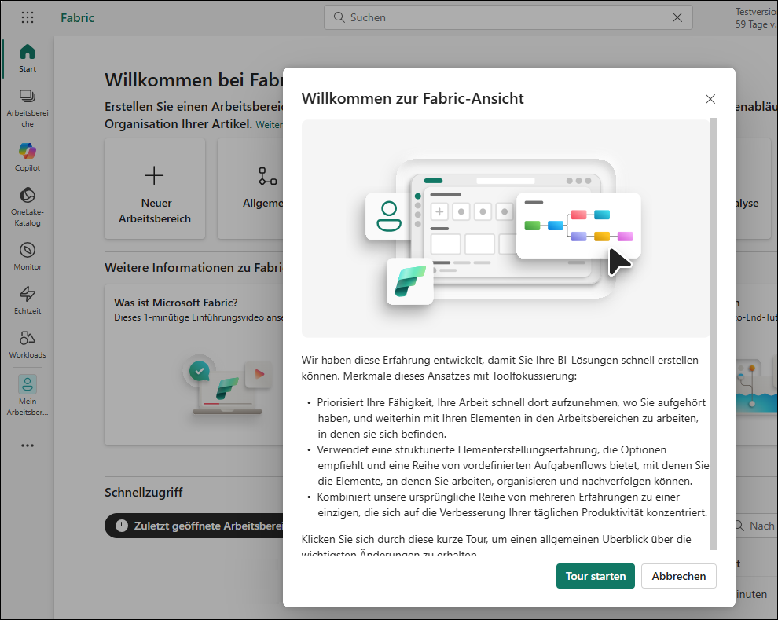

# Fabric-Arbeitsbereich

## Aufgabe 2: Fabric-Arbeitsbereich erstellen

1. Erstellen wir jetzt einen Arbeitsbereich mit einer Fabric-Lizenz. Wählen Sie in der Navigationsleiste links die Option **Arbeitsbereiche** aus. Ein Dialogfeld wird geöffnet.

2. Klicken Sie auf **+ Neuer Arbeitsbereich** unten im Popup-Menü.

    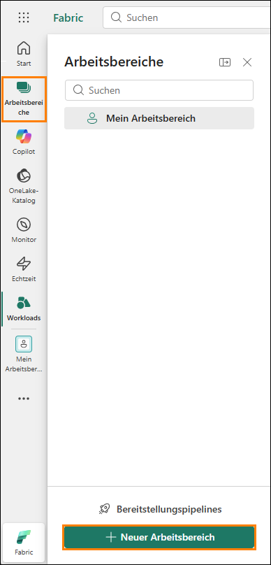

3. Rechts im Browser wird das Dialogfeld **Arbeitsbereich erstellen** geöffnet.

4. Geben Sie im Feld **Name** „ **FAIAD_<inject key="Deployment ID" enableCopy="false"/>** “ ein (Sie finden diese auf der Registerkarte „Umgebung“).
    > **Hinweis:** Der Name des Arbeitsbereichs muss eindeutig sein. Achten Sie darauf, dass unter dem Feld für den Namen ein grünes Häkchen mit dem Text „Dieser Name ist verfügbar“ zu sehen ist.

5. Wenn Sie möchten, können Sie eine Beschreibung des Arbeitsbereichs eingeben. Dieses Feld ist optional.

6. Klicken Sie auf **Erweitert**, um den Abschnitt zu erweitern.

    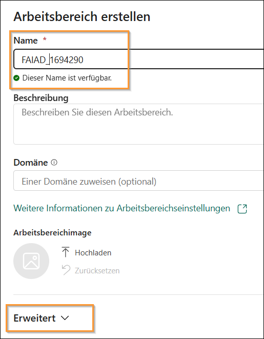

7. Überprüfen Sie unter **Lizenzmodus**, dass die Option **Testversion** ausgewählt ist. (Standardmäßig ist dies der Fall.)

8. Erstellen Sie den neuen Arbeitsbereich durch Klicken auf **Übernehmen**.

    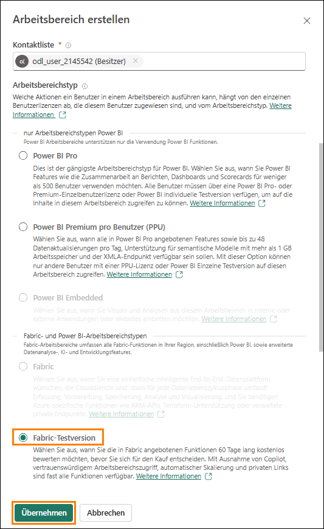

    Sie werden zu Ihrem neu erstellten Arbeitsbereich weitergeleitet. Als Nächstes importieren wir Daten aus verschiedenen Quellen in ein Lakehouse, entwickeln damit ein Modell und nutzen die Daten für Berichte. Erstellen wir zunächst ein Lakehouse. Wir werden dies im nächsten Schritt erledigen.

## Aufgabe 3: Lakehouse erstellen

1. Suchen Sie im neu erstellten Arbeitsbereich **FAIAD_<inject key="Deployment ID" enableCopy="false"/>** im linken Navigationsbereich die Schaltfläche **+ Neues Element (1)**. Hier können Sie neue Elemente in Ihrem Arbeitsbereich erstellen.

2. Geben Sie im Suchfeld **Lakehouse (2)** ein, und wählen Sie in den Suchergebnissen die Option **Lakehouse (3)** aus. Auf diese Weise können Sie ein neues Lakehouse erstellen, um Ihre Big Data zu speichern, abzufragen und zu verwalten.

    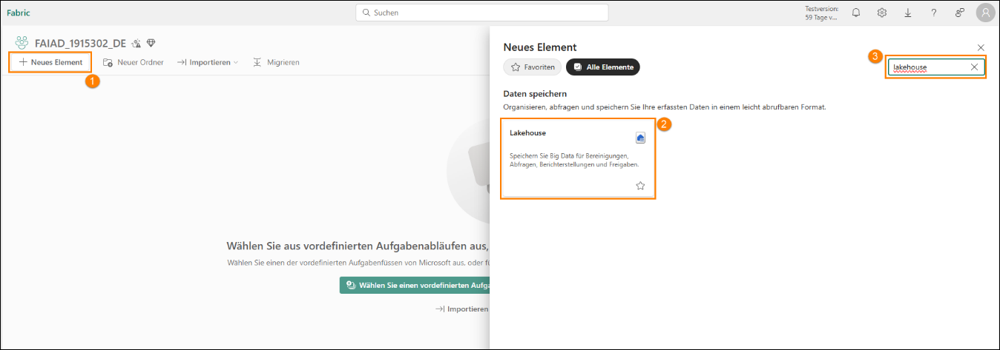

3. Das Dialogfeld „Neu: Lakehouse“ wird angezeigt. Geben Sie **lh_FAIAD** in das Textfeld „Name“ ein.

    > **Hinweis:** „lh“ bezieht sich hier auf Lakehouse. Die Buchstaben „lh“ werden vorangestellt, damit das Lakehouse leichter erkannt und gefunden werden kann. 
    
    >***Hinweis:** Diese Funktion befindet sich nicht mehr in der Vorschauversion, **muss aber dennoch nicht aktiviert werden**.*

4. Wählen Sie **Erstellen** aus.

    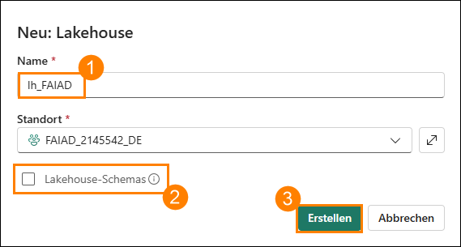

    Das Lakehouse wird innerhalb kurzer Zeit erstellt, und Sie werden zur Lakehouse-Explorer-Oberfläche weitergeleitet. Oben links neben dem Fabric-Namen in der Kopfzeile befindet sich das Lakehouse-Symbol. Das Arbeitsbereichssymbol in der linken Navigationsleiste zeigt an, dass jetzt ein Element enthalten ist.
    
    Im Lakehouse-Explorer sehen Sie den Abschnitt „Tabellen und Dateien“. In einem Lakehouse können im Abschnitt mit den Dateien auch Dateien von Azure Data Lake Storage Gen2 stehen, oder mit einem Dataflow können Daten in Lakehouse-Tabellen geladen werden. Es stehen mehrere Möglichkeiten zur Auswahl. In den folgenden Übungen werden einige dieser Möglichkeiten vorgestellt.

    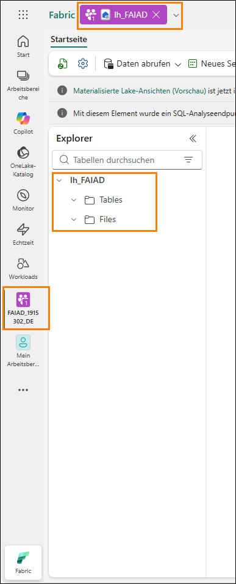

# Übersicht über die Funktionsbereiche in Fabric

## Aufgabe 4: Data Factory-Funktionsbereich

1. Wählen Sie links das Workloads-Symbol aus. Ein Dialogfeld mit einer Liste der Funktionsbereiche von Fabric wird geöffnet. Die Liste der Funktionsbereiche umfasst Power BI, Data Factory, Industry Solutions, Real-Time Intelligence, Data Engineering, Data Science und Data Warehouse. Untersuchen wir dies genauer .

    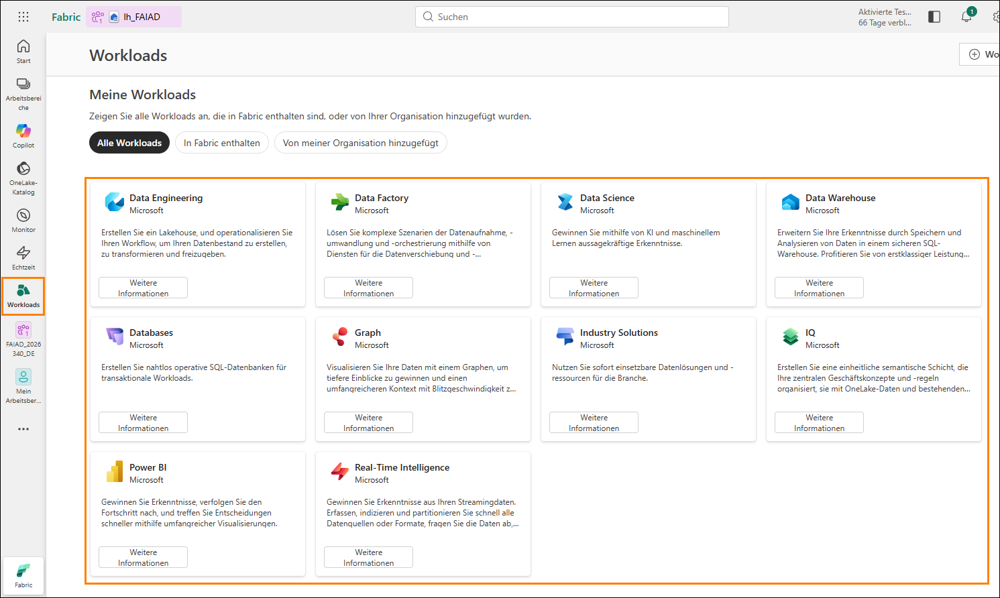

2. Wählen Sie **Data Factory** aus.

    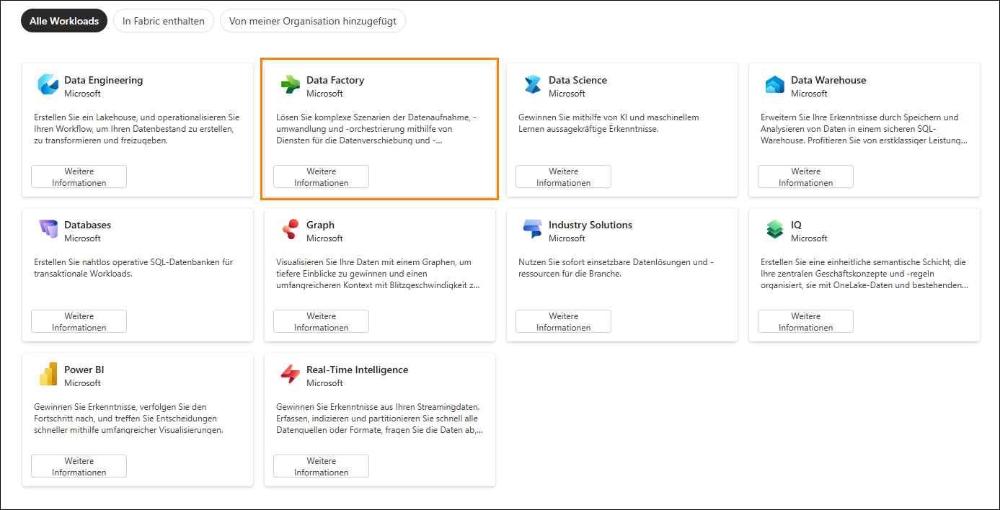

3. Sie werden zur Data Factory-Startseite weitergeleitet. Im Folgenden finden Sie eine ausführliche Erläuterung der Abschnitte, die Sie Schritt für Schritt durch eine effektive Verwendung von Data Factory leitet. Dataflow Gen2 ist die nächste Generation von Dataflow.

    **Was ist Data Factory?** 
    
    Data Factory hilft Ihnen dabei, Daten aus verschiedenen Quellen zu verwalten und zu organisieren. Es ermöglicht Ihnen, Daten zu sammeln, aufzubereiten und zu transformieren, um sie effektiv einsetzen zu können. Egal, ob Sie neu einsteigen oder bereits viel Erfahrung mitbringen, Data Factory stellt Ihnen Tools zu Verfügung, mit denen Sie die Datentransformation einfacher und effizienter gestalten können. 
    
    **Elementtypen:**

    a. **Dataflow Gen2:** Dataflows sind wie Rezepte zum Transformieren von Daten. Sie bieten über 300 verschiedene Transformationen, die Sie auf Ihre Daten anwenden können. Dies bedeutet, dass Sie Ihre Daten auf vielfältige Weise bereinigen, kombinieren und ändern können, um sie ganz an Ihre Anforderungen anzupassen.

    b. **Pipeline:** Pipelines sind Workflows, mit denen Sie Ihre Datenprozesse automatisieren können. Sie ermöglichen es Ihnen, flexible Daten-Workflows zu erstellen, die auf Ihre speziellen Anforderungen zugeschnitten werden können. Das erleichtert es, Daten strukturiert zu verwalten und zu verarbeiten.

    c.  **Azure Data Factory:** Azure Data Factory ist ein cloudbasierter Datenintegrationsdienst, mit dem Sie datengesteuerte Workflows zur Orchestrierung und Automatisierung von Datenverschiebungen und Datentransformationen erstellen können.

    d.  **Apache Airflow -Auftrag:** Apache Airflow ist eine Open-Source-Plattform, die für das programmgesteuerte Erstellen, Planen und Überwachen von Workflows verwendet wird. In Data Factory können Sie damit komplexe Datenworkflows erstellen, planen und verwalten.

    e.  **Kopierauftrag:** Mit der Funktion „Kopierauftrag“ können Sie Daten von einer Quelle in eine andere kopieren. Sie bietet eine einfache und effiziente Möglichkeit, Daten zwischen verschiedenen Datenspeichern zu verschieben.

    f. **Gespiegelte Datenbank:** eine Funktion zum Erstellen gespiegelter Versionen von Datenbanken für Sicherungen, Tests oder schreibgeschützten Zugriff.

    g. **Gespiegeltes SAP:** Integrieren Sie Ihre vorhandene SAP-Umgebung nahtlos in den Rest Ihrer Daten in Fabric.

    h. **Gespiegeltes Oracle (Vorschauversion):** Durch die Spiegelung in Fabric werden Ihre Oracle-Datenbanken auf eine einheitliche Plattform repliziert, was Analysen neben anderen Datenquellen in Quasi-Echtzeit und mit geringer Latenz ermöglicht.

    i. **Gespiegeltes Google BigQuery (Vorschauversion):** Durch die Spiegelung in Fabric können Sie Google BigQuery-Daten kontinuierlich in OneLake replizieren, was komplexe ETL-Vorgänge beseitigt und eine nahtlose Verwendung in Bereichen wie Analyse, KI und Datenfreigabe ermöglicht.

    j. **Variablenbibliothek:** Enthält eine Liste von Variablen und ihren Standardwerten. Sie kann auch andere Wertesätze mit alternativen Werten enthalten.

    k. **dbt-Auftrag (Vorschauversion):** ermöglicht es Ihnen, dbt zu verwenden und Daten mit SQL in eine vertraute Umgebung zu transformieren.

    **Erste Schritte:** 
    
    Sie können folgende Schritte ausführen, um mit Data Factory loszulegen:

    a. **Verwenden von Data Factory:** Dieser Abschnitt hilft Ihnen beim Einstieg in Data Factory. Er zeigt Ihnen, wie Sie das Tool effektiv verwenden können.

    b. **Erstellen Sie Ihren ersten Dataflow:** Hier erfahren Sie, wie Sie Ihren ersten Dataflow erstellen. Dataflows sind unerlässlich, um Ihre Daten entsprechend Ihren Anforderungen zu transformieren.

    c. **Erstellen Sie Ihre erste Pipeline:** In diesem Abschnitt erfahren Sie, wie Sie Ihre erste Pipeline erstellen. Pipelines helfen Ihnen dabei, Ihre Datenprozesse effizient zu automatisieren und zu verwalten.

    d. **Informationen zum Überwachen von Data Factory:** Die Überwachung ist entscheidend, um sicherzustellen, dass Ihre Datenprozesse reibungslos ablaufen. In diesem Abschnitt erfahren Sie, wie Sie Ihre Data Factory-Aktivitäten überwachen.

    e. **Daten mit Dataflows transformieren:** In diesem Abschnitt erfahren Sie, wie Sie Dataflows verwenden, um Ihre Daten effektiv zu transformieren.

    f. **Erste API für GraphQL erstellen:** Wenn Sie APIs mit GraphQL verwenden möchten, finden Sie in diesem Abschnitt Informationen zu den ersten Schritten.

    g. **Erste Benutzerdatenfunktionen erstellen:** In diesem Abschnitt erfahren Sie, wie Sie Benutzerdatenfunktionen erstellen, die zum Verwalten und Transformieren von Benutzerdaten nützlich sind.

    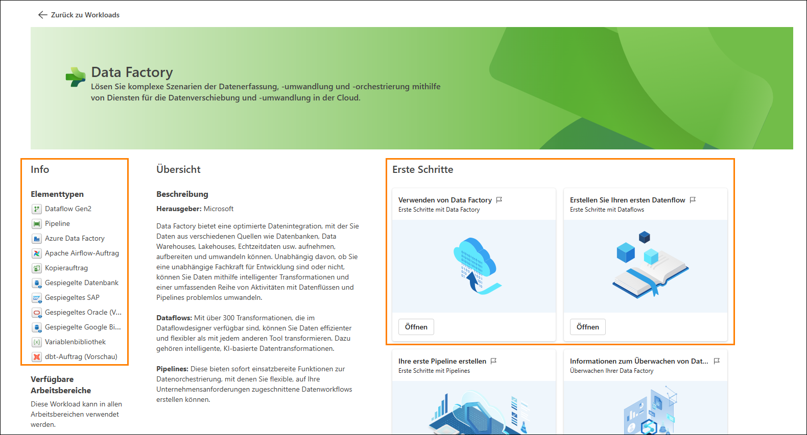

4. Klicken Sie in der oberen linken Ecke des Bildschirms auf **Zurück zu Workloads**. Auf diese Weise gelangen Sie zur Workloads-Hauptseite, auf der Sie andere Tools oder Abschnitte erkunden können.

    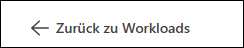

## Aufgabe 5: Industry Solutions-Funktionsbereich

1. Klicken Sie auf der Seite **Workloads** auf **Industry Solutions**, um fortzufahren.

    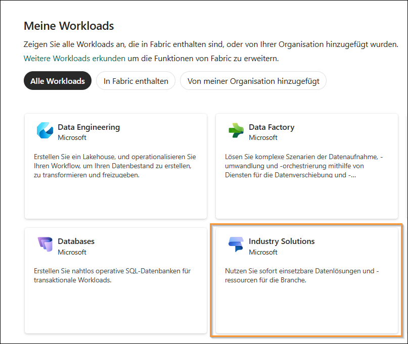

2. Sie werden zur Startseite von Industry Solutions weitergeleitet. Nachfolgend finden Sie eine detaillierte Übersicht über die Abschnitte, die Ihnen helfen sollen, Industry Solutions effektiv und Schritt für Schritt zu nutzen.

    **Was ist Industry Solutions?**

    Industry Solutions sind einsatzbereite Datenlösungen in Microsoft Fabric, die Lösungen und Ressourcen für verschiedene Branchen bereitstellen. Industry Solutions unterstützt Sie beim Einstieg in wichtige Geschäftsszenarien mit branchenbezogenen Datenmodellen, Konnektoren, Transformationen, Berichten und anderen Anlagen.

    **Elementtypen:**

    a. **Nachhaltigkeitslösungen** unterstützen die Erfassung, Standardisierung und Analyse von Umwelt-, Sozial- und Governance-Daten (ESG).

    b. **Lösungen für den Einzelhandel** helfen bei der Verwaltung großer Datenmengen, der Integration von Daten aus verschiedenen Quellen und der Bereitstellung von Echtzeitanalysen für eine schnelle Entscheidungsfindung. Einzelhändler können diese Lösungen zur Bestandsoptimierung, Kundensegmentierung, Umsatzprognose, dynamischen Preisgestaltung und Betrugserkennung nutzen.

    c. **Datenlösungen für das Gesundheitswesen** sind strategisch darauf ausgelegt, die Zeit bis zur Wertschöpfung für die Kunden zu verkürzen, indem die kritische Notwendigkeit der effizienten Umwandlung von Daten aus dem Gesundheitswesen in ein geeignetes Format für die Analyse erfüllt wird.

    **Hinweis:** Einige Lösungen werden Ihnen möglicherweise nicht angezeigt.

    **Erste Schritte** Sie können folgende Schritte ausführen, um mit Industry Solutions loszulegen:

    d. **Mehr über Datenlösungen für das Gesundheitswesen erfahren**: Klicken Sie auf die Schaltfläche „Weitere Informationen“, um mehr über Datenlösungen für das Gesundheitswesen zu erfahren und zu verstehen, wie Sie diese in Ihren Projekten einsetzen können.

   e. **Erste Schritte mit Datenlösungen für das Gesundheitswesen:** Beginnen Sie mit der Bereitstellung von Datenlösungen für das Gesundheitswesen, und implementieren Sie sie in Ihre Projekte.

    f. **Mehr über Nachhaltigkeitslösungen erfahren**: Klicken Sie auf die Schaltfläche „Weitere Informationen“, um mehr über Nachhaltigkeitslösungen zu erfahren und zu verstehen, wie Sie diese in Ihren Projekten einsetzen können.

    g. **Erste Schritte mit Nachhaltigkeitslösungen:** Beginnen Sie mit der Bereitstellung von Nachhaltigkeitslösungen, und implementieren Sie sie in Ihre Projekte.

    h. **Mehr über die Lösung für den Einzelhandel erfahren**: Klicken Sie auf die Schaltfläche „Weitere Informationen“, um mehr über Lösungen für den Einzelhandel zu erfahren und zu verstehen, wie Sie diese in Ihren Projekten einsetzen können.

    i. **Erste Schritte mit Einzelhandelslösungen:** Beginnen Sie mit der Bereitstellung von Einzelhandelslösungen, und implementieren Sie sie in Ihre Projekte.

    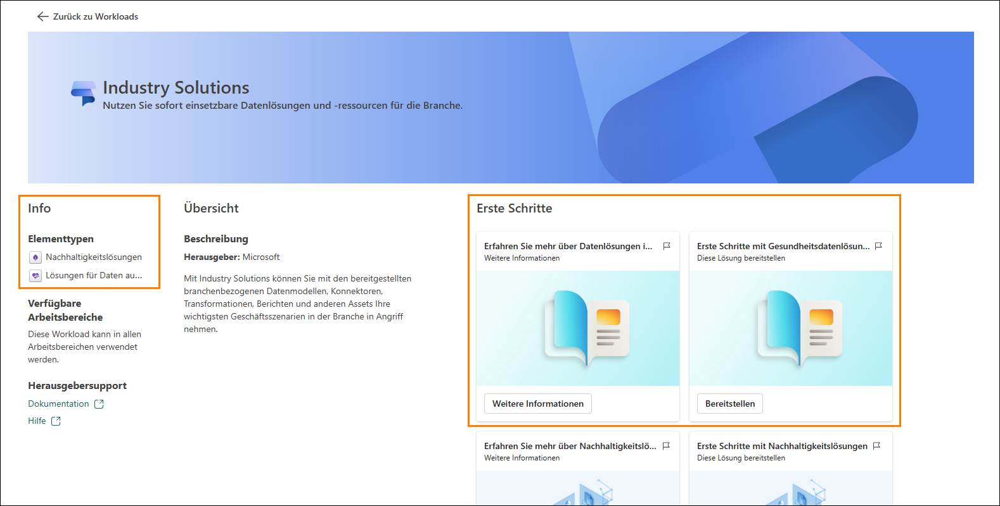

3. Klicken Sie in der oberen linken Ecke des Bildschirms auf „Zurück zu Workloads“. Auf diese Weise gelangen Sie zur Workloads-Hauptseite, auf der Sie andere Tools oder Abschnitte erkunden können.

    

## Aufgabe 6: Real-Time Intelligence-Funktionsbereich

1. Klicken Sie auf der Seite **Workloads** auf **Real-Time Intelligence**, um fortzufahren.

    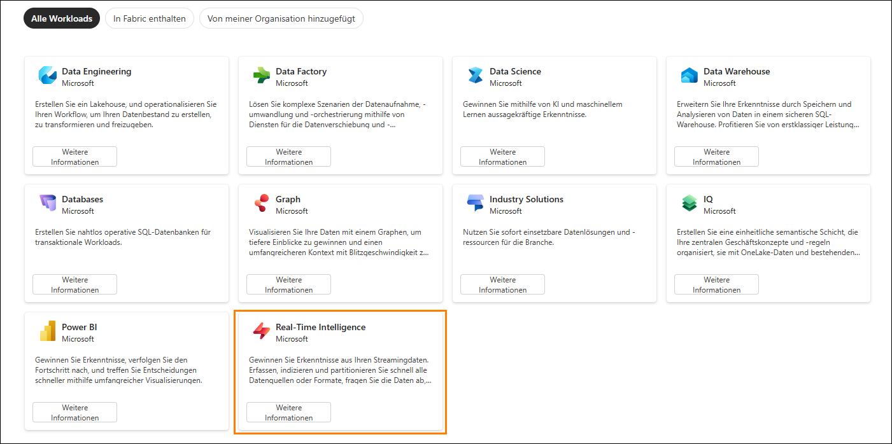

2. Sie werden zur Startseite von Real-Time Intelligence weitergeleitet. Nachfolgend finden Sie eine detaillierte Übersicht über die Abschnitte, die Ihnen helfen sollen, Real-Time Intelligence effektiv und Schritt für Schritt zu nutzen.

    **Was ist Real-Time Intelligence?**

    Mit Real-Time Intelligence können Sie große Mengen an Daten aus verschiedenen Quellen mit hoher Granularität verwalten und analysieren. Die Funktion ermöglicht es Ihnen, Ihre Daten in Echtzeit zu erfassen, zu analysieren und zu verwenden und so Ihre Geschäftsvorgänge durch zeitnahe Entscheidungen und Maßnahmen zu verbessern.

    **Elementtypen**

    a. **Eventhouse:** dient dem Erstellen eines Arbeitsbereichs mit einer oder mehreren KQL-Datenbanken, der projektübergreifend genutzt werden kann.

    b. **KQL -Abfrageset:** Wird verwendet, um Abfragen für die Daten auszuführen, um freigabefähige Tabellen und Visuals zu erstellen.

    c. **Echtzeit-Dashboard:** wird verwendet, um Echtzeit-Dashboards innerhalb von Sekunden nach der Datenerfassung zu visualisieren.

    d. **Eventstream:** Hiermit werden Ereignisströme in Echtzeit erfasst, umgewandelt und weitergeleitet.

    e. **Aktivator:** wird verwendet, um Datasets, Abfragen und Ereignisströme auf Muster zu überwachen.

    f. **Ereignisschemasatz (Vorschauversion):** Ereignisschemasätze helfen Ihnen dabei, Datenstrukturen (Schemas) für Ihre Echtzeitanalyse-Workflows zu organisieren und zu standardisieren und so die konsistente Verarbeitung und Analyse von Streamingdaten einfacher zu gestalten.

    g. **Benutzerdefinierter Streamkonnektor (Vorschauversion):** Mit dem benutzerdefinierten Streamkonnektor können Sie Echtzeitereignisse von Ihren eigenen benutzerdefinierten Endpunkten und Apps an einen Eventstream senden.

    h. **Anomalieerkennung (Vorschauversion):** Die Anomalieerkennung erkennt automatisch ungewöhnliche Muster und Ausreißer in Ihren Veranstaltungshaus-Tabellen.

    i. **Betriebsagent (Vorschauversion):** Betriebsagents automatisieren den Zyklus „Beobachten > Analysieren > Entscheiden > Handeln“. Sie verfolgen kontinuierlich wichtige Kennzahlen, ermitteln Erkenntnisse und empfehlen gezielte Aktionen.

    j. **Karte (Vorschauversion):** Bringen Sie georäumliche Erkenntnisse in Real-Time Intelligence ein, sodass jede Person visualisieren kann, wo Ereignisse stattfinden, sowie räumliche Daten in andere Fabric-Funktionen integrieren und intelligentere, standortbezogene Entscheidungen treffen kann.

    k. **Erstellung digitaler Zwillinge (Vorschauversion):** bietet Benutzern Low-Code-/No-Code-Funktionen, um ihre Geschäftskonzepte wie Anlagen und Prozesse mithilfe einer Ontologie zu erstellen und zu modellieren.

    **Erste Schritte:**

    Sie können folgende Schritte ausführen, um mit Real-Time Intelligence loszulegen:

    a. **Durchgängige Erlebnisse in Echtzeit:** Klicken Sie auf die Schaltfläche „Erste Schritte“, um die Datenanalyse in Echtzeit mit Beispieldatasets zu erkunden.

    b. **Beispiel für Real-Time Intelligence erkunden:** Klicken Sie auf die Schaltfläche „Öffnen“, um die Echtzeit-Datenanalyse mit einem Beispiel zu erkunden.

    c. **Ein Veranstaltungshaus-Beispiel ansehen:** Klicken Sie auf die Schaltfläche „Auswählen“, um ein Beispiel zu verwenden und mehr über Real-Time Intelligence zu erfahren.

    d. **Einführung in Real-Time Intelligence:** Klicken Sie auf die Schaltfläche „Öffnen“, um einen Überblick über Real-Time Intelligence zu erhalten und das Tool effektiv zu nutzen.

    e. **KQL mit Beispieldaten lernen:** Klicken Sie auf die Schaltfläche „Öffnen“, um KQL anhand von Beispieldaten zu lernen.

    f. **Was ist ein Echtzeit-Hub:** Klicken Sie auf die Schaltfläche „Öffnen“, um zu erfahren, was ein Echtzeit-Hub ist und wie er verwendet werden kann.

    g. **Einen Beispielaktivator erkunden:** Klicken Sie auf die Schaltfläche „Öffnen“, um einen Beispielaktivator zu verwenden und die Funktionen und Möglichkeiten von Real-Time Intelligence zu verstehen.

    h. **Erste Schritte mit Aktivator:** Klicken Sie auf die Schaltfläche „Öffnen“, um mit Aktiviatorkonzepten zu beginnen und das Tool effektiv zu nutzen.

    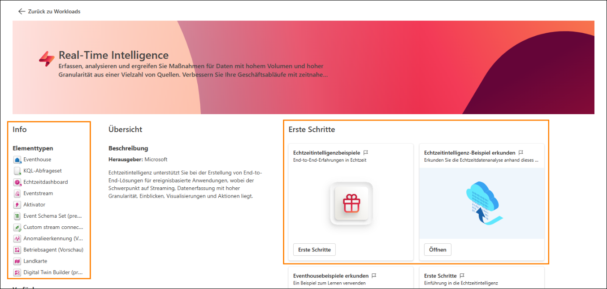

3. Klicken Sie in der oberen linken Ecke des Bildschirms auf „Zurück zu Workloads“. Auf diese Weise gelangen Sie zur Workloads-Hauptseite, auf der Sie andere Tools oder Abschnitte erkunden können.

    

## Aufgabe 7: Data Engineering-Funktionsbereich

1. Klicken Sie auf der Seite **Workloads** auf „Data Engineering“, um fortzufahren.

    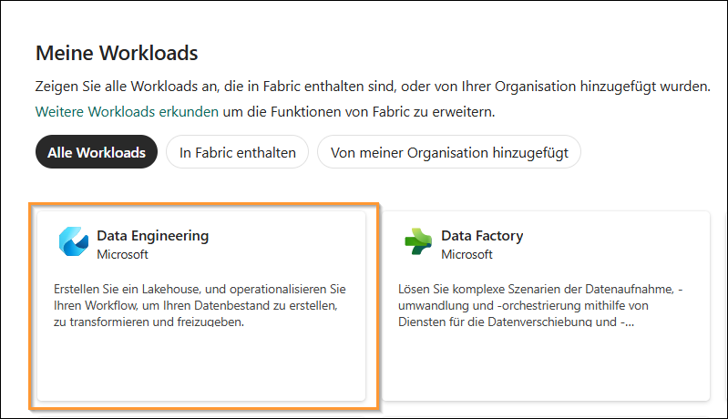

2. Sie werden zur Startseite von **Data Engineering** weitergeleitet. Nachfolgend finden Sie eine detaillierte Übersicht über die Abschnitte, die Ihnen helfen sollen, **Data Engineering** effektiv und Schritt für Schritt zu nutzen.

    **Was ist Data Engineering?**

    Data Engineering hilft Ihnen beim Entwerfen, Erstellen und Verwalten von Infrastrukturen und Systemen zum Erfassen, Speichern, Verarbeiten und Analysieren großer Datenmengen. Es ermöglicht Ihnen, Lakehouses zu erstellen und Ihren Workflow zu operationalisieren, um Ihren Datenbestand aufzubauen, zu transformieren und zu teilen.

    **Elementtypen:**

    a. **Lakehouse:** wird zum Speichern großer Datenmengen für die Bereinigung, Abfrage, Berichterstellung und Freigabe verwendet.

    b. **Notebook:** dient zum Erfassen, Aufbereiten und Analysieren von Daten und anderen datenbezogenen Aufgaben mithilfe verschiedener Sprachen wie Python und Scala.

    c. **Umgebung:** dient dem Einrichten gemeinsam genutzter Bibliotheken, Spark-Compute-Einstellungen und Ressourcen für Notebooks und Spark-Auftragsdefinitionen.

    d. **Spark-Auftragsdefinition:** dient zum Definieren, Planen und Verwalten von Apache-Aufträgen.

    e. **Benutzerdatenfunktionen:** Plattform, mit der Sie Anwendungen in Fabric hosten und ausführen können.

    f. **API für GraphQL:** eine API zum Abfragen mehrerer Datenquellen.

    g. **Snowflake-Datenbank:** ermöglicht Benutzern, die Snowflake-Datenbank innerhalb von Fabric zu spiegeln.

    **Erste Schritte:**

    Sie können folgende Schritte ausführen, um mit Data Engineering loszulegen:

    a. **Ein Beispiel erkunden:** Klicken Sie auf die Schaltfläche „Auswählen“, um ein Beispiel zu verwenden und mehr über Data Engineering zu erfahren.

    b. **Was ist ein Lakehouse?:** Klicken Sie auf die Schaltfläche „Öffnen“, um mehr darüber zu erfahren, was ein Lakehouse ist und wie Sie es verwenden können.

    c. **Abrufen von Datenerfahrungen in Lakehouse:** Klicken Sie auf die Schaltfläche „Öffnen“, um Datentechnik mittels Lakehouses zu nutzen.

    d. **Erste Schritte mit Spark-Auftragsdefinitionen:** Klicken Sie auf die Schaltfläche „Öffnen“, um zu erfahren, wie Sie Spark-Auftragsdefinitionen für die Datenverarbeitung verwenden können.

    e. **Notebooks entwickeln und ausführen:** Klicken Sie auf die Schaltfläche „Öffnen“,
    um zu erfahren, wie Sie Notebooks für die Datenanalyse entwickeln und ausführen.

    f. **NotebookUtils verwenden:** Klicken Sie auf die Schaltfläche „Öffnen“, um zu erfahren,
    wie Sie NotebookUtils für die erweiterte Datenanalyse verwenden können.

    g. **Notebooks für das eigene Lakehouse verwenden:** Klicken Sie auf die Schaltfläche „Öffnen“, um zu erfahren, wie Sie Notebooks für Ihr Lakehouse nutzen können.

    h. **Datasets für das eigene Lakehouse verwenden:** Klicken Sie auf die Schaltfläche „Öffnen“, um zu erfahren, wie Sie Datasets für Ihr Lakehouse nutzen können.

    i. **Erste Benutzerdatenfunktionen erstellen:** Klicken Sie auf die Schaltfläche „Öffnen“,
    um zu erfahren, wie Sie Benutzerdatenfunktionen erstellen.

    j. **Erste API für GraphQL erstellen:** Klicken Sie auf die Schaltfläche „Öffnen“, um zu erfahren, wie Sie eine API für GraphQL erstellen.

    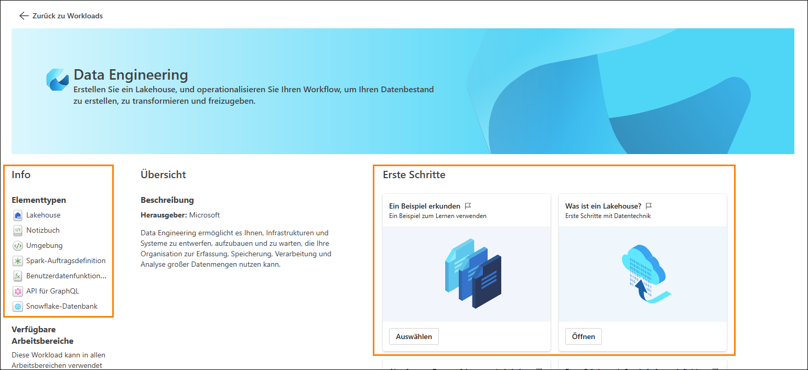

3. Klicken Sie in der oberen linken Ecke des Bildschirms auf **Zurück zu Workloads**. Auf diese Weise gelangen Sie zur Workloads-Hauptseite, auf der Sie andere Tools oder Abschnitte erkunden können.

    

## Aufgabe 8: Data Science-Funktionsbereich

1. Klicken Sie auf der Seite **Workloads** auf **Data Science**, um fortzufahren.

    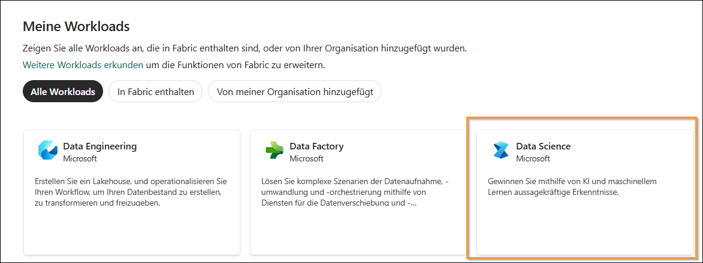

2. Sie werden zur Startseite von **Data Science** weitergeleitet. Nachfolgend finden Sie eine detaillierte Übersicht über die Abschnitte, die Ihnen helfen sollen, **Data Science** effektiv und Schritt für Schritt zu nutzen.

    **Was ist Data Science?**

    Data Science ist ein Tool, mit dem Sie dank KI und maschinellem Lernen aussagekräftige Erkenntnisse gewinnen können. Es bietet KI-Tools, mit denen Sie umfassende Data Science-Workflows durchführen und KI für die Datenanreicherung und Geschäftseinblicke nutzen können.

    **Elementtypen:**

    a. **ML-Modell:** wird zur Erstellung von Machine Learning-Modellen verwendet.

    b. **Experiment:** dient zum Entwickeln und Ausführen von Modellen und zur Nachverfolgung der Modellentwicklung.

    c. **Notebook:** Hiermit werden Daten ausgewertet und Machine-Learning-Lösungen entwickelt.

    d. **Umgebung:** dient dem Einrichten gemeinsam genutzter Bibliotheken, Spark-Compute-Einstellungen und Ressourcen für Notebooks und Spark-Auftragsdefinitionen.

    e. **Daten-Agent (Vorschauversion):** wird verwendet, um Unterhaltungs- KI-Umgebungen zu erstellen, die Fragen zu in Lakehouses, Warehouses, semantischen Modellen in Power BI und KQL-Datenbanken gespeicherten Daten beantworten.

    f. **Python-Notebook:** wird zum Importieren von Python-Notebooks von einem lokalen Computer verwendet.

    **Erste Schritte:**

    Sie können folgende Schritte ausführen, um mit Data Science loszulegen:

    a. **Ein Beispiel erkunden:** Klicken Sie auf die Schaltfläche „Auswählen“, um ein Beispiel zu verwenden und mehr über Data Science zu erfahren.

    b. **Erste Schritte mit ML-Modellen:** Klicken Sie auf die Schaltfläche „Öffnen“, um zu erfahren, wie Sie mit Machine-Learning-Modellen beginnen können.

    c. **Erste Schritte mit ML-Experimenten:** Klicken Sie auf die Schaltfläche „Öffnen“,
    um zu erfahren, wie Sie Machine-Learning-Experimente durchführen können.

    d. **Erste Schritte mit Notebooks:** Klicken Sie auf die Schaltfläche „Öffnen“, um zu erfahren, wie Sie mit Notebooks loslegen können.

    e. **Notebooks entwickeln und ausführen:** Klicken Sie auf die Schaltfläche „Öffnen“, um zu erfahren, wie Sie Notebooks für die Datenanalyse entwickeln und ausführen.

    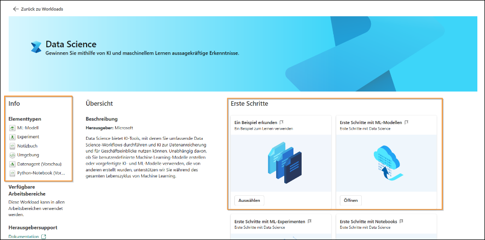

3. Klicken Sie in der oberen linken Ecke des Bildschirms auf **Zurück zu Workloads**. Auf diese Weise gelangen Sie zur Workloads-Hauptseite, auf der Sie andere Tools oder Abschnitte erkunden können.

    

## Aufgabe 9: Data Warehouse-Funktionsbereich

1. Klicken Sie auf der Seite **Workloads** auf **Data Warehouse**, um fortzufahren.

    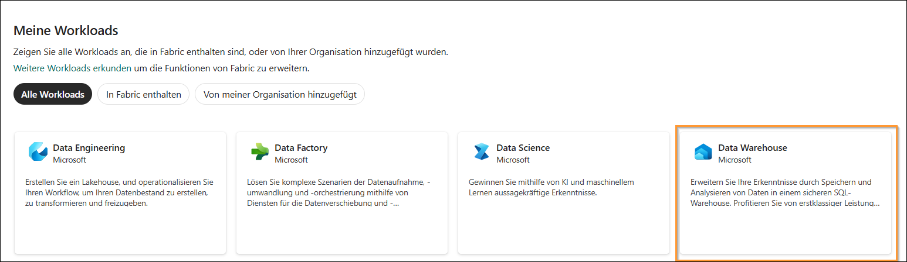

2. Sie werden zur Startseite von Data Warehouse weitergeleitet. Nachfolgend finden Sie eine detaillierte Übersicht über die Abschnitte, die Sie bei der effektiven und schrittweisen Verwendung von Data Warehouse unterstützen sollen.

    **Was ist Data Warehouse?**

    Data Warehouse ist ein Tool, mit dem Sie Daten in einem sicheren SQL Warehouse speichern und analysieren können. Damit können Sie Ihre Erkenntnisse erweitern, indem Sie von erstklassiger Leistung im Petabytebereich in einem offenen Datenformat profitieren.

    **Elementtypen:**

    a. **Warehouse:** dient dem Erstellen eines Data Warehouse.

    b. **Beispiel-Warehouse:** wird verwendet, um Datenaufbewahrungsfunktionen mit vorkonfigurierten Datensätzen und Modellen zu erkunden und zu testen.

    c. **Notebook:** wird für das Erstellen und Teilen interaktiver Datenanalyse‑ und Visualisierungsaufgaben verwendet.

    d. **Gespiegelte Azure SQL-Datenbank:** wird verwendet, um die Azure SQL-Datenbank zu spiegeln.

    e. **Gespiegelter Azure Databricks-Katalog:** wird zum Spiegeln von Daten von Azure Databricks für verbesserte Integration und Analyse verwendet.

    f. **Gespiegeltes Snowflake:** wird verwendet, um die Snowflake-Datenbank zu spiegeln.

    g. **Gespiegeltes Oracle-Spiegelung (Vorschauversion):** wird verwendet, um Oracle zu spiegeln.

    h. **Gespiegeltes Google BigQuery (Vorschauversion):** wird verwendet, um Google BigQuery zu spiegeln.

    i. **Gespiegelte Azure Cosmos DB:** wird verwendet, um Azure Cosmos DB zu spiegeln.

    j. **Gespiegelter SQL Server:** Wird verwendet, um SQL Server zu spiegeln.

    k. **Gespiegelte Azure Database for PostgreSQL:** wird verwendet, um Ihre vorhandene Azure Database for PostgreSQL zu spiegeln.

    l. **Gespiegelte Azure SQL Managed Instance:** wird zum Spiegeln verwalteter Azure SQL-Datenbanken für hohe Verfügbarkeit und Notfallwiederherstellung verwendet.

    m. **Gespiegelte Datenbank:** wird für das Replizieren von Datenbanken für hohe Verfügbarkeit und Notfallwiederherstellung verwendet.

    **Erste Schritte:**

    Sie können folgende Schritte ausführen, um mit Data Warehouse loszulegen:

    a. **Ein Beispiel-Warehouse erkunden:** ein neues Warehouse mit bereits geladenen Beispieldaten starten

    b. **Erste Schritte mit Warehouse:** Klicken Sie auf die Schaltfläche „Öffnen“, um zu erfahren, wie Sie ein Warehouse zum Analysieren von Daten verwenden können.

    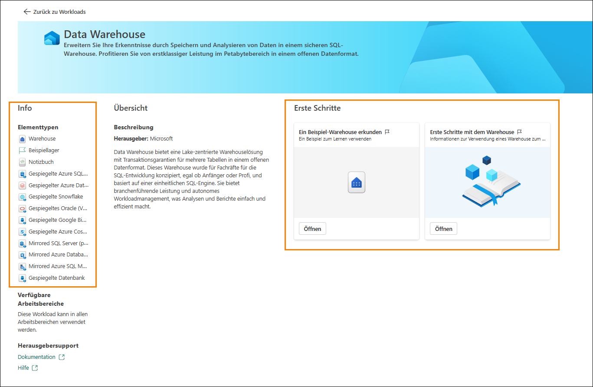

## Aufgabe 10: Datenbanken-Funktionsbereich

1. Klicken Sie auf der Seite **Workloads** auf **Databases**, um fortzufahren.

    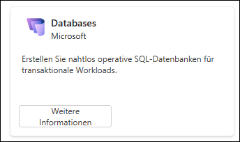

2. Sie werden zur Datenbanken-Startseite weitergeleitet. Im Folgenden finden Sie eine detaillierte Übersicht über die Abschnitte, die Ihnen bei der effektiven Nutzung von Datenbanken helfen sollen.

    **Was ist eine Fabric-Datenbank?**

    Die SQL-Datenbank in Microsoft Fabric ist eine entwicklerfreundliche Transaktionsdatenbank, die auf Azure SQL -Datenbank basiert und es Ihnen ermöglicht, Ihre Betriebsdatenbank einfach in Fabric zu erstellen. Eine SQL-Datenbank in Fabric verwendet dasselbe SQL-Datenbankmodul wie die Azure SQL-Datenbank.

    **Elementtypen:**

    a. **SQL-Datenbank:** SQL-Datenbank in Fabric ist Teil des Datenbankworkloads; auf die Daten kann von anderen Elementen in Fabric aus zugegriffen werden. Ihre SQL-Datenbankdaten werden auch in OneLake in einem abfragbaren Format auf dem neuesten Stand gehalten, sodass Sie alle verschiedenen Dienste in Fabric nutzen können, z. B. Analysen mit Spark, Ausführung von Notebooks, Datentechnik, Visualisierung durch Power BI-Berichte und mehr.

    b. **Cosmos DB:** Cosmos DB in Microsoft Fabric ist eine KI-optimierte NoSQL-Datenbank mit einer vereinfachten Verwaltung. Als Mitglied des Entwicklungsteams können Sie Cosmos DB in Fabric nutzen, um KI-Anwendungen mit weniger Reibungsverlusten und ohne die typischen Datenbankverwaltungsaufgaben zu erstellen.

    **Erste Schritte:**

    Sie können folgende Schritte ausführen, um mit Datenbanken loszulegen:

    a. **Erkunden:** Klicken Sie auf „Öffnen“, um eine Beispieldatenbank zu erkunden.

    b. **Datenbankkonzepte:** In diesem Abschnitt werden allgemeine Begriffe und Konzepte rund um Transaktionsdatenbanken erläutert, damit Sie sich mit der Arbeit mit der SQL-Datenbank vertraut machen können.

    c. **Datenbankvorlagen:** Durchsuchen Sie eine Bibliothek mit vorgefertigten Vorlagen gängiger Datenbankdesigns.

    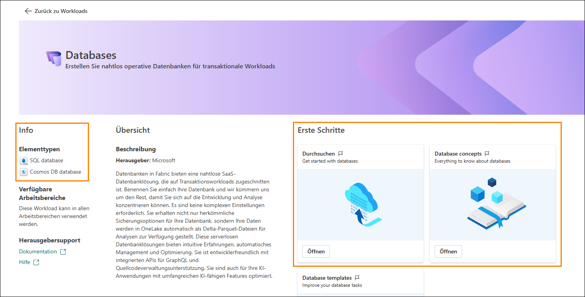

3. Klicken Sie in der oberen linken Ecke des Bildschirms auf „Zurück zu Workloads“. Auf diese Weise gelangen Sie zur Workloads-Hauptseite, auf der Sie andere Tools oder Abschnitte erkunden können.

    

    In dieser Übung haben wir die Fabric-Oberfläche kennengelernt und einen Fabric-Arbeitsbereich und ein Lakehouse erstellt. In der nächsten Übung lernen Sie, wie Sie mit Verknüpfungen in Lakehouse eine Verbindung zu ADLS Gen2-Daten herstellen und diese Daten anhand von Ansichten transformieren.

# Referenzen

Bei Fabric Analyst in a Day (FAIAD) lernen Sie einige der wichtigsten Funktionen von Microsoft Fabric kennen. Im Menü des Dienstes finden Sie in der Hilfe (?) Links zu praktischen Informationen.

Nachfolgend finden Sie weitere Angebote zur weiteren Arbeit mit Microsoft Fabric.

- Die vollständige Ankündigung der allgemeinen Verfügbarkeit von [Microsoft Fabric finden Sie im Blogbeitrag](https://aka.ms/Fabric-Hero-Blog-Ignite23).

- Fabric bei einer [interaktiven Vorstellung](https://aka.ms/Fabric-GuidedTour) kennenlernen

- Zur [kostenlosen Testversion von Microsoft Fabric](https://aka.ms/try-fabric) anmelden

- [Die Microsoft Fabric-Webseite](https://aka.ms/microsoft-fabric) besuchen

- Mit [Modulen von Fabric Learning](https://aka.ms/learn-fabric) neue Qualifikationen erwerben

- [Technische Dokumentation zu Fabric](https://aka.ms/fabric-docs) lesen

- [Kostenloses E-Book zum Einstieg in Fabric](https://aka.ms/fabric-get-started-ebook) lesen

- Mitglied der [Fabric Community](https://aka.ms/fabric-community) werden, um Fragen zu stellen, Feedback zu geben und sich mit anderen auszutauschen

Lesen Sie die Blogs, in denen die Fabric-Funktionen ausführlich beschrieben werden:

- [Blog zum Data Factory-Funktionsbereich in Fabric](https://aka.ms/Fabric-Data-Factory-Blog)

- [Blog zum Data Engineering-Funktionsbereich von Synapse in Fabric](https://aka.ms/Fabric-DE-Blog)

- [Blog zum Data Science-Funktionsbereich von Synapse in Fabric](https://aka.ms/Fabric-DS-Blog)

- [Blog zum Data Warehousing-Funktionsbereich von Synapse in Fabric ](https://aka.ms/Fabric-DW-Blog)

- [Blog zum Real-Time Analytics-Funktionsbereich von Synapse in Fabric](https://aka.ms/Fabric-RTA-Blog)

- [Blog mit Ankündigungen zu Power BI](https://aka.ms/Fabric-PBI-Blog)

- [Blog zum Data Activator-Funktionsbereich in Fabric](https://aka.ms/Fabric-DA-Blog)

- [Blog zu Verwaltung und Governance in Fabric](https://aka.ms/Fabric-Admin-Gov-Blog)

- [Blog zu OneLake in Fabric](https://aka.ms/Fabric-OneLake-Blog)

- [Blog zur Dataverse- und Microsoft Fabric-Integration](https://aka.ms/Dataverse-Fabric-Blog)

© 2026 Microsoft Corporation. Alle Rechte vorbehalten.

Durch die Verwendung der vorliegenden Demo/Übung stimmen Sie den folgenden Bedingungen zu:

Die in dieser Demo/Übung beschriebene Technologie/Funktionalität wird von der Microsoft Corporation bereitgestellt, um Feedback von Ihnen zu erhalten und Ihnen Wissen zu vermitteln. Sie dürfen die Demo/Übung nur verwenden, um derartige Technologiefeatures und Funktionen zu bewerten und Microsoft Feedback zu geben. Es ist Ihnen nicht erlaubt, sie für andere Zwecke zu verwenden. Es ist Ihnen nicht gestattet, diese Demo/Übung oder einen Teil derselben zu ändern, zu kopieren, zu verbreiten, zu übertragen, anzuzeigen, auszuführen, zu vervielfältigen, zu veröffentlichen, zu lizenzieren, zu transferieren oder zu verkaufen oder aus ihr abgeleitete Werke zu erstellen.

DAS KOPIEREN ODER VERVIELFÄLTIGEN DER DEMO/ÜBUNG (ODER EINES TEILS DERSELBEN) AUF EINEN/EINEM ANDEREN SERVER ODER SPEICHERORT FÜR DIE WEITERE VERVIELFÄLTIGUNG ODER VERBREITUNG IST AUSDRÜCKLICH UNTERSAGT.

DIESE DEMO/ÜBUNG STELLT BESTIMMTE SOFTWARE-TECHNOLOGIE-/PRODUKTFEATURES UND FUNKTIONEN, EINSCHLIESSLICH POTENZIELLER NEUER FEATURES UND KONZEPTE, IN EINER SIMULIERTEN UMGEBUNG OHNE KOMPLEXE EINRICHTUNG ODER INSTALLATION FÜR DEN OBEN BESCHRIEBENEN ZWECK BEREIT. DIE TECHNOLOGIE/KONZEPTE IN DIESER DEMO/ÜBUNG ZEIGEN MÖGLICHERWEISE NICHT DAS VOLLSTÄNDIGE FUNKTIONSSPEKTRUM UND FUNKTIONIEREN MÖGLICHERWEISE NICHT WIE DIE ENDGÜLTIGE VERSION. UNTER UMSTÄNDEN VERÖFFENTLICHEN WIR AUCH KEINE ENDGÜLTIGE VERSION DERARTIGER FEATURES ODER KONZEPTE. IHRE ERFAHRUNG BEI DER VERWENDUNG DERARTIGER FEATURES UND FUNKTIONEN IN EINER PHYSISCHEN UMGEBUNG KANN FERNER ABWEICHEND SEIN.

**FEEDBACK.** Wenn Sie Feedback zu den Technologiefeatures, Funktionen und/oder Konzepten geben, die in dieser Demo/Übung beschrieben werden, gewähren Sie Microsoft das Recht, Ihr Feedback in jeglicher Weise und für jeglichen Zweck kostenlos zu verwenden, zu veröffentlichen und gewerblich zu nutzen. Außerdem treten Sie Dritten kostenlos sämtliche Patentrechte ab, die erforderlich sind, damit deren Produkte, Technologien und Dienste bestimmte Teile einer Software oder eines Dienstes von Microsoft, welche/welcher das Feedback enthält, verwenden oder eine Verbindung zu dieser/diesem herstellen können. Sie geben kein Feedback, das einem Lizenzvertrag unterliegt, aufgrund dessen Microsoft Drittparteien eine Lizenz für seine Software oder Dokumentation gewähren muss, weil wir Ihr Feedback in diese aufnehmen. Diese Rechte bestehen nach Ablauf dieser Vereinbarung fort.

DIE MICROSOFT CORPORATION LEHNT HIERMIT JEGLICHE GEWÄHRLEISTUNGEN UND GARANTIEN IN BEZUG AUF DIE DEMO/ÜBUNG AB, EINSCHLIESSLICH ALLER AUSDRÜCKLICHEN, KONKLUDENTEN ODER GESETZLICHEN GEWÄHRLEISTUNGEN UND GARANTIEN DER HANDELSÜBLICHKEIT, DER EIGNUNG FÜR EINEN BESTIMMTEN ZWECK, DES RECHTSANSPRUCHS UND DER NICHTVERLETZUNG VON RECHTEN DRITTER. MICROSOFT MACHT KEINERLEI ZUSICHERUNGEN BZW. ERHEBT KEINERLEI ANSPRÜCHE IM HINBLICK AUF DIE RICHTIGKEIT DER ERGEBNISSE UND DES AUS DER VERWENDUNG DER DEMO/ÜBUNG RESULTIERENDEN ARBEITSERGEBNISSES BZW. BEZÜGLICH DER EIGNUNG DER IN DER DEMO/ÜBUNG ENTHALTENEN INFORMATIONEN FÜR EINEN BESTIMMTEN ZWECK.

**HAFTUNGSAUSSCHLUSS**

Diese Demo/Übung enthält nur einen Teil der neuen Features und Verbesserungen in Microsoft Power BI. Einige Features können sich unter Umständen in zukünftigen Versionen des Produkts ändern. In dieser Demo/Übung erhalten Sie Informationen über einige, aber nicht über alle neuen Features.