# Microsoft Fabric - Fabric Analyst in a Day - Übung 5


# Inhalt

- Einführung

- Dataflow Gen2

    - Aufgabe 1: Geplante Aktualisierung für den Lieferanten-Dataflow konfigurieren

- Pipeline

    - Aufgabe 2: Pipeline erstellen

    - Aufgabe 3: Einfache Pipeline erstellen

    - Aufgabe 4: Neue Pipeline erstellen

    - Aufgabe 5: Bis-Aktivität erstellen

    - Aufgabe 6: Variablen erstellen

    - Aufgabe 7: Bis-Aktivität konfigurieren

    - Aufgabe 8: Dataflow-Aktivität konfigurieren

    - Aufgabe 9: Erste Aktivität „Variable festlegen“ konfigurieren

    - Aufgabe 10: Zweite Aktivität „Variable festlegen“ konfigurieren

    - Aufgabe 11: Dritte Aktivität „Variable festlegen“ konfigurieren

    - Aufgabe 12: Aktivität „Wartezustand“ konfigurieren

    - Aufgabe 13: Geplante Aktualisierung für die Pipeline konfigurieren

- Referenzen

# Einführung

Wir haben Daten aus verschiedenen Datenquellen im Lakehouse erfasst. In dieser Übung richten Sie einen Aktualisierungszeitplan für die Datenquellen ein. Zusammenfassung der Anforderung:

- **Lieferantendaten:** Snowflake wird täglich um 00:00 Uhr aktualisiert.

- **Mitarbeiterdaten:** Diese werden in SharePoint täglich um 9:00 Uhr aktualisiert. Wir haben jedoch festgestellt, dass es manchmal zu einer Verzögerung von 5 bis 15 Minuten kommt. Wir müssen einen Aktualisierungsplan erstellen, um dies zu berücksichtigen.

- **Kundendaten:** Diese sind in Dataverse immer auf dem neuesten Stand. Zuvor haben wir diese viermal täglich aktualisiert, um. 00:00 Uhr, um 6:00 Uhr, um 12:00 Uhr und um 18:00 Uhr. Jetzt hat das IT-Team eine Verknüpfung zu Dataverse erstellt, um diese Daten in einem Administrator-Lakehouse zu erfassen. Sie haben diese Daten auch transformiert. Wir müssen keine Aktualisierung einrichten, da wir eine Verknüpfung mit dem vom IT-Team bereitgestellt Lakehouse herstellen.

- **Vertriebsdaten:** Diese werden in ADLS täglich. um 12:00 Uhr aktualisiert. Wir müssen hierfür keine Aktualisierung einrichten, da wir eine Verknüpfung erstellt haben. Sobald Daten in ADLS aktualisiert werden, sind sie verfügbar.

Am Ende dieser Übung haben Sie Folgendes gelernt:

- Wie Sie eine geplante Aktualisierung von Dataflow Gen2 konfigurieren

- Wie Sie eine Pipeline erstellen

- Wie Sie eine geplante Aktualisierung einer Pipeline konfigurieren

# Dataflow Gen2

## Aufgabe 1: Geplante Aktualisierung für den Lieferanten-Dataflow konfigurieren

Beginnen wir damit, eine geplante Aktualisierung des Lieferanten-Dataflows zu konfigurieren.

1. Wir navigieren zurück zum Fabric-Arbeitsbereich **FAIAD_<inject key="Deployment ID" enableCopy="false"/>** indem wir den Arbeitsbereich im linken Bereich auswählen.

2. Zum Erweitern des Bereichs mit der Liste der Artefakte wählen Sie den Doppelpfeil oben rechts im Bereich aus.

    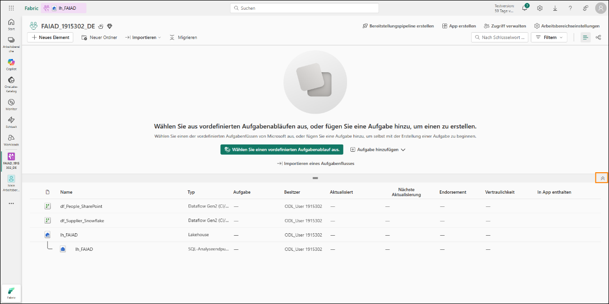

3. Alle von Ihnen erstellten Artefakte werden hier aufgelistet. Geben Sie rechts im Bildschirm **df** in das **Suchfeld** ein. Dadurch werden die Artefakte nach Dataflows gefiltert.

    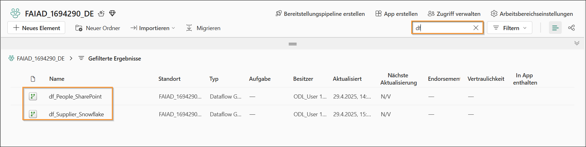

4. Bewegen Sie die Maus über die Zeile **df_Supplier_Snowflake**. Wählen Sie die **Auslassungspunkte (...)** aus.

5. Beachten Sie, dass Optionen zum Löschen, Öffnen und Aktualisieren des Dataflows vorhanden sind. Sehen wir uns den Aktualisierungsverlauf an. Wählen Sie **Letzte Ausführungen** aus.

    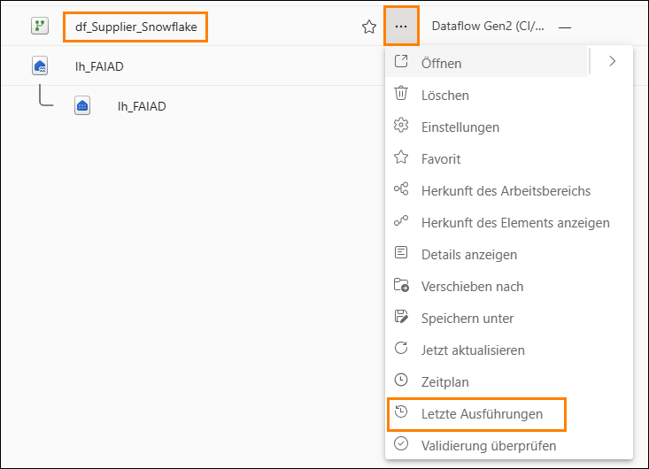

    > **Hinweis:** Auf der rechten Seite wird ein Fenster/Bereich mit einer Liste der Aktualisierungen angezeigt.

6. Sie werden feststellen, dass es eine Aktualisierung gibt, die ausgeführt wurde, als wir in der vorherigen Übung die Option **Speichern und ausführen** wählten. Der angezeigte **Typ** der Aktualisierung wird als **Bei Bedarf** aufgeführt, was darauf hinweist, dass es sich um eine manuell ausgeführte Aktualisierung handelt.

    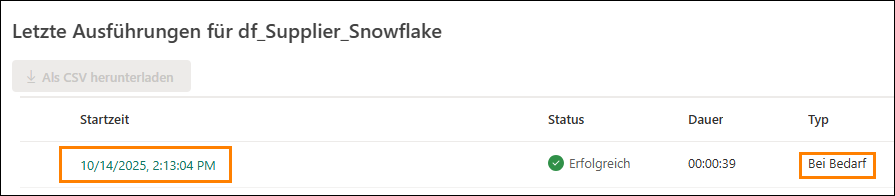

7. Wählen Sie den Link **Startzeit** aus.

    > **Hinweis:** Bei Ihnen wird eine andere Startzeit angezeigt.

    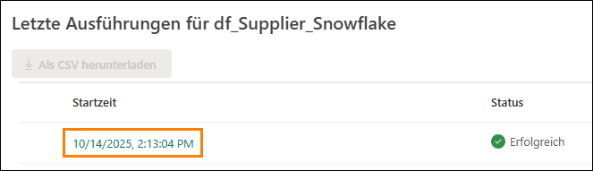

    Der Detailbildschirm wird geöffnet. Hier werden Details zur Aktualisierung angezeigt. Es werden die Startzeit, die Endzeit und die Dauer angezeigt. Außerdem sind die aktualisierten Tabellen/Aktivitäten aufgeführt. Falls ein Fehler aufgetreten ist, können Sie auf den Namen der Tabelle/Aktivität klicken, um mehr zu erfahren.

    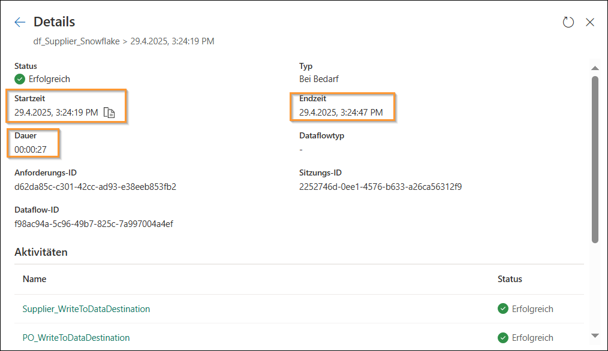

8. Wir verlassen die Seite, indem wir auf das **X** in der oberen rechten Ecke klicken. Sie werden zurück zum **Arbeitsbereich** geleitet.

9. Bewegen Sie die Maus über die Zeile **df_Supplier_Snowflake**. Wählen Sie die **Auslassungspunkte (...)** aus.

10. Sehen wir uns an, wie wir eine Aktualisierung so planen können, dass sie automatisch erfolgt. Wählen Sie die Option **Einstellungen** aus.

    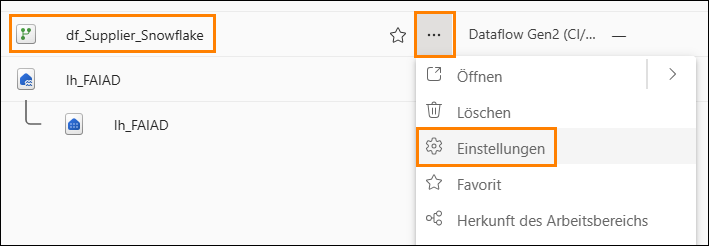

11. Im Bereich **Einstellungen**, der angezeigtwird, stehen uns drei Optionen zur Verfügung:
 
    - **Info:** Hier können wir den Namen des Dataflows ändern und eine Beschreibung hinzufügen. Außerdem können wir sehen, wer der/die Verantwortliche des Dataflows ist und wann er zuletzt geändert wurde. 
    
    - **Endorsement:** Hier können wir angeben, ob der Dataflow das Tag **Heraufgestuft** oder **Zertifiziert** tragen soll, damit andere ihn sehen können. 
    
    - **Zeitplan:** Hier können wir Dataflows planen.

        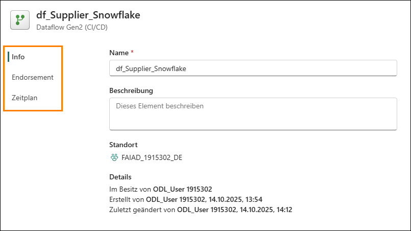

12. Wählen Sie die Option **Zeitplan** aus.

13. Um einen Zeitplan zu aktivieren, klicken wir einfach auf **Zeitplan hinzufügen**.

    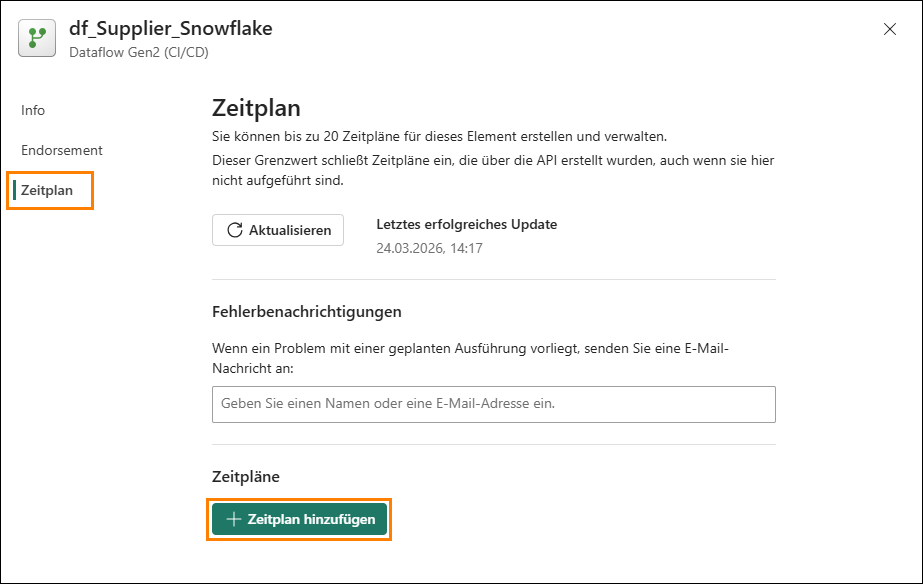

14. Hier können wir die Abfolge der Aktualisierung festlegen, indem wir eine Option für die Eigenschaft **Wiederholen** auswählen. Für dieses Szenario wählen wir **Täglich (1)**.

15. Für die Eigenschaft **Zeit** geben wir **12:00 AM (2)** an, da wir Mitternacht festlegen möchten.

    > **Hinweis:** Durch Klicken auf den Link „Zeit hinzufügen“ können Sie mehrere Aktualisierungszeiten hinzufügen.

16. Sie können auch **Startdatum und - uhrzeit (3)** sowie **Enddatum und - uhrzeit (4)** angeben. Wählen Sie für dieses Szenario einfach den aktuellen Tag für das Start- und Enddatum aus.

17. Sie können angeben, welche **Zeitzone (5)** für die Uhrzeiten gelten soll. Wählen Sie als Letztes **Speichern** aus.

    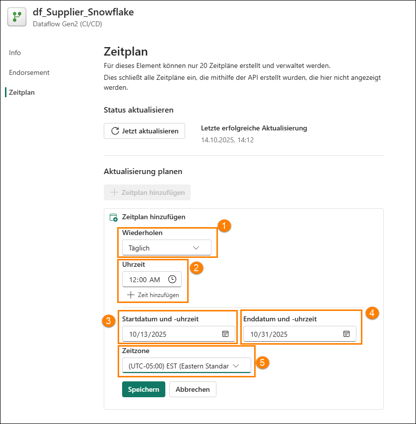

18. Die geplante Aktualisierung wird angezeigt. Sie können sie bearbeiten oder löschen, wenn sie nicht mehr benötigt wird, oder andere geplante Aktualisierungen hinzufügen.

    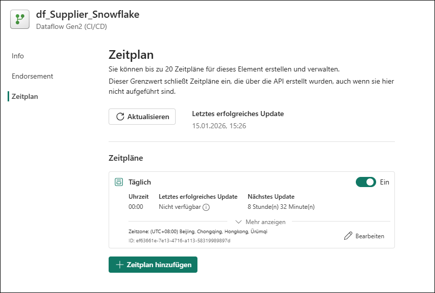

    Wie bereits erwähnt, müssen wir eine benutzerdefinierte Logik erstellen, um das Szenario zu handhaben, in dem die Mitarbeiterdatei in SharePoint nicht rechtzeitig gesendet wird. Wir verwenden eine Pipeline, um dieses Problem zu beheben.

# Pipeline

## Aufgabe 2: Pipeline erstellen

1. Wir navigieren zurück zum Fabric-Arbeitsbereich **FAIAD_<inject key="Deployment ID" enableCopy="false"/>**, indem wir den Arbeitsbereich im linken Bereich auswählen.

2. Wählen Sie im oberen Menü **+ Neues Element (1) -> Pipeline (2)** aus.

    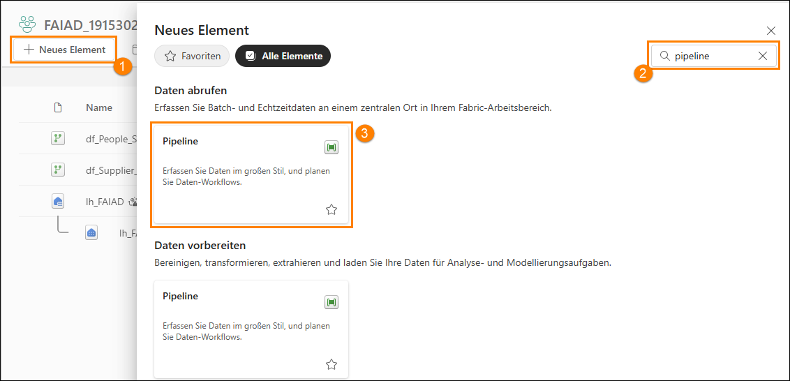

3. Das Dialogfeld „Neue Pipeline“ wird geöffnet. Geben Sie der Pipeline den Namen **pl_Refresh_People_SharePoint**, und wählen Sie **Erstellen** aus.

    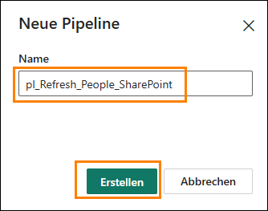

    Sie werden zur **Seite „Pipeline“** weitergeleitet. Wenn Sie bereits mit Azure Data Factory gearbeitet haben, sind Sie mit diesem Bildschirm vertraut. Verschaffen wir uns einen kurzen Überblick über das Layout.

    Sie befinden sich auf dem **Startbildschirm**. Im oberen Menü finden Sie Optionen zum Hinzufügen häufig verwendeter Aktivitäten: „Überprüfen“, „Ausführen“ und „Ausführungsverlauf anzeigen“. Im mittleren Bereich finden Sie ebenfalls Optionen zum schnellen Erstellen der Pipeline.

    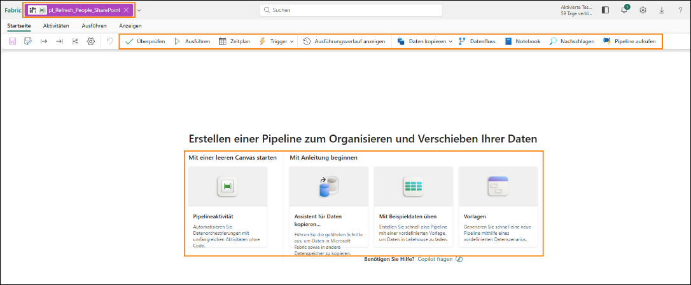

4. Wählen Sie im oberen Menü die Option **Aktivitäten** aus. Das Menü enthält nun eine Liste mit häufig verwendeten Aktivitäten.

5. Wählen Sie rechts im Menü die **Auslassungspunkte (…)** aus, um alle anderen verfügbaren Aktivitäten anzuzeigen. Wir werden einige dieser Aktivitäten in der Übung verwenden.

    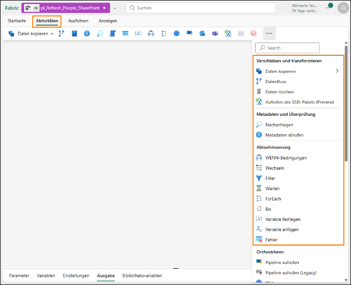

6. Klicken Sie im oberen Menü auf **Ausführen**. Es werden Optionen zum Ausführen und Planen der Pipeline angezeigt. Hier finden Sie auch die Option zum Anzeigen des Ausführungsverlaufs mithilfe von „Ausführungsverlauf anzeigen“.

7. Wählen Sie im oberen Menü die Option **Anzeigen** aus. Hier finden Sie Optionen zum Anzeigen des Codes im JSON-Format. Außerdem sind Optionen zum automatischen Ausrichten der Aktivitäten verfügbar.

    > **Hinweis:** Wenn Sie Erfahrung mit JSON - haben, können Sie am Ende der Übungauch „JSON-Code anzeigen“ auswählen. Hier sehen Sie, dass die gesamte Orchestrierung, die Sie über die Entwurfsansicht durchführen, auch in JSON geschrieben werden kann.

    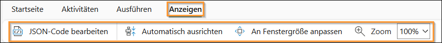

## Aufgabe 3: Einfache Pipeline erstellen

Beginnen wir mit der Erstellung der Pipeline. Wir benötigen eine Aktivität, um den Dataflow zu aktualisieren. Lassen Sie uns nach einer Aktivität suchen, die wir verwenden können.

1. Wählen Sie im oberen Menü **Aktivitäten -> Dataflow** aus. Die Dataflow-Aktivität wird dem mittleren Designbereich hinzugefügt. Beachten Sie, dass der untere Bereich jetzt Konfigurationsoptionen der Dataflow-Aktivität enthält.

2. Wir werden die Aktivität so konfigurieren, dass sie eine Verbindung zum Dataflow „df_People_SharePoint“ herstellt. Wählen Sie im **unteren Bereich** die Option **„Einstellungen“** aus.

    > **Hinweis:** Möglicherweise müssen Sie den unteren Bereich nach oben ziehen, um die Einstellungen zu sehen.

    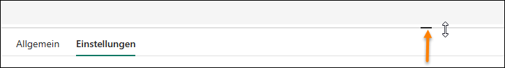

3. Stellen Sie sicher, dass der **Arbeitsbereich** Ihr Fabric-Arbeitsbereich **FAIAD_<inject key="Deployment ID" enableCopy="false"/>** ist.

4. Wählen Sie im **Dropdownmenü „Dataflow“** die Option **df_People_SharePoint** aus. Wenn diese Dataflow-Aktivität ausgeführt wird, erfolgt eine Aktualisierung von **df_People_SharePoint.** Das war doch einfach, oder?

    In unserem Szenario werden Mitarbeiterdaten nicht planmäßig aktualisiert. Manchmal kommt es zu einer Verzögerung. Sehen wir uns an, ob wir dies berücksichtigen können.

    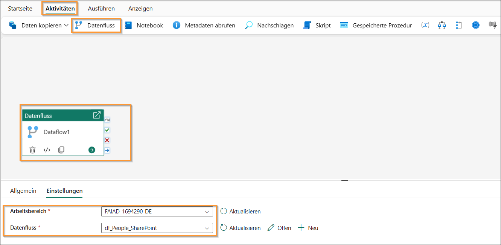

5. Wählen Sie im **unteren** **Bereich** die Option **Allgemein** aus. Wir geben der Aktivität einen Namen und eine Beschreibung.

6. Geben Sie im Feld **Name** **dfactivity_People_SharePoint** ein.

7. Geben Sie im Feld **Beschreibung** df **People_Sharepoint dataflow ein.**

8. Beachten Sie, dass eine Option zum Deaktivieren einer Aktivität vorhanden ist. Diese Funktion ist beim Testen oder Debuggen hilfreich. Behalten Sie die Einstellung **Aktiviert** bei.

9. Es ist eine Option zum Festlegen eines **Timeouts** verfügbar. Lassen wir den **Standardwert** unverändert, damit dem Dataflow genügend Zeit für die Aktualisierung zur Verfügung steht.

    > **Hinweis:** Da die Daten nicht in einem Zeitplan verfügbar sind, legen wir die Aktivität so fest, dass sie dreimal alle 10 Minuten erneut ausgeführt wird. Wenn der dritte Versuch fehlschlägt, wird ein Fehler gemeldet.

10. Legen Sie **Wiederholen** auf **3** fest.

11. Erweitern Sie den Abschnitt **Erweitert**.

12. Legen Sie das **Wiederholungsintervall (Sek.)** auf **600** fest.

13. Wählen Sie im Menü **Startseite -> Symbol „Speichern“** aus, um die Pipeline zu speichern.

    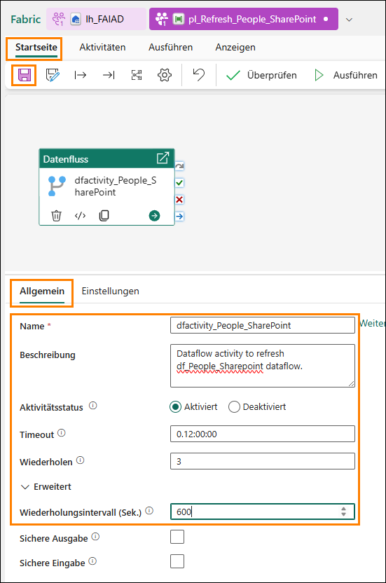

    Beachten Sie, welchen Vorteil die Verwendung der Pipeline im Vergleich zur Festlegung eines Zeitplans für den Dataflow bietet (wie es schon beim früheren Dataflow erfolgt ist):

    - Die Pipeline bietet die Möglichkeit der mehrmaligen Wiederholung, bevor die Aktualisierung fehlschlägt.

    - Die Pipeline bietet die Möglichkeit, andere Aufgaben auszuführen und den Dataflow zu aktualisieren.

## Aufgabe 4: Neue Pipeline erstellen

Fügen wir unserem Szenario etwas mehr Komplexität hinzu. Wir haben festgestellt, dass, wenn die Daten nicht um 9:00 Uhr morgens verfügbar sind, sie in der Regel innerhalb von fünf Minuten verfügbar sind. Wird das Zeitfenster verpasst, dauert es 15 Minuten, bis die Datei verfügbar ist. Wir möchten die Wiederholungen so planen, dass sie alle 5 und 15 Minuten erfolgen. Sehen wir uns an, wie dies durch die Erstellung einer neuen Pipeline erreicht werden kann.

1. Wählen Sie im linken Bereich **FAIAD_<inject key="Deployment ID" enableCopy="false"/>** aus, um zur Startseite des Arbeitsbereichs zu gelangen.

2. Klicken Sie im oberen Menü auf **+Neues Element (1)** und im Popout-Fenster auf **Pipeline (2)**.

    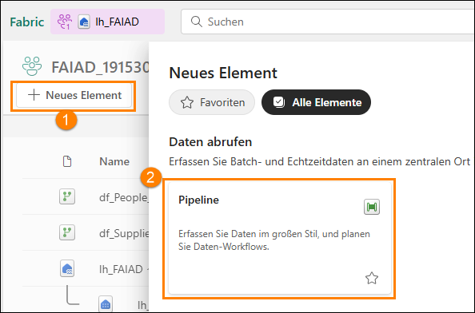

3. Das Dialogfeld „Neue Pipeline“ wird geöffnet. Geben Sie der Pipeline den **Namen pl_Refresh_People_SharePoint_Option2 (3),** und wählen Sie **Erstellen (4)** aus.

    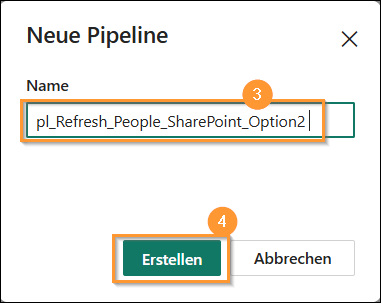

## Aufgabe 5: Bis-Aktivität erstellen

1. Sie werden zum Bildschirm „Pipeline“ weitergeleitet. Wählen Sie im Menü die Option **Aktivitäten** aus.

2. Klicken Sie rechts auf die **Auslassungspunkte (...)**.

3. Klicken Sie in der Aktivitätsliste auf **Bis**.

    > **Bis**: Mit dieser Aktivität wird eine Iteration ausgeführt, bis eine Bedingung erfüllt ist.

    In unserem Szenario erfolgt die Iteration des Dataflows so lange, bis er erfolgreich ist oder drei Versuche durchgeführt wurden.

    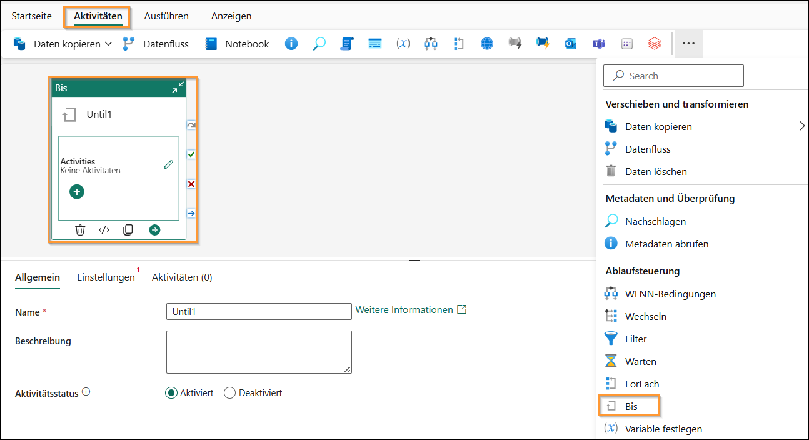

## Aufgabe 6: Variablen erstellen

1. Wir müssen Variablen für die Iteration und Festlegung des Status festlegen. Wählen Sie den **leeren Bereich** im Bereich für Pipelinedesign aus.

2. Beachten Sie, dass sich das Menü im unteren Bereich ändert. Wählen Sie **Variablen** aus.

3. Wählen Sie **+ Neu** aus, um eine neue Variable hinzuzufügen.

4. Beachten Sie, dass eine Zeile angezeigt wird. Geben Sie **varCounter** in das **Textfeld „Name“** ein. Wir verwenden diese Variable für eine dreimalige Iteration.

5. Wählen Sie im Dropdownmenü **Typ** die Option **Integer** aus.

6. Geben Sie den **Standardwert** **0** ein.

    > **Hinweis:** Wir hängen Variablennamen den Zusatz „var“ an, damit sie leicht zu finden sind und sich dieses Vorgehen bewährt hat.

    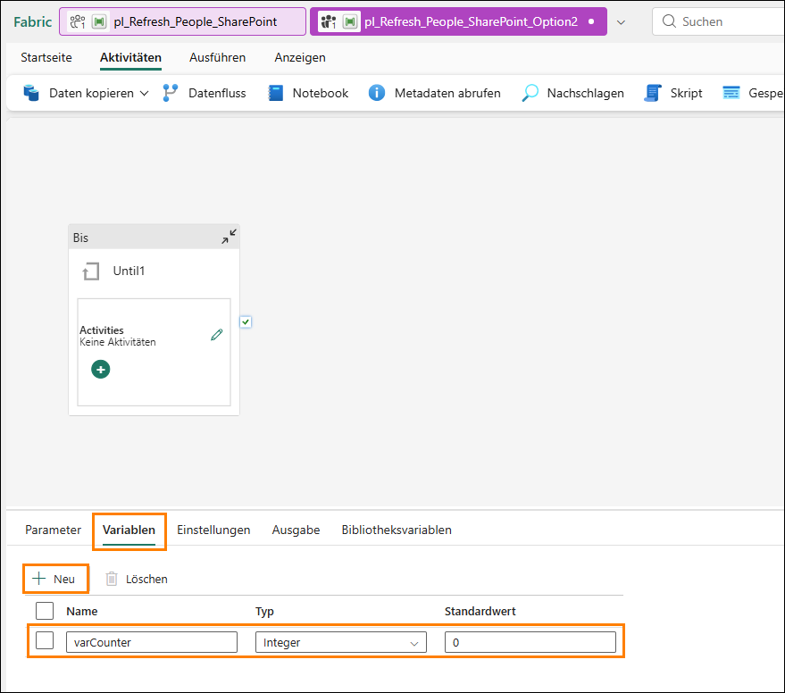

7. Wählen Sie **+ Neu** aus, um eine weitere Variable hinzuzufügen.

8. Beachten Sie, dass eine neue Zeile angezeigt wird. Geben Sie **varTempCounter** in das **Textfeld „Name“** ein. Wir werden diese Variable verwenden, um die Variable varCounter zu inkrementieren.

9. Wählen Sie im Dropdownmenü **Typ** die Option **Integer** aus.

10. Geben Sie den **Standardwert** **0** ein.

11. Fügen Sie auf die gleiche Weise drei weitere Variablen hinzu:

    1. **varIsSuccess** vom Typ **String** und Standardwert **No**. Diese Variable wird verwendet, um anzuzeigen, ob die Dataflow-Aktualisierung erfolgreich war.

    2. **varSuccess** vom Typ **String** und Standardwert **Yes**. Diese Variable wird verwendet, um den Wert „varIsSuccess“ festzulegen, wenn die Dataflow-Aktualisierung erfolgreich ist.

    3. **varWaitTime** vom Typ **Integer** und Standardwert **60**. Mit dieser Variablen wird die Wartezeit festgelegt, wenn der Dataflow fehlschlägt (entweder 5 Minuten/300 Sekunden oder 15 Minuten/900 Sekunden).

        > **Hinweis:** Achten Sie darauf, dass vor und nach dem Variablennamen kein Leerzeichen ist.

        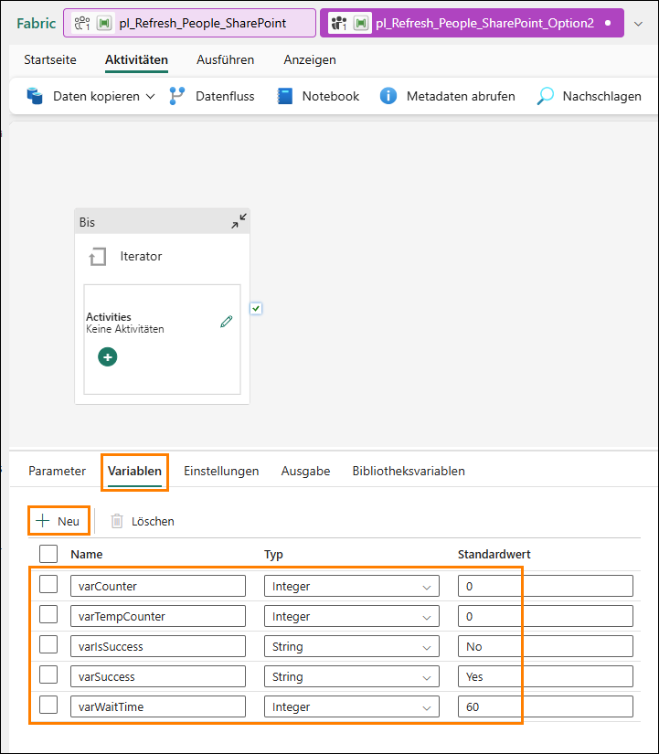

## Aufgabe 7: Bis-Aktivität konfigurieren

1. Wählen Sie die **Bis**-Aktivität aus.

2. Wählen Sie im **unteren Bereich** die Option **Allgemein** aus.

3. Geben Sie als **Name** **Iterator** ein.

4. Geben Sie als **Beschreibung** Folgendes ein: „**Iterator to refresh dataflow. It will retry up to 3 times**.“

    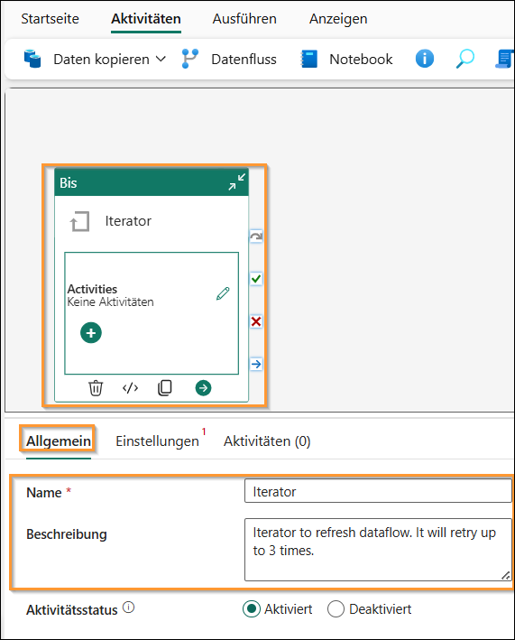

5. Wählen Sie im unteren Bereich die Option **Einstellungen (1)** aus.

6. Wählen Sie das **Textfeld Ausdruck (2)** aus. Wir müssen einen Ausdruck in dieses Textfeld eingeben, der als wahr oder falsch ausgewertet wird. Die Bis-Aktivität führt weiterhin die Iteration durch, solange dieser Ausdruck als falsch ausgewertet wird. Sobald der Ausdruck als wahr ausgewertet wird, beendet die Bis-Aktivität die Iteration und geht weiter zur nächsten Aktivität.

7. Wählen Sie den Link **Dynamischen Inhalt hinzufügen (3)** aus, der unter dem Textfeld angezeigt wird.

    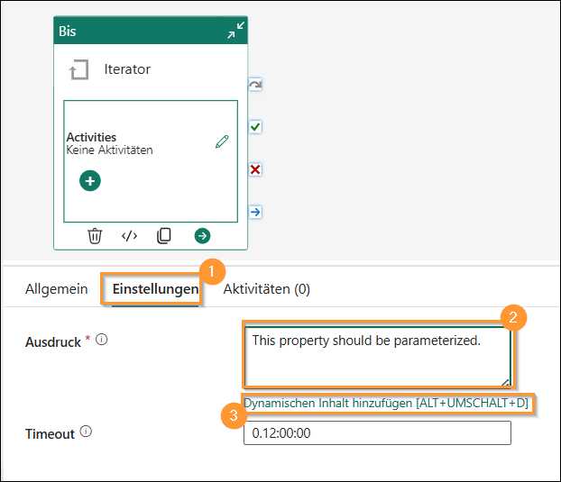

    Wir müssen einen Ausdruck schreiben, der so lange ausgeführt wird, bis der Wert **varCounter 3** oder der Wert **varIsSuccess** „Ja“ lautet. („varCounter“ und „varIsSuccess“ sind die Variablen, die wir gerade erstellt haben.)

8. Das Dialogfeld **Pipeline-Ausdrucksgenerator** wird geöffnet. In der unteren Hälfte des Dialogfelds finden Sie ein Menü:

    1. **Parameter:** Werte, die an die Pipeline übergeben werden. Beispiel: Wert von einer Pipeline, der an eine andere Pipeline übergeben wird. Diese Werte können in jedem Ausdruck verwendet werden. Sie können jedoch während der Pipeline-Ausführung nicht geändert werden.

    2. **Systemvariablen:** Diese Variablen können in Ausdrücken verwendet werden, wenn Entitäten in einem der Dienste definiert werden. Zum Beispiel Pipeline-ID, Pipeline-Name, Triggername usw.

    3. **Trigger-Parameter**: Parameter, die die Pipeline ausgelöst haben. Zum Beispiel Dateiname oder Ordnerpfad.

    4. **Funktionen:** Sie können Funktionen innerhalb von Ausdrücken aufrufen. Die Funktionen sind in die Kategorien „Sammlung“, „Konvertierung“, „Datum“, „Logisch“, „Mathematik“ und „Zeichenfolge“ unterteilt. „concat“ ist beispielsweise eine Zeichenfolgenfunktion, „add“ ist eine mathematische Funktion usw.

    5. **Variablen:** Pipeline-Variablen sind Werte, die während einer Pipeline-Ausführung festgelegt und geändert werden können. Im Gegensatz zu Pipeline-Parametern, die auf Pipeline-Ebene definiert werden und während einer Pipeline-Ausführung nicht geändert werden können, lassen sich Pipeline-Variablen innerhalb einer Pipeline mit der Aktivität „Variable festlegen“ festlegen und ändern. Wir werden die Aktivität „Variable festlegen“ in Kürze verwenden.

    6. **Bibliotheksvariablen:** Bibliotheksvariablen verwenden Variablen, die im **Fabric-Element der Variablenbibliothek** definiert sind. Diese Variablen bieten eine zentrale Möglichkeit, Konfigurationen arbeitsbereichsübergreifend zu verwalten, um CI/CD-Workflows zu unterstützen. Sie können zusammen mit Pipelines, Notizbüchern, Lakehouse-Verknüpfungen usw. verwendet werden.

        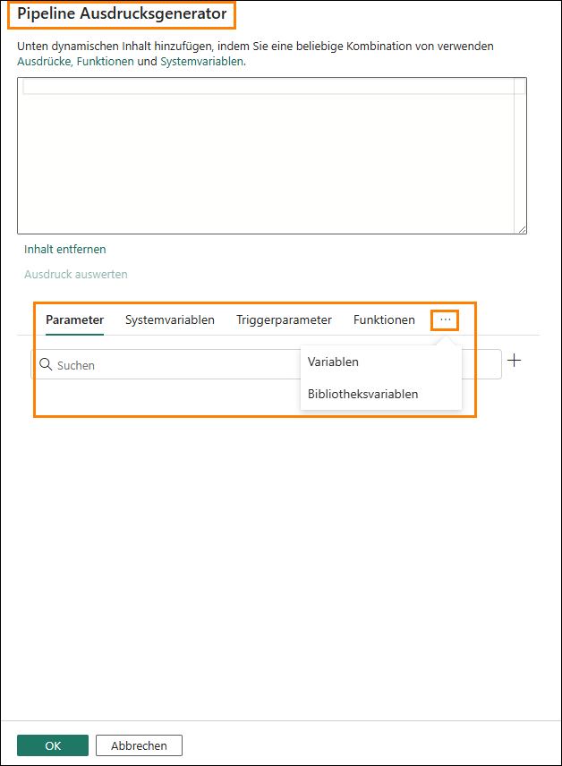

9. Klicken Sie im Menü auf **Funktionen**.

10. Wählen Sie im Abschnitt **Logical Funktionen** die **or**-Funktion aus. Beachten Sie, dass **@or()** dem Textfeld für den dynamischen Ausdruck hinzugefügt wird. Die Funktion „**or**“ benötigt zwei Parameter. Wir arbeiten am ersten Parameter.

    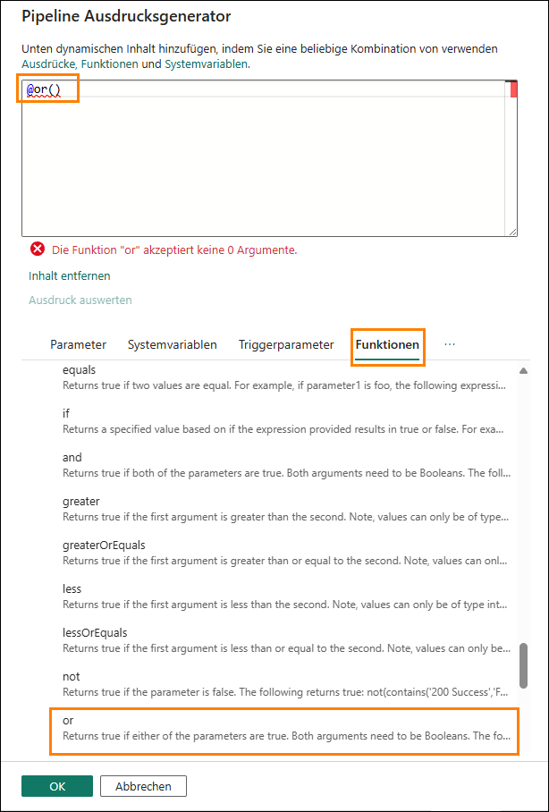

11. Platzieren Sie den Cursor **zwischen die Klammern** der Funktion **@or**.

12. Wählen Sie im Abschnitt **Logical Funktionen** die Funktion **equals** aus. Beachten Sie, dass diese dem Textfeld für den dynamischen Ausdruck hinzugefügt wird.

    > **Hinweis:** Ihre Funktion sollte wie folgt aussehen: **@or(equals())**. Die Funktion „equals“ benötigt auch zwei Parameter. Wir überprüfen, ob die Variable „varCounter“ gleich 3 ist.

    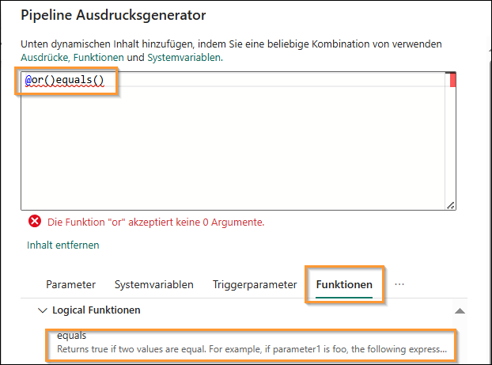

13. Platzieren Sie nun den Cursor **zwischen die Klammern** der Funktion **@equals**, um die Parameter hinzuzufügen.

14. Wählen Sie im unteren Menü **Variablen** aus.

15. Wählen Sie die Variable **varCounter** aus, bei der es sich um den ersten Parameter handelt.

16. Geben Sie **3** als zweiten Parameter der Funktion „equals“ ein. Wie im Screenshot unten lautet der Ausdruck nun **@or(equals(variables('varCounter'),3))**.

    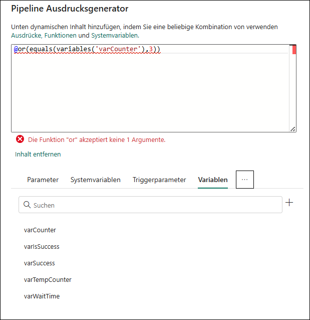

17. Wir müssen den zweiten Parameter der Funktion „**or**“ hinzufügen. **Fügen Sie** zwischen den beiden Endklammern **ein Komma** **ein**. Dieses Mal versuchen wir, den Funktionsnamen einzugeben. Beginnen Sie mit der Eingabe von **equ**, sodass Sie ein Dropdownmenü mit den verfügbaren Funktionen erhalten (dies wird als IntelliSense bezeichnet). Wählen Sie die Funktion **equals** aus.

    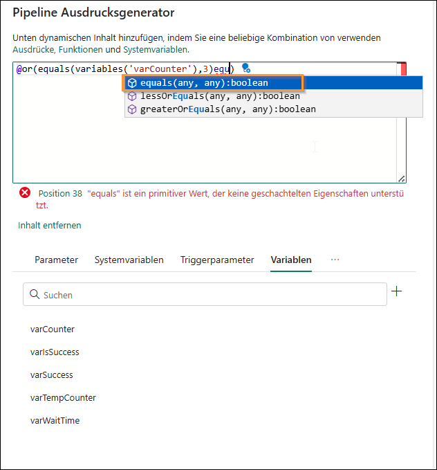

18. Der erste Parameter der Funktion „equals“ ist eine Variable. Platzieren Sie den **Cursor vor dem Komma**.

19. Beginnen Sie mit der Eingabe von **variables**.

20. Wählen Sie mithilfe von IntelliSense **variables('varIsSuccess')** aus.

21. Nach dem Komma geben wir den zweiten Parameter ein. Beginnen Sie mit der Eingabe von **variables**.

22. Wählen Sie mithilfe von IntelliSense **variables('varSuccess')** aus. Hier vergleichen wir den Wert „varIsSuccess“ mit dem Wert „varSuccess“. („varSuccess“ ist standardmäßig auf „Ja“ festgelegt.)

    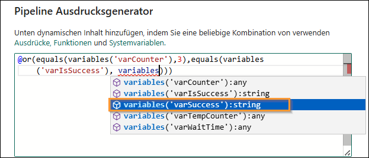

23. Ihr Ausdruck sollte nun folgendermaßen lauten:

    **@or(equals(variables('varCounter'),3),equals(variables('varIsSuccess'), variables('varSuccess')))**

24. Wählen Sie **OK** aus.

    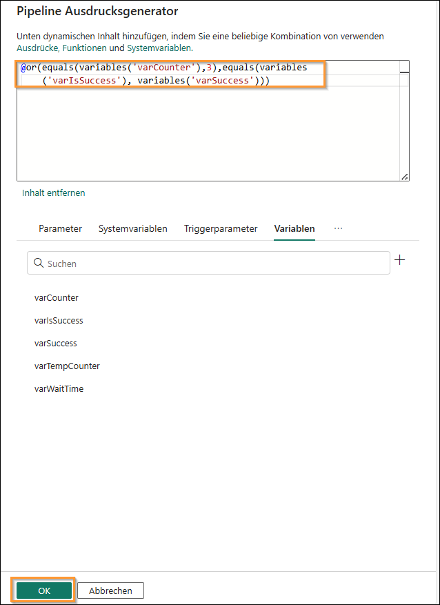

## Aufgabe 8: Dataflow-Aktivität konfigurieren

1. Sie werden zum Designbildschirm weitergeleitet. Wählen Sie bei ausgewählter **Bis-Aktivität** im **unteren Bereich** die Option **Aktivitäten** aus. Wir fügen nun die Aktivitäten hinzu, die ausgeführt werden müssen.

2. Wählen Sie in der ersten Zeile das **Bearbeitungssymbol** aus. Sie werden zum leeren Iterator-Designbildschirm weitergeleitet.

    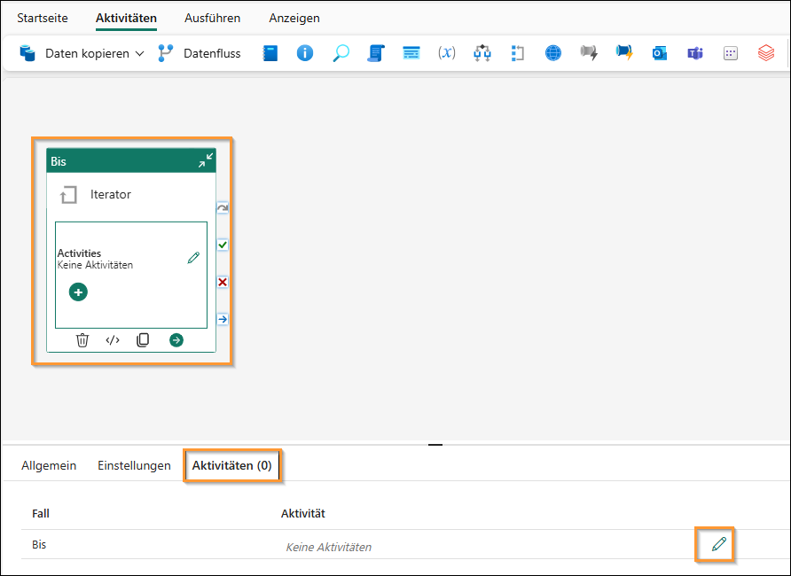

3. Wählen Sie im oberen Menü **Aktivitäten -> Dataflow** aus. Die Dataflow-Aktivität wird dem Designbereich hinzugefügt.

4. Wählen Sie bei ausgewählter **Dataflow-Aktivität** im unteren Bereich **Allgemein** aus. Wir geben der Aktivität einen Namen und eine Beschreibung.

5. Geben Sie im Feld **Name** **dfactivity_People_SharePoint** ein.

6. Geben Sie im Feld **Beschreibung** den Text **Dataflow activity to refresh df_People_Sharepoint dataflow** ein.

    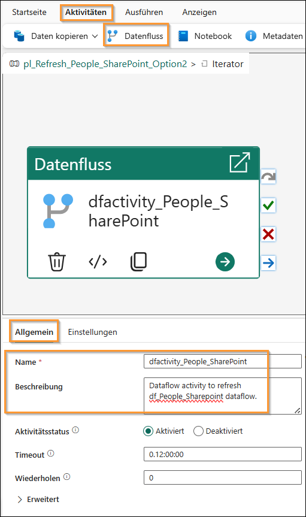

7. Wählen Sie im unteren Bereich die Option **Einstellungen** aus.

8. Stellen Sie sicher, dass der **Arbeitsbereich**, **FAIAD_<inject key="Deployment ID" enableCopy="false"/>** ist.

9. Wählen Sie im **Dropdownmenü „Dataflow“** die Option **df_People_SharePoint** aus.

    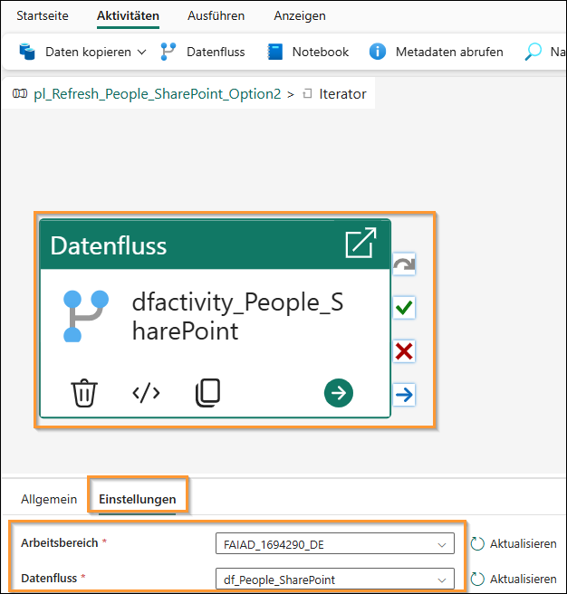

## Aufgabe 9: Erste Aktivität „Variable festlegen“ konfigurieren

Wir haben die Dataflow-Aktivität wie zuvor in der Übung konfiguriert. Nun fügen wir neue Logik hinzu. Wenn die Dataflow-Aktualisierung erfolgreich ist, müssen wir den Bis-Iterator beenden. Bedenken Sie, dass eine der Bedingungen für die Beendigung des Iterators darin besteht, den Wert der Variablen „varIsSuccess“ auf „Ja“ festzulegen.

1. Wählen Sie im oberen Menü **Aktivitäten -> Variable festlegen** aus. Die Aktivität „Variable festlegen“ wird dem Designcanvas hinzugefügt.

2. Wählen Sie bei ausgewählter **Aktivität „Variable festlegen“** im unteren Bereich **Allgemein** aus. Wir geben der Aktivität einen Namen und eine Beschreibung.

3. Geben Sie im Feld **Name** **set_varIsSuccess** ein.

4. Geben Sie im Feld **Beschreibung** den Text **Set variable varIsSuccess to Yes** ein.

    > **Hinweis:** Zeigen Sie mit der Maus auf die **Dataflow-Aktivität**. Rechts neben dem Aktivitätsfeld befinden sich vier Symbole. Diese können verwendet werden, um basierend auf dem Ergebnis der Aktivität eine Verbindung zur nächsten Aktivität herzustellen:

    1. Das Symbol eines **grauen gebogenen Pfeils** dient zum Überspringen der Aktivität.

    2. Das Symbol **Grünes Häkchen** wird bei erfolgreicher Ausführung der Aktivität verwendet.

    3. Das Symbol **Rotes X** wird verwendet, wenn die Aktivität nicht erfolgreich war.

    4. Das Symbol **Blauer gerader Pfeil** wird nach Abschluss der Aktivität verwendet.

5. Klicken Sie auf das **grüne Häkchen** der Dataflow-Aktivität „dfactivity_People_SharePoint“, und ziehen Sie es, um eine Verbindung zu der neuen **Aktivität „Variable festlegen“** **set_varIsSuccess** herzustellen. Bei erfolgreicher Dataflow-Aktualisierung möchten wir also die Aktivität „Variable festlegen“ ausführen.

    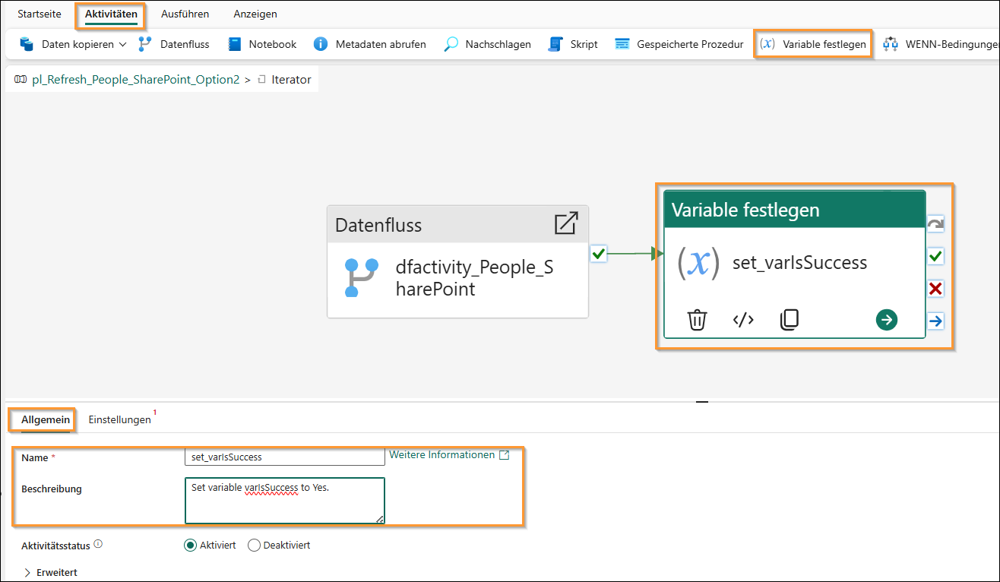

6. Klicken Sie bei ausgewählter **Aktivität „Variable festlegen“** im unteren Menü auf **Einstellungen**.

7. Stellen Sie im unteren Bereich sicher, dass der **Variablentyp** auf **Pipelinevariable** festgelegt ist.

8. Wählen Sie im Feld **Name** die Option **varIsSucces** aus. Dies ist die Variable, deren Wert wir festlegen werden.

9. Wählen Sie im Feld **Wert** das **Textfeld** aus. Wählen Sie den Link **Dynamischen Inhalt hinzufügen** aus.

    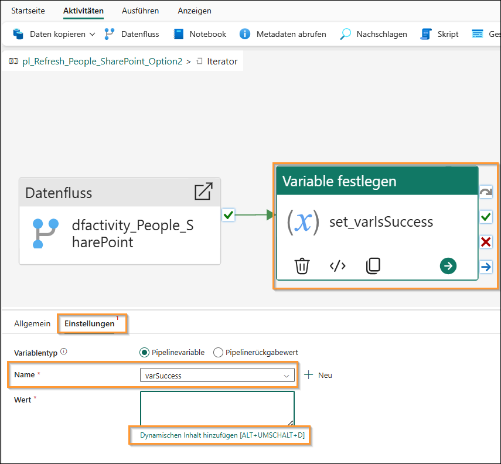

10. Das Dialogfeld Pipeline-Ausdrucksgenerator wird geöffnet. Wählen Sie unten den Textbereich **Dynamischen Inhalt unten mit einer beliebigen Kombination aus Ausdrücken, Funktionen und Systemvariablen hinzufügen (1)** aus.

11. Klicken Sie im unteren Menü auf die **Auslassungspunkte (...) (2)**, wählen Sie **Variablen (3) -> varSuccess (4)**. Beachten Sie, dass **@variables('varSuccess')** im Textbereich „Dynamischen Inhalt unten hinzufügen“ eingegeben wird. Denken Sie daran, als wir Variablen erstellt haben, hatten wir den Wert der Variablen „varSuccess“ auf „Ja“ voreingestellt. Daher weisen wir der Variablen „varIsSuccess“ den Wert „Ja“ zu.

12. Wählen Sie **OK** aus. Sie werden zum **Iterator-Designbereich** weitergeleitet.

    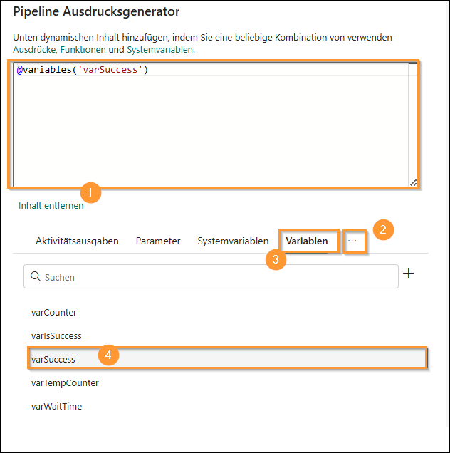

    Nun müssen wir den Zähler festlegen, wenn die Dataflow-Aktivität fehlschlägt. In einer Pipeline können wir keine Selbstreferenz für eine Variable festlegen. Das bedeutet, dass wir die Zählervariable „varCounter“ nicht inkrementieren können, indem wir ihr den Wert eins hinzufügen (varCounter = varCounter + 1). Daher nutzen wir die Variable „varTempCounter“.

## Aufgabe 10: Zweite Aktivität „Variable festlegen“ konfigurieren

1. Wählen Sie im oberen Menü **Aktivitäten -> Variable festlegen** aus. Die Aktivität „Variable festlegen“ wird dem Designcanvas hinzugefügt.

2. Wählen Sie bei ausgewählter **Aktivität „Variable festlegen“** im unteren Bereich **Allgemein** aus. Wir geben der Aktivität einen Namen und eine Beschreibung.

3. Geben Sie im Feld **Name** **set_varTempCounter** ein.

4. Geben Sie im Feld **Beschreibung** den Text **Increment variable varTempCounter** ein.

5. Ziehen Sie das **rote X** der Dataflow-Aktivität “ zur neuen Aktivität „Variable festlegen“. Bei nicht erfolgreicher Dataflow-Aktualisierung möchten wir also diese Aktivität „Variable festlegen“ ausführen.

    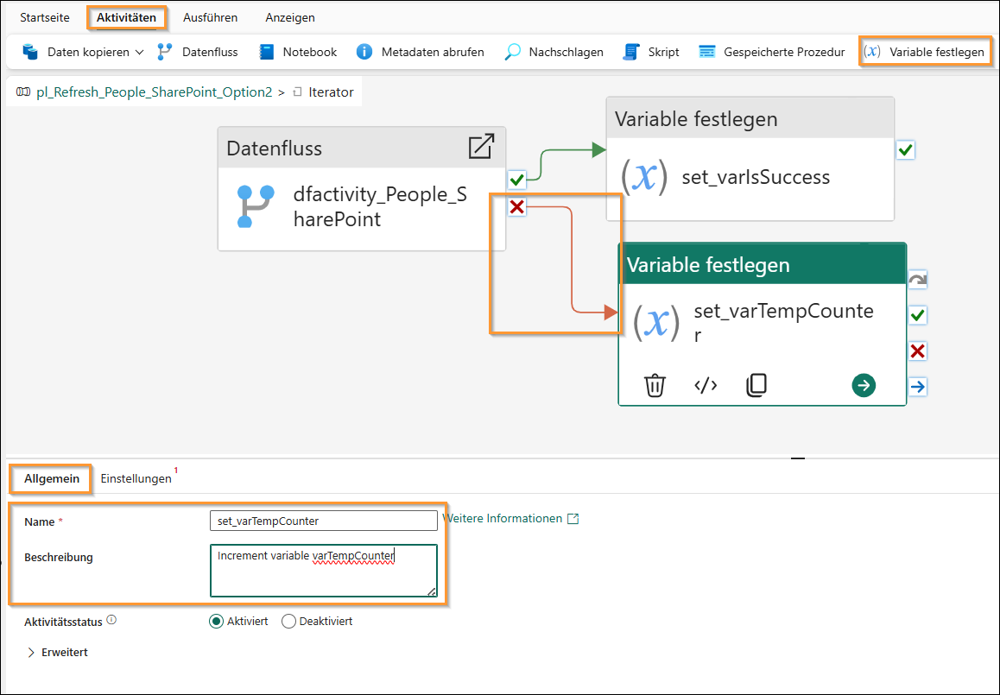

6. Wählen Sie bei ausgewählter **Aktivität „Variable festlegen“** im unteren Menü **Einstellungen** aus.

7. Stellen Sie im unteren Bereich sicher, dass der **Variablentyp** auf **Pipelinevariable** festgelegt ist.

8. Wählen Sie im Feld **Name** **varTempCounter**. aus. Dies ist die Variable, deren Wert wir festlegen werden.

9. Wählen Sie im Feld **Wert** das **Textfeld** aus. Wählen Sie den Link **Dynamischen Inhalt hinzufügen** aus.

10. Das Dialogfeld Pipeline-Audrucksgenerator wird geöffnet. Geben Sie **@add(variables('varCounter'),1)** ein.

    > **Hinweis:** Sie können diesen Ausdruck eingeben, die Funktionen über das Menü auswählen oder den Ausdruck kopieren und einfügen. Diese Funktion legt den Wert der Variablen „varTempCounter“ auf den Wert der Variablen „varCounter“ plus eins (varTempCounter = varCounter + 1) fest.

    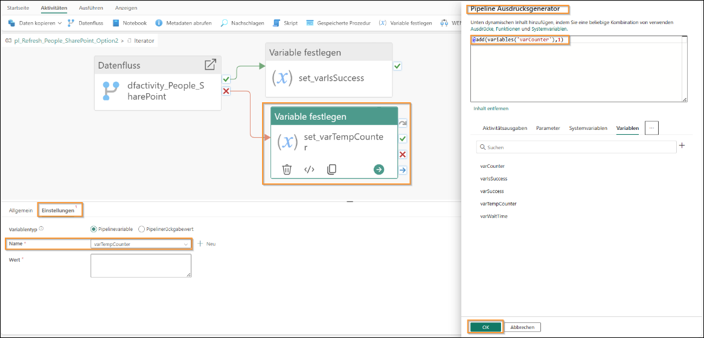

    Nun müssen wir den Wert der Variablen „varCounter“ auf den Wert „varTempCounter“ festlegen.

## Aufgabe 11: Dritte Aktivität „Variable festlegen“ konfigurieren

1. Wählen Sie im oberen Menü **Aktivitäten -> Variable festlegen** aus. Die Aktivität „Variable festlegen“ wird dem Designcanvas hinzugefügt.

2. Wählen Sie bei ausgewählter **Aktivität „Variable festlegen“** im unteren Bereich **Allgemein** aus. Wir geben der Aktivität einen Namen und eine Beschreibung.

3. Geben Sie im Feld **Name** **set_varCounter** ein.

4. Geben Sie im Feld **Beschreibung** den Text **Increment variable varCounter** ein.

5. Klicken Sie auf das **grüne Häkchen** der Aktivität zum Festlegen der Variablen „set_varTempCounter“, und ziehen Sie es, um eine Verbindung mit der neuen Aktivität „Variable festlegen“ **set_varCounter** herzustellen.

    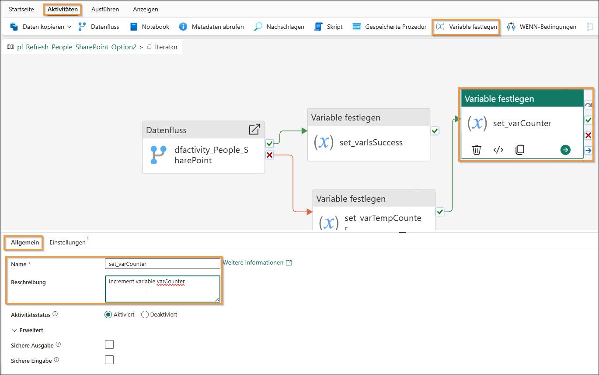

6. Wählen Sie bei ausgewählter **Aktivität „Variable festlegen“ set_varCounter** im unteren Menü **Einstellungen** aus.

7. Stellen Sie im unteren Bereich sicher, dass der **Variablentyp** auf **Pipelinevariable** festgelegt ist.

8. Wählen Sie im Feld **Name** **varCounter** aus. Dies ist die Variable, deren Wert wir festlegen werden.

9. Wählen Sie im Feld **Wert** das **Textfeld** aus. Wählen Sie den Link **Dynamischen Inhalt hinzufügen** aus.

10. Das Dialogfeld Pipeline-Ausdrucksgenerator wird geöffnet. Geben Sie **@variables('varTempCounter')** ein. Sie können diesen Ausdruck eingeben, die Funktionen über das Menü auswählen oder den Ausdruck kopieren und einfügen.

11. Klicken Sie auf OK.

    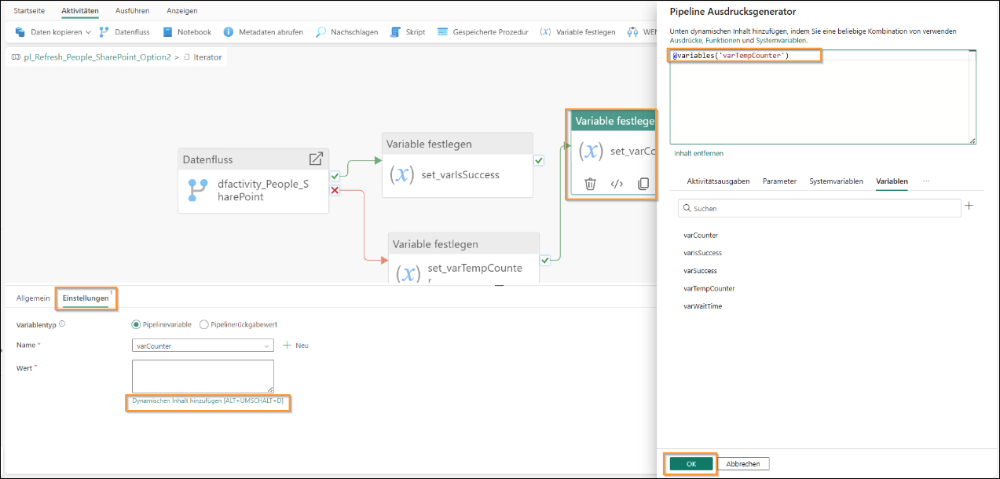

    >**Hinweis:** Diese Funktion legt den Wert der Variablen „varTempCounter“ auf den Wert der Variablen „varTempCounter“ (varCounter = varTempCounter) fest. Am Ende jeder Iteration haben sowohl varCounter als auch varTempCounter denselben Wert.

## Aufgabe 12: Aktivität „Wartezustand“ konfigurieren

Als nächstes müssen wir 5 Minuten/300 Sekunden warten, wenn die Dataflow-Aktualisierung beim ersten Mal fehlschlägt, bevor wir es erneut versuchen. Wenn die Dataflow-Aktualisierung zum zweiten Mal fehlschlägt, müssen wir 15 Minuten/900 Sekunden warten, und es erneut versuchen. Wir verwenden die Aktivität „Wartezustand“ und die Variable „varWaitTime“, um die Wartezeit festzulegen.

1. Wählen Sie im oberen Menü **Aktivitäten -> Auslassungspunkte -> Warten** aus. Die Aktivität „Wartezustand“ wird dem Designcanvas hinzugefügt.

2. Wählen Sie bei ausgewählter **Aktivität** „Wartezustand“ im unteren Bereich **Allgemein** aus. Wir geben der Aktivität einen Namen und eine Beschreibung.

3. Geben Sie im Feld **Name** **wait_onFailure** ein.

4. Geben Sie im Feld **Beschreibung** den Text **Wait for 300 seconds on 2nd try and 900 seconds on 3rd try** ein.

5. Klicken Sie auf das **grüne Häkchen** der Aktivität „Variable festlegen“ „set_varCounter“, und ziehen Sie es, um eine Verbindung mit der neuen **Aktivität „Wartezustand“ „onFailure“** herzustellen.

    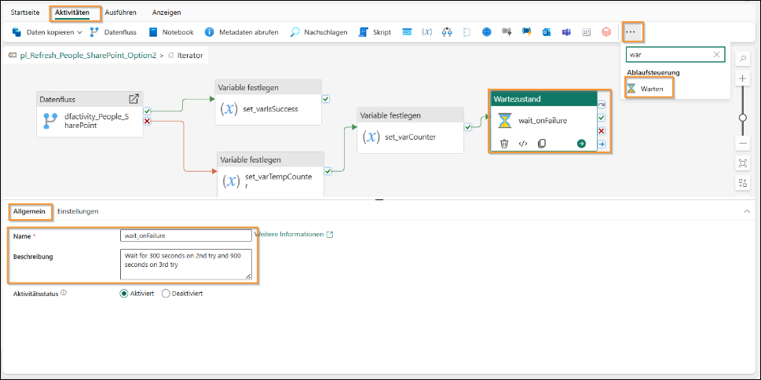

6. Klicken Sie bei ausgewählter **Aktivität** „Wartezustand“ im unteren Menü auf **Einstellungen**.

7. Wählen Sie im Feld **Wartezeit in Sekunden** das **Textfeld** und dann den Link **Dynamischen Inhalt hinzufügen** aus.

8. Das Dialogfeld Pipeline-Ausdrucksgenerator wird geöffnet. Geben Sie Folgendes ein:
    ```sql
    @if(
    greater(variables('varCounter'), 1),
    if(
        equals(variables('varCounter'), 2),
        mul(variables('varWaitTime'), 15),
        mul(variables('varWaitTime'), 0)
    ),
    mul(variables('varWaitTime'), 5)
    )
    ```
    Sie können diesen Ausdruck eingeben, die Funktionen über das Menü auswählen oder den Ausdruck kopieren und einfügen.

    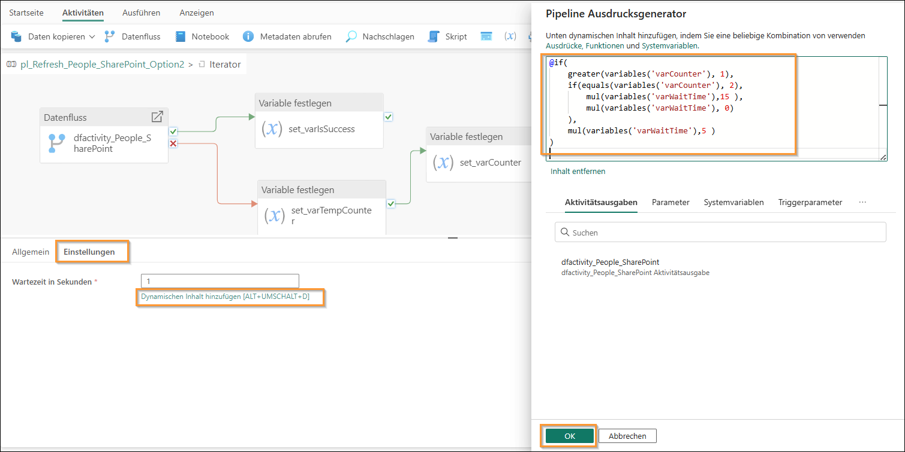

    Wir verwenden hier zwei neue Funktionen:

    - **greater:** verwendet zwei Zahlen als Parameter und vergleicht, welche größer ist.

    - **mul:** Dies ist eine Multiplikationsfunktion, die zur Multiplikation zwei Parameter benötigt.

    Der Ausdruck ist eine geschachtelte if-Anweisung. Hiermit wird überprüft, ob der Wert der Variablen „varCounter“ größer als „1“.

    Wenn dies zutrifft, wird überprüft, ob der Wert der Variablen „varCounter“ „2“ ist. Wenn dies zutrifft, wird die Wartezeit auf „varWaitTime mal 15“ festgelegt. Denken Sie daran, dass wir „varWaitTime“ standardmäßig auf „60“ festgelegt haben. Das wären 60\*15 = 900 Sekunden. Wenn der Wert der Variablen „varCounter“ nicht „2“ ist (er größer als „2“ ist, was bedeutet, dass die Dataflow-Aktualisierung dreimal fehlgeschlagen ist, ist die Iteration abgeschlossen. Wir müssen nicht mehr warten), ist die Wartezeit auf „varWaitTime \* 0“ festgelegt, also auf „0“. Wenn der Wert der Variablen „varCounter“ „1“ ist, multiplizieren wir „varWaitTime“ mit „5“. Das wären 60\*5 = 300 Sekunden.

9. Wählen Sie **OK** aus.

    > **Prüfpunkt:** Ihr **Bis**-Iterator sollte so wie im Screenshot unten aussehen.

    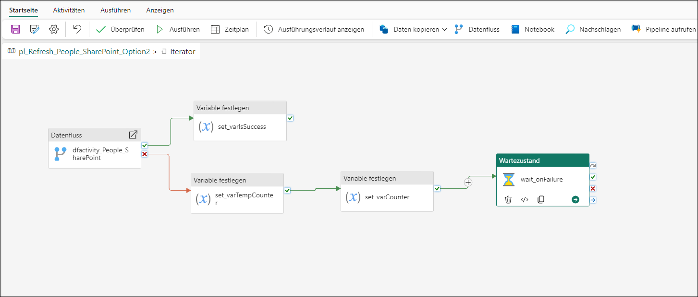

10. Wählen Sie oben links im Designcanvas **pl_Refresh_People_Sharepoint_Option2** oder **Haupt-Canvas** aus, um den Bis-Iterator zu verlassen.

    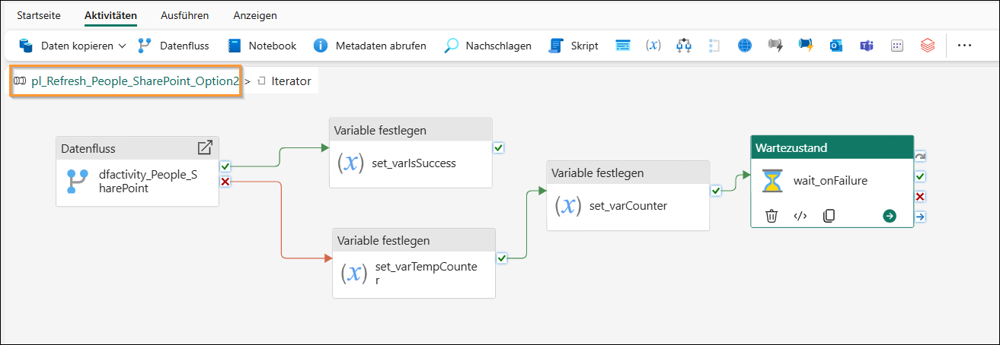

11. Nun ist die Pipeline erstellt. Wählen Sie im oberen Menü **Startseite -> Symbol „Speichern“** aus, um die Pipeline zu speichern.

    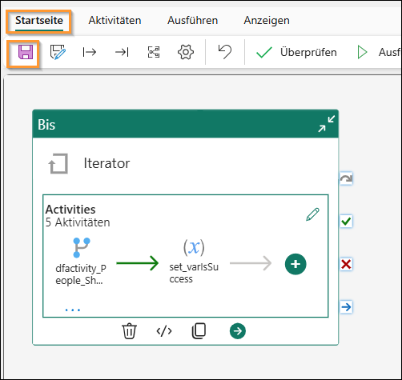

## Aufgabe 13: Geplante Aktualisierung für die Pipeline konfigurieren

1. Wir können die Pipeline testen, indem wir **Start -> Ausführen** auswählen.

    > **Hinweis:** Es kann einige Minuten dauern, bis die Pipeline vollständig aktualisiert ist. Dies ist eine Trainingsumgebung, sodass die Datei in SharePoint immer verfügbar ist. Daher schlägt Ihre Pipeline niemals fehl.

2. Wir können die Ausführung der Pipeline nach einem Zeitplan festlegen. Wählen Sie im oberen Menü **Start -> Zeitplan** aus. Das Dialogfeld „Zeitplan“ wird geöffnet.

3. Wählen Sie die Schaltfläche **Zeitplan hinzufügen** unter **Geplante Ausführung** aus.

    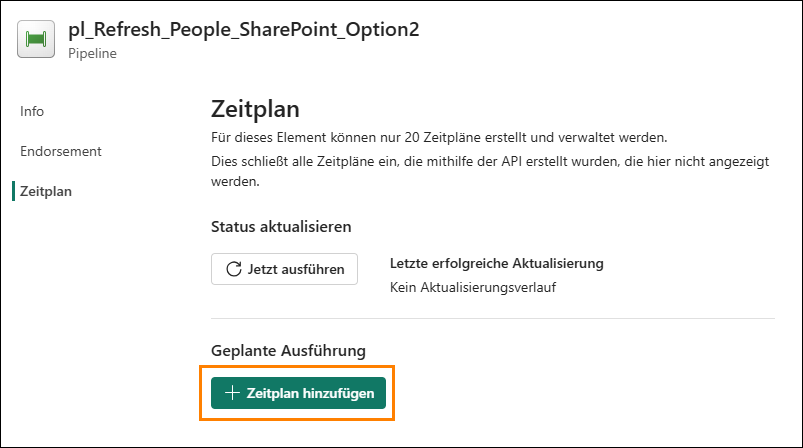

4. Legen Sie das **Dropdownmenü „Wiederholen“** auf **Täglich** fest.

5. Legen Sie die **Uhrzeit** auf **9:00 Uhr** fest.

6. Legen Sie **Startdatum und -uhrzeit** auf **heute** fest.

7. Legen Sie **Startdatum und -uhrzeit** auf ein **Datum** in der Zukunft fest.

8. Legen Sie Ihre **Zeitzone** fest.

    > **Hinweis**: Da es sich um eine Übungsumgebung handelt, können Sie die Zeitzone auf Ihre bevorzugte Zeitzone festlegen. In einem realen Szenario legen Sie die Zeitzone basierend auf Ihrem Standort/Speicherort der Datenquelle fest.

9. Wählen Sie **Speichern** aus.

10. Wählen Sie das **X** oben rechts im Dialogfeld aus, um es zu schließen.

    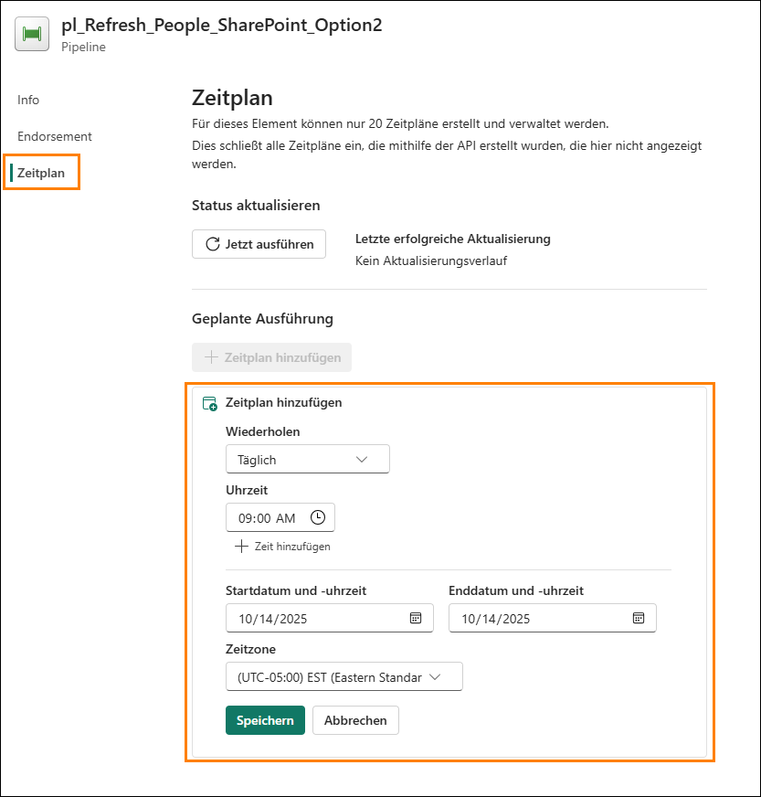

11. Wählen Sie im linken Bereich Ihren Fabric-Arbeitsbereich **FAIAD_<inject key="Deployment ID" enableCopy="false"/>** aus, um zur Startseite des Arbeitsbereichs zu gelangen**.**

    > **Hinweis:** Im Bildschirm „Zeitplan“ ist keine Option verfügbar, um Sie zu benachrichtigen, ob der Vorgang erfolgreich war oder nicht (wie beim Dataflow-Zeitplan). Die Benachrichtigung kann durch Hinzufügen einer Aktivität in der Pipeline erfolgen. Wir führen diesen Schritt nicht in dieser Übung durch, weil es sich um eine Übungsumgebung handelt.

    Wir haben Aktualisierungen für die verschiedenen Datenquellen geplant. In der nächsten Übung werden wir ein semantisches Modell mit Beziehungen, Kennzahlen und anderen Modellierungsvorgängen durchführen.

# Referenzen

Bei Fabric Analyst in a Day (FAIAD) lernen Sie einige der wichtigsten Funktionen von Microsoft Fabric kennen. Im Menü des Dienstes finden Sie in der Hilfe (?) Links zu praktischen Informationen.

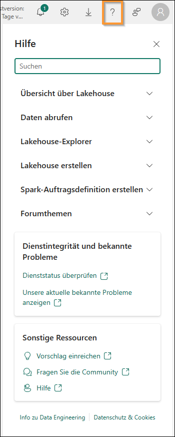

Nachfolgend finden Sie weitere Angebote zur weiteren Arbeit mit Microsoft Fabric.

- Die vollständige Ankündigung der allgemeinen Verfügbarkeit von [Microsoft Fabric finden Sie im Blogbeitrag](https://aka.ms/Fabric-Hero-Blog-Ignite23).

- Fabric bei einer [interaktiven Vorstellung](https://aka.ms/Fabric-GuidedTour) kennenlernen

- Zur [kostenlosen Testversion von Microsoft Fabric](https://aka.ms/try-fabric) anmelden

- [Die Microsoft Fabric-Webseite](https://aka.ms/microsoft-fabric) besuchen

- Mit [Modulen von Fabric Learning](https://aka.ms/learn-fabric) neue Qualifikationen erwerben

- [Technische Dokumentation zu Fabric](https://aka.ms/fabric-docs) lesen

- [Kostenloses E-Book zum Einstieg in Fabric](https://aka.ms/fabric-get-started-ebook) lesen

- Mitglied der [Fabric Community](https://aka.ms/fabric-community) werden, um Fragen zu stellen, Feedback zu geben und sich mit anderen auszutauschen

Lesen Sie die Blogs, in denen die Fabric-Funktionen ausführlich beschrieben werden:

- [Blog zum Data Factory-Funktionsbereich in Fabric](https://aka.ms/Fabric-Data-Factory-Blog)

- [Blog zum Data Engineering-Funktionsbereich von Synapse in Fabric](https://aka.ms/Fabric-DE-Blog)

- [Blog zum Data Science-Funktionsbereich von Synapse in Fabric](https://aka.ms/Fabric-DS-Blog)

- [Blog zum Data Warehousing-Funktionsbereich von Synapse in Fabric ](https://aka.ms/Fabric-DW-Blog)

- [Blog zum Real-Time Analytics-Funktionsbereich von Synapse in Fabric](https://aka.ms/Fabric-RTA-Blog)

- [Blog mit Ankündigungen zu Power BI](https://aka.ms/Fabric-PBI-Blog)

- [Blog zum Data Activator-Funktionsbereich in Fabric](https://aka.ms/Fabric-DA-Blog)

- [Blog zu Verwaltung und Governance in Fabric](https://aka.ms/Fabric-Admin-Gov-Blog)

- [Blog zu OneLake in Fabric](https://aka.ms/Fabric-OneLake-Blog)

- [Blog zur Dataverse- und Microsoft Fabric-Integration](https://aka.ms/Dataverse-Fabric-Blog)

© 2026 Microsoft Corporation. Alle Rechte vorbehalten.

Durch die Verwendung der vorliegenden Demo/Übung stimmen Sie den folgenden Bedingungen zu:

Die in dieser Demo/Übung beschriebene Technologie/Funktionalität wird von der Microsoft Corporation bereitgestellt, um Feedback von Ihnen zu erhalten und Ihnen Wissen zu vermitteln. Sie dürfen die Demo/Übung nur verwenden, um derartige Technologiefeatures und Funktionen zu bewerten und Microsoft Feedback zu geben. Es ist Ihnen nicht erlaubt, sie für andere Zwecke zu verwenden. Es ist Ihnen nicht gestattet, diese Demo/Übung oder einen Teil derselben zu ändern, zu kopieren, zu verbreiten, zu übertragen, anzuzeigen, auszuführen, zu vervielfältigen, zu veröffentlichen, zu lizenzieren, zu transferieren oder zu verkaufen oder aus ihr abgeleitete Werke zu erstellen.

DAS KOPIEREN ODER VERVIELFÄLTIGEN DER DEMO/ÜBUNG (ODER EINES TEILS DERSELBEN) AUF EINEN/EINEM ANDEREN SERVER ODER SPEICHERORT FÜR DIE WEITERE VERVIELFÄLTIGUNG ODER VERBREITUNG IST AUSDRÜCKLICH UNTERSAGT.

DIESE DEMO/ÜBUNG STELLT BESTIMMTE SOFTWARE-TECHNOLOGIE-/PRODUKTFEATURES UND FUNKTIONEN, EINSCHLIESSLICH POTENZIELLER NEUER FEATURES UND KONZEPTE, IN EINER SIMULIERTEN UMGEBUNG OHNE KOMPLEXE EINRICHTUNG ODER INSTALLATION FÜR DEN OBEN BESCHRIEBENEN ZWECK BEREIT. DIE TECHNOLOGIE/KONZEPTE IN DIESER DEMO/ÜBUNG ZEIGEN MÖGLICHERWEISE NICHT DAS VOLLSTÄNDIGE FUNKTIONSSPEKTRUM UND FUNKTIONIEREN MÖGLICHERWEISE NICHT WIE DIE ENDGÜLTIGE VERSION. UNTER UMSTÄNDEN VERÖFFENTLICHEN WIR AUCH KEINE ENDGÜLTIGE VERSION DERARTIGER FEATURES ODER KONZEPTE. IHRE ERFAHRUNG BEI DER VERWENDUNG DERARTIGER FEATURES UND FUNKTIONEN IN EINER PHYSISCHEN UMGEBUNG KANN FERNER ABWEICHEND SEIN.

**FEEDBACK.** Wenn Sie Feedback zu den Technologiefeatures, Funktionen und/oder Konzepten geben, die in dieser Demo/Übung beschrieben werden, gewähren Sie Microsoft das Recht, Ihr Feedback in jeglicher Weise und für jeglichen Zweck kostenlos zu verwenden, zu veröffentlichen und gewerblich zu nutzen. Außerdem treten Sie Dritten kostenlos sämtliche Patentrechte ab, die erforderlich sind, damit deren Produkte, Technologien und Dienste bestimmte Teile einer Software oder eines Dienstes von Microsoft, welche/welcher das Feedback enthält, verwenden oder eine Verbindung zu dieser/diesem herstellen können. Sie geben kein Feedback, das einem Lizenzvertrag unterliegt, aufgrund dessen Microsoft Drittparteien eine Lizenz für seine Software oder Dokumentation gewähren muss, weil wir Ihr Feedback in diese aufnehmen. Diese Rechte bestehen nach Ablauf dieser Vereinbarung fort.

DIE MICROSOFT CORPORATION LEHNT HIERMIT JEGLICHE GEWÄHRLEISTUNGEN UND GARANTIEN IN BEZUG AUF DIE DEMO/ÜBUNG AB, EINSCHLIESSLICH ALLER AUSDRÜCKLICHEN, KONKLUDENTEN ODER GESETZLICHEN GEWÄHRLEISTUNGEN UND GARANTIEN DER HANDELSÜBLICHKEIT, DER EIGNUNG FÜR EINEN BESTIMMTEN ZWECK, DES RECHTSANSPRUCHS UND DER NICHTVERLETZUNG VON RECHTEN DRITTER. MICROSOFT MACHT KEINERLEI ZUSICHERUNGEN BZW. ERHEBT KEINERLEI ANSPRÜCHE IM HINBLICK AUF DIE RICHTIGKEIT DER ERGEBNISSE UND DES AUS DER VERWENDUNG DER DEMO/ÜBUNG RESULTIERENDEN ARBEITSERGEBNISSES BZW. BEZÜGLICH DER EIGNUNG DER IN DER DEMO/ÜBUNG ENTHALTENEN INFORMATIONEN FÜR EINEN BESTIMMTEN ZWECK.

**HAFTUNGSAUSSCHLUSS**

Diese Demo/Übung enthält nur einen Teil der neuen Features und Verbesserungen in Microsoft Power BI. Einige Features können sich unter Umständen in zukünftigen Versionen des Produkts ändern. In dieser Demo/Übung erhalten Sie Informationen über einige, aber nicht über alle neuen Features. 
