# Microsoft Fabric - Fabric Analyst in a Day

## Inhalt

- Einführung
- Anmeldeinformationen für Übungen:
- Beheben von Anmeldeproblemen bei Snowflake
- Links zu Übungen:
- Importieren von Dataflow-Vorlagen:
- Vor dem Import aus der Dataflow-Vorlage ist Folgendes zu beachten
- So importieren Sie eine Dataflow-Vorlage
- Ansichten mit T-SQL erstellen
- Planungs-ML-Demo
- Anforderung
- So erstellen Sie ein Notebook
- Lakehouse zum Notebook hinzufügen
- Python-Bibliothek einbetten
- Code zum Erstellen der Prognose ausführen
- Initialize Spark session
- Load data from your specific Spark table
- Aggregate data to monthly level
- Convert to Pandas DataFrame and prepare for Prophet
- Fit the Prophet model
- Create a DataFrame for future predictions (e.g., next 12 months)
- Forecast
- Plotting the forecast
- Data Activator-Demo
- Anforderung
- Szenario
- Kennzahl „Umsatzabweichung %“ hinzufügen
- Tabellenvisual erstellen
- Activator erstellen
- Übersicht über Activator
- Einen Testalarm senden
- Demo zu Semantic Link
- Anforderung
- Szenario
- Best-Practice-Analyse
- Speicheranalyse

Ein Screenshot zur Auswahl von Arbeitsbereich-Einstellungen

# **Einführung**

Dieses Dokument dient als Leitfaden bei folgenden Themen:

- Anmeldeinformationen für Übungen

- So importieren Sie eine Dataflow-Vorlage

- Schritte für Planungs-ML-Demo

- Schritte für Data Activator-Demo

- Schritte für Data Mirroring-Demo

**Haftungsausschluss:** Beachten Sie, dass täglich Änderungen am Produkt erfolgen und einige Screenshots daher mitunter veraltet sind. Es wird versucht, dies bei der nächsten Aktualisierung zu beheben.

# **Anmeldeinformationen für Übungen:**

Sollte einer der Teilnehmer die Übungen in einer anderen Umgebung durchführen wollen, finden Sie hier die Anmeldeinformationen, die ggf. weiterzugeben sind.

Zur Herstellung einer Verbindung mit Dataverse und SharePoint verwenden die Teilnehmer den Benutzernamen und das Kennwort ihres Übungskontos.

1. **Benutzername:** TE_SNOWFLAKE1

2. **Kennwort:** 8UpfRpExVDXv2AC1

3. **SAS-Token:** ?sv=2023-01-03&ss=btqf&srt=sco&st=2025-06-30T10%3A15%3A46Z&se=2026-06-30T10%3A15%3A00Z&sp=rl&sig=hVeyxY4F72YVH3X%2BlnIvVTg8M%2FwZgLIhDzBgHlv1580%3D

    **Hinweis:** Wenn Sie Probleme beim Herstellen einer Verbindung zu Snowflake mit den Anmeldeinformationen aus den Umgebungsdetails haben, verwenden Sie bitte die die nachfolgenden Anmeldeinformationen.

    - **Snowflake-Benutzername:** SNOWFLAKE_BACKUP

    - **Snowflake-Kennwort:** 8UpfRpExVDXv2AC1

    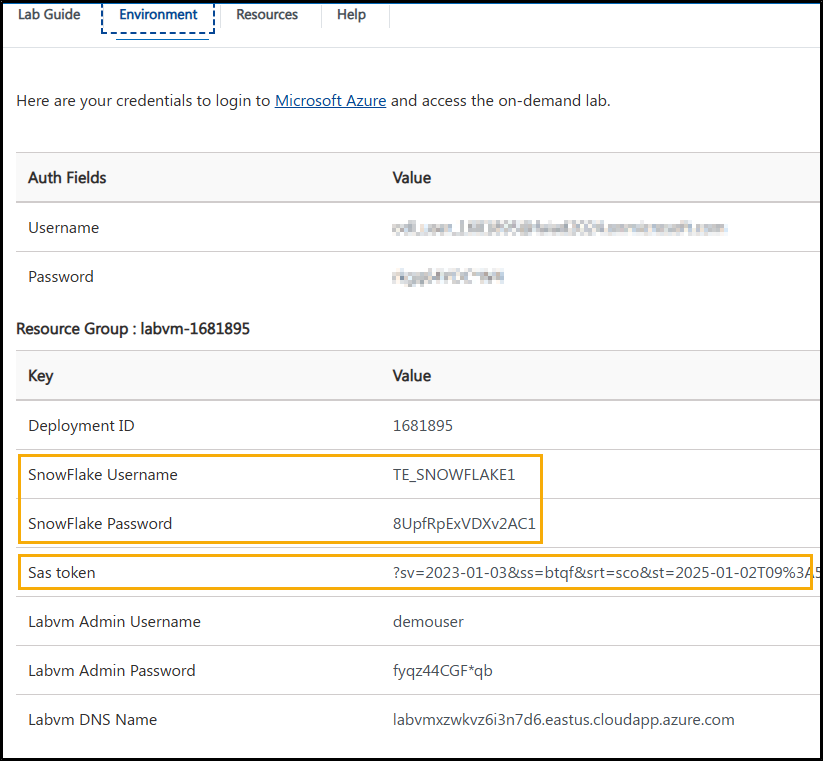

### Beheben von Anmeldeproblemen bei Snowflake

Haben Teilnehmer Probleme mit dem Anmelden bei Snowflake, führen Sie bitte folgende Schritte aus. Dadurch erhalten Sie eine detaillierte Fehlerbeschreibung.

1. Öffnen Sie ein neues Browserfenster. Navigieren Sie zu **dlhdzca-bab11165.snowflakecomputing.com**. Das ist der Snowflake-Server, den wir verwenden.

2. Geben Sie die **Anmeldeinformationen** ein. Sollte ein Fehler auftreten, erhalten Sie eine detaillierte Fehlerbeschreibung wie im nachfolgenden Screenshot.

    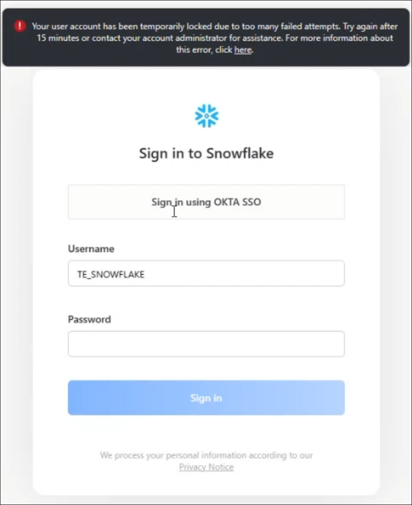

3. Für den Fall, dass sich der Fehler nicht beheben lässt, stehen in **Azure Data Lake** **Snowflake-Daten zur Verfügung,** und es gibt eine Dataflow-Vorlage (**df_Supplier_ADLSGen2.pqt**) in **C:\FAIAD\Solutions**. Ihre Teilnehmer können die nachfolgenden Schritte befolgen, um diese Vorlage zu importieren.

# **Links zu Übungen:**

- [Portugiesisch (Brasilien)](https://experience.cloudlabs.ai/#/labguidepreview/aab00958-5596-4175-9bc9-39ece2586314)

- [Chinesisch](https://experience.cloudlabs.ai/#/labguidepreview/3c8f94bd-6936-4a18-a1e3-8b606402531e)

- [Englisch](https://experience.cloudlabs.ai/#/labguidepreview/b63b312d-0c58-4fd0-bee1-05a94affa927)

- [Französisch](https://experience.cloudlabs.ai/#/labguidepreview/e9c3e273-1dd1-4db8-80e3-aedfe41a1e9b)

- [Deutsch](https://experience.cloudlabs.ai/#/labguidepreview/e697a208-a982-4c6d-b32b-7e83d39c7186)

- [Italienisch](https://experience.cloudlabs.ai/#/labguidepreview/b984b3dd-928d-492e-be2c-de1d49dd2640)

- [Japanisch](https://experience.cloudlabs.ai/#/labguidepreview/bb29b27d-7a77-4e4e-9c0d-a12a86397a1f)

- [Koreanisch](https://experience.cloudlabs.ai/#/labguidepreview/544a6b13-8546-454d-8270-3540fe6a9566)

- [Spanisch](https://experience.cloudlabs.ai/#/labguidepreview/16998c52-2637-4c65-b691-0fa5ac9091d7)

# **Importieren von Dataflow-Vorlagen:**

Als Kursleiter können Sie den Teilnehmern die Möglichkeit geben, Dataflow-Vorlagen zu importieren. Vorlagen werden wie folgt importiert:

### Vor dem Import aus der Dataflow-Vorlage ist Folgendes zu beachten

1. Haben die Teilnehmer **die Tabellen in Lakehouse bereits erstellt**, müssen sie zuerst die Tabelle in Lakehouse löschen, bevor sie das PQT laden (andernfalls müssen sie die Geo-Tabelle in den neuen Dataflow umbenennen und sie dann später in den Übungen erfassen).

2. Die Teilnehmer müssen die Ziele für die entsprechenden Tabellen einrichten. Dabei ist darauf zu achten, dass das Häkchen bei „**Staging aktivieren**“ nicht gesetzt ist. Am besten überprüfen Sie es selbst noch einmal, da es in manchen Fällen trotzdem aktiviert war.

3. Folgende Tabellen benötigen im df_Supplier_Snowflake Ziele:

    1. Supplier

    2. PO

4. Folgende Tabelle benötigt im df_People_SharePoint ein Ziel:

    1. People

### So importieren Sie eine Dataflow-Vorlage

1. Wechseln Sie zum **Fabric-Arbeitsbereich, den Sie in Aufgabe 2 von Übung 2 erstellt haben**, mit dem Namen **FAIAD_<Benutzername>**.

2. Wählen Sie im Menü die Option **Neues Element-> Dataflow Gen2** aus.

    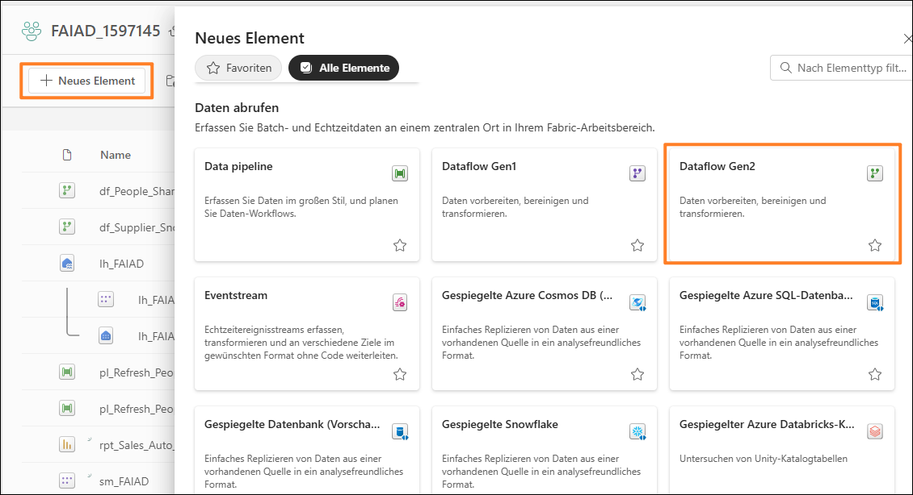

3. Das Power Query-Fenster wird geöffnet. Wählen Sie in der Mitte die Option **Aus einer Power Query Vorlage importieren** aus.

    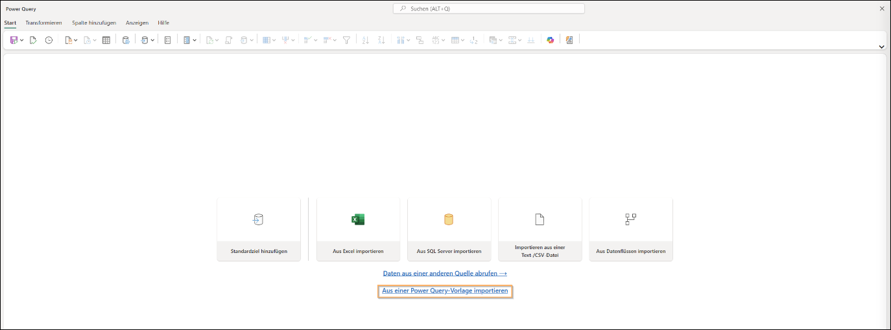

4. Navigieren Sie in der Übungsumgebung zum Ordner **C:\FAIAD\Solutions**.

5. Wählen Sie den zu importierenden Dataflow aus. Wir importieren den Dataflow **df_People_SharePoint.pqt**

6. Klicken Sie auf **Öffnen**.

    Beachten Sie nach dem Import, dass die Abfrage und alle Schritte für die Abfrage importiert wurden. Die Verbindung hingegen muss konfiguriert werden. Außerdem muss das Datenziel festgelegt werden. Führen Sie diese Arbeiten mithilfe der Übungsanleitung durch.

    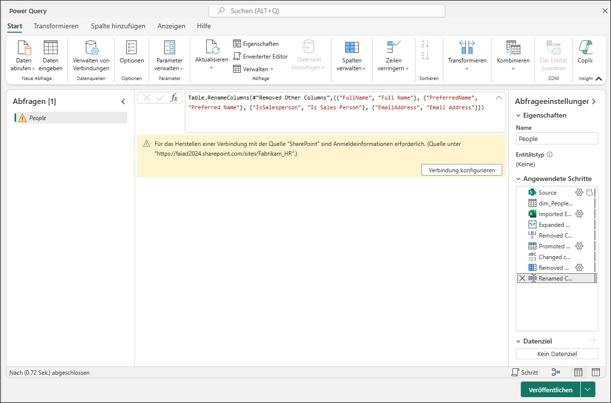

# **Ansichten mit T-SQL erstellen**

Sie können als Kursleiter den Teilnehmern erlauben, Ansichten mit T-SQL zu erstellen. T-SQL für Geo‑, Product‑, Reseller‑ und Sales-Ansichten steht im Ordner **Solutions** zur Verfügung. Bitte öffnen Sie ein neues SQL-Abfragefenster im Lakehouse, und führen Sie diese T-SQL-Anweisungen aus. Muss eine Ansicht entfernt werden, nutzen Sie dazu die Datei zum Entfernen einer Ansicht, die sich ebenfalls im Ordner **Lösungen** befindet.

**Hinweis:** Dies sind CREATE-Anweisungen. Vor der Ausführung dieser Anweisungen müssen alle vorhandenen Ansichten mit dem gleichen Namen gelöscht werden.

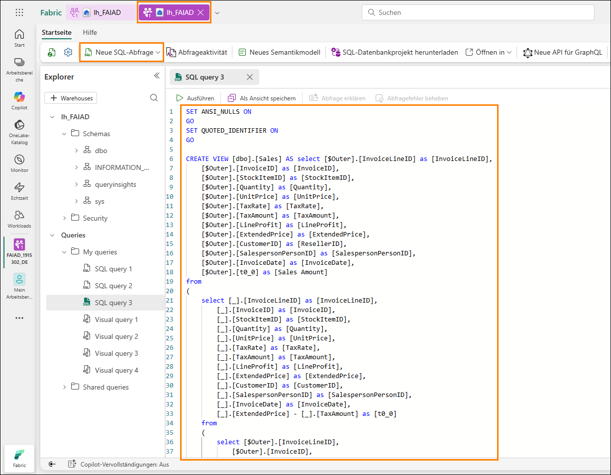

# **Planungs-ML-Demo**

### Anforderung

Bevor Sie mit den nächsten Schritten fortfahren, müssen Sie als Kursleiter die Übungen 1 bis 6 erledigen und alle Daten erfassen.

Für die Demo müssen Sie eine Python-Bibliothek namens **Prophet installieren.** Diese kann entweder direkt im Notebook eingebunden werden, oder Sie können eine Umgebung erstellen. In dieser Demo nutzen wir den eingebundenen Modus.

### So erstellen Sie ein Notebook

1. Wechseln Sie zum **Fabric-Arbeitsbereich, den Sie in Aufgabe 2 von Übung 2 erstellt haben**, mit dem Namen **FAIAD_<Benutzername>**.

2. Wählen Sie aus dem Menü + **Neues Element** -> Verwenden Sie das Suchfeld, um das **Notizbuch zu suchen** -> Wählen Sie das **Notizbuch** aus.

    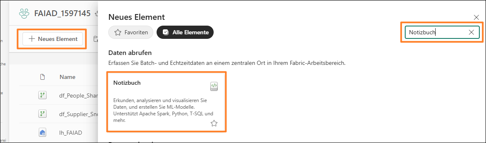

3. Stellen Sie das Layout **kurz vor**: Notebook, Sprache, Umgebung, Erstellung neuer Zellen usw.

### Lakehouse zum Notebook hinzufügen

Wir müssen dem Notebook ein Standard-Lakehouse zuordnen.

1. Wählen Sie im Bereich „Explorer“ die Registerkarte **Datenelemente** aus.

    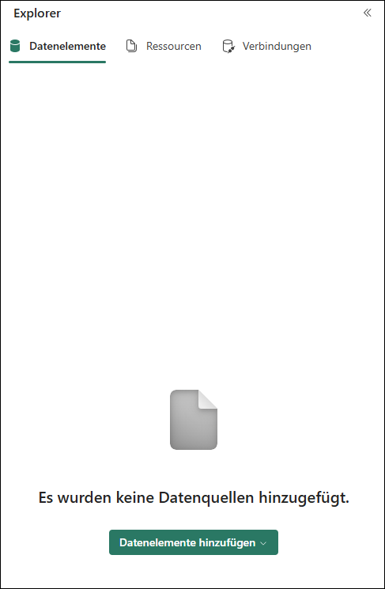

2. Wählen Sie im Bereich „Explorer“ **Datenelemente hinzufügen** aus.

3. Wählen Sie **Aus OneLake-Katalog** aus.

    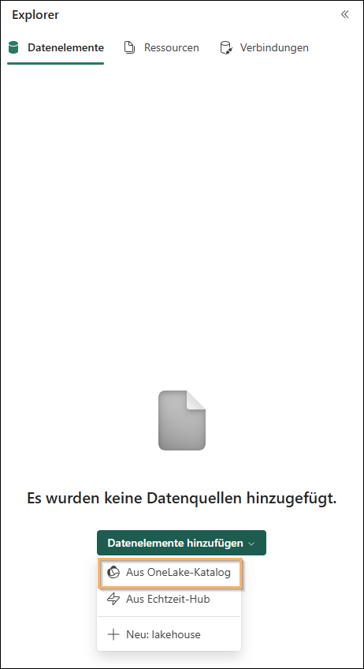

4. Das Dialogfeld „OneLake Data Hub“ wird geöffnet. Wählen Sie das Lakehouse **lh_FAIAD** aus.

5. Wählen Sie **Hinzufügen** aus. Das Lakehouse ist nun dem Notebook zugeordnet.

    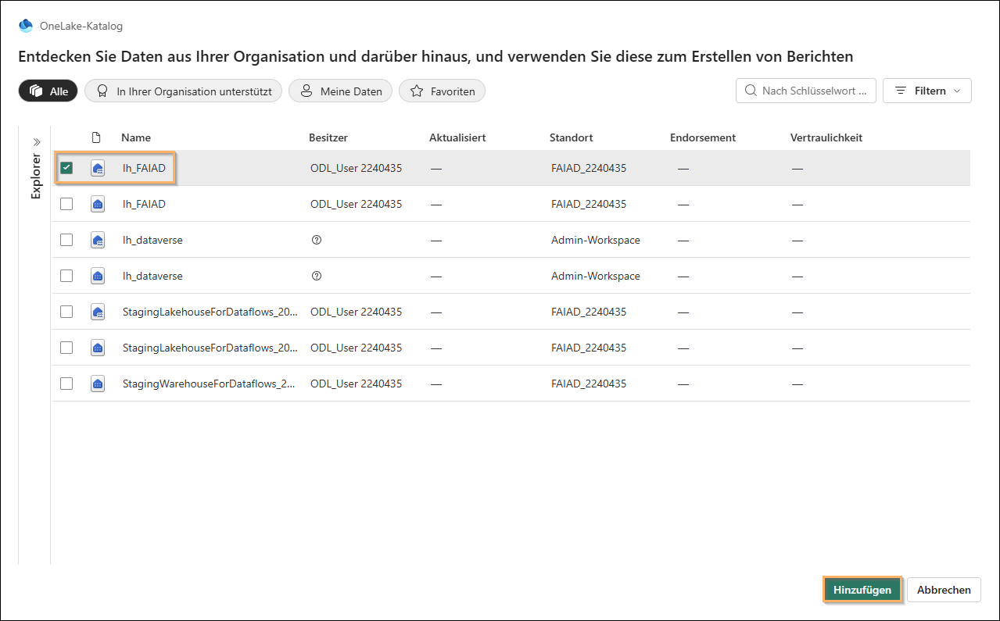

### Python-Bibliothek einbetten

Für die Demo müssen Sie eine Python-Bibliothek namens **Prophet installieren.** Diese wird eingebettet.

1. Um **die Python-Bibliothek zu installieren,** geben Sie den folgenden Code in die Zelle ein.

    !pip install prophet

2. Führen Sie den Code aus, indem Sie neben der Zelle auf die Schaltfläche **Wiedergeben** klicken.

    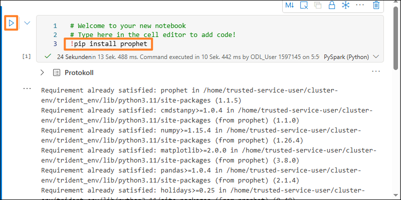

### Code zum Erstellen der Prognose ausführen

1. Erstellen Sie eine **neue Zelle**.

2. Geben Sie folgenden **Code** ein:

    from pyspark.sql import SparkSession

    from pyspark.sql.functions import month, year, col

    from prophet import Prophet

    import pandas as pd

    # Initialize Spark session

    spark = SparkSession.builder.appName("Prophet Forecasting").getOrCreate()

    # Load data from your specific Spark table

    df = spark.sql("SELECT \* FROM lh_FAIAD.Invoices i JOIN lh_FAIAD.InvoiceLineItems il ON i.InvoiceID = il.InvoiceID")

    # Aggregate data to monthly level

    monthly_df = df.withColumn("Month", month("InvoiceDate"))

    .withColumn("Year", year("InvoiceDate"))

    .groupBy("Year", "Month")

    .sum("Quantity")

    .orderBy("Year", "Month")

    # Convert to Pandas DataFrame and prepare for Prophet

    pandas_df = monthly_df.toPandas()

    pandas_df['ds'] = pd.to_datetime(pandas_df[['Year', 'Month']].assign(DAY=1))

    pandas_df['y'] = pandas_df['sum(Quantity)']

    # Fit the Prophet model

    model = Prophet(yearly_seasonality=True, weekly_seasonality=False,daily_seasonality=False)

    model.fit(pandas_df[['ds', 'y']])

    # Create a DataFrame for future predictions (e.g., next 12 months)

    future = model.make_future_dataframe(periods=12, freq='M')

    # Forecast

    forecast = model.predict(future)

    # Plotting the forecast

    model.plot(forecast)

    model.plot_components(forecast)

3. Erklären Sie den **Code** schrittweise (Hinweise sind als Kommentare angegeben).

4. Führen Sie den Code aus, indem Sie neben der Zelle auf die Schaltfläche **Wiedergeben** klicken.

    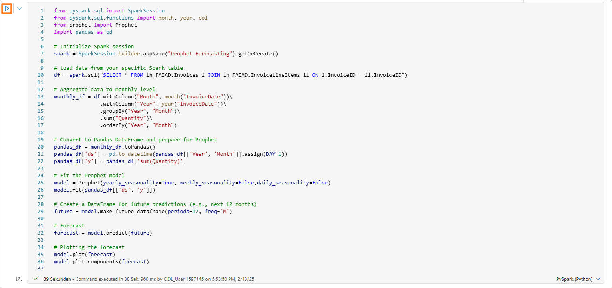

    Erläutern Sie den Teilnehmern die drei erstellten Diagramme (unten). Es handelt sich um Ist-Werte bis Mai 2023, und danach erfolgt eine Prognose über zwölf Monate.

    Beachten Sie, dass im **ersten Diagramm** Saisonalität und Prognosen bis April 2025 entfallen.

    Beachten Sie, dass im **zweiten Diagramm** bis April 2025 der Trend wegfällt und die Prognosen mit Saisonalität ergänzt werden.

    

    Im **dritten Diagramm** erfolgen die Prognosen anhand von Trend und Saisonalität. Dieses Diagramm gibt auch die Ober- und Untergrenze vor.

    

5. Erstellen Sie eine **neue Zelle**.

6. Fügen Sie folgenden **Code** in die Zelle ein:

    display(forecast)

    #write forecast data to a table

    spark.createDataFrame(forecast).write.saveAsTable("Sales_Forecast", mode="overwrite")

7. Führen Sie den Code durch Klicken auf die Schaltfläche **Wiedergeben** aus.

    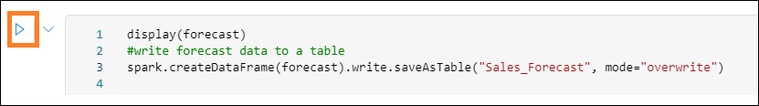

8. Erklären Sie den Teilnehmern die **angezeigten Daten**.

9. Zeigen Sie, dass im Lakehouse eine neue Tabelle mit dem Namen **sales_forecast** erstellt wurde.

    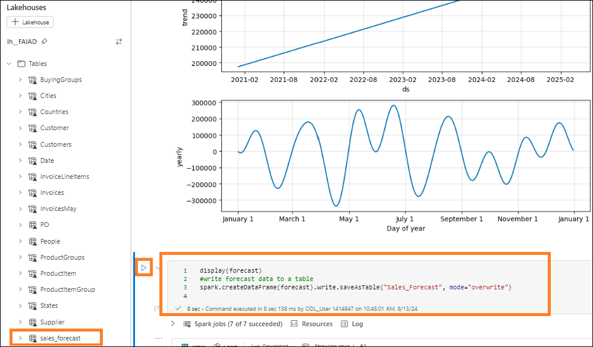

10. **Fragen Sie die Tabelle ab**, und zeigen Sie den Benutzern den Inhalt der Tabelle.

# **Data Activator-Demo**

### Anforderung

Bevor Sie mit den nächsten Schritten fortfahren, müssen Sie als Kursleiter die Übungen 1 bis 7 erledigen.

Unter den folgenden Links finden Sie die neuesten Updates.

<https://learn.microsoft.com/en-us/fabric/data-activator/data-activator-introduction>

<https://learn.microsoft.com/en-us/fabric/data-activator/data-activator-get-data-power-bi>

### Szenario

Wir wissen, dass es jeden Monat bei den Bestandsgruppennamen Abweichungen im Umsatz gibt. Dies ist saisonbedingt. Wir möchten aber benachrichtigt werden, wenn die Abweichung unter 20 % liegt. Dies hilft bei der Identifizierung und Lösung solcher Szenarien.

Um dieses Problem zu lösen, verwenden wir Data Activator. Wir werden einen Alarm auslösen, wenn die Umsatzabweichung eines beliebigen Bestandsgruppennamens unter 20 % fällt. Wir werden dies für Mai 2024 simulieren. Da der Data Activator-Auslöser stündlich ausgeführt wird, werden wir, anstatt eine Stunde zu warten, einen Testalarm ausführen.

Zur Demonstration dieses Szenarios werden wir:

- Die Kennzahl „Umsatzabweichung %“ dem Dataset hinzufügen.

- Ein Tabellenvisual hinzufügen, in dem die Umsatzabweichung % nach Bestandsgruppenname angezeigt wird. Filtern Sie diese Tabelle nach Mai 2024.

- mithilfe des Tabellenvisuals einen Alarm erstellen.

- Den Activator prüfen und einen Testalarm erstellen.

### Kennzahl „Umsatzabweichung %“ hinzufügen

Wir werden dem semantischen Modell „sm_FAIAD“ eine neue Kennzahl hinzufügen.

1. Navigieren Sie zum semantischen Modell **sm_FAIAD**.

2. Wählen Sie die Tabelle **Sales** aus.

3. Wählen Sie im Menü oben den Eintrag **Start -> Neues Measure** aus.

4. Erstellen Sie die nachfolgende **Kennzahl**. Hierdurch wird die Abweichung in Prozent im Vergleich zum Vormonat ermittelt.

    Sales Var % =

5. var priormth = CALCULATE([Sales], PREVIOUSMONTH('Date'[Date]))

6. RETURN DIVIDE([Sales]-priormth, priormth)

7. **Formatieren Sie** die Kennzahl als **Prozentsatz**.

    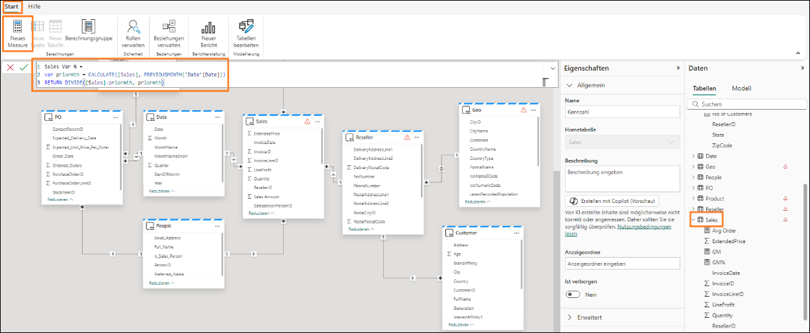

### Tabellenvisual erstellen

Wir werden rpt_Sales_report bearbeiten und ein neues Tabellenvisual hinzufügen. In dem Tabellenvisual wird die Umsatzabweichung in Prozent nach Bestandsgruppennamen für Mai 2023 angezeigt.

1. Navigieren Sie zu **rpt_Sales_Report** (erstellt in Übung 7).

2. Wählen Sie im oberen Menü die Option **Bearbeiten** aus.

3. Erweitern Sie in der Datenansicht die Tabelle **Product**.

4. Wählen Sie das Feld **StockGroupName** aus. Es wird ein Tabellenvisual erstellt.

5. Erweitern Sie die Tabelle **Sales**.

6. Wählen Sie **Sales Var %** aus. Das Tabellenvisual enthält keine Daten. Das liegt daran, dass für die Berechnung von „Sales Var %“ ein Monatsname erforderlich ist.

    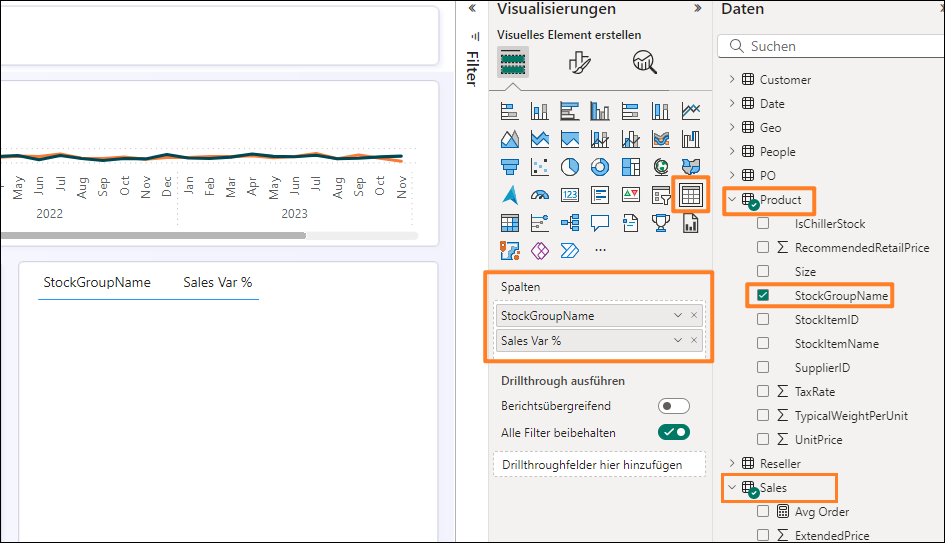

7. **Erweitern Sie den Abschnitt** **Filter** (falls dieser reduziert ist).

8. Erweitern Sie mit dem hervorgehobenen Tabellenvisual im Abschnitt **Daten** die Tabelle **Date**.

9. Ziehen Sie das Feld **Year** in die Filter in diesem Visual-Abschnitt.

10. Wählen Sie für das Feld **Year** die Option **Grundlegende Filterung** aus der Dropdown-Liste **Filtertyp** aus.

11. Wählen Sie **2024** aus.

    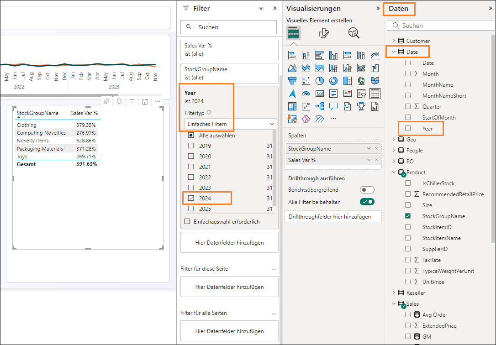

12. Ziehen Sie das Feld **MonthNameShort** in die Filter in diesem Visual-Abschnitt.

13. Wählen Sie **May** aus.

14. Wählen Sie **Datei -> Speichern** aus, um die Aktualisierungen im Bericht zu speichern.

    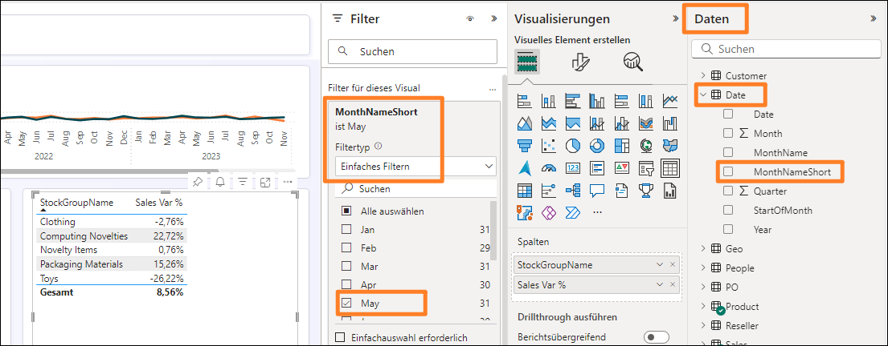

### Activator erstellen

Wir werden einen Activator erstellen, der eine Warnung sendet, wenn die Umsatzabweichung in Prozent für einen beliebigen Stock_Group_Name unter -20 % liegt. Der Bestandsgruppenname „Toys“ weist eine Umsatzabweichung von -26,22 % auf und erfüllt die Kriterien für den Alarm.

1. Wählen Sie im neu erstellten Tabellenvisual links oben die **Warnglocke** aus.

    

2. Der Bereich „Warnung festlegen“ wird geöffnet.

3. Erklären Sie den Teilnehmern, dass die Warnung **For each Stock_Group_Name** (für jeden Bestandsgruppennamen) angewandt wird.

4. Wählen Sie **Sales Var %** unter **Bei Zeilenänderung benachrichtigen** aus.

    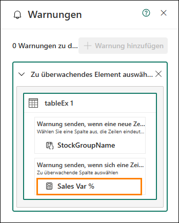

5. Auswählen Sie das Optionsfeld **Wird** aus, und ändern Sie die **Bedingung** zu **Weniger als**.

6. Setzen Sie den **Schwellenwert** auf **-20 %.** Dadurch wird der Auslöser so konfiguriert, dass er eine Warnung auslöst, wenn die Umsatzabweichung unter 20 % fällt.

    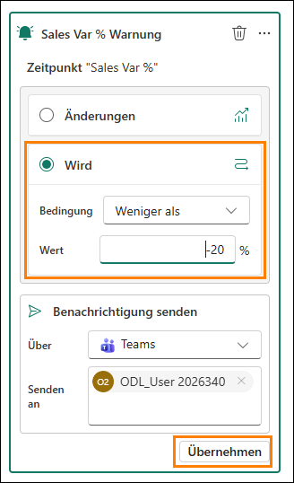

7. Sprechen Sie über die beiden Benachrichtigungsoptionen: E-Mail und Teams.

8. Wählen Sie **Übernehmen** aus.

9. Wählen Sie unten neben **Meine Power BI-Aktivatorwarnungen** die **Auslassungspunkte (....)** aus.

10. Lassen Sie sich die verschiedenen Speicherorte des Arbeitsbereichs anzeigen.

    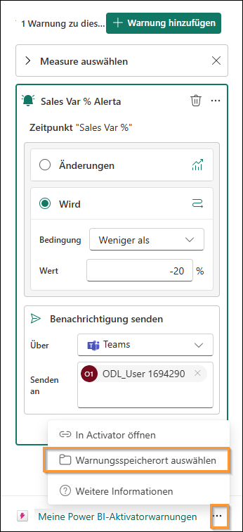

11. Sobald die Warnung erstellt wurde, können Sie auch **In Activator öffnen** auswählen, nachdem Sie auf die Auslassungspunkte am unteren Ende geklickt haben.

    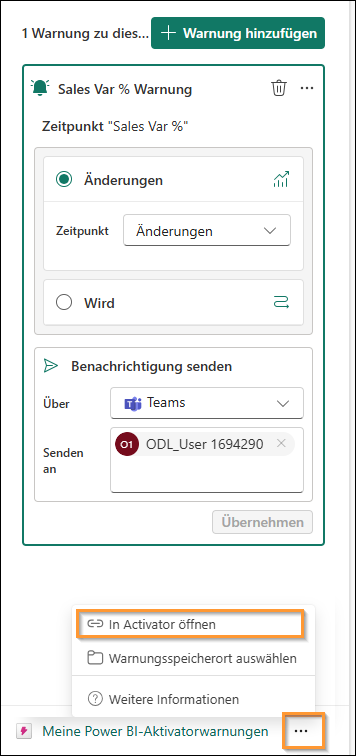

### Übersicht über Activator

1. Sie werden zur **Entwurfsansicht** von Activator weitergeleitet.

2. Führen Sie die Teilnehmer durch das **Layout**, auf der linken Seite sind die Objekte. Beachten Sie, dass es einen **Auslöser** gibt, den wir gerade erstellt haben. Außerdem gibt es einen Abschnitt **Ereignisse**.

3. Wählen Sie den gerade erstellten Auslöser aus und sprechen Sie über die Optionen im **oberen Menü.**

    1. Start

    1. Daten abrufen

    2. Benutzerdefinierte Aktionen mit Power Automate erstellen

    2. Regeln

    1. Löschen

    2. Starten, Beenden, Details anzeigen

    3. Eine Testaktion senden

4. Sprechen Sie über die Diagramme **Überwachung** und **Bedingung**, die auf der Registerkarte **Definition** zu sehen sind.

5. Scrollen Sie weiter nach unten. Im Diagramm **Aktion** wird die Warnung angezeigt, wenn sie ausgelöst wurde. Die Auslöser werden aktuell stündlich ausgeführt. Wenn sich die Daten also innerhalb der nächsten Stunde ändern und die Bedingung erfüllt ist, wird ein Alarm ausgelöst.

    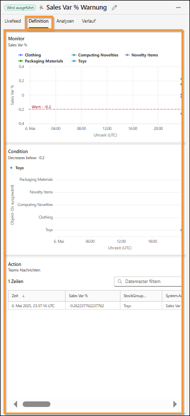

6. Auf der rechten Seite des Bildschirms können Sie die **Definition der Warnung** konfigurieren. Dazu gehören das Attribut, Filter, Zusammenfassungen, Bedingungen und Aktionen. Standardmäßig wird der Alarm an das Übungs-Benutzerkonto gesendet. (externe E-Mail-Adressen werden derzeit nicht unterstützt).

    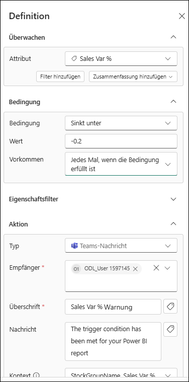

7. Sie können hier auch die Aktionsdetails bearbeiten. Wenn Sie die Schaltfläche „Aktion bearbeiten“ auswählen, wird das Fenster „Aktion bearbeiten“ angezeigt.

    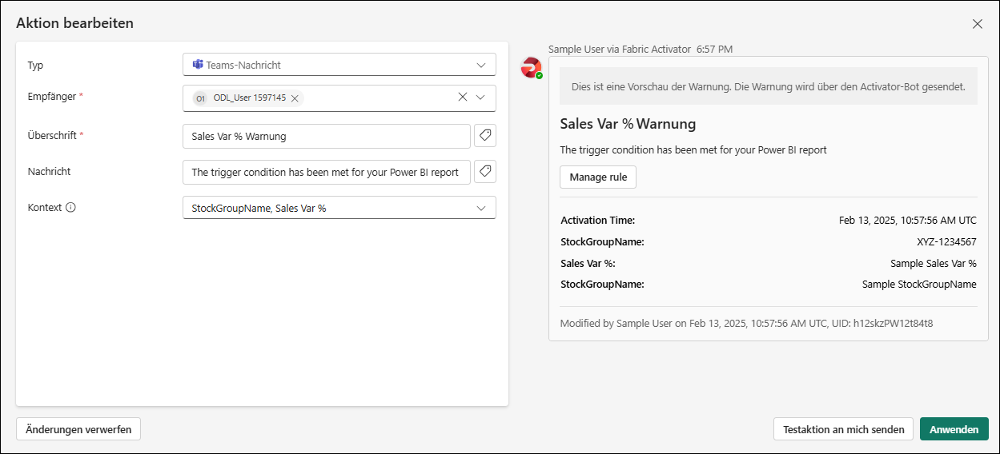

### Einen Testalarm senden

Hinweis: Um den Alarm sehen zu können, müssen Sie die Laborumgebung verwenden.

1. Wählen Sie **Sales Var %-Trigger** aus.

2. Wählen Sie im oberen Menü die Option **Testaktion an mich senden** aus. Dadurch wird ein Testalarm an Ihr Übungs-Benutzerkonto gesendet.

3. Wählen Sie das **App-Startfeld** in der oberen linken Ecke des Bildschirms aus.

    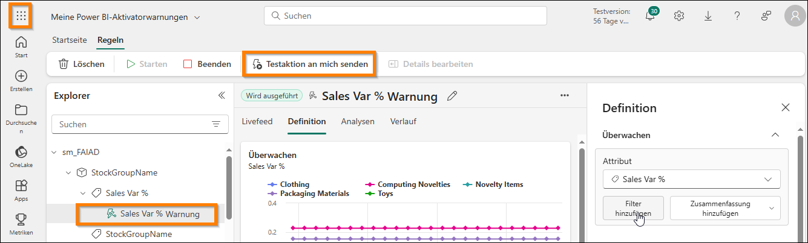

4. Wählen Sie „Teams“ aus. Ein neues Browserfenster öffnet sich.

    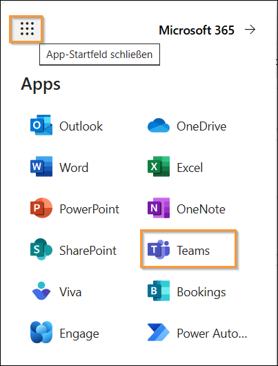

5. Sie erhalten eine Warnmeldung (das kann einige Minuten dauern). Beachten Sie den Hinweis auf die Testaktion.

    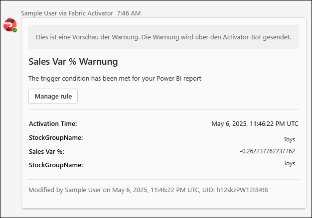

6. Wenn sich die Daten ändern und die Auslösungsbedingungen erfüllt sind, werden Alarme gesendet.

    **Hinweis:** Um diese Funktion vorführen zu können, haben wir das Visual für einen Monat (Mai 2024) gefiltert. In realen Szenarien wird dies dynamisch sein. Wir werden wahrscheinlich einen Auslöser dynamisch für den aktuellen Monat setzen.

# **Demo zu Semantic Link**

### Anforderung

Bevor Sie mit den nächsten Schritten fortfahren, müssen Sie als Kursleitung die Übungen 1 bis 7 ausführen.

Es wird empfohlen, dass die Kursleitung die Notebooks in dieser Demo vorab ausführt, da die Fertigstellung beider Notebooks zwischen 5 und 10 Minuten dauern kann. Eine Möglichkeit besteht darin, die Notebooks auszuführen, während die Teilnehmenden an Übung 6/7 arbeiten. Dies soll sicherstellen, dass die Kursleitung den Teilnehmenden die Ergebnisse der Notebooks zeigen kann.

### Szenario

In dieser Demo werden die **Best-Practice-Analyse** und die **Speicheranalyse** erläutert. Dies sind leistungsstarke Tools, die uns dabei helfen, unser semantisches Modell auf Leistung, Speichernutzung und Gesamtqualität zu bewerten. Diese Tools bieten nicht nur Metriken an, sondern auch **umsetzbare Erkenntnisse zur Verbesserung des Designs und der Effizienz** Ihres Modells, indem die Optimierungsmöglichkeiten hervorgehoben werden, die Sie sonst möglicherweise übersehen würden.

Herzstück dieser Funktionalität ist **Semantic Link**, eine Funktion in Microsoft Fabric, mit der wir unsere semantischen Modelle direkt mit Data Science-Tools und -Erfahrungen verbinden können. Dies bedeutet, dass wir unser semantisches Modell „sm_FAIAD“ mit Notebooks **analysieren und optimieren sowie Profile dafür erstellen** können.

Aufgrund dieser Verbindung können wir eingehende Analysen wie Best-Practice-Prüfungen und Speicherprofilerstellungen direkt anhand des semantischen Modells in unserem Arbeitsbereich durchführen. Dies ermöglicht es uns, **die Leistung zu verbessern, den Speicherbedarf zu reduzieren und letztendlich die Kosten für Ihre Artefakte in der Produktion zu senken**.

Zur Demonstration dieses Szenarios werden wir:

- unser semantisches Modell „sm_FAIAD“ öffnen und nach den Semantic Link-Funktionen suchen.

- das Best-Practice-Analyse-Notebook erstellen und Erkenntnisse anzeigen.

- das Speicheranalyse-Notebook erstellen und Erkenntnisse anzeigen.

### Best-Practice-Analyse

1. Wechseln Sie zum **Fabric-Arbeitsbereich**,** den Sie in Aufgabe 2 von Übung 2 erstellt haben**, mit dem Namen **FAIAD_<Benutzername>**.

2. Öffnen Sie das semantische Modell **sm_FAIAD**.

    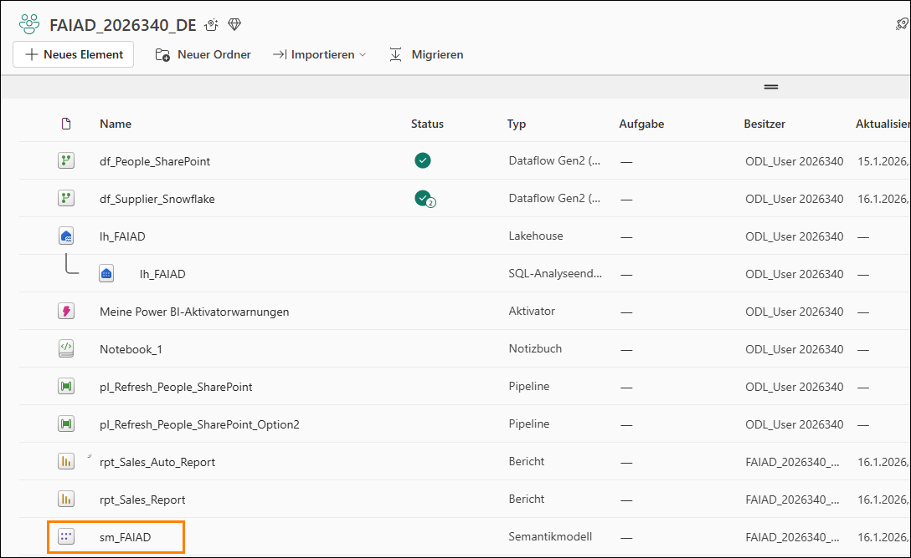

3. Wählen Sie auf der nächsten Seite **Semantisches Modell** **öffnen** aus.

    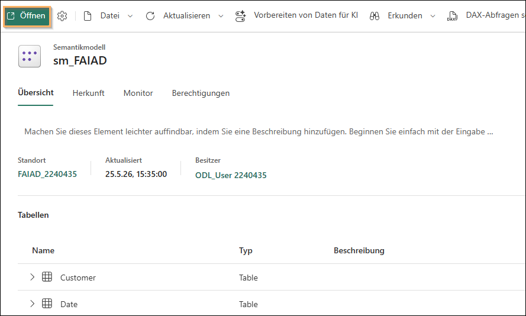

4. Sie sehen, dass im **Menüband „Start“** unter **Modellintegrität** drei Elemente angezeigt werden.

    1. **Best Practice Analyzer:** Bietet Tipps zur Verbesserung des Designs und der Leistung Ihres semantischen Modells basierend auf Regeln, die von Fabric-Fachkräften erstellt wurden.

    2. **Speicheranalyse:** Stellt Arbeitsspeicher- und Speicherstatistiken zu Objekten in Ihrem semantischen Modell bereit. Die Überprüfung dieser Statistiken kann Ihnen dabei helfen, Bereiche für eine mögliche Leistungsoptimierung und Speicherreduzierung zu identifizieren.

    3. **Community-Notizbücher:** Katalog von Notebooks, die von der Community erstellt wurden, um die Power BI-Datenanalyse und -Berichterstellung zu verbessern.

    *Hinweis: Diese Notebooks finden Sie auch auf der Detailseite zum semantischen Modell.*

5. Klicken Sie auf **Best Practice Analyzer**.

    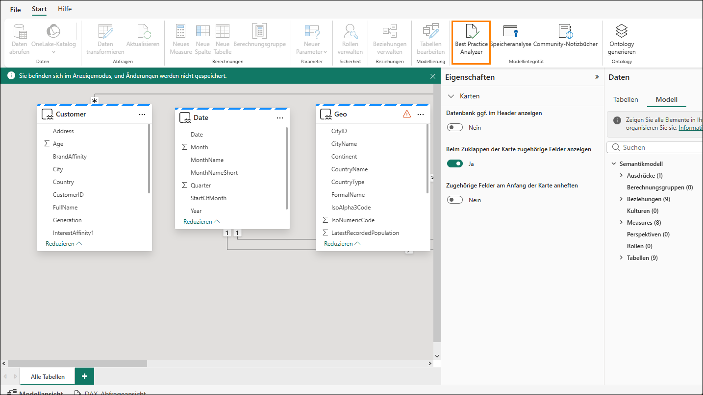

6. Ein neues Best-Practice-Analyse-Notebook wird erstellt. Sie werden zum Notebook geleitet.

7. Gehen Sie mit den Teilnehmenden die Details in den Markdown-Zellen durch.

8. Wählen Sie im Menüband „Startseite“ **Alle ausführen** aus.

    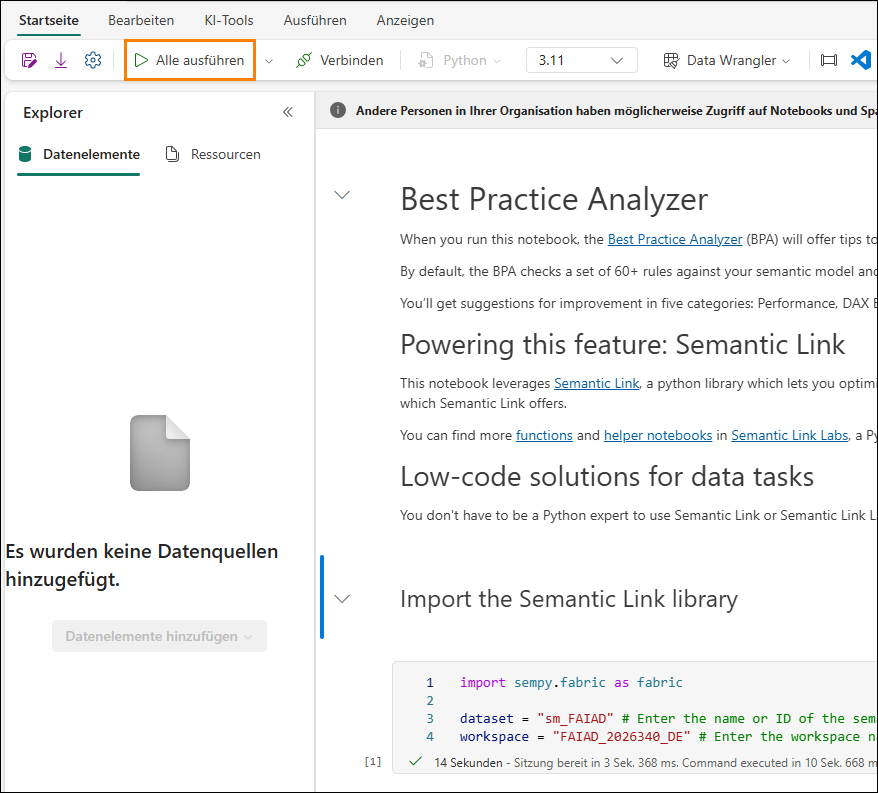

9. Beachten Sie nach der Ausführung des Notebooks das Ergebnis der Funktion **run_model_bpa**.

    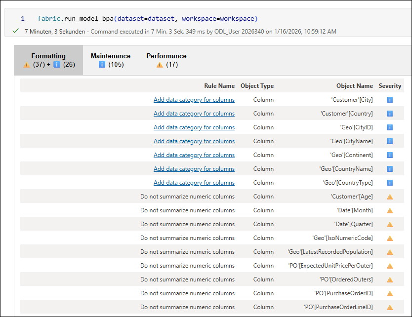

10. Diese Funktion gibt drei Kategorien von Empfehlungen zurück: **Formatierung, Wartung und Leistung**. Innerhalb einer bestimmten Kategorie sehen Sie zwei verschiedene Symbole, die den Schweregrad der Empfehlung darstellen.

    1. ℹ️ - Eine empfohlene Änderung, die Ihr Modell verbessern kann.

    2. ⚠️ - Der Schweregrad dieser Empfehlung gibt an, dass das aufgeführte Problem zu Problemen in Ihrem Modell oder in Berichten führen kann, die dieses Modell verwenden.

11. Scrollen Sie unter **Formatting** nach unten, und bewegen Sie den Mauszeiger über den **Regelnamen „Format flag columns as Yes/No value strings“**.

12. Sagen Sie den Teilnehmenden, dass Sie mehr Details zur empfohlenen Änderung erhalten, wenn Sie mit der Maus über die Regelnamen fahren.

    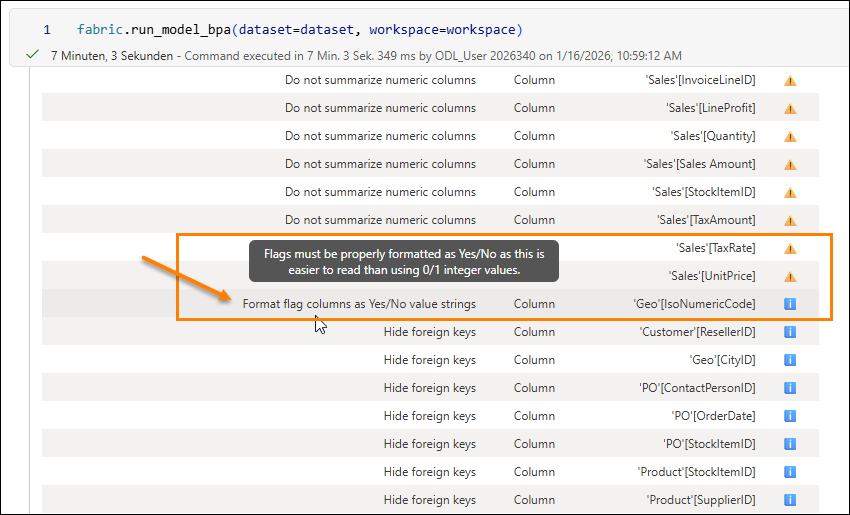

13. In diesem Fall empfiehlt die Leistungsanalyse, die Spalte **IsoNumericCode** in der Tabelle **Geo** mit **Ja/Nein** zu formatieren. Dies ist eine sehr hilfreiche Empfehlung, da eine solche Formatierung von Flag-Spalten eine bewährte Methode beim Modellieren eines Sternschemas darstellt.

14. Wählen Sie die Kategorie **Maintenance** aus.

    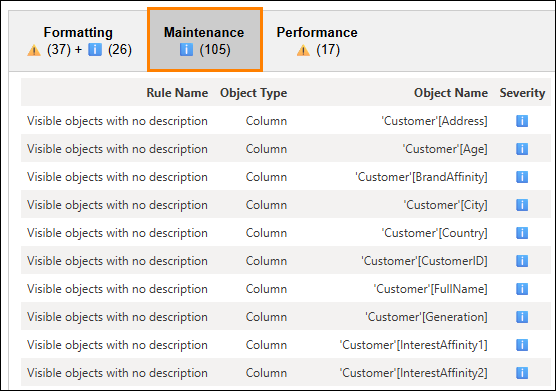

15. Weisen Sie die Teilnehmenden darauf hin, dass die meisten Wartungsempfehlungen darin bestehen, unseren sichtbaren Spalten im Modell Beschreibungen hinzuzufügen.

16. Wählen Sie die Kategorie **Performance** aus.

    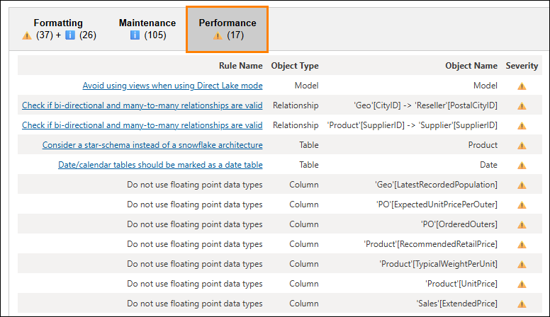

17. Bewegen Sie den Mauszeiger über den **Regelnamen „Avoid using views when using Direct Lake mode“**.

18. Die Leistungsanalyse erinnert uns daran, dass der Direct Lake-Modus keine Ansichten unterstützt. In diesem Kurs haben wir Verknüpfungen verwendet, um schnell eine Verbindung zu Daten herzustellen. Anschließend haben wir die Daten mithilfe von Ansichten transformiert. Dies taten wir unter anderem, um mehr über die vielen Datenverbindungsmethoden in Fabric zu erfahren. Wenn wir diese Empfehlung jedoch auf unser Modell anwenden möchten, müssten wir eine andere Methode verwenden, um unsere Vertriebsdaten zu erfassen und zu transformieren, z. B. Dataflow Gen2.

    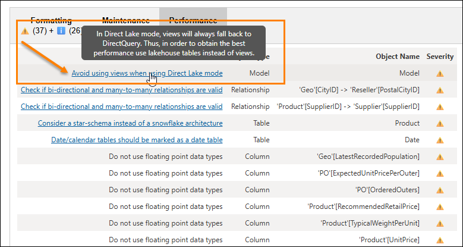

19. Sofern es die Zeit erlaubt, kann die Kursleitung weitere Empfehlungen durchgehen.

### Speicheranalyse

1. Kehren Sie zur Modellansicht Ihres semantischen Modells **sm_FAIAD** zurück.

2. Wählen Sie im **Menüband „Start“** die Option **Speicheranalyse**.

    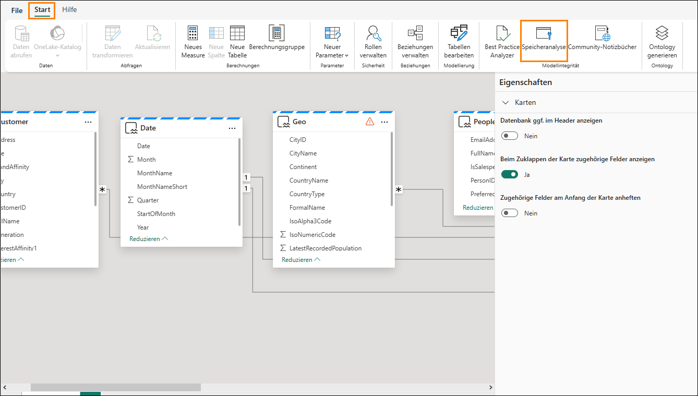

3. Ein neues Speicheranalyse-Notebook wird erstellt.

4. Gehen Sie mit den Teilnehmenden die Details in den Markdown-Zellen durch.

5. Wählen Sie im **Menüband „Startseite“ Alle ausführen** aus.

    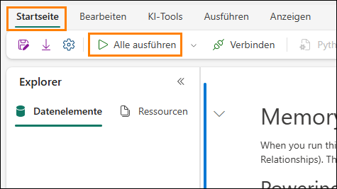

6. Sehen Sie sich nach Fertigstellung des Notebooks die resultierenden Daten an. Es gibt viele Kategorien, in denen die Speicherauslastung mit unterschiedlichen Detailebenen angezeigt wird.

    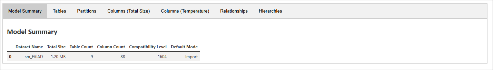

7. Weisen Sie die Teilnehmenden darauf hin, dass wir all diese Informationen verwenden können, um Bereiche zu identifizieren, in denen Verbesserungen in Bezug auf die Speichernutzung möglich sind.

8. Wählen Sie die Kategorie **Tables** aus.

9. Bewegen Sie die Maus über den Spaltennamen **% DB**, um die Spaltenbeschreibung anzuzeigen. Diese Spalte gibt die Größe der einzelnen Tabellen im Verhältnis zur Größe des semantischen Modells an. Dies bedeutet zwar nicht automatisch, dass etwas nicht stimmt, aber es ist hilfreich zu sehen, wie viel Prozent des Speichers des semantischen Modells von jeder Tabelle verwendet werden.

    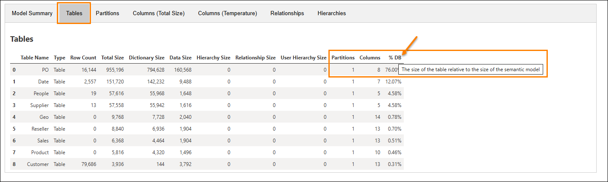

10. Sofern noch Zeit verbleibt, kann die Kursleitung die Demo beenden, indem sie noch weitere Kategorien durchgeht und verschiedene Datenpunkte erläutert.
