# Microsoft Fabric - Fabric Analyst in a Day - Übung 3

## Inhalt

- Einführung
- Verknüpfung zu ADLS Gen2
    - Aufgabe 1: Verknüpfung erstellen
- Daten mithilfe einer Visual-Abfrage transformieren
  - Aufgabe 2: Ansicht „Geo“ mithilfe einer Visual-Abfrage erstellen
  - Aufgabe 3: Reseller-, Sales- und Product-Ansichten mit einer SQL-Abfrage erstellen
- Referenzen


# Einführung

In unserem Szenario stammen die Verkaufsdaten aus dem ERP-System und werden in einer ADLS Gen2 gespeichert. Jeden Tag um 12 Uhr mittags werden die Daten aktualisiert. Wir müssen diese Daten transformieren, in Lakehouse erfassen und in unserem Modell verwenden.

Es gibt mehrere Möglichkeiten, diese Daten zu erfassen.

- **Verknüpfungen:** Hiermit wird eine Verknüpfung zu den Daten erstellt, und wir können sie anhand von Ansichten für visuelle Abfragen transformieren. Wir werden Verknüpfungen in dieser Übung verwenden.

- **Notebooks:** Dafür müssen wir Code schreiben. Es handelt sich um einen entwicklerfreundlichen Ansatz.

- **Dataflow Gen2:** Sie sind wahrscheinlich mit Power Query oder Dataflow Gen1 vertraut. Dataflow Gen2 ist, wie der Name schon sagt, die neuere Version von Dataflow. Es bietet alle Funktionen von Power Query/Dataflow Gen1 und ermöglicht zusätzlich die Transformation und Erfassung von Daten in mehreren Datenquellen. Wir werden dies in den nächsten Übungen vorstellen.

- **Pipeline:** Dies ist ein Orchestrierungstool. Aktivitäten können orchestriert werden, um Daten zu extrahieren, zu transformieren und zu erfassen. Wir werden eine Pipeline verwenden, um Dataflow Gen2-Aktivitäten auszuführen, die wiederum Extraktion, Transformation und Aufnahme durchführen.

Wir beginnen mit der Erstellung einer Verknüpfung, um Daten aus der ADLS Gen2-Datenquelle in einem Lakehouse zu erfassen. Nach der Erfassung transformieren wir sie mit Visual-Abfragen.

Am Ende dieser Übung haben Sie Folgendes gelernt:

- Wie Sie Verknüpfungen in Ihrem Lakehouse erstellen

- Wie Sie Daten mithilfe der Visual-Abfrage transformieren

# Verknüpfung zu ADLS Gen2

## Aufgabe 1: Verknüpfung erstellen

Verknüpfungen werden verwendet, um eine Verbindung zum Zielort herzustellen. Mit Verknüpfungen kann auf die Daten zugegriffen werden, ohne dass die Daten physisch in das Lakehouse verlagert werden müssen. Dies ist vergleichbar mit der Erstellung von Verknüpfungen auf dem Windows Desktop.

1. Wählen Sie oben auf Ihrem Bildschirm die Registerkarte **lh_FAIAD** aus, um zum Lakehouse zu navigieren.

1. Wenn Sie keine Registerkarte haben, können Sie zu Ihrem Arbeitsbereich zurückkehren und von dort aus das Lakehouse öffnen.

2. Wählen Sie im Bereich **Explorer** die **Auslassungspunkte** neben **Tabellen** aus.

3. Wählen Sie **Neue Tabellenverknüpfung** aus.

    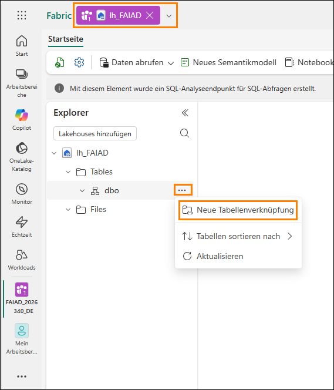

4. Das Dialogfeld **Neue Verknüpfung** wird geöffnet. Wählen Sie unter **Externe Quellen** die Option **Azure Data Lake Storage Gen2** aus.

    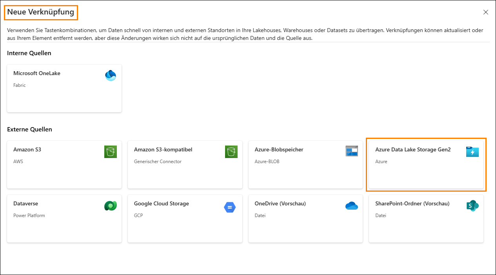

5. Wählen Sie **Neue Verbindung (1)** aus.

6. Geben Sie den folgenden Link für die Eigenschaft **URL** ein: <https://stvnextblobstorage.dfs.core.windows.net/fabrikam-sales> **(2).**

7. Klicken Sie im Abschnitt „Verbindung“ auf **„Neue Verbindung erstellen“ (3).**

8. Wählen Sie **Shared Access Signature (SAS) (4)** aus der Dropdown-Liste „Authentifizierungsart“ aus.

9. Kopieren Sie das SAS-Token, und fügen Sie es in das Feld„SAS-Token“ (5) ein.

    - **SAS-Token:**

10. Wählen Sie unten rechts auf dem Bildschirm **Weiter (6)** aus.

    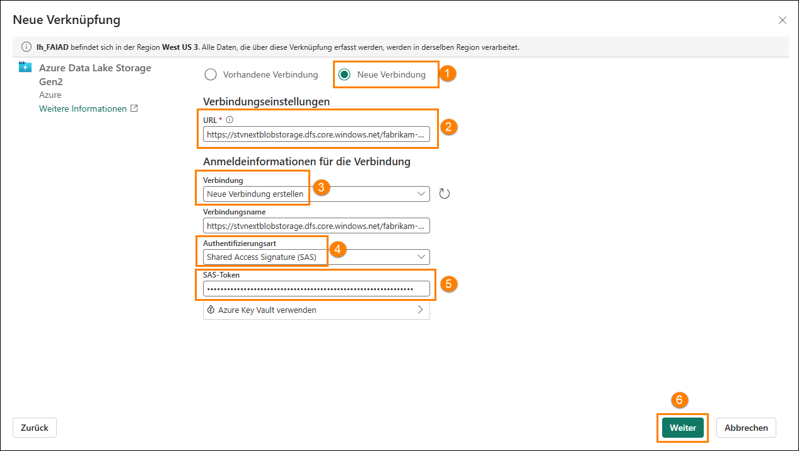

11. Sie werden mit ADLS Gen2 verbunden und die Verzeichnisstruktur wird im linken Bereich angezeigt. Erweitern Sie **Delta-Parquet-Format-FY25 (1)**.

12. **Wählen** Sie die folgenden Verzeichnisse **(2)** aus, und klicken Sie dann auf **Weiter (3):**

    1. Application.Cities

    2. Application.Countries

    3. Application.StateProvinces

    4. DateDim

    5. Sales.BuyingGroups

    6. Sales.Customers

    7. Sales.InvoiceLines

    8. Sales.Invoices

    9. Warehouse.StockGroups

    10. Warehouse.StockItemStockGroups

    11. Warehouse.StockItems

    **Hinweis:** „Sales.Invoices_May“ ist das einzige Verzeichnis, das **nicht** ausgewählt ist.

    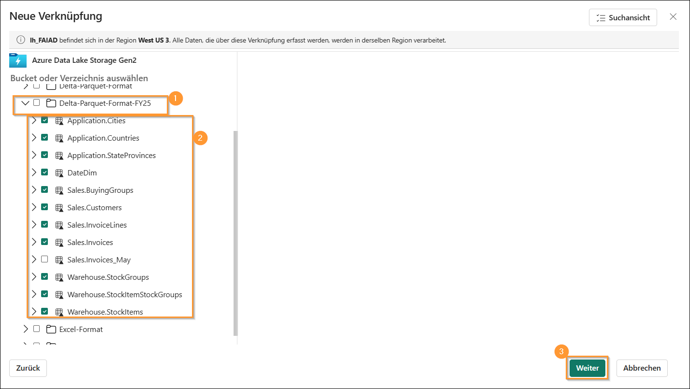

13. Sie werden zum nächsten Dialogfeld weitergeleitet, in dem Sie die Namen bearbeiten können. Wählen Sie das Symbol **Bearbeiten (1)** unter Aktionen für **Application.Cities** aus.

14. Benennen Sie **Application.Cities in Cities (2)** um.

15. Wählen Sie das Häkchen neben dem Namen, um die Änderung zu speichern **(3)**.

    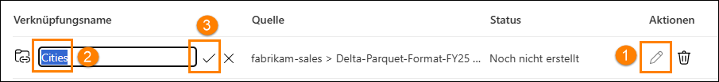

16. Benennen Sie auch die Namen der Verknüpfungen wie folgt um:

    1. Application.Countries in **Countries**

    2. Application.StateProvinces in **States**

    3. DateDim in **Date**

    4. Sales.BuyingGroups in **BuyingGroups**

    5. Sales.Customers in **Customers**

    6. Sales.InvoiceLines in **InvoiceLineItems**

    7. Sales.Invoices in **Invoices**

    8. Warehouse.StockGroups in **ProductGroups**

    9. Warehouse.StockItemStockGroups in **ProductItemGroup**

    10. Warehouse.StockItems in **ProductItem**

    **Hinweis:** Überprüfen Sie die Namen. Ein Tippfehler kann während der Übung zu Fehlern führen.

17. Wählen Sie **Erstellen** aus, um die Verknüpfung zu erstellen.

    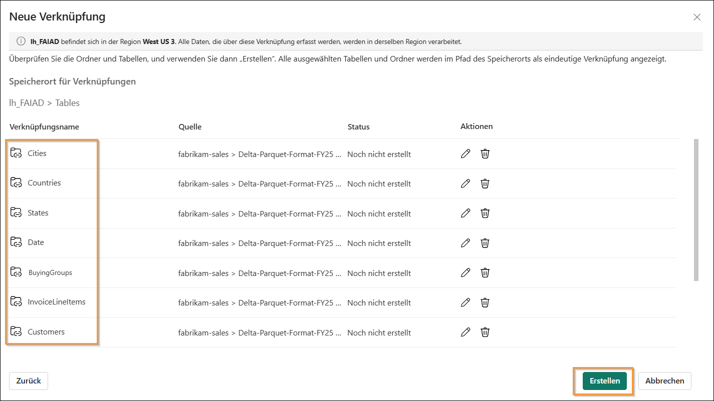

18. Beachten Sie, dass alle Verknüpfungen als Tabellen erstellt werden. Wählen Sie die Tabelle **BuyingGroups** aus, und beachten Sie, dass im Datenbereich eine Vorschau der Daten angezeigt wird.

    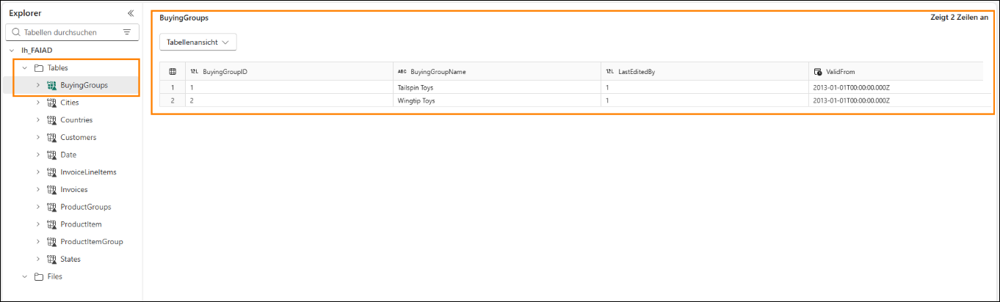

    Der nächste Schritt besteht darin, die Daten zu transformieren, damit wir ein semantisches Modell erstellen können. Wir erstellen Ansichten, um die Daten zu transformieren.

# Daten mithilfe einer Visual-Abfrage transformieren

## Aufgabe 2: Ansicht „Geo“ mithilfe einer Visual-Abfrage erstellen

1. Wir können das **Lakehouse** über einen SQL-Endpunkt aufrufen. Dieser bietet die Möglichkeit,
    die Daten abzufragen und Ansichten zu erstellen. Wählen Sie **oben rechts** auf dem Bildschirm **Lakehouse (1) -> SQL-Analyseendpunkt (2)** aus.

    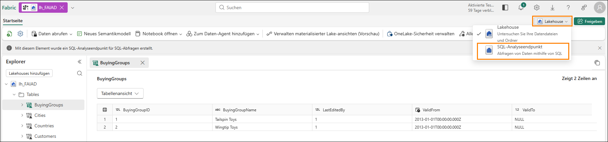

    Sie werden zum SQL-Analyseendpunkt weitergeleitet. Sie haben jetzt ein neues Element in Ihrer oberen Navigationsleiste und können durch Auswahl dieser Registerkarte zurück zum Lakehouse wechseln. Beachten Sie, dass sich der Explorer-Bereich geändert hat. Sie können jetzt Ansichten, gespeicherte Prozeduren, Abfragen und mehr erstellen. Wir erstellen eine Visual-Abfrage, da sie eine Low-Code-, Power Query-ähnliche Oberfläche bietet. Wir speichern das Ergebnis als Ansicht.

    Wir beginnen mit der Erstellung einer Ansicht „Geo“. Wir müssen Daten aus den Tabellen „Cities“, „States“ und „Countries“ zusammenführen, um die Ansicht „Geo“ zu erstellen.

2. Klicken Sie im oberen Menü auf das Dropdownmenü neben **Neue SQL-Abfrage (1)**, und wählen Sie dann **Neue visuelle Abfrage (2)** aus.

    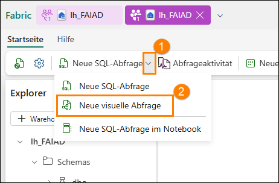

3. Um eine Abfrage zu erstellen, müssen wir Tabellen zum visuellen Abfragebereich hinzufügen. Klicken Sie auf die Auslassungspunkte neben der Tabelle **Cities (1)** und wählen Sie **In Zeichenbereich einfügen (2)** aus.

    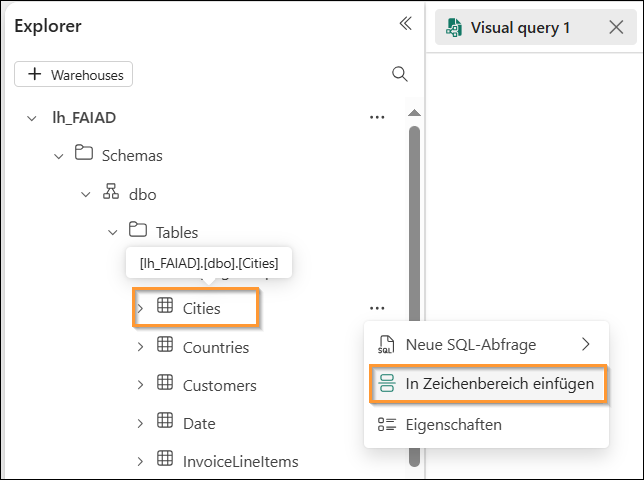

4. Wiederholen Sie die gleichen Schritte für die Tabellen **States** und **Countries**.

    Als Nächstes müssen wir diese Abfragen zusammenführen. Der Editor für Visual-Abfragen wird mit der Option zum Verwenden des Power Query-Editors bereitgestellt. Lassen Sie uns diesen verwenden, da wir aufgrund von Power BI mit ihm vertraut sind.

5. Klicken Sie im **Menü des Editors für Visual-Abfragen** auf das Symbol **Im Popup-Fenster öffnen** (rechts). Sie werden zum Power Query-Editor weitergeleitet.

    **Hinweis:** Möglicherweise müssen Sie nach rechts scrollen oder die Registerkarte für Visual-Abfragen erneut öffnen, wenn Sie dieses Symbol nicht sofort sehen.

    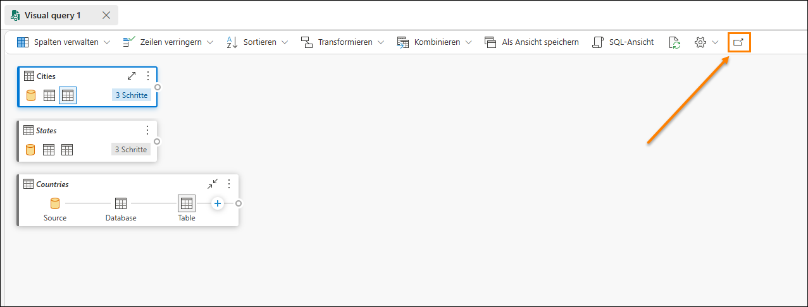

6. Wählen Sie bei ausgewählter Abfrage **Cities (1)** im Menüband des Power Query-Editors
    **Start (2)-> Kombinieren (3) -> Abfragen zusammenführen (4) -> Abfragen als neue Abfrage zusammenführen (5)** aus. Das Dialogfeld „Abfragen zusammenführen“ wird geöffnet.

    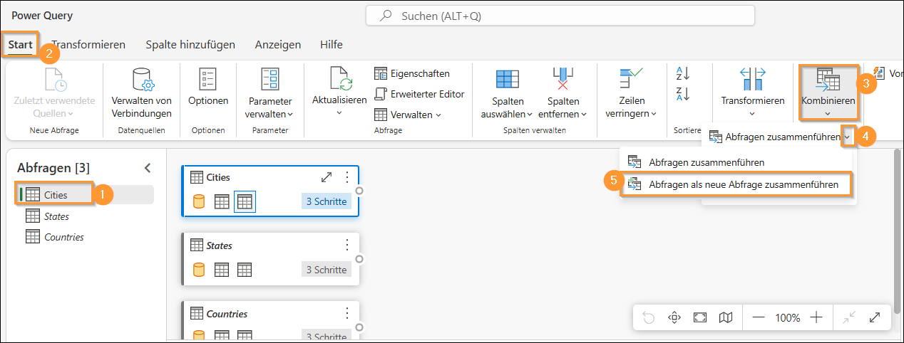

7. Wählen Sie in der **linken Tabelle** für Zusammenführung die Option **Cities** aus.

8. Wählen Sie in der **rechten Tabelle** für Zusammenführung die Option **States** aus.

9. Wählen Sie **StateProvinceID**-Spalten aus beiden Tabellen aus. Wir führen eine Verknüpfung über diese Spalte aus.

10. Wählen Sie **Innerhalb** als **Art des Joins** aus.

11. Wählen Sie **OK** aus.

    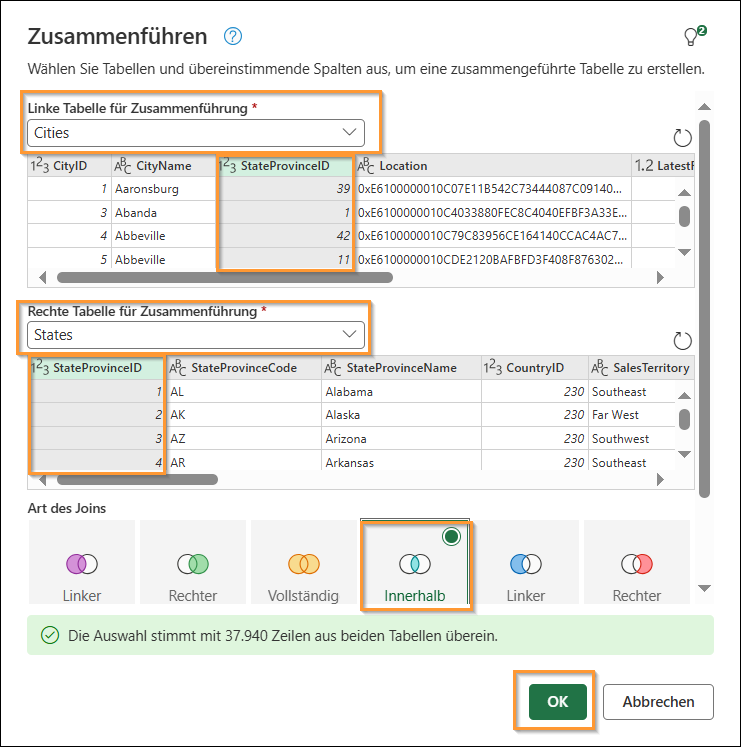

    Beachten Sie, dass eine neue Abfrage mit dem Namen **„Zusammenführen“** erstellt wurde. Wir benötigen einige Spalten aus „States“.

12. Klicken Sie in der **Datenansicht** (unterer Bereich) auf den **Doppelpfeil** neben der Spalte **States** (letzte Spalte rechts).

13. Es wird ein Bereich geöffnet. Stellen Sie sicher, dass nur die folgenden Spalten ausgewählt sind:

    1. StateProvinceCode

    2. StateProvinceName

    3. CountryID

    4. SalesTerritory

14. Wählen Sie **OK** aus.

    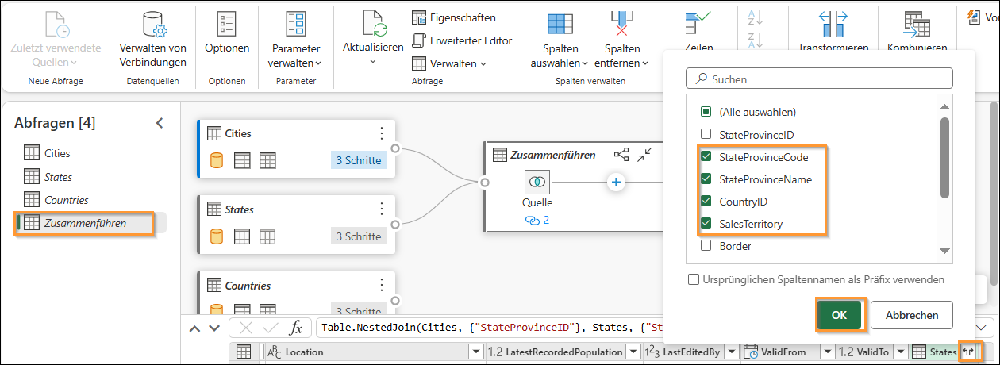

    Wir müssen jetzt die Abfrage „Countries“ zusammenführen.

15. Wählen Sie bei ausgewählter Zusammenführen-Abfrage **(1) Start (2) -> Kombinieren (3) -> Dropdown: Abfragen zusammenführen (4) -> Abfragen zusammenführen (5)** aus.

    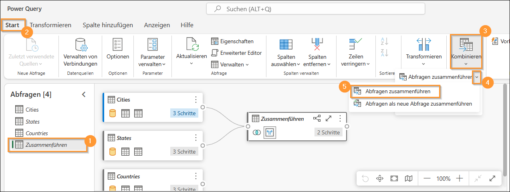

16. Das Dialogfeld „Abfragen zusammenführen“ wird geöffnet. Wählen Sie in der **rechten Tabelle** für Zusammenführung **Countries** aus.

17. Wählen Sie **CountryID**-Spalten aus beiden Tabellen aus. Wir führen eine Verknüpfung über diese Spalte aus.

18. Wählen Sie **Innerhalb** als **Art des Joins** aus.

19. Wählen Sie **OK** aus.

    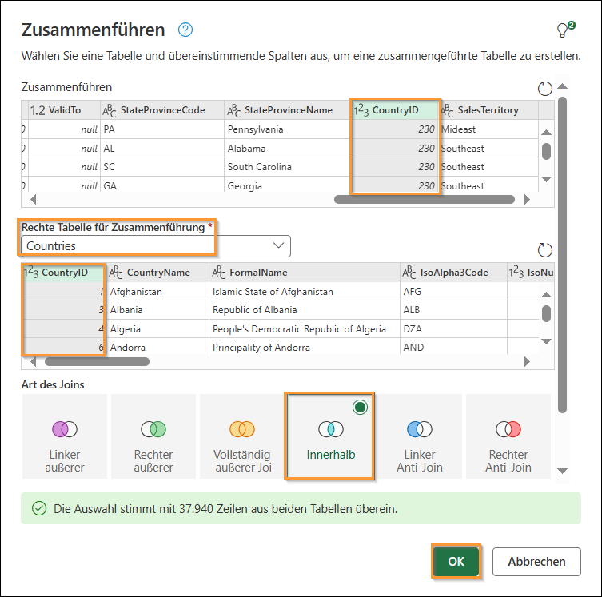

    Wir benötigen einige Spalten aus „Countries“.

20. Klicken Sie in der **Datenansicht** (unterer Bereich) auf den **Doppelpfeil** neben der Spalte **Countries**.

21. Es wird ein Bereich geöffnet. Stellen Sie sicher, dass nur die folgenden Spalten ausgewählt sind:
    1. CountryName

    2. FormalName

    3. IsoAlpha3Code

    4. IsoNumericCode

    5. CountryType

    6. Continent

    7. Region

    8. Subregion

20. Klicken Sie auf **OK**.

    **Wichtig:** Vergewissern Sie sich, dass Sie nach unten scrollen und alles auswählen, um alle acht in Schritt 21 aufgeführten Spalten auszuwählen. Im folgenden Screenshot werden aufgrund einer Einschränkung der Bedienoberfläche nur die ersten 5 Spalten angezeigt.

    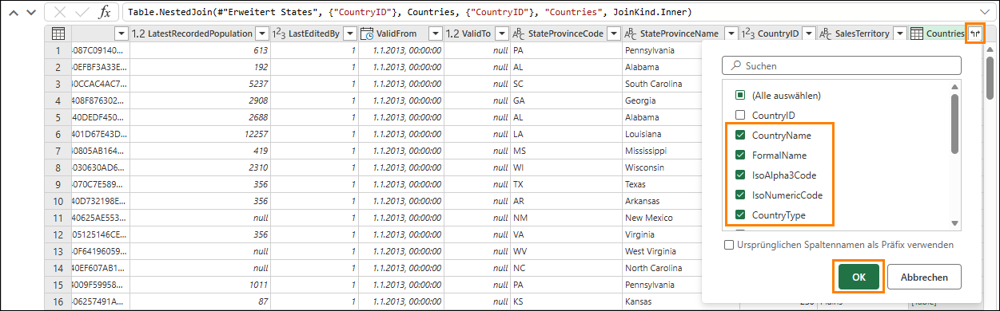

    Wir benötigen nicht alle Spalten in der Tabelle **Zusammenführen**. Stellen Sie sicher, dass Sie nur die Spalten auswählen, die wir benötigen.

23. Wählen Sie bei ausgewählter **Zusammenführen**-Abfrage (1) im Menüband **Start (2) -> Spalten auswählen (3) -> Spalten auswählen (4)** aus.

    **Hinweis:** Wenn die Option „Spalten auswählen“ nicht angezeigt wird, finden Sie sie unter „Spalten verwalten“.

    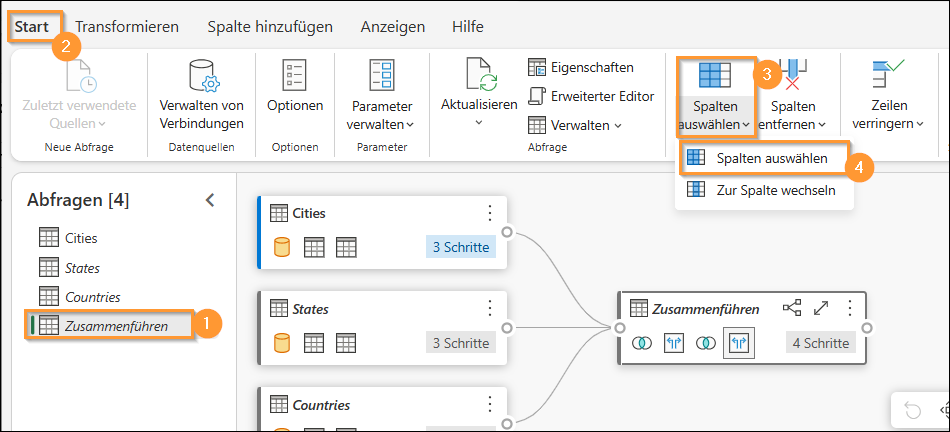

24. Das Dialogfeld „Spalten auswählen“ wird geöffnet. **Deaktivieren** Sie die folgenden Spalten.
    1. StateProvinceID

    2. Location

    3. LastEditedBy

    4. ValidFrom

    5. ValidTo

    6. CountryID

25. Wählen Sie **OK** aus.

    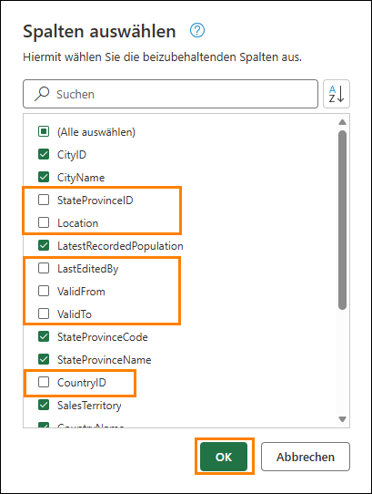

    Beachten Sie, dass der Prozess dem von Power Query ähnelt. Alle Schritte sind sowohl im Bereich „Angewendete Schritte“ rechts als auch in der visuellen Ansicht aufgezeichnet. Wir benennen die Abfrage „Zusammenführen“ um und aktivieren „Laden aktivieren“, damit die Daten aus dieser Abfrage geladen werden.

26. Klicken Sie im Bereich „Abfragen“ (links) **mit der rechten Maustaste** auf **„Zusammenführen“**. Wählen Sie **Umbenennen** aus, und benennen Sie die Abfrage in **Geo** um.

27. Klicken Sie im Bereich „Abfragen“ (links) **mit der rechten Maustaste** auf die **Geo-Abfrage**. Wählen Sie **Laden aktivieren** aus, um diese Abfrage zu aktivieren.

28. Stellen Sie sicher, dass die Abfragen „Cities“, „States“ und „Countries“ **deaktiviert** sind.

29. Wählen Sie **Speichern** unten rechts im Power Query-Editor aus.

    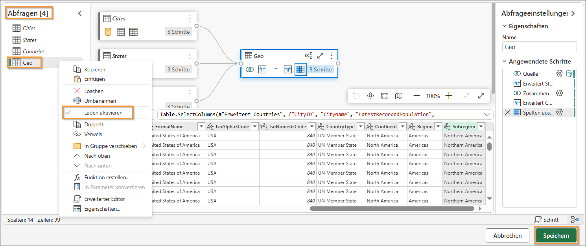

    Wir werden zum visuellen Abfrage-Editor weitergeleitet. Jetzt speichern wir diese Abfrage als Ansicht.

    **Hinweis:** Alle Schritte, die wir mit dem Power Query-Editor ausgeführt haben, können auch mit dem Editor für Visual-Abfragen ausgeführt werden.

30. Wählen Sie im Menü des Editors für Visual-Abfragen **Als Ansicht speichern** aus.

    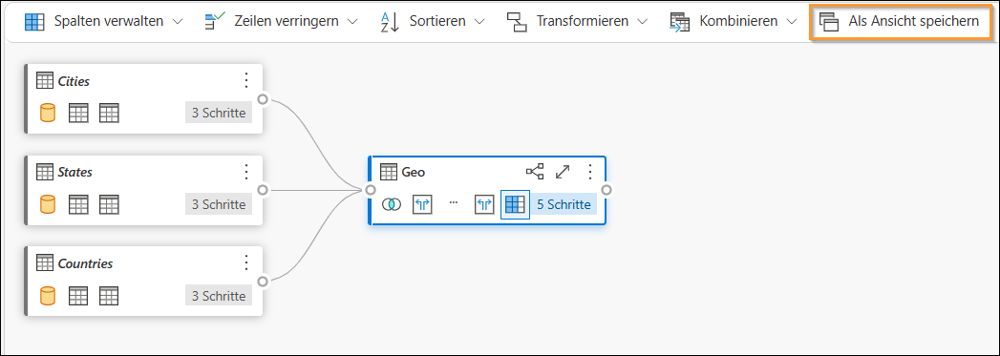

    Das Dialogfeld „Als Ansicht speichern“ wird geöffnet. Beachten Sie, dass die SQL-Abfrage verfügbar ist. Sie können sie überprüfen, wenn Sie den SQL-Code verifizieren möchten.

31. Geben Sie als **Ansichtsname** **Geo** ein.

32. Wählen Sie **OK** aus, um die Ansicht zu speichern.

    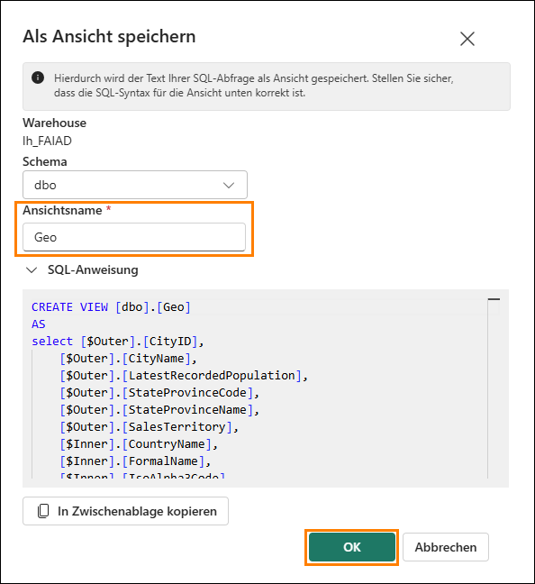

    Sie erhalten eine Benachrichtigung, nachdem die Ansicht gespeichert wurde.

33. Erweitern Sie im Explorer-Bereich (links) **Ansichten**. Hier erscheint die neu erstellte Ansicht „Geo“.

    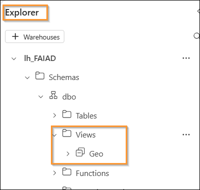

## Aufgabe 3: Reseller-, Sales- und Product-Ansichten mit einer SQL-Abfrage erstellen

1. In Fabric können wir Ansichten auch mithilfe von SQL-Abfragen erstellen. Wählen Sie im Menüband „**Neue SQL-Abfrage**“ aus.

    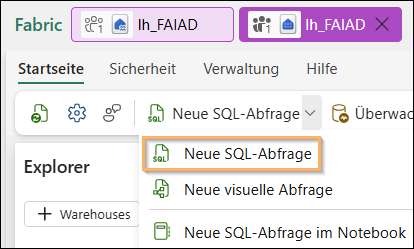

2. Hier können wir TSQL schreiben, um die benötigten Ansichten zu erstellen.

3. Fügen Sie die **nachfolgende SQL-Abfrage** in das **Abfragefenster** ein. Dadurch werden drei Ansichten erstellt: Reseller, Sales und Product.

    ```sql
    CREATE VIEW dbo.Reseller AS
    select [$Outer].[ResellerID] as [ResellerID],
        [$Outer].[ResellerName] as [ResellerName],
        [$Outer].[PostalCityID] as [PostalCityID],
        [$Outer].[PhoneNumber] as [PhoneNumber],
        [$Outer].[FaxNumber] as [FaxNumber],
        [$Outer].[WebsiteURL] as [WebsiteURL],
        [$Outer].[DeliveryAddressLine1] as [DeliveryAddressLine1],
        [$Outer].[DeliveryAddressLine2] as [DeliveryAddressLine2],
        [$Outer].[DeliveryPostalCode] as [DeliveryPostalCode],
        [$Outer].[PostalAddressLine1] as [PostalAddressLine1],
        [$Outer].[PostalAddressLine2] as [PostalAddressLine2],
        [$Outer].[PostalPostalCode] as [PostalPostalCode],
        [$Inner].[BuyingGroupName] as [ResellerCompany]
    from [lh_FAIAD].[dbo].[Customers] as [$Outer]
    inner join (
        select [_].[BuyingGroupID] as [BuyingGroupID2],
            [_].[BuyingGroupName] as [BuyingGroupName],
            [_].[LastEditedBy] as [LastEditedBy2],
            [_].[ValidFrom] as [ValidFrom2],
            [_].[ValidTo] as [ValidTo2]
        from [lh_FAIAD].[dbo].[BuyingGroups] as [_]
    ) as [$Inner] on ([$Outer].[BuyingGroupID] = [$Inner].[BuyingGroupID2] or [$Outer].[BuyingGroupID] is null and [$Inner].[BuyingGroupID2] is null)
    GO

    CREATE VIEW dbo.Sales AS
    select [$Outer].[InvoiceLineID] as [InvoiceLineID],
        [$Outer].[InvoiceID] as [InvoiceID],
        [$Outer].[StockItemID] as [StockItemID],
        [$Outer].[Quantity] as [Quantity],
        [$Outer].[UnitPrice] as [UnitPrice],
        [$Outer].[TaxRate] as [TaxRate],
        [$Outer].[TaxAmount] as [TaxAmount],
        [$Outer].[LineProfit] as [LineProfit],
        [$Outer].[ExtendedPrice] as [ExtendedPrice],
        [$Outer].[CustomerID] as [ResellerID],
        [$Outer].[SalespersonPersonID] as [SalespersonPersonID],
        [$Outer].[InvoiceDate] as [InvoiceDate],
        [$Outer].[t0_0] as [Sales Amount]
    from (
        select [_].[InvoiceLineID] as [InvoiceLineID],
            [_].[InvoiceID] as [InvoiceID],
            [_].[StockItemID] as [StockItemID],
            [_].[Quantity] as [Quantity],
            [_].[UnitPrice] as [UnitPrice],
            [_].[TaxRate] as [TaxRate],
            [_].[TaxAmount] as [TaxAmount],
            [_].[LineProfit] as [LineProfit],
            [_].[ExtendedPrice] as [ExtendedPrice],
            [_].[CustomerID] as [CustomerID],
            [_].[SalespersonPersonID] as [SalespersonPersonID],
            [_].[InvoiceDate] as [InvoiceDate],
            [_].[ExtendedPrice] - [_].[TaxAmount] as [t0_0]
        from (
            select [$Outer].[InvoiceLineID],
                [$Outer].[InvoiceID],
                [$Outer].[StockItemID],
                [$Outer].[Quantity],
                [$Outer].[UnitPrice],
                [$Outer].[TaxRate],
                [$Outer].[TaxAmount],
                [$Outer].[LineProfit],
                [$Outer].[ExtendedPrice],
                [$Inner].[CustomerID],
                [$Inner].[SalespersonPersonID],
                [$Inner].[InvoiceDate]
            from [lh_FAIAD].[dbo].[InvoiceLineItems] as [$Outer]
            inner join (
                select [_].[InvoiceID] as [InvoiceID2],
                    [_].[CustomerID] as [CustomerID],
                    [_].[BillToResellerID] as [BillToResellerID],
                    [_].[OrderID] as [OrderID],
                    [_].[DeliveryMethodID] as [DeliveryMethodID],
                    [_].[ContactPersonID] as [ContactPersonID],
                    [_].[AccountsPersonID] as [AccountsPersonID],
                    [_].[SalespersonPersonID] as [SalespersonPersonID],
                    [_].[PackedByPersonID] as [PackedByPersonID],
                    [_].[InvoiceDate] as [InvoiceDate],
                    [_].[CustomerPurchaseOrderNumber] as [CustomerPurchaseOrderNumber],
                    [_].[IsCreditNote] as [IsCreditNote],
                    [_].[CreditNoteReason] as [CreditNoteReason],
                    [_].[Comments] as [Comments],
                    [_].[DeliveryInstructions] as [DeliveryInstructions],
                    [_].[InternalComments] as [InternalComments],
                    [_].[TotalDryItems] as [TotalDryItems],
                    [_].[TotalChillerItems] as [TotalChillerItems],
                    [_].[DeliveryRun] as [DeliveryRun],
                    [_].[RunPosition] as [RunPosition],
                    [_].[ReturnedDeliveryData] as [ReturnedDeliveryData],
                    [_].[ConfirmedDeliveryTime] as [ConfirmedDeliveryTime],
                    [_].[ConfirmedReceivedBy] as [ConfirmedReceivedBy],
                    [_].[LastEditedBy] as [LastEditedBy2],
                    [_].[LastEditedWhen] as [LastEditedWhen2]
                from [lh_FAIAD].[dbo].[Invoices] as [_]
            ) as [$Inner] on ([$Outer].[InvoiceID] = [$Inner].[InvoiceID2] or [$Outer].[InvoiceID] is null and [$Inner].[InvoiceID2] is null)
        ) as [_]
    ) as [$Outer]
    where exists (
        select 1
        from (
            select [ResellerID]
            from [lh_FAIAD].[dbo].[Reseller] as [$Table]
        ) as [$Inner]
        where [$Outer].[CustomerID] = [$Inner].[ResellerID] or [$Outer].[CustomerID] is null and [$Inner].[ResellerID] is null
    )
    GO

    CREATE VIEW dbo.Product AS
    select [$Outer].[StockItemID],
        [$Outer].[StockItemName],
        [$Outer].[SupplierID],
        [$Outer].[Size],
        [$Outer].[IsChillerStock],
        [$Outer].[TaxRate],
        [$Outer].[UnitPrice],
        [$Outer].[RecommendedRetailPrice],
        [$Outer].[TypicalWeightPerUnit],
        [$Inner].[StockGroupName]
    from (
        select [$Outer].[StockItemID],
            [$Outer].[StockItemName],
            [$Outer].[SupplierID],
            [$Outer].[ColorID],
            [$Outer].[UnitPackageID],
            [$Outer].[OuterPackageID],
            [$Outer].[Brand],
            [$Outer].[Size],
            [$Outer].[LeadTimeDays],
            [$Outer].[QuantityPerOuter],
            [$Outer].[IsChillerStock],
            [$Outer].[Barcode],
            [$Outer].[TaxRate],
            [$Outer].[UnitPrice],
            [$Outer].[RecommendedRetailPrice],
            [$Outer].[TypicalWeightPerUnit],
            [$Outer].[MarketingComments],
            [$Outer].[InternalComments],
            [$Outer].[Photo],
            [$Outer].[CustomFields],
            [$Outer].[Tags],
            [$Outer].[SearchDetails],
            [$Outer].[LastEditedBy],
            [$Outer].[ValidFrom],
            [$Outer].[ValidTo],
            [$Inner].[StockGroupID]
        from [lh_FAIAD].[dbo].[ProductItem] as [$Outer]
        left outer join (
            select [_].[StockItemStockGroupID] as [StockItemStockGroupID],
                [_].[StockItemID] as [StockItemID2],
                [_].[StockGroupID] as [StockGroupID],
                [_].[LastEditedBy] as [LastEditedBy2],
                [_].[LastEditedWhen] as [LastEditedWhen]
            from [lh_FAIAD].[dbo].[ProductItemGroup] as [_]
        ) as [$Inner] on ([$Outer].[StockItemID] = [$Inner].[StockItemID2] or [$Outer].[StockItemID] is null and [$Inner].[StockItemID2] is null)
    ) as [$Outer]
    left outer join (
        select [_].[StockGroupID] as [StockGroupID2],
            [_].[StockGroupName] as [StockGroupName],
            [_].[LastEditedBy] as [LastEditedBy2],
            [_].[ValidFrom] as [ValidFrom2],
            [_].[ValidTo] as [ValidTo2]
        from [lh_FAIAD].[dbo].[ProductGroups] as [_]
    ) as [$Inner] on ([$Outer].[StockGroupID] = [$Inner].[StockGroupID2] or [$Outer].[StockGroupID] is null and [$Inner].[StockGroupID2] is null)
    GO
    ```

4. Wählen Sie „**Ausführen**“, nachdem Sie den Code eingefügt haben.

    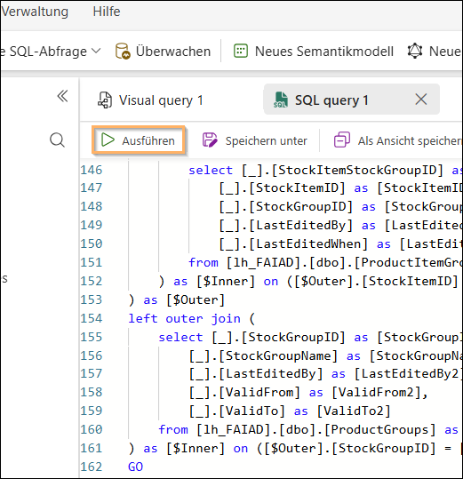

5. Erweitern Sie im Explorer-Bereich (links) **Views**. Hier finden wir die gerade erstellten Ansichten mit den sofort nutzbaren Daten.

    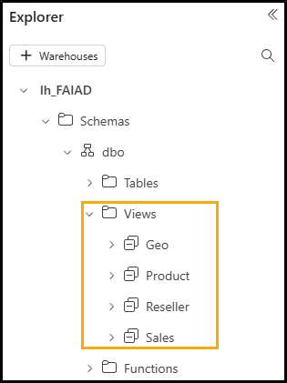

    Wir haben die Daten aus der ADLS Gen2-Datenquelle transformiert. In dieser Übung haben wir gelernt, wie man Verknüpfungen erstellt und verschiedene Optionen zur Verwendung von Ansichten für Visual-Abfragen zum Transformieren von Daten erkundet.

    In der nächsten Übung erfahren wir, wie man Dataflow Gen2 verwendet und eine Verknüpfung zu einem anderen Lakehouse erstellt.

# Referenzen

Bei Fabric Analyst in a Day (FAIAD) lernen Sie einige der wichtigsten Funktionen von Microsoft Fabric kennen. Im Menü des Dienstes finden Sie in der Hilfe (?) Links zu praktischen Informationen.

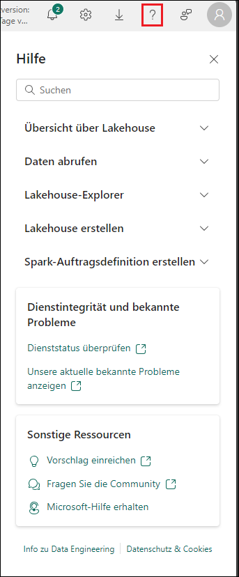

Nachfolgend finden Sie weitere Ressourcen zur Arbeit mit Microsoft Fabric.

- Die vollständige [Ankündigung der allgemeinen Verfügbarkeit von Microsoft Fabric](https://aka.ms/Fabric-Hero-Blog-Ignite23) finden Sie im Blogbeitrag.

- Fabric bei einer [interaktiven Vorstellung](https://aka.ms/Fabric-GuidedTour) kennenlernen

- Zur [kostenlosen Testversion von Microsoft Fabric](https://aka.ms/try-fabric) anmelden

- [Website von Microsoft Fabric](https://aka.ms/microsoft-fabric) besuchen

- Mit Modulen von [Fabric Learning](https://aka.ms/learn-fabric) neue Qualifikationen erwerben

- [Technische Dokumentation zu Fabric](https://aka.ms/fabric-docs) lesen

- [Kostenloses E-Book zum Einstieg in Fabric](https://aka.ms/fabric-get-started-ebook) lesen

- Mitglied der [Fabric-Community](https://aka.ms/fabric-community) werden, um Fragen zu stellen, Feedback zu geben und sich mit anderen auszutauschen

Lesen Sie die detaillierteren Blogs zur Ankündigung der Fabric-Umgebung:

- [Blog zum Data Factory-Funktionsbereich in Fabric](https://aka.ms/Fabric-Data-Factory-Blog)

- [Blog zum Data Engineering-Funktionsbereich von Synapse in Fabric](https://aka.ms/Fabric-DE-Blog)

- [Blog zum Data Science-Funktionsbereich von Synapse in Fabric](https://aka.ms/Fabric-DS-Blog)

- [Blog zum Data Warehousing-Funktionsbereich von Synapse in Fabric](https://aka.ms/Fabric-DW-Blog)

- [Blog zum Real-Time Analytics-Funktionsbereich von Synapse in Fabric](https://aka.ms/Fabric-RTA-Blog)

- [Blog mit Ankündigungen zu Power BI](https://aka.ms/Fabric-PBI-Blog)

- [Blog zum Data Activator-Funktionsbereich in Fabric](https://aka.ms/Fabric-DA-Blog)

- [Blog zu Verwaltung und Governance in Fabric](https://aka.ms/Fabric-Admin-Gov-Blog)

- [Blog zu OneLake in Fabric](https://aka.ms/Fabric-OneLake-Blog)

- [Blog zur Dataverse- und Microsoft Fabric-Integration](https://aka.ms/Dataverse-Fabric-Blog)

© 2026 Microsoft Corporation. Alle Rechte vorbehalten.

Durch die Verwendung der vorliegenden Demo/Übung stimmen Sie den folgenden Bedingungen zu:

Die in dieser Demo/Übung beschriebene Technologie/Funktionalität wird von der Microsoft Corporation bereitgestellt, um Feedback von Ihnen zu erhalten und Ihnen Wissen zu vermitteln. Sie dürfen die Demo/Übung nur verwenden, um derartige Technologiefeatures und Funktionen zu bewerten und Microsoft Feedback zu geben. Es ist Ihnen nicht erlaubt, sie für andere Zwecke zu verwenden. Es ist Ihnen nicht gestattet, diese Demo/Übung oder einen Teil derselben zu ändern, zu kopieren, zu verbreiten, zu übertragen, anzuzeigen, auszuführen, zu vervielfältigen, zu veröffentlichen, zu lizenzieren, zu transferieren oder zu verkaufen oder aus ihr abgeleitete Werke zu erstellen.

DAS KOPIEREN ODER VERVIELFÄLTIGEN DER DEMO/ÜBUNG (ODER EINES TEILS DERSELBEN) AUF EINEN/EINEM ANDEREN SERVER ODER SPEICHERORT FÜR DIE WEITERE VERVIELFÄLTIGUNG ODER VERBREITUNG IST AUSDRÜCKLICH UNTERSAGT.

DIESE DEMO/ÜBUNG STELLT BESTIMMTE SOFTWARE-TECHNOLOGIE-/PRODUKTFEATURES UND FUNKTIONEN, EINSCHLIESSLICH POTENZIELLER NEUER FEATURES UND KONZEPTE, IN EINER SIMULIERTEN UMGEBUNG OHNE KOMPLEXE EINRICHTUNG ODER INSTALLATION FÜR DEN OBEN BESCHRIEBENEN ZWECK BEREIT. DIE TECHNOLOGIE/KONZEPTE IN DIESER DEMO/ÜBUNG ZEIGEN MÖGLICHERWEISE NICHT DAS VOLLSTÄNDIGE FUNKTIONSSPEKTRUM UND FUNKTIONIEREN MÖGLICHERWEISE NICHT WIE DIE ENDGÜLTIGE VERSION. UNTER UMSTÄNDEN VERÖFFENTLICHEN WIR AUCH KEINE ENDGÜLTIGE VERSION DERARTIGER FEATURES ODER KONZEPTE. IHRE ERFAHRUNG BEI DER VERWENDUNG DERARTIGER FEATURES UND FUNKTIONEN IN EINER PHYSISCHEN UMGEBUNG KANN FERNER ABWEICHEND SEIN.

**FEEDBACK.** Wenn Sie Feedback zu den Technologiefeatures, Funktionen und/oder Konzepten geben, die in dieser Demo/Übung beschrieben werden, gewähren Sie Microsoft das Recht, Ihr Feedback in jeglicher Weise und für jeglichen Zweck kostenlos zu verwenden, zu veröffentlichen und gewerblich zu nutzen. Außerdem treten Sie Dritten kostenlos sämtliche Patentrechte ab, die erforderlich sind, damit deren Produkte, Technologien und Dienste bestimmte Teile einer Software oder eines Dienstes von Microsoft, welche/welcher das Feedback enthält, verwenden oder eine Verbindung zu dieser/diesem herstellen können. Sie geben kein Feedback, das einem Lizenzvertrag unterliegt, aufgrund dessen Microsoft Drittparteien eine Lizenz für seine Software oder Dokumentation gewähren muss, weil wir Ihr Feedback in diese aufnehmen. Diese Rechte bestehen nach Ablauf dieser Vereinbarung fort.

DIE MICROSOFT CORPORATION LEHNT HIERMIT JEGLICHE GEWÄHRLEISTUNGEN UND GARANTIEN IN BEZUG AUF DIE DEMO/ÜBUNG AB, EINSCHLIESSLICH ALLER AUSDRÜCKLICHEN, KONKLUDENTEN ODER GESETZLICHEN GEWÄHRLEISTUNGEN UND GARANTIEN DER HANDELSÜBLICHKEIT, DER EIGNUNG FÜR EINEN BESTIMMTEN ZWECK, DES RECHTSANSPRUCHS UND DER NICHTVERLETZUNG VON RECHTEN DRITTER. MICROSOFT MACHT KEINERLEI ZUSICHERUNGEN BZW. ERHEBT KEINERLEI ANSPRÜCHE IM HINBLICK AUF DIE RICHTIGKEIT DER ERGEBNISSE UND DES AUS DER VERWENDUNG DER DEMO/ÜBUNG RESULTIERENDEN ARBEITSERGEBNISSES BZW. BEZÜGLICH DER EIGNUNG DER IN DER DEMO/ÜBUNG ENTHALTENEN INFORMATIONEN FÜR EINEN BESTIMMTEN ZWECK.

**HAFTUNGSAUSSCHLUSS**

Diese Demo/Übung enthält nur einen Teil der neuen Features und Verbesserungen in Microsoft Power BI. Einige Features können sich unter Umständen in zukünftigen Versionen des Produkts ändern. In dieser Demo/Übung erhalten Sie Informationen über einige, aber nicht über alle neuen Features.
