# Microsoft Fabric - Fabric Analyst in a Day - Übung 7

## Inhalt

- Einführung
- Power BI
  - Aufgabe 1: Bericht automatisch erstellen
  - Aufgabe 2: Hintergrund für einen neuen Bericht konfigurieren
  - Aufgabe 3: Dem Bericht eine Kopfzeile hinzufügen
  - Aufgabe 4: Dem Bericht KPIs hinzufügen
  - Aufgabe 5: Dem Bericht ein Liniendiagramm hinzufügen
  - Aufgabe 6: Den Bericht speichern
  - Aufgabe 7: Spalte „Year“ in der Tabelle „Date“ konfigurieren
  - Aufgabe 8: Spalte „Month Name“ in der Tabelle „Date“ konfigurieren
  - Aufgabe 9: Liniendiagramm formatieren
  - Aufgabe 10: Power BI Desktop mit dem semantischen Modell verbinden
  - Aufgabe 11: Neue Daten hinzufügen, um den Direct Lake-Modus zu simulieren
- Übungsumgebung bereinigen
- Referenzen


# Einführung

In diesem Kurs haben Sie eine Einführung zu Lakehouse erhalten, Daten aus verschiedenen Datenquellen in Lakehouse erfasst, einen Aktualisierungsplan für die Datenquellen festgelegt und ein Datenmodell erstellt. Jetzt erstellen Sie einen Bericht.

Am Ende dieser Übung haben Sie Folgendes gelernt:

- Wie Sie einen Bericht automatisch erstellen

- Wie Sie einen Bericht über ein leeres Canvas erstellen

- Wie Sie einen Bericht mit Power BI Desktop erstellen

- Wie Sie den Direct Lake-Modus für die automatische Aktualisierung von Daten nutzen können

# Power BI

## Aufgabe 1: Bericht automatisch erstellen

Verwenden wir zunächst die Option „Bericht automatisch erstellen“. Und später in der Übung werden wir den Bericht, den wir in Power BI haben, neu erstellen.

1. Navigieren wir zurück zum **Fabric-Arbeitsbereich**, den Sie in Übung 2 erstellt haben, mit dem Namen **FAIAD_<Benutzername>**.

2. Wählen Sie unten links das Symbol **Fabric-Funktionsbereichs-Auswahl** aus.

    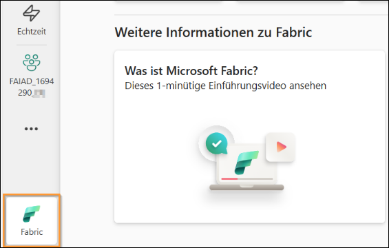

3. Das Dialogfeld „Fabric-Funktionsbereich“ wird geöffnet. Wählen Sie **Power BI** aus. Sie werden zur **Power BI-Startseite** weitergeleitet.

    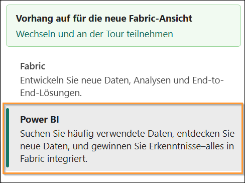

4. Wählen Sie **+ Neuer Bericht** aus dem oberen Menü aus.

    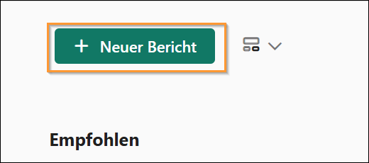

5. Sie werden zu **Erstellen Sie Ihren ersten Bericht** weitergeleitet. Dort sind Optionen verfügbar, um Berichte mit Excel oder CSV zu erstellen, Daten manuell einzugeben und ein veröffentlichtes semantisches Modell auszuwählen. In den vorherigen Übungen haben wir ein semantisches Modell erstellt, das wir jetzt verwenden können. Wählen Sie die Option **Veröffentlichtes Semantikmodell auswählen** aus.

    

6. Wählen Sie ein Dataset aus, das Sie in Ihrem Bericht verwenden möchte, wenn die Seite geöffnet wird. Beachten Sie, dass wir über mehrere Optionen verfügen. **Wählen Sie sm_FAIAD**aus.

    1. **sm_FAIAD**: Dies ist das semantische Modell, das wir erstellt haben und zum Erstellen des Berichts verwenden möchten.

    2. **lh_FAIAD**: Dies ist das Lakehouse, in dem wir alle Daten erfasst haben.

    3. **Units by Supplier:** Dies ist das Dataset das wir mit T-SQL erstellt haben.

7. Klicken Sie auf den **Pfeil neben der Schaltfläche „Bericht automatisch erstellen“**. Beachten Sie, dass es zwei Optionen gibt: „Bericht automatisch erstellen“ und „Leeren Bericht erstellen“. Versuchen wir es mit der automatischen Erstellung. Wählen Sie daher **Bericht automatisch erstellen** aus.

    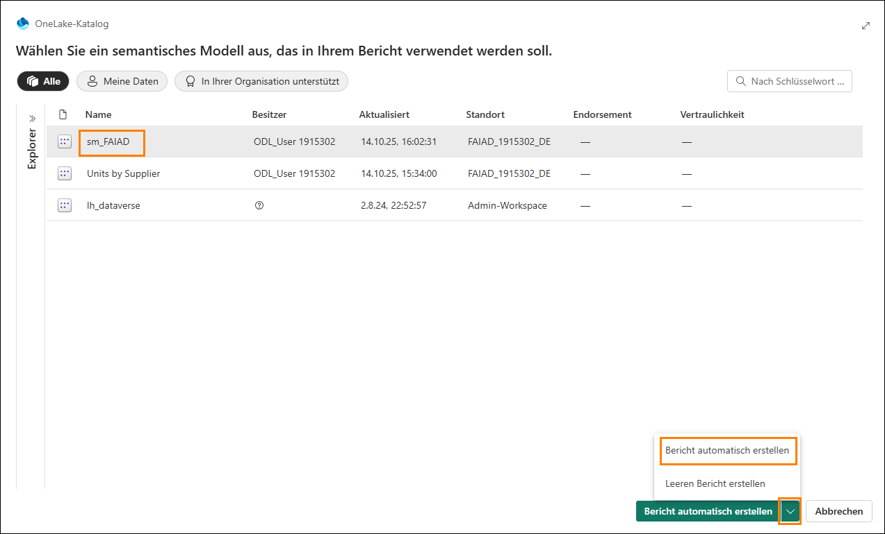

8. Power BI beginnt mit der automatischen Erstellung des Berichts. Sobald der Bericht fertig ist, wird oben rechts auf dem Bildschirm ein Dialogfeld angezeigt. Wählen Sie **Bericht jetzt anzeigen aus, oder er wird in einigen Sekunden automatisch geladen**.

    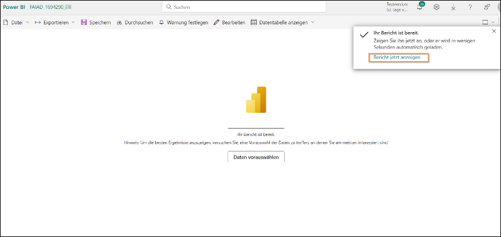

    **Prüfpunkt:** Sie erhalten einen Bericht, der wie im folgenden Screenshot aussieht. Er enthält einige KPIs und einige Trendvisualisierungen. Dies ist ein guter Ausgangspunkt, wenn Sie ein neues Modell analysieren und sofort starten müssen.

    **Hinweis:** Im oberen Menü haben Sie die Möglichkeit, den Bericht zu bearbeiten oder einige der Daten als Tabellen anzuzeigen. Sehen Sie sich diese Optionen doch einmal genauer an.

9. Speichern wir diesen Bericht. Wählen Sie im oberen Menü **Speichern** aus.

10. Das Dialogfeld „Bericht speichern“ wird geöffnet. Geben Sie dem Bericht den Namen **rpt_Sales_Auto_Report**.
    **Hinweis:** Wir stellen dem Berichtsnamen das Präfix „rpt“ voran, was für „Bericht“ steht.

11. Stellen Sie sicher, dass der Bericht in Ihrem Arbeitsbereich **FAIAD_<Benutzername>** gespeichert wird.

12. Wählen Sie **Speichern** aus.

    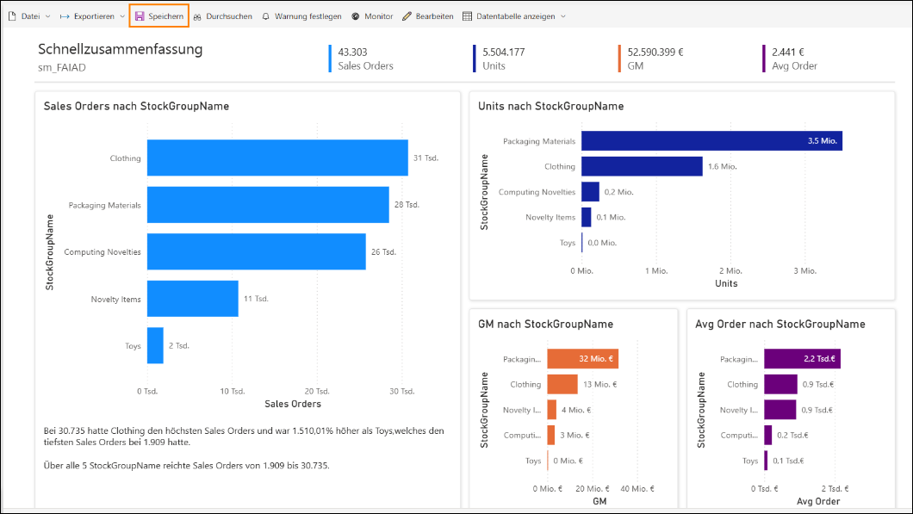

    **Hinweis:** Der automatisch erstellte Bericht kann für Sie anders aussehen, da er „automatisch erstellt“ wird. Dies hängt auch von den Beziehungen und Measures ab, die Sie in der vorangegangenen Übung (Übung 6) erstellt haben.

    Der Screenshot oben zeigt, wie der automatisch erstellte Bericht aussehen **könnte**, wenn Sie alle Beziehungen und Measures einschließlich der fakultativen Beziehungen (Übung 6) erstellt haben.

    Der Screenshot unten zeigt, wie der automatisch erstellte Bericht aussehen **könnte**, wenn Sie die Erstellung der fakultativen Beziehungen und Measures (Übung 6) übersprungen haben.

    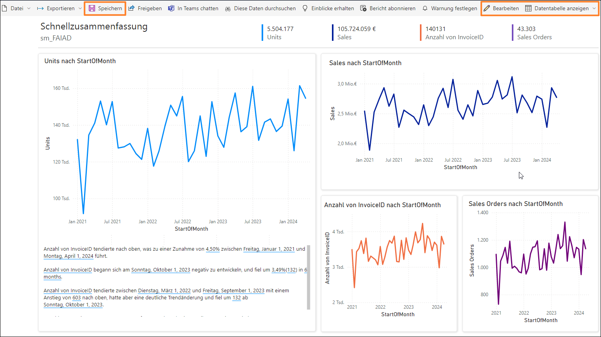

## Aufgabe 2: Hintergrund für einen neuen Bericht konfigurieren

Lassen Sie uns einen neuen Bericht mit einem leeren Canvas erstellen.

1. Wählen Sie im **linken Bereich** den Namen Ihres Arbeitsbereichs, **FAIAD_<Benutzername>**, aus, um zum Arbeitsbereich zu gelangen.

2. Wählen Sie im oberen Menü **Neues Element -> Bericht** aus. Sie werden zur Seite „Erstellen Sie Ihren ersten Bericht“ weitergeleitet.

    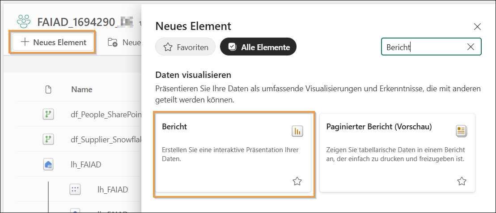

3. Wählen Sie **Veröffentlichtes Semantikmodell auswählen** aus, damit wir das von uns erstellte Modell verwenden können.

    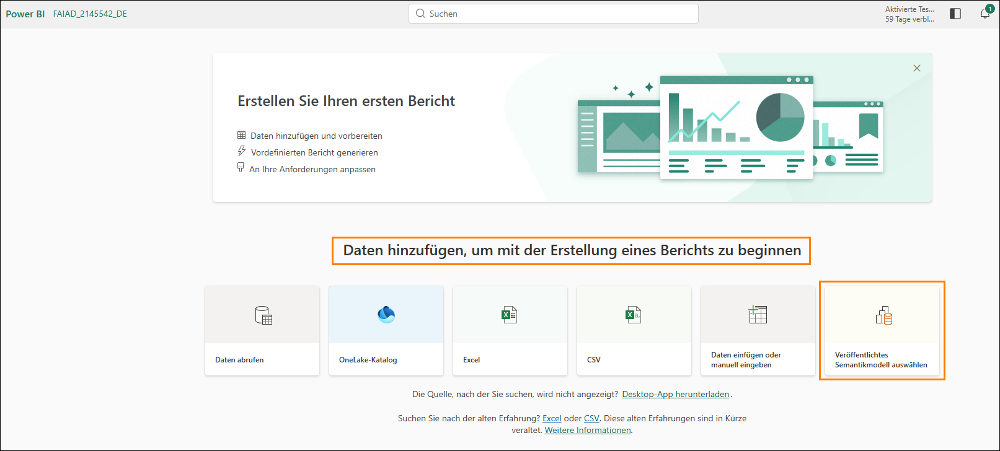

4. Das Dialogfeld „Wählen Sie ein semantisches Modell aus, das in Ihrem Bericht verwendet werden soll“ wird geöffnet. Wählen Sie **sm_FAIAD** aus.

5. Klicken Sie auf den **Pfeil neben der Schaltfläche „Bericht automatisch erstellen“**. Sie werden zu einer Berichtsseite weitergeleitet, die der Power BI Desktop-Berichtsseite ähnelt.

    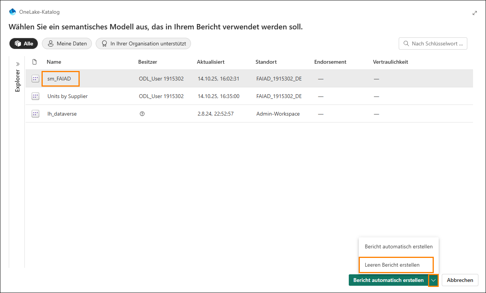

6. Öffnen Sie **FAIAD.pbix** im Ordner **Reports** auf dem **Desktop** Ihrer Übungsumgebung, falls dies noch nicht erfolgt ist.

    Wir werden diesen Bericht als Referenz verwenden. Wir fügen zunächst den Canvashintergrund hinzu. Wir erstellen die Berichtskopfzeile, fügen einige KPIs hinzu und erstellen das Liniendiagramm „Verkäufe im Laufe der Zeit“. Aus Zeitgründen und davon ausgehend, dass Sie bereits Erfahrung mit der Erstellung von Visuals in Power BI Desktop haben, werden wir nicht alle Visuals erstellen.

    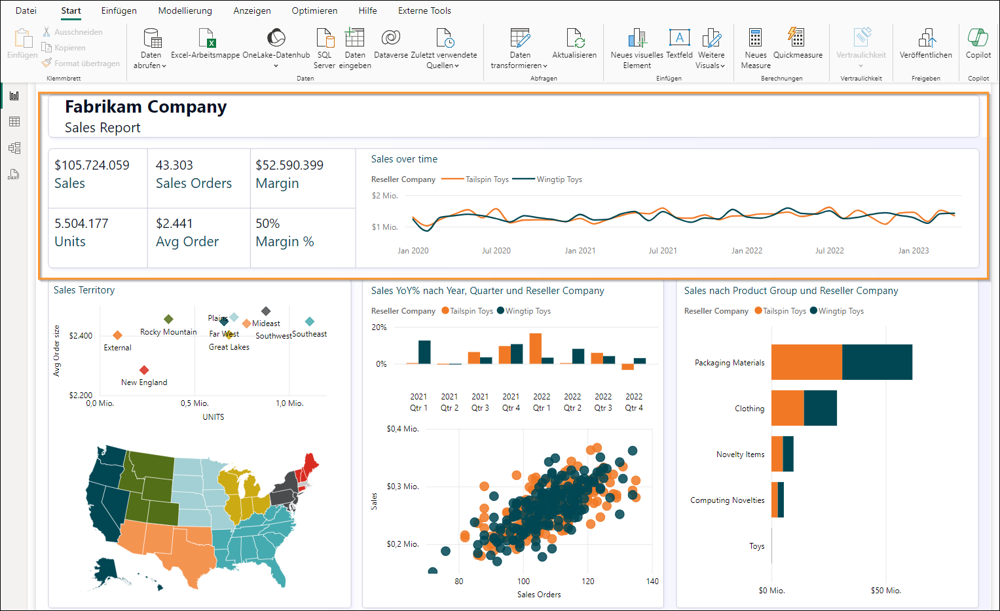

7. Navigieren Sie zurück zum **Power BI-Canvas** in Ihrem Browser.

8. Wählen Sie im Visualisierungsbereich das **Symbol** für die **Formatseite** aus.

9. Erweitern Sie den **Abschnitt „Canvas-Hintergrund“**.

10. Wählen Sie **in der** Option **Bild** Durchsuchen aus. Das Dialogfeld „Datei-Explorer“ wird geöffnet.

11. Navigieren Sie auf dem **Desktop** Ihrer Übungsumgebung zum Ordner **Reports**.

12. Wählen Sie **Summary Background.png** aus.

13. Wählen Sie im Dropdownmenü **Bild anpassen** den Eintrag **Anpassen** aus.

14. Legen Sie die Transparenz auf **0 %** fest.

    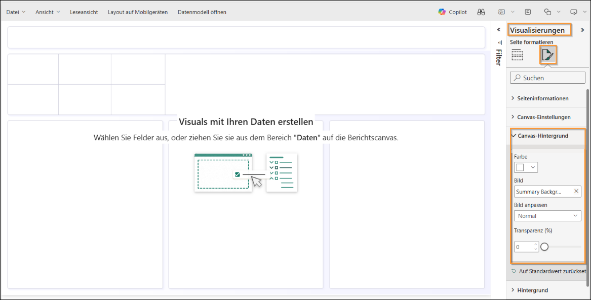

## Aufgabe 3: Dem Bericht eine Kopfzeile hinzufügen

1. Wir fügen nun die Kopfzeile am oberen Rand hinzu. Wählen Sie im **Menü** die Option **Textfeld** aus.

2. Geben Sie **Fabrikam Company** als erste Zeile in das Textfeld ein.

3. Geben Sie als zweite Zeile **Sales Report** in das Textfeld ein.

4. Markieren Sie **Fabrikam Company**, und legen Sie **Schriftart** auf **Segoe UI** und **Schriftgröße** auf **18, fett** fest.

5. Markieren Sie **Sales Report**, und legen Sie **Schriftart** auf **Segoe UI** und **Schriftgröße** auf **14** fest.

6. Erweitern Sie bei **ausgewähltem Textfeld** im Bereich „Textfeldformat“ rechts die Option **Effekte**.

7. Verwenden Sie den Schieberegler **Hintergrund**, um ihn auf **Aus** festzulegen.

8. Passen Sie die Größe des **Textfelds so an, dass es in den oberen Rand passt**.

    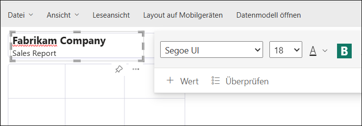

## Aufgabe 4: Dem Bericht KPIs hinzufügen

1. Fügen wir nun Verkauf-KPI hinzu. Wählen Sie den **Leerraum** im Canvas aus, um den Fokus vom Textfeld zu entfernen.

2. Wählen Sie im Abschnitt **Visualisierungen** die Option **Kartenvisual** aus.

3. Erweitern Sie im **Abschnitt „Daten“** die **Tabelle** **Sales**.

4. Wählen Sie **das Measure „Sales“** aus.

    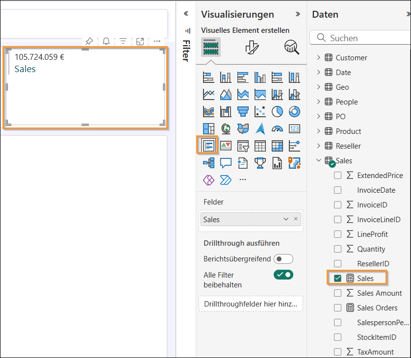

5. Wählen Sie bei **ausgewähltem Kartenvisual** das Symbol **Visual formatieren** im Bereich **Visualisierungen** aus.

6. Erweitern Sie den Abschnitt **Legende**.

7. Wählen Sie das Dropdown **Wert** aus. Ändern Sie die Schriftgröße zu **12**.

    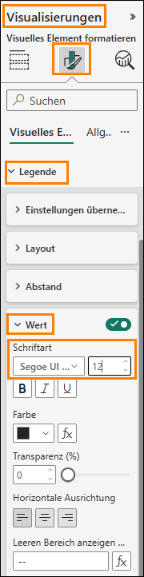

8. Während der Abschnitt **Legende** noch ausgewählt ist, erweitern Sie den Abschnitt **Bezeichnung**.

9. Verringern Sie die **Schriftgröße** auf **10**.

10. Wählen Sie das **Dropdownmenü „Farbe“** aus. Das Dialogfeld „Farbpalette“ wird geöffnet.

11. Wählen Sie **Mehr Farben** aus.

12. Legen Sie den HEX-Wert auf **#004753** fest.

    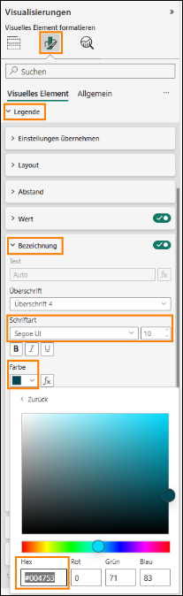

13. Erweitern Sie den Abschnitt **Karten**.

14. Stellen Sie den Schieberegler **Akzentleiste** auf **Aus**.

    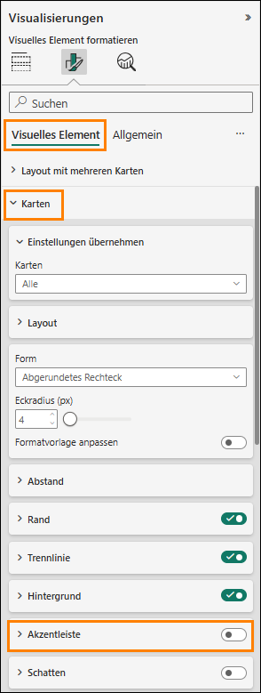

15. Wählen Sie im Visualisierungsbereich **Allgemein** aus.

16. Erweitern Sie den **Abschnitt „Effekte“**.

17. Stellen Sie den Schieberegler **Hintergrund** auf **Aus**.

18. Ändern Sie die Größe des **Visuals**, und verschieben Sie es in das **linke Feld, wie im Screenshot dargestellt**.

    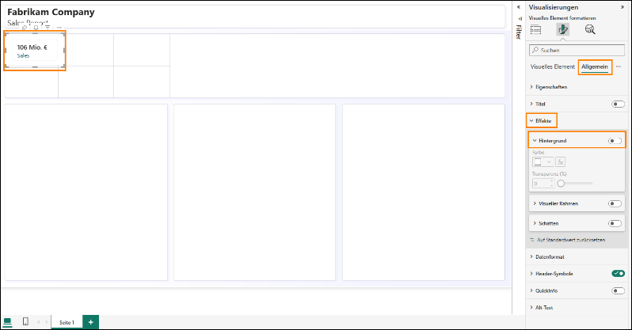

19. Fügen wir nun eine weitere Karte hinzu. Wählen Sie die soeben erstellte **Sales-Karte** aus. **Kopieren** Sie das Visual, indem Sie **STRG+C** auf Ihrer Tastatur auswählen.

20. **Fügen Sie** das Visual ein, indem Sie **STRG+V** auf Ihrer Tastatur auswählen. Beachten Sie, dass das Visual in das Canvas eingefügt wird.

21. Markieren Sie das **neue Visual**, und entfernen Sie im Abschnitt **Visualisierungen -> Visual erstellen -> Felder** das Measure **Sales**.

22. Erweitern Sie im Abschnitt **Daten** die Tabelle **Sales**, und wählen Sie das Measure **Units** aus.

23. Ändern Sie die Größe des **Visuals** und **platzieren Sie es im Feld unter dem Sales-Visual**.

    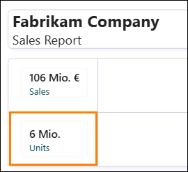

## Aufgabe 5: Dem Bericht ein Liniendiagramm hinzufügen

Lassen Sie uns ein Liniendiagramm erstellen, um Sales im Zeitverlauf nach Reseller Company zu visualisieren.

1. Wählen Sie den **Leerraum** im Canvas aus, um den Fokus vom mehrzeiligen Kartenvisual zu entfernen.

2. Wählen Sie im **Abschnitt** **Visualisierungen** die Option **Liniendiagramm** aus.

3. Erweitern Sie im **Abschnitt „Daten“** die Tabelle **Date**.

4. Wählen Sie das Feld **Year** aus. Beachten Sie, dass Year standardmäßig summiert und der Y-Achse hinzugefügt wird. Lassen Sie uns dies korrigieren.

    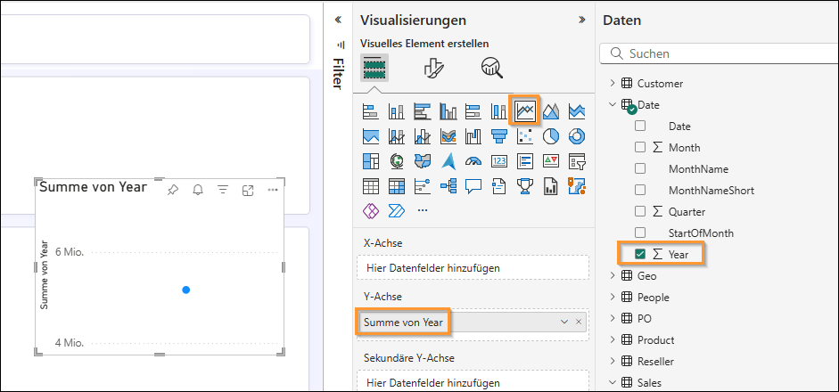

## Aufgabe 6: Den Bericht speichern

Speichern wir den Bericht, bevor wir ihn verlassen, um Änderungen am Modell vorzunehmen.

1. Wählen Sie im Menü **Datei -> Speichern** aus.

2. Das Dialogfeld „Bericht speichern“ wird geöffnet. Geben Sie dem Bericht den Namen **rpt_Sales_Report**.
    **Hinweis:** Wir stellen dem Berichtsnamen das Präfix „rpt“ voran, was für „Bericht“ steht.

3. Stellen Sie sicher, dass der Bericht im Arbeitsbereich **FAIAD_<Benutzername>** gespeichert wird.

4. Wählen Sie **Speichern** aus. Beachten Sie, dass der Bericht gespeichert ist und Sie sich im Anzeigemodus befinden.

    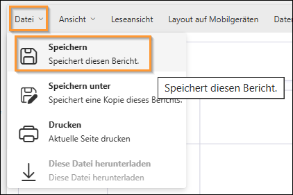

## Aufgabe 7: Spalte „Year“ in der Tabelle „Date“ konfigurieren

1. Wählen Sie im **oberen Menü** die Option **Bearbeiten** aus, um zum Bearbeitungsmodus zurückzukehren.

    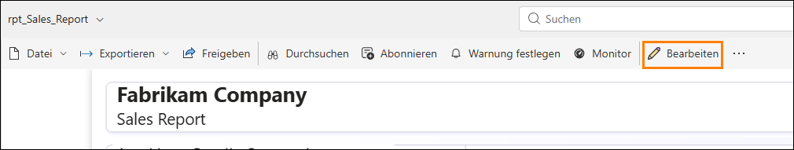

2. Wählen Sie im **oberen Menü** die Option **Semantisches Modell öffnen** aus. Beachten Sie, dass das semantische Modell in einem neuen Browserfenster bzw. einer neuen Browser-Registerkarte geöffnet wird.

    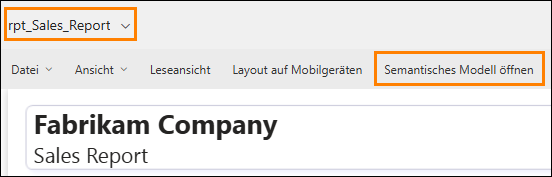

3. Aktivieren Sie den Modus **Bearbeiten** in der oberen rechten Ecke

4. Wählen Sie im Bereich **Daten auf der rechten Seite** „Tabellen“ aus.

5. Erweitern Sie die Tabelle **Date**.

6. Wählen Sie die Spalte **Year** aus.

7. Erweitern Sie im Bereich **Eigenschaften** links den Abschnitt **Erweitert**.

8. Wählen Sie aus der Dropdownliste **Zusammenfassen nach** den Eintrag **Keine** aus.

    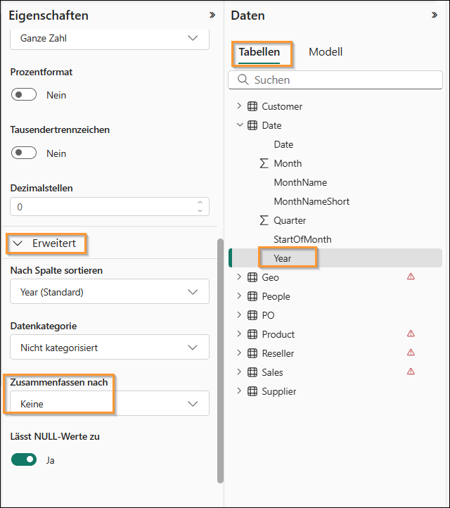

9. Navigieren Sie zurück zum/zur **Berichtsfenster/-registerkarte** des Browsers.

10. Erweitern Sie im **Datenbereich** rechts die Tabelle **Date**. Beachten Sie, dass „Year“ kein Summierungsfeld ist.

11. Wählen Sie das **Visual „Liniendiagramm“ aus**, und **entfernen Sie „Sum of Year“** von der Y-Achse.

12. Wählen Sie das Feld **Year** aus, sodass es der **X-Achse** hinzugefügt wird.

13. Erweitern Sie die Tabelle **Sales**, und wählen Sie das Measure **„Sales“** aus.

    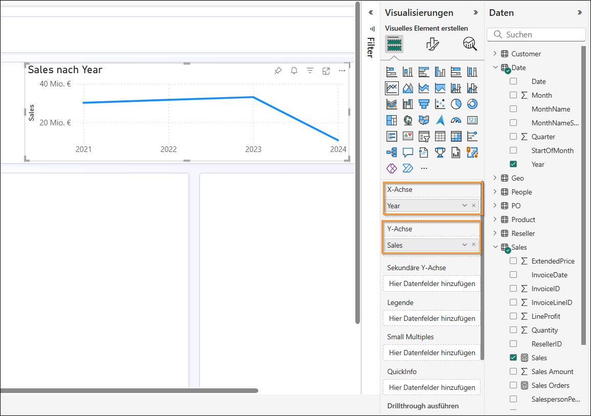

## Aufgabe 8: Spalte „Month Name“ in der Tabelle „Date“ konfigurieren

1. Fügen wir diesem Diagramm „Monat“ hinzu. Ziehen Sie das Feld **MonthNameShort** aus der Tabelle „Date“ unter **Year** in die **X-Achse**. Beachten Sei, dass das Visual nach „Sales“ sortiert ist.Nun sortieren wir es nach **MonthNameShort**.

2. Wählen Sie die **Auslassungspunkte (…)** oben rechts im Visual aus.

3. Wählen Sie **Achse sortieren -> Year Short_Month_Name** aus.

4. Wählen Sie die **Auslassungspunkte (…)** oben rechts im Visual aus.

5. Wählen Sie **Sortieren nach -> Aufsteigend** **sortieren** aus.

    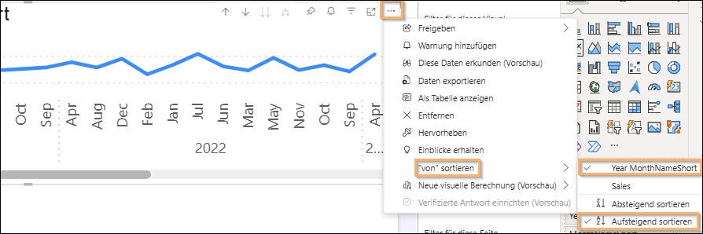

    **Hinweis:** Die Monate sind alphabetisch sortiert. Lassen Sie uns dieses Problem beheben.

    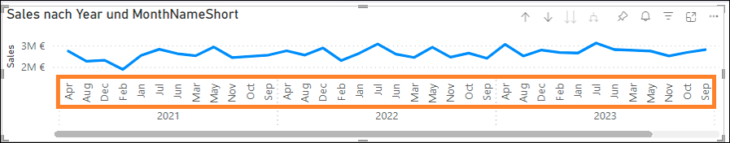

6. Navigieren Sie zurück zum/zur **Browserfenster/-registerkarte**, in dem/auf der Sie das semantische Modell geöffnet haben.

7. Erweitern Sie im Bereich **Daten** die Tabelle **Date**.

8. Wählen Sie die Spalte **MonthNameShort** aus.

9. Erweitern Sie im Bereich **Eigenschaften** links den Abschnitt **Erweitert**.

10. Wählen Sie im Dropdownmenü **Nach Spalte sortieren** den Eintrag **Month** aus.

    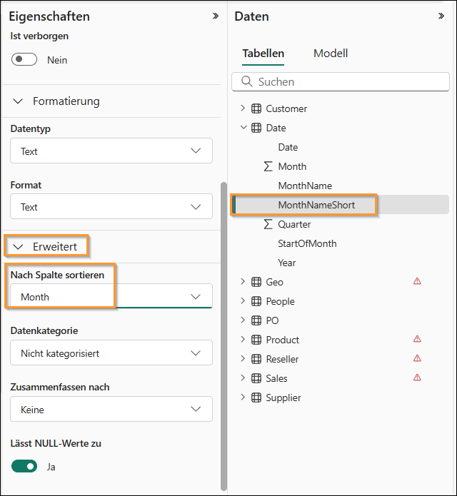

11. Navigieren Sie zurück zum/zur **Berichtsfenster/-registerkarte** des Browsers. Sie werden feststellen, dass die Monate jetzt richtig sortiert sind.

    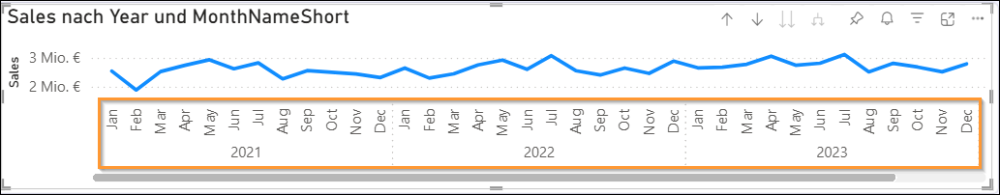

## Aufgabe 9: Liniendiagramm formatieren

Beachten Sie, wie einfach es ist, das semantische Modell beim Erstellen der Berichte zu aktualisieren. Daraus ergibt sich eine nahtlose Interaktion wie Power BI Desktop.

1. Wählen Sie das **Visual „Liniendiagramm“ aus**, und erweitern Sie im Abschnitt **Daten** die Tabelle **Reseller**.

2. Ziehen Sie das Feld **Reseller -> Reseller Company** in den Abschnitt **Legende**.

    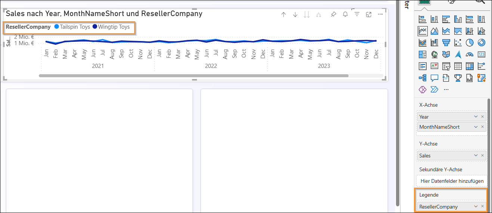

3. Wählen Sie das **Visual „Liniendiagramm“ aus**, und wählen Sie im Abschnitt **Visualisierung** das **Symbol „Visual formatieren“ -> Allgemein** aus.

4. Erweitern Sie den Abschnitt **Titel**.

5. Legen Sie den **Titeltext** auf **Sales over time** fest.

6. Erweitern Sie den Abschnitt **Effekte**.

7. Setzen Sie den Schieberegler **Hintergrund** auf **Aus**.

    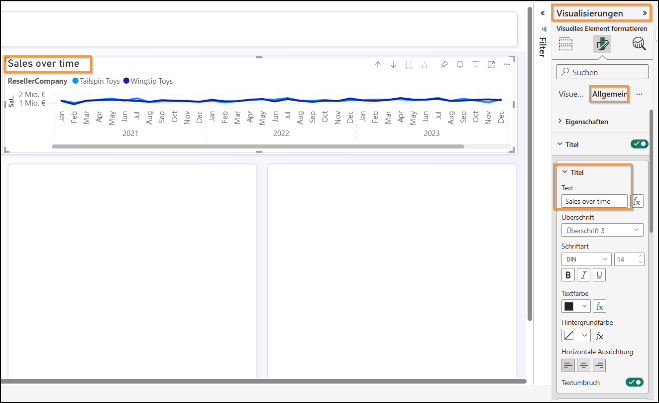

8. Wählen Sie im Abschnitt **Visualisierung** das **Symbol „Visual formatieren“ -> Visual** aus.

9. Erweitern Sie den Abschnitt **Linien**.

10. Wählen Sie im Dropdownmenü **Einstellungen übernehmen** -> **Datenreihen** die Option **Tailspin Toys** aus.

11. Erweitern Sie den Abschnitt **Farben**.

12. Legen Sie **Farbe** auf **#F17925** fest.

13. Wählen Sie im Dropdownmenü **Einstellungen übernehmen** -> **Datenreihen** die Option **Wingtip Toys** aus.

14. Legen Sie **Farbe** auf **#004753** fest.

15. Ändern Sie die Größe des **Visuals**, und verschieben Sie es in das **obere rechte Feld, wie im Screenshot dargestellt**.

16. Scrollen Sie im Visual nach rechts und **beachten Sie, dass Daten bis April 2024 verfügbar sind**.

    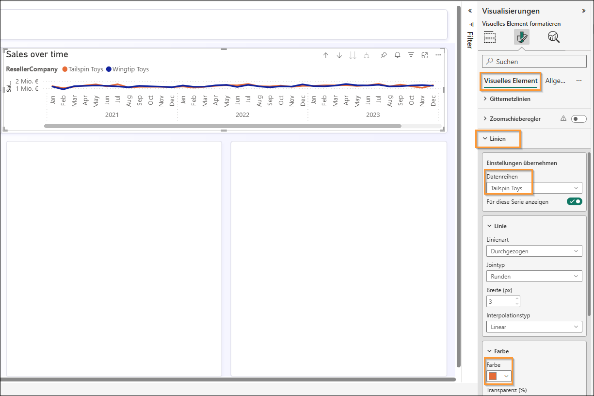

17. Lassen Sie uns den Bericht speichern, indem wird im Menü **Datei -> Speichern** auswählen.

    Wie bereits erwähnt, werden wir nicht alle Visuals in dieser Übung erstellen. Sie können nach Belieben weitere Visuals erstellen.

## Aufgabe 10: Power BI Desktop mit dem semantischen Modell verbinden

Sehen wir uns nun an, wie einfach es ist, Power BI Desktop mit dem semantischen Modell zu verbinden und Visuals zu erstellen.

1. Öffnen Sie in der Übungsumgebung auf dem **Desktop** im Ordner **Reports** die Datei **FAIADTemplate.pbix**.

2. Wählen Sie im Menüband **Start -> OneLake-Katalog -> Semantische Power BI-Modelle** aus.

    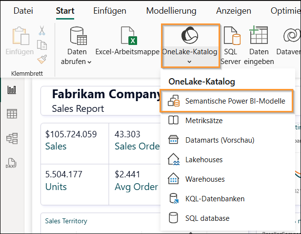

3. Das Dialogfeld „OneLake Data Hub“ wird geöffnet. Wählen Sie **sm_FAIAD**, das semantische Modell, das wir erstellt haben.

4. Wählen Sie **Verbinden** aus. Beachten Sie, dass sich die Tabellen aus dem semantischen Modell nun im Datenbereich befinden.

    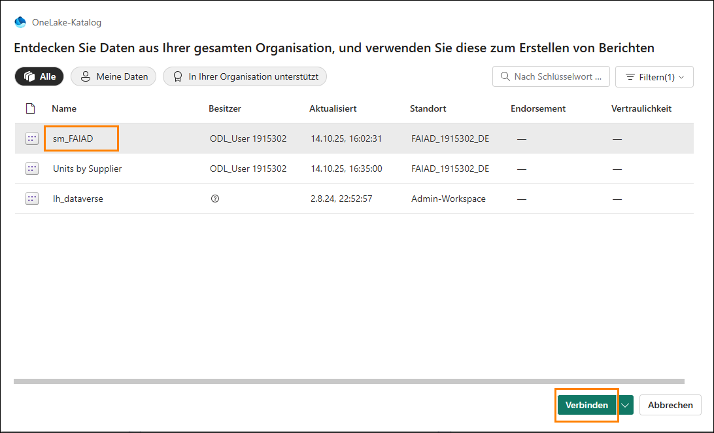

5. Wählen Sie im **linken Bereich** die Option **Modellansicht** aus. Hier sehen wir die Beziehung zwischen Tabellen.

    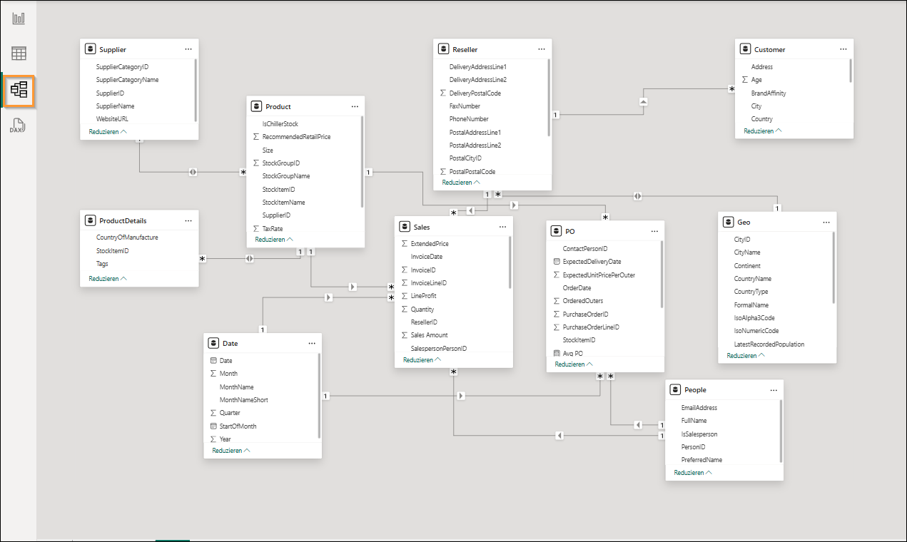

6. Wählen Sie im **linken Bereich** die Option **Berichtsansicht** aus, um zur Berichtsansicht zurückzukehren.

7. Öffnen Sie **FAIAD.pbix** im Ordner **Reports** auf dem **Desktop** Ihrer Übungsumgebung, falls dies noch nicht erfolgt ist.

8. Wählen Sie das **Visual des Berichtstitel** saus.

9. Wählen Sie im Menüband **Start > Kopieren** aus.

    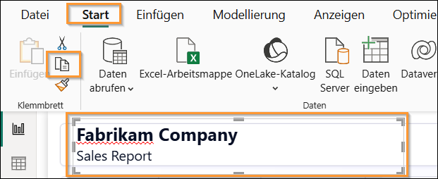

10. Navigieren Sie zu **FAIADTemplate.pbix**, und wählen Sie das Berichtscanvas aus.

11. Klicken Sie im Menüband auf **Start > Einfügen**.

    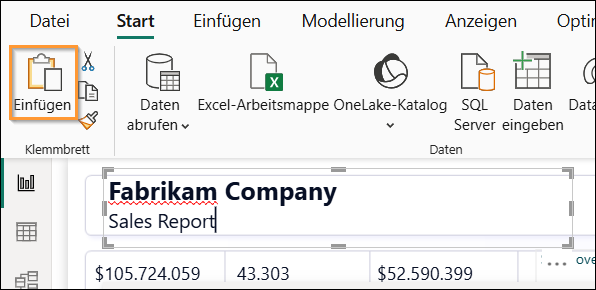

12. Kopieren Sie auf dieselbe Weise die **KPIs für Sales und Units**, und fügen Sie sie ein. Zu Ihrer Information: Es können mehrere Visuals zusammen kopiert und eingefügt werden.

    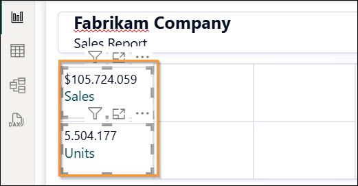

    So einfach ist es, Visuals aus einem vorhandenen Bericht zu kopieren und in einen Bericht einzufügen, der mit einem semantischen Modell verbunden ist Beachten Sie, dass die Namen von Tabellen, Spalten und Measures identisch sein müssen, damit das Kopieren und Einfügen funktioniert. Wenn sie nicht identisch sind, liegt möglicherweise ein Fehler vor, der sich jedoch leicht beheben lässt.

13. Navigieren Sie zu **FAIAD.pbix** , und wählen Sie das Liniendiagramm „Sales over time“ aus.

14. Wählen Sie im Menüband **Start > Kopieren** aus.

15. Navigieren Sie zu **FAIADTemplate.pbix** , und wählen Sie das Berichtscanvas aus.

16. Klicken Sie im Menüband auf **Start > Einfügen**. Beachten Sie, dass das Visual nicht gerendert wird. Dies liegt daran, dass das semantische Modell derzeit keine Hierarchie aus dem Date-Feld erstellt.

17. Lassen Sie uns dieses Problem beheben. Löschen Sie im Bereich **Visualisierung** unter **X-Achse** **StartOfMonth**.

    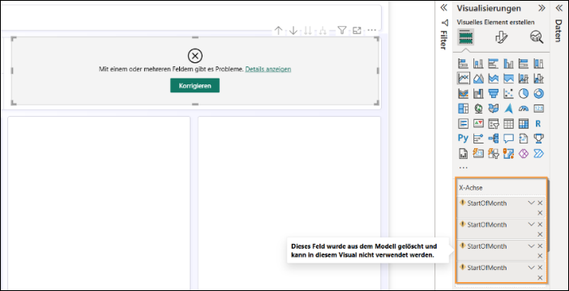

18. Erweitern Sie im **Datenbereich** die Tabelle **Date**.

19. Ziehen Sie das Feld **StartOfMonth** in die **X-Achse**. Dadurch wird das Problem mit dem Visual behoben. Sie müssen das Visual möglicherwiese formatieren.

    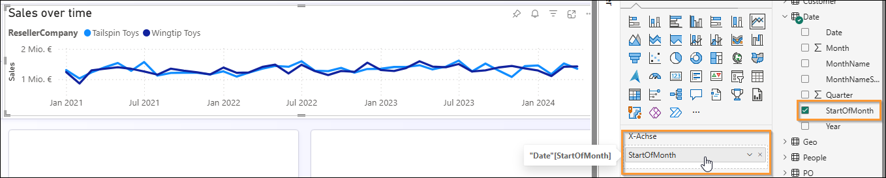

20. Lassen Sie uns den Bericht speichern, indem wir im Menüband **Datei -> Speichern** auswählen.

## Aufgabe 11: Neue Daten hinzufügen, um den Direct Lake-Modus zu simulieren

Normalerweise müssen wir im Import-Modus, sobald die Daten in der Quelle aktualisiert wurden, das Power BI-Modell aktualisieren, woraufhin die Daten im Bericht aktualisiert werden. Im Direct Query-Modus stehen die Daten im Power BI-Bericht zur Verfügung sobald sie in der Quelle aktualisiert wurden. Der Direct Query-Modus ist in der Regel jedoch langsam. Um dieses Problem zu beheben, hat Microsoft Fabric den Direct Lake-Modus eingeführt. Direct Lake ermöglicht das schnelle Laden der Daten aus dem Lake direkt in das Power BI-Modul, wo sie für die Analyse bereit stehen

Lassen Sie uns das Szenario untersuchen, in dem Daten in ADLS Gen2 aktualisiert werden und die Änderungen sofort im Power BI-Bericht angezeigt werden, ohne dass Aktualisierungen ausgeführt werden müssen.

In einem realen Szenario werden die Daten an der Quelle aktualisiert. Da wir uns in einer Schulungsumgebung befinden, werden wir dies simulieren. Wir verfügen über Verkaufsdaten bis April 2024. Fügen wir nun Verkaufsdaten für Mai 2024 hinzu, indem wir eine Verknüpfung zur Datei vom Mai 2024 in ADLS Gen2 erstellen und die Ansicht „Sales“ aktualisieren.

1. Navigieren Sie zurück zum **Browser**.

2. Klicken Sie in der unteren rechten Ecke auf das **Fabric-Logo**, und wechseln Sie zur **Fabric-Ansicht**.

3. Wählen Sie in der linken Menüleiste **FAIAD_<Benutzername>** aus, um zur Startseite des Arbeitsbereichs zu wechseln.

4. Wählen Sie **lh_FAIAD** aus, um zum Lakehouse zu navigieren.

    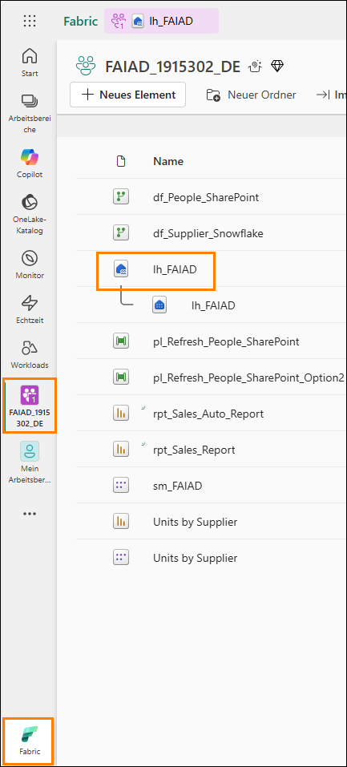

5. Wählen Sie im **Explorer-Bereich** auf der linken Seite die **Auslassungspunkte** neben **Tables** aus.

6. Wählen Sie **Neue Verknüpfung** aus.

    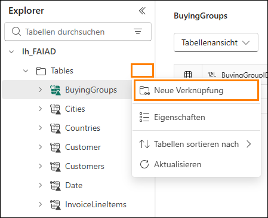

7. Das Dialogfeld „Neue Verknüpfung“ wird geöffnet. Wählen Sie unter **Externe Quellen** **Azure Data Lake Storage Gen2** aus.

    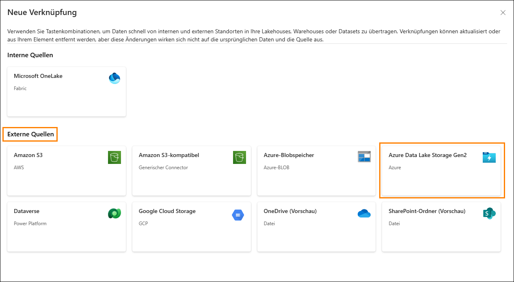

8. Da Sie bereits zu einem früheren Zeitpunkt in den Übungen eine Verbindung erstellt haben, müssen Sie keine neue Verbindung erstellen und sehen Ihre ADLS-Verbindung unter den vorhandenen Verbindungen.

9. Wenn Sie diese Verbindung nicht bereits früher im Kurs erstellt haben, klicken Sie auf **Neue Verbindung erstellen**, und führen Sie die folgenden Schritte aus:

10. Geben Sie unter **Verbindungseinstellungen -> URL** den Link <https://stvnextblobstorage.dfs.core.windows.net/fabrikam-sales> ein.

11. Wählen Sie **Weiter** aus.

    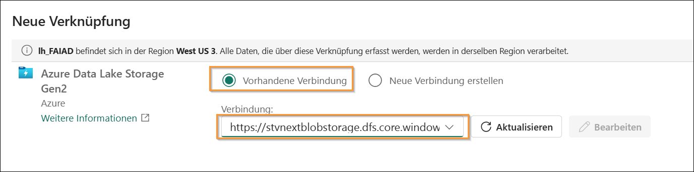

12. Sie werden mit ADLS Gen2 verbunden und die Verzeichnisstruktur wird im linken Bereich angezeigt. Erweitern Sie **Delta-Parquet-Format-FY25**.

13. Wählen Sie **Sales.Invoices_May** aus.

14. Wählen Sie **Weiter** aus.

    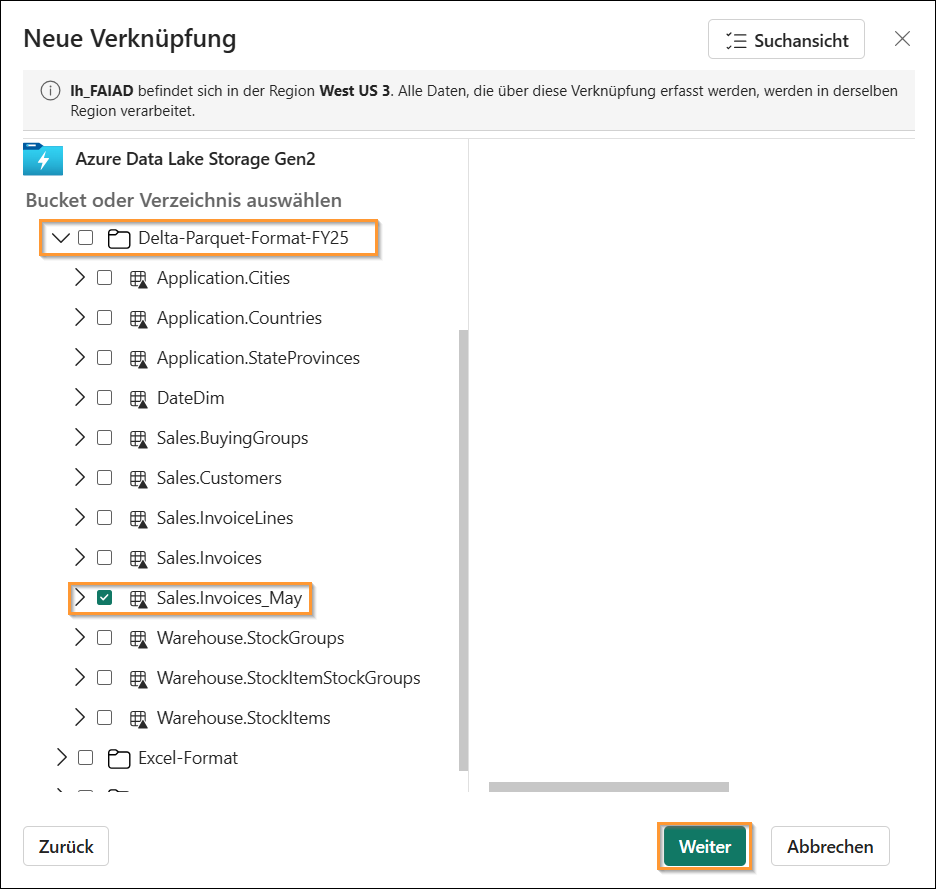

15. Sie werden zum nächsten Dialogfeld weitergeleitet, in dem Sie die Namen bearbeiten können. Wählen Sie das **Symbol „Bearbeiten“** unter Aktionen für **Sales.Invoices_May** aus.

16. Benennen Sie **Sales.Invoices_May nach InvoicesMay** um.

17. Wählen Sie das **Häkchen** neben dem Namen, um die Änderung zu speichern.

18. Wählen Sie **Erstellen** aus.

    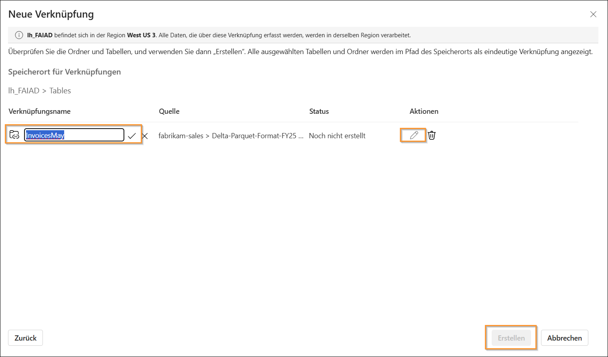

    Beachten Sie, dass im **Explorer-Bereich** auf der linken Seite nun die Tabelle „InvoicesMay“ auftaucht Jetzt müssen wir die Ansicht „Sales“ aktualisieren.

19. Wählen Sie **oben rechts** auf dem Bildschirm **Lakehouse -> SQL-Analyseendpunkt** aus.

    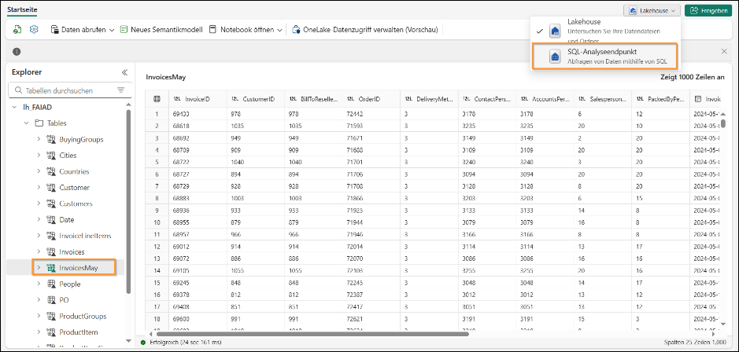

20. Wählen Sie im Menü oben **Start -> Neue SQL-Abfrage** aus. Der Bereich für neue SQL-Abfragen wird geöffnet.

21. **Kopieren** Sie den folgenden Code, und **fügen** Sie ihn in den SQL-Abfragebereich **ein.**

    ```sql
    ALTER VIEW [dbo].[Sales] AS (
    select [$Outer].[InvoiceLineID] as [InvoiceLineID],
        [$Outer].[InvoiceID] as [InvoiceID],
        [$Outer].[StockItemID] as [StockItemID],
        [$Outer].[Quantity] as [Quantity],
        [$Outer].[UnitPrice] as [UnitPrice],
        [$Outer].[TaxRate] as [TaxRate],
        [$Outer].[TaxAmount] as [TaxAmount],
        [$Outer].[LineProfit] as [LineProfit],
        [$Outer].[ExtendedPrice] as [ExtendedPrice],
        [$Outer].[CustomerID] as [ResellerID],
        [$Outer].[SalespersonPersonID] as [SalespersonPersonID],
        [$Outer].[InvoiceDate] as [InvoiceDate],
        [$Outer].[t0_0] as [Sales Amount]
    from 
    (
        select [_].[InvoiceLineID] as [InvoiceLineID],
            [_].[InvoiceID] as [InvoiceID],
            [_].[StockItemID] as [StockItemID],
            [_].[Quantity] as [Quantity],
            [_].[UnitPrice] as [UnitPrice],
            [_].[TaxRate] as [TaxRate],
            [_].[TaxAmount] as [TaxAmount],
            [_].[LineProfit] as [LineProfit],
            [_].[ExtendedPrice] as [ExtendedPrice],
            [_].[CustomerID] as [CustomerID],
            [_].[SalespersonPersonID] as [SalespersonPersonID],
            [_].[InvoiceDate] as [InvoiceDate],
            [_].[ExtendedPrice] - [_].[TaxAmount] as [t0_0]
        from 
        (
            select [$Outer].[InvoiceLineID],
                [$Outer].[InvoiceID],
                [$Outer].[StockItemID],
                [$Outer].[Quantity],
                [$Outer].[UnitPrice],
                [$Outer].[TaxRate],
                [$Outer].[TaxAmount],
                [$Outer].[LineProfit],
                [$Outer].[ExtendedPrice],
                [$Inner].[CustomerID],
                [$Inner].[SalespersonPersonID],
                [$Inner].[InvoiceDate]
            from [lh_FAIAD].[dbo].[InvoiceLineItems] as [$Outer]
            inner join 
            (
                select [_].[InvoiceID] as [InvoiceID2],
                    [_].[CustomerID] as [CustomerID],
                    [_].[BillToResellerID] as [BillToResellerID],
                    [_].[OrderID] as [OrderID],
                    [_].[DeliveryMethodID] as [DeliveryMethodID],
                    [_].[ContactPersonID] as [ContactPersonID],
                    [_].[AccountsPersonID] as [AccountsPersonID],
                    [_].[SalespersonPersonID] as [SalespersonPersonID],
                    [_].[PackedByPersonID] as [PackedByPersonID],
                    [_].[InvoiceDate] as [InvoiceDate],
                    [_].[CustomerPurchaseOrderNumber] as [CustomerPurchaseOrderNumber],
                    [_].[IsCreditNote] as [IsCreditNote],
                    [_].[CreditNoteReason] as [CreditNoteReason],
                    [_].[Comments] as [Comments],
                    [_].[DeliveryInstructions] as [DeliveryInstructions],
                    [_].[InternalComments] as [InternalComments],
                    [_].[TotalDryItems] as [TotalDryItems],
                    [_].[TotalChillerItems] as [TotalChillerItems],
                    [_].[DeliveryRun] as [DeliveryRun],
                    [_].[RunPosition] as [RunPosition],
                    [_].[ReturnedDeliveryData] as [ReturnedDeliveryData],
                    [_].[ConfirmedDeliveryTime] as [ConfirmedDeliveryTime],
                    [_].[ConfirmedReceivedBy] as [ConfirmedReceivedBy],
                    [_].[LastEditedBy] as [LastEditedBy2],
                    [_].[LastEditedWhen] as [LastEditedWhen2]
                from 
                (
                    select [$Table].[InvoiceID] as [InvoiceID],
                        [$Table].[CustomerID] as [CustomerID],
                        [$Table].[BillToResellerID] as [BillToResellerID],
                        [$Table].[OrderID] as [OrderID],
                        [$Table].[DeliveryMethodID] as [DeliveryMethodID],
                        [$Table].[ContactPersonID] as [ContactPersonID],
                        [$Table].[AccountsPersonID] as [AccountsPersonID],
                        [$Table].[SalespersonPersonID] as [SalespersonPersonID],
                        [$Table].[PackedByPersonID] as [PackedByPersonID],
                        [$Table].[InvoiceDate] as [InvoiceDate],
                        [$Table].[CustomerPurchaseOrderNumber] as [CustomerPurchaseOrderNumber],
                        [$Table].[IsCreditNote] as [IsCreditNote],
                        [$Table].[CreditNoteReason] as [CreditNoteReason],
                        [$Table].[Comments] as [Comments],
                        [$Table].[DeliveryInstructions] as [DeliveryInstructions],
                        [$Table].[InternalComments] as [InternalComments],
                        [$Table].[TotalDryItems] as [TotalDryItems],
                        [$Table].[TotalChillerItems] as [TotalChillerItems],
                        [$Table].[DeliveryRun] as [DeliveryRun],
                        [$Table].[RunPosition] as [RunPosition],
                        [$Table].[ReturnedDeliveryData] as [ReturnedDeliveryData],
                        [$Table].[ConfirmedDeliveryTime] as [ConfirmedDeliveryTime],
                        [$Table].[ConfirmedReceivedBy] as [ConfirmedReceivedBy],
                        [$Table].[LastEditedBy] as [LastEditedBy],
                        [$Table].[LastEditedWhen] as [LastEditedWhen]
                    from [lh_FAIAD].[dbo].[Invoices] as [$Table]
                    union all select [$Table].[InvoiceID] as [InvoiceID],
                        [$Table].[CustomerID] as [CustomerID],
                        [$Table].[BillToResellerID] as [BillToResellerID],
                        [$Table].[OrderID] as [OrderID],
                        [$Table].[DeliveryMethodID] as [DeliveryMethodID],
                        [$Table].[ContactPersonID] as [ContactPersonID],
                        [$Table].[AccountsPersonID] as [AccountsPersonID],
                        [$Table].[SalespersonPersonID] as [SalespersonPersonID],
                        [$Table].[PackedByPersonID] as [PackedByPersonID],
                        [$Table].[InvoiceDate] as [InvoiceDate],
                        [$Table].[CustomerPurchaseOrderNumber] as [CustomerPurchaseOrderNumber],
                        [$Table].[IsCreditNote] as [IsCreditNote],
                        [$Table].[CreditNoteReason] as [CreditNoteReason],
                        [$Table].[Comments] as [Comments],
                        [$Table].[DeliveryInstructions] as [DeliveryInstructions],
                        [$Table].[InternalComments] as [InternalComments],
                        [$Table].[TotalDryItems] as [TotalDryItems],
                        [$Table].[TotalChillerItems] as [TotalChillerItems],
                        [$Table].[DeliveryRun] as [DeliveryRun],
                        [$Table].[RunPosition] as [RunPosition],
                        [$Table].[ReturnedDeliveryData] as [ReturnedDeliveryData],
                        [$Table].[ConfirmedDeliveryTime] as [ConfirmedDeliveryTime],
                        [$Table].[ConfirmedReceivedBy] as [ConfirmedReceivedBy],
                        [$Table].[LastEditedBy] as [LastEditedBy],
                        [$Table].[LastEditedWhen] as [LastEditedWhen]
                    from [lh_FAIAD].[dbo].[InvoicesMay] as [$Table]
                ) as [_]
            ) as [$Inner] on ([$Outer].[InvoiceID] = [$Inner].[InvoiceID2] or [$Outer].[InvoiceID] is null and [$Inner].[InvoiceID2] is null)
        ) as [_]
    ) as [$Outer]
    where exists 
    (
        select 1
        from 
        (
            select [ResellerID]
            from [lh_FAIAD].[dbo].[Reseller] as [$Table]
        ) as [$Inner]
        where [$Outer].[CustomerID] = [$Inner].[ResellerID] or [$Outer].[CustomerID] is null and [$Inner].[ResellerID] is null
    )
    )
    ```

22. Wählen Sie Menü für Visual-Abfragen **Ausführen** aus, um den Code auszuführen.

    Sobald der Code ausgeführt wurde, haben wir die Tabelle „Sales“ aktualisiert, um die Daten für Mai 2024 aufzunehmen Nach der Ausführung des Codes wurde die Tabelle „Sales“ mit den Daten für Mai aktualisiert.

    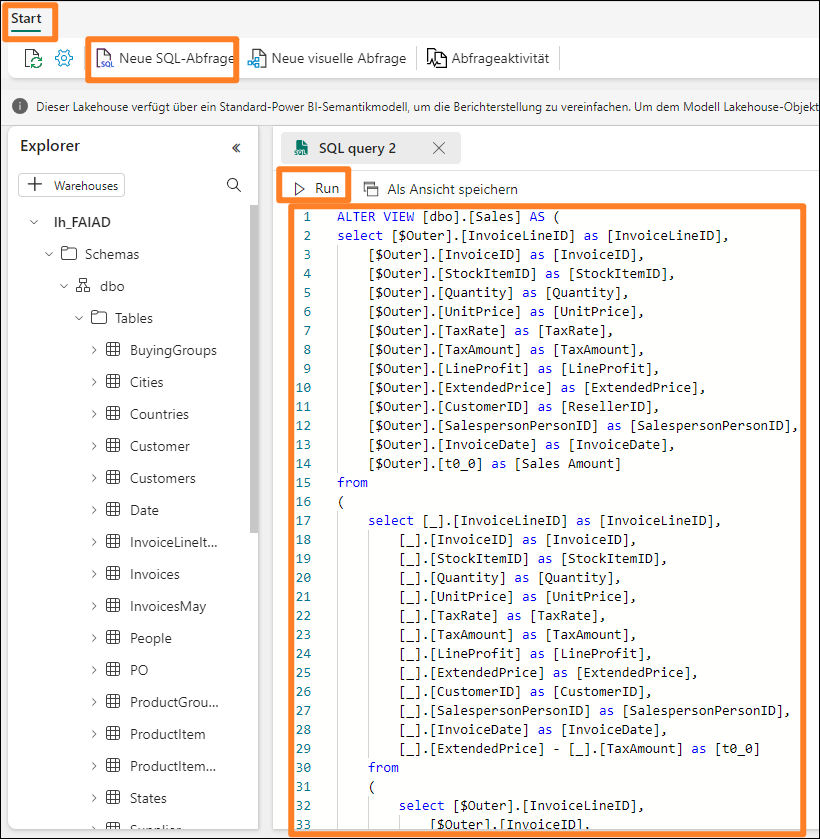

23. Wählen Sie in der linken Menüleiste **rpt_Sales_Report** aus, um zum Bericht zurückzukehren.

24. Wählen Sie im oberen Menü das Symbol **Aktualisieren** aus. Beachten Sie, dass im Liniendiagramm jetzt Daten für Mai 2024 vorhanden sind. Sie sehen auch, dass der Umsatzbetrag gestiegen ist.

    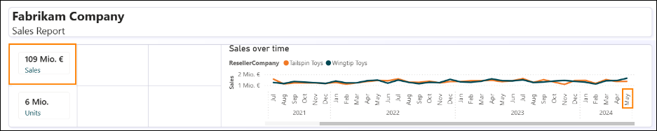

    Wir müssen das Datenmodell und den Bericht nicht aktualisieren, wenn Daten geändert werden. Dies ist der Vorteil von Direct Lake und Direct Query.

    Sehen wir uns noch einmal die Herausforderungen aus der Problemstellung an:

    - **Das Dataset muss mindestens dreimal täglich aktualisiert werden, um den verschiedenen Aktualisierungszeiten der Datenquellen Rechnung zu tragen.**

    Wir haben dieses Problem mithilfe von Direct Lake gelöst. Jeder einzelne Dataflow wird nach seinem Zeitplan aktualisiert. Datasets und Berichte müssen nicht aktualisiert werden.

    - **Ihre Aktualisierungsvorgänge dauern lange, weil die Daten jedes Mal komplett aktualisiert werden müssen, um alle Änderungen an den Daten in den Quellsystemen zu erfassen.**

    Auch hier haben wir dieses Problem mithilfe von Direct Lake gelöst. Jeder einzelne Dataflow wird nach seinem Zeitplan aktualisiert. Datasets und Berichte müssen nicht aktualisiert werden, sodass wir uns keine Sorgen über eine vollständige Aktualisierung machen müssen.

    - **Tritt in den Datenquellen, aus denen die Daten abgerufen werden, ein Fehler auf, wird die Dataset-Aktualisierung abgebrochen. Oftmals wird die Mitarbeiterdatei nicht pünktlich hochgeladen, was ebenso zum Abbruch der Dataset-Aktualisierung führt.**

    Dieses Problem lässt sich mit Pipelines lösen, da sie die Möglichkeit bieten, die Aktualisierung bei Fehlern und in verschiedenen Intervallen zu wiederholen.

    - **Änderungen am Datenmodell nehmen sehr viel Zeit in Anspruch, weil Power Query aufgrund der großen Datenmenge und des aufwändigen Transformationsvorgangs sehr lange braucht, um die Vorschauversionen zu aktualisieren.**

    Wir haben festgestellt, dass Dataflows und Lakehouses effizient und einfach zu ändern sind. Das Laden der Vorschauversion in Dataflows und Lakehouses dauert in der Regel nicht lange.

    - **Für Power BI Desktop brauchen Sie einen PC mit Windows, auch wenn im Unternehmen Mac-Geräte genutzt werden.**

    Microsoft Fabric ist ein SaaS-Angebot. Wir benötigen lediglich einen Browser, um auf den Dienst zuzugreifen. Wir müssen keine Software auf unseren Desktops installieren.

# Übungsumgebung bereinigen

Wenn Sie bereit sind, die Übungsumgebung zu bereinigen, führen Sie die folgenden Schritte aus.

1. Wählen Sie im linken Bereich den Arbeitsbereich **FAIAD_<Benutzername>** aus, um zur Startseite des Arbeitsbereichs zu navigieren.

2. Wählen Sie im oberen Menü **Arbeitsbereichseinstellungen** aus.

    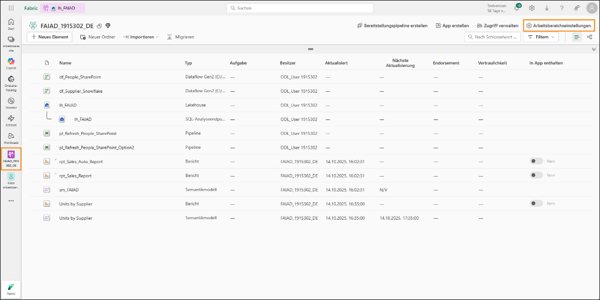

3. Das Dialogfeld „Arbeitsbereichseinstellungen“ wird geöffnet. Scrollen Sie im Abschnitt **Allgemein** nach unten.

4. Wählen Sie **Diesen Arbeitsbereich entfernen** aus.

5. Das Dialogfeld „Arbeitsbereich löschen“ wird angezeigt. Wählen Sie **Löschen** aus.

    Dadurch werden der Arbeitsbereich und alle darin enthaltenen Elemente gelöscht.

    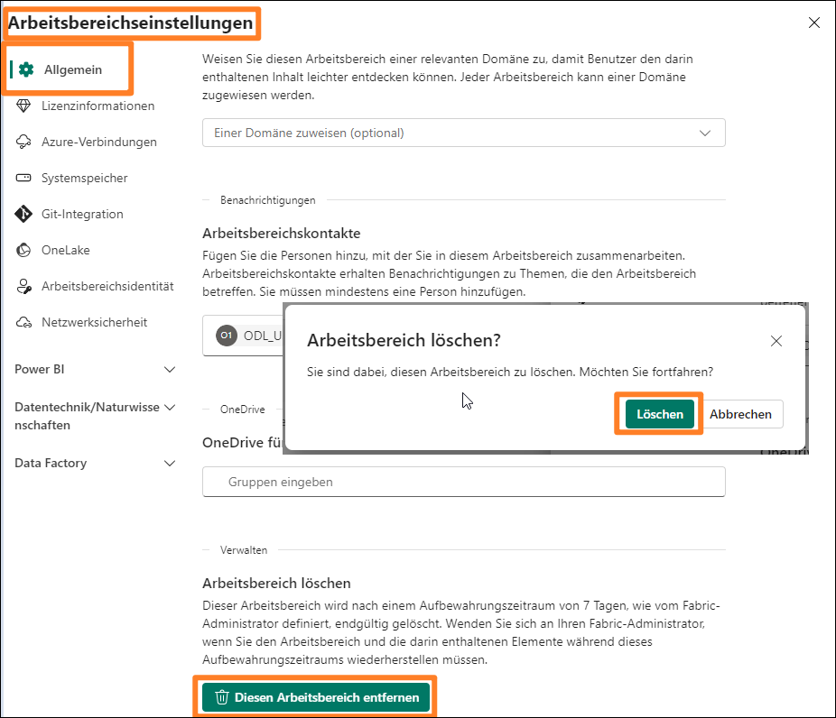

# Referenzen

Bei Fabric Analyst in a Day (FAIAD) lernen Sie einige der wichtigsten Funktionen von Microsoft Fabric kennen. Im Menü des Dienstes finden Sie in der Hilfe (?) Links zu praktischen Informationen.

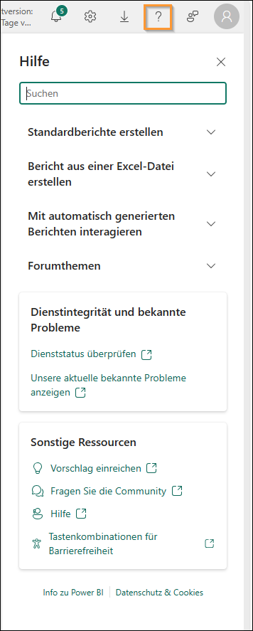

Nachfolgend finden Sie weitere Ressourcen zur Arbeit mit Microsoft Fabric.

- Die vollständige [Ankündigung der allgemeinen Verfügbarkeit von Microsoft Fabric](https://aka.ms/Fabric-Hero-Blog-Ignite23) finden Sie im Blogbeitrag.

- Fabric bei einer [interaktiven Vorstellung](https://aka.ms/Fabric-GuidedTour) kennenlernen

- Zur [kostenlosen Testversion von Microsoft Fabric](https://aka.ms/try-fabric) anmelden

- [Website von Microsoft Fabric](https://aka.ms/microsoft-fabric) besuchen

- Mit Modulen von [Fabric Learning](https://aka.ms/learn-fabric) neue Qualifikationen erwerben

- [Technische Dokumentation zu Fabric](https://aka.ms/fabric-docs) lesen

- [Kostenloses E-Book zum Einstieg in Fabric](https://aka.ms/fabric-get-started-ebook) lesen

- Mitglied der [Fabric-Community](https://aka.ms/fabric-community) werden, um Fragen zu stellen, Feedback zu geben und sich mit anderen auszutauschen

Lesen Sie die detaillierteren Blogs zur Ankündigung der Fabric-Umgebung:

- [Blog zum Data Factory-Funktionsbereich in Fabric](https://aka.ms/Fabric-Data-Factory-Blog)

- [Blog zum Data Engineering-Funktionsbereich von Synapse in Fabric](https://aka.ms/Fabric-DE-Blog)

- [Blog zum Data Science-Funktionsbereich von Synapse in Fabric](https://aka.ms/Fabric-DS-Blog)

- [Blog zum Data Warehousing-Funktionsbereich von Synapse in Fabric](https://aka.ms/Fabric-DW-Blog)

- [Blog zum Real-Time Analytics-Funktionsbereich von Synapse in Fabric](https://aka.ms/Fabric-RTA-Blog)

- [Blog mit Ankündigungen zu Power BI](https://aka.ms/Fabric-PBI-Blog)

- [Blog zum Data Activator-Funktionsbereich in Fabric](https://aka.ms/Fabric-DA-Blog)

- [Blog zu Verwaltung und Governance in Fabric](https://aka.ms/Fabric-Admin-Gov-Blog)

- [Blog zu OneLake in Fabric](https://aka.ms/Fabric-OneLake-Blog)

- [Blog zur Dataverse- und Microsoft Fabric-Integration](https://aka.ms/Dataverse-Fabric-Blog)

© 2026 Microsoft Corporation. Alle Rechte vorbehalten.

Durch die Verwendung der vorliegenden Demo/Übung stimmen Sie den folgenden Bedingungen zu:

Die in dieser Demo/Übung beschriebene Technologie/Funktionalität wird von der Microsoft Corporation bereitgestellt, um Feedback von Ihnen zu erhalten und Ihnen Wissen zu vermitteln. Sie dürfen die Demo/Übung nur verwenden, um derartige Technologiefeatures und Funktionen zu bewerten und Microsoft Feedback zu geben. Es ist Ihnen nicht erlaubt, sie für andere Zwecke zu verwenden. Es ist Ihnen nicht gestattet, diese Demo/Übung oder einen Teil derselben zu ändern, zu kopieren, zu verbreiten, zu übertragen, anzuzeigen, auszuführen, zu vervielfältigen, zu veröffentlichen, zu lizenzieren, zu transferieren oder zu verkaufen oder aus ihr abgeleitete Werke zu erstellen.

DAS KOPIEREN ODER VERVIELFÄLTIGEN DER DEMO/ÜBUNG (ODER EINES TEILS DERSELBEN) AUF EINEN/EINEM ANDEREN SERVER ODER SPEICHERORT FÜR DIE WEITERE VERVIELFÄLTIGUNG ODER VERBREITUNG IST AUSDRÜCKLICH UNTERSAGT.

DIESE DEMO/ÜBUNG STELLT BESTIMMTE SOFTWARE-TECHNOLOGIE-/PRODUKTFEATURES UND FUNKTIONEN, EINSCHLIESSLICH POTENZIELLER NEUER FEATURES UND KONZEPTE, IN EINER SIMULIERTEN UMGEBUNG OHNE KOMPLEXE EINRICHTUNG ODER INSTALLATION FÜR DEN OBEN BESCHRIEBENEN ZWECK BEREIT. DIE TECHNOLOGIE/KONZEPTE IN DIESER DEMO/ÜBUNG ZEIGEN MÖGLICHERWEISE NICHT DAS VOLLSTÄNDIGE FUNKTIONSSPEKTRUM UND FUNKTIONIEREN MÖGLICHERWEISE NICHT WIE DIE ENDGÜLTIGE VERSION. UNTER UMSTÄNDEN VERÖFFENTLICHEN WIR AUCH KEINE ENDGÜLTIGE VERSION DERARTIGER FEATURES ODER KONZEPTE. IHRE ERFAHRUNG BEI DER VERWENDUNG DERARTIGER FEATURES UND FUNKTIONEN IN EINER PHYSISCHEN UMGEBUNG KANN FERNER ABWEICHEND SEIN.

**FEEDBACK.** Wenn Sie Feedback zu den Technologiefeatures, Funktionen und/oder Konzepten geben, die in dieser Demo/Übung beschrieben werden, gewähren Sie Microsoft das Recht, Ihr Feedback in jeglicher Weise und für jeglichen Zweck kostenlos zu verwenden, zu veröffentlichen und gewerblich zu nutzen. Außerdem treten Sie Dritten kostenlos sämtliche Patentrechte ab, die erforderlich sind, damit deren Produkte, Technologien und Dienste bestimmte Teile einer Software oder eines Dienstes von Microsoft, welche/welcher das Feedback enthält, verwenden oder eine Verbindung zu dieser/diesem herstellen können. Sie geben kein Feedback, das einem Lizenzvertrag unterliegt, aufgrund dessen Microsoft Drittparteien eine Lizenz für seine Software oder Dokumentation gewähren muss, weil wir Ihr Feedback in diese aufnehmen. Diese Rechte bestehen nach Ablauf dieser Vereinbarung fort.

DIE MICROSOFT CORPORATION LEHNT HIERMIT JEGLICHE GEWÄHRLEISTUNGEN UND GARANTIEN IN BEZUG AUF DIE DEMO/ÜBUNG AB, EINSCHLIESSLICH ALLER AUSDRÜCKLICHEN, KONKLUDENTEN ODER GESETZLICHEN GEWÄHRLEISTUNGEN UND GARANTIEN DER HANDELSÜBLICHKEIT, DER EIGNUNG FÜR EINEN BESTIMMTEN ZWECK, DES RECHTSANSPRUCHS UND DER NICHTVERLETZUNG VON RECHTEN DRITTER. MICROSOFT MACHT KEINERLEI ZUSICHERUNGEN BZW. ERHEBT KEINERLEI ANSPRÜCHE IM HINBLICK AUF DIE RICHTIGKEIT DER ERGEBNISSE UND DES AUS DER VERWENDUNG DER DEMO/ÜBUNG RESULTIERENDEN ARBEITSERGEBNISSES BZW. BEZÜGLICH DER EIGNUNG DER IN DER DEMO/ÜBUNG ENTHALTENEN INFORMATIONEN FÜR EINEN BESTIMMTEN ZWECK.

**HAFTUNGSAUSSCHLUSS**

Diese Demo/Übung enthält nur einen Teil der neuen Features und Verbesserungen in Microsoft Power BI. Einige Features können sich unter Umständen in zukünftigen Versionen des Produkts ändern. In dieser Demo/Übung erhalten Sie Informationen über einige, aber nicht über alle neuen Features.
