# Microsoft Fabric - Fabric Analyst in a Day

## Sommario

- Introduzione
- Credenziali lab:
- Risolvere i problemi di accesso a Snowflake
- Collegamenti ai lab:
- Importazione del modello flusso di dati:
- Fattori da considerare prima di importare dal modello flusso di dati
- Importare il modello di flusso di dati
- Creare viste usando T-SQL
- Demo ML previsionale
- Requisito
- Creare un Notebook
- Aggiungere un lakehouse al Notebook
- Installare la libreria Python in linea
- Eseguire il codice per creare la previsione
- Initialize Spark session
- Load data from your specific Spark table
- Aggregate data to monthly level
- Convert to Pandas DataFrame and prepare for Prophet
- Fit the Prophet model
- Create a DataFrame for future predictions (e.g., next 12 months)
- Forecast
- Plotting the forecast
- Demo di Data Activator
- Requisito
- Scenario
- Aggiungere la misura percentuale di scostamento delle vendite
- Creare l'oggetto visivo tabella
- Creare Activator
- Panoramica di Activator
- Inviare un avviso di prova
- Demo collegamento semantico
- Requisito
- Scenario
- Analizzatore procedure consigliate
- Analizzatore di memoria

Screenshot per selezionare le impostazioni dell'area di lavoro

# **Introduzione**

Questo documento fornisce linee guida per le seguenti funzionalità:

- Credenziali lab

- Importare il modello di flusso di dati

- Passaggi per la demo ML previsionale

- Passaggi per la demo Data Activator

- Passaggi per la demo Data Mirroring

**Dichiarazione di non responsabilità:** tenere presente che alcuni screenshot potrebbero non essere aggiornati poiché il prodotto cambia ogni giorno. Lavoreremo per adeguarli nel prossimo aggiornamento.

# **Credenziali lab:**

Se qualsiasi partecipante sceglie di completare i lab in un ambiente alternativo, potrebbe essere necessario condividere le seguenti credenziali.

I partecipanti devono disporre del nome utente e della password associati al proprio account Lab per connettersi a Dataverse e SharePoint

1. **Nome utente:** TE_SNOWFLAKE1

2. **Password:** 8UpfRpExVDXv2AC1

3. **SAS Token:** ?sv=2023-01-03&ss=btqf&srt=sco&st=2025-06-30T10%3A15%3A46Z&se=2026-06-30T10%3A15%3A00Z&sp=rl&sig=hVeyxY4F72YVH3X%2BlnIvVTg8M%2FwZgLIhDzBgHlv1580%3D

    **Nota:** se si verificano problemi di connessione a Snowflake usando le credenziali dei dettagli dell'ambiente, usare le credenziali fornite di seguito.

    - **Nome utente Snowflake:** SNOWFLAKE_BACKUP

    - **Password Snowflake:** 8UpfRpExVDXv2AC1

    

### Risolvere i problemi di accesso a Snowflake

Se i partecipanti hanno problemi ad accedere a Snowflake, effettuare i passaggi seguenti. Verrà fornita una descrizione dettagliata dell'errore.

1. Aprire una nuova finestra del browser. Andare a **dlhdzca-bab11165.snowflakecomputing.com**. Questo è il server snowflake che si sta usando.

2. Immettere le **credenziali**. Se si verifica un errore, si otterrà una descrizione dettagliata dell'errore come mostrato nello screenshot riportato di seguito.

    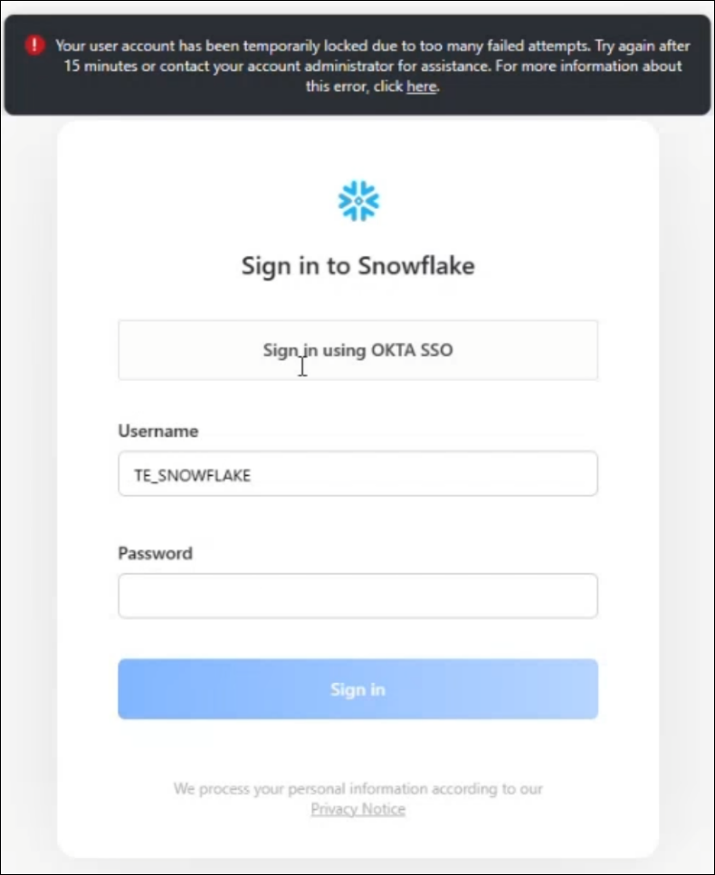

3. Se l'errore persiste, sono disponibili **dati Snowflake** **in Azure Data Lake** e un modello Flusso di dati (**df_Supplier_ADLSGen2. pqt**) contenuto in **C:\FAIAD\Solutions**. È possibile aiutare i partecipanti a effettuare i passaggi seguenti per importare questo modello.

# **Collegamenti ai lab:**

- [Portoghese brasiliano](https://experience.cloudlabs.ai/#/labguidepreview/aab00958-5596-4175-9bc9-39ece2586314)

- [Cinese](https://experience.cloudlabs.ai/#/labguidepreview/3c8f94bd-6936-4a18-a1e3-8b606402531e)

- [Inglese](https://experience.cloudlabs.ai/#/labguidepreview/b63b312d-0c58-4fd0-bee1-05a94affa927)

- [Francese](https://experience.cloudlabs.ai/#/labguidepreview/e9c3e273-1dd1-4db8-80e3-aedfe41a1e9b)

- [Tedesco](https://experience.cloudlabs.ai/#/labguidepreview/e697a208-a982-4c6d-b32b-7e83d39c7186)

- [Italiano](https://experience.cloudlabs.ai/#/labguidepreview/b984b3dd-928d-492e-be2c-de1d49dd2640)

- [Giapponese](https://experience.cloudlabs.ai/#/labguidepreview/bb29b27d-7a77-4e4e-9c0d-a12a86397a1f)

- [Coreano](https://experience.cloudlabs.ai/#/labguidepreview/544a6b13-8546-454d-8270-3540fe6a9566)

- [Spagnolo](https://experience.cloudlabs.ai/#/labguidepreview/16998c52-2637-4c65-b691-0fa5ac9091d7)

# **Importazione del modello flusso di dati:**

L'istruttore ha facoltà di permettere ai partecipanti di importare modelli flusso di dati. Di seguito è riportata la procedura per importare un modello.

### Fattori da considerare prima di importare dal modello flusso di dati

1. Se lo studente **ha già creato le tabelle nel lakehouse**: deve eliminare la tabella nel lakehouse prima di caricare il PQT (in caso contrario dovrà rinominare la tabella nel nuovo flusso di dati e poi tenerne conto nel corso dei lab).

2. Lo studente deve impostare le destinazioni per le tabelle pertinenti. Il segno di spunta "**Abilita staging**" deve essere deselezionato. È preferibile ricontrollare poiché in alcuni casi è ancora selezionato.

3. Le tabelle che richiedono destinazioni in df_Supplier_Snowflake sono:

    1. Supplier

    2. PO

4. La tabella che richiede la destinazione in df_People_SharePoint è:

    1. People

### Importare il modello di flusso di dati

1. Andare all' **area di lavoro di Fabric creata nel Lab 2, Attività 2** di nome **FAIAD_ <nome utente>**.

2. Nel menu selezionare **Nuovo elemento -> Dataflow Gen2**.

    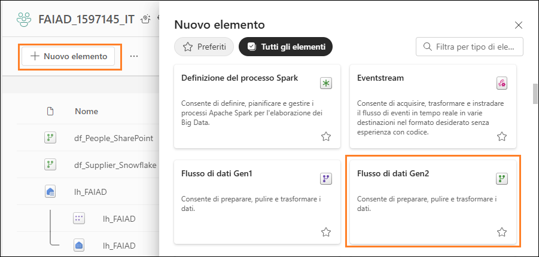

3. Si apre la finestra Power Query. Nel riquadro centrale selezionare **Importa da un modello di Power Query**.

    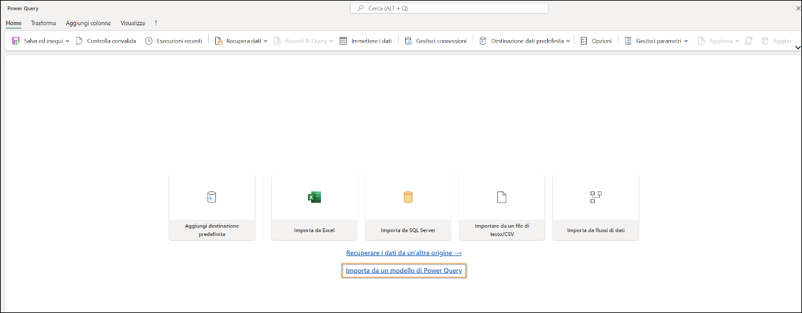

4. Passare alla cartella **C:\FAIAD\Solutions** nell'ambiente lab.

5. Selezionare il flusso di dati che si desidera importare. In questo caso si importa **df_People_SharePoint.pqt**

6. Selezionare **Apri**.

    Dopo l'importazione, verificare che la query e tutti i passaggi della query siano stati importati. È tuttavia ancora necessario configurare la connessione. Inoltre, è necessario impostare la destinazione dei dati. Attenersi alle istruzioni del lab per completare questi passaggi.

    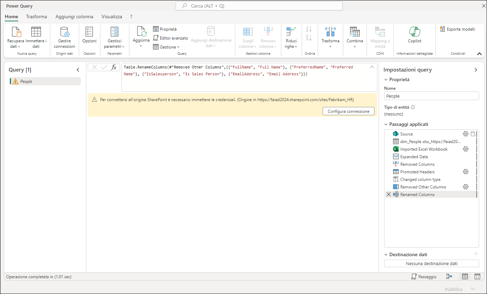

# **Creare viste usando T-SQL**

L'istruttore ha facoltà di permettere ai partecipanti di creare viste usando T-SQL. Le viste T-SQL for Geo, Product, Reseller e Sales sono disponibili nella cartella **Solutions**. Aprire una nuova finestra di query SQL nel lakehouse ed eseguire queste istruzioni T-SQL. Se è necessario rimuovere una vista, il file Remove-View può essere eseguito anche nella cartella Soluzioni.

**Nota:** queste sono istruzioni CREATE. Prima di eseguire queste istruzioni, è necessario eliminare tutte le viste esistenti con lo stesso nome.

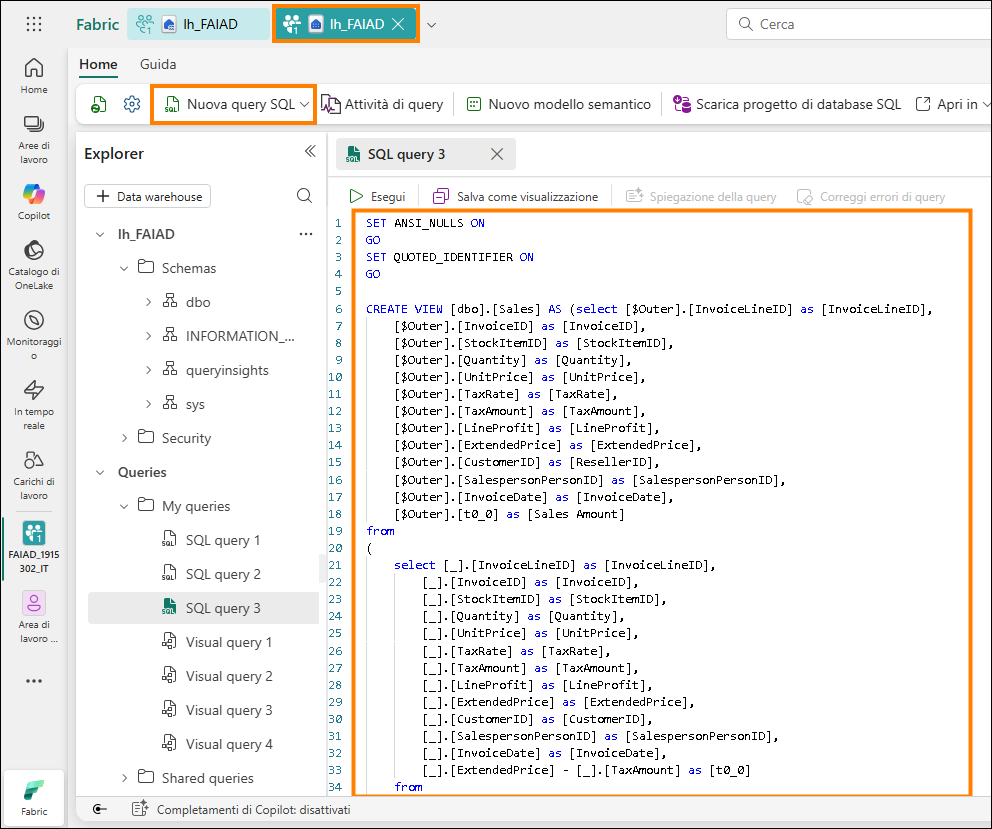

# **Demo ML previsionale**

### Requisito

All'istruttore è richiesto di completare i Lab 1-6 e di immettere tutti i dati prima di procedere con i passaggi successivi.

Per la demo, è necessario installare una libreria Python chiamata **prophet.** Può essere installata in linea nel notebook oppure è possibile creare un ambiente. In questa demo si userà la modalità in linea.

### Creare un Notebook

1. Andare all'**area di lavoro di Fabric creata nel Lab 2, Attività 2** di nome **FAIAD_ <nome utente>**.

2. Nel menu selezionare **+ Nuovo elemento ->** Usare la casella di ricerca per **cercare Notebook ->** Scegliere **Notebook**.

    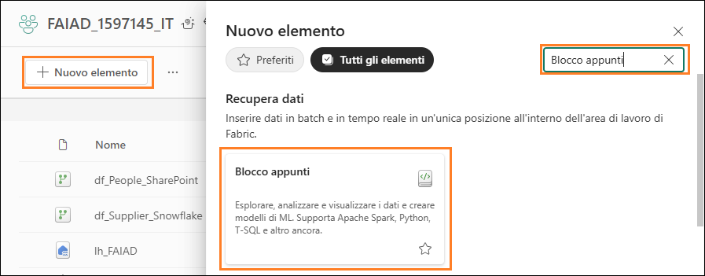

3. Fornire una **breve panoramica** del layout: notebook, lingua, ambiente, come creare una nuova cella e così via.

### Aggiungere un lakehouse al Notebook

È necessario associare un Lakehouse predefinito a un notebook.

1. Nel pannello Explorer selezionare la scheda **Elementi di dati.**

    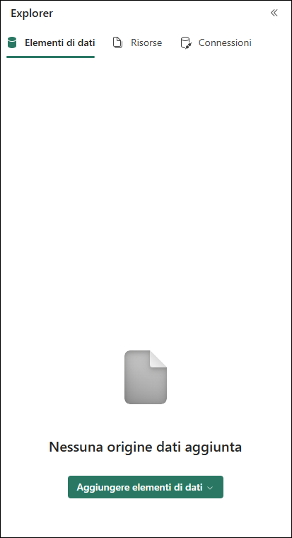

2. Selezionare **Aggiungi elementi di dati** nel pannello Explorer.

3. Selezionare **Dal catalogo OneLake**.

    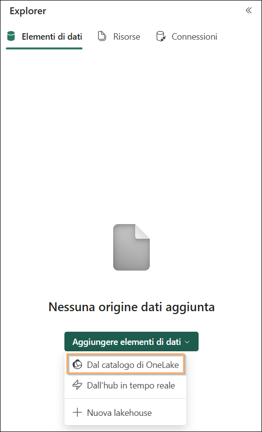

4. Si apre la finestra di dialogo dell'hub dei dati OneLake. Selezionare il Lakehouse **lh_FAIAD**.

5. Selezionare **Aggiungi.** Si noti che il Lakehouse è associato al Notebook.

    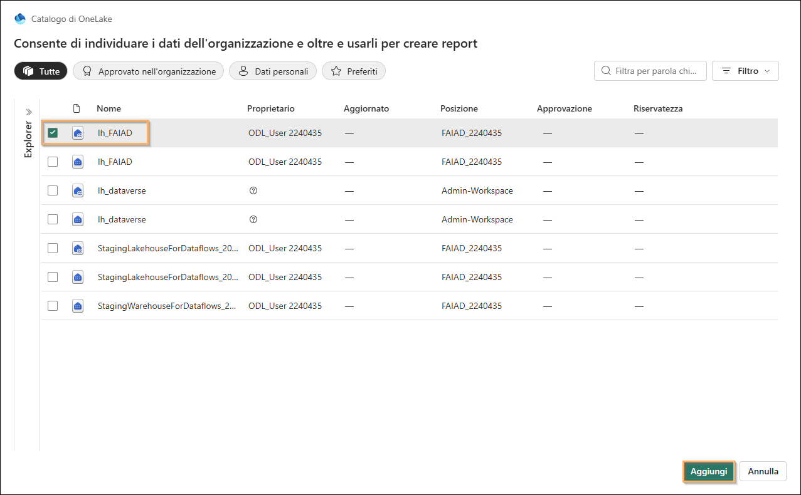

### Installare la libreria Python in linea

Per la demo, è necessario installare una libreria Python chiamata **prophet.** Viene installata in linea.

1. Per **installare la libreria Python** immettere il seguente codice nella cella.

    !pip install prophet

2. Eseguire il codice selezionando il pulsante **Riproduci** accanto alla cella.

    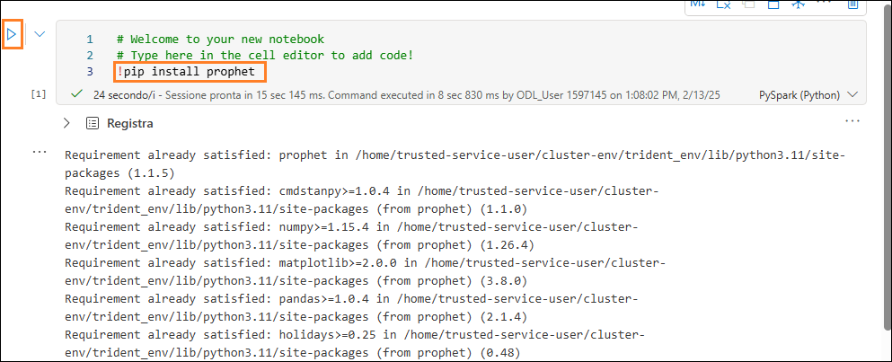

### Eseguire il codice per creare la previsione

1. Creare una **nuova cella**.

2. Immettere il **codice** seguente:

    from pyspark.sql import SparkSession

    from pyspark.sql.functions import month, year, col

    from prophet import Prophet

    import pandas as pd

    # Initialize Spark session

    spark = SparkSession.builder.appName("Prophet Forecasting").getOrCreate()

    # Load data from your specific Spark table

    df = spark.sql("SELECT \* FROM lh_FAIAD.Invoices i JOIN lh_FAIAD.InvoiceLineItems il ON i.InvoiceID = il.InvoiceID")

    # Aggregate data to monthly level

    monthly_df = df.withColumn("Month", month("InvoiceDate"))

    .withColumn("Year", year("InvoiceDate"))

    .groupBy("Year", "Month")

    .sum("Quantity")

    .orderBy("Year", "Month")

    # Convert to Pandas DataFrame and prepare for Prophet

    pandas_df = monthly_df.toPandas()

    pandas_df['ds'] = pd.to_datetime(pandas_df[['Year', 'Month']].assign(DAY=1))

    pandas_df['y'] = pandas_df['sum(Quantity)']

    # Fit the Prophet model

    model = Prophet(yearly_seasonality=True, weekly_seasonality=False,daily_seasonality=False)

    model.fit(pandas_df[['ds', 'y']])

    # Create a DataFrame for future predictions (e.g., next 12 months)

    future = model.make_future_dataframe(periods=12, freq='M')

    # Forecast

    forecast = model.predict(future)

    # Plotting the forecast

    model.plot(forecast)

    model.plot_components(forecast)

3. Spiegare ogni passaggio del **codice** (hint forniti come commenti).

4. Eseguire il codice selezionando il pulsante **Riproduci** accanto alla cella.

    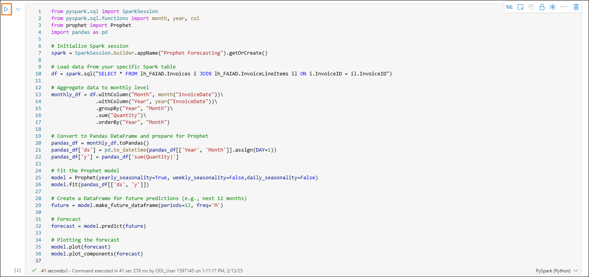

    Illustrare ai partecipanti i tre grafici creati (vedere di seguito). Disponiamo di dati effettivi fino a maggio 2023 ed elaboriamo previsioni per 12 mesi.

    Notare che il **primo grafico** rimuove la stagionalità e le previsioni fino ad aprile 2025.

    Il **secondo grafico** rimuove la tendenza e aggiunge la stagionalità alle previsioni fino ad aprile 2025.

    

    Il **terzo grafico** effettua previsioni usando sia la tendenza sia la stagionalità. Questo grafico fornisce anche il limite superiore e inferiore.

    

5. Creare una **nuova cella**.

6. Aggiungere il **codice** seguente alla cella:

    display(forecast)

    #write forecast data to a table

    spark.createDataFrame(forecast).write.saveAsTable("Sales_Forecast", mode="overwrite")

7. Eseguire la cella selezionando il pulsante **Riproduci**.

    

8. Illustrare ai partecipanti i **dati visualizzati**.

9. Mostrare agli utenti che è stata creata una nuova tabella nel Lakehouse: **sales_forecast**

    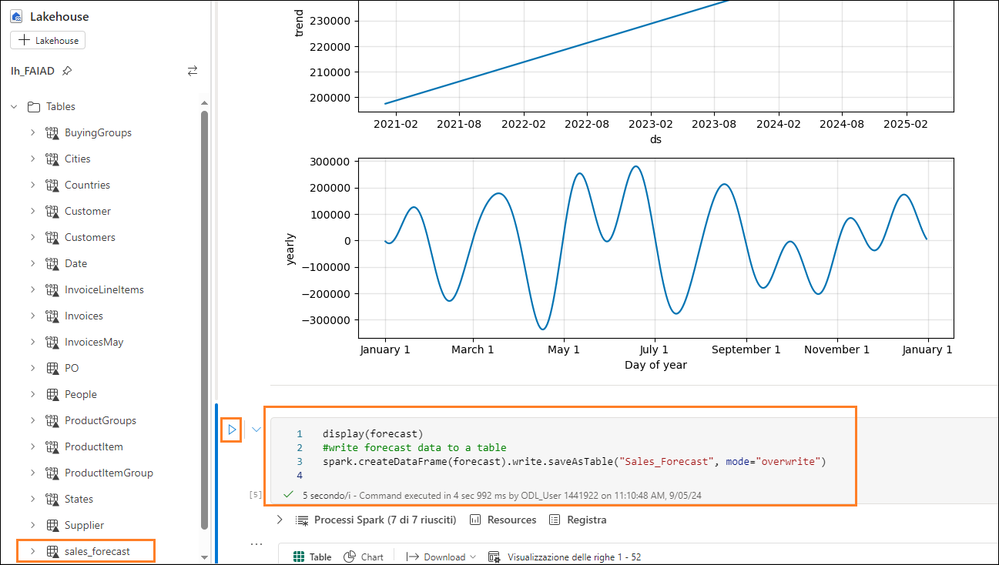

10. Effettuare una **query** sulla tabella e mostrare agli utenti il contenuto della tabella.

# **Demo di Data Activator**

### Requisito

All'istruttore è richiesto di completare i Lab 1-7 prima di procedere con i passaggi successivi.

I collegamenti seguenti avranno gli ultimi aggiornamenti.

<https://learn.microsoft.com/en-us/fabric/data-activator/data-activator-introduction>

<https://learn.microsoft.com/en-us/fabric/data-activator/data-activator-get-data-power-bi>

### Scenario

È noto che ogni mese si verifica uno scostamento nelle vendite in base al nome del gruppo scorte. Questo è dovuto alla stagionalità. Tuttavia, si desidera ricevere una notifica se la percentuale di scostamento è inferiore al 20%. Questo permette di identificare e risolvere gli scenari.

Per risolvere questo problema, si userà Data Activator. Si attiverà un avviso quando la percentuale di scostamento delle vendite di qualsiasi nome di gruppo scorte scende sotto il 20%. Prevediamo di aggiungere una simulazione per maggio 2024. Poiché il trigger di Data Activator viene eseguito ogni ora, invece di attendere un'ora si eseguirà un avviso di prova.

Per dimostrare questo scenario, si effettueranno le operazioni seguenti:

- Aggiungere il valore percentuale di scostamento delle vendite al set di dati.

- Aggiungere un oggetto visivo tabella che mostri la percentuale di scostamento delle vendite in base al nome del gruppo scorte e filtrare questa tabella a maggio 2024..

- Creare un avviso usando l'oggetto visivo tabella.

- Esaminare Activator e creare un avviso di prova.

### Aggiungere la misura percentuale di scostamento delle vendite

Aggiungeremo una nuova misura al modello semantico sm_FAIAD.

1. Andare al modello semantico **sm_FAIAD**.

2. Selezionare la tabella **Sales**.

3. Nel menu in alto selezionare **Home -> Nuova misura**.

4. Creare la **misura** seguente. Si otterrà la percentuale di scostamento rispetto al mese precedente.

    Sales Var % =

5. var priormth = CALCULATE([Sales], PREVIOUSMONTH('Date'[Date]))

6. RETURN DIVIDE([Sales]-priormth, priormth)

7. **Formattare** la misura come **Percentuale**.

    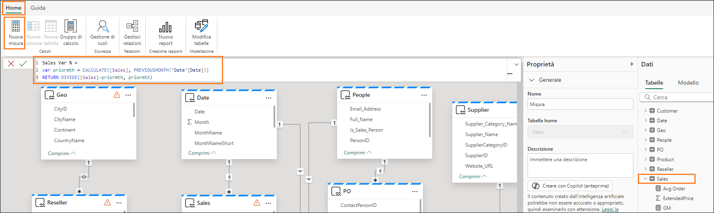

### Creare l'oggetto visivo tabella

Modificheremo rpt_Sales_report e aggiungeremo un nuovo oggetto visivo tabella. L'oggetto visivo tabella mostrerà la percentuale di scostamento delle vendite in base al nome del gruppo scorte per il mese di maggio 2023.

1. Passare a **rpt_Sales_report** (creato nel Lab 7).

2. Nel menu in alto selezionare **Modifica**.

3. Nella visualizzazione Dati espandere la tabella **Product**.

4. Selezionare il campo **StockGroupName**. Si crea un oggetto visivo tabella.

5. Espandere la tabella **Sales**.

6. Selezionare **Sales Var %**. Si noti che non sono presenti dati nell'oggetto visivo tabella. Questo perché Sales Var % necessita del nome di un mese per essere calcolato.

    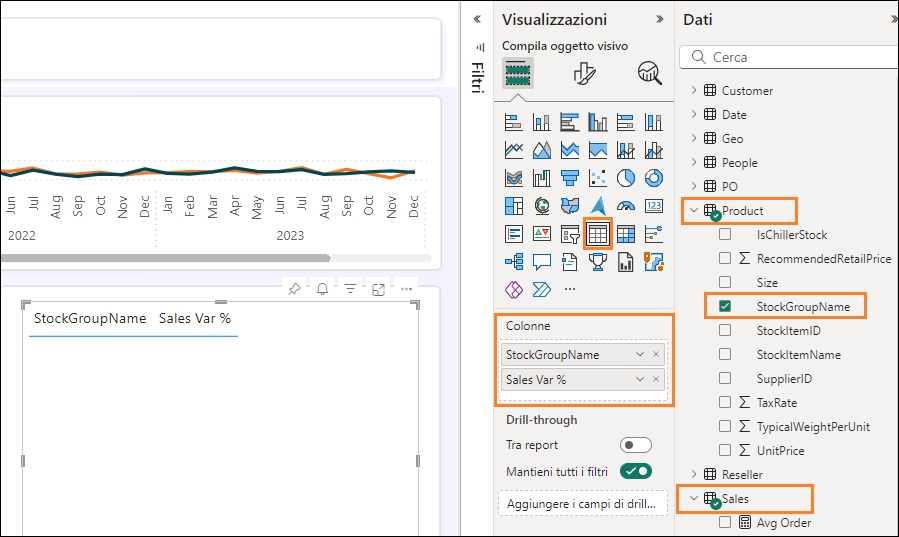

7. **Espandere la sezione** **Filtro** (se è compressa).

8. Con l'oggetto visivo tabella evidenziato, nella sezione **Dati** espandere la tabella **Date**.

9. Trascinare il campo **Year** in Filtri nella sezione oggetto visivo.

10. Nel campo **Year** selezionare **Filtro di base** dall'elenco a discesa **Tipo filtro**.

11. Selezionare **2024**.

    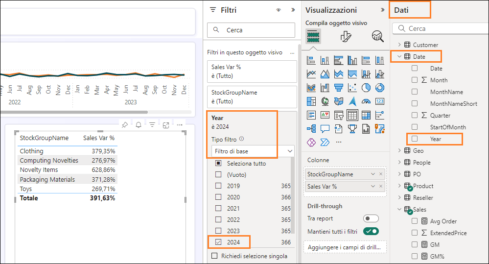

12. Trascinare il campo **MonthNameShort** in Filtri nella sezione oggetto visivo.

13. Selezionare **May.**

14. Selezionare **File -> Salva** per salvare gli aggiornamenti nel report.

    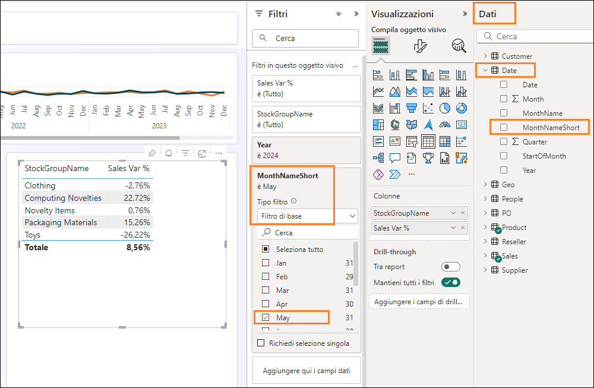

### Creare Activator

Verrà creato un Activator che invierà un avviso se la percentuale di scostamento delle vendite per qualsiasi Stock_Group_Name è inferiore a -20%. Si noti che per Toys Stock Group Name la percentuale di scostamento delle vendite è pari al -26,22% e soddisfa i criteri dell'avviso.

1. Con l'oggetto visivo tabella appena creato evidenziato, selezionare il **campanello dell'avviso** in alto a sinistra dell'oggetto visivo.

    

2. Si apre un pannello avviso.

3. Comunicare ai partecipanti che l'avviso viene applicato per ogni **Stock_Group_Name**

4. Selezionare **Sales Var %** in **Avvisa quando una riga cambia**.

    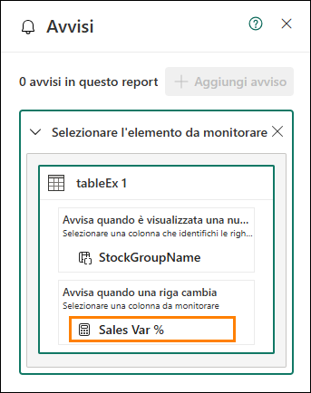

5. Selezionare il pulsante di opzione **Diventa**, quindi impostare **Condizione** su **Minore di**.

6. Impostare **Soglia** su **-20%.** In questo modo configureremo il trigger per avvisare quando la percentuale di scostamento delle vendite scende sotto il 20%.

    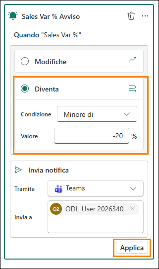

7. Descrivere le due opzioni per le notifiche, i messaggi e-mail e Teams.

8. Selezionare **Applica**

9. In basso, accanto ad **Avvisi di Power BI Activator**, selezionare i **puntini di sospensione (…)**.

10. Mostrare le diverse posizioni di salvataggio dell'area di lavoro.

    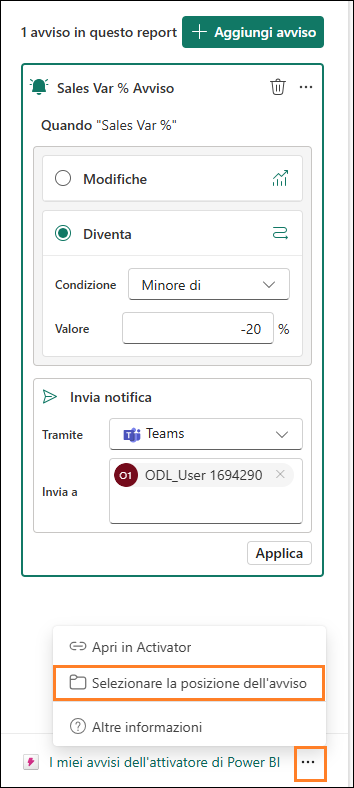

11. Dopo aver creato l'avviso, è anche possibile selezionare **Apri in Activator** dopo aver fatto clic sui puntini di sospensione in basso.

    

### Panoramica di Activator

1. Si passerà alla visualizzazione **Progettazione** dell'Activator.

2. Descrivere ai partecipanti il **layout**, sulla sinistra ci sono gli oggetti. Come possiamo vedere, è presente il **Trigger** appena creato. È anche presente la sezione **Eventi**.

3. Con il trigger creato selezionato, descrivere le opzioni nel **menu in alto.**

    1. Home

    1. Recupera dati

    2. Crea azioni personalizzate con Power Automate

    2. Regole

    1. Elimina

    2. Avvia, Interrompi, Visualizza dettagli

    3. Inviami un'azione di test

4. Parlare dei grafici **Monitoraggio** e **Condizione** contenuti nella scheda **Definizione**.

5. Scorrendo verso il basso si nota il grafico Azione, con la notifica dell'avviso dopo l'attivazione. Attualmente i trigger vengono eseguiti ogni ora. Quindi, nell'ora successiva se i dati cambiano e la condizione è soddisfatta si attiverà un avviso.

    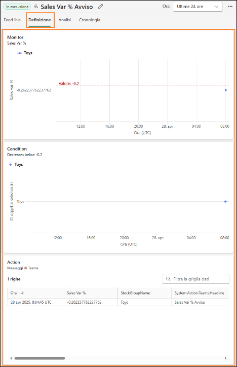

6. Sul lato destro dello schermo è disponibile l'opzione per configurare la **definizione dell'avviso**. Sono inclusi l'attributo, eventuali filtri o riepiloghi, le condizioni e l'azione. Per impostazione predefinita l'avviso viene inviato all'account utente del lab. Gli invii a indirizzi e-mail esterni non sono al momento supportati.

    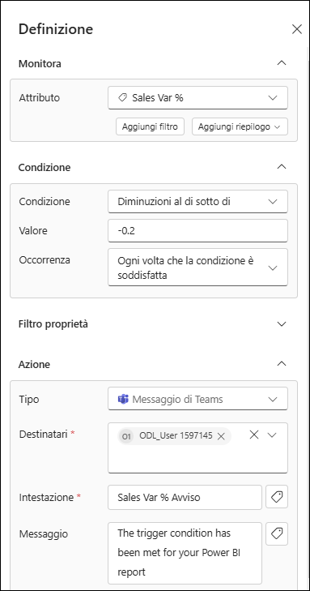

7. Qui è anche possibile modificare i dettagli dell'azione. Se si sceglie il pulsante Modifica azione, viene visualizzata la finestra Modifica l'azione.

    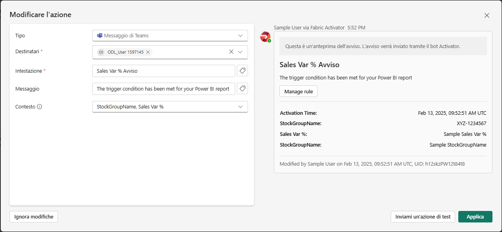

### Inviare un avviso di prova

**Nota:** per visualizzare l'avviso è necessario usare l'ambiente lab.

1. Selezionare il **trigger Sales Var %**.

2. Nel menu in alto selezionare **Inviami un avviso di test**. Si riceverà un avviso di prova al proprio account utente del lab.

3. Selezionare **l'icona di avvio delle app** nell'angolo in alto a sinistra della schermata.

    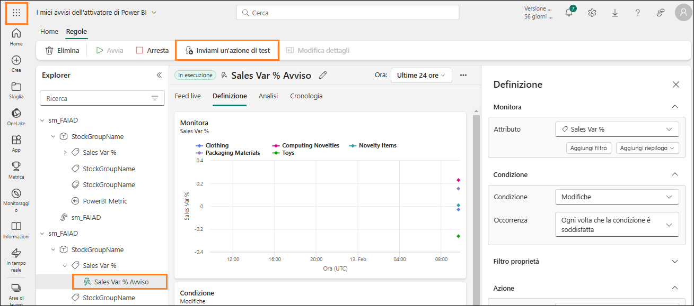

4. Selezionare Teams. Si apre una nuova finestra del browser.

    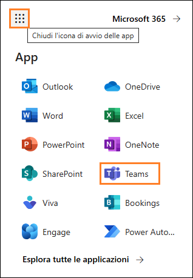

5. Si riceverà un messaggio di avviso (potrebbe richiedere alcuni minuti). Si noti che si tratta di un'azione di prova.

    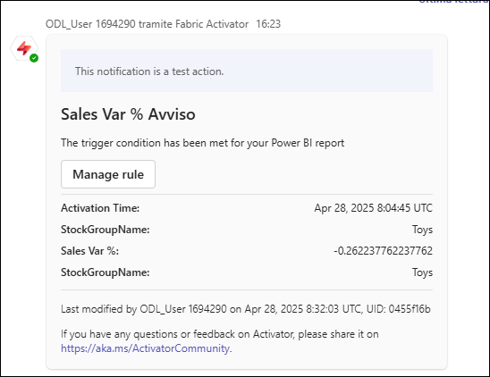

6. Quando i dati cambiano e la condizione di attivazione è soddisfatta, vengono inviati avvisi.

    **Nota:** per dimostrare questa funzionalità, si è filtrato l'oggetto visivo a un mese (maggio 2024). Negli scenari del mondo reale, questo sarà dinamico. È probabile che un trigger venga impostato dinamicamente per il mese corrente.

# **Demo collegamento semantico**

### Requisito

All'istruttore è richiesto di completare i Lab 1-7 prima di procedere con i passaggi successivi.

Si consiglia al docente di eseguire in anticipo i notebook in questa demo, poiché entrambi i notebook possono richiedere tra i 5 e i 10 minuti per essere completati. Un'opzione consiste nell'eseguire i notebook mentre gli studenti lavorano sul lab 6/7. In questo modo il docente può mostrare agli studenti i risultati dei notebook.

### Scenario

In questa demo vengono illustrati **Analizzatore procedure consigliate** e **Analizzatore di memoria**. Si tratta di strumenti avanzati che aiutano a valutare il modello semantico in termini di prestazioni, utilizzo della memoria e qualità complessiva. Questi strumenti non si limitano a offrire metriche, ma anche **informazioni dettagliate utili per migliorare la progettazione e l'efficienza** del modello, evidenziando opportunità di ottimizzazione che altrimenti potrebbero passare inosservate.

Al centro di questa funzionalità c'è **Collegamento semantico**, una funzionalità di Microsoft Fabric che consente di collegare direttamente i modelli semantici agli strumenti e alle esperienze di data science. In questo modo è possibile **analizzare, profilare e ottimizzare** il modello semantico sm_FAIAD con Notebooks.

Grazie a questa connessione, è possibile eseguire analisi approfondite, come il controllo delle procedure consigliate e la creazione di profili della memoria, direttamente sul modello semantico presente nell'area di lavoro. Ciò consente di migliorare le **prestazioni, ridurre il footprint della memoria e, in ultima analisi, abbassare il costo** degli artefatti in produzione.

Per dimostrare questo scenario, si effettueranno le operazioni seguenti:

- Aprire il modello semantico sm_FAIAD e trovare le funzionalità di Collegamento semantico.

- Creare il notebook di analisi delle procedure consigliate e visualizzare le informazioni dettagliate.

- Creare il notebook di analisi della memoria e visualizzare le informazioni dettagliate.

### Analizzatore procedure consigliate

1. Andare all'**area di lavoro di Fabric creata nel Lab 2, Attività 2** di nome **FAIAD_ <nome utente>**.

2. Aprire il modello semantico **sm_FAIAD**.

    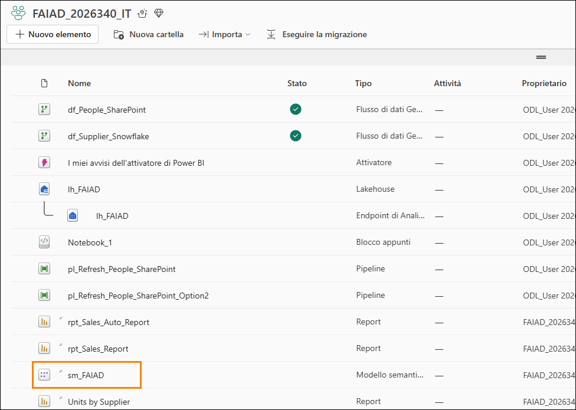

3. Nella pagina successiva, selezionare **Apri modello semantico**.

    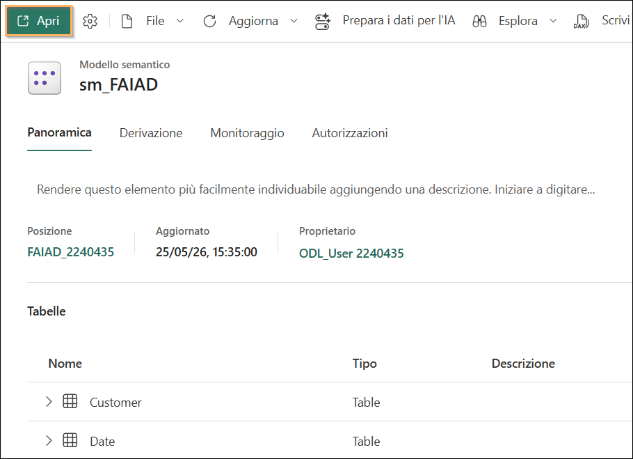

4. Nella **barra multifunzione Hom** sono presenti 3 elementi in **Stato del modello**.

    1. **Analizzatore procedure consigliate:** offre suggerimenti per migliorare la progettazione e le prestazioni del modello semantico in base alle regole create da esperti di Fabric.

    2. **Analizzatore di memoria:** fornisce statistiche di memoria e archiviazione sugli oggetti nel modello semantico. L'analisi di queste statistiche consente di identificare le aree di possibile ottimizzazione delle prestazioni e di riduzione della memoria.

    3. **Notebook della community:** raccolta di notebook creati dalla community di Power BI per migliorare l'analisi dei dati e la creazione di report.

    *Nota: questi notebook sono disponibili anche nella pagina dei dettagli del modello semantico.*

5. Fare clic su **Analizzatore procedure consigliate**.

    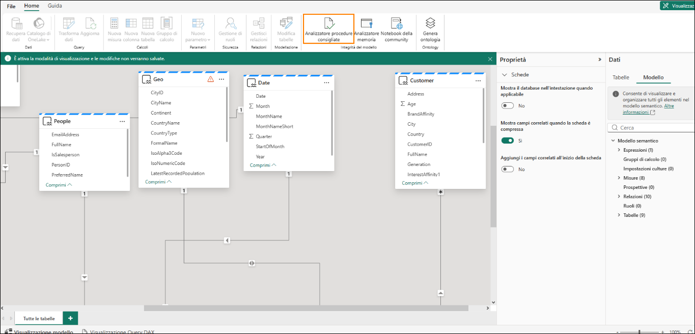

6. Verrà creato un nuovo notebook di analisi delle procedure consigliate. Si aprirà il notebook.

7. Rivedere i dettagli scritti nelle celle Markdown con gli studenti.

8. Nella barra multifunzione Home, selezionare **Esegui tutti**.

    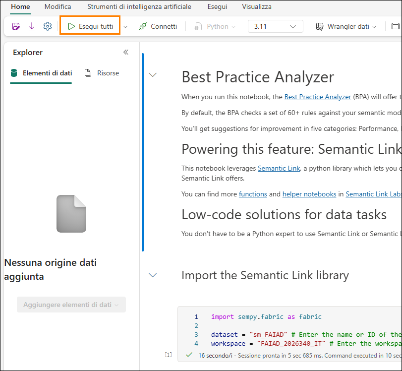

9. Dopo aver completato l'esecuzione del notebook, esaminare il risultato della funzione **run_model_bpa**.

    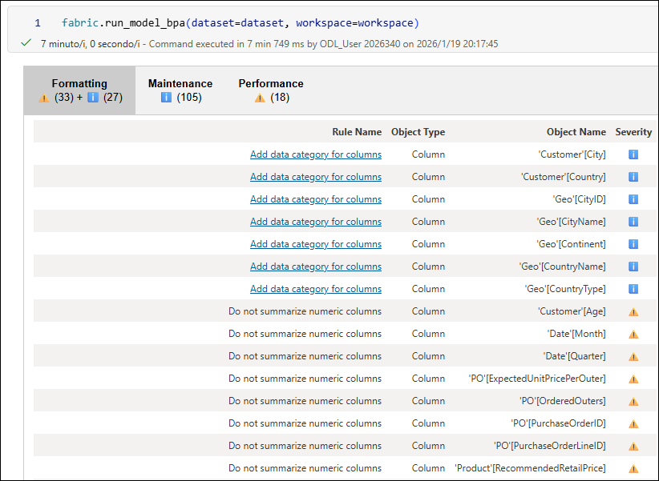

10. Questa funzione restituisce tre categorie di suggerimenti. **Formattazione, manutenzione e prestazioni**. All’interno di una determinata categoria sono visibili due icone diverse che rappresentano la gravità del suggerimento.

    1. ℹ️ - una modifica consigliata che può migliorare il modello.

    2. ⚠️ - questo livello di avviso indica che il problema elencato potrebbe causare problemi nel modello o nei report che lo utilizzano.

11. In **Formattazione**, scorrere verso il basso e passare il puntatore del mouse sulla **regola "Format flag columns as Yes/No value strings"**

12. Spiegare agli studenti che, passando il mouse sopra i nomi delle regole, si otterranno maggiori dettagli sulla modifica consigliata.

    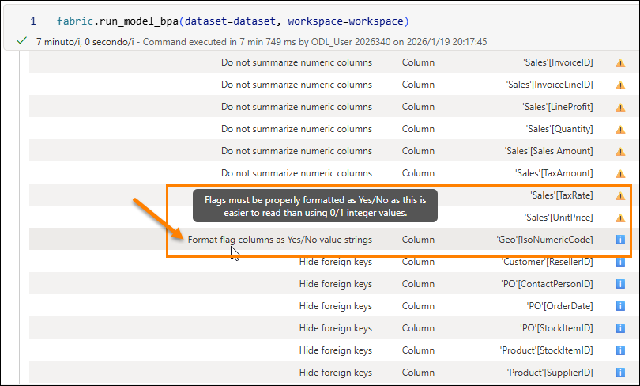

13. In questo caso, l'analizzatore delle prestazioni consiglia di formattare la colonna **IsoNumericCode** nella tabella **Geo** su **Sì/No**. Si tratta di un ottimo consiglio poiché questa formattazione delle colonne dei flag è una procedura consigliata nella modellazione di uno schema a stella.

14. Selezionare la categoria **Manutenzione**.

    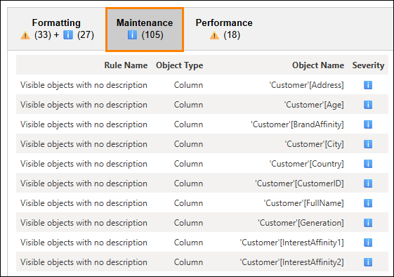

15. Fare presente agli studenti che la maggior parte dei suggerimenti per la manutenzione consiste nell'aggiungere descrizioni alle colonne visibili nel modello.

16. Selezionare la categoria **Prestazioni**.

    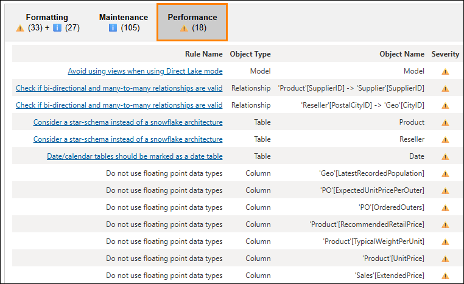

17. Passare il puntatore del mouse sulla **regola "Avoid using views when using Direct Lake mode"**.

18. L'analizzatore delle prestazioni ricorda che la modalità Direct Lake non supporta le visualizzazioni. In questa lezione abbiamo usato i collegamenti per connetterci rapidamente ai dati, quindi abbiamo trasformato i dati usando le visualizzazioni. Questo è stato fatto in parte per ottenere altre informazioni sui numerosi metodi di connessione dati disponibili in Fabric. Tuttavia, se si volesse applicare questo suggerimento al modello, sarebbe necessario usare un altro metodo per inserire e trasformare i dati di vendita, ad esempio un flusso di dati Gen2.

    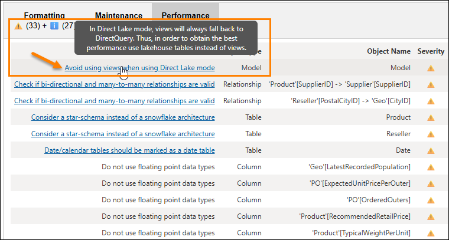

19. Se il tempo lo consente, il docente può illustrare altri suggerimenti.

### Analizzatore di memoria

1. Tornare alla visualizzazione del modello semantico **sm_FAIAD**.

2. Nella **barra multifunzione Home** selezionare **Analizzatore di memoria**.

    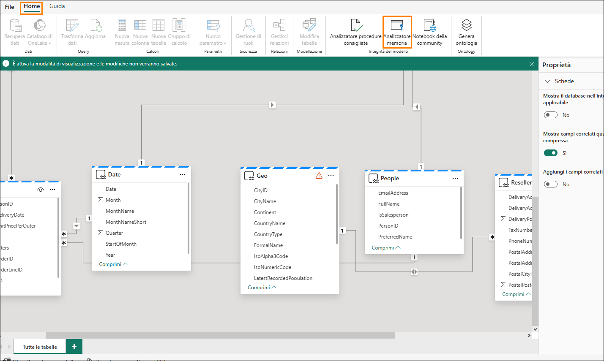

3. Verrà creato un nuovo notebook Analizzatore di memoria.

4. Rivedere i dettagli elencati nelle celle Markdown con gli studenti.

5. Nella **barra multifunzione Home**, selezionare **Esegui tutti**.

    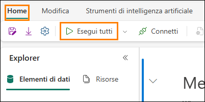

6. Dopo aver completato il notebook, esaminare i dati ottenuti. Esistono molte categorie che visualizzano l'utilizzo della memoria a vari livelli di dettaglio.

    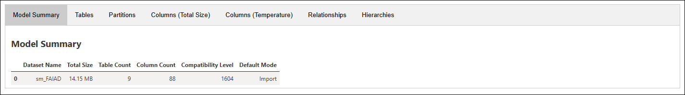

7. Fare presente agli studenti che è possibile utilizzare tutte queste informazioni per identificare le aree di miglioramento in termini di utilizzo della memoria.

8. Selezionare la categoria **Tabelle**.

9. Passare il puntatore del mouse sul nome della **colonna % DB**. In questo modo viene visualizzata la descrizione delle colonne. Questa colonna indica la dimensione di ogni tabella rispetto alla dimensione del modello semantico. Anche se questo non indica automaticamente che ci sia qualcosa di sbagliato, è utile vedere quale percentuale della memoria del modello semantico viene utilizzata da ciascuna tabella.

    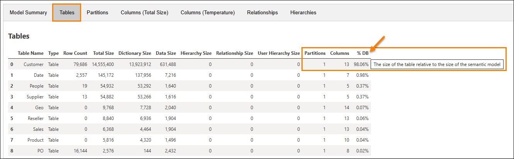

10. Se il tempo lo consente, il docente può terminare la demo passando in rassegna altre categorie spiegando vari punti dati.
