# Microsoft Fabric - Fabric Analyst in a Day - Lab 3

## Contents

- Introduzione
- Collegamento ad ADLS Gen2
- Attività 1 - Creazione di un collegamento
- Trasformazione dei dati usando le query visive
- Attività 2 - Creazione di una vista Geo mediante le query visive
- Attività 3 - Creazione delle viste Reseller, Sales e Product tramite una query SQL
- Riferimenti


# Introduzione

Nel nostro scenario i dati vendita provengono dal sistema ERP e sono archiviati in un ADLS Gen2. Vengono aggiornati alle 12.00 ogni giorno. Dobbiamo trasformare e inserire questi dati in Lakehouse e usarli nel nostro modello.

Esistono più modi per inserire questi dati.

- **Collegamenti:** creano un collegamento ai dati e possiamo usare le viste delle query visive per trasformarli. Useremo i collegamenti in questo lab.

- **Notebook:** richiedono la scrittura di codice. È un approccio pensato per gli sviluppatori.

- **Flusso di dati Gen2:** probabilmente si ha familiarità con Power Query o Flusso di dati Gen1. Flusso di dati Gen2, come indica il nome, è la versione più recente di Flusso di dati. Fornisce tutte le funzionalità di Power Query/Flusso di dati Gen1 con la possibilità aggiuntiva di trasformare e inserire dati in più origini dati. Ne parleremo nei prossimi due lab.

- **Pipeline:** questo è uno strumento di orchestrazione. Le attività possono essere orchestrate per estrarre, trasformare e acquisire dati. Useremo una pipeline per eseguire l'attività di Dataflow Gen2 che a sua volta eseguirà l'estrazione, la trasformazione e l'acquisizione.

Inizieremo creando un collegamento per inserire dati in un lakehouse dall'origine dati ADLS Gen2. Una volta inseriti i dati, useremo le viste delle query visive per trasformarli.

In questo lab si imparerà a:

- Come creare collegamenti nel lakehouse

- Come trasformare i dati usando la funzionalità query visiva

# Collegamento ad ADLS Gen2

### Attività 1 - Creazione di un collegamento

I collegamenti sono usati per creare un collegamento all'ubicazione di destinazione e permettono di accedere ai dati senza la necessità di spostarli fisicamente nel lakehouse. È come creare collegamenti nel desktop di Windows.

1. Nella parte superiore della schermata, selezionare la scheda **lh_FAIAD** per accedere al lakehouse.

    1. Se non è disponibile alcuna scheda, è possibile tornare all'area di lavoro e aprire il lakehouse da lì.

2. Nel **pannello Explorer** selezionare i **puntini di sospensione** accanto a **Tables**.

3. Selezionare **Nuovo collegamento**.

    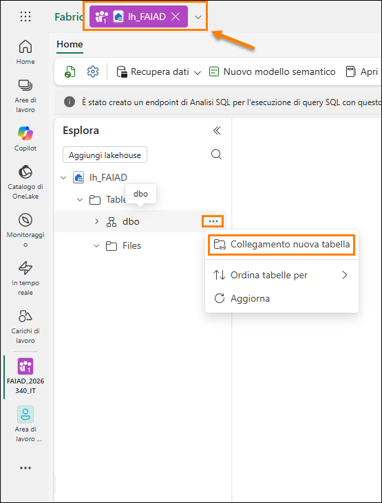

4. Si apre la finestra di dialogo **Nuovo collegamento**. In **Origini esterne** selezionare **Azure Data Lake Storage Gen2**.

    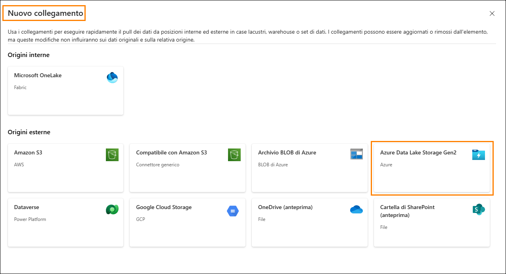

5. Seleziona **Nuova connessione (1).**

6. Immettere il collegamento seguente per la proprietà **URL**: https://stvnextblobstorage.dfs.core.windows.net/fabrikam-sales **(2)**:

7. Fare clic su **Crea nuova connessione (3)** nella sezione Connessione.

8. Selezionare **Firma di accesso condiviso (SAS) (4)** nel menu a discesa Tipo di autenticazione.

9. Copiare il token di firma di accesso condiviso e incollarlo nel campo Token di firma di accesso condiviso (5).

    - **Token di firma di accesso condiviso:**

10. Selezionare **Avanti (6)** in basso a destra della schermata.

    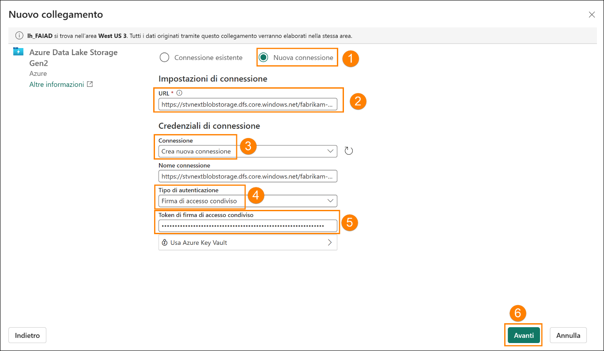

11. Si stabilirà una connessione ad ADLS Gen2 con la struttura di directory visualizzata nel pannello di sinistra. Espandere **Delta-Parquet-Format-FY25 (1).**

12. **Selezionare** le directory seguenti **(2)** e fare clic su **Avanti (3):**

    1. Application.Cities

    2. Application.Countries

    3. Application.StateProvinces

    4. DateDim

    5. Sales.BuyingGroups

    6. Sales.Customers

    7. Sales.InvoiceLines

    8. Sales.Invoices

    9. Warehouse.StockGroups

    10. Warehouse.StockItemStockGroups

    11. Warehouse.StockItems

    **Nota:** Sales.Invoice_May è l'unica directory **non** selezionata.

    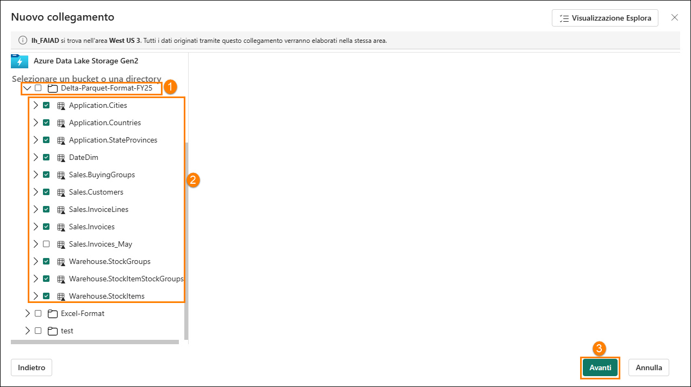

13. Si verrà indirizzati alla finestra di dialogo successiva, dove si ha la possibilità di modificare i nomi. Selezionare l'**icona Modifica (1)** in Azioni per **Application.Cities**.

14. Rinominare **Application.Cities in Cities (2).**

15. Selezionare il segno di spunta accanto al nome per salvare la modifica **(3)**.

    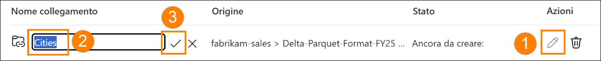

16. Allo stesso modo, rinominare i collegamenti come indicato di seguito:

    1. Application.Countries in **Countries**

    2. Application.StateProvinces in **States**

    3. DateDim in **Date**

    4. Sales.BuyingGroups in **BuyingGroups**

    5. Sales.Customers in **Customers**

    6. Sales.InvoiceLines in **InvoiceLineItems**

    7. Sales.Invoices in **Invoices**

    8. Warehouse.StockGroups in **ProductGroups**

    9. Warehouse.StockItemStockGroups in **ProductItemGroup**

    10. Warehouse.StockItems in **ProductItem**

    **Nota**: ricontrollare i nomi. Un errore di digitazione potrebbe causare errori durante il lab.

17. Selezionare **Crea** per creare il collegamento.

    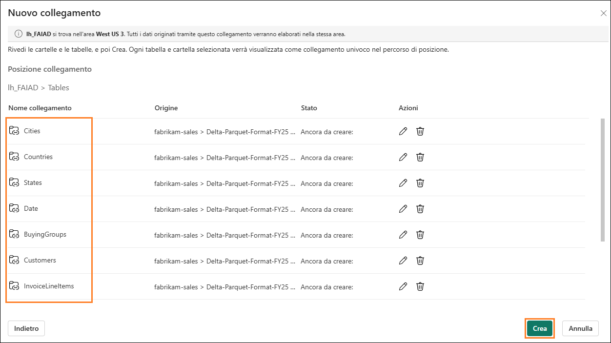

18. Notare che tutti i collegamenti vengono creati come tabelle. Selezionare la tabella **BuyingGroups**; è possibile vedere un'anteprima dei dati nel pannello dati.

    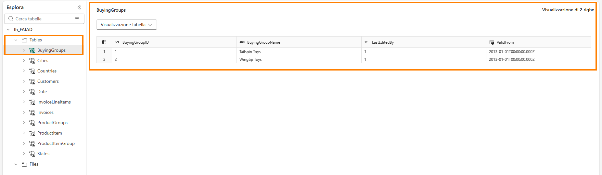

    Il passaggio successivo consiste nel trasformare i dati, in modo da poter creare un modello semantico. Creeremo delle viste per trasformare i dati.

# Trasformazione dei dati usando le query visive

### Attività 2 - Creazione di una vista Geo mediante le query visive

1. Possiamo accedere a Lakehouse tramite un endpoint SQL. Questo permette di eseguire query sui dati e creare viste. In **alto a destra** della schermata selezionare **Lakehouse (1) -> Endpoint di Analisi SQL (2)**.

    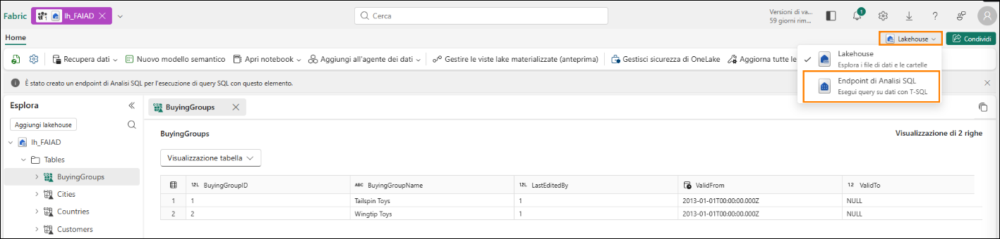

    Verrai indirizzato all'endpoint di Analisi SQL. Ora hai un nuovo elemento nel riquadro di spostamento in alto e puoi tornare al lakehouse selezionando quella scheda. Il pannello Explorer è cambiato. Ora è possibile creare viste, stored procedure, query e altro ancora. Creeremo una query visiva poiché fornisce un'interfaccia con poco codice, come Power Query. Salveremo il risultato come vista.

    Inizieremo creando una vista Geo. Per creare la vista Geo, dobbiamo unire i dati delle tabelle Cities, States e Countries.

2. Nel menu in alto fare clic sul menu a discesa accanto a **Nuova query SQL (1)**, quindi selezionare **Nuova query visiva (2)**.

    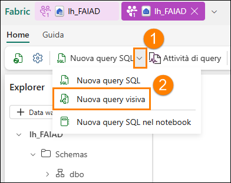

3. Per creare una query, dobbiamo aggiungere tabelle nel pannello Query visiva. Fare clic sui puntini di sospensione accanto alla tabella **Cities (1)** e selezionare **Inserisci nell'area di disegno (2).**

    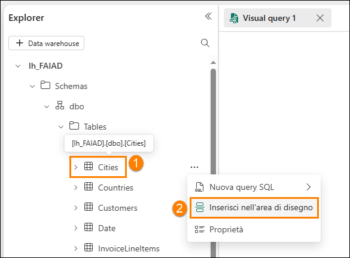

4. Ripetere gli stessi passaggi per le tabelle **States** e **Countries**.

    Ora dobbiamo unire queste query. L'editor di query visive include un'opzione che permette di usare l'editor di Power Query. Lo conosciamo già da Power BI, quindi lo useremo.

5. **Nel menu dell'editor di query visive** selezionare l'icona **Apri in popup** (verso destra). Si apre l'editor di Power Query.

    **Nota:** potrebbe essere necessario scorrere verso destra o riaprire la scheda della query visiva se questa icona non viene visualizzata immediatamente

    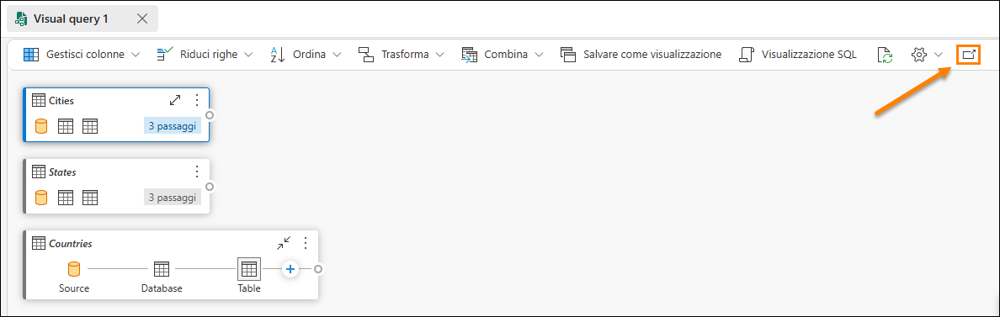

6. Con la query **Cities(1)** selezionata, nella barra multifunzione dell'editor di Power Query selezionare **Home (2) -> Combina (3) -> Elenco a discesa Esegui merge di query (4) -> Esegui merge di query come nuova (5)**. Si apre la finestra di dialogo Esegui merge di query.

    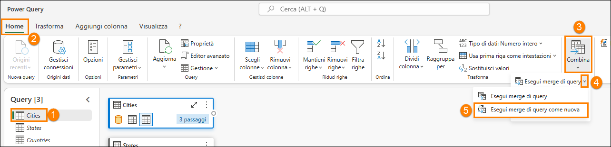

7. Nella **tabella di sinistra per l'unione** selezionare **Cities**.

8. Nella **tabella di destra per l'unione** selezionare **States**.

9. Selezionare le colonne **StateProvinceID** da entrambe le tabelle. Useremo questa colonna
    per creare un join.

10. Selezionare **Inner** come **Tipo di join**.

11. Selezionare **OK**.

    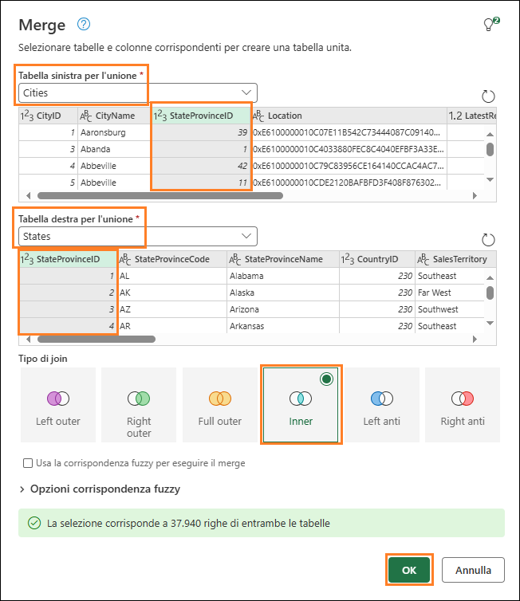

    Notare che è stata creata una nuova query denominata **Merge**. Abbiamo bisogno di alcune colonne da States.

12. Nella **vista dati** (pannello inferiore) fare clic sulla **freccia doppia** accanto alla colonna **States**
    (ultima colonna a destra).

13. Si apre un pannello. Verifica che siano selezionate solo le colonne seguenti:

    1. StateProvinceCode

    2. StateProvinceName

    3. CountryID

    4. SalesTerritory

14. Selezionare **OK**.

    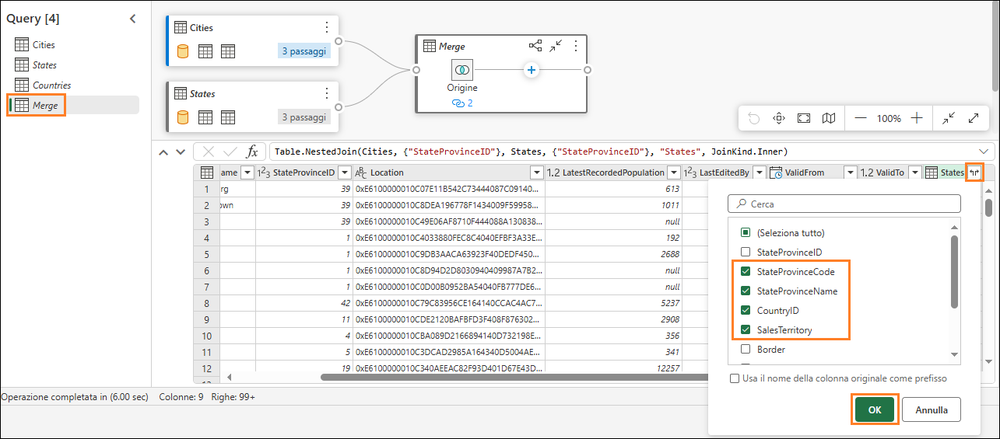

    Ora dobbiamo unire la query Countries.

15. Con la query di unione selezionata **(1)**, selezionare **Home (2) -> Combina (3) -> Elenco a discesa Esegui merge di query (4) -> Esegui merge di query (5)**.

    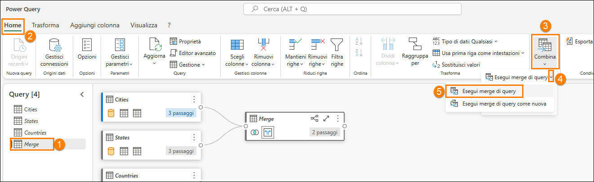

16. Si apre la finestra di dialogo Esegui merge di query. Nella **tabella di destra per l'unione**
    selezionare **Countries**.

17. Selezionare le colonne **ICountryID** da entrambe le tabelle. Useremo questa colonna
    per creare un join.

18. Selezionare **Inner** come **Tipo di join**.

19. Selezionare **OK**.

    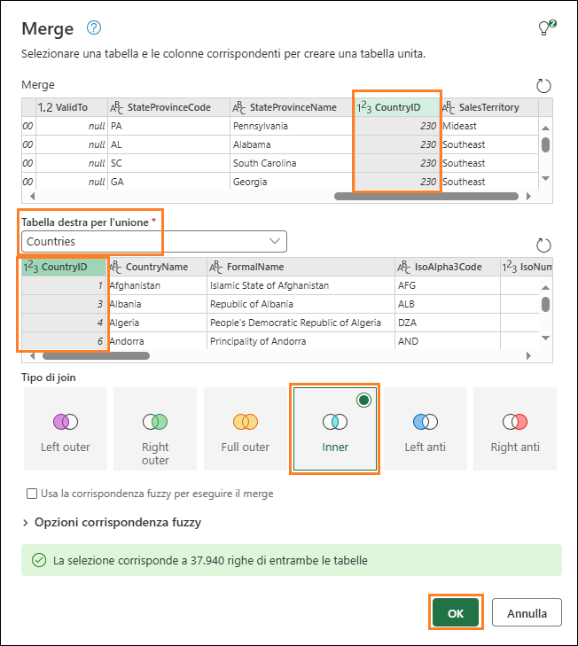

    Abbiamo bisogno di alcune colonne da Countries.

20. Nella **vista dati** (pannello inferiore) fare clic sulla **freccia doppia** accanto alla colonna **Countries**.

21. Si apre un pannello. Verifica che siano selezionate solo le colonne seguenti:

    1. CountryName

    2. FormalName

    3. IsoAlpha3Code

    4. IsoNumericCode

    5. CountryType

    6. Continent

    7. Region

    8. Subregion

22. Selezionare **OK**.

    **Importante:** assicurarsi di scorrere verso il basso e selezionare tutte le otto colonne elencate nel passaggio 21. Lo screenshot seguente mostra solo le prime 5 colonne a causa di una limitazione dell'interfaccia utente.

    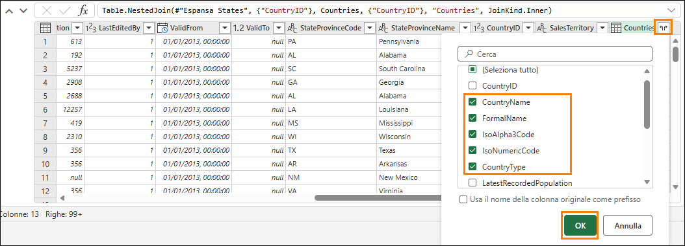

    Non sono necessarie tutte le colonne della tabella **Merge**. Assicurarsi di selezionare solo quelle necessarie.

23. Con la query **Merge** selezionata (1), nella barra multifunzione selezionare **Home (2) -> Scegli colonne (3) -> Scegli colonne (4)**.

    **Nota:** se l'opzione Scegli colonne non è visibile, cercarla in Gestisci colonne.

    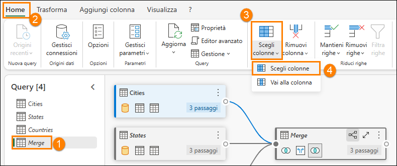

24. Si apre la finestra di dialogo Scegli colonne. **Deselezionare** le colonne seguenti.

    1. StateProvinceID

    2. Location

    3. LastEditedBy

    4. ValidFrom

    5. ValidTo

    6. CountryID

25. Selezionare **OK**.

    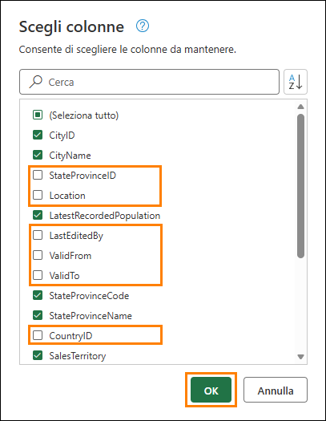

    Notare che il processo è simile a quello di Power Query, abbiamo tutti i passaggi registrati sia nel pannello Passaggi applicati a destra sia nella vista visiva. Rinominiamo la query di unione e scegliamo Abilita caricamento, in modo da caricare i dati da questa query.

26. **Fare clic con il pulsante destro del mouse** sulla query di **unione** nel pannello Query (a sinistra). Selezionare **Rinomina**, quindi rinominare la query in **Geo**.

27. **Fare clic con il pulsante destro del mouse** sulla query **Geo** nel pannello Query (a sinistra). Selezionare **Abilita caricamento** per abilitare questa query.

28. Assicurarsi che le query Cities, States e Countries siano **disabilitate**.

29. Selezionare **Salva** in basso a destra nell'editor di Power Query.

    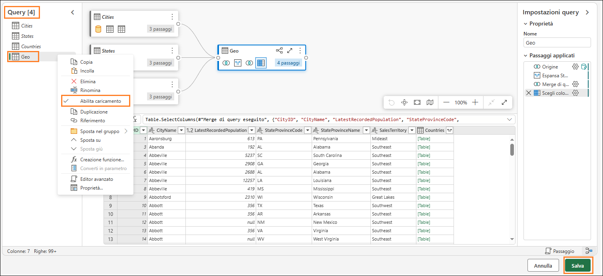

    Verremo indirizzati all'editor di query visive. Ora salviamo la query come vista.

    **Nota**: tutti i passaggi eseguiti mediante l'editor di Power Query possono anche essere eseguiti usando l'editor di query visive.

30. Dal menu Editor di query visive selezionare **Salva come visualizzazione**.

    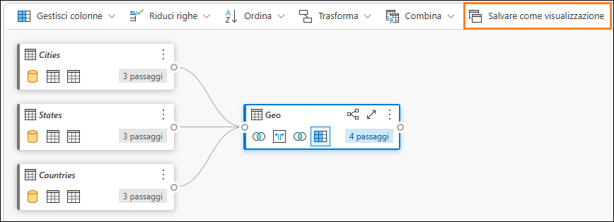

    Si apre la finestra di dialogo Salva come visualizzazione. È possibile rivedere la query se si desidera verificare il codice SQL.

31. Immettere **Geo** come **Nome visualizzazione**.

32. Selezionare **OK** per salvare la vista.

    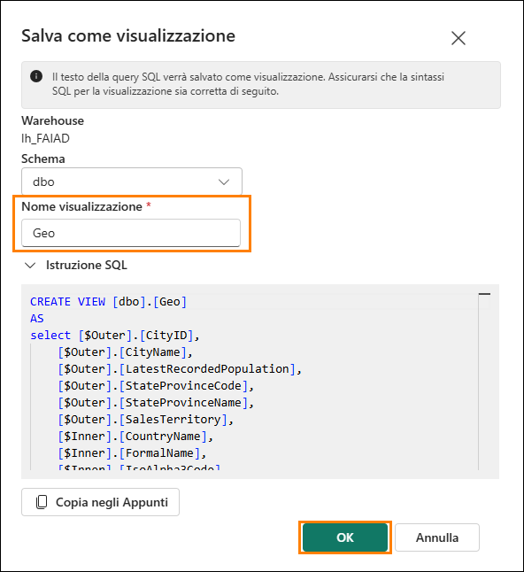

    Si riceverà un avviso una volta salvata la vista.

33. Nel pannello Explorer (a sinistra), espandere **Views.** Abbiamo la vista Geo appena creata.

    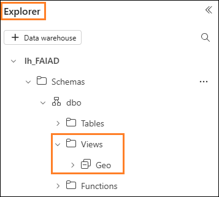

### Attività 3 - Creazione delle viste Reseller, Sales e Product tramite una query SQL

1. In Fabric è anche possibile creare viste tramite query SQL. Nella barra multifunzione della finestra per selezionare una **nuova query SQL**

    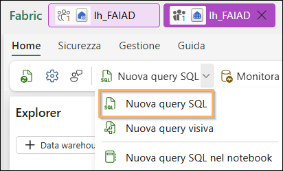

2. Qui è possibile scrivere codice TSQL per facilitare la creazione delle viste necessarie.

3. Incollare la **query SQL** seguente nella finestra **della query**. Verranno create tre viste, Reseller, Sales e Product.

    ```sql
    CREATE VIEW dbo.Reseller AS select [\$Outer].[ResellerID] as [ResellerID], [\$Outer].[ResellerName] as [ResellerName], [\$Outer].[PostalCityID] as [PostalCityID], [\$Outer].[PhoneNumber] as [PhoneNumber], [\$Outer].[FaxNumber] as [FaxNumber], [\$Outer].[WebsiteURL] as [WebsiteURL], [\$Outer].[DeliveryAddressLine1] as [DeliveryAddressLine1], [\$Outer].[DeliveryAddressLine2] as [DeliveryAddressLine2], [\$Outer].[DeliveryPostalCode] as [DeliveryPostalCode], [\$Outer].[PostalAddressLine1] as [PostalAddressLine1], [\$Outer].[PostalAddressLine2] as [PostalAddressLine2], [\$Outer].[PostalPostalCode] as [PostalPostalCode], [\$Inner].[BuyingGroupName] as [ResellerCompany] from [lh_FAIAD].[dbo].[Customers] as [\$Outer] inner join ( select [_].[BuyingGroupID] as [BuyingGroupID2], [_].[BuyingGroupName] as [BuyingGroupName], [_].[LastEditedBy] as [LastEditedBy2], [_].[ValidFrom] as [ValidFrom2], [_].[ValidTo] as [ValidTo2] from [lh_FAIAD].[dbo].[BuyingGroups] as [_] ) as [\$Inner] on ([\$Outer].[BuyingGroupID] = [\$Inner].[BuyingGroupID2] or [\$Outer].[BuyingGroupID] is null and [\$Inner].[BuyingGroupID2] is null) GO

    CREATE VIEW dbo.Sales AS select [\$Outer].[InvoiceLineID] as [InvoiceLineID], [\$Outer].[InvoiceID] as [InvoiceID], [\$Outer].[StockItemID] as [StockItemID], [\$Outer].[Quantity] as [Quantity], [\$Outer].[UnitPrice] as [UnitPrice], [\$Outer].[TaxRate] as [TaxRate], [\$Outer].[TaxAmount] as [TaxAmount], [\$Outer].[LineProfit] as [LineProfit], [\$Outer].[ExtendedPrice] as [ExtendedPrice], [\$Outer].[CustomerID] as [ResellerID], [\$Outer].[SalespersonPersonID] as [SalespersonPersonID], [\$Outer].[InvoiceDate] as [InvoiceDate], [\$Outer].[t0_0] as [Sales Amount] from ( select [_].[InvoiceLineID] as [InvoiceLineID], [_].[InvoiceID] as [InvoiceID], [_].[StockItemID] as [StockItemID], [_].[Quantity] as [Quantity], [_].[UnitPrice] as [UnitPrice], [_].[TaxRate] as [TaxRate], [_].[TaxAmount] as [TaxAmount], [_].[LineProfit] as [LineProfit], [_].[ExtendedPrice] as [ExtendedPrice], [_].[CustomerID] as [CustomerID], [_].[SalespersonPersonID] as [SalespersonPersonID], [_].[InvoiceDate] as [InvoiceDate], [_].[ExtendedPrice] - [_].[TaxAmount] as [t0_0] from ( select [\$Outer].[InvoiceLineID], [\$Outer].[InvoiceID], [\$Outer].[StockItemID], [\$Outer].[Quantity], [\$Outer].[UnitPrice], [\$Outer].[TaxRate], [\$Outer].[TaxAmount], [\$Outer].[LineProfit], [\$Outer].[ExtendedPrice], [\$Inner].[CustomerID], [\$Inner].[SalespersonPersonID], [\$Inner].[InvoiceDate] from [lh_FAIAD].[dbo].[InvoiceLineItems] as [\$Outer] inner join ( select [_].[InvoiceID] as [InvoiceID2], [_].[CustomerID] as [CustomerID], [_].[BillToResellerID] as [BillToResellerID], [_].[OrderID] as [OrderID], [_].[DeliveryMethodID] as [DeliveryMethodID], [_].[ContactPersonID] as [ContactPersonID], [_].[AccountsPersonID] as [AccountsPersonID], [_].[SalespersonPersonID] as [SalespersonPersonID], [_].[PackedByPersonID] as [PackedByPersonID], [_].[InvoiceDate] as [InvoiceDate], [_].[CustomerPurchaseOrderNumber] as [CustomerPurchaseOrderNumber], [_].[IsCreditNote] as [IsCreditNote], [_].[CreditNoteReason] as [CreditNoteReason], [_].[Comments] as [Comments], [_].[DeliveryInstructions] as [DeliveryInstructions], [_].[InternalComments] as [InternalComments], [_].[TotalDryItems] as [TotalDryItems], [_].[TotalChillerItems] as [TotalChillerItems], [_].[DeliveryRun] as [DeliveryRun], [_].[RunPosition] as [RunPosition], [_].[ReturnedDeliveryData] as [ReturnedDeliveryData], [_].[ConfirmedDeliveryTime] as [ConfirmedDeliveryTime], [_].[ConfirmedReceivedBy] as [ConfirmedReceivedBy], [_].[LastEditedBy] as [LastEditedBy2], [_].[LastEditedWhen] as [LastEditedWhen2] from [lh_FAIAD].[dbo].[Invoices] as [_] ) as [\$Inner] on ([\$Outer].[InvoiceID] = [\$Inner].[InvoiceID2] or [\$Outer].[InvoiceID] is null and [\$Inner].[InvoiceID2] is null) ) as [_] ) as [\$Outer] where exists ( select 1 from ( select [ResellerID] from [lh_FAIAD].[dbo].[Reseller] as [\$Table] ) as [\$Inner] where [\$Outer].[CustomerID] = [\$Inner].[ResellerID] or [\$Outer].[CustomerID] is null and [\$Inner].[ResellerID] is null ) GO

    CREATE VIEW dbo.Product AS select [\$Outer].[StockItemID], [\$Outer].[StockItemName], [\$Outer].[SupplierID], [\$Outer].[Size], [\$Outer].[IsChillerStock], [\$Outer].[TaxRate], [\$Outer].[UnitPrice], [\$Outer].[RecommendedRetailPrice], [\$Outer].[TypicalWeightPerUnit], [\$Inner].[StockGroupName] from ( select [\$Outer].[StockItemID], [\$Outer].[StockItemName], [\$Outer].[SupplierID], [\$Outer].[ColorID], [\$Outer].[UnitPackageID], [\$Outer].[OuterPackageID], [\$Outer].[Brand], [\$Outer].[Size], [\$Outer].[LeadTimeDays], [\$Outer].[QuantityPerOuter], [\$Outer].[IsChillerStock], [\$Outer].[Barcode], [\$Outer].[TaxRate], [\$Outer].[UnitPrice], [\$Outer].[RecommendedRetailPrice], [\$Outer].[TypicalWeightPerUnit], [\$Outer].[MarketingComments], [\$Outer].[InternalComments], [\$Outer].[Photo], [\$Outer].[CustomFields], [\$Outer].[Tags], [\$Outer].[SearchDetails], [\$Outer].[LastEditedBy], [\$Outer].[ValidFrom], [\$Outer].[ValidTo], [\$Inner].[StockGroupID] from [lh_FAIAD].[dbo].[ProductItem] as [\$Outer] left outer join ( select [_].[StockItemStockGroupID] as [StockItemStockGroupID], [_].[StockItemID] as [StockItemID2], [_].[StockGroupID] as [StockGroupID], [_].[LastEditedBy] as [LastEditedBy2], [_].[LastEditedWhen] as [LastEditedWhen] from [lh_FAIAD].[dbo].[ProductItemGroup] as [_] ) as [\$Inner] on ([\$Outer].[StockItemID] = [\$Inner].[StockItemID2] or [\$Outer].[StockItemID] is null and [\$Inner].[StockItemID2] is null) ) as [\$Outer] left outer join ( select [_].[StockGroupID] as [StockGroupID2], [_].[StockGroupName] as [StockGroupName], [_].[LastEditedBy] as [LastEditedBy2], [_].[ValidFrom] as [ValidFrom2], [_].[ValidTo] as [ValidTo2] from [lh_FAIAD].[dbo].[ProductGroups] as [_] ) as [\$Inner] on ([\$Outer].[StockGroupID] = [\$Inner].[StockGroupID2] or [\$Outer].[StockGroupID] is null and [\$Inner].[StockGroupID2] is null) GO
    ```
4. Dopo averlo incollato, selezionare **Esegui.**

    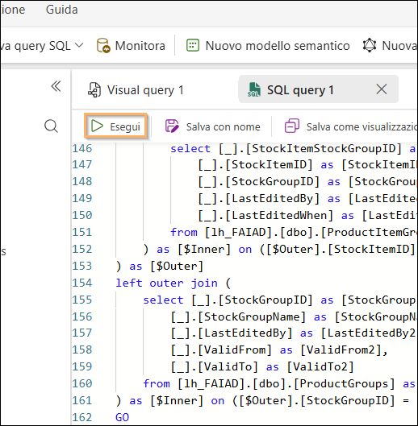

5. Nel pannello Explorer (a sinistra), espandere **Views.** Le viste appena create con i dati sono ora pronte per l’uso.

    

    Abbiamo trasformato i dati dall'origine dati ADLS Gen2. In questo laboratorio è stato spiegato come creare collegamenti e sono state illustrate varie opzioni per usare le viste di query visive per trasformare i dati.

    Nel prossimo lab verrà descritto come usare Dataflow Gen2 e creare un collegamento a un altro lakehouse.

# Riferimenti

Fabric Analyst in a Day (FAIAD) presenta alcune delle funzionalità chiave disponibili in Microsoft Fabric. Nel menu di servizio, la sezione Guida (?) include collegamenti ad alcune risorse utili.

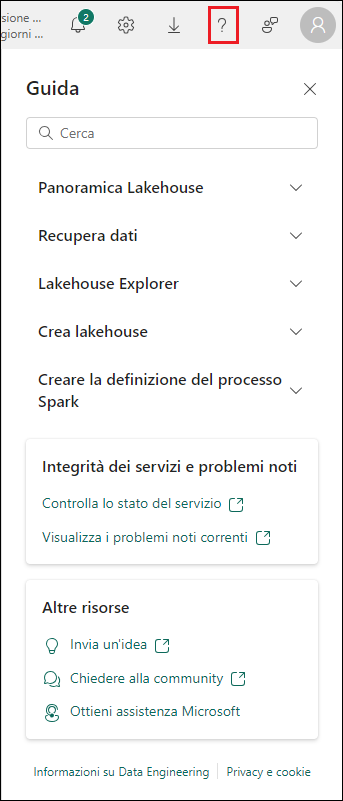

Di seguito sono riportate ulteriori risorse utili che consentiranno di progredire nell'uso di Microsoft Fabric.

- Vedere il post di blog per leggere l'[annuncio completo sulla disponibilità generale di Microsoft Fabric](https://aka.ms/Fabric-Hero-Blog-Ignite23)

- Esplorare Fabric attraverso la [Presentazione guidata](https://aka.ms/Fabric-GuidedTour)

- Iscriversi alla [versione di valutazione gratuita di Microsoft Fabric](https://aka.ms/try-fabric)

- Visitare il [sito Web di Microsoft Fabric](https://aka.ms/microsoft-fabric)

- Acquisire nuove competenze esplorando i [moduli di apprendimento su Fabric](https://aka.ms/learn-fabric)

- Consultare la [documentazione tecnica di Fabric](https://aka.ms/fabric-docs)

- Leggere l'[e-book gratuito introduttivo a Fabric](https://aka.ms/fabric-get-started-ebook)

- Unirsi alla [community di Fabric](https://aka.ms/fabric-community) per pubblicare domande, condividere feedback
e imparare dagli altri

Leggere i blog di annunci più approfonditi sull'esperienza Fabric:

- [Blog sull'esperienza Data Factory in Fabric](https://aka.ms/Fabric-Data-Factory-Blog)

- [Blog sull'esperienza Synapse Data Engineering in Fabric](https://aka.ms/Fabric-DE-Blog)

- [Blog sull'esperienza Synapse Data Science in Fabric](https://aka.ms/Fabric-DS-Blog)

- [Blog sull'esperienza Synapse Data Warehousing in Fabric](https://aka.ms/Fabric-DW-Blog)

- [Blog sull'esperienza Synapse Real-Time Analytics in Fabric](https://aka.ms/Fabric-RTA-Blog)

- [Blog di annunci di Power BI](https://aka.ms/Fabric-PBI-Blog)

- [Blog sull'esperienza Data Activator in Fabric](https://aka.ms/Fabric-DA-Blog)

- [Blog su amministrazione e governance in Fabric](https://aka.ms/Fabric-Admin-Gov-Blog)

- [Blog su OneLake in Fabric](https://aka.ms/Fabric-OneLake-Blog)

- [Blog sull'integrazione di Dataverse e Microsoft Fabric](https://aka.ms/Dataverse-Fabric-Blog)

© 2023 Microsoft Corporation. Tutti i diritti sono riservati.

L'uso della demo/del lab implica l'accettazione delle seguenti condizioni:

La tecnologia/le funzionalità descritte nella demo/nel lab sono fornite da Microsoft Corporation allo scopo di ottenere feedback dall'utente e offrire un'esperienza di apprendimento. L'utilizzo della demo/del lab è consentito solo per la valutazione delle caratteristiche e delle funzionalità di tale tecnologia e per l'invio di feedback a Microsoft. L'utilizzo per qualsiasi altro scopo non è consentito. È vietato modificare, copiare, distribuire, trasmettere, visualizzare, eseguire, riprodurre, pubblicare, concedere in licenza, usare per la creazione di lavori derivati, trasferire o vendere questa demo/questo lab o parte di essi.

SONO ESPLICITAMENTE PROIBITE LA COPIA E LA RIPRODUZIONE DELLA DEMO/DEL LAB (O DI QUALSIASI PARTE DI ESSI) IN QUALSIASI ALTRO SERVER O IN QUALSIASI ALTRA POSIZIONE PER ULTERIORE RIPRODUZIONE O RIDISTRIBUZIONE.

QUESTA DEMO/QUESTO LAB RENDONO DISPONIBILI TECNOLOGIE SOFTWARE/FUNZIONALITÀ DI PRODOTTO SPECIFICHE, INCLUSI NUOVI CONCETTI E NUOVE FUNZIONALITÀ POTENZIALI, IN UN AMBIENTE SIMULATO, CON UN'INSTALLAZIONE E UNA CONFIGURAZIONE PRIVE DI COMPLESSITÀ, PER GLI SCOPI DESCRITTI IN PRECEDENZA. LA TECNOLOGIA/I CONCETTI RAPPRESENTATI IN QUESTA DEMO/IN QUESTO LAB POTREBBERO NON CONTENERE LE FUNZIONALITÀ COMPLETE E IL LORO FUNZIONAMENTO POTREBBE NON ESSERE LO STESSO DELLA VERSIONE FINALE. È ANCHE POSSIBILE CHE UNA VERSIONE FINALE DI TALI FUNZIONALITÀ O CONCETTI NON VENGA RILASCIATA. L'ESPERIENZA D'USO DI TALI CARATTERISTICHE E FUNZIONALITÀ PUÒ INOLTRE RISULTARE DIVERSA IN UN AMBIENTE FISICO.

**FEEDBACK.** L'invio a Microsoft di feedback sulle caratteristiche, sulle funzionalità e/o sui concetti della tecnologia descritti in questa demo/questo lab implica la concessione a Microsoft, a titolo gratuito, del diritto di utilizzare, condividere e commercializzare tale feedback in qualsiasi modo e per qualsiasi scopo. Implica anche la concessione a titolo gratuito a terze parti del diritto di utilizzo di eventuali brevetti necessari per i loro prodotti, le loro tecnologie e i loro servizi al fine di utilizzare o interfacciarsi ai componenti software o ai servizi Microsoft specifici che includono il feedback. L'utente si impegna a non inviare feedback la cui inclusione all'interno di software o documentazione Microsoft imponga a Microsoft di concedere in licenza a terze parti tale software o documentazione. Questi diritti sussisteranno anche dopo la scadenza del presente contratto.

CON LA PRESENTE MICROSOFT CORPORATION NON RICONOSCE ALCUNA GARANZIA O CONDIZIONE RELATIVAMENTE ALLA DEMO/AL LAB, INCLUSE TUTTE LE GARANZIE E CONDIZIONI DI COMMERCIABILITÀ, DI FATTO ESPRESSE, IMPLICITE O PRESCRITTE DALLA LEGGE, ADEGUATEZZA PER UNO SCOPO SPECIFICO, TITOLARITÀ E NON VIOLABILITÀ. MICROSOFT NON OFFRE GARANZIE O RAPPRESENTAZIONI IN RELAZIONE ALL'ACCURATEZZA DEI RISULTATI E DELL'OUTPUT DERIVANTI DALL'USO DELLA DEMO/DEL LAB O ALL'ADEGUATEZZA DELLE INFORMAZIONI CONTENUTE NELLA DEMO/NEL LAB PER QUALSIASI SCOPO.

**CLAUSOLA DI RESPONSABILITÀ**

Questa demo/questo lab contiene solo una parte delle nuove funzionalità e dei miglioramenti in Microsoft Power BI. Alcune funzionalità potrebbero cambiare nelle versioni future del prodotto. In questa demo/in questo lab si apprendono alcune delle nuove funzionalità, ma non tutte.
