# Microsoft Fabric - Fabric Analyst in a Day - Lab 5

## Contents

- Introduzione
- Flusso di dati Gen2
- Attività 1: Configurazione dell'aggiornamento pianificato per il flusso di dati del fornitore
- Pipeline
- Attività 2: Creazione di una pipeline
- Attività 3: Creazione di una pipeline semplice
- Attività 4: Creazione di una nuova pipeline
- Attività 5: Creazione di un'attività Until
- Attività 6: Creazione di variabili
- Attività 7: Configurazione di un'attività Until
- Attività 8: Configurazione di un'attività Flusso di dati
- Attività 9: Configurazione della prima attività Imposta variabile
- Attività 10: Configurazione della seconda attività Imposta variabile
- Attività 11: Configurazione della terza attività Imposta variabile
- Attività 12: Configurazione di un'attività Attesa
- Attività 13: Configurazione dell'aggiornamento pianificato per la pipeline
- Riferimenti

# Introduzione

Abbiamo inserito nel lakehouse dati da origini dati diverse. In questo lab si imposterà una pianificazione degli aggiornamenti per le origini dati. Riepilogo dei requisiti:

- **Dati fornitori:** in Snowflake vengono aggiornati alle 00.00 ogni giorno.

- **Dati sui dipendenti:** in SharePoint vengono aggiornati ogni giorno alle 9:00. Tuttavia, abbiamo notato che a volte si verifica un ritardo di 5-15 minuti. Dobbiamo creare una pianificazione degli aggiornamenti per far fronte a questa situazione.

- **Dati clienti:** in Dataverse sono sempre aggiornati. In precedenza aggiornavamo i dati quattro volte al giorno: alle 00.00, alle 6.00, alle 12.00 e alle 18.00. Ora il team IT ha creato un collegamento a Dataverse per inserire questi dati in un lakehouse Amministrazione. Inoltre i dati sono stati trasformati. Non è più necessario impostare l'aggiornamento poiché si sta creando un collegamento al lakehouse fornito dal team IT.

- **Dati di vendita:** in ADLS vengono aggiornati ogni giorno alle 12.00. Non è quindi necessario impostare l'aggiornamento poiché abbiamo creato un collegamento. I dati sono disponibili non appena vengono aggiornati in ADLS."

In questo lab si imparerà a:

- Configurare una pianificazione degli aggiornamenti di Flusso di dati Gen2

- Creare una pipeline

- Configurare una pianificazione degli aggiornamenti di una pipeline

# Flusso di dati Gen2

### Attività 1: Configurazione dell'aggiornamento pianificato per il flusso di dati del fornitore

Iniziamo con la configurazione di un aggiornamento pianificato del flusso di dati dei fornitori.

1. Torniamo all'area di lavoro Fabric, **FAIAD_<username>** selezionando l'area di lavoro nel pannello a sinistra.

2. Per ingrandire il pannello con l'elenco degli artefatti, selezionare la doppia freccia in alto a destra del pannello.

    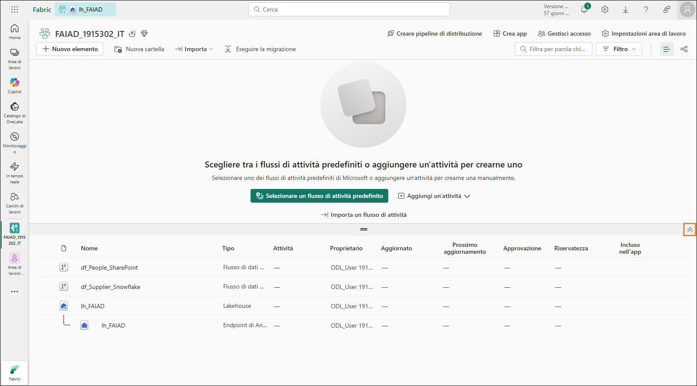

3. Tutti gli artefatti creati sono elencati qui. Sulla destra della schermata immettere **df** nella **casella di ricerca**. In questo modo si filtreranno i dati per i flussi di dati.

    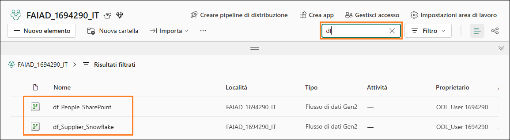

4. Posiziona il cursore del mouse sulla riga **df_Supplier_Snowflake**. Seleziona i **puntini di sospensione (…)**.

5. Nota che sono presenti le opzioni per eliminare, aprire e aggiornare il flusso di dati.
    Esaminiamo la cronologia degli aggiornamenti. Seleziona **Esecuzioni recenti**.

    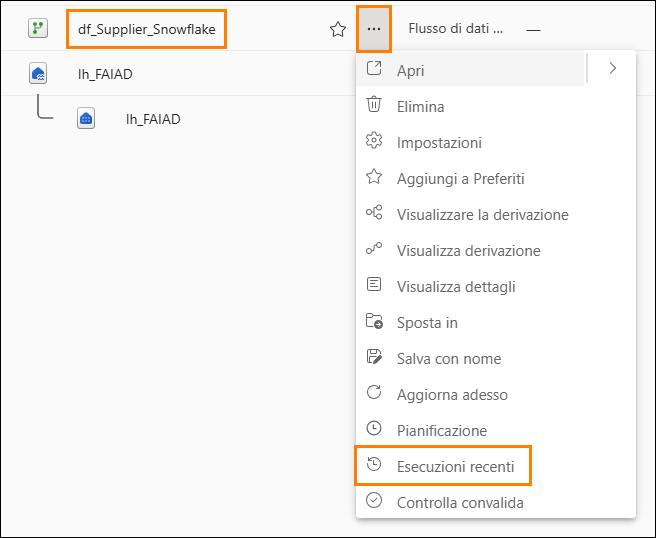

    **Nota:** sul lato destro verrà visualizzata una finestra/pannello che mostra un elenco di aggiornamenti

6. Noterai che è stato eseguito un unico aggiornamento quando abbiamo selezionato l'opzione **Salva ed esegui** nel lab precedente. Il **tipo** di aggiornamento visualizzato è elencato come **Su richiesta**, ad indicare che si tratta di un aggiornamento eseguito manualmente.

    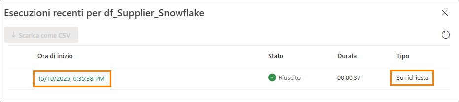

7. Selezionare il collegamento **Ora di inizio**.

    **Nota:** l'ora di inizio effettiva sarà diversa.

    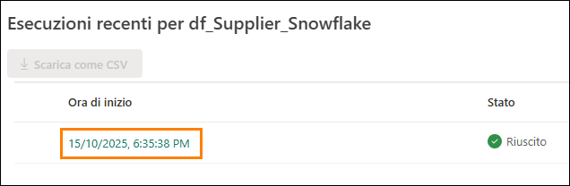

    Si apre la schermata Dettagli. Qui verranno forniti i dettagli dell'aggiornamento. Elenca l'ora di inizio, l'ora di fine e la durata. Elenca anche le tabelle/attività che sono state aggiornate. Nel caso in cui si verifichi un errore, è possibile fare clic sul nome della tabella/attività per indagare ulteriormente.

    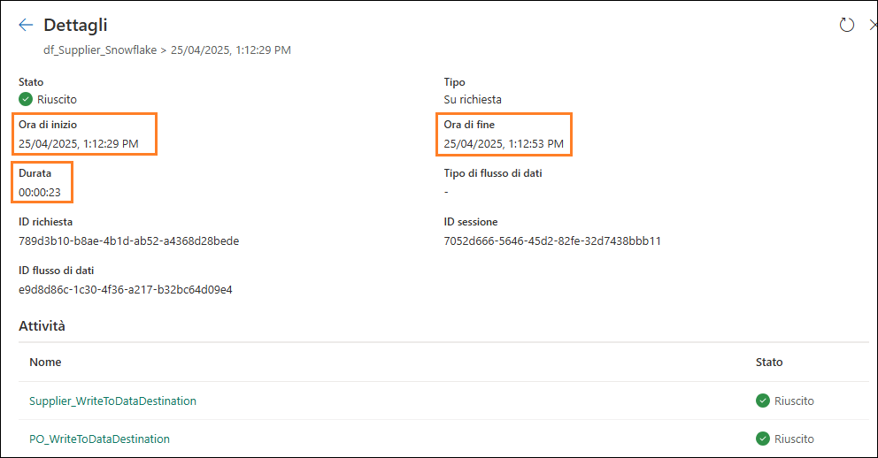

8. Usciamo facendo clic sulla **X** nell'angolo in alto a destra. Tornerai all'**area di lavoro**.

9. Posiziona il cursore del mouse sulla riga **df_Supplier_Snowflake**. Seleziona i **puntini di sospensione (…)**.

10. Vediamo come possiamo pianificare un aggiornamento in modo che avvenga automaticamente. Scegli l'opzione **Impostazioni**.

    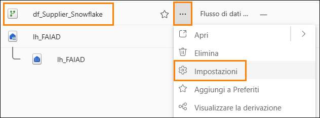

11. Vedrai che nel pannello **Impostazioni** che appare sono disponibili tre opzioni:
    **Informazioni su:** possiamo modificare il nome del flusso di dati e aggiungere una descrizione. Inoltre, possiamo vedere chi è il proprietario del flusso di dati e l'ultima volta che è stato modificato. **Approvazione:** consente di specificare se il flusso di dati conterrà il tag **Alzato di livello** o **Certificato** per consentire agli altri di visualizzarlo. **Pianifica:** qui è possibile pianificare i flussi di dati.

    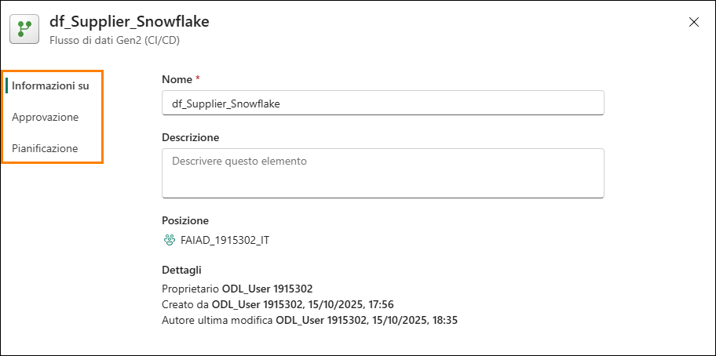

12. Seleziona l'opzione **Pianifica**

13. Per attivare una pianificazione, è sufficiente fare clic su **Aggiungi pianificazione**

    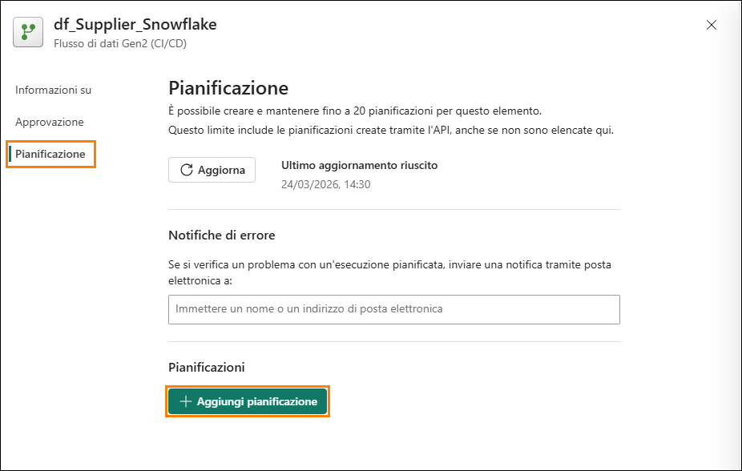

14. In questo modo è possibile specificare la cadenza dell'aggiornamento selezionando un'opzione per la proprietà **Repeat**. Per questo scenario è possibile scegliere **Giornaliero (1)**

15. Per la proprietà **Time** possiamo specificare **12:00 AM (2)** poiché vogliamo mezzanotte

    **Nota:** facendo clic sul collegamento Aggiungi un'altra ora, è possibile aggiungere più orari di aggiornamento.

16. È inoltre possibile specificare una **data e un'ora di inizio (3)** e una **data e un'ora di fine (4)**. Per questo scenario, scegli semplicemente il giorno corrente come data di inizio e data di fine.

17. Puoi specificare il **fuso orario (5)** che vuoi rappresentare. In ultimo luogo, seleziona **Salva**

    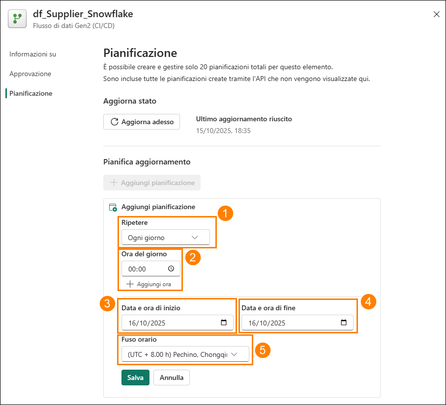

18. L'aggiornamento pianificato verrà visualizzato e sarà possibile modificarlo o eliminarlo se non è più necessario o aggiungere altri aggiornamenti pianificati.

    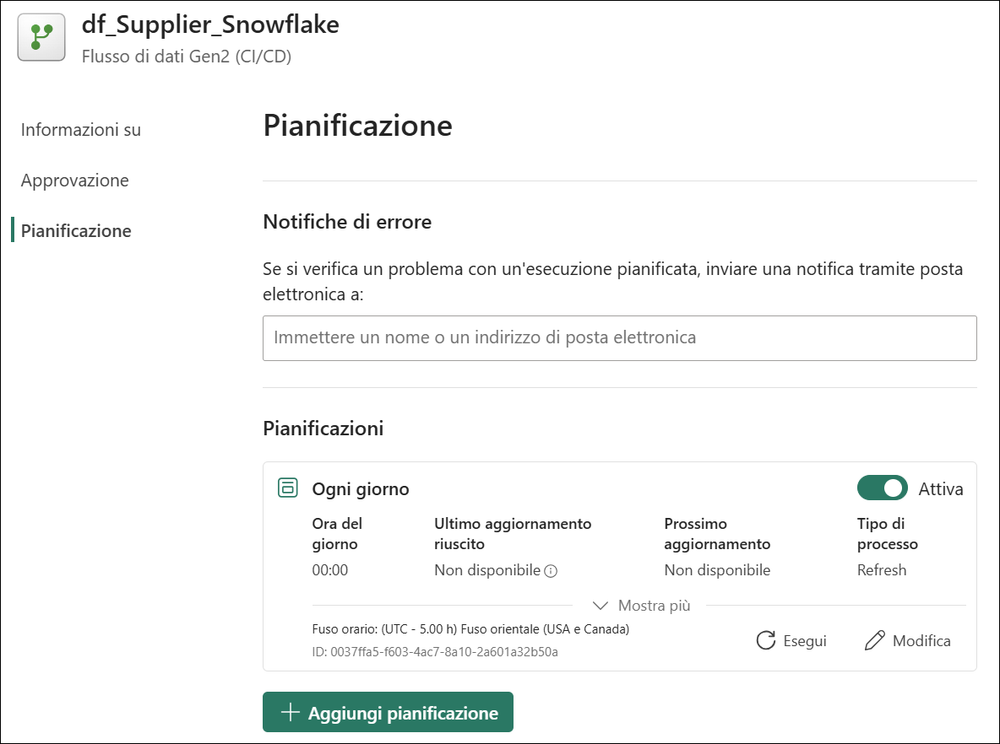

    Come illustrato in precedenza, è necessario creare una logica personalizzata per gestire lo scenario in cui il file Employee in SharePoint non viene consegnato in tempo. Usiamo una pipeline per risolvere questo problema.

# Pipeline

### Attività 2: Creazione di una pipeline

1. Torniamo all'area di lavoro di Fabric, **FAIAD_<nome utente>** selezionandola nel pannello di sinistra.

2. Nel menu in alto seleziona **+ Nuovo elemento (1) -> Pipeline (2).**

    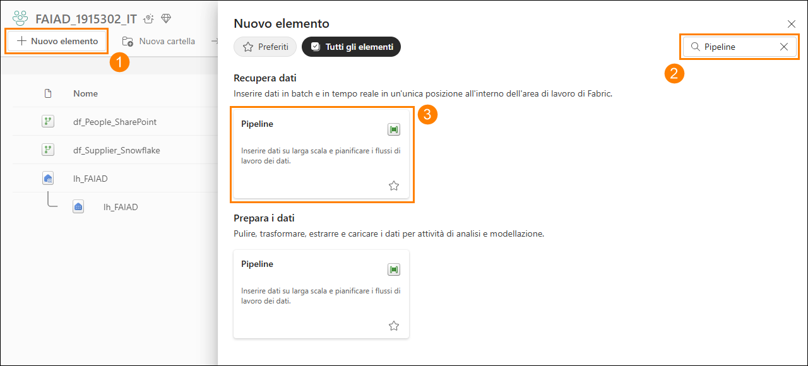

3. Si apre la finestra di dialogo Nuova pipeline. Assegna alla pipeline il nome **pl_Refresh_People_SharePoint** e seleziona **Crea**.

    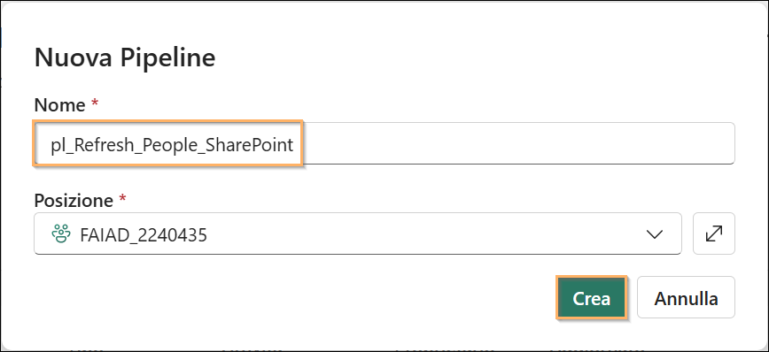

    Si apre la **pagina Pipeline**. Se hai lavorato con Azure Data Factory, questa schermata sarà familiare. Esaminiamone rapidamente il layout.

    Ci si trova nella schermata **Home**. Se si osserva il menu in alto, si possono notare le opzioni per aggiungere le attività di uso comune: convalida ed esecuzione di una pipeline e visualizzazione della cronologia di esecuzione. Inoltre, nel riquadro centrale sono presenti opzioni rapide per iniziare a creare la pipeline.

    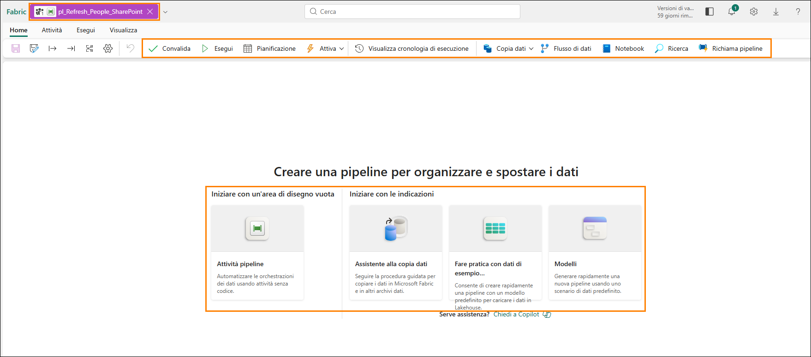

4. Nel menu in alto selezionare **Attività**. Ora nel menu si troverà anche un elenco delle attività di uso comune.

5. Selezionare i **puntini di sospensione (…)** sulla destra del menu per visualizzare tutte le attività disponibili. Useremo alcune di queste attività nel lab.

    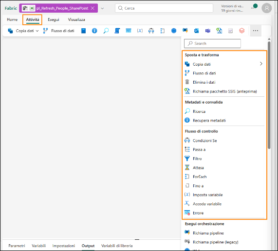

6. Nel menu in alto fare clic su **Esegui**. Si troveranno opzioni per eseguire e pianificare l'esecuzione della pipeline. È anche possibile visualizzare la cronologia di esecuzione mediante l'opzione Visualizza cronologia di esecuzione.

7. Nel menu in alto selezionare **Visualizza**. Qui si troveranno le opzioni per visualizzare il codice in formato JSON. Si troveranno anche le opzioni per allineare automaticamente le attività.

    **Nota:** Se si ha familiarità con JSON, alla fine del lab è possibile selezionare Visualizza codice JSON. Qui si può notare che tutta l'orchestrazione effettuata usando la visualizzazione di progettazione può anche essere scritta in JSON.

    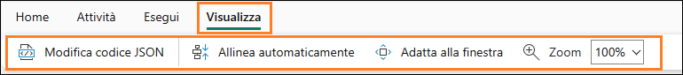

### Attività 3: Creazione di una pipeline semplice

Iniziamo a creare la pipeline. Abbiamo bisogno di un'attività per aggiornare il flusso di dati. Troviamo un'attività che possiamo usare.

1. Nel menu in alto selezionare **Attività -> Flusso di dati**. L'attività Flusso di dati viene aggiunta al riquadro di progettazione centrale. Notare che il riquadro inferiore contiene ora opzioni di configurazione dell'attività Flusso di dati.

2. Configureremo l'attività per la connessione al flusso di dati df_People_SharePoint. Nel **riquadro inferiore** seleziona **Impostazioni**.

    *Nota: potrebbe essere necessario trascinare il riquadro inferiore verso l'alto per visualizzare le impostazioni.*

    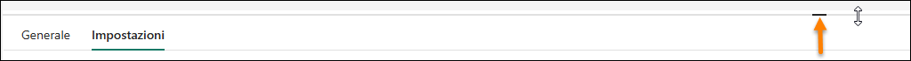

3. Assicurarsi che l'**Area di lavoro** sia impostata sull'area di lavoro di Fabric **FAIAD_<nomeutente>.**

4. Nel menu a discesa **Flusso di dati** selezionare **df_People_SharePoint**. Quando questa attività Flusso di dati viene eseguita, aggiornerà **df_People_SharePoint.** Questa procedura è molto semplice.

    Nel nostro scenario i dati dipendenti non vengono aggiornati nei tempi previsti. Talvolta si verifica un ritardo. Ora vedremo come risolvere questo problema.

    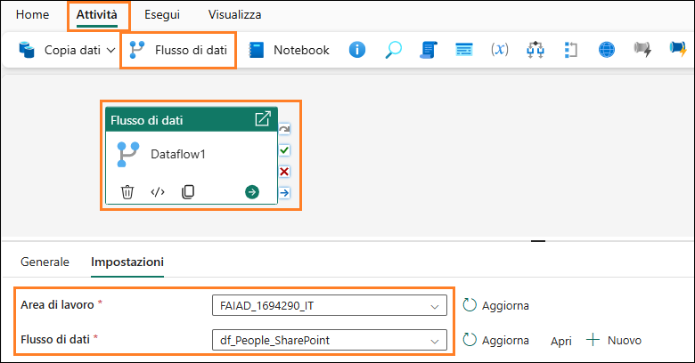

5. Nel **riquadro**** inferiore** selezionare **Generale**. Assegniamo all'attività un nome e una descrizione.

6. Nel campo **Nome** immettere **dfactivity_People_SharePoint**.

7. Nel campo **Descrizione** immettere **Attività Flusso di dati per aggiornare il flusso di dati df_People_Sharepoint**.

8. Notare che è disponibile un'opzione per disattivare un'attività. Questa funzionalità è utile durante il test o il debug. Lasciarla impostata su **Attivata**.

9. È presente un'opzione per impostare il **Timeout**. Lasciamo il **valore predefinito** poiché dovrebbe fornire tempo sufficiente per l'aggiornamento del flusso di dati.

    **Nota:** dal momento che i dati non sono disponibili nei tempi previsti, impostiamo l'attività in modo che venga eseguita nuovamente ogni 10 minuti, per tre volte. Se anche al terzo tentativo non riesce, verrà segnalato un esito negativo.

10. Impostare **Riprova** su **3**

11. Espandere la sezione **Avanzate**.

12. Impostare **Intervallo tra i tentativi (sec)** su **600**.

13. Nel menu selezionare l'icona **Home -> Salva** per salvare la pipeline.

    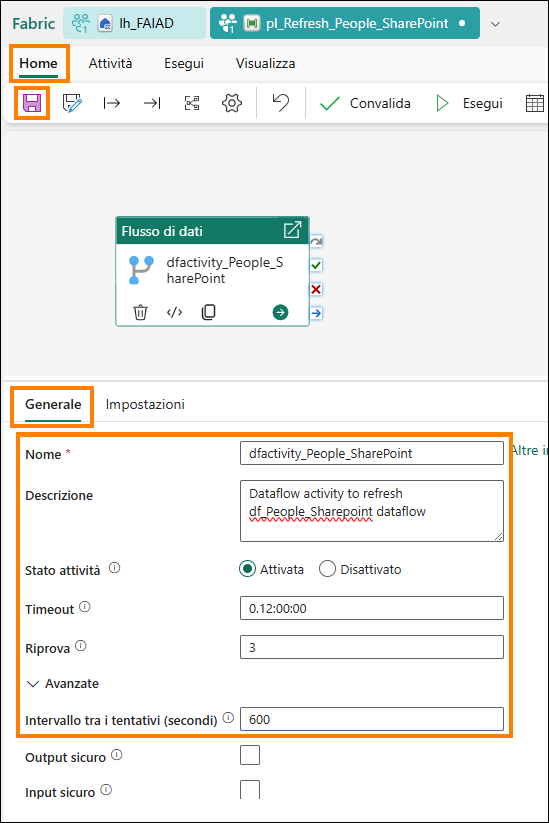

    Si notino i vantaggi offerti dall'uso della pipeline rispetto all'impostazione del flusso di dati su un aggiornamento pianificato (come abbiamo fatto per il flusso di dati precedente):

    - La pipeline offre la possibilità di riprovare più volte prima che l'aggiornamento venga considerato non riuscito.

    - La pipeline offre la possibilità di eseguire altre attività oltre ad aggiornare il flusso di dati

### Attività 4: Creazione di una nuova pipeline

Aggiungiamo un po' più di complessità al nostro scenario. Abbiamo notato che se i dati non sono disponibili alle 09:00, in genere lo sono entro cinque minuti. Se non viene rispettata la finestra temporale, saranno necessari 15 minuti affinché il file sia disponibile. Vogliamo pianificare i nuovi tentativi a cinque e 15 minuti. Vediamo come è possibile ottenere questo risultato creando una nuova pipeline.

1. Nel pannello di sinistra fare clic su **FAIAD_<nome utente>** per andare alla home page dell'area di lavoro.

2. Nel menu in alto, fare clic su + **Nuovo elemento (1)** e nella finestra popup, fare clic su **Pipeline (2)**.

    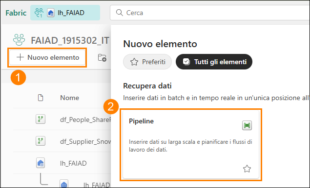

3. Si apre la finestra di dialogo Nuova pipeline. Assegnare alla pipeline il **nome pl_Refresh_People_SharePoint_Option2 (3)** e selezionare **Crea (4)**.

    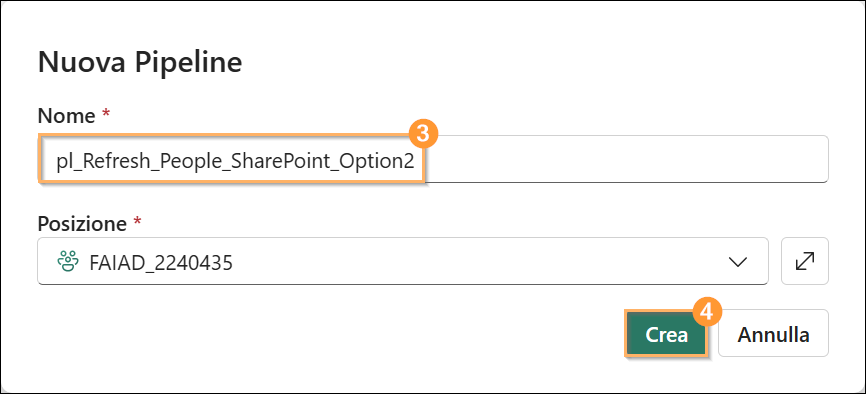

### Attività 5: Creazione di un'attività Until

1. Si aprirà la schermata di Pipeline. Nel menu selezionare **Attività**.

2. Fate clic sui **puntini di sospensione (…)** a destra.

3. Nell'elenco di attività fare clic su **Fino a**.

    **Fino a**: è un'attività usata per eseguire l'iterazione finché una condizione non viene soddisfatta.

    Nel nostro scenario, ripeteremo e aggiorneremo il flusso di dati finché non avrà esito positivo o finché non avremo provato tre volte.

    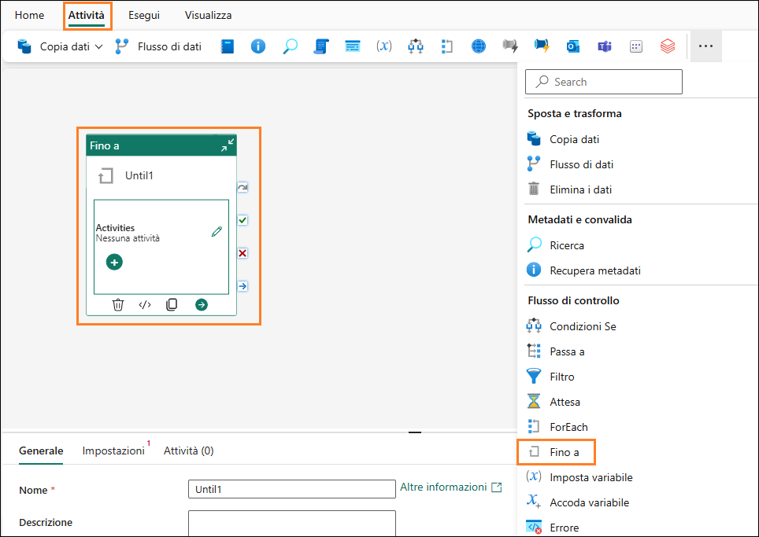

### Attività 6: Creazione di variabili

1. Dobbiamo creare variabili che verranno usate per l'iterazione e l'impostazione dello stato. Selezionare l'**area vuota** nel riquadro di progettazione della pipeline.

2. Notare che il menu nel riquadro inferiore cambia. Selezionare **Variabili**.

3. Selezionare **+ Nuova** per aggiungere una nuova variabile.

4. Notare che compare una riga. Immettere **varCounter** nella **casella di testo Nome**. Useremo questa variabile per iterare per tre volte.

5. Nel **menu a discesa** **Tipo** selezionare **Integer**.

6. Immettere il **Valore predefinito** di **0**.

    **Nota:** aggiungiamo var all'inizio dei nomi delle variabili per renderne più agevole la ricerca.

    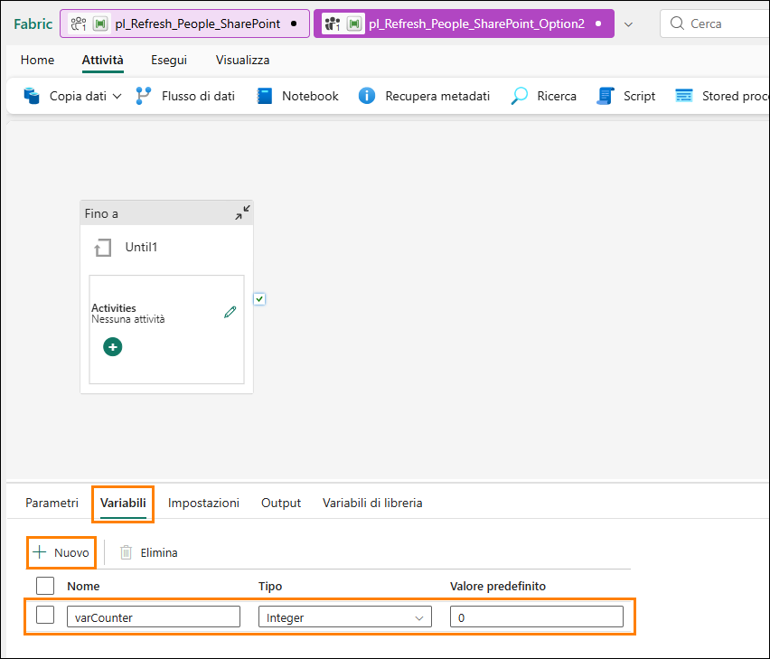

7. Selezionare **+ Nuova** per aggiungere un'altra variabile.

8. Notare che compare una riga. Immettere **varTempCounter** nella **casella di testo Nome**. Useremo questa variabile per incrementare la variabile varCounter.

9. Nel **menu a discesa** **Tipo** selezionare **Integer**.

10. Immettere il **Valore predefinito** di **0**.

11. Eseguire passaggi analoghi per aggiungere altre tre variabili:

    1. **varIsSuccess** di tipo **String** con valore predefinito **No**. Questa variabile verrà usata per indicare se l'aggiornamento del flusso di dati ha avuto esito positivo.

    2. **varSuccess** di tipo **String** con valore predefinito **Sì**. Questa variabile verrà usata per impostare il valore di varIsSuccess se l'aggiornamento del flusso di dati ha esito positivo.

    3. **varWaitTime** di tipo **Integer** con valore predefinito **60**. Questa variabile verrà usata per impostare il tempo di attesa in caso il flusso di dati non riesca (5 minuti/300 secondi oppure 15 minuti/900 secondi).

    **Nota:** accertarsi che non ci siano spazi prima o dopo il nome della variabile.

    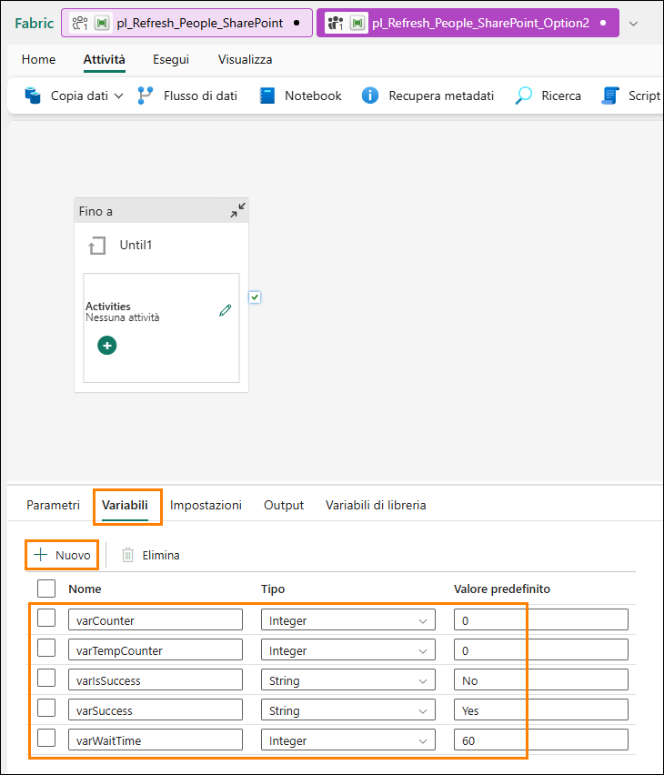

### Attività 7: Configurazione di un'attività Until

1. Selezionare l'attività **Fino a**.

2. Nel **riquadro inferiore** selezionare **Generale**.

3. Immettere il **Nome**:** Iterator**

4. Immettere la **Descrizione** come **“Iterator to refresh dataflow. It will retry up to 3 times”**.

    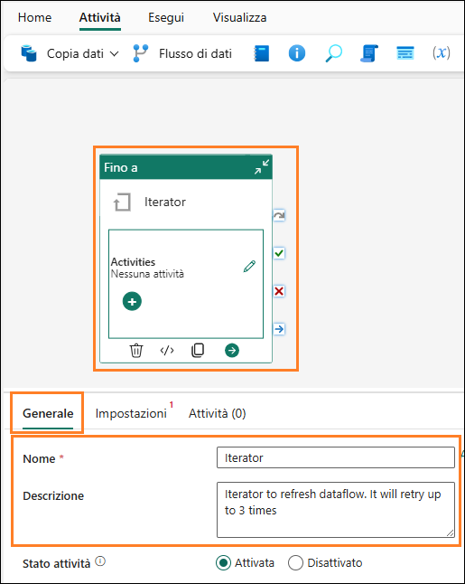

5. Nel riquadro inferiore selezionare **Impostazioni (1)**.

6. Selezionare la casella di testo **Espressione (2)**. In questa casella di testo dobbiamo immettere un'espressione che restituirà true o false. L'attività Until verrà iterata finché l'espressione non restituirà false. Quando l'espressione restituisce true, l'iterazione dell'attività Until si interrompe e passa all'attività successiva.

7. Selezionare il collegamento **Aggiungi contenuto dinamico (3)** sotto la casella di testo.

    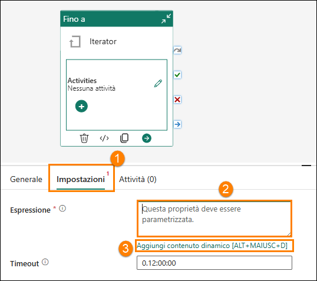

    Dobbiamo scrivere un'espressione che verrà eseguita finché il valore di **varCounter è 3** o il valore **di varIsSuccess è Sì** (varCounter e varIsSuccess sono le variabili che abbiamo appena creato).

8. Si apre la finestra di dialogo **Generatore di espressioni della pipeline**. Nella metà inferiore della finestra di dialogo è presente un menu:

    1. **Parametri:** valori passati alla pipeline. Ad esempio, il valore di una pipeline passato a un'altra pipeline. Questi valori possono essere utilizzati in qualsiasi espressione,
    ma non possono essere modificati durante l'esecuzione della pipeline.

    2. **Variabili di sistema:** è possibile usarle nelle espressioni per definire entità all'interno di uno dei servizi, ad esempio ID pipeline, nome pipeline, nome trigger e così via.

    3. **Parametri trigger:** parametri che hanno attivato la pipeline. Ad esempio, nome file o percorso cartella.

    4. **Funzioni:** è possibile chiamare funzioni all'interno delle espressioni. Le funzioni sono classificate in funzioni Raccolta, Conversione, Data, Logica, Matematica e Stringa. Ad esempio, concat è una funzione Stringa, add è una funzione Matematica e così via.

    5. **Variabili:** le variabili della pipeline sono valori che è possibile impostare e modificare durante l'esecuzione della pipeline. A differenza dei parametri della pipeline, che sono definiti a livello di pipeline e non possono essere modificati durante l'esecuzione della pipeline, le variabili della pipeline possono essere impostate e modificate all'interno di una pipeline usando un'attività Imposta variabile. Useremo a breve l'attività Imposta variabile.

    6. **Variabili di libreria:** le variabili di libreria utilizzano variabili definite nell'elemento Fabric della libreria di variabili. Queste variabili offrono un modo centralizzato per gestire le configurazioni tra le aree di lavoro per supportare i flussi di lavoro CI/CD. Possono essere utilizzate insieme a pipeline, notebook, collegamenti lakehouse e altro ancora.

    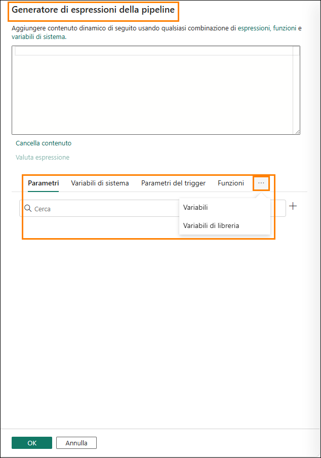

9. Fare clic su **Funzioni** nella barra multifunzione o nel menu.

10. Nella sezione **Funzioni logiche** selezionare la funzione **or**. Notare che **@or()** viene aggiunto nella casella di testo dell'espressione dinamica. La funzione or accetta due parametri, stiamo lavorando sul primo parametro.

    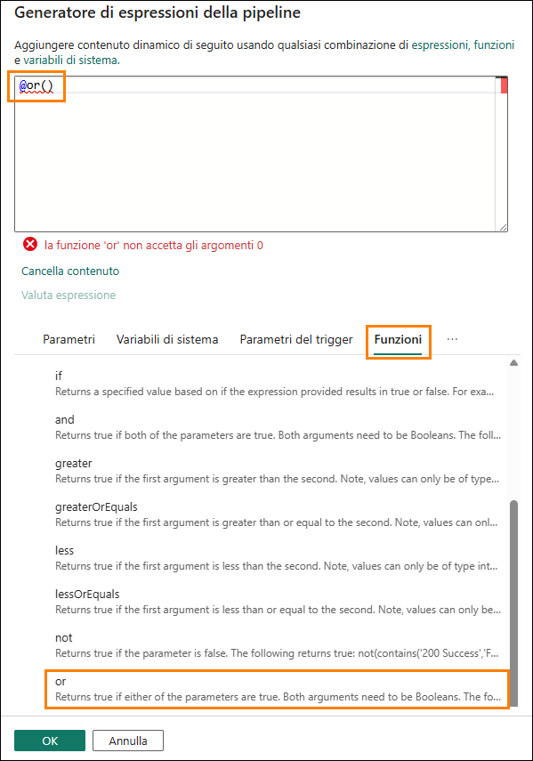

11. Posizionare il cursore **tra le parentesi** della funzione **@or**.

12. Nella sezione **Funzioni logiche** selezionare la funzione **equals**. Notare che questo viene aggiunto nella casella di testo dell'espressione dinamica.

    **Nota:** La funzione dovrebbe essere **@or(equals())**. Anche la funzione equals accetta due parametri. Controlleremo se la variabile varCounter è uguale a 3.

    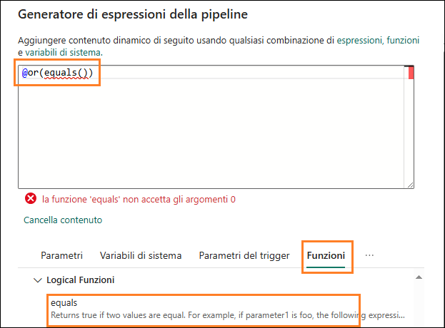

13. Ora posizionare il cursore **tra le parentesi** della funzione **@equals** per aggiungere i parametri.

14. Nel menu in basso selezionare **Variabili**.

15. Seleziona la variabile **varCounter** che sarà il primo parametro.

16. Immettere **3** come secondo parametro della funzione equals. Come illustrato nello screenshot seguente, l'espressione sarà **@or(equals(variables('varCounter'),3))**

    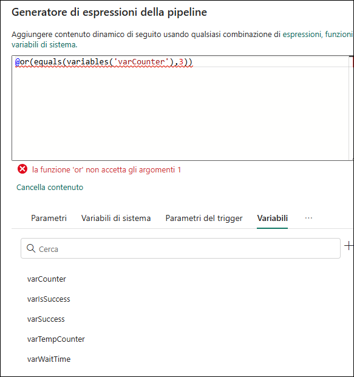

17. Dobbiamo aggiungere il secondo parametro alla funzione or. **Aggiungere una virgola** tra le due parentesi finali. Questa volta proveremo a digitare il nome della funzione. Iniziare a digitare **equ** e si otterrà un elenco a discesa delle funzioni disponibili (questa funzionalità è denominata IntelliSense). Seleziona la funzione **equals**.

    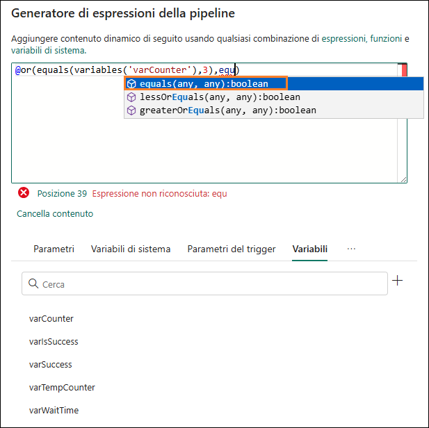

18. Il primo parametro della funzione equals è una variabile. Posiziona il **cursore prima della virgola**.

19. Inizia a digitare **variables**

20. Con l'aiuto di IntelliSense selezionare **variables('varIsSuccess')**

21. Dopo la virgola, inseriamo il secondo parametro. Inizia a digitare **variables**

22. Con l'aiuto di IntelliSense selezionare **variables('varSuccess')**. Qui stiamo confrontando il valore di varIsSuccess con il valore di varSuccess (il valore predefinito di varSuccess è Sì).

    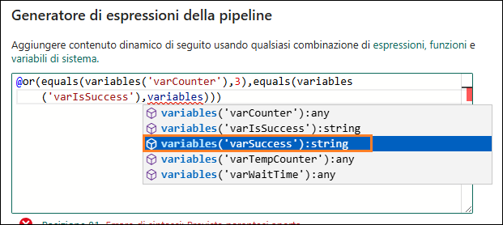

23. L'espressione dovrebbe essere:

    **@or(equals(variables('varCounter'),3),equals(variables('varIsSuccess'), variables('varSuccess')))**

24. Selezionare **OK**.

    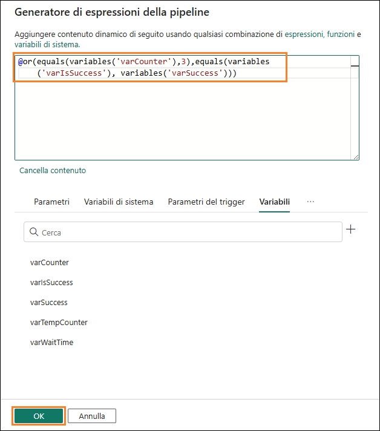

### Attività 8: Configurazione di un'attività Flusso di dati

1. Si aprirà nuovamente la schermata di progettazione. Con l'**attività Fino a** selezionata, nel **riquadro inferiore** selezionare **Attività**. Aggiungeremo ora le attività che devono essere eseguite.

2. Selezionare l'icona **Modifica** nella prima riga. Si aprirà una schermata di progettazione dell'iteratore vuota.

    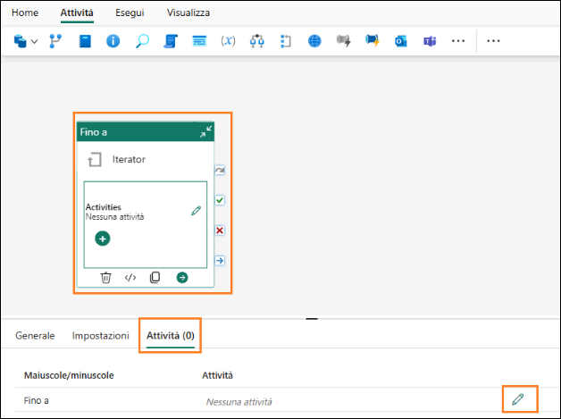

3. Nel menu in alto selezionare **Attività -> Flusso di dati**. L'attività Flusso di dati viene aggiunta al riquadro di progettazione.

4. Con l'**attività Flusso di dati selezionata**, nel riquadro inferiore selezionare **Generale**. Assegniamo all'attività un nome e una descrizione.

5. Nel campo **Nome** immettere **dfactivity_People_SharePoint**.

6. Nel campo **Descrizione** immettere "**Dataflow activity to refresh df_People_Sharepoint dataflow**".

    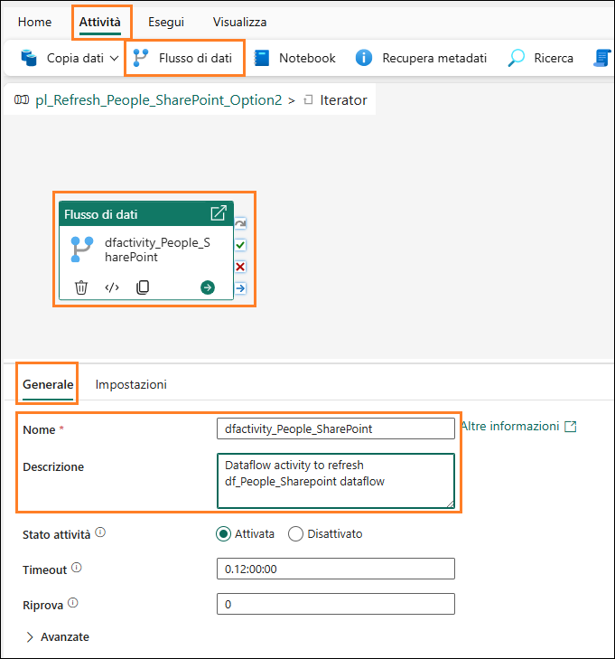

7. Selezionare **Impostazioni** nel riquadro inferiore.

8. Assicurarsi che l'**Area di lavoro** sia impostata sulla propria area di lavoro **FAIAD_<nomeutente>**.

9. Nel menu a discesa **Flusso di dati** selezionare **df_People_SharePoint**.

    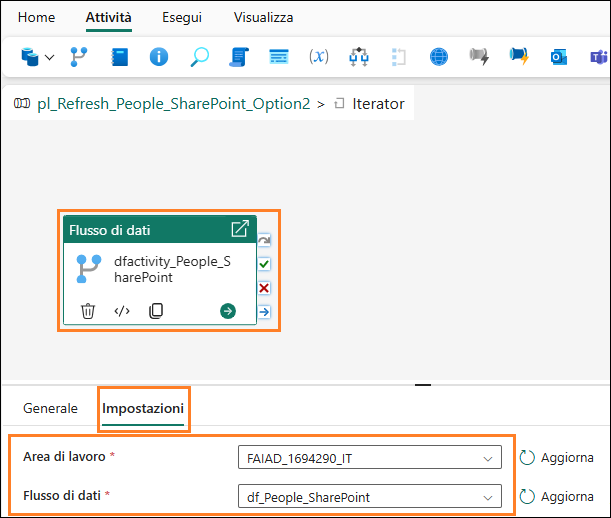

### Attività 9: Configurazione della prima attività Imposta variabile

Abbiamo configurato l'attività Flusso di dati come abbiamo fatto in precedenza nel lab. Ora aggiungeremo nuova logica. Se l'aggiornamento del flusso di dati ha esito positivo, è necessario uscire dall'iteratore Fino a. Ricordare che una delle condizioni per uscire dell'iteratore è impostare il valore della variabile varIsSuccess su Sì.

1. Nel menu in alto selezionare **Attività -> Imposta variabile**. L'attività Imposta variabile viene aggiunta al canvas di progettazione.

2. Con l'attività **Imposta variabile** selezionata, nel riquadro inferiore selezionare **Generale**. Assegniamo all'attività un nome e una descrizione.

3. Nel campo **Nome** immettere **set_varIsSuccess**

4. Nel campo **Descrizione** immettere "**Set variable varIsSuccess to Yes**".

    **Nota:** passare il puntatore del mouse sull'**attività Flusso di dati**. A destra del riquadro dell'attività sono presenti quattro icone. Tali icone si possono usare per la connessione all'attività successiva in base al risultato dell'attività:

1. L'icona **freccia curva grigia** si usa per saltare l'attività.

2. L'icona **segno di spunta verde** si usa in caso di esito positivo dell'attività.

3. L'icona **segno X rosso** si usa in caso di esito negativo dell'attività.

4. L'icona **freccia dritta blu** si usa al completamento dell'attività.

5. Fare clic sul **segno di spunta verde** dall'attività Flusso di dati dfactivity_People_SharePoint e trascinare per connettere la nuova **attività Imposta variabile** **set_varIsSuccess**. In caso di esito positivo dell'aggiornamento del flusso di dati, vogliamo eseguire l'attività Imposta variabile.

    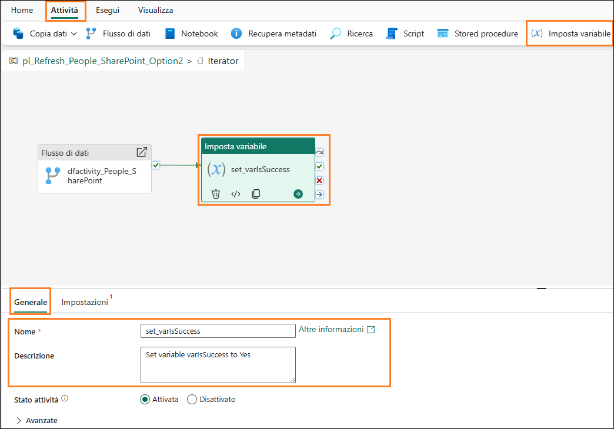

6. Con l'attività **Imposta variabile** selezionata, fare clic su **Impostazioni** nel menu in basso.

7. Nel riquadro inferiore assicurarsi che il **Tipo di variabile** sia **Variabile della pipeline**.

8. Nel campo **Nome** selezionare **varIsSucces.** Questa è la variabile di cui imposteremo il valore.

9. Nel campo **Valore** selezionare la **casella di testo**. Selezionare il collegamento **Aggiungi contenuto dinamico**.

    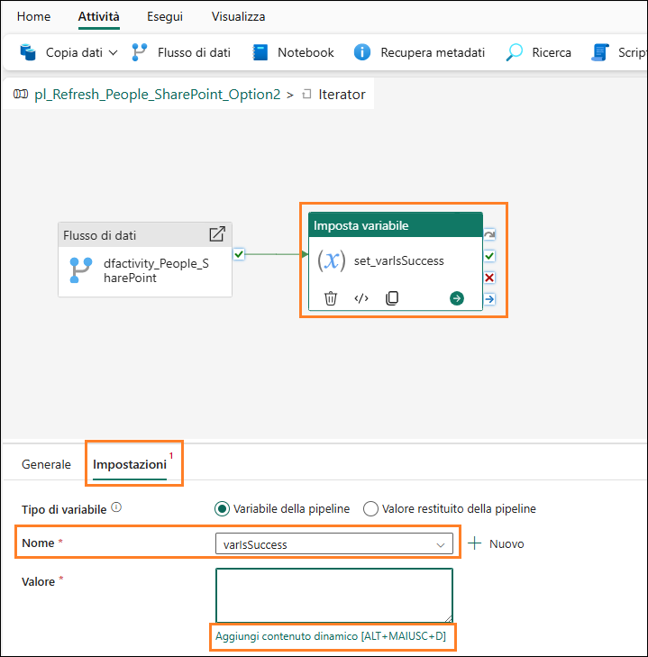

10. Si apre la finestra di dialogo Generatore di espressioni della pipeline. Selezionare l'area di testo **Aggiungere contenuto dinamico di seguito usando qualsiasi combinazione di espressioni, funzioni e variabili di sistema (1)**.

11. Nel menu in basso fare clic sui **puntini di sospensione (...) (2)** e selezionare **Variabili (3) -> varSuccess (4). @variables(‘varSuccess’)** viene immesso nell'area di testo Aggiungere contenuto dinamico di seguito. Tenere presente che quando abbiamo creato le variabili, abbiamo impostato il valore predefinito della variabile varSuccess su Sì. Quindi, assegniamo il valore Sì alla variabile varIsSuccess.

12. Selezionare **OK**. Si aprirà nuovamente il **riquadro di progettazione dell'iteratore**.

    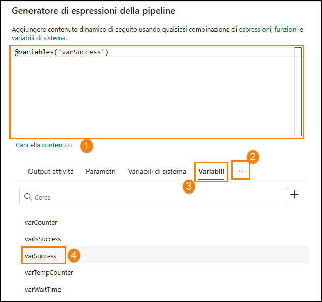

    Ora dobbiamo impostare il contatore degli esiti negativi dell'attività Flusso di dati. In una pipeline una variabile non può fare riferimento a se stessa. Pertanto non possiamo incrementare la variabile contatore varCounter aggiungendo uno al suo valore (varCounter = varCounter + 1). Usiamo quindi la variabile varTempCounter.

### Attività 10: Configurazione della seconda attività Imposta variabile

1. Nel menu in alto selezionare **Attività -> Imposta variabile**. L'attività Imposta variabile viene aggiunta al canvas di progettazione.

2. Con l'attività **Imposta variabile** selezionata, nel riquadro inferiore selezionare **Generale**. Assegniamo all'attività un nome e una descrizione.

3. Nel campo **Nome** immettere **set_varTempCounter**

4. Nel campo **Descrizione** immettere "**Increment variable varTempCounter**".

5. Fare clic sul **segno X rosso** dall'attività Flusso di dati all'attività Imposta variabile. In caso di esito negativo dell'aggiornamento del flusso di dati, vogliamo eseguire questa attività Imposta variabile.

    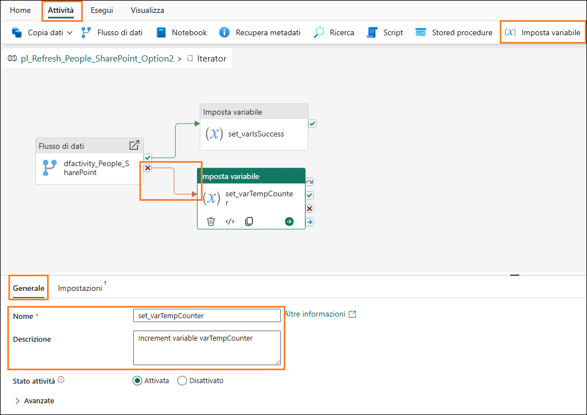

6. Con l'attività **Imposta variabile** selezionata, selezionare **Impostazioni** dal menu in basso.

7. Nel riquadro inferiore assicurarsi che il **Tipo di variabile** sia **Variabile della pipeline**.

8. Nel campo **Nome** selezionare **varTempCounter.** Questa è la variabile di cui imposteremo il valore.

9. Nel campo **Valore** selezionare la **casella di testo**. Selezionare il collegamento **Aggiungi contenuto dinamico**.

10. Si apre la finestra di dialogo Generatore di espressioni della pipeline. Immettere **@add(variables('varCounter'),1)**

    **Nota:** è possibile digitare l'espressione, usare il menu per selezionare le funzioni o copiare e incollare l'espressione. questa funzione imposta il valore della variabile varTempCounter sul valore della variabile varCounter più uno (varTempCounter = varCounter + 1).

    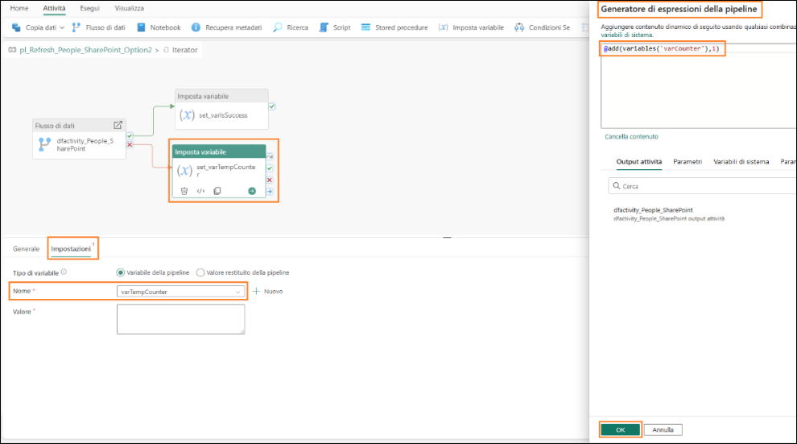

    Ora dobbiamo impostare il valore della variabile varCounter sul valore di varTempCounter.

### Attività 11: Configurazione della terza attività Imposta variabile

1. Nel menu in alto selezionare **Attività -> Imposta variabile**. L'attività Imposta variabile viene aggiunta al canvas di progettazione.

2. Con l'attività **Imposta variabile** selezionata, nel riquadro inferiore selezionare **Generale**. Assegniamo all'attività un nome e una descrizione.

3. Nel campo **Nome** immettere **set_varCounter**.

4. Nel campo **Descrizione** immettere "**Incrementare la variabile varCounter**".

5. Fare clic sul **segno di spunta verde** dall'attività Imposta variabile set_varTempCounter e trascinare per connettere la nuova **attività Imposta variabile set_varCounter**.

    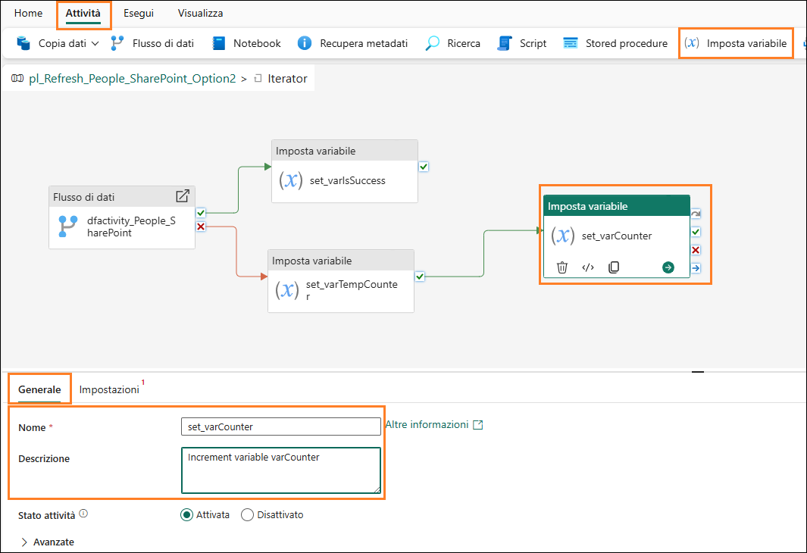

6. Con l'attività **Imposta variabile set_varCounter** selezionata, fare clic su **Impostazioni** nel menu in basso.

7. Nel riquadro inferiore assicurarsi che il **Tipo di variabile** sia **Variabile della pipeline**.

8. Nel campo **Nome** selezionare **varCounter**. Questa è la variabile di cui imposteremo il valore.

9. Nel campo **Valore** selezionare la **casella di testo**. Selezionare il collegamento **Aggiungi contenuto dinamico**.

10. Si apre la finestra di dialogo Generatore di espressioni della pipeline. Immettere **@variables('varTempCounter')**. È possibile digitare l'espressione, usare il menu per selezionare le funzioni o copiare e incollare l'espressione.

11. Fare clic su OK.

    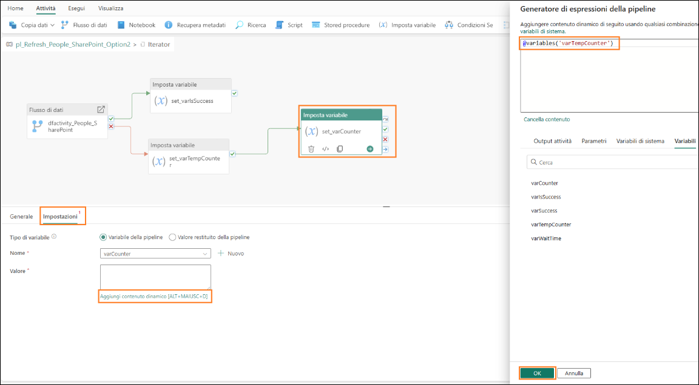

    **Nota:** questa funzione imposta il valore della variabile varCounter sul valore della variabile varTempCounter (varCounter = varTempCounter). Alla fine di ogni iterazione varCounter e varTempCounter hanno lo stesso valore.

### Attività 12: Configurazione di un'attività Attesa

Quindi, dovremo impostare un'attesa di 5 minuti/300 secondi in caso di un primo esito negativo dell'aggiornamento del flusso di dati, prima di un nuovo tentativo. Se l'aggiornamento del flusso di dati non riesce per una seconda volta, dovrà intercorrere un'attesa di 15 minuti/900 secondi prima di un nuovo tentativo. Useremo l'attività Attesa e la variabile varWaitTime per impostare il tempo di attesa.

1. Nel menu in alto selezionare **Attività -> puntini di sospensione (…) -> Attesa**. L'attività Attesa viene aggiunta al canvas di progettazione.

2. Con l'attività **Attesa** selezionata, nel riquadro inferiore selezionare **Generale**. Assegniamo all'attività un nome e una descrizione.

3. Nel campo **Nome** immettere **wait_onFailure**.

4. Nel campo **Descrizione** immettere "**Wait for 300 seconds on 2nd try and 900 seconds on 3rd try**".

5. Fare clic sul **segno di spunta verde** dall'attività Imposta variabile set_varCounter e trascinare per connettere la nuova **attività Attesa wait_onFailure**.

    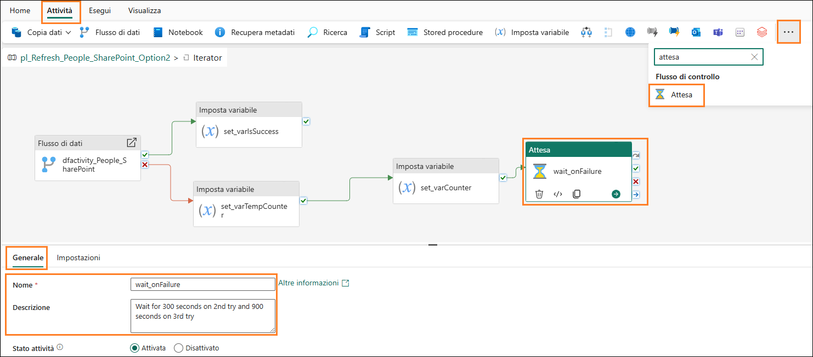

6. Con l'attività **Attesa** selezionata, fare clic su **Impostazioni** nel menu in basso.

7. Nel campo **Tempo di attesa in secondi** selezionare la **casella di testo** e selezionare il contenuto dinamico **Aggiungi contenuto dinamico**.

8. Si apre la finestra di dialogo Generatore di espressioni della pipeline. Immettere

    **@if(**

    **greater(variables(‘varCounter’), 1),**

    **if(equals(variables(‘varCounter’), 2),**

    **mul(variables(‘varWaitTime’),15 ),**

    **mul(variables(‘varWaitTime’), 0)**

    **),**

    **mul(variables(‘varWaitTime’),5 )**

    **)**

    È possibile digitare l'espressione, usare il menu per selezionare le funzioni o copiare e incollare l'espressione.

    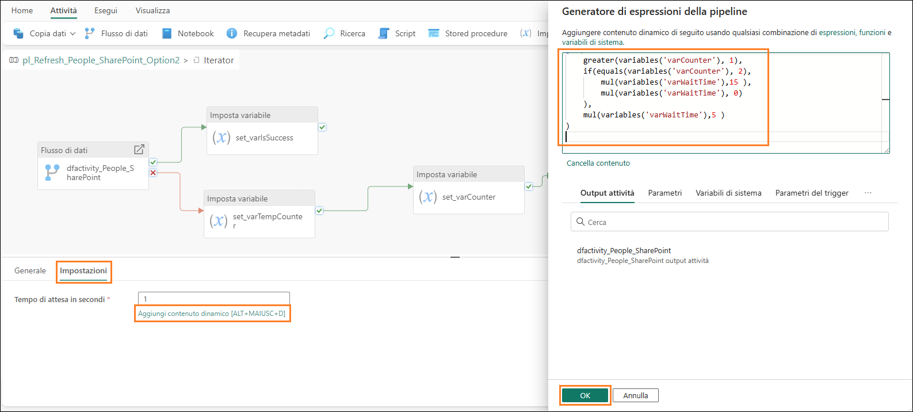

    Qui usiamo due nuove funzioni:

    - **greater:** prende due numeri come parametri e li confronta per indicare qual è il maggiore.

    - **mul:** questa è una funzione di moltiplicazione, prende due parametri da moltiplicare.

    L'espressione è un'istruzione if annidata. Controlla se il valore della variabile varCounter è maggiore di 1.

    Se è true, controlla se il valore della variabile varCounter è 2. Se è true, imposta il tempo di attesa su varWaitTime per 15. Ricordare che abbiamo impostato il valore predefinito di 60 per la variabile varWaitTime. Il risultato sarebbe 60\*15 = 900 secondi. Se il valore della variabile varCounter è diverso da 2 (è maggiore di 2, ossia l'aggiornamento del flusso di dati non è riuscito per 3 volte e l'iterazione si conclude, non occorre attendere oltre), il tempo di attesa è impostato su varWaitTime \* 0. Pertanto è pari a 0. Se il valore della variabile varCounter è 1, moltiplicheremo varWaitTime \* 5. Il risultato sarebbe 60\*5 = 300 secondi.

9. Selezionare **OK**.

    **Checkpoint:** l'iteratore Fino a dovrebbe presentarsi come illustrato nello screenshot seguente.

    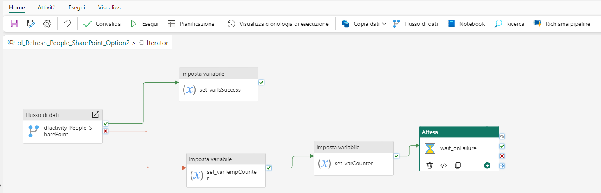

10. Nella parte superiore sinistra del canvas di progettazione selezionare **pl_Refresh_People_Sharepoint_Option2** o **Canvas principale** per uscire dall'iteratore Fino a.

    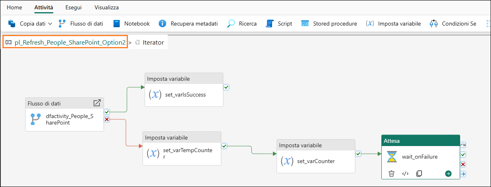

11. La creazione della pipeline è conclusa. Nel menu in alto selezionare l'icona **Home -> Salva** per salvare la pipeline di dati.

    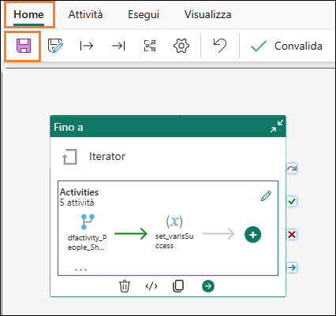

### Attività 13: Configurazione dell'aggiornamento pianificato per la pipeline

1. Possiamo testare la pipeline di dati selezionando **Home -> Esegui**.

    **Nota:** il completamento dell'aggiornamento della pipeline di dati potrebbe richiedere alcuni minuti. Questo è un ambiente di formazione, quindi il file in SharePoint è sempre disponibile. Pertanto, in questo caso la pipeline non avrà mai esito negativo.

2. Possiamo impostare la pipeline in modo che venga eseguita in base a una pianificazione. Nel menu in alto selezionare **Home -> Pianificazione**. Si apre la finestra Pianificazione.

3. Seleziona il pulsante **Aggiungi pianificazione** sotto **Esecuzione pianificata**.

    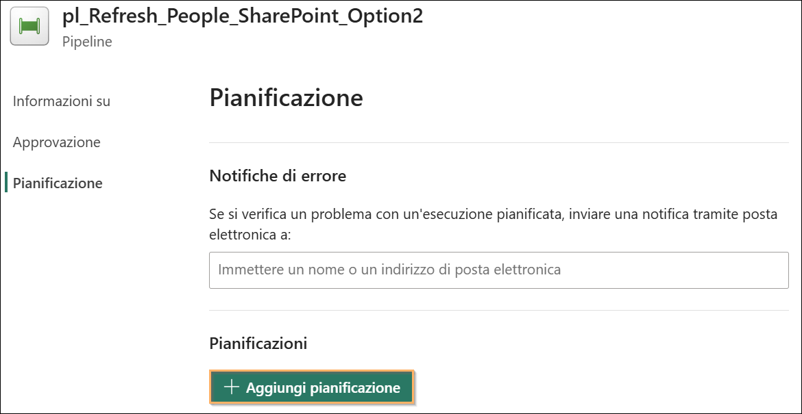

4. Impostare il menu a discesa **Ripetere** su **Ogni giorno**.

5. Impostare **Ora** su **09:00**.

6. Impostare **Data e ora di inizio** su **Oggi**.

7. Impostare **Data e ora di fine** su una **data futura**.

8. Impostare il proprio **Fuso orario**.

    **Nota:** poiché si tratta di un ambiente lab, è possibile impostare il fuso orario sul fuso orario preferito. In uno scenario reale, si imposterà il fuso orario in base alla propria ubicazione o all'ubicazione dell'origine dati.

9. Seleziona **Salva**.

10. Selezionare la **X** nell'angolo superiore destro della finestra di dialogo per chiuderla.

    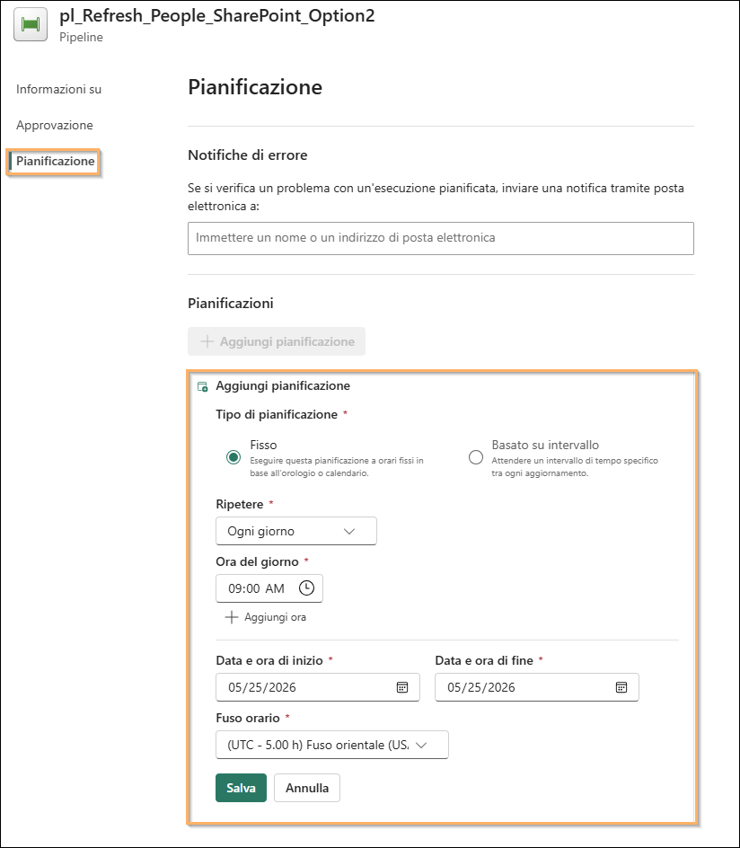

11. Selezionare l'area di lavoro di Fabric **FAIAD_<nome utente>** nel pannello di sinistra per andare all'area di lavoro.

    **Nota:** nella schermata Pianificazione non vi è un'opzione per la notifica dell'esito positivo o negativo (come nella pianificazione del flusso di dati). È possibile impostare la notifica aggiungendo un'attività nella pipeline. Non effettueremo questa impostazione in questo lab poiché si tratta di un ambiente lab.

    Abbiamo pianificato gli aggiornamenti per le diverse origini dati. Nel prossimo lab creeremo un modello semantico con relazioni, misure e altre operazioni di modellazione.

# Riferimenti

Fabric Analyst in a Day (FAIAD) presenta alcune delle funzionalità chiave disponibili in Microsoft Fabric. Nel menu di servizio, la sezione Guida (?) include collegamenti ad alcune risorse utili.

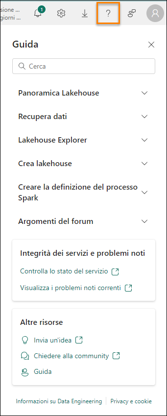

Di seguito sono riportate ulteriori risorse utili che consentiranno di progredire nell'uso di Microsoft Fabric.

- Vedere il post di blog per leggere l'[annuncio completo sulla disponibilità generale di Microsoft Fabric](https://aka.ms/Fabric-Hero-Blog-Ignite23)

- Esplorare Fabric attraverso la [Presentazione guidata](https://aka.ms/Fabric-GuidedTour)

- Iscriversi alla [versione di valutazione gratuita di Microsoft Fabric](https://aka.ms/try-fabric)

- Visitare il [sito Web di Microsoft Fabric](https://aka.ms/microsoft-fabric)

- Acquisire nuove competenze esplorando i [moduli di apprendimento su Fabric](https://aka.ms/learn-fabric)

- Consultare la [documentazione tecnica di Fabric](https://aka.ms/fabric-docs)

- Leggere l'[e-book gratuito introduttivo a Fabric](https://aka.ms/fabric-get-started-ebook)

- Unirsi alla [community di Fabric](https://aka.ms/fabric-community) per pubblicare domande, condividere feedback e imparare dagli altri

Leggere i blog di annunci più approfonditi sull'esperienza in Fabric:

- [Blog sull'esperienza Data Factory in Fabric](https://aka.ms/Fabric-Data-Factory-Blog)

- [Blog sull'esperienza Synapse Data Engineering in Fabric](https://aka.ms/Fabric-DE-Blog)

- [Blog sull'esperienza Synapse Data Science in Fabric](https://aka.ms/Fabric-DS-Blog)

- [Blog sull'esperienza Synapse Data Warehousing in Fabric](https://aka.ms/Fabric-DW-Blog)

- [Blog sull'esperienza Synapse Real-Time Analytics in Fabric](https://aka.ms/Fabric-RTA-Blog)

- [Blog di annunci di Power BI](https://aka.ms/Fabric-PBI-Blog)

- [Blog sull'esperienza Data Activator in Fabric](https://aka.ms/Fabric-DA-Blog)

- [Blog su amministrazione e governance in Fabric](https://aka.ms/Fabric-Admin-Gov-Blog)

- [Blog su OneLake in Fabric](https://aka.ms/Fabric-OneLake-Blog)

- [Blog sull'integrazione di Dataverse e Microsoft Fabric](https://aka.ms/Dataverse-Fabric-Blog)

© 2023 Microsoft Corporation. Tutti i diritti sono riservati.

L'uso della demo/del lab implica l'accettazione delle seguenti condizioni:

La tecnologia/le funzionalità descritte nella demo/nel lab sono fornite da Microsoft Corporation allo scopo di ottenere feedback dall'utente e offrire un'esperienza di apprendimento. L'utilizzo della demo/del lab è consentito solo per la valutazione delle caratteristiche e delle funzionalità di tale tecnologia e per l'invio di feedback a Microsoft. L'utilizzo per qualsiasi altro scopo non è consentito. È vietato modificare, copiare, distribuire, trasmettere, visualizzare, eseguire, riprodurre, pubblicare, concedere in licenza, usare per la creazione di lavori derivati, trasferire o vendere questa demo/questo lab o parte di essi.

SONO ESPLICITAMENTE PROIBITE LA COPIA E LA RIPRODUZIONE DELLA DEMO/DEL LAB (O DI QUALSIASI PARTE DI ESSI) IN QUALSIASI ALTRO SERVER O IN QUALSIASI ALTRA POSIZIONE PER ULTERIORE RIPRODUZIONE O RIDISTRIBUZIONE.

QUESTA DEMO/QUESTO LAB RENDONO DISPONIBILI TECNOLOGIE SOFTWARE/FUNZIONALITÀ DI PRODOTTO SPECIFICHE, INCLUSI NUOVI CONCETTI E NUOVE FUNZIONALITÀ POTENZIALI, IN UN AMBIENTE SIMULATO, CON UN'INSTALLAZIONE E UNA CONFIGURAZIONE PRIVE DI COMPLESSITÀ, PER GLI SCOPI DESCRITTI IN PRECEDENZA. LA TECNOLOGIA/I CONCETTI RAPPRESENTATI IN QUESTA DEMO/IN QUESTO LAB POTREBBERO NON CONTENERE LE FUNZIONALITÀ COMPLETE E IL LORO FUNZIONAMENTO POTREBBE NON ESSERE LO STESSO DELLA VERSIONE FINALE. È ANCHE POSSIBILE CHE UNA VERSIONE FINALE DI TALI FUNZIONALITÀ O CONCETTI NON VENGA RILASCIATA. L'ESPERIENZA D'USO DI TALI CARATTERISTICHE E FUNZIONALITÀ PUÒ INOLTRE RISULTARE DIVERSA IN UN AMBIENTE FISICO.

**FEEDBACK.** L'invio a Microsoft di feedback sulle caratteristiche, sulle funzionalità e/o sui concetti della tecnologia descritti in questa demo/questo lab implica la concessione a Microsoft, a titolo gratuito, del diritto di utilizzare, condividere e commercializzare tale feedback in qualsiasi modo e per qualsiasi scopo. Implica anche la concessione a titolo gratuito a terze parti del diritto di utilizzo di eventuali brevetti necessari per i loro prodotti, le loro tecnologie e i loro servizi al fine di utilizzare o interfacciarsi ai componenti software o ai servizi Microsoft specifici che includono il feedback. L'utente si impegna a non inviare feedback la cui inclusione all'interno di software o documentazione Microsoft imponga a Microsoft di concedere in licenza a terze parti tale software o documentazione. Questi diritti sussisteranno anche dopo la scadenza del presente contratto.

CON LA PRESENTE MICROSOFT CORPORATION NON RICONOSCE ALCUNA GARANZIA O CONDIZIONE RELATIVAMENTE ALLA DEMO/AL LAB, INCLUSE TUTTE LE GARANZIE E CONDIZIONI DI COMMERCIABILITÀ, DI FATTO ESPRESSE, IMPLICITE O PRESCRITTE DALLA LEGGE, ADEGUATEZZA PER UNO SCOPO SPECIFICO, TITOLARITÀ E NON VIOLABILITÀ. MICROSOFT NON OFFRE GARANZIE O RAPPRESENTAZIONI IN RELAZIONE ALL'ACCURATEZZA DEI RISULTATI E DELL'OUTPUT DERIVANTI DALL'USO DELLA DEMO/DEL LAB O ALL'ADEGUATEZZA DELLE INFORMAZIONI CONTENUTE NELLA DEMO/NEL LAB PER QUALSIASI SCOPO.

**CLAUSOLA DI RESPONSABILITÀ**

Questa demo/questo lab contiene solo una parte delle nuove funzionalità e dei miglioramenti in Microsoft Power BI. Alcune funzionalità potrebbero cambiare nelle versioni future del prodotto. In questa demo/in questo lab si apprendono alcune delle nuove funzionalità, ma non tutte.
