# Microsoft Fabric - Fabric Analyst in a Day - Lab 7

## Contents

- Introduzione
- Power BI
    - Attività 1: Creazione automatica del report
    - Attività 2: Configurazione dello sfondo per un nuovo report
    - Attività 3: Aggiunta dell'intestazione al report
    - Attività 4: Aggiunta di KPI al report
    - Attività 5: Aggiunta di un grafico a linee al report
    - Attività 6: Salvataggio del report
    - Attività 7: Configurazione della colonna Year nella tabella Date
    - Attività 8: Configurazione della colonna Month Name nella tabella Date
    - Attività 9: Formattazione del grafico a linee
    - Attività 10: Connessione di Power BI Desktop al modello semantico
    - Attività 11: Aggiunta di nuovi dati per simulare la modalità Direct Lake
- Pulizia dell'ambiente lab
- Riferimenti

# Introduzione

In questo corso abbiamo presentato il lakehouse, inserito dati provenienti da origini dati diverse nel lakehouse, impostato la pianificazione di un aggiornamento per le origini dati e creato un modello di dati. Ora creeremo un report.

In questo lab si imparerà a:

- Creare automaticamente un report

- Creare un report iniziando da un canvas vuoto

- Come creare un report usando Power BI Desktop

- Usare la modalità Direct Lake che comporta l'aggiornamento automatico dei dati

# Power BI

## Attività 1: Creazione automatica del report

Iniziamo usando l'opzione di creazione automatica del report. Più avanti nel lab, creeremo nuovamente il report presente in Power BI.

1. Torniamo **all'area di lavoro di Fabric** creata nel Lab 2, di nome **FAIAD_<nome utente>**.

2. Nella parte inferiore del pannello di sinistra selezionare l'icona **selettore esperienza in Fabric**.

    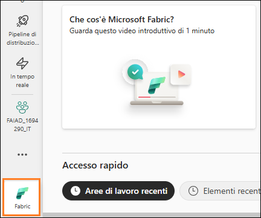

3. Si apre la finestra di dialogo delle esperienze in Fabric. Selezionare **Power BI**. Si aprirà la **Home page di Power BI**.

    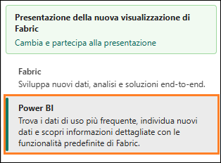

4. Selezionare **+ Nuovo report** dal menu in alto.

    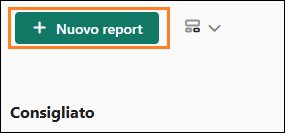

5. Si aprirà la schermata **Creare il primo report**. Saranno disponibili opzioni per creare un report usando Excel o il formato csv, per immettere dati manualmente o per selezionare un modello semantico pubblicato. Abbiamo creato un modello semantico nei lab precedenti, quindi possiamo usarlo. Selezionare l'opzione **Selezionare un modello semantico pubblicato**.

    

6. Scegliere un set di dati nel report quando si apre la pagina. Notare che sono presenti più opzioni. **Selezionare sm_FAIAD**.

    1. **sm_FAIAD:** questo è il modello semantico che abbiamo creato e che vogliamo usare per creare il report.

    2. **lh_FAIAD:** questo è il lakehouse in cui abbiamo inserito tutti i dati.

    3. **Units by Supplier:** questo è il set di dati che abbiamo creato mediante T-SQL.

7. Fare clic sulla **freccia accanto al pulsante Crea automaticamente il report**. Notare che vi sono due opzioni: Crea automaticamente il report e Crea un report vuoto. Vogliamo provare la creazione automatica, quindi selezioniamo **Crea automaticamente il report**.

    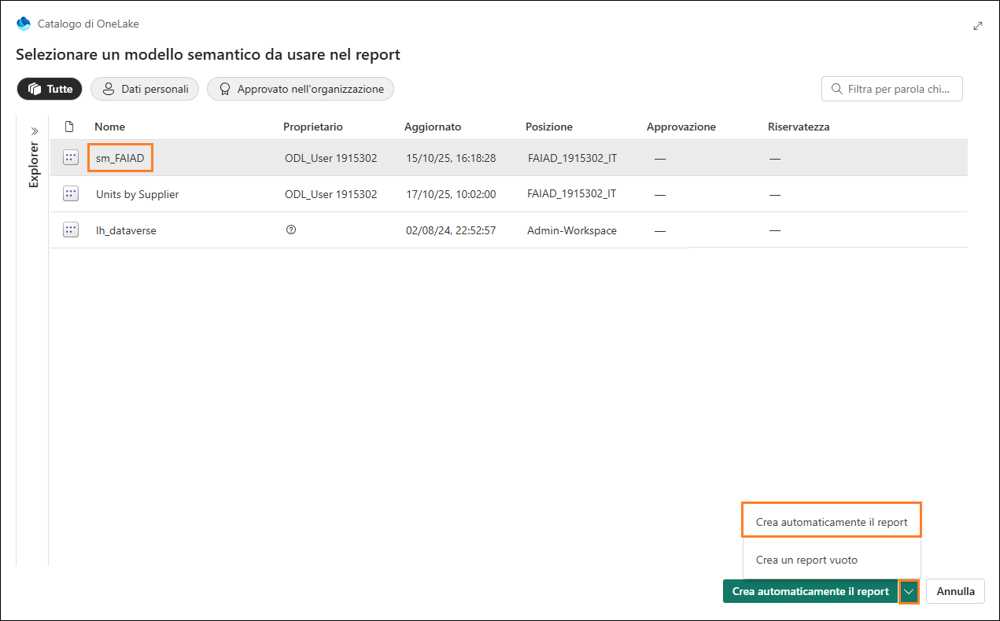

8. Power BI avvierà la creazione automatica del report. Quando il report è pronto, in alto a destra della schermata si apre una finestra di dialogo. Selezionare **Visualizza il report ora o verrà caricato automaticamente tra qualche secondo**.

    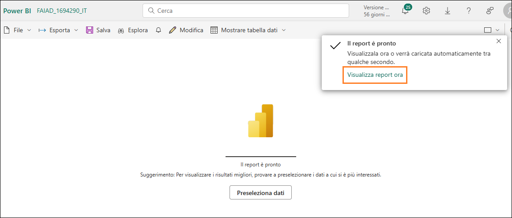

    **Checkpoint:** il report sarà simile a quello illustrato nello screenshot seguente. Sono presenti alcuni KPI e alcuni oggetti visivi sulle tendenze. Questo è buon inizio se si sta analizzando un nuovo modello ed è necessario un iniziare rapidamente.

    **Nota:** nel menu in alto è presente l'opzione per modificare il report o visualizzare i dati sotto forma di tabelle. Esplorare liberamente queste opzioni.

9. Salviamo il report. Nel menu in alto selezionare **Salva**.

10. Si apre la finestra di dialogo Salva report. Assegnare al report il nome **rpt_Sales_Auto_Report**
    **Nota:** all'inizio del nome del report aggiungiamo il prefisso rpt, ovvero l'abbreviazione di report.

11. Assicurarsi che il report sia salvato nell'area di lavoro **FAIAD_<nome utente>.**

12. Selezionare **Salva.**

    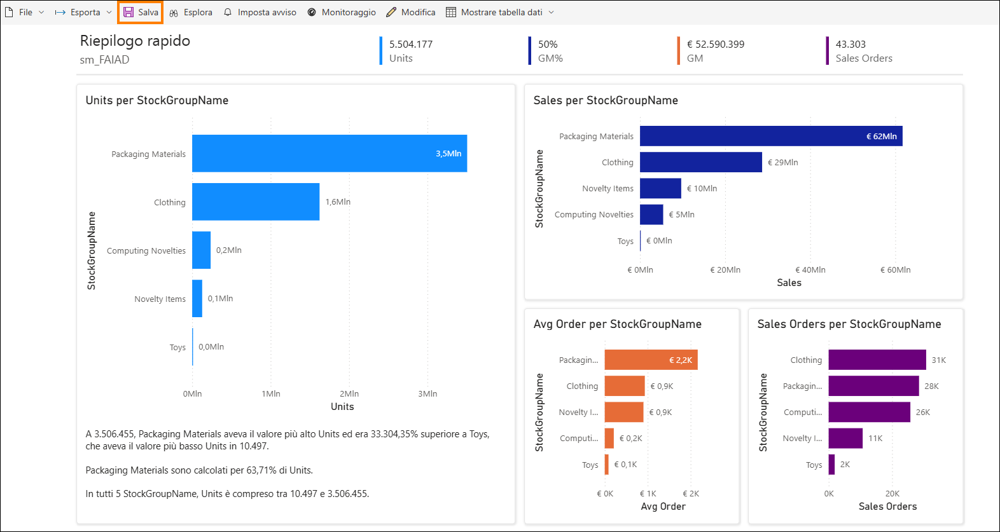

    **Nota:** il report creato automaticamente potrebbe avere un aspetto diverso poiché è stato "creato automaticamente". Dipende anche dalle relazioni e dalle misure create nel lab precedente (Lab 6).

    Lo screenshot precedente mostra come **potrebbe** apparire il report creato automaticamente se si fossero create tutte le relazioni e le misure, incluse le relazioni facoltative (Lab 6).

    Lo screenshot seguente mostra come **potrebbe** apparire il report creato automaticamente se non si fossero create le relazioni e le misure facoltative (Lab 6).

    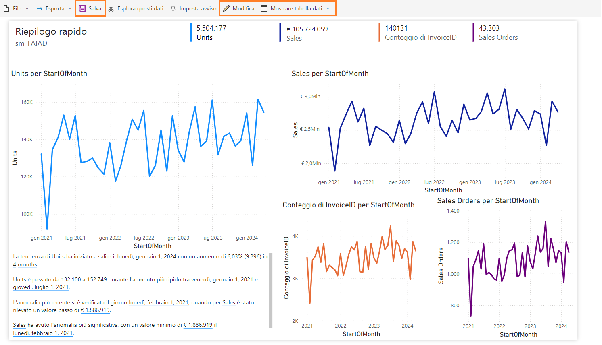

## Attività 2: Configurazione dello sfondo per un nuovo report

Creiamo un nuovo report usando un'area di disegno vuota.

1. Nel **pannello di sinistra** selezionare il nome dell'area di lavoro, **FAIAD_<nome utente>**, per tornare a essa.

2. Nel menu in alto selezionare **Nuovo elemento** -> **Report**. Si aprirà la pagina per creare il primo report.

    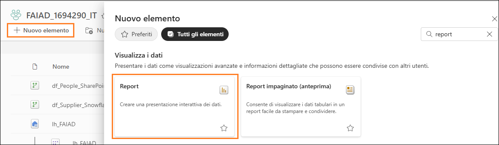

3. Fare clic su **Selezionare un modello semantico pubblicato** per poter scegliere il modello creato.

    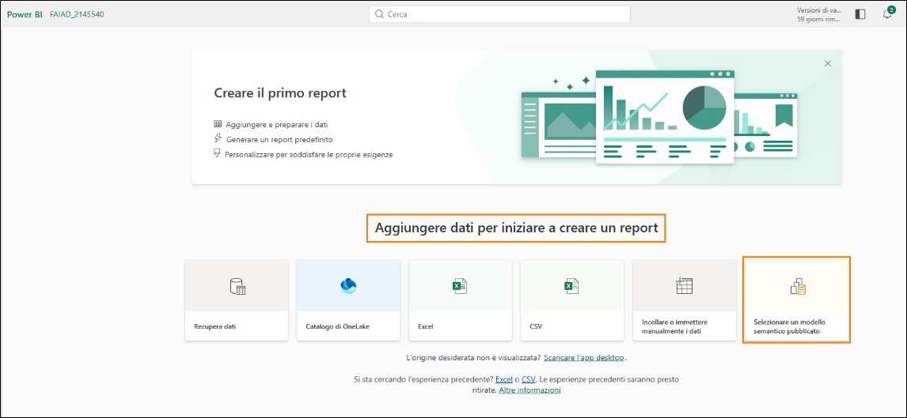

4. Scegliere un modello semantico da usare nella finestra di dialogo report che viene visualizzata. Selezionare **sm_FAIAD**.

5. Fare clic sulla **freccia accanto al pulsante Crea automaticamente il report**. Si verrà indirizzati a una pagina del report simile alla pagina del report Power BI Desktop.

    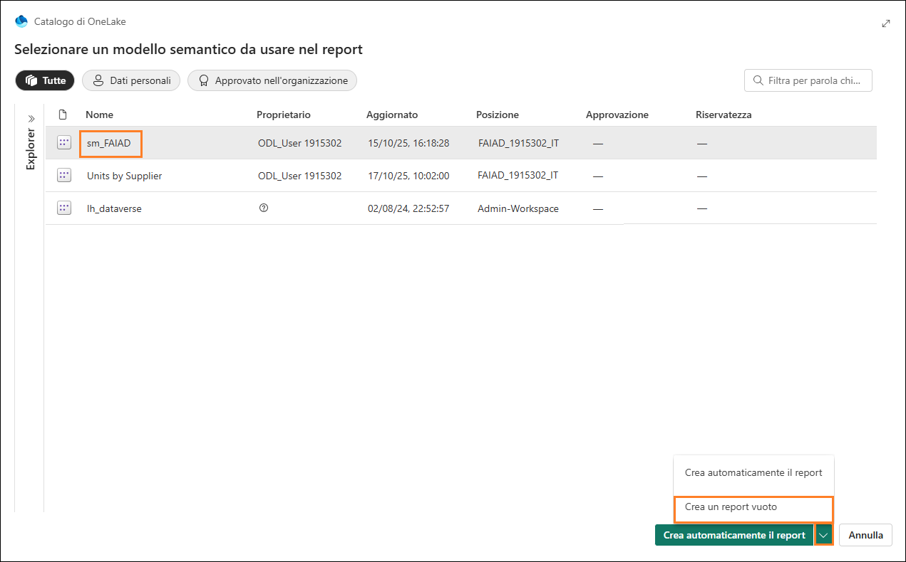

6. Se non lo si è ancora aperto, aprire il file **FAIAD.pbix** contenuto nella cartella **Reports** sul **desktop** dell'ambiente lab.

    Useremo questo report come riferimento. Inizieremo aggiungendo lo sfondo del canvas. Creeremo l'intestazione del report, aggiungeremo un paio di KPI e creeremo il grafico a linee Sales over time. Per risparmiare tempo, presupponendo che si abbia esperienza nella creazione di oggetti visivi in Power BI Desktop, non creeremo tutti gli oggetti visivi.

    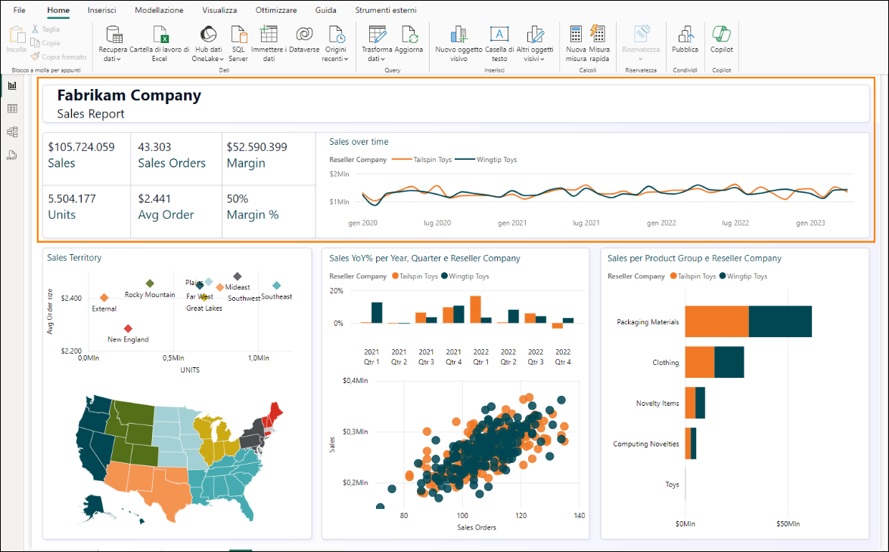

7. Tornare al **Power BI canvas** nel browser.

8. Selezionare l'icona **Formatta pagina** nel riquadro **Visualizzazioni**.

9. Espandere la sezione **Sfondo canvas**.

10. Selezionare **Sfoglia** dall'opzione **Immagine**. Si apre la finestra di dialogo Esplora file.

11. Andare alla cartella **Reports** sul **desktop** dell'ambiente lab.

12. Selezionare **Summary Background.png.**

13. Impostare l'elenco a discesa **Adattamento immagine** su **Adatta**.

14. Impostare Trasparenza su **0%**.

    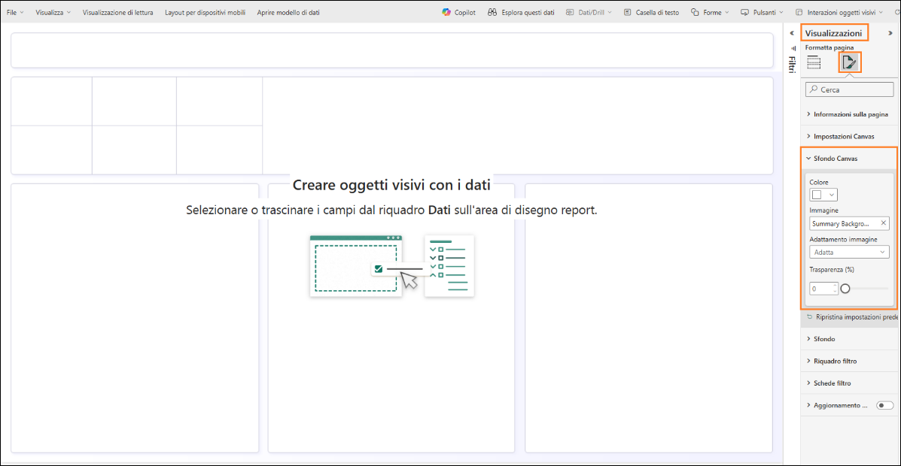

## Attività 3: Aggiunta dell'intestazione al report

1. Aggiungiamo l'intestazione nel margine superiore. Nel **menu** selezionare **Casella di testo**.

2. Immettere **Fabrikam Company** come prima riga nella casella di testo.

3. Immettere **Sales Report** come seconda riga nella casella di testo.

4. Evidenziare **Fabrikam Company** e impostare **Tipo di carattere** su **Segoe UI** e **Dimensioni carattere** su **18, grassetto**.

5. Evidenziare **Report vendite** e impostare **Tipo di carattere** su **Segoe UI** e **Dimensioni carattere** su **14**.

6. Con la **casella di testo selezionata**, nel riquadro Casella di testo Formato sulla destra **espandere** **Effetti**.

7. Impostare il dispositivo di scorrimento **Sfondo** su **Disattivato**.

8. Ridimensionare la **casella di testo per adattarla al margine superiore**.

    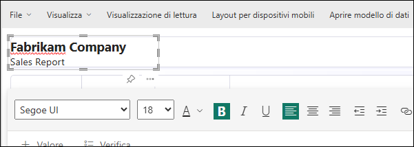

## Attività 4: Aggiunta di KPI al report

1. Aggiungiamo l'indicatore KPI delle vendite. Selezionare lo **spazio vuoto** nell'area di disegno per spostare lo stato attivo fuori dalla casella di testo.

2. Nella **sezione Visualizzazioni** selezionare l'oggetto visivo **scheda**.

3. Nella **sezione** **Dati** espandere la **tabella** **Sales**.

4. Selezionare la **misura Sales**.

    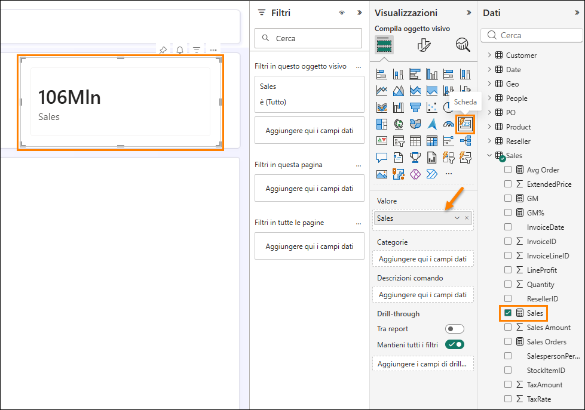

5. Con **l'oggetto visivo Scheda selezionato,** selezionare **l'icona Formatta oggetto visivo** dalla sezione **Visualizzazioni**.

6. Espandere la sezione **Callout**.

7. Selezionare il menu a discesa **Valore**. Modificare la dimensione del carattere su **12**.

    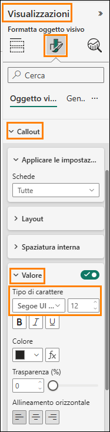

8. Con la sezione **Callout** ancora selezionata, espandere la sezione **Etichetta**.

9. Ridurre la **dimensione del carattere** a **10**.

10. Selezionare il menu a **discesa Colore**. Si apre la finestra di dialogo Tavolozza dei colori.

11. Selezionare **Altri colori**.

12. Impostare il valore Esadecimale su **#004753**.

    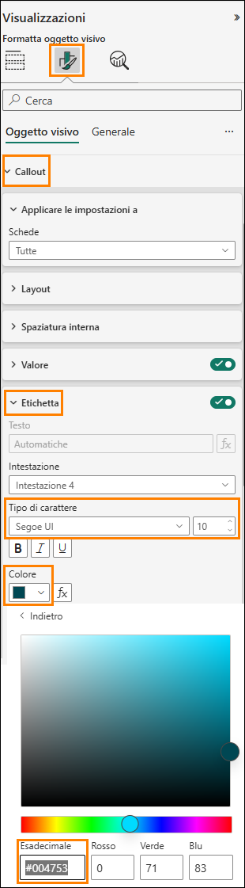

13. Espandere la sezione **Schede**.

14. Impostare il dispositivo di scorrimento **Barra evidenziatore** su **Disattivato**.

    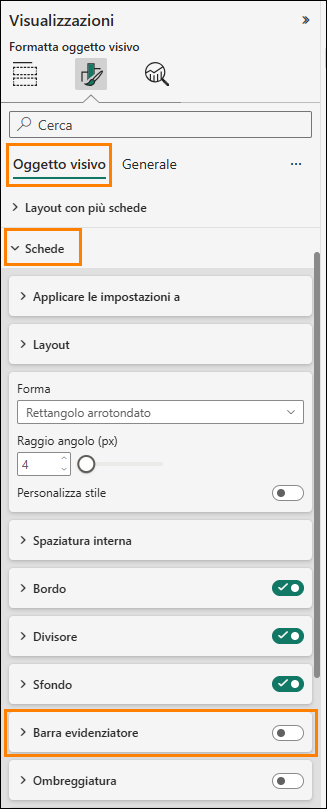

15. Selezionare **Generale** nel riquadro Visualizzazioni.

16. Espandere la **sezione** **Effetti**.

17. Impostare il dispositivo di scorrimento **Sfondo** su **Disattivato**.

18. Ridimensionare l'**oggetto visivo** e spostarlo nella **casella di sinistra come illustrato nello screenshot**.

    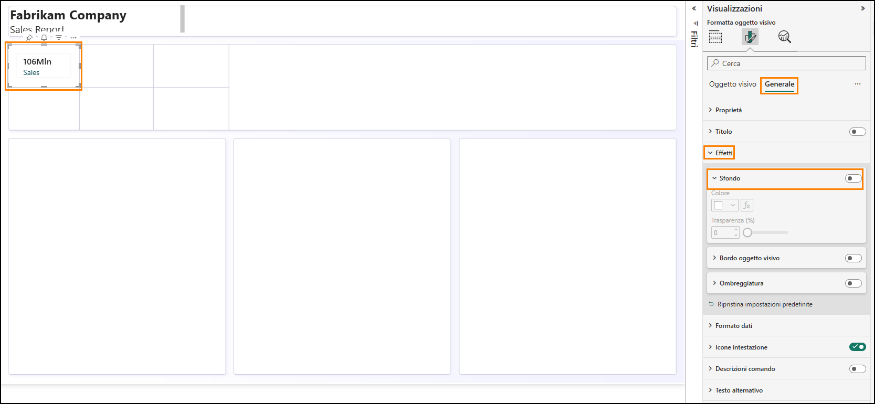

19. Ora si procederà all'aggiunta di un'altra scheda. Selezionare la **scheda Sales** appena creata. **Copiare** l'oggetto visivo selezionando **CTRL+C** dalla tastiera.

20. **Incollare** l'oggetto visivo premendo **CTRL+V** sulla tastiera. Notare che l'oggetto visivo viene incollato nel canvas.

21. Con il **nuovo oggetto visivo evidenziato**, in **riquadro Visualizzazioni -> Compila oggetto visivo -> Campi** rimuovere la misura **Sales**.

22. Nella sezione **Dati** espandere la tabella **Sales** e selezionare la misura **Units**.

23. Ridimensionare l'**oggetto visivo** e **posizionarlo nella casella sotto l'oggetto visivo Sales**.

    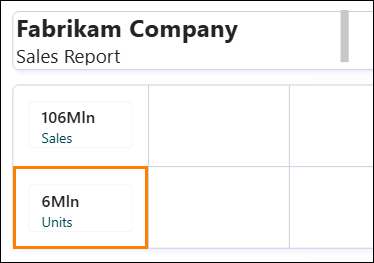

## Attività 5: Aggiunta di un grafico a linee al report

Creiamo un grafico a linee per visualizzare le vendite nel tempo per azienda rivenditrice.

1. Selezionare lo **spazio vuoto** nel canvas per spostare lo stato attivo fuori dall'oggetto visivo scheda con più righe.

2. Nella **sezione** **Visualizzazioni** selezionare **Grafico a linee**.

3. Nella **sezione** **Dati** espandere la tabella **Date**.

4. Selezionare il campo **Year**. Si noti che Year viene sommato per impostazione predefinita e aggiunto all'asse Y. Correggiamo.

    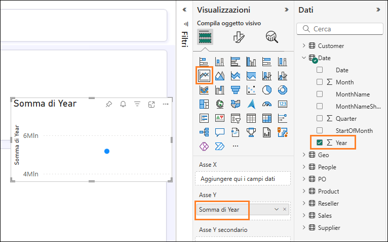

## Attività 6: Salvataggio del report

Salviamo il report prima di uscire da esso per apportare modifiche al modello.

1. Nel menu selezionare **File -> Salva**.

2. Si apre la finestra di dialogo Salva report. Assegnare al report il nome **rpt_Sales_Report**
    **Nota:** all'inizio del nome del report aggiungiamo il prefisso rpt, ovvero l'abbreviazione di report.

3. Assicurarsi che il report sia salvato nell'area di lavoro **FAIAD_<nome utente>.**

4. Selezionare **Salva.** Notare che il report è stato salvato ed è attiva la modalità di visualizzazione.

    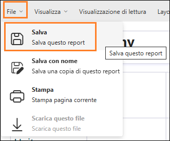

## Attività 7: Configurazione della colonna Year nella tabella Date

1. Dal **menu in alto** selezionare **Modifica** per tornare alla modalità di modifica.

    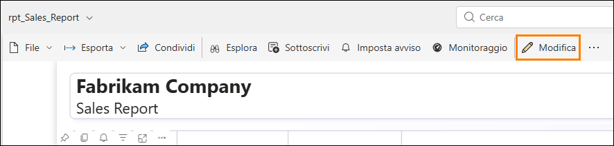

2. Dal **menu in alto,** selezionare **Apri modello semantico**. Notare che il modello semantico è aperto in una nuova finestra/scheda del browser.

    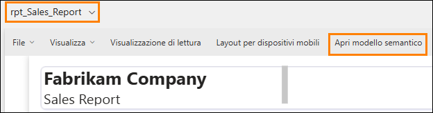

3. Nell'angolo in alto a destra passare alla modalità **Modifica**.

4. Dal pannello **Dati a destra** selezionare Tabelle.

5. Espandere la tabella **Date**.

6. Selezionare la colonna **Year**.

7. Nel riquadro **Proprietà** a sinistra espandere la sezione **Avanzate**.

8. Nell'elenco a discesa **Riepiloga per** selezionare **Nessuno**.

    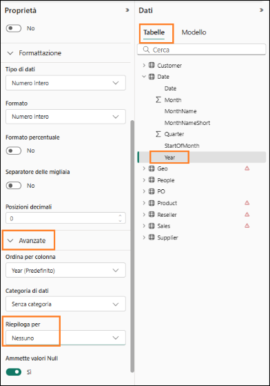

9. Tornare alla **finestra/scheda del report** del browser.

10. Nel **riquadro Dati** a destra espandere la tabella **Date**. Notare che Year non è un campo di somma.

11. Con l'**oggetto visivo grafico a linee selezionato**, **rimuovere Somma di Year** dall'asse Y.

12. Selezionare il campo **Year** per aggiungerlo all'**asse X**.

13. Espandere la tabella **Sales** e selezionare la **misura Sales**.

    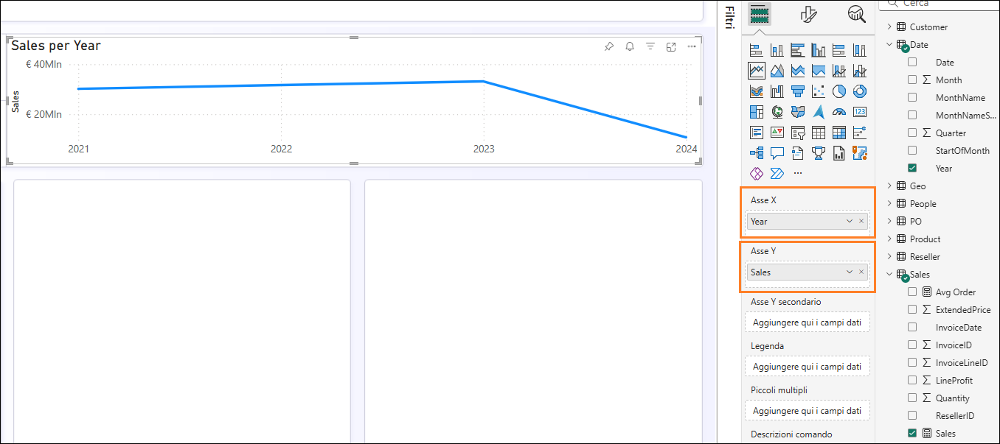

## Attività 8: Configurazione della colonna Month Name nella tabella Date

1. Aggiungiamo il mese al grafico. Nella tabella Date trascinare il campo **MonthNameShort** sotto **Year** sull'**asse** **X**. Notare che l'oggetto visivo è ordinato in base a Sales. Ordiniamolo in base a **MonthNameShort**.

2. Selezionare i **puntini di sospensione (…)** nell'angolo superiore destro dell'oggetto visivo.

3. Selezionare **Ordina asse -> Year Short_Month_Name**.

4. Selezionare i **puntini di sospensione (…)** nell'angolo superiore destro dell'oggetto visivo.

5. Selezionare **Ordina per -> Ordinamento crescente.**

    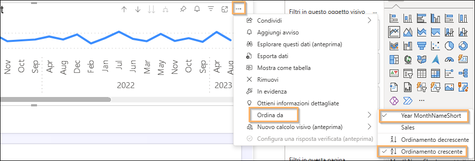

    **Nota:** i mesi sono ordinati in ordine alfabetico. Correggiamo.

    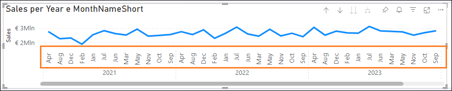

6. Tornare alla **finestra/scheda del browser** in cui è stato aperto il modello semantico.

7. Nel riquadro **Dati** espandere la tabella **Date**.

8. Selezionare la colonna **MonthNameShort**.

9. Nel riquadro **Proprietà** a sinistra espandere la sezione **Avanzate**.

10. Nell'elenco a discesa **Ordina per colonna** selezionare **Month**.

    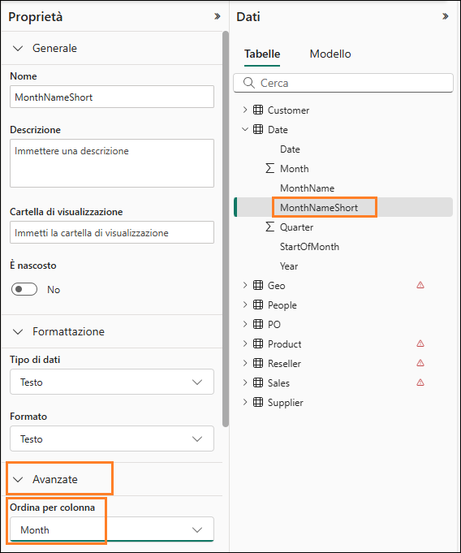

11. Tornare alla **finestra/scheda del report** del browser. Si noti che i mesi sono ordinati correttamente.

    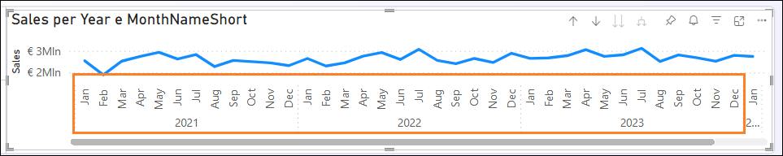

## Attività 9: Formattazione del grafico a linee

È molto semplice aggiornare il modello semantico durante la creazione dei report. Ciò fornisce un'interazione fluida come Power BI Desktop.

1. Con l'**oggetto visivo grafico a linee selezionato**, nella sezione **Dati** espandere la tabella **Reseller**.

2. Trascinare il campo **Reseller -> Reseller Company** nella sezione **Legenda**.

    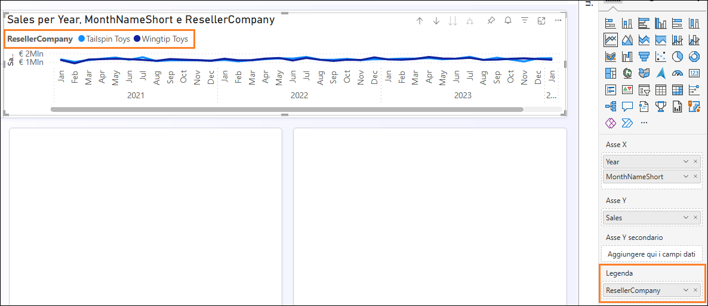

3. Con l'**oggetto visivo grafico a linee selezionato**, nella sezione **Visualizzazioni** selezionare l'icona **Formatta oggetto visivo -> Generale**.

4. Espandere la sezione **Titolo**.

5. Impostare il testo di **Titolo** su **Sales over time**.

6. Espandere la sezione **Effetti**.

7. Impostare il dispositivo di scorrimento **Sfondo** su **Disattivato**.

    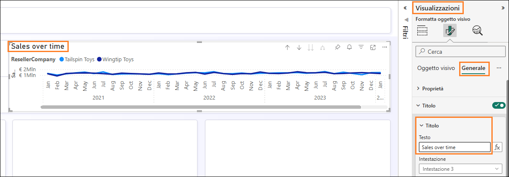

8. Nella sezione **Visualizzazione** selezionare l'icona **Formatta oggetto visivo -> Oggetto visivo**.

9. Espandere la sezione **Righe**.

10. In **Applica impostazioni a -> menu a discesa Serie** selezionare **Tailspin Toys**.

11. Espandere la sezione **Colore**.

12. Impostare il colore su **#F17925**

13. In **Applica impostazioni a -> menu a discesa Serie** selezionare **Wingtip Toys**.

14. Impostare il **colore** su **#004753**

15. Ridimensionare l'**oggetto visivo** e spostarlo nella **casella in alto a destra come illustrato nello screenshot**.

16. Scorrere verso destra l'oggetto visivo e **notare che sono presenti dati fino ad aprile 2024**.

    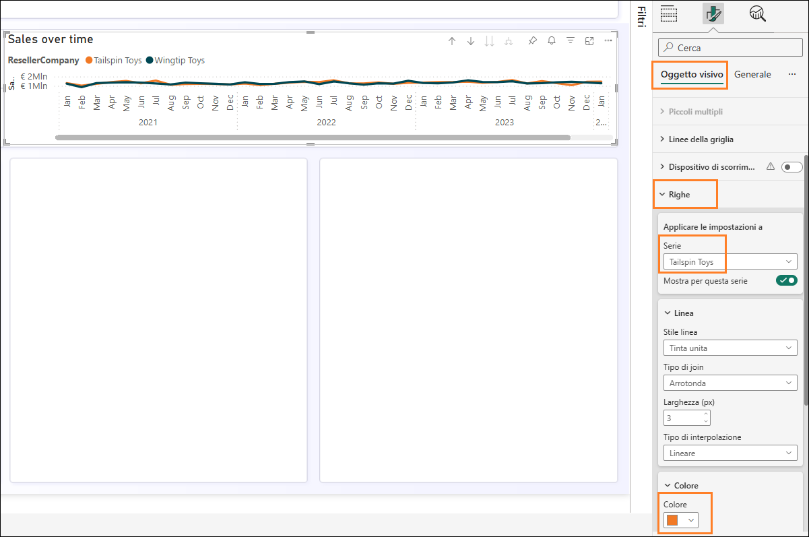

17. Per salvare il report, nel menu selezionare **File -> Salva**.

    Come indicato in precedenza, non creeremo tutti gli oggetti visivi in questo lab. Se si desidera, aggiungere ulteriori oggetti visivi.

## Attività 10: Connessione di Power BI Desktop al modello semantico

Vediamo ora quanto è semplice connettere Power BI Desktop al modello semantico e creare oggetti visivi.

1. Aprire il file **FAIADTemplate.pbix** presente nella cartella **Reports** sul **Desktop** dell'ambiente lab.

2. Dalla barra multifunzione selezionare **Home -> Catalogo OneLake -> Modelli semantici Power BI**.

    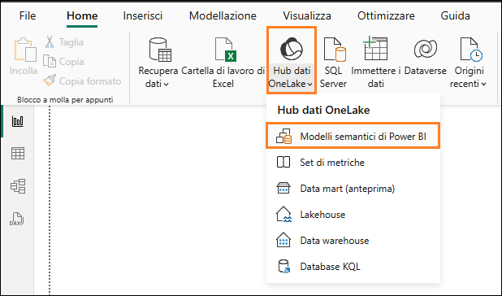

3. Si apre la finestra di dialogo dell'hub dei dati OneLake. Selezionare **sm_FAIAD**, il modello semantico creato.

4. Selezionare **Connetti**. Notare che nel riquadro Dati sono presenti le tabelle del modello semantico.

    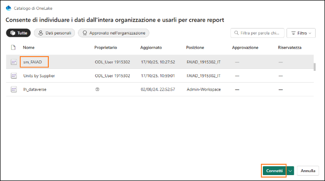

5. Nel **pannello di sinistra** selezionare **Vista modello**. Notare che possiamo visualizzare la relazione tra le tabelle.

    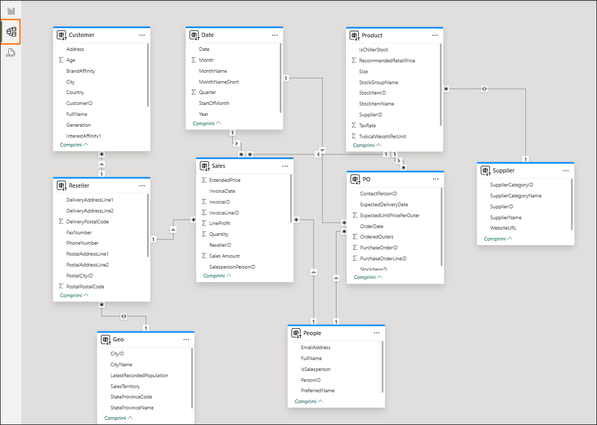

6. Nel **pannello di sinistra** selezionare **Vista report** per tornare alla vista del report.

7. Se non lo si è ancora fatto, aprire il file **FAIAD.pbix** contenuto nella cartella **Reports** sul **desktop** dell'ambiente lab.

8. Selezionare l'**oggetto visivo del titolo del report**.

9. Nella barra multifunzione selezionare **Home -> Copia**.

    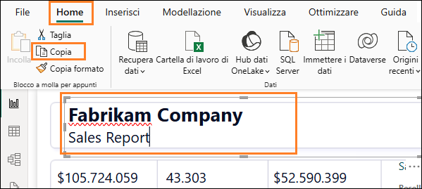

10. Andare a **FAIADTemplate.pbix** e selezionare il canvas del report.

11. Nella barra multifunzione selezionare **Home -> Incolla**.

    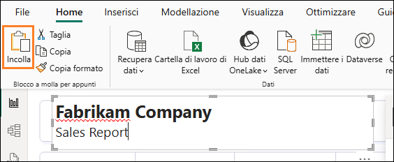

12. Seguendo la stessa procedura, copiare e incollare i **KPI di Sales e Units**. È possibile copiare e incollare insieme più oggetti visivi.

    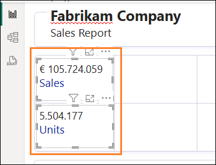

    Notare quanto sia facile copiare oggetti visivi da un report esistente e incollarli in un report che si collega al modello semantico. I nomi delle tabelle, delle colonne e delle misure devono essere gli stessi affinché la funzione Copia e incolla funzioni. In caso contrario potrebbe essere visualizzato un messaggio di errore, ma la soluzione è semplice.

13. Andare a **FAIAD.pbix** e selezionare il grafico a linee Sales nel tempo.

14. Nella barra multifunzione selezionare **Home -> Copia**.

15. Andare a **FAIADTemplate.pbix** e selezionare il canvas del report.

16. Nella barra multifunzione selezionare **Home -> Incolla**. Notare che il rendering dell'oggetto visivo non viene eseguito. Questo perché attualmente il modello semantico non crea una gerarchia a partire dal campo Date.

17. Correggiamo. Nel pannello **Visualizzazione**, sotto **Asse X**, eliminare **StartOfMonth**.

    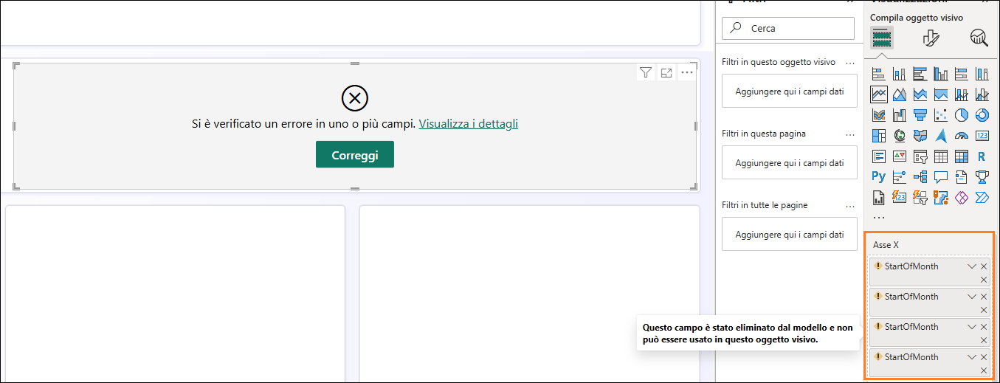

18. Dal **riquadro Dati** espandere la tabella Date.

19. Trascinare il campo **StartOfMonth** nell'**asse X**. Questa operazione permette di risolvere il problema dell'oggetto visivo. Ora però occorre formattare l'oggetto visivo.

    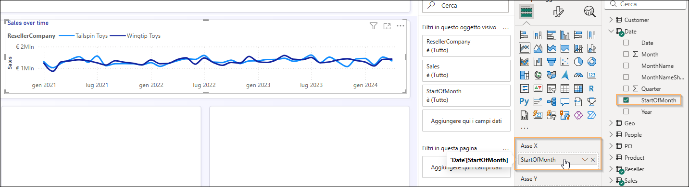

20. Per salvare il report, nella barra multifunzione selezionare **File -> Salva**.

## Attività 11: Aggiunta di nuovi dati per simulare la modalità Direct Lake

In genere, in modalità Import, dopo aver aggiornato i dati nell'origine è necessario aggiornare il modello di Power BI dopodiché vengono aggiornati i dati nel report. Con la modalità Direct Query, quando i dati vengono aggiornati nell'origine sono disponibili nel report Power BI. Tuttavia, la modalità Direct Query è in genere lenta. Per risolvere questo problema, Microsoft Fabric ha introdotto la modalità Direct Lake. Direct Lake è un percorso rapido per caricare i dati dal lake al motore di Power BI per poter procedere immediatamente con l'analisi.

Esploriamo lo scenario in cui i dati vengono aggiornati in ADLS Gen2 e le modifiche vengono immediatamente applicate al report Power BI senza dover eseguire alcun aggiornamento.

In uno scenario reale, i dati vengono aggiornati nell'origine. Poiché ci troviamo in un ambiente di formazione ambiente, simuleremo questa situazione. Disponiamo di dati sulle vendite fino ad aprile 2024. Aggiungiamo i dati sulle vendite di maggio 2024 creando un collegamento al file di maggio 2024 in ADLS Gen2 e aggiornando la vista Sales.

1. Tornare al **browser**.

2. Nell'angolo in basso a destra, fai clic sul **logo Fabric** e passa alla **visualizzazione Fabric**.

3. Selezionare **FAIAD_<nome utente>** nella barra dei menu di sinistra per andare alla home page dell'area di lavoro.

4. Selezionare **lh_FAIAD** per spostarsi nel lakehouse.

    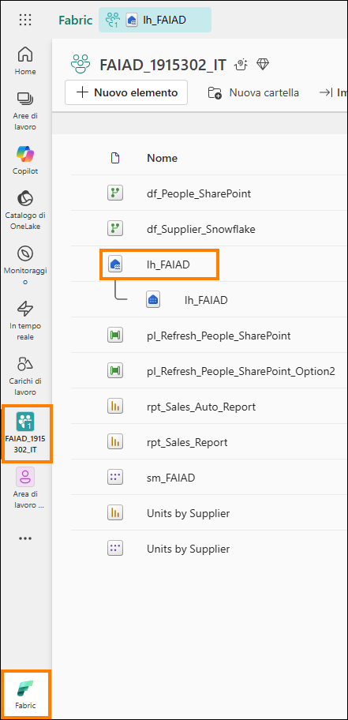

5. Dal **riquadro Explorer** a sinistra selezionare i **puntini di sospensione** accanto a **Tabelle**.

6. Selezionare **Nuovo collegamento**.

    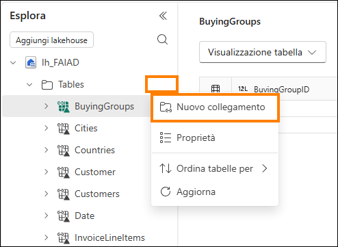

7. Viene visualizzata la finestra di dialogo Nuovo collegamento. In **Origini esterne** selezionare **Azure Data Lake Storage Gen2**.

    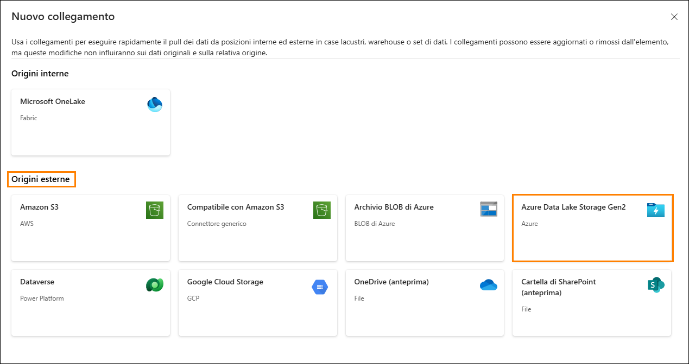

8. Poiché è stata creata una connessione in precedenza nei lab, non è necessario crearne una nuova e la connessione ADLS è presente tra quelle esistenti.

9. Se in precedenza non è stata creata alcuna connessione, fare clic su **Crea nuova connessione** e completare i passaggi seguenti:

10. In Impostazioni **connessione -> URL** immettere il seguente collegamento <https://stvnextblobstorage.dfs.core.windows.net/>fabrikam-sales

11. Selezionare **Avanti**.

    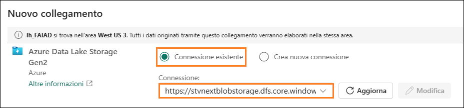

12. Verrà stabilita una connessione ad ADLS Gen2 con la struttura delle directory visualizzata nel pannello di sinistra. Espandere **Delta-Parquet-Format-FY25**.

13. Selezionare **Sales.Invoices_May**.

14. Selezionare **Avanti**.

    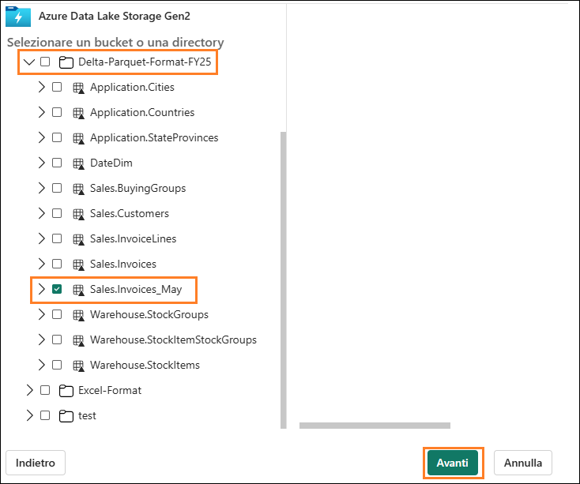

15. Si verrà indirizzati alla finestra di dialogo successiva, dove avremo la possibilità di modificare i nomi. Seleziona l' **icona** **Modifica** in Azioni per **Sales.Invoices_May**.

16. Rinominare **Sales.Invoices_May in InvoicesMay**.

17. Selezionare il **segno di spunta** accanto al nome per salvare la modifica.

18. Selezionare **Crea**.

    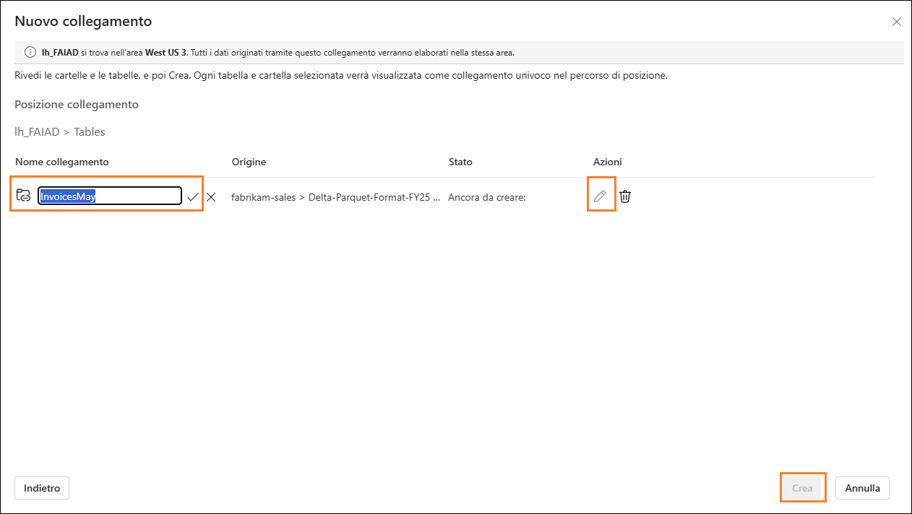

    Notare che nel **riquadro Explorer** a sinistra ora è presente la tabella InvoicesMay. Ora è necessario aggiornare la vista Sales.

19. In **alto a destra** della schermata selezionare **Lakehouse -> Endpoint di Analisi SQL**.

    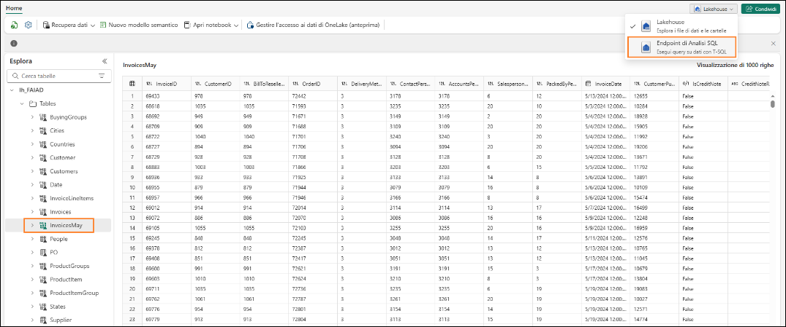

20. Nel menu in alto selezionare **Home -> Nuova query SQL**. Viene visualizzato un riquadro delle query SQL.

21. **Copiare il** codice di seguito e **incollarlo** nel riquadro della query SQL.

    ```sql
    ALTER VIEW [dbo].[Sales] AS (
    select [$Outer].[InvoiceLineID] as [InvoiceLineID],
        [$Outer].[InvoiceID] as [InvoiceID],
        [$Outer].[StockItemID] as [StockItemID],
        [$Outer].[Quantity] as [Quantity],
        [$Outer].[UnitPrice] as [UnitPrice],
        [$Outer].[TaxRate] as [TaxRate],
        [$Outer].[TaxAmount] as [TaxAmount],
        [$Outer].[LineProfit] as [LineProfit],
        [$Outer].[ExtendedPrice] as [ExtendedPrice],
        [$Outer].[CustomerID] as [ResellerID],
        [$Outer].[SalespersonPersonID] as [SalespersonPersonID],
        [$Outer].[InvoiceDate] as [InvoiceDate],
        [$Outer].[t0_0] as [Sales Amount]
    from 
    (
        select [_].[InvoiceLineID] as [InvoiceLineID],
            [_].[InvoiceID] as [InvoiceID],
            [_].[StockItemID] as [StockItemID],
            [_].[Quantity] as [Quantity],
            [_].[UnitPrice] as [UnitPrice],
            [_].[TaxRate] as [TaxRate],
            [_].[TaxAmount] as [TaxAmount],
            [_].[LineProfit] as [LineProfit],
            [_].[ExtendedPrice] as [ExtendedPrice],
            [_].[CustomerID] as [CustomerID],
            [_].[SalespersonPersonID] as [SalespersonPersonID],
            [_].[InvoiceDate] as [InvoiceDate],
            [_].[ExtendedPrice] - [_].[TaxAmount] as [t0_0]
        from 
        (
            select [$Outer].[InvoiceLineID],
                [$Outer].[InvoiceID],
                [$Outer].[StockItemID],
                [$Outer].[Quantity],
                [$Outer].[UnitPrice],
                [$Outer].[TaxRate],
                [$Outer].[TaxAmount],
                [$Outer].[LineProfit],
                [$Outer].[ExtendedPrice],
                [$Inner].[CustomerID],
                [$Inner].[SalespersonPersonID],
                [$Inner].[InvoiceDate]
            from [lh_FAIAD].[dbo].[InvoiceLineItems] as [$Outer]
            inner join 
            (
                select [_].[InvoiceID] as [InvoiceID2],
                    [_].[CustomerID] as [CustomerID],
                    [_].[BillToResellerID] as [BillToResellerID],
                    [_].[OrderID] as [OrderID],
                    [_].[DeliveryMethodID] as [DeliveryMethodID],
                    [_].[ContactPersonID] as [ContactPersonID],
                    [_].[AccountsPersonID] as [AccountsPersonID],
                    [_].[SalespersonPersonID] as [SalespersonPersonID],
                    [_].[PackedByPersonID] as [PackedByPersonID],
                    [_].[InvoiceDate] as [InvoiceDate],
                    [_].[CustomerPurchaseOrderNumber] as [CustomerPurchaseOrderNumber],
                    [_].[IsCreditNote] as [IsCreditNote],
                    [_].[CreditNoteReason] as [CreditNoteReason],
                    [_].[Comments] as [Comments],
                    [_].[DeliveryInstructions] as [DeliveryInstructions],
                    [_].[InternalComments] as [InternalComments],
                    [_].[TotalDryItems] as [TotalDryItems],
                    [_].[TotalChillerItems] as [TotalChillerItems],
                    [_].[DeliveryRun] as [DeliveryRun],
                    [_].[RunPosition] as [RunPosition],
                    [_].[ReturnedDeliveryData] as [ReturnedDeliveryData],
                    [_].[ConfirmedDeliveryTime] as [ConfirmedDeliveryTime],
                    [_].[ConfirmedReceivedBy] as [ConfirmedReceivedBy],
                    [_].[LastEditedBy] as [LastEditedBy2],
                    [_].[LastEditedWhen] as [LastEditedWhen2]
                from 
                (
                    select [$Table].[InvoiceID] as [InvoiceID],
                        [$Table].[CustomerID] as [CustomerID],
                        [$Table].[BillToResellerID] as [BillToResellerID],
                        [$Table].[OrderID] as [OrderID],
                        [$Table].[DeliveryMethodID] as [DeliveryMethodID],
                        [$Table].[ContactPersonID] as [ContactPersonID],
                        [$Table].[AccountsPersonID] as [AccountsPersonID],
                        [$Table].[SalespersonPersonID] as [SalespersonPersonID],
                        [$Table].[PackedByPersonID] as [PackedByPersonID],
                        [$Table].[InvoiceDate] as [InvoiceDate],
                        [$Table].[CustomerPurchaseOrderNumber] as [CustomerPurchaseOrderNumber],
                        [$Table].[IsCreditNote] as [IsCreditNote],
                        [$Table].[CreditNoteReason] as [CreditNoteReason],
                        [$Table].[Comments] as [Comments],
                        [$Table].[DeliveryInstructions] as [DeliveryInstructions],
                        [$Table].[InternalComments] as [InternalComments],
                        [$Table].[TotalDryItems] as [TotalDryItems],
                        [$Table].[TotalChillerItems] as [TotalChillerItems],
                        [$Table].[DeliveryRun] as [DeliveryRun],
                        [$Table].[RunPosition] as [RunPosition],
                        [$Table].[ReturnedDeliveryData] as [ReturnedDeliveryData],
                        [$Table].[ConfirmedDeliveryTime] as [ConfirmedDeliveryTime],
                        [$Table].[ConfirmedReceivedBy] as [ConfirmedReceivedBy],
                        [$Table].[LastEditedBy] as [LastEditedBy],
                        [$Table].[LastEditedWhen] as [LastEditedWhen]
                    from [lh_FAIAD].[dbo].[Invoices] as [$Table]
                    union all select [$Table].[InvoiceID] as [InvoiceID],
                        [$Table].[CustomerID] as [CustomerID],
                        [$Table].[BillToResellerID] as [BillToResellerID],
                        [$Table].[OrderID] as [OrderID],
                        [$Table].[DeliveryMethodID] as [DeliveryMethodID],
                        [$Table].[ContactPersonID] as [ContactPersonID],
                        [$Table].[AccountsPersonID] as [AccountsPersonID],
                        [$Table].[SalespersonPersonID] as [SalespersonPersonID],
                        [$Table].[PackedByPersonID] as [PackedByPersonID],
                        [$Table].[InvoiceDate] as [InvoiceDate],
                        [$Table].[CustomerPurchaseOrderNumber] as [CustomerPurchaseOrderNumber],
                        [$Table].[IsCreditNote] as [IsCreditNote],
                        [$Table].[CreditNoteReason] as [CreditNoteReason],
                        [$Table].[Comments] as [Comments],
                        [$Table].[DeliveryInstructions] as [DeliveryInstructions],
                        [$Table].[InternalComments] as [InternalComments],
                        [$Table].[TotalDryItems] as [TotalDryItems],
                        [$Table].[TotalChillerItems] as [TotalChillerItems],
                        [$Table].[DeliveryRun] as [DeliveryRun],
                        [$Table].[RunPosition] as [RunPosition],
                        [$Table].[ReturnedDeliveryData] as [ReturnedDeliveryData],
                        [$Table].[ConfirmedDeliveryTime] as [ConfirmedDeliveryTime],
                        [$Table].[ConfirmedReceivedBy] as [ConfirmedReceivedBy],
                        [$Table].[LastEditedBy] as [LastEditedBy],
                        [$Table].[LastEditedWhen] as [LastEditedWhen]
                    from [lh_FAIAD].[dbo].[InvoicesMay] as [$Table]
                ) as [_]
            ) as [$Inner] on ([$Outer].[InvoiceID] = [$Inner].[InvoiceID2] or [$Outer].[InvoiceID] is null and [$Inner].[InvoiceID2] is null)
        ) as [_]
    ) as [$Outer]
    where exists 
    (
        select 1
        from 
        (
            select [ResellerID]
            from [lh_FAIAD].[dbo].[Reseller] as [$Table]
        ) as [$Inner]
        where [$Outer].[CustomerID] = [$Inner].[ResellerID] or [$Outer].[CustomerID] is null and [$Inner].[ResellerID] is null
    )
    )
    ```

22. Dal menu della query visiva selezionare **Esegui** per eseguire il codice.

    Una volta eseguito il codice, abbiamo aggiornato la tabella Sales per includere i dati di maggio 2024.

    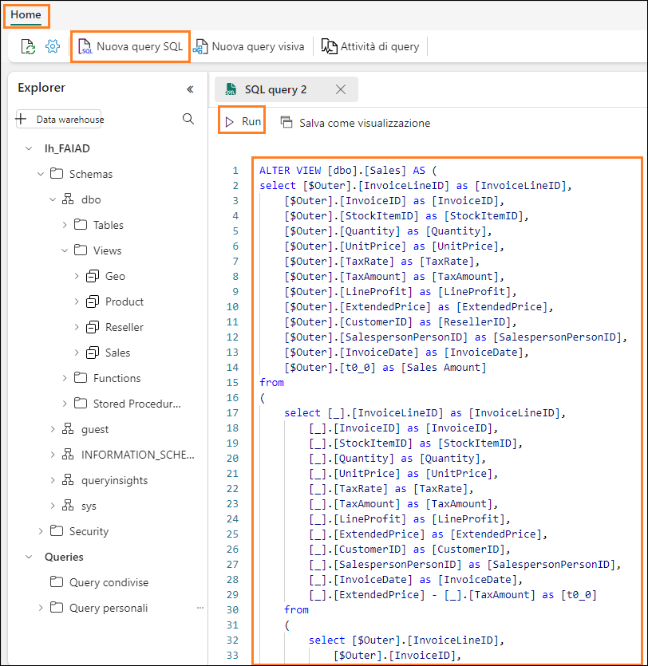

23. Selezionare **rpt_Sales_Report** nella barra dei menu di sinistra per tornare al report.

24. Dal menu in alto selezionare l **'icona Aggiorna**. Notare che ora nel grafico a linee sono presenti dati per maggio 2024. Inoltre, notare che l'importo delle vendite è aumentato.

    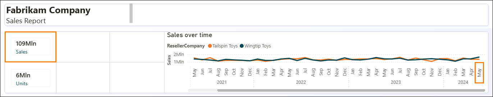

    Non è necessario aggiornare il modello di dati e il report quando i dati subiscono delle modifiche. Questo è il vantaggio di Direct Lake e Direct Query.

    Ricontrolliamo le problematiche elencate nell'esposizione del problema:

    - **È necessario aggiornare il set di dati almeno tre volte al giorno per adattarsi ai diversi tempi di aggiornamento delle diverse origini dati.**

    Abbiamo risolto questo problema usando Direct Lake. Ogni singolo flusso di dati viene aggiornato in base alla propria pianificazione. Non è necessario aggiornare i set di dati né i report.

    - **Le operazioni di aggiornamento richiedono molto tempo in quanto è necessario eseguire un aggiornamento completo ogni volta per acquisire eventuali aggiornamenti dei sistemi di origine.**

    Abbiamo risolto anche questo problema usando Direct Lake. Ogni singolo flusso di dati viene aggiornato in base alla propria pianificazione. Non è necessario aggiornare i set di dati né il report, pertanto non è richiesto un aggiornamento completo.

    - **Se si verificano errori in qualsiasi delle origini dati da cui si estraggono i dati, l'aggiornamento del set di dati si interrompe. Spesso il file dei dipendenti non viene caricato in tempo e ciò causa l'interruzione dell'aggiornamento del set di dati.**

    Le pipeline aiutano a risolvere il problema, consentendo di provare più volte a eseguire l'aggiornamento a intervalli diversi.

    - **Eventuali modifiche al modello di dati richiedono molto tempo in quanto Power Query richiede molto tempo per l'aggiornamento delle anteprime, date le dimensioni elevate dei dati e le trasformazioni complesse.**

    Abbiamo capito che i flussi di dati e i lakehouse sono efficienti e facili da modificare. In genere, il caricamento dell'anteprima nei flussi di dati e nei lakehouse non richiede molto tempo.

    - **È necessario un PC Windows per usare Power BI Desktop anche se lo standard aziendale è Mac.**

    Microsoft Fabric è un'offerta SaaS. Tutto ciò di cui abbiamo bisogno è un browser per accedere al servizio. Non dobbiamo installare alcun software nei nostri desktop.

# Pulizia dell'ambiente lab

Quando si è pronti a eseguire la pulizia dell'ambiente lab, effettuare i passaggi seguenti.

1. Selezionare l'area di lavoro **FAIAD_<nome utente>** nel pannello di sinistra per andare alla home page dell'area di lavoro.

2. Dal menu in alto selezionare **Area di lavoro e impostazioni**.

    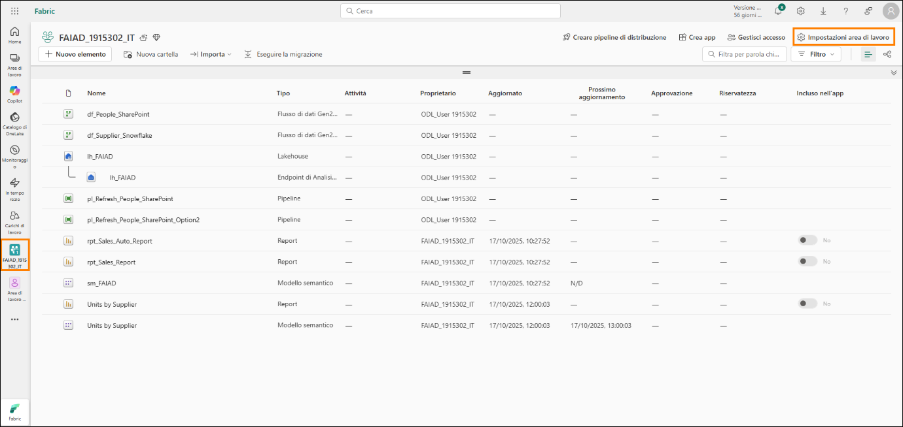

3. Si apre la finestra di dialogo Impostazioni area di lavoro. Nella sezione Generale scorrere verso il basso.

4. Selezionare **Rimuovere questa area di lavoro**.

5. Si apre la finestra di dialogo Eliminare l'area di lavoro?. Selezionare **Elimina**.

    In questo modo si elimineranno l'area di lavoro e tutti gli elementi che contiene.

    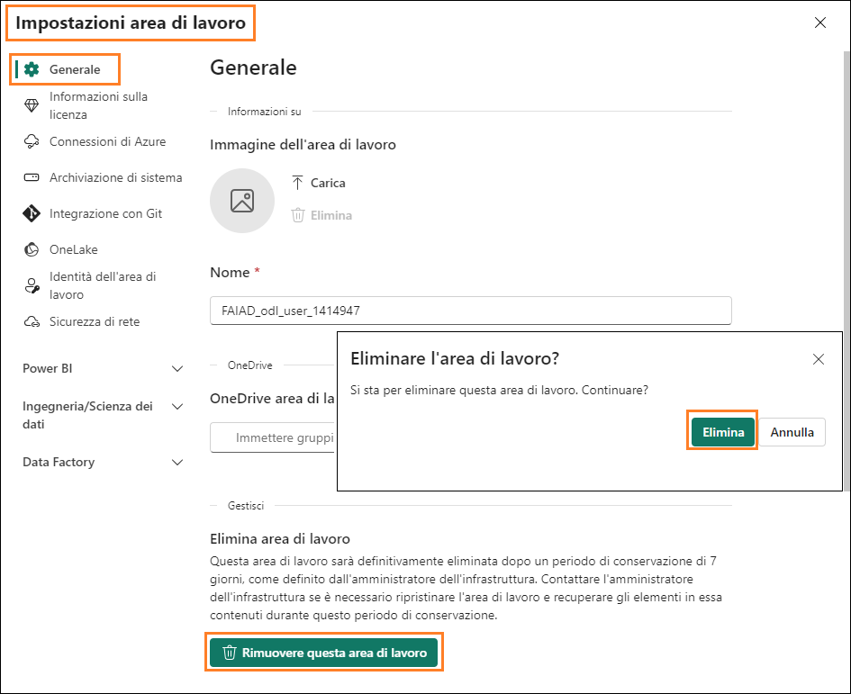

# Riferimenti

Fabric Analyst in a Day (FAIAD) presenta alcune delle funzionalità chiave disponibili in Microsoft Fabric. Nel menu di servizio, la sezione Guida (?) include collegamenti ad alcune risorse utili.


Di seguito sono riportate ulteriori risorse utili che consentiranno di progredire nell'uso di Microsoft Fabric.

- Vedere il post di blog per leggere l'[annuncio completo sulla disponibilità generale di Microsoft Fabric](https://aka.ms/Fabric-Hero-Blog-Ignite23)

- Esplorare Fabric attraverso la [Presentazione guidata](https://aka.ms/Fabric-GuidedTour)

- Iscriversi alla [versione di valutazione gratuita di Microsoft Fabric](https://aka.ms/try-fabric)

- Visitare il [sito Web di Microsoft Fabric](https://aka.ms/microsoft-fabric)

- Acquisire nuove competenze esplorando i [moduli di apprendimento su Fabric](https://aka.ms/learn-fabric)

- Consultare la [documentazione tecnica di Fabric](https://aka.ms/fabric-docs)

- Leggere l'[e-book gratuito introduttivo a Fabric](https://aka.ms/fabric-get-started-ebook)

- Unirsi alla [community di Fabric](https://aka.ms/fabric-community) per pubblicare domande, condividere feedback e imparare dagli altri

Leggere i blog di annunci più approfonditi sull'esperienza in Fabric:

- [Blog sull'esperienza Data Factory in Fabric](https://aka.ms/Fabric-Data-Factory-Blog)

- [Blog sull'esperienza Synapse Data Engineering in Fabric](https://aka.ms/Fabric-DE-Blog)

- [Blog sull'esperienza Synapse Data Science in Fabric](https://aka.ms/Fabric-DS-Blog)

- [Blog sull'esperienza Synapse Data Warehousing in Fabric](https://aka.ms/Fabric-DW-Blog)

- [Blog sull'esperienza Synapse Real-Time Analytics in Fabric](https://aka.ms/Fabric-RTA-Blog)

- [Blog di annunci di Power BI](https://aka.ms/Fabric-PBI-Blog)

- [Blog sull'esperienza Data Activator in Fabric](https://aka.ms/Fabric-DA-Blog)

- [Blog su amministrazione e governance in Fabric](https://aka.ms/Fabric-Admin-Gov-Blog)

- [Blog su OneLake in Fabric](https://aka.ms/Fabric-OneLake-Blog)

- [Blog sull'integrazione di Dataverse e Microsoft Fabric](https://aka.ms/Dataverse-Fabric-Blog)

© 2026 Microsoft Corporation. Tutti i diritti sono riservati.

L'uso della demo/del lab implica l'accettazione delle seguenti condizioni:

La tecnologia/le funzionalità descritte nella demo/nel lab sono fornite da Microsoft Corporation allo scopo di ottenere feedback dall'utente e offrire un'esperienza di apprendimento. L'utilizzo della demo/del lab è consentito solo per la valutazione delle caratteristiche e delle funzionalità di tale tecnologia e per l'invio di feedback a Microsoft. L'utilizzo per qualsiasi altro scopo non è consentito. È vietato modificare, copiare, distribuire, trasmettere, visualizzare, eseguire, riprodurre, pubblicare, concedere in licenza, usare per la creazione di lavori derivati, trasferire o vendere questa demo/questo lab o parte di essi.

SONO ESPLICITAMENTE PROIBITE LA COPIA E LA RIPRODUZIONE DELLA DEMO/DEL LAB (O DI QUALSIASI PARTE DI ESSI) IN QUALSIASI ALTRO SERVER O IN QUALSIASI ALTRA POSIZIONE PER ULTERIORE RIPRODUZIONE O RIDISTRIBUZIONE.

QUESTA DEMO/QUESTO LAB RENDONO DISPONIBILI TECNOLOGIE SOFTWARE/FUNZIONALITÀ DI PRODOTTO SPECIFICHE, INCLUSI NUOVI CONCETTI E NUOVE FUNZIONALITÀ POTENZIALI, IN UN AMBIENTE SIMULATO, CON UN'INSTALLAZIONE E UNA CONFIGURAZIONE PRIVE DI COMPLESSITÀ, PER GLI SCOPI DESCRITTI IN PRECEDENZA. LA TECNOLOGIA/I CONCETTI RAPPRESENTATI IN QUESTA DEMO/IN QUESTO LAB POTREBBERO NON CONTENERE LE FUNZIONALITÀ COMPLETE E IL LORO FUNZIONAMENTO POTREBBE NON ESSERE LO STESSO DELLA VERSIONE FINALE. È ANCHE POSSIBILE CHE UNA VERSIONE FINALE DI TALI FUNZIONALITÀ O CONCETTI NON VENGA RILASCIATA. L'ESPERIENZA D'USO DI TALI CARATTERISTICHE E FUNZIONALITÀ PUÒ INOLTRE RISULTARE DIVERSA IN UN AMBIENTE FISICO.

**FEEDBACK.** L'invio a Microsoft di feedback sulle caratteristiche, sulle funzionalità e/o sui concetti della tecnologia descritti in questa demo/questo lab implica la concessione a Microsoft, a titolo gratuito, del diritto di utilizzare, condividere e commercializzare tale feedback in qualsiasi modo e per qualsiasi scopo. Implica anche la concessione a titolo gratuito a terze parti del diritto di utilizzo di eventuali brevetti necessari per i loro prodotti, le loro tecnologie e i loro servizi al fine di utilizzare o interfacciarsi ai componenti software o ai servizi Microsoft specifici che includono il feedback. L'utente si impegna a non inviare feedback la cui inclusione all'interno di software o documentazione Microsoft imponga a Microsoft di concedere in licenza a terze parti tale software o documentazione. Questi diritti sussisteranno anche dopo la scadenza del presente contratto.

CON LA PRESENTE MICROSOFT CORPORATION NON RICONOSCE ALCUNA GARANZIA O CONDIZIONE RELATIVAMENTE ALLA DEMO/AL LAB, INCLUSE TUTTE LE GARANZIE E CONDIZIONI DI COMMERCIABILITÀ, DI FATTO ESPRESSE, IMPLICITE O PRESCRITTE DALLA LEGGE, ADEGUATEZZA PER UNO SCOPO SPECIFICO, TITOLARITÀ E NON VIOLABILITÀ. MICROSOFT NON OFFRE GARANZIE O RAPPRESENTAZIONI IN RELAZIONE ALL'ACCURATEZZA DEI RISULTATI E DELL'OUTPUT DERIVANTI DALL'USO DELLA DEMO/DEL LAB O ALL'ADEGUATEZZA DELLE INFORMAZIONI CONTENUTE NELLA DEMO/NEL LAB PER QUALSIASI SCOPO.

**CLAUSOLA DI RESPONSABILITÀ**

Questa demo/questo lab contiene solo una parte delle nuove funzionalità e dei miglioramenti in Microsoft Power BI. Alcune funzionalità potrebbero cambiare nelle versioni future del prodotto. In questa demo/in questo lab si apprendono alcune delle nuove funzionalità, ma non tutte.
