# Microsoft Fabric - Fabric Analyst in a Day

## 目次

- はじめに
- ラボ資格情報:
- Snowflake のログインの問題のトラブルシューティング
- ラボへのリンク:
- データフロー テンプレートをインポートする:
- データフロー テンプレートからインポートする前に考慮する必要があること
- データフロー テンプレートをインポートする方法
- T-SQL を使用してビューを作成する
- 予測 ML のデモ
- 要件
- ノートブックを作成する方法
- レイクハウスをノートブックに追加する
- Python ライブラリをインライン インストールする
- コードを実行して予測を作成する
- Initialize Spark session
- Load data from your specific Spark table
- Aggregate data to monthly level
- Convert to Pandas DataFrame and prepare for Prophet
- Fit the Prophet model
- Create a DataFrame for future predictions (e.g., next 12 months)
- Forecast
- Plotting the forecast
- Data Activator のデモ
- 要件
- シナリオ
- Sales Variance % メジャーを追加する
- テーブル視覚化を作成する
- Activator の作成
- Activator の概要
- テスト アラートを送信する
- セマンティック リンク デモ
- 要件
- シナリオ
- ベスト プラクティス アナライザー
- メモリ アナライザー

fワークスペース設定を選択するスクリーンショット

# **はじめに**

このドキュメントでは、次の内容についてガイドラインを提供します。

- ラボ資格情報

- データフロー テンプレートをインポートする方法

- 予測 ML のデモに関する手順

- Data Activator のデモに関する手順

- Data Mirroring のデモに関する手順

**免責事項:** 製品は日々変更されているため、一部のスクリーンショットが最新でない場合があることに注意してください。次回更新時に修正できるよう取り組んでまいります。

# **ラボ資格情報:**

出席者のいずれかが別の環境でラボを完了することを選択した場合、共有する必要がある資格情報を次に示します。

出席者は、Dataverse および SharePoint に接続するためにラボ アカウントに関連付けられたユーザー名とパスワードが必要になります。

- **ユーザー名:** TE_SNOWFLAKE1

- **パスワード:** 8UpfRpExVDXv2AC1

- **SAS トークン:\**
?sv=2023-01-03&ss=btqf&srt=sco&st=2025-06-30T10%3A15%3A46Z&se=2026-06-30T10%3A15%3A00Z&sp=rl&sig=hVeyxY4F72YVH3X%2BlnIvVTg8M%2FwZgLIhDzBgHlv1580%3D

**注:** 環境の詳細にある資格情報を使用して Snowflake に接続する際に問題が発生した場合は、下記の資格情報を使用してください。

o **Snowflake ユーザー名:** SNOWFLAKE_BACKUP

o **Snowflake パスワード:** 8UpfRpExVDXv2AC1

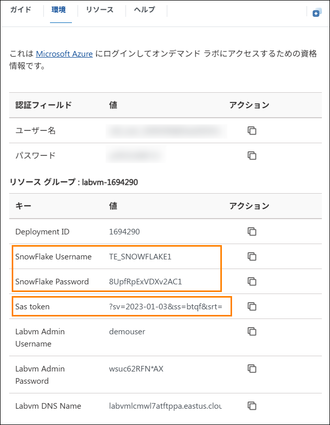

### Snowflake のログインの問題のトラブルシューティング

出席者が Snowflake にログインするときに問題が発生する場合は、次の手順に従ってください。ここでは、エラーについて詳しく説明します。

1. 新しいブラウザー ウィンドウを開きます。**dlhdzca-bab11165.snowflakecomputing.com** に移動します。これは、ここで使用している Snowflake サーバーです。

2. **資格情報**を入力します。エラーがある場合は、下のスクリーンショットに示すように、詳細なエラーの説明が表示されます。

    

3. エラーが解決しない場合は、**Snowflake のデータ**を** Azure Data Lake で入手**でき、データフロー テンプレート (**df_Supplier_ADLSGen2.pqt**) が **C:\FAIAD\Solutions** にあります。出席者が次の手順に従ってこのテンプレートをインポートするのを補助できます。

# **ラボへのリンク:**

- [ブラジル - ポルトガル語](https://experience.cloudlabs.ai/#/labguidepreview/aab00958-5596-4175-9bc9-39ece2586314)

- [中国語](https://experience.cloudlabs.ai/#/labguidepreview/3c8f94bd-6936-4a18-a1e3-8b606402531e)

- [英語](https://experience.cloudlabs.ai/#/labguidepreview/b63b312d-0c58-4fd0-bee1-05a94affa927)

- [フランス語](https://experience.cloudlabs.ai/#/labguidepreview/e9c3e273-1dd1-4db8-80e3-aedfe41a1e9b)

- [ドイツ語](https://experience.cloudlabs.ai/#/labguidepreview/e697a208-a982-4c6d-b32b-7e83d39c7186)

- [イタリア語](https://experience.cloudlabs.ai/#/labguidepreview/b984b3dd-928d-492e-be2c-de1d49dd2640)

- [日本語](https://experience.cloudlabs.ai/#/labguidepreview/bb29b27d-7a77-4e4e-9c0d-a12a86397a1f)

- [韓国語](https://experience.cloudlabs.ai/#/labguidepreview/544a6b13-8546-454d-8270-3540fe6a9566)

- [スペイン語](https://experience.cloudlabs.ai/#/labguidepreview/16998c52-2637-4c65-b691-0fa5ac9091d7)

# **データフロー テンプレートをインポートする:**

講師は、出席者にデータフロー テンプレートをインポートさせるかどうかを選択できます。テンプレートをインポートするステップは次のとおりです。

### データフロー テンプレートからインポートする前に考慮する必要があること

1. 学生が**既にレイクハウスにテーブルを作成している**場合、PQT を読み込む前にまずレイクハウスでそのテーブルを削除する必要があります (そうしないと、新しいデータフローでテーブルの名前を変更し、後ほどラボでそれを考慮する必要があります)。

2. 学生は関連するテーブルの宛先を設定する必要があります。**ステージングを有効にする**はオフになっていますが、オンになっていた場合もあるため、再確認することをお勧めします。

3. df_Supplier_Snowflake で宛先が必要なテーブルは次のとおりです。

    1. Supplier

    2. PO

4. df_People_SharePoint で宛先が必要なテーブルは次のとおりです。

    1. People

### データフロー テンプレートをインポートする方法

1. ラボ 2、タスク 2 で作成し、**FAIAD_ <ユーザー名>** という名前を付けた **Fabric ワークスペース**に移動します。

2. メニューから**新しい項目 -> データフロー (Gen2)** を選択します。

    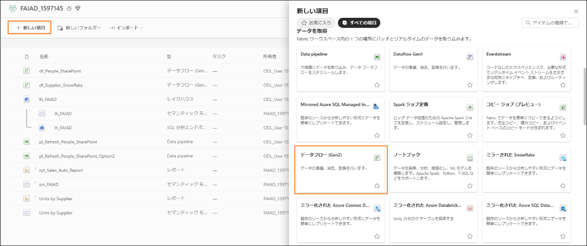

3. Power Query ウィンドウが開きます。中央のペインで、**Power Query テンプレートからインポートする**を選択します。

    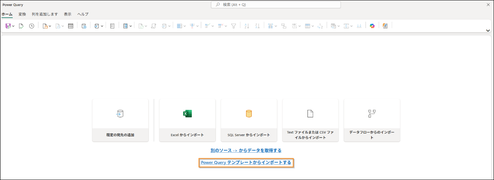

4. ラボ環境の **C:\FAIAD\Solutions** フォルダーを参照します。

5. インポートするデータフローを選択します。ここでは、**df_People_SharePoint.pqt** をインポートします。

6. **開く**を選択します。

    インポートされると、クエリとそのクエリのすべてのステップがインポートされることに注目してください。ただし、接続を構成する必要があります。また、データ送信先も設定する必要があります。ラボの指示に従って、これらのステップを完了してください。

    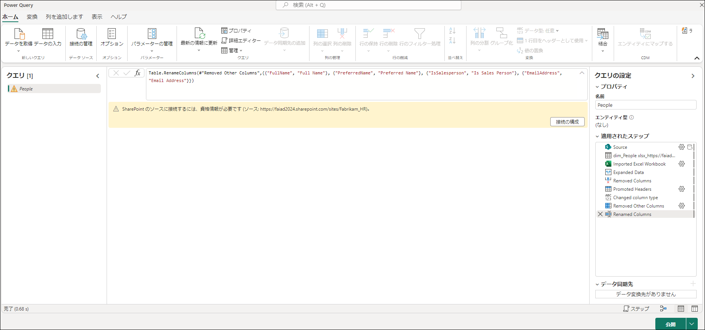

# **T-SQL を使用してビューを作成する**

講師として、出席者に T-SQL を使用してビューを作成してもらうことを選択できます。Geo、Product、Reseller、Sales の各ビューの T-SQL は、**Solutions** フォルダーにあります。レイクハウスで新しい SQL クエリ ウィンドウを開き、これらの T-SQL ステートメントを実行してください。レイクハウスで新しい SQL クエリ ウィンドウを開き、これらの T-SQL ステートメントを実行してください。ビューを削除する必要がある場合は、**Solutions** フォルダーに Remove-View ファイルがあり、これを実行することもできます。

**注:** これらは CREATE ステートメントです。これらのステートメントを実行する前に、同じ名前の既存のビューを削除する必要があります。

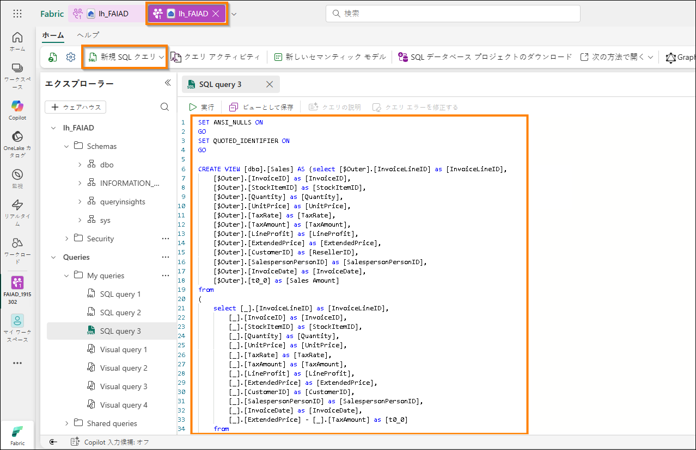

# **予測 ML のデモ**

### 要件

次のステップに進む前に、講師はラボ 1 - 6 を完了し、すべてのデータを取り込む必要があります。

デモの場合、**prophet** という名前の Python ライブラリをインストールする必要があります。これは、ノートブックにインラインでインストールするか、環境を作成することができます。このデモでは、インライン モードを使用します。

### ノートブックを作成する方法

1. ラボ 2、タスク 2 で作成し、**FAIAD_ <ユーザー名>** という名前を付けた **Fabric ワークスペース**に移動します。

2. メニューから、**+ 新しい項目**を選択 -> 検索ボックスを使用してノー**トブックを検索 -> ノートブック**を選択します。

    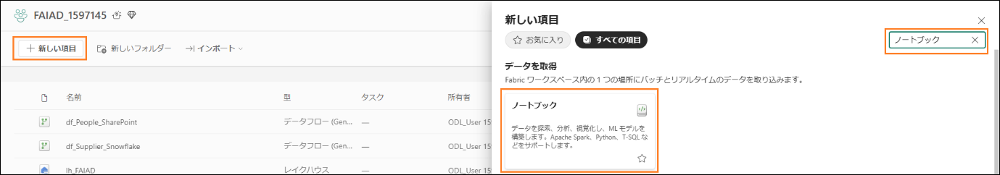

3. ノートブック、言語、環境、新しいセルの作成方法など、レイアウトについて**概要を簡単に**説明します。

### レイクハウスをノートブックに追加する

既定のレイクハウスをノートブックに関連付ける必要があります。

1. エクスプローラー パネルで**レイクハウス** タブを選択します。

    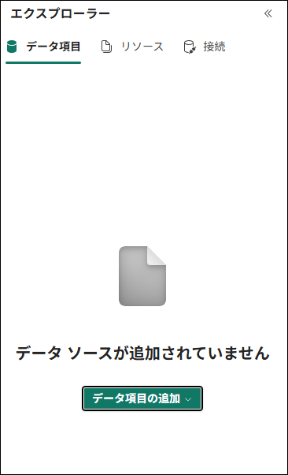

2. エクスプローラー パネルから**データ項目の追加**を選択します。

3. **OneLake カタログから**を選択します。

    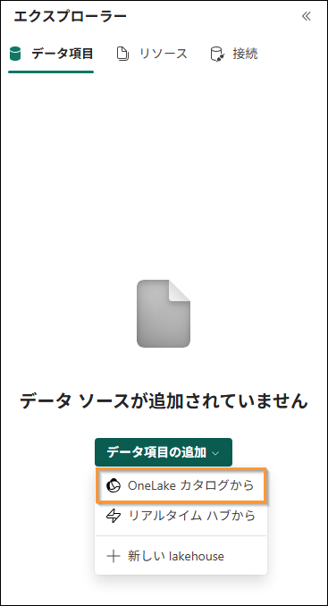

4. [OneLake データ ハブ] ダイアログが開きます。**lh_FAIAD** レイクハウスを選択します。

5. **追加**を選択します。レイクハウスがノートブックに関連付けられていることに注意してください。

    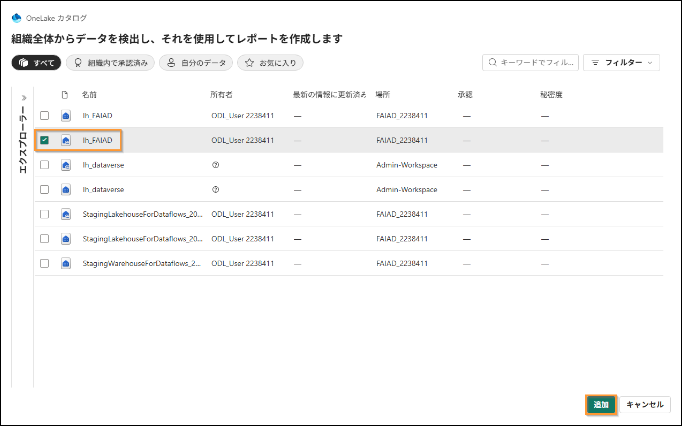

### Python ライブラリをインライン インストールする

デモの場合、**prophet** という名前の Python ライブラリをインストールする必要があります。これは、インラインでインストールされます。

1. **Python ライブラリをインストールする**には、次のコードをセルに入力します。

    !pip install prophet

2. セルの横にある**再生**ボタンを選択してコードを実行します。

    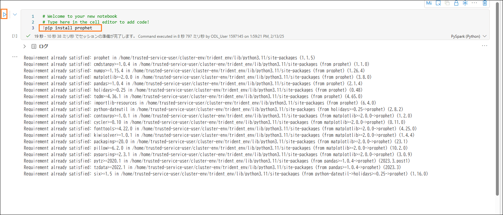

### コードを実行して予測を作成する

1. **新しいセル**を作成します。

2. 次の**コード**を入力します。

    from pyspark.sql import SparkSession

    from pyspark.sql.functions import month, year, col

    from prophet import Prophet

    import pandas as pd

    # Initialize Spark session

    spark = SparkSession.builder.appName("Prophet Forecasting").getOrCreate()

    # Load data from your specific Spark table

    df = spark.sql("SELECT \* FROM lh_FAIAD.Invoices i JOIN lh_FAIAD.InvoiceLineItems il ON i.InvoiceID = il.InvoiceID")

    # Aggregate data to monthly level

    monthly_df = df.withColumn("Month", month("InvoiceDate"))

    .withColumn("Year", year("InvoiceDate"))

    .groupBy("Year", "Month")

    .sum("Quantity")

    .orderBy("Year", "Month")

    # Convert to Pandas DataFrame and prepare for Prophet

    pandas_df = monthly_df.toPandas()

    pandas_df['ds'] = pd.to_datetime(pandas_df[['Year', 'Month']].assign(DAY=1))

    pandas_df['y'] = pandas_df['sum(Quantity)']

    # Fit the Prophet model

    model = Prophet(yearly_seasonality=True, weekly_seasonality=False,daily_seasonality=False)

    model.fit(pandas_df[['ds', 'y']])

    # Create a DataFrame for future predictions (e.g., next 12 months)

    future = model.make_future_dataframe(periods=12, freq='M')

    # Forecast

    forecast = model.predict(future)

    # Plotting the forecast

    model.plot(forecast)

    model.plot_components(forecast)

3. **コード**の各ステップについて説明します (ヒントはコメントとして提供されています)。

4. セルの横にある**再生**ボタンを選択してコードを実行します。

    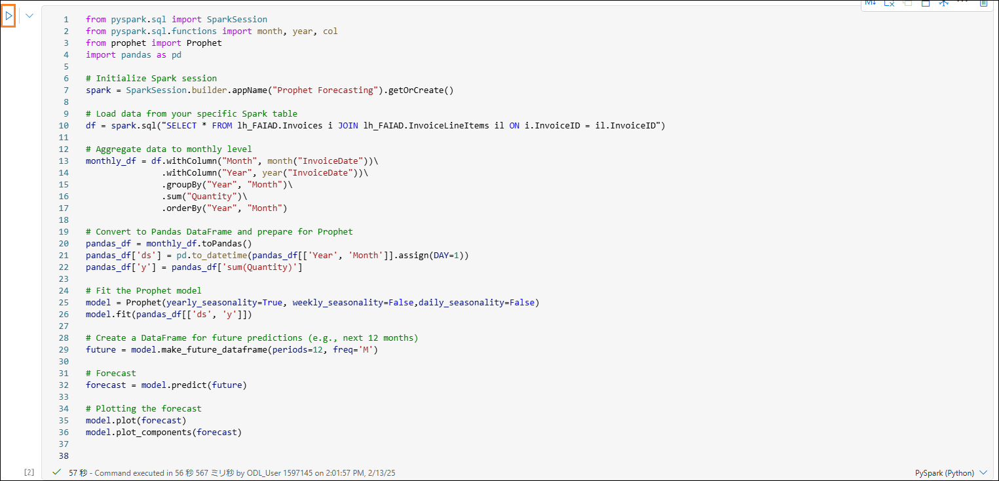

    作成される 3 つのグラフ (後述) について出席者に説明します。実績は 2023 年 5 月まであり、12 か月間について予測しています。

    **最初のグラフ**では、2025 年 4 月まで季節性と予測が削除されています。

    **2 つ目のグラフ**では、2025 年 4 月まで、傾向が削除され季節性が追加されています。

    

    **3 つ目のグラフ**は、傾向と季節性の両方を使用して予測しています。このグラフには上限と下限も示されています。

    

5. **新しいセル**を作成します。

6. 次の**コード**をセルに追加します。

    display(forecast)

    #write forecast data to a table

    spark.createDataFrame(forecast).write.saveAsTable("Sales_Forecast", mode="overwrite")

7. **再生**ボタンを選択してセルを実行します。

    

8. **表示されるデータ**について出席者に説明します。

9. 新しいテーブル **sales_forecast** がレイクハウスに作成されたことをユーザーに示します。

    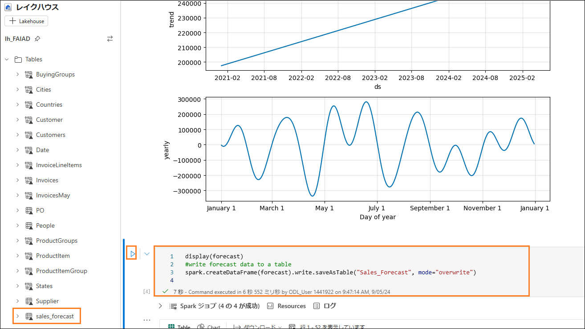

10. このテーブルに**クエリ**を実行して、テーブルの内容をユーザーに示します。

# **Data Activator のデモ**

### 要件

次の手順に進む前に、講師はラボ 1 - 7 を完了する必要があります。

次のリンクには最新の更新が含まれます。

<https://learn.microsoft.com/en-us/fabric/data-activator/data-activator-introduction>

<https://learn.microsoft.com/en-us/fabric/data-activator/data-activator-get-data-power-bi>

### シナリオ

月ごとの Sales by Stock Group Name に変動があることがわかっています。これは季節性によるものです。ただし、通知は Variance % が 20% を下回った場合にのみ受け取る必要があります。これは、そのようなシナリオの識別と解決に役立ちます。

これを解決するため、Data Activator を使用します。いずれかの Stock Group Name の Sales Variance % が 20% を下回った場合にアラートをトリガーします。これについて、2024 年 5 月を対象としてシミュレーションを行います。Data Activator のトリガーは 1 時間ごとに実行するので、1 時間待つ代わりに、テスト アラートを実行します。

このシナリオのデモを行うには、次のようにします。

- Sales Variance % メジャーをデータセットに追加します。

- Sales Variance % by Stock Group Name を表示するテーブル視覚化を追加します。このテーブルを 2024 年 5 月でフィルター処理します。

- テーブル視覚化を使用してアラートを作成します。

- Activator を調べて、テスト アラートを作成します。

### Sales Variance % メジャーを追加する

新しいメジャーを sm_FAIAD セマンティック モデルに追加します。

1. **sm_FAIAD** セマンティック モデルに移動します。

2. **Sales** テーブルを選択します。

3. 上部のメニューから、**ホーム -> 新しいメジャー**を選択します。

4. 次の**メジャー**を作成します。これにより、Prior 月と比較した Variance % が提供されます。

    Sales Var % =

5. var priormth = CALCULATE([Sales], PREVIOUSMONTH('Date'[Date]))

6. RETURN DIVIDE([Sales]-priormth, priormth)

7. メジャーを**パーセンテージ**として**書式設定**します。

    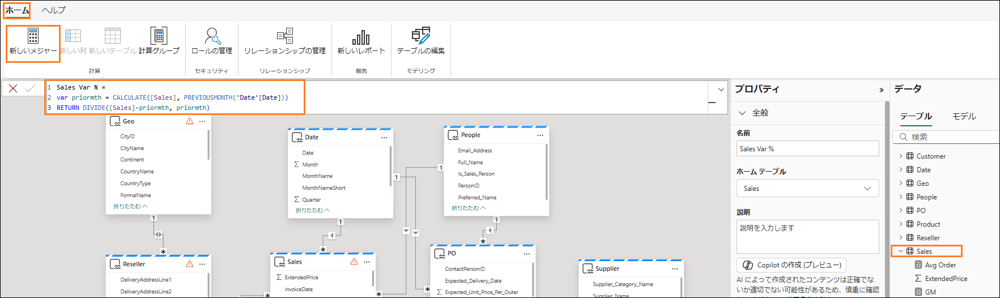

### テーブル視覚化を作成する

rpt_Sales_report を編集して、新しいテーブル視覚化を追加します。このテーブル視覚化には、2023 年 5 月の Sales Variance % by Stock Group Name が表示されます。

1. **rpt_Sales_report** (ラボ 7 で作成しました) に移動します。

2. 上部のメニューから、**編集**を選択します。

3. データ ビューで **Product** テーブルを展開します。

4. **StockGroupName** フィールドを選択します。テーブル視覚化が作成されます。

5. **Sales** テーブルを展開します。

6. **Sales Var %** を選択します。テーブル視覚化にデータがないことに注意してください。
    これは、Sales Var % の計算には月名が必要であるためです。

    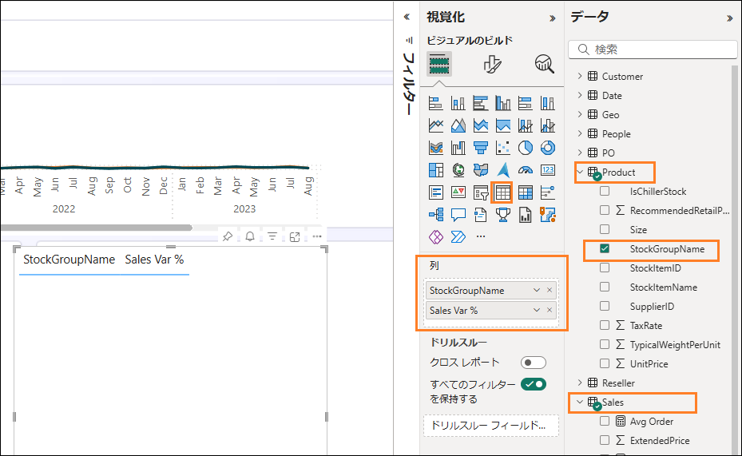

7. **フィルター** セクションを**展開します** (折りたたまれている場合)。

8. テーブル視覚化を強調表示にして、**データ** セクションから **Date** テーブルを展開します。

9. **Year** フィールドをこの視覚化セクションの [フィルター] にドラッグします。

10. **Year** フィールドで、**フィルターの種類**ドロップダウンから**基本フィルター**を選択します。

11. **2024** を選択します。

    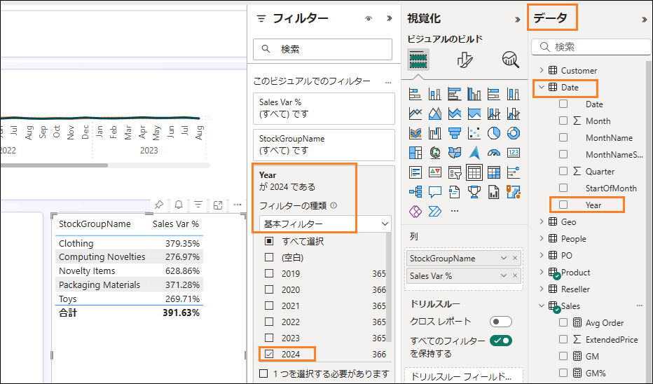

12. **MonthNameShort** フィールドをこのビジュアル セクションの [フィルター] にドラッグします。

13. **May** を選択します。

14. **ファイル -> 保存**を選択して、レポートに対する更新を保存します。

    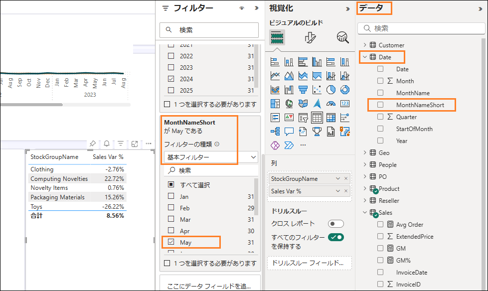

### Activator の作成

いずれかの Stock_Group_Name の Sales Variance % が -20% を下回ったらアラートを送信する Activator を作成します。Toys という Stock Group Name の Sales Variance % が -26.22% でアラートの条件を満たすことに注意してください。

1. 新しく作成したテーブル視覚化を強調表示にした状態で、視覚化の左上隅の**通知ベル**を選択します。

    

2. [アラートの設定] パネルが開きます。

3. アラートは**各 Stock_Group_Name に対して**適用されることを出席者に伝えます。

4. **行が変更されたときにアラートを生成する**で** Sales Var %** を選択します。

    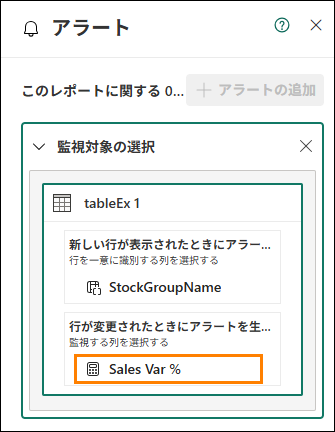

5. **変更後**ラジオ ボタンを選択し、**条件をより小さい**に変更します。

6. **しきい値**を** -20%** に設定します。これは、Sales Variance % が 20% を下回るとアラートをトリガーするように構成します。

    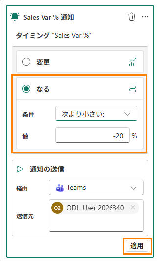

7. 通知にはメールと Teams の 2 つのオプションがあることを伝えます。

8. **適用**を選択します。

9. 下部にある **自分の Power BI Activator アラート**の横の**省略記号 (...)** を選択します。

10. 別のワークスペース保存場所を表示します。

    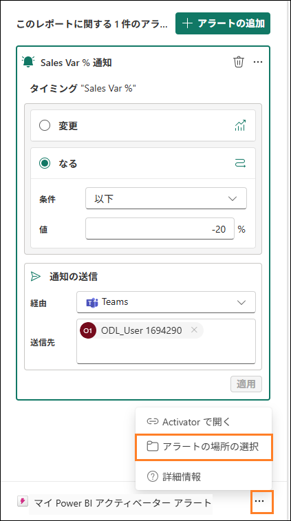

11. アラートが作成されたら、下部の省略記号をクリックしてから **Activator で開く**を選択することもできます。

    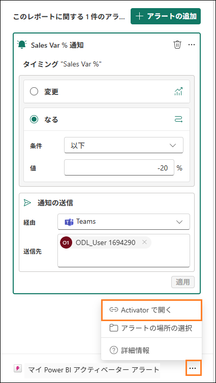

### Activator の概要

1. Activator の**デザイン** ビューに移動します。

2. 出席者に**レイアウト**を説明します。左側はオブジェクトです。先ほど作成した**トリガ**ーがあることに注意してください。**イベント** セクションもあります。

3. 作成したトリガーを選択して、**上部メニュ**ーのオプションを説明します。

    1. ホーム

    1. データを取得

    2. Power Automate を使用してカスタム アクションを作成

    2. ルール

    1. 削除

    2. 開始、停止、詳細の表示

    3. テスト アクションを送信

4. **定義**タブに含まれている**監視**と**条件**のグラフについて説明します。

5. 下にスクロールして、**アクション** グラフに注目します。これは、アラートがトリガーされると通知が表示される場所です。現在、トリガーは 1 時間ごとに実行されます。
    そのため、次の 1 時間の間にデータが変化して条件を満たした場合、アラートがトリガーされます。

    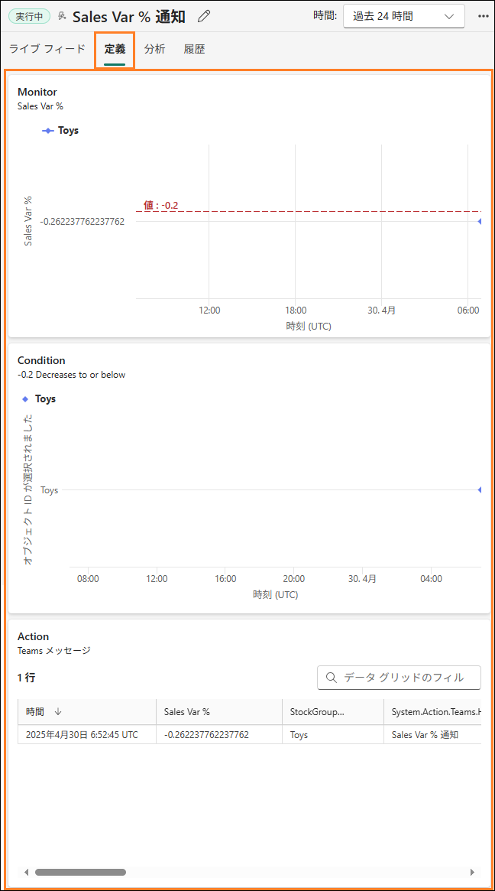

6. 画面の右側に、**アラートの定義**を構成するオプションがあります。これには、属性、フィルターまたは集計、条件、アクションが含まれます。既定のアラート対象はラボのユーザー アカウントであることに注意してください。(現在、外部のメール アドレスはサポートされていません)。

    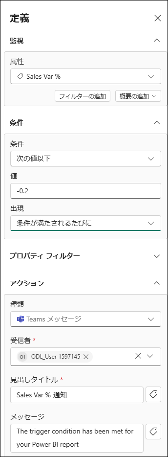

7. ここでアクションの詳細の編集もできることに注目してください。[アクションの編集] ボタンを選択すると、[アクションの編集] ウィンドウがポップアップ表示されます。

    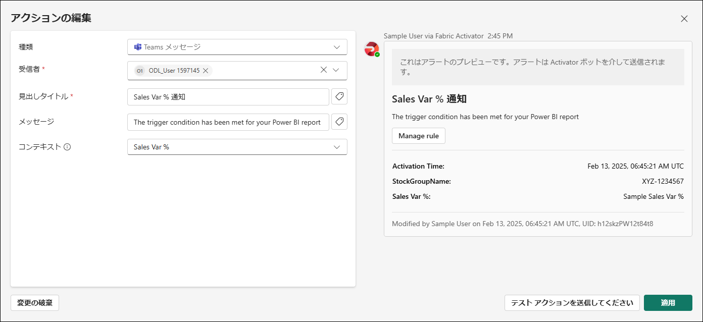

### テスト アラートを送信する

注: アラートを表示するには、ラボ環境を使用する必要があります。

1. **Sales Var % トリガー**を選択します。

2. 上部メニューの**テスト アクションを送信**を選択します。これにより、テスト アラートが自分のラボ ユーザー アカウントに送信されます。

3. 画面の左上隅にある**アプリ起動ツール アイコン**を選択します。

    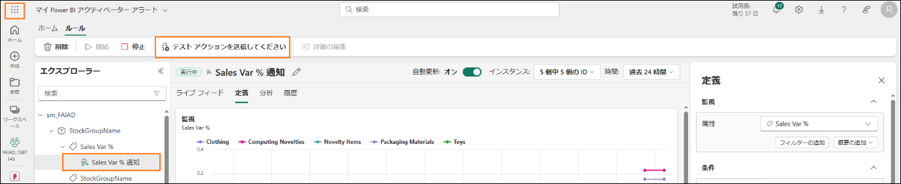

4. Teams を選択します。新しいブラウザー ウィンドウが開きます。

    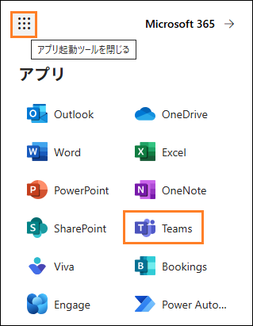

5. アラート メッセージを受け取ります (数分かかる場合があります)。これはテスト アクションであることに注意してください。

    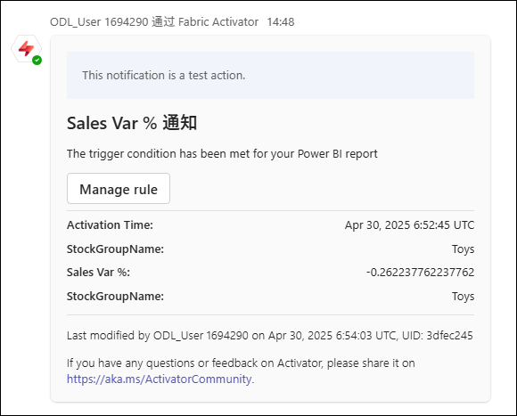

6. データが変化してトリガー条件が満たされると、アラートが送信されます。

    **注:** この機能をデモするため、ビジュアルを 1 つの月 (2024 年 5 月) にフィルター処理しました。実際のシナリオでは、これは動的に機能します。トリガーは、通常、当月になるように動的に設定します。

# **セマンティック リンク デモ**

### 要件

次の手順に進む前に、講師はラボ 1 - 7 を完了する必要があります。

どちらのノートブックも完了するのに 5 から 10 分かかる可能性があるので、講師にはこのデモのノートブックを事前に実行しておくことをお勧めします。1 つのオプションは、受講者がラボ 6/7 の作業を行っている間にノートブックを実行することです。これは、講師がノートブックの結果を受講者に確実に示すことができるようにするためです。

### シナリオ

このデモでは、**ベスト プラクティス アナライザー**と**メモリ アナライザー**について調べます。これらは、セマンティック モデルのパフォーマンス、メモリ使用量、全体的な品質を評価するのに役立つ強力なツールです。これらのツールは、単にメトリックを提供するのではなく、他では見つからない可能性がある最適化の機会を明らかにすることで、モデルの**設計と効率を向上させるための実用的な分析情報**を提供します。

この機能の中心になっている**セマンティック リンク**は、セマンティック モデルをデータ サイエンス ツールやエクスペリエンスに直接接続できる Microsoft Fabric の機能です。つまり、Notebooks を使用して sm_FAIAD セマンティック モデルの**分析、プロファイル、最適化**を行うことができます。

この接続により、ワークスペースのセマンティック モデルに対して、ベスト プラクティス チェックやメモリ プロファイルなどの詳細な分析を直接実行できます。これにより、 **パフォーマンスの向上、メモリ占有領域の削減、さらに最終的には生産での成果物の コスト削減**を実現できます。

このシナリオのデモを行うには、次のようにします。

- sm_FAIAD セマンティック モデルを開いて、セマンティック リンク機能を見つけます。

- ベスト プラクティス アナライザー ノートブックを作成し、分析情報を表示します。

- メモリ アナライザー ノートブックを作成し、分析情報を表示します。

### ベスト プラクティス アナライザー

1. ラボ 2、タスク 2 で作成し、**FAIAD_ <ユーザー名>** という名前を付けた **Fabric ワークスペース**に移動します。

2. **sm_FAIAD** セマンティック モデルを開きます。

    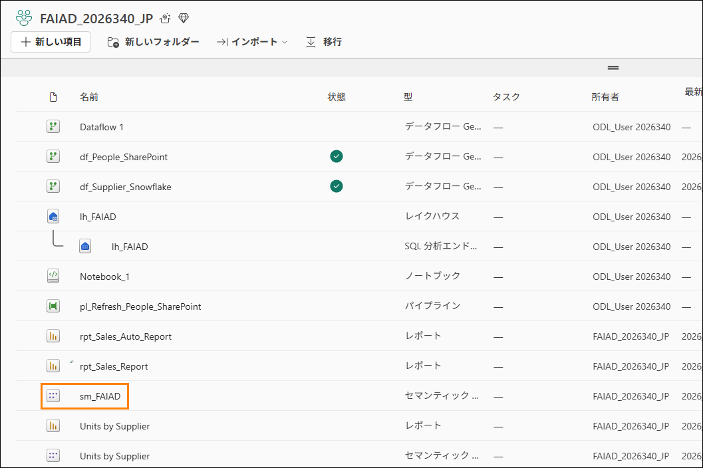

3. 次のページで、**セマンティック モデルを開く**を選択します。

    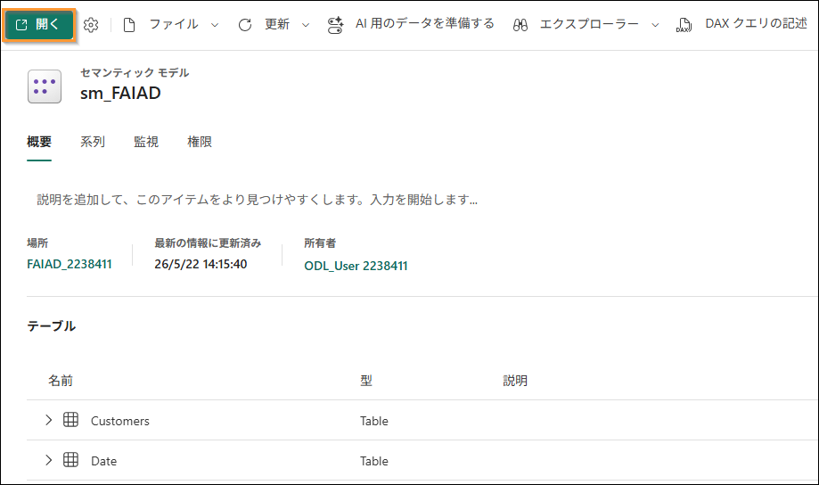

4. ホーム リボンでは、モデルの正常性の下に 3 つの項目があることがわかります。

    1. **ベスト プラクティス アナライザー:** Fabric の専門家が作成したルールに基づいてセマンティック モデルの設計とパフォーマンスを改善するためのヒントを提供します。

    2. **メモリ アナライザー:** セマンティック モデル内のオブジェクトに関するメモリとストレージの統計情報を提供します。これらの統計情報を検討すると、パフォーマンスの最適化とメモリの削減が可能な領域を特定するのに役立ちます。

    3. **コミュニティ ノートブック:** データの分析とレポートを強化するために Power BI コミュニティによって作成されたノートブックのギャラリー。

    *注: これらのノートブックは、セマンティック モデルの詳細ページでも見つかります。*

5. **ベスト プラクティス アナライザー**をクリックします。

    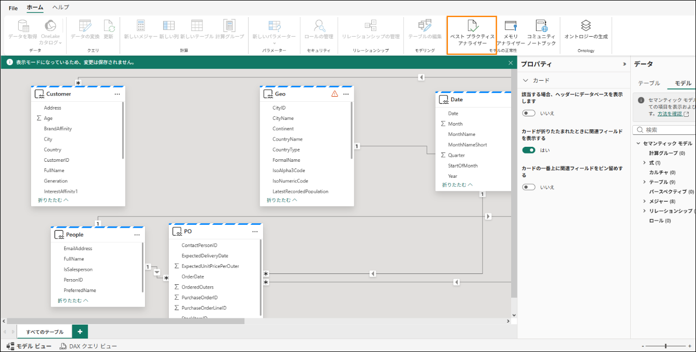

6. 新しいベスト プラクティス アナライザー ノートブックが作成されます。そのノートブックに自動的に移動します。

7. 受講者と共に、Markdown セルに記述されている詳細を調べます。

8. ホーム リボンで、**すべて実行**を選択します。

    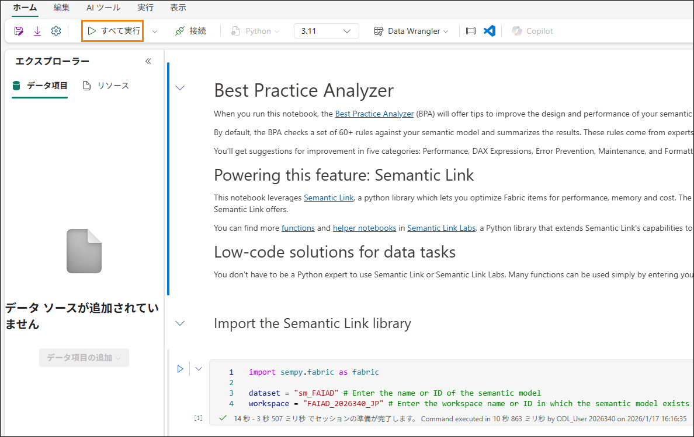

9. ノートブックの実行が完了したら、**run_model_bpa** 関数の結果を確認します。

    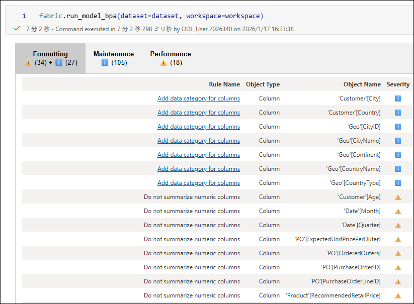

10. この関数は、推奨事項の 3 つのカテゴリを返します。**書式設定、メンテナンス、
    パフォーマンス**。特定のカテゴリには、推奨事項の重要度を表す 2 つの異なるア イコンが表示されます。

    1. ℹ️ - モデルを改善するために推奨される変更。

    2. ⚠️ - この注意の重要度は、一覧で示されている問題が、モデルまたはそのモデルを使用するレポートでの問題の原因になる可能性があることを示します。

11. **書式設定**で、**ルール名 "Format flag columns as Yes/No value strings"** まで下にスクロールして、それをポイントします。

12. ルール名をポイントすると推奨される変更についての詳細が表示されることを受講者に説明します。

    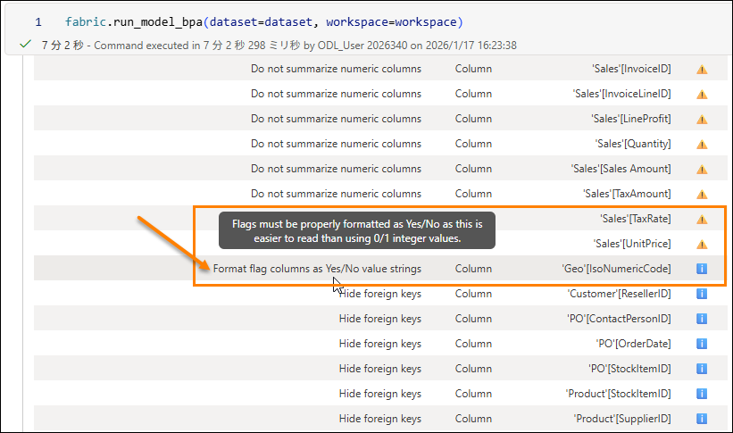

13. このケースでは、パフォーマンス アナライザーは **Geo** テーブルの **IsoNumericCode** 列を **Yes/No** に書式設定するよう推奨しています。スター スキーマをモデリングするときはフラグ列をこのように書式設定するのがベスト プラクティスであるため、これは良い推奨事項です。

14. **メンテナンス** カテゴリを選択します。

    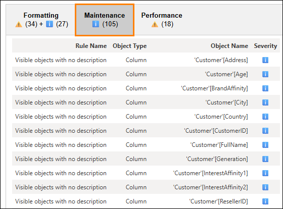

15. メンテナンスの推奨事項の大部分は、モデル内に表示される列への説明の追加であることを受講者に説明します。

16. **パフォーマンス** カテゴリを選択します。

    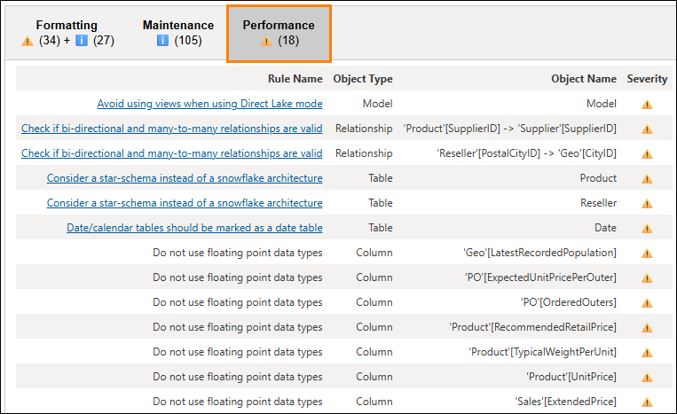

17. **ルール名 "Avoid using views when using Direct Lake mode"** をポイントします。

18. パフォーマンス アナライザーでは、Direct Lake モードでビューがサポートされていないことが示されています。このクラスでは、ショートカットを使用してデータにすばやく接続し、ビューを使用してデータを変換しました。このようにしたのは、Fabric が備える多くのデータ接続方法に関する詳細を学習するためでもあります。ただし、この推奨事項をモデルに適用する場合は、データフロー Gen2 などの別の方法を使用して、
    販売データを取り込んで変換する必要があります。

    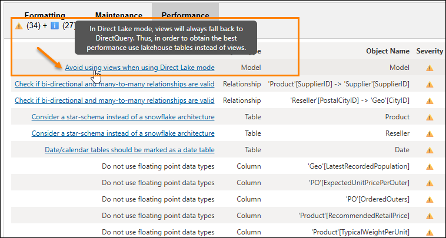

19. 時間が許されるなら、講師は他の推奨事項を調べてもかまいません。

### メモリ アナライザー

1. **sm_FAIAD** セマンティック モデルのモデル ビューに戻ります。

2. **ホーム リボン**で**メモリ アナライザー**を選択します。

    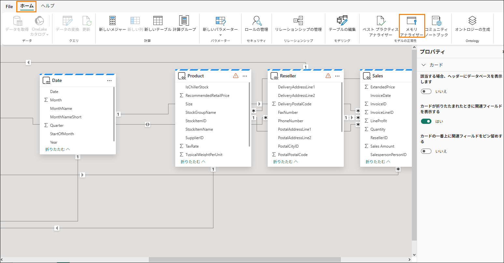

3. 新しいメモリ アナライザー ノートブックが作成されます。

4. 受講者と共に、Markdown セルに列記されている詳細を調べます。

5. **ホーム リボン**で、**すべて実行**を選択します。

    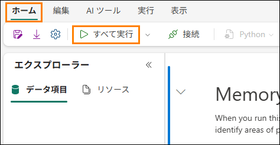

6. ノートブックが完了した後、結果のデータを調べます。多くのカテゴリに異なる詳細レベルでメモリの使用量が表示されます。

    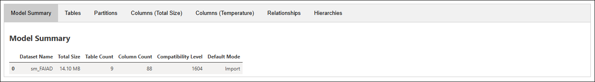

7. この情報をすべて使用して、メモリの使用に関して改善する領域を明らかにできることを、受講者に説明します。

8. **テーブル** カテゴリを選択します。

9. **% DB 列**名をポイントします。そうすると、列の説明が表示されます。この列には、
    セマンティック モデルのサイズを基準として各テーブルのサイズが示されます。 これを見ただけでは何か問題があるかはわかりませんが、各テーブルで使用されて いるセマンティック モデルのメモリの割合を確認するのに便利です。

    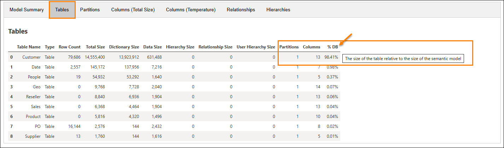

10. 時間が許せば、講師は他のカテゴリを調べてさまざまなデータポイントについて説明してデモを終了できます。
