# Microsoft Fabric - Fabric Analyst in a Day - ラボ 2

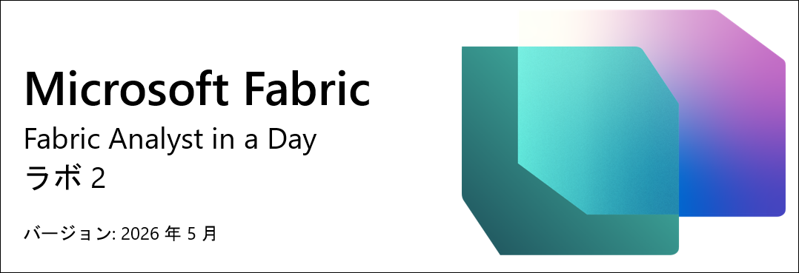

## 目次

- 概要
- Fabric ライセンス
  - タスク 1: Microsoft Fabric 試用版ライセンスを有効にする
- Fabric ワークスペース
  - タスク 2: Fabric ワークスペースを作成する
  - タスク 3: レイクハウスを作成する
- Fabric のエクスペリエンスの概要
  - タスク 4: Data Factory のエクスペリエンス
  - タスク 5: Industry Solutions のエクスペリエンス
  - タスク 6: Real-Time Intelligence エクスペリエンス
  - タスク 7: Data Engineering のエクスペリエンス
  - タスク 8: Data Science のエクスペリエンス
  - タスク 9: Data Warehouse のエクスペリエンス
  - タスク 10: データベースのエクスペリエンス
- 参考資料

# 概要

今日は、Microsoft Fabric のさまざまな主要機能について学習します。この入門ワークショップでは、Fabric で利用できる製品のさまざまなエクスペリエンスやアイテムを紹介します。このワークショップを終了すると、レイクハウス、データフロー (Gen2)、パイプライン、DirectLake などの使い方がわかります。

このラボを終了すると、次のことが学べます。

- Fabric ワークスペースの作成方法

- レイクハウスの作成方法

# **Fabric ライセンス**

### タスク 1: Microsoft Fabric 試用版ライセンスを有効にする

1. 仮想マシンのデスクトップで **PowerBI Portal** を選択します。サインインを求めるメッセージが表示されることがあります。

    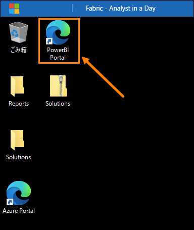

    **注:** ラボ環境を使用している場合は、自動的にサインインされることがあります。

    **注:** Fabric が開かない場合は、ブラウザーで http://app.fabric.microsoft.com/ に移動します。

2. ユーザー名をコピーしてダイアログの [電子メール] フィールドに貼り付け、[送信] を選択します。

    - **メール/ユーザー名:** <inject key="AzureAdUserEmail"></inject>

    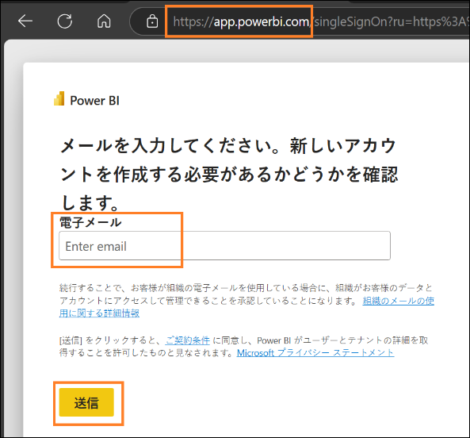

3. **Microsoft Azure にサインインする**タブにログイン画面が表示されます。そこに次の**メール/ユーザー名**を入力し、**次へ**をクリックします。

    - **メール/ユーザー名:** <inject key="AzureAdUserEmail"></inject>

    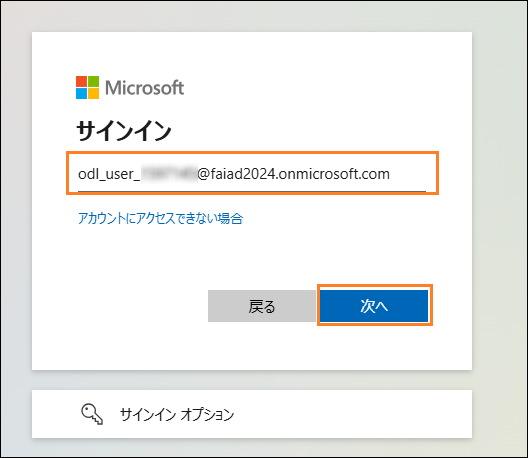

4. 次に、以下の**一時アクセス パス**を入力して、**サインイン**をクリックします。

    - **一時アクセス パス:** <inject key="AzureAdUserPassword"></inject>

    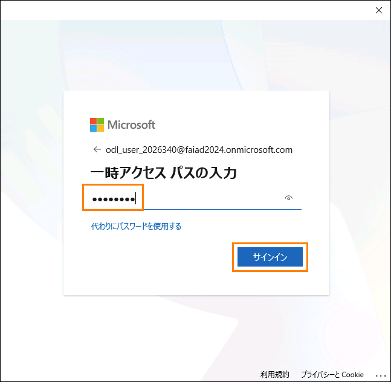

5. 見慣れた **Power BI サービスのホーム ページ**が表示されます。

6. このラボは、Power BI サービスのレイアウトに精通していることを前提に進めます。
    不明な点がある場合は、講師に遠慮なく質問してください。

    現在、**マイ ワークスペース**が表示されています。Fabric のアイテムを操作するには、試用版ライセンスが必要になります。また、ワークスペースに Fabric ライセンスが割り当てられている必要があります。設定を始めましょう。

7. 画面右上の**ユーザー アイコン**を選択します。

8. **無料試用版**を選択します。

    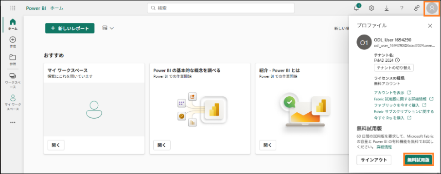

9. Microsoft Fabric の無料試用版にアップグレードするダイアログが開きます。
    **アクティブ化**を選択します。

    **注:** 既定のリージョンを変更しないでください。これはそのままにします。

    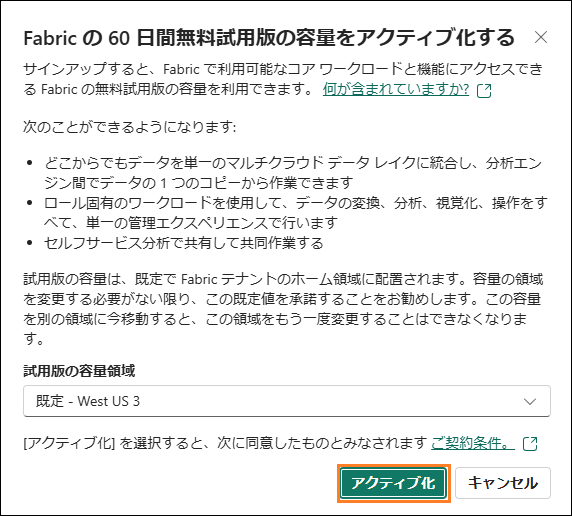

10. Microsoft Fabric へのアップグレード成功のダイアログが開きます。
    **Fabric Home Page** を選択します。

    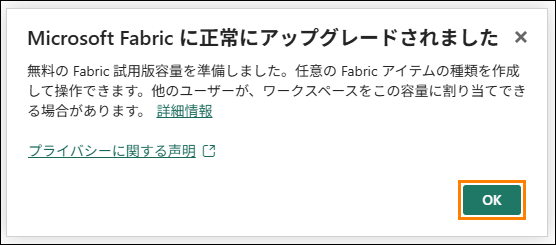

11. **Microsoft Fabric のホーム ページ**が開きます。[Fabric ビューへようこそ] ダイアログが開く場合があります。必要に応じて、**ツアーの開始**オプションを選択するか、キ**ャンセル**を選択できます。

    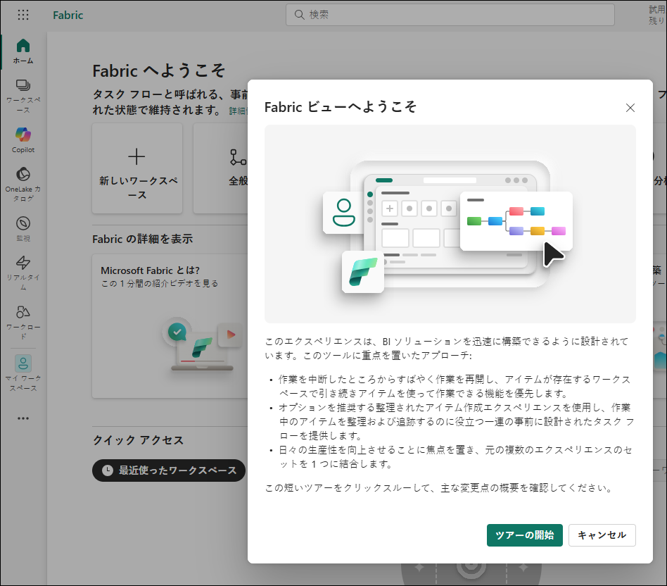

# **Fabric ワークスペース**

### タスク 2: Fabric ワークスペースを作成する

1. 次は、Fabric ライセンスを使用してワークスペースを作成しましょう。左ナビゲーション バーから**ワークスペース** (1) を選択します。ダイアログが開きます。

2. ポップアップ メニューの下部に見つかる **+ 新しいワークスペース** (2) をクリックします。

    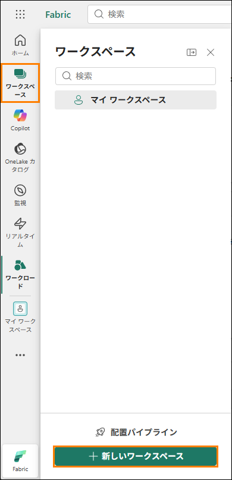

3. **ワークスペースの作成**ダイアログがブラウザーの右側に開きます。

4. **名前**フィールドに FAIAD_<inject key="Deployment ID" enableCopy="false"/> ([環境] タブで見つけることができます) を入力します

    **注:** ワークスペース名は一意である必要があります。[名前] フィールドの下に、"この名前は使用できます" という緑色のチェック マークが表示されていることを確認してください。

5. 必要に応じて、ワークスペースの説明を入力できます。このフィールドはオプションです。

6. **詳細**をクリックしてセクションを展開します。

    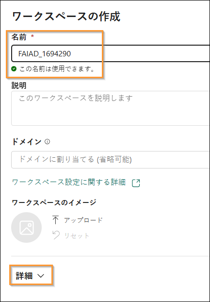

7. **ライセンス モード**で、**試用版**が選択されていることを確認します (既定で選択されています)。

8. **適用**を選択して新しいワークスペースを作成します。

    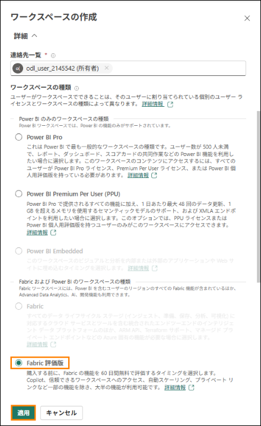

    新しく作成したワークスペースに自動的に移動します。さまざまなデータ ソースからレイクハウスにデータを取り込み、そのレイクハウスからのデータを使用してモデルを構築し、レポートを作成します。最初のステップでは、レイクハウスを作成します。これについては次に説明します。

### タスク 3: レイクハウスを作成する

1. 新しく作成したワークスペース **FAIAD_<inject key="Deployment ID" enableCopy="false"/>** で、左側のナビゲーション ウィンドウの **+ 新しい項目 (1)** ボタンを探します。ここからワークスペースへの新しい項目の作成を開始できます。

2. 検索ボックスに、**レイクハウス (2)** と入力し、検索結果から**レイクハウス (3)** オプションを選択します。これにより、ビッグ データの格納、クエリ、管理を行うための新しいレイクハウスを作成できます。

    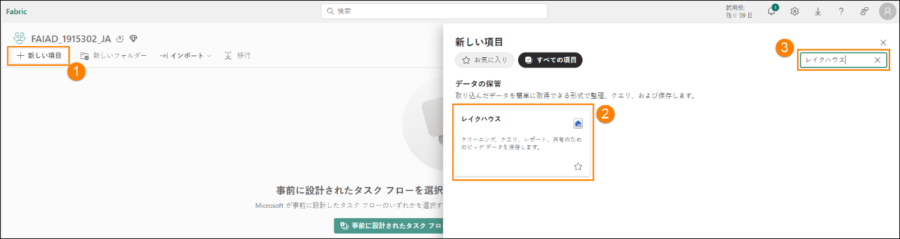

3. 新しいレイクハウスのダイアログが表示されます。[名前] テキストボックスに **lh_FAIAD** と入力します。

    **注:** ここで、lh はレイクハウスを表します。lh を接頭辞として付けることで、識別しやすくなり、検索が容易になります。

    **注:** この機能はプレビュー段階ではなくなりましたが、**まだ有効にする必要はありません。**

4. **作成**を選択します

    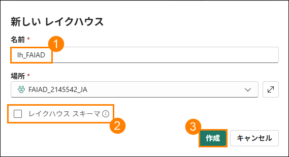

    しばらくするとレイクハウスが作成され、レイクハウス エクスプローラーのインターフェイスが表示されます。左上にあるヘッダーの Fabric 名の横に、レイクハウスのアイコンが表示されます。左側のナビゲーションのワークスペース アイコンに、項目が含まれていることが反映されます

    レイクハウス エクスプローラーには Tables と Files のセクションがあります。レイクハウスで [Files] セクションの下に Azure Data Lake Storage Gen2 のファイルを公開することも、データフローでデータをレイクハウスの [Tables] に読み込むこともできます。さまざまなオプションを利用できます。以降のラボでそのオプションをいくつか紹介します。

    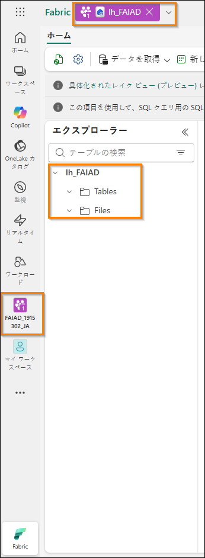

# **Fabric のエクスペリエンスの概要**

### タスク 4: Data Factory のエクスペリエンス

1. 画面左側のワークロード アイコンを選択します。ダイアログが開き、Fabric のエクスペリエンスの一覧が表示されます。このエクスペリエンスのリストには、Power BI、
    Data Factory、Industry Solutions、Real-Time Intelligence、Data Engineering、Data Science、 Data Warehouse が含まれます。詳しく見ていきましょう。

    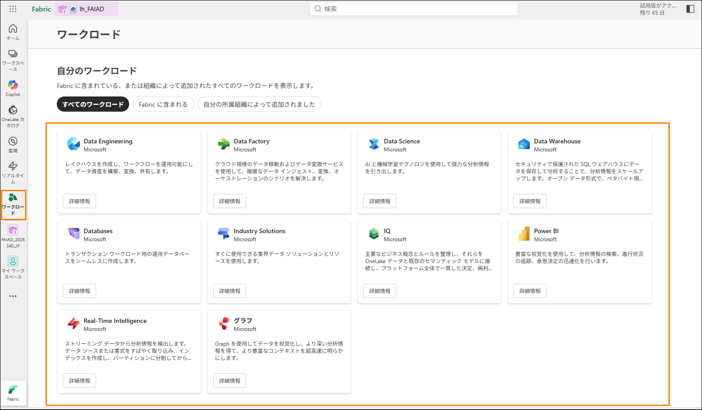

2. **Data Factory** を選択します。

    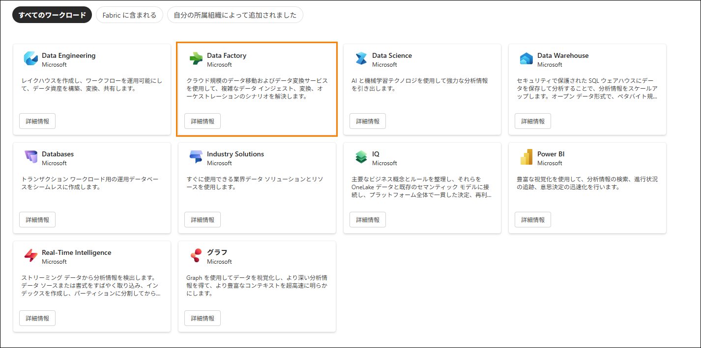

3. Data Factory のホーム ページが表示されます。以下は、Data Factory を効果的に使用するための手順を段階的に説明するように設計されたセクションの詳細な説明です。Dataflow Gen2 とは、次世代の Dataflow のことです。

    **Data Factory とは**

    Data Factory は、さまざまなソースからのデータを管理および整理するのに役立つツールです。これにより、データを収集、準備、変換して効率的に使用できます。初めての方でもエキスパートでも、Data Factory にはデータ変換をより簡単に、より効率的にするツールが用意されています。

    **項目の種類:**

    1) **データフロー Gen2:** データフローは、データ変換のためのレシピのようなものです。データに適用できる 300 種類以上の変換が提供されています。つまり、ニーズに合わせてデータをさまざまな方法でクリーニング、結合、変更できます。

    2) **パイプライン:** パイプラインは、データ プロセスの自動化に役立つワークフローです。特定の要件に合わせて調整可能な柔軟性のあるデータ ワークフローを作成できます。 これにより、データを構造化された方法で管理および処理しやすくなります。

    3) **Azure Data Factory:** Azure Data Factory は、データ移動とデータ変換のオーケストレーションおよび自動化のためのデータ駆動型ワークフローを作成できる、クラウドベースのデータ統合サービスです。

    4) **Apache Airflow ジョブ:** Apache Airflow は、ワークフローをプログラムで作成、 スケジュール、監視するために使用される、オープンソースのプラットフォームです。 Data Factory でそれを使用して、複雑なデータ ワークフローを作成、スケジュール、 管理できます。

    5) **コピー ジョブ:** コピー ジョブは、ソース間でデータをコピーできる機能です。さまざまなデータ ストア間でデータを移動する簡単で効率的な方法を提供します。

    6) **ミラー化されたデータベース:** バックアップ、テスト、または読み取り専用アクセス用に、ミラーリングされたバージョンのデータベースを作成する機能。

    7) **ミラー化 SAP:** 既存の SAP 資産を Fabric の残りのデータとシームレスに統合します。

    8) **ミラー化 Oracle:** Fabric でのミラーリングにより、Oracle データベースが統合プラットフォームにレプリケートされ、他のデータ ソースとともに準リアルタイムで低遅延の分析が可能になります。

    9) **ミラー化 Google BigQuery (プレビュー):** Fabric でのミラーリングにより、Google BigQuery データを OneLake に継続的にレプリケートできるため、複雑な ETL が不要に なり、分析、AI、データ共有にまたがったシームレスな使用が可能になります。

    10) **ミラーリングされた SharePoint Online リスト (プレビュー):** SharePoint リストのデータを、読み取り専用の分析可能なソースとしてほぼリアルタイムで Microsoft Fabric OneLake にレプリケートします。これによって ETL が不要になり、自動作成された SQL 分析エンドポイントを介して、Power BI とその他の Fabric データベース用にデータが公開されます。

    11) **変数ライブラリ:** 変数とその既定値の一覧が含まれています。また、代替値を保持している他の値セットを含めることもできます

    12) **dbt ジョブ (プレビュー):** dbt で SQL を使用してデータを使い慣れた環境に変換できます。

    **作業の開始**

    Data Factory の使用を開始するには、次の手順に従います。

    1) **Data Factory の使用方法を学びます:** このセクションは、Data Factory の使用を開始するのに役立ちます。このツールの有効な使い方についてのガイダンスが提供されます。

    2) **最初のデータフローを作成する:** 最初のデータフローを作成する方法を学習できます。データフローは、ニーズに合わせてデータを変換するために不可欠です。

    3) **最初のパイプラインを作成する:** このセクションには、最初のパイプラインを作成する方法が示されています。パイプラインを使用すると、データ プロセスを効率的に自動化および管理できます。

    4) **Data Factory を監視する方法を学びます:** 監視は、データ プロセスを円滑に実行 するために不可欠です。このセクションには、Data Factory の活動を監視する方法が示 されています。

    5) **データフローによるデータ変換の詳細:** このセクションは、データフローを使用してデータを効率的に変換する方法を理解するのに役立ちます。

    6) **GraphQL の最初の API を作成する:** GraphQL で API を使用することに関心がある場合は、使用を開始する方法についてこのセクションで確認できます。

    7) **最初のユーザー データ関数を作成する:** このセクションは、ユーザー データの管理と変換に便利なユーザー データ関数を作成するのに役立ちます。

    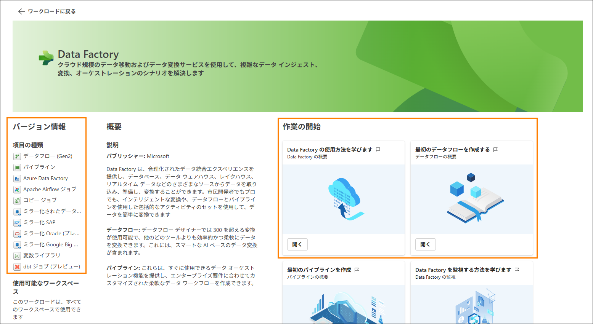

4. 画面の左上隅にある**ワークロードに戻る**をクリックします。このアクションによって主要なワークロードのページが表示され、そこで他のツールやセクションを探索できます。

    

### タスク 5: Industry Solutions のエクスペリエンス

1. **ワークロード ページ**で、**Industry** Solutions をクリックして先に進みます。

    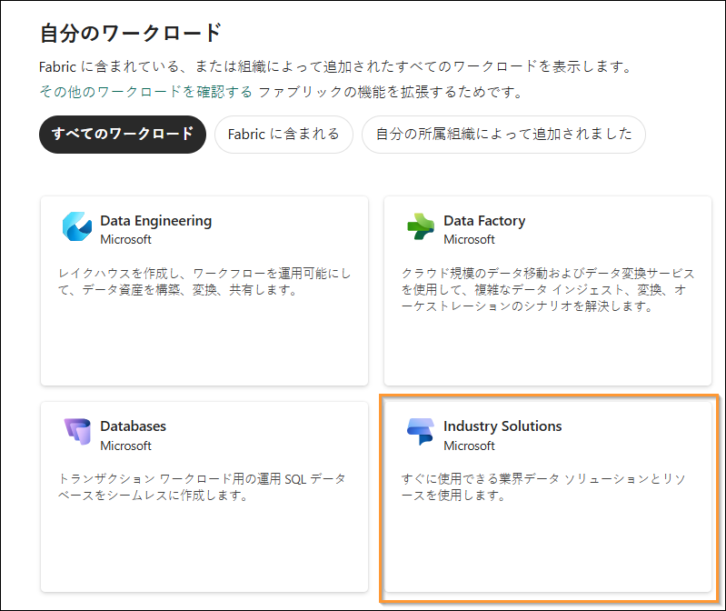

2. Industry Solutions のホーム ページが表示されます。以下は、Industry Solutions を手順に従って効果的に使用できるように設計されたセクションの詳細な概要です。

    **Industry Solutions とは**

    Industry Solutions は、さまざまな業界向けのソリューションとリソースを提供する、Microsoft Fabric のすぐに使用できるデータ ソリューションです。Industry Solutions は、業界関連のデータ モデル、コネクタ、変換、レポート、その他の資産を使用して主要なビジネス シナリオを開始するのに役立ちます。

    **項目の種類:**

    1) **持続可能性ソリューション:** 環境、社会、ガバナンス (ESG) に関するデータの取り込み、標準化、分析をサポートします。

    2) **医療データ ソリューション:** 医療データを分析に適した形式に効率的に変換するという重要なニーズに対処し、顧客が価値を実現するまでの時間を短縮するように戦略的に設計されています。

    **注:** 一部のソリューションが表示されない場合があります

    **作業の開始:**

    Industry Solutions の使用を開始するには、次の手順に従います。

    1) **医療データ ソリューションについて学ぶ:** [詳細] ボタンをクリックして医療データ ソリューションについて読み、プロジェクトでどのように使用できるのかを理解します。

    2) **医療データ ソリューションの使用を開始する:** 医療データ ソリューションの展開を開始し、プロジェクトにそれを実装します。

    3) **持続可能性ソリューションについて学ぶ:** [詳細] ボタンをクリックして持続可能性ソリューションについて読み、プロジェクトでどのように使用できるのかを理解 します。

    4) **持続可能性ソリューションの使用を開始する:** 持続可能性ソリューションの展開を開始し、プロジェクトにそれを実装します。

    5) **小売ソリューションについて学ぶ:** [詳細] ボタンをクリックして小売ソリューションについて読み、プロジェクトでどのように使用できるのかを理解します。

    6) **小売ソリューションの使用を開始する:** 小売ソリューションの展開を開始し、プロジェクトにそれを実装します。

    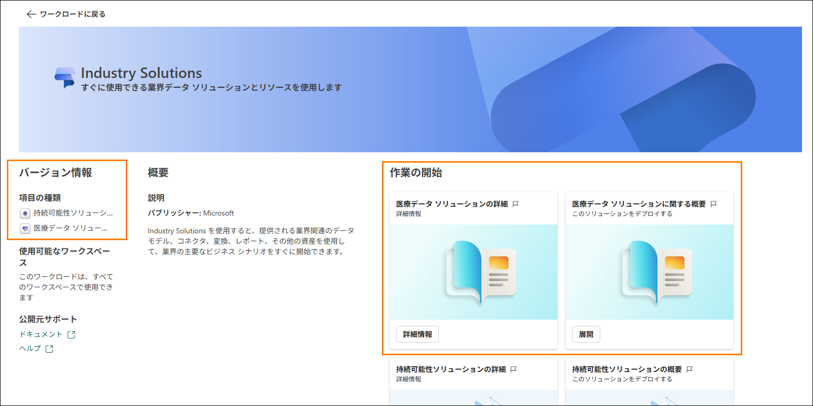

3. 画面の左上隅にある [ワークロードに戻る] をクリックします。このアクションによって主要なワークロードのページが表示され、そこで他のツールやセクションを探索できます。
    

### タスク 6: Real-Time Intelligence エクスペリエンス

1. **ワークロード** ページで、**Real-Time Intelligence** をクリックして先に進みます。

    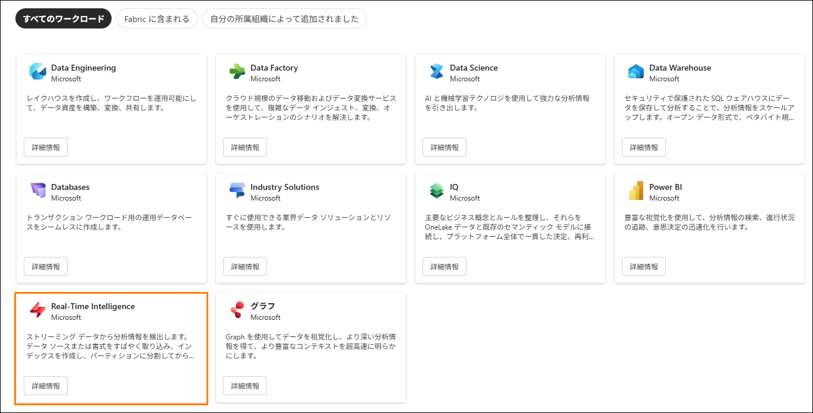

2. Real-Time Intelligence のホーム ページが表示されます。以下は、Real-Time Intelligence
    を手順に従って効果的に使用できるように設計されたセクションの詳細な概要です。

    **Real-Time Intelligence とは**

    Real-Time Intelligence は、さまざまなソースからの大量で粒度の高いデータを管理および分析するのに役立つツールです。リアルタイムでデータを取り込んで分析し、アクションを実行できるため、タイムリーな意思決定と対処によって事業運営を改善できます。

    **項目の種類:**

1. **イベントハウス:** 1 つまたは複数の KQL データベースのワークスペースを作成するために使います。これはプロジェクト間で共有できます。

2. **KQL クエリセット:** データに対してクエリを実行し、共有可能なテーブルとビジュアルを生成するために使用されます。

3. **リアルタイム ダッシュボード:** データ インジェストから数秒以内にリアルタイム ダッシュボードを視覚化するために使用されます。

4. **Eventstream:** リアルタイム イベント ストリームのキャプチャ、変換、ルーティングに使用されます。

5. **アクティベーター:** データセット、クエリ、イベント ストリームのパターンを監視するために使用されます。

6. **イベント スキーマ セット (プレビュー):** リアルタイム分析ワークフローのデータ構造 (スキーマ) の整理および標準化に役立ち、ストリーミング データを一貫して処理および分析することが容易になります。

7. **カスタム ストリーム コネクタ (プレビュー):** 独自のカスタム エンドポイントやカスタム アプリから Eventstream にリアルタイム イベントを送信できます。

8. **Anomaly Detector (プレビュー):** 異常検出は、イベントハウス テーブル内の異常なパターンと外れ値を自動的に識別します。

9. **Operations エージェント (プレビュー):** Operation エージェントは、監視 ->分析 -> 決定 -> 対応のサイクルを自動化します。継続的に重要なメトリックを追跡し、分析情報を取得して、特定の対象に対するアクションを推奨します。

10. **マップ:** 地理空間の分析情報を Real-Time Intelligence に取り入れることで、だれでもイベントの発生場所を視覚化し、空間データを他の Fabric 機能と統合して、よりスマートで場所を認識した意思決定ができるようになります。

11. **デジタル ツイン ビルダー (プレビュー):** デジタル ツイン ビルダーは、オントロジーを通じて、コーディングの経験が浅いまたはまったくないユーザーが、アセットやプロセスなどのビジネス概念を構築してモデル化するのを支援します。

    **作業の開始:**

    Real-Time Intelligence の使用を開始するには、次の手順に従います。

1. **リアルタイムでのエンドツーエンド エクスペリエンス:** [作業の開始] ボタンをクリックして、サンプル データ セットを使用してリアルタイム データ分析を探索します。

2. **Real-Time Intelligence サンプルを探索する:** [開く] ボタンをクリックし、サンプルを使用してリアルタイム データ分析を探索します。

3. **イベントハウス サンプルの探索:** [選択] ボタンをクリックし、サンプルを使用して Real-Time Intelligence について学びます。

4. **Real-Time Intelligence の概要:** [開く] ボタンをクリックして、Real-Time Intelligence の概要を表示し、このツールの効果的な使用を開始します。

5. **サンプル データを使用して KQL を学習する:** [開く] ボタンをクリックし、サンプル データを使用して KQL について学びます。

6. **リアルタイム ハブとは:** [開く] ボタンをクリックして、リアルタイム ハブとは何か、どのような使い方ができるかを学びます。

7. **サンプルのアクティベーターを探索する:** [開く] ボタンをクリックし、サンプルのアクティベーターを使用して Real-Time Intelligence の機能について理解します。

8. **アクティベーターの使用を開始する:** [開く] ボタンをクリックして、アクティベーターの概念について概要を確認し、ツールの効果的な使用を開始します。

    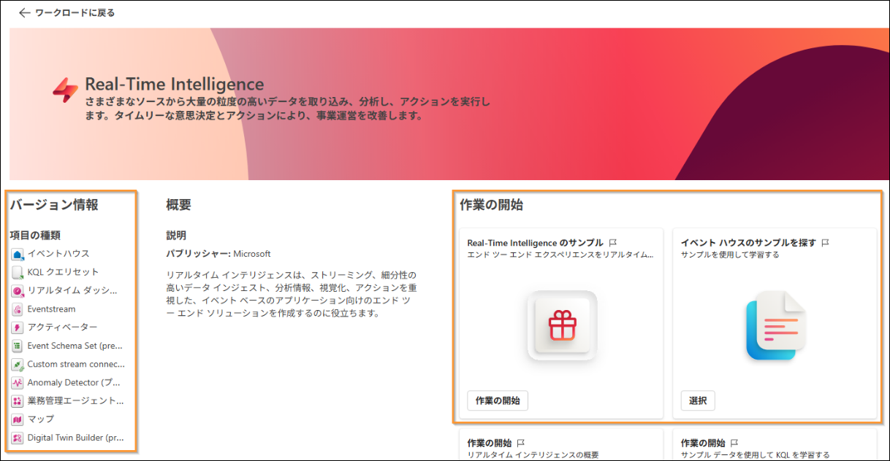

3. 画面の左上隅にある [ワークロードに戻る] をクリックします。このアクションによって主要なワークロードのページが表示され、そこで他のツールやセクションを探索で
    きます。

    

### タスク 7: Data Engineering のエクスペリエンス

1. **ワークロード** ページで、Data Engineering をクリックして先に進みます。

    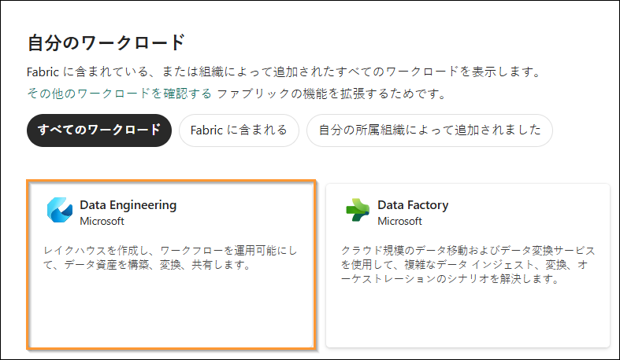

2. **Data Engineering** のホーム ページが表示されます。以下は、**Data Engineering** を手順に従って効果的に使用できるように設計されたセクションの詳細な概要です。

    **Data Engineering とは**

    Data Engineering は、大量のデータを収集、保存、処理、分析するためのインフラストラクチャとシステムの設計、構築、管理を支援するツールです。これを使用すると、レイクハウスを作成してワークフローを運用化し、データ資産を構築、変換、共有できるようになります。

    **項目の種類:**

1. **レイクハウス:** クリーニング、クエリ実行、レポート作成、共有対象のビッグ データを格納するために使用されます。

2. **ノートブック:** Python、Scala などのさまざまな言語を使用した、データの取り込み、
    準備、分析、その他のデータ関連タスクに使用されます。

3. **環境:** 共有ライブラリ、Spark コンピューティングの設定、ノートブックと Spark ジョブ定義のリソースを設定するために使用されます。

4. **Spark ジョブ定義:** Apache ジョブの定義、スケジュール、管理に使用されます。

5. **ユーザー データ関数:** Fabric でアプリケーションをホストおよび実行できるプラットフォームです。

6. **GraphQL 用 API:** 複数のデータ ソースに対してクエリを実行する API です。

7. **Snowflake データベース:** ユーザーは Snowflake データベースを Fabric 内部にミラーリングできます。

    **作業の開始:**

    Data Engineering の使用を開始するには、次の手順に従います。

1. **サンプルの探索:** [選択] ボタンをクリックし、サンプルを使用して Data Engineering について学びます。

2. **レイクハウスとは:** [開く] ボタンをクリックして、レイクハウスについて学び、また、どのような使い方ができるかを学びます。

3. **レイクハウスのデータを体験する:** [開く] ボタンをクリックし、レイクハウスを使用したデータ エンジニアリングの使用を開始します。

4. **Spark ジョブ定義の使用を開始する:** [開く] ボタンをクリックして、データ処理に Spark ジョブ定義を使用する方法を学びます。

5. **ノートブックを開発して実行する:** [開く] ボタンをクリックし、データ分析用のノートブックを開発して実行する方法を学びます。

6. **NotebookUtils の使用方法:** [開く] ボタンをクリックして、拡張データ分析にNotebookUtils を使用する方法を学びます。

7. **レイクハウス用にノートブックを活用する:** [開く] ボタンをクリックして、レイクハウス用にノートブックを活用する方法を学びます。

8. **レイクハウス用にデータセットを活用する:** [開く] ボタンをクリックして、レイクハウス用にデータセットを活用する方法を学びます。

9. **最初のユーザー データ関数を作成する:** [開く] ボタンをクリックして、ユーザー データ関数の作成方法を学びます。

10. **GraphQL の初めての API を作成する:** [開く] ボタンをクリックして、GraphQL 用の API を作成する方法を学びます。

    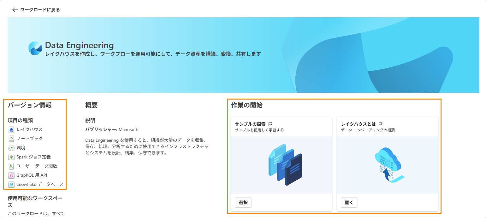

3. 画面の左上隅にある**ワークロードに戻る**をクリックします。このアクションによって主要なワークロードのページが表示され、そこで他のツールやセクションを探索できます。

    

### タスク 8: Data Science のエクスペリエンス

1. **ワークロード** ページで、**Data Science** をクリックして先に進みます。

    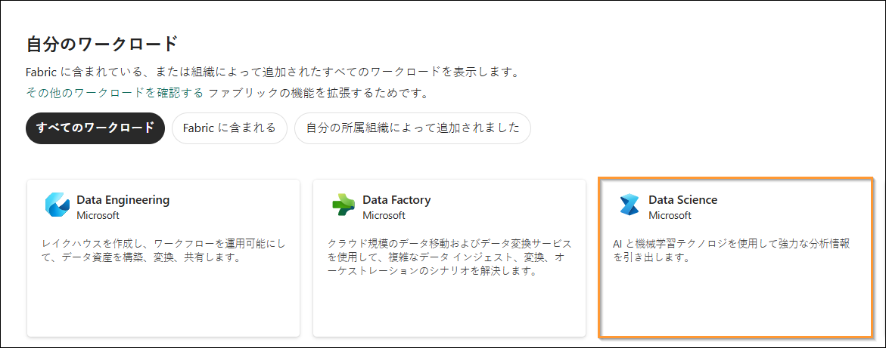

2. **Data Science** のホーム ページが表示されます。以下は、**Data Science** を手順に従って効果的に使用できるように設計されたセクションの詳細な概要です。

    **Data Science とは**

    Data Science は、AI と機械学習の技術を使用して高度な分析情報を活用するのに役立つツールです。これにより、本格的なデータ サイエンス ワークフローの実行と、データ エンリッチメントおよびビジネス分析情報のための AI の活用を支援するように設計された AI ツールが提供されます。

    **項目の種類:**

1. **ML モデル:** 機械学習モデルの作成に使用されます。

2. **実験:** 複数のモデルの作成、実行、開発の追跡に使用されます。

3. **ノートブック:** データを調査し、機械学習ソリューションを構築するために使用
    されます。

4. **環境:** 共有ライブラリ、Spark コンピューティングの設定、ノートブックと Spark ジョブ定義のリソースを設定するために使用されます。

5. **データ エージェント:** レイクハウス、ウェアハウス、Power BI セマンティック モデル、KQL データベースの格納データに関する質問に答える、会話型 AI エクスペリエンスを作成するために使用されます

6. **Python Notebook:** ローカル マシンから Python ノートブックをインポートするために使用されます。

    **作業の開始:**

    Data Science の使用を開始するには、次の手順に従います。

1. **サンプルの探索:** [選択] ボタンをクリックし、サンプルを使用して Data Science について学びます。

2. **機械学習モデルの概要:** [開く] ボタンをクリックして、機械学習モデルの使用を開始する方法を学びます。

3. **機械学習実験の概要:** [開く] ボタンをクリックして、機械学習の実験を実施する方法を学びます。

4. **ノートブックの使用を開始する:** [開く] ボタンをクリックして、ノートブックの使用を開始する方法を学びます。

5. **ノートブックを開発して実行する:** [開く] ボタンをクリックし、データ分析用のノートブックを開発して実行する方法を学びます。

    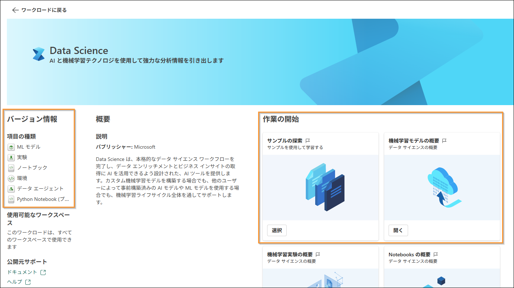

3. 画面の左上隅にある**ワークロードに戻る**をクリックします。このアクションによって主要なワークロードのページが表示され、そこで他のツールやセクションを探索できます。

    

### タスク 9: Data Warehouse のエクスペリエンス

1. **ワークロード** ページで、**Data Warehouse** をクリックして先に進みます。

    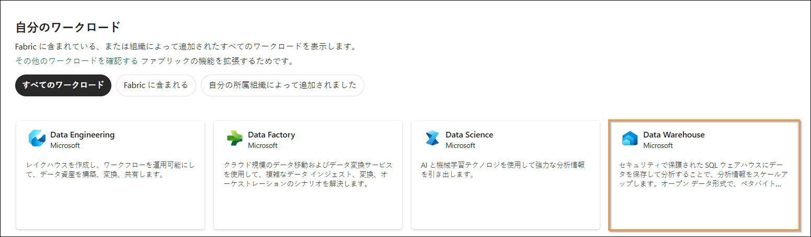

2. Data Warehouse のホーム ページが表示されます。以下は、Data Warehouse を手順に従って効果的に使用できるように設計されたセクションの詳細な概要です。

    **Data Warehouse とは**

    Data Warehouse は、セキュリティで保護された SQL ウェアハウスにデータを格納して分析するのに役立つツールです。これにより、トップクラスのパフォーマンスをペタバイト規模のオープン データ形式で利用して、分析情報をスケールアップすることができます。

    **項目の種類:**

1. **ウェアハウス:** データ ウェアハウスの作成に使用されます。

2. **サンプル ウェアハウス:** 構成済みのデータセットやモデルを使用して、データ ウェアハウジングの機能を確認およびテストするのに使用されます。

3. **ノートブック:** 対話型のデータ分析および可視化タスクの作成や共有に使用されます。

4. **ミラー化された Azure SQL Database:** Azure SQL Database をミラーリングするために使用されます。

5. **ミラー化された Azure Databricks カタログ:** 統合や分析の強化のために Azure Databricks からデータをミラーリングするのに使用されます。

6. **ミラー化された Snowflake:** Snowflake データベースをミラーリングするために使用
    されます。

7. **ミラー化 Oracle:** Oracle をミラーリングするために使用されます。

8. **ミラー化Google BigQuery (プレビュー):** Google BigQuery をミラーリングするために使用されます。

9. **ミラーリングされた SharePoint Online リスト (プレビュー):** は、SharePoint リストのデータを、読み取り専用の分析可能なソースとしてほぼリアルタイムで Microsoft Fabric OneLake にレプリケートします。これによって ETL が不要になり、自動作成された SQL 分析エンドポイントを介して、Power BI とその他の Fabric データベース用にデータが公開されます。

10. **ミラー化された Azure Cosmos DB:** Azure Cosmos DB をミラーリングするために使用されます。

11. **ミラー化された SQL Server:** SQL Server をミラーリングするために使用されます。

12. **ミラー化された Azure Database for PostgreSQL:** 既存の Azure Database for PostgreSQL をミラーリングするために使用されます。

13. **ミラー化された Azure Database for MySQL (プレビュー):** MySQL データを読み取り専用の分析可能なソースとして Microsoft Fabric OneLake にレプリケートし、ほぼリアルタイムの分析を ETL なしで可能にします

14. **ミラーリングされた Azure SQL Managed Instance:** 高可用性とディザスター リカバリーのために Azure SQL Managed Database をミラーリングするのに使用されます。

15. **ミラーリングされたデータベース:** 高可用性とディザスター リカバリーのためにデータベースを複製するのに使用されます。

16. **ミラー化された Dremio カタログ (プレビュー):** Dremio カタログのメタデータを Microsoft Fabric にミラーリングし (データはコピーされない)、Fabric ワークロードから読み取り専用の SQL 分析エンドポイントを介して、Dremio によって管理されているデータのクエリを実行できるショートカットを作成します。

    **作業の開始:**

    Data Warehouse の使用を開始するには、次の手順に従います。

1. **サンプル ウェアハウスの探索:** あらかじめ読み込まれているサンプル データを使用して、新しいウェアハウスを開始します。

2. **倉庫の概要:** [開く] ボタンをクリックして、ウェアハウスを使用してデータを分析する方法を学びます。

    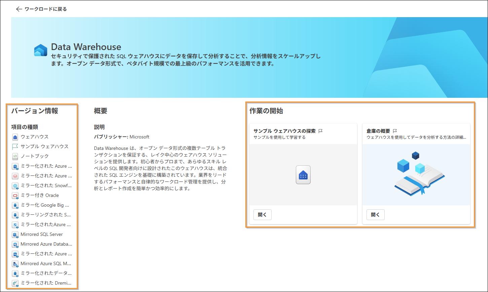

### タスク 10: データベースのエクスペリエンス

1. **ワークロード** ページで、**Databases** をクリックして先に進みます。

    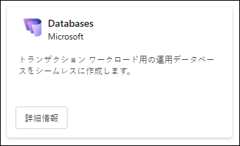

2. Databases のホーム ページが表示されます。以下は、Databases を手順に従って効果的に使用できるように設計されたセクションの詳細な概要です。

    **Fabric Database とは**

    Microsoft Fabric の SQL データベースは、Azure SQL Database をベースにした開発者向けのトランザクション データベースであり、Fabric で運用データベースを簡単に作成できます。Fabric の SQL データベースは、Azure SQL Database と同じ SQL Database Engine を使用します。

    **項目の種類:**

    a. **SQL データベース:** Fabric の SQL データベースはデータベース ワークロードの一部であり、Fabric の他の項目からそのデータにアクセスできます。また、SQL データベースのデータは、クエリを実行できる形式で OneLake 内に最新の状態で維持されます。そのため、Spark での分析の実行、ノートブックの実行、データ エンジニアリング、Power BI レポートでの視覚化など、さまざまなサービスを Fabric で使用できます。

    b. **Cosmos DB:** Microsoft Fabric の Cosmos DB は、シンプルな管理エクスペリエンスを提供する、AI によって最適化された NoSQL データベースです。開発者は、Fabric の Cosmos DB を使用することで、一般的なデータベース管理タスクを実行することなく、ストレスを少なくして AI アプリケーションを構築できます。

    **作業の開始:**

    Databases の使用を開始するには、次の手順に従います。

    a. **探索:** [開く] をクリックし、サンプル データベースを探索します。

    b. **Database concepts:** トランザクション データベースに関する一般的な用語と概念が説明されており、SQL Database の操作方法に慣れることができます。

    c. **Database templates:** あらかじめ作成された、一般的なデータベース デザインのテンプレート ライブラリを参照できます。

    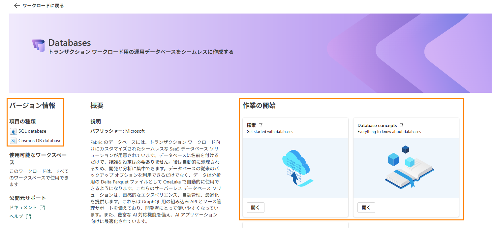

3. 画面の左上隅にある [ワークロードに戻る] をクリックします。このアクションによって主要なワークロードのページが表示され、そこで他のツールやセクションを探索で
    きます。

    

    このラボでは、Fabric インターフェイスの中を探索し、Fabric ワークスペースとレイクハウスを作成しました。次のラボでは、レイクハウスでショートカットを使用して ADLS Gen2 データに接続する方法、およびビューを使用してこのデータを変換する方法を学習します。

# **参考資料**

Fabric Analyst in a Day (FAIAD) では、Microsoft Fabric で使用できる主要な機能の一部をご紹介します。サービスのメニューにあるヘルプ (?) セクションには、いくつかの優れたリソースへのリンクがあります。

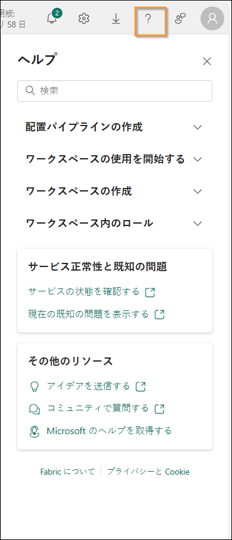

Microsoft Fabric の次のステップに役立つリソースをいくつか以下に紹介します。

- ブログ記事で全文を読む

- [ガイド付きツアー](https://aka.ms/Fabric-GuidedTour)を通じて Fabric を探索する

- [Microsoft Fabric の無料試用版](https://aka.ms/try-fabric)にサインアップする

- [Microsoft Fabric の Web サイト](https://aka.ms/microsoft-fabric)にアクセスする

- [Fabric の学習モジュール](https://aka.ms/learn-fabric)で新しいスキルを学ぶ

- [Fabric の技術ドキュメント](https://aka.ms/fabric-docs)を参照する

- [Fabric の作業開始に関する無料の e-book](https://aka.ms/fabric-get-started-ebook) を読む

- [Fabric コミュニティ](https://aka.ms/fabric-community)に参加し、質問の投稿やフィードバックの共有を行い、他のユーザーから学びを得る

より詳しい Fabric エクスペリエンスのお知らせに関するブログを参照してください。

- [Fabric の Data Factory エクスペリエンスに関するブログ](https://aka.ms/Fabric-Data-Factory-Blog)

- [Fabric の Synapse Data Engineering エクスペリエンスに関するブログ](https://aka.ms/Fabric-DE-Blog)

- [Fabric の Synapse Data Science エクスペリエンスに関するブログ](https://aka.ms/Fabric-DS-Blog)

- [Fabric の Synapse Data Warehousing エクスペリエンスに関するブログ](https://aka.ms/Fabric-DW-Blog)

- [Fabric の Synapse Real-Time Analytics エクスペリエンスに関するブログ](https://aka.ms/Fabric-RTA-Blog)

- [Power BI のお知らせに関するブログ](https://aka.ms/Fabric-PBI-Blog)

- [Fabric の Data Activator エクスペリエンスに関するブログ](https://aka.ms/Fabric-DA-Blog)

- [Fabric の管理とガバナンスに関するブログ](https://aka.ms/Fabric-Admin-Gov-Blog)

- [Fabric の OneLake に関するブログ](https://aka.ms/Fabric-OneLake-Blog)

- [Dataverse と Microsoft Fabric の統合に関するブログ](https://aka.ms/Dataverse-Fabric-Blog)

© 2026 Microsoft Corporation. All rights reserved.

このデモ/ラボを使用すると、次の条件に同意したことになります。

このデモ/ラボで説明するテクノロジまたは機能は、ユーザーのフィードバックを取得し、学習エクスペリエンスを提供するために、Microsoft Corporation によって提供されます。ユーザーは、このようなテクノロジおよび機能を評価し、Microsoft にフィードバックを提供するためにのみデモ/ラボを使用できます。それ以外の目的には使用できません。このデモ/ラボまたはその一部を、変更、コピー、配布、送信、表示、実行、再現、発行、ライセンス、著作物の作成、転送、または販売することはできません。

複製または再頒布のために他のサーバーまたは場所にデモ/ラボ (またはその一部) をコピーまたは複製することは明示的に禁止されています。

このデモ/ラボは、前に説明した目的のために複雑なセットアップまたはインストールを必要としないシミュレーション環境で潜在的な新機能や概念などの特定のソフトウェア テクノロジ/製品の機能を提供します。このデモ/ラボで表されるテクノロジ/概念は、フル機能を表していない可能性があり、最終バージョンと動作が異なることがあります。また、そのような機能や概念の最終版がリリースされない場合があります。物理環境でこのような機能を使用するエクスペリエンスが異なる場合もあります。

**フィードバック。**このデモ/ラボで説明されているテクノロジ、機能、概念に関するフィードバックを Microsoft に提供する場合、ユーザーは任意の方法および目的でユーザーのフィードバックを使用、共有、および商品化する権利を無償で Microsoft に提供するものとします。また、ユーザーは、フィードバックを含む Microsoft のソフトウェアまたはサービスの特定部分を使用したり特定部分とインターフェイスを持ったりする製品、テクノロジ、サービスに必要な特許権を無償でサード パーティに付与します。ユーザーは、フィードバックを含めるために Microsoft がサード パーティにソフトウェアまたはドキュメントをライセンスする必要があるライセンスの対象となるフィードバックを提供しません。これらの権限は、本契約の後も存続します。

Microsoft Corporation は、明示、黙示、または法律上にかかわらず、商品性のすべての保証および条件、特定の目的、タイトル、非侵害に対する適合性など、デモ/ラボに関するすべての保証および条件を拒否します。Microsoft は、デモ/ラボから派生する結果、出力の正確さ、任意の目的に対するデモ/ラボに含まれる情報の適合性に関して、いかなる保証または表明もしません。

**免責事項**

このデモ/ラボには、Microsoft Power BI の新機能と機能強化の一部のみが含まれています。一部の機能は、製品の将来のリリースで変更される可能性があります。このデモ/ ラボでは、新機能のすべてではなく一部について学習します。
