# Microsoft Fabric - Fabric Analyst in a Day - ラボ 3

## 目次

- 概要
- ADLS Gen2 へのショートカット
  - タスク 1: ショートカットを作成する
- ビジュアル クエリを使用してデータを変換する
  - タスク 2: ビジュアル クエリを使用して Geo ビューを作成する
  - タスク 3: SQL クエリを使用して Reseller、Sales、Product ビューを作成する
- 参考資料


# 概要

このシナリオでは、ERP システムから取得された販売データが ADLS Gen2 に格納されています。毎日正午 (午後 12 時) に更新されます。このデータを変換してレイクハウスに取り込み、モデルで使用する必要があります。

このデータは複数の方法で取り込むことができます。

- **ショートカット:** データへのリンクが作成されます。ビジュアル クエリ ビューを使用して、データを変換できます。このラボではショートカットを使用します。

- **Notebooks:** この方法ではコードを記述する必要があります。これは、開発者にとって使いやすい方法です。

- **データフロー (Gen2) を使用する。**Power Query やデータフロー (Gen1) についてはおそらくなじみがあることと思います。データフロー (Gen2) はその名前が示すように、新しいバージョンのデータフローです。Power Query とデータフロー (Gen1) のすべての機能に加え、データを変換して複数のデータ ソースに取り込む機能が追加されています。これについては以降のラボで紹介します。

- **パイプライン:** これはオーケストレーション ツールです。アクティビティに調整を加え、データを抽出、変換して取り込むことができます。ここではパイプラインを使用してデータフロー Gen2 のアクティビティを実行し、抽出、変換、取り込みを行います。

まず、ショートカットを作成して、ADLS Gen2 データ ソースからレイクハウスにデー タを取り込みます。データを取り込んだら、ビジュアル クエリ ビューを使用して、 データを変換します。

このラボを終了すると、次のことが学べます。

- レイクハウスにショートカットを作成する方法

- ビジュアル クエリ機能を使用してデータを変換する方法

# ADLS Gen2 へのショートカット

### タスク 1: ショートカットを作成する

ショートカットは、ターゲットとなる場所へのリンクを作成するために使用されます。ショートカットを使用すると、データをレイクハウスに物理的に移すことなく、データにアクセスできます。これは、Windows デスクトップでのショートカットの作成に似ています。

1. 画面の上部にある **lh_FAIAD** タブを選択し、レイクハウスに移動します。

    1. タブが表示されない場合は、ワークスペースに戻って、そこからレイクハウスを開くことができます。

2. **エクスプローラー** パネルで、**テーブル**の横にある**省略記号**を選択します。

3. **新しいショートカット**を選択します。

    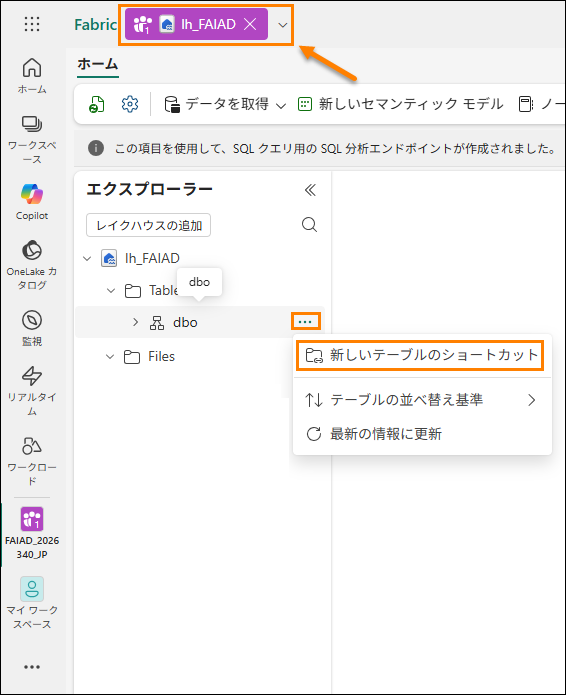

4. **新しいショートカット** ダイアログが開きます。**外部ソース**で、**Azure Data Lake Storage Gen2** を選択します。

    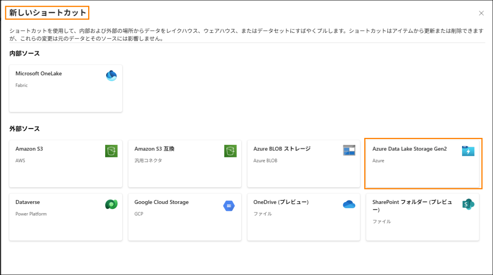

5. **新しい接続 (1)** を選択します。

6. **URL** プロパティに次のリンクを入力します: https://stvnextblobstorage.dfs.core.windows.net/fabrikam-sales **(2)**:

7. [接続] セクションで、[新しい接続の作成] **をクリックします (3)**

8. [認証の種類] ドロップダウンから、**Shared Access Signature (SAS) (4)** を選択します。

9. SAS トークンをコピーして、SAS トークン (5) フィールドに貼り付けます。

    - **SAS トークン:**

10. 画面右下の**次へ (6)** を選択します。

    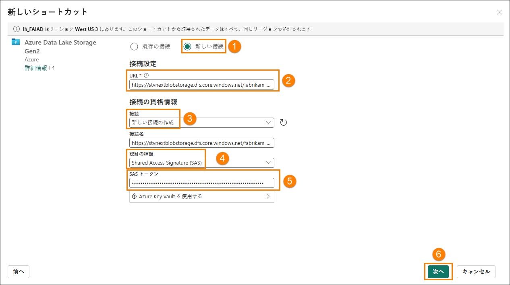

11. ADLS Gen2 に接続され、左パネルにディレクトリ構造が表示されます。
    **Delta-Parquet-Format-FY25 (1)** を展開します。

12. 以下のディレクトリ **(2)** を**選択**してから、**次へ (3)** を選択します。

    1. Application.Cities

    2. Application.Countries

    3. Application.StateProvinces

    4. DateDim

    5. Sales.BuyingGroups

    6. Sales.Customers

    7. Sales.InvoiceLines

    8. Sales.Invoices

    9. Warehouse.StockGroups

    10. Warehouse.StockItemStockGroups

    11. Warehouse.StockItems

    **注:** Sales.Invoice_May だけが、**選択されない**ディレクトリです。

    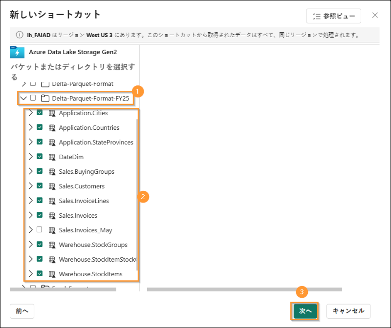

13. 名前を編集できる次のダイアログが表示されます。**Application.Cities** の [アクション] の下にある**編集アイコン (1)** を選択します。

14. 名前を **Application.Cities から Cities に (2)** 変更します。

15. 名前の横にあるチェック マーク **(3)** を選択して、変更を保存します。

    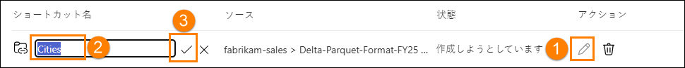

16. 同様に、ショートカット名を次のように変更します。

    1. Application.Countries から **Countries** へ

    2. Application.StateProvinces から **States** へ

    3. DateDim から **Date** へ

    4. Sales.BuyingGroups から **BuyingGroups** へ

    5. Sales.Customers から **Customers** へ

    6. Sales.InvoiceLines から **InvoiceLineItems** へ

    7. Sales.Invoices から **Invoices** へ

    8. Warehouse.StockGroups から **ProductGroups** へ

    9. Warehouse.StockItemStockGroups から **ProductItemGroup** へ

    10. Warehouse.StockItems から **ProductItem** へ

    **注:** 名前をもう一度確認してください。入力ミスがあると、ラボの間のエラーの原因になります。

17. **作成**を選択して、ショートカットを作成します。

    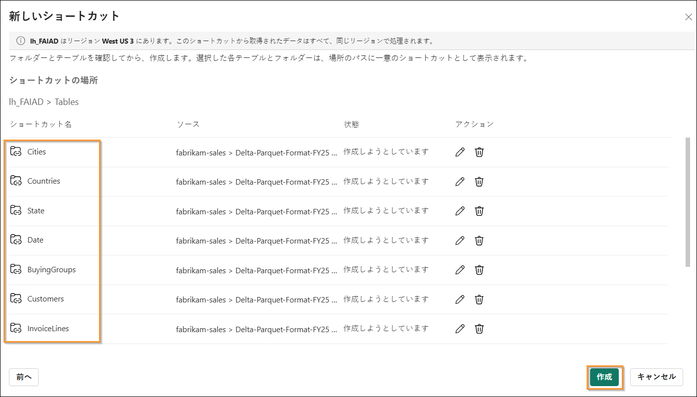

18. すべてのショートカットがテーブルとして作成されていることに注意してください。**BuyingGroups** テーブルを選択し、データ パネルにデータのプレビューが表示されることを確認してください。

    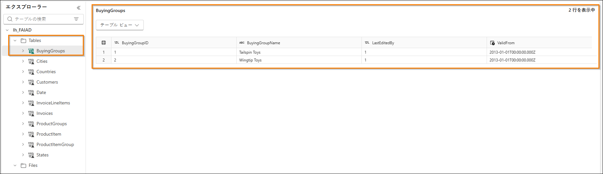

    次の手順では、セマンティック モデルを作成するために、データを変換します。データを変換するためのビューを作成します。

# ビジュアル クエリを使用してデータを変換する

### タスク 2: ビジュアル クエリを使用して Geo ビューを作成する

1. SQL エンドポイントを使用して、**レイクハウス**にアクセスできます。これにより、
    データに対するクエリの実行や、ビューの作成が可能になります。画面の**右上**で、 **レイクハウス (1) -> SQL 分析エンドポイント (2)** を選択します。

    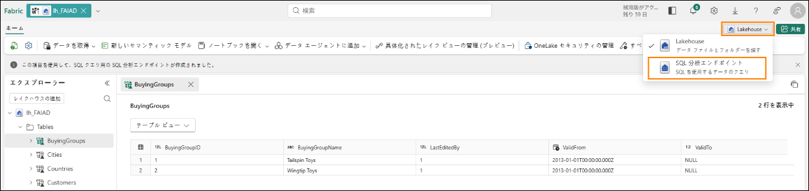

    SQL 分析エンドポイントが表示されます。上部のナビゲーションに新しい項目が追加されました。そのタブを選択すると、レイクハウスに戻ることができます。[エクスプローラー] パネルが変更されていることを確認してください。ビュー、ストアド プロシージャ、クエリなどを作成することができます。ここでは、Power Query のようなローコード インターフェイスを提供するビジュアル クエリを作成します。結果をビューとして保存します。

    最初に、Geo ビューを作成します。Geo ビューを作成するには、Cities、States、Countries の各テーブルからのデータをマージする必要があります。

2. 上部のメニューで、**新規 SQL クエリ (1)** の横にあるドロップ ダウンをクリックし、
    **新規のビジュアル クエリ (2)** を選択します。

    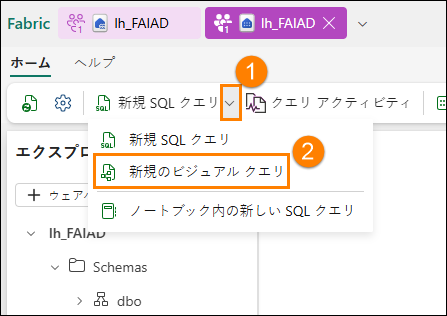

3. クエリを作成するには、テーブルを [ビジュアル クエリ] パネルに追加する必要が
    あります。**Cities (1)** テーブルの横の省略記号をクリックし、**キャンバスに挿入 (2)** を選択します。

    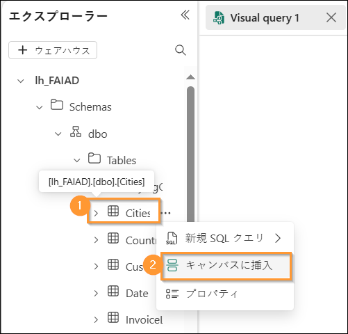

4. **States** および **Countries** テーブルに対して同じ手順を繰り返します。

    次に、これらのクエリをマージする必要があります。ビジュアル クエリ エディターには、Power Query エディターを使用するためのオプションがあります。Power BI で慣れている ので、これを使用しましょう。

5. **ビジュアル クエリ エディターのメニューからポップアップで開く** アイコンを選択し
    ます (右側にあります)。Power Query エディターが表示されます。

    **注:** このアイコンがすぐに表示されない場合、右にスクロールするか、ビジュアル クエリ タブを再度開くことが必要な場合があります

    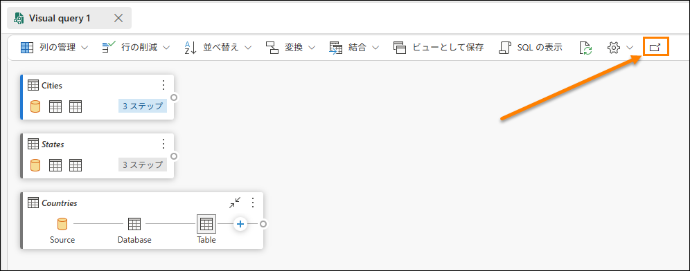

6. **Cities (1)** クエリを選択した状態で、Power Query エディターのリボンから**ホーム (2) -> 結合 (3) -> クエリのマージ ドロップダウン (4) -> 新規としてクエリをマージ (5)** を選択します。

    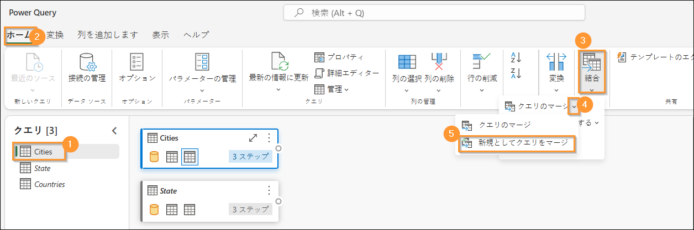

7. **マージ用の左テーブル**で** Cities** を選択します。

8. **マージ用の右テーブル**で** States** を選択します。

9. 両方のテーブルから **StateProvinceID** 列を選択します。この列を使用して結合
    を実行します。

10. **結合の種類**として**内部**を選択します。

11. **OK** を選択します。

    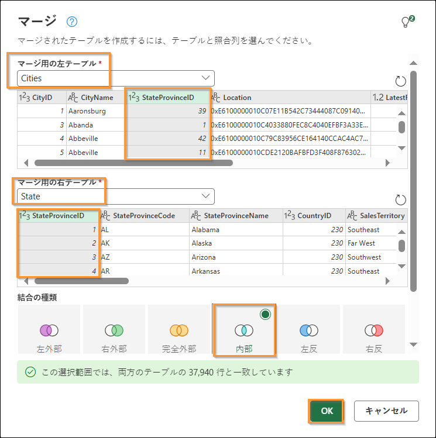

    **マージ**という名前の新しいクエリが作成されたことを確認してください。States の列がいくつか必要になります。

12. **データ ビュー** (下部のパネル) で、**States** 列 (右端の列) の横にある**二重矢印**をク
    リックします。

13. パネルが開きます。選択された列が次のものだけであることを確認します。

    1. StateProvinceCode

    2. StateProvinceName

    3. CountryID

    4. SalesTerritory

14. **OK** を選択します。

    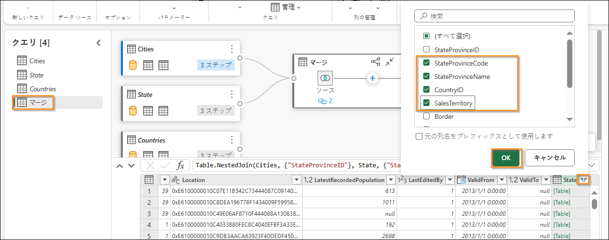

    次に、Countries クエリをマージする必要があります。

15. マージ クエリを選択した状態 **(1)** で、**ホーム (2) -> 結合 (3) -> クエリのマージ ドロップダウン (4) -> クエリのマージ (5)** を選択します。

    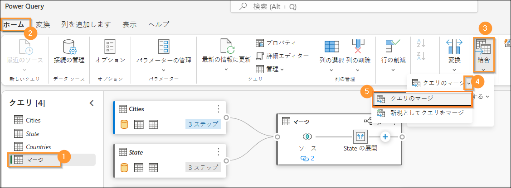

16. [マージ] クエリ ダイアログが開きます。**マージ用の右テーブル**で** Countries** を選
    択します。

17. 両方のテーブルから **CountryID** 列を選択します。この列を使用して結合を
    実行します。

18. **結合の種類**として**内部**を選択します。

19. **OK** を選択します。

    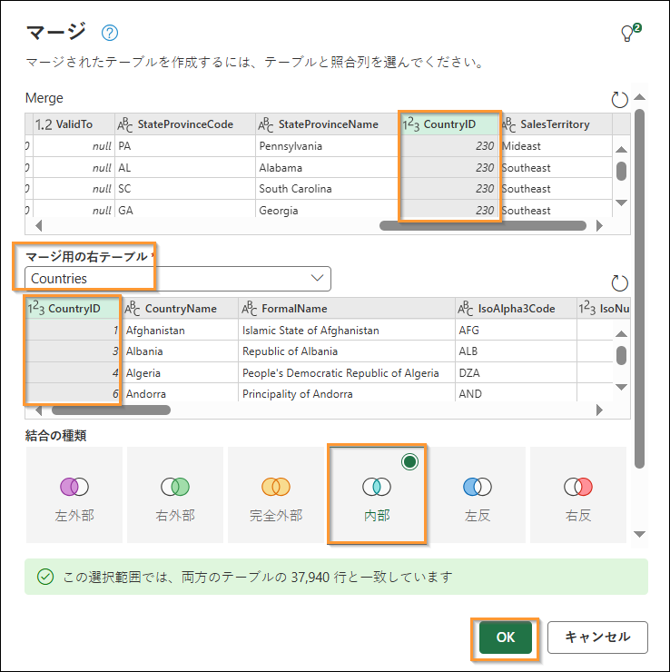

    Countries の列がいくつか必要になります。

20. **データ ビュー** (下部のパネル) で、**Countries** 列の横にある**二重矢印**をクリックします。

21. パネルが開きます。選択された列が次のものだけであることを確認します。

    1. CountryName

    2. FormalName

    3. IsoAlpha3Code

    4. IsoNumericCode

    5. CountryType

    6. Continent

    7. Region

    8. Subregion

22. **OK** を選択します。

    **重要:** 下にスクロールし、ステップ 21 の一覧で示された 8 つの列をすべて選択してください。次のスクリーンショットでは、UI の制限のため最初の 5 列のみが表示されています。

    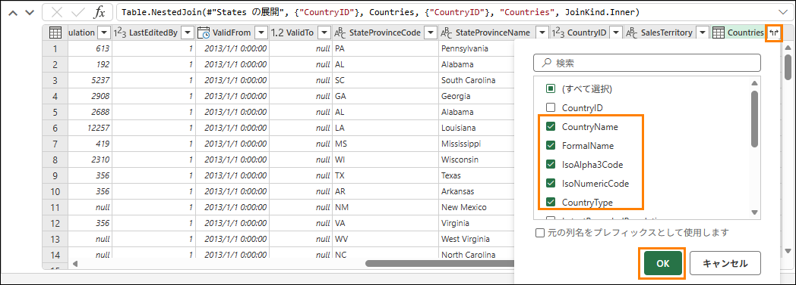

    **Merge** テーブルのすべての列が必要なわけではありません。必要なものだけを選択して ください。

23. **Merge** クエリを選択した状態 (1) で、リボンから**ホーム (2) - > 列の選択 (3) -> 列の選択 (4)** を選択します。

    **注:** [列の選択] オプションが表示されない場合は、[列の管理] の下に見つかります。

    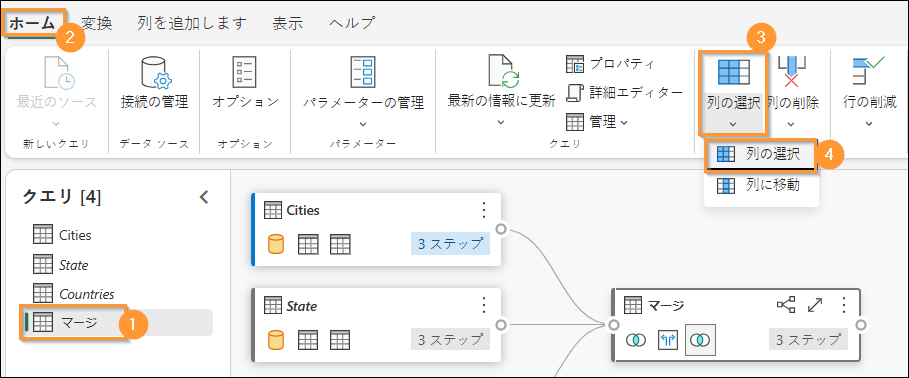

24. [列の選択] ダイアログが開きます。次の列を**オフにします**。

    1. StateProvinceID

    2. Location

    3. LastEditedBy

    4. ValidFrom

    5. ValidTo

    6. CountryID

25. **OK** を選択します。

    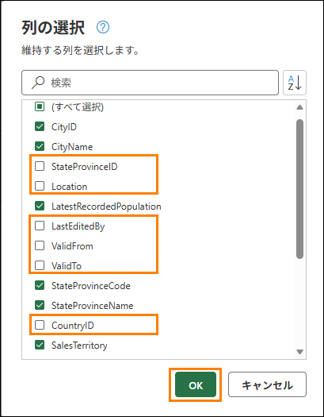

    プロセスは Power Query と類似しており、すべてのステップが、右側の [適用されたステップ] パネルとビジュアル ビューの両方に記録されていることを確認してください。マージ クエリの名前を変更し、読み込みを有効にして、このクエリからデータを読み込みましょう。

26. [クエリ] パネル (左) で、**マージ** クエリを**右クリック**します。**名前の変更**を選択し、
    クエリの名前を **Geo** に変更します。

27. [クエリ] パネル (左) で、**Geo** クエリを**右クリック**します。**読み込みを有効にする\**
    を選択し、このクエリを有効にします。

28. Cities、States、Countries の各クエリが**無効になっている**ことを確認します。

29. Power Query エディターの右下にある**保存**を選択します。

    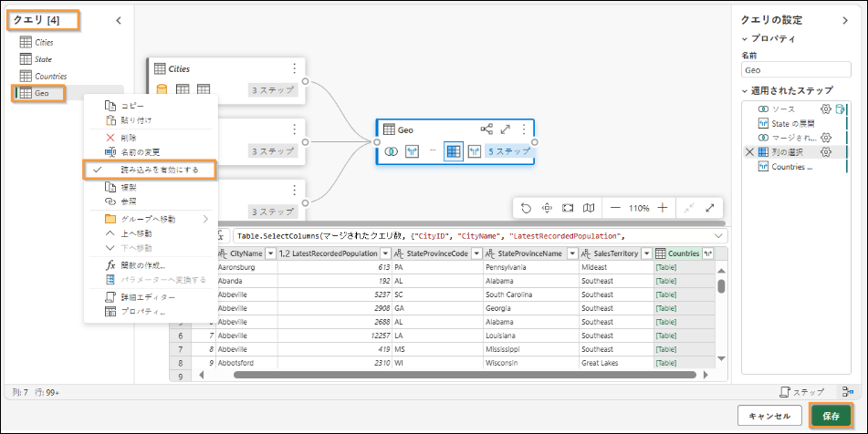

    ビジュアル クエリ エディターが表示されます。ここでは、このクエリをビューとして 保存します。

    **注:** Power Query エディターを使用して実行したすべてのステップは、ビジュアル クエリ エディターを使用して実行することもできます。

30. ビジュアル クエリ エディターのメニューから**ビューとして保存**を選択します。

    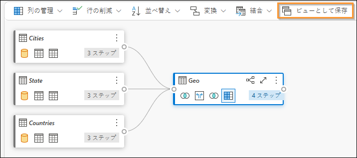

    [ビューとして保存] ダイアログが開きます。SQL クエリが使用可能になっていることに注目してください。検証の必要がある場合は、SQL コードを確認できます。

31. **ビュー名**に** Geo** と入力します。

32. **OK** を選択してビューを保存します。

    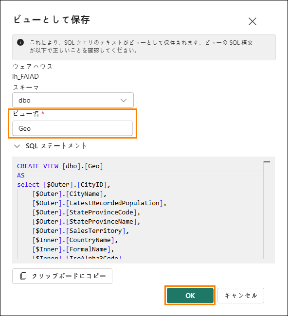

    ビューが保存されると、アラートが表示されます。

33. [エクスプローラー] パネル (左) で、**Views** を展開します。新しく作成された Geo ビューがあります。

    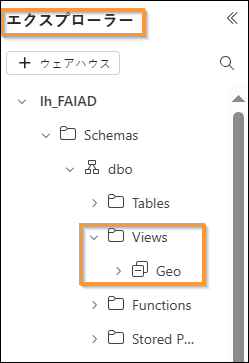

### タスク 3: SQL クエリを使用して Reseller、Sales、Product ビューを作成する

1. Fabric では、SQL クエリを使用してビューを作成することもできます。上部のリボンで [New SQL query] を選択します**\**
    

2. ここでは、必要なビューを作成するのに役立つ TSQL を記述します。

3. **以下の SQL クエリ**をクエリ** ウィンドウ**に貼り付けます。これにより、Reseller、Sales、Product の 3 つのビューが作成されます。

    ```sql
    CREATE VIEW dbo.Reseller AS select [\$Outer].[ResellerID] as [ResellerID], [\$Outer].[ResellerName] as [ResellerName], [\$Outer].[PostalCityID] as [PostalCityID], [\$Outer].[PhoneNumber] as [PhoneNumber], [\$Outer].[FaxNumber] as [FaxNumber], [\$Outer].[WebsiteURL] as [WebsiteURL], [\$Outer].[DeliveryAddressLine1] as [DeliveryAddressLine1], [\$Outer].[DeliveryAddressLine2] as [DeliveryAddressLine2], [\$Outer].[DeliveryPostalCode] as [DeliveryPostalCode], [\$Outer].[PostalAddressLine1] as [PostalAddressLine1], [\$Outer].[PostalAddressLine2] as [PostalAddressLine2], [\$Outer].[PostalPostalCode] as [PostalPostalCode], [\$Inner].[BuyingGroupName] as [ResellerCompany] from [lh_FAIAD].[dbo].[Customers] as [\$Outer] inner join ( select [_].[BuyingGroupID] as [BuyingGroupID2], [_].[BuyingGroupName] as [BuyingGroupName], [_].[LastEditedBy] as [LastEditedBy2], [_].[ValidFrom] as [ValidFrom2], [_].[ValidTo] as [ValidTo2] from [lh_FAIAD].[dbo].[BuyingGroups] as [_] ) as [\$Inner] on ([\$Outer].[BuyingGroupID] = [\$Inner].[BuyingGroupID2] or [\$Outer].[BuyingGroupID] is null and [\$Inner].[BuyingGroupID2] is null) GO

    CREATE VIEW dbo.Sales AS select [\$Outer].[InvoiceLineID] as [InvoiceLineID], [\$Outer].[InvoiceID] as [InvoiceID], [\$Outer].[StockItemID] as [StockItemID], [\$Outer].[Quantity] as [Quantity], [\$Outer].[UnitPrice] as [UnitPrice], [\$Outer].[TaxRate] as [TaxRate], [\$Outer].[TaxAmount] as [TaxAmount], [\$Outer].[LineProfit] as [LineProfit], [\$Outer].[ExtendedPrice] as [ExtendedPrice], [\$Outer].[CustomerID] as [ResellerID], [\$Outer].[SalespersonPersonID] as [SalespersonPersonID], [\$Outer].[InvoiceDate] as [InvoiceDate], [\$Outer].[t0_0] as [Sales Amount] from ( select [_].[InvoiceLineID] as [InvoiceLineID], [_].[InvoiceID] as [InvoiceID], [_].[StockItemID] as [StockItemID], [_].[Quantity] as [Quantity], [_].[UnitPrice] as [UnitPrice], [_].[TaxRate] as [TaxRate], [_].[TaxAmount] as [TaxAmount], [_].[LineProfit] as [LineProfit], [_].[ExtendedPrice] as [ExtendedPrice], [_].[CustomerID] as [CustomerID], [_].[SalespersonPersonID] as [SalespersonPersonID], [_].[InvoiceDate] as [InvoiceDate], [_].[ExtendedPrice] - [_].[TaxAmount] as [t0_0] from ( select [\$Outer].[InvoiceLineID], [\$Outer].[InvoiceID], [\$Outer].[StockItemID], [\$Outer].[Quantity], [\$Outer].[UnitPrice], [\$Outer].[TaxRate], [\$Outer].[TaxAmount], [\$Outer].[LineProfit], [\$Outer].[ExtendedPrice], [\$Inner].[CustomerID], [\$Inner].[SalespersonPersonID], [\$Inner].[InvoiceDate] from [lh_FAIAD].[dbo].[InvoiceLineItems] as [\$Outer] inner join ( select [_].[InvoiceID] as [InvoiceID2], [_].[CustomerID] as [CustomerID], [_].[BillToResellerID] as [BillToResellerID], [_].[OrderID] as [OrderID], [_].[DeliveryMethodID] as [DeliveryMethodID], [_].[ContactPersonID] as [ContactPersonID], [_].[AccountsPersonID] as [AccountsPersonID], [_].[SalespersonPersonID] as [SalespersonPersonID], [_].[PackedByPersonID] as [PackedByPersonID], [_].[InvoiceDate] as [InvoiceDate], [_].[CustomerPurchaseOrderNumber] as [CustomerPurchaseOrderNumber], [_].[IsCreditNote] as [IsCreditNote], [_].[CreditNoteReason] as [CreditNoteReason], [_].[Comments] as [Comments], [_].[DeliveryInstructions] as [DeliveryInstructions], [_].[InternalComments] as [InternalComments], [_].[TotalDryItems] as [TotalDryItems], [_].[TotalChillerItems] as [TotalChillerItems], [_].[DeliveryRun] as [DeliveryRun], [_].[RunPosition] as [RunPosition], [_].[ReturnedDeliveryData] as [ReturnedDeliveryData], [_].[ConfirmedDeliveryTime] as [ConfirmedDeliveryTime], [_].[ConfirmedReceivedBy] as [ConfirmedReceivedBy], [_].[LastEditedBy] as [LastEditedBy2], [_].[LastEditedWhen] as [LastEditedWhen2] from [lh_FAIAD].[dbo].[Invoices] as [_] ) as [\$Inner] on ([\$Outer].[InvoiceID] = [\$Inner].[InvoiceID2] or [\$Outer].[InvoiceID] is null and [\$Inner].[InvoiceID2] is null) ) as [_] ) as [\$Outer] where exists ( select 1 from ( select [ResellerID] from [lh_FAIAD].[dbo].[Reseller] as [\$Table] ) as [\$Inner] where [\$Outer].[CustomerID] = [\$Inner].[ResellerID] or [\$Outer].[CustomerID] is null and [\$Inner].[ResellerID] is null ) GO

    CREATE VIEW dbo.Product AS select [\$Outer].[StockItemID], [\$Outer].[StockItemName], [\$Outer].[SupplierID], [\$Outer].[Size], [\$Outer].[IsChillerStock], [\$Outer].[TaxRate], [\$Outer].[UnitPrice], [\$Outer].[RecommendedRetailPrice], [\$Outer].[TypicalWeightPerUnit], [\$Inner].[StockGroupName] from ( select [\$Outer].[StockItemID], [\$Outer].[StockItemName], [\$Outer].[SupplierID], [\$Outer].[ColorID], [\$Outer].[UnitPackageID], [\$Outer].[OuterPackageID], [\$Outer].[Brand], [\$Outer].[Size], [\$Outer].[LeadTimeDays], [\$Outer].[QuantityPerOuter], [\$Outer].[IsChillerStock], [\$Outer].[Barcode], [\$Outer].[TaxRate], [\$Outer].[UnitPrice], [\$Outer].[RecommendedRetailPrice], [\$Outer].[TypicalWeightPerUnit], [\$Outer].[MarketingComments], [\$Outer].[InternalComments], [\$Outer].[Photo], [\$Outer].[CustomFields], [\$Outer].[Tags], [\$Outer].[SearchDetails], [\$Outer].[LastEditedBy], [\$Outer].[ValidFrom], [\$Outer].[ValidTo], [\$Inner].[StockGroupID] from [lh_FAIAD].[dbo].[ProductItem] as [\$Outer] left outer join ( select [_].[StockItemStockGroupID] as [StockItemStockGroupID], [_].[StockItemID] as [StockItemID2], [_].[StockGroupID] as [StockGroupID], [_].[LastEditedBy] as [LastEditedBy2], [_].[LastEditedWhen] as [LastEditedWhen] from [lh_FAIAD].[dbo].[ProductItemGroup] as [_] ) as [\$Inner] on ([\$Outer].[StockItemID] = [\$Inner].[StockItemID2] or [\$Outer].[StockItemID] is null and [\$Inner].[StockItemID2] is null) ) as [\$Outer] left outer join ( select [_].[StockGroupID] as [StockGroupID2], [_].[StockGroupName] as [StockGroupName], [_].[LastEditedBy] as [LastEditedBy2], [_].[ValidFrom] as [ValidFrom2], [_].[ValidTo] as [ValidTo2] from [lh_FAIAD].[dbo].[ProductGroups] as [_] ) as [\$Inner] on ([\$Outer].[StockGroupID] = [\$Inner].[StockGroupID2] or [\$Outer].[StockGroupID] is null and [\$Inner].[StockGroupID2] is null) GO
    ```
4. 貼り終えたら、**Run** を選択します。

    

5. [エクスプローラー] パネル (左) で、Views を展開します。新しく作成されたビューと、すぐに使用できるデータが表示されます。

    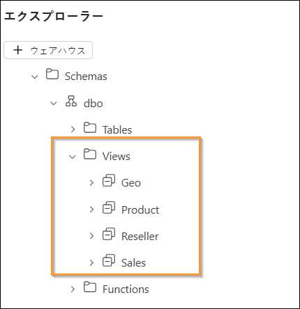

    ADLS Gen2 データソースからデータを変換しました。このラボでは、ショートカットの作成方法を学習し、ビジュアル クエリ ビューを使用してデータを変換するためのさまざまなオプションを確認しました。

    次のラボでは、データフロー (Gen2) の使用方法と別のレイクハウスへのショートカットの作成方法を学習します。

# 参考資料

Fabric Analyst in a Day (FAIAD) では、Microsoft Fabric で使用できる主要な機能の一部をご紹介します。サービスのメニューにあるヘルプ (?) セクションには、いくつかの優れたリソースへのリンクがあります。

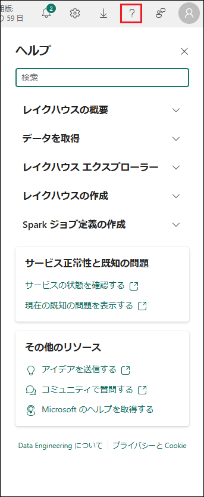

Microsoft Fabric の次のステップに役立つリソースをいくつか以下に紹介します。

- ブログ記事で [Microsoft Fabric の GA に関するお知らせ](https://aka.ms/Fabric-Hero-Blog-Ignite23)の全文を確認する

- [ガイド付きツアー](https://aka.ms/Fabric-GuidedTour)を通じて Fabric を探索する

- [Microsoft Fabric の無料試用版](https://aka.ms/try-fabric)にサインアップする

- [Microsoft Fabric の Web サイト](https://aka.ms/microsoft-fabric)にアクセスする

- [Fabric の学習モジュール](https://aka.ms/learn-fabric)で新しいスキルを学ぶ

- [Fabric の技術ドキュメント](https://aka.ms/fabric-docs)を参照する

- [Fabric 入門編の無料の e-book](https://aka.ms/fabric-get-started-ebook) を読む

- [Fabric コミュニティ](https://aka.ms/fabric-community)に参加し、質問の投稿やフィードバックの共有を行い、
他のユーザーから学びを得る

より詳しい Fabric エクスペリエンスのお知らせに関するブログを参照してください。

- [Fabric の Data Factory エクスペリエンスに関するブログ](https://aka.ms/Fabric-Data-Factory-Blog)

- [Fabric の Synapse Data Engineering エクスペリエンスに関するブログ](https://aka.ms/Fabric-DE-Blog)

- [Fabric の Synapse Data Science エクスペリエンスに関するブログ](https://aka.ms/Fabric-DS-Blog)

- [Fabric の Synapse Data Warehousing エクスペリエンスに関するブログ](https://aka.ms/Fabric-DW-Blog)

- [Fabric の Synapse Real-Time Analytics エクスペリエンスに関するブログ](https://aka.ms/Fabric-RTA-Blog)

- [Power BI のお知らせに関するブログ](https://aka.ms/Fabric-PBI-Blog)

- [Fabric の Data Activator エクスペリエンスに関するブログ](https://aka.ms/Fabric-DA-Blog)

- [Fabric の管理とガバナンスに関するブログ](https://aka.ms/Fabric-Admin-Gov-Blog)

- [Fabric の OneLake に関するブログ](https://aka.ms/Fabric-OneLake-Blog)

- [Dataverse と Microsoft Fabric の統合に関するブログ](https://aka.ms/Dataverse-Fabric-Blog)

© 2023 Microsoft Corporation.All rights reserved.

このデモ/ラボを使用すると、次の条件に同意したことになります。

このデモ/ラボで説明するテクノロジまたは機能は、ユーザーのフィードバックを取得し、学習エクスペリエンスを提供するために、Microsoft Corporation によって提供されます。ユーザーは、このようなテクノロジおよび機能を評価し、Microsoft にフィードバックを提供するためにのみデモ/ラボを使用できます。それ以外の目的には使用できません。このデモ/ラボまたはその一部を、変更、コピー、配布、送信、表示、実行、再現、発行、ライセンス、著作物の作成、転送、または販売することはできません。

複製または再頒布のために他のサーバーまたは場所にデモ/ラボ (またはその一部) をコピーまたは複製することは明示的に禁止されています。

このデモ/ラボは、前に説明した目的のために複雑なセットアップまたはインストールを必要としないシミュレーション環境で潜在的な新機能や概念などの特定のソフトウェア テクノロジ/製品の機能を提供します。このデモ/ラボで表されるテクノロジ/概念は、フル機能を表していない可能性があり、最終バージョンと動作が異なることがあります。また、そのような機能や概念の最終版がリリースされない場合があります。物理環境でこのような機能を使用するエクスペリエンスが異なる場合もあります。

**フィードバック。**このデモ/ラボで説明されているテクノロジ、機能、概念に関するフィードバックを Microsoft に提供する場合、ユーザーは任意の方法および目的でユーザーのフィードバックを使用、共有、および商品化する権利を無償で Microsoft に提供するものとします。また、ユーザーは、フィードバックを含む Microsoft のソフトウェアまたはサービスの特定部分を使用したり特定部分とインターフェイスを持ったりする製品、テクノロジ、サービスに必要な特許権を無償でサード パーティに付与します。ユーザーは、フィードバックを含めるために Microsoft がサード パーティにソフトウェアまたはドキュメントをライセンスする必要があるライセンスの対象となるフィードバックを提供しません。これらの権限は、本契約の後も存続します。

Microsoft Corporation は、明示、黙示、または法律上にかかわらず、商品性のすべての保証および条件、特定の目的、タイトル、非侵害に対する適合性など、デモ/ラボに関するすべての保証および条件を拒否します。Microsoft は、デモ/ラボから派生する結果、出力の正確さ、任意の目的に対するデモ/ラボに含まれる情報の適合性に関して、いかなる保証または表明もしません。

**免責事項**

このデモ/ラボには、Microsoft Power BI の新機能と機能強化の一部のみが含まれてい ます。一部の機能は、製品の将来のリリースで変更される可能性があります。この デモ/ラボでは、新機能のすべてではなく一部について学習します。
