# Microsoft Fabric - Fabric Analyst in a Day - ラボ 5


## 目次

- 概要
- Dataflow Gen2
  - タスク 1: Supplier データフローのスケジュールされた更新を構成する
- パイプライン
  - タスク 2: パイプラインを作成する
  - タスク 3: シンプルなパイプラインを構築する
  - タスク 4: 新しいパイプラインを作成する
  - タスク 5: Until アクティビティを作成する
  - タスク 6: 変数を作成する
  - タスク 7: Until アクティビティを構成する
  - タスク 8: データフロー アクティビティを構成する
  - タスク 9: 最初の変数の設定アクティビティを構成する
  - タスク 10: 2 番目の変数の設定アクティビティを構成する
  - タスク 11: 3 番目の変数の設定アクティビティを構成する
  - タスク 12: Wait アクティビティを構成する
  - タスク 13: パイプラインのスケジュールされた更新を構成する
- リファレンス


# 概要

さまざまなデータ ソースからレイクハウスにデータを取り込みました。このラボでは、データ ソースの更新スケジュールを設定します。要件を要約しておきましょう。

- **Supplier データ:** Snowflake で、毎日真夜中 (午前 12 時) に更新されます。

- **従業員データ:** SharePoint で、毎日午前 9 時に更新されます。ただし、5 分から 15 分の遅延が発生する場合があることを確認しています。これに対応できるように更新スケジュールを作成する必要があります。

- **顧客データ:** Dataverse で、常に最新の状態です。以前は、このデータを 1 日に 4 回更新していました (真夜中 (午前 12 時)、午前 6 時、正午 (午後 12 時)、午後 6 時)。現在では、IT チームによって Dataverse へのリンクが作成され、このデータは管理レイクハウスに取り込まれます。また、このデータの変換も行われました。IT チームが提供するレイクハウスにリンクしているため、更新を設定する必要はありません。

- **販売データ:** ADLS で、毎日正午 (午後 12 時) に更新されます。ショートカットを作成したため、このデータについて更新を設定する必要はありません。ADLS でデータが更新されるとすぐに、利用することができます。

このラボを終了すると、次のことが学べます。

- Dataflow Gen2 のスケジュールされた更新を構成する方法

- パイプラインを作成する方法

- パイプラインのスケジュールされた更新を構成する方法

# Dataflow Gen2

## タスク 1: Supplier データフローのスケジュールされた更新を構成する

まず、Supplier データフローのスケジュールされた更新を構成しましょう。

1. 左パネルでワークスペースを選択し、Fabric ワークスペース (**FAIAD_<inject key="Deployment ID" enableCopy="false"/>**) に戻ります。

2. アーティファクトの一覧を含むパネルを最大化するには、パネルの右上にある二重矢印を選択します。

    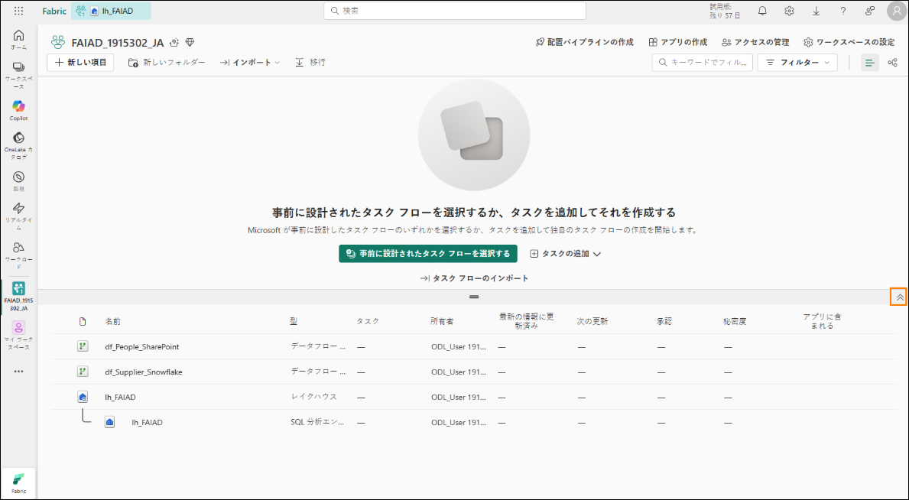

3. 作成したすべてのアーティファクトがここに一覧表示されています。画面右側にある**検索ボックス**に、**df** と入力します。これにより、アーティファクトがデータフローに絞り込まれます。

    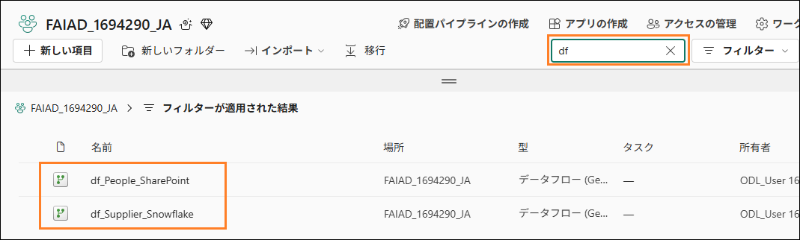

4. **df_Supplier_Snowflake** 行をポイントします。**省略記号 (…)** を選択します。

5. データフローを削除、開く、更新するオプションがあることがわかります。**更新の履歴**を見てみましょう。**最近の実行**を選択します。

    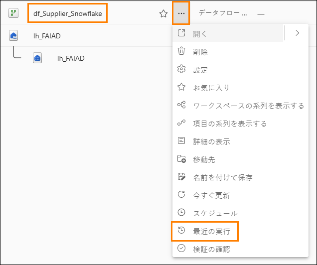

    **注:** 更新の一覧を示すウィンドウまたはパネルが右側に表示されます

6. 前のラボで**保存と実行**オプションを選択したときに実行された 1 回の更新が表示されていることがわかります。更新の**種類**が**オンデマンド**と表示されていることから、これが手動で実行された更新であることがわかります。

    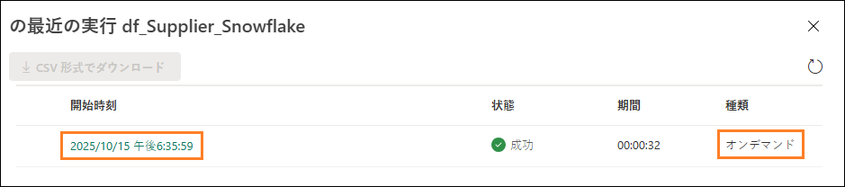

7. **開始時刻**のリンクを選択します。

    **注:** 開始時間はお客様によって異なります。

    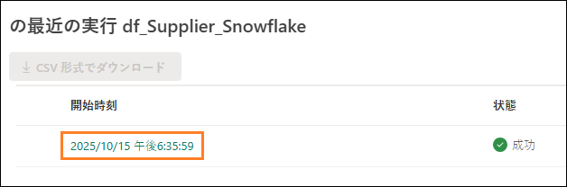

    [詳細] 画面が開きます。これにより、更新の詳細が提供されます。開始時刻、終了時刻、期間が一覧表示されます。また、更新されたテーブルとアクティビティも一覧表示されます。失敗が発生した場合は、テーブルやアクティビティの名前をクリックしてさらに調査できます。

    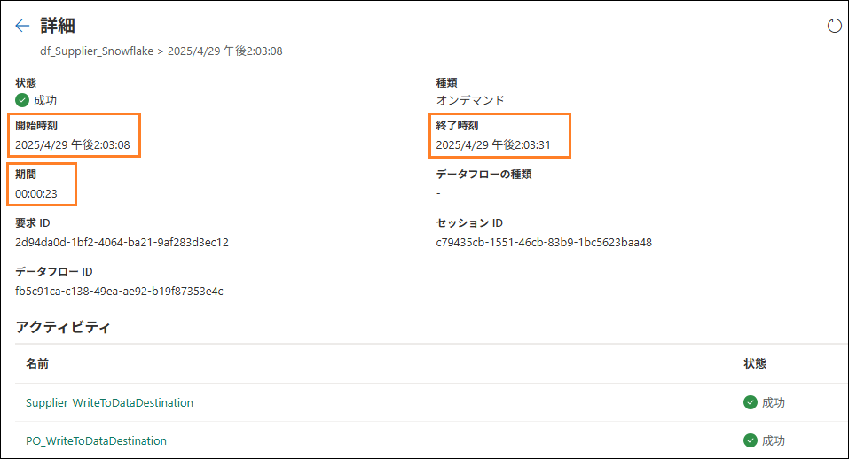

8. 右上隅の **X** をクリックして、他の場所に移動しましょう。**ワークスペース**に戻ります。

9. **df_Supplier_Snowflake** 行をポイントします。**省略記号 (…)** を選択します。

10. 更新を自動的に実行するようにスケジュールを設定する方法を見てみましょう。**設定**オプションを選択します。

    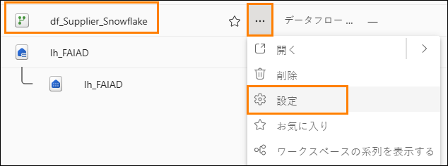

11. 表示された**設定**パネルに 3 つのオプションがあることがわかります。

    **情報 –** データフローの名前を変更し、説明を追加できます。また、データフローの所有者と最終更新日時も確認できます。 **承認 –** データフローで他のユーザーが参照できる**昇格済み**または**認定済み**タグを付けるかどうかを指定できます。 **スケジュール -** データフローのスケジュールを設定できます。

    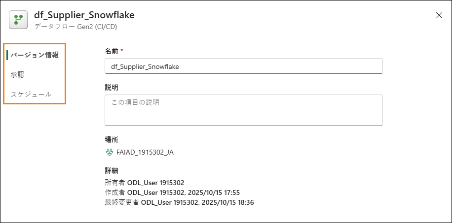

12. **スケジュール** オプションを選択します

13. スケジュールを有効にするには、**スケジュールの追加**をクリックする必要があります

    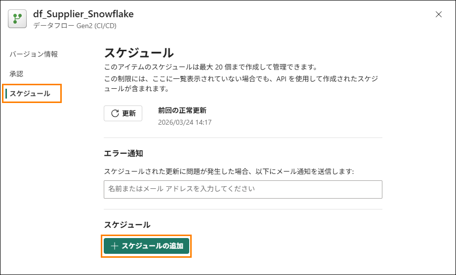

14. ここで**繰り返し**プロパティのオプションを選択することで、更新の頻度を指定できます。このシナリオでは、**毎日 (1)** を選択できます

15. **時間**プロパティには、深夜にするために**12:00 AM (2)** を指定できます

    **注:** [時間の追加] リンクをクリックすると、複数の更新時刻を追加できます。

16. また、**開始日時 (3)** と**終了日時 (4)** も指定できます。このシナリオでは、開始日および終了日として今の日付を選択します。

17. どの**タイム ゾーン (5)** で日時を表示するかを指定できます。最後に**保存**を選択します

    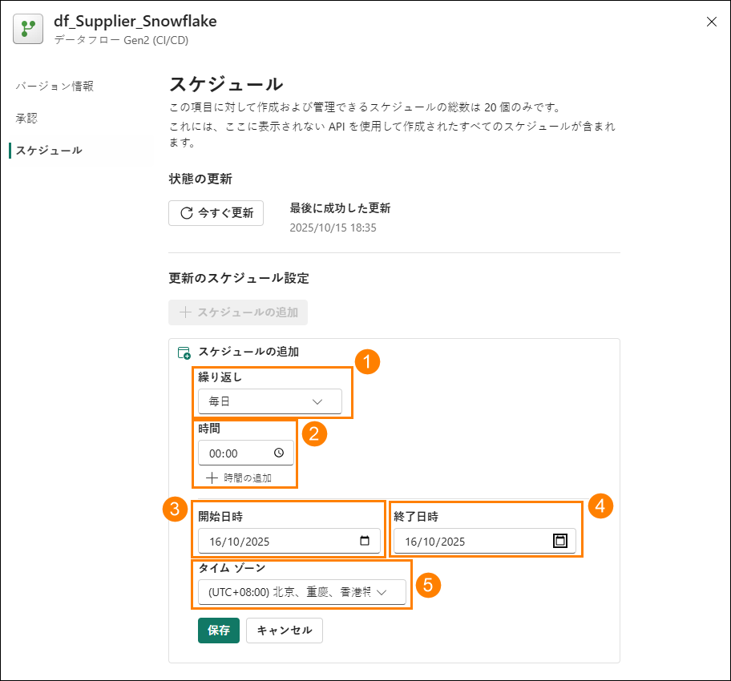

18. スケジュール済みの更新が表示され、編集したり、不要になった場合は削除したり、他のスケジュールされた更新を追加したりできます。

    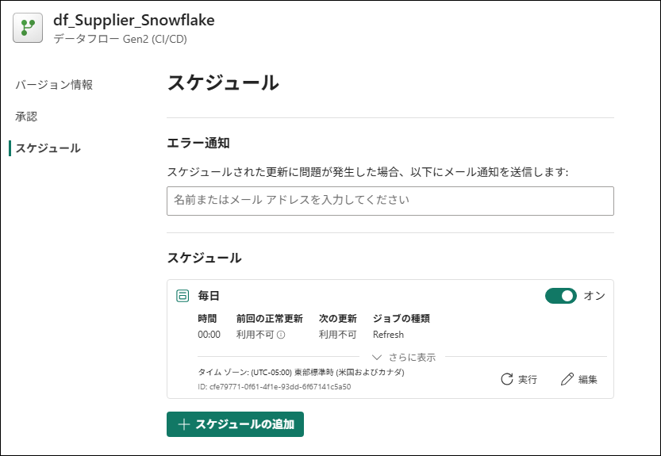

    前述したように、SharePoint の従業員ファイルが時間どおりに提供されないシナリオを処理するカスタム ロジックを構築する必要があります。パイプラインを使ってこれを解決しましょう。

# パイプライン

## タスク 2: パイプラインを作成する

1. 左パネルでワークスペースを選択し、Fabric ワークスペース (**FAIAD_<inject key="Deployment ID" enableCopy="false"/>**)
    に戻ります。

2. 上部メニューで、**+ 新しい項目 (1) - > パイプライン (2)** を選択します。

    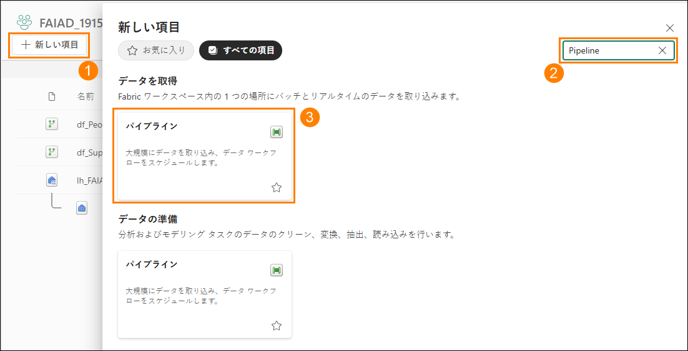

3. [新しいパイプライン] ダイアログが開きます。パイプラインに **pl_Refresh_People_SharePoint** という名前を付け、**作成**を選択します。

    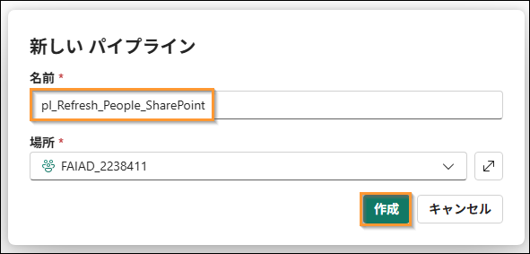

    **パイプライン ページ**に移動します。Azure Data Factory を使用したことがある場合は、この画面に見覚えがあるはずです。レイアウトの概要を簡単に確認してみましょう。

    **ホーム**画面が表示されています。上部メニューを見ると、よく使うアクティビティ (パイプラインの検証、実行、実行履歴の表示) を追加するオプションがあります。また、中央ペインには、パイプラインの構築を開始するためのクイック オプションがあります。

    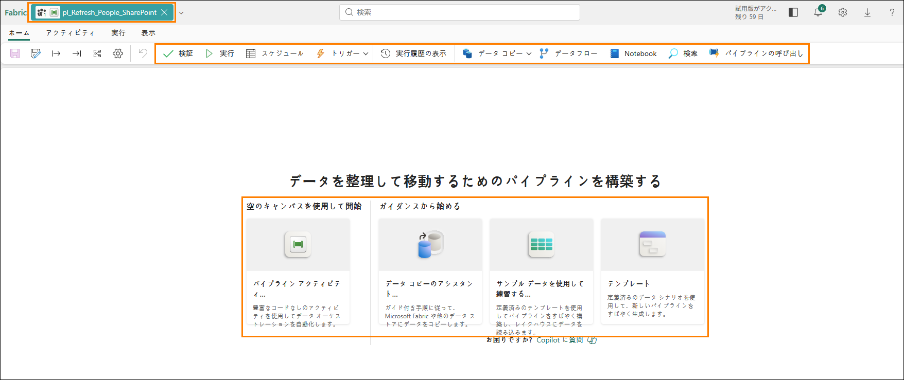

4. 上部メニューから、**アクティビティ**を選択します。これで、メニューによく使うアクティビティのリストが表示されます。

5. メニューの右側にある**省略記号 (…)** を選択すると、他の利用可能なアクティビティがすべて表示されます。これらのアクティビティのいくつかをラボで使用します。

    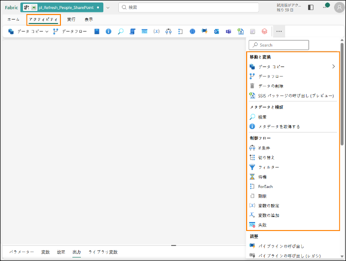

6. 上部メニューの**実行**をクリックします。パイプライン実行を実行およびスケジュールするためのオプションが表示されます。[実行履歴を表示する] を使って実行履歴を確認するオプションもあります。

7. 上部メニューから、**表示**を選択します。ここには、コードを JSON 形式で表示するオプションがあります。アクティビティを自動的に位置合わせするオプションもあります。

    **注:** ラボの最後に JSON の予備知識をお持ちの場合は、自由に [JSON コードを表示する] を選択してください。ここでわかるように、デザイン ビューを使って実行しているすべてのオーケストレーションを、JSON で記述することもできます。

    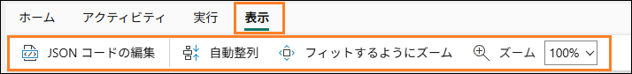

## タスク 3: シンプルなパイプラインを構築する

パイプラインの構築を始めましょう。データフローを更新するアクティビティが必要です。使えるアクティビティを探してみましょう。

1. 上部メニューから、**アクティビティ -> データフロー**を選択します。データフローアクティビティが中央デザイン ペインに追加されます。下部ペインにデータフローアクティビティの構成オプションが表示されることに注目してください。

2. このアクティビティを構成して、df_People_SharePoint データフローと接続します。下部ペインから、設定を選択します。

    *注: 設定を表示するには、下部ペインを上にドラッグすることが必要な場合があります。*

    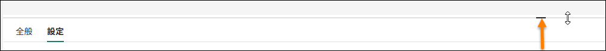

3. **ワークスペース**がご自身の Fabric ワークスペース **FAIAD_<inject key="Deployment ID" enableCopy="false"/>** に設定されていることを確認します。

4. **データフロー ドロップダウン**から、**df_People_SharePoint** を選択します。このデータフロー アクティビティを実行すると、**df_People_SharePoint** が更新されます。簡単ですね。

    このシナリオでは、従業員データがスケジュールどおりに更新されません。 遅延が発生することがあります。これに対応できるかどうか見てみましょう。

    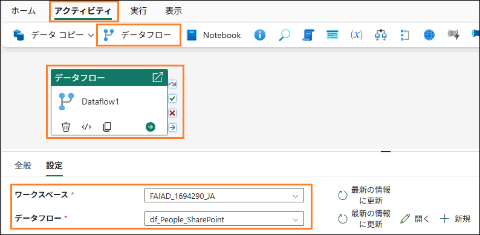

5. **下部ペイン**から、**全般**を選択します。アクティビティの名前と説明を指定しましょう。

6. **名前**フィールドに**dfactivity_People_SharePoint** と入力します

7. **説明**フィールドに**Dataflow activity to refresh df_People_Sharepoint dataflow**
    と入力します。

8. アクティビティを非アクティブ化するオプションがあることに注意してください。
    この機能は、テスト中やデバッグ中に役立ちます。**アクティブ化**のままにしておきます。

9. **タイムアウト**を設定するオプションがあります。**既定値**はデータフローを更新するのに十分な時間なので、そのままにしておきます。

    **注:** スケジュールに基づいたデータがないため、10 分ごとに 3 回再実行するようにアクティビティを設定しましょう。3 回目の試行でも失敗した場合は、失敗を報告します。

10. **再試行**を**3** に設定します

11. **詳細**セクションを展開します。

12. **再試行のサイクル間隔 (秒)** を **600** に設定します。

13. メニューから**ホーム -> 保存**アイコンを選択して、パイプラインを保存します。

    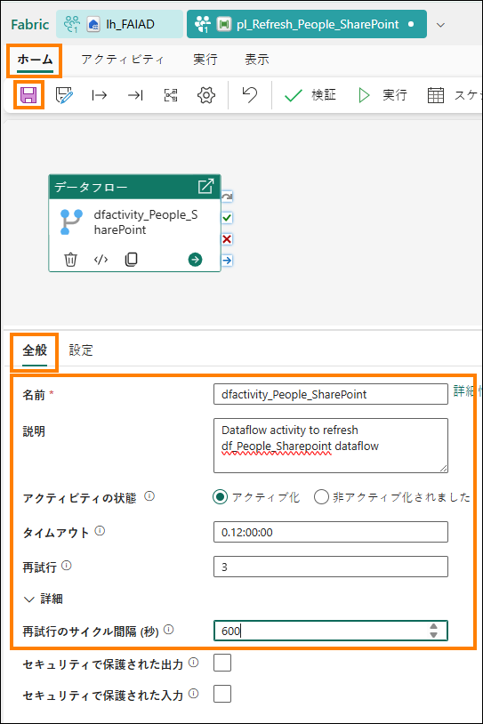

    (以前のデータフローで行ったように) スケジュールされた更新でデータフローを設定する場合と比較して、パイプラインを使用する利点に注目してください。

    - パイプラインには、更新が失敗する前に複数回再試行するオプションが用意されています。

    - パイプラインを使用すると、他のタスクを実行できるだけでなく、データフローを更新することもできます

## タスク 4: 新しいパイプラインを作成する

シナリオをもう少し複雑にしてみましょう。午前 9 時にデータを取得できない場合でも、通常は 5 分以内に取得できることがわかりました。その時間範囲を超えた場合は、ファイルを取得できるまでに 15 分かかります。5 分と 15 分で再試行をスケジュールする必要があります。 新しいパイプラインを作成して、これをどのように実現できるかを見てみましょう。

1. 左側のパネルで **FAIAD_<inject key="Deployment ID" enableCopy="false"/>** をクリックして、ワークスペースのホームに移動します。

2. 上部メニューから **+ 新しい項目 (1)** をクリックし、ポップアップ ウィンドウから**パイプライン (2)** をクリックします。

    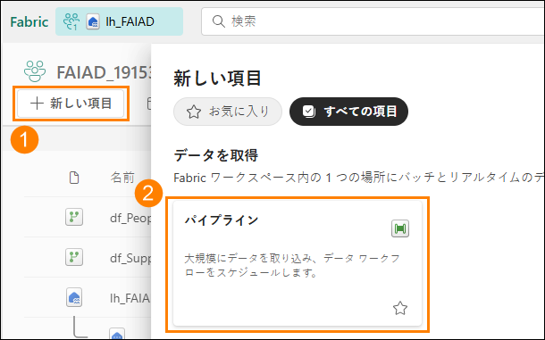

3. [新しいパイプライン] ダイアログが開きます。パイプラインに **pl_Refresh_People_SharePoint_Option2 (3)** という**名前を付け、作成 (4)** を選択します。

    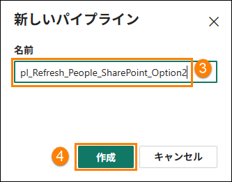

## タスク 5: Until アクティビティを作成する

1. [パイプライン] 画面に戻ります。メニューから**アクティビティ**を選択します。

2. 右側の**省略記号 (…)** をクリックします。

3. アクティビティ一覧から **Until** をクリックします。

    **Until**: ある条件が満たされるまで反復処理するために使うアクティビティです。

    今回のシナリオでは、成功するか 3 回試行するまで繰り返しデータフローを更新します。

    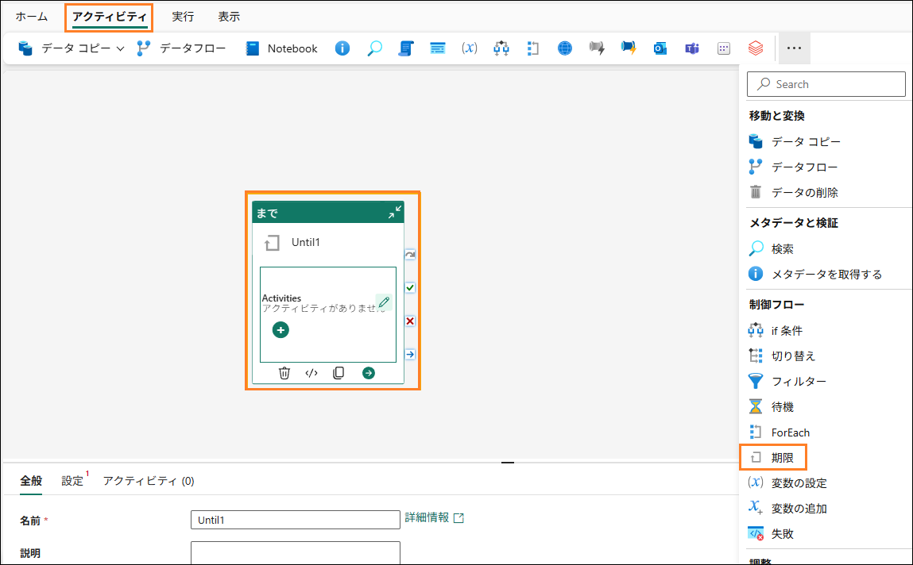

## タスク 6: 変数を作成する

1. 反復処理と状態の設定に使う変数を作成する必要があります。パイプライン デザイン ペインの**空白領域**を選択します。

2. 下部ペインのメニューが変化することに注目してください。**変数**を選択します。

3. **+ 新規**を選択して、新しい変数を追加します。

4. 行が表示されます。**名前テキスト ボックス**に**varCounter** と入力します。
    この変数を使って、反復処理を 3 回行います。

5. **種類ドロップダウン**から**Integer を**選択します。

6. **既定値**に**0** を入力します。

    **注:** 変数名の先頭に var を付加して見つけやすくしています。これは良い習慣です。

    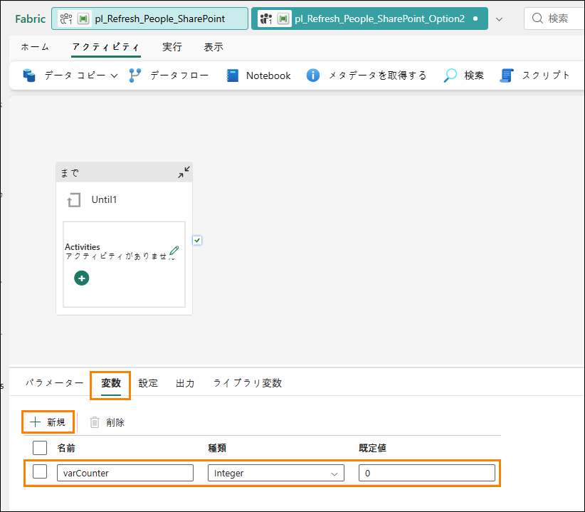

7. **+ 新規**を選択して、別の新しい変数を追加します。

8. 行が表示されます。**名前テキスト ボックス**に**varTempCounter** と入力します。
    この変数を使って varCounter 変数を増分します。

9. **種類ドロップダウン**から I**nteger** を選択します。

10. **既定値**に**0** を入力します。

11. 同様の手順に従って、さらに 3 つの変数を追加します。

    1. **varIsSuccess:** 種類は String、既定値は **No** に設定します。
    この変数を使って、データフローの更新が成功したかどうかを表します。

    2. **varSuccess:** 種類は String、既定値は **Yes** に設定します。データフローの更新が成功した場合、この変数を使って varIsSuccess の値を設定します。

    3. **varWaitTime:** 種類は Integer、既定値は **60** に設定します。この変数を使って、データフローが失敗した場合の待機時間を設定します。(5 分 (300 秒) または 15 分 (900 秒) のいずれかです。)

    **注:** 変数名の前後にスペースがないことを確認してください。

    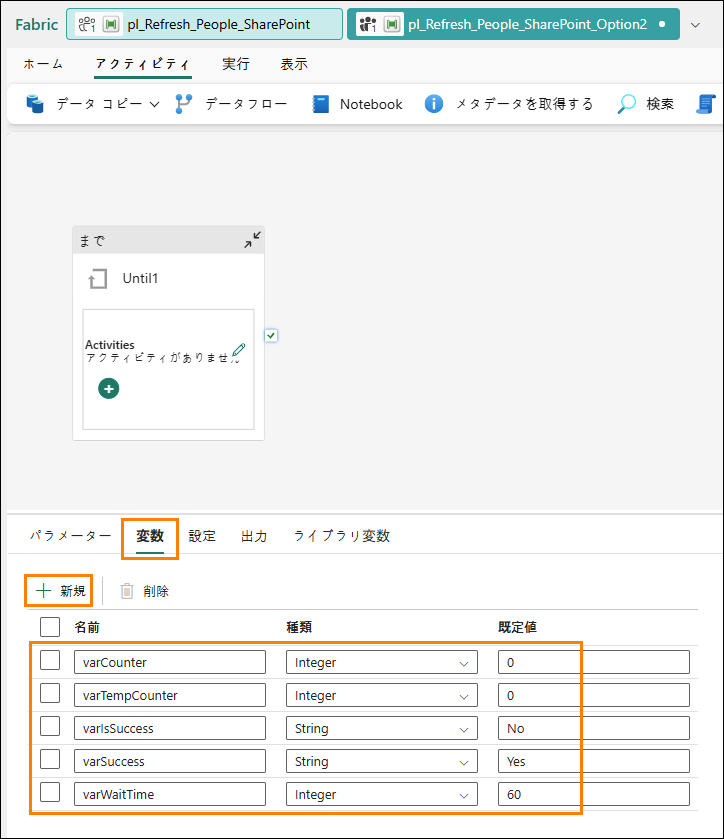

## タスク 7: Until アクティビティを構成する

1. **Until** アクティビティを選択します。

2. **下部ペイン**から、**全般**を選択します。

3. **名前**に**Iterator** と入力します。

4. **説明**に、**"Iterator to refresh dataflow. It will retry up to 3 times"** と入力します。

    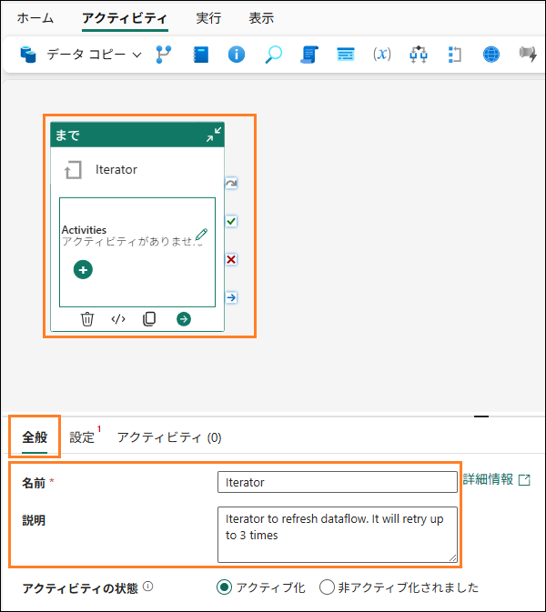

5. 下部ペインから、**設定 (1)** を選択します。

6. **式テキスト ボックス (2)** を選択します。このテキスト ボックスに、true または false
    と評価される式を入力する必要があります。Until アクティビティは、この式が false と評価されている間反復処理を継続します。式が true と評価されると、Until アクティビティは反復を停止し、次のアクティビティに移ります。

7. テキスト ボックスの下に表示される**動的なコンテンツの追加 (3)** リンクを選択します。

    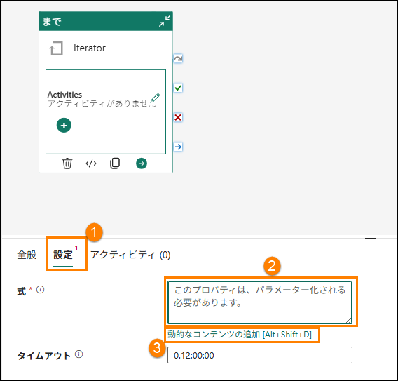

    次の条件が満たされるまで実行する式を記述する必要があります: **varCounter の値が 3** であるか、**varIsSuccess の値が Yes** である。(varCounter と varIsSuccess は先ほど作成した変数です。)

8. **パイプライン式ビルダー** ダイアログが開きます。ダイアログの下半分にはメニューが表示されます。

    1. **パラメーター:** パイプラインに渡される値。あるパイプラインから別のパイプラインに渡される値など。これらの値は任意の式で使用できますが、パイプライン実行の間に変更することはできません。

    2. **システム変数:** いずれかのサービス内でエンティティを定義するときに、
    式で使用できます。例: パイプライン ID、パイプライン名、トリガー名など。

    3. **トリガー パラメーター:** パイプラインをトリガーしたパラメータ。たとえば、ファイル名やフォルダー パスなどです。

    4. **関数:** 式内で関数を呼び出すことができます。各関数は、コレクション、変換、日付、論理、数学、文字列の関数に分類されます。たとえば、concat は文字列関数、add は数学関数です。

    5. **変数:** パイプライン変数は、パイプライン実行中に設定および変更できる値です。パイプライン レベルで定義され、パイプライン実行中に変更できないパイプライン パラメーターとは異なり、パイプライン変数は、変数の設定アクティビティを使って、パイプライン内で設定および変更できます。この後すぐに変数の設定アクティビティを使用します。

    6. **ライブラリ変数:** ライブラリ変数は、次で定義された変数を使用します: **変数ライブラリ Fabric 項目**。これらの変数は、ワークスペース全体で構成を管理するための一元的な方法を提供し、CI/CD ワークフローをサポートします。パイプラインやノートブック、レイクハウスのショートカットなどと併用できます。

        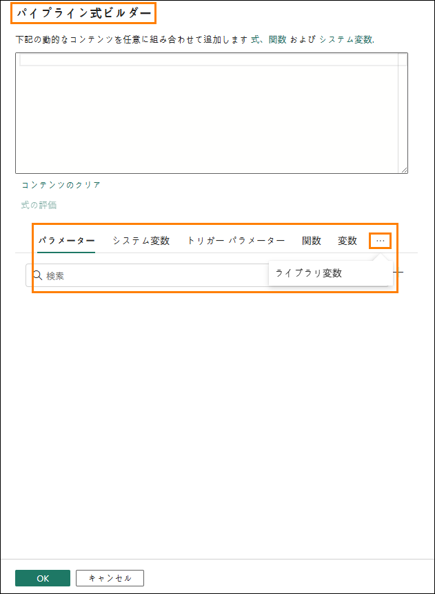

9. リボンまたはメニューの**関数**をクリックします。

10. **Logical 関数**セクションから、**or** 関数を選択します。動的な式テキスト ボックスに **@or()** が追加されるのがわかります。or 関数は 2 つのパラメーターを受け取ります。
    ここでは最初のパラメーターに取り組みます。

    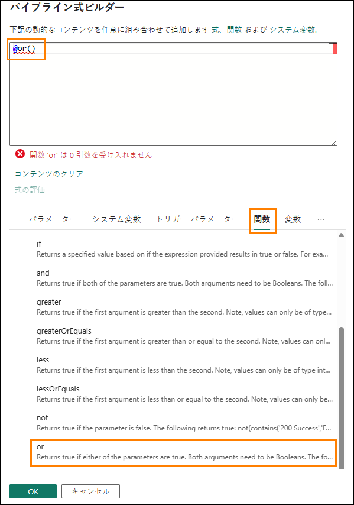

11. **@or** 関数の**かっこの間に**カーソルを置きます。

12. **Logical 関数**セクションから、**equals** 関数を選択します。それが動的な式テキスト ボックスに追加されます。

    **注:** 関数は **@or(equals())** のようになるはずです。equals 関数も 2 つのパラメーターを受け取ります。変数 varCounter が 3 に等しいかどうかを確認します。

    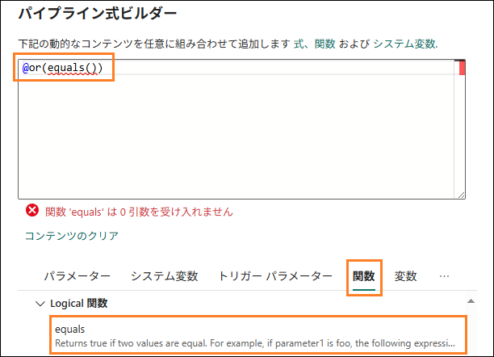

13. 次に、**@equals** 関数の**かっこの間に**カーソルを置いて、パラメーターを追加します。

14. 下部メニューから、**変数**を選択します。

15. 最初のパラメーターとなる **varCounter** 変数を選択します。

16. equals 関数の 2 番目のパラメーターとして **3** と入力します。以下のスクリーンショットのように、式は **@or(equals(variables('varCounter'),3))** になります

    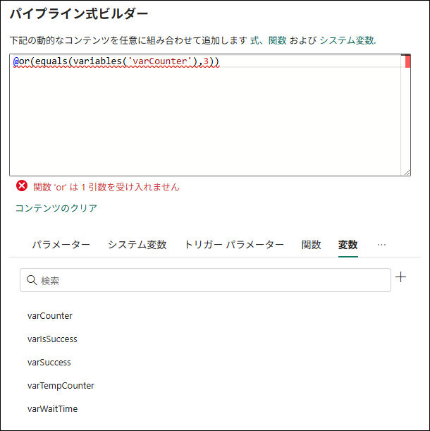

17. or 関数に 2 番目のパラメーターを追加する必要があります。最後の 2 つのかっこの間に**コンマを追加します**。今回は関数名を入力してみましょう。**equ** と入力し始めると、
    使用できる関数のドロップダウンが表示されます (IntelliSense と呼ばれます)。 **equals** 関数を選択します。

    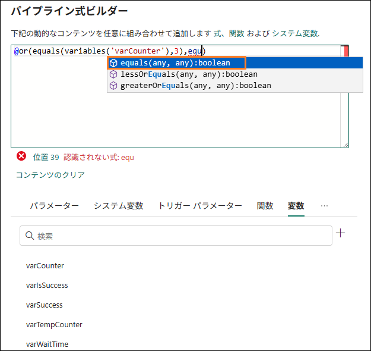

18. equals 関数の最初のパラメーターは変数です。**コンマの前にカーソルを**置きます。

19. **variables(** と入力を開始します

20. IntelliSense の助けを借りて **variables('varIsSuccess')** を選択します

21. コンマの後に 2 番目のパラメーターを入力しましょう。**variables(** と入力を開始します

22. IntelliSense の助けを借りて **variables('varSuccess')** を選択します。ここでは、varIsSuccess の値と varSuccess の値を比較しています。(varSuccess の既定値は Yes です。)

    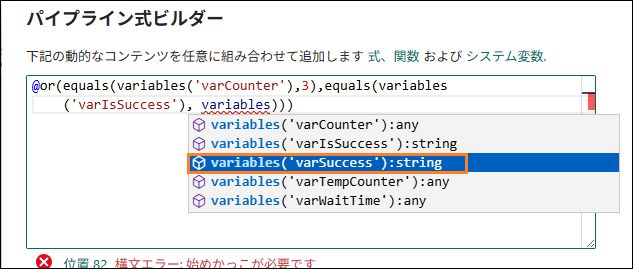

23. 式は次のようになるはずです。

    **@or(equals(variables('varCounter'),3),equals(variables('varIsSuccess'), variables('varSuccess')))**

24. **OK** を選択します。

    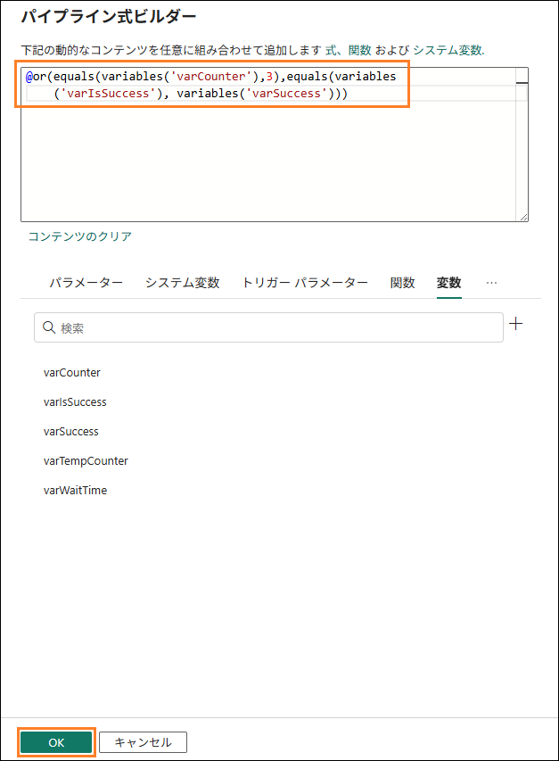

## タスク 8: データフロー アクティビティを構成する

1. デザイン画面に戻ります。**Until アクティビティ**を選択した状態で、**下部ペイン**から**アクティビティ**を選択します。ここでは、実行する必要があるアクティビティを追加します。

2. 最初の行の**編集アイコン**を選択します。空白の反復処理デザイン画面に戻ります。

    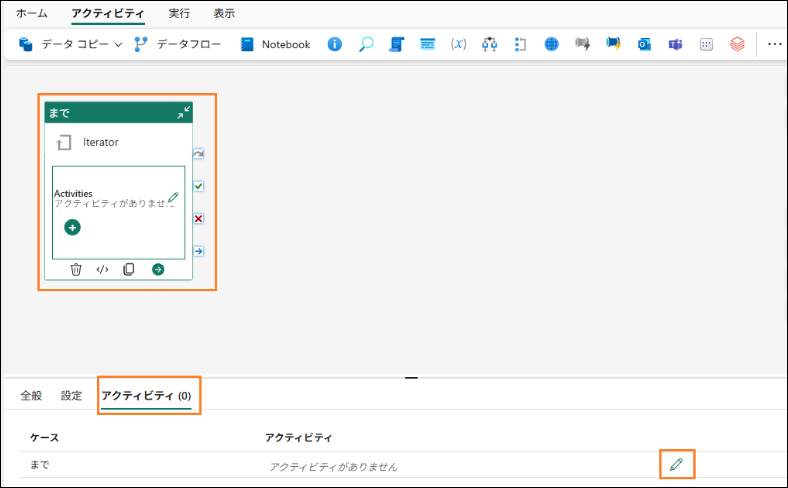

3. 上部メニューから、**アクティビティ -> データフロー**を選択します。
    データフロー アクティビティがデザイン ペインに追加されます。

4. **データフロー アクティビティを選択した**状態で、下部ペインで**全般**を選択します。
    アクティビティの名前と説明を指定しましょう。

5. **名前**フィールドに**dfactivity_People_SharePoint** と入力します

6. **説明**フィールドに、"**Dataflow activity to refresh df_People_Sharepoint dataflow**" と入力します。

    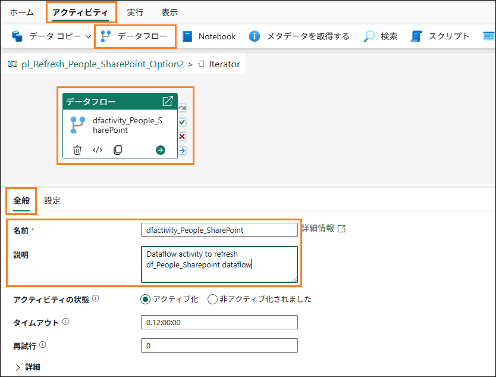

7. 下部ペインから**設定**を選択します。

8. **ワークスペース**がご自身のワークスペース**FAIAD_<inject key="Deployment ID" enableCopy="false"/>**
    に設定されていることを確認します。

9. **データフロー ドロップダウン**から、**df_People_SharePoint** を選択します。

    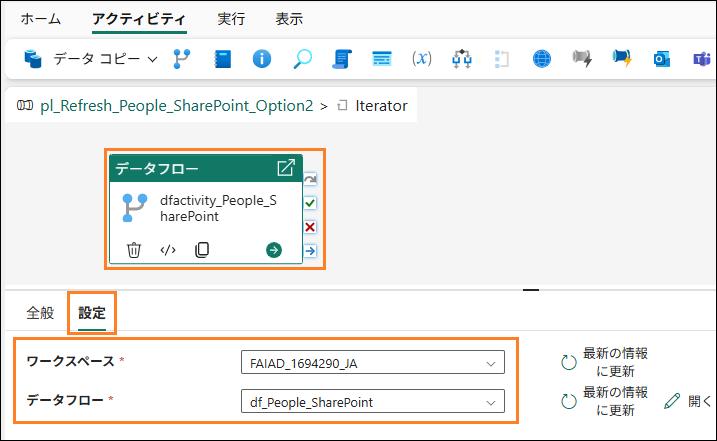

## タスク 9: 最初の変数の設定アクティビティを構成する

ラボで前に行ったように、データフロー アクティビティを構成しました。次に、新しいロジックを追加します。データフローの更新が成功した場合は、Until の反復処理から抜ける必要があります。反復処理から抜ける条件の 1 つは、varIsSuccess 変数の値を Yes に設定することだったことを思い出してください。

1. 上部メニューから、**アクティビティ -> 変数の設定**を選択します。変数の設定アクティビティがデザイン キャンバスに追加されます。

2. **変数の設定アクティビティ**を選択した状態で、下部ペインで**全般**を選択します。
    アクティビティの名前と説明を指定しましょう。

3. **名前** フィールドに、**set_varIsSuccess** と入力します。

4. **説明**フィールドに、**"Set variable varIsSuccess to Yes"** と入力します。

    **注: データフロー アクティビティ**の上にカーソルを合わせてください。アクティビティ ボックスの右側に 4 つのアイコンがあります。これらを使って、このアクティビティの結果に基づいて次のアクティビティに接続できます。

    1. アクティビティをスキップするときは**灰色の曲がった矢印**アイコンを使います。

    2. アクティビティの成功時は**緑色のチェック マーク** アイコンを使います。

    3. アクティビティの失敗時は**赤い x マーク** アイコンを使います。

    4. アクティビティの完了時は**青い真っすぐな矢印**アイコンを使います。

5. dfactivity_People_SharePoint データフロー アクティビティから**緑色のチェック マーク**をクリックしてドラッグし、新しい**set_varIsSuccess** **変数の設定アクティビティ**に接続します。つまり、データフローの更新が成功したら、変数の設定アクティビティを実行します。

    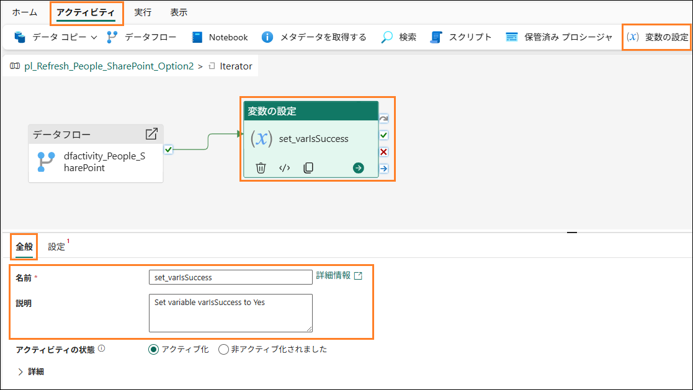

6. **変数の設定アクティビティ**を選択した状態で、下部メニューから**設定**をクリックします。

7. 下部ペインで、**変数の種類**が**パイプライン変数**であることを確認します。

8. **名前**フィールドで、**varIsSucces** を選択します。この変数の値を設定します。

9. **値**フィールドで、**テキスト ボックス**を選択します。
    **動的なコンテンツの追加**リンクを選択します。

    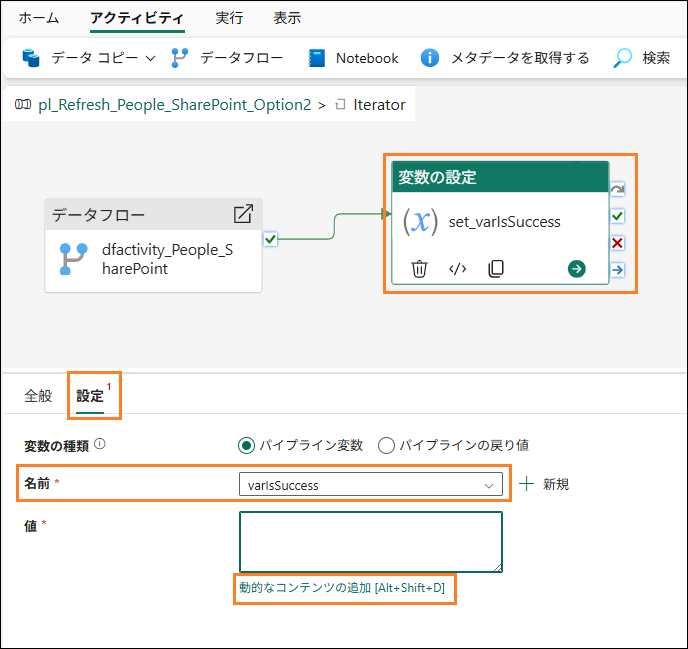

10. パイプライン式ビルダー ダイアログが開きます。**式、関数、システム変数の任意の組み合わせを使用して以下に動的コンテンツを追加しますのテキスト領域 (1)** を選択します。

11. 下部メニューの**省略記号 (...) (2)** をクリックし、**変数 (3) -> varSuccess (4)** を選択します。以下に動的コンテンツを追加しますのテキスト領域に **@variables('varSuccess')**
    と入力されることがわかります。変数を作成したときに、varSuccess 変数の値をあらかじめ Yes に設定したことを思い出してください。そのため、Yes の値が varIsSuccess 変数に代入されます。

12. **OK** を選択します。**反復処理デザイン ペイン**に戻ります。

    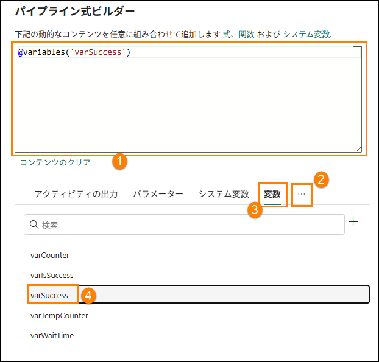

    次に、データフロー アクティビティが失敗した場合にカウンターを設定する必要があります。パイプラインでは、変数を自己参照することはできません。つまり、カウンター変数 varCounter の値に 1 を加えて増分することはできません (varCounter = varCounter + 1)。そこで、varTempCounter 変数を利用します。

## タスク 10: 2 番目の変数の設定アクティビティを構成する

1. 上部メニューから、**アクティビティ -> 変数の設定**を選択します。
    変数の設定アクティビティがデザイン キャンバスに追加されます。

2. **変数の設定アクティビティ**を選択した状態で、下部ペインで**全般**を選択します。
    アクティビティの名前と説明を指定しましょう。

3. **名前**フィールドに、**set_varTempCounter** と入力します

4. **説明**フィールドに、"**Increment variable varTempCounter**" と入力します。

5. データフロー アクティビティの**赤い x マーク**をクリックして、新しい変数の設定アクティビティに接続します。つまり、データフローの更新が失敗したら、
    この変数の設定アクティビティを実行します。

    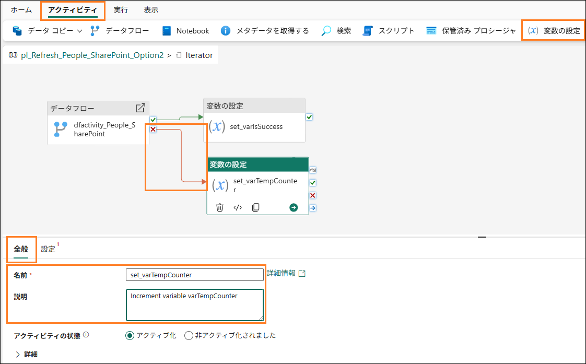

6. **変数の設定アクティビティ**を選択した状態で、下部メニューから**設定**を選択します。

7. 下部ペインで、**変数の種類**が**パイプライン変数**であることを確認します。

8. **名前**フィールドで、**varTempCounter** を選択します。この変数の値を設定します。

9. **値**フィールドで、**テキスト ボックス**を選択します。**動的なコンテンツの追加**リンクを選択します。

10. パイプライン式ビルダー ダイアログが開きます。**@add(variables('varCounter'),1)**
    と入力します

    **注:** この式を入力しても、メニューを使って関数を選択しても、またはコピーして貼り付けても構いません。この関数は、変数 varTempCounter の値を、変数 varCounter の値に 1 を加えたものに設定します (varTempCounter = varCounter + 1)。

    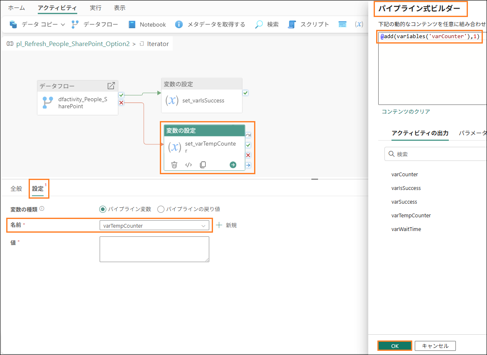

    次に、varCounter 変数の値を varTempCounter の値に設定する必要があります。

## タスク 11: 3 番目の変数の設定アクティビティを構成する

1. 上部メニューから、**アクティビティ -> 変数の設定**を選択します。変数の設定アクティビティがデザイン キャンバスに追加されます。

2. **変数の設定アクティビティ**を選択した状態で、下部ペインで**全般**を選択します。アクティビティの名前と説明を指定しましょう。

3. **名前**フィールドに、**set_varCounter** と入力します。

4. **説明**フィールドに、"**Increment variable varCounter**" と入力します。

5. set_varTempCounter 変数の設定アクティビティから**緑色のチェック マーク**をクリックしてドラッグし、新しい**set_varCounter 変数の設定アクティビティ**に接続します。

    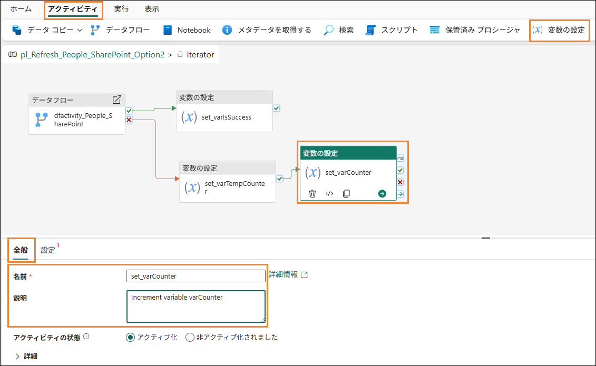

6. **set_varCounter 変数の設定アクティビティ**を選択した状態で、下部メニューから**設定**をクリックします。

7. 下部ペインで、**変数の種類**が**パイプライン変数**であることを確認します。

8. **名前**フィールドで、**varCounter** を選択します。この変数の値を設定します。

9. **値**フィールドで、**テキスト ボックス**を選択します。**動的なコンテンツの追加**リンクを選択します。

10. パイプライン式ビルダー ダイアログが開きます。**@variables('varTempCounter')**
    と入力します。この式を入力しても、メニューを使って関数を選択しても、 またはコピーして貼り付けても構いません。

11. [OK] をクリックします。

    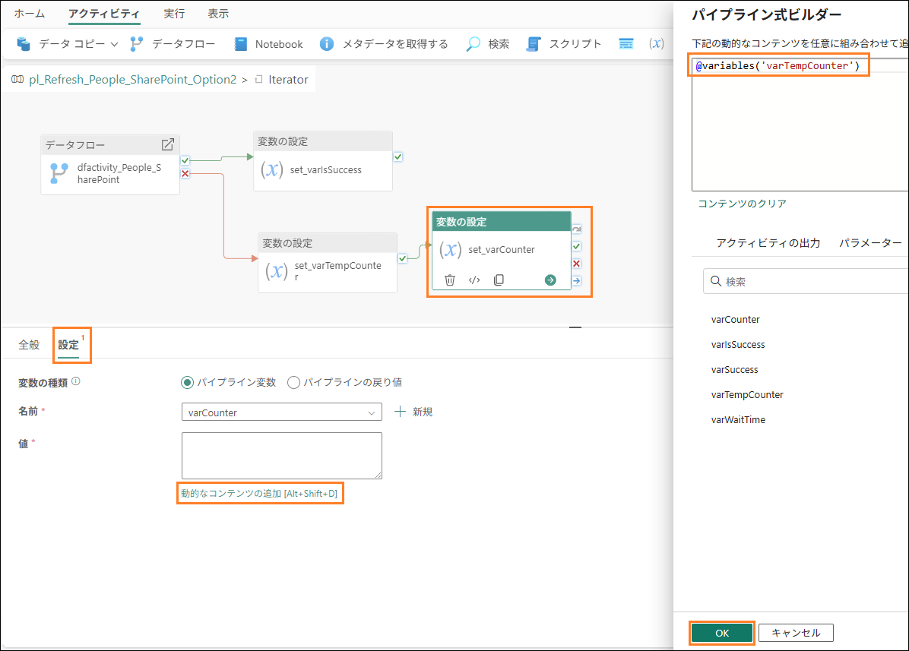

    **注:** この関数は、変数 varCounter の値を、変数 varTempCounter の値に設定します (varCounter = varTempCounter)。各反復の終わりには、varCounter と varTempCounter の両方が同じ値になります。

## タスク 12: Wait アクティビティを構成する

次に、データフローの更新が初めて失敗した場合は、再試行する前に 5 分 (300 秒) 待機する必要があります。データフローの更新が 2 度目に失敗した場合は、15 分 (900 秒) 待機してから再試行する必要があります。Wait アクティビティと変数 varWaitTime を使って待機時間を設定します。

1. 上部メニューから、**アクティビティ -> 省略記号 (…) -> Wait** を選択します。
    Wait アクティビティがデザイン キャンバスに追加されます。

2. **Wait アクティビティ**を選択した状態で、下部ペインで**全般**を選択します。
    アクティビティの名前と説明を指定しましょう。

3. **名前**フィールドに、**wait_onFailure** と入力します。

4. **説明**フィールドに、"**Wait for 300 seconds on 2nd try and 900 seconds on 3rd try**" と入力します。

5. set_varCounter 変数の設定アクティビティから**緑色のチェック マーク**をクリックしてドラッグし、新しい**wait_onFailure Wait アクティビティ**に接続します。

    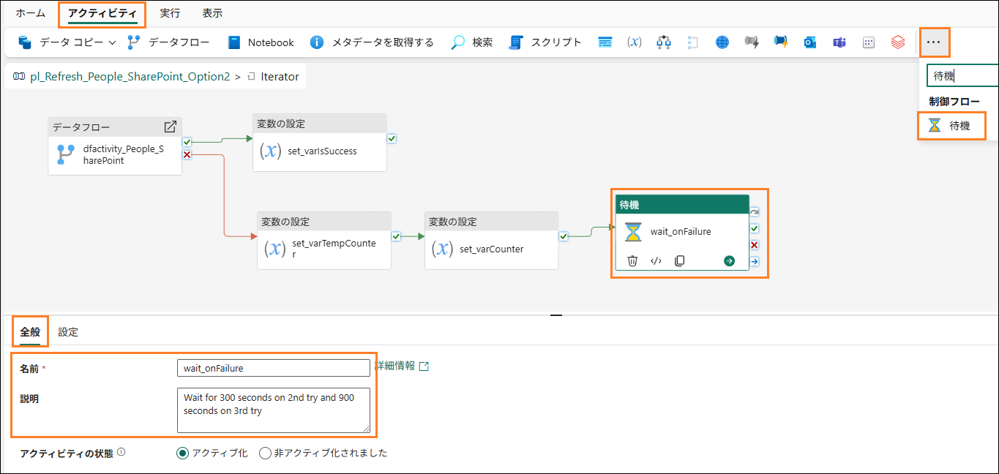

6. **Wait アクティビティ**を選択した状態で、下部メニューから**設定**をクリックします。

7. **待機時間 (秒)** フィールドで、**テキスト ボックス**を選択し、**動的なコンテンツの追加**リンクを選択します。

8. パイプライン式ビルダー ダイアログが開きます。以下を入力します

    ```
    @if(
        greater(variables('varCounter'), 1),
        if(equals(variables('varCounter'), 2),
            mul(variables('varWaitTime'),15 ), 
            mul(variables('varWaitTime'), 0)
        ),
        mul(variables('varWaitTime'),5 )
    )
    ```

    この式を入力しても、メニューを使って関数を選択しても、またはコピーして貼り付けても構いません。

    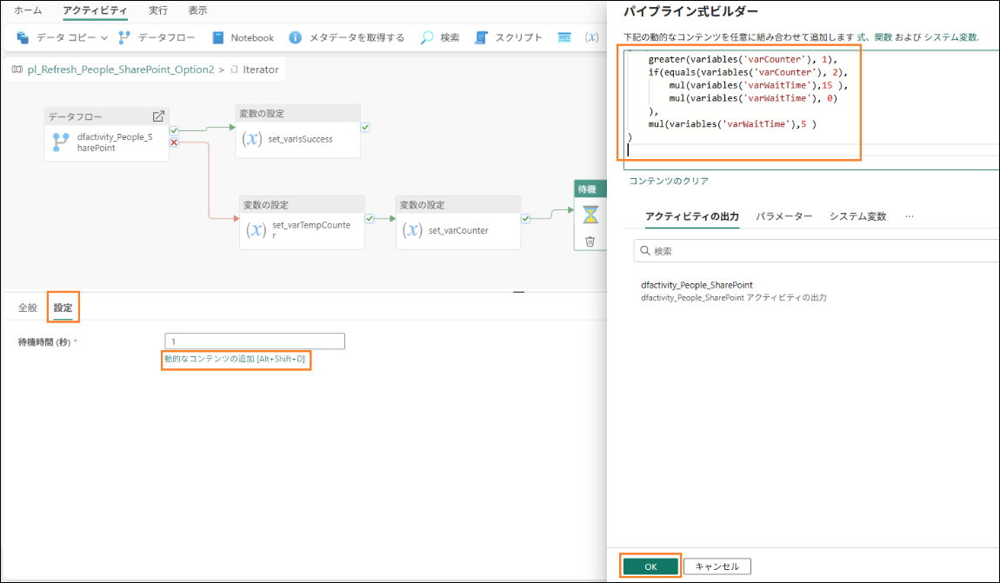

    ここでは 2 つの新しい関数を使用しています。

    - **greater:** 2 つの数値をパラメーターとして受け取り、どちらが大きいかを比較します。

    - **mul:** これは乗算関数であり、乗算する 2 つのパラメーターを受け取ります。

    この式は入れ子になった if ステートメントです。varCounter 変数の値が 1

    より大きいかどうかをチェックします。true の場合は、varCounter 変数の値が 2 であるかどうかをチェックします。true の場合は、待機時間を varWaitTime の 15 倍に設定します。varWaitTime の既定値を 60 に設定したことを思い出してください。これは 60*15 = 900 秒になります。varCounter 変数の値が 2 でない場合 (2 より大きい場合、つまりデータフローの更新が 3 回失敗したことを意味し、反復処理は終了です。もう待機する必要はありません)、待機時間を varWaitTime * 0 に設定します。つまり、0 です。varCounter 変数の値が 1 の場合、varWaitTime に 5 を掛けます。これは 60*5 = 300 秒になります。

9. **OK** を選択します。

    **チェックポイント: Until** 反復処理は下のスクリーンショットのようになっているはずです。

    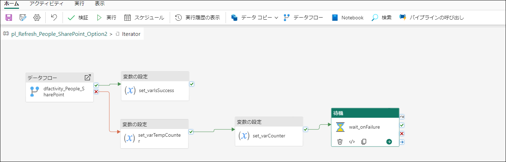

10. デザイン キャンバスの左上で **pl_Refresh_People_Sharepoint_Option2** またはメイン キャンバスを選択して、Until 反復処理から移動します。

    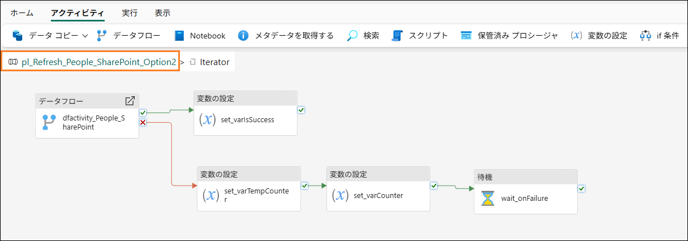

11. これで、パイプラインの作成が完了しました。上部メニューから**ホーム -> 保存アイコン**を選択して、パイプラインを保存します。

    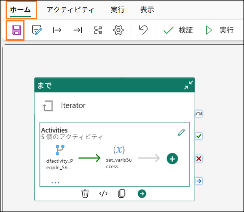

## タスク 13: パイプラインのスケジュールされた更新を構成する

1. パイプラインをテストするには、**ホーム -> 実行**を選択します。
     **注:** パイプラインの更新が完了するまでに数分かかる場合があります。これはトレーニング環境であるため、SharePoint のファイルは常に利用可能です。したがって、パイプラインが失敗することはありません。

2. スケジュールに従って実行するようにパイプラインを設定できます。上部メニューから、**ホーム -> スケジュール**を選択します。[スケジュール] ダイアログが開きます。

3. **スケジュールされた実行**の下にある**スケジュールの追加**ボタンを選択します。

    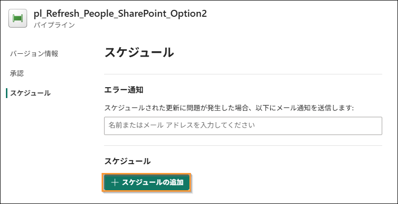

4. **繰り返しドロップダウン**を**毎日**に設定します。

5. **時刻**を**午前 9 時**に設定します。

6. **開始日時**を**今日**に設定します。

7. **終了日時**を**将来の日付**に設定します。

8. **タイム ゾーン**を設定します。

    **注**: これはラボ環境であるため、タイムゾーンは優先するタイムゾーンに設定できます。 実際のシナリオでは、データ ソースの場所に基づいてタイム ゾーンを設定します。

9. **保存**を選択します。

10. ダイアログの右上の **X** マークを選択して、閉じます。

    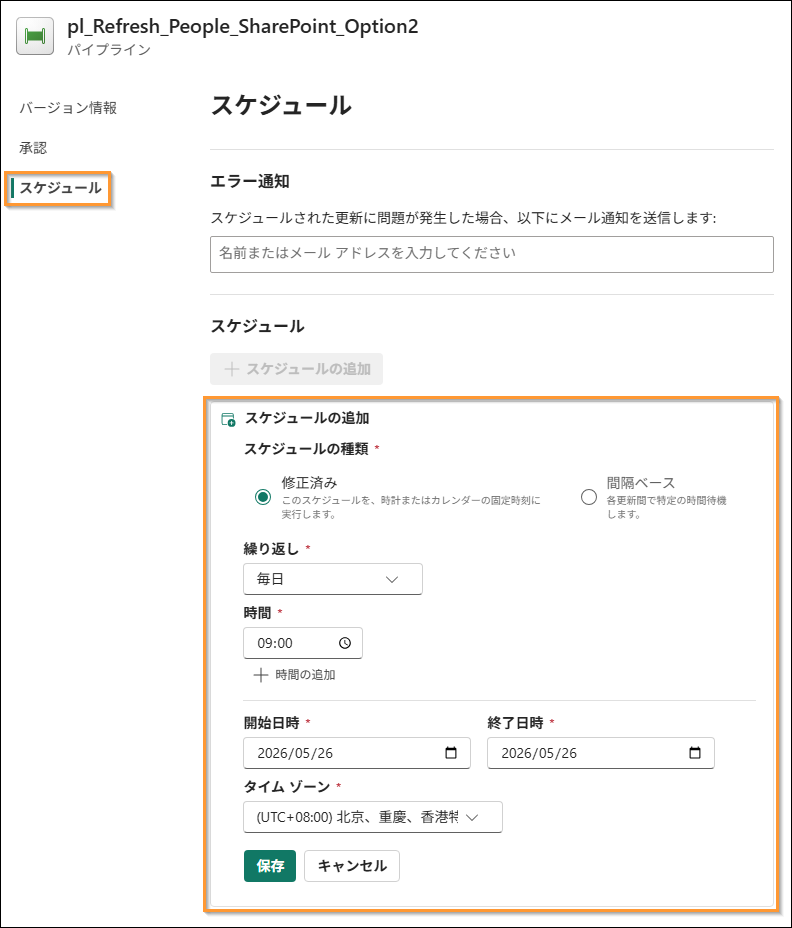

11. 左側のパネルで Fabric ワークスペース **FAIAD_<inject key="Deployment ID" enableCopy="false"/>** を選択して、
    ワークスペースに移動します。

    **注**: [スケジュール] 画面には、(データフローのスケジュールのように) 成功または失敗を通知するオプションはありません。通知は、パイプラインにアクティビティを追加することで実行できます。これはラボ環境であるため、このラボでは実行しません。

    さまざまなデータ ソースの更新をスケジュールしました。次のラボでは、リレーションシップ、メジャー、および他のモデリング操作を使用して、セマンティック モデルを作成します。

# リファレンス

Fabric Analyst in a Day (FAIAD) では、Microsoft Fabric で使用できる主要な機能の一部をご紹介します。サービスのメニューにあるヘルプ (?) セクションには、いくつかの優れたリソースへのリンクがあります。


Microsoft Fabric の次のステップに役立つリソースをいくつか以下に紹介します。

- ブログ記事で [Microsoft Fabric の GA に関するお知らせ](https://aka.ms/Fabric-Hero-Blog-Ignite23)の全文を確認する

- [ガイド付きツアー](https://aka.ms/Fabric-GuidedTour)を通じて Fabric を探索する

- [Microsoft Fabric の無料試用版](https://aka.ms/try-fabric)にサインアップする

- [Microsoft Fabric の Web サイト](https://aka.ms/microsoft-fabric)にアクセスする

- [Fabric の学習モジュール](https://aka.ms/learn-fabric)で新しいスキルを学ぶ

- [Fabric の技術ドキュメント](https://aka.ms/fabric-docs)を参照する

- [Fabric 入門編の無料の e-book](https://aka.ms/fabric-get-started-ebook) を読む

- [Fabric コミュニティ](https://aka.ms/fabric-community)に参加し、質問の投稿やフィードバックの共有を行い、
他のユーザーから学びを得る

より詳しい Fabric エクスペリエンスのお知らせに関するブログを参照してください。

- [Fabric の Data Factory エクスペリエンスに関するブログ](https://aka.ms/Fabric-Data-Factory-Blog)

- [Fabric の Synapse Data Engineering エクスペリエンスに関するブログ](https://aka.ms/Fabric-DE-Blog)

- [Fabric の Synapse Data Science エクスペリエンスに関するブログ](https://aka.ms/Fabric-DS-Blog)

- [Fabric の Synapse Data Warehousing エクスペリエンスに関するブログ](https://aka.ms/Fabric-DW-Blog)

- [Fabric の Synapse Real-Time Analytics エクスペリエンスに関するブログ](https://aka.ms/Fabric-RTA-Blog)

- [Power BI のお知らせに関するブログ](https://aka.ms/Fabric-PBI-Blog)

- [Fabric の Data Activator エクスペリエンスに関するブログ](https://aka.ms/Fabric-DA-Blog)

- [Fabric の管理とガバナンスに関するブログ](https://aka.ms/Fabric-Admin-Gov-Blog)

- [Fabric の OneLake に関するブログ](https://aka.ms/Fabric-OneLake-Blog)

- [Dataverse と Microsoft Fabric の統合に関するブログ](https://aka.ms/Dataverse-Fabric-Blog)

© 2026 Microsoft Corporation. All rights reserved.

このデモ/ラボを使用すると、次の条件に同意したことになります。

このデモ/ラボで説明するテクノロジまたは機能は、ユーザーのフィードバックを取得し、学習エクスペリエンスを提供するために、Microsoft Corporation によって提供されます。ユーザーは、このようなテクノロジおよび機能を評価し、Microsoft にフィードバックを提供するためにのみデモ/ラボを使用できます。それ以外の目的には使用できません。このデモ/ラボまたはその一部を、変更、コピー、配布、送信、表示、実行、 再現、発行、ライセンス、著作物の作成、転送、または販売することはできません。

複製または再頒布のために他のサーバーまたは場所にデモ/ラボ (またはその一部) をコピーまたは複製することは明示的に禁止されています。

このデモ/ラボは、前に説明した目的のために複雑なセットアップまたはインストールを必要としないシミュレーション環境で潜在的な新機能や概念などの特定のソフトウェア テクノロジ/製品の機能を提供します。このデモ/ラボで表されるテクノロジ/概念は、 フル機能を表していない可能性があり、最終バージョンと動作が異なることがあります。また、そのような機能や概念の最終版がリリースされない場合があります。 物理環境でこのような機能を使用するエクスペリエンスが異なる場合もあります。

**フィードバック**。このデモ/ラボで説明されているテクノロジ、機能、概念に関するフィードバックを Microsoft に提供する場合、ユーザーは任意の方法および目的でユーザーのフィードバックを使用、共有、および商品化する権利を無償で Microsoft に提供するものとします。また、ユーザーは、フィードバックを含む Microsoft のソフトウェアまたはサービスの特定部分を使用したり特定部分とインターフェイスを持ったりする製品、テクノロジ、サービスに必要な特許権を無償でサード パーティに付与します。ユーザーは、フィードバックを含めるために Microsoft がサード パーティにソフトウェアまたはドキュメントをライセンスする必要があるライセンスの対象となるフィードバックを提供しません。これらの権限は、本契約の後も存続します。

Microsoft Corporation は、明示、黙示、または法律上にかかわらず、商品性のすべての保証および条件、特定の目的、タイトル、非侵害に対する適合性など、デモ/ラボに関するすべての保証および条件を拒否します。Microsoft は、デモ/ラボから派生する結果、出力の正確さ、任意の目的に対するデモ/ラボに含まれる情報の適合性に関して、 いかなる保証または表明もしません。

**免責事項**

このデモ/ラボには、Microsoft Power BI の新機能と機能強化の一部のみが含まれています。一部の機能は、製品の将来のリリースで変更される可能性があります。 このデモ/ラボでは、新機能のすべてではなく一部について学習します。
