# Microsoft Fabric Fabric Analyst in a Day 강사 가이드 - 버전: 2026년 5월

## 목차

- 랩 자격 증명:
- Snowflake 로그인 문제 해결
- 랩 링크:
- 데이터 흐름 템플릿 가져오기
- 데이터 흐름 템플릿에서 가져오기 전에 고려해야 할 사항
- 데이터 흐름 템플릿을 가져오는 방법
- T-SQL을 사용하여 보기 생성
- 예측 ML 데모
- 요구 사항
- Notebook 만드는 방법
- Notebook에 레이크 하우스 추가
- Python 라이브러리 인라인 설치
- 코드를 실행하여 예측 생성
- Initialize Spark session
- Load data from your specific Spark table
- Aggregate data to monthly level
- Convert to Pandas DataFrame and prepare for Prophet
- Fit the Prophet model
- Create a DataFrame for future predictions (e.g., next 12 months)
- Forecast
- Plotting the forecast
- Data Activator 데모
- 요구 사항
- 시나리오
- 판매 변수 % 측정값 추가
- 테이블 시각적 개체 생성
- Activator 생성
- Activator 개요
- 테스트 경고 보내기
- 의미 체계 링크 데모
- 요구 사항
- 시나리오
- 모범 사례 분석기
- 메모리 분석기

Microsoft Fabric Fabric Analyst in a Day 강사 가이드

버전: 2026년 5월

랩 0

Microsoft Fabric

Fabric Analyst in a Day

랩 0

작

# 랩 자격 증명:

참석자가 다른 환경에서 랩을 완료하기로 선택한 경우 공유해야 할 자격 증명은 다음과 같습니다.

참석자가 Dataverse 및 SharePoint와 연결하려면 랩 계정과 연결된 사용자 이름과 암호가 필요합니다.

- **사용자 이름:** TE_SNOWFLAKE1

- **암호:** 8UpfRpExVDXv2AC1

- **SAS 토큰:** ?sv=2023-01-03&ss=btqf&srt=sco&st=2025-06-30T10%3A15%3A46Z&se=2026-06-30T10%3A15%3A00Z&sp=rl&sig=hVeyxY4F72YVH3X%2BlnIvVTg8M%2FwZgLIhDzBgHlv1580%3D

**참고:** 환경 세부 정보의 자격 증명을 사용하여 Snowflake에 연결하는 데 문제가 있는 경우, 아래에 제공된 자격 증명을 사용하시기 바랍니다.

- **Snowflake 사용자 이름:** SNOWFLAKE_BACKUP

- **Snowflake 암호:** 8UpfRpExVDXv2AC1

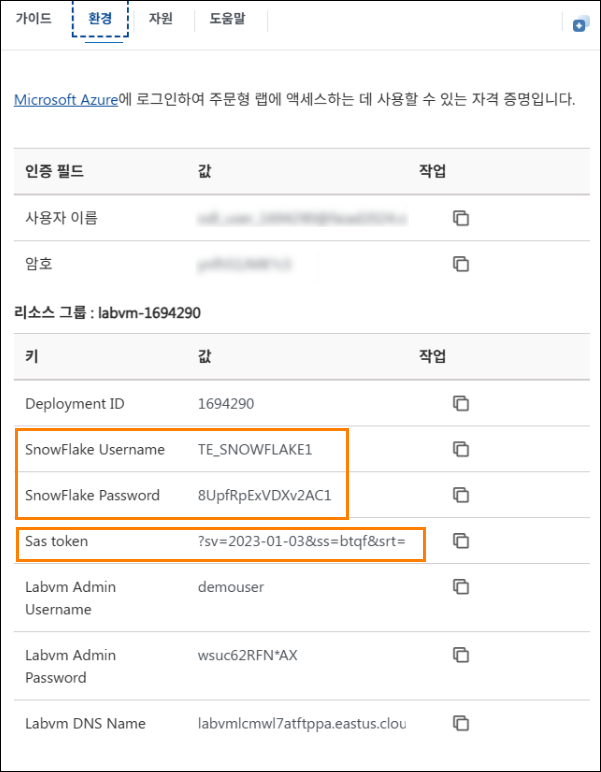

### Snowflake 로그인 문제 해결

참석자가 Snowflake에 로그인하는 데 문제가 있는 경우 아래 단계를 따르세요. 자세한 오류 설명이 제공됩니다.

1. **dlhdzca-bab11165.snowflakecomputing.com**으로 이동합니다. 이것이 저희가 사용하고 있는 Snowflake 서버입니다.

2. **자격 증명**을 입력합니다. 오류가 있는 경우 아래 스크린샷과 같이 자세한 오류 설명이 표시됩니다.

    

3. 오류가 지속되는 경우 **Azure Data Lake**에서** Snowflake 데이터**를 사용할 수 있고 **C:\FAIAD\Solutions**에 데이터 흐름 템플릿(**df_Supplier_ADLSGen2.pqt**)이 있는 경우입니다. 참석자가 아래 단계에 따라 이 템플릿을 가져오도록 도울 수 있습니다.

# 랩 링크:

- [포르투갈어(브라질)](https://experience.cloudlabs.ai/#/labguidepreview/aab00958-5596-4175-9bc9-39ece2586314)

- [중국어](https://experience.cloudlabs.ai/#/labguidepreview/3c8f94bd-6936-4a18-a1e3-8b606402531e)

- [영어](https://experience.cloudlabs.ai/#/labguidepreview/b63b312d-0c58-4fd0-bee1-05a94affa927)

- [프랑스어](https://experience.cloudlabs.ai/#/labguidepreview/e9c3e273-1dd1-4db8-80e3-aedfe41a1e9b)

- [독일어](https://experience.cloudlabs.ai/#/labguidepreview/e697a208-a982-4c6d-b32b-7e83d39c7186)

- [이탈리아어](https://experience.cloudlabs.ai/#/labguidepreview/b984b3dd-928d-492e-be2c-de1d49dd2640)

- [일본어](https://experience.cloudlabs.ai/#/labguidepreview/bb29b27d-7a77-4e4e-9c0d-a12a86397a1f)

- [한국어](https://experience.cloudlabs.ai/#/labguidepreview/544a6b13-8546-454d-8270-3540fe6a9566)

- [스페인어](https://experience.cloudlabs.ai/#/labguidepreview/16998c52-2637-4c65-b691-0fa5ac9091d7)

# 데이터 흐름 템플릿 가져오기

강사는 참석자가 데이터 흐름 템플릿을 가져올 수 있는 옵션을 갖도록 선택할 수 있습니다. 템플릿을 가져오는 단계는 다음과 같습니다.

### 데이터 흐름 템플릿에서 가져오기 전에 고려해야 할 사항

1. **학생이 이미 레이크하우스에서 테이블을 생성한 경우** PQT를 로드하기 전에 먼저 레이크하우스에서 테이블을 삭제해야 합니다(그렇지 않으면 새 데이터 흐름에서 테이블 이름을 변경한 다음 나중에 랩에서 해당 테이블을 설명해야 합니다).

2. 수강생은 관련 테이블의 대상을 설정해야 합니다. **'스테이징 활성화**' 체크박스는 선택되지 않았으나 여전히 선택되어 있을 가능성이 있으므로 다시 한 번 확인하는 것이 좋습니다.

3. df_Supplier_Snowflake의 대상이 필요한 테이블은 다음과 같습니다.

    1. Supplier

    2. PO

4. df_People_SharePoint에서 대상이 필요한 테이블은 다음과 같습니다.

    1. People

### 데이터 흐름 템플릿을 가져오는 방법

1. **랩 2, 작업 2에서 생성하고 Fabric 작업 영역, FAIAD_**<username>(으)로 이동합니다.

2. 메뉴에서 **새 항목 만들기 -> 데이터 흐름 2세대**를 선택합니다.

    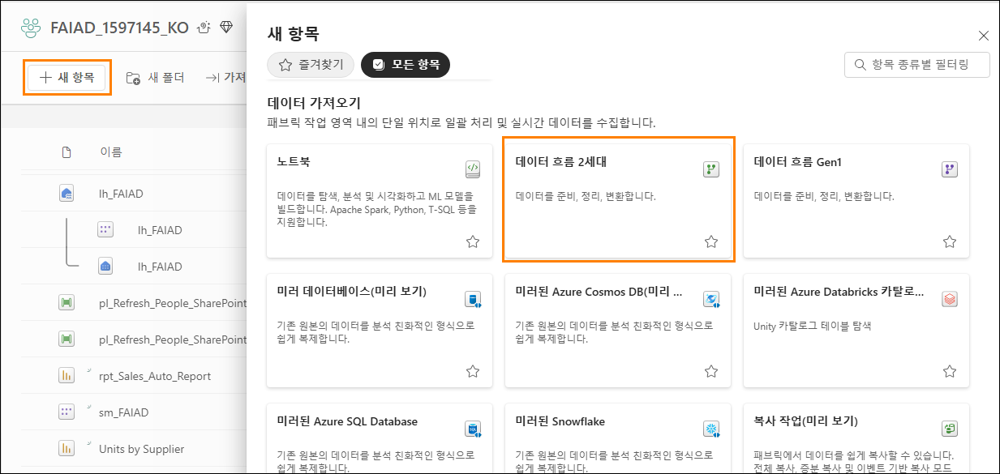

3. Power Query 창이 열립니다. 가운데 창에서 **Power Query 템플릿에서 가져오기**를 선택합니다.

    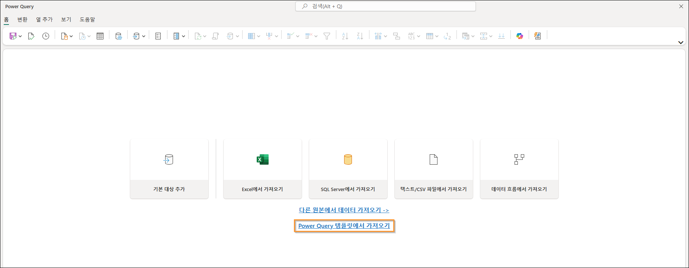

4. 랩 환경에서 **C:\FAIAD\Solutions** 폴더를 찾습니다.

5. 가져올 데이터 흐름을 선택합니다. 여기서는 **df_People_SharePoint.pqt**를 가져옵니다.

6. **열기**를 선택합니다.

    가져온 후에는 쿼리를 확인하고 쿼리에 대한 모든 단계를 가져옵니다. 그러나 연결을 구성해야 합니다. 또한 데이터 대상을 설정해야 합니다. 이들 단계를 완료하려면 랩 지침을 따르세요.

    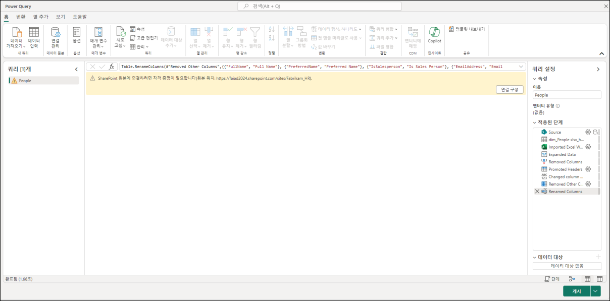

# T-SQL을 사용하여 보기 생성

강사인 여러분은 수강생들이 T-SQL을 사용하여 보기를 생성하도록 허용할 수 있습니다. Geo, Product, Reseller, Sales 보기에 대한 T-SQL은 **Solutions** 폴더에서 확인할 수 있습니다. 레이크하우스에서 새 SQL 쿼리 창을 열고 이러한 T-SQL 문을 실행하십시오. 뷰를 제거해야 할 경우, Solutions 폴더 내에 있는 Remove-View 파일을 실행하면 됩니다.

**참고:** 이는 CREATE 문입니다. 같은 이름의 기존 보기는 이러한 문을 실행하기 전에 삭제해야 합니다.

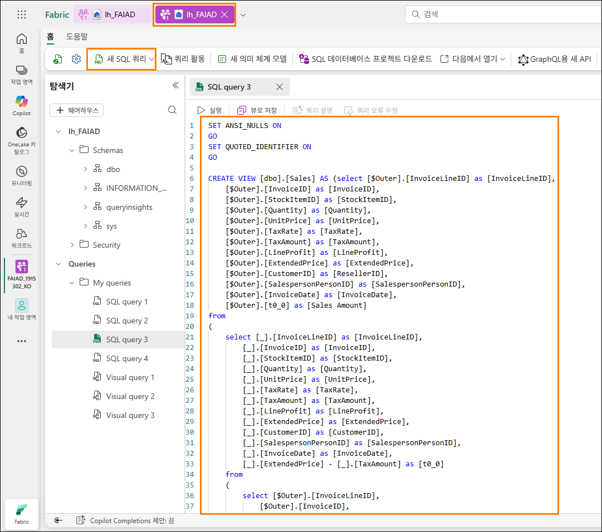

# 예측 ML 데모

### 요구 사항

강사는 다음 단계로 진행하기 전에 랩 1~6을 완료하고 모든 데이터를 수집해야 합니다.

데모를 위해서는 **prophet**라는 Python 라이브러리를 설치해야 합니다. Notebook에 인라인으로 설치하거나 환경을 만들 수도 있습니다. 이 데모에서는 인라인 모드를 사용합니다.

### Notebook 만드는 방법

1. **랩 2, 작업 2에서 생성하고 Fabric 작업 영역, FAIAD**_<username>(으)로 이동합니다.

2. 메뉴에서 **+ 새 항목**을 선택한 다음, 검색 상자를 사용하여 **노트북을 검색**하고,** 노트북**을 선택합니다.

    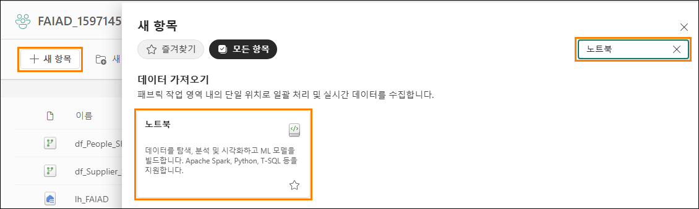

3. Notebook, 언어, 환경의 레이아웃, 새 셀을 만드는 방법 등에 대한 **간단한 개요**를 제공합니다.

### Notebook에 레이크 하우스 추가

기본 Lakehouse를 Notebook에 연결해야 합니다.

1. Explorer 패널에서 **데이터 항목** 탭을 선택합니다.

    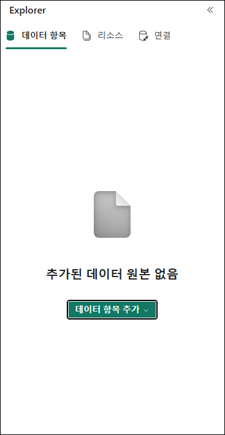

2. Explorer 패널에서 **데이터 항목 추가**를 선택합니다.

3. **OneLake 카탈로그에서**를 선택합니다.

    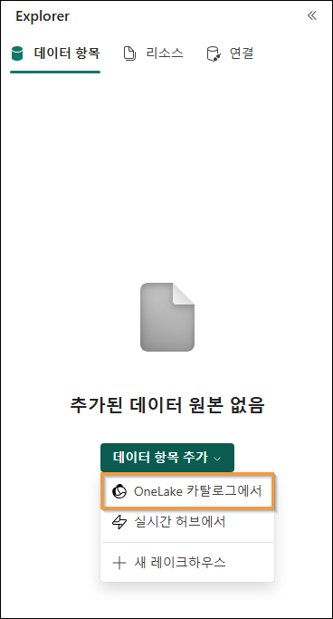

4. OneLake 데이터 허브 대화 상자가 열립니다. **lh_FAIAD** Lakehouse를 선택합니다.

5. **추가**를 선택합니다. Lakehouse가 Notebook과 연결되어 있는지 확인합니다.

    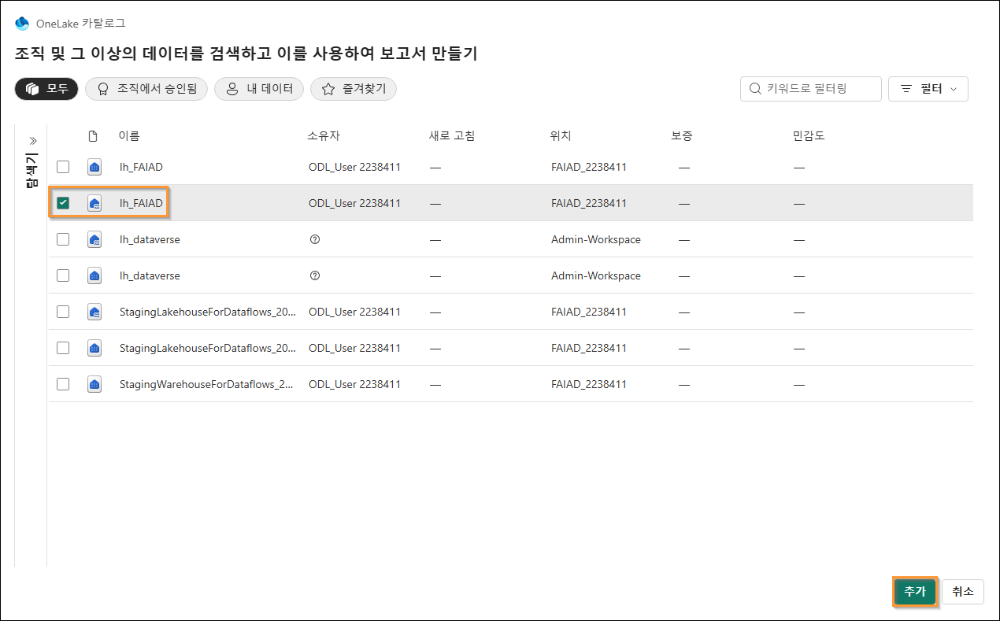

### Python 라이브러리 인라인 설치

데모를 위해서는 **prophet**라는 Python 라이브러리를 설치해야 합니다. 인라인으로 설치됩니다.

1. **Python 라이브러리를 설치**하려면 셀에 다음 코드를 입력합니다.

    !pip install Prophet

2. 셀 옆에 있는 **재생** 버튼을 선택하여 코드를 실행합니다.

    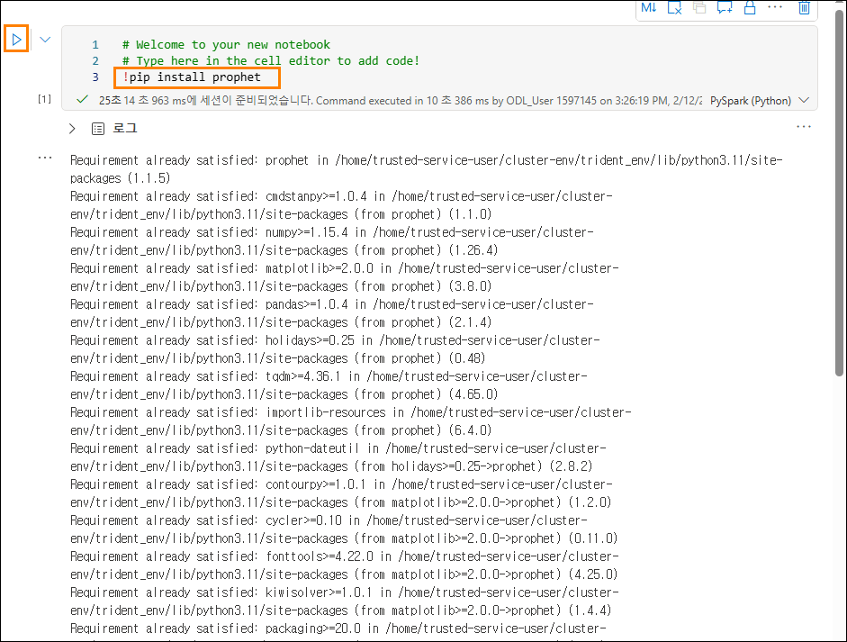

### 코드를 실행하여 예측 생성

1. **새 셀**을 만듭니다.

2. 다음 **코드**를 입력합니다.

    from pyspark.sql import SparkSession

    from pyspark.sql.functions import month, year, col

    from prophet import Prophet

    import pandas as pd

    # Initialize Spark session

    spark = SparkSession.builder.appName("Prophet Forecasting").getOrCreate()

    # Load data from your specific Spark table

    df = spark.sql("SELECT \* FROM lh_FAIAD.Invoices i JOIN lh_FAIAD.InvoiceLineItems il ON i.InvoiceID = il.InvoiceID")

    # Aggregate data to monthly level

    monthly_df = df.withColumn("Month", month("InvoiceDate"))

    .withColumn("Year", year("InvoiceDate"))

    .groupBy("Year", "Month")

    .sum("Quantity")

    .orderBy("Year", "Month")

    # Convert to Pandas DataFrame and prepare for Prophet

    pandas_df = monthly_df.toPandas()

    pandas_df['ds'] = pd.to_datetime(pandas_df[['Year', 'Month']].assign(DAY=1))

    pandas_df['y'] = pandas_df['sum(Quantity)']

    # Fit the Prophet model

    model = Prophet(yearly_seasonality=True, weekly_seasonality=False,daily_seasonality=False)

    model.fit(pandas_df[['ds', 'y']])

    # Create a DataFrame for future predictions (e.g., next 12 months)

    future = model.make_future_dataframe(periods=12, freq='M')

    # Forecast

    forecast = model.predict(future)

    # Plotting the forecast

    model.plot(forecast)

    model.plot_components(forecast)

3. **코드**의 각 단계를 설명합니다(코멘트 입력 수).

4. 셀 옆에 있는 **재생** 버튼을 선택하여 코드를 실행합니다.

    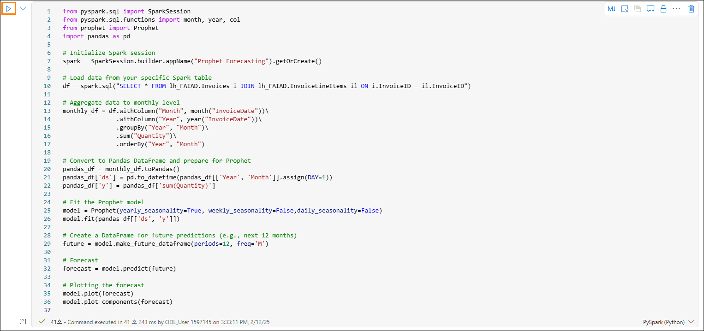

    생성된 세 가지 차트(아래)를 참석자들에게 안내합니다. 2023년 5월까지의 실제 데이터가 있고 12개월을 예측합니다.

    **첫 번째 차트**에서는 계절성과 2025년 4월까지의 예측이 제거된다는 점에 주의합니다.

    **두 번째 차트**에서는 추세가 제거되고 계절성을 추가하여 2025년 4월까지 예측합니다.

    

    **세 번째 차트**는 추세와 계절성을 모두 사용하여 예측합니다. 이 차트는 상한과 하한도 제공합니다.

    

5. **새 셀**을 만듭니다.

6. 다음 **코드**를 셀에 추가합니다.

    display(forecast)

    #write forecast data to a table

    spark.createDataFrame(forecast).write.saveAsTable("Sales_Forecast", mode="overwrite")

7. **재생** 버튼을 선택하여 셀을 실행합니다.

    

8. **표시되는 데이터**를 참석자들에게 안내합니다.

9. 사용자에게 Lakehouse에 새 테이블(**sales_forecast**)이 생성되었음을 표시합니다.

    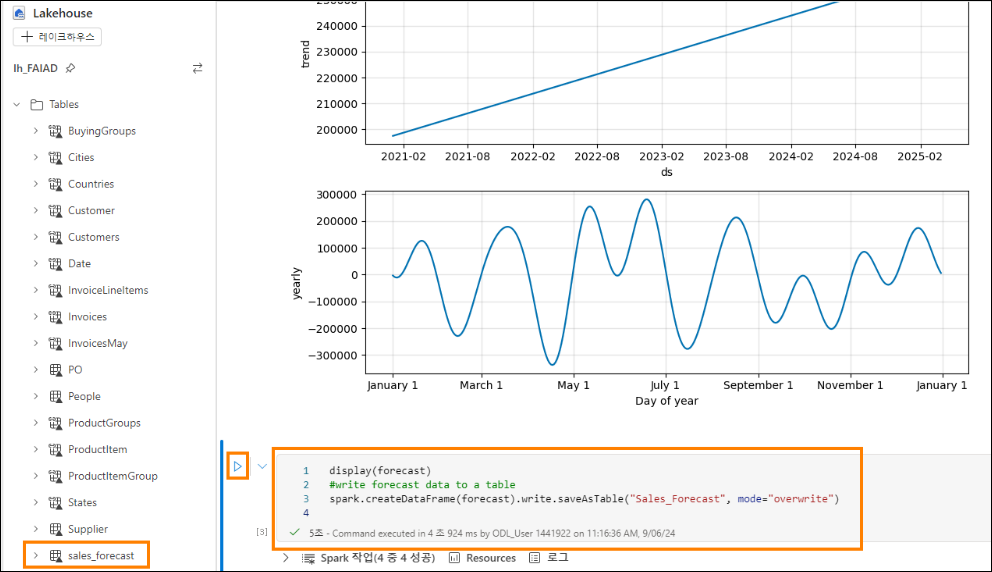

10. **테이블을 쿼리** 하고 사용자에게 테이블의 내용을 표시합니다.

# Data Activator 데모

### 요구 사항

강사는 다음 단계로 진행하기 전에 전에 랩 1~7을 완료해야 합니다.

다음 링크에서 최신 업데이트를 확인할 수 있습니다.

<https://learn.microsoft.com/en-us/fabric/data-activator/data-activator-introduction>

<https://learn.microsoft.com/en-us/fabric/data-activator/data-activator-get-data-power-bi>

### 시나리오

매월 재고 그룹 이름별 영업에 차이가 있다는 것을 알고 있습니다. 이는 계절성 때문입니다. 단, Variance %가 20% 미만인 경우 알림을 받고자 합니다. 이는 이러한 시나리오를 식별하고 해결하는 데 도움이 됩니다.

이를 해결하기 위해 Data Activator를 사용하겠습니다. 재고 그룹 이름의 판매 변수 %가 20% 미만으로 떨어지면 경고를 트리거할 예정입니다. 2024년 5월에 이를 시뮬레이션해 보겠습니다. Data Activator 트리거가 매시간 실행되므로 한 시간 동안 기다리는 대신 테스트 경고를 실행하겠습니다.

이 시나리오를 시연하기 위해 다음을 수행하겠습니다.

- 데이터 세트에 판매 변수 % 측정값을 추가합니다.

- 재고 그룹 이름별 판매 변수 %를 보여주는 테이블 시각적 개체를 추가합니다. 이 테이블을 2024년 5월로 필터링합니다.

- 테이블 시각적 개체를 사용하여 경고를 만듭니다.

- Activator를 검사하고 테스트 경고를 생성합니다.

### 판매 변수 % 측정값 추가

sm_FAIAD 의미 체계 모델에 새로운 측정값을 추가하려고 합니다.

1. **sm_FAIAD** 의미 체계 모델로 이동합니다.

2. **Sales** 테이블을 선택합니다.

3. 상단 메뉴에서 **홈 - > 새 측정값**을 선택합니다.

4. 아래 **측정값**을 생성합니다. 이렇게 하면 전월 대비 변수 %를 제공합니다.

    Sales Var % =

5. var priormth = CALCULATE([Sales], PREVIOUSMONTH('Date'[Date]))

6. RETURN DIVIDE([Sales]-priormth, priormth)

7. **측정값의 서식을 백분율**로 지정합니다.

    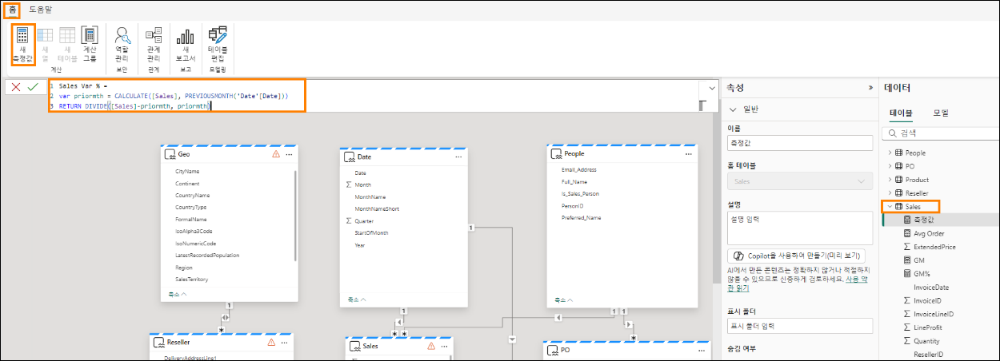

### 테이블 시각적 개체 생성

rpt_Sales_report를 편집하고 새 테이블 시각적 개체를 추가하겠습니다. 테이블 시각적 개체에는 2023년 5월의 재고 그룹 이름별 판매 변수 %가 표시됩니다.

1. **rpt_Sales_report**(랩 7에서 생성됨)로 이동합니다.

2. 상단 메뉴에서 **편집**을 선택합니다.

3. 데이터 뷰에서 **Product** 테이블을 확장합니다.

4. **StockGroupName** 필드를 선택합니다. 테이블 시각적 개체가 생성됩니다.

5. **Sales** 테이블을 확장합니다.

6. **Sales Var %**를 선택합니다. 테이블 시각적 개체에 데이터가 없는 것을 확인할 수 있습니다. Sales Var %를 계산하려면 월 이름이 필요하기 때문입니다.

    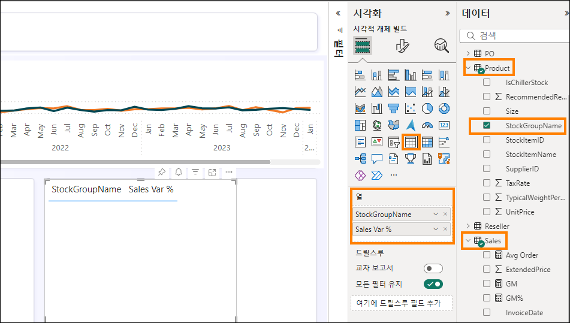

7. **필터** 섹션(접힌 경우)을 **확장**합니다.

8. 테이블 시각적 개체가 강조 표시된 상태에서 **데이터** 섹션에서 **Date** 테이블을 확장합니다.

9. **Year** 필드를 이 시각적 섹션의 필터로 끌어다 놓습니다.

10. **Year** 필드의 경우 **필터 형식** 드롭다운에서 **기본 필터링**을 선택합니다.

11. **2024**를 선택합니다.

    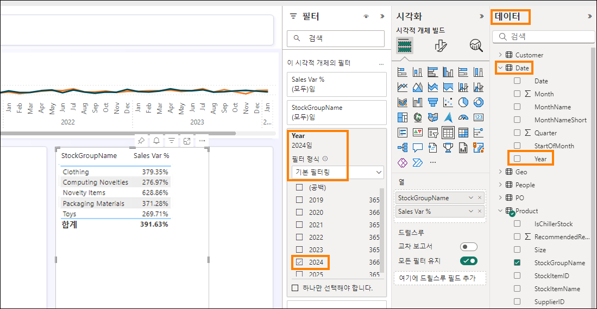

12. **MonthNameShort** 필드를 이 시각적 개체 섹션의 필터로 끌어옵니다.

13. **May를** 선택합니다.

14. **파일 -> 저장**을 선택하여 업데이트를 보고서에 저장합니다.

    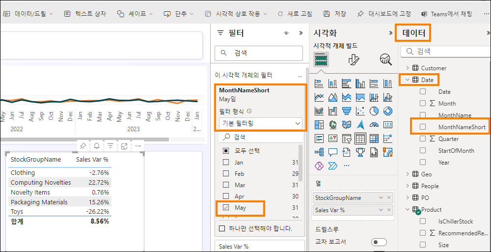

### Activator 생성

Stock 그룹 이름의 Sales Variance %가 -20% 미만인 경우 경고를 보내는 Activator를 만들겠습니다. 장난감 재고 그룹 이름은 판매 변수 %가 -26.22%이며 경고 기준을 충족함을 알 수 있습니다.

1. 새로 생성된 테이블 시각적 개체가 강조 표시된 상태에서 시각적 개체의 왼쪽 상단에 있는 **알림 종**을 선택합니다.

    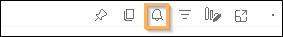

2. 경고 패널이 열리도록 설정합니다.

3. 각각에 대해 **Stock_Group_Name** 경고가 적용된다는 사실을 참석자들에게 알립니다.

4. **행이 변경되면 알림**에서** Sales Var** %를 선택합니다.

    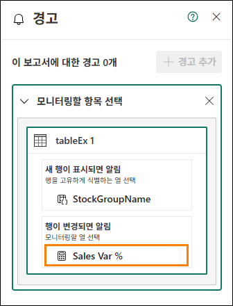

5. **된다** 라디오 버튼을 선택하고, **조건**을** 미만**으로 변경합니다.

6. **임계값**을** -20%**로 설정합니다. 이는 매출 변동률 %가 20% 아래로 떨어질 때 경고를 보내도록 트리거를 구성하는 것입니다.

    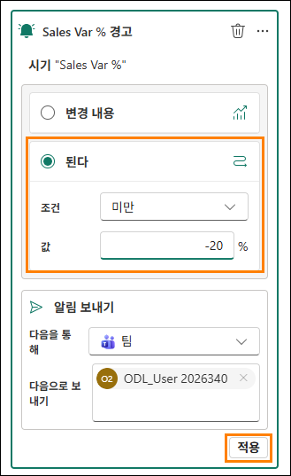

7. 알림을 위한 두 가지 옵션인 이메일과 Teams에 대해 이야기합니다.

8. **적용**을 선택합니다.

9. 하단의 **내 Power BI 활성자 경고** 옆에 있는 **줄임표(…)**를 선택합니다.

10. 작업 영역의 다른 저장 위치를 표시합니다.

    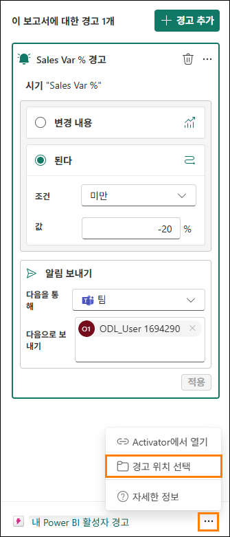

11. 경고가 생성되면, 아래쪽의 줄임표를 클릭한 다음 **Activator에서 열기**를 선택할 수도 있습니다.

    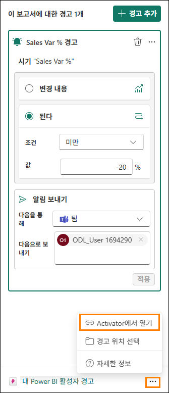

### Activator 개요

1. Activator의 **디자인** 뷰로 이동하게 됩니다.

2. 참석자들에게 **레이아웃**을 안내합니다. 왼쪽에 개체가 있습니다. 방금 만든 **트리거**가 있다는 것을 확인하세요. **이벤트** 섹션도 있습니다.

3. 우리가 생성한 트리거를 선택한 상태에서 **상단 메뉴**의 옵션에 대해 이야기합니다.

    1. 홈

    1. 데이터 가져오기

    2. Power Automate를 사용하여 사용자 지정 작업 생성

    2. 규칙

    1. 삭제

    2. 시작, 중지, 세부 정보 보기

    3. 나에게 테스트 작업 보내기

4. **정의** 탭에 포함된 **모니터**와** 조건** 차트에 대해 설명합니다.

5. 아래로 스크롤을 내리면, **작업** 차트에서 경고가 트리거되면 경고가 표시되는 곳을 확인할 수 있습니다. 현재 트리거는 매시간 실행됩니다. 따라서 다음 시간 내에 데이터가 변경되고 조건이 충족되면 경고가 트리거됩니다.

    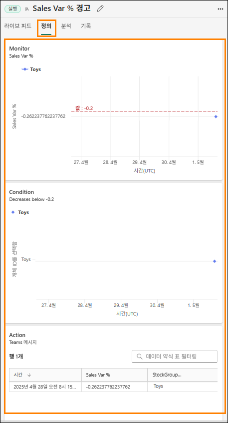

6. 화면 오른쪽에서 **경고의 정의**를 구성할 수 있는 옵션을 사용할 수 있습니다. 여기에는 특성, 필터 또는 요약, 조건, 작업이 포함됩니다. 경고는 기본적으로 랩 사용자 계정으로 설정됩니다. (현재 외부 이메일 주소는 지원되지 않습니다.)

    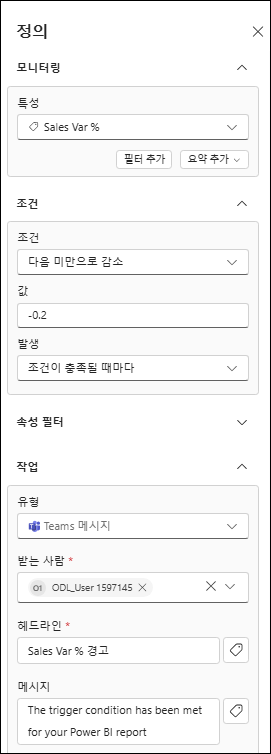

7. 여기서도 작업 세부 사항을 편집할 수 있습니다. 작업 편집 버튼을 선택하면 작업 편집 창이 뜹니다.

    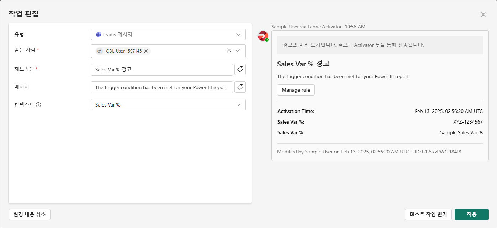

### 테스트 경고 보내기

**참고:** 경고를 보려면 랩 환경을 사용해야 합니다.

1. **Sales Var % 트리거**를 선택합니다.

2. 상단 메뉴에서 **테스트 작업 받기**를 선택합니다. 그러면 랩 사용자 계정으로 테스트 경고가 전송됩니다.

3. 화면 왼쪽 상단에서 앱 론처 아이콘을 선택합니다.

    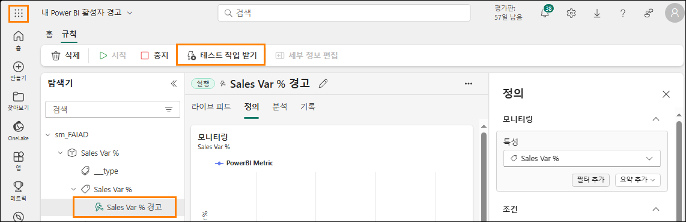

4. Teams를 선택합니다. 새 브라우저 창이 열립니다.

    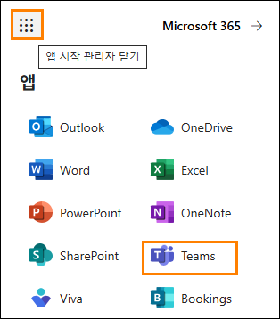

5. 경고 메시지를 받게 됩니다(몇 분 정도 걸릴 수 있음). 이는 테스트 작업입니다.

    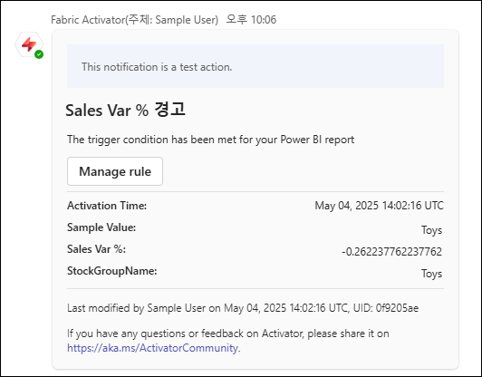

6. 데이터가 변경되고 트리거 조건이 충족되면 경고가 전송됩니다.

    **참고:** 이 기능을 시연하기 위해 1개월(2024년 5월)의 시각적 개체를 필터링했습니다. 이번 달에 대해 동적으로 설정된 트리거가 있을 것입니다.

# 의미 체계 링크 데모

### 요구 사항

강사는 다음 단계로 진행하기 전에 랩 1~7을 완료해야 합니다.

두 노트북 모두 완료하는 데 5~10분 정도 걸릴 수 있으므로 강사가 이 데모의 노트북을 미리 실행하는 것이 좋습니다. 한 가지 방법은 학생들이 실험 6/7을 수행하는 동안 노트북을 실행하는 것입니다. 이는 강사가 학생들에게 노트북의 결과를 보여줄 수 있도록 하기 위함입니다.

### 시나리오

이 데모에서는 **모범 사례 분석기** 와 **메모리 분석기를** 살펴보겠습니다. 이들은 성능, 메모리 사용량 및 전반적인 품질 측면에서 우리의 의미론적 모델을 평가하는 데 도움이 되는 강력한 도구들입니다. 이러한 도구는 단순히 지표를 제공하는 데 그치지 않습니다. **모델의 설계와 효율성을 개선할 수 있는 실행 가능한 인사이** 트를 제공함으로써, 그렇지 않으면 놓칠 수 있는 최적화 기회를 부각시켜 줍니다.

Microsoft Fabric 기능의 핵심은 **의미 체계 링크**입니다. 이는 의미 체계 모델을 데이터 과학 도구 및 경험과 직접 연결할 수 있게 해주는 기능입니다. 이는 Notebooks를 통해 sm_FAIAD 의미 체계 모델을 **분석하고 프로파일링하며 최적화할** 수 있음을 의미합니다.

이러한 연결 덕분에, 작업 영역 내의 의미 체계 모델에 대해 직접적으로 모범 사례 점검 및 메모리 프로파일링과 같은 심층 분석을 수행할 수 있습니다. 이를 통해 **성능을 향상시키고 메모리 사용량을 줄이며, 궁극적으로 운영 환경에서 아티팩트의 비용을 절감할** 수 있습니다.

이 시나리오를 시연하기 위해 다음을 수행하겠습니다.

- sm_FAIAD 의미 체계 모델을 열고 의미 체계 링크 기능을 찾습니다.

- 모범 사례 분석기 노트북을 만들고 인사이트를 봅니다.

- 메모리 분석기 노트북을 만들고 인사이트를 봅니다.

### 모범 사례 분석기

1. **랩 2, 작업 2에서 생성하고 Fabric 작업 영역, FAIAD_<username>**(으)로 이동합니다.

2. **sm_FAIAD** 의미 체계 모델을 엽니다.

    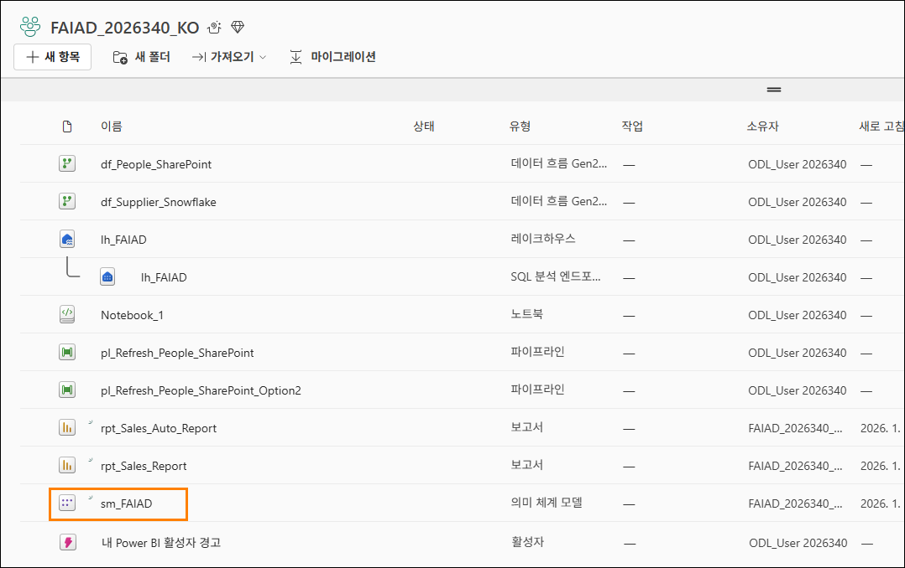

3. 다음 페이지에서 **의미 체계 모델 열기**를 선택합니다.

    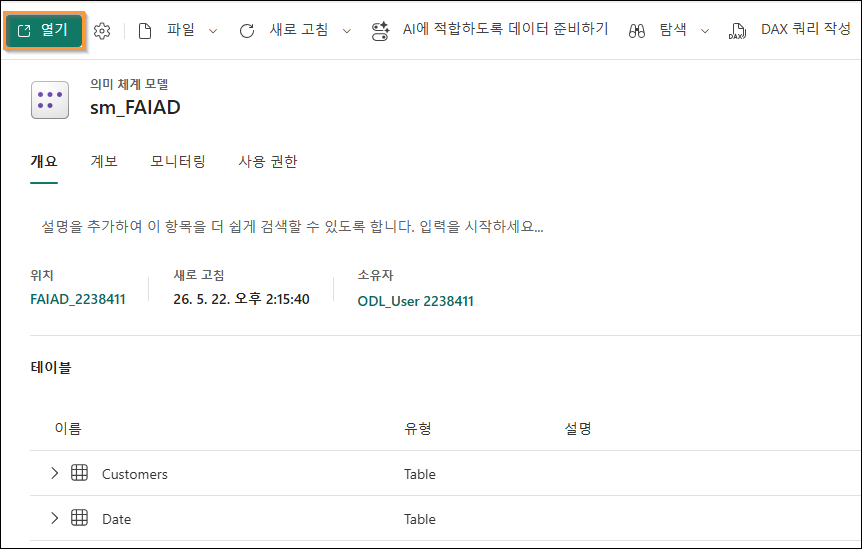

4. 홈 리본 알림에서 **모델 상태** 항목 아래에 3개의 항목이 있습니다.

    1. **모범 사례 분석기:** Fabric 전문가가 만든 규칙을 바탕으로 의미 체계의 설계와 성능을 개선하는 방법을 제공합니다.

    2. **메모리 분석기:** 의미 체계 모델의 개체에 대한 메모리 및 스토리지 통계를 제공합니다. 이러한 통계를 검토하면 성능 최적화 및 메모리 절감 가능성이 있는 영역을 파악하는 데 도움이 될 수 있습니다.

    3. **커뮤니티 노트북:** Power BI 커뮤니티가 데이터 분석 및 보고 기능을 향상시키기 위해 제작한 노트북 갤러리입니다.

    **참고:** 이 노트북들은 의미 체계 상세 페이지에서도 확인할 수 있습니다.

5. **모범 사례 분석기** 를 클릭합니다.

    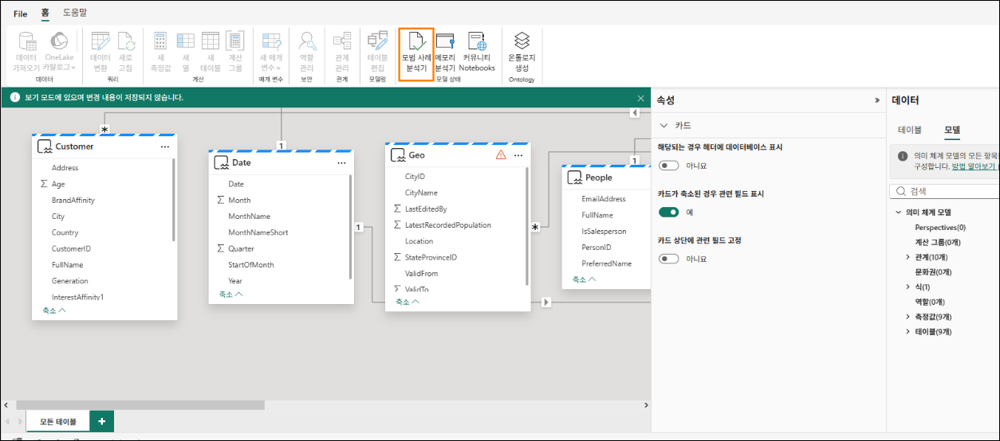

6. 새로운 모범 사례 분석기 노트북이 생성될 예정입니다. 노트북으로 이동하게 됩니다.

7. 학생들과 함께 Markdown 셀에 작성된 세부 사항을 검토합니다.

8. 홈 리본 메뉴에서 모두 **실행**을 선택합니다.

    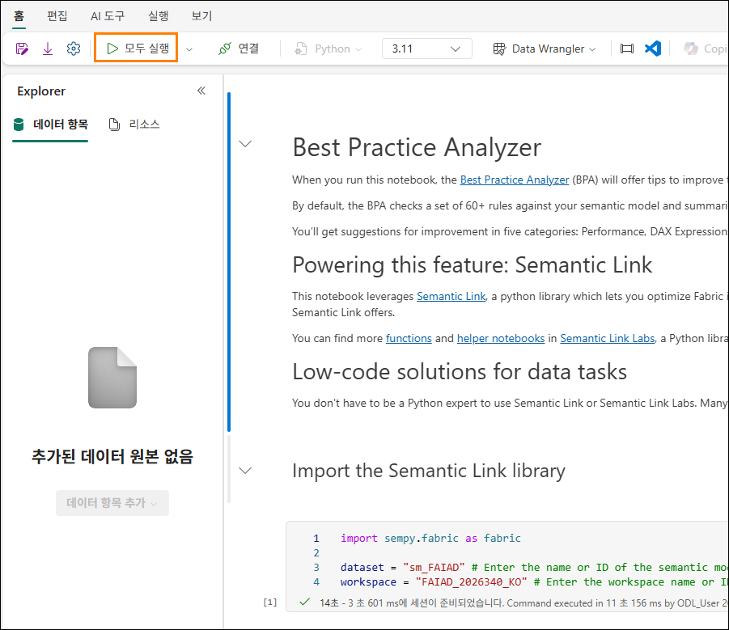

9. 노트북 실행이 완료되면 **run_model_bpa** 함수의 실행 결과를 확인합니다.

    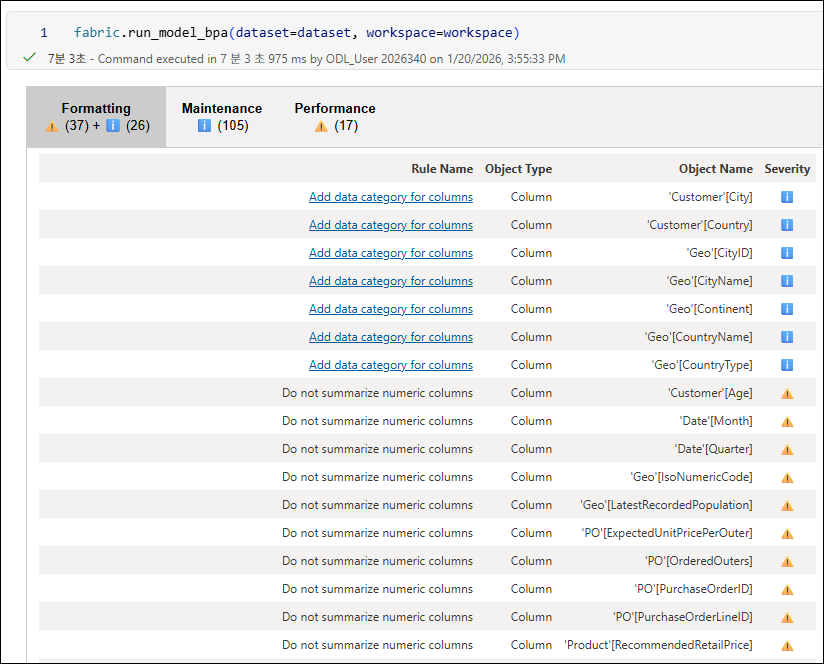

10. 이 함수는 세 가지 범주의 권장 사항을 반환합니다. **서식 지정, 유지 관리 및 성능.** 주어진 범주 내에서 권고 사항의 중요도를 나타내는 두 가지 다른 아이콘을 볼 수 있습니다.

    1. ℹ️ - 모델을 개선할 수 있는 권장 변경 사항입니다.

    2. ⚠️ - 이 경고 수준은 나열된 문제가 해당 모델 또는 해당 모델을 사용하는 보고서에서 문제를 일으킬 수 있음을 나타냅니다.

11. **서식 설정**에서 아래로 스크롤한 후 **“Format flag columns as Yes/No value strings” 규칙 이름** 위로 마우스를 가져갑니다.

12. 학생들에게 규칙 이름 위에 마우스를 올리면 권장 변경 사항에 대한 자세한 정보를 확인할 수 있다고 설명합니다.

    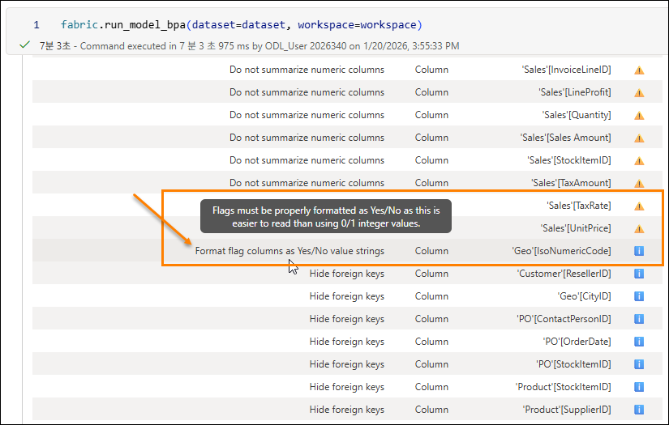

13. 이 경우 성능 분석기는**Geo** 테이블의 **IsoNumericCode**. 열을 **예/아니오** 형식으로 포맷할 것을 권장합니다. 이는 스타 스키마를 모델링할 때 플래그 열을 이러한 방식으로 포맷팅하는 것이 모범 사례이므로 훌륭한 권장 사항입니다.

14. **유지 관리** 범주를 선택합니다.

    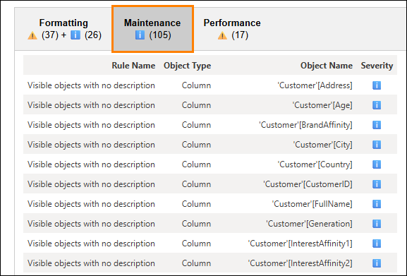

15. 학생들에게 대부분의 유지 관리 권장 사항은 모델의 가시적 열에 설명을 추가하는 것임을 알려줍니다.

16. **성능** 범주를 선택합니다.

    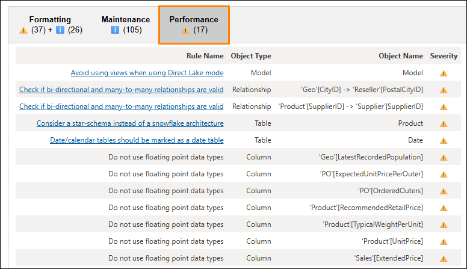

17. **“Avoid using views when using Direct Lake mode” 규칙 이름** 위에 마우스를 올립니다.

18. 성능 분석기는 Direct Lake 모드가 뷰를 지원하지 않는다는 점을 상기시켜 줍니다. 이 수업에서는 데이터에 빠르게 연결하기 위해 단축키를 사용했으며, 이후 뷰를 통해 데이터를 변환했습니다. 이는 부분적으로 Fabric에 존재하는 다양한 데이터 연결 방식에 대해 더 깊이 이해하기 위한 목적도 있었습니다. 그러나 이 권장 사항을 우리 모델에 적용하려면 Dataflow Gen2와 같은 다른 방법을 사용하여 판매 데이터를 수집하고 변환해야 합니다.

    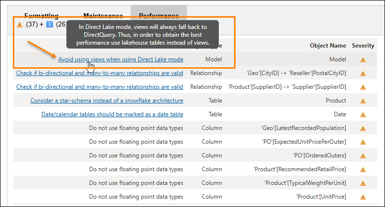

19. 시간이 허락한다면, 강사는 다른 권장 사항들을 설명해 줄 수 있습니다.

### 메모리 분석기

1. **sm_FAIAD** 의미 체계의 모델 뷰로 돌아갑니다.

2. **홈 리본** 메뉴에서 **메모리 분석기를 선택합니다.**

    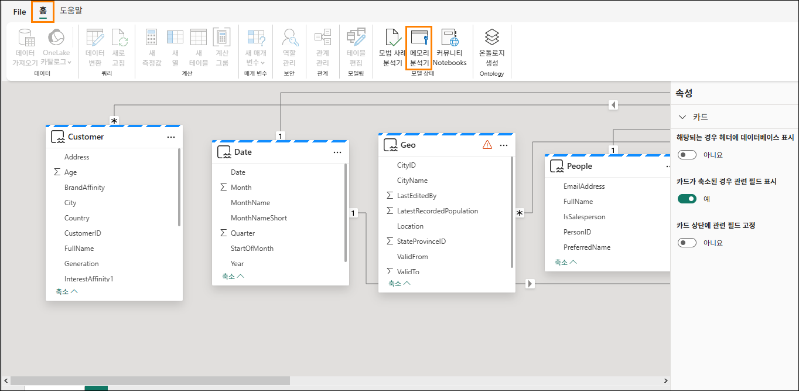

3. 새로운 메모리 분석기 노트북이 생성될 예정입니다.

4. 학생들과 함께 마크다운 셀에 나열된 세부 사항을 검토합니다.

5. **홈 리본** 메뉴에서 **모두 실행**을 선택합니다.

    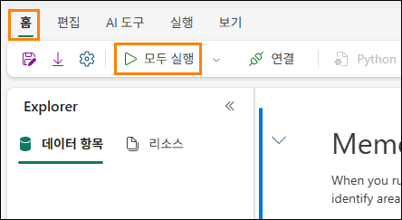

6. 노트북이 완료된 후, 결과 데이터를 살펴봅니다. 다양한 세부 수준에서 메모리 사용량을 표시하는 여러 범주가 있습니다.

    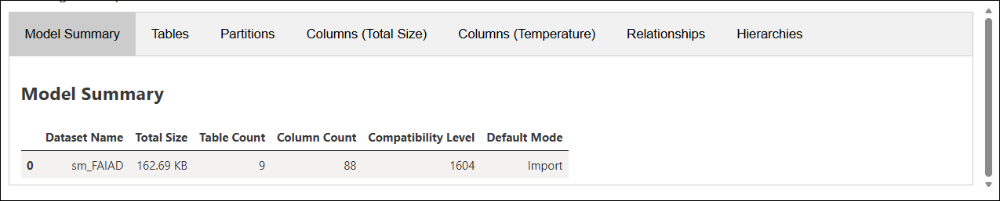

7. 학생들에게 이 모든 정보를 활용하여 메모리 사용과 관련하여 개선이 필요한 부분을 파악할 수 있음을 알려줍니다.

8. **테이블** 범주를 선택합니다.

9. **% DB 열** 이름 위에 마우스를 올리십시오. 그러면 해당 열의 설명이 표시됩니다. 이 열은 각 테이블의 크기를 의미 체계의 크기에 상대적으로 나타냅니다. 이것이 무조건 문제가 있다는 뜻은 아니지만, 각 테이블이 의미 체계 모델 메모리의 몇 퍼센트를 사용하고 있는지 확인하는 것은 유용합니다.

    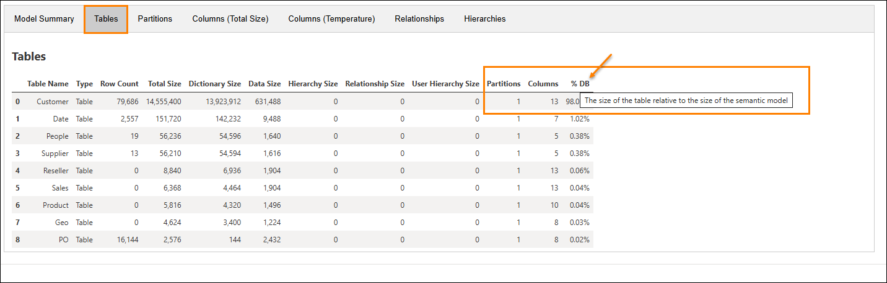

10. 시간이 허락한다면, 강사는 다른 범주를 살펴보며 다양한 데이터 포인트를 설명하는 데모를 마무리할 수 있습니다.
