# Microsoft Fabric Fabric Analyst in a Day 랩 2 - 버전: 2026년 5월

## 목차

- 소개
- Fabric 라이선스
  - 작업 1: Microsoft Fabric 평가판 라이선스 활성화
- Fabric 작업 영역
  - 작업 2: Fabric 작업 영역 만들기
  - 작업 3: 레이크하우스 만들기
- Fabric 환경 개요
  - 작업 4: Data Factory 환경
  - 작업 5: Industry Solutions 경험
  - 작업 6: Real-Time Intelligence 환경
  - 작업 7: Data Engineering 환경
  - 작업 8: Data Science 환경
  - 작업 9: Data Warehouse 환경
  - 작업 10: 데이터베이스 환경
- 참조

# 소개

오늘은 Microsoft Fabric의 다양한 주요 기능을 학습하게 됩니다. 본 랩은 Fabric에서 이용할 수 있는 다양한 제품 환경과 항목을 소개하기 위한 입문 워크샵입니다. 이 워크샵이 끝나면 레이크하우스, 데이터 흐름 2세대, 파이프라인, DirectLake 등을 사용하는 방법을 배우게 됩니다.

이 랩을 마치면 다음 사항을 알게 됩니다.

- Fabric 작업 영역을 만드는 방법

- 레이크하우스 만드는 방법

# Fabric 라이선스

### 작업 1: Microsoft Fabric 평가판 라이선스 활성화

1. 가상 머신의 바탕 화면에서 **PowerBI Portal**을 선택합니다. 로그인하라는 메시지가 표시될 수 있습니다.

    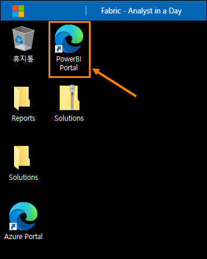

    **참고:** 랩 환경을 사용하는 경우 자동으로 로그인할 수 있습니다.

    **참고:** Fabric이열리지 않으면 브라우저에서 http://app.fabric.microsoft.com/으로 이동합니다.

2. 사용자 이름을 복사하여 대화 상자의 전자 메일 필드에 붙여넣고 제출을 선택합니다.

    - **전자 메일/사용자 이름:** 환경 탭에서 찾을 수 있습니다.

    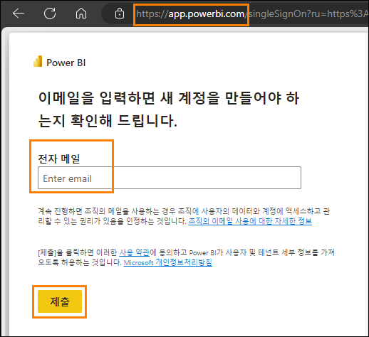

3. **Microsoft Azure으로 로그인** 탭에 로그인 화면이 표시되면 다음 **EmailUsername**을 입력한 후 **다음**을 클릭합니다.

    - **전자 메일/사용자 이름:** 환경 탭에서 찾을 수 있습니다.

    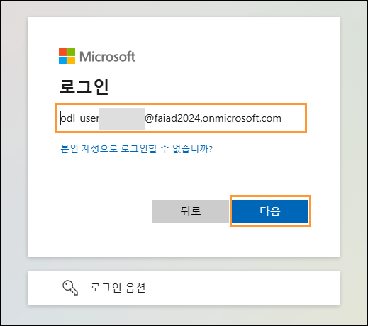

4. 이제 다음 **임시 액세스 패스**를 입력하고 **로그인**을 클릭합니다.

    - **임시 액세스 패스**: 환경 탭에서 발견

    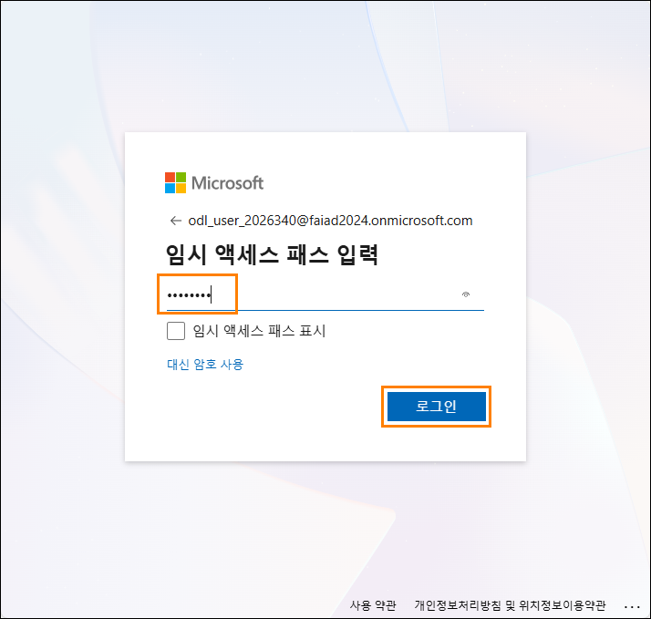

5. 익숙한 **Power BI 서비스 홈 페이지**가 열립니다.

6. 참여자가 Power BI 서비스 레이아웃에 익숙하다고 가정합니다. 궁금한 사항은 주저없이 강사에게 문의하세요.

    현재 **내 작업 영역에** 있습니다. Fabric 항목으로 작업하려면 평가판 라이선스와 Fabric 라이선스가 할당된 작업 영역이 필요합니다. 설정해 봅시다.

7. 화면의 오른쪽 상단 모서리에서 **사용자 아이콘**을 선택합니다.

8. **무료 평가판**을 선택합니다.

    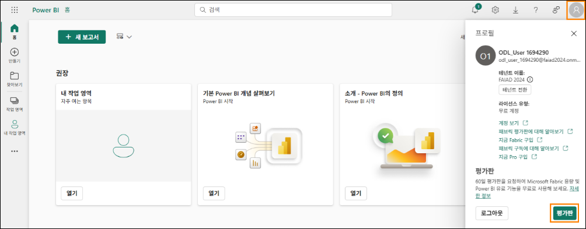

9. 무료 Microsoft Fabric 평가판으로 업그레이드 대화상자가 열립니다. **활성화**를 선택합니다.

    **참고:** 기본 영역을 변경하지 않습니다. 현재 상태 그대로 유지합니다.

    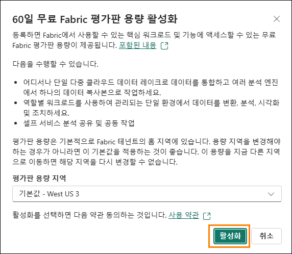

10. Microsoft Fabric 업그레이드 성공 대화 상자가 열립니다. **Fabric Home Page**를 선택합니다.

    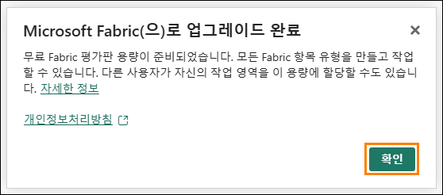

11. **Microsoft Fabric 홈 페이지**로 이동합니다. "패브릭 보기 시작" 대화 상자가 열릴 수 있습니다. 원하는 경우 **둘러보기 시작** 옵션이나 **취소**를 선택할 수 있습니다.

    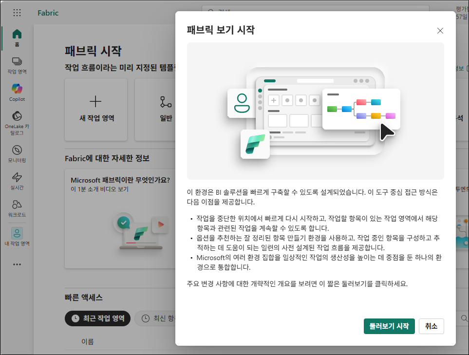

# Fabric 작업 영역

### 작업 2: Fabric 작업 영역 만들기

1. 이제 Fabric 라이선스로 작업 영역을 만들어 보겠습니다. 왼쪽 탐색 모음에서 **작업 영역** **(1)**을 선택합니다. 대화 상자가 열립니다.

2. 팝업 메뉴 하단에서 **+ 새 작업 영역(2)**을 클릭합니다.

    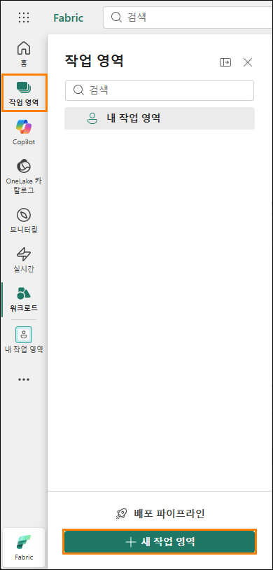

3. 브라우저 오른쪽에 **작업 영역 만들기** 대화상자가 열립니다.

4. **이름** 필드에 FAIAD_UserID(환경에서 찾을 수 있음)를 입력합니다.
     **참고:** 작업공간 이름은 고유해야 합니다. 이름 필드 아래에 "이 이름을 사용할 수 있습니다."라는 문구와 함께 녹색 확인 표시가 있는지 확인합니다.

5. 원하는 경우 작업 영역에 대한 설명을 입력할 수 있습니다. 이는 선택적 필드입니다.

6. **고급**을 클릭하여 섹션을 확장합니다.

    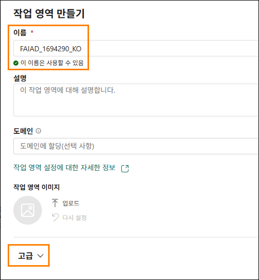

7. **라이선스 모드**에서** 평가판**이 선택되어 있는지 확인합니다. (기본적으로 선택되어 있어야 합니다.)

8. **적용**을 선택하여 새 작업 영역을 만듭니다.

    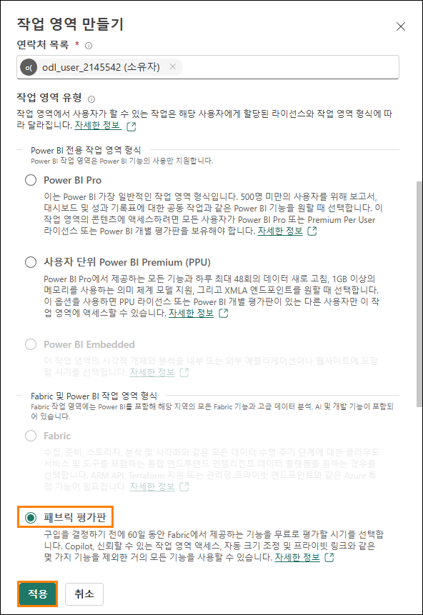

    새로 생성된 작업 영역으로 이동하게 됩니다. 다양한 데이터 원본의 데이터를 레이크하우스로 가져오고 레이크하우스의 데이터를 사용하여 모델을 구축하고 이에 대해 보고할 것입니다. 첫 번째 단계로 레이크하우스를 선택합니다. 다음으로 간단한 실습을 해보겠습니다.

### 작업 3: 레이크하우스 만들기

1. 새로 생성된 작업 영역 **FAIAD_Username**에서 왼쪽 탐색 창에 있는 **+ 새 항목 (1)** 버튼을 찾습니다. 여기에서 작업 영역에 새로운 항목을 만들 수 있습니다.

2. 검색창에 **레이크하우스 (2)**를 입력하고, 검색 결과에서 **레이크하우스 (3)** 옵션을 선택합니다. 이를 통해 빅 데이터를 저장, 조회, 관리할 수 있는 새로운 레이크하우스를 만들 수 있습니다.

    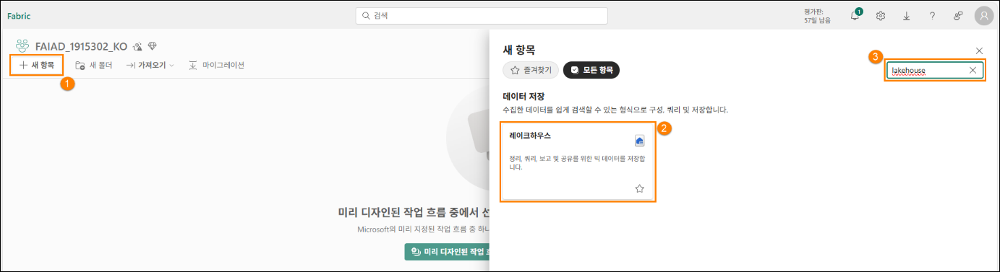

3. 새로운 레이크하우스 대화 상자가 나타납니다. 이름 텍스트 상자에 **lh_FAIAD**를 입력합니다.
     **참고:** 여기서 lh는 레이크하우스를 의미합니다. 쉽게 식별하고 검색할 수 있도록 lh를 접두사로 붙였습니다. **참고:** 이 기능은 더 이상 프리뷰 단계가 아니지만, **아직은 활성화**할 필요는 없습니다.

4. **만들기**를 선택합니다.

    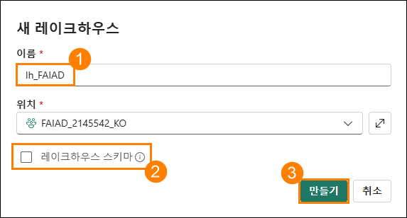

    몇 분 안에 레이크하우스가 생성되고 레이크하우스 탐색기 인터페이스로 이동하게 됩니다. 헤더의 Fabric 이름 왼쪽 상단에 레이크하우스 아이콘이 표시됩니다. 왼쪽 탐색 모음의 작업 영역 아이콘은 이제 항목이 포함되었음을 반영합니다.

    레이크하우스 탐색기 내에서 테이블 및 파일 섹션을 확인할 수 있습니다. 레이크하우스는 파일 섹션 아래에 Azure Data Lake Storage Gen2 파일을 노출하거나 데이터 흐름이 Lakehouse 테이블에 데이터를 로드할 수 있습니다. 사용할 수 있는 다양한 옵션이 있습니다. 다음 랩에서 몇 가지 옵션을 보여드리겠습니다.

    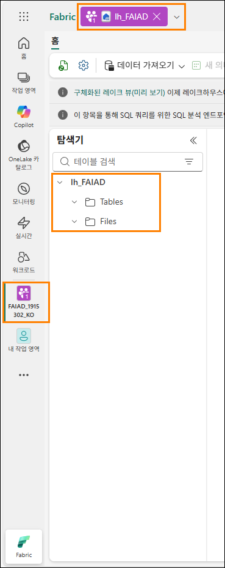

# Fabric 환경 개요

### 작업 4: Data Factory 환경

1. 화면 왼쪽 아래에 있는 워크로드 아이콘을 선택합니다. Fabric 환경 목록이 포함된 대화 상자가 열립니다. 관련된 목록으로는 Power BI, Data Factory, Industry Solutions, Real-Time Intelligence, Data Engineering, Data Science, Data Warehouse가 포함됩니다. 한번 살펴보겠습니다!

    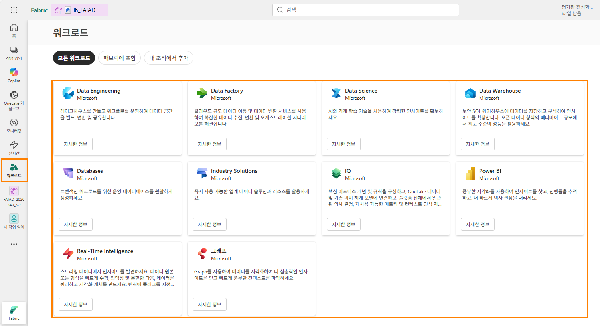

2. **Data Factory**를 선택합니다.

    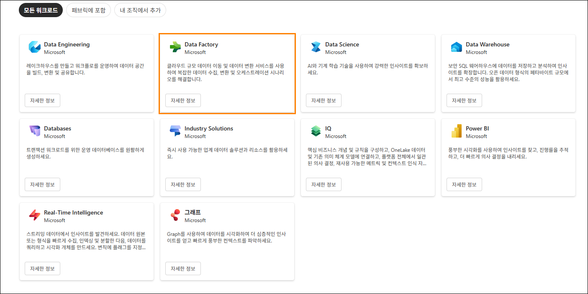

3. Data Factory 홈페이지로 이동됩니다. 아래는 Data Factory를 효과적으로 사용하기 위한 단계별 안내를 위해 섹션별로 자세히 설명한 것입니다. 데이터 흐름 2세대는 차세대 데이터 흐름입니다.

    **Data Factory란 무엇인가?**

    Data Factory는 다양한 출처의 데이터를 관리하고 정리하는 데 도움이 되는 도구입니다. 이를 통해 데이터를 수집, 준비, 변환하여 효과적으로 사용할 수 있습니다. 초보자든 전문가든 Data Factory는 데이터 변환을 더 쉽고 효율적으로 만들어 주는 도구를 제공합니다.

    **항목 유형:**

    1) **데이터 흐름 2세대:** 데이터 흐름은 데이터를 변환하는 방법과 같습니다. 300가지가 넘는 다양한 변환을 제공하여 데이터에 적용할 수 있습니다. 즉, 필요에 따라 다양한 방법으로 데이터를 정리, 결합, 변경할 수 있습니다.

    2) **파이프라인:** 파이프라인은 데이터 프로세스를 자동화하는 데 도움이 되는 작업 흐름입니다. 이를 통해 특정 요구 사항에 맞게 조정할 수 있는 유연한 데이터 워크플로를 만들 수 있습니다. 이를 통해 보다 체계적인 방식으로 데이터를 관리하고 처리할 수 있습니다.

    3) **Azure Data Factory**: Azure Data Factory는 클라우드 기반 데이터 통합 서비스로, 데이터 이동과 데이터 변환을 조정하고 자동화하기 위한 데이터 기반 워크플로를 생성할 수 있습니다.

    4) **Apache Airflow 작업**: Apache Airflow는 워크플로를 프로그래밍 방식으로 작성, 일정 수립, 모니터링하는 데 사용되는 오픈 소스 플랫폼입니다. Data Factory에서는 복잡한 데이터 워크플로를 생성, 예약, 관리할 수 있습니다.

    5) **작업 복사**: 작업 복사는 한 소스에서 다른 소스로 데이터를 복사할 수 있는 기능입니다. 이 도구는 서로 다른 데이터 저장소 간에 데이터를 이동하는 간단하고 효율적인 방법을 제공합니다.

    6) **미러링된 데이터베이스:** 백업, 테스트 또는 읽기 전용 액세스를 위해 데이터베이스의 미러링된 버전을 생성하는 기능입니다.

    7) **미러링된 SAP:** 기존 SAP 자산을 Fabric의 나머지 데이터와 원활하게 통합합니다.

    8) **미러링된 Oracle:** Fabric 내 미러링은 Oracle 데이터베이스를 통합 플랫폼으로 복제하여 다른 데이터 소스와 함께 거의 실시간에 가까운 낮은 대기 시간의 분석을 가능하게 합니다.

    9) **미러링된 Google BigQuery(프리뷰):** Fabric의 미러링 기능을 통해 Google BigQuery 데이터를 OneLake로 지속적으로 복제할 수 있어 복잡한 ETL 작업을 제거하고 분석, AI, 데이터 공유 전반에 걸쳐 원활한 활용이 가능합니다.

    10) 미러링된 SharePoint Online 목록(프리뷰): SharePoint 목록 데이터를 거의 실시간으로 Microsoft Fabric OneLake에 복제하여, 읽기 전용의 분석 준비 상태가 완료된 소스로 제공합니다. 이 기능은 ETL 과정을 생략하고, Power BI 및 기타 Fabric 워크로드를 위해 자동 생성된 SQL 분석 엔드포인트를 통해 데이터를 제공합니다.

    11) **변수 라이브러리:** 변수 목록과 기본값이 포함되어 있습니다. 대체 값을 포함하는 다른 값 집합을 포함할 수도 있습니다.

    12) **dbt 작업(프리뷰):** dbt를 가져와서 SQL을 사용하여 데이터를 친숙한 환경으로 변환할 수 있습니다.

    **시작:**

    Data Factory를 사용하기 시작하려면 다음 단계를 따르세요.

    1) **Data Factory 사용 방법 배우기:** 이 섹션은 Data Factory를 시작하는 데 도움이 됩니다. 이 도구를 효과적으로 사용하기 위한 지침을 제공합니다.

    2) **첫 번째 데이터 흐름 만들기:** 여기에서 첫 번째 데이터 흐름을 만드는 방법을 배울 수 있습니다. 데이터 흐름은 필요에 따라 데이터를 변환하는 데 필수적입니다.

    3) **첫 번째 파이프라인 만들기:** 이 섹션에서는 첫 번째 파이프라인을 만드는 방법을 안내합니다. 파이프라인은 데이터 프로세스를 효율적으로 자동화하고 관리하는 데 도움이 됩니다.

    4) **Data Factory 모니터링 방법 알아보기:** 데이터 프로세스가 원활하게 실행되도록 하려면 모니터링이 필수적입니다. 이 섹션에서는 Data Factory 활동을 모니터링하는 방법을 알려줍니다.

    5) **데이터 흐름을 이용한 데이터 변환 방법 배우기:** 이 섹션에서는 데이터 흐름을 사용하여 데이터를 효과적으로 변환하는 방법을 이해하는 데 도움이 됩니다.

    6) **GraphQL용 첫 번째 API 만들기:** GraphQL을 이용한 API 사용에 관심이 있다면, 이 섹션에서 시작하는 방법을 안내해 드립니다.

    7) **첫 번째 사용자 데이터 함수 만들기:** 이 섹션은 사용자 데이터 관리와 변형에 유용한 사용자 데이터 함수를 만드는 데 도움이 됩니다.

    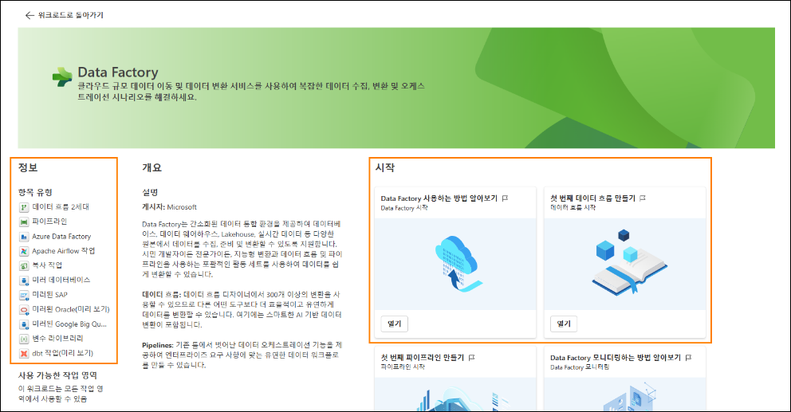

4. 화면 왼쪽 상단의 **워크로드로 돌아가기**를 클릭합니다. 이 작업을 수행하면 다른 도구 또는 섹션을 살펴볼 수 있는 주요 작업 페이지로 이동합니다.

    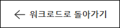

### 작업 5: Industry Solutions 경험

1. **워크로드 페이지**에서** Industry** Solutions를 클릭하여 계속 진행합니다.

    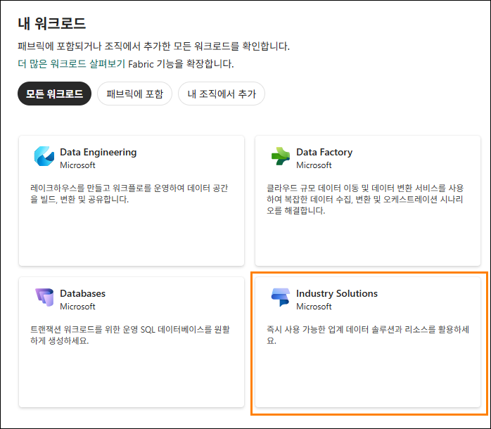

2. Industry Solutions 홈페이지로 이동합니다. 아래는 Industry Solutions를 효과적으로 단계별로 사용할 수 있도록 설계된 섹션에 대한 자세한 개요입니다.

    **Industry Solutions란 무엇인가?**

    Industry Solutions은 Microsoft Fabric에서 바로 사용할 수 있는 데이터 솔루션으로, 다양한 산업에 대한 솔루션과 리소스를 제공합니다. Industry Solutions는 산업 관련 데이터 모델, 커넥터, 변환, 보고서, 기타 자산을 사용하여 주요 비즈니스 시나리오를 시작하는 데 도움이 됩니다.

    **항목 형식:**

    1) **지속 가능성 솔루션**: 환경, 사회 및 거버넌스(ESG) 데이터의 수집, 표준화 및 분석을 지원합니다.

    2) **의료 데이터 솔루션:** 의료 데이터를 분석에 적합한 형식으로 효율적으로 변환해야 하는 중요한 요구를 해결하여 고객의 가치 실현 시간을 단축하기 위해 전략적으로 설계되었습니다.

    **참고:** 일부 해결 방법이 나타나지 않을 수 있습니다.

    **시작:**

    Industry Solutions 사용을 시작하려면 다음 단계를 따르세요.

    1) **의료 데이터 솔루션에 대해 알아보기:** '자세히 알아보기' 버튼을 클릭하여 의료 데이터 솔루션에 대해 읽고, 프로젝트에서 어떻게 사용할 수 있는지 알아보세요.

    2) **의료 데이터 솔루션 시작하기:** 의료 데이터 솔루션 배포를 시작하고 프로젝트에 구현합니다.

    3) **지속 가능성 솔루션에 대해 알아보기:** '자세히 알아보기' 버튼을 클릭하여 지속 가능성 솔루션에 대해 읽고, 프로젝트에서 어떻게 사용할 수 있는지 알아보세요.

    4) **지속 가능성 솔루션 시작하기:** 지속가능성 솔루션을 도입하기 시작하고 프로젝트에 구현합니다.

    5) **소매유통업 솔루션에 대해 알아보기:** '자세히 알아보기' 버튼을 클릭하여 소매유통업 솔루션에 대해 읽고, 프로젝트에서 어떻게 사용할 수 있는지 알아보세요.

    6) **리테일 솔루션 시작하기:** 리테일 솔루션을 도입하기 시작하고 프로젝트에 구현합니다.

    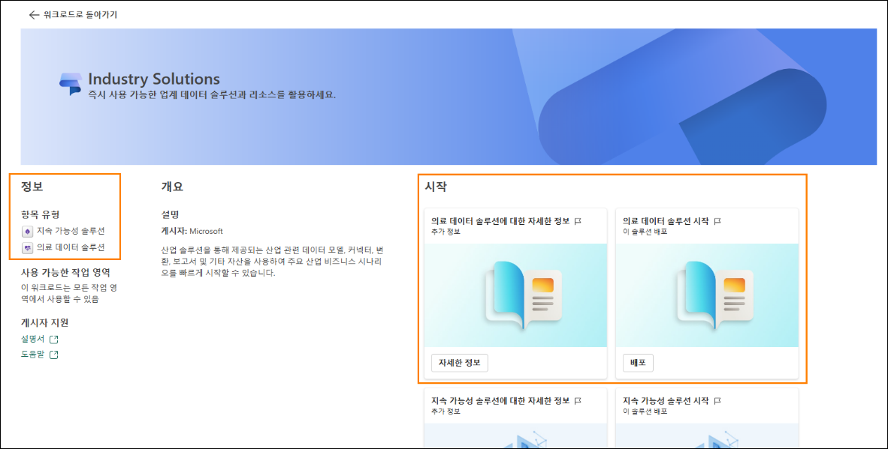

3. 화면 왼쪽 상단의 워크로드로 돌아가기를 클릭합니다. 이 작업을 수행하면 다른 도구 또는 섹션을 살펴볼 수 있는 주요 작업 페이지로 이동합니다.

    

### 작업 6: Real-Time Intelligence 환경

1. **워크로드** 페이지에서 **Real-Time Intelligence**를 클릭하여 계속 진행합니다.

    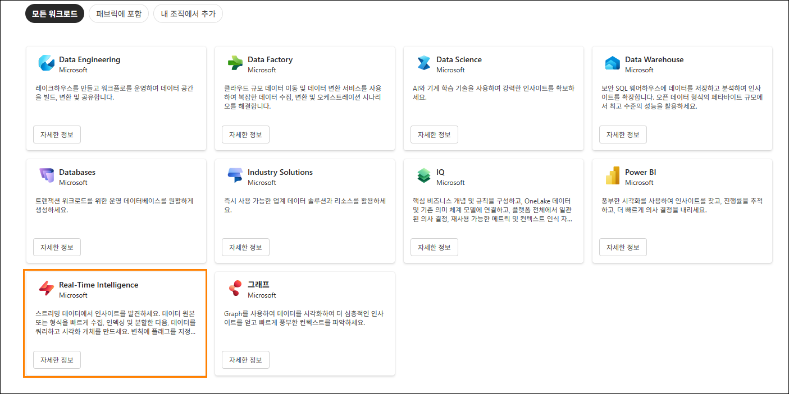

2. Real-Time Intelligence 홈페이지로 이동합니다. 아래는 Real-Time Intelligence를 효과적으로 단계별로 사용할 수 있도록 설계된 섹션에 대한 자세한 개요입니다.

    **Real-Time Intelligence란 무엇인가?**

    Real-Time Intelligence는 다양한 원본에서 수집된 대용량, 고세분화 데이터를 관리하고 분석하는 데 도움이 되는 도구입니다. 이를 통해 데이터를 실시간으로 수집, 분석, 처리할 수 있으며, 적시에 의사 결정과 조치를 취함으로써 비즈니스 운영을 개선할 수 있습니다.

    **항목 유형**

    a. **Eventhouse:** 프로젝트 간에 공유할 수 있는 하나 이상의 KQL 데이터베이스 작업 영역을 만드는 데 사용됩니다.

    b. **KQL 쿼리 집합:** 공유 가능한 테이블과 시각적 개체를 생성하기 위해 데이터에 대한 쿼리를 실행하는 데 사용됩니다.

    c. **실시간 대시보드:** 데이터 수집 후 몇 초 내에 실시간 대시보드를 시각화하는 데 사용됩니다.

    d. **Eventstream:** 실시간 이벤트 스트림을 캡처, 변환 및 라우팅하는 데 사용됩니다.

    e. **액티베이터:** 데이터 세트, 쿼리 및 이벤트 스트림에서 패턴을 모니터링하는 데 사용됩니다.

    f. **이벤트 스키마 세트(프리뷰):** 실시간 분석 워크플로를 위한 데이터 구조(스키마)를 체계화하고 표준화하여 스트리밍 데이터를 일관되게 처리하고 분석하기 쉽게 지원합니다.

    g. **사용자 지정 스트림 커넥터 (프리뷰):** 사용자 지정 끝점 및 사용자 지정 앱에서 이벤트스트림으로 실시간 이벤트를 보낼 수 있습니다.

    h. **Anomaly Detector(프리뷰):** 이상 탐지 기능은 이벤트 하우스 테이블에서 비정상적인 패턴과 이상치를 자동으로 식별합니다.

    i. **운영 에이전트(프리뷰):** 운영 에이전트들은 관찰 -> 분석 -> 결정 -> 실행의 주기를 자동화합니다. 주요 메트릭을 지속적으로 추적하고, 인사이트를 제시하며, 대상 조치를 권장합니다.

    j**. 맵:** Real-Time Intelligence에 지리 공간적 인사이트를 도입하여 누구나 사건 발생 위치를 시각화하고, 공간 데이터를 다른 Fabric 기능과 통합하며, 더 스마트하고 위치 인식형 의사 결정을 내릴 수 있도록 지원합니다.

    k. **디지털 트윈 빌더(프리뷰):** 디지털 트윈 빌더는 사용자에게 로우코드/노코드 환경을 제공하여 온톨로지를 통해 자산 및 프로세스와 같은 비즈니스 개념을 구축하고 모델링할 수 있도록 지원합니다.

    **시작:**

    Real-Time Intelligence 사용을 시작하려면 다음 단계를 따르세요.

    a. **실시간 엔드 투 엔드 경험:** '시작하기' 버튼을 클릭하여 샘플 데이터 집합으로 실시간 데이터 분석을 탐색해 보세요.

    b. **Real-Time Intelligence 샘플 탐색:** 샘플로 실시간 데이터 분석을 탐색하려면 '열기' 버튼을 클릭합니다.

    c. **샘플 살펴보기:** '선택' 버튼을 클릭하여 샘플을 사용하고 Real-Time Intelligence에 대해 알아보세요.

    d. **Real-Time Intelligence 소개:** '열기' 버튼을 클릭하여 Real-Time Intelligence의 개요를 확인하고 이 도구를 효과적으로 사용하기 시작하세요.

    e. **샘플 데이터로 KQL 배우기:** '열기' 버튼을 클릭하여 샘플 데이터를 사용하여 KQL을 알아봅니다.

    f. **실시간 허브란 무엇인가:** '열기' 버튼을 클릭하여 실시간 허브가 무엇이고 어떻게 사용할 수 있는지 알아보세요.

    g. **샘플 액티베이터 살펴보기:** '열기' 버튼을 클릭하여 샘플 액티베이터를 사용하고 Real-Time Intelligence의 특징과 기능을 이해합니다.

    h. **액티베이터 시작:** '열기' 버튼을 클릭하여 액티베이터 개념을 시작하고 도구를 효과적으로 사용하기 시작하세요.

    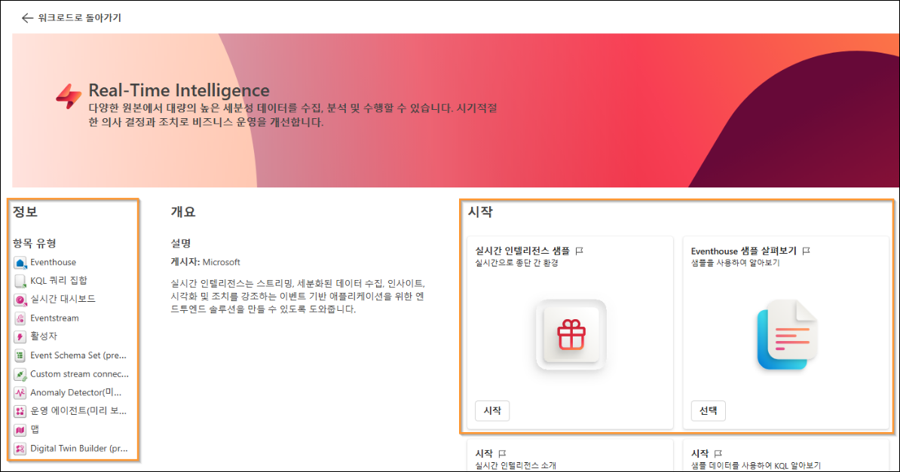

3. 화면 왼쪽 상단의 워크로드로 돌아가기를 클릭합니다. 이 작업을 수행하면 다른 도구 또는 섹션을 살펴볼 수 있는 주요 작업 페이지로 이동합니다.

    

### 작업 7: Data Engineering 환경

1. **워크로드** 페이지에서 Data Engineering을 클릭하여 계속 진행합니다.

    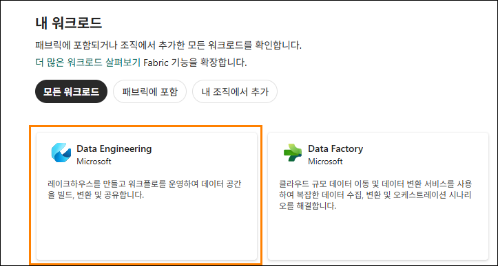

2. **Data Engineering** 홈페이지로 이동합니다. 아래는 **Data Engineering**을 효과적으로 단계별로 사용할 수 있도록 설계된 섹션에 대한 자세한 개요입니다.

    **Data Engineering이란 무엇인가?**

    Data Engineering은 대량의 데이터를 수집, 저장, 처리, 분석하기 위한 인프라와 시스템을 설계, 구축, 유지하는 데 도움이 되는 도구입니다. 레이크하우스를 생성하고 워크플로를 운영하여 데이터 자산을 구축, 변환 및 공유할 수 있습니다. **항목 유형:** a. **레이크하우스:** 정리, 쿼리, 보고, 공유를 위해 빅 데이터를 저장하는 데 사용됩니다.

    b. **노트북:** Python, R, Scala 등 다양한 언어를 사용하여 데이터 수집, 준비, 분석 및 기타 데이터 관련 작업에 사용됩니다.

    c. **환경:** 공유 라이브러리를 설정하고 Notebooks용 Spark 컴퓨팅 설정 및 리소스와 Spark 작업 정의를 설정하는 데 사용됩니다.

    d. **Spark 작업 정의:** Apache 작업을 정의, 예약 및 관리하는 데 사용됩니다.

    e. **사용자 데이터 함수:** Fabric에서 애플리케이션을 호스트하고 실행할 수 있습니다.

    f. **GraphQL용 API:** 여러 데이터 원본을 쿼리하는 API입니다.

    g. **Snowflake 데이터베이스:** 사용자가 Fabric 내에서 Snowflake 데이터베이스를 미러링할 수 있습니다.

    **시작:**

    Data Engineering 사용을 시작하려면 다음 단계를 따르세요. a. 샘**플 살펴보기:** '선택' 버튼을 클릭하여 샘플을 사용하고 Data Engineering에 대해 알아봅니다.

    b. **레이크하우스란 무엇인가?:** '열기' 버튼을 클릭하여 레이크하우스에 대해 알아보고, 어떻게 사용할 수 있는지 알아봅니다.

    c. **레이크하우스에서 데이터 환경 가져오기:** 열기 버튼을 클릭하여 레이크하우스를 사용하여 Data Engineering을 시작합니다.

    d. **Spark 작업 정의 시작:** '열기' 버튼을 클릭하여 데이터 처리에 Spark 작업 정의를 사용하는 방법을 알아봅니다.

    e. **Notebook 개발 및 실행:** '열기' 버튼을 클릭하여 데이터 분석을 위한 Notebook 개발 및 실행 방법을 알아봅니다.

    f. **NotebookUtils 사용법:** '열기' 버튼을 클릭하여 향상된 데이터 분석을 위해 NotebookUtils를 사용하는 방법을 알아봅니다.

    g. **레이크하우스용 Notebooks 활용:** '열기' 버튼을 클릭하여 레이크하우스용 Notebooks 활용 방법을 알아봅니다.

    h. **레이크하우스용 데이터 집합 활용:** '열기' 버튼을 클릭하여 레이크하우스용 데이터 집합 활용 방법을 알아봅니다.

    i. **첫 사용자 데이터 함수 만들기:** '열기' 버튼을 클릭하여 사용자 데이터 함수를 만드는 방법을 알아봅니다. j. **GraphQL용 첫 번째 API 만들기:** '열기' 버튼을 클릭하여 GraphQL용 API를 만드는 방법을 알아봅니다.

    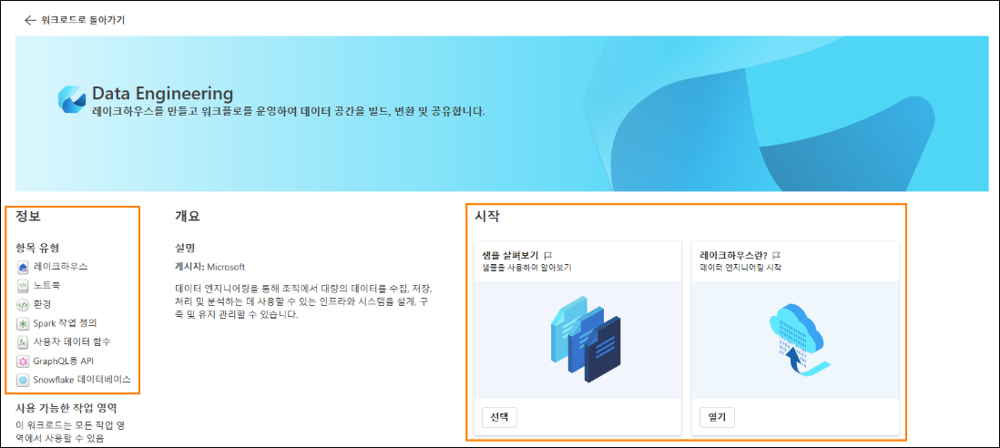

3. 화면 왼쪽 상단의 **워크로드로 돌아가기**를 클릭합니다. 이 작업을 수행하면 다른 도구 또는 섹션을 살펴볼 수 있는 주요 작업 페이지로 이동합니다.

    

### 작업 8: Data Science 환경

1. **워크로드** 페이지에서 **Data Science**를 클릭하여 계속 진행합니다.

    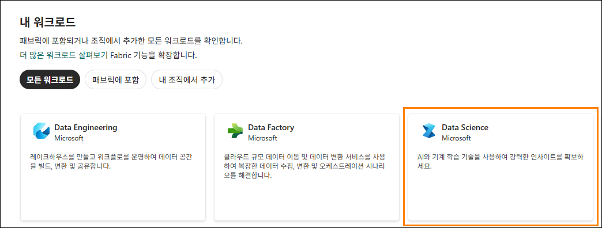

2. **Data Science** 홈페이지로 이동됩니다. 아래는 **Data Science**를 효과적으로 단계별로 사용할 수 있도록 설계된 섹션에 대한 자세한 개요입니다.

    **Data Science란 무엇인가?**

    Data Science는 AI와 기계 학습 기술을 사용하여 강력한 인사이트를 얻을 수 있도록 도와주는 도구입니다. AI 도구를 제공하여 데이터 과학 워크플로를 완성하고 AI를 활용하여 데이터를 풍부하게 하고 비즈니스 인사이트를 얻을 수 있도록 지원합니다.

    **항목 유형:** a. **ML 모델**: 기계 학습 모델을 생성하는 데 사용됩니다.

    b. **실험**: 여러 모델을 생성, 실행하고 그 개발을 추적하는 데 사용됩니다.

    c. **Notebook**: 데이터를 탐색하고 기계 학습 솔루션을 구축하는 데 사용됩니다.

    d**. 환경:** 공유 라이브러리를 설정하고 Notebooks용 Spark 컴퓨팅 설정 및 리소스와 Spark 작업 정의를 설정하는 데 사용됩니다.

    e. **데이터 에이전트:** 레이크하우스, 웨어하우스, Power BI 의미 체계 모델 및 KQL 데이터베이스에 저장된 데이터에 대한 질문에 답변하는 대화형 AI 환경을 만드는 데 사용됩니다.

    f. **Python Notebook:** 로컬 컴퓨터에서 Python 노트북을 가져오기 위해 사용합니다. **시작:** Data Science를 사용하려면 다음 단계를 따르세요. a. **샘플 살펴보기:** '선택' 버튼을 클릭하여 샘플을 사용하고 Data Science에 대해 알아보세요.

    b. **ML 모델 시작:** '열기' 버튼을 클릭하여 기계 학습 모델 시작 방법을 알아보세요.

    c. **ML 실험 시작:** '열기' 버튼을 클릭하여 기계 학습 실험 수행 방법을 알아보세요.

    d. **Notebooks 시작하기**: '열기' 버튼을 클릭하여 Notebooks 시작 방법을 알아보세요.

    e. **Notebook 개발 및 실행**: '열기' 버튼을 클릭하여 데이터 분석을 위한 Notebook 개발 및 실행 방법을 알아봅니다.
    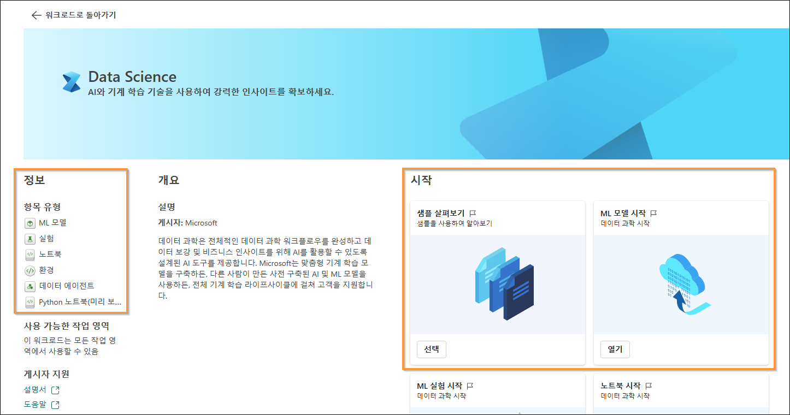

3. 화면 왼쪽 상단의 **워크로드로 돌아가기**를 클릭합니다. 이 작업을 수행하면 다른 도구 또는 섹션을 살펴볼 수 있는 주요 작업 페이지로 이동합니다.

    

### 작업 9: Data Warehouse 환경

1. **워크로드** 페이지에서 **Data Warehouse**를 클릭하여 계속 진행합니다.

    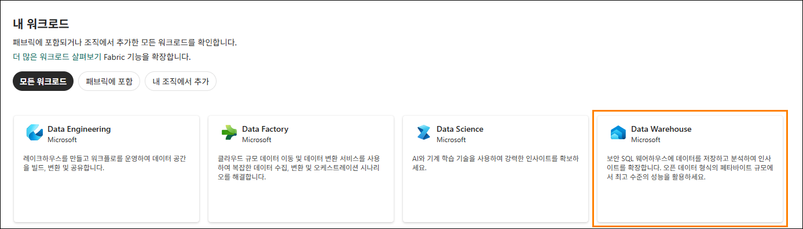

2. Data Warehouse 홈페이지로 이동됩니다. 아래는 Data Warehouse를 효과적으로 사용하고 단계별로 활용할 수 있도록 설계된 각 섹션의 상세한 개요입니다.

    **Data Warehouse란 무엇인가?**

    Data Warehouse는 안전한 SQL 웨어하우스에 데이터를 저장하고 분석하는 데 도움이 되는 도구입니다. 이를 통해 개방형 데이터 형식으로 페타바이트 규모의 최상위 계층 성능을 활용하여 통찰력을 확장할 수 있습니다.

    **항목 유형:**

    a. **Warehouse:** Data Warehouse를 생성하는 데 사용됩니다.

    b. **웨어하우스 샘플:** 사전 구성된 데이터세트와 모델을 통해 데이터 웨어하우징 기능을 탐색하고 테스트하는 데 사용합니다.

    c. **노트북:** 대화형 데이터 분석 및 시각화 작업을 생성하고 공유하는 데 사용합니다.

    d. **미러된 Azure SQL Database:** Azure SQL Database를 미러링하는 데 사용합니다.

    e. **미러된 Azure Databricks 카탈로그:** Azure Databricks에서 데이터를 미러링하여 통합 및 분석 기능을 향상하는 데 사용합니다.

    f. **미러된 Snowflake:** Snowflake Database를 미러링하는 데 사용됩니다.

    g. **미러링된 Oracle:** Oracle을 미러링하는 데 사용됩니다.

    h. **미러링된 Google BigQuery(프리뷰):** Google BigQuery를 미러링하는 데 사용됩니다.

    i. **미러링된 SharePoint Online 목록(프리뷰):** SharePoint 목록 데이터를 거의 실시간으로 Microsoft Fabric OneLake에 복제하여, 읽기 전용의 분석용 소스로 제공합니다. 이 기능은 ETL 과정을 생략하고, Power BI 및 기타 Fabric 워크로드를 위해 자동 생성된 SQL 분석 엔드포인트를 통해 데이터를 제공합니다.

    j. **미러링된 Azure Cosmos DB:** Azure Cosmos DB를 미러링하는 데 사용됩니다.

    k. **미러링된 SQL Server:** SQL Server를 미러링하는 데 사용됩니다.

    l. **Mirrored Azure Database for PostgreSQL:** 기존 Azure Database for PostgreSQL을 미러링하는 데 사용됩니다.

    m. **미러링된 Azure Database for MySQL(프리뷰):** MySQL 데이터를 **읽기 전용의 분석 준비 상태가 완료된 소스로 Microsoft Fabric OneLake**에 복제하여, ETL 과정 없이도 거의 실시간에 가까운 분석을 가능하게 합니다.

    n. **미러된 Azure SQL Managed Instance:** Azure SQL 관리형 데이터베이스를 미러링하여 고가용성을 활성화하고 재난을 복구하는 데 사용합니다.

    o. **미러 데이터베이스:** 데이터베이스를 복제하여 고가용성을 활성화하고 재난을 복구하는 데 사용합니다.

    p. **미러링된 Dremio 카탈로그(프리뷰):** Dremio 카탈로그 메타데이터를 Microsoft Fabric에 미러링(데이터 복사 없음)하여, Fabric 워크로드가 읽기 전용 SQL 분석 엔드포인트를 통해 Dremio에서 관리하는 데이터를 쿼리할 수 있는 바로가기를 생성합니다.

    **시작:**

    Data Warehouse를 사용하려면 다음 단계를 따르세요.

    a. **샘플 웨어하우스 살펴보기:** 샘플 데이터가 이미 로드된 새로운 웨어하우스를 시작하세요.

    b. **웨어하우스 시작:** '열기' 버튼을 클릭하여 웨어하우스를 사용하여 데이터를 분석하는 방법을 알아보세요.

    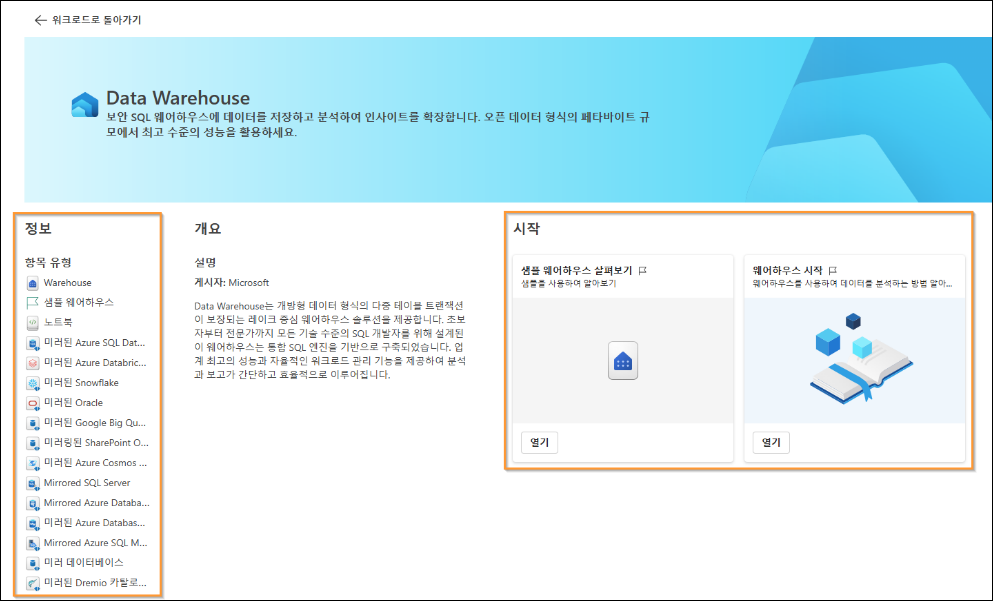

### 작업 10: 데이터베이스 환경

1. **워크로드** 페이지에서 **Databases**를 클릭하여 계속 진행합니다.

    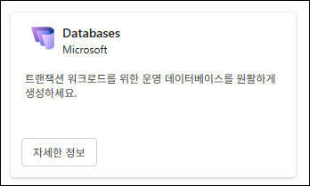

2. Databases 홈페이지로 이동됩니다. 아래는 Databases를 효과적으로 활용하기 위해 설계된 각 섹션의 상세한 개요입니다.

    **Fabric Databases란 무엇인가?**

    Microsoft Fabric의 SQL 데이터베이스는 Azure SQL Database를 기반으로 하는 개발자 친화적인 트랜잭션 데이터베이스로, Fabric에서 운영 데이터베이스를 쉽게 만들 수 있습니다. Fabric의 SQL 데이터베이스는 Azure SQL Database와 동일한 SQL Database Engine을 사용합니다.

    **항목 유형:**

    a. **SQL 데이터베이스:** SQL Fabric의 데이터베이스는 데이터베이스 워크로드의 일부이며 Fabric의 다른 항목에서 데이터에 액세스할 수 있습니다. SQL 데이터베이스 데이터도 OneLake에서 쿼리 가능한 형식으로 최신 상태로 유지되므로 Spark를 사용한 분석, 노트북 실행, Data Engineering, Power BI 보고서를 통한 시각화 등 Fabric의 다양한 서비스를 모두 사용할 수 있습니다.

    b. **Cosmos DB:** Microsoft Fabric의 Cosmos DB는 관리 경험이 간소화된 AI 최적화 NoSQL 데이터베이스입니다. 개발자로서 Fabric의 Cosmos DB를 활용하면 일반적인 데이터베이스 관리 작업을 수행할 필요 없이 마찰을 줄여 AI 애플리케이션 구축이 가능합니다.

    **시작:** 데이터베이스를 사용하려면 다음 단계를 따르세요. a. **탐색**: '열기'를 클릭하여 샘플 데이터베이스를 탐색하세요. b. **Database concepts**: 트랜잭션 데이터베이스와 관련된 일반적인 용어와 개념을 설명하여 SQL Database와 작업하는 방법을 이해할 수 있도록 합니다.

    c. **Database templates**: 일반적인 데이터베이스 설계의 미리 만들어진 템플릿 라이브러리를 살펴봅니다.
    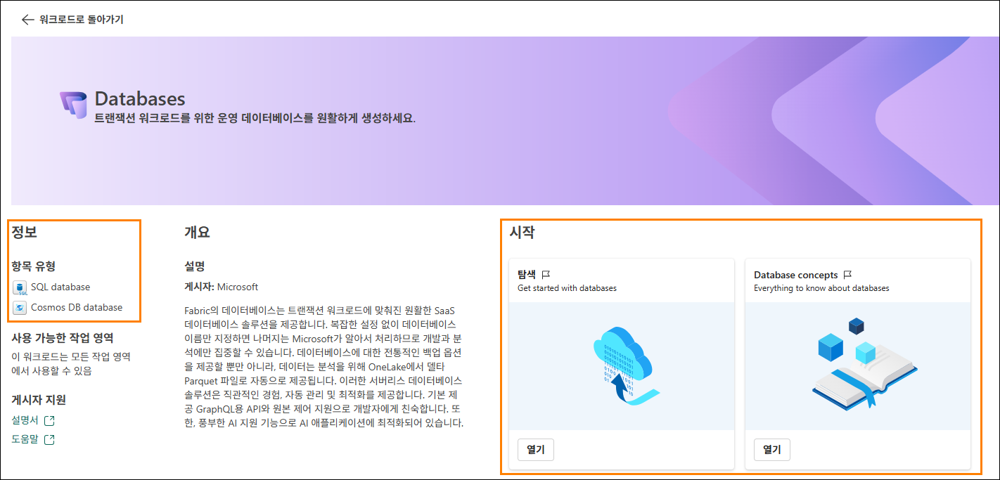

3. 화면 왼쪽 상단의 워크로드로 돌아가기를 클릭합니다. 이 작업을 수행하면 다른 도구 또는 섹션을 살펴볼 수 있는 주요 작업 페이지로 이동합니다.

    

    이 랩에서는 Fabric 인터페이스를 살펴보고 Fabric 작업 영역과 레이크하우스를 만들었습니다. 다음 랩에서는 레이크하우스에서 바로 가기를 사용하여 ADLS Gen2 데이터에 연결하는 방법과 보기를 사용하여 이 데이터를 변환하는 방법에 대해 알아봅니다.

# 참조

Fabric Analyst in a Day(FAIAD)는 Microsoft Fabric에서 사용할 수 있는 몇 가지 주요 함수를 소개합니다. 서비스의 메뉴에 있는 도움말(?) 섹션에는 유용한 리소스로 연결되는 링크가 있습니다.

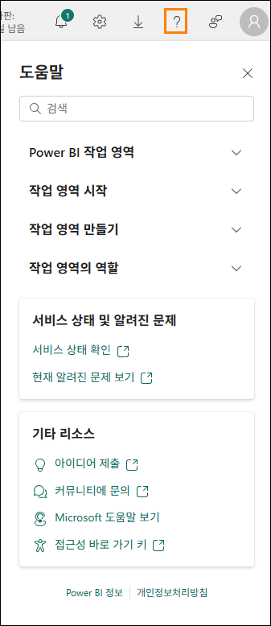

아래는 Microsoft Fabric의 다음 단계에 도움이 되는 몇 가지 추가 자료입니다.

- 전체 내용을 보려면 블로그 게시물을 참조하세요.

- [가이드 투어](https://aka.ms/Fabric-GuidedTour)로 Fabric 탐색

- [Microsoft Fabric 무료 평가판](https://aka.ms/try-fabric) 신청

- [Microsoft Fabric 웹사이트](https://aka.ms/microsoft-fabric) 방문

- [Fabric 학습 모듈](https://aka.ms/learn-fabric)을 탐색해서 새로운 기술 익히기

- [Fabric 기술 문서](https://aka.ms/fabric-docs) 검토

- [Fabric 시작하기 무료 eBook](https://aka.ms/fabric-get-started-ebook) 읽기

- [Fabric 커뮤니티](https://aka.ms/fabric-community)에 가입하여 질문을 게시하고 피드백을 공유하며 다른 사람들로부터 배우기

다음에서 더 심층적인 Fabric 경험 발표 블로그를 읽어보세요.

- [Fabric 블로그의 Data Factory 환경](https://aka.ms/Fabric-Data-Factory-Blog)

- [Fabric 블로그의 Synapse Data Engineering 환경](https://aka.ms/Fabric-DE-Blog)

- [Fabric 블로그의 Synapse Data Science 환경](https://aka.ms/Fabric-DS-Blog)

- [Fabric 블로그의 Synapse Data Warehousing 환경](https://aka.ms/Fabric-DW-Blog)

- [Fabric 블로그의 Synapse Real-Time Analytics 환경](https://aka.ms/Fabric-RTA-Blog)

- [Power BI 발표 블로그](https://aka.ms/Fabric-PBI-Blog)

- [Fabric 블로그의 Data Activator 환경](https://aka.ms/Fabric-DA-Blog)

- [Fabric 블로그의 관리 및 거버넌스](https://aka.ms/Fabric-Admin-Gov-Blog)

- [Fabric 블로그의 OneLake](https://aka.ms/Fabric-OneLake-Blog)

- [Dataverse 및 Microsoft Fabric 통합 블로그](https://aka.ms/Dataverse-Fabric-Blog)

© 2026 Microsoft Corporation. All rights reserved.

이 데모/랩을 사용하면 다음 조건에 동의하게 됩니다.

이 데모/랩에 설명된 기술/기능은 학습 환경을 제공하고 사용자 의견을 얻기 위해 Microsoft Corporation에서 제공합니다. 데모/랩을 통해서만 이러한 기술적 특성과 기능을 평가하고 사용자 의견을 Microsoft에 제시할 수 있습니다. 다른 용도로는 사용할 수 없습니다. 이 데모/랩 또는 그 일부에 대해 수정, 복사, 배포, 전송, 표시, 수행, 재현, 게시, 라이선스 허여, 파생 작업 생성, 양도 또는 판매할 수 없습니다.

추가 복제 또는 재배포를 위한 다른 서버 또는 위치에 대한 데모/랩(또는 그 일부)의 복사 또는 재현은 명시적으로 금지됩니다.

이 데모/랩은 위에서 명시한 목적을 위해 복잡한 설정 또는 설치가 없는 시뮬레이션된 환경에서 잠재적인 새로운 기능과 개념을 포함하여 특정 소프트웨어 기술/제품의 특성 및 기능을 제공합니다. 이 데모/랩에서 서술된 기술/개념은 전체 기능을 나타내지 않을 수 있으며, 최종 버전이 작동하지 않을 수도 있습니다. 또한 해당 기능 또는 개념의 최종 버전을 릴리스하지 않을 수도 있습니다. 또한 실제 환경에서 이러한 특성과 기능을 사용한 경험이 다를 수도 있습니다.

**피드백.** 이 데모/랩에서 서술된 기술적 특성, 기능 및/또는 개념에 대한 사용자 의견을 Microsoft에 제시하면 Microsoft는 이 사용자 의견을 어떤 방식과 목적으로든 무료로 사용, 공유 및 상용화할 수 있습니다. 또한 제품, 기술 및 서비스에서 사용자 의견이 포함된 Microsoft 소프트웨어 또는 서비스의 특정 부분을 사용하거나 인터페이스하는 데 필요한 모든 특허권을 제3자에게 무료로 제공합니다. Microsoft에서 사용자 의견을 포함하기 때문에 Microsoft에서 해당 소프트웨어 또는 설명서의 사용을 인가해야 하는 라이선스에 종속된 사용자 의견은 제공할 수 없습니다. 이러한 권리는 본 계약에 의거하여 유효합니다.

Microsoft Corporation은 이에 따라 명시적, 묵시적 또는 법적 특정 목적에의 적합성, 권리 및 비침해 여부에 관계없이 모든 보증과 조건을 포함하여 데모/랩과 관련된 모든 보증 및 조건을 부인합니다. Microsoft는 어떤 목적으로든 결과의 정확성, 데모/랩의 사용으로 파생된 출력 또는 데모/랩에 포함된 정보의 적합성과 관련하여 어떠한 보증이나 진술도 하지 않습니다.

**고지 사항**

이 데모/랩에는 Microsoft Power BI의 새로운 기능 및 향상된 기능 중 일부만 포함되어 있습니다. 일부 기능은 제품의 향후 릴리스에서 변경될 수 있습니다. 이 데모/랩에서는 새로운 기능 모두가 아닌 일부에 대해 학습하게 됩니다.
