# Microsoft Fabric - Fabric Analyst in a Day

## Conteúdo

- Introdução
- Credenciais do Laboratório:
- Solucionar problemas de logon do Snowflake
- Links para os laboratórios:
- Importar modelo do Fluxo de Dados:
- Itens a serem considerados antes de importar do Modelo do Fluxo de Dados
- Como importar modelo do Fluxo de Dados
- Criar modos de exibição usando o T-SQL
- Demonstração de ML de previsão
- Requisito
- Como criar um Notebook
- Adicionar Lakehouse ao Caderno
- Instalar a biblioteca Python em linha
- Executar código para criar previsão
- Initialize Spark session
- Load data from your specific Spark table
- Aggregate data to monthly level
- Convert to Pandas DataFrame and prepare for Prophet
- Fit the Prophet model
- Create a DataFrame for future predictions (e.g., next 12 months)
- Forecast
- Plotting the forecast
- Demonstração do Data Activator
- Requisito
- Cenário
- Adicionar medida % de Variação de Vendas
- Criar visual de tabela
- Criar Activator
- Visão geral do Activator
- Enviar um alerta de teste
- Demonstração de Link Semântico
- Requisito
- Cenário
- Analisador de práticas recomendadas
- Analisador de memória

Uma captura de tela para selecionar as Configurações de workspace

# **Introdução**

Este documento fornece uma diretriz para os seguintes recursos:

- Credenciais do Laboratório

- Como importar modelo do Fluxo de Dados

- Etapas para demonstração de ML de previsão

- Etapas para demonstração do Data Activator

- Etapas para demonstração do Data Mirroring

**Aviso de isenção de responsabilidade:** como o produto tem alterações diariamente, algumas capturas de tela podem estar desatualizadas. Trabalharemos para corrigi-las na próxima atualização.

# **Credenciais do Laboratório:**

Se algum dos participantes optar por concluir os laboratórios em um ambiente alternativo, aqui estão as credenciais que você pode precisar compartilhar.

Os participantes precisarão do nome de usuário e da senha associados à conta do Laboratório para conectar ao Dataverse e SharePoint.

- **Nome de usuário:** TE_SNOWFLAKE1

- **Senha:** 8UpfRpExVDXv2AC1

- **Token SAS:** ?sv=2023-01-03&ss=btqf&srt=sco&st=2025-06-30T10%3A15%3A46Z&se=2026-06-30T10%3A15%3A00Z&sp=rl&sig=hVeyxY4F72YVH3X%2BlnIvVTg8M%2FwZgLIhDzBg
Hlv1580%3D

**Observação:** Se você encontrar problemas para se conectar ao Snowflake usando as credenciais dos detalhes do ambiente, use as credenciais fornecidas abaixo.

- **Nome de usuário do Snowflake:** SNOWFLAKE_BACKUP

- **Senha do Snowflake:** 8UpfRpExVDXv2AC1

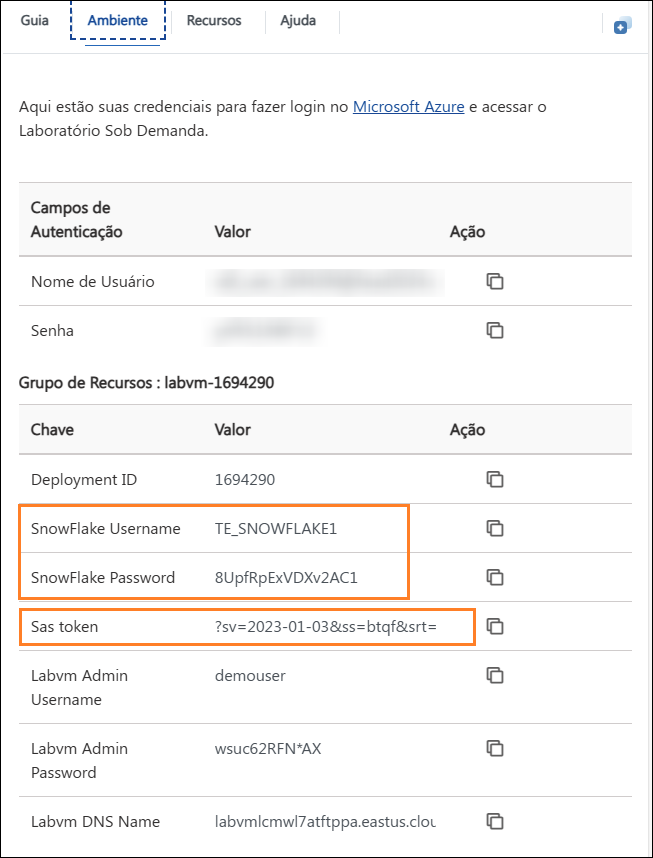

### Solucionar problemas de logon do Snowflake

Se os participantes tiverem problemas para fazer logon no Snowflake, siga as etapas abaixo. Será exibida uma descrição detalhada do erro.

1. Abra uma nova janela do navegador. Acesse **dlhdzca-bab11165.snowflakecomputing.com**. Este é o servidor snowflake que estamos usando.

2. Insira as **credenciais**. Se ocorrer um erro, você receberá uma descrição detalhada do erro, conforme mostrado na captura de tela abaixo.

    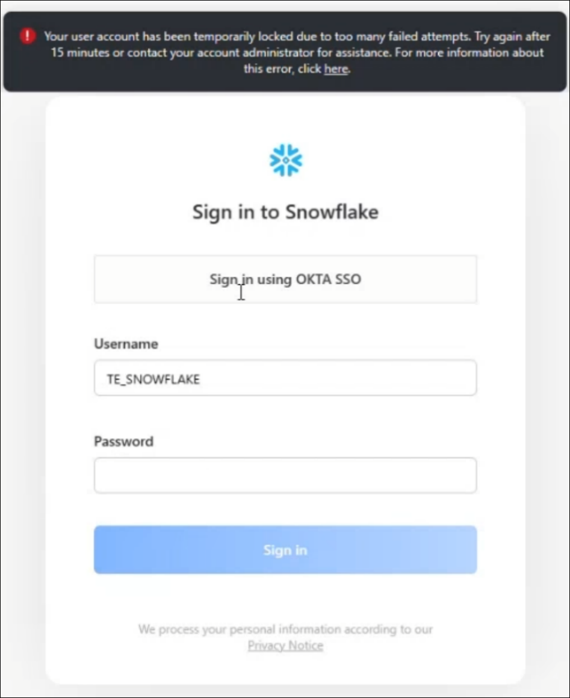

3. Se o erro persistir, teremos **Dados do Snowflake** **disponíveis no Azure Data Lake** e um modelo de Fluxo de Dados (**df_Supplier_ADLSGen2.pqt**) localizado em **C:\FAIAD\Solutions**. Você pode ajudar os participantes a seguir as etapas abaixo para importar esse modelo.

# **Links para os laboratórios:**

- [Português (Brasil)](https://experience.cloudlabs.ai/#/labguidepreview/aab00958-5596-4175-9bc9-39ece2586314)

- [Chinês](https://experience.cloudlabs.ai/#/labguidepreview/3c8f94bd-6936-4a18-a1e3-8b606402531e)

- [Inglês](https://experience.cloudlabs.ai/#/labguidepreview/b63b312d-0c58-4fd0-bee1-05a94affa927)

- [Francês](https://experience.cloudlabs.ai/#/labguidepreview/e9c3e273-1dd1-4db8-80e3-aedfe41a1e9b)

- [Alemão](https://experience.cloudlabs.ai/#/labguidepreview/e697a208-a982-4c6d-b32b-7e83d39c7186)

- [Italiano](https://experience.cloudlabs.ai/#/labguidepreview/b984b3dd-928d-492e-be2c-de1d49dd2640)

- [Japonês](https://experience.cloudlabs.ai/#/labguidepreview/bb29b27d-7a77-4e4e-9c0d-a12a86397a1f)

- [Coreano](https://experience.cloudlabs.ai/#/labguidepreview/544a6b13-8546-454d-8270-3540fe6a9566)

- [Espanhol](https://experience.cloudlabs.ai/#/labguidepreview/16998c52-2637-4c65-b691-0fa5ac9091d7)

# **Importar modelo do Fluxo de Dados:**

Como instrutor, você pode permitir que os participantes tenham a opção de importar modelos do Fluxo de Dados. As etapas para importar um modelo são descritas a seguir.

### Itens a serem considerados antes de importar do Modelo do Fluxo de Dados

1. Se o aluno **já tiver criado as tabelas no Lakehouse**, primeiro será necessário excluir a tabela no Lakehouse antes de carregar o PQT (caso contrário, o aluno terá que renomear a tabela no novo Fluxo de Dados e contabilizá-la mais tarde nos laboratórios).

2. O aluno precisa configurar os destinos para as tabelas relevantes - a marca de seleção "**habilitar preparo**" deverá estar desmarcada, mas será melhor verificar novamente, pois em alguns casos ainda ficou marcada.

3. As tabelas que requerem destinos no df_Supplier_Snowflake são:

    1. Supplier

    2. PO

4. A tabela que requer destino no df_People_SharePoint é:

    1. People

### Como importar modelo do Fluxo de Dados

1. Vá para o **espaço de trabalho do Fabric que você criou no Laboratório 2, Tarefa 2,** denominado **FAIAD_ <nome de usuário>**.

2. No menu, selecione **Novo Item -> Fluxo de dados Gen2**.

    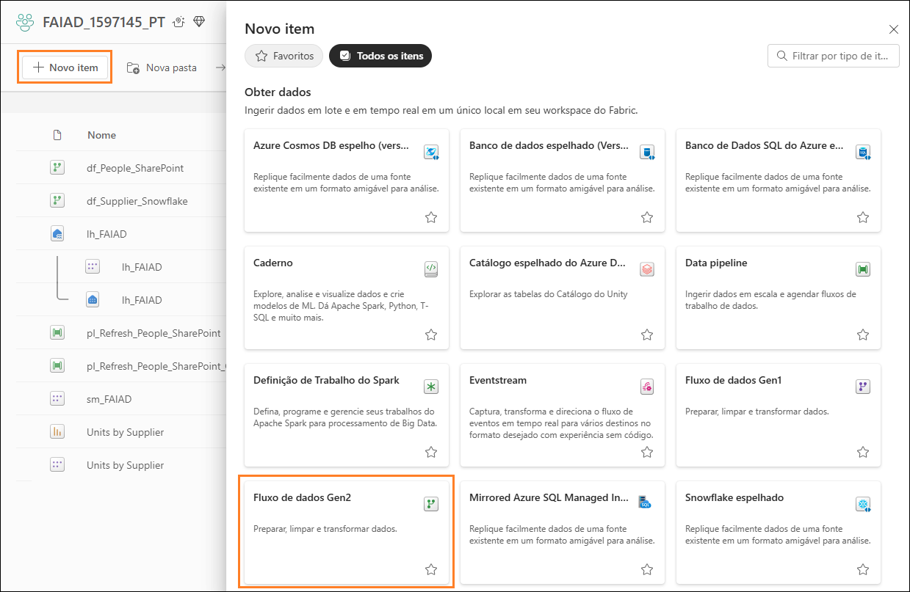

3. A janela do Power Query é aberta. No painel central, selecione **Importar de um modelo do Power Query**.

    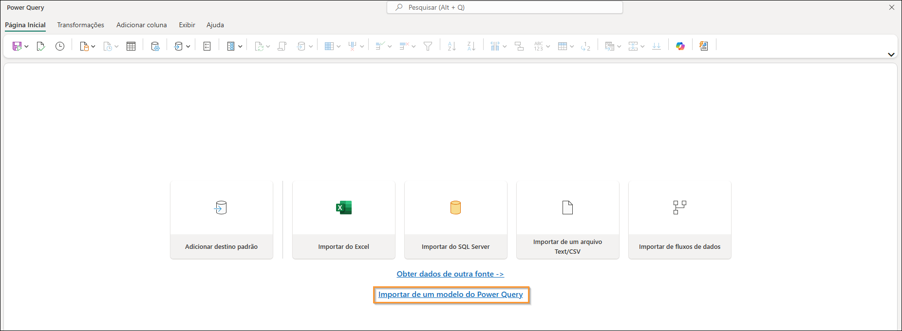

4. Procure a pasta **C:\FAIAD\Solutions** no ambiente de laboratório.

5. Selecione o Fluxo de Dados que você deseja importar. Aqui estamos importando **df_People_SharePoint.pqt**.

6. Selecione **Abrir**.

    Depois de importado, a consulta e todas as etapas da consulta são importadas. No entanto, é necessário configurar a conexão. Além disso, o Destino de dados precisa ser definido. Siga as instruções do laboratório para concluir estas etapas.

    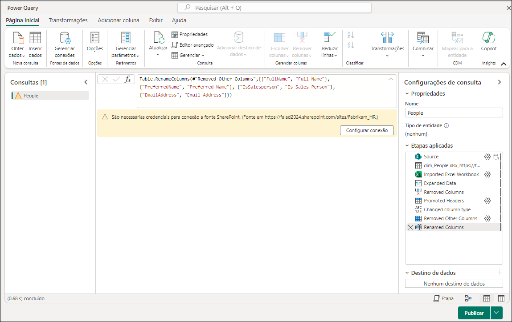

# **Criar modos de exibição usando o T-SQL**

Como instrutor, você pode optar por permitir que os participantes criem exibições usando o T-SQL. O T-SQL para as exibições Geo, Product, Reseller e Sales está disponível na pasta **Solutions.** Abra uma nova janela de consulta SQL no Lakehouse e execute estas instruções T-SQL.

Se uma exibição precisar ser removida, o arquivo Remove-View estará lá para ser executado também na pasta Solutions.

**Observação:** Todas as exibições existentes com o mesmo nome devem ser excluídas antes de executar essas instruções.

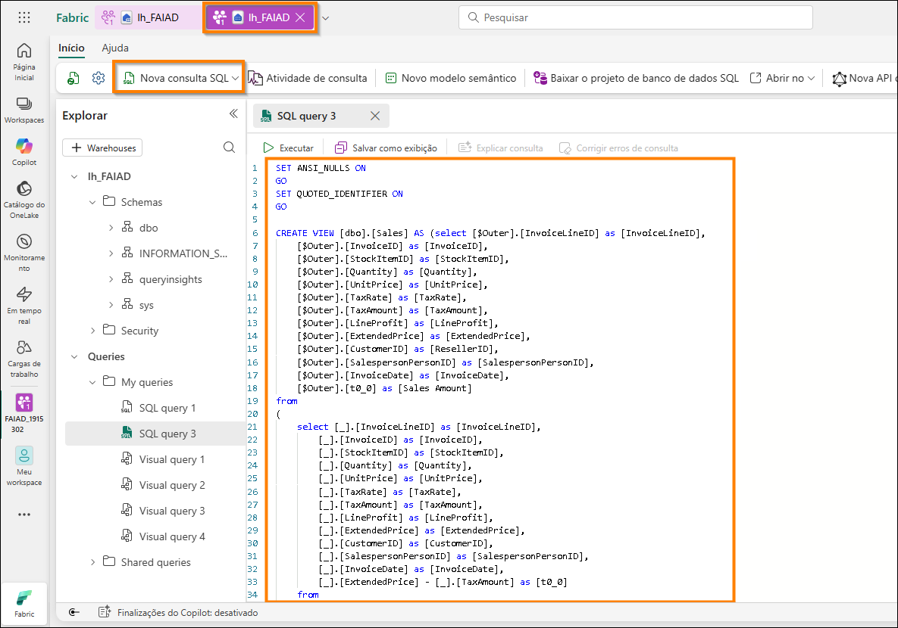

# **Demonstração de ML de previsão**

### Requisito

É necessário que você, o instrutor, conclua os Laboratórios 1 a 6 e todos os dados sejam ingeridos antes de avançar para as próximas etapas.

Para a demonstração, você precisa instalar uma biblioteca python denominada **prophet.** Ela pode ser instalada em linha no notebook ou você pode criar um ambiente. Nesta demonstração, usaremos o modo em linha.

### Como criar um Notebook

1. Vá para o **espaço de trabalho do Fabric que você criou no Laboratório 2, Tarefa 2,** denominado **FAIAD_ <nome de usuário>.**

2. No menu, selecione **+ Novo Item ->** Use a caixa de pesquisa para **procurar Notebook ->** Escolher **Notebook**.

    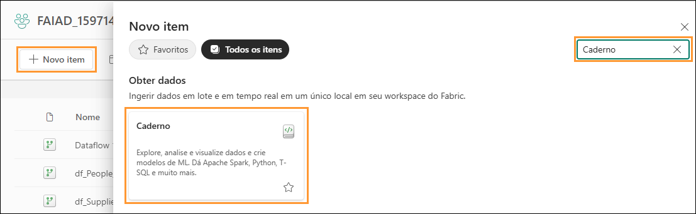

3. Forneça uma **breve visão geral** do layout: Caderno, linguagem, ambiente, como criar uma nova célula, etc.

### Adicionar Lakehouse ao Caderno

Precisamos associar um Lakehouse padrão a um caderno.

1. No painel Explorer, selecione a guia **Itens de Dados.**

    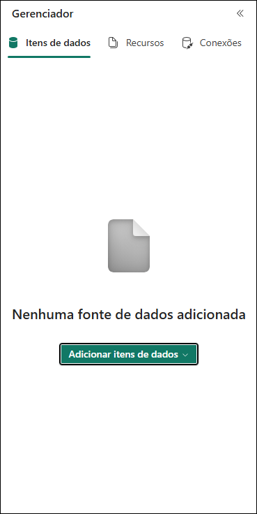

2. Selecione **Adicionar itens de dados** no painel Explorer.

3. Selecione **From OneLake catalog**.

    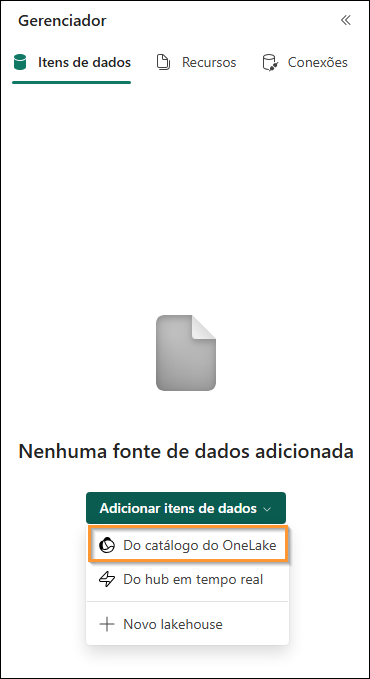

4. A caixa de diálogo do hub de dados do OneLake é aberta. Selecione o lakehouse **lh_FAIAD**.

5. Selecione **Add.** Observe que o Lakehouse está associado ao Caderno.

    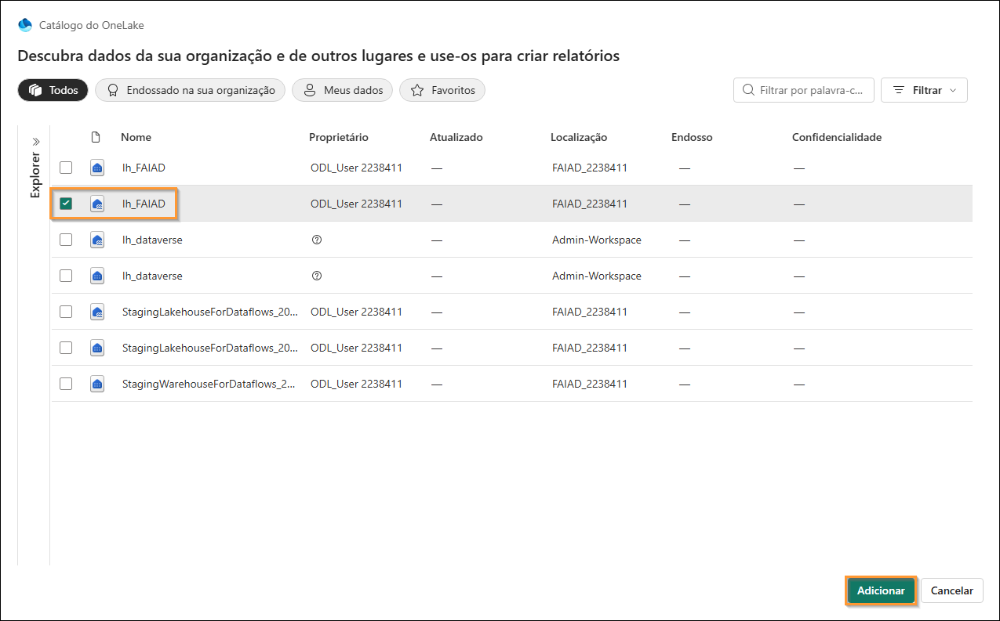

### Instalar a biblioteca Python em linha

Para a demonstração, você precisa instalar uma biblioteca python denominada **prophet.** Ela é instalada em linha.

1. Para **instalar a biblioteca python**, digite o seguinte código na célula.

    !pip install prophet

2. Execute o código selecionando o botão **Reproduzir** ao lado da célula.

    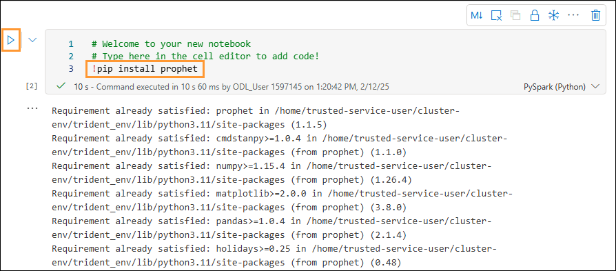

### Executar código para criar previsão

1. Crie uma **nova célula**.

2. Insira o seguinte **código**:

    from pyspark.sql import SparkSession

    from pyspark.sql.functions import month, year, col

    from prophet import Prophet

    import pandas as pd

    # Initialize Spark session

    spark = SparkSession.builder.appName("Prophet Forecasting").getOrCreate()

    # Load data from your specific Spark table

    df = spark.sql("SELECT \* FROM lh_FAIAD.Invoices i JOIN lh_FAIAD.InvoiceLineItems il ON i.InvoiceID = il.InvoiceID")

    # Aggregate data to monthly level

    monthly_df = df.withColumn("Month", month("InvoiceDate"))

    .withColumn("Year", year("InvoiceDate"))

    .groupBy("Year", "Month")

    .sum("Quantity")

    .orderBy("Year", "Month")

    # Convert to Pandas DataFrame and prepare for Prophet

    pandas_df = monthly_df.toPandas()

    pandas_df['ds'] = pd.to_datetime(pandas_df[['Year', 'Month']].assign(DAY=1))

    pandas_df['y'] = pandas_df['sum(Quantity)']

    # Fit the Prophet model

    model = Prophet(yearly_seasonality=True, weekly_seasonality=False,daily_seasonality=False)

    model.fit(pandas_df[['ds', 'y']])

    # Create a DataFrame for future predictions (e.g., next 12 months)

    future = model.make_future_dataframe(periods=12, freq='M')

    # Forecast

    forecast = model.predict(future)

    # Plotting the forecast

    model.plot(forecast)

    model.plot_components(forecast)

3. Explique cada etapa do **código** (dicas fornecidas como comentários).

4. Execute o código selecionando o botão **Reproduzir** ao lado da célula.

    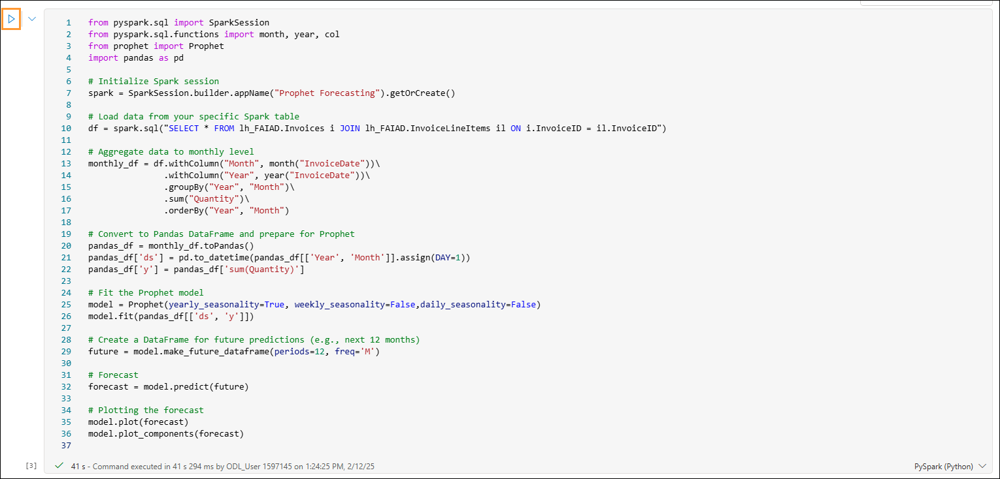

    Oriente os participantes pelos três gráficos criados (abaixo). Temos dados reais até maio de 2023 e estamos fazendo uma previsão para para 12 meses.

    O **primeiro gráfico** remove a sazonalidade e as previsões até abril de 2025.

    O **segundo gráfico** remove a tendência e adiciona a sazonalidade às previsões até abril de 2025.

    

    O **terceiro gráfico** prevê o uso de tendência e sazonalidade. Este gráfico também fornece os limites superior e inferior.

    

5. Crie uma **nova célula**.

6. Adicione o **código** a seguir à célula:

    display(forecast)

    #escrever dados de previsão em uma tabela

    spark.createDataFrame(forecast).write.saveAsTable("Sales_Forecast", mode="overwrite")

7. Execute a célula selecionando o botão **Reproduzir**.

    

8. Explique os **dados que são exibidos** aos participante.

9. Mostre aos usuários que uma nova tabela foi criada no Lakehouse: **sales_forecast**.

    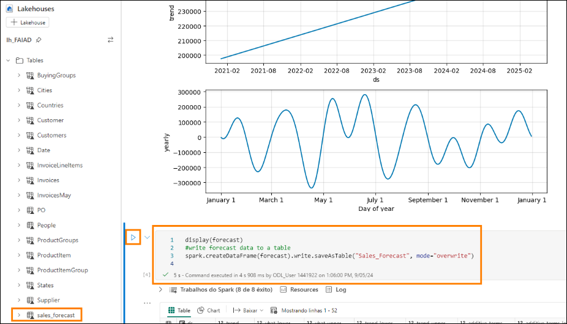

10. **Consulte** a tabela e mostre aos usuários o seu conteúdo.

# **Demonstração do Data Activator**

### Requisito

É necessário que você, o instrutor, conclua os Laboratórios 1 a 7 antes de avançar para as próximas etapas.

Os links a seguir terão as atualizações mais recentes.

<https://learn.microsoft.com/en-us/fabric/data-activator/data-activator-introduction>

<https://learn.microsoft.com/en-us/fabric/data-activator/data-activator-get-data-power-bi>

### Cenário

Sabemos que há variação em Vendas por Nome de Grupo Ações a cada mês. Isso ocorre devido à sazonalidade. No entanto, gostaríamos de ser notificados se o valor de Variance % estiver abaixo de 20%. Isso ajudará a identificar e resolver tais cenários.

Para resolver isso, usaremos o Data Activator. Vamos disparar um alerta quando o valor de % de Variação de Venda de qualquer Nome de Grupo Ações cair abaixo de 20%. Vamos fazer uma simulação para maio de 2024. Como o gatilho do Data Activator é executado de hora em hora, em vez de esperar uma hora, vamos executar um alerta de teste.

Para demonstrar esse cenário, vamos:

- Adicionar a medida % de Variação de Vendas ao conjunto de dados.

- Adicionar um visual de tabela mostrando % de Variação de Vendas por Nome de Grupo Ações. Filtre esta tabela para maio de 2024.

- Criar um alerta usando o visual da tabela.

- Examine o Activator e crie um alerta de teste.

### Adicionar medida % de Variação de Vendas

Vamos adicionar uma nova medida ao modelo sm_FAIAD.

1. Acesse o modelo semântico **sm_FAIAD**.

2. Selecione a tabela **Sales**.

3. No menu superior, selecione **Página Inicial -> Nova medida**.

4. Crie a **medida** abaixo. Será fornecido o % de Variação em comparação com o Mês anterior.

    Sales Var % =

5. var priormth = CALCULATE([Sales], PREVIOUSMONTH('Date'[Date]))

6. RETURN DIVIDE([Sales]-priormth, priormth)

7. **Formate** a medida como uma **Porcentagem**.

    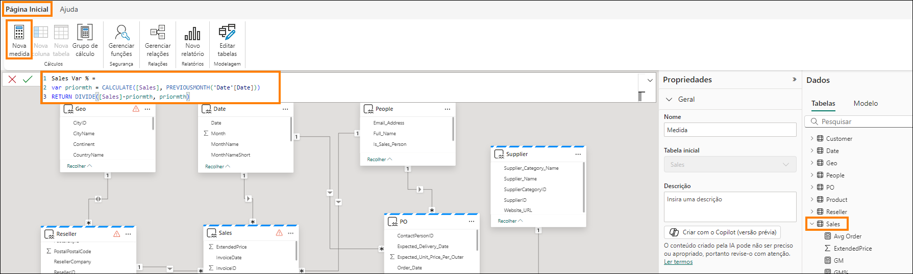

### Criar visual de tabela

Vamos editar rpt_Sales_report e adicionar um novo visual de tabela. O visual da tabela mostrará o % de Variação de Vendas por Nome de Grupo Ações para maio de 2023.

1. Navegue até **rpt_Sales_report** (criado no Laboratório 7).

2. No menu superior, selecione **Editar**.

3. Na exibição Dados, expanda a tabela **Product**.

4. Selecione o campo **StockGroupName**. Um visual de tabela é criado.

5. Expanda a tabela **Sales**.

6. Selecione **Sales Var %**. Observe que não há dados no visual de tabela. Isso ocorre porque Sales Var % precisa de um nome de mês para calcular.

    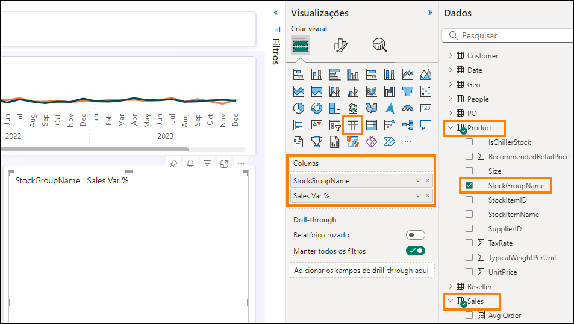

7. **Expanda** a seção **Filtro** (se estiver recolhida).

8. Com o visual de tabela realçado, na seção **Dados**, expanda a tabela **Date**.

9. Arraste o campo **Year** para Filtros nesta seção de visual.

10. Para o campo **Year**, selecione **Filtragem básica** na lista suspensa **Tipo de filtro**.

11. Selecione **2024**.

    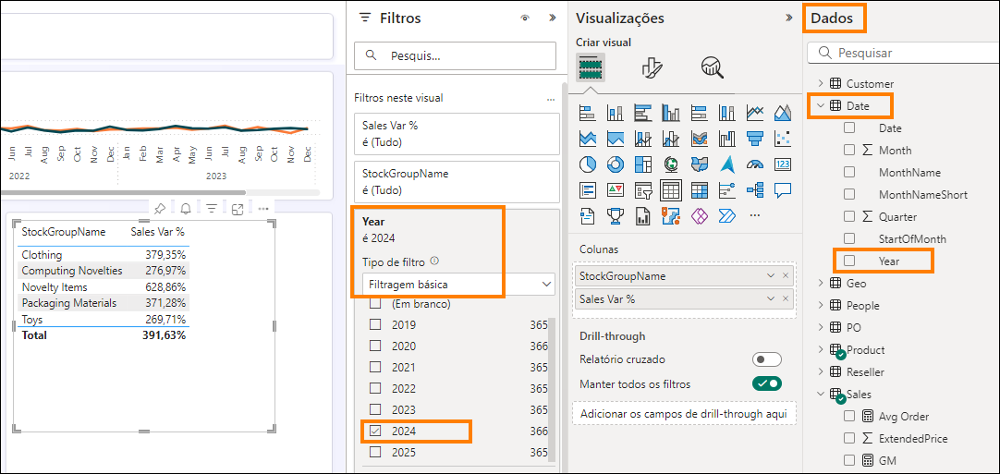

12. Arraste o campo **MonthNameShort** para Filtros nesta seção de visual.

13. Selecione **May**.

14. Selecione **Arquivo -> Salvar** para salvar as atualizações no relatório.

    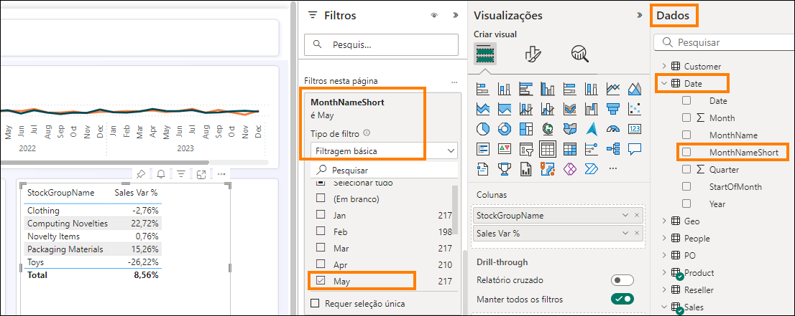

### Criar Activator

Vamos criar um Activator, que enviará um alerta se a Sales Variance % para qualquer um dos Stock_Group_Name estiver abaixo de -20%. Observe que o Stock Group Name Toys tem um % de Variação de Vendas de -26,22% e atende aos critérios de alerta.

1. Com o visual de tabela recém-criado realçado, selecione o **Sino de Alerta** na parte superior esquerda do visual.

    

2. O painel Definir um alerta é aberto.

3. Converse com os participantes que o alerta é aplicado **Para cada Stock_Group_Name**.

4. Selecione **Sales Var** % **em Alertar quando uma linha é alterada.**

    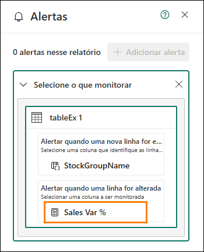

5. Selecione o botão de opção **Torna-se** e altere a **Condição** para **Menor que**.

6. Defina **Limite** como **-20%.** Isso configura o gatilho para alertar quando o % de Variação de Vendas cair abaixo de 20%.

    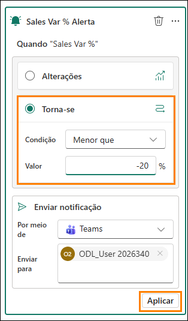

7. Fale sobre as duas opções de notificação, Email e Teams.

8. Selecione **Aplicar**

9. Na parte inferior, ao lado de **Meus Alertas do Ativador do Power BI,** selecione as **reticências (...)**.

10. Mostre os diferentes locais de salvar no Workspace.

    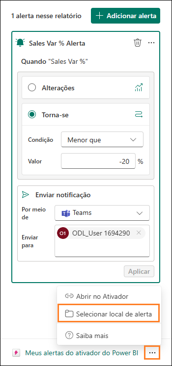

11. Depois que o alerta for criado, você também poderá selecionar **Abrir no Ativador,** depois de clicar nas reticências inferiores.

    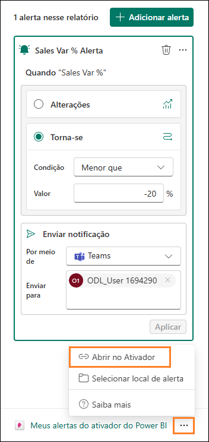

### Visão geral do Activator

1. Você navegará até a exibição **Design** do Activator.

2. Os participantes devem percorrer o **layout**, à esquerda estão os objetos. Observe que há um **Gatilho** que acabamos de criar. Há também a seção **Eventos**.

3. Com o Gatilho que criamos selecionado, fale sobre as opções no **menu superior**.

    1. Página Inicial

    1. Obter dados

    2. Criar Ações Personalizadas usando o Power Automate

    2. Regras

    1. Excluir

    2. Iniciar, Parar, Exibir detalhes

    3. Enviar-me uma ação de teste

4. Fale sobre os gráficos **Monitor** e **Condição** contidos na guia **Definição**.

5. Ao rolar para baixo, observe no gráfico **Ação**, que é onde o alerta notificará você quando for disparado. Atualmente, os gatilhos são executados de hora em hora. Dessa forma, na próxima hora, se os dados forem alterados e a condição for satisfeita, um alerta será disparado.

    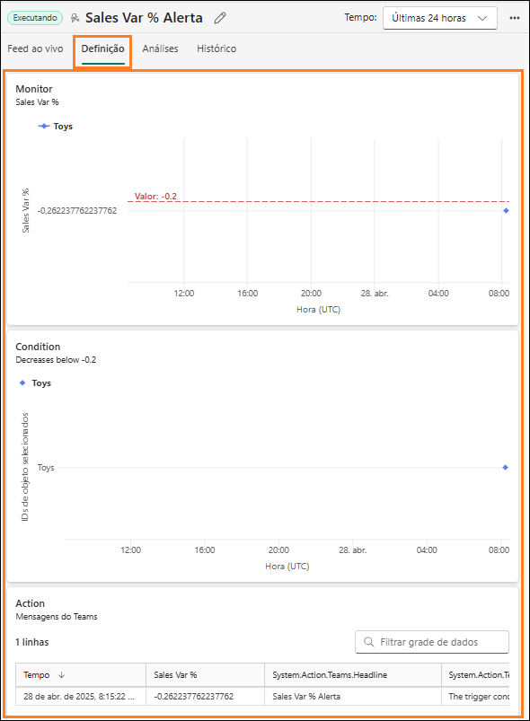

6. No lado direito da tela, você terá a opção de configurar a **Definição do Alerta**. Isso inclui o Atributo, quaisquer filtros ou resumo, as condições e a Ação. Observe que o alerta é usado como padrão na conta de usuário do Laboratório (atualmente, não há suporte para endereço de email externo).

    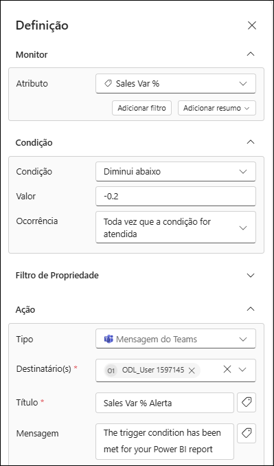

7. Observe que você também pode editar os detalhes da ação aqui. Se você escolher o botão Editar Ação, a janela Editar a ação aparecerá.

    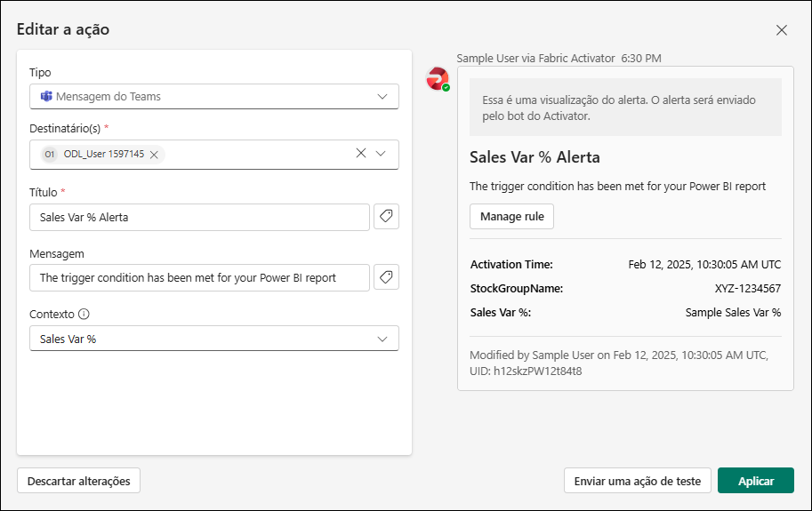

### Enviar um alerta de teste

Observação: Para exibir o alerta, você precisa usar o ambiente de laboratório.

1. .Selecione o **gatilho Sales Var %**.

2. No menu superior, selecione **Enviar-me uma ação de teste**. Um alerta de teste será enviado para sua conta de usuário do laboratório.

3. Selecione o **ícone Inicializador de aplicativos** no canto superior esquerdo da tela.

    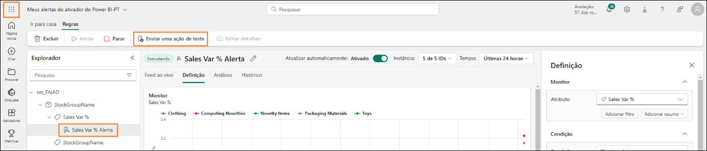

4. Selecione Teams. Uma nova janela do navegador é aberta.

    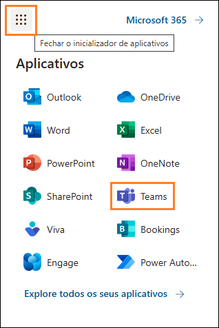

5. Você receberá uma mensagem de alerta (pode demorar alguns minutos). Observe que esta é uma ação de teste.

    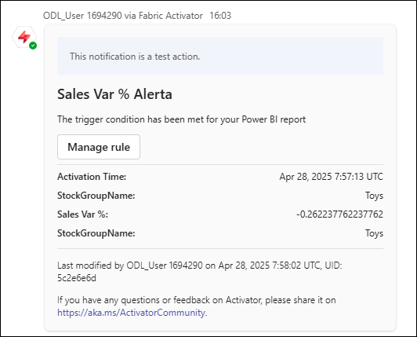

6. À medida que os dados são alterados e a condição de gatilho é atendida, alertas são enviados.

    **Observação:** Para demonstrar esse recurso, filtramos o visual por um mês (maio de 2024). Provavelmente, teremos um gatilho definido dinamicamente para o mês atual.

# **Demonstração de Link Semântico**

### Requisito

É necessário que você, o instrutor, conclua os Laboratórios 1 a 7 antes de avançar para as próximas etapas.

Recomenda-se que o instrutor execute os notebooks nesta demonstração com antecedência, pois ambos os notebooks podem levar entre 5 a 10 minutos para serem concluídos. Uma opção é executar os notebooks enquanto os alunos estão trabalhando no laboratório 6/7. Isso é para garantir que o instrutor possa mostrar aos alunos os resultados dos notebooks.

### Cenário

Nesta demonstração, exploraremos o **Analisador de Práticas Recomendadas** e o **Analisador de Memória**. Essas são ferramentas poderosas que nos ajudam a avaliar nosso modelo semântico quanto ao desempenho, ao uso de memória e à qualidade geral. Essas ferramentas não oferecem apenas métricas; elas oferecem **insights acionáveis para melhorar o design e a eficiência** do seu modelo, realçando as oportunidades de otimização que, de outra forma, você poderia ignorar.

No centro dessa capacidade está o **Link Semântico**, um recurso do Microsoft Fabric que nos permite conectar nossos modelos semânticos diretamente com ferramentas e experiências de ciência de dados. Isso significa que podemos **analisar, traçar o perfil e otimizar** nosso modelo semântico sm_FAIAD com Notebooks.

Devido a essa conexão, podemos executar análises detalhadas, como verificações de práticas recomendadas e criação de perfil de memória, diretamente no modelo semântico em nosso espaço de trabalho. Isso nos permite melhorar o **desempenho, reduzir o espaço ocupado pela memória e, finalmente, reduzir o custo** de seus artefatos em produção.

Para demonstrar esse cenário, vamos:

- Abra nosso modelo semântico sm_FAIAD e encontre os recursos do Link Semântico.

- Crie o notebook do analisador de práticas recomendadas e exiba os insights.

- Crie o notebook do analisador de memória e exiba os insights.

### Analisador de práticas recomendadas

1. Vá para o **espaço de trabalho do Fabric que você criou no Laboratório 2, Tarefa 2,** denominado **FAIAD_ <nome de usuário>.**

2. Abra o modelo semântico **sm_FAIAD.**

    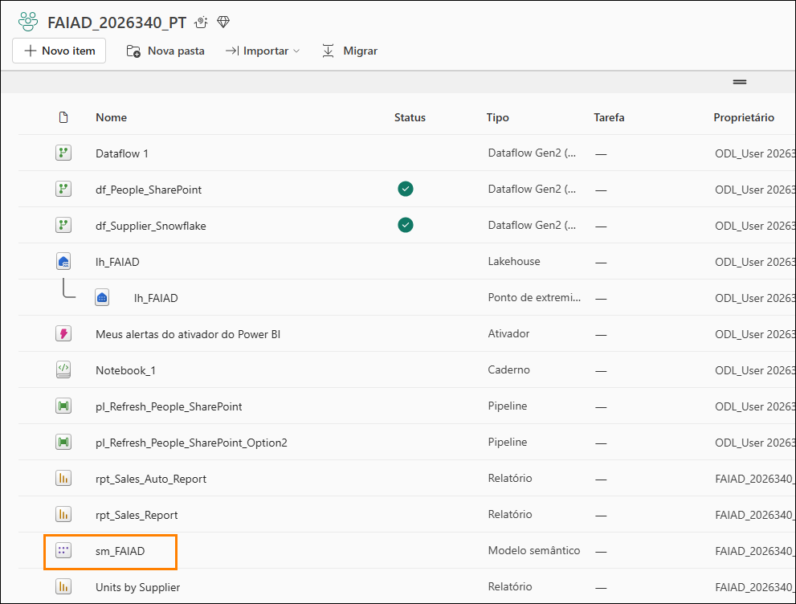

3. Na página seguinte, selecione **Modelo semântico aberto**

    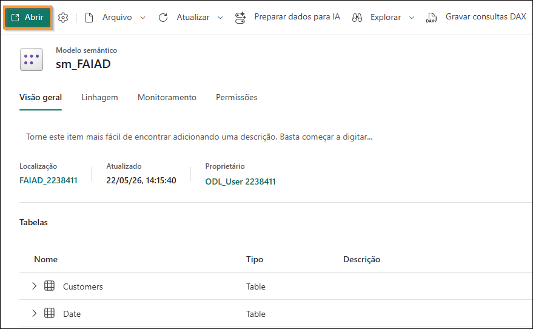

4. No aviso **Faixa de Opções da Página Inicial,** você tem 3 itens em **Integridade do modelo.**

    1. **Analisador de práticas recomendadas**: oferece dicas para melhorar o design e o desempenho do seu modelo semântico com base em regras criadas por especialistas no Fabric.

    2. **Analisador de memória:** fornece estatísticas de memória e armazenamento sobre objetos em seu modelo semântico. Revisar essas estatísticas pode ajudar você a identificar áreas de possível otimização de desempenho e redução de memória.

    3. **Notebooks da comunidade:** galeria de notebooks criados pela comunidade do Power BI para melhorar a análise de dados e relatórios.

    *Observação: esses notebooks também podem ser encontrados na página de detalhes do modelo semântico.*

5. Clique em **Analisador de práticas recomendadas.**

    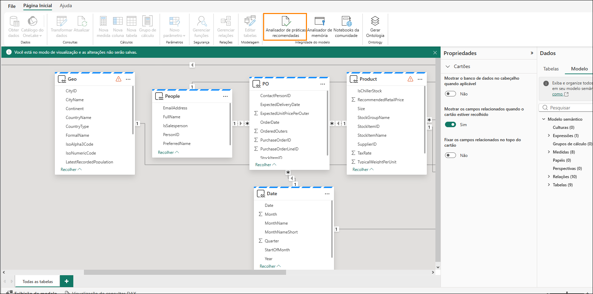

6. Será criado um novo notebook do analisador de práticas recomendadas. Você navegará até o notebook.

7. Reveja os detalhes escritos nas células Markdown com os alunos.

8. Na faixa de opções da página inicial, selecione **Executar tudo**.

    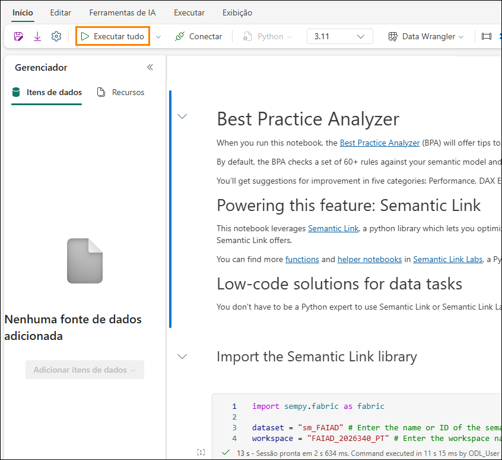

9. Quando a execução do notebook terminar, observe o resultado da função **run_model_bpa.**

    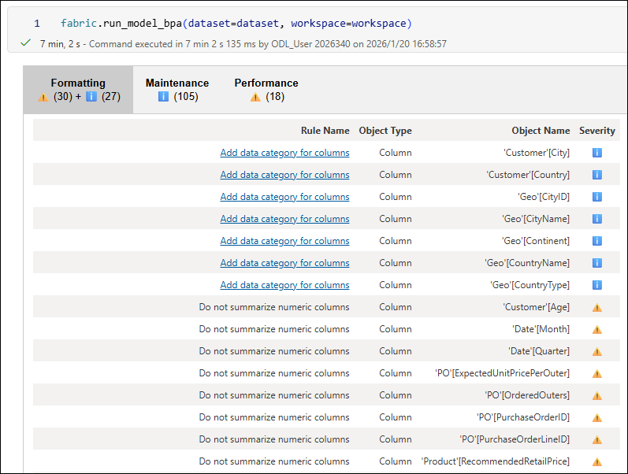

10. Essa função retorna três categorias de recomendações. **Formatação, Manutenção e Desempenho.** Dentro de uma determinada categoria, você verá dois ícones diferentes representando a gravidade da recomendação.

    1. ℹ️ - uma alteração recomendada que pode melhorar o seu modelo.

    2. ⚠️ - essa cautela determina que o problema listado pode causar problemas no seu modelo ou nos relatórios que usam o modelo.

11. Em **Formatação**, role para baixo e passe o mouse sobre o **Nome da Regra "Format flag columns as Yes/No value strings"**

12. Descreva aos alunos que passar o mouse sobre os nomes das regras fornecerá mais detalhes sobre a alteração recomendada.

    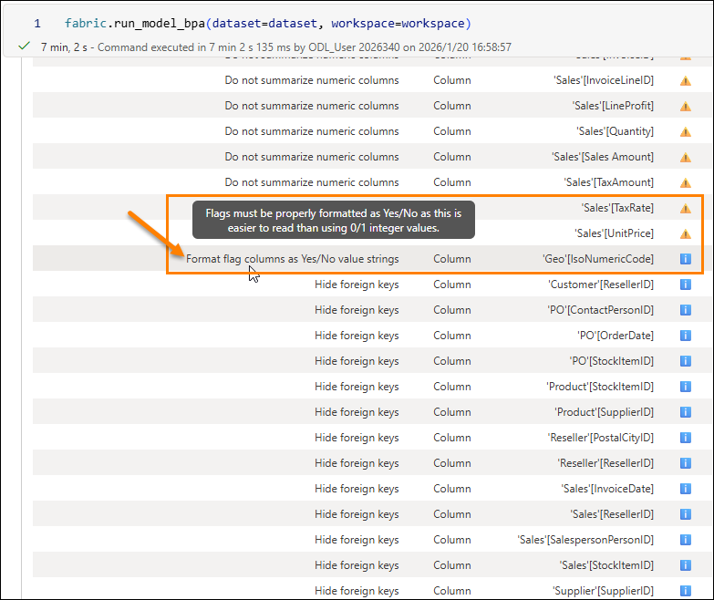

13. Nesse caso, o analisador de desempenho recomenda formatar a coluna **IsoNumericCode** na tabela **Geo** como **Sim/Não**. Essa é uma ótima recomendação, pois a formatação de colunas de sinalizador dessa maneira é uma prática recomendada ao modelar um esquema em estrela.

14. Selecione a categoria **Manutenção**.

    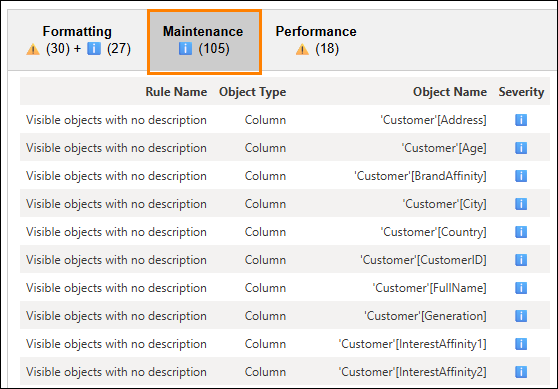

15. Observe aos alunos que a maioria das recomendações de manutenção é adicionar descrições às nossas colunas visíveis no modelo.

16. Selecione a categoria **Desempenho.**

    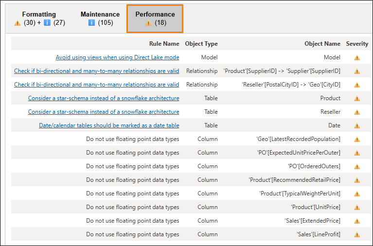

17. Passe o mouse sobre **o nome da regra "Avoid using views when using Direct Lake mode".**

18. O analisador de desempenho está nos lembrando de que o modo Direct Lake não oferece suporte a exibições. Nesta aula, usamos os atalhos para nos conectarmos rapidamente aos dados e, em seguida, transformamos os dados usando exibições. Em parte, isso foi feito para saber mais sobre os muitos métodos de conexão de dados que temos no Fabric. No entanto, se quiséssemos aplicar essa recomendação ao nosso modelo, precisaríamos usar outro método para ingerir e transformar nossos dados de vendas, como um Fluxo de Dados Gen2.

    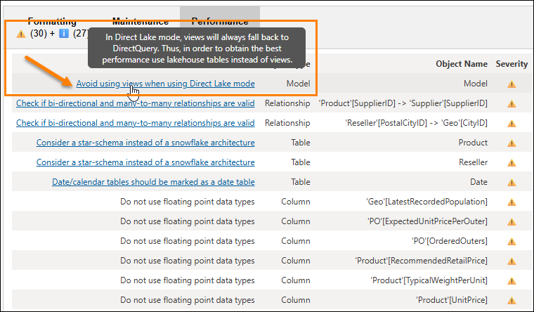

19. Se o tempo permitir, o instrutor poderá seguir outras recomendações.

### Analisador de memória

1. Navegue de volta à exibição de modelo do seu modelo semântico **sm_FAIAD.**

2. **Na Faixa de Opções da Página Inicial** selecione **Analisador de memória**.

    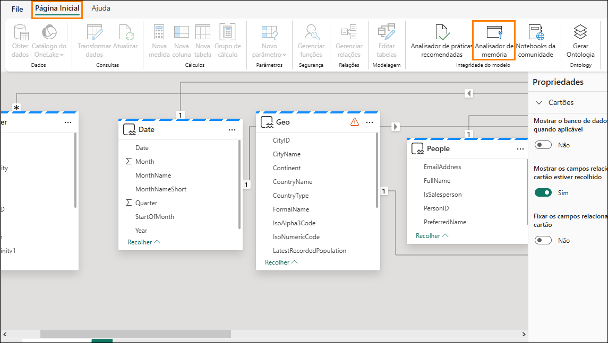

3. Será criado um novo notebook do Analisador de memória.

4. Reveja os detalhes listados nas células Markdown com os alunos.

5. Na **Faixa de Opções da Página Inicial,** selecione **Executar tudo.**

    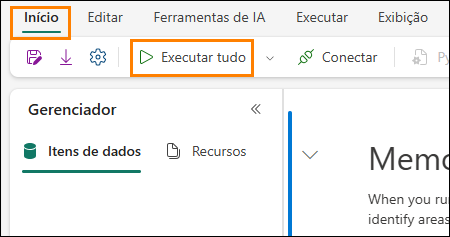

6. Depois que o notebook for concluído, observe os dados resultantes. Há muitas categorias exibindo o uso de memória em diferentes níveis de detalhes.

    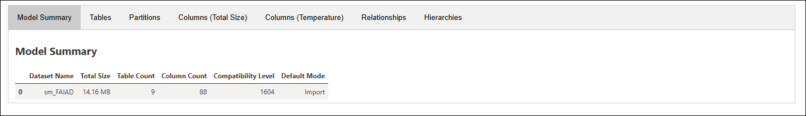

7. Observe aos alunos que podemos usar todas essas informações para identificar áreas de melhoria em relação ao uso da memória.

8. Selecione a categoria **Tabelas.**

9. Passe o mouse sobre o nome da **coluna % DB**. Isso exibirá a descrição das colunas. Esta coluna indica o tamanho de cada tabela em relação ao tamanho do modelo semântico. Embora isso não nos diga automaticamente que algo está errado, é útil ver qual porcentagem da memória dos modelos semânticos está sendo usada por cada tabela.

    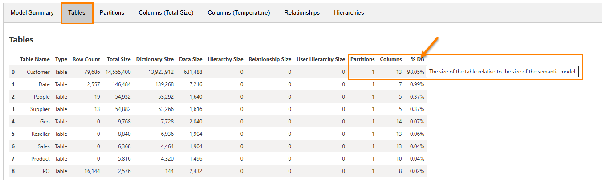

10. Se o tempo permitir, o instrutor pode terminar a demonstração passando por outras categorias explicando vários pontos de dados.
