# Microsoft Fabric - Fabric Analyst in a Day - Laboratório 2

## Conteúdo

- Introdução
- Licença do Fabric
  - Tarefa 1: Habilitar uma licença de avaliação do Microsoft Fabric
- Workspace do Fabric
  - Tarefa 2: Criar um workspace do Fabric
  - Tarefa 3: Criar um Lakehouse
- Visão geral das experiências do Fabric
  - Tarefa 4: Experiência do Data Factory
  - Tarefa 5: Experiência do Industry Solutions
  - Tarefa 6: Experiência do Real-Time Intelligence
  - Tarefa 7: Experiência do Data Engineering
  - Tarefa 8: Experiência do Data Science
  - Tarefa 9: Experiência do Data Warehouse
  - Tarefa 10: Experiência de Bancos de Dados
- Referências

# Introdução

Hoje você conhecerá vários recursos importantes do Microsoft Fabric. Este é um workshop introdutório destinado a apresentar as diversas experiências de produtos e os vários itens disponíveis no Fabric. Ao final deste workshop, você saberá como usar os recursos Lakehouse, Fluxo de Dados Gen2, Pipeline, DirectLake, entre outros.

Ao final deste laboratório, você terá aprendido a:

- Como criar um workspace do Fabric

- Como criar um Lakehouse

# Licença do Fabric

### Tarefa 1: Habilitar uma licença de avaliação do Microsoft Fabric

1. Selecione **PowerBI Portal** na Área de Trabalho da Máquina Virtual. A sua entrada pode ser solicitada.

    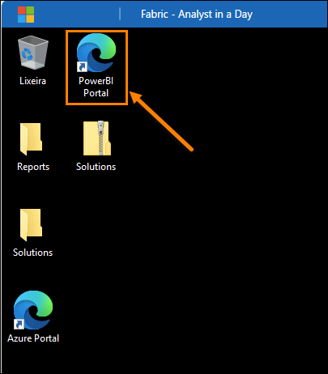

    **Observação:** se você estiver usando o ambiente de laboratório, ele poderá conectar você automaticamente.

    ***Observação**: se o Fabric não abrir, navegue até http://app.fabric.microsoft.com/ no navegador.\*

2. Copie o Nome de usuário e cole-o no campo Email da caixa de texto e selecione Enviar.

    - **Email/Nome de usuário:** encontrado na guia Ambiente

    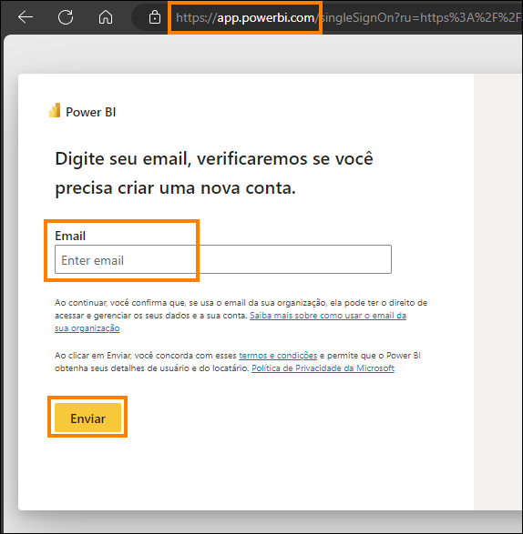

3. Na guia **Entrar no Microsoft Azure**, você verá a tela de login. Nessa tela, insira o seguinte **Email/Nome de usuário** e clique em **Avançar**.

    - **Email/Nome de usuário:** encontrado na guia Ambiente

    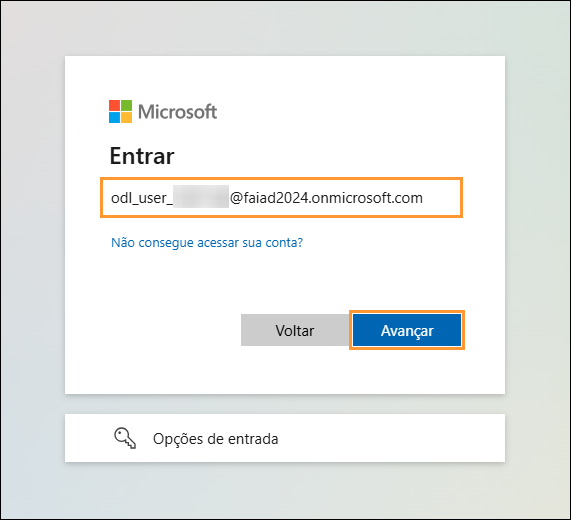

4. Agora, insira a seguinte **Senha de Acesso Temporária** e clique em **Entrar**.

    - **Senha de Acesso Temporária:** encontrada na guia Ambiente

    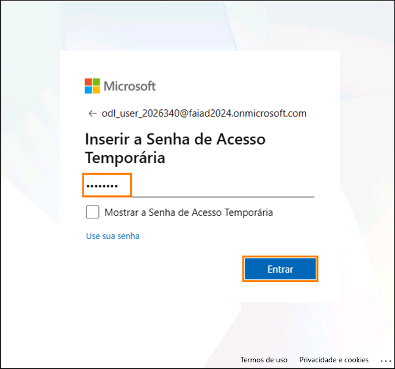

5. Você será direcionado à conhecida **Página Inicial de Serviço do Power BI**.

6. Presumimos que você esteja familiarizado com o layout do Serviço do Power BI. Se você tiver alguma dúvida, não hesite em perguntar ao instrutor.

    Atualmente, você está em **Meu workspace**. Para trabalhar com itens do Fabric, você precisará de uma licença de avaliação e de um workspace que tenha uma licença do Fabric atribuída. Vamos configurar tudo.

7. No canto superior direito da tela, selecione o **ícone**** de usuário**.

8. Selecione **Avaliação gratuita**.

    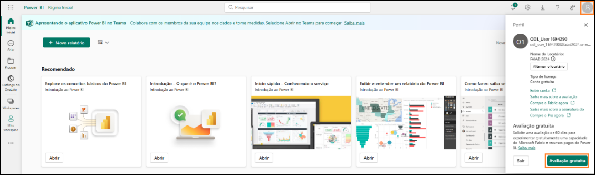

9. A caixa de A caixa de diálogo de atualização para uma avaliação gratuita do Microsoft Fabric é aberta. Selecione **Ativar**.

    **Observação:** não altere a região padrão. Mantenha isso como está.

    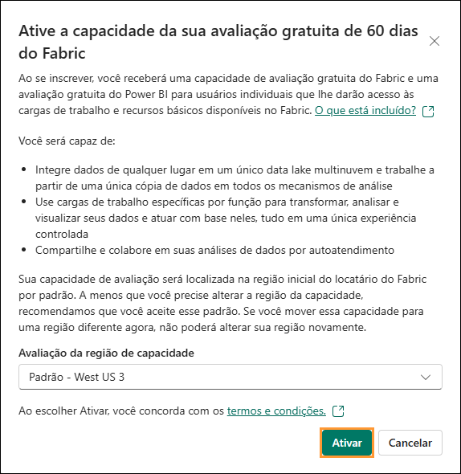

10. A caixa de diálogo Atualizado com êxito para Microsoft Fabric é aberta. Selecione **Fabric Home Page**.

    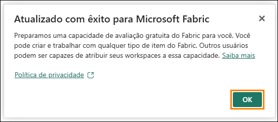

11. Você será direcionado à **Página Inicial do Microsoft Fabric**. Um diálogo "Bem-vindo(a) à exibição do Fabric" pode ser aberto. Se desejar, você poderá selecionar a opção **Iniciar tour** ou **Cancelar**.

    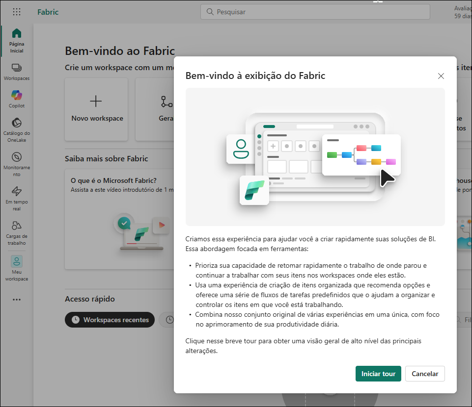

# Workspace do Fabric

### Tarefa 2: Criar um workspace do Fabric

1. Agora vamos criar um workspace com uma licença do Fabric. Selecione **Workspaces** (1) na barra de navegação esquerda. Uma caixa de diálogo é aberta.

2. Clique em **+ Novo workspace** (2) encontrado na parte inferior do menu pop-out.

    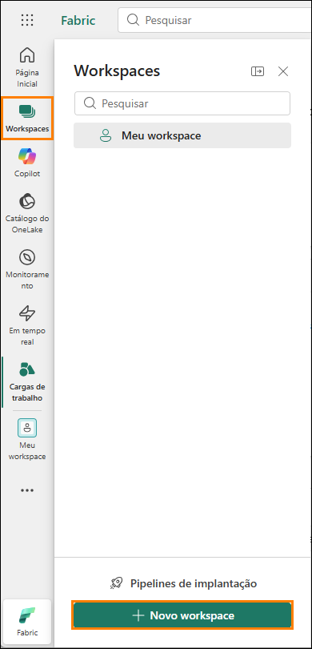

3. A caixa de diálogo **Criar um workspace** é aberta no lado direito do navegador.

4. No campo **Nome**, insira FAIAD_UserID (encontrado na guia Ambiente).

    **Observação:** O nome do workspace deve ser exclusivo. Verifique se há uma marca de seleção verde em "Este nome está disponível", abaixo do campo Nome.

5. Se preferir, você poderá inserir uma Descrição para o workspace. Esse campo é opcional.

6. Clique em **Avançado** para expandir a seção.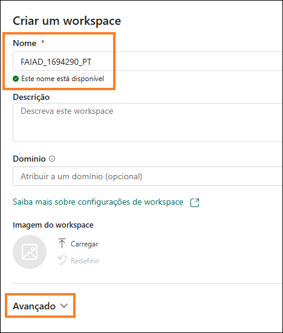

7. Em **Modo de licença**, verifique se **Avaliação** está selecionada. (Essa opção deve estar selecionada por padrão.)

8. 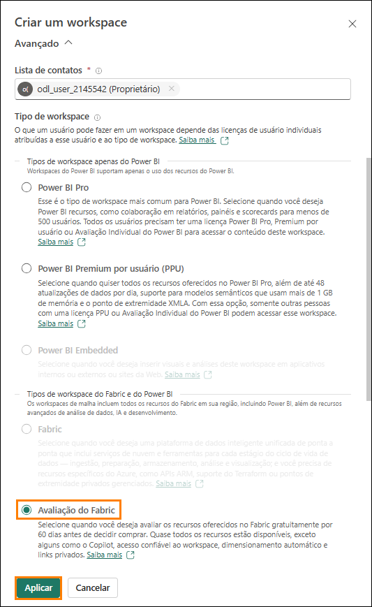Selecione **Aplicar** para criar um novo workspace.

    Você será navegado para seu espaço de trabalho recém-criado. Traremos dados de diferentes fontes de dados para um Lakehouse e usaremos os dados do Lakehouse para criar nosso modelo e relatá-lo. A primeira etapa é criar um Lakehouse. Faremos isso em seguida.

### Tarefa 3: Criar um Lakehouse

1. No workspace recém-criado **FAIAD_Username**, localize o botão **+ Novo item (1)** no painel de navegação esquerdo. É aqui que você pode começar a criar novos itens em seu workspace.

2. Na caixa de pesquisa, digite **Lakehouse (2)** e, nos resultados da pesquisa, selecione a opção **Lakehouse (3)**. Isso permitirá que você crie um novo Lakehouse para armazenar, consultar
    e gerenciar seu big data.

    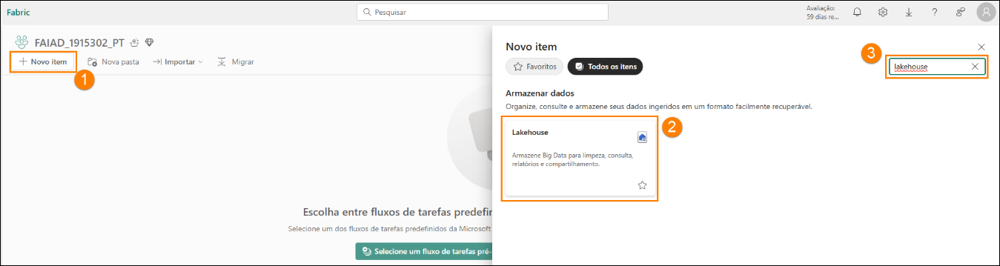

3. Uma caixa de diálogo Novo Lakehouse será exibida. Insira **lh_FAIAD** na caixa de texto Nome.

    **Observação:** "lh" refere-se a Lakehouse. Estamos prefixando "lh" para que seja fácil de identificar e pesquisar.

    **Observação:** este recurso não está mais em versão prelimina**r, mas ainda não precisamos habilitá-lo.**

4. Selecione **Criar**

    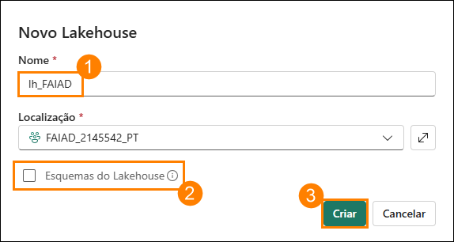

    Em alguns instantes, um Lakehouse será criado e você será direcionado para a interface do explorer do Lakehouse. No canto superior esquerdo, ao lado do nome do Fabric no cabeçalho, você terá o ícone do Lakehouse. O ícone do espaço de trabalho na navegação à esquerda refletirá que ele agora contém um item.

    No Explorador do Lakehouse, você observará uma seção Tabelas e Arquivos. Um Lakehouse poderia expor arquivos do Azure Data Lake Storage Gen2 na seção de arquivos, ou um fluxo de dados poderia carregar dados para as tabelas do Lakehouse. Existem várias opções disponíveis. Mostraremos algumas das opções nos laboratórios a seguir.

    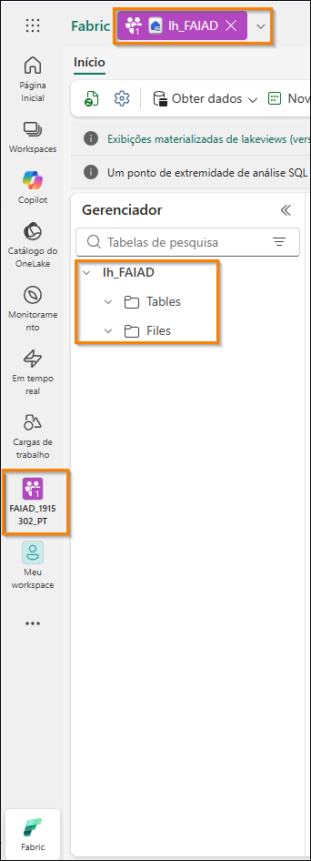

# Visão geral das experiências do Fabric

### Tarefa 4: Experiência do Data Factory

1. Selecione o ícone Cargas de trabalho no lado esquerdo da tela. Uma caixa de diálogo com a lista de experiências do Fabric será aberta. A lista de experiências inclui o Power BI, o Data Factory, o Industry Solutions, o Real-Time Intelligence, o Data Engineering, o Data Science e o Data Warehouse. Vamos explorar.

    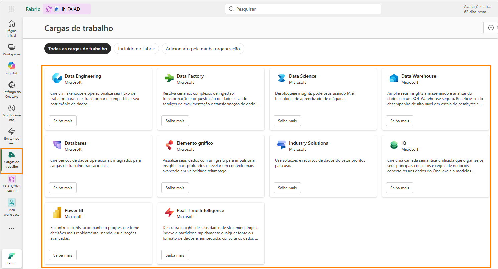

2. Selecione **Data Factory**.

    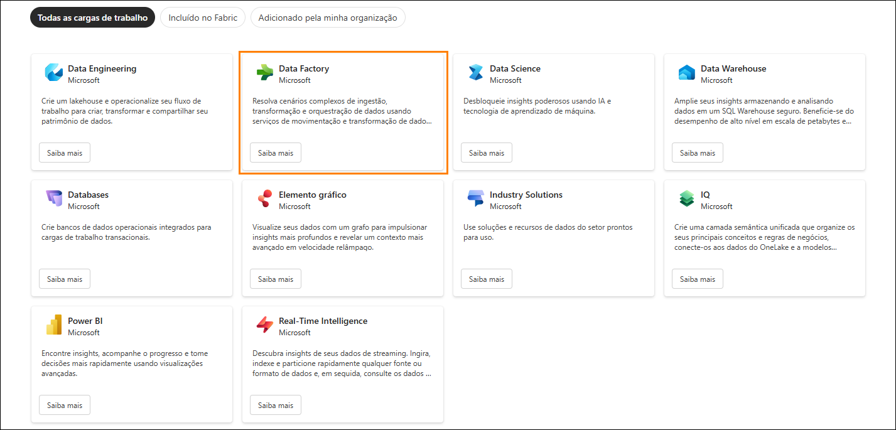

3. Você será direcionado para a Página Inicial do Data Factory. A seguir, está uma explicação detalhada de suas seções, desenvolvidas para guiar você passo a passo no uso eficaz do Data Factory. Fluxo de Dados Gen2 é a próxima geração de Fluxo de Dados.

    **O que é o Data Factory?**

    O Data Factory é uma ferramenta que ajuda a gerenciar e organizar dados de fontes diferentes. Ele permite que você colete, prepare e transforme dados, para que possam ser usados de forma eficaz. Seja você um iniciante ou um especialista, o Data Factory fornece ferramentas para tornar a transformação de dados mais fácil e eficiente.

    **Tipos de item:**

    1) **Fluxo de dados Gen2:** os fluxos de dados são como receitas para transformar dados. Eles oferecem mais de 300 transformações diferentes que você pode aplicar aos seus dados. Isso significa que você pode limpar, combinar e alterar os dados de várias maneiras para atender às suas necessidades.

    2) **Pipeline:** pipelines são fluxos de trabalho que ajudam a automatizar os processos de dados. Eles permitem que você crie fluxos de trabalho de dados flexíveis que podem ser adaptados às suas necessidades específicas. Isso facilita o gerenciamento e o processamento de dados de forma estruturada.

    3) **Azure Data Factory:** é um serviço de integração de dados baseado em nuvem que permite criar fluxos de trabalho controlados por dados para orquestrar e automatizar a movimentação e a transformação de dados.

    4) **Trabalho do Apache Airflow:** o Apache Airflow é uma plataforma de código aberto usada para criar, agendar e monitorar fluxos de trabalho de forma programática. No Data Factory, ele permite criar, agendar e gerenciar fluxos de trabalho de dados complexos.

    5) **SAP espelhado:** zintegre perfeitamente seu estado SAP existente com o restante de seus dados no Fabric.

    6) **Banco de dados espelhado:** um recurso para criar versões espelhadas de bancos de dados para backup, teste ou acesso somente leitura.

    7) **SAP Espelhado:** integre perfeitamente seu estado SAP existente com o restante de seus dados no Fabric.

    8) **Oracle espelhado:** um espelhamento no Fabric replica os bancos de dados Oracle em uma plataforma unificada, permitindo a análise quase em tempo real e de baixa latência ao lado de outras fontes de dados.

    9) **Google BigQuery Espelhado (versão preliminar):** o espelhamento no Fabric permite replicar continuamente dados do Google BigQuery no OneLake, eliminando o ETL complexo e permitindo o uso contínuo em análise, IA e compartilhamento de dados.

    10) **Lista espelhada do SharePoint Online (versão preliminar):** replica os dados da lista do SharePoint em tempo quase real no Microsoft Fabric OneLake como uma fonte pronta para análise somente leitura. Ela remove o ETL e expõe os dados por meio de um ponto de extremidade de análise SQL criado automaticamente para o Power BI e outras cargas de trabalho do Fabric.

    11) **Biblioteca de variáveis:** contém uma lista de variáveis e seus valores padrão. Ela também pode conter outros conjuntos de valores com valores alternativos

    12) **Trabalho dbt (versão preliminar):** permite que você use o dbt para transformar dados com SQL em um ambiente familiar.

    **Introdução:**

    Para começar a usar o Data Factory, você pode seguir estas etapas:

    1) **Saiba como usar Data Factory:** essa seção ajuda você a começar a usar o Data Factory. Ela fornece orientação sobre como começar a usar a ferramenta de forma eficaz.

    2) **Crie seu primeiro fluxo de dados:** aqui, você pode aprender como criar seu primeiro fluxo de dados. Os fluxos de dados são essenciais para transformar os dados de acordo com suas necessidades.

    3) **Criar Seu Primeiro Pipeline:** essa seção orienta você sobre como criar seu primeiro pipeline. Os pipelines ajudam a automatizar e gerenciar os processos de dados de forma eficaz.

    4) **Aprenda a monitorar o Data Factory:** o monitoramento é crucial para garantir que os processos de dados estejam funcionando sem problemas. Essa seção ensina como monitorar as atividades do Data Factory.

    5) **Aprenda a transformar dados com fluxos de dados:** essa seção ajuda você a entender como usar fluxos de dados para transformar os dados de forma eficaz.

    6) **Crie sua primeira API para o GraphQL:** se você estiver interessado em usar APIs com o GraphQL, essa seção orientará você sobre como começar.

    7) **Crie suas primeiras funções de dados do usuário:** essa seção ajuda você a criar funções de dados do usuário, que são úteis para gerenciar e transformar dados do usuário.

    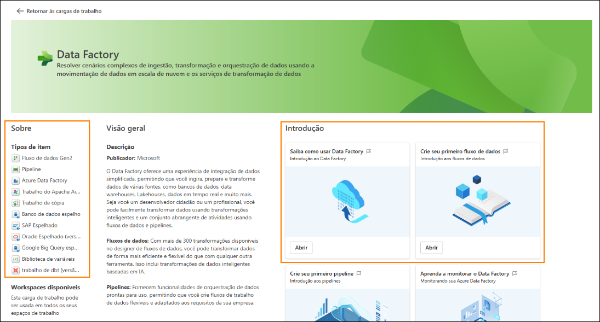

4. Clique em **Retornar às cargas de trabalho** no canto superior esquerdo da tela. Essa ação levará você para a página principal de cargas de trabalho, na qual você poderá explorar outras ferramentas ou seções.

    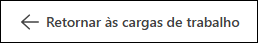

### Tarefa 5: Experiência do Industry Solutions

1. Na **página Minhas cargas de trabalho**, clique em **Industry Solutions** para prosseguir.

    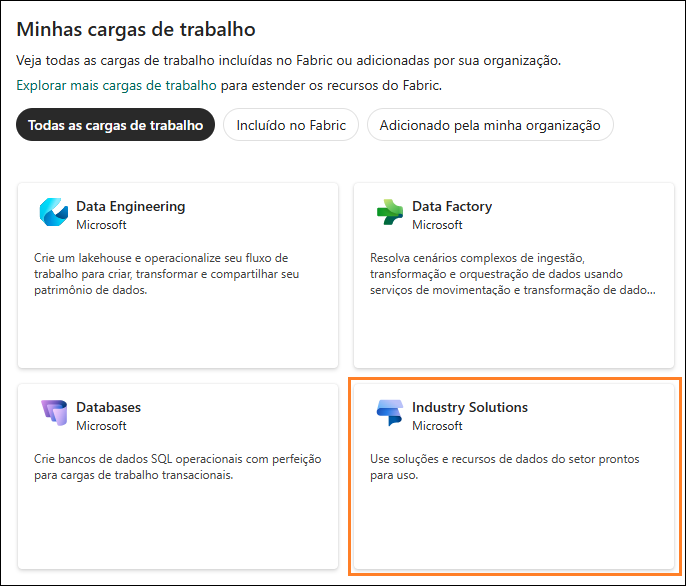

2. Você será direcionado para a Página Inicial do Industry Solutions. Veja a seguir uma visão geral detalhada de suas seções, desenvolvidas para ajudar você a usar o Industry Solutions de forma eficaz e passo a passo.

    **O que são Industry Solutions?**

    Industry Solutions são soluções de dados prontas para uso no Microsoft Fabric que fornecem soluções e recursos para vários setores. As Industry Solutions ajudam você a começar a usar os principais cenários de negócios usando modelos de dados, conectores, transformações, relatórios e outros ativos relacionados ao setor.

    **Tipos de item:**

    1) **Soluções de sustentabilidade:** oferece suporte à ingestão, padronização e análise de dados de ESG (governança ambiental, social e corporativa).

    2) **Soluções de dados de saúde:** são estrategicamente projetadas para acelerar o tempo de retorno para os clientes, atendendo à necessidade crítica de transformar com eficiência os dados de saúde em um formato adequado para fins de análise.

    **Observações:** algumas soluções podem não aparecer para você

    **Introdução:** Para começar a usar o Industry Solutions, siga estas etapas:

    1) **Saiba mais sobre soluções de dados de saúde:** clique no botão "Saiba mais" para ler sobre soluções de dados de saúde e entender como elas podem ser usadas em seus projetos.

    2) **Introdução às soluções de dados de Serviços de Saúde**: comece a implantar as soluções de dados de serviços de saúde e a implementá-las em seus projetos.

    3) **Saiba mais sobre soluções de sustentabilidade:** clique no botão "Saiba mais" para ler sobre soluções de sustentabilidade e entender como elas podem ser usadas em seus projetos.

    4) **Introdução às soluções de Sustentabilidade:** comece a implantar as soluções de sustentabilidade e a implementá-las em seus projetos.

    5) **Saiba mais sobre soluções de varejo:** clique no botão "Saiba mais" para ler sobre soluções de varejo e entender como elas podem ser usadas em seus projetos.

    6) **Introdução às soluções de Varejo**: comece a implantar as soluções de varejo e a implementá-las em seus projetos.

    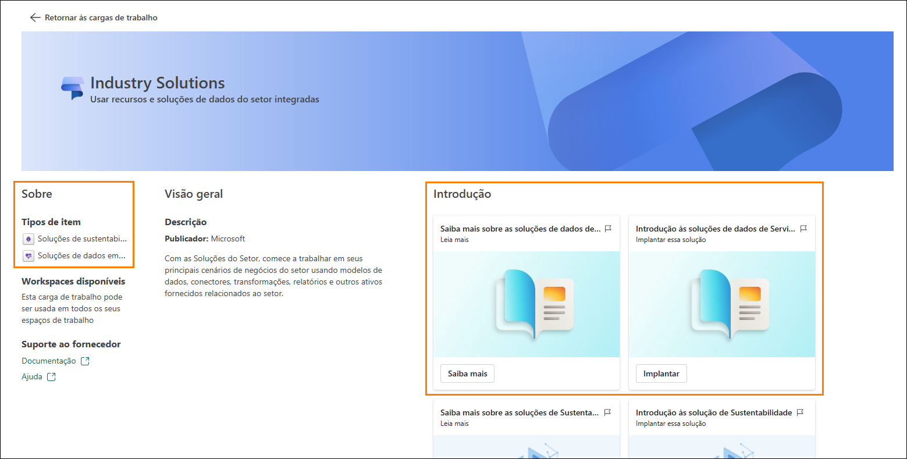

3. Clique em Retornar às cargas de trabalho no canto superior esquerdo da tela. Essa ação levará você para a página principal de cargas de trabalho, na qual você poderá explorar outras ferramentas ou seções.

    

### Tarefa 6: Experiência do Real-Time Intelligence

1. Na página de cargas **de trabalho**, clique em **Real-Time Intelligence** para prosseguir.

    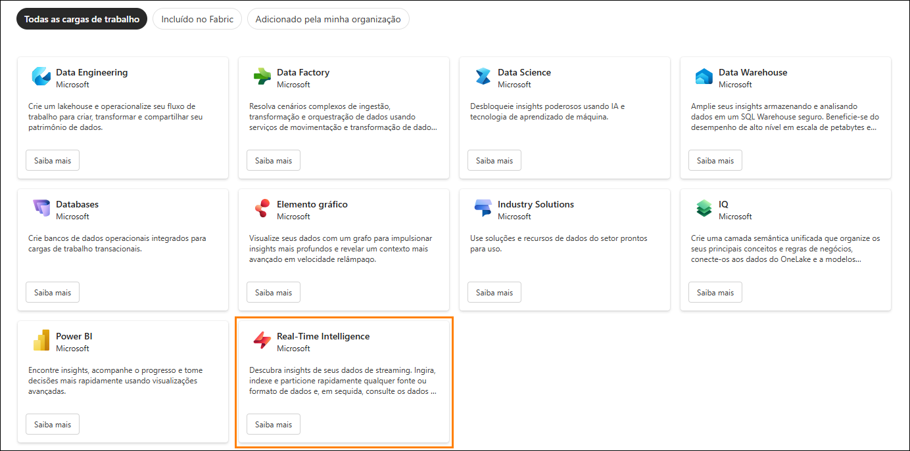

2. Você será direcionado para a Página Inicial do Real-Time Intelligence. A seguir, está uma visão geral detalhada de suas seções, desenvolvidas para ajudar você a usar o Real-Time Intelligence de forma eficaz e passo a passo.

    **O que é o Real-Time Intelligence?** O Real-Time Intelligence é uma ferramenta que ajuda você a gerenciar e analisar dados de alto volume e alta granularidade de várias fontes. Ele permite ingerir, analisar e agir sobre os dados em tempo real, melhorando as operações de negócios com tomadas de decisões e ações em tempo hábil.

    **Tipos de item:**

    a. **Eventhouse:** usado para criar um workspace de um ou vários bancos de dados KQL, que podem ser compartilhados entre projetos.

    b. **Conjunto de Consultas KQL:** usado para executar consultas nos dados para produzir tabelas e visuais compartilháveis.

    c. **Painel em Tempo Real:** usado para visualizar dashboards em tempo real em segundos após a ingestão de dados.

    d. **Eventstream:** usado para capturar, transformar e rotear fluxo de eventos em tempo real.

    e. **Ativador:** usado para monitorar conjuntos de dados, consultas e fluxos de eventos quanto a padrões.

    f. **Conjunto de Esquemas de Eventos (versão preliminar):** ajuda você a organizar e a padronizar estruturas de dados (esquemas) para seus fluxos de trabalho de análise em tempo real, facilitando o processamento e a análise de dados de fluxo de forma consistente.

    g. **Conector de fluxo personalizado (versão preliminar):** permite que você envie eventos em tempo real para um EventStream de seus próprios pontos de extremidade personalizados e aplicativos personalizados.

    h. **Detector de anomalias (Versão preliminar**): a detecção de anomalias identifica de forma automática padrões e exceções incomuns em suas tabelas do Eventhouse.

    i. **Agente de operações (Versão preliminar)**: os agentes de operação automatizam o ciclo observar -> analisar -> decidir -> agir. Eles acompanham continuamente as principais métricas, revelam insights e recomendam ações direcionadas.

    j. **Mapa:** traga insights geoespaciais para o Real-Time Intelligence, permitindo que qualquer pessoa visualize onde os eventos acontecem, integre dados espaciais com outros recursos do Fabric e tome decisões mais inteligentes e sensíveis à localização.

    k. **Construtor de Gêmeos Digitais (Versão preliminar):** o construtor de gêmeos digitais permite que os usuários com experiência em low-code/no-code criem e modelem seus conceitos de negócios, como ativos e processos, por meio de uma ontologia.

    **Introdução:**

    Para começar a usar o Real-Time Intelligence, siga estas etapas:

    a. **Experiências de Ponta a Ponta em Tempo Real:** clique no botão "Introdução" para explorar a análise de dados em tempo real com conjuntos de dados de exemplo.

    b. **Explorar exemplo de Real-Time Intelligence:** clique no botão "Abrir" para explorar a análise de dados em tempo real com um exemplo.

    c. **Explorar um Exemplo de Eventhouse:** clique no botão "Selecionar" para usar um exemplo e aprender sobre o Real-Time Intelligence.

    d. **Introdução ao Real-Time Intelligence:** clique no botão "Abrir" para obter uma visão geral do Real-Time Intelligence e começar a usar a ferramenta de forma eficaz.

    e. **Aprender KQL com dados de exemplo:** clique no botão "Abrir" para aprender KQL usando dados de exemplo.

    f. **O que é um Hub em Tempo Real:** clique no botão "Abrir" para saber o que é um Hub em Tempo Real e como ele pode ser usado.

    g. **Explorar um ativador de amostra:** clique no botão "Abrir" para usar um ativador de amostra e entender os recursos e as capacidades do Real-Time Intelligence.

    h. **Introdução ao ativador:** clique no botão "Abrir" para começar a usar os conceitos do ativador e a ferramenta de forma eficaz.

    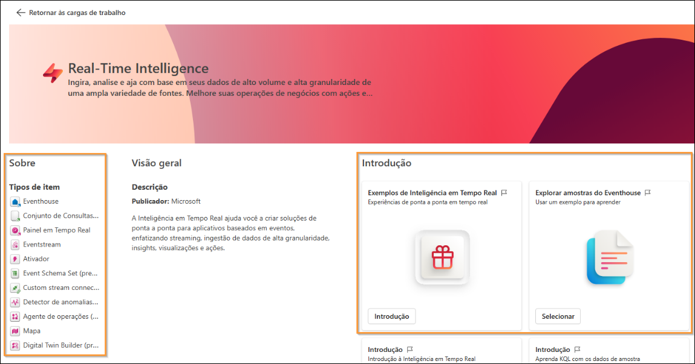

3. Clique em Retornar às cargas de trabalho no canto superior esquerdo da tela. Essa ação levará você para a página principal de cargas de trabalho, na qual você poderá explorar outras ferramentas ou seções.

    

### Tarefa 7: Experiência do Data Engineering

1. Na página de cargas **de trabalho**, clique em Data Engineering para prosseguir.

    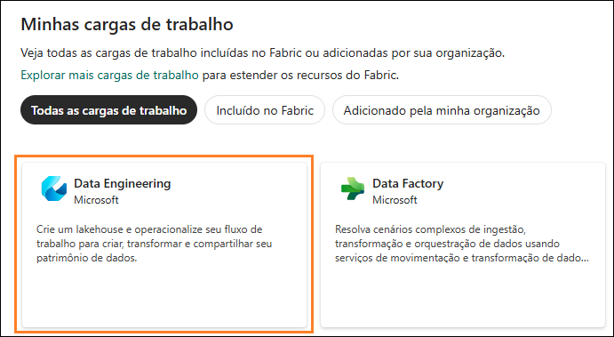

2. Você será direcionado para a Página Inicial do **Data Engineering**. A seguir, está uma visão geral detalhada de suas seções, desenvolvidas para ajudar você a usar o **Data Engineering** de forma eficaz e passo a passo.

    **O que é o Data Engineering?**

    O Data Engineering é uma ferramenta que ajuda a projetar, criar e manter infraestruturas e sistemas para coleta, armazenamento, processamento e análise de grandes volumes de dados. Ele permite criar lakehouses e operacionalizar o fluxo de trabalho para criar, transformar e compartilhar o patrimônio de dados.

    **Tipos de item:**

    a. **Lakehouse:** usado para armazenar Big Data para limpeza, consulta, relatórios e compartilhamento.

    b. **Notebook:** usado para ingestão, preparação, análise e outras tarefas relacionadas a dados usando várias linguagens, como Python e Scala.

    c. **Ambiente:** usado para configurar bibliotecas compartilhadas, configurações de computação do Spark e recursos para notebooks e definições de trabalho do Spark.

    d. **Definição de Trabalho do Spark:** usada para definir, agendar e gerenciar trabalhos do Apache.

    e. **Funções de dados do usuário:** plataforma que permite hospedar e executar aplicativos no Fabric.

    f. **API para GraphQL:** é a API para consultar várias fontes de dados.

    g **Banco de dados Snowflake:** permite que os usuários espelhem o banco de dados Snowflake dentro do Fabric.

    **Introdução:**

    Para começar a usar o Data Engineering, siga estas etapas:

    a. **Explorar um exemplo:** clique no botão "Selecionar" para usar um exemplo e aprender sobre o Data Engineering.

    b. **O que é um Lakehouse?:** clique no botão "Abrir" para saber mais sobre lakehouses e como eles podem ser usados.

    c. **Obter experiência de dados no Lakehouse:** clique no botão "Abrir" para começar a trabalhar com a engenharia de dados usando Lakehouses.

    d. **Introdução às Definições de Trabalho do Spark:** clique no botão "Abrir" para saber como usar as Definições de Trabalho do Spark para processamento de dados.

    e. **Desenvolver e executar notebooks:** clique no botão "Abrir" para saber como desenvolver e executar notebooks para análise de dados.

    f. **Como usar o NotebookUtils:** clique no botão "Abrir" para saber como usar o NotebookUtils para uma análise de dados aprimorada.

    g. **Aproveitar notebooks para seu lakehouse**: clique no botão "Abrir" para saber como aproveitar os notebooks para seu lakehouse.

    h. **Aproveitar conjuntos de dados para seu lakehouse:** clique no botão "Abrir" para saber como aproveitar os conjuntos de dados para seu lakehouse.

    i. **Criar suas primeiras funções de dados do usuário:** clique no botão "Abrir" para saber como criar funções de dados do usuário.

    j. **Criar sua primeira API for GraphQL:** clique no botão "Abrir" para saber como criar uma API for GraphQL.

    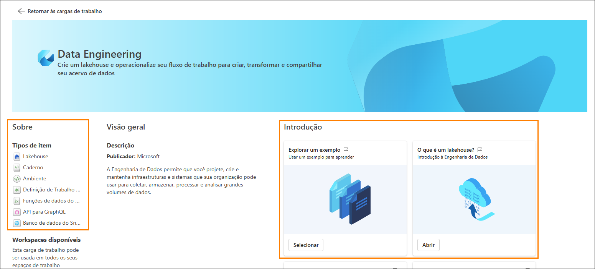

3. Clique em **Retornar às cargas de trabalho** no canto superior esquerdo da tela. Essa ação levará você para a página principal de cargas de trabalho, na qual você poderá explorar outras ferramentas ou seções.

    

### Tarefa 8: Experiência do Data Science

1. Na página de cargas **de trabalho**, clique em **Data Science** para prosseguir.

    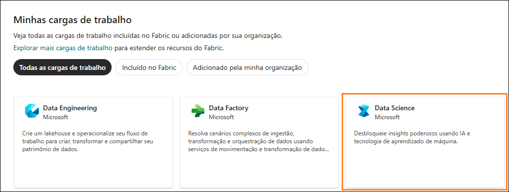

2. Você será direcionado para a Página Inicial do **Data Science**. A seguir, está uma visão geral detalhada de suas seções, desenvolvidas para ajudar você a usar o **Data Science** de forma eficaz.

    **O que é o Data Science?**

    O Data Science é uma ferramenta que ajuda você a revelar insights avançados usando IA e tecnologia de aprendizado de máquina. Ele fornece ferramentas de IA projetadas para ajudar você a concluir fluxos de trabalho de ciência de dados em grande escala e aproveitar a IA para enriquecimento de dados e insights de negócios.

    **Tipos de item:**

    a. **Modelo de ML:** usado para criar modelos de machine learning.

    b. **Experimento:** usado para criar, executar e acompanhar o desenvolvimento de vários modelos.

    c. **Notebook:** usado para explorar dados e criar soluções de machine learning.

    d. **Introdução aos Notebooks**: clique no botão "Abrir" para saber como começar a usar os notebooks.

    e. **Agente de dados**: usado para criar experiências de IA conversacional que respondem às perguntas sobre os dados armazenados em lakehouses, warehouses, modelos semânticos do Power BI e bancos de dados KQL

    f. **Notebook Python:** usado para importar notebooks Python de um computador local.

    **Introdução:**

    Para começar a usar o Data Science, siga estas etapas

    a. **Explorar um exemplo:** clique no botão "Selecionar" para usar um exemplo e aprender sobre o Data Science.

    b. **Introdução aos Modelos de ML:** clique no botão "Abrir" para saber como começar a usar os modelos de machine learning.

    c. **Introdução aos Experimentos de ML:** clique no botão "Abrir" para saber como conduzir experimentos de machine learning.

    d. **Desenvolver e executar notebooks:** clique no botão "Abrir" para saber como desenvolver e executar notebooks para análise de dados.

    e. **Introdução aos Notebooks:** clique no botão "Abrir" para saber como começar a usar os notebooks.

    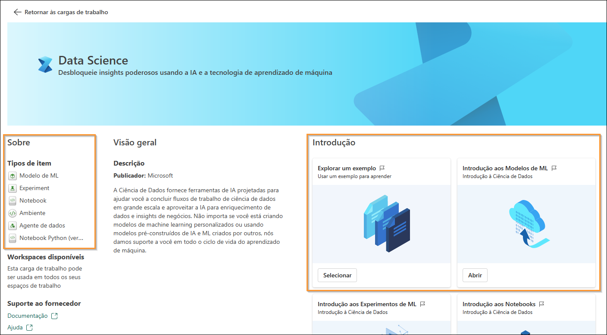

3. Clique em **Retornar às cargas de trabalho** no canto superior esquerdo da tela. Essa ação levará você para a página principal de cargas de trabalho, na qual você poderá explorar outras ferramentas ou seções.

    

### Tarefa 9: Experiência do Data Warehouse

1. Na página de cargas **de trabalho**, clique em **Data Warehouse** para prosseguir.

    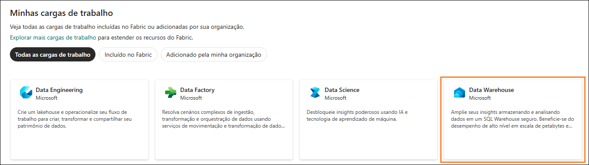

2. Você será direcionado para a Página Inicial do Data Warehouse. A seguir, está uma visão geral detalhada de suas seções, desenvolvidas para ajudar você a usar o Data Warehouse de forma eficaz e passo a passo.

    **O que é o Data Warehouse?**

    O Data Warehouse é uma ferramenta que ajuda a armazenar e analisar dados em um depósito SQL seguro. Ele permite que você escale verticalmente seus insights beneficiando-se do desempenho de nível superior em escala de petabytes em um formato de dados abertos.

    **Tipos de item:**

    a. **Warehouse:** usado para criar um Data Warehouse.

    b. **Depósito de exemplo:** usado para explorar e testar recursos de armazenamento de dados com conjuntos de dados e modelos pré-configurados.

    c. **Notebook:** usado para criar e compartilhar tarefas interativas de visualização e análise de dados.

    d. **Banco de Dados SQL do Azure espelhado:** usado para espelhar o Banco de Dados SQL do Azure.

    e. **Catálogo espelhado do Azure Databricks:** usado para espelhar os dados do Azure Databricks para integração e análise aprimoradas.

    f. **Snowflake espelhado:** usado para espelhar o banco de dados Snowflake.

    g. **Oracle espelhado:** usado para espelhar o Oracle.

    h. **Google BigQuery espelhado (versão preliminar):** usado para espelhar o Google BigQuery.

    i. **Lista espelhada do SharePoint Online (versão preliminar):** replica os dados da lista do SharePoint em tempo quase real no Microsoft Fabric OneLake como uma fonte pronta para análise somente leitura. Ela remove o ETL e expõe os dados por meio de um ponto de extremidade de análise SQL criado automaticamente para o Power BI e outras cargas de trabalho do Fabric.

    j. **Azure Cosmos DB espelhado:** usado para espelhar o Azure Cosmos DB.

    k. **SQL Server espelhado:** usado para espelhar o SQL Server.

    l. **Banco de Dados do Azure para PostgreSQL:** espelhado: usado para espelhar o Banco de Dados do Azure para PostgreSQL existente

    m. **Banco de Dados do Azure para MySQL espelhado (versão preliminar):** replica os dados MySQL no Microsoft Fabric OneLake como uma fonte somente leitura e pronta para análise, permitindo análise quase em tempo real sem ETL

    n. **Instância Gerenciada de SQL do Azure espelhado:** usada para espelhar os Bancos de Dados Gerenciados SQL do Azure para alta disponibilidade e recuperação de desastre.

    o. **Banco de dados espelhado:** usado para replicar bancos de dados para alta disponibilidade e recuperação de desastres.

    p. **Catálogo espelhado do Dremio (versão preliminar):** espelha os metadados do catálogo do Dremio no Microsoft Fabric (sem dados copiados), criando atalhos que permitem que cargas de trabalho do Fabric consultem os dados gerenciados pelo Dremio por meio de um ponto de extremidade de análise SQL somente leitura.

    **Introdução:**

    Para começar a usar o Data Warehouse, siga as etapas abaixo:

    a. **Explorar um warehouse de exemplo:** inicie um novo warehouse com dados de exemplo já carregados.

    b. **Introdução ao warehouse:** clique no botão "Abrir" para saber como usar um warehouse para analisar dados.

    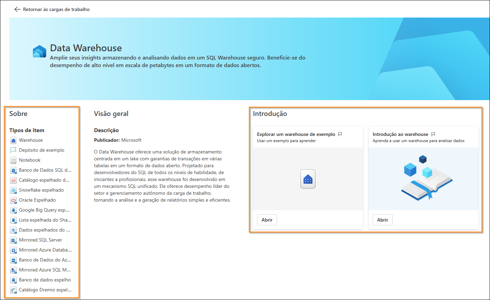

### Tarefa 10: Experiência de Bancos de Dados

1. Na página de cargas **de trabalho**, clique em **Databases** para prosseguir.

    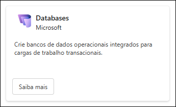

2. Você será direcionado para a Página Inicial de Bancos de Dados. A seguir, está uma visão geral detalhada de suas seções, desenvolvidas para ajudar você a usar Bancos de Dados de forma eficaz.

    **O que é um Fabric Database?** O banco de dados SQL no Microsoft Fabric é um banco de dados transacional fácil de usar para desenvolvedores, baseado no Banco de Dados SQL do Azure, que permite criar facilmente seu banco de dados operacional no Fabric. Um banco de dados SQL no Fabric usa o mesmo Mecanismo de Banco de Dados SQL que o Banco de Dados SQL do Azure.

    **Tipos de item:**

    a. **Banco de dados SQL:** o banco de dados SQL no Fabric faz parte da carga de trabalho Banco de Dados e os dados podem ser acessados de outros itens no Fabric. Seus dados de banco de dados SQL também são mantidos atualizados em um formato consultável no OneLake, para que você possa usar todos os diferentes serviços no Fabric, como executar análises com o Spark, executar notebooks, engenharia de dados, visualizar por meio de Relatórios do Power BI e muito mais.

    b. **Cosmos DB:** Cosmos DB no Microsoft Fabric é um banco de dados NoSQL otimizado para IA com uma experiência de gerenciamento simplificada. Como desenvolvedor, você pode usar o Cosmos DB no Fabric para criar aplicativos de IA com menos atrito e sem precisar assumir tarefas típicas de gerenciamento de banco de dados.**\**

    **Introdução:**

    Para começar a usar Bancos de Dados, siga as etapas abaixo:

1. **Explorar:** clique em "Abrir" para explorar um banco de dados de exemplo.

2. **Database concepts:** explica termos e conceitos comuns em torno do banco de dados transacional para que você possa se familiarizar com como trabalhar com o Banco de Dados SQL.

3. **Database templates:** examine uma biblioteca de modelos pré-criados de designs de banco de dados comuns.

    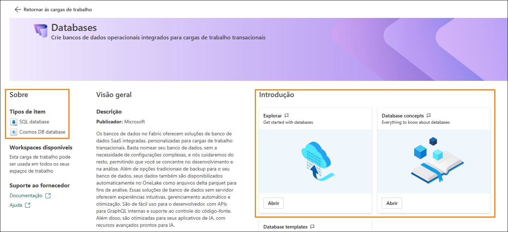

3. Clique em Retornar às cargas de trabalho no canto superior esquerdo da tela. Essa ação levará você para a página principal de cargas de trabalho, na qual você poderá explorar outras ferramentas ou seções.

    

    Neste laboratório, exploramos a interface do Fabric e criamos um workspace do Fabric e um Lakehouse. No próximo laboratório, aprenderemos como usar atalhos no Lakehouse para se conectar aos dados do ADLS Gen2 e como transformar esses dados usando exibições.

# Referências

O Fabric Analyst in a Day (FAIAD) apresenta algumas das principais funções disponíveis no Microsoft Fabric. No menu do serviço, a seção Ajuda (?) tem links para ótimos recursos.

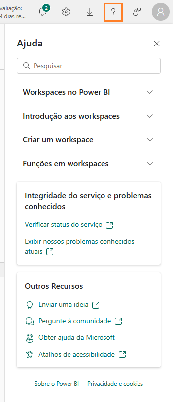

Veja aqui mais alguns recursos que ajudarão você com as próximas etapas do Microsoft Fabric.

- Veja a postagem no blog para ler na íntegra

- Explore o Fabric por meio do [Tour Guiado](https://aka.ms/Fabric-GuidedTour)

- Inscreva-se para a [avaliação gratuita do Microsoft Fabric](https://aka.ms/try-fabric)

- Visite o [site do Microsoft Fabric](https://aka.ms/microsoft-fabric)

- Aprenda novas habilidades explorando os [módulos de Aprendizagem do Fabric](https://aka.ms/learn-fabric)

- Explore a [documentação técnica do Fabric](https://aka.ms/fabric-docs)

- Leia o [livro eletrônico gratuito sobre como começar a usar o Fabric](https://aka.ms/fabric-get-started-ebook)

- Participe da [comunidade do Fabric](https://aka.ms/fabric-community) para postar suas perguntas, compartilhar seus comentários e aprender com outras pessoas

Leia os blogs de comunicados de experiências do Fabric em mais detalhes:

- [Experiência do Data Factory no blog do Fabric](https://aka.ms/Fabric-Data-Factory-Blog)

- [Experiência do Synapse Data Engineering no blog do Fabric](https://aka.ms/Fabric-DE-Blog)

- [Experiência do Synapse Data Science no blog do Fabric](https://aka.ms/Fabric-DS-Blog)

- [Experiência do Synapse Data Warehousing no blog do Fabric](https://aka.ms/Fabric-DW-Blog)

- [Experiência do Synapse Real-Time Analytics no blog do Fabric](https://aka.ms/Fabric-RTA-Blog)

- [Blog de comunicado do Power BI](https://aka.ms/Fabric-PBI-Blog)

- [Experiência do Data Activator no blog do Fabric](https://aka.ms/Fabric-DA-Blog)

- [Administração e governança no blog do Fabric](https://aka.ms/Fabric-Admin-Gov-Blog)

- [OneLake no blog do Fabric](https://aka.ms/Fabric-OneLake-Blog)

- [Blog de integração do Dataverse e Microsoft Fabric](https://aka.ms/Dataverse-Fabric-Blog)

© 2023 Microsoft Corporation. Todos os direitos reservados.

Ao usar esta demonstração/este laboratório, você concorda com os seguintes termos:

A tecnologia/funcionalidade descrita nesta demonstração/neste laboratório é fornecida pela Microsoft Corporation para obter seus comentários e oferecer uma experiência de aprendizado. Você pode usar a demonstração/o laboratório somente para avaliar tais funcionalidades e recursos de tecnologia e fornecer comentários à Microsoft. Você não pode usá-los para nenhuma outra finalidade. Você não pode modificar, copiar, distribuir, transmitir, exibir, executar, reproduzir, publicar, licenciar, criar obras derivadas, transferir nem vender esta demonstração/este laboratório ou qualquer parte deles.

A CÓPIA OU A REPRODUÇÃO DA DEMONSTRAÇÃO/DO LABORATÓRIO (OU DE QUALQUER PARTE DELES) EM QUALQUER OUTRO SERVIDOR OU LOCAL PARA REPRODUÇÃO OU REDISTRIBUIÇÃO ADICIONAL É EXPRESSAMENTE PROIBIDA.

ESTA DEMONSTRAÇÃO/ESTE LABORATÓRIO FORNECE DETERMINADOS RECURSOS E FUNCIONALIDADES DE PRODUTO/TECNOLOGIA DE SOFTWARE, INCLUINDO NOVOS RECURSOS E CONCEITOS POTENCIAIS, EM UM AMBIENTE SIMULADO SEM CONFIGURAÇÃO NEM INSTALAÇÃO COMPLEXA PARA A FINALIDADE DESCRITA ACIMA. A TECNOLOGIA/OS CONCEITOS REPRESENTADOS NESTA DEMONSTRAÇÃO/NESTE LABORATÓRIO PODEM NÃO REPRESENTAR A FUNCIONALIDADE COMPLETA DOS RECURSOS E PODEM NÃO FUNCIONAR DA MESMA MANEIRA QUE UMA VERSÃO FINAL. ALÉM DISSO, PODEMOS NÃO LANÇAR UMA VERSÃO FINAL DE TAIS RECURSOS OU CONCEITOS. SUA EXPERIÊNCIA COM O USO DE TAIS RECURSOS E FUNCIONALIDADES EM UM AMBIENTE FÍSICO TAMBÉM PODE SER DIFERENTE.

**COMENTÁRIOS.** Caso você forneça comentários sobre os recursos de tecnologia, as funcionalidades e/ou os conceitos descritos nesta demonstração/neste laboratório à Microsoft, você concederá à Microsoft, sem encargos, o direito de usar, compartilhar e comercializar seus comentários de qualquer forma e para qualquer finalidade. Você também concede a terceiros, sem encargos, quaisquer direitos de patente necessários para que seus produtos, suas tecnologias e seus serviços usem ou interajam com partes específicas de um software ou um serviço da Microsoft que inclua os comentários. Você não fornecerá comentários que estejam sujeitos a uma licença que exija que a Microsoft licencie seu software ou sua documentação para terceiros em virtude da inclusão de seus comentários neles. Esses direitos continuarão em vigor após o término do contrato.

POR MEIO DESTE, A MICROSOFT CORPORATION SE ISENTA DE TODAS AS GARANTIAS E CONDIÇÕES REFERENTES À DEMONSTRAÇÃO/AO LABORATÓRIO, INCLUINDO TODAS AS GARANTIAS E CONDIÇÕES DE COMERCIALIZAÇÃO, SEJAM ELAS EXPRESSAS, IMPLÍCITAS OU ESTATUTÁRIAS, E DE ADEQUAÇÃO A UMA FINALIDADE ESPECÍFICA, TÍTULO E NÃO VIOLAÇÃO. A MICROSOFT NÃO DECLARA NEM GARANTE A PRECISÃO DOS RESULTADOS DERIVADOS DO USO DA DEMONSTRAÇÃO/DO LABORATÓRIO NEM A ADEQUAÇÃO DAS INFORMAÇÕES CONTIDAS NA DEMONSTRAÇÃO/NO LABORATÓRIO A QUALQUER FINALIDADE.

**AVISO DE ISENÇÃO DE RESPONSABILIDADE**

Esta demonstração/este laboratório contém apenas uma parte dos novos recursos e aprimoramentos do Microsoft Power BI. Alguns dos recursos podem ser alterados em versões futuras do produto. Nesta demonstração/neste laboratório, você aprenderá sobre alguns dos novos recursos, mas não todos.
