# Microsoft Fabric - Fabric Analyst in a Day - Laboratório 3

## Conteúdo

- Introdução
- Atalho para o ADLS Gen2
  - Tarefa 1: Criar um atalho
- Transformar dados usando uma consulta Visual
  - Tarefa 2: Criar exibição Geo usando uma consulta Visual
  - Tarefa 3: Criar as exibições Reseller, Sales e Product usando uma consulta SQL
- Referências


# w

# Introdução

Em nosso cenário, os Dados de Venda são obtidos do sistema ERP e armazenados em um ADLS Gen2. Eles são atualizados ao meio-dia/12h, todos os dias. Precisamos transformar e ingerir esses dados no Lakehouse e usá-los em nosso modelo.

Há várias maneiras de ingerir esses dados.

- **Atalhos:** cria um link com os dados e podemos usar modos de exibição de consulta Visual para transformá-los. Usaremos os Atalhos neste laboratório.

- **Notebooks:** isso exige que escrevamos código. É uma abordagem para desenvolvedores.

- **Fluxo de Dados Gen2:** você provavelmente conhece o Power Query ou o Fluxo de Dados Gen1. O Fluxo de Dados Gen2, como o nome indica, é a versão mais recente do Fluxo de Dados. Ele oferece todos os recursos do Power Query/Fluxo de Dados Gen1 com o recurso adicional de transformar e ingerir dados em diversas fontes de dados. Apresentaremos isso nos próximos laboratórios.

- **Pipeline:** é uma ferramenta de orquestração. As atividades podem ser orquestradas para extrair, transformar e ingerir dados. Usaremos um pipeline para executar a atividade do Fluxo de Dados Gen2 que, por sua vez, realizará a extração, a transformação e a ingestão.

Começaremos criando um atalho para ingerir dados em um Lakehouse da fonte de dados ADLS Gen2. Uma vez ingeridos, usaremos modos de exibição de consulta Visual para transformá-los.

Ao final deste laboratório, você terá aprendido a:

- Como criar atalhos no Lakehouse

- Como transformar dados usando um recurso de consulta Visual

# Atalho para o ADLS Gen2

### Tarefa 1: Criar um atalho

Os atalhos são usados para criar um link com o local de destino. Os atalhos fornecem acesso aos dados sem a necessidade de mover fisicamente os dados para o lakehouse. É como criar atalhos na área de trabalho do Windows.

1. Na parte superior da tela, selecione a guia **lh_FAIAD** para navegar até o Lakehouse.

1. Se você não tiver uma guia, poderá navegar de volta ao seu Espaço de Trabalho e abrir o Lakehouse a partir daí.

2. No painel **Explorer**, selecione as **reticências** ao lado de **Tabelas**.

3. Selecione **Novo atalho.**

    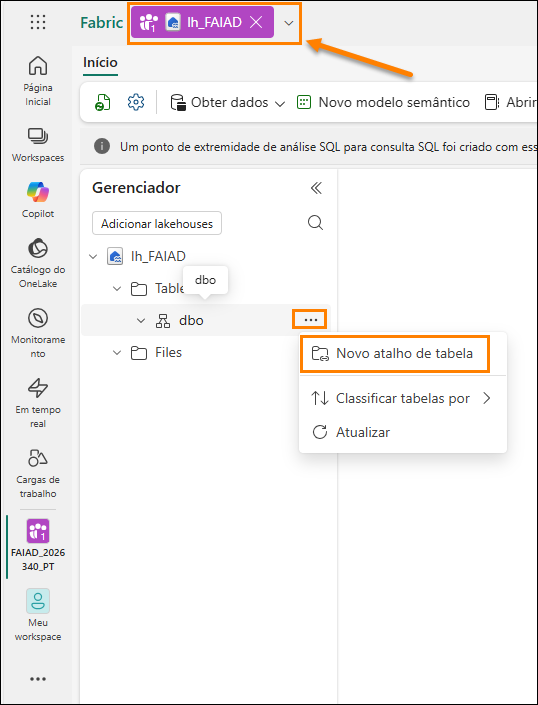

4. A caixa de diálogo **Novo atalho** é aberta. Em **Fontes externas**, selecione **Azure Data Lake Storage Gen2**.

    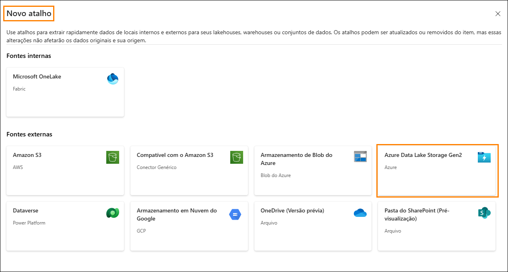

5. Selecione **Nova conexão (1)**.

6. Insira o seguinte link para a propriedade **URL**: <https://stvnextblobstorage.dfs.core.windows.net/fabrikam-sales> **(2):**

7. Clique em **Criar Nova Conexão (3)** na seção Conexão

8. Selecione **Assinatura de Acesso Compartilhado (SAS) (4)** no menu suspenso Tipo de autenticação.

9. Copie o token SAS e cole-o no campo Token SAS (5).

    - **Token SAS:**

10. Selecione **Avançar (6)** na parte inferior direita da tela.

    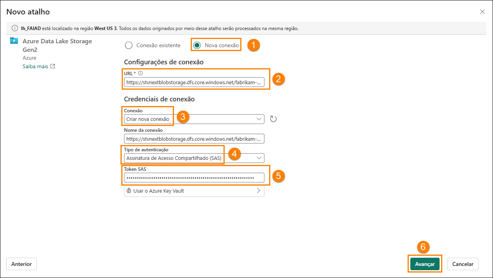

11. Você será conectado ao ADLS Gen2 com a estrutura de diretórios exibida no painel esquerdo. Expanda **Delta-Parquet-Format-FY25 (1)**.

12. **Selecione** os seguintes diretórios **(2)** e clique em **Avançar (3)**:

    1. Application.Cities

    2. Application.Countries

    3. Application.StateProvinces

    4. DateDim

    5. Sales.BuyingGroups

    6. Sales.Customers

    7. Sales.InvoiceLines

    8. Sales.Invoices

    9. Warehouse.StockGroups

    10. Warehouse.StockItemStockGroups

    11. Warehouse.StockItems

    **Observação:** Sales.Invoice_May é o único diretório que **não está** selecionado.

    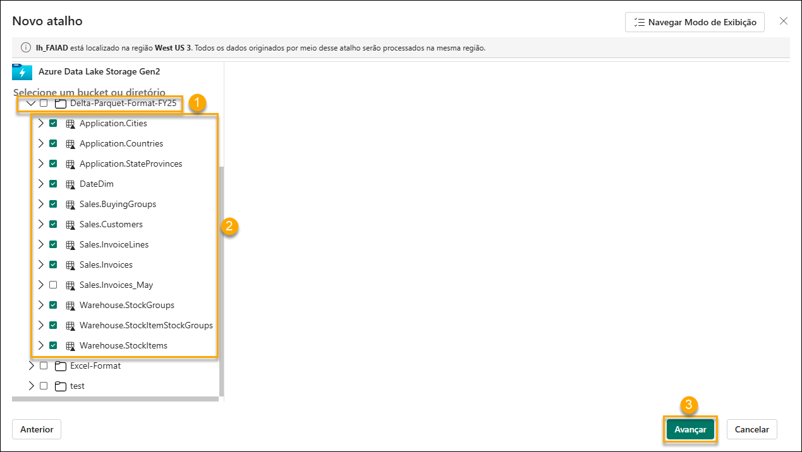

13. Você irá para a próxima caixa de diálogo para editar os nomes. Selecione o **ícone Editar (1)**, em Ações, para **Application.Cities**.

14. Renomeie **Application.Cities para Cities (2)**.

15. Marque a caixa de seleção ao lado do nome para salvar a alteração **(3)**.

    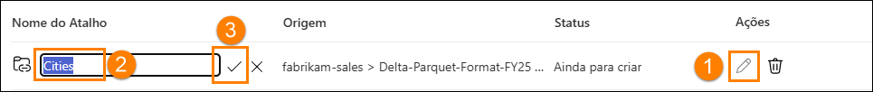

16. Da mesma forma, renomeie os nomes de atalhos como abaixo:

    1. Application.Countries para **Countries**

    2. Application.StateProvinces para **States**

    3. DateDim para **Date**

    4. Sales.BuyingGroups para **BuyingGroups**

    5. Sales.Customers para **Customers**

    6. Sales.InvoiceLines para **InvoiceLineItems**

    7. Sales.Invoices para **Invoices**

    8. Warehouse.StockGroups para **ProductGroups**

    9. Warehouse.StockItemStockGroups para **ProductItemGroup**

    10. Warehouse.StockItems para **ProductItem**

    **Observação**: confira novamente os nomes. Um erro de digitação poderá causar erros durante o laboratório.

17. Selecione **Criar** para criar o atalho.

    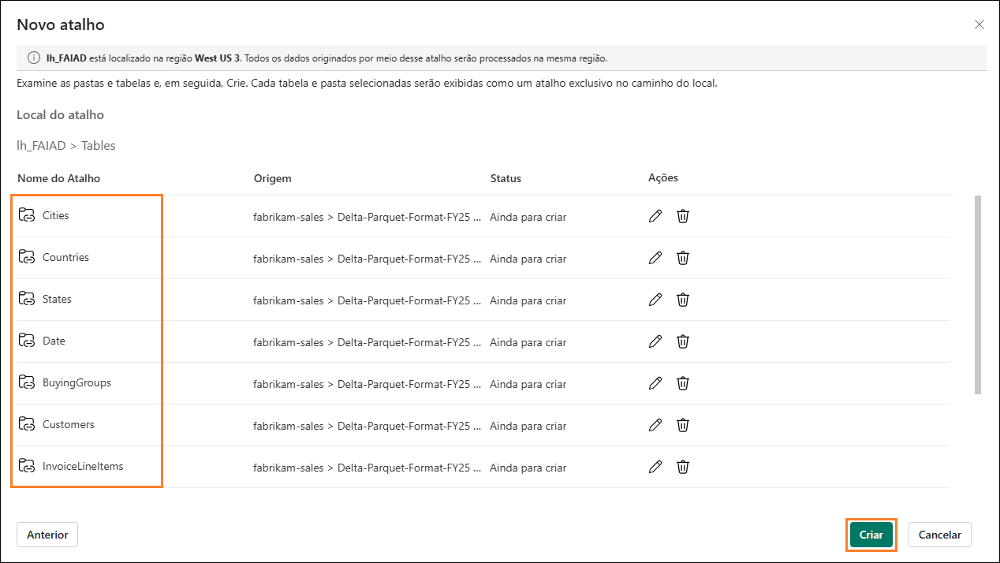

18. Observe que todos os atalhos são criados como tabelas. Selecione a tabela **BuyingGroups** e observe que podemos ver uma prévia dos dados no painel de dados.

    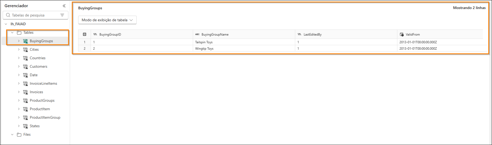

    A próxima etapa é transformar os dados, para que possamos criar um modelo semântico. Vamos criar exibições para transformar os dados.

# Transformar dados usando uma consulta Visual

### Tarefa 2: Criar exibição Geo usando uma consulta Visual

1. Nós podemos acessar o Lakehouse usando um ponto de extremidade SQL. Isso possibilita consultar os dados e criar exibições. No **canto superior direito** da tela, selecione **Lakehouse (1) -> Ponto de extremidade de análise de SQL (2)**.

    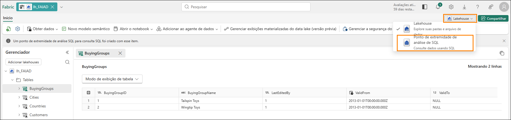

    Você será direcionado para o ponto de extremidade de análise de SQL. Agora, você tem um novo item em sua navegação superior e pode voltar para o Lakehouse selecionando aquela guia. Observe que o painel Explorer foi alterado. Agora você pode criar exibições, procedimentos armazenados, consultas e muito mais. Vamos criar uma consulta visual, pois ela fornece um low-code, semelhante à interface do Power Query. Vamos salvar o resultado como uma exibição.

    Começaremos criando uma exibição Geo. Precisamos mesclar dados das tabelas Cities, States e Countries para criar a exibição Geo.

2. No menu superior, clique no menu suspenso ao lado de **Nova consulta SQL (1)** e depois selecione **Nova consulta visual (2)**.

    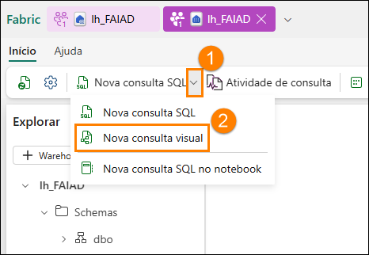

3. Para criar uma consulta, precisamos adicionar tabelas ao painel Consulta Visual. Clique nas reticências ao lado da tabela **Cities (1)** e selecione **Inserir na tela (2).**

    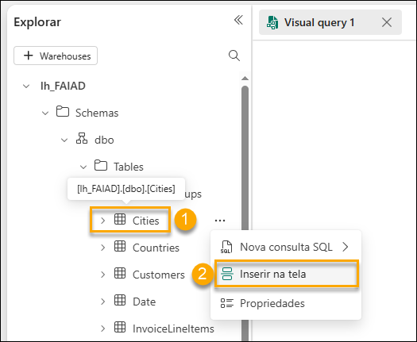

4. Repita as mesmas etapas para as tabelas **States** e **Countries**.

    Em seguida, precisamos mesclar essas consultas. O editor de consultas visuais vem com a opção de usar o Editor do Power Query. Vamos usá-lo, já que estamos familiarizados com isso por causa do Power BI.

5. **No menu do Editor de consultas visuais,** selecione o ícone **Abrir em popup** (à direita). Você irá para o Editor do Power Query.

    **Observação:** talvez seja necessário rolar para a direita ou reabrir sua guia de consulta de visual se você não vir imediatamente esse ícone

    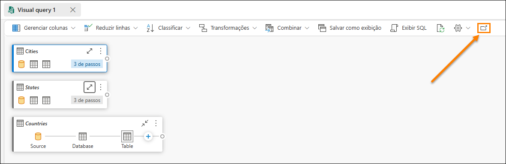

6. Com a consulta **Cities(1)** selecionada, na faixa de opções do Editor do Power Query, selecione **Página Inicial (2) -> Combinar (3) -> menu suspenso Mesclar consultas (4) -> Mesclar consultas como novas (5)**. A caixa de diálogo Mesclar consultas é aberta.

    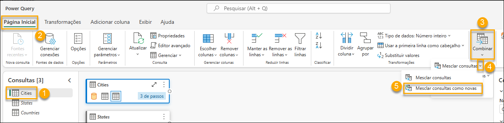

7. Na **Tabela esquerda para mesclagem**, selecione **Cities**.

8. Na **Tabela direita para mesclagem**, selecione **States**.

9. Selecione as colunas **StateProvinceID** das duas tabelas. Vamos usar esta coluna.

10. Selecione **Interna** como o **Tipo de junção**.

11. Selecione **OK.**

    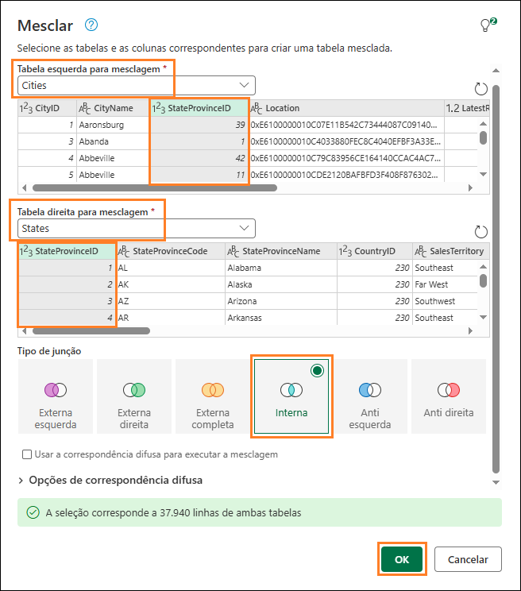

    Observe que uma nova consulta chamada **Merge** foi criada. Precisamos de algumas colunas de States.

12. Na **exibição Dados** (painel inferior), clique na **seta dupla** ao lado da coluna **States** (última coluna à direita).

13. Um painel é aberto. Verifique se somente as colunas seguintes foram selecionadas:

    1. StateProvinceCode

    2. StateProvinceName

    3. CountryID

    4. SalesTerritory

14. Selecione **OK**.

    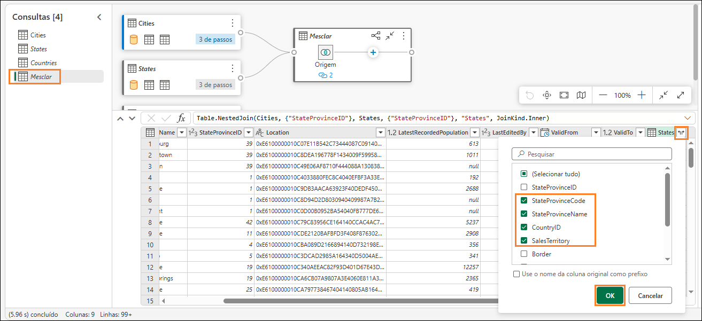

    Precisamos mesclar a consulta Countries agora.

15. Com a consulta Mesclar selecionada **(1)**, selecione **Página Inicial (2) -> Combinar (3) -> menu suspenso Mesclar consultas (4) -> Mesclar consultas (5).**

    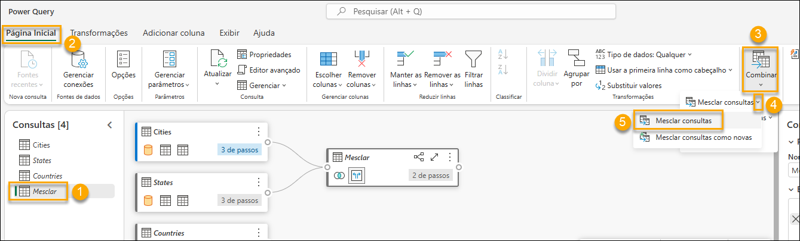

16. A caixa de diálogo Mesclar é aberta. Na **Tabela direita para mesclagem**, selecione **Countries**.

17. Selecione as colunas **CountryID** das duas tabelas. Vamos usar esta coluna.

18. Selecione **Interna** como o **Tipo de junção**.

19. Selecione **OK.**

    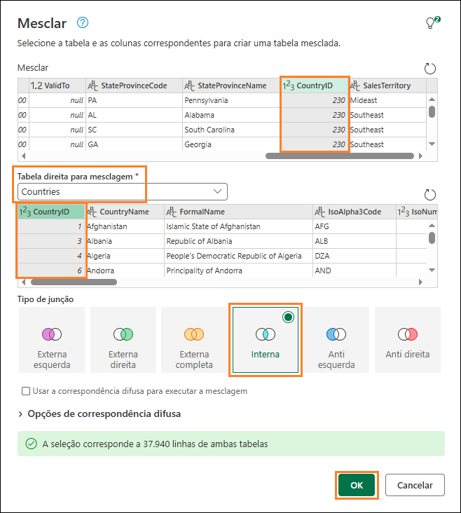

    Precisamos de algumas colunas de Countries.

20. Na **exibição Dados** (painel inferior), clique na **seta dupla** ao lado da coluna **Countries**.

21. Um painel é aberto. Verifique se somente as colunas seguintes foram selecionadas:

    1. CountryName

    2. FormalName

    3. IsoAlpha3Code

    4. IsoNumericCode

    5. CountryType

    6. Continent

    7. Region

    8. Subregion

22. Selecione **OK**.

    **Importante**: certifique-se de rolar para baixo e selecione todas as oito colunas listadas no etapa 21. A captura de tela abaixo exibe apenas as 5 primeiras colunas devido a uma limitação da interface do usuário.

    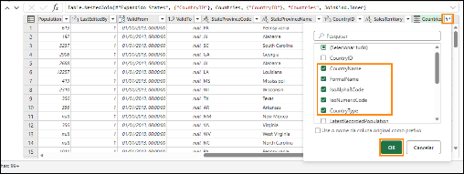

    Não precisamos de todas as colunas na tabela **Merge**. Certifique-se de selecionar apenas as colunas que precisamos.

23. Com a consulta **Merge** selecionada (1), selecione **Página Inicial (2) -> Escolher colunas (3) -> Escolher colunas (4)** na faixa de opções.

    **Observação:** se a opção Escolher colunas não estiver visível, você poderá encontrá-la em Gerenciar colunas.

    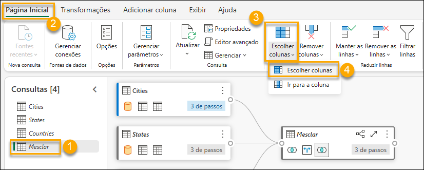

24. A caixa de diálogo Escolher colunas é aberta. **Desmarque** as colunas a seguir.

    1. StateProvinceID

    2. Location

    3. LastEditedBy

    4. ValidFrom

    5. ValidTo

    6. CountryID

25. Selecione **OK**.

    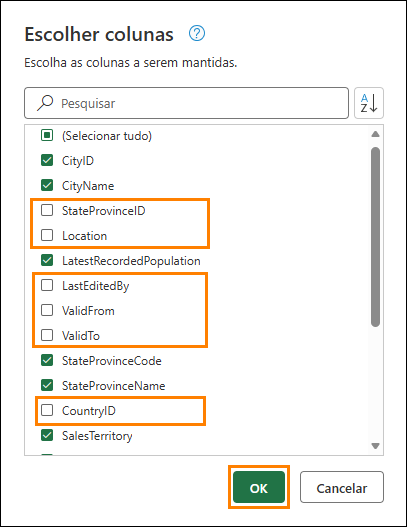

    Observe que o processo é como o Power Query. Temos todas as etapas gravadas tanto no painel Etapas Aplicadas à direita quanto na exibição visual. Vamos renomear a consulta Merge e Habilitar carga, para que os dados sejam carregados a partir dessa consulta.

26. **Clique com o botão direito do mouse** na consulta **Merge** no painel Consultas (à esquerda). Selecione **Renomear** e renomeie a consulta para **Geo**.

27. **Clique com o botão direito do mouse** na consulta **Geo** no painel Consultas (à esquerda). Selecione **Habilitar carga** para habilitar essa consulta.

28. Verifique se as consultas Cities, States e Countries estão **desabilitadas**.

29. Selecione **Salvar** encontrado no canto inferior direito do Editor do Power Query.

    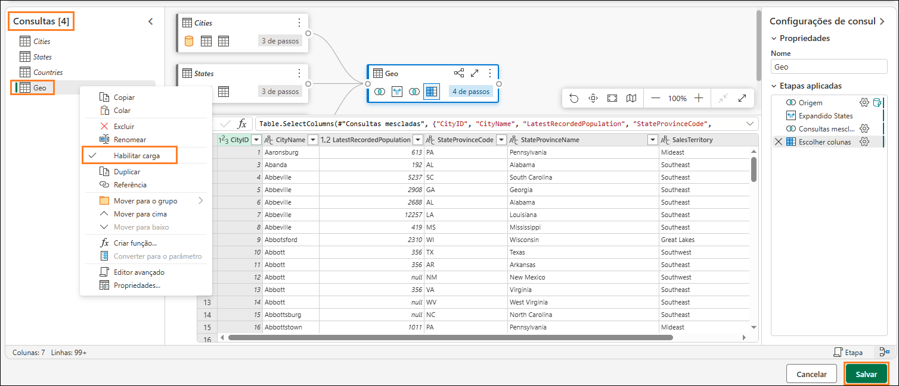

    Navegaremos até o Editor de consulta de visual. Agora vamos salvar essa consulta como uma exibição.

    **Observação**: todas as etapas que executamos usando o editor do Power Query podem ser executadas usando o editor de consulta Visual também.

30. No menu Editor de consultas Visual, selecione **Salvar como exibição**.

    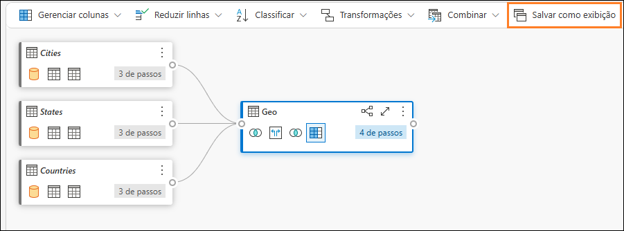

    A caixa de diálogo Salvar como exibição é aberta. Observe que a consulta SQL está disponível. Você pode revisá-la, se quiser revisar o código SQL.

31. Insira **Geo** como **Nome da exibição**.

32. Selecione **OK** para salvar a exibição.

    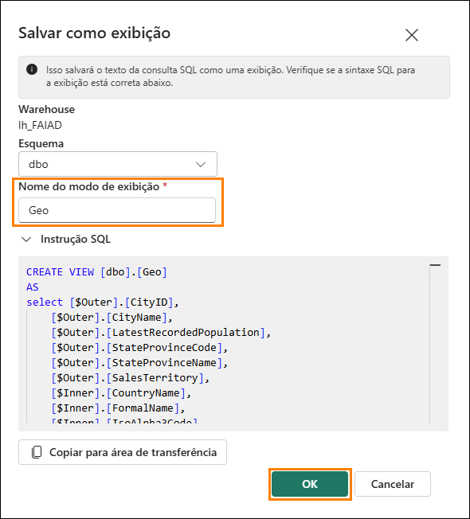

    Você receberá um alerta assim que a exibição for salva.

33. No painel Explorer (à esquerda), expanda **Views.** Temos a exibição recém-criada Geo.

    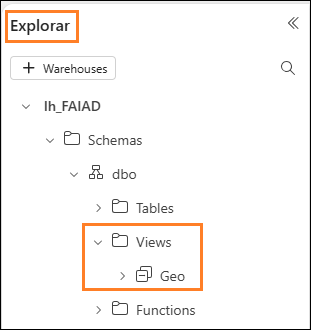

### Tarefa 3: Criar as exibições Reseller, Sales e Product usando uma consulta SQL

1. No Fabric, também podemos criar a exibição usando consultas SQL. Na faixa de opções, selecione New SQL query

    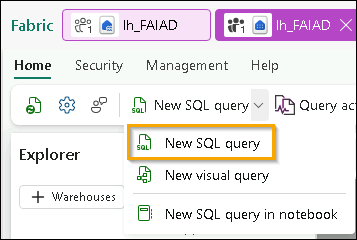

2. Aqui, podemos escrever TSQL para ajudar a criar as exibições que precisamos.

3. Cole a consulta SQL abaixo na janela de consultas. Isso criará três exibições: Reseller, Sales e Product.

    ```sql
    CREATE VIEW dbo.Reseller AS
    select [$Outer].[ResellerID] as [ResellerID],
        [$Outer].[ResellerName] as [ResellerName],
        [$Outer].[PostalCityID] as [PostalCityID],
        [$Outer].[PhoneNumber] as [PhoneNumber],
        [$Outer].[FaxNumber] as [FaxNumber],
        [$Outer].[WebsiteURL] as [WebsiteURL],
        [$Outer].[DeliveryAddressLine1] as [DeliveryAddressLine1],
        [$Outer].[DeliveryAddressLine2] as [DeliveryAddressLine2],
        [$Outer].[DeliveryPostalCode] as [DeliveryPostalCode],
        [$Outer].[PostalAddressLine1] as [PostalAddressLine1],
        [$Outer].[PostalAddressLine2] as [PostalAddressLine2],
        [$Outer].[PostalPostalCode] as [PostalPostalCode],
        [$Inner].[BuyingGroupName] as [ResellerCompany]
    from [lh_FAIAD].[dbo].[Customers] as [$Outer]
    inner join (
        select [_].[BuyingGroupID] as [BuyingGroupID2],
            [_].[BuyingGroupName] as [BuyingGroupName],
            [_].[LastEditedBy] as [LastEditedBy2],
            [_].[ValidFrom] as [ValidFrom2],
            [_].[ValidTo] as [ValidTo2]
        from [lh_FAIAD].[dbo].[BuyingGroups] as [_]
    ) as [$Inner] on ([$Outer].[BuyingGroupID] = [$Inner].[BuyingGroupID2] or [$Outer].[BuyingGroupID] is null and [$Inner].[BuyingGroupID2] is null)
    GO

    CREATE VIEW dbo.Sales AS
    select [$Outer].[InvoiceLineID] as [InvoiceLineID],
        [$Outer].[InvoiceID] as [InvoiceID],
        [$Outer].[StockItemID] as [StockItemID],
        [$Outer].[Quantity] as [Quantity],
        [$Outer].[UnitPrice] as [UnitPrice],
        [$Outer].[TaxRate] as [TaxRate],
        [$Outer].[TaxAmount] as [TaxAmount],
        [$Outer].[LineProfit] as [LineProfit],
        [$Outer].[ExtendedPrice] as [ExtendedPrice],
        [$Outer].[CustomerID] as [ResellerID],
        [$Outer].[SalespersonPersonID] as [SalespersonPersonID],
        [$Outer].[InvoiceDate] as [InvoiceDate],
        [$Outer].[t0_0] as [Sales Amount]
    from (
        select [_].[InvoiceLineID] as [InvoiceLineID],
            [_].[InvoiceID] as [InvoiceID],
            [_].[StockItemID] as [StockItemID],
            [_].[Quantity] as [Quantity],
            [_].[UnitPrice] as [UnitPrice],
            [_].[TaxRate] as [TaxRate],
            [_].[TaxAmount] as [TaxAmount],
            [_].[LineProfit] as [LineProfit],
            [_].[ExtendedPrice] as [ExtendedPrice],
            [_].[CustomerID] as [CustomerID],
            [_].[SalespersonPersonID] as [SalespersonPersonID],
            [_].[InvoiceDate] as [InvoiceDate],
            [_].[ExtendedPrice] - [_].[TaxAmount] as [t0_0]
        from (
            select [$Outer].[InvoiceLineID],
                [$Outer].[InvoiceID],
                [$Outer].[StockItemID],
                [$Outer].[Quantity],
                [$Outer].[UnitPrice],
                [$Outer].[TaxRate],
                [$Outer].[TaxAmount],
                [$Outer].[LineProfit],
                [$Outer].[ExtendedPrice],
                [$Inner].[CustomerID],
                [$Inner].[SalespersonPersonID],
                [$Inner].[InvoiceDate]
            from [lh_FAIAD].[dbo].[InvoiceLineItems] as [$Outer]
            inner join (
                select [_].[InvoiceID] as [InvoiceID2],
                    [_].[CustomerID] as [CustomerID],
                    [_].[BillToResellerID] as [BillToResellerID],
                    [_].[OrderID] as [OrderID],
                    [_].[DeliveryMethodID] as [DeliveryMethodID],
                    [_].[ContactPersonID] as [ContactPersonID],
                    [_].[AccountsPersonID] as [AccountsPersonID],
                    [_].[SalespersonPersonID] as [SalespersonPersonID],
                    [_].[PackedByPersonID] as [PackedByPersonID],
                    [_].[InvoiceDate] as [InvoiceDate],
                    [_].[CustomerPurchaseOrderNumber] as [CustomerPurchaseOrderNumber],
                    [_].[IsCreditNote] as [IsCreditNote],
                    [_].[CreditNoteReason] as [CreditNoteReason],
                    [_].[Comments] as [Comments],
                    [_].[DeliveryInstructions] as [DeliveryInstructions],
                    [_].[InternalComments] as [InternalComments],
                    [_].[TotalDryItems] as [TotalDryItems],
                    [_].[TotalChillerItems] as [TotalChillerItems],
                    [_].[DeliveryRun] as [DeliveryRun],
                    [_].[RunPosition] as [RunPosition],
                    [_].[ReturnedDeliveryData] as [ReturnedDeliveryData],
                    [_].[ConfirmedDeliveryTime] as [ConfirmedDeliveryTime],
                    [_].[ConfirmedReceivedBy] as [ConfirmedReceivedBy],
                    [_].[LastEditedBy] as [LastEditedBy2],
                    [_].[LastEditedWhen] as [LastEditedWhen2]
                from [lh_FAIAD].[dbo].[Invoices] as [_]
            ) as [$Inner] on ([$Outer].[InvoiceID] = [$Inner].[InvoiceID2] or [$Outer].[InvoiceID] is null and [$Inner].[InvoiceID2] is null)
        ) as [_]
    ) as [$Outer]
    where exists (
        select 1
        from (
            select [ResellerID]
            from [lh_FAIAD].[dbo].[Reseller] as [$Table]
        ) as [$Inner]
        where [$Outer].[CustomerID] = [$Inner].[ResellerID] or [$Outer].[CustomerID] is null and [$Inner].[ResellerID] is null
    )
    GO

    CREATE VIEW dbo.Product AS
    select [$Outer].[StockItemID],
        [$Outer].[StockItemName],
        [$Outer].[SupplierID],
        [$Outer].[Size],
        [$Outer].[IsChillerStock],
        [$Outer].[TaxRate],
        [$Outer].[UnitPrice],
        [$Outer].[RecommendedRetailPrice],
        [$Outer].[TypicalWeightPerUnit],
        [$Inner].[StockGroupName]
    from (
        select [$Outer].[StockItemID],
            [$Outer].[StockItemName],
            [$Outer].[SupplierID],
            [$Outer].[ColorID],
            [$Outer].[UnitPackageID],
            [$Outer].[OuterPackageID],
            [$Outer].[Brand],
            [$Outer].[Size],
            [$Outer].[LeadTimeDays],
            [$Outer].[QuantityPerOuter],
            [$Outer].[IsChillerStock],
            [$Outer].[Barcode],
            [$Outer].[TaxRate],
            [$Outer].[UnitPrice],
            [$Outer].[RecommendedRetailPrice],
            [$Outer].[TypicalWeightPerUnit],
            [$Outer].[MarketingComments],
            [$Outer].[InternalComments],
            [$Outer].[Photo],
            [$Outer].[CustomFields],
            [$Outer].[Tags],
            [$Outer].[SearchDetails],
            [$Outer].[LastEditedBy],
            [$Outer].[ValidFrom],
            [$Outer].[ValidTo],
            [$Inner].[StockGroupID]
        from [lh_FAIAD].[dbo].[ProductItem] as [$Outer]
        left outer join (
            select [_].[StockItemStockGroupID] as [StockItemStockGroupID],
                [_].[StockItemID] as [StockItemID2],
                [_].[StockGroupID] as [StockGroupID],
                [_].[LastEditedBy] as [LastEditedBy2],
                [_].[LastEditedWhen] as [LastEditedWhen]
            from [lh_FAIAD].[dbo].[ProductItemGroup] as [_]
        ) as [$Inner] on ([$Outer].[StockItemID] = [$Inner].[StockItemID2] or [$Outer].[StockItemID] is null and [$Inner].[StockItemID2] is null)
    ) as [$Outer]
    left outer join (
        select [_].[StockGroupID] as [StockGroupID2],
            [_].[StockGroupName] as [StockGroupName],
            [_].[LastEditedBy] as [LastEditedBy2],
            [_].[ValidFrom] as [ValidFrom2],
            [_].[ValidTo] as [ValidTo2]
        from [lh_FAIAD].[dbo].[ProductGroups] as [_]
    ) as [$Inner] on ([$Outer].[StockGroupID] = [$Inner].[StockGroupID2] or [$Outer].[StockGroupID] is null and [$Inner].[StockGroupID2] is null)
    GO
    ```
    
4. Depois de colá-la, selecione **Run**.

    

5. No painel Explorer (à esquerda), expanda Views. Temos as exibições recém-criadas com os dados prontos para uso.

    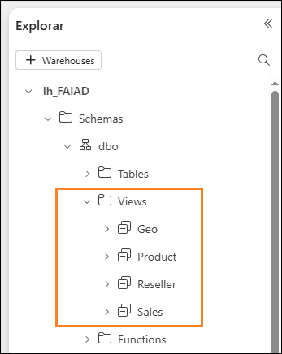

    Transformamos os dados da fonte de dados ADLS Gen2. Neste laboratório, aprendemos a criar atalhos e exploramos várias opções para usar modos de exibição de consulta visual para transformar dados.

    No próximo laboratório, aprenderemos a usar o Fluxo de Dados Gen2 e criar o Atalho para outro Lakehouse.

# Referências

O Fabric Analyst in a Day (FAIAD) apresenta algumas das principais funções disponíveis no Microsoft Fabric. No menu do serviço, a seção Ajuda (?) tem links para ótimos recursos.

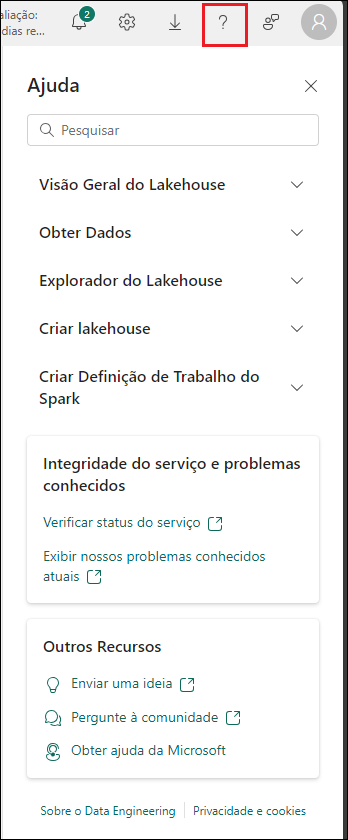

Veja aqui mais alguns recursos que ajudarão você com as próximas etapas do Microsoft Fabric.

- Veja a postagem do blog para ler o [anúncio completo de GA do Microsoft Fabric](https://aka.ms/Fabric-Hero-Blog-Ignite23)

- Explore o Fabric por meio do [Tour Guiado](https://aka.ms/Fabric-GuidedTour)

- Inscreva-se para a [avaliação gratuita do Microsoft Fabric](https://aka.ms/try-fabric)

- Visite o [site do Microsoft Fabric](https://aka.ms/microsoft-fabric)

- Aprenda novas habilidades explorando os [módulos de Aprendizagem do Fabric](https://aka.ms/learn-fabric)

- Explore a [documentação técnica do Fabric](https://aka.ms/fabric-docs)

- Leia o [livro eletrônico gratuito sobre como começar a usar o Fabric](https://aka.ms/fabric-get-started-ebook)

- Participe da [comunidade do Fabric](https://aka.ms/fabric-community) para postar suas perguntas, compartilhar seus comentários e aprender com outras pessoas

Leia os blogs de comunicados de experiências do Fabric em mais detalhes:

- [Experiência do Data Factory no blog do Fabric](https://aka.ms/Fabric-Data-Factory-Blog)

- [Experiência do Synapse Data Engineering no blog do Fabric](https://aka.ms/Fabric-DE-Blog)

- [Experiência do Synapse Data Science no blog do Fabric](https://aka.ms/Fabric-DS-Blog)

- [Experiência do Synapse Data Warehousing no blog do Fabric](https://aka.ms/Fabric-DW-Blog)

- [Experiência do Synapse Real-Time Analytics no blog do Fabric](https://aka.ms/Fabric-RTA-Blog)

- [Blog de comunicado do Power BI](https://aka.ms/Fabric-PBI-Blog)

- [Experiência do Data Activator no blog do Fabric](https://aka.ms/Fabric-DA-Blog)

- [Administração e governança no blog do Fabric](https://aka.ms/Fabric-Admin-Gov-Blog)

- [OneLake no blog do Fabric](https://aka.ms/Fabric-OneLake-Blog)

- [Blog de integração do Dataverse e Microsoft Fabric](https://aka.ms/Dataverse-Fabric-Blog)

© 2026 Microsoft Corporation. Todos os direitos reservados.

Ao usar esta demonstração/este laboratório, você concorda com os seguintes termos:

A tecnologia/funcionalidade descrita nesta demonstração/neste laboratório é fornecida pela Microsoft Corporation para obter seus comentários e oferecer uma experiência de aprendizado. Você pode usar a demonstração/o laboratório somente para avaliar tais funcionalidades e recursos de tecnologia e fornecer comentários à Microsoft. Você não pode usá-los para nenhuma outra finalidade. Você não pode modificar, copiar, distribuir, transmitir, exibir, executar, reproduzir, publicar, licenciar, criar obras derivadas, transferir nem vender esta demonstração/este laboratório ou qualquer parte deles.

A CÓPIA OU A REPRODUÇÃO DA DEMONSTRAÇÃO/DO LABORATÓRIO (OU DE QUALQUER PARTE DELES) EM QUALQUER OUTRO SERVIDOR OU LOCAL PARA REPRODUÇÃO OU REDISTRIBUIÇÃO ADICIONAL É EXPRESSAMENTE PROIBIDA.

ESTA DEMONSTRAÇÃO/ESTE LABORATÓRIO FORNECE DETERMINADOS RECURSOS E FUNCIONALIDADES DE PRODUTO/TECNOLOGIA DE SOFTWARE, INCLUINDO NOVOS RECURSOS E CONCEITOS POTENCIAIS, EM UM AMBIENTE SIMULADO SEM CONFIGURAÇÃO NEM INSTALAÇÃO COMPLEXA PARA A FINALIDADE DESCRITA ACIMA. A TECNOLOGIA/OS CONCEITOS REPRESENTADOS NESTA DEMONSTRAÇÃO/NESTE LABORATÓRIO PODEM NÃO REPRESENTAR A FUNCIONALIDADE COMPLETA DOS RECURSOS E PODEM NÃO FUNCIONAR DA MESMA MANEIRA QUE UMA VERSÃO FINAL. ALÉM DISSO, PODEMOS NÃO LANÇAR UMA VERSÃO FINAL DE TAIS RECURSOS OU CONCEITOS. SUA EXPERIÊNCIA COM O USO DE TAIS RECURSOS E FUNCIONALIDADES EM UM AMBIENTE FÍSICO TAMBÉM PODE SER DIFERENTE.

**COMENTÁRIOS.** Caso você forneça comentários sobre os recursos de tecnologia, as funcionalidades e/ou os conceitos descritos nesta demonstração/neste laboratório à Microsoft, você concederá à Microsoft, sem encargos, o direito de usar, compartilhar e comercializar seus comentários de qualquer forma e para qualquer finalidade. Você também concede a terceiros, sem encargos, quaisquer direitos de patente necessários para que seus produtos, suas tecnologias e seus serviços usem ou interajam com partes específicas de um software ou um serviço da Microsoft que inclua os comentários. Você não fornecerá comentários que estejam sujeitos a uma licença que exija que a Microsoft licencie seu software ou sua documentação para terceiros em virtude da inclusão de seus comentários neles. Esses direitos continuarão em vigor após o término do contrato.

POR MEIO DESTE, A MICROSOFT CORPORATION SE ISENTA DE TODAS AS GARANTIAS E CONDIÇÕES REFERENTES À DEMONSTRAÇÃO/AO LABORATÓRIO, INCLUINDO TODAS AS GARANTIAS E CONDIÇÕES DE COMERCIALIZAÇÃO, SEJAM ELAS EXPRESSAS, IMPLÍCITAS OU ESTATUTÁRIAS, E DE ADEQUAÇÃO A UMA FINALIDADE ESPECÍFICA, TÍTULO E NÃO VIOLAÇÃO. A MICROSOFT NÃO DECLARA NEM GARANTE A PRECISÃO DOS RESULTADOS DERIVADOS DO USO DA DEMONSTRAÇÃO/DO LABORATÓRIO NEM A ADEQUAÇÃO DAS INFORMAÇÕES CONTIDAS NA DEMONSTRAÇÃO/NO LABORATÓRIO A QUALQUER FINALIDADE.

**AVISO DE ISENÇÃO DE RESPONSABILIDADE**

Esta demonstração/este laboratório contém apenas uma parte dos novos recursos e aprimoramentos do Microsoft Power BI. Alguns dos recursos podem ser alterados em versões futuras do produto. Nesta demonstração/neste laboratório, você aprenderá sobre alguns dos novos recursos, mas não todos.
