# Microsoft Fabric - Fabric Analyst in a Day

## Contenido

- Introducción
- Credenciales de laboratorio:
- Solucionar problemas de inicio de sesión de Snowflake
- Vínculos a laboratorios:
- Importar una plantilla de flujo de datos:
- Aspectos que hay que tener en cuenta antes de importar desde una plantilla de flujo de datos
- Cómo importar una plantilla de flujo de datos
- Crear vistas mediante T-SQL
- Demostración del ML de previsión
- Requisito
- Cómo crear un bloc de notas
- Agregar el Lakehouse al bloc de notas
- Instalar la biblioteca Python en línea
- Ejecutar código para crear previsiones
- Initialize Spark session
- Load data from your specific Spark table
- Aggregate data to monthly level
- Convert to Pandas DataFrame and prepare for Prophet
- Fit the Prophet model
- Create a DataFrame for future predictions (e.g., next 12 months)
- Forecast
- Plotting the forecast
- Demostración de Data Activator
- Requisito
- Escenario
- Agregar medida de % de variación de ventas
- Crear un objeto visual de tabla
- Crear Activator
- Información general de Activator
- Enviar un mensaje de alerta
- Demostración de Semantic Link
- Requisito
- Escenario
- Analizador de procedimientos recomendados
- Analizador de memoria

Captura de pantalla para seleccionar Configuración del área de trabajo

# **Introducción**

Este documento proporciona una guía para las siguientes características:

- Credenciales de laboratorio

- Cómo importar una plantilla de flujo de datos

- Pasos para la demostración del ML de previsión

- Pasos para la nueva demostración de Data Activator

- Pasos para la nueva demostración de Data Mirroring

**Descargo de responsabilidad:** tenga en cuenta que, dado que el producto cambia a diario, algunas capturas de pantalla pueden estar desactualizadas. Trabajaremos para solucionarlas en la próxima actualización.

# **Credenciales de laboratorio:**

Si alguno de los asistentes elige completar las prácticas de laboratorio en un entorno alternativo, estas son las credenciales que quizás deba compartir.

Los asistentes necesitarán el nombre de usuario y la contraseña asociados con su cuenta del laboratorio para conectarse a Dataverse y SharePoint.

- **Nombre de usuario:** TE_SNOWFLAKE1

- **Contraseña:** 8UpfRpExVDXv2AC1

- **Token de SAS:** ?sv=2023-01-03&ss=btqf&srt=sco&st=2025-06-30T10%3A15%3A46Z&se=2026-06-30T10%3A15%3A00Z&sp=rl&sig=hVeyxY4F72YVH3X%2BlnIvVTg8M%2FwZgLIhDzBgHlv
1580%3D

**Nota:** Si tiene algún problema para conectarse a Snowflake con las credenciales de los detalles del entorno, utilice las credenciales que se proporcionan a continuación.

- **Nombre de usuario de Snowflake:** SNOWFLAKE_BACKUP

- **Contraseña de Snowflake:** 8UpfRpExVDXv2AC1

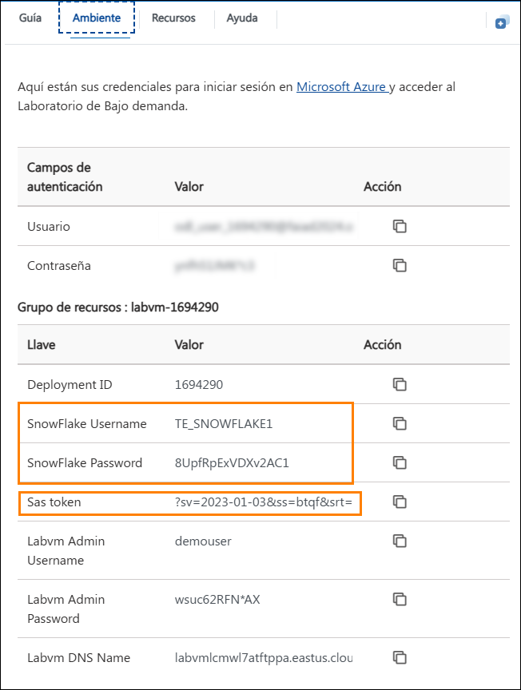

### Solucionar problemas de inicio de sesión de Snowflake

Si los asistentes tienen problemas para iniciar sesión en Snowflake, deben seguir los pasos que se indican a continuación. Esto proporcionará una descripción detallada del error.

1. Abra una nueva ventana del explorador. Vaya a **dlhdzca-bab11165.snowflakecomputing.com**. Este es el servidor Snowflake que estamos usando.

2. Especifique las **credenciales**. Si se produce un error, obtendrá una descripción detallada del mismo, como se muestra en la captura de pantalla siguiente.

    

3. Si el error persiste, tenemos **datos de Snowflake** **disponibles en Azure Data Lake** y tenemos una plantilla de flujo de datos (**df_Supplier_ADLSGen2.pqt**) ubicada en **C:\FAIAD\Solutions**. Puede ayudar a los asistentes a seguir los pasos que se indican a continuación para importar esta plantilla.

# **Vínculos a laboratorios:**

- [Portugués (Brasil)](https://experience.cloudlabs.ai/#/labguidepreview/aab00958-5596-4175-9bc9-39ece2586314)

- [Chino](https://experience.cloudlabs.ai/#/labguidepreview/3c8f94bd-6936-4a18-a1e3-8b606402531e)

- [Inglés](https://experience.cloudlabs.ai/#/labguidepreview/b63b312d-0c58-4fd0-bee1-05a94affa927)

- [Francés](https://experience.cloudlabs.ai/#/labguidepreview/e9c3e273-1dd1-4db8-80e3-aedfe41a1e9b)

- [Alemán](https://experience.cloudlabs.ai/#/labguidepreview/e697a208-a982-4c6d-b32b-7e83d39c7186)

- [Italiano](https://experience.cloudlabs.ai/#/labguidepreview/b984b3dd-928d-492e-be2c-de1d49dd2640)

- [Japonés](https://experience.cloudlabs.ai/#/labguidepreview/bb29b27d-7a77-4e4e-9c0d-a12a86397a1f)

- [Coreano](https://experience.cloudlabs.ai/#/labguidepreview/544a6b13-8546-454d-8270-3540fe6a9566)

- [Español](https://experience.cloudlabs.ai/#/labguidepreview/16998c52-2637-4c65-b691-0fa5ac9091d7)

# **Importar una plantilla de flujo de datos:**

Como instructor o instructora, puede permitir que los asistentes tengan la opción de importar plantillas de flujo de datos. Estos son los pasos para importar una plantilla.

### Aspectos que hay que tener en cuenta antes de importar desde una plantilla de flujo de datos

1. Si el o la estudiante **ya ha creado las tablas en el almacén de lago de datos**, primero tiene que eliminar la tabla del almacén de lago de datos antes de cargar el PQT (de lo contrario tendrá que cambiar el nombre de la tabla en el nuevo flujo de datos y dar cuenta de ello más tarde en los laboratorios).

2. El o la estudiante debe configurar los destinos de las tablas relevantes: se debe desactivar la casilla "**Habilitar el almacenamiento provisional**", pero es mejor volver a comprobarlo ya que en algunos casos seguía marcada.

3. Las tablas que requieren destinos en df_Supplier_Snowflake son:

    1. Supplier

    2. PO

4. La tabla que requiere destino en df_People_SharePoint es:

    1. People

### Cómo importar una plantilla de flujo de datos

1. Vaya al **área de trabajo de Fabric que creó en el Laboratorio 2, Tarea 2,** llamada **FAIAD_<username>.**

2. En el menú superior, seleccione **Nuevo elemento -> Flujo de datos Gen2**.

    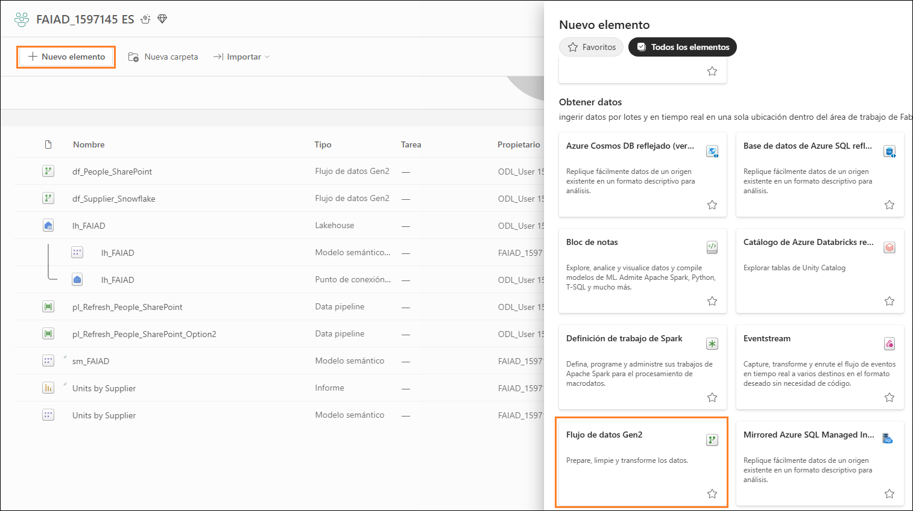

3. Se abre la ventana de Power Query. En el panel central, seleccione **Importar desde una plantilla de Power Query**.

    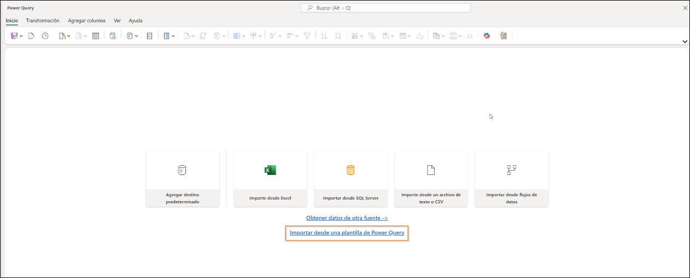

4. Vaya a la carpeta **C:\FAIAD\Solutions** en el entorno del laboratorio.

5. Seleccione el flujo de datos que desea importar. Aquí vamos a importar **df_People_SharePoint.pqt**.

6. Seleccione **Abrir**.

    Una vez importada, observe la consulta y se importan todos los pasos de la misma. Sin embargo, hay que configurar la conexión. Además, es necesario configurar el destino de los datos. Siga las instrucciones del laboratorio para completar estos pasos.

    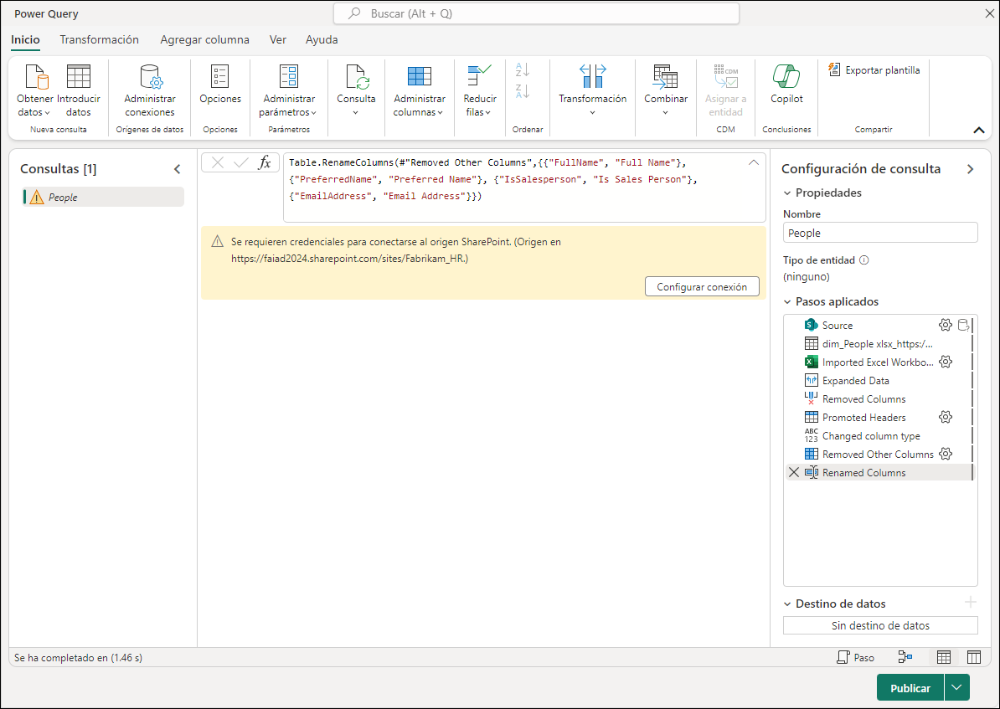

# **Crear vistas mediante T-SQL**

Como instructor o instructora, puede elegir permitir que los asistentes creen vistas mediante T-SQL. T-SQL para las vistas Geo, Product, Reseller y Sales está disponible en la carpeta **Solutions**. Abra una nueva ventana de consulta SQL en el almacén de lago de datos y ejecute estas instrucciones T-SQL. Si es necesario eliminar una vista, el archivo Remove-View está ahí para ejecutarse también en la carpeta **Solutions**.

**Nota:** Estas son instrucciones CREATE. Cualquier vista existente con el mismo nombre debe eliminarse antes de ejecutar estas instrucciones.

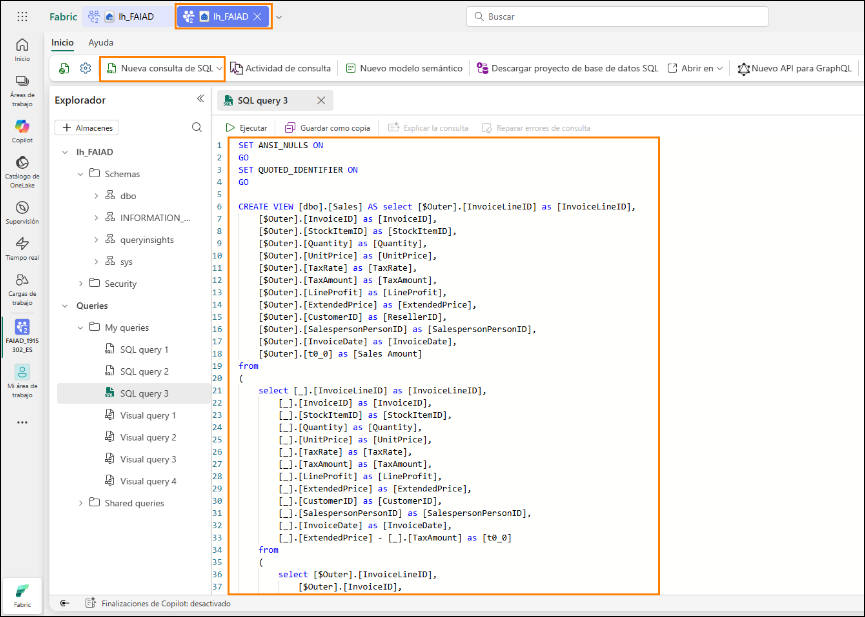

# **Demostración del ML de previsión**

### Requisito

Es necesario que el instructor o la instructora complete los laboratorios 1 a 6 y que todos los datos se ingieran antes de avanzar a los siguientes pasos.

Para la demostración, necesita instalar una biblioteca de Python llamada **prophet.** Se puede instalar en línea en el portátil o se puede crear un entorno. En esta demostración usaremos el modo en línea.

### Cómo crear un bloc de notas

1. Vaya al **área de trabajo de Fabric que creó en el Laboratorio 2, Tarea 2,** llamada **FAIAD_<username>**.

2. En el menú, seleccione **+ Nuevo elemento** **->** Utilice el cuadro de búsqueda para **buscar Notebook ->** Elija **Notebook**.

    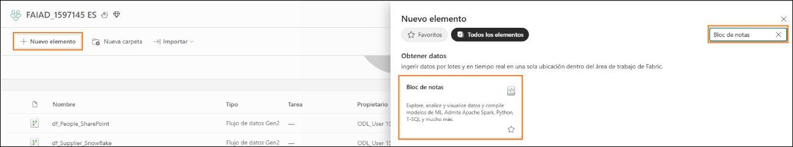

3. Proporcione una **breve descripción** del diseño: bloc de notas, idioma, entorno, cómo crear una nueva celda, etc.

### Agregar el Lakehouse al bloc de notas

Necesitamos asociar un Lakehouse predeterminado a un bloc de notas.

1. En el panel del Explorador seleccione la pestaña **Elementos de datos.**

    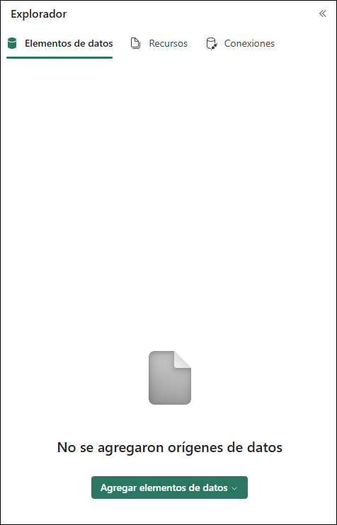

2. Seleccione **Agregar elementos de datos** en el panel del Explorador.

3. Seleccione **Desde el catálogo de OneLake**.

    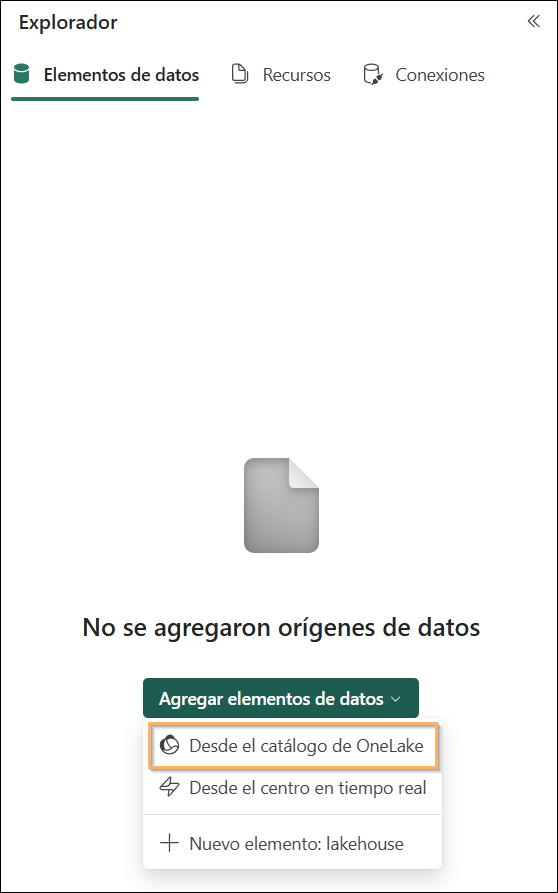

4. Se abre el cuadro de diálogo del centro de datos de OneLake. Seleccione el Lakehouse **lh_FAIAD**.

5. Seleccione **Agregar**. Observe que el Lakehouse está asociado con el bloc de notas.

    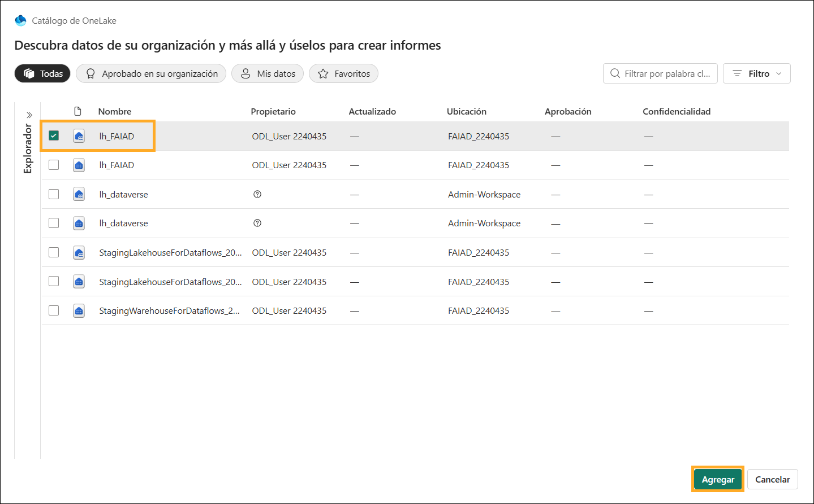

### Instalar la biblioteca Python en línea

Para la demostración, necesita instalar una biblioteca de Python llamada **prophet.** Se instala en línea.

1. Para **instalar la biblioteca python** introduzca el siguiente código en la celda.

    !pip install prophet

2. Seleccione el botón **Reproducir** al lado de la celda para ejecutar el código.

    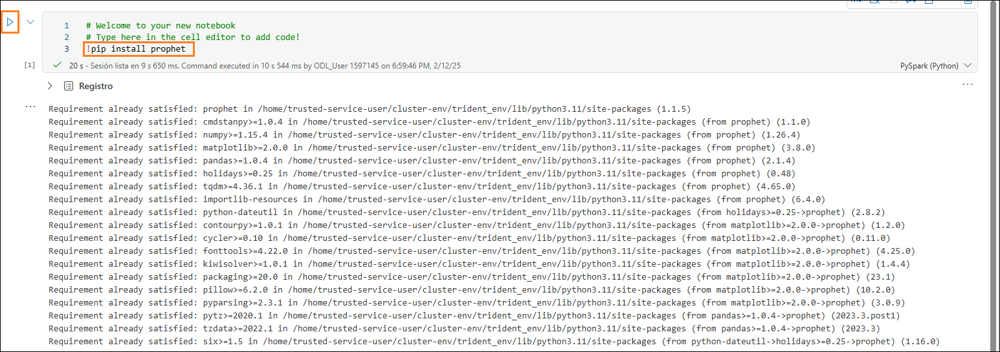

### Ejecutar código para crear previsiones

1. Cree **una nueva celda**.

2. Introduzca el siguiente **código**:

    from pyspark.sql import SparkSession

    from pyspark.sql.functions import month, year, col

    from prophet import Prophet

    import pandas as pd

    # Initialize Spark session

    spark = SparkSession.builder.appName("Prophet Forecasting").getOrCreate()

    # Load data from your specific Spark table

    df = spark.sql("SELECT \* FROM lh_FAIAD.Invoices i JOIN lh_FAIAD.InvoiceLineItems il ON i.InvoiceID = il.InvoiceID")

    # Aggregate data to monthly level

    monthly_df = df.withColumn("Month", month("InvoiceDate"))

    .withColumn("Year", year("InvoiceDate"))

    .groupBy("Year", "Month")

    .sum("Quantity")

    .orderBy("Year", "Month")

    # Convert to Pandas DataFrame and prepare for Prophet

    pandas_df = monthly_df.toPandas()

    pandas_df['ds'] = pd.to_datetime(pandas_df[['Year', 'Month']].assign(DAY=1))

    pandas_df['y'] = pandas_df['sum(Quantity)']

    # Fit the Prophet model

    model = Prophet(yearly_seasonality=True, weekly_seasonality=False,daily_seasonality=False)

    model.fit(pandas_df[['ds', 'y']])

    # Create a DataFrame for future predictions (e.g., next 12 months)

    future = model.make_future_dataframe(periods=12, freq='M')

    # Forecast

    forecast = model.predict(future)

    # Plotting the forecast

    model.plot(forecast)

    model.plot_components(forecast)

3. Explique cada paso del **código** (se proporcionan sugerencias como comentarios).

4. Seleccione el botón **Reproducir** al lado de la celda para ejecutar el código.

    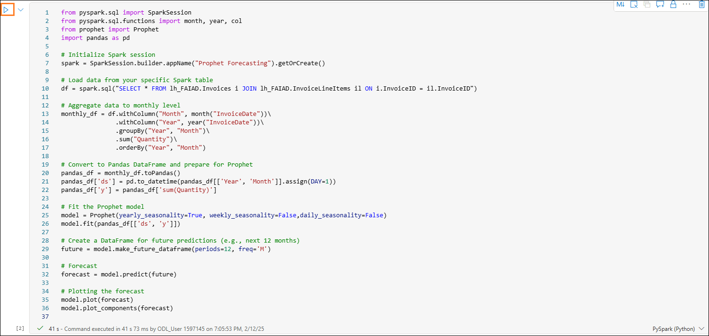

    Guíe a los asistentes a través de los tres gráficos que se crean (a continuación). Tenemos datos reales hasta mayo de 2023 y estamos haciendo una previsión para 12 meses.

    Observe que el **primer gráfico** elimina la estacionalidad y las previsiones hasta abril de 2025.

    El **segundo gráfico** elimina la tendencia y agrega estacionalidad a las previsiones hasta abril de 2025.

    

    El **tercer gráfico** crea previsiones mediante la tendencia y la estacionalidad. Este gráfico también proporciona el límite superior e inferior.

    

5. Cree **una nueva celda**.

6. Agregue el **código** siguiente a la celda:

    display(forecast)

    #write forecast data to a table

    spark.createDataFrame(forecast).write.saveAsTable("Sales_Forecast", mode="overwrite")

7. Seleccione el botón **Reproducir** para ejecutar la celda.

    

8. Guíe a los asistentes a través de los **datos que se muestran**.

9. Muestre a los usuarios que se ha creado una nueva tabla en el Lakehouse: **sales_forecast**.

    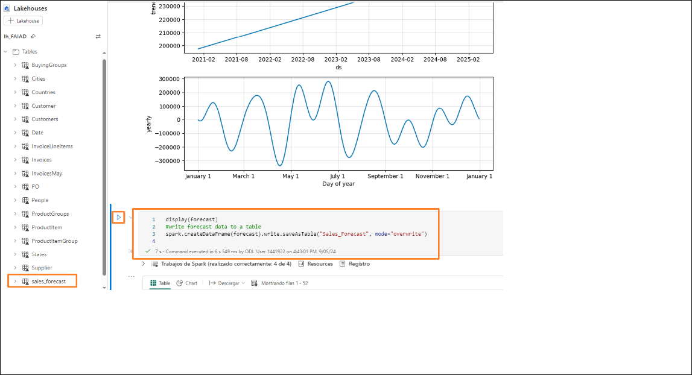

10. **Consulte** la tabla y muestre a los usuarios el contenido de la misma.

# **Demostración de Data Activator**

### Requisito

Es necesario que el instructor o la instructora complete los laboratorios 1 a 7 antes de avanzar a los siguientes pasos.

Los siguientes vínculos tendrán las actualizaciones más recientes.

<https://learn.microsoft.com/en-us/fabric/data-activator/data-activator-introduction>

<https://learn.microsoft.com/en-us/fabric/data-activator/data-activator-get-data-power-bi>

### Escenario

Sabemos que hay una variación en las ventas por nombre de grupo de acciones cada mes. Esto se debe a la estacionalidad. Sin embargo, nos gustaría recibir una notificación si el % de variación es inferior al 20 %. Esto ayudará a identificar y resolver dichos escenarios.

Para solucionar esto, vamos a utilizar Data Activator. Activaremos una alerta cuando el % de variación de ventas de cualquiera de los nombres del grupo de acciones caiga por debajo del 20 %. Vamos a simular esto para mayo de 2024. Como el desencadenador de Data Activator se ejecuta cada hora, en lugar de esperar una hora, ejecutaremos una alerta de prueba.

Para demostrar este escenario, vamos a:

- Agregar la medida de % de variación de ventas al conjunto de datos.

- Agregar una tabla visual que muestre el porcentaje de variación de ventas por nombre de grupo de acciones. Filtre esta tabla hasta mayo de 2024.

- Crear una alerta utilizando el objeto visual de tabla.

- Examinar Activator y cree una alerta de prueba.

### Agregar medida de % de variación de ventas

Vamos a agregar una nueva medida al modelo semántico sm_FAIAD.

1. Vaya al modelo semántico **sm_FAIAD**.

2. Seleccione la tabla **Sales**.

3. En el menú superior, seleccione **Inicio -> Nueva medida**.

4. Cree la **medida** siguiente. Esto proporcionará un % de variación en comparación con el mes anterior.

    Sales Var % =

5. var priormth = CALCULATE([Sales], PREVIOUSMONTH('Date'[Date]))

6. RETURN DIVIDE([Sales]-priormth, priormth)

7. **Aplique formato** a la medida como **Porcentaje**.

    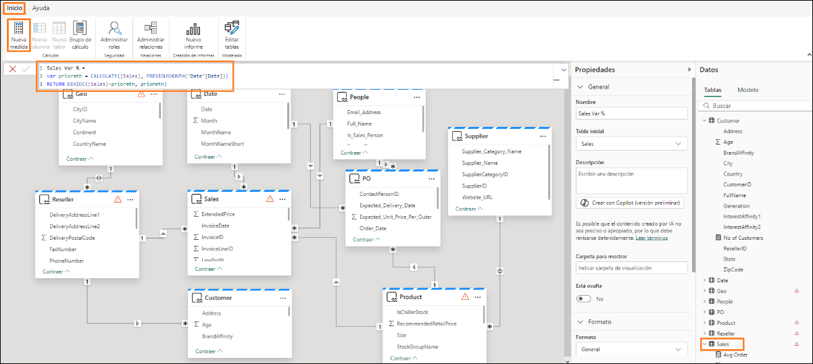

### Crear un objeto visual de tabla

Vamos a editar rpt_Sales_report y agregaremos un nuevo objeto visual de tabla. El objeto visual de tabla mostrará el % de variación de ventas por nombre de grupo de acciones para mayo de 2023.

1. Vaya a **rpt_Sales_report** (creado en el laboratorio 7).

2. En el menú superior, seleccione **Editar**.

3. En la vista Datos, expanda la tabla **Product**.

4. Seleccione el campo **StockGroupName**. Se crea un objeto visual de tabla.

5. Expanda la tabla **Sales**.

6. Seleccione **Sales Var %**. Observe que no hay datos en el objeto visual de tabla. Esto se debe a que Sales Var % necesita un nombre de mes para calcularlos.

    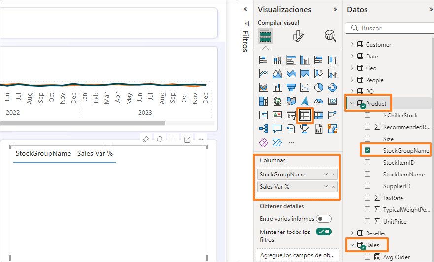

7. **Expanda la sección** **Filtro** (si está contraída).

8. Con el objeto visual de tabla resaltado, desde la sección **Datos** expanda la tabla **Date**.

9. Arrastre el campo **Year** a Filtros en esta sección visual.

10. Para el campo **Year**, seleccione **Filtrado básico** del menú desplegable **Tipo de filtro**.

11. Seleccione **2024**.

    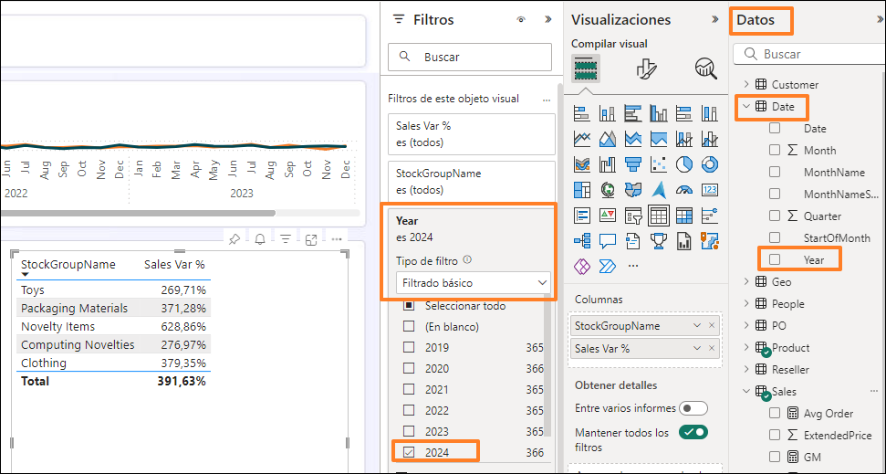

12. Arrastre el campo **MonthNameShort** a Filtros en esta sección visual.

13. Seleccione **May.**

14. Seleccione **Archivo -> Guardar** para guardar las actualizaciones en el informe.

    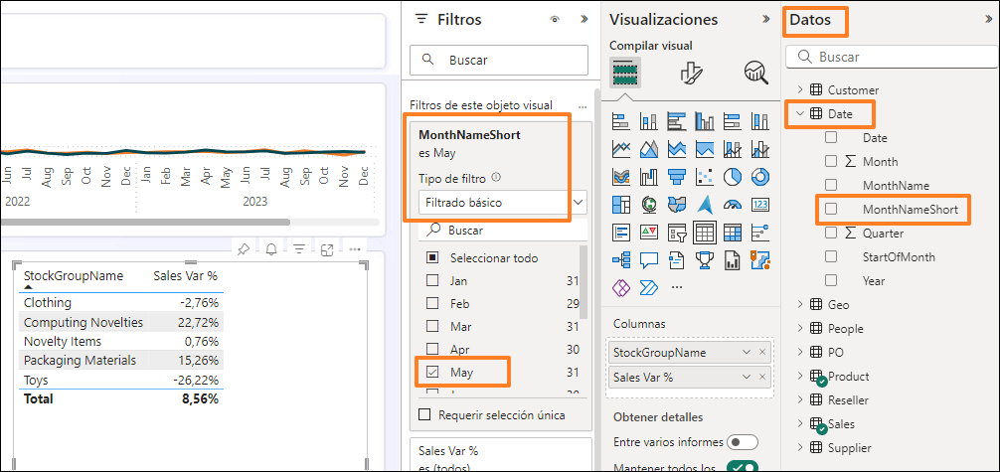

### Crear Activator

Crearemos un Activator que enviará una alerta si el % de variación de ventas para cualquiera de Stock_Group_Name es inferior al 20 %. Aviso El nombre del grupo de acciones de juguetes tiene un porcentaje de variación de ventas de -26,22 % y cumple con los criterios de alerta.

1. Con el objeto visual de tabla recién creado resaltado, seleccione la **Campana de alerta** en la parte superior izquierda del objeto visual.

    

2. Se abre el panel Establecer una alerta.

3. Hable con los asistentes para informarles de que la alerta se aplica **Para cada Stock_Group_Name**

4. Seleccione **Sales Var %** debajo de **Alertar cuando cambie una fila**.

    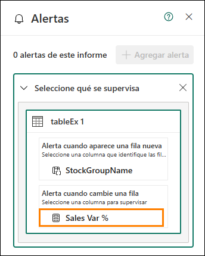

5. Seleccione el botón de opción **Se convierte en** y cambie la **Condición** a **Menor que**.

6. Establezca **Umbral** en **-20 %.** Esto configura el desencadenador para alertar cuando el porcentaje de variación de ventas cae por debajo del 20 %.

    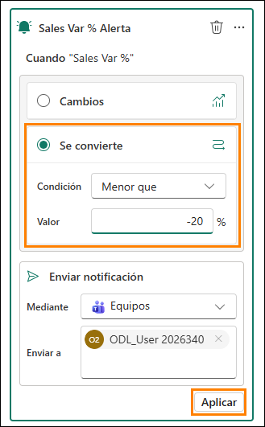

7. Hable sobre las dos opciones de notificación, correo electrónico y Teams.

8. Seleccione **Aplicar**.

9. En la parte inferior, junto a **Mis alertas de Power BI Activator**, seleccione los **puntos suspensivos (…)**.

10. Muestre las diferentes ubicaciones de guardado del espacio de trabajo.

    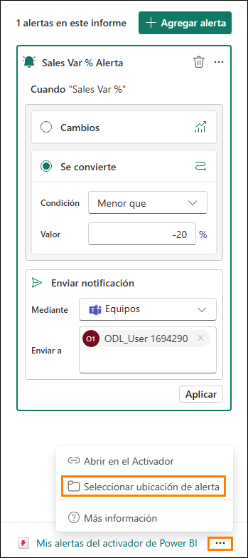

11. Una vez creada la alerta, también puede seleccionar **Abrir en Activator** después de hacer clic en los puntos suspensivos inferiores.

    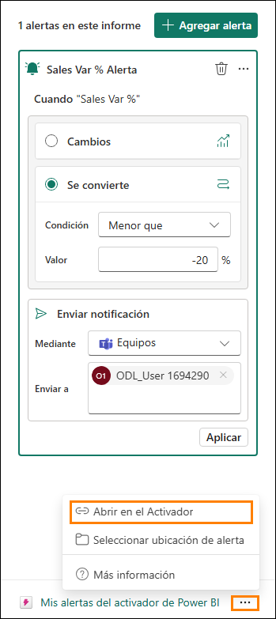

### Información general de Activator

1. Esto le llevará a la vista **Diseño** de Activator.

2. Guíe a los asistentes a través del **diseño**, a la izquierda están los objetos. Observe que hay un **desencadenador** que acabamos de crear. También hay una sección **Eventos**.

3. Mientras el desencadenador que hemos creado está seleccionado, hable sobre las opciones en el **menú superior**.

    1. Inicio

    1. Obtener datos

    2. Crear acciones personalizadas mediante Power Automate

    2. Reglas

    1. Eliminar

    2. Iniciar, detener, ver detalles

    3. Enviarme una acción de prueba

4. Hable sobre los gráficos de **Supervisión** y **Condición** que se incluyen en la pestaña **Definición**.

5. A medida que se desplaza hacia abajo, observe en el gráfico **Acción**, donde la alerta notificará cuando se desencadene. Actualmente, los desencadenadores se ejecutan cada hora. Así, en la hora siguiente, si los datos cambian y se cumple la condición, se activa una alerta.

    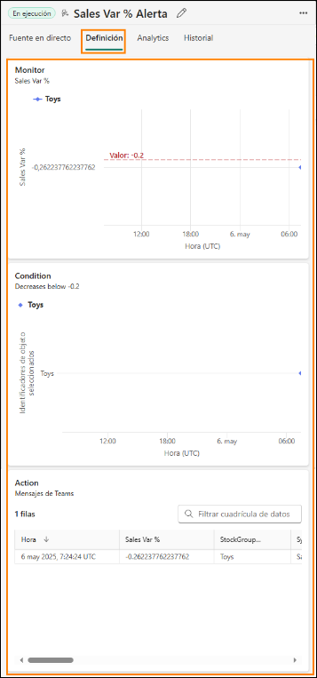

6. En el lado derecho de la pantalla, tendrá la opción de configurar la **Definición de la alerta**. Esto incluye el Atributo, los filtros o resumen, las condiciones y la Acción. Observe que la alerta está predeterminada en la cuenta de usuario del laboratorio. (Actualmente no se admite la dirección de correo electrónico externa).

    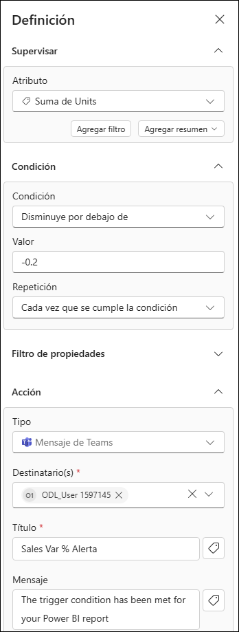

7. Vea que aquí también se pueden editar los detalles de la acción. Si elige el botón Editar acción, aparece la ventana para editar la acción.

    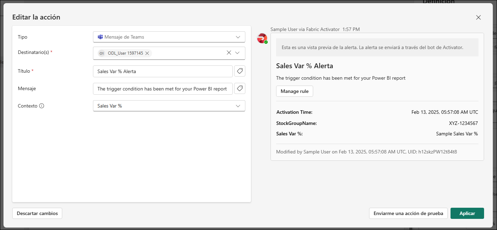

### Enviar un mensaje de alerta

Nota: Para ver la alerta debe utilizar el entorno de laboratorio.

1. Seleccione **Desencadenador Sales Var %**.

2. En el menú superior, seleccione **Enviarme una acción de prueba**. Esto enviará una alerta de prueba a su cuenta de usuario de laboratorio.

3. Seleccione el **icono Iniciador de aplicaciones** en la esquina superior izquierda de la pantalla.

    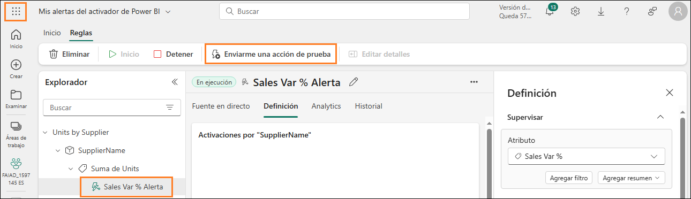

4. Seleccione Teams. Se abre una nueva ventana del explorador.

    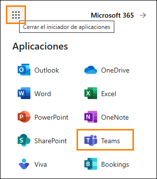

5. Recibirá un mensaje de alerta (puede tardar unos minutos). Observe que esta es una acción de prueba.

    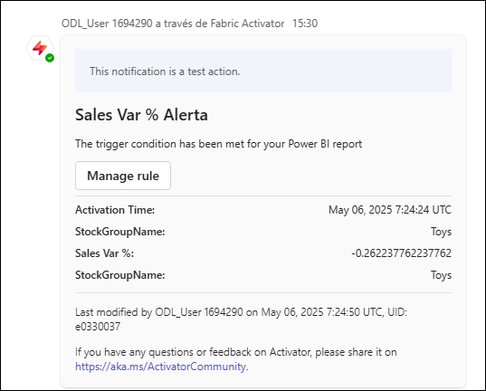

6. A medida que los datos cambian y se cumple la condición del desencadenador, se envían alertas.

    **Nota:** Para demostrar esta característica, filtramos el objeto visual durante un mes (mayo de 2024). En escenarios del mundo real, esto será dinámico. Probablemente tendremos un desencadenador establecido dinámicamente para el mes en curso.

# **Demostración de Semantic Link**

### Requisito

Es necesario que el instructor o la instructora complete los laboratorios 1 a 7 antes de avanzar a los siguientes pasos.

Se recomienda que el instructor ejecute los cuadernos en esta demostración de antemano, ya que ambos pueden tardar entre 5 y 10 minutos en completarse. Una opción es ejecutar los cuadernos mientras los estudiantes trabajan en el laboratorio 6/7. Esto es para garantizar que el instructor pueda mostrar a los estudiantes los resultados de los cuadernos.

### Escenario

En esta demostración, exploraremos el **Analizador de procedimientos recomendados** y el **Analizador de memoria**. Se trata de eficaces herramientas que nos ayudan a evaluar nuestro modelo semántico en cuanto al rendimiento, el uso de memoria y la calidad general. Estas herramientas no solo ofrecen métricas; también ofrecen **información procesable para mejorar el diseño y la eficiencia** de su modelo al resaltar oportunidades de optimización que de otro modo podría perderse.

En el centro de esta capacidad se encuentra **Semantic Link**, una característica de Microsoft Fabric que nos permite conectar nuestros modelos semánticos directamente con experiencias y herramientas de ciencia de datos. Esto significa que podemos **analizar, perfilar y optimizar** nuestro modelo semántico sm_FAIAD con Notebooks.

Debido a esta conexión, podemos ejecutar análisis en profundidad, como comprobaciones de procedimientos recomendados y generación de perfiles de memoria, directamente contra el modelo semántico en nuestro espacio de trabajo. Esto nos permite mejorar **el rendimiento, disminuir la superficie de memoria y, en última instancia, reducir el coste** de sus artefactos en producción.

Para demostrar este escenario, vamos a:

- Abrir nuestro modelo semántico sm_FAIAD y encuentre las características de Semantic Link.

- Crear el cuaderno del analizador de procedimientos recomendados y vea la información.

- Crear el cuaderno del analizador de memoria y vea la información.

### Analizador de procedimientos recomendados

1. Vaya al **área de trabajo de Fabric que creó en el Laboratorio 2, Tarea 2,** llamada **FAIAD_<username>**.

2. Abra al modelo semántico **sm_FAIAD**.

    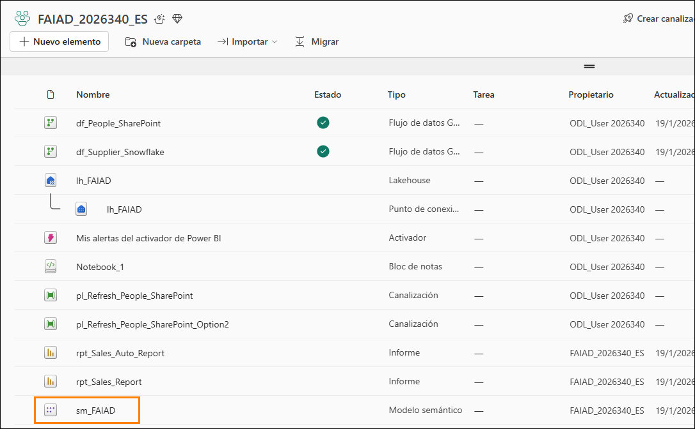

3. En la página siguiente, seleccione **Abrir modelo semántico**.

    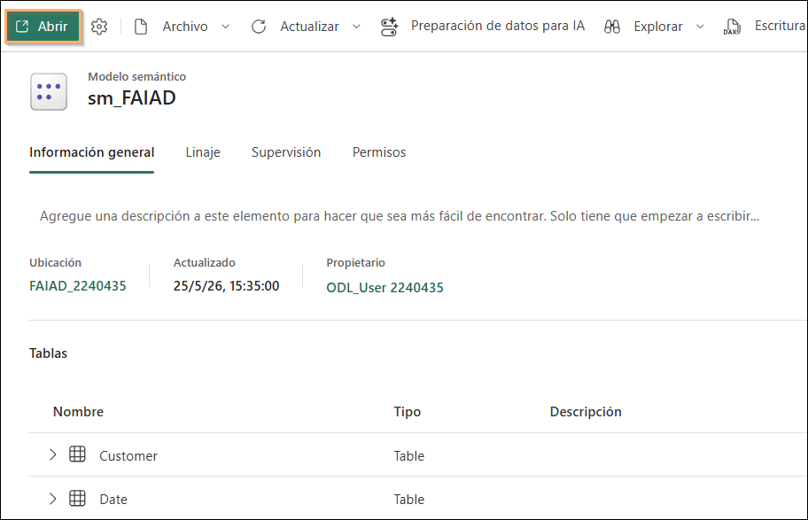

4. En la **cinta de opciones Inicio,** observe que tiene 3 elementos en **Estado del modelo**.

    1. **Analizador de procedimientos recomendados:** ofrece sugerencias para mejorar el diseño y el rendimiento de su modelo semántico basado en reglas creadas por expertos en Fabric.

    2. **Analizador de memoria:** proporciona estadísticas de memoria y almacenamiento sobre los objetos de su modelo semántico. La revisión de estas estadísticas puede ayudarle a identificar áreas de posible optimización del rendimiento y reducción de la memoria.

    3. **Cuadernos de la comunidads:** galería de cuadernos creados por la comunidad de Power BI para mejorar el análisis de datos y la generación de informes.

    *Nota: Estos cuadernos también se pueden encontrar en la página de detalles del modelo semántico.*

5. Haga clic en **Analizador de procedimientos recomendados**.

    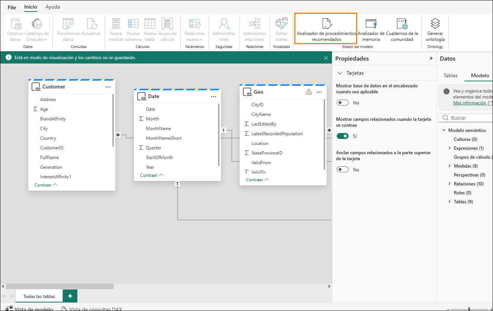

6. Se creará un nuevo cuaderno de analizador de procedimientos recomendados. Se le dirigirá al bloc de notas.

7. Repase los detalles escritos en las celdas de Markdown con los estudiantes.

8. En la cinta de opciones de inicio, seleccione **Ejecutar todo**.

    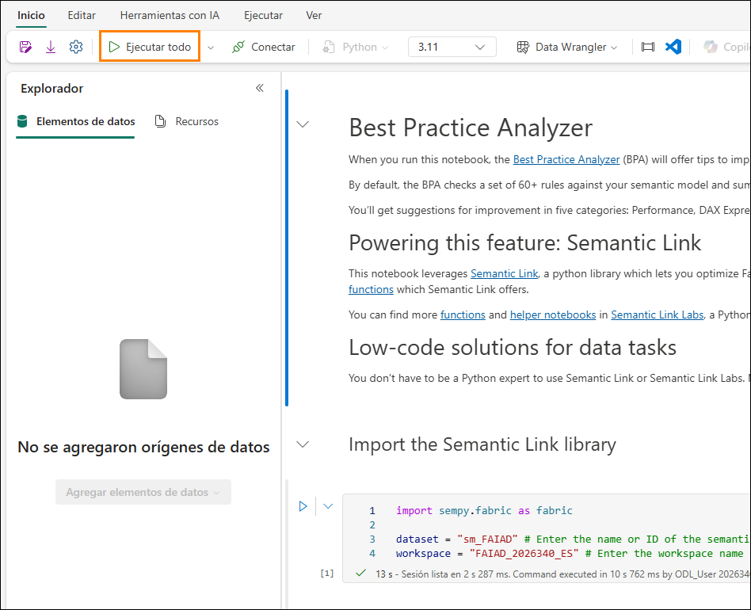

9. Una vez que el cuaderno haya terminado de ejecutarse, observe el resultado de la función **run_model_bpa**.

    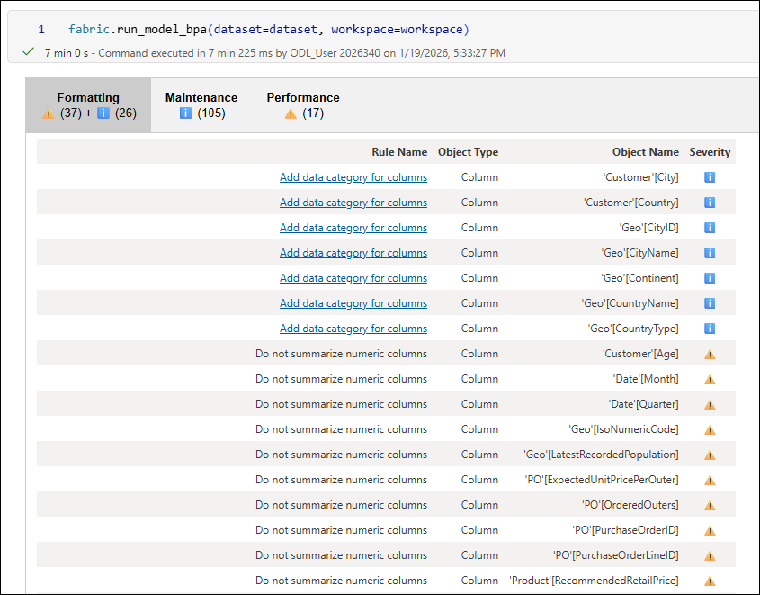

10. Esta función devuelve tres categorías de recomendaciones. **Formatting, Maintenance y Performance**. Dentro de una categoría determinada, verá dos iconos diferentes que representan la gravedad de la recomendación.

    1. ℹ️ - Un cambio recomendado que puede mejorar su modelo.

    2. ⚠️ - La gravedad de esta precaución indica que la incidencia mostrada podría ocasionar problemas en su modelo o en los informes que usan el modelo.

11. En Formato, desplácese hacia abajo y coloque el cursor sobre el **nombre de la regla "Format flag columns as Yes/No value strings"**.

12. Describa a los alumnos que, si coloca el cursor sobre los nombres de las reglas, obtendrá más detalles sobre el cambio recomendado.

    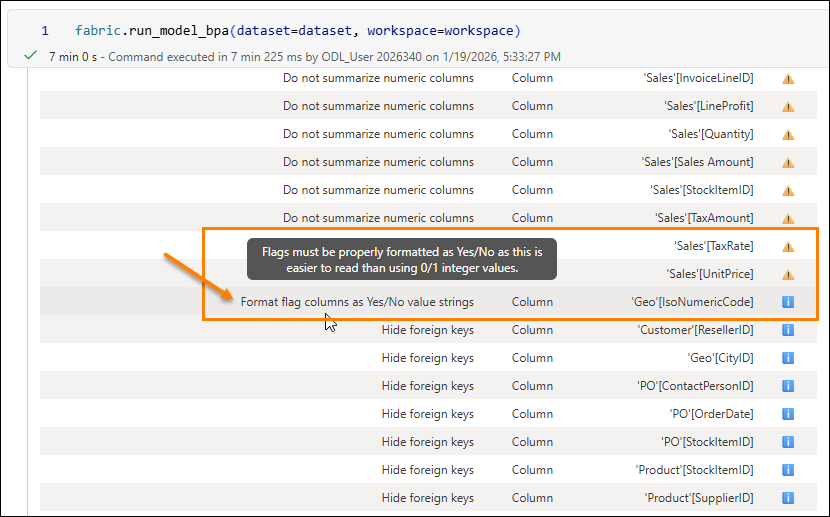

13. En este caso, el analizador de rendimiento recomienda que apliquemos formato a la columna **IsoNumericCode** de la tabla **Geo** en **Sí/No**. Esta es una excelente recomendación, ya que dar formato a las columnas de marca de esta manera es un procedimiento recomendado al modelar un esquema de estrella.

14. Seleccione la categoría **Maintenance**.

    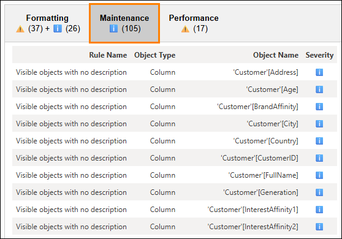

15. Mencione a los estudiantes que la mayoría de las recomendaciones de mantenimiento consisten en agregar descripciones a nuestras columnas visibles del modelo.

16. Seleccione la categoría **Performance**.

    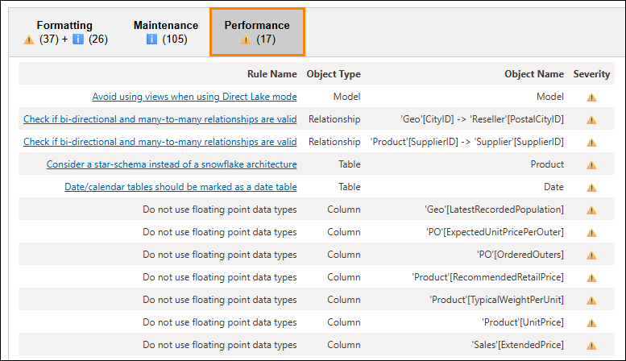

17. Coloque el cursor sobre el **nombre de la regla "Avoid using views when using Direct Lake mode”**.

18. El analizador de rendimiento nos recuerda que el modo Direct Lake no admite vistas. En esta clase, hemos usado accesos directos para conectarnos rápidamente a los datos y luego hemos transformado los datos mediante vistas. En parte, esto se hizo para obtener más información sobre los múltiples métodos de conexión de datos que tenemos en Fabric. Sin embargo, si quisiéramos aplicar esta recomendación a nuestro modelo, tendríamos que usar otro método para ingerir y transformar nuestros datos de ventas, como un Flujo de datos Gen2.

    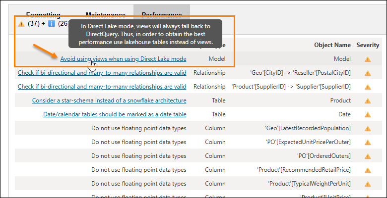

19. Si el tiempo lo permite, el instructor puede analizar otras recomendaciones.

### Analizador de memoria

1. Vuelva a la vista de modelo de su modelo semántico **sm_FAIAD**.

2. En la **cinta de opciones de inicio,** seleccione **Analizador de memoria**.

    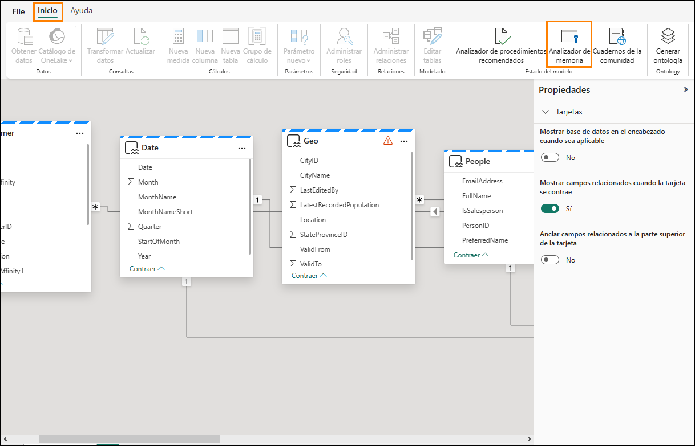

3. Se creará un nuevo cuaderno de analizador de memoria.

4. Repase los detalles mostrados en las celdas de Markdown con los estudiantes.

5. En la **cinta de opciones de inicio,** seleccione **Ejecutar todo**.

    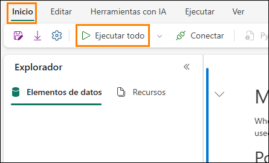

6. Una vez que se haya completado el cuaderno, observe los datos resultantes. Hay muchas categorías que muestran el uso de memoria con diferentes niveles de detalle.

    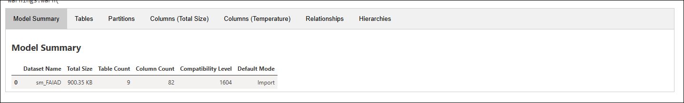

7. Mencione a los estudiantes que podemos usar toda esta información para identificar áreas de mejora con respecto al uso de la memoria.

8. Seleccione la categoría **Tablas**.

9. Coloque el cursor sobre el nombre de la columna **% DB**. Al hacerlo, se mostrará la descripción de las columnas. Esta columna indica el tamaño de cada tabla en relación con el tamaño del modelo semántico. Si bien esto no nos indica automáticamente que algo anda mal, es útil ver qué porcentaje de la memoria de los modelos semánticos está utilizando cada tabla.

    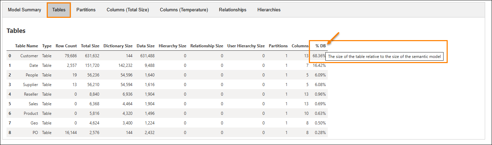

10. Si el tiempo lo permite, el instructor puede terminar la demostración con otras categorías en las que se explican varios puntos de datos.
