# Microsoft Fabric - Fabric Analyst in a Day - Laboratorio 3


## Contenido

- Presentación
- Acceso directo a ADLS Gen2
  - Tarea 1: Crear acceso directo
- Transformar datos mediante una consulta visual
  - Tarea 2: Crear una vista Geo con consultas visuales
  - Tarea 3: Crear vistas de Reseller, Sales y Product mediante una consulta SQL
- Referencias


# Presentación

En nuestro escenario, los Datos de Sales provienen del sistema ERP y se almacenan en ADLS Gen2. Se actualiza a mediodía/12:00 todos los días. Necesitamos transformar e ingerir estos datos en un almacén de lago de datos y usarlos en nuestro modelo.

Hay varias formas de ingerir estos datos.

- **Accesos directos:** esto crea un vínculo con los datos, y podemos utilizar las vistas de consulta Visual para transformarlos. Usaremos accesos directos en este laboratorio.

- **Notebooks:** esto requiere que escribamos código. Es un enfoque amigable para los desarrolladores.

- **Flujo de datos Gen2:** probablemente esté familiarizado con Power Query o el flujo de datos de primera generación. El flujo de datos Gen2, como su nombre indica, es la versión más nueva del flujo de datos. Proporciona todas las capacidades de Power Query y el flujo de datos de primera generación con la capacidad adicional de transformar e ingerir datos en múltiples orígenes de datos. Presentaremos esto en los próximos laboratorios.

- **Canalización:** esta es una herramienta de orquestación. Se pueden orquestar actividades para extraer, transformar e ingerir datos. Usaremos una canalización para ejecutar la actividad del flujo de datos Gen2, que, a su vez, realizará la extracción, transformación e ingesta.

Comenzaremos creando un acceso directo para ingerir datos en un almacén de lago de datos desde el origen de datos de ADLS Gen2. Una vez ingeridos, usaremos vistas de consulta visual para transformarlos.

Al final de este laboratorio, habrá aprendido sobre:

- Cómo crear accesos directos en el almacén de lago de datos

- Cómo transformar datos mediante la característica de consulta visual

# Acceso directo a ADLS Gen2

## Tarea 1: Crear acceso directo

Los accesos directos se utilizan para crear un vínculo a la ubicación de destino. Los accesos directos proporcionan acceso a los datos sin necesidad de mover físicamente los datos al almacén de lago de datos. Esto es como crear accesos directos en el escritorio de Windows.

1. En la parte superior de la pantalla, seleccione la pestaña **lh_FAIAD** para navegar hasta el almacén de lago de datos.

1. Si no tiene una pestaña, puede volver a su espacio de trabajo y abrir el almacén de lago de datos desde allí.

2. En el panel del **explorador** de la izquierda, seleccione los **puntos suspensivos** al lado de **Tables**.

3. Seleccione **Nuevo acceso directo**.

    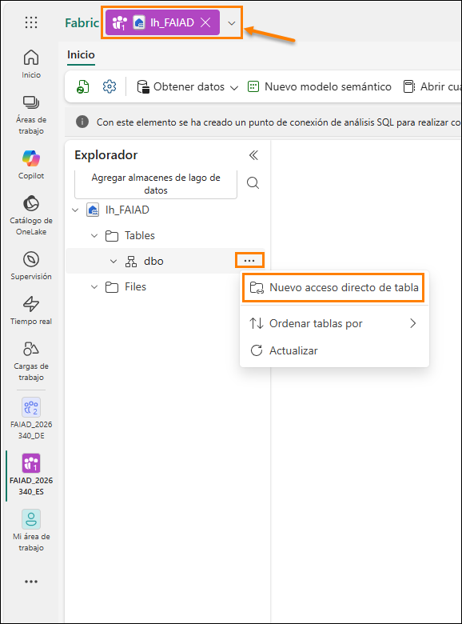

4. Se abre el cuadro de diálogo **Nuevo acceso directo**. En **Orígenes externos**, seleccione **Azure Data Lake Storage Gen2**.

    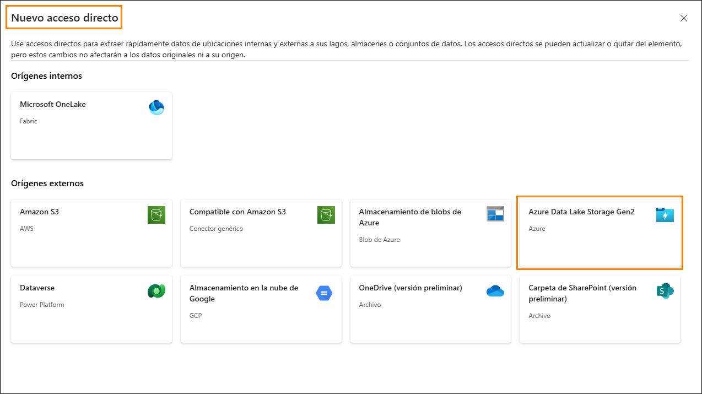

5. Seleccione **Nueva conexión (1)**.

6. Escriba el siguiente vínculo para la propiedad **URL**: https://stvnextblobstorage.dfs.core.windows.net/fabrikam-sales **(2)**:

7. Haga clic en **Creación de una conexión (3)** en la sección Conexión

8. Seleccione **Firma de acceso compartido (SAS) (4)** en el menú desplegable Tipo de autenticación.

9. Copie el token de SAS y péguelo en el campo Token de SAS (5).

    - **Token de SAS:** <inject key="Sas token"></inject>

10. Seleccione **Siguiente (6)** en la esquina inferior derecha de la pantalla.

    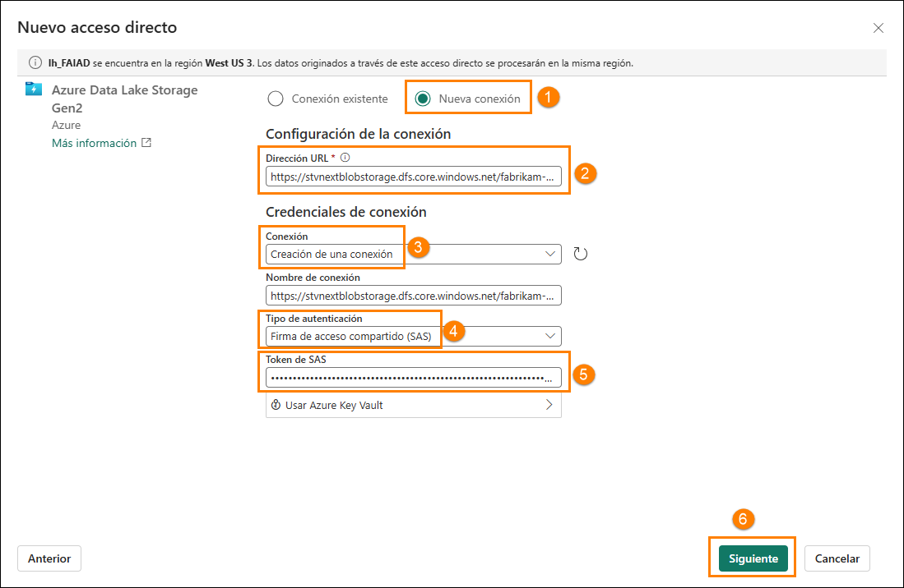

11. Se conectará a ADLS Gen2 con la estructura de directorios que se muestra en el panel izquierdo. Expanda **Delta-Parquet-Format-FY25 (1).**

12. **Seleccione** los siguientes directorios **(2)** y luego haga clic en **Siguiente (3):**

    1. Application.Cities

    2. Application.Countries

    3. Application.StateProvinces

    4. DateDim

    5. Sales.BuyingGroups

    6. Sales.Customers

    7. Sales.InvoiceLines

    8. Sales.Invoices

    9. Warehouse.StockGroups

    10. Warehouse.StockItemStockGroups

    11. Warehouse.StockItems

    **Nota:** Sales.Invoice_May es el único directorio que **no** está seleccionado.

    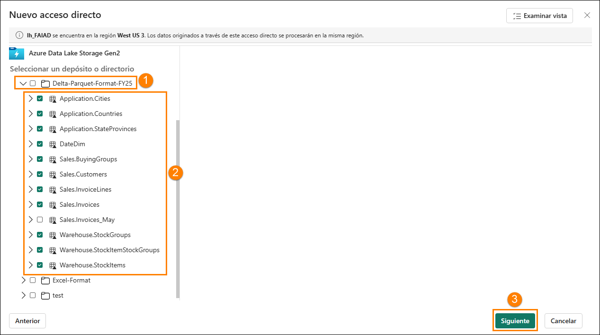

13. Se le dirigirá al siguiente cuadro de diálogo, donde podemos editar los nombres. Seleccione el **icono Editar (1)** en Acciones para **Application.Cities**.

14. Cambie el nombre de **Application.Cities a Cities (2).**

15. Seleccione la marca de verificación al lado del nombre para guardar el cambio **(3)**.

    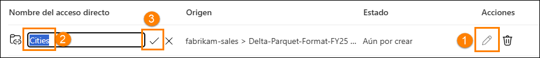

16. Del mismo modo, cambie el nombre de los nombres de acceso directo como se muestra a continuación:

    1. Application.Countries a **Countries**

    2. Application.StateProvinces a **States**

    3. DateDim a **Date**

    4. Sales.BuyingGroups a **BuyingGroups**

    5. Sales.Customers a **Customers**

    6. Sales.InvoiceLines a **InvoiceLineItems**

    7. Sales.Invoices a **Invoices**

    8. Warehouse.StockGroups a **ProductGroups**

    9. Warehouse.StockItemStockGroups a **ProductItemGroup**

    10. Warehouse.StockItems a **ProductItem**

    **Nota:** Compruebe dos veces los nombres. Un error tipográfico causará errores durante el laboratorio.

17. Seleccione **Crear** para crear el acceso directo.

    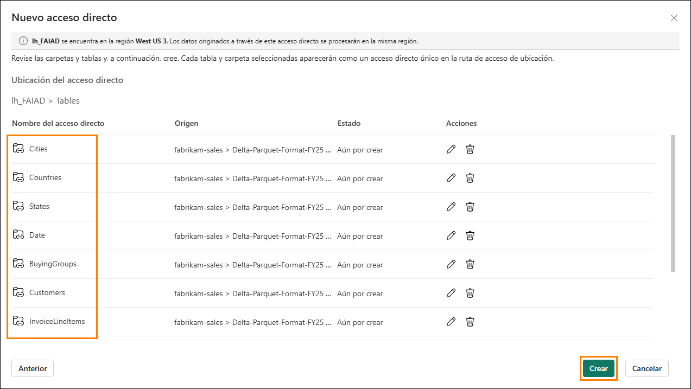

18. Observe que todos los accesos directos se crean como tablas. Seleccione la tabla **BuyingGroups** y observe que podemos ver una versión preliminar de los datos en el panel de datos.

    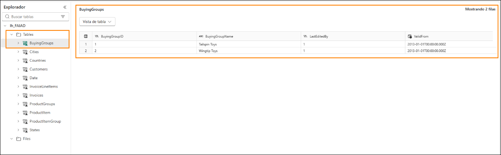

    El siguiente paso es transformar los datos, para que podamos crear un modelo semántico. Vamos a crear vistas para transformar los datos.

# Transformar datos mediante una consulta visual

## Tarea 2: Crear una vista Geo con consultas visuales

1. Podemos tener acceso al almacén de lago de datos mediante un punto de conexión SQL. Esto permite consultar los datos y crear vistas. En la **parte superior derecha** de la pantalla, seleccione **Lakehouse (1) -> Punto de conexión de análisis SQL (2)**.

    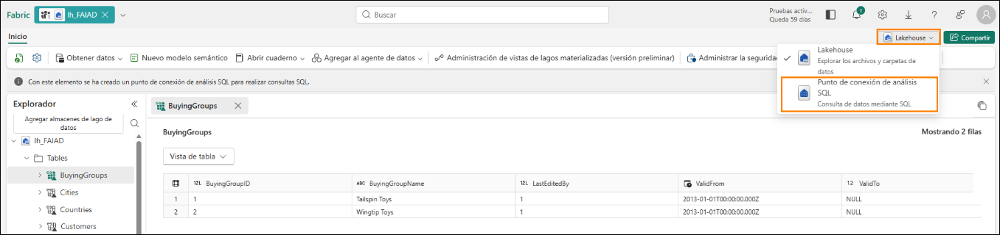

    Esto le llevará al punto de conexión de análisis SQL. Ahora tiene un nuevo elemento en su navegación superior y puede regresar al almacén de lago de datos seleccionando esa pestaña. Observe que el panel del Explorador ha cambiado. Ahora puede crear vistas, procedimientos almacenados, consultas y mucho más. Vamos a crear una consulta visual, ya que proporciona una interfaz similar a Power Query con poco código. Guardaremos el resultado como una vista.

    Comenzaremos creando una vista Geo. Necesitamos fusionar los datos de las tablas Cities, States y Countries para crear la vista Geo.

2. En el menú principal, haga clic en el menú desplegable junto a **Nueva consulta de SQL (1)** y, a continuación, seleccione **Nueva consulta visual (2)**.

    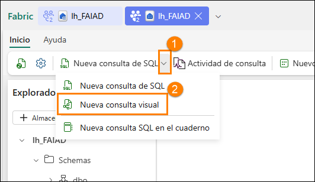

3. Para crear una consulta, tendremos que agregar tablas al panel Consulta de objeto visual. Haga clic en los puntos suspensivos junto a la tabla **Cities (1)** y seleccione **Insertar en el lienzo (2).**

    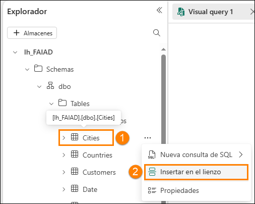

4. Repita los mismos pasos para las tablas **States** y **Countries**.

    A continuación, necesitamos fusionar estas consultas. El editor de consultas visual viene con la opción de usar el Editor de Power Query. Usemos esto, ya que estamos familiarizados con ello debido a Power BI.

5. **En el menú del editor de consultas visuales,** seleccione el icono **Abrir en menú emergente** (hacia la derecha). Se le llevará al Editor de Power Query.

    **Nota:** Es posible que tenga que desplazarse hacia la derecha o volver a abrir la pestaña de consulta visual si no ve este icono inmediatamente.

    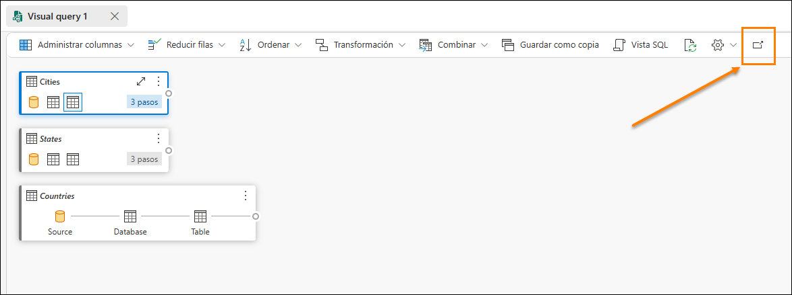

6. Con la consulta **Cities (1)** seleccionada, en la cinta del Editor de Power Query, seleccione **Inicio (2) - > Combinar (3) -> Menú desplegable Combinar consultas (4) -> Combinar consultas como nuevas (5)**. Se abrirá el cuadro de diálogo Combinar consultas.

    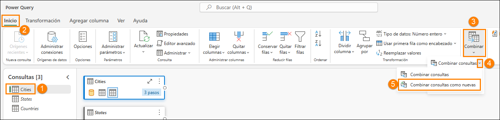

7. En la **Tabla izquierda para combinación**, seleccione **Cities**.

8. En la **Tabla derecha para combinación**, seleccione **States**.

9. Seleccione las columnas **StateProvinceID** de ambas tablas. Vamos a unirnos usando esta columna.

10. Seleccione **Interior** como el **Tipo de combinación**.

11. Seleccione **Aceptar**.

    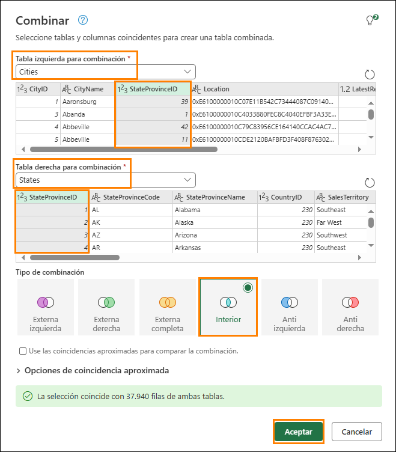

    Observe que se ha creado una nueva consulta llamada **Merge**. Necesitamos algunas columnas de States.

12. En la **vista Datos** (panel inferior), haga clic en la **doble flecha** al lado de la columna **States** (última columna a la derecha).

13. Se abre un panel. Asegúrese de las únicas columnas seleccionadas son las siguientes:

    1. StateProvinceCode

    2. StateProvinceName

    3. CountryID

    4. SalesTerritory

14. Seleccione **Aceptar**.

    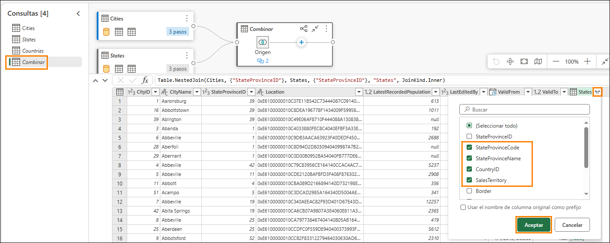

    Necesitamos fusionar la consulta Countries ahora.

15. Con la consulta de combinación seleccionada **(1),** seleccione **Inicio** **(2) -> Combinar (3) -> Menú desplegable Combinar consultas (4) -> Combinar consultas (5).**

    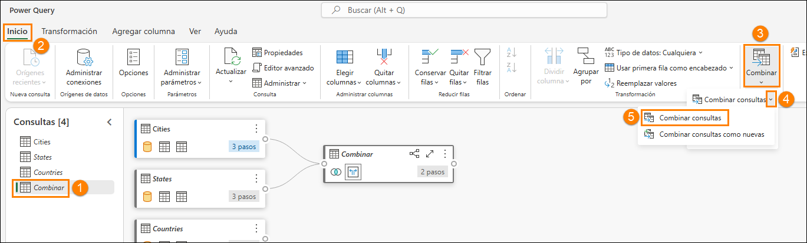

16. Se abrirá el cuadro de diálogo Combinar consulta. En la **Tabla derecha para combinación**, seleccione **Countries**.

17. Seleccione las columnas **CountryID** de ambas tablas. Vamos a unirnos usando esta columna.

18. Seleccione **Interior** como el **Tipo de combinación**.

19. Seleccione **Aceptar**.

    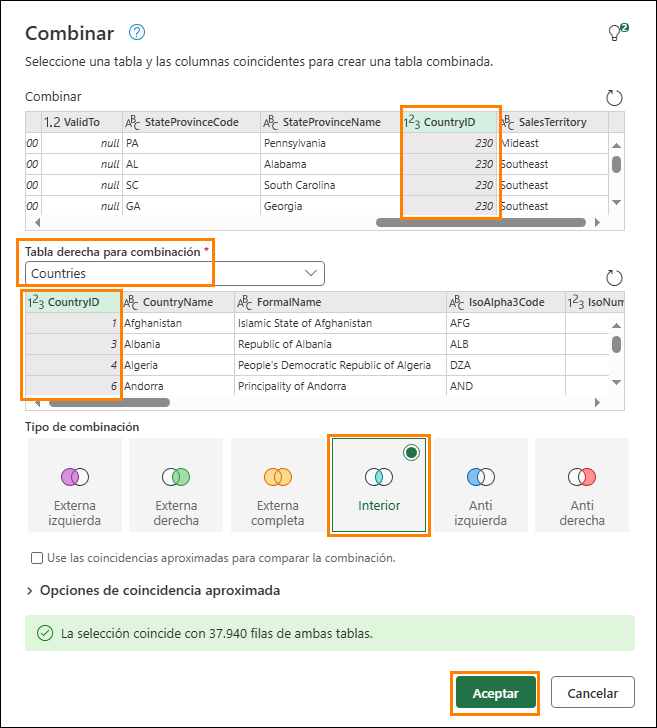

    Necesitamos algunas columnas de Countries.

20. En el panel **vista Datos** (panel inferior), haga clic en la **doble flecha** al lado de la columna **Countries**.

21. Se abre un panel. Asegúrese de las únicas columnas seleccionadas son las siguientes:

    1. CountryName

    2. FormalName

    3. IsoAlpha3Code

    4. IsoNumericCode

    5. CountryType

    6. Continent

    7. Region

    8. Subregion

22. Seleccione **Aceptar**.

    **Importante:** Asegúrese de desplazarse hacia abajo y seleccionar las ocho columnas enumeradas en el paso 21. La siguiente captura de pantalla solo muestra las 5 primeras columnas debido a una limitación de la interfaz de usuario.

    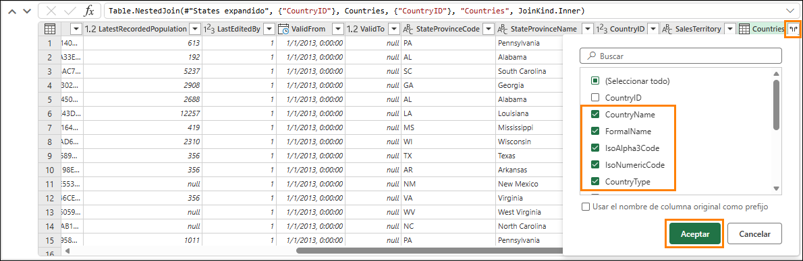

    No necesitamos todas las columnas de la tabla **Combinar**. Asegúrese de seleccionar solo las que necesitemos.

23. Con la consulta **Combinar** seleccionada (1), en la cinta de opciones seleccione **Inicio (2) -> Elegir columnas (3) -> Elegir columnas (4)**.

    **Nota:** Si la opción Elegir columnas no está visible, puede encontrarla en Administrar columnas.

    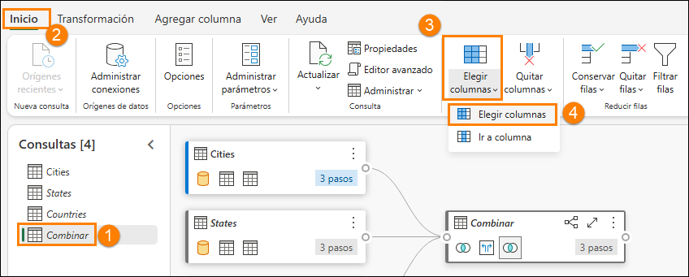

24. Se abrirá el cuadro de diálogo Elegir columnas. **Desmarque** las siguientes columnas.

    1. StateProvinceID

    2. Location

    3. LastEditedBy

    4. ValidFrom

    5. ValidTo

    6. CountryID

25. Seleccione **Aceptar**.

    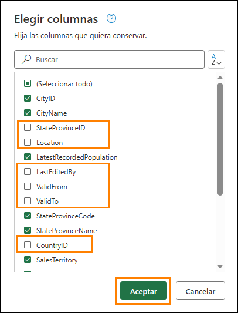

    Observe que el proceso es como el de Power Query, tenemos todos los pasos registrados tanto en el panel Pasos aplicados de la derecha como en la vista visual. Vamos a cambiar el nombre de Combinar consulta a Habilitar carga de modo que se carguen los datos desde esta consulta.

26. **Haga clic con el botón derecho** en la consulta **Combinar** en el panel Consultas (izquierda). Seleccione **Cambiar nombre** y cambie el nombre de la consulta a **Geo**.

27. **Haga clic con el botón derecho** en la consulta **Geo** en el panel Consultas (izquierdo). Seleccione **Habilitar carga** para habilitar esta consulta.

28. Asegúrese de que las consultas de Cities, States y Countries estén **deshabilitadas**.

29. Seleccione **Guardar**, que se encuentra en la parte inferior derecha del editor de Power Query.

    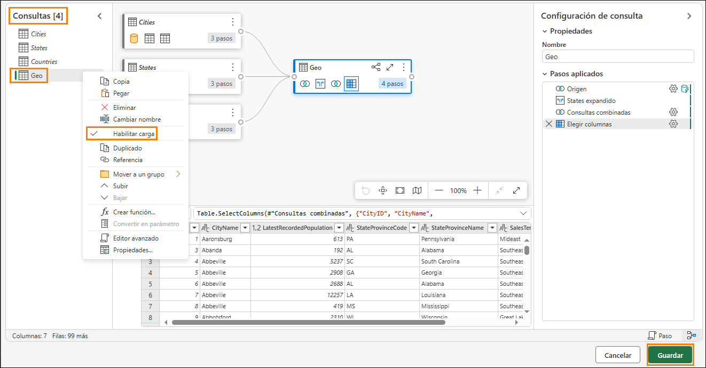

    Se nos dirigirá al editor de consultas visuales. Guardemos ahora esta consulta como una vista.

    **Nota**: Todos los pasos que hemos realizado con el Editor de Power Query también se pueden llevar a cabo con el editor de consultas visuales.

30. En el menú del editor de consultas visuales, seleccione **Guardar como copia**.

    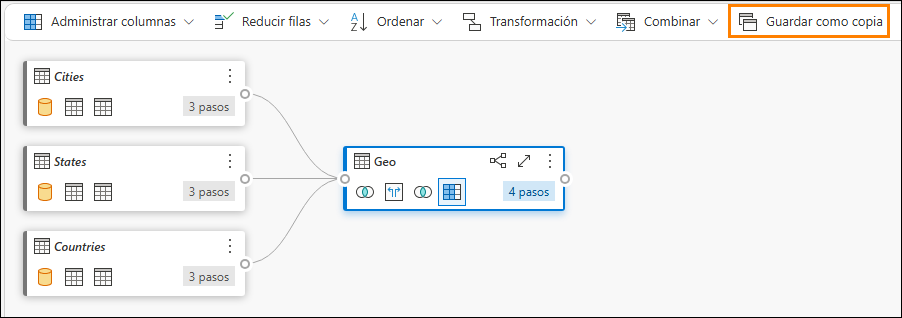

    Se abre el cuadro de diálogo Guardar como copia. Observe que la consulta SQL está disponible. Si quiere comprobar el código SQL, puede revisarlo.

31. Escriba **Geo** como **Nombre de la vista**.

32. Seleccione **Aceptar** para guardar la vista.

    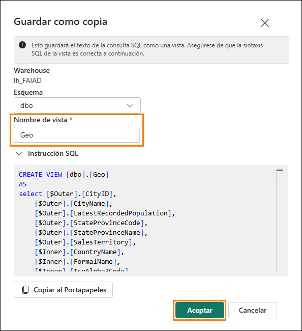

    Recibirá una alerta una vez que se guarde la vista.

33. En el panel Explorador (izquierda), expanda **Views.** Tenemos la vista Geo recién creada.

    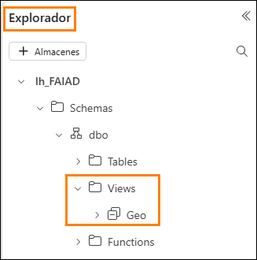

## Tarea 3: Crear vistas de Reseller, Sales y Product mediante una consulta SQL

1. En Fabric, también podemos crear vistas mediante consultas SQL. En la cinta de opciones, seleccione Nueva consulta SQL.

    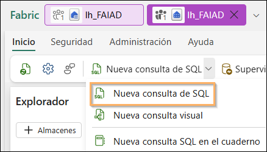

2. Aquí, podemos escribir TSQL para ayudar a crear las vistas que necesitamos.

3. Copie la siguiente consulta de SQL en la ventana de consultas. Esto creará tres vistas: Reseller, Sales y Product.

    ```sql
    CREATE VIEW dbo.Reseller AS
    select [$Outer].[ResellerID] as [ResellerID],
        [$Outer].[ResellerName] as [ResellerName],
        [$Outer].[PostalCityID] as [PostalCityID],
        [$Outer].[PhoneNumber] as [PhoneNumber],
        [$Outer].[FaxNumber] as [FaxNumber],
        [$Outer].[WebsiteURL] as [WebsiteURL],
        [$Outer].[DeliveryAddressLine1] as [DeliveryAddressLine1],
        [$Outer].[DeliveryAddressLine2] as [DeliveryAddressLine2],
        [$Outer].[DeliveryPostalCode] as [DeliveryPostalCode],
        [$Outer].[PostalAddressLine1] as [PostalAddressLine1],
        [$Outer].[PostalAddressLine2] as [PostalAddressLine2],
        [$Outer].[PostalPostalCode] as [PostalPostalCode],
        [$Inner].[BuyingGroupName] as [ResellerCompany]
    from [lh_FAIAD].[dbo].[Customers] as [$Outer]
    inner join (
        select [_].[BuyingGroupID] as [BuyingGroupID2],
            [_].[BuyingGroupName] as [BuyingGroupName],
            [_].[LastEditedBy] as [LastEditedBy2],
            [_].[ValidFrom] as [ValidFrom2],
            [_].[ValidTo] as [ValidTo2]
        from [lh_FAIAD].[dbo].[BuyingGroups] as [_]
    ) as [$Inner] on ([$Outer].[BuyingGroupID] = [$Inner].[BuyingGroupID2] or [$Outer].[BuyingGroupID] is null and [$Inner].[BuyingGroupID2] is null)
    GO

    CREATE VIEW dbo.Sales AS
    select [$Outer].[InvoiceLineID] as [InvoiceLineID],
        [$Outer].[InvoiceID] as [InvoiceID],
        [$Outer].[StockItemID] as [StockItemID],
        [$Outer].[Quantity] as [Quantity],
        [$Outer].[UnitPrice] as [UnitPrice],
        [$Outer].[TaxRate] as [TaxRate],
        [$Outer].[TaxAmount] as [TaxAmount],
        [$Outer].[LineProfit] as [LineProfit],
        [$Outer].[ExtendedPrice] as [ExtendedPrice],
        [$Outer].[CustomerID] as [ResellerID],
        [$Outer].[SalespersonPersonID] as [SalespersonPersonID],
        [$Outer].[InvoiceDate] as [InvoiceDate],
        [$Outer].[t0_0] as [Sales Amount]
    from (
        select [_].[InvoiceLineID] as [InvoiceLineID],
            [_].[InvoiceID] as [InvoiceID],
            [_].[StockItemID] as [StockItemID],
            [_].[Quantity] as [Quantity],
            [_].[UnitPrice] as [UnitPrice],
            [_].[TaxRate] as [TaxRate],
            [_].[TaxAmount] as [TaxAmount],
            [_].[LineProfit] as [LineProfit],
            [_].[ExtendedPrice] as [ExtendedPrice],
            [_].[CustomerID] as [CustomerID],
            [_].[SalespersonPersonID] as [SalespersonPersonID],
            [_].[InvoiceDate] as [InvoiceDate],
            [_].[ExtendedPrice] - [_].[TaxAmount] as [t0_0]
        from (
            select [$Outer].[InvoiceLineID],
                [$Outer].[InvoiceID],
                [$Outer].[StockItemID],
                [$Outer].[Quantity],
                [$Outer].[UnitPrice],
                [$Outer].[TaxRate],
                [$Outer].[TaxAmount],
                [$Outer].[LineProfit],
                [$Outer].[ExtendedPrice],
                [$Inner].[CustomerID],
                [$Inner].[SalespersonPersonID],
                [$Inner].[InvoiceDate]
            from [lh_FAIAD].[dbo].[InvoiceLineItems] as [$Outer]
            inner join (
                select [_].[InvoiceID] as [InvoiceID2],
                    [_].[CustomerID] as [CustomerID],
                    [_].[BillToResellerID] as [BillToResellerID],
                    [_].[OrderID] as [OrderID],
                    [_].[DeliveryMethodID] as [DeliveryMethodID],
                    [_].[ContactPersonID] as [ContactPersonID],
                    [_].[AccountsPersonID] as [AccountsPersonID],
                    [_].[SalespersonPersonID] as [SalespersonPersonID],
                    [_].[PackedByPersonID] as [PackedByPersonID],
                    [_].[InvoiceDate] as [InvoiceDate],
                    [_].[CustomerPurchaseOrderNumber] as [CustomerPurchaseOrderNumber],
                    [_].[IsCreditNote] as [IsCreditNote],
                    [_].[CreditNoteReason] as [CreditNoteReason],
                    [_].[Comments] as [Comments],
                    [_].[DeliveryInstructions] as [DeliveryInstructions],
                    [_].[InternalComments] as [InternalComments],
                    [_].[TotalDryItems] as [TotalDryItems],
                    [_].[TotalChillerItems] as [TotalChillerItems],
                    [_].[DeliveryRun] as [DeliveryRun],
                    [_].[RunPosition] as [RunPosition],
                    [_].[ReturnedDeliveryData] as [ReturnedDeliveryData],
                    [_].[ConfirmedDeliveryTime] as [ConfirmedDeliveryTime],
                    [_].[ConfirmedReceivedBy] as [ConfirmedReceivedBy],
                    [_].[LastEditedBy] as [LastEditedBy2],
                    [_].[LastEditedWhen] as [LastEditedWhen2]
                from [lh_FAIAD].[dbo].[Invoices] as [_]
            ) as [$Inner] on ([$Outer].[InvoiceID] = [$Inner].[InvoiceID2] or [$Outer].[InvoiceID] is null and [$Inner].[InvoiceID2] is null)
        ) as [_]
    ) as [$Outer]
    where exists (
        select 1
        from (
            select [ResellerID]
            from [lh_FAIAD].[dbo].[Reseller] as [$Table]
        ) as [$Inner]
        where [$Outer].[CustomerID] = [$Inner].[ResellerID] or [$Outer].[CustomerID] is null and [$Inner].[ResellerID] is null
    )
    GO

    CREATE VIEW dbo.Product AS
    select [$Outer].[StockItemID],
        [$Outer].[StockItemName],
        [$Outer].[SupplierID],
        [$Outer].[Size],
        [$Outer].[IsChillerStock],
        [$Outer].[TaxRate],
        [$Outer].[UnitPrice],
        [$Outer].[RecommendedRetailPrice],
        [$Outer].[TypicalWeightPerUnit],
        [$Inner].[StockGroupName]
    from (
        select [$Outer].[StockItemID],
            [$Outer].[StockItemName],
            [$Outer].[SupplierID],
            [$Outer].[ColorID],
            [$Outer].[UnitPackageID],
            [$Outer].[OuterPackageID],
            [$Outer].[Brand],
            [$Outer].[Size],
            [$Outer].[LeadTimeDays],
            [$Outer].[QuantityPerOuter],
            [$Outer].[IsChillerStock],
            [$Outer].[Barcode],
            [$Outer].[TaxRate],
            [$Outer].[UnitPrice],
            [$Outer].[RecommendedRetailPrice],
            [$Outer].[TypicalWeightPerUnit],
            [$Outer].[MarketingComments],
            [$Outer].[InternalComments],
            [$Outer].[Photo],
            [$Outer].[CustomFields],
            [$Outer].[Tags],
            [$Outer].[SearchDetails],
            [$Outer].[LastEditedBy],
            [$Outer].[ValidFrom],
            [$Outer].[ValidTo],
            [$Inner].[StockGroupID]
        from [lh_FAIAD].[dbo].[ProductItem] as [$Outer]
        left outer join (
            select [_].[StockItemStockGroupID] as [StockItemStockGroupID],
                [_].[StockItemID] as [StockItemID2],
                [_].[StockGroupID] as [StockGroupID],
                [_].[LastEditedBy] as [LastEditedBy2],
                [_].[LastEditedWhen] as [LastEditedWhen]
            from [lh_FAIAD].[dbo].[ProductItemGroup] as [_]
        ) as [$Inner] on ([$Outer].[StockItemID] = [$Inner].[StockItemID2] or [$Outer].[StockItemID] is null and [$Inner].[StockItemID2] is null)
    ) as [$Outer]
    left outer join (
        select [_].[StockGroupID] as [StockGroupID2],
            [_].[StockGroupName] as [StockGroupName],
            [_].[LastEditedBy] as [LastEditedBy2],
            [_].[ValidFrom] as [ValidFrom2],
            [_].[ValidTo] as [ValidTo2]
        from [lh_FAIAD].[dbo].[ProductGroups] as [_]
    ) as [$Inner] on ([$Outer].[StockGroupID] = [$Inner].[StockGroupID2] or [$Outer].[StockGroupID] is null and [$Inner].[StockGroupID2] is null)
    GO
    ```

4. Después de pegarlo, seleccione Ejecutar.

    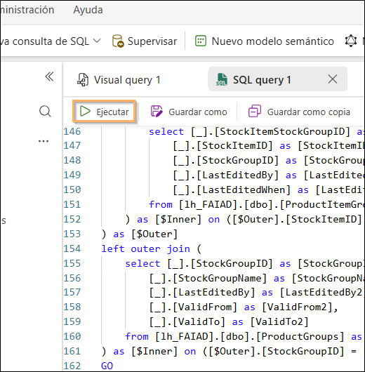

5. En el panel Explorador (izquierda), expanda Views. Tenemos las vistas recién creadas con datos listos para usar.

    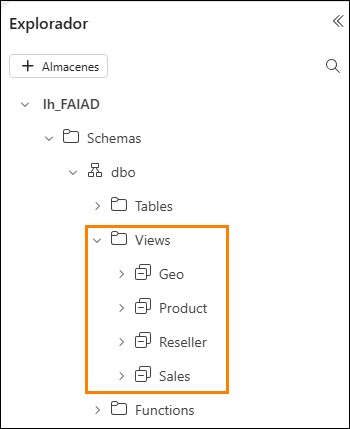

    Hemos transformado los datos del origen de datos ADLS Gen2. En este laboratorio, hemos aprendido a crear accesos directos y hemos explorado diversas opciones para usar vistas de consulta visual para transformar datos.

    En la siguiente práctica de laboratorio, aprenderemos a usar el flujo de datos Gen2 y a crear un acceso directo a otro almacén de lago de datos.

# Referencias

Fabric Analyst in a Day (FAIAD) le presenta algunas funciones clave disponibles en Microsoft Fabric. En el menú del servicio, la sección Ayuda (?) tiene vínculos a algunos recursos excelentes.

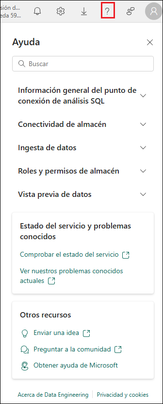

Estos son algunos recursos más que podrán ayudarle a seguir avanzando con Microsoft Fabric.

- Vea la publicación del blog para leer el [anuncio de disponibilidad general de Microsoft Fabric](https://aka.ms/Fabric-Hero-Blog-Ignite23) completo.

- Explore Fabric a través de la [Visita guiada](https://aka.ms/Fabric-GuidedTour).

- Regístrese en la [prueba gratuita de Microsoft Fabric](https://aka.ms/try-fabric).

- Visite el [sitio web de Microsoft Fabric](https://aka.ms/microsoft-fabric).

- Adquiera nuevas capacidades mediante la exploración de los [módulos de aprendizaje de Fabric](https://aka.ms/learn-fabric).

- Explore la [documentación técnica de Fabric](https://aka.ms/fabric-docs).

- Lea el [libro electrónico gratuito sobre cómo empezar a usar Fabric](https://aka.ms/fabric-get-started-ebook).

- Únase a la [comunidad de Fabric](https://aka.ms/fabric-community) para publicar sus preguntas, compartir sus comentarios y aprender de otros.

Obtenga más información en los blogs de anuncios de la experiencia Fabric:

- [Experiencia de Data Factory en el blog de Fabric](https://aka.ms/Fabric-Data-Factory-Blog)

- [Experiencia de Synapse Data Engineering en el blog de Fabric](https://aka.ms/Fabric-DE-Blog)

- [Experiencia de Synapse Data Science en el blog de Fabric](https://aka.ms/Fabric-DS-Blog)

- [Experiencia de Synapse Data Warehousing en el blog de Fabric](https://aka.ms/Fabric-DW-Blog)

- [Experiencia de Synapse Real-Time Analytics en el blog de Fabric](https://aka.ms/Fabric-RTA-Blog)

- [Blog de anuncios de Power BI](https://aka.ms/Fabric-PBI-Blog)

- [Experiencia de Data Activator en el blog de Fabric](https://aka.ms/Fabric-DA-Blog)

- [Administración y gobernanza en el blog de Fabric](https://aka.ms/Fabric-Admin-Gov-Blog)

- [OneLake en el blog de Fabric](https://aka.ms/Fabric-OneLake-Blog)

- [Blog de integración de Dataverse y Microsoft Fabric](https://aka.ms/Dataverse-Fabric-Blog)

© 2026 Microsoft Corporation. Todos los derechos reservados.

Al participar en esta demostración o laboratorio práctico, acepta las siguientes condiciones:

Microsoft Corporation pone a su disposición la tecnología o funcionalidad descrita en esta demostración/laboratorio práctico con el fin de obtener comentarios por su parte y de facilitarle una experiencia de aprendizaje. Esta demostración/laboratorio práctico solo se puede usar para evaluar las características de tal tecnología o funcionalidad y para proporcionar comentarios a Microsoft. No se puede usar para ningún otro propósito. Ninguna parte de esta demostración/ laboratorio práctico se puede modificar, copiar, distribuir, transmitir, mostrar, realizar, reproducir, publicar, licenciar, transferir ni vender, ni tampoco crear trabajos derivados de ella.

LA COPIA O REPRODUCCIÓN DE ESTA DEMOSTRACIÓN/LABORATORIO PRÁCTICO (O PARTE DE ELLA) EN CUALQUIER OTRO SERVIDOR O UBICACIÓN PARA SU REPRODUCCIÓN O DISTRIBUCIÓN POSTERIOR QUEDA EXPRESAMENTE PROHIBIDA.

ESTA DEMOSTRACIÓN/LABORATORIO PRÁCTICO PROPORCIONA CIERTAS FUNCIONES Y CARACTERÍSTICAS DE PRODUCTOS O TECNOLOGÍAS DE SOFTWARE (INCLUIDOS POSIBLES NUEVOS CONCEPTOS Y CARACTERÍSTICAS) EN UN ENTORNO SIMULADO SIN INSTALACIÓN O CONFIGURACIÓN COMPLEJA PARA EL PROPÓSITO ARRIBA DESCRITO. LA TECNOLOGÍA/CONCEPTOS DESCRITOS EN ESTA DEMOSTRACIÓN/LABORATORIO PRÁCTICO NO REPRESENTAN LA FUNCIONALIDAD COMPLETA DE LAS CARACTERÍSTICAS Y, EN ESTE SENTIDO, ES POSIBLE QUE NO FUNCIONEN DEL MODO EN QUE LO HARÁN EN UNA VERSIÓN FINAL. ASIMISMO, PUEDE QUE NO SE PUBLIQUE UNA VERSIÓN FINAL DE TALES CARACTERÍSTICAS O CONCEPTOS. DE IGUAL MODO, SU EXPERIENCIA CON EL USO DE ESTAS CARACTERÍSTICAS Y FUNCIONALIDADES EN UN ENTORNO FÍSICO PUEDE SER DIFERENTE.

**COMENTARIOS.** Si envía comentarios a Microsoft sobre las características, funcionalidades o conceptos de tecnología descritos en esta demostración/laboratorio práctico, acepta otorgar a Microsoft, sin cargo alguno, el derecho a usar, compartir y comercializar sus comentarios de cualquier modo y para cualquier fin. También concederá a terceros, sin cargo alguno, los derechos de patente necesarios para que sus productos, tecnologías y servicios usen o interactúen con cualquier parte específica de un software o servicio de Microsoft que incluya los comentarios. No enviará comentarios que estén sujetos a una licencia que obligue a Microsoft a conceder su software o documentación bajo licencia a terceras partes porque incluyamos sus comentarios en ellos. Estos derechos seguirán vigentes después del vencimiento de este acuerdo.

MICROSOFT CORPORATION RENUNCIA POR LA PRESENTE A TODAS LAS GARANTÍAS Y CONDICIONES RELATIVAS A LA DEMOSTRACIÓN/LABORATORIO PRÁCTICO, INCLUIDA CUALQUIER GARANTÍA Y CONDICIÓN DE COMERCIABILIDAD (YA SEA EXPRESA, IMPLÍCITA O ESTATUTARIA), DE IDONEIDAD PARA UN FIN DETERMINADO, DE TITULARIDAD Y DE AUSENCIA DE INFRACCIÓN. MICROSOFT NO DECLARA NI GARANTIZA LA EXACTITUD DE LOS RESULTADOS, EL RESULTADO DERIVADO DE LA REALIZACIÓN DE LA DEMOSTRACIÓN/LABORATORIO PRÁCTICO NI LA IDONEIDAD DE LA INFORMACIÓN CONTENIDA EN ELLA CON NINGÚN PROPÓSITO.

**DECLINACIÓN DE RESPONSABILIDADES**

Esta demostración/laboratorio práctico contiene solo una parte de las nuevas características y mejoras realizadas en Microsoft Power BI. Puede que algunas de las características cambien en versiones futuras del producto. En esta demostración/laboratorio práctico, conocerá algunas de estas nuevas características, pero no todas.
