# Microsoft Fabric - Fabric Analyst in a Day - Laboratorio 6

## Contenido

- Presentación
- Almacén de lago de datos: análisis de datos
  - Tarea 1: Consultar datos con SQL
  - Tarea 2: visualizar el resultado de T-SQL
- Almacén de lago de datos: modelado semántico
  - Tarea 3: Crear un modelo semántico
  - Tarea 4: Crear relaciones
  - Tarea 5: Crear medidas
  - Tarea 6: Sección opcional: crear relaciones
  - Tarea 7: Sección opcional: crear medidas
- Referencias


# c

# Presentación

Tenemos datos de diferentes orígenes ingeridos en el almacén de lago de datos. En esta práctica de laboratorio, trabajará con el modelo semántico. Normalmente, hacemos actividades de modelado como crear relaciones, agregar medidas, etc. en Power BI Desktop. Aquí aprenderemos cómo hacer estas actividades de modelado en el servicio.

Al final de este laboratorio, habrá aprendido:

- Usar la vista SQL en el punto de conexión de análisis SQL

- Cómo crear un modelo semántico

# Almacén de lago de datos: análisis de datos

### Tarea 1: Consultar datos con SQL

1. Volvamos al área de trabajo de Fabric, **FAIAD_<username>**, que creó en el Laboratorio 2, Tarea 8.

2. Si lo desea, **Minimice el flujo de tareas** para ver la lista completa de elementos.

3. Verá tres elementos asociados a lh_FAIAD: almacén de lago de datos, modelo semántico y punto de conexión SQL. Hemos explorador el almacén de lago de datos y creado una consulta de objeto visual y consulta SQL mediante el **punto de conexión de análisis SQL** en un laboratorio anterior. Seleccione **FAIAD_<nombre de usuario>** en la navegación izquierda y elija la opción **punto de conexión de análisis SQL de lh_FAIAD** para continuar explorando esta opción. Esto le llevará a la **vista de SQL** del explorador.

    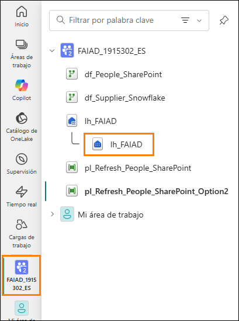

    Si desea explorar los datos antes de crear un modelo de datos, puede utilizar SQL para hacerlo. Hay dos opciones disponibles para usar SQL. La primera opción es la consulta visual, que utilizamos en el laboratorio anterior. La primera opción es la consulta de objeto visual, que utilizamos en el laboratorio anterior junto con la opción 2, escribiendo el código TSQL. Exploremos más.

    Supongamos que desea conocer rápidamente las Units vendidas por el proveedor mediante SQL.

    En el almacén de lago de datos, punto de conexión de análisis SQL, observe que en el panel izquierdo puede ver las tablas. Si expande las tablas, puede ver las columnas que componen la tabla. Además, hay opciones para crear vistas, funciones y procedimientos almacenados de SQL. Si tiene experiencia en SQL, no dude en explorar estas opciones. Intentemos escribir una consulta SQL simple.

4. En el **menú superior**, seleccione **Nueva consulta SQL** o en el centro de la pantalla haga clic en **Nueva consulta SQL**. Esto le llevará a la vista de consultas de SQL.

    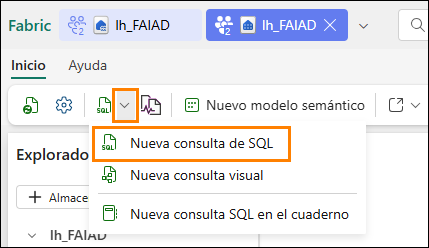

5. Copie la **siguiente consulta de SQL** en la **ventana de consultas**. Esta consulta devolverá las unidades por nombre del proveedor. Para conseguirlo, se une la tabla Sales con las tablas Product y Supplier.

    ```sql
    SELECT su.SupplierName, SUM(Quantity) as Units

    FROM dbo.Sales s

    JOIN dbo.Product p on p.StockItemID = s.StockItemID

    JOIN dbo.Supplier su on su.SupplierID = p.SupplierID

    GROUP BY su.SupplierName
    ```
6. Haga clic en **Run** en el menú del editor de SQL para ver los resultados.

7. Observe que hay una opción para guardar esta consulta como Vista si selecciona **Guardar como copia**.

8. En el panel del **explorador izquierdo**, en la sección **Queries**, observe que esta consulta se guarda en **Mis consultas** como **SQL query 2**. Esto proporciona una opción para cambiar el nombre de la consulta y guardarla para uso futuro. También hay una opción para ver las consultas que se comparten con usted mediante la carpeta **Consultas compartidas**.

    **Nota:** Las consultas visuales que había creado en laboratorios anteriores también están disponibles en la carpeta Mis consultas.

    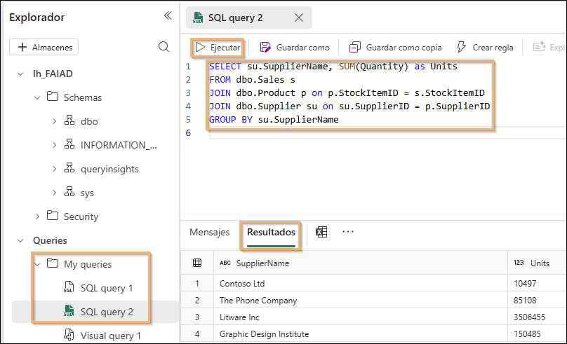

### Tarea 2: visualizar el resultado de T-SQL

1. También podemos visualizar el resultado de esta consulta. **Resalte la consulta** en el panel de consulta

2. En el menú del panel Resultados, seleccione el icono desplegable -> **Visualización de resultados**.

    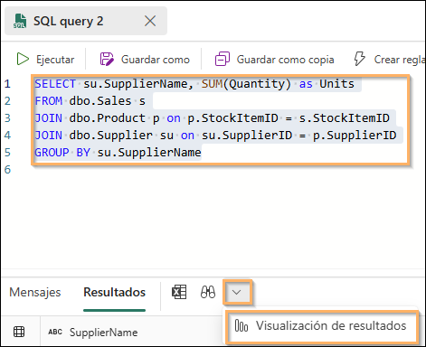

3. Se abrirá el cuadro de diálogo **Visualización de resultados**. Seleccione **Continuar**.

    Se abre el cuadro de diálogo **Visualización de resultados** que se parece a la vista de informe de Power BI Desktop. Esto tiene todas las características disponibles en la vista de informe de Power BI Desktop, puede formatear la página, seleccionar diferentes visuales, formatear visuales, añadir filtros, etc. No exploraremos estas opciones en este curso.

4. Expanda el panel **Datos** y expanda **SQL query 2**.

5. Seleccione los **campos**** Supplier_Name** y **Units**. Se crea un objeto visual de tabla.

    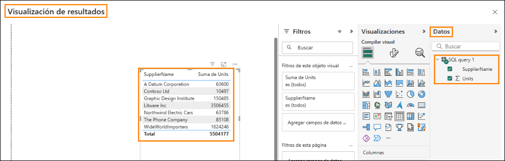

6. En la sección **Visualizaciones**, cambie el tipo de objeto visual mediante la selección del **gráfico de Columna apilada**.

7. Seleccione **Guardar como informe** en la parte inferior derecha de la pantalla.

    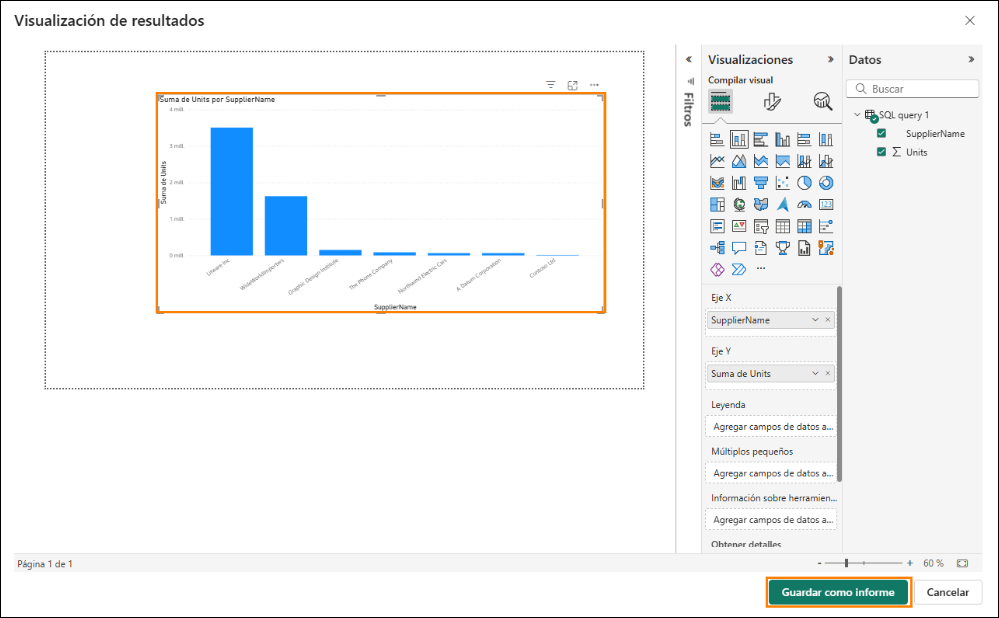

8. Se abre el cuadro de diálogo Guardar el informe. Escriba **Units by Supplier** en el cuadro de texto **Especifique un nombre para el informe**.

9. Asegúrese de que el área de trabajo de destino es su área de trabajo de Fabric **FAIAD_<username>**

10. Seleccione **Guardar**.

    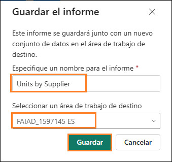

    Se le dirigirá de nuevo a la pantalla de consulta SQL.

# Almacén de lago de datos: modelado semántico

### Tarea 3: Crear un modelo semántico

1. En el menú de punto de conexión de análisis SQL, seleccione **Nuevo modelo semántico**.

    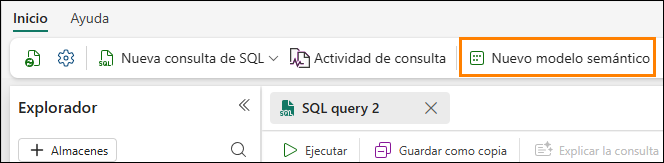

2. Se abre el cuadro de diálogo **Nuevo modelo semántico**. Escriba **sm_FAIAD** como nombre del modelo semántico de Direct Lake.

3. Tenemos la opción de seleccionar un subconjunto de las tablas de manera predeterminada. Recuerde que creamos vistas en el laboratorio anterior. Queremos incluir estas vistas en el modelo. Expanda el esquema **dbo**; desde aquí, puede ver todas las tablas y vistas en su almacén de lago de datos.

    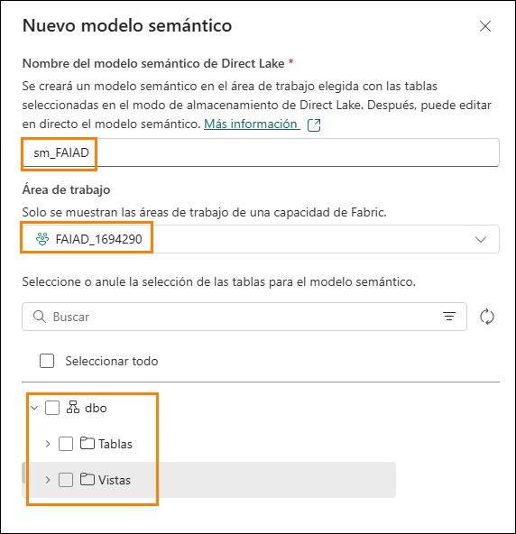

4. **Seleccione** las siguientes tablas/vistas:

    1. **Customer**

    2. **Date**

    3. **People**

    4. **PO**

    5. **Supplier**

    6. **Geo**

    7. **Product**

    8. **Reseller**

    9. **Sales**

5. Seleccione **Confirmar.**

    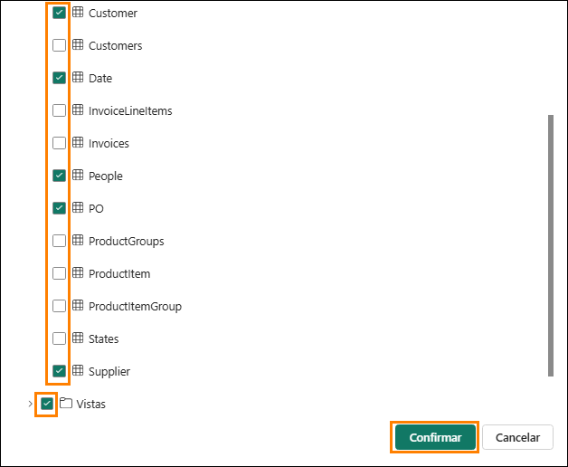

    Irá al nuevo modelo semántico con las tablas seleccionadas. Asegúrese de **reorganizar** las tablas según sea necesario. Observe que algunas de las tablas (Geo, Reseller, Sales y Product) tienen un signo de advertencia en la parte superior derecha de la tabla. Esto se debe a que son vistas. Todos los objetos visuales creados con campos de estas vistas estarán en modo Direct Query y no en modo Direct Lake.

    **Nota:** El modo Direct Lake es más rápido que el modo Direct Query.

### Tarea 4: Crear relaciones

Si no se encuentra actualmente dentro del modelo semántico recién creado, vayamos al lugar correcto.

1. Volvamos al **espacio de trabajo** de Fabric y seleccionemos el modelo semántico **sm_FAIAD**.

    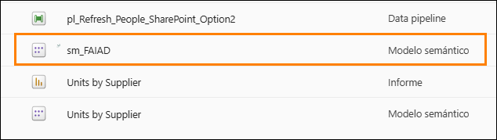

2. Haga clic en **Abrir modelo semántico**.

    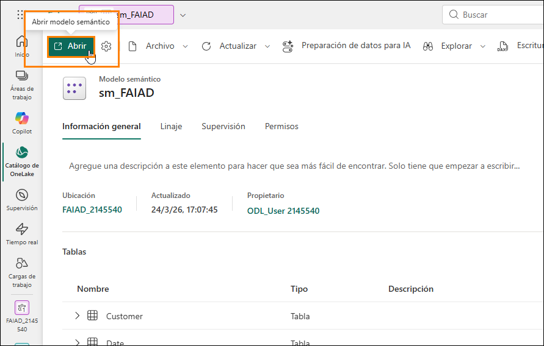

3. En la esquina superior derecha, asegúrese de que se encuentra en el modo **Edición.**

    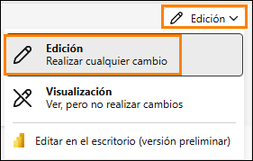

4. El primer paso es crear relaciones entre estas tablas.

    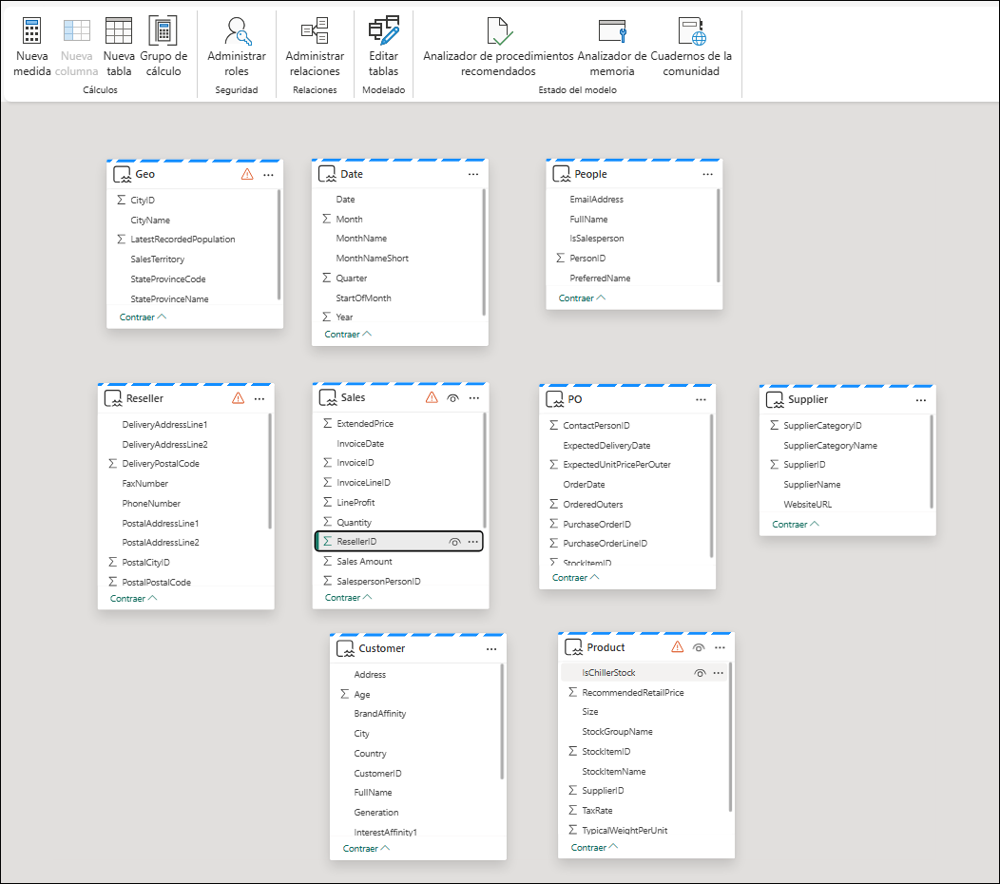

5. Creemos una relación entre las tablas Sales y Reseller. Seleccione **ResellerID** de la tabla **Sales** y arrástrelo a **ResellerID** en la tabla **Reseller**.

    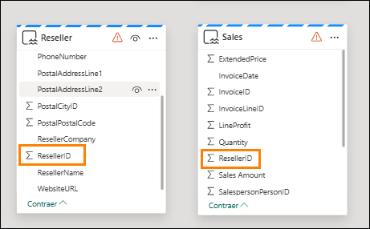

6. Se abre el cuadro de diálogo Nueva relación. Asegúrese de que la **Desde la tabla** sea **Sales** y que la **Columna** sea **ResellerID.**

7. Asegúrese de que **A la tabla** sea **Reseller** y que la **Columna** sea **ResellerID.**

8. Asegúrese de que **Cardinality** sea **Varios a uno (\*:1)**.

9. Asegúrese de que **Dirección de filtro cruzado** sea **Único**.

10. Seleccione **Guardar**.

    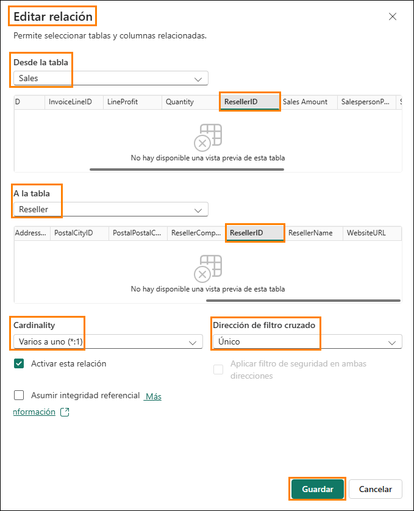

11. De forma similar, creemos una relación entre las tablas Sales y Date. Seleccione **InvoiceDate** de la tabla **Sales** y arrástrelo a **Date** en la tabla **Date**.

12. Se abre el cuadro de diálogo Nueva relación. Asegúrese de que **Desde la tabla** sea **Sales** y que la **Columna** sea **InvoiceDate.**

13. Asegúrese de que **A la tabla** sea **Date** y que la **Columna** sea **Date.**

14. Asegúrese de que **Cardinality** sea **Varios a uno (\*:1)**.

15. Asegúrese de que **Dirección de filtro cruzado** sea **Único**.

16. Seleccione **Guardar**.

    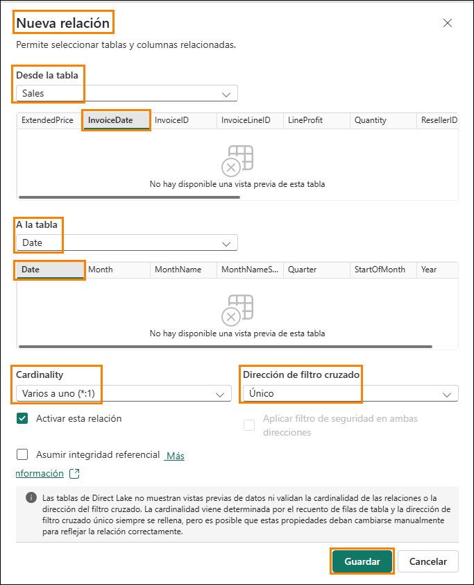

17. De forma similar, cree una relación **varios a uno** entre las tablas **Sales** y **Product**. Seleccione **StockItemID** en la tabla **Sales** y **StockItemID** en la tabla **Product**.

    **Nota:** Todas nuestras actualizaciones se guardan automáticamente.

    **Punto de control:** su modelo debe tener tres relaciones entre las tablas Sales y Reseller, Sales y Date y Sales y Product como se muestra en la siguiente captura de pantalla:

    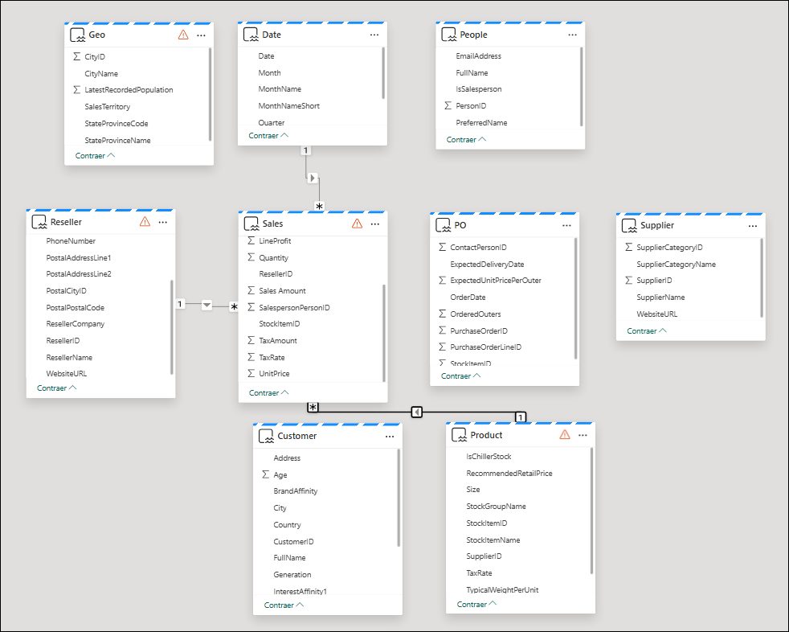

    Por razones de tiempo, no crearemos todas las relaciones. Si el tiempo lo permite, puede completar la sección opcional al final de la práctica de laboratorio. La sección opcional recorre los pasos para crear las relaciones restantes.

### Tarea 5: Crear medidas

Agreguemos algunas medidas que necesitamos para crear el panel de Sales.

1. Seleccione la **tabla Sales** desde la vista del modelo. Queremos agregar las medidas a la tabla Sales.

2. En el menú superior, seleccione **Inicio -> Nueva medida**. Observe que se muestra la barra de fórmulas.

3. Introduzca **Sales = SUM(‘Sales’[Sales Amount])** en la **barra de fórmulas**.

4. Haga clic en la **marca de verificación** izquierda de la barra de fórmulas o haga clic en el botón **Entrar**.

5. Expanda el panel Propiedades de la derecha.

6. Expanda la sección **Formato**.

7. En el menú desplegable **Formato**, seleccione **Moneda**.

8. Establezca Posiciones decimales en **0**.

    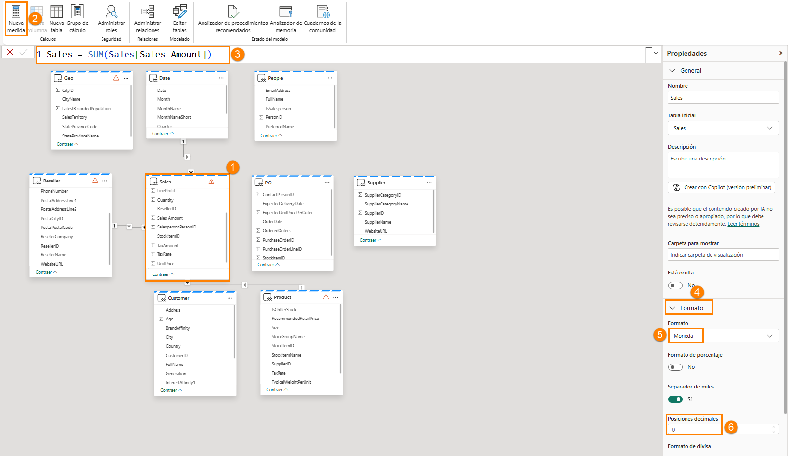

9. Con la **tabla Sales** seleccionada en el menú superior, seleccione **Inicio -> Nueva medida**. Observe que se muestra la barra de fórmulas.

10. Introduzca **Units = SUM(‘Sales’[Quantity])** en la **barra de fórmulas**.

11. Haga clic en la **marca de verificación** izquierda de la barra de fórmulas o haga clic en el botón **Entrar**.

12. En el panel Propiedades a la derecha, expanda la sección **Formato** (el panel Propiedades puede tardar unos momentos en cargarse).

13. En el menú desplegable **Formato**, seleccione **Número entero**.

14. Utilice el control deslizante para establecer el **Separador de miles** en **Sí**.

    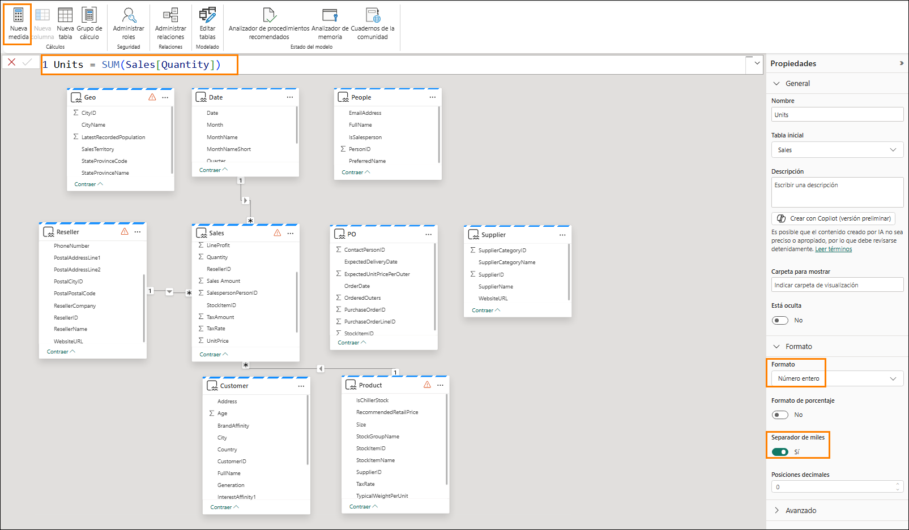

15. Con la **tabla Sales** seleccionada en el menú superior, seleccione **Inicio -> Nueva medida**. Observe que se muestra la barra de fórmulas.

16. Introduzca **Sales Orders = DISTINCTCOUNT(‘Sales’[InvoiceID])** en la **barra de fórmulas**.

17. Haga clic en la **marca de verificación** izquierda de la barra de fórmulas o haga clic en el botón **Entrar**.

18. En el panel Propiedades de la derecha, expanda la sección **Formato**.

19. En el menú desplegable **Formato**, seleccione **Número entero**.

20. Utilice el control deslizante para establecer el **Separador de miles** en **Sí**.

    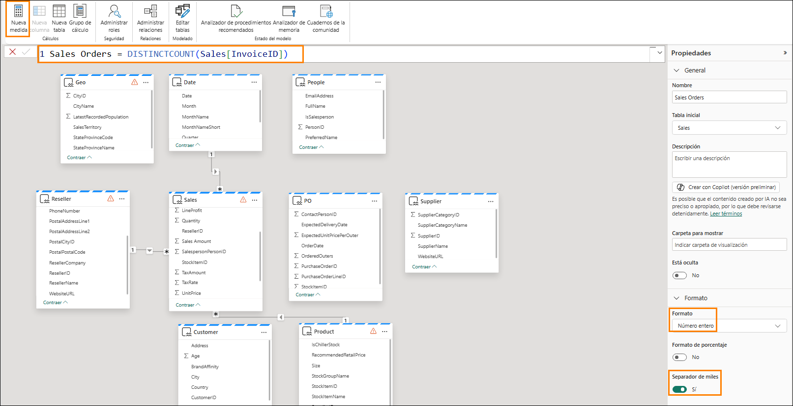

21. En el **Panel de datos** (en la derecha), seleccione **Modelo**. Observe que esto proporciona una vista que ayudará a organizar todos los elementos del modelo semántico.

22. Expanda **Modelo semántico -> Medidas** para ver todas las medidas que acaba de crear.

23. También puede **expandir tablas individuales** para ver las columnas, jerarquías y medidas en cada una de ellas.

    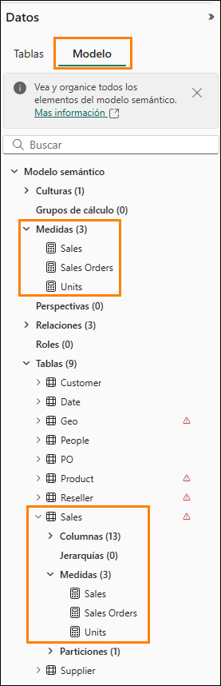

    De nuevo, por razones de tiempo, no crearemos todas las medidas. Si el tiempo lo permite, puede completar la sección opcional al final de la práctica de laboratorio. La sección opcional recorre los pasos para crear las medidas restantes.

    Hemos creado un modelo semántico, el siguiente paso es crear un informe. Lo haremos en el siguiente laboratorio.

### Tarea 6: Sección opcional: crear relaciones

Agreguemos las relaciones restantes.

1. En el menú, seleccione **Inicio -> Administrar relaciones**.

2. Se abre el cuadro de diálogo Administrar relaciones. Seleccione + **Nueva relación**.

    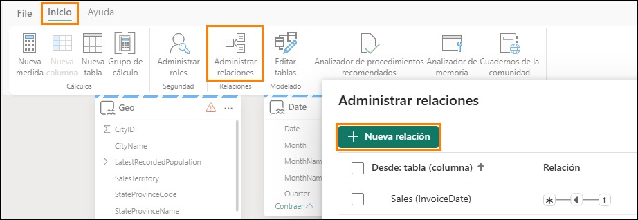

3. Se abre el cuadro de diálogo Nueva relación. Asegúrese de que la **Desde la tabla** sea **Sales** y que la **Columna** sea **SalespersonPersonID.**

4. Asegúrese de que la **A la tabla** sea **People** y que la **Columna** sea **PersonID.**

5. Asegúrese de que la **Cardinality** sea **Varios a uno (\*:1)**.

6. Asegúrese de que la **Dirección de filtro cruzado** sea **Único**.

7. Seleccione **Guardar**. Se abre el cuadro de diálogo Administrar relaciones con la nueva relación agregada.

    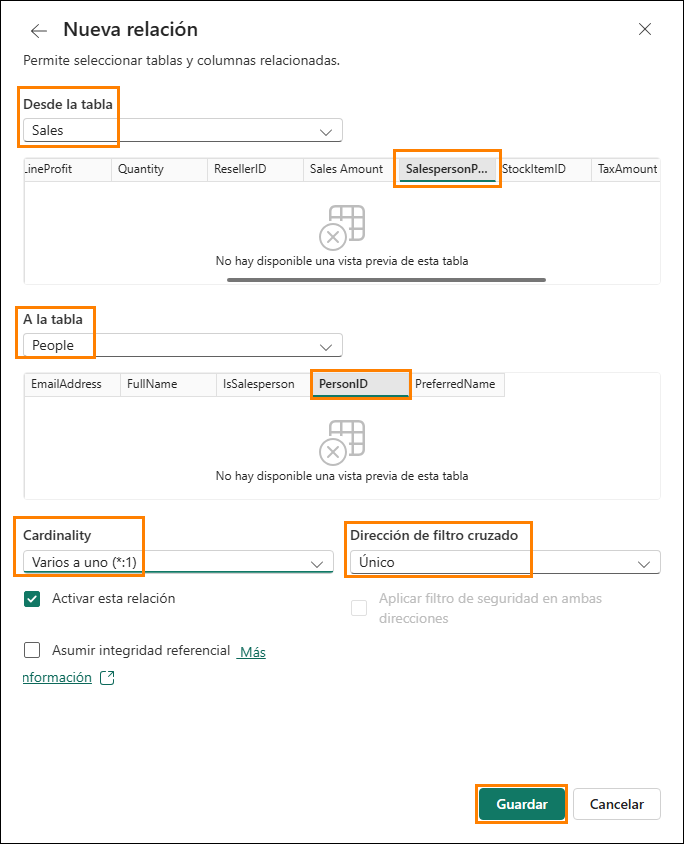

8. Ahora creemos una relación entre las tablas Product y Supplier. Seleccione **+ Nueva relación**.

9. Asegúrese de que **Desde la tabla** sea **Product** y que la **Columna** sea **SupplierID.**

10. Asegúrese de que **A la tabla** sea **Supplier** y que la **Columna** sea **SupplierID.**

11. Asegúrese de que **Cardinality** sea **Varios a uno (\*:1)**.

12. Asegúrese de que **Dirección de filtro cruzado** sea **Ambas**.

13. Seleccione **Guardar**.

    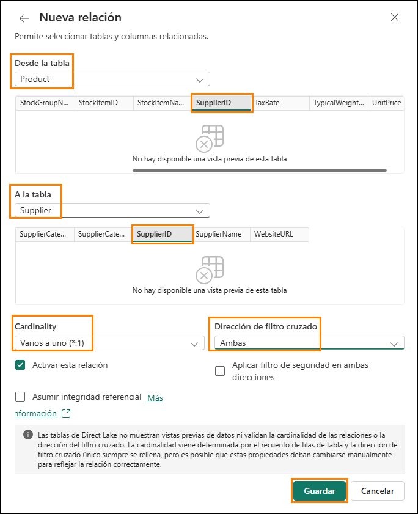

14. Ahora creemos una relación entre las tablas Reseller y Geo. Seleccione **+ Nueva relación**.

15. Se abre el cuadro de diálogo Nueva relación. Asegúrese de que la **Desde la tabla** sea **Reseller** y que la **Columna** sea **PostalCityID.**

16. Asegúrese de que **A la tabla** sea **Geo** y que la **Columna** sea **CityID.**

17. Asegúrese de que **Cardinality** sea **Varios a uno (\*:1)**.

18. Asegúrese de que **Dirección de filtro cruzado** sea **Ambas**.

19. Seleccione **Guardar**.

    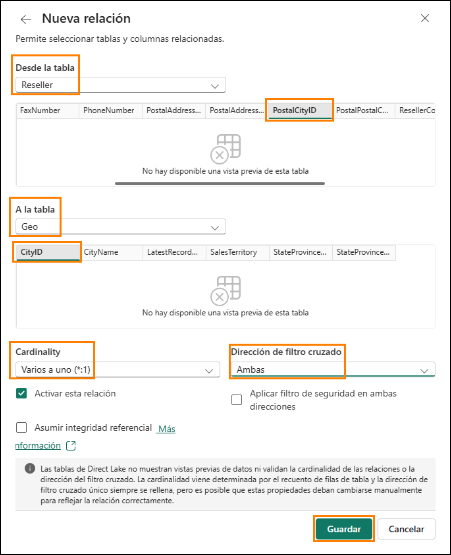

20. Del mismo modo, creamos una relación entre las tablas Customer y Reseller. Seleccione **+ Nueva relación**.

21. Se abre el cuadro de diálogo Nueva relación. Asegúrese de que **Desde la tabla** sea **Customer** y que **Columna** sea **ResellerID.**

22. Asegúrese de que **A la tabla** sea **Reseller** y que la **Columna** sea **ResellerID.**

23. Asegúrese de que **Cardinality** sea **Varios a uno (\*:1)**.

24. Asegúrese de que **Dirección de filtro** **cruzado** sea **Único**.

25. Seleccione **Guardar**.

    **Punto de control:** la administración de relaciones debe parecerse al de la siguiente captura de pantalla.

    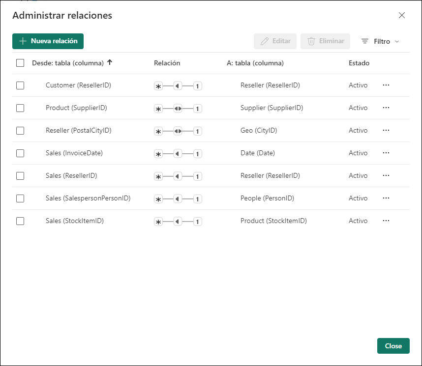

26. Igualmente, cree una relación **varios a uno** entre las tablas **PO** y **Date**. Seleccione **Order_Date** de **PO** y **Date** de **Date**.

27. Igualmente, cree una relación **varios a uno** entre las tablas **PO** y **Product**. Seleccione **StockItemID** de **PO** y **StockItemID** de **Product**.

28. Igualmente, cree una relación **varios a uno** entre las tablas **PO** y **People**. Seleccione **ContactPersonID** de **PO** y **PersonID** de **People**.

29. Haga clic en **Cerrar** para cerrar el cuadro de diálogo Administrar relaciones. Hemos terminado de crear todas las relaciones.

    **Punto de control:** su modelo debe parecerse al de la siguiente captura de pantalla.

    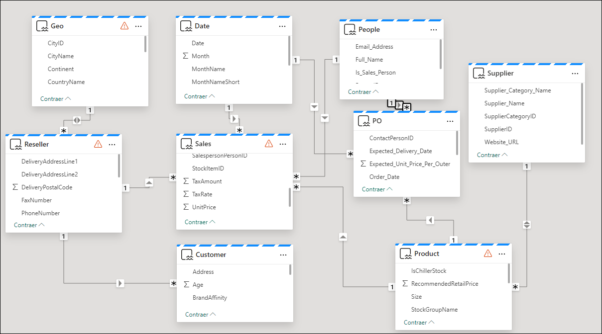

### Tarea 7: Sección opcional: crear medidas

Agreguemos las medidas restantes.

1. Seleccione la tabla **Sales** y en el menú superior, seleccione **Inicio -> Nueva medida**.

2. Introduzca **Avg Order = DIVIDE([Sales], [Sales Orders])** en la barra de fórmulas.

3. Haga clic en la **marca de verificación** en la barra de fórmulas o haga clic en el botón Entrar.

4. Expanda el panel Propiedades de la derecha.

5. Expanda la sección **Formato**.

6. En el menú desplegable **Formato**, seleccione **Moneda**.

7. Establezca Posiciones decimales en 0.

    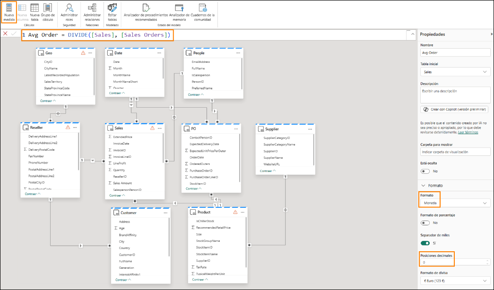

8. Siga pasos similares para agregar las siguientes medidas:

    1. En la tabla **Sales , GM = SUM(‘Sales’[LineProfit])** formateado como **Divisa con 0 decimales.**

    2. En la tabla **Sales**,** GM% = DIVIDE([GM], [Sales])** formateado como **Porcentaje con 0 decimales.**

    3. En la tabla **Customer, No of Customers = COUNTROWS(Customer)** formateado como **Número entero con separador de miles activado.**

# Referencias

Fabric Analyst in a Day (FAIAD) le presenta algunas funciones clave disponibles en Microsoft Fabric. En el menú del servicio, la sección Ayuda (?) tiene vínculos a algunos recursos excelentes.


Estos son algunos recursos más que podrán ayudarle a seguir avanzando con Microsoft Fabric.

- Vea la publicación del blog para leer el [anuncio de disponibilidad general de Microsoft Fabric](https://aka.ms/Fabric-Hero-Blog-Ignite23) completo.

- Explore Fabric a través de la [Visita guiada](https://aka.ms/Fabric-GuidedTour).

- Regístrese en la [prueba gratuita de Microsoft Fabric](https://aka.ms/try-fabric).

- Visite el [sitio web de Microsoft Fabric](https://aka.ms/microsoft-fabric).

- Adquiera nuevas capacidades mediante la exploración de los [módulos de aprendizaje de Fabric](https://aka.ms/learn-fabric).

- Explore la [documentación técnica de Fabric](https://aka.ms/fabric-docs).

- Lea el [libro electrónico gratuito sobre cómo empezar a usar Fabric](https://aka.ms/fabric-get-started-ebook).

- Únase a la [comunidad de Fabric](https://aka.ms/fabric-community) para publicar sus preguntas, compartir sus comentarios y aprender de otros.

Obtenga más información en los blogs de anuncios de la experiencia Fabric:

- [Experiencia de Data Factory en el blog de Fabric](https://aka.ms/Fabric-Data-Factory-Blog)

- [Experiencia de Synapse Data Engineering en el blog de Fabric](https://aka.ms/Fabric-DE-Blog)

- [Experiencia de Synapse Data Science en el blog de Fabric](https://aka.ms/Fabric-DS-Blog)

- [Experiencia de Synapse Data Warehousing en el blog de Fabric](https://aka.ms/Fabric-DW-Blog)

- [Experiencia de Synapse Real-Time Analytics en el blog de Fabric](https://aka.ms/Fabric-RTA-Blog)

- [Blog de anuncios de Power BI](https://aka.ms/Fabric-PBI-Blog)

- [Experiencia de Data Activator en el blog de Fabric](https://aka.ms/Fabric-DA-Blog)

- [Administración y gobernanza en el blog de Fabric](https://aka.ms/Fabric-Admin-Gov-Blog)

- [OneLake en el blog de Fabric](https://aka.ms/Fabric-OneLake-Blog)

- [Blog de integración de Dataverse y Microsoft Fabric](https://aka.ms/Dataverse-Fabric-Blog)

© 2023 Microsoft Corporation. Todos los derechos reservados.

Al participar en esta demostración o laboratorio práctico, acepta las siguientes condiciones:

Microsoft Corporation pone a su disposición la tecnología o funcionalidad descrita en esta demostración/laboratorio práctico con el fin de obtener comentarios por su parte y de facilitarle una experiencia de aprendizaje. Esta demostración/laboratorio práctico solo se puede usar para evaluar las características de tal tecnología o funcionalidad y para proporcionar comentarios a Microsoft. No se puede usar para ningún otro propósito. Ninguna parte de esta demostración/laboratorio práctico se puede modificar, copiar, distribuir, transmitir, mostrar, realizar, reproducir, publicar, licenciar, transferir ni vender, ni tampoco crear trabajos derivados de ella.

LA COPIA O REPRODUCCIÓN DE ESTA DEMOSTRACIÓN/LABORATORIO PRÁCTICO (O PARTE DE ELLA) EN CUALQUIER OTRO SERVIDOR O UBICACIÓN PARA SU REPRODUCCIÓN O DISTRIBUCIÓN POSTERIOR QUEDA EXPRESAMENTE PROHIBIDA.

ESTA DEMOSTRACIÓN/LABORATORIO PRÁCTICO PROPORCIONA CIERTAS FUNCIONES Y CARACTERÍSTICAS DE PRODUCTOS O TECNOLOGÍAS DE SOFTWARE (INCLUIDOS POSIBLES NUEVOS CONCEPTOS Y CARACTERÍSTICAS) EN UN ENTORNO SIMULADO SIN INSTALACIÓN O CONFIGURACIÓN COMPLEJA PARA EL PROPÓSITO ARRIBA DESCRITO. LA TECNOLOGÍA/CONCEPTOS DESCRITOS EN ESTA DEMOSTRACIÓN/LABORATORIO PRÁCTICO NO REPRESENTAN LA FUNCIONALIDAD COMPLETA DE LAS CARACTERÍSTICAS Y, EN ESTE SENTIDO, ES POSIBLE QUE NO FUNCIONEN DEL MODO EN QUE LO HARÁN EN UNA VERSIÓN FINAL. ASIMISMO, PUEDE QUE NO SE PUBLIQUE UNA VERSIÓN FINAL DE TALES CARACTERÍSTICAS O CONCEPTOS. DE IGUAL MODO, SU EXPERIENCIA CON EL USO DE ESTAS CARACTERÍSTICAS Y FUNCIONALIDADES EN UN ENTORNO FÍSICO PUEDE SER DIFERENTE.

**COMENTARIOS**. Si envía comentarios a Microsoft sobre las características, funcionalidades o conceptos de tecnología descritos en esta demostración/laboratorio práctico, acepta otorgar a Microsoft, sin cargo alguno, el derecho a usar, compartir y comercializar sus comentarios de cualquier modo y para cualquier fin. También concederá a terceros, sin cargo alguno, los derechos de patente necesarios para que sus productos, tecnologías y servicios usen o interactúen con cualquier parte específica de un software o servicio de Microsoft que incluya los comentarios. No enviará comentarios que estén sujetos a una licencia que obligue a Microsoft a conceder su software o documentación bajo licencia a terceras partes porque incluyamos sus comentarios en ellos. Estos derechos seguirán vigentes después del vencimiento de este acuerdo.

MICROSOFT CORPORATION RENUNCIA POR LA PRESENTE A TODAS LAS GARANTÍAS Y CONDICIONES RELATIVAS A LA DEMOSTRACIÓN/LABORATORIO PRÁCTICO, INCLUIDA CUALQUIER GARANTÍA Y CONDICIÓN DE COMERCIABILIDAD (YA SEA EXPRESA, IMPLÍCITA O ESTATUTARIA), DE IDONEIDAD PARA UN FIN DETERMINADO, DE TITULARIDAD Y DE AUSENCIA DE INFRACCIÓN. MICROSOFT NO DECLARA NI GARANTIZA LA EXACTITUD DE LOS RESULTADOS, EL RESULTADO DERIVADO DE LA REALIZACIÓN DE LA DEMOSTRACIÓN/LABORATORIO PRÁCTICO NI LA IDONEIDAD DE LA INFORMACIÓN CONTENIDA EN ELLA CON NINGÚN PROPÓSITO.

**DECLINACIÓN DE RESPONSABILIDADES**

Esta demostración/laboratorio práctico contiene solo una parte de las nuevas características y mejoras realizadas en Microsoft Power BI. Puede que algunas de las características cambien en versiones futuras del producto. En esta demostración/laboratorio práctico, conocerá algunas de estas nuevas características, pero no todas.
