# Microsoft Fabric - Fabric Analyst in a Day - Oefening 1

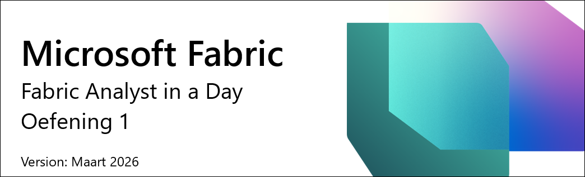

# Inhoud

* Documentstructuur

* Scenario / Probleemstelling

* Overzicht van het Power BI Desktop-rapport

  * Taak 1: Power BI Desktop instellen in de labomgeving

  * Taak 2: Power BI Desktop-rapport analyseren

  * Taak 3: Power Query's bekijken

* Referenties

# Documentstructuur

Het lab bevat stappen die de gebruiker kan volgen, samen met bijbehorende schermafbeeldingen die visuele ondersteuning bieden. In elke schermafbeelding worden secties gemarkeerd met oranje vakken om aan te geven op welke gebieden de gebruiker zich moet richten.

> **Opmerking:** Sommige schermafbeeldingen kunnen verouderd zijn vanwege doorlopende productupdates.

# Scenario / Probleemstelling

Fabrikam, Inc. is een groothandel in novelty-producten. Als groothandel zijn de klanten van Fabrikam voornamelijk bedrijven die producten doorverkopen aan particulieren. Fabrikam verkoopt aan retailklanten in de gehele Verenigde Staten, waaronder speciaalzaken, supermarkten, computerwinkels en winkels bij toeristische attracties. Fabrikam verkoopt ook aan andere groothandels via een netwerk van vertegenwoordigers die de producten namens Fabrikam promoten. Hoewel alle klanten van Fabrikam momenteel gevestigd zijn in de Verenigde Staten, is het bedrijf van plan uit te breiden naar andere landen/regio's.

U bent een Data-analist binnen het verkoopteam. U verzamelt, opschoont en interpreteert datasets om zakelijke problemen op te lossen. U maakt ook visualisaties zoals diagrammen en grafieken, schrijft rapporten en presenteert deze aan de besluitvormers binnen de organisatie.

Om waardevolle inzichten uit de gegevens te halen, haalt u gegevens op uit meerdere systemen, maakt u deze schoon en combineert u ze. U haalt gegevens op uit de volgende bronnen:

* **Verkoopgegevens:** komen uit het ERP-systeem en de gegevens worden opgeslagen in een ADLS Gen2-database. Deze worden elke dag om 12:00 uur 's middags bijgewerkt.

* **Leveranciersgegevens:** komen van verschillende leveranciers en de gegevens worden opgeslagen in een Snowflake-database. Deze worden elke dag om 00:00 uur (middernacht) bijgewerkt.

* **Klantgegevens:** komen uit Customer Insights en de gegevens worden opgeslagen in Dataverse. De gegevens zijn altijd actueel.

* **Werknemersgegevens:** komen uit het HR-systeem; deze worden opgeslagen als een exportbestand in een SharePoint-map. Deze worden elke ochtend om 09:00 uur bijgewerkt.

   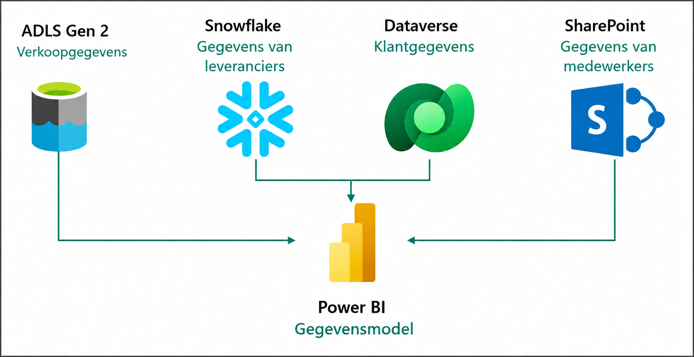

U bouwt momenteel een semantisch model in Power BI Premium dat gegevens uit de bovenstaande bronsystemen ophaalt om te voldoen aan uw rapportagebehoeften en eindgebruikers de mogelijkheid te bieden om zelfstandig analyses uit te voeren. U gebruikt Power Query om uw model bij te werken.

**U wordt geconfronteerd met de volgende uitdagingen:**

* U moet uw dataset minimaal drie keer per dag vernieuwen om rekening te houden met de verschillende updatetijden van de verschillende gegevensbronnen.

* Het vernieuwen duurt lang, omdat u elke keer een volledige vernieuwing moet uitvoeren om alle updates die in de bronsystemen hebben plaatsgevonden op te nemen.

* Eventuele fouten in een van de gegevensbronnen waaruit u gegevens ophaalt, zorgen ervoor dat het vernieuwen van uw dataset mislukt. Vaak wordt het werknemersbestand niet op tijd geüpload, waardoor het vernieuwen van uw dataset mislukt.

* Het kost veel tijd om wijzigingen aan te brengen in uw gegevensmodel, omdat Power Query veel tijd nodig heeft om de voorbeelden te vernieuwen vanwege de grote hoeveelheid gegevens en complexe transformaties.

* U hebt een Windows-pc nodig om Power BI Desktop te gebruiken, terwijl de bedrijfsstandaard Mac is.

U hebt gehoord over Microsoft Fabric en besloot dit uit te proberen om te zien of het uw uitdagingen kan oplossen.

# Overzicht van het Power BI Desktop-rapport

Voordat we met Fabric beginnen, bekijken we eerst het huidige rapport in Power BI Desktop om de transformaties en het model te begrijpen.

## Taak 1: Power BI Desktop instellen in de labomgeving

1. Open het bestand **FAIAD.pbix** in de map **Reports** op het **bureaublad** van uw labomgeving. Het bestand wordt geopend in Power BI Desktop.

   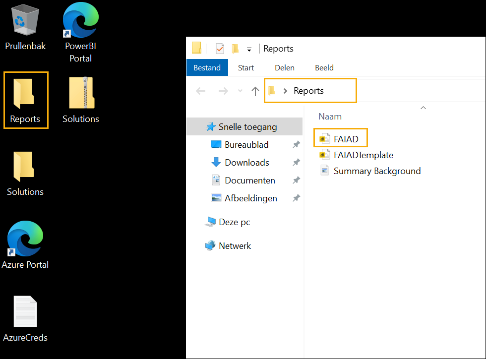

   > ### **Opmerking:** Als Power BI Desktop niet meer reageert op het scherm **“Voer uw e-mailadres in”** en u niet kunt typen, beweeg dan uw cursor over het Power BI-pictogram op de taakbalk (1). Sluit vervolgens het extra lege (witte) venster door op **X** (2) te klikken. Hierdoor reageert het hoofdvenster van Power BI weer.

   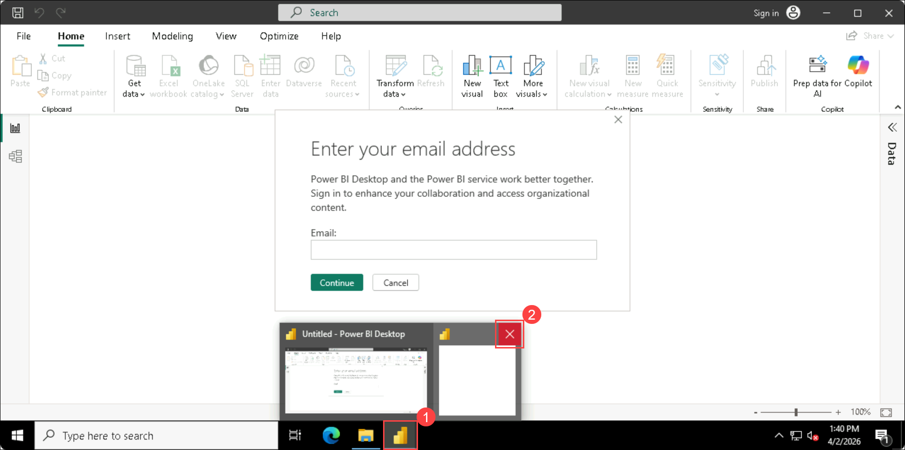

2. Zodra het dialoogvenster **"Voer uw e-mailadres in"** verschijnt, kopieert u de **Gebruikersnaam** en plakt u deze in het veld **E-mail** van het dialoogvenster en selecteert u **Doorgaan**.

   * E-mail/Gebruikersnaam: <inject key="AzureAdUserEmail"></inject>

     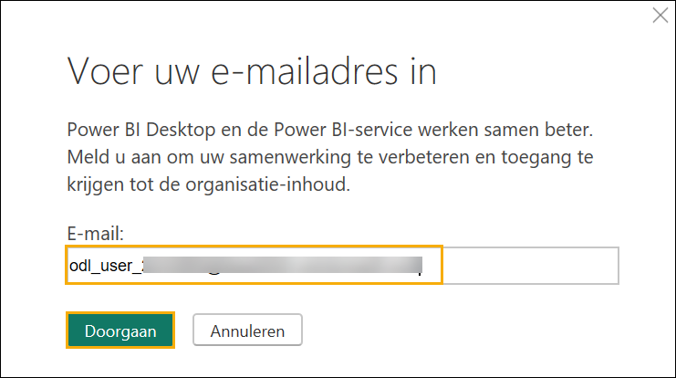

3. Op het tabblad **Aanmelden bij Microsoft Azure** ziet u het aanmeldscherm. Voer het volgende **E-mailadres/Gebruikersnaam** in en klik vervolgens op **Volgende**.

   * E-mail/Gebruikersnaam: <inject key="AzureAdUserEmail"></inject>

     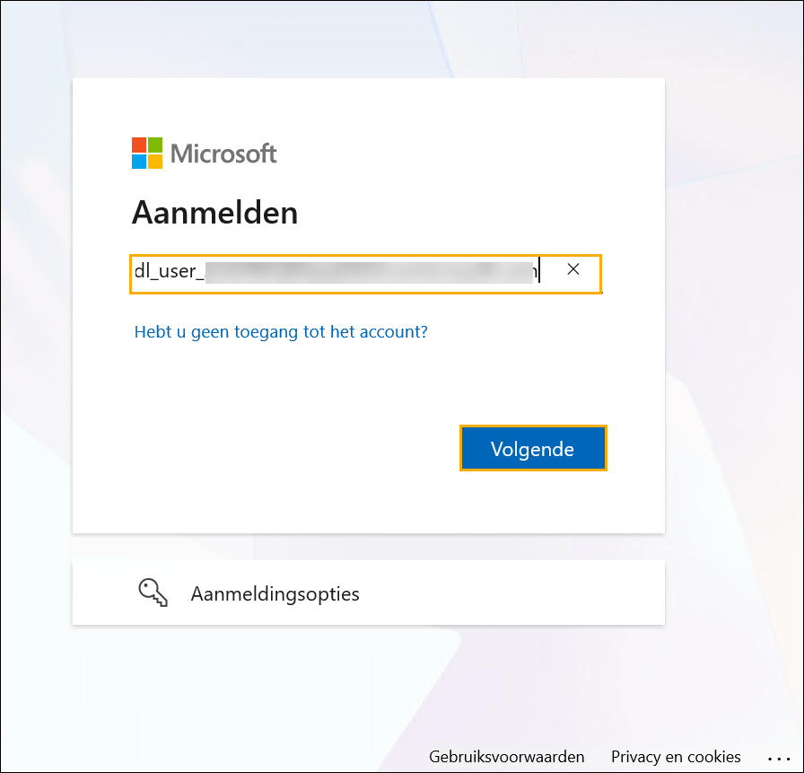

4. Voer nu de volgende **Tijdelijke toegangscode** in en klik op **Aanmelden**.

   * Tijdelijke toegangscode: <inject key="AzureAdUserPassword"></inject>

     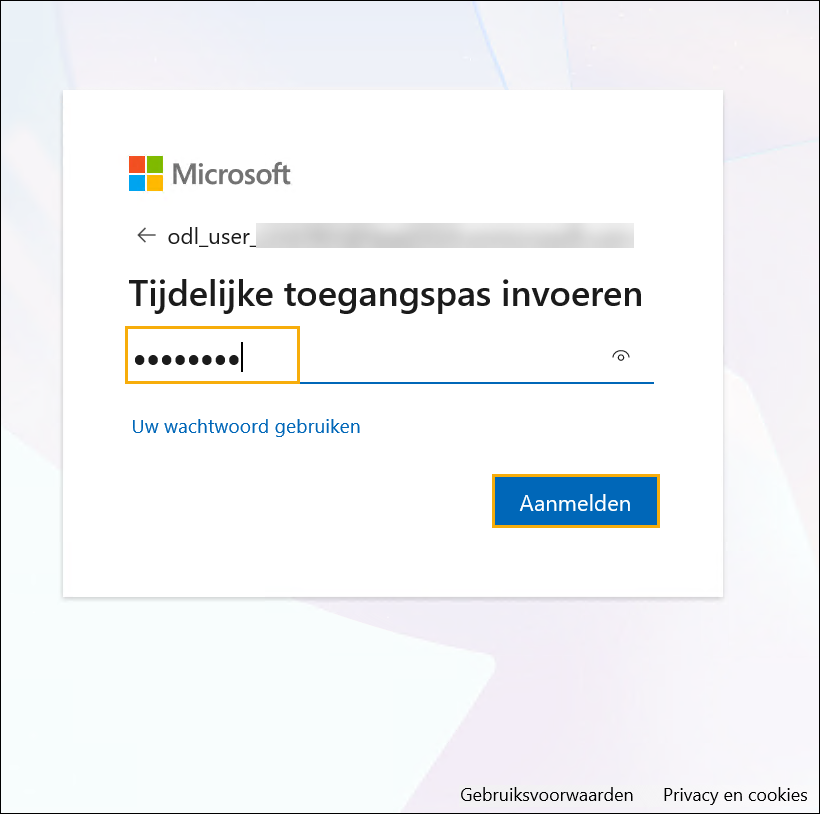

5. Het dialoogvenster **Aangemeld blijven bij al uw apps** wordt geopend. Selecteer **Ja**.

   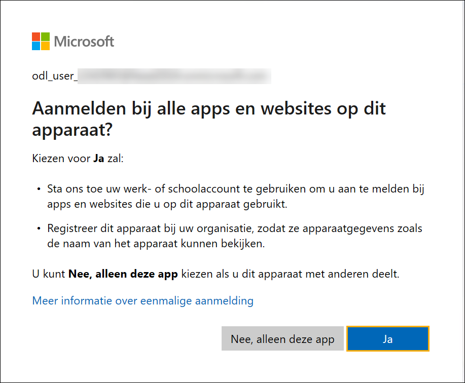

6. Het dialoogvenster **U bent helemaal klaar!** wordt geopend. Selecteer **Gereed**.

   Power BI Desktop wordt nu geopend.

## Taak 2: Power BI Desktop-rapport analyseren

Het onderstaande rapport analyseert de verkoopgegevens van Fabrikam. KPI's worden linksboven op de pagina weergegeven. De overige visualisaties tonen verkoopgegevens over tijd, per regio, productgroep en resellerbedrijf.

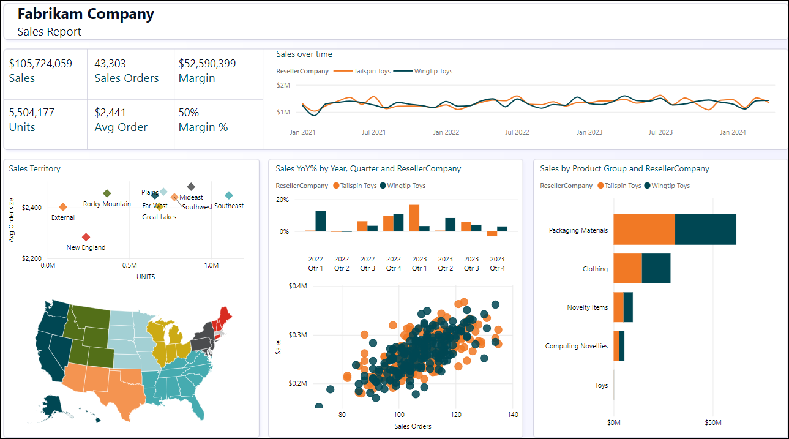

> **Opmerking:** In deze training richten we ons op gegevensverzameling, transformatie en modellering met behulp van hulpmiddelen die beschikbaar zijn in Fabric. We richten ons niet op rapportontwikkeling of navigatie. Laten we een paar minuten besteden aan het begrijpen van het rapport en vervolgens doorgaan naar de volgende stappen.

1. Laten we de gegevens analyseren op basis van verkoopregio. Selecteer **New England in de visual Verkoopregio** (spreidingsdiagram). Merk op dat bij Verkoop over tijd, reseller Tailspin Toys meer verkopen heeft in vergelijking met Wingtip Toys in New England. Als u naar het kolomdiagram **Sales YoY%** kijkt, ziet u dat de verkoopgroei van Wingtip Toys laag is geweest en kwartaal na kwartaal is afgenomen gedurende het afgelopen jaar. Na een kleine opleving in Q3 daalde deze opnieuw in Q4.

   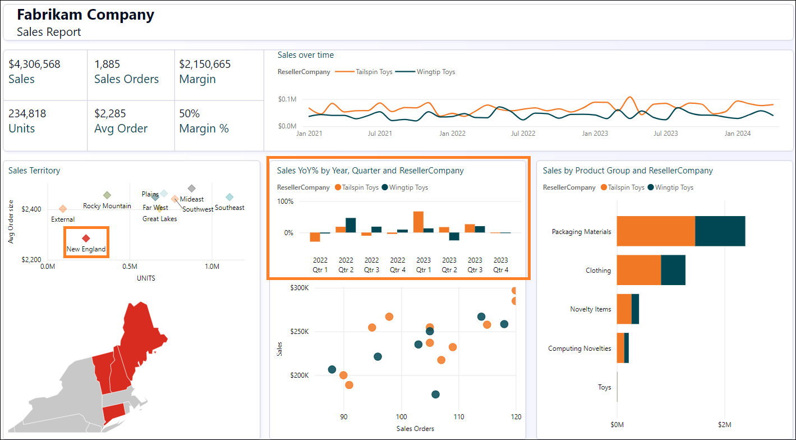

2. Laten we dit vergelijken met de regio Rocky Mountain. Selecteer **Rocky Mountain in de visual Verkoopregio** (spreidingsdiagram). Merk op dat in het kolomdiagram **Sales YoY%**, de verkoop van Wingtip Toys in Q4 2023 sterk is gestegen nadat deze in de twee voorgaande kwartalen laag was.

   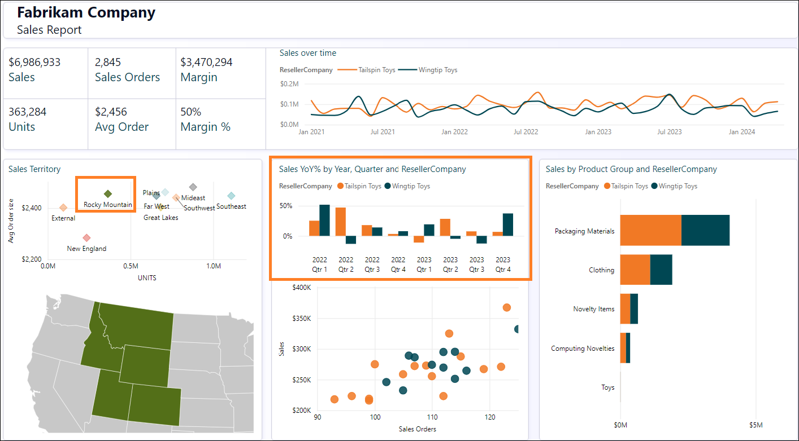

3. Selecteer **Rocky Mountain in Verkoopregio** om het filter te verwijderen.

4. Selecteer in de visual van het spreidingsdiagram onderaan in het midden van het scherm (**Verkooporders op basis van verkoop**) de uitschieter rechtsboven (4e kwadrant). Merk op dat het margepercentage 52% is, wat hoger is dan het gemiddelde van 50%. Daarnaast is **Sales YoY%** in de laatste twee kwartalen van 2023 gestegen.

   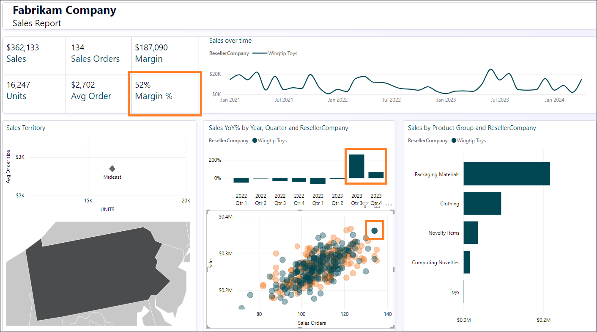

5. Selecteer de uitschieter van de reseller in het spreidingsdiagram om het **filter te verwijderen**.

6. Laten we de productdetails bekijken op basis van productgroep en reseller. Klik in de staafdiagramvisual **Verkoop per productgroep en resellerbedrijf** met de **rechtermuisknop op de balk Packaging Materials voor Tailspin Toys** en selecteer in het dialoogvenster **Drill-through -> Productdetails**.

   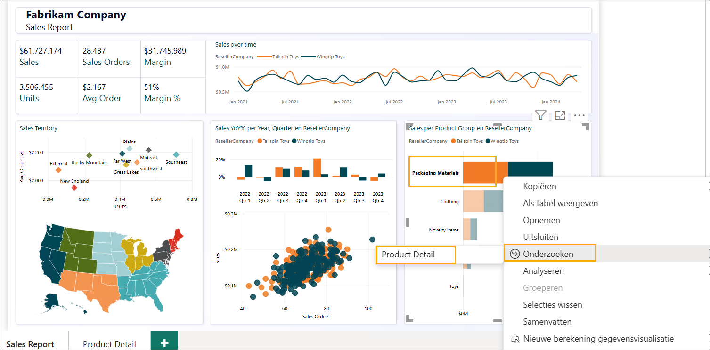

7. U wordt doorgestuurd naar de pagina met de **Productdetails**. Merk op dat er ook enkele toekomstige bestellingen aanwezig zijn.

8. Zodra u klaar bent met het bekijken van deze pagina, selecteert u de **Ctrl+terug-pijl** linksboven op de pagina om terug te keren naar het verkooprapport.

   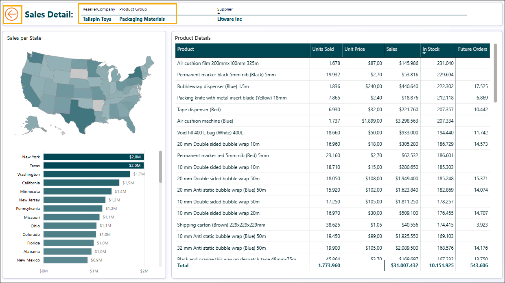

9. Voel u vrij om het rapport verder te analyseren. Zodra u klaar bent, bekijken we de modelweergave. Selecteer in het linkerpaneel het pictogram **Modelweergave**.

   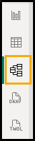

10. Merk op dat er twee feitentabellen zijn: **Sales** en **PO**.

    1. De granulariteit van verkoopgegevens is gebaseerd op Datum, Reseller, Product en Personen. Datum, Reseller, Product en Personen zijn gekoppeld aan Sales.

    2. De granulariteit van PO-gegevens is gebaseerd op Datum, Product en Personen. Datum, Product en Personen zijn gekoppeld aan PO.

    3. We hebben leveranciersgegevens per Product. Supplier is gekoppeld aan Product.

    4. We hebben locatiegegevens van resellers per Geo. Geo is gekoppeld aan Reseller.

    5. We hebben klantinformatie per Reseller. Customer is gekoppeld aan Reseller.

## Taak 3: Power Query's bekijken

1. Laten we Power Query bekijken om inzicht te krijgen in de gegevensbronnen. Selecteer in het lint **Start -> Gegevens transformeren**.

   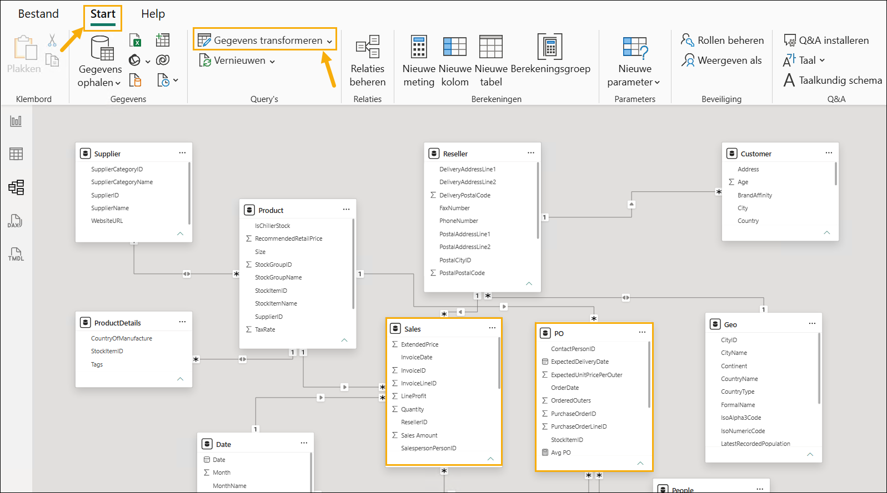

2. Het Power Query-venster wordt geopend. Selecteer in het lint **Start -> Instellingen voor gegevensbronnen**. Het dialoogvenster **Instellingen voor gegevensbronnen** wordt geopend. Wanneer u door de lijst bladert, ziet u vier gegevensbronnen zoals vermeld in de probleemstelling:

   * Snowflake

   * SharePoint

   * ADLS Gen2

   * Dataverse

3. Selecteer **Sluiten** om het dialoogvenster **Instellingen voor gegevensbronnen** te sluiten.

   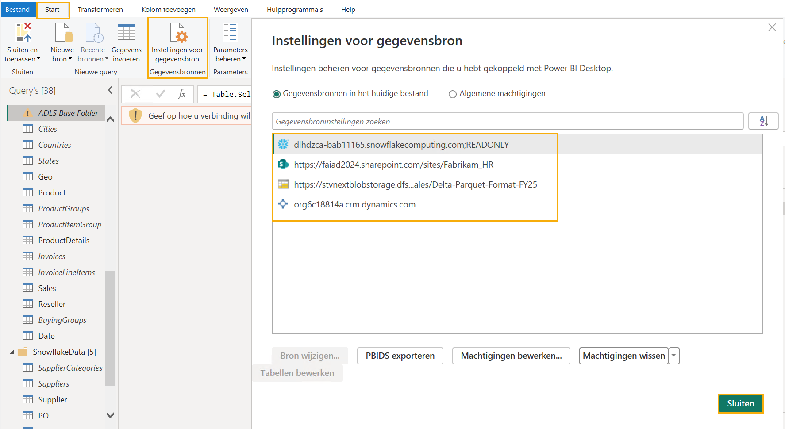

4. Merk in het linkerpaneel **Query's** op dat de query's zijn gegroepeerd op gegevensbron.

5. Merk op dat de map **DataverseData** klantgegevens bevat die beschikbaar zijn in vier verschillende query's: BabyBoomer, GenX, GenY en GenZ. Deze vier query's worden samengevoegd om de query **Customer** te maken.

6. Klik op de query **Customer** in het venster **Query's**. Wanneer u deze query selecteert, moet u uw Dataverse-referenties opnieuw invoeren. Klik op **Referenties bewerken**.

   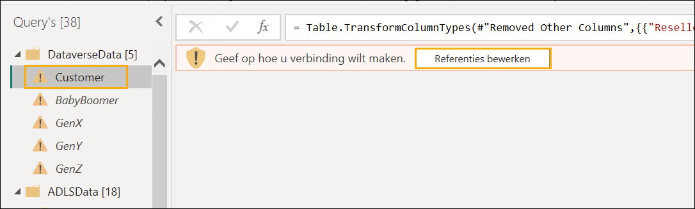

7. Klik op **Aanmelden** om u aan te melden bij uw account.

   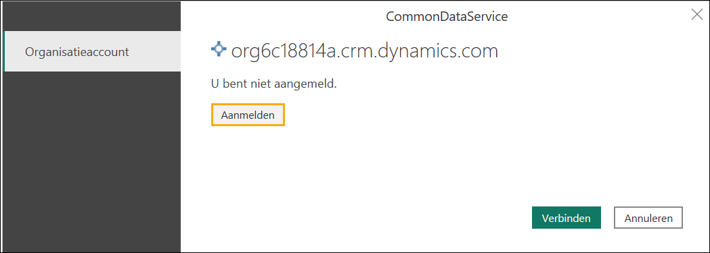

8. U kunt de referenties voor de Dataverse-gegevensbron invoeren door de **Gebruikersnaam** en het **Wachtwoord** in te voeren. De referenties worden hieronder weergegeven. Selecteer daarna **Verbinden**.

   * E-mail/Gebruikersnaam: <inject key="AzureAdUserEmail"></inject>

   * Wachtwoord: <inject key="AzureAdUserPassword"></inject>

9. Klik op de query **ADLS Base Folder** in het venster **Query's**. Wanneer u deze query selecteert, zijn referenties vereist. Klik op **Referenties bewerken**.

   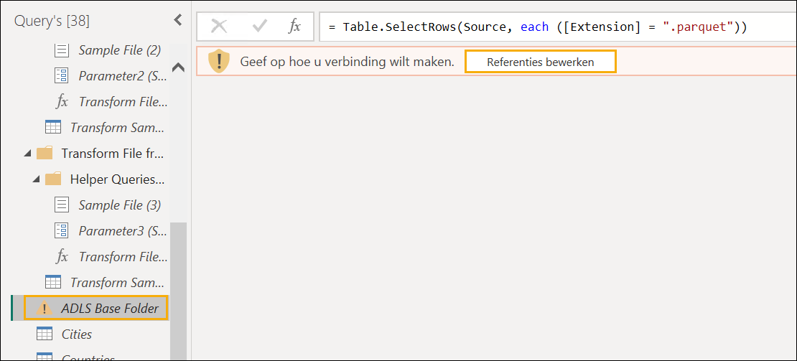

10. Kies voor de ADLS-gegevensbron de optie **Shared access signature (SAS)** en voer het hieronder verstrekte **SAS-token** in. Selecteer vervolgens **Verbinden**.

    * **SAS-token:** <inject key="Sas token"></inject>

        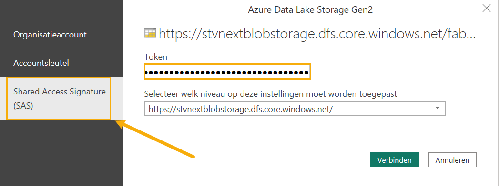

11. Merk op dat de map **ADLSData** meerdere dimensies bevat: Geo, Product, Reseller en Date. Daarnaast bevat deze ook verkoopfeiten.

    * De dimensie **Geo** wordt gemaakt door gegevens uit de query's Cities, Countries en States samen te voegen.

    * De dimensie **Product** wordt gemaakt door gegevens uit de query's Product Groups en Product Item Group samen te voegen.

    * De dimensie **Reseller** wordt gefilterd met behulp van de query **BuyingGroup**.

    * Het **Sales-feit** wordt gemaakt door **InvoiceLineItems** samen te voegen met de query **Invoice**.

12. Selecteer voor de Snowflake-gegevensbron de query **SupplierCategories** in het venster **Query's**. Wanneer u deze query selecteert, wordt u gevraagd om referenties in te voeren. Klik op **Referenties bewerken**.

    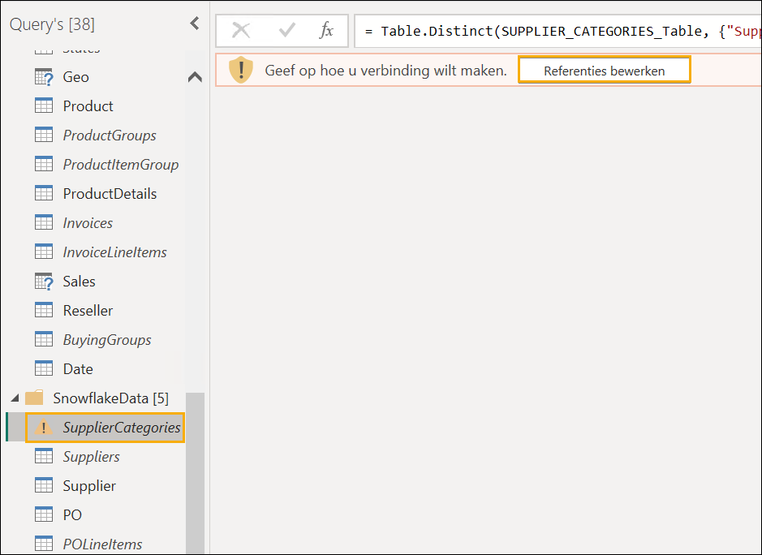

13. Voer de hieronder verstrekte **Snowflake-gebruikersnaam** en het **Snowflake-wachtwoord** in. Gebruik deze referenties om alle tabellen onder Snowflake met Snowflake te verbinden en selecteer vervolgens **Verbinden**.

    * **Snowflake-gebruikersnaam:** <inject key="SnowFlake Username" enableCopy="false" />

    * **Snowflake-wachtwoord:** <inject key="SnowFlake Password" enableCopy="false" />

        > **Opmerking:** Als u problemen ondervindt bij het verbinden met Snowflake met de bovenstaande referenties, gebruik dan de onderstaande back-upreferenties.

    - **Snowflake-gebruikersnaam:** SNOWFLAKE_BACKUP

    - **Snowflake-wachtwoord:** 8UpfRpExVDXv2AC1

14. Merk op dat de map **SnowflakeData** een Supplier-dimensie en een PO-feit (Bestelling / Uitgaven) bevat.

    * De dimensie **Supplier** wordt gemaakt door de query **Suppliers** samen te voegen met de query **SupplierCategories**.

    * Het **PO-feit** wordt gemaakt door **PO** samen te voegen met de query **PO Line Items**.

15. Selecteer voor de SharePoint-gegevensbron de query **People** in het venster **Query's**. Wanneer u deze query selecteert, wordt u gevraagd om referenties in te voeren. Klik op **Referenties bewerken**.

    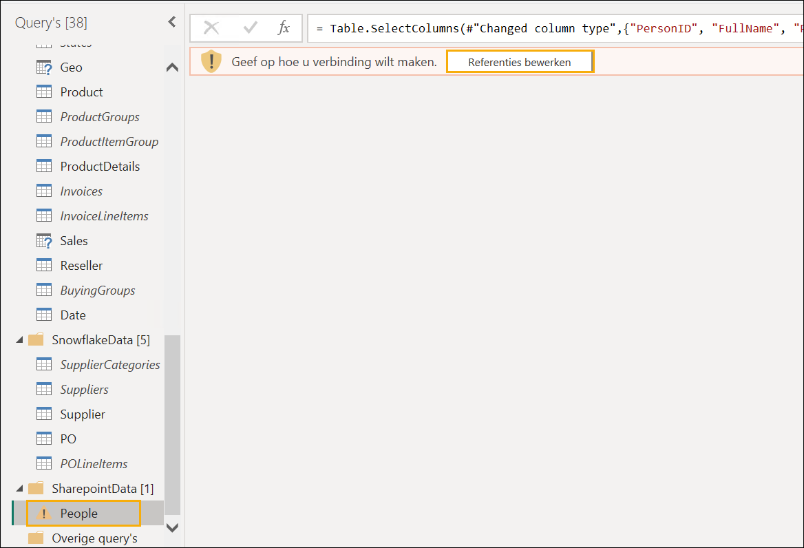

16. Selecteer de optie **Microsoft-account** en klik vervolgens op **Aanmelden**. Voer de hieronder verstrekte **Gebruikersnaam** en het **Wachtwoord** in en selecteer vervolgens **Verbinden**.

    * **E-mail/Gebruikersnaam:** <inject key="AzureAdUserEmail"></inject>

    * **Wachtwoord:** <inject key="AzureAdUserPassword"></inject>

        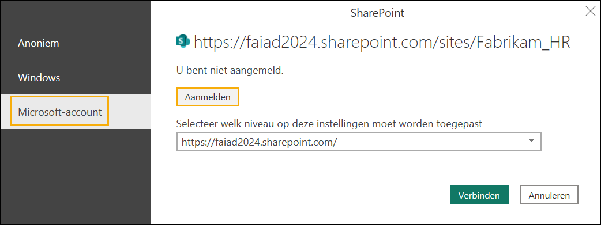

17. Merk op dat de map **SharepointData** een People-dimensie bevat.

    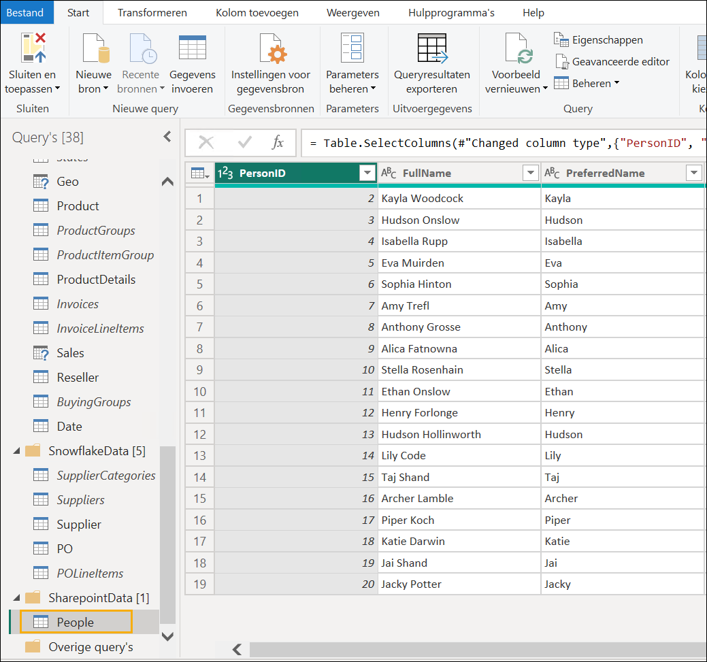

Nu weten we waarmee we werken. In de volgende labs maken we een vergelijkbare Power Query met behulp van Dataflow Gen2 en voeren we modellering uit met behulp van een Lakehouse.

# Referenties

Fabric Analyst in a Day (FAIAD) introduceert u aan enkele van de belangrijkste functies die beschikbaar zijn in Microsoft Fabric. In het menu van de service bevat de sectie **Help (?)** koppelingen naar een aantal waardevolle bronnen.

Hieronder vindt u nog enkele aanvullende bronnen die u helpen bij uw volgende stappen met Microsoft Fabric.

* Bekijk het blogbericht om de volledige [Microsoft Fabric GA-aankondiging](https://aka.ms/Fabric-Hero-Blog-Ignite23) te lezen.

* Verken Fabric via de [Rondleiding](https://aka.ms/Fabric-GuidedTour).

* Meld u aan voor de [gratis proefversie van Microsoft Fabric](https://aka.ms/try-fabric).

* Bezoek de [Microsoft Fabric-website](https://aka.ms/microsoft-fabric).

* Leer nieuwe vaardigheden door de [Fabric-leermodules](https://aka.ms/learn-fabric) te verkennen.

* Verken de [technische documentatie van Fabric](https://aka.ms/fabric-docs).

* Lees het [gratis e-book over aan de slag gaan met Fabric](https://aka.ms/fabric-get-started-ebook).

* Neem deel aan de [Fabric-community](https://aka.ms/fabric-community) om vragen te stellen, feedback te delen en van anderen te leren.

Lees de meer uitgebreide aankondigingsblogs over Fabric:

* [Blog over Data Factory-ervaring in Fabric](https://aka.ms/Fabric-Data-Factory-Blog)

* [Blog over Synapse Data Engineering-ervaring in Fabric](https://aka.ms/Fabric-DE-Blog)

* [Blog over Synapse Data Science-ervaring in Fabric](https://aka.ms/Fabric-DS-Blog)

* [Blog over Synapse Data Warehousing-ervaring in Fabric](https://aka.ms/Fabric-DW-Blog)

* [Blog over Synapse Real-Time Analytics-ervaring in Fabric](https://aka.ms/Fabric-RTA-Blog)

* [Power BI-aankondigingsblog](https://aka.ms/Fabric-PBI-Blog)

* [Blog over Data Activator-ervaring in Fabric](https://aka.ms/Fabric-DA-Blog)

* [Blog over beheer en governance in Fabric](https://aka.ms/Fabric-Admin-Gov-Blog)

* [Blog over OneLake in Fabric](https://aka.ms/Fabric-OneLake-Blog)

* [Blog over Dataverse- en Microsoft Fabric-integratie](https://aka.ms/Dataverse-Fabric-Blog)

© 2026 Microsoft Corporation. Alle rechten voorbehouden.

Door deze demo/dit lab te gebruiken, gaat u akkoord met de volgende voorwaarden:

De technologie/functionele mogelijkheden die in deze demo/dit lab worden beschreven, worden door Microsoft Corporation geleverd om uw feedback te verkrijgen en u een leerervaring te bieden. U mag deze demo/dit lab uitsluitend gebruiken om dergelijke technologische functies en mogelijkheden te evalueren en feedback aan Microsoft te geven. U mag deze niet voor andere doeleinden gebruiken. U mag deze demo/dit lab of enig onderdeel daarvan niet wijzigen, kopiëren, distribueren, verzenden, weergeven, uitvoeren, reproduceren, publiceren, licentiëren, afgeleide werken maken, overdragen of verkopen.

HET KOPIËREN OF REPRODUCEREN VAN DE DEMO/HET LAB (OF ENIG DEEL ERVAN) NAAR EEN ANDERE SERVER OF LOCATIE VOOR VERDERE REPRODUCTIE OF HERDISTRIBUTIE IS UITDRUKKELIJK VERBODEN.

DEZE DEMO/HET LAB BIEDT BEPAALDE SOFTWARETECHNOLOGIE-/PRODUCTFUNCTIES EN MOGELIJKHEDEN, INCLUSIEF MOGELIJKE NIEUWE FUNCTIES EN CONCEPTEN, IN EEN GESIMULEERDE OMGEVING ZONDER COMPLEXE INSTALLATIE OF CONFIGURATIE VOOR HET HIERBOVEN BESCHREVEN DOEL. DE TECHNOLOGIE/CONCEPTEN DIE IN DEZE DEMO/HET LAB WORDEN WEERGEGEVEN, VERTEGENWOORDIGEN MOGELIJK NIET DE VOLLEDIGE FUNCTIONALITEIT EN WERKEN MOGELIJK NIET OP DEZELFDE MANIER ALS EEN DEFINITIEVE VERSIE. WIJ KUNNEN OOK BESLUITEN GEEN DEFINITIEVE VERSIE VAN DERGELIJKE FUNCTIES OF CONCEPTEN UIT TE BRENGEN. UW ERVARING BIJ HET GEBRUIK VAN DERGELIJKE FUNCTIES EN MOGELIJKHEDEN IN EEN FYSIEKE OMGEVING KAN OOK AFWIJKEN.

**FEEDBACK**. Als u feedback geeft aan Microsoft over de technologie, functies, mogelijkheden en/of concepten die in deze demo/dit lab worden beschreven, verleent u Microsoft kosteloos het recht om uw feedback op welke manier dan ook en voor welk doel dan ook te gebruiken, delen en commercialiseren. U verleent ook kosteloos aan derden eventuele octrooirechten die nodig zijn voor hun producten, technologieën en diensten om specifieke onderdelen van Microsoft-software of -services waarin uw feedback is opgenomen te gebruiken of ermee te communiceren. U zult geen feedback verstrekken die onder een licentie valt die Microsoft verplicht om haar software of documentatie aan derden in licentie te geven omdat wij uw feedback daarin opnemen. Deze rechten blijven van kracht na beëindiging van deze overeenkomst.

MICROSOFT CORPORATION WIJST HIERBIJ ALLE GARANTIES EN VOORWAARDEN MET BETREKKING TOT DE DEMO/HET LAB AF, INCLUSIEF ALLE GARANTIES EN VOORWAARDEN VAN VERHANDELBAARHEID, HETZIJ UITDRUKKELIJK, IMPLICIET OF WETTELIJK, GESCHIKTHEID VOOR EEN BEPAALD DOEL, EIGENDOMSRECHTEN EN NIET-INBREUK. MICROSOFT GEEFT GEEN GARANTIES OF VERTEGENWOORDIGINGEN MET BETREKKING TOT DE NAUWKEURIGHEID VAN DE RESULTATEN, UITVOER DIE VOORTVLOEIT UIT HET GEBRUIK VAN DE DEMO/HET LAB OF DE GESCHIKTHEID VAN DE INFORMATIE IN DE DEMO/HET LAB VOOR WELK DOEL DAN OOK.

**DISCLAIMER**

Deze demo/dit lab bevat slechts een gedeelte van de nieuwe functies en verbeteringen in Microsoft Power BI. Sommige functies kunnen in toekomstige versies van het product worden gewijzigd. In deze demo/dit lab leert u enkele, maar niet alle, nieuwe functies kennen.
