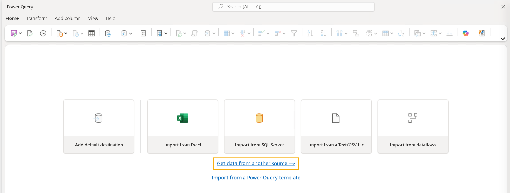
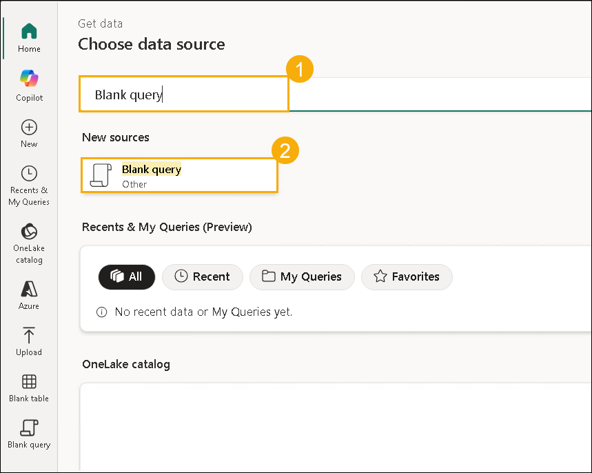
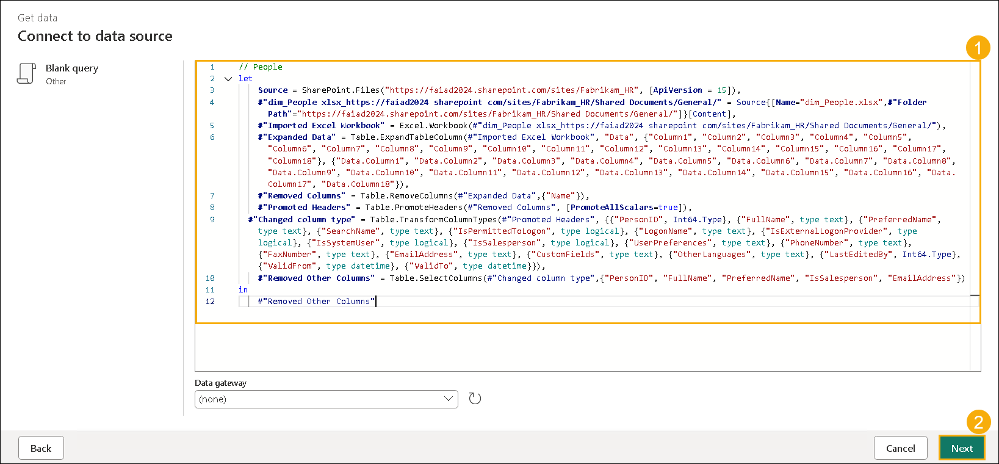
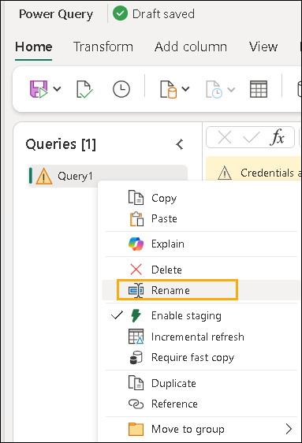
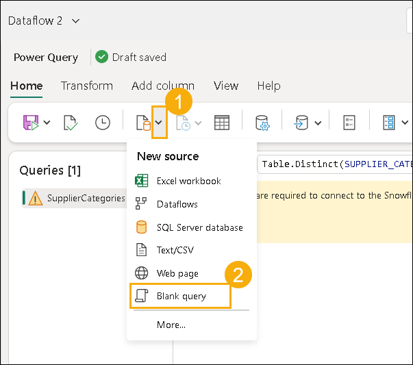

# Microsoft Fabric - Fabric Analyst in een Dag - Lab 4

# Inhoud

- Introductie

- Dataflow Gen2

    - Taak 1: SharePoint-query's kopiëren naar Dataflow

    - Taak 2: SharePoint-verbinding maken

    - Taak 3: Gegevensbestemming configureren voor de People-query

    - Taak 4: SharePoint Dataflow publiceren en hernoemen

    - Taak 5: Snowflake-query's kopiëren naar Dataflow

    - Taak 6: Verbinding maken met Snowflake

    - Taak 7: Gegevensbestemming configureren voor de Supplier- en PO-query's

    - Taak 8: Snowflake Dataflow hernoemen en publiceren

- Snelkoppeling naar intern Lakehouse

    - Taak 9: Een snelkoppeling naar Dataverse maken

    - Taak 10: Een snelkoppeling naar een Lakehouse maken

- Referenties

# Introductie

In ons scenario bevinden leveranciersgegevens zich in **Snowflake**, klantgegevens in **Dataverse** en werknemersgegevens in **SharePoint**. Al deze gegevensbronnen worden op verschillende tijdstippen bijgewerkt. Om het aantal gegevensverversingen voor Dataflows te minimaliseren, gaan we afzonderlijke Dataflows maken voor de gegevensbronnen **Snowflake** en **SharePoint**.

>**Opmerking:** Meerdere gegevensbronnen worden ondersteund binnen één Dataflow.

Het IT-team heeft al een koppeling met **Dataverse** opgezet en de benodigde gegevenstransformaties toegepast, vergelijkbaar met die in het **Power BI Desktop-bestand**. Ze hebben deze gegevens opgenomen in het **Lakehouse** binnen de **Admin-werkruimte** en ons toegang gegeven tot de tabellen. We gaan een **Shortcut** maken naar de tabellen die het IT-team in het Lakehouse heeft aangemaakt.

Aan het einde van dit lab heeft u geleerd:

- Hoe u verbinding maakt met **SharePoint** via **Dataflow Gen2** en gegevens opneemt in een **Lakehouse**

- Hoe u verbinding maakt met **Snowflake** via **Dataflow Gen2** en gegevens opneemt in een **Lakehouse**

- Hoe u gegevens opneemt vanuit een **gedeeld Lakehouse**

# Dataflow Gen2

## Taak 1: SharePoint-query's kopiëren naar Dataflow

1. Navigeer terug naar de Fabric-werkruimte **FAIAD_<inject key="Deployment ID" enableCopy="false"/> (1)** die u hebt gemaakt in Lab 2, Taak 8.

2. Selecteer de optie **+ Nieuw item (2)** linksboven op het scherm.

3. Selecteer onder de sectie **Gegevens ophalen (3)** de optie **Gegevensstroom Gen2 (4)**.

    

    Laat de standaardnaam ongewijzigd en zorg ervoor dat **Git-integratie inschakelen** is aangevinkt. Selecteer vervolgens **Maken**. U wordt doorgestuurd naar de **Dataflow-pagina**. De interface van **Gegevensstroom Gen2** is vergelijkbaar met **Power Query** in **Power BI Desktop**. We kunnen query's vanuit Power BI Desktop kopiëren naar Dataflow Gen2. Laten we dit proberen.

4. Als u dit nog niet hebt gedaan, open dan **FAIAD.pbix**, die zich bevindt in de map **Reports** op het bureaublad van uw labomgeving.

5. Selecteer in het lint **Start -> Gegevens transformeren**. Het **Power Query**-venster wordt geopend. Zoals u in eerdere labs hebt gezien, zijn de query's in het linkerpaneel georganiseerd per gegevensbron.

6. Selecteer in het linkerpaneel, onder de map **SharePointData**, de query **People**.

7. **Klik met de rechtermuisknop** en selecteer **Kopiëren**.

    

8. Ga terug naar het scherm **Dataflow** in de browser.

9. Druk in het **Dataflow-paneel** op **Ctrl+V** (momenteel wordt plakken met de rechtermuisknop niet ondersteund). Als u een Mac-apparaat gebruikt, gebruik dan **Cmd+V** om te plakken.

    

    >**Opmerking:** Als u in de labomgeving werkt, selecteer dan de drie puntjes rechtsboven in het scherm. Gebruik de schuifregelaar om **VM Native Clipboard** **in te schakelen**. Selecteer **OK** in het dialoogvenster. Nadat u klaar bent met het plakken van de query's, kunt u deze optie weer uitschakelen.

    

    Merk op dat de query is geplakt en beschikbaar is in het linkerpaneel. Omdat er nog geen verbinding met **SharePoint** is gemaakt, ziet u een waarschuwingsbericht waarin wordt gevraagd de verbinding te configureren.

    

    > #### **Opmerking:** Als u de foutmelding **"We konden geen query's vinden op uw klembord."** tegenkomt tijdens het kopiëren van query's naar **Dataflow Gen2**, volg dan de onderstaande stappen om de query's handmatig te maken.
    >
    >1. Selecteer op de pagina **Dataflow Gen2** **Gegevens ophalen uit een andere bron** om het venster voor bronselectie te openen.
    >
    >    
    >
    >2. Zoek in de zoekbalk naar **Lege query (1)** en selecteer vervolgens de optie **Lege query (2)** uit de resultaten.
    >
    >    
    >
    >3. Verwijder in het query-editorvenster de bestaande standaardcode en vervang deze door de gekopieerde **Power Query (M-query)-code (1)** uit uw klembord. Selecteer vervolgens **Volgende (2)** om de query toe te passen.
    >
    >    
    >
    >4. Klik in het linker querypaneel met de rechtermuisknop op de querynaam, selecteer **Naam wijzigen** en wijzig de naam van de query naar **People**.
    >
    >    
    >
    >Als alternatief kunt u **Remote Desktop (RDP)** gebruiken om rechtstreeks verbinding te maken met uw virtuele machine, waardoor de functionaliteit van het klembord correct werkt voor het kopiëren en plakken van query's. Raadpleeg voor gedetailleerde instructies over verbinding via RDP de volgende stapsgewijze handleiding: **RDP: Bekende functionaliteitsproblemen**.

## Taak 2: SharePoint-verbinding maken

1. Selecteer **Verbinding configureren**.

    

2. Het venster **Verbinden met gegevensbron** wordt geopend. Zorg ervoor dat in de vervolgkeuzelijst **Verbinding** de optie **Nieuwe verbinding maken** is geselecteerd.

3. **Verificatietype** moet ingesteld zijn op **Organisatieaccount**.

4. Selecteer **Verbinden**.

    >**Opmerking:** U wordt aangemeld met uw eigen referenties. Deze zullen anders zijn dan in de onderstaande schermafbeelding.

    

## Taak 3: Gegevensbestemming configureren voor de People-query

De verbinding is tot stand gebracht en u kunt de gegevens bekijken in het voorbeeldvenster. U kunt gerust door de **Toegepaste stappen** van de query's navigeren. Nu moeten we de gegevens van **People** opnemen in het **Lakehouse**.

1. Selecteer de query **People (1)**.

2. Selecteer in het lint **Start -> Query (2) -> Gegevensbestemming toevoegen (3) -> Lakehouse (4)**.

    

3. Het venster **Verbinden met gegevensbestemming** wordt geopend. We moeten een nieuwe verbinding maken met het **Lakehouse**. Zorg ervoor dat **Nieuwe verbinding maken** geselecteerd is in de vervolgkeuzelijst **Verbinding** en dat **Verificatietype** ingesteld is op **Organisatieaccount**. Selecteer vervolgens **Volgende**.

    

4. Het venster **Doelbestemming kiezen** wordt geopend. Zorg ervoor dat de keuzerondje-optie **Nieuwe tabel** geselecteerd is, omdat we een nieuwe tabel gaan maken.

5. We willen de tabel maken in het Lakehouse dat we eerder hebben aangemaakt. Navigeer in het linkerpaneel naar **Lakehouse -> FAIAD_<inject key="Deployment ID" enableCopy="false"/>**.

6. Selecteer **lh_FAIAD**.

7. Laat de tabelnaam op **People** staan.

8. Selecteer **Volgende**.

    

9. Het venster **Bestemmingsinstellingen kiezen** wordt geopend. Zorg ervoor dat **Automatische instellingen gebruiken** is **ingeschakeld**.

    >**Opmerking:** U kunt automatische instellingen uitschakelen en zien dat er opties beschikbaar zijn voor **Updatemethode** en **Schema-opties**. Nadat u deze hebt bekeken, moet u ervoor zorgen dat **Automatische instellingen gebruiken** weer **ingeschakeld** is.

10. Selecteer **Instellingen opslaan**.

    

## Taak 4: SharePoint Dataflow publiceren en hernoemen

1. U wordt teruggeleid naar het venster **Power Query**. Merk op dat in de **rechterbenedenhoek** de **Gegevensbestemming** is ingesteld op **Lakehouse (1)**.

2. Selecteer linksboven **Opslaan en uitvoeren (2)**. Zodra u de melding ziet dat een vernieuwing is gestart, kunt u de Dataflow sluiten **(3)**.

    

    >**Opmerking:** U wordt teruggeleid naar de werkruimte **FAIAD_<inject key="Deployment ID" enableCopy="false"/>**. Het kan enkele ogenblikken duren voordat de Dataflow is voltooid.

3. **Dataflow 1** is de Dataflow waarmee we hebben gewerkt. Laten we deze hernoemen voordat we verdergaan. Klik op de **drie puntjes (…)** naast **Dataflow 1** en selecteer **Instellingen** (terwijl de Dataflow wordt uitgevoerd, zijn de instellingen niet toegankelijk).

    

4. Het venster **Dataflow-instellingen** wordt geopend. Wijzig de **naam** naar **df_People_SharePoint (1)**.

5. Voeg in het tekstvak **Beschrijving** de tekst **Dataflow om People-gegevens van SharePoint naar Lakehouse op te nemen (2)** toe.

6. Sluit vervolgens het instellingenvenster **(3)**.

    

    U wordt teruggeleid naar de werkruimte **FAIAD_<inject key="Deployment ID" enableCopy="false"/>**.

7. Selecteer **lh_FAIAD** om naar het Lakehouse te navigeren.

8. Controleer of u zich in de **Lakehouse-weergave** bevindt (en niet in **SQL analytics endpoint**).

9. Merk op dat de tabel **People** nu beschikbaar is in het Lakehouse.

    

    >**Opmerking:** Als u de nieuw aangemaakte tabellen niet ziet, selecteer dan de **drie puntjes** naast **Tabellen** en kies **Vernieuwen** om de tabellenlijst te vernieuwen.

## Taak 5: Snowflake-query's kopiëren naar Dataflow

1. Navigeer terug naar de Fabric-werkruimte **FAIAD_<inject key="Deployment ID" enableCopy="false"/> (1)**.

2. Selecteer linksboven de optie **+ Nieuw item (2)**.

3. Selecteer onder **Aanbevolen items** **Gegevensstroom Gen2 (3)**.

    

    Laat de standaardnaam ongewijzigd en zorg ervoor dat **Git-integratie inschakelen** is aangevinkt. Selecteer vervolgens **Maken**. Als u een melding ontvangt met **"Er bestaat al een Dataflow met deze naam"**, wijzig de naam dan naar **Dataflow 2**. U wordt doorgestuurd naar de **Dataflow-pagina**. Nu we bekend zijn met Dataflow, gaan we de query's uit Power BI Desktop naar Dataflow kopiëren.

4. Als u dit nog niet hebt gedaan, open dan **FAIAD.pbix**, die zich bevindt in de map **Reports** op het bureaublad van uw labomgeving.

5. Selecteer in het lint **Start -> Gegevens transformeren**. Het venster **Power Query** wordt geopend. Zoals u in eerdere labs hebt gezien, zijn de query's in het linkerpaneel georganiseerd per gegevensbron.

6. Selecteer in het linkerpaneel, onder de map **SnowflakeData**, met **Ctrl+Selecteren** of **Shift+Selecteren** de volgende query's:

    1. SupplierCategories

    2. Suppliers

    3. Supplier

    4. PO

    5. PO Line Items

7. **Klik met de rechtermuisknop** en selecteer **Kopiëren**.

    

8. Ga terug naar de **browser**.

9. Selecteer in het **Dataflow-paneel** het **middelste paneel** en druk op **Ctrl+V** (momenteel wordt plakken met de rechtermuisknop niet ondersteund). Als u een Mac-apparaat gebruikt, gebruik dan **Cmd+V** om te plakken.

    >**Opmerking:** Als u in de labomgeving werkt, selecteer dan de **drie puntjes (…)** rechtsboven in het scherm. Gebruik de schuifregelaar om **VM Native Clipboard** **in te schakelen**. Selecteer **OK** in het dialoogvenster. Nadat u klaar bent met het plakken van de query's, kunt u deze optie weer uitschakelen.

    

    > #### **Opmerking:** Als u de foutmelding **"We konden geen query's vinden op uw klembord."** tegenkomt tijdens het plakken van query's in **Dataflow Gen2**, maak de query's dan handmatig één voor één aan met een **Lege query**. Voeg de query **SupplierCategories** toe door dezelfde stappen te volgen als in **Taak 1** voor het maken van de query **People**. Nadat u de standaardcode hebt vervangen door de gekopieerde **Power Query (M-query)-code**, voegt u de query toe en wijzigt u de naam naar **SupplierCategories**.
    >
    >- Selecteer vervolgens de vervolgkeuzelijst **Gegevens ophalen (1)** en kies **Lege query (2)** om een nieuwe query te maken. Herhaal hetzelfde proces voor de volgende query's:
    >
    >* `Suppliers`
    >* `Supplier`
    >* `PO`
    >* `PO Line Items`
    >
    >   
    >
    >Als alternatief kunt u **RDP** gebruiken om rechtstreeks verbinding te maken met uw virtuele machine, waardoor de functionaliteit van het klembord correct werkt voor het kopiëren en plakken van query's. Raadpleeg **RDP: Bekende functionaliteitsproblemen** voor stapsgewijze instructies.

## Taak 6: Verbinding maken met Snowflake

Merk op dat de vijf query's zijn geplakt en dat u nu het paneel **Query's** aan de linkerkant ziet. Omdat er nog geen verbinding met **Snowflake** is gemaakt, ziet u een waarschuwingsbericht waarin wordt gevraagd de verbinding te configureren.

1. Selecteer **Verbinding configureren**.

    

2. Het venster **Verbinden met gegevensbron** wordt geopend. Zorg ervoor dat in de vervolgkeuzelijst **Verbinding** de optie **Nieuwe verbinding maken** is geselecteerd.

3. **Verificatietype** moet ingesteld zijn op **Snowflake**.

4. Voer de hieronder vermelde **Snowflake-gebruikersnaam** en **Snowflake-wachtwoord** in. Gebruik deze referenties om alle tabellen onder **Snowflake** met Snowflake te verbinden en selecteer vervolgens **Verbinden**.

   - Snowflake-gebruikersnaam: <inject key="SnowFlake Username" enableCopy="false" />

   - Snowflake-wachtwoord: <inject key="SnowFlake Password" enableCopy="false" />

     >**Opmerking:** Als u problemen ondervindt bij het verbinden met Snowflake met de referenties uit de omgevingsgegevens, gebruik dan de onderstaande referenties.

   - **Snowflake-gebruikersnaam:** SNOWFLAKE_BACKUP

   - **Snowflake-wachtwoord:** 8UpfRpExVDXv2AC1

5. Selecteer **Verbinden**.

    

    De verbinding is tot stand gebracht en u kunt de gegevens bekijken in het voorbeeldvenster. U kunt gerust door de **Toegepaste stappen** van de query's navigeren. De query **Suppliers** bevat de details van leveranciers en **SupplierCategories** bevat, zoals de naam aangeeft, alle leverancierscategorieën. Deze twee tabellen worden samengevoegd om de dimensie **Supplier** te maken met de benodigde kolommen. Op dezelfde manier worden **PO Line Items** en **PO** samengevoegd om de **PO-fact** te maken. Nu moeten we de gegevens van **Supplier** en **PO** opnemen in het **Lakehouse**.

## Taak 7: Gegevensbestemming configureren voor Supplier- en PO-query's

1. Selecteer de query **Supplier (1)** in het paneel **Query's** aan de linkerkant.

2. Selecteer in het lint **Start (2) -> Query (3) -> Gegevensbestemming toevoegen (4) -> Lakehouse (5)**.

    

3. Het venster **Verbinden met gegevensbestemming** wordt geopend. Selecteer in de vervolgkeuzelijst **Verbinding** **Lakehouse odl_user_<inject key="Deployment ID" enableCopy="false"/> (none)**.

4. Selecteer **Volgende**.

    

5. Het venster **Doelbestemming kiezen** wordt geopend. Zorg ervoor dat de optie **Nieuwe tabel** geselecteerd is, omdat we een nieuwe tabel gaan maken.

6. We willen de tabel maken in het Lakehouse dat we eerder hebben aangemaakt. Navigeer in het linkerpaneel naar **Lakehouse -> FAIAD_<inject key="Deployment ID" enableCopy="false"/>**.

7. Selecteer **lh_FAIAD**.

8. Laat de tabelnaam op **Supplier** staan.

9. Selecteer **Volgende**.

    

10. Het venster **Bestemmingsinstellingen kiezen** wordt geopend. We gebruiken de automatische instellingen, omdat hiermee een volledige gegevensupdate wordt uitgevoerd en de kolommen indien nodig automatisch worden hernoemd. Selecteer **Instellingen opslaan**.

    

11. U wordt teruggeleid naar het venster **Power Query**. Merk op dat in de **rechterbenedenhoek** de **Gegevensbestemming** is ingesteld op **Lakehouse**. Configureer op dezelfde manier de **gegevensbestemming voor de query PO**. Zodra dit is voltooid, moet bij uw **PO-query** de **Gegevensbestemming** zijn ingesteld op **Lakehouse**, zoals weergegeven in de onderstaande afbeelding.

    

## Taak 8: Snowflake Dataflow hernoemen en publiceren

1. Selecteer bovenaan het scherm de **pijl naast Dataflow 2 (de naam kan anders zijn)** om de naam te wijzigen.

2. Wijzig in het dialoogvenster de naam naar **df_Supplier_Snowflake**.

3. Druk op **Enter** om de naamswijziging op te slaan.

    

4. Selecteer linksboven **Opslaan en uitvoeren (1)**. Zodra u de melding ziet dat een vernieuwing is gestart, kunt u de Dataflow sluiten **(2)**.

    

    U wordt teruggeleid naar de werkruimte **FAIAD_<inject key="Deployment ID" enableCopy="false"/>**. Het kan enkele ogenblikken duren voordat de Dataflow is gepubliceerd.

5. Selecteer **lh_FAIAD** om naar het Lakehouse te navigeren.

6. Controleer of u zich in de **Lakehouse-weergave** bevindt (en niet in **SQL analytics endpoint**).

7. Merk op dat de tabellen **PO** en **Supplier** nu beschikbaar zijn in het **Lakehouse**.

    

    >**Opmerking:** Als u de nieuw aangemaakte tabellen niet ziet, selecteer dan de **drie puntjes** naast **Tabellen** en kies **Vernieuwen** om de tabellenlijst te vernieuwen.

    Laten we nu een **Shortcut** maken om gegevens vanuit **Dataverse** binnen te halen.

# Shortcut naar intern Lakehouse

## Taak 9: Een Shortcut naar Dataverse maken

U zou zich in het Lakehouse **lh_FAIAD** moeten bevinden. Zorg ervoor dat u zich in de **Gegevens analyseren met** bevindt (en niet in **SQL analytics endpoint**).

1. Selecteer in het paneel **Verkenner** de **drie puntjes** naast **Tabellen**.

2. Selecteer **Nieuwe snelkoppeling**.

    

3. Het venster **Nieuwe snelkoppeling** wordt geopend. Selecteer onder **Externe bronnen** **Dataverse**.

    >**Opmerking:** In het vorige lab hebben we vergelijkbare stappen gevolgd om een snelkoppeling naar **Azure Data Lake Storage Gen2** te maken.

    

4. Selecteer **Nieuwe verbinding (1)**. Het venster **Verbindingsinstellingen** wordt geopend. Voer **org6c18814a.crm.dynamics.com (2)** in als **Omgevingsdomein**.

5. Laat **Verificatietype** ingesteld op **Organisatieaccount (3)**.

6. Selecteer **Aanmelden** als u nog niet bent aangemeld.

    

7. Selecteer in het aanmeldvenster het **gebruikersaccount** dat u voor deze labs hebt gebruikt.

    >**Opmerking:** Uw account zal verschillen van de onderstaande schermafbeelding.

    

8. Selecteer **Volgende** in het venster **Verbindingsinstellingen**.

    U wordt doorgestuurd naar een venster waarin u verschillende buckets/mappen vanuit **Dataverse** kunt selecteren. Merk op dat er veel verschillende buckets beschikbaar zijn. We kunnen de gewenste bucket(s) selecteren en hetzelfde proces volgen als in **Lab 3** (Visual Query gebruiken om gegevens te transformeren en weergaven te maken). We kunnen ook **Dataflow Gen2** gebruiken, zoals eerder in dit lab werd gebruikt voor de verbinding met **SharePoint**.

    In ons scenario heeft het IT-team al een koppeling met **Dataverse** opgezet en de noodzakelijke gegevenstransformaties toegepast, vergelijkbaar met die in het **Power BI Desktop-bestand**. Ze hebben deze gegevens opgenomen in het **Lakehouse** binnen de **Admin-werkruimte** en ons toegang gegeven tot de tabel(len). Omdat het IT-team al het voorbereidende werk heeft uitgevoerd, kunnen we een **Shortcut** maken naar dit Lakehouse in de **Admin-werkruimte**.

9. Selecteer **Annuleren** in het venster **Nieuwe snelkoppeling** om terug te keren naar het **Lakehouse**.

    

## Taak 10: Een Shortcut naar een Lakehouse maken

1. Selecteer in het paneel **Verkenner** de **drie puntjes** naast **Tabellen**.

2. Selecteer **Nieuwe snelkoppeling**.

    

3. Het venster **Nieuwe snelkoppeling** wordt geopend. Selecteer de optie **Microsoft OneLake** onder **Interne bronnen**.

    

4. Selecteer **lh_dataverse**.

5. Selecteer **Volgende**.

    

6. Vouw in het linkerpaneel **lh_dataverse -> Tabellen** uit. Merk op dat de IT-beheerder toegang heeft verleend tot de tabel **Customer**.

7. Selecteer **Customer**.

8. Selecteer **Volgende**.

    

9. Selecteer **Maken** in het volgende venster. U wordt teruggeleid naar het Lakehouse **lh_FAIAD**.

    

10. Merk in het **Verkenner**-paneel aan de linkerkant op dat de nieuwe tabel **Customer** is aangemaakt.

11. Selecteer de tabel **Customer** om de gegevens in het voorbeeldvenster te bekijken.

    

    We hebben succesvol een **Shortcut** naar een ander **Lakehouse** gemaakt.

    We hebben nu alle benodigde gegevens in ons **Lakehouse** opgenomen. In het volgende lab zullen we een vernieuwingsschema instellen voor onze **SharePoint Dataflow**.

# Referenties

Fabric Analyst in a Day (FAIAD) introduceert u aan enkele van de belangrijkste functies die beschikbaar zijn in Microsoft Fabric. In het menu van de service bevat de sectie **Help (?)** koppelingen naar een aantal waardevolle bronnen.

Hieronder vindt u nog enkele aanvullende bronnen die u helpen bij uw volgende stappen met Microsoft Fabric.

* Bekijk het blogbericht om de volledige [Microsoft Fabric GA-aankondiging](https://aka.ms/Fabric-Hero-Blog-Ignite23) te lezen.

* Verken Fabric via de [Rondleiding](https://aka.ms/Fabric-GuidedTour).

* Meld u aan voor de [gratis proefversie van Microsoft Fabric](https://aka.ms/try-fabric).

* Bezoek de [Microsoft Fabric-website](https://aka.ms/microsoft-fabric).

* Leer nieuwe vaardigheden door de [Fabric-leermodules](https://aka.ms/learn-fabric) te verkennen.

* Verken de [technische documentatie van Fabric](https://aka.ms/fabric-docs).

* Lees het [gratis e-book over aan de slag gaan met Fabric](https://aka.ms/fabric-get-started-ebook).

* Neem deel aan de [Fabric-community](https://aka.ms/fabric-community) om vragen te stellen, feedback te delen en van anderen te leren.

Lees de meer uitgebreide aankondigingsblogs over Fabric:

* [Blog over Data Factory-ervaring in Fabric](https://aka.ms/Fabric-Data-Factory-Blog)

* [Blog over Synapse Data Engineering-ervaring in Fabric](https://aka.ms/Fabric-DE-Blog)

* [Blog over Synapse Data Science-ervaring in Fabric](https://aka.ms/Fabric-DS-Blog)

* [Blog over Synapse Data Warehousing-ervaring in Fabric](https://aka.ms/Fabric-DW-Blog)

* [Blog over Synapse Real-Time Analytics-ervaring in Fabric](https://aka.ms/Fabric-RTA-Blog)

* [Power BI-aankondigingsblog](https://aka.ms/Fabric-PBI-Blog)

* [Blog over Data Activator-ervaring in Fabric](https://aka.ms/Fabric-DA-Blog)

* [Blog over beheer en governance in Fabric](https://aka.ms/Fabric-Admin-Gov-Blog)

* [Blog over OneLake in Fabric](https://aka.ms/Fabric-OneLake-Blog)

* [Blog over Dataverse- en Microsoft Fabric-integratie](https://aka.ms/Dataverse-Fabric-Blog)

© 2026 Microsoft Corporation. Alle rechten voorbehouden.

Door deze demo/dit lab te gebruiken, gaat u akkoord met de volgende voorwaarden:

De technologie/functionele mogelijkheden die in deze demo/dit lab worden beschreven, worden door Microsoft Corporation geleverd om uw feedback te verkrijgen en u een leerervaring te bieden. U mag deze demo/dit lab uitsluitend gebruiken om dergelijke technologische functies en mogelijkheden te evalueren en feedback aan Microsoft te geven. U mag deze niet voor andere doeleinden gebruiken. U mag deze demo/dit lab of enig onderdeel daarvan niet wijzigen, kopiëren, distribueren, verzenden, weergeven, uitvoeren, reproduceren, publiceren, licentiëren, afgeleide werken maken, overdragen of verkopen.

HET KOPIËREN OF REPRODUCEREN VAN DE DEMO/HET LAB (OF ENIG DEEL ERVAN) NAAR EEN ANDERE SERVER OF LOCATIE VOOR VERDERE REPRODUCTIE OF HERDISTRIBUTIE IS UITDRUKKELIJK VERBODEN.

DEZE DEMO/HET LAB BIEDT BEPAALDE SOFTWARETECHNOLOGIE-/PRODUCTFUNCTIES EN MOGELIJKHEDEN, INCLUSIEF MOGELIJKE NIEUWE FUNCTIES EN CONCEPTEN, IN EEN GESIMULEERDE OMGEVING ZONDER COMPLEXE INSTALLATIE OF CONFIGURATIE VOOR HET HIERBOVEN BESCHREVEN DOEL. DE TECHNOLOGIE/CONCEPTEN DIE IN DEZE DEMO/HET LAB WORDEN WEERGEGEVEN, VERTEGENWOORDIGEN MOGELIJK NIET DE VOLLEDIGE FUNCTIONALITEIT EN WERKEN MOGELIJK NIET OP DEZELFDE MANIER ALS EEN DEFINITIEVE VERSIE. WIJ KUNNEN OOK BESLUITEN GEEN DEFINITIEVE VERSIE VAN DERGELIJKE FUNCTIES OF CONCEPTEN UIT TE BRENGEN. UW ERVARING BIJ HET GEBRUIK VAN DERGELIJKE FUNCTIES EN MOGELIJKHEDEN IN EEN FYSIEKE OMGEVING KAN OOK AFWIJKEN.

**FEEDBACK**. Als u feedback geeft aan Microsoft over de technologie, functies, mogelijkheden en/of concepten die in deze demo/dit lab worden beschreven, verleent u Microsoft kosteloos het recht om uw feedback op welke manier dan ook en voor welk doel dan ook te gebruiken, delen en commercialiseren. U verleent ook kosteloos aan derden eventuele octrooirechten die nodig zijn voor hun producten, technologieën en diensten om specifieke onderdelen van Microsoft-software of -services waarin uw feedback is opgenomen te gebruiken of ermee te communiceren. U zult geen feedback verstrekken die onder een licentie valt die Microsoft verplicht om haar software of documentatie aan derden in licentie te geven omdat wij uw feedback daarin opnemen. Deze rechten blijven van kracht na beëindiging van deze overeenkomst.

MICROSOFT CORPORATION WIJST HIERBIJ ALLE GARANTIES EN VOORWAARDEN MET BETREKKING TOT DE DEMO/HET LAB AF, INCLUSIEF ALLE GARANTIES EN VOORWAARDEN VAN VERHANDELBAARHEID, HETZIJ UITDRUKKELIJK, IMPLICIET OF WETTELIJK, GESCHIKTHEID VOOR EEN BEPAALD DOEL, EIGENDOMSRECHTEN EN NIET-INBREUK. MICROSOFT GEEFT GEEN GARANTIES OF VERTEGENWOORDIGINGEN MET BETREKKING TOT DE NAUWKEURIGHEID VAN DE RESULTATEN, UITVOER DIE VOORTVLOEIT UIT HET GEBRUIK VAN DE DEMO/HET LAB OF DE GESCHIKTHEID VAN DE INFORMATIE IN DE DEMO/HET LAB VOOR WELK DOEL DAN OOK.

**DISCLAIMER**

Deze demo/dit lab bevat slechts een gedeelte van de nieuwe functies en verbeteringen in Microsoft Power BI. Sommige functies kunnen in toekomstige versies van het product worden gewijzigd. In deze demo/dit lab leert u enkele, maar niet alle, nieuwe functies kennen.