# Microsoft Fabric - Fabric Analyst in a Day - Oefening 5


# Inhoudsopgave

- Inleiding

- Dataflow Gen2

    - Taak 1: Geplande vernieuwing configureren voor Supplier Dataflow

- Pipeline

    - Taak 2: Pipeline aanmaken

    - Taak 3: Eenvoudige Pipeline bouwen

    - Taak 4: Nieuwe Pipeline aanmaken

    - Taak 5: Until-activiteit aanmaken

    - Taak 6: Variabelen aanmaken

    - Taak 7: Until-activiteit configureren

    - Taak 8: Dataflow-activiteit configureren

    - Taak 9: 1<sup>e</sup> Set variable-activiteit configureren

    - Taak 10: 2<sup>e</sup> Set variable-activiteit configureren

    - Taak 11: 3<sup>e</sup> Set variable-activiteit configureren

    - Taak 12: Wait-activiteit configureren

    - Taak 13: Geplande vernieuwing configureren voor Pipeline

- Referenties

# Inleiding

We hebben gegevens uit verschillende gegevensbronnen ingeladen in de Lakehouse. In dit lab stelt u een vernieuwingsschema in voor de gegevensbronnen. Ter herinnering de vereisten:

- **Leveranciersgegevens:** Snowflake wordt elke dag om middernacht / 00:00 bijgewerkt.

- **Medewerkergegevens:** in SharePoint worden elke dag om 09:00 bijgewerkt. Er is echter geconstateerd dat er soms een vertraging van 5 tot 15 minuten optreedt. We moeten een vernieuwingsschema aanmaken dat hier rekening mee houdt.

- **Klantgegevens:** in Dataverse zijn altijd actueel. Voorheen vernieuwden we deze vier keer per dag: om middernacht / 00:00, 06:00, middag / 12:00 en 18:00. Het IT-team heeft inmiddels een koppeling met Dataverse tot stand gebracht om deze gegevens in te laden in een Admin Lakehouse. Ze hebben deze gegevens ook getransformeerd. We hoeven geen vernieuwingsschema in te stellen, omdat we een koppeling gebruiken naar de Lakehouse die door het IT-team beschikbaar is gesteld.

- **Verkoopgegevens:** in ADLS worden elke dag om middag / 12:00 bijgewerkt. We hoeven hiervoor geen vernieuwingsschema in te stellen, omdat we een shortcut hebben aangemaakt. Zodra de gegevens in ADLS worden bijgewerkt, zijn ze direct beschikbaar.

Aan het einde van dit lab heeft u geleerd:

- Hoe u een geplande vernieuwing van Dataflow Gen2 configureert

- Hoe u een Pipeline aanmaakt

- Hoe u een geplande vernieuwing van een Pipeline configureert

# Dataflow Gen2

## Task 1: Geplande vernieuwing configureren voor Supplier Dataflow

Laten we beginnen met het configureren van een geplande vernieuwing voor de **Supplier Dataflow**.

1. Navigeer terug naar de Fabric-werkruimte **FAIAD_<inject key="Deployment ID" enableCopy="false"/>** door de werkruimte te selecteren in het linkerpaneel.

2. Om het paneel met de lijst van artefacten te maximaliseren, selecteert u de **dubbele pijl** rechtsboven in het paneel.

    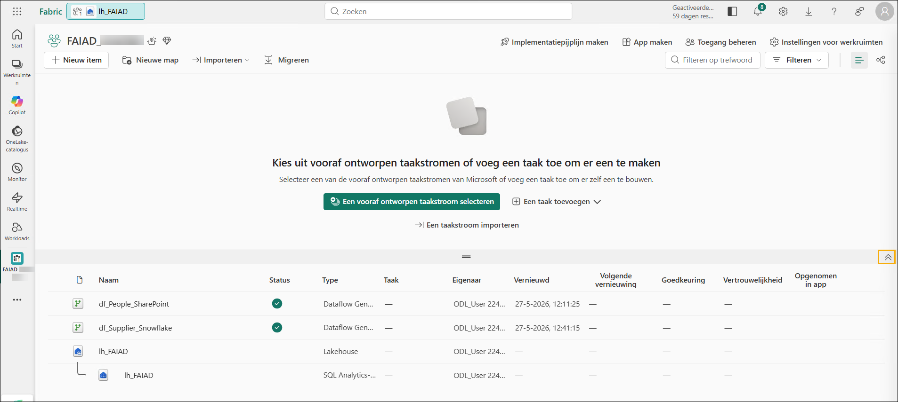

3. Alle artefacten die u hebt aangemaakt, worden hier weergegeven. Typ aan de rechterkant van het scherm **df** in het **zoekvak**. Hiermee worden de artefacten gefilterd op **Dataflows**.

    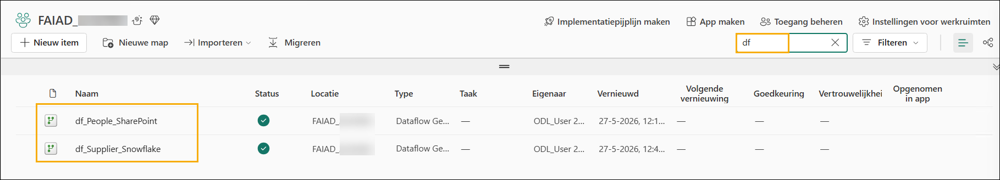

4. Beweeg de muisaanwijzer over de rij **df_Supplier_Snowflake**. Selecteer de **drie puntjes (…)**.

5. U ziet opties om de **Dataflow** te verwijderen, openen en vernieuwen. Laten we de vernieuwingsgeschiedenis bekijken. Selecteer **Recente uitvoeringen**.

    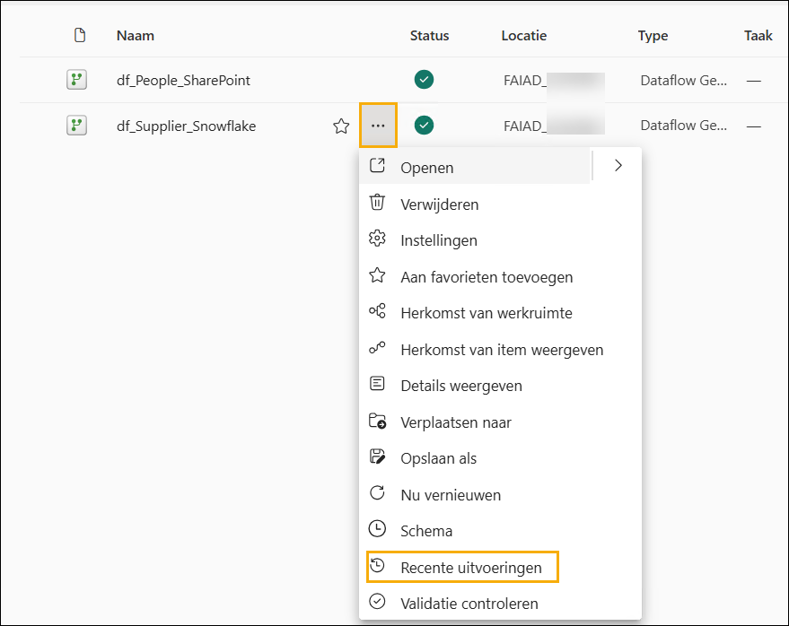

    >**Opmerking:** Er verschijnt een venster/deelvenster aan de rechterkant met een lijst van vernieuwingen.

6. U zult zien dat er één vernieuwing heeft plaatsgevonden toen we in het vorige lab de optie **Opslaan en uitvoeren** selecteerden. Het weergegeven **Type** vernieuwing is **Op aanvraag**, wat aangeeft dat dit een handmatig uitgevoerde vernieuwing was.

    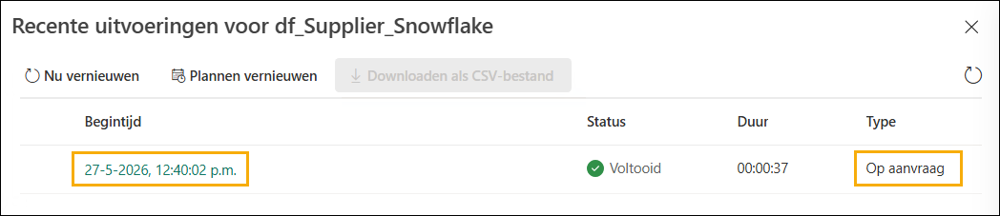

7. Selecteer de koppeling **Starttijd**.

    >**Opmerking:** De starttijd zal bij u anders zijn.

    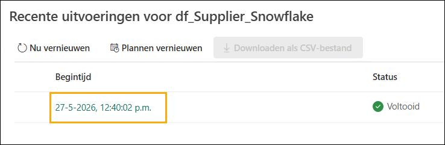

    Het detailscherm wordt geopend. Dit scherm toont de details van de vernieuwing: de starttijd, eindtijd en duur. Ook worden de tabellen/activiteiten weergegeven die zijn vernieuwd. Als er een fout optreedt, kunt u op de naam van de tabel/activiteit klikken voor verder onderzoek.

    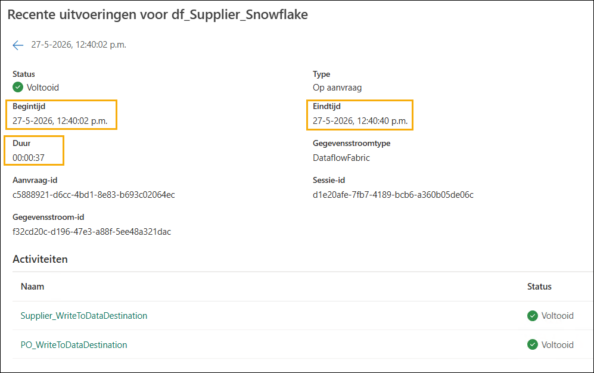

8. Sluit dit scherm door op de **X** rechtsboven te klikken. U wordt teruggeleid naar de **werkruimte**.

9. Beweeg de muisaanwijzer over de rij **df_Supplier_Snowflake**. Selecteer de **drie puntjes (…)**.

10. Laten we bekijken hoe we een automatische vernieuwing kunnen plannen. Selecteer de optie **Instellingen**.

    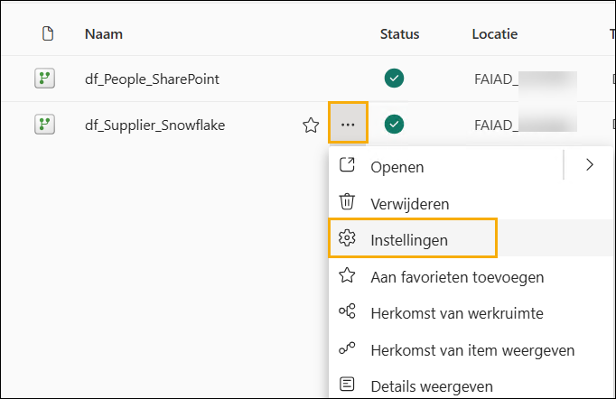

11. In het geopende deelvenster **Instellingen** ziet u drie opties:

    - **Info:** Hier kunt u de naam van de Dataflow wijzigen en een beschrijving toevoegen. U kunt ook zien wie de eigenaar van de Dataflow is en wanneer deze voor het laatst is gewijzigd.

    - **Goedkeuring:** Hiermee kunt u aangeven of de Dataflow het label **Gepromoot** of **Gecertificeerd** krijgt, zodat anderen dit kunnen zien.

    - **Schema:** Hier kunt u de planning voor uw Dataflows instellen.

        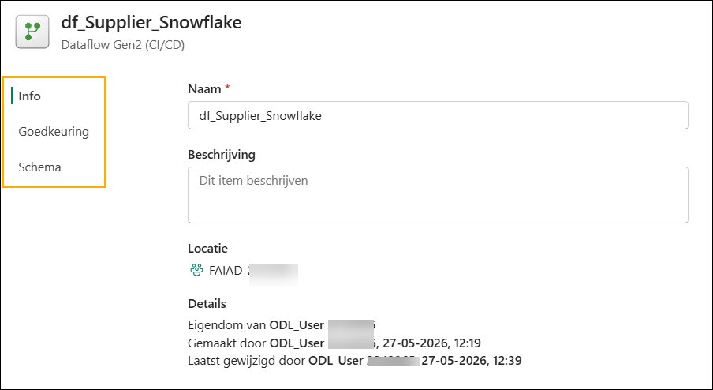

12. Selecteer de optie **Schema**.

13. Om een planning te activeren, klikt u eenvoudig op **+ Planning toevoegen**.

    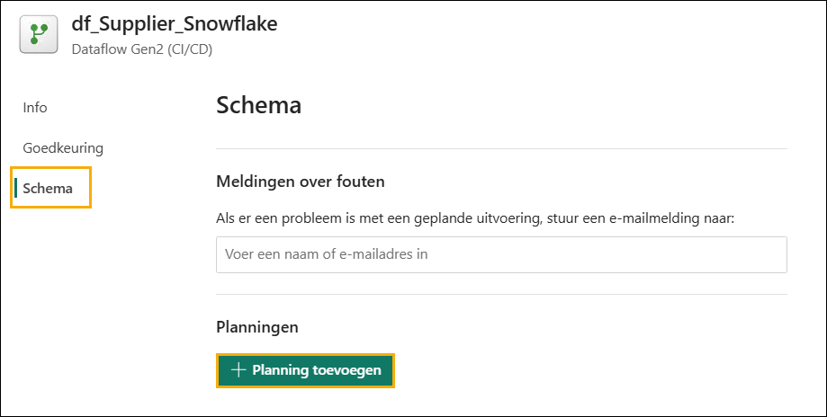

14. U kunt nu de frequentie van de vernieuwing instellen door een optie te kiezen voor de eigenschap **Herhalen**. Kies voor dit scenario **Dagelijks (1)**.

15. Voor de eigenschap **Tijd** geeft u **12:00 AM (2)** op, omdat we middernacht willen gebruiken.

    >**Opmerking:** Door op de koppeling **Nog een tijd toevoegen** te klikken, kunt u meerdere vernieuwingstijden toevoegen.

16. U kunt ook een **Startdatum en -tijd (3)** en een **Einddatum en -tijd (4)** opgeven. Kies voor dit scenario de huidige dag als begin- en einddatum.

17. U kunt de gewenste **Tijdzone (5)** opgeven. Selecteer vervolgens **Opslaan**.

    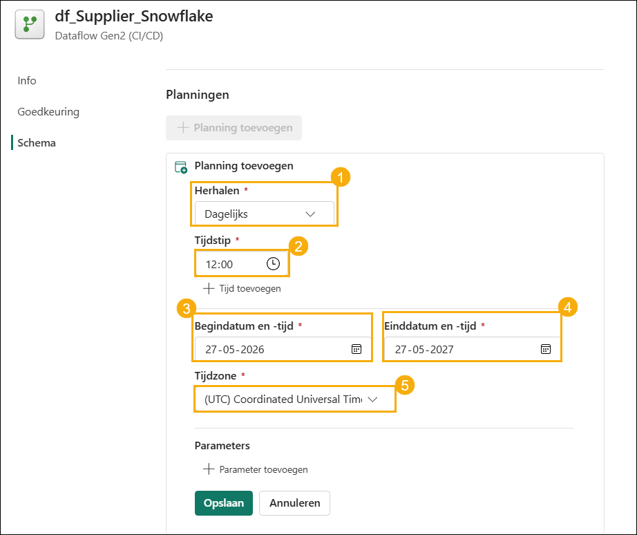

18. U ziet nu de geplande vernieuwing en kunt deze bewerken of verwijderen wanneer deze niet langer nodig is, of aanvullende geplande vernieuwingen toevoegen.

    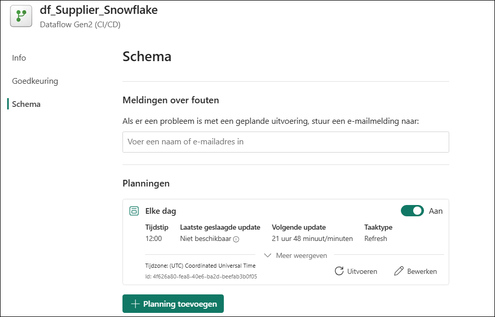

    Zoals eerder vermeld, moeten we aangepaste logica bouwen voor het scenario waarin het medewerkersbestand in **SharePoint** niet op tijd wordt aangeleverd. Laten we een **Pipeline** gebruiken om dit op te lossen.

# Pipeline

## Taak 2: Pipeline aanmaken

1. Navigeer terug naar de Fabric-werkruimte **FAIAD_<inject key="Deployment ID" enableCopy="false"/>** door de werkruimte te selecteren in het linkerpaneel.

2. Selecteer in het bovenste menu **+ Nieuw item (1) -> Pijplijn (2)**.

    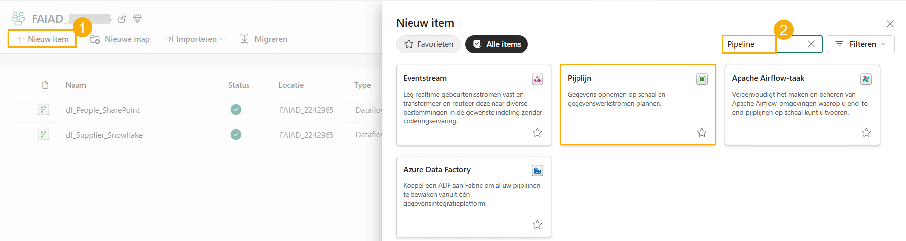

3. Er wordt een venster **Nieuwe Pijplijn** geopend. Geef de pipeline de naam **pl_Refresh_People_SharePoint** en selecteer **Maken**.

    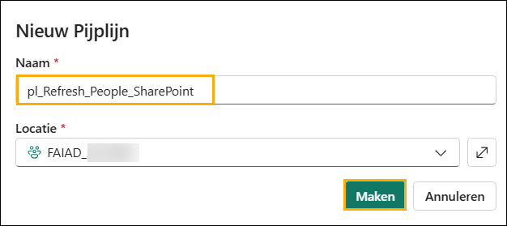

    U wordt doorgestuurd naar de **Pipeline-pagina**. Als u eerder met **Azure Data Factory** hebt gewerkt, zal dit scherm u bekend voorkomen. Laten we een kort overzicht van de indeling bekijken.

    U bevindt zich op het scherm **Start**. In het bovenste menu vindt u opties voor het toevoegen van veelgebruikte activiteiten, het valideren van de pipeline, het uitvoeren van een pipeline en het bekijken van de uitvoeringsgeschiedenis. In het centrale paneel vindt u snelle opties om te beginnen met het bouwen van de pipeline.

    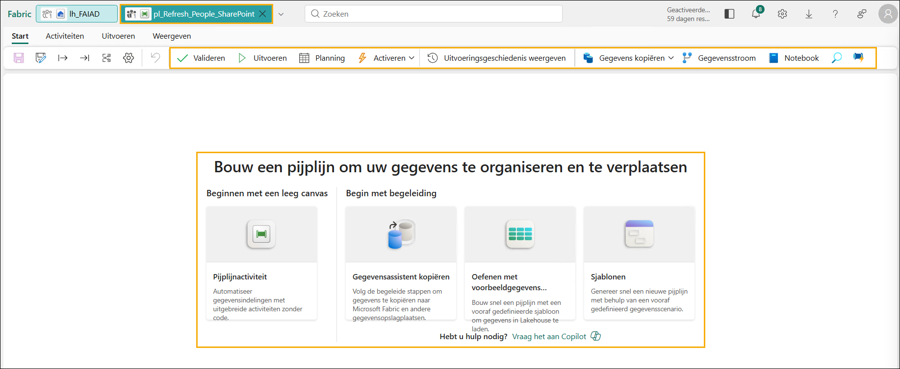

4. Selecteer in het bovenste menu **Activiteiten**. In dit menu vindt u een lijst met veelgebruikte activiteiten.

5. Selecteer de **drie puntjes (…)** aan de rechterkant van het menu om alle overige beschikbare activiteiten te bekijken. We zullen in dit lab enkele van deze activiteiten gebruiken.

    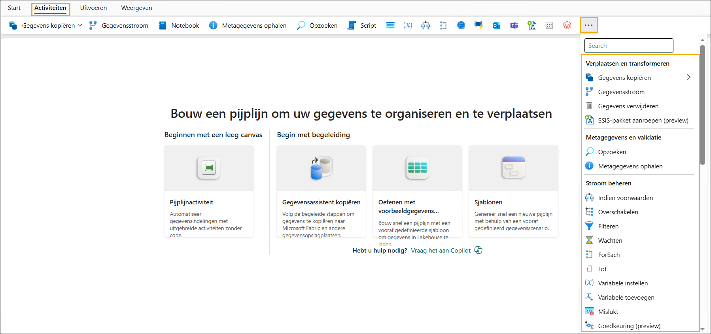

6. Klik in het bovenste menu op **Uitvoeren**. Hier vindt u opties om de uitvoering van de pipeline te starten en te plannen. U vindt hier ook de optie om de uitvoeringsgeschiedenis te bekijken via **Uitvoeringsgeschiedenis bekijken**.

7. Selecteer in het bovenste menu **Weergave**. Hier vindt u opties om de code in **JSON-indeling** te bekijken. U vindt hier ook opties om activiteiten automatisch uit te lijnen.

    >**Opmerking:** Als u bekend bent met **JSON**, kunt u aan het einde van het lab gerust **JSON-code weergeven** selecteren. U zult merken dat alle orkestratie die via de ontwerpweergave wordt uitgevoerd, ook in JSON kan worden geschreven.

    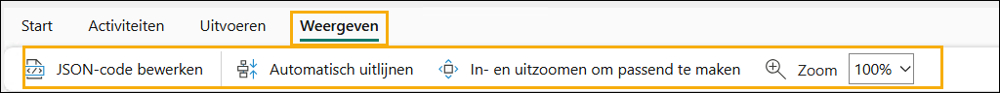

## Taak 3: Eenvoudige pipeline bouwen

Laten we beginnen met het bouwen van de pipeline. We hebben een activiteit nodig om de **Dataflow** te vernieuwen. Laten we een geschikte activiteit zoeken.

1. Selecteer in het bovenste menu **Activiteiten -> Gegevensstroom**. De **Dataflow-activiteit** wordt toegevoegd aan het centrale ontwerpvenster. U ziet dat het onderste deelvenster nu configuratieopties voor de Dataflow-activiteit toont.

2. We gaan de activiteit configureren om verbinding te maken met de dataflow **df_People_SharePoint**. Selecteer in het **onderste deelvenster** de optie **Instellingen**.

    >**Opmerking:** Mogelijk moet u het onderste deelvenster omhoog slepen om de instellingen te zien.

    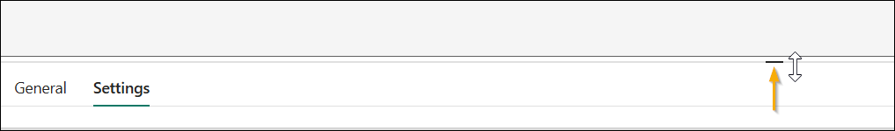

3. Zorg ervoor dat **Werkruimte** is ingesteld op uw Fabric-werkruimte, **FAIAD_<inject key="Deployment ID" enableCopy="false"/>**.

4. Selecteer in de vervolgkeuzelijst **Dataflow** de optie **df_People_SharePoint**. Wanneer deze **Dataflow-activiteit** wordt uitgevoerd, wordt **df_People_SharePoint** vernieuwd. Eenvoudig, toch?

    In ons scenario worden de medewerkersgegevens niet volgens een vast schema bijgewerkt. Soms treedt er vertraging op. Laten we bekijken hoe we hiermee rekening kunnen houden.

    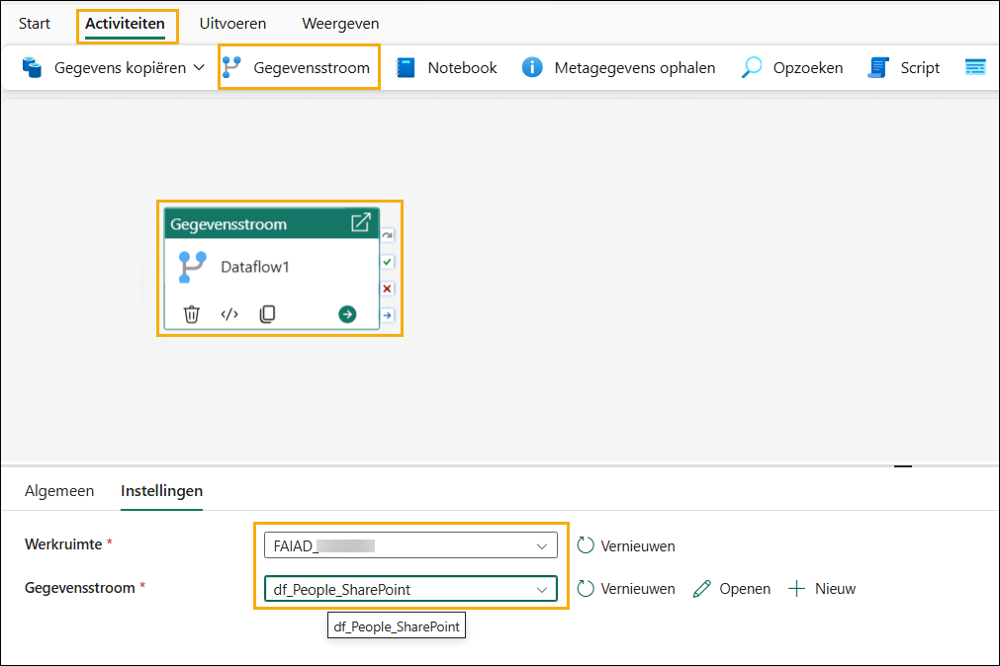

5. Selecteer in het **onderste deelvenster** de optie **Algemeen**. Laten we de activiteit een naam en beschrijving geven.

6. Voer in het veld **Naam** de waarde **dfactivity_People_SharePoint** in.

7. Voer in het veld **Beschrijving** de tekst **Dataflow-activiteit voor het vernieuwen van de dataflow df_People_SharePoint** in.

8. U ziet dat er een optie is om een activiteit te deactiveren. Deze functie is handig tijdens het testen of debuggen. Laat de instelling op **Geactiveerd** staan.

9. Er is een optie om een **Time-out** in te stellen. Laat de **standaardwaarde** staan, zodat de dataflow voldoende tijd heeft om te vernieuwen.

    >**Opmerking:** Omdat de gegevens niet volgens een vast schema beschikbaar zijn, stellen we de activiteit in om elke 10 minuten opnieuw te worden uitgevoerd, met maximaal drie pogingen. Als ook de derde poging mislukt, wordt een fout gerapporteerd.

10. Stel **Opnieuw proberen** in op **3**.

11. Vouw de sectie **Geavanceerd** uit.

12. Stel **Interval opnieuw proberen (sec)** in op **600**.

13. Selecteer in het menu **Start -> Opslaan** om de pipeline op te slaan.

    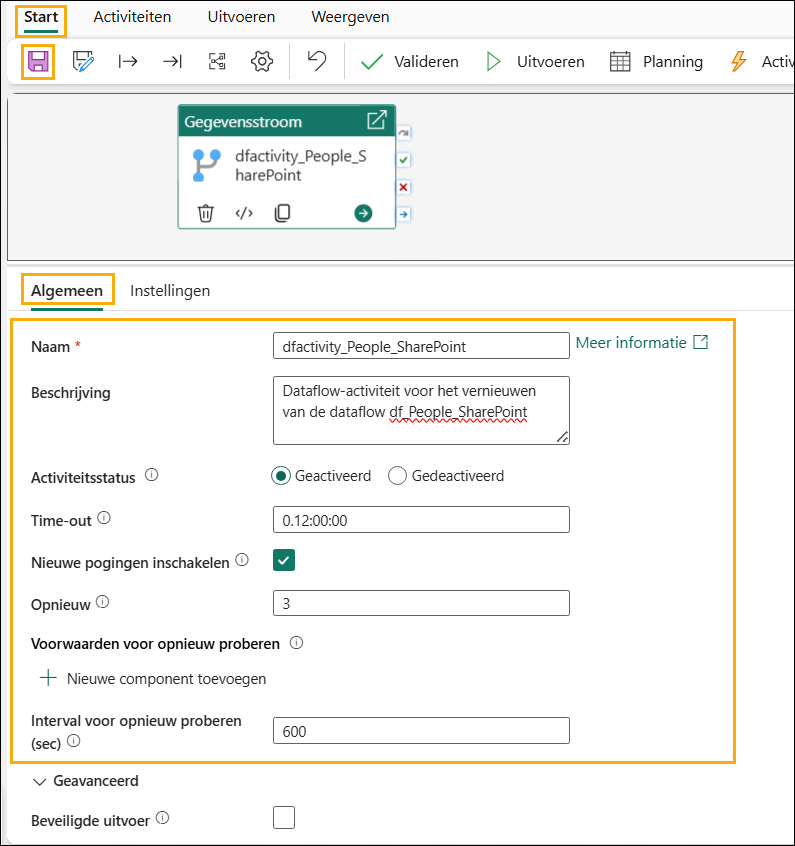

    Merk op wat het voordeel is van het gebruik van een **pipeline** in plaats van het instellen van een geplande vernieuwing voor de dataflow (zoals we deden voor de eerdere dataflow):

    - De pipeline biedt de mogelijkheid om meerdere keren opnieuw te proberen voordat de vernieuwing als mislukt wordt gemarkeerd.

    - De pipeline biedt de mogelijkheid om naast het vernieuwen van de dataflow ook andere taken uit te voeren.

## Taak 4: Nieuwe pipeline aanmaken

Laten we ons scenario iets complexer maken. We hebben vastgesteld dat als de gegevens om 09:00 uur niet beschikbaar zijn, ze meestal binnen vijf minuten beschikbaar komen. Als dit tijdsvenster wordt gemist, duurt het ongeveer 15 minuten voordat het bestand beschikbaar is. We willen de nieuwe pogingen plannen na vijf en vijftien minuten. Laten we bekijken hoe dit gerealiseerd kan worden door een nieuwe pipeline aan te maken.

1. Klik in het linkerpaneel op **FAIAD_<inject key="Deployment ID" enableCopy="false"/>** om terug te keren naar de startpagina van de werkruimte.

2. Klik in het bovenste menu op **+ Nieuw item (1)** en selecteer vervolgens **Pijplijn (2)** in het pop-upvenster.

    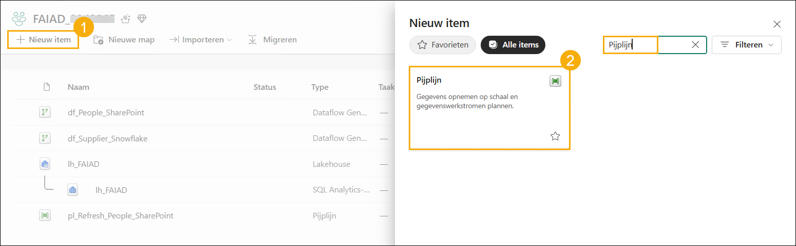

3. Het venster **Nieuwe Pijplijn** wordt geopend. Geef de pipeline de naam **pl_Refresh_People_SharePoint_Option2 (3)** en selecteer **Maken (4)**.

    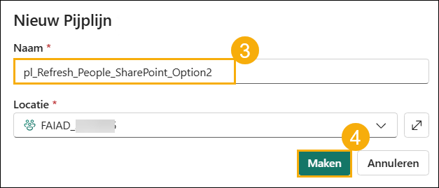

## Taak 5: Until-activiteit aanmaken

1. U wordt doorgestuurd naar het scherm **Pipeline**. Selecteer in het menu **Activiteiten**.

2. Klik op de **drie puntjes (…)** aan de rechterkant.

3. Selecteer in de lijst met activiteiten **Until**.

    **Until:** is een activiteit die wordt gebruikt om acties te herhalen totdat aan een bepaalde voorwaarde is voldaan.

    In ons scenario zullen we de dataflow blijven vernieuwen totdat dit succesvol is, of totdat we drie pogingen hebben uitgevoerd.

    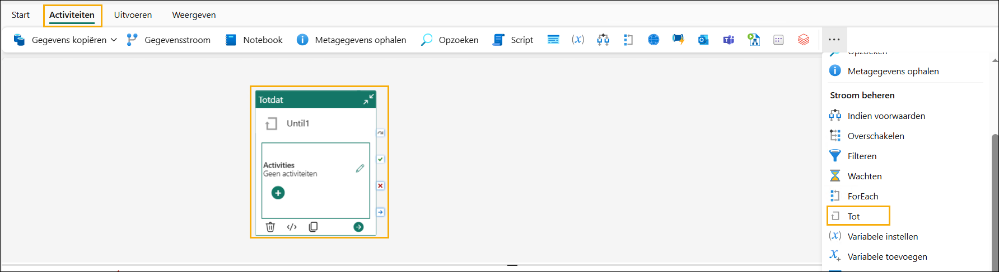

## Taak 6: Variabelen aanmaken

1. We moeten variabelen aanmaken die worden gebruikt voor herhalingen en het instellen van de status. Selecteer het **lege gebied** in het ontwerpvenster van de pipeline.

2. U zult zien dat het menu in het onderste deelvenster verandert. Selecteer **Variabelen**.

3. Selecteer **+ Nieuw** om een nieuwe variabele toe te voegen.

4. Er verschijnt een nieuwe rij. Voer **varCounter** in het tekstvak **Naam** in. We gebruiken deze variabele om drie herhalingen uit te voeren.

5. Selecteer in de vervolgkeuzelijst **Type** de optie **Geheel getal**.

6. Voer als **Standaardwaarde** de waarde **0** in.

    >**Opmerking:** We gebruiken het voorvoegsel **var** voor variabelenamen zodat ze gemakkelijker te herkennen zijn. Dit is ook een aanbevolen werkwijze.

    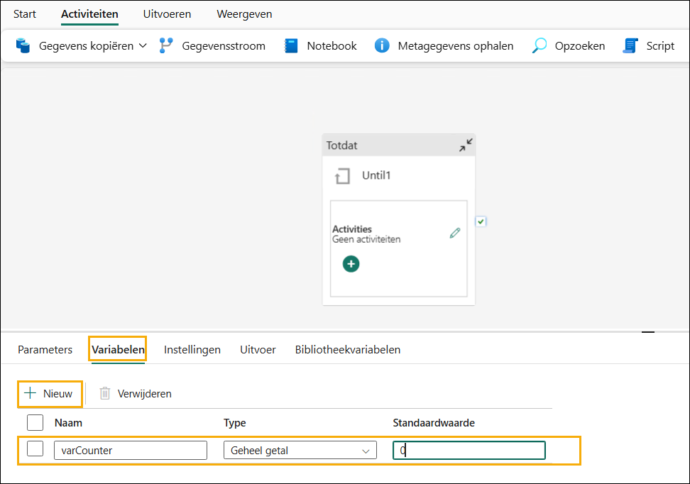

7. Selecteer **+ Nieuw** om nog een variabele toe te voegen.

8. Er verschijnt een nieuwe rij. Voer **varTempCounter** in het tekstvak **Naam** in. We gebruiken deze variabele om de waarde van **varCounter** te verhogen.

9. Selecteer in de vervolgkeuzelijst **Type** de optie **Geheel getal**.

10. Voer als **Standaardwaarde** de waarde **0** in.

11. Voeg op vergelijkbare wijze nog drie variabelen toe:

    1. **varIsSuccess** van het type **Tekenreeks** met de standaardwaarde **No**. Deze variabele wordt gebruikt om aan te geven of de vernieuwing van de dataflow succesvol is uitgevoerd.

    2. **varSuccess** van het type **Tekenreeks** met de standaardwaarde **Yes**. Deze variabele wordt gebruikt om de waarde van **varIsSuccess** in te stellen wanneer de vernieuwing van de dataflow succesvol is.

    3. **varWaitTime** van het type **Geheel getal** met de standaardwaarde **60**. Deze variabele wordt gebruikt om de wachttijd in te stellen wanneer de dataflow mislukt (5 minuten/300 seconden of 15 minuten/900 seconden).

        >**Opmerking:** Zorg ervoor dat er geen spaties vóór of na de variabelenaam staan.

        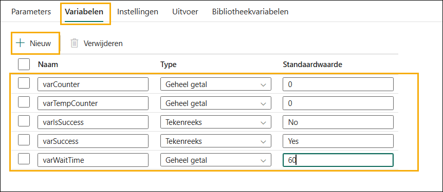

## Taak 7: Until-activiteit configureren

1. Selecteer de activiteit **Until**.

2. Selecteer in het **onderste deelvenster** de optie **Algemeen**.

3. Voer bij **Naam** de waarde **Iterator** in.

4. Voer bij **Beschrijving** de tekst **"Iterator voor het vernieuwen van de dataflow. Er worden maximaal 3 pogingen uitgevoerd"** in.

    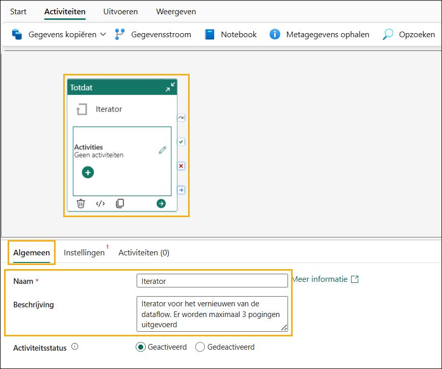

5. Selecteer in het onderste deelvenster **Instellingen (1)**.

6. Selecteer het tekstvak **Expressie (2)**. We moeten een expressie invoeren in dit tekstvak die wordt geëvalueerd als **waar** of **onwaar**. De activiteit **Until** blijft herhalen zolang deze expressie als **onwaar** wordt geëvalueerd. Zodra de expressie als **waar** wordt geëvalueerd, stopt de activiteit **Until** met herhalen en gaat deze verder naar de volgende activiteit.

7. Selecteer de koppeling **Add dynamic content (3)** die onder het tekstvak verschijnt.

    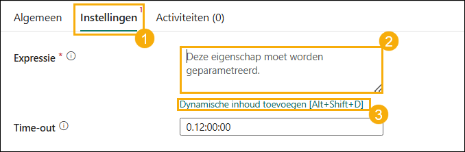

    We moeten een expressie schrijven die wordt uitgevoerd totdat de waarde van **varCounter gelijk is aan 3** of de waarde van **varIsSuccess gelijk is aan Yes**. (varCounter en varIsSuccess zijn de variabelen die we zojuist hebben aangemaakt.)

8. Het dialoogvenster **Pipeline expression builder** wordt geopend. In de onderste helft van het dialoogvenster ziet u een menu:

    1. **Parameters:** Waarden die aan de pipeline worden doorgegeven. Bijvoorbeeld een waarde van de ene pipeline die aan een andere pipeline wordt doorgegeven. Deze waarden kunnen in elke expressie worden gebruikt, maar kunnen niet worden gewijzigd tijdens de uitvoering van de pipeline.

    2. **Systeemvariabelen:** Kunnen worden gebruikt in expressies bij het definiëren van entiteiten binnen een van de services. Bijvoorbeeld pipeline-id, pipelinenaam, triggernaam, enzovoort.

    3. **Triggerparameters:** Parameters die de pipeline hebben geactiveerd, zoals een bestandsnaam of maplocatie.

    4. **Functies:** U kunt functies gebruiken binnen expressies. Functies zijn onderverdeeld in de categorieën Verzameling, Conversie, Datum, Logisch, Wiskunde en Tekenreeks. Bijvoorbeeld: **concat** is een tekenreeksfunctie en **add** is een wiskundefunctie.

    5. **Variabelen:** Pipeline-variabelen zijn waarden die tijdens de uitvoering van een pipeline kunnen worden ingesteld en gewijzigd. In tegenstelling tot pipelineparameters, die op pipeline-niveau worden gedefinieerd en niet kunnen worden gewijzigd tijdens de uitvoering van een pipeline, kunnen pipelinevariabelen worden aangepast met behulp van een activiteit **Variabele instellen**. We zullen deze activiteit binnenkort gebruiken.

    6. **Bibliotheekvariabelen:** Bibliotheekvariabelen gebruiken variabelen die zijn gedefinieerd in het Fabric-item **Variable Library**. Deze variabelen bieden een centrale manier om configuraties tussen werkruimten te beheren ter ondersteuning van CI/CD-workflows. Ze kunnen worden gebruikt in combinatie met pipelines, notebooks, Lakehouse-shortcuts en meer.

        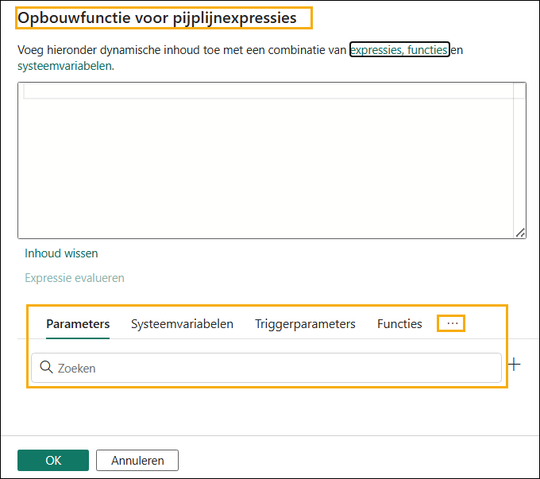

9. Klik in het menu op **Functies**.

10. Selecteer in de sectie **Logische functies** de functie **or**. U ziet dat **@or()** wordt toegevoegd aan het tekstvak voor de dynamische expressie. De functie **or** vereist twee parameters; we werken nu aan de eerste parameter.

    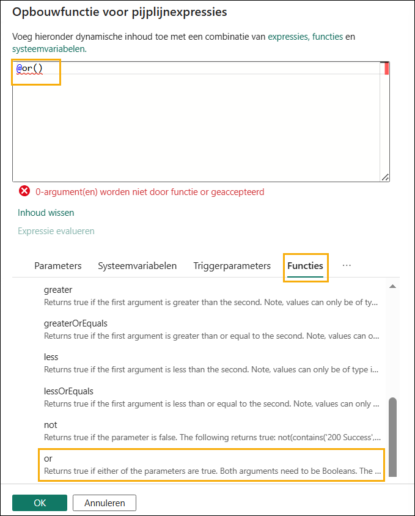

11. Plaats de cursor **tussen de haakjes** van de functie **@or**.

12. Selecteer in de sectie **Logische functies** de functie **equals**. U ziet dat deze wordt toegevoegd aan het tekstvak voor de dynamische expressie.

    >**Opmerking:** Uw functie zou er nu als volgt uit moeten zien: **@or(equals())**. De functie **equals** vereist ook twee parameters. We gaan controleren of de variabele **varCounter** gelijk is aan **3**.

    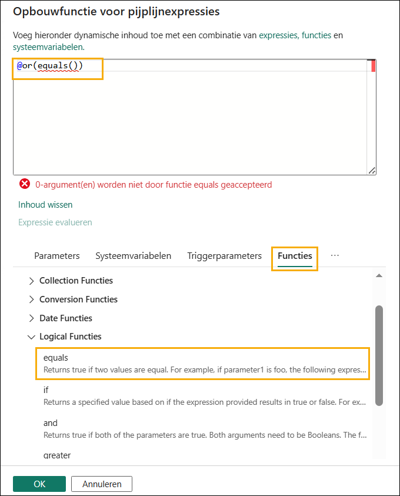

13. Plaats nu de cursor **tussen de haakjes** van de functie **@equals** om de parameters toe te voegen.

14. Selecteer in het onderste menu **Variabelen**.

15. Selecteer de variabele **varCounter** als eerste parameter.

16. Voer **3** in als tweede parameter van de functie **equals**. Zoals weergegeven in de onderstaande afbeelding zou uw expressie er als volgt uit moeten zien:

    **@or(equals(variables('varCounter'),3))**

    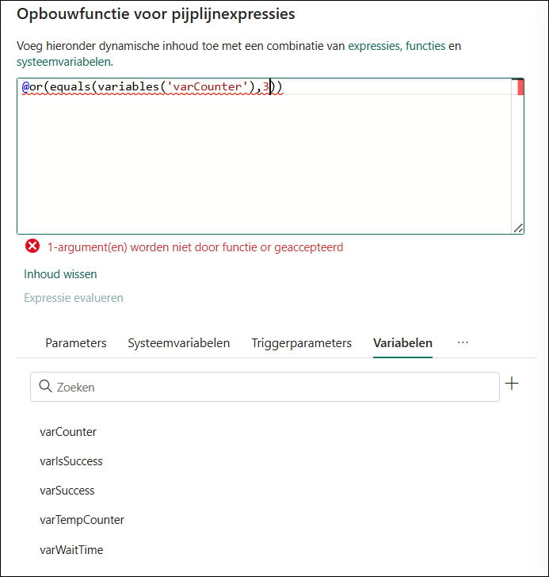

17. We moeten de tweede parameter toevoegen aan de functie **or**. **Voeg een komma toe** tussen de twee afsluitende haakjes. Typ deze keer de functienaam handmatig. Begin met typen **equ**; er verschijnt een vervolgkeuzelijst met beschikbare functies (IntelliSense). Selecteer de functie **equals**.

    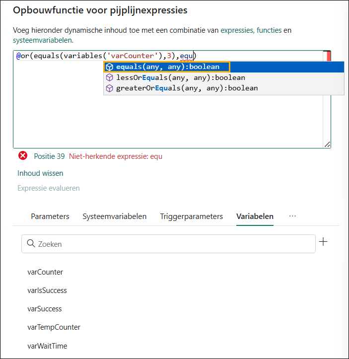

18. De eerste parameter van de functie **equals** is een variabele. Plaats de cursor **vóór de komma**.

19. Begin met typen **variables(**

20. Selecteer met behulp van IntelliSense de optie **variables('varIsSuccess')**.

21. Voer na de komma de tweede parameter in. Begin opnieuw met typen **variables(**

22. Selecteer met behulp van IntelliSense de optie **variables('varSuccess')**. Hier vergelijken we de waarde van **varIsSuccess** met de waarde van **varSuccess**. (**varSuccess** heeft standaard de waarde **Yes**.)

    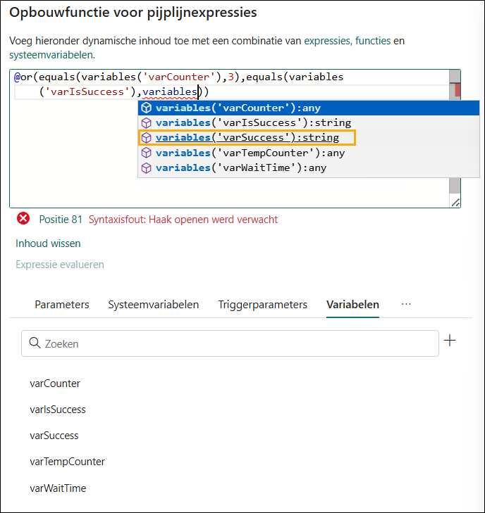

23. Uw expressie zou er als volgt uit moeten zien:

    **@or(equals(variables('varCounter'),3),equals(variables('varIsSuccess'), variables('varSuccess')))**

24. Selecteer **OK**.

    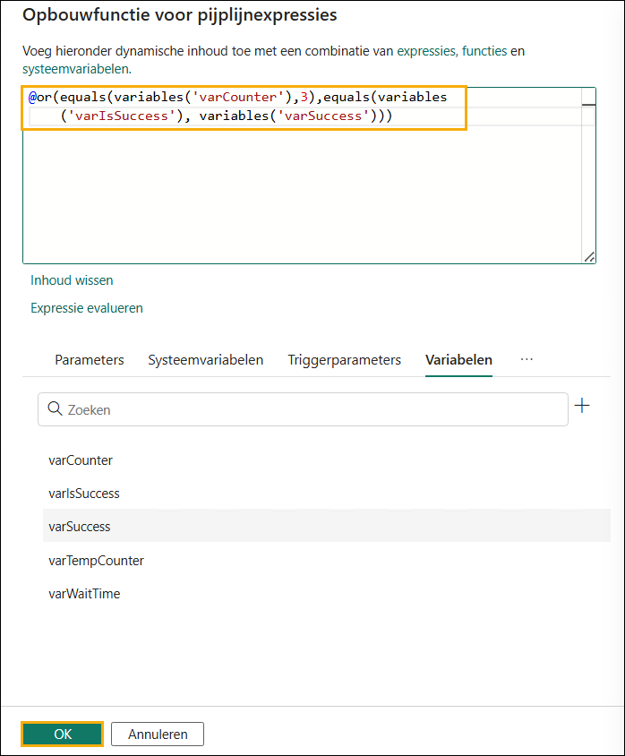

## Taak 8: Dataflow-activiteit configureren

1. U wordt teruggeleid naar het ontwerpscherm. Selecteer de activiteit **Until** en kies in het **onderste deelvenster** de optie **Activiteiten**. We gaan nu de activiteiten toevoegen die moeten worden uitgevoerd.

2. Selecteer het **bewerkingspictogram** in de eerste rij. U wordt doorgestuurd naar een leeg iterator-ontwerpscherm.

    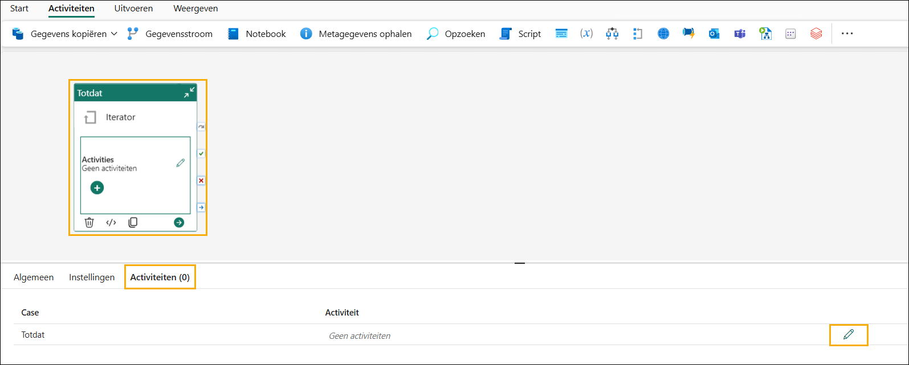

3. Selecteer in het bovenste menu **Activiteiten -> Gegevensstroom**. De activiteit **Dataflow** wordt toegevoegd aan het ontwerpvenster.

4. Terwijl de activiteit **Dataflow** geselecteerd is, selecteert u in het onderste deelvenster de optie **Algemeen**. Laten we de activiteit een naam en beschrijving geven.

5. Voer in het veld **Naam** de waarde **dfactivity_People_SharePoint** in.

6. Voer in het veld **Beschrijving** de tekst **"Dataflow-activiteit voor het vernieuwen van de dataflow df_People_SharePoint"** in.

    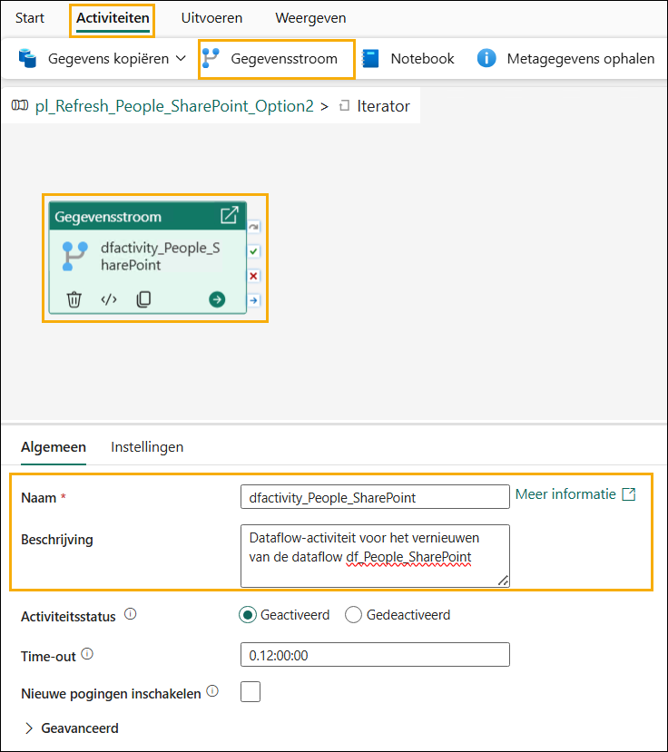

7. Selecteer in het onderste deelvenster **Instellingen**.

8. Zorg ervoor dat **Werkruimte** is ingesteld op uw werkruimte **FAIAD_<inject key="Deployment ID" enableCopy="false"/>**.

9. Selecteer in de vervolgkeuzelijst **Dataflow** de optie **df_People_SharePoint**.

    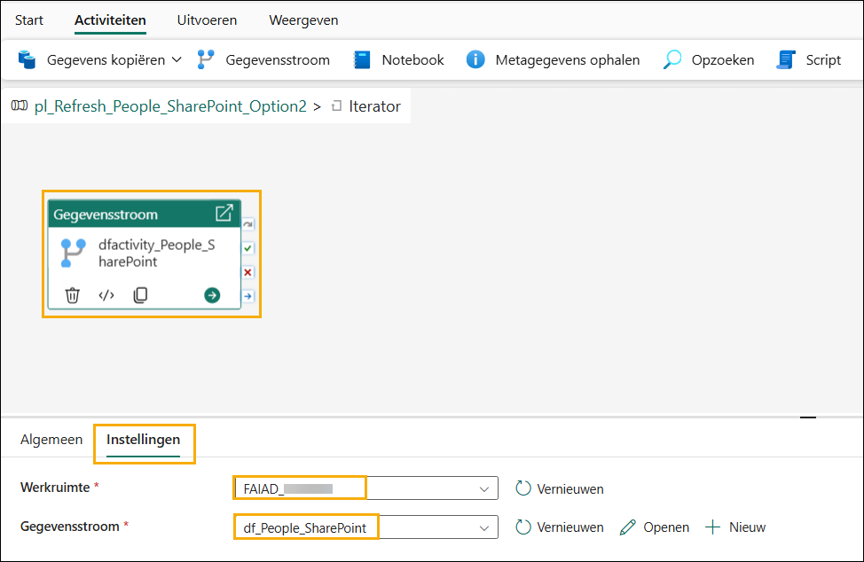

## Taak 9: 1<sup>e</sup> Set variable-activiteit configureren

We hebben de **Dataflow-activiteit** geconfigureerd zoals eerder in het lab. Nu gaan we nieuwe logica toevoegen. Als de vernieuwing van de dataflow succesvol is, moeten we de iterator **Until** verlaten. Ter herinnering: één van de voorwaarden om de iterator te verlaten, is het instellen van de waarde van de variabele **varIsSuccess** op **Yes**.

1. Selecteer in het bovenste menu **Activiteiten -> Variabele instellen**. De activiteit **Variabele instellen** wordt toegevoegd aan het ontwerpvenster.

2. Terwijl de activiteit **Variabele instellen** geselecteerd is, selecteert u in het onderste deelvenster de optie **Algemeen**. Laten we de activiteit een naam en beschrijving geven.

3. Voer in het veld **Naam** de waarde **set_varIsSuccess** in.

4. Voer in het veld **Beschrijving** de tekst **"Variabele varIsSuccess instellen op Yes"** in.

    >**Opmerking:** Beweeg de muisaanwijzer over de activiteit **Dataflow**. Aan de rechterkant van het activiteitvak ziet u vier pictogrammen. Deze kunnen worden gebruikt om verbinding te maken met de volgende activiteit op basis van het resultaat van de activiteit:

    1. Het pictogram met de **grijze gebogen pijl** wordt gebruikt wanneer de activiteit wordt overgeslagen.
    
    2. Het pictogram met het **groene vinkje** wordt gebruikt wanneer de activiteit succesvol wordt uitgevoerd.
    
    3. Het pictogram met het **rode kruis** wordt gebruikt wanneer de activiteit mislukt.
    
    4. Het pictogram met de **blauwe rechte pijl** wordt gebruikt wanneer de activiteit wordt voltooid.

5. Klik op het **groene vinkje** van de activiteit **Dataflow dfactivity_People_SharePoint** en sleep dit naar de nieuwe activiteit **Variabele instellen set_varIsSuccess**. Hierdoor wordt de activiteit **Variabele instellen** uitgevoerd wanneer de vernieuwing van de dataflow succesvol is.

    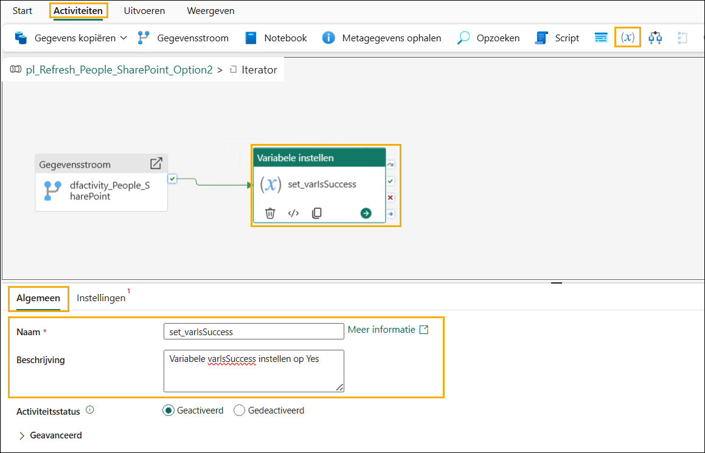

6. Terwijl de activiteit **Variabele instellen** geselecteerd is, selecteert u in het onderste menu de optie **Instellingen**.

7. Zorg ervoor dat in het onderste deelvenster **Variabeletype** is ingesteld op **Pipelinevariabele**.

8. Selecteer in het veld **Naam** de waarde **varIsSuccess**. Dit is de variabele waarvan we de waarde gaan instellen.

9. Selecteer in het veld **Waarde** het **tekstvak**. Selecteer vervolgens de koppeling **Dynamische inhoud toevoegen**.

    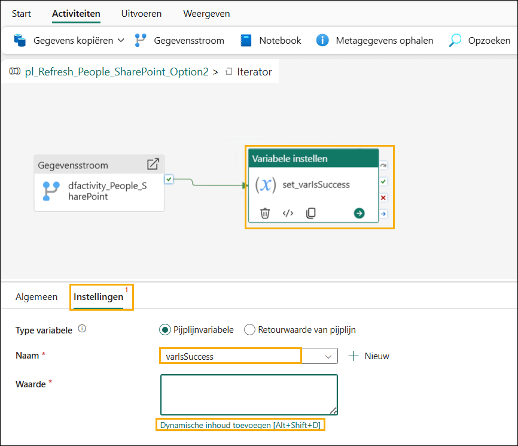

10. Het dialoogvenster **Pipeline expression builder** wordt geopend. Selecteer het tekstgebied **Dynamische inhoud hieronder toevoegen met een combinatie van expressies, functies en systeemvariabelen (1)**.

11. Klik in het onderste menu op de **drie puntjes (...) (2)** en selecteer vervolgens **Variabelen (3) -> varSuccess (4)**. U ziet dat **@variables('varSuccess')** wordt ingevoerd in het tekstgebied. Ter herinnering: tijdens het aanmaken van de variabelen hebben we de waarde van de variabele **varSuccess** vooraf ingesteld op **Yes**. Hiermee kennen we dus de waarde **Yes** toe aan de variabele **varIsSuccess**.

12. Selecteer **OK**. U wordt teruggeleid naar het **iterator-ontwerpvenster**.

    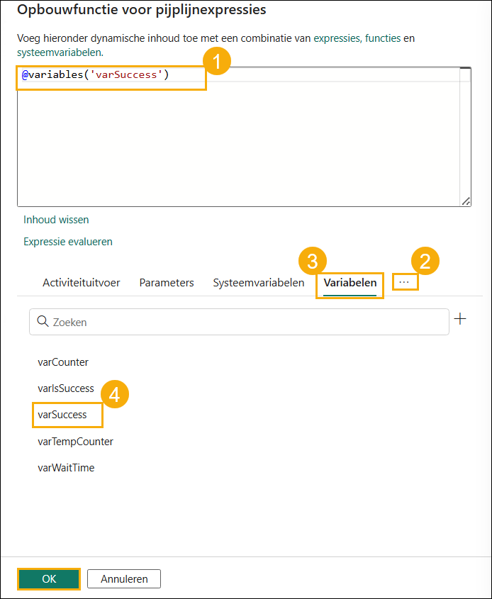

    Nu moeten we de teller instellen wanneer de activiteit **Dataflow** mislukt. In een **Pipeline** kunnen we een variabele niet naar zichzelf laten verwijzen. Dit betekent dat we de tellervariabele **varCounter** niet kunnen verhogen met één (**varCounter = varCounter + 1**). Daarom gebruiken we de variabele **varTempCounter**.

## Taak 10: 2<sup>e</sup> Set variable-activiteit configureren

1. Selecteer in het bovenste menu **Activiteiten -> Variabele instellen**. De activiteit **Variabele instellen** wordt toegevoegd aan het ontwerpvenster.

2. Terwijl de activiteit **Variabele instellen** geselecteerd is, selecteert u in het onderste deelvenster de optie **Algemeen**. Laten we de activiteit een naam en beschrijving geven.

3. Voer in het veld **Naam** de waarde **set_varTempCounter** in.

4. Voer in het veld **Beschrijving** de tekst **"Variabele varTempCounter verhogen"** in.

5. Klik op het **rode kruis** van de activiteit **Dataflow** en sleep dit naar de nieuwe activiteit **Variabele instellen**. Hierdoor wordt deze activiteit uitgevoerd wanneer de vernieuwing van de dataflow mislukt.

    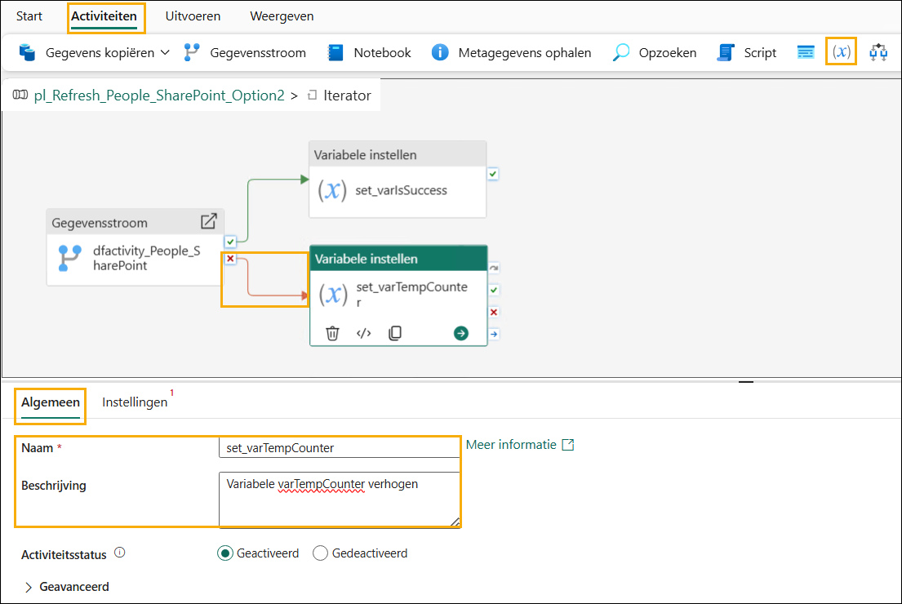

6. Terwijl de activiteit **Variabele instellen** geselecteerd is, selecteert u in het onderste menu de optie **Instellingen**.

7. Zorg ervoor dat in het onderste deelvenster **Variabeletype** is ingesteld op **Pipelinevariabele**.

8. Selecteer in het veld **Naam** de waarde **varTempCounter**. Dit is de variabele waarvan we de waarde gaan instellen.

9. Selecteer in het veld **Waarde** het **tekstvak**. Selecteer vervolgens de koppeling **Dynamische inhoud toevoegen**.

10. Het dialoogvenster **Pipeline expression builder** wordt geopend. Voer de volgende expressie in:

    **@add(variables('varCounter'),1)**

    >**Opmerking:** U kunt deze expressie handmatig typen, functies selecteren via het menu of de expressie kopiëren en plakken. Deze functie stelt de waarde van de variabele **varTempCounter** in op de waarde van de variabele **varCounter** plus één (**varTempCounter = varCounter + 1**).

    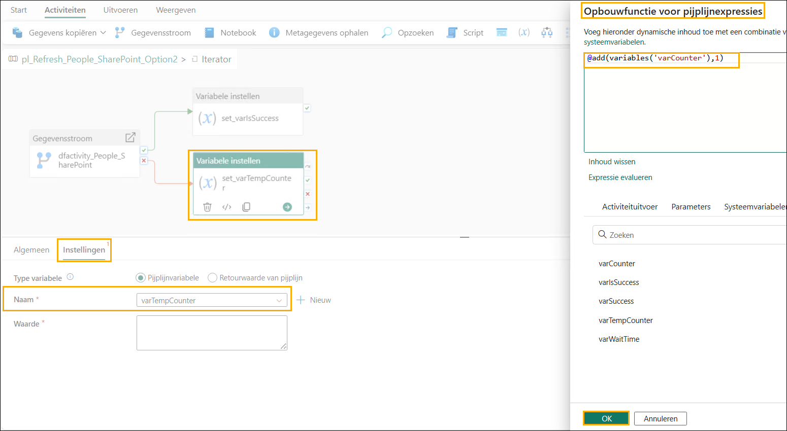

    Nu moeten we de waarde van de variabele **varCounter** instellen op de waarde van **varTempCounter**.

## Taak 11: 3<sup>e</sup> Set variable-activiteit configureren

1. Selecteer in het bovenste menu **Activiteiten -> Variabele instellen**. De activiteit **Variabele instellen** wordt toegevoegd aan het ontwerpvenster.

2. Terwijl de activiteit **Variabele instellen** geselecteerd is, selecteert u in het onderste deelvenster de optie **Algemeen**. Laten we de activiteit een naam en beschrijving geven.

3. Voer in het veld **Naam** de waarde **set_varCounter** in.

4. Voer in het veld **Beschrijving** de tekst **"Variabele varCounter verhogen"** in.

5. Klik op het **groene vinkje** van de activiteit **Variabele instellen set_varTempCounter** en sleep dit naar de nieuwe activiteit **Variabele instellen set_varCounter**.

    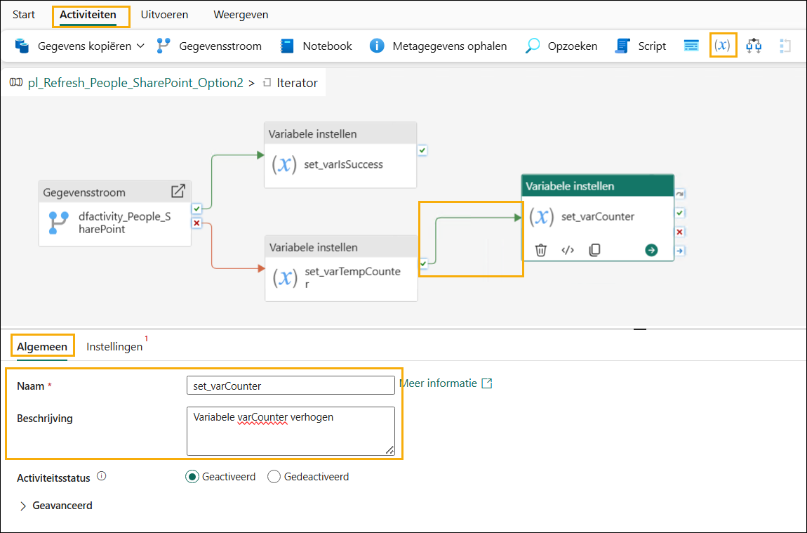

6. Terwijl de activiteit **Variabele instellen set_varCounter** geselecteerd is, selecteert u in het onderste menu de optie **Instellingen**.

7. Zorg ervoor dat in het onderste deelvenster **Variabeletype** is ingesteld op **Pipelinevariabele**.

8. Selecteer in het veld **Naam** de waarde **varCounter**. Dit is de variabele waarvan we de waarde gaan instellen.

9. Selecteer in het veld **Waarde** het **tekstvak**. Selecteer vervolgens de koppeling **Dynamische inhoud toevoegen**.

10. Het dialoogvenster **Pipeline expression builder** wordt geopend. Voer de volgende expressie in:

    **@variables('varTempCounter')**

    U kunt deze expressie handmatig typen, functies selecteren via het menu of de expressie kopiëren en plakken.

11. Selecteer **OK**.

    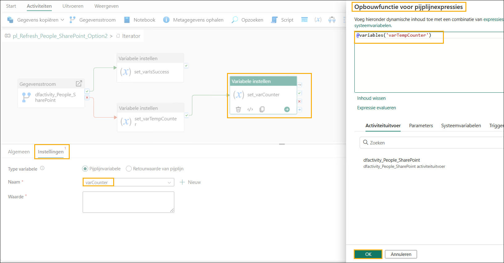

    >**Opmerking:** Deze functie stelt de waarde van de variabele **varCounter** in op de waarde van de variabele **varTempCounter** (**varCounter = varTempCounter**). Aan het einde van elke iteratie hebben zowel **varCounter** als **varTempCounter** dezelfde waarde.

## Taak 12: Wait-activiteit configureren

Vervolgens moeten we 5 minuten/300 seconden wachten als de vernieuwing van de dataflow de eerste keer mislukt voordat we het opnieuw proberen. Als de vernieuwing van de dataflow de tweede keer mislukt, moeten we 15 minuten/900 seconden wachten voordat we opnieuw proberen. We gaan de activiteit **Wachten** en de variabele **varWaitTime** gebruiken om de wachttijd in te stellen.

1. Selecteer in het bovenste menu **Activiteiten -> drie puntjes (…) -> Wachten**. De activiteit **Wachten** wordt toegevoegd aan het ontwerpvenster.

2. Terwijl de activiteit **Wachten** geselecteerd is, selecteert u in het onderste deelvenster de optie **Algemeen**. Laten we de activiteit een naam en beschrijving geven.

3. Voer in het veld **Naam** de waarde **wait_onFailure** in.

4. Voer in het veld **Beschrijving** de tekst **"300 seconden wachten bij de 2e poging en 900 seconden bij de 3e poging"** in.

5. Klik op het **groene vinkje** van de activiteit **Variabele instellen set_varCounter** en sleep dit naar de nieuwe activiteit **Wachten wait_onFailure**.

    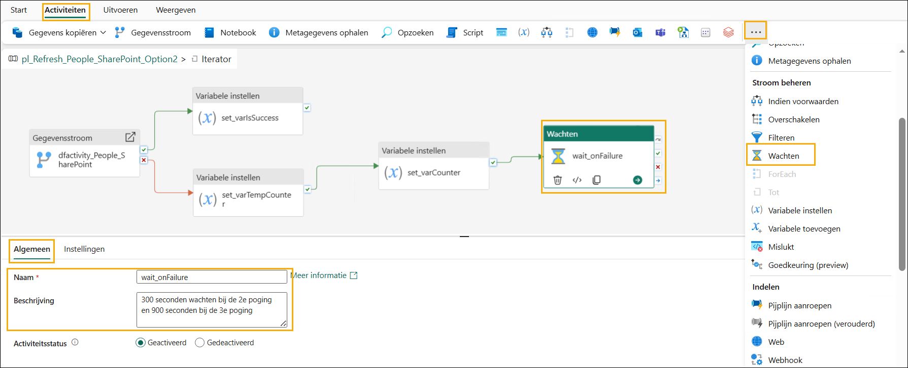

6. Terwijl de activiteit **Wachten** geselecteerd is, selecteert u in het onderste menu de optie **Instellingen**.

7. Selecteer in het veld **Wachttijd in seconden** het **tekstvak** en kies vervolgens de koppeling **Dynamische inhoud toevoegen**.

8. Het dialoogvenster **Pipeline expression builder** wordt geopend. Voer de volgende expressie in:
    
    ```
    @if(
        greater(variables('varCounter'), 1),
        if(equals(variables('varCounter'), 2),
            mul(variables('varWaitTime'),15 ),
            mul(variables('varWaitTime'), 0)
        ),
        mul(variables('varWaitTime'),5 )
    )
    ```

    U kunt deze expressie vrij typen, via het menu de functies selecteren, of kopiëren en plakken.

    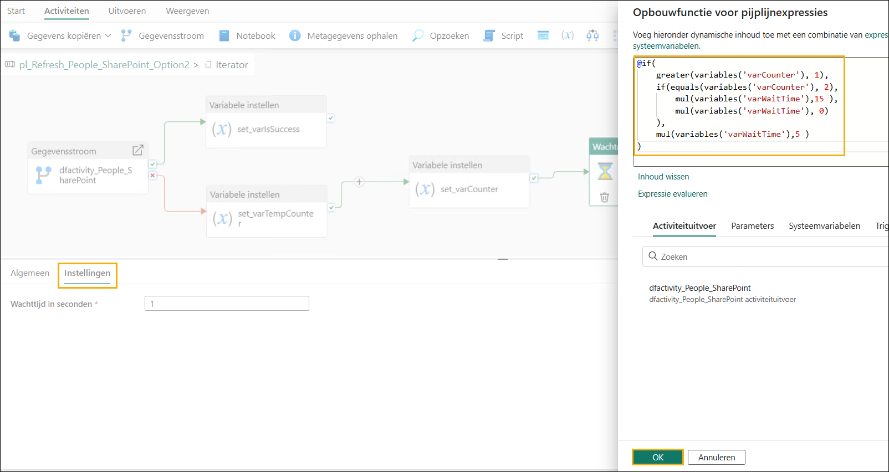

    We gebruiken hier twee nieuwe functies:

    - **greater:** Neemt twee getallen als parameters en vergelijkt welke groter is.

    - **mul:** Dit is een vermenigvuldigingsfunctie die twee parameters neemt om te vermenigvuldigen.

    De expressie is een geneste if-instructie. Er wordt gecontroleerd of de waarde van de variabele varCounter groter is dan 1.

    Als dat het geval is, wordt gecontroleerd of de waarde van de variabele varCounter gelijk is aan 2. Als dat zo is, wordt de wachttijd ingesteld op varWaitTime maal 15. Ter herinnering: de standaardwaarde van varWaitTime is 60. Dat is 60 × 15 = 900 seconden. Als de waarde van de variabele varCounter niet 2 is (dat wil zeggen groter dan 2, wat betekent dat de dataflow-vernieuwing drie keer is mislukt), zijn we klaar met herhalen. We hoeven niet meer te wachten, dus de wachttijd wordt ingesteld op varWaitTime × 0, dus 0. Als de waarde van de variabele varCounter gelijk is aan 1, vermenigvuldigen we varWaitTime × 5. Dat is 60 × 5 = 300 seconden.

9. Selecteer **OK**.

    **Controlepunt:** Uw iterator **Until** zou er nu uit moeten zien zoals in de onderstaande schermafbeelding.

    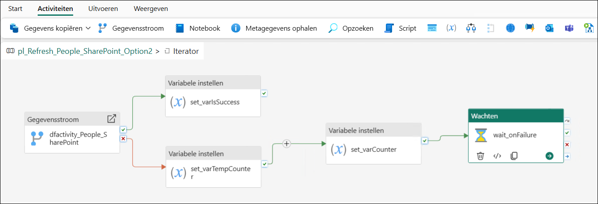

10. Selecteer linksboven in het ontwerpvenster **pl_Refresh_People_Sharepoint_Option2** of **Hoofdcanvas** om de iterator **Until** te verlaten.

    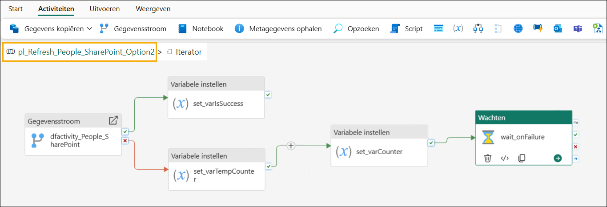

11. We zijn klaar met het maken van de pipeline. Selecteer in het bovenste menu **Start -> Opslaan** om de pipeline op te slaan.

    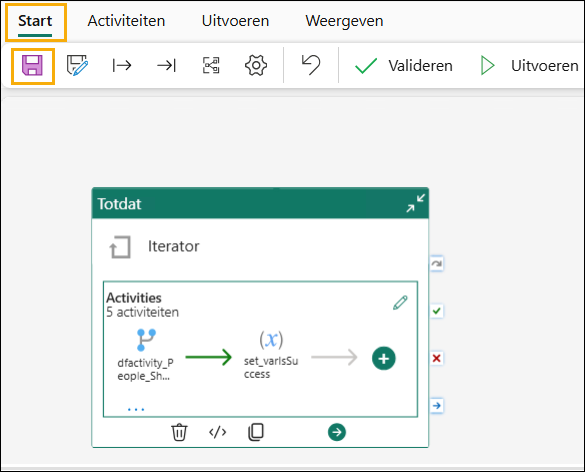

## Taak 13: Geplande vernieuwing configureren voor Pipeline

1. We kunnen de pipeline testen door **Start -> Uitvoeren** te selecteren.

    >**Opmerking:** Het kan enkele minuten duren voordat de pipeline een vernieuwing voltooit. Dit is een trainingsomgeving, waardoor het bestand in **SharePoint** altijd beschikbaar is. Daarom zal uw pipeline nooit mislukken.

2. We kunnen de pipeline configureren om volgens een planning uit te voeren. Selecteer in het bovenste menu **Start -> Planning**. Het dialoogvenster **Planning** wordt geopend.

3. Selecteer de knop **+ Planning toevoegen** onder **Geplande uitvoering**.

    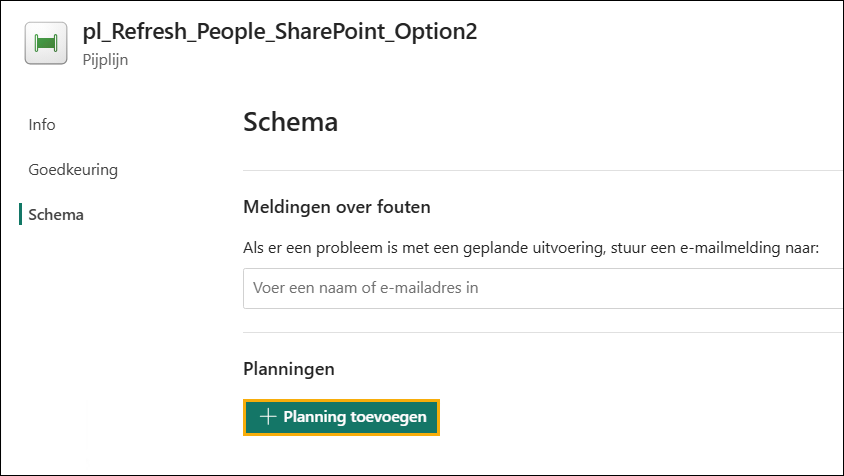

4. Stel de vervolgkeuzelijst **Herhalen** in op **Dagelijks**.

5. Stel **Tijd** in op **09:00 AM**.

6. Stel **Startdatum en -tijd** in op **Vandaag**.

7. Stel **Einddatum en -tijd** in op een **toekomstige datum**.

8. Stel uw **tijdzone** in.

    >**Opmerking:** Omdat dit een labomgeving is, kunt u de tijdzone naar wens instellen. In een praktijkscenario stelt u de tijdzone in op basis van de locatie van uw gegevensbron.

9. Selecteer **Opslaan**.

10. Selecteer het pictogram **X** rechtsboven in het dialoogvenster om het te sluiten.

    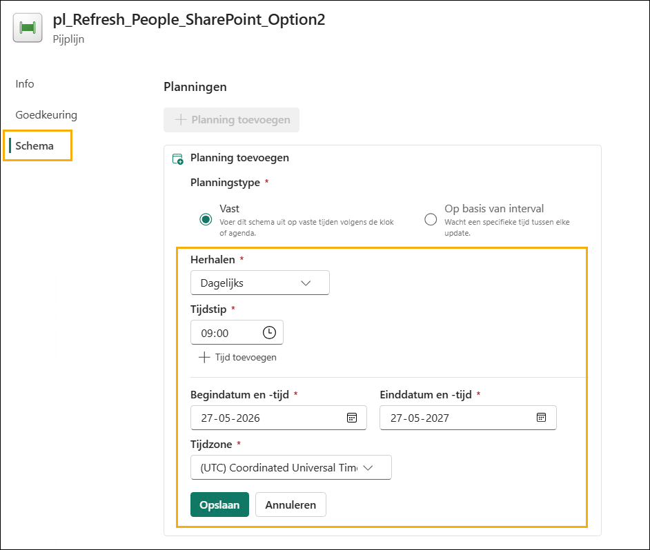

11. Selecteer uw Fabric-werkruimte **FAIAD_<inject key="Deployment ID" enableCopy="false"/>** in het linkerpaneel om terug te keren naar de werkruimte.

    >**Opmerking:** In het scherm **Planning** is er geen optie om meldingen te ontvangen bij succes of mislukking (zoals bij **Dataflow-planning**). Meldingen kunnen worden ingesteld door een activiteit aan de pipeline toe te voegen. Dit behandelen we niet in dit lab, omdat dit een trainingsomgeving is.

    We hebben nu vernieuwingsschema's ingesteld voor de verschillende gegevensbronnen. In het volgende lab zullen we een **semantisch model** maken met relaties, metingen en andere modelleringsactiviteiten.

# Referenties

Fabric Analyst in a Day (FAIAD) introduceert u tot een aantal van de belangrijkste functies die beschikbaar zijn in Microsoft Fabric. In het menu van de service vindt u in de sectie Help (?) koppelingen naar nuttige informatiebronnen.


Hier zijn nog enkele aanvullende bronnen die u helpen bij uw volgende stappen met Microsoft Fabric.

- Lees de blogpost voor de volledige aankondiging van [Microsoft Fabric GA](https://aka.ms/Fabric-Hero-Blog-Ignite23)

- Verken Fabric via de [Guided Tour](https://aka.ms/Fabric-GuidedTour)

- Meld u aan voor de [gratis proefversie van Microsoft Fabric](https://aka.ms/try-fabric)

- Bezoek de [Microsoft Fabric-website](https://aka.ms/microsoft-fabric)

- Leer nieuwe vaardigheden door de [Fabric-leermodules](https://aka.ms/learn-fabric) te verkennen

- Raadpleeg de [technische documentatie van Fabric](https://aka.ms/fabric-docs)

- Lees het [gratis e-book over aan de slag gaan met Fabric](https://aka.ms/fabric-get-started-ebook)

- Word lid van de [Fabric-community](https://aka.ms/fabric-community) om vragen te stellen, feedback te delen en van anderen te leren

Lees de uitgebreidere aankondigingsblogs over de Fabric-ervaringen:

- [Data Factory-ervaring in Fabric-blog](https://aka.ms/Fabric-Data-Factory-Blog)

- [Synapse Data Engineering-ervaring in Fabric-blog](https://aka.ms/Fabric-DE-Blog)

- [Synapse Data Science-ervaring in Fabric-blog](https://aka.ms/Fabric-DS-Blog)

- [Synapse Data Warehousing-ervaring in Fabric-blog](https://aka.ms/Fabric-DW-Blog)

- [Synapse Real-Time Analytics-ervaring in Fabric-blog](https://aka.ms/Fabric-RTA-Blog)

- [Power BI-aankondigingsblog](https://aka.ms/Fabric-PBI-Blog)

- [Data Activator-ervaring in Fabric-blog](https://aka.ms/Fabric-DA-Blog)

- [Beheer en governance in Fabric-blog](https://aka.ms/Fabric-Admin-Gov-Blog)

- [OneLake in Fabric-blog](https://aka.ms/Fabric-OneLake-Blog)

- [Dataverse en Microsoft Fabric-integratieblog](https://aka.ms/Dataverse-Fabric-Blog)

© 2026 Microsoft Corporation. Alle rechten voorbehouden.

Door gebruik te maken van deze demo/dit lab, gaat u akkoord met de volgende voorwaarden:

De technologie/functionaliteit die in deze demo/dit lab wordt beschreven, wordt door Microsoft Corporation aangeboden met als doel uw feedback te verzamelen en u een leerervaring te bieden. U mag de demo/het lab uitsluitend gebruiken om dergelijke technologiefuncties en -functionaliteit te evalueren en feedback aan Microsoft te geven. U mag het niet voor enig ander doel gebruiken. U mag deze demo/dit lab of enig deel daarvan niet wijzigen, kopiëren, distribueren, verzenden, weergeven, uitvoeren, reproduceren, publiceren, in licentie geven, er afgeleide werken van maken, overdragen of verkopen.

HET KOPIËREN OF REPRODUCEREN VAN DE DEMO/HET LAB (OF EEN DEEL DAARVAN) NAAR EEN ANDERE SERVER OF LOCATIE TEN BEHOEVE VAN VERDERE REPRODUCTIE OF HERDISTRIBUTIE IS UITDRUKKELIJK VERBODEN.

DEZE DEMO/DIT LAB BEVAT BEPAALDE SOFTWARETECHNOLOGIE-/PRODUCTFUNCTIES EN -FUNCTIONALITEIT, INCLUSIEF MOGELIJK NIEUWE FUNCTIES EN CONCEPTEN, IN EEN GESIMULEERDE OMGEVING ZONDER COMPLEXE INSTALLATIE OF CONFIGURATIE VOOR HET HIERBOVEN BESCHREVEN DOEL. DE TECHNOLOGIE/CONCEPTEN DIE IN DEZE DEMO/DIT LAB WORDEN GEPRESENTEERD, VERTEGENWOORDIGEN MOGELIJK NIET DE VOLLEDIGE FUNCTIEFUNCTIONALITEIT EN WERKEN MOGELIJK NIET ZOALS EEN DEFINITIEVE VERSIE ZOU WERKEN. WE KUNNEN OOK BESLUITEN EEN DEFINITIEVE VERSIE VAN DERGELIJKE FUNCTIES OF CONCEPTEN NIET UIT TE BRENGEN. UW ERVARING MET HET GEBRUIK VAN DERGELIJKE FUNCTIES EN FUNCTIONALITEIT IN EEN FYSIEKE OMGEVING KAN OOK ANDERS ZIJN.

**FEEDBACK**. Als u feedback geeft over de technologiefuncties, functionaliteit en/of concepten die in deze demo/dit lab worden beschreven aan Microsoft, verleent u Microsoft kosteloos het recht om uw feedback op enigerlei wijze en voor elk doel te gebruiken, te delen en te commercialiseren. U verleent ook aan derden, kosteloos, alle octrooirechten die nodig zijn voor hun producten, technologieën en diensten om gebruik te maken van of te koppelen aan specifieke onderdelen van een Microsoft-software of -dienst die de feedback bevat. U zult geen feedback geven die onderworpen is aan een licentie die vereist dat Microsoft zijn software of documentatie in licentie geeft aan derden omdat wij uw feedback daarin opnemen. Deze rechten blijven van kracht na beëindiging van deze overeenkomst.

MICROSOFT CORPORATION WIJST HIERBIJ ALLE GARANTIES EN VOORWAARDEN MET BETREKKING TOT DE DEMO/HET LAB AF, INCLUSIEF ALLE GARANTIES EN VOORWAARDEN VAN VERKOOPBAARHEID, ONGEACHT OF DEZE UITDRUKKELIJK, IMPLICIET OF WETTELIJK ZIJN, GESCHIKTHEID VOOR EEN BEPAALD DOEL, TITEL EN NIET-INBREUK. MICROSOFT GEEFT GEEN GARANTIES OF VERKLARINGEN MET BETREKKING TOT DE NAUWKEURIGHEID VAN DE RESULTATEN, DE UITVOER DIE VOORTVLOEIT UIT HET GEBRUIK VAN DE DEMO/HET LAB, OF DE GESCHIKTHEID VAN DE INFORMATIE IN DE DEMO/HET LAB VOOR ENIG DOEL.

**VRIJWARING**

Deze demo/dit lab bevat slechts een deel van de nieuwe functies en verbeteringen in Microsoft Power BI. Sommige functies kunnen worden gewijzigd in toekomstige versies van het product. In deze demo/dit lab leert u over enkele, maar niet alle, nieuwe functies.
