# Microsoft Fabric - Fabric Analyst in a Day - Lab 7


# Contents

- Introduction

- Power BI

    - Task 1: Auto-Create Report

    - Task 2: Configure background for a New report

    - Task 3: Add Header to the report

    - Task 4: Add KPIs to the report

    - Task 5: Add Line chart to the report

    - Task 6: Save the report

    - Task 7: Configure Year column in Date table

    - Task 8: Configure Month Name column in Date table

    - Task 9: Format Line chart

    - Task 10: Connect Power BI Desktop to Semantic model

    - Task 11: Add new data to simulate Direct Lake Mode

- Clean up Lab environment

- References

# Introduction

In this course, you have been introduced to the Lakehouse, ingested data from different data sources into the Lakehouse, set a refresh schedule for the data sources and created a data model. Now you are going to create a report.

By the end of this lab, you will have learned:

- How to auto-create a report

- How to build a report starting from a blank canvas

- How to build a report using Power BI Desktop

- How to experience Direct Lake mode resulting in data automatically refreshing

# Power BI

## Task 1: Auto-Create Report

Let’s start by using the auto-create report option. And later in the lab, we will re-create the report we have in Power BI.

1. Let’s navigate back to the **Fabric workspace** you created in Lab 2, named **FAIAD_<inject key="Deployment ID" enableCopy="false"/>**.

2. From the bottom of the left panel select **Fabric experience selector** icon.

    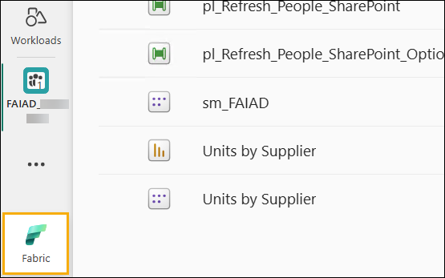

3. Fabric experience dialog opens. Select **Power BI**. You will be navigated to **Power BI Home page**.

    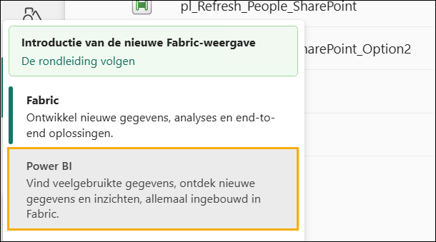

4. Select **+ New report** from the top menu.

    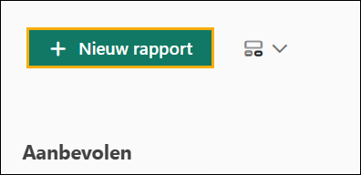

5. You will be navigated to **Build your first report** screen. There will be options to build a report using Excel, CSV, enter data manually, or pick a published semantic model. We have created a semantic model in the previous labs, so let’s use that. Select **Pick a published semantic model**.

    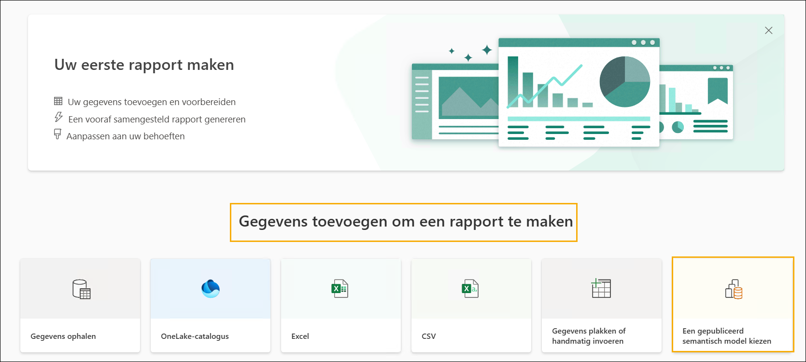

6. Pick a dataset to use in your report when the page opens. Notice we have multiple options. **Select sm_FAIAD**.

    1. **sm_FAIAD:** This is the semantic model we have created and want to use to build the report.

    2. **lh_FAIAD:** This is the lakehouse where we ingested all the data into.

    3. **Units by Supplier:** This is the dataset we created using T-SQL.

7. Click the **arrow next to Auto-create report button**. Notice there are two options, Auto-create report and Create a blank report. Let’s try auto-creating, so select **Auto-create report**.

    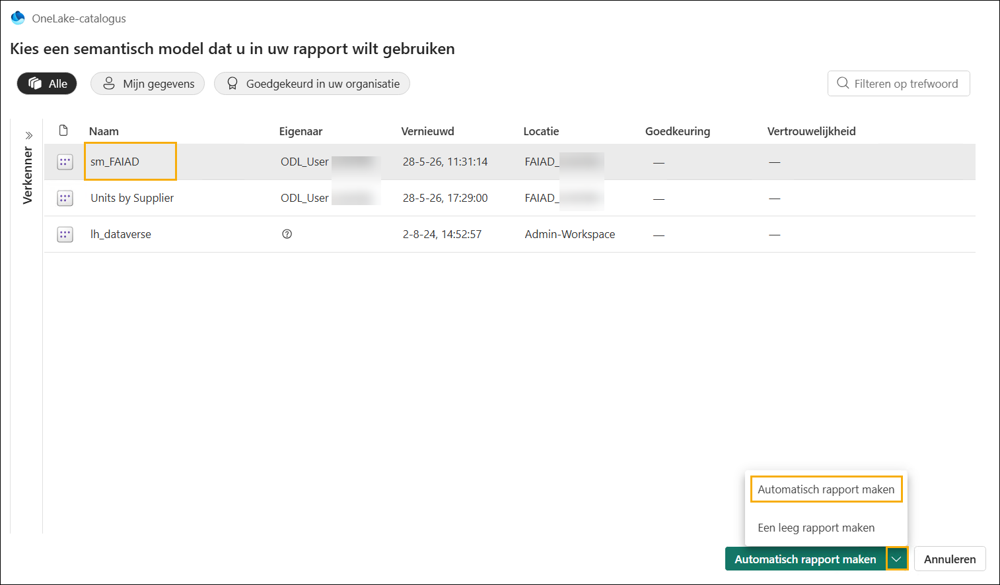

8. Power BI will start auto creating the report. Once the report is ready, a dialog appears on the top right of the screen. Select **View report now or it will autoload in a few seconds**.

    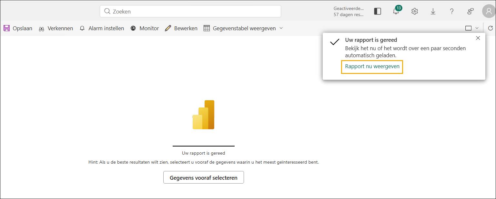

    **Checkpoint:** You will have a report which looks like the screenshot below. There are a few KPIs and some trend visuals. This is a good start if you are analyzing a new model and need a jumpstart.

    >**Note:** Notice on the top menu, you have the option to Edit the report or view some of the data as tables. Feel free to explore these options.

9. Let’s save this report. From the top menu, select **Save**.

10. Save your report dialog opens. Name the report as **rpt_Sales_Auto_Report**.

    >**Note:** we are prefixing report name with rpt which is short for report.

11. Make sure the report is saved in your workspace, **FAIAD_<inject key="Deployment ID" enableCopy="false"/>**.

12. Select **Save**.

    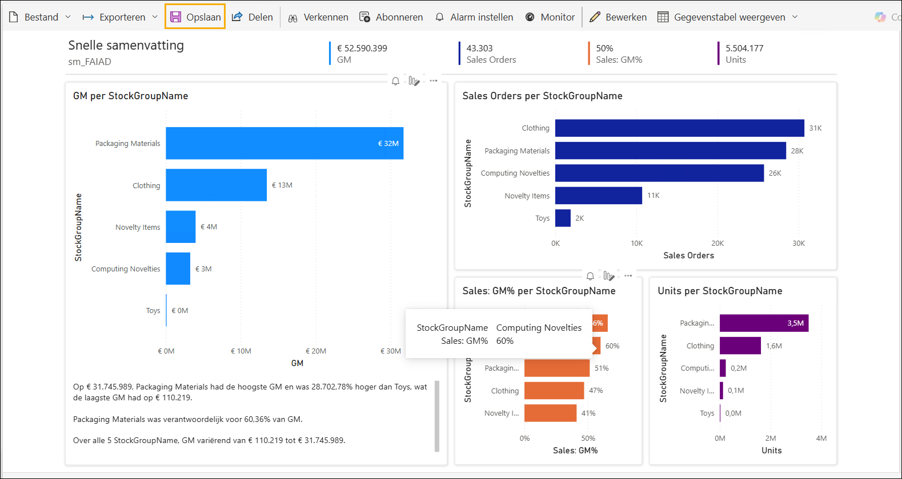
    
    >**Note:** Auto-created report may look different for you as it is “auto-created”. It also depends on the relationships and measures you created in the previous lab (Lab 6).

    Above screenshot is how the auto-created report **may** look if you created all the relationships and measures including the optional relationships (Lab 6).

    Below screenshot is how the auto-created report **may** look if you skipped creating the optional relationships and measures (Lab 6).

    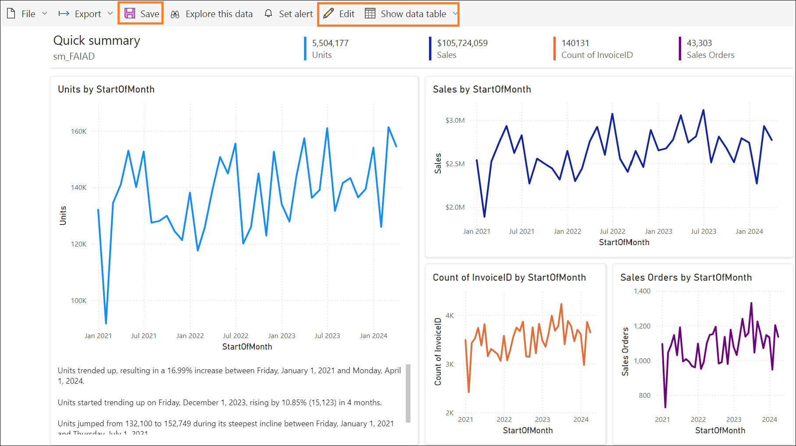

## Task 2: Configure background for a New report

Let’s create a new report using a blank canvas.

1. In the **left panel**, select your workspace name, **FAIAD_<inject key="Deployment ID" enableCopy="false"/>** to be navigated to the workspace.

2. From the top menu, select **New item -> Report**. You will be navigated to build your first report page.

    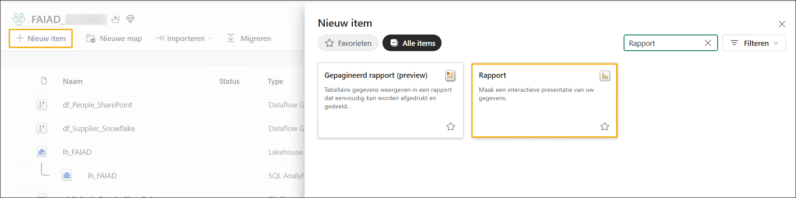


3. Select **Pick a published semantic model,** so we can pick the model we have created.

    


4. When the "Pick a semantic model to use in your report" dialog opens, select **sm_FAIAD**.


5. Click the **arrow next to Auto-create report button**. Select **Create a blank report**. You will be navigated to a report page which looks like the Power BI Desktop report page.

    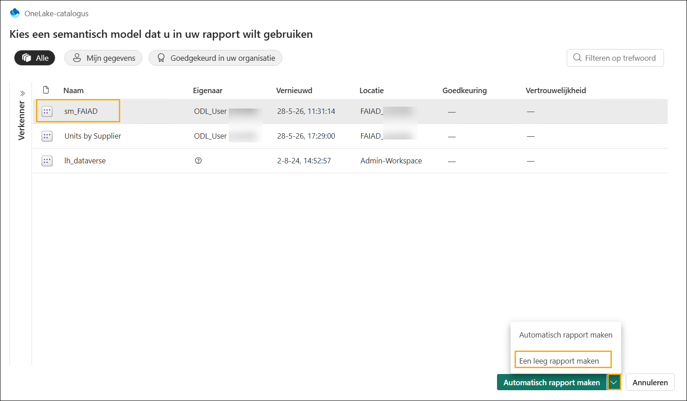


6. If you have not already opened it, open the **FAIAD.pbix** located in the **Reports** folder on the **desktop** of your lab environment.

    We are going to use this report as a reference. We will start by adding the canvas background. We will create the report header, add a couple of KPIs, and create the Sales over time line chart. In the interest of time and with the understanding that you have experience with building visuals in Power BI Desktop, we will not be creating all the visuals.

    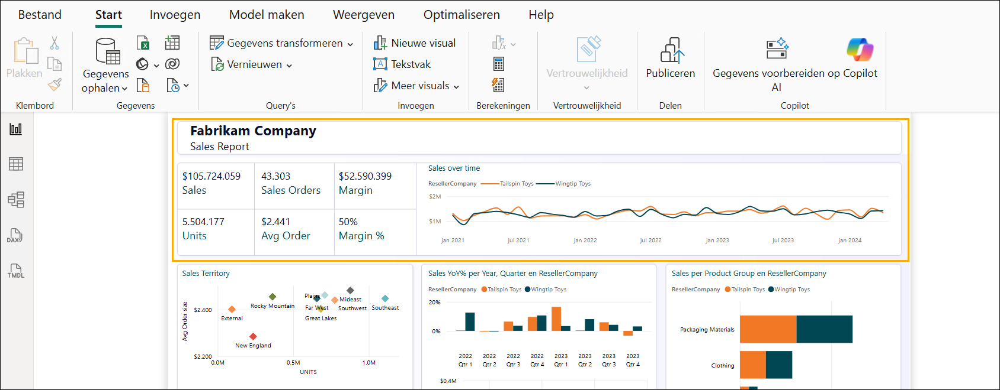


7. Navigate back to **Power BI canvas** in your browser.


8. Select **Format page** **icon** in **Visualization** pane.


9. Expand **Canvas background section**.


10. Select **Browse** from **Image** option. File explorer dialog opens.


11. Navigate to **Reports** folder on the **desktop** of your lab environment.


12. Select **Summary Background.png**.


13. Set **Image fit** dropdown to **Fit**.


14. Set Transparency to **0%**.

    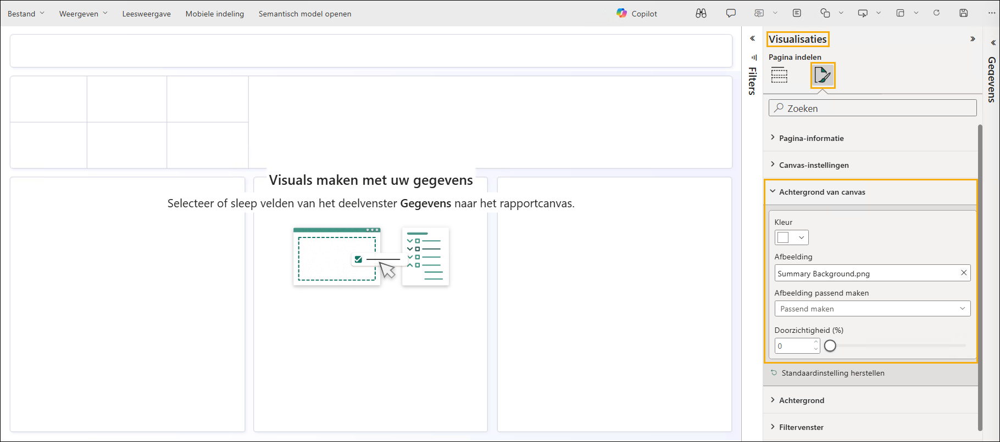

## Task 3: Add Header to the report


1. Let’s add the header in the top margin. From the **menu**, select **Text box**.


2. Enter **Fabrikam Company** as the first line in the text box.


3. Enter **Sales Report** as the second line in the text box.


4. Highlight **Fabrikam Company** and set **Font** to **Segoe UI** and **font size** to **18, bold**.


5. Highlight **Sales Report** and set **Font** to **Segoe UI** and **font size** to **14**.


6. With the **text box selected**, in the Format text box pane on the right, **expand Effects**.


7. Use **Background** slider to set it to **Off**.


8. Resize the **text box to fit in the top margin**.

    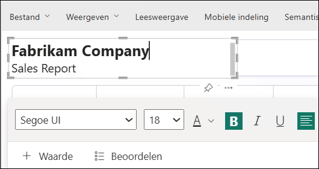

## Task 4: Add KPIs to the report


1. Let’s add Sales KPI. Select the **white space** in the canvas to take focus off the text box.


2. From the **Visualizations** **section** select **Card** Visual.


3. From the **Data section** expand **Sales** **table**.


4. Select **Sales measure**.

    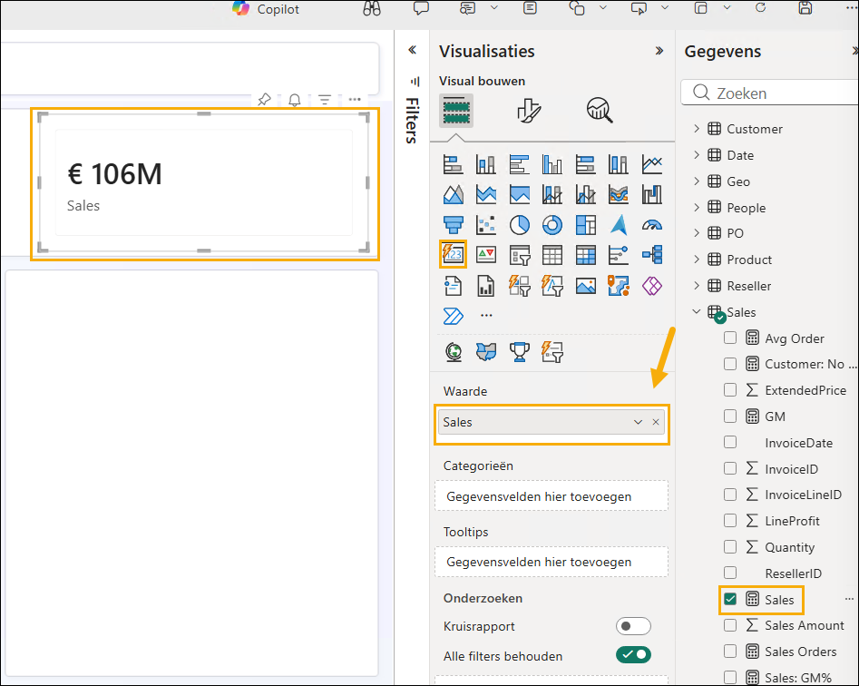


5. With the **Card visual selected**, select **Format visual** **icon** from **Visualizations** section.


6. Expand **Callout** section.


7. Select the **Value** dropdown. Change the font size to **12**.

    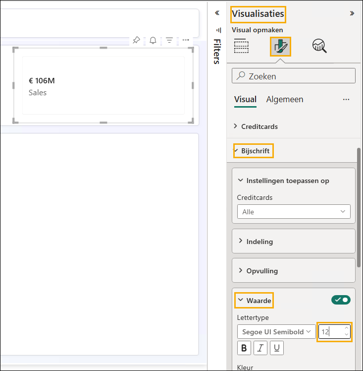


8. With the **Callout** section still selected, expand **Label** section.


9. Decrease **font size** to **10**.


10. Select **Color drop down**. Color palette dialog opens.


11. Select **More Colors**.


12. Set Hex value to **#004753**.

    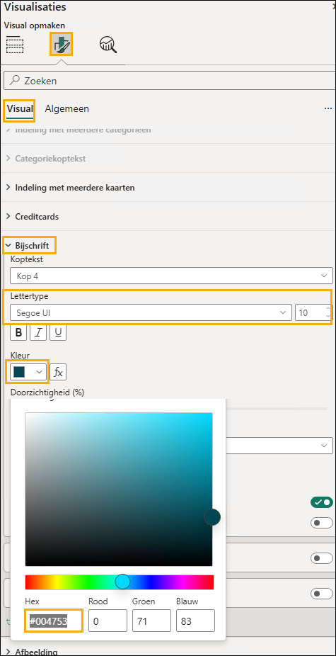


13. Expand **Cards** section.


14. Use **Accent bar** slider to set it to **Off**.

    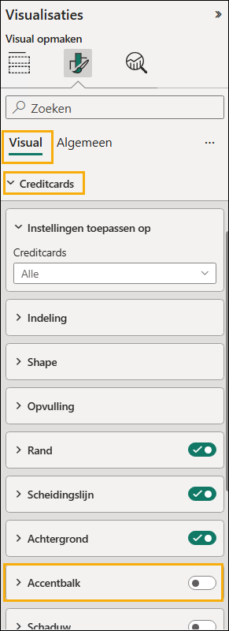


15. Select **General** in the Visualizations pane.


16. Expand **Effects section**.


17. Use **Background** slider to set it to **Off**.


18. Resize the **visual** and move it to the **left box as shown in the screenshot**.

    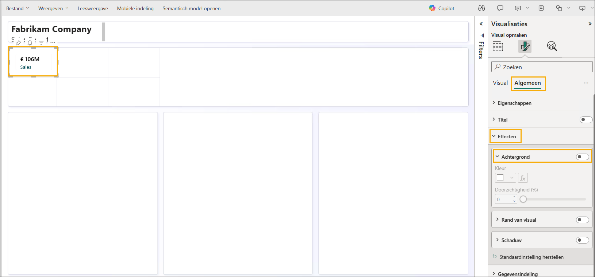


19. Let’s add another card. Select the **Sales Card** we just created. **Copy** the visual by selecting **Ctrl+C** from your keyboard.


20. **Paste** the visual by selecting **Ctrl+V** from your keyboard. Notice the visual is pasted onto the canvas.


21. With the **new visual highlighted**, in the **Visualization pane -> Build visual -> Fields** section remove **Sales** measure.


22. From the **Data** section, expand **Sales** table and select **Units** measure.


23. Resize the **visual** and **place it in the box below the Sales visual**.

    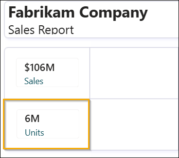

## Task 5: Add Line chart to the report

Let’s create a line chart to visualize Sales over time by Reseller Company.


1. Select the **white space** in the canvas to take focus off the multi-row card visual.


2. From the **Visualizations** **section** select **Line chart**.


3. From the **Data section** expand **Date** table.


4. Select **Year** field. Notice Year is summed by default and added to the Y-axis. Let’s rectify this.

    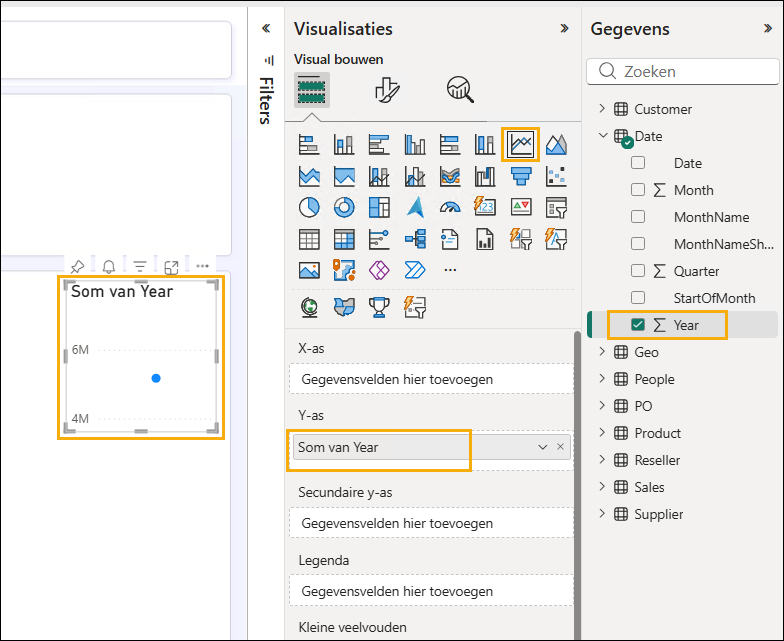

## Task 6: Save the report

Let’s save the report before we navigate away from the report to make changes to the model.


1. From the menu select **File -> Save**.


2. Save your report dialog opens. Name the report as **rpt_Sales_Report**.

    >**Note:** We are prefixing report name with rpt which is short for report.

3. Make sure the report is saved in **FAIAD_<inject key="Deployment ID" enableCopy="false"/>** workspace.


4. Select **Save**. Notice the report is saved and you are in view mode.

    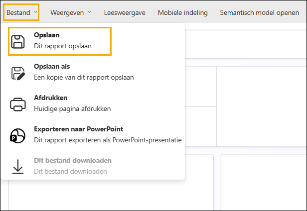

## Task 7: Configure Year column in Date table


1. From the **top menu**, select **Edit** to go back into Edit mode.

    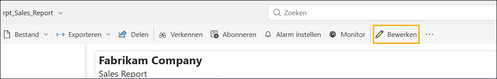


2. From the **top menu**, select **Open semantic model**. Notice the semantic model is opened in a new browser window/tab.

    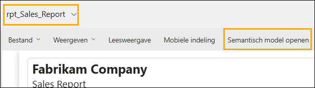


3. In the upper-right corner switch to **Editing** mode


4. From the **Data** **panel on the right,** select Tables.


5. Expand **Date** table.


6. Select **Year** column.


7. In the **Properties** pane on the left, expand **Advanced** section.


8. In the **Summarize by** drop down select **None**.

    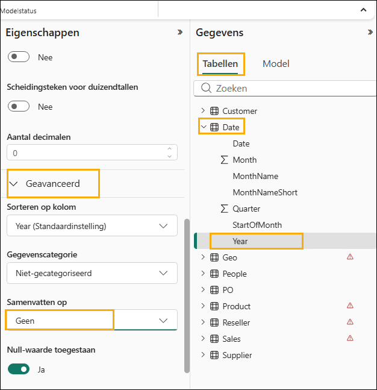


9. Navigate back to **report window/tab** of the browser.


10. On the **Data pane** of the right, expand **Date** table. Notice Year is not a summation field.


11. With the **Line chart visual selected**, **remove Sum of Year** from the Y-axis.


12. Select **Year** field and it will be added to the **X-axis**.


13. Expand **Sales** table and select **Sales measure**.

    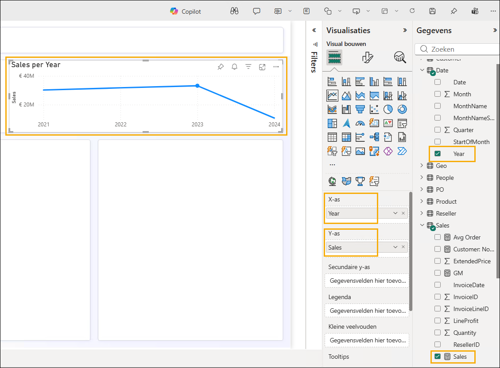

## Task 8: Configure Month Name column in Date table


1. Let’s add Month to this chart. From the Date table, drag **MonthNameShort** field below **Year** in the **X-axis**. Notice the visual is sorted by Sales. Let’s sort it by **MonthNameShort**.


2. Select the **ellipsis (…)** on the top right corner of the visual.


3. Select **Sort by -> Year Short_Month_Name**.


4. Select the **ellipsis (…)** on the top right corner of the visual.


5. Select **Sort by -> Sort ascending**.

    

    >**Note:** The months are sorted alphabetically. Let’s fix this.

    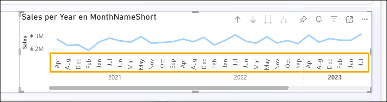


6. Navigate back to the **browser window/tab** where you have the semantic model open.


7. In the **Data** pane, expand **Date** table.


8. Select **MonthNameShort** column.


9. In the **Properties** pane on the left, expand **Advanced** section.


10. In the **Sort by column** drop down select **Month**.

    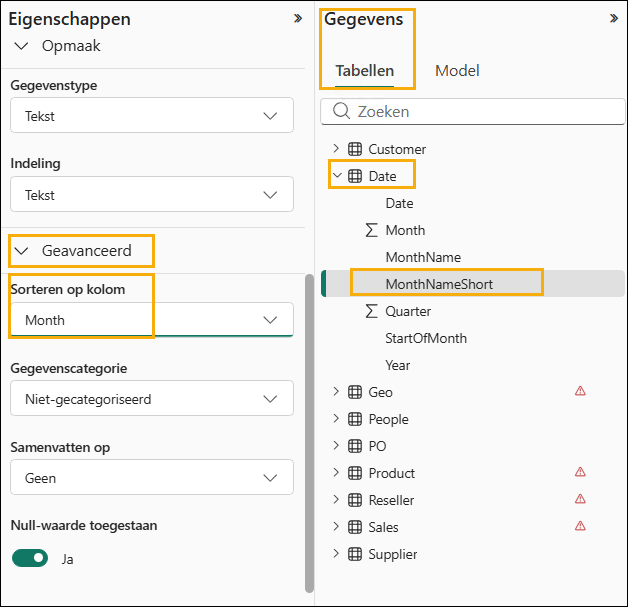


11. Navigate back to **report window/tab** of the browser. Notice now, the months are sorted properly.

    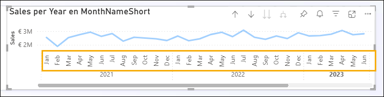

## Task 9: Format Line chart

Notice how easy it is to update the semantic model while building the reports. This gives a seamless interaction like Power BI Desktop.

1. With the **Line chart visual selected**, in the **Data section** expand **Reseller** table.

1. Drag **Reseller -> Reseller Company** field to the **Legend** section.

    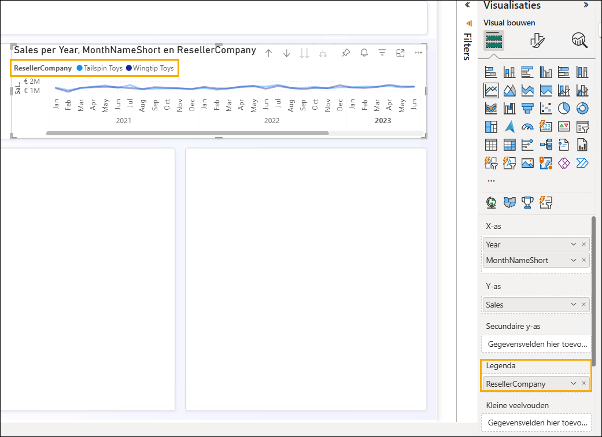

1. With the **Line chart visual selected**, from the **Visualization** section select **Format visual icon -> General**.

1. Expand **Title** section.

1. Set **Title** text to **Sales over time**.

1. Expand **Effects** section.

1. Use **Background** slider to set it to **Off**.

    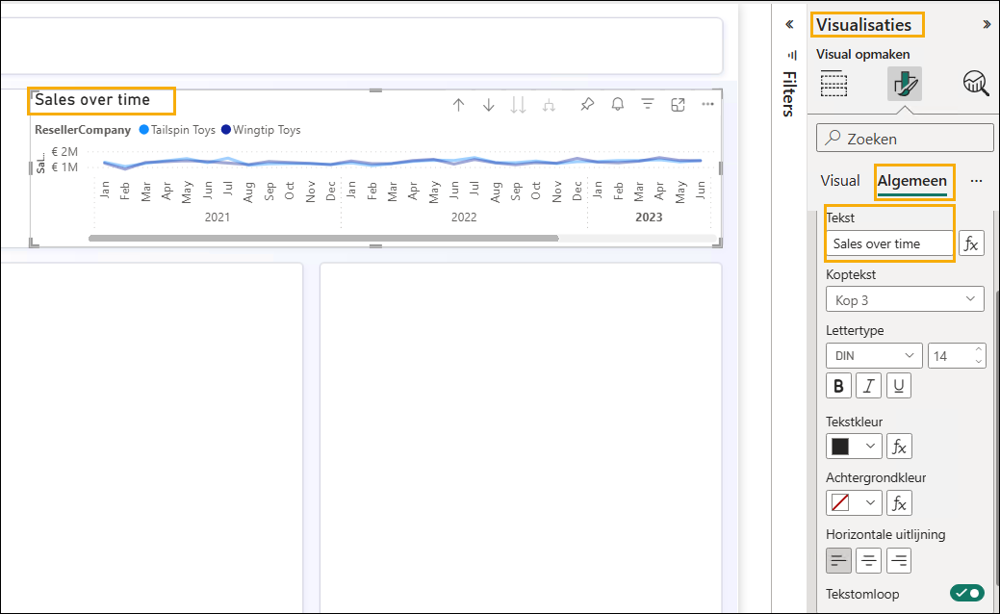

1. From the **Visualization** section select **Format visual icon -> Visual**.

1. Expand **Lines** section.

1. In the **Apply settings to -> Series dropdown,** select **Tailspin Toys**.

1. Expand **Colors** section.

1. Set **color** to **#F17925**

1. In the **Apply settings to -> Series dropdown,** select **Wingtip Toys**.

1. Set **color** to **#004753**

1. Resize the **visual** and move it to the **top right box as shown in the screenshot**.

1. Scroll to the right on the visual and **notice we have data through April 2024**.

    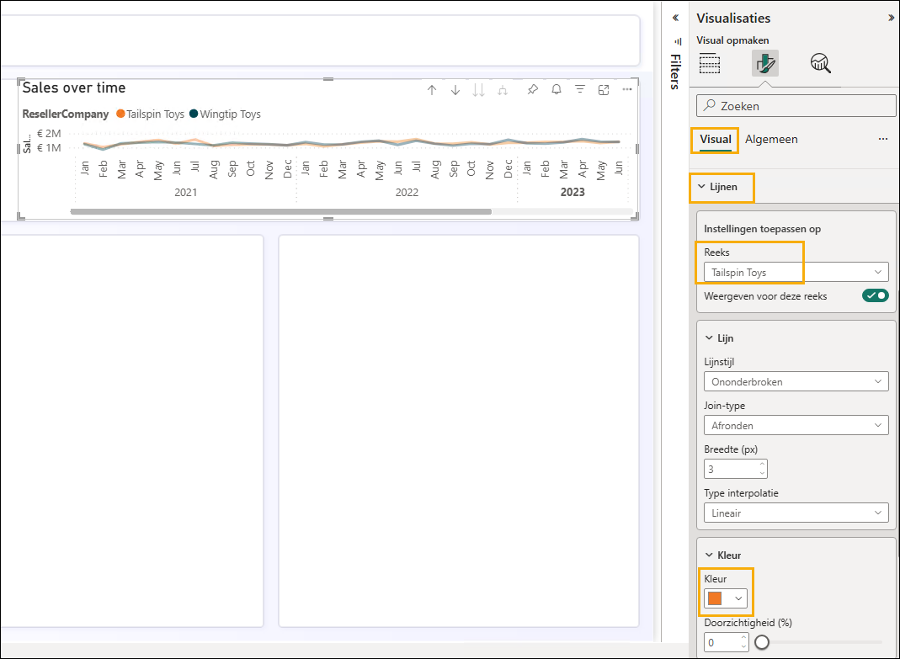

1. Let’s save the report, from the menu select **File -> Save**.

    As mentioned earlier, we will not build all the visuals in this lab. At your leisure, feel free to build more visuals.

## Task 10: Connect Power BI Desktop to Semantic model

Now let’s see how easy it is to connect Power BI Desktop to the semantic model and build visuals.


1. Open the **FAIADTemplate.pbix** located in the **Reports** folder on the **desktop** of your lab environment.


2. From the ribbon select **Home -> OneLake Catalog -> Power BI semantic models**.

    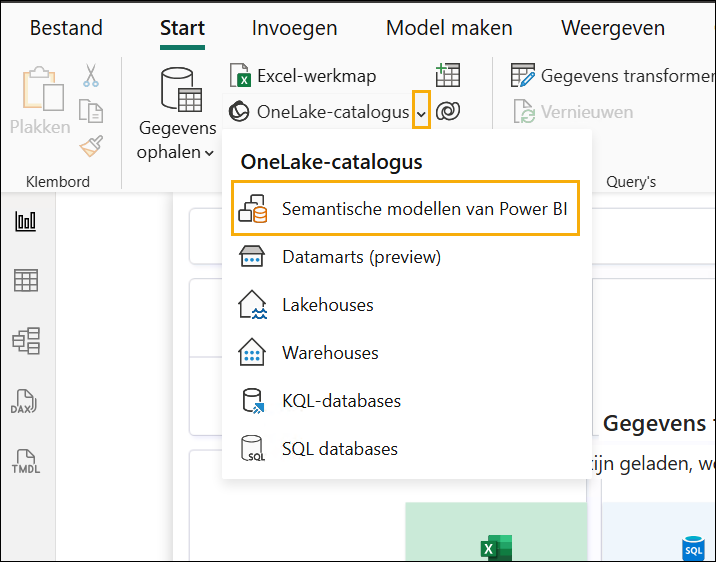


3. OneLake data hub dialog opens. Select **sm_FAIAD**, the semantic model we have created.


4. Select **Connect**. Notice in the Data pane, we have the tables from the semantic model.

    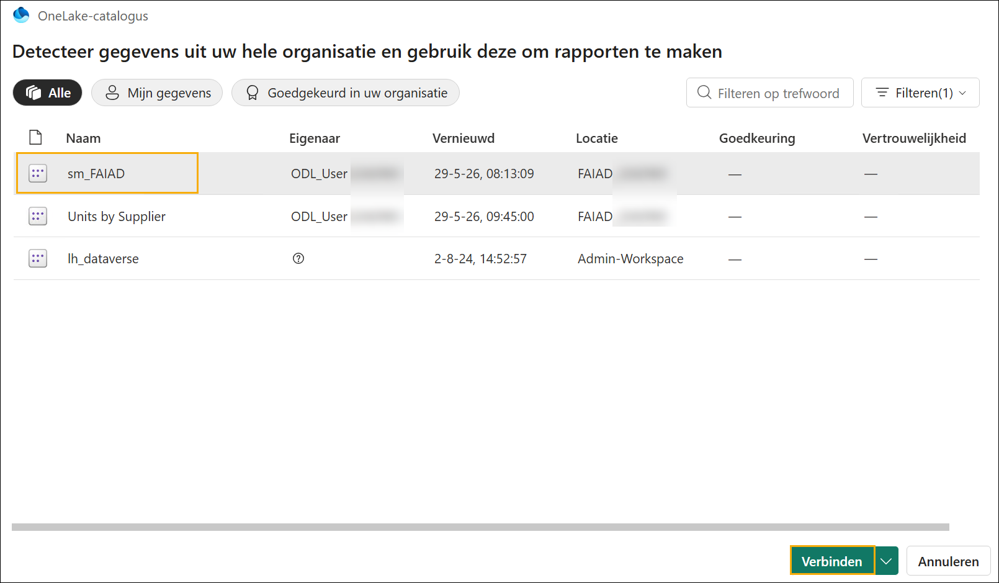


5. From the **left panel**, select **Model view**. Notice we can view the relationship between tables.

    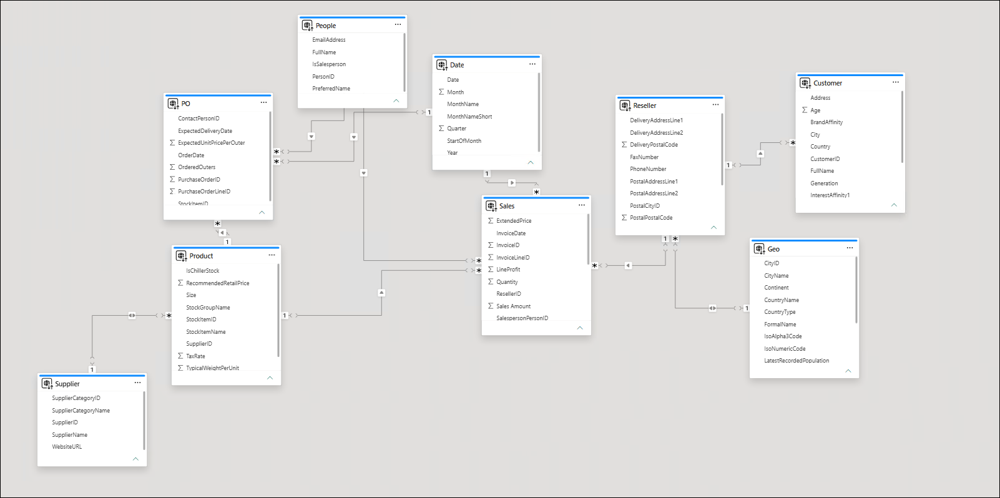


6. From the **left panel**, select **Report view** to navigate back to the Report view.


7. If you have not already done so, open the **FAIAD.pbix** located in the **Reports** folder on the **desktop** of your lab environment.


8. Select the **report title visual**.


9. From the ribbon, select **Home -> Copy**.

    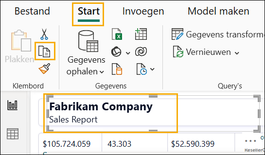


10. Navigate to **FAIADTemplate.pbix** and select the report canvas.


11. From the ribbon, select **Home -> Paste**.

    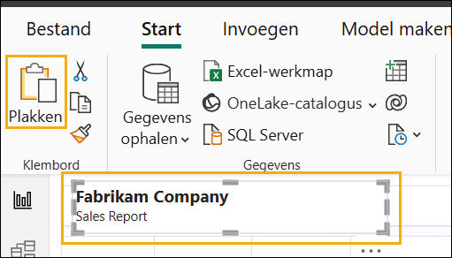


12. Similarly copy and paste the **Sales and Units KPIs**. FYI – multiple visuals can be copied and pasted together.

    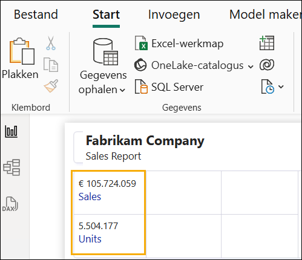

    Notice it is easy to copy visuals from an existing report and paste it to a report that connects to semantic model. Note that the table names, column names, measure names must be the same for copy and paste to work. If they are not the same you may have an error, but this can be easily resolved.


13. Navigate to **FAIAD.pbix** and select Sales over time line chart.


14. From the ribbon, select **Home -> Copy**.


15. Navigate to **FAIADTemplate.pbix** and select the report canvas.


16. From the ribbon, select **Home -> Paste**. Notice that the visual does not render. This is because currently the semantic model does not create hierarchy from date field.


17. Let’s fix this. In **Visualization** panel, under **X-axis** delete **StartOfMonth**.

    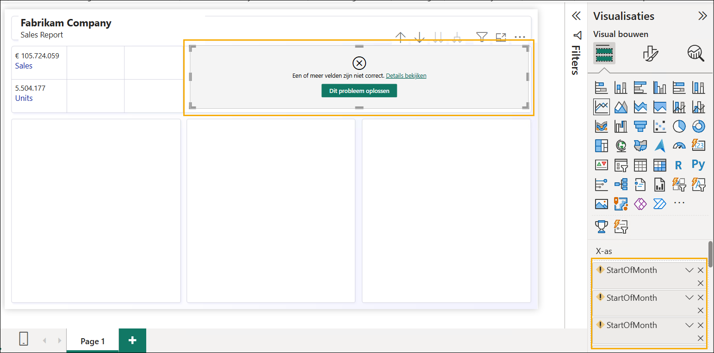


18. From the **Data pane**, expand **Date** table.


19. Drag **StartOfMonth** field into **X-axis**. This fixes the visual. You may have to format the visual.

    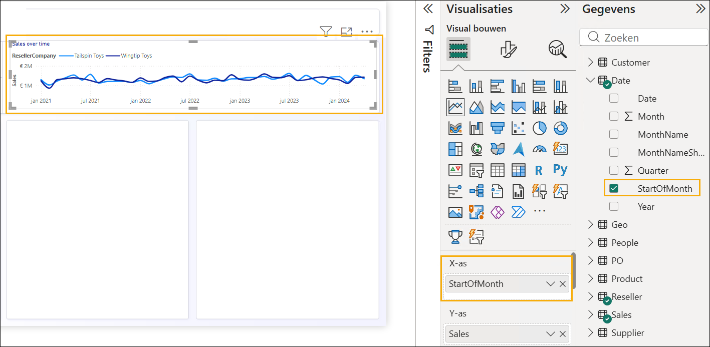


20. Let’s save the report, from the ribbon select **File -> Save**.

## Task 11: Add new data to simulate Direct Lake Mode

Typically, in Import mode, once data in the source is refreshed, we need to refresh the Power BI model after which the data in the report is updated. With Direct Query mode, once data is refreshed in source, it is available in Power BI report. However direct query mode is typically slow. To solve this problem, Microsoft Fabric has introduced Direct Lake mode. Direct Lake is a fast path to load the data from the lake straight into the Power BI engine, ready for analysis.

Let’s explore the scenario where data is updated in the ADLS Gen2 and the changes are immediately reflected in Power BI report without running any refreshes.

In a real scenario, data is updated at the source. Since we are in a training environment, we will simulate this. We have Sales data through April 2024. Let’s add Sales data for May 2024 by creating a shortcut to the May 2024 file in ADLS Gen2 and updating the Sales view.

1. Navigate back to the **browser**.

2. In the bottom right corner, click the **Fabric logo** and switch to the **Fabric view**.

3. Select **FAIAD_<inject key="Deployment ID" enableCopy="false"/>** from the left menu bar to navigate to workspace home.

4. Select **lh_FAIAD** to navigate into the Lakehouse.

    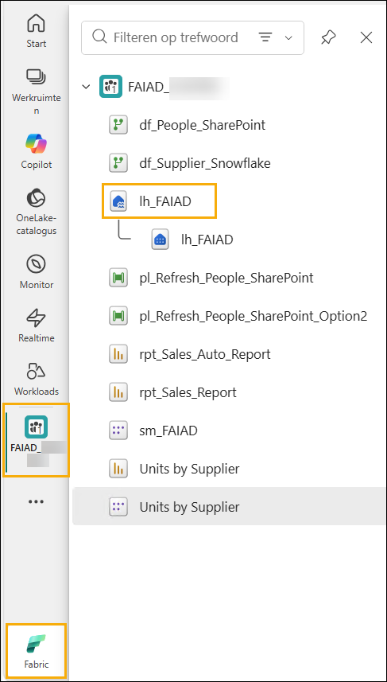

5. From the **Explorer pane** on the left, select the **ellipsis** next to **Tables**.


6. Select **New shortcut**.

    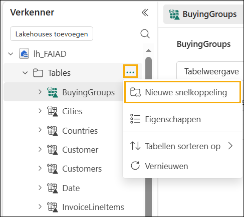


7. New shortcut dialog opens. Under **External sources**, select **Azure Data Lake Storage Gen2**.

    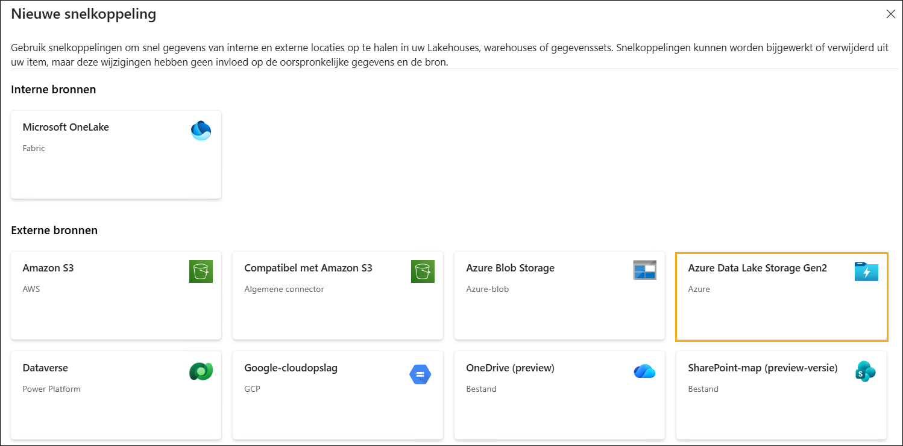


8. Since you created a connection earlier in the labs, you do not need to create a new connection and you will see your ADLS connection under existing connections.


9. If you did not create this connection earlier in the course, click **Create New connection** and complete the following steps:


10. Under **Connection Settings -> URL** enter this link **https://stvnextblobstorage.dfs.core.windows.net/fabrikam-sales**


11. Select **Next**.

    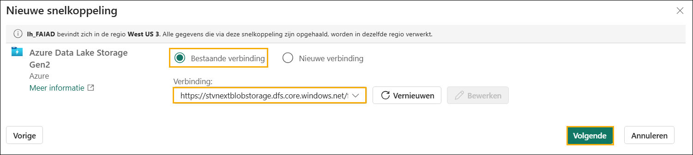


12. You will be connected to ADLS Gen2 with the directory structure displayed in the left panel. Expand **Delta-Parquet-Format-FY25**.


13. Select **Sales.Invoices_May**.


14. Select **Next**.

    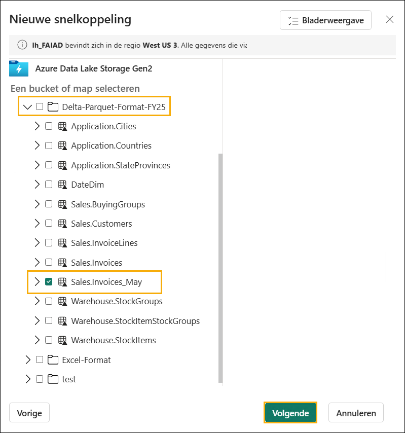


15. You will be navigated to the next dialog where we can edit the names. Select the **Edit icon** under Actions for **Sales.Invoices_May**.


16. Rename **Sales.Invoices_May to InvoicesMay**.


17. Select the **check mark** next to the name to save the change.


18. Select **Create**.

    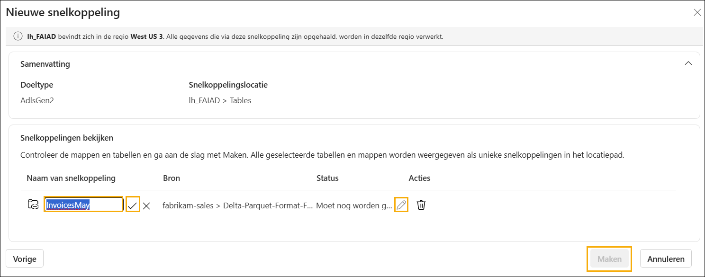

    Notice in the **Explorer pane** on the left, we now have the InvoicesMay table. Now we need to update the Sales view.

19. On the **top right** of the screen, select **Lakehouse -> SQL analytics endpoint**.

    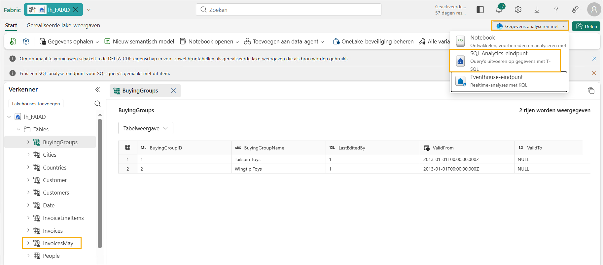

20. From the top menu, select **Home -> New SQL query**. A new SQL query pane opens.

21. **Copy** the below code and **paste** it into the **SQL query pane**.

    ```
    ALTER VIEW [dbo].[Sales] AS (
    select [$Outer].[InvoiceLineID] as [InvoiceLineID],
        [$Outer].[InvoiceID] as [InvoiceID],
        [$Outer].[StockItemID] as [StockItemID],
        [$Outer].[Quantity] as [Quantity],
        [$Outer].[UnitPrice] as [UnitPrice],
        [$Outer].[TaxRate] as [TaxRate],
        [$Outer].[TaxAmount] as [TaxAmount],
        [$Outer].[LineProfit] as [LineProfit],
        [$Outer].[ExtendedPrice] as [ExtendedPrice],
        [$Outer].[CustomerID] as [ResellerID],
        [$Outer].[SalespersonPersonID] as [SalespersonPersonID],
        [$Outer].[InvoiceDate] as [InvoiceDate],
        [$Outer].[t0_0] as [Sales Amount]
    from 
    (
        select [_].[InvoiceLineID] as [InvoiceLineID],
            [_].[InvoiceID] as [InvoiceID],
            [_].[StockItemID] as [StockItemID],
            [_].[Quantity] as [Quantity],
            [_].[UnitPrice] as [UnitPrice],
            [_].[TaxRate] as [TaxRate],
            [_].[TaxAmount] as [TaxAmount],
            [_].[LineProfit] as [LineProfit],
            [_].[ExtendedPrice] as [ExtendedPrice],
            [_].[CustomerID] as [CustomerID],
            [_].[SalespersonPersonID] as [SalespersonPersonID],
            [_].[InvoiceDate] as [InvoiceDate],
            [_].[ExtendedPrice] - [_].[TaxAmount] as [t0_0]
        from 
        (
            select [$Outer].[InvoiceLineID],
                [$Outer].[InvoiceID],
                [$Outer].[StockItemID],
                [$Outer].[Quantity],
                [$Outer].[UnitPrice],
                [$Outer].[TaxRate],
                [$Outer].[TaxAmount],
                [$Outer].[LineProfit],
                [$Outer].[ExtendedPrice],
                [$Inner].[CustomerID],
                [$Inner].[SalespersonPersonID],
                [$Inner].[InvoiceDate]
            from [lh_FAIAD].[dbo].[InvoiceLineItems] as [$Outer]
            inner join 
            (
                select [_].[InvoiceID] as [InvoiceID2],
                    [_].[CustomerID] as [CustomerID],
                    [_].[BillToResellerID] as [BillToResellerID],
                    [_].[OrderID] as [OrderID],
                    [_].[DeliveryMethodID] as [DeliveryMethodID],
                    [_].[ContactPersonID] as [ContactPersonID],
                    [_].[AccountsPersonID] as [AccountsPersonID],
                    [_].[SalespersonPersonID] as [SalespersonPersonID],
                    [_].[PackedByPersonID] as [PackedByPersonID],
                    [_].[InvoiceDate] as [InvoiceDate],
                    [_].[CustomerPurchaseOrderNumber] as [CustomerPurchaseOrderNumber],
                    [_].[IsCreditNote] as [IsCreditNote],
                    [_].[CreditNoteReason] as [CreditNoteReason],
                    [_].[Comments] as [Comments],
                    [_].[DeliveryInstructions] as [DeliveryInstructions],
                    [_].[InternalComments] as [InternalComments],
                    [_].[TotalDryItems] as [TotalDryItems],
                    [_].[TotalChillerItems] as [TotalChillerItems],
                    [_].[DeliveryRun] as [DeliveryRun],
                    [_].[RunPosition] as [RunPosition],
                    [_].[ReturnedDeliveryData] as [ReturnedDeliveryData],
                    [_].[ConfirmedDeliveryTime] as [ConfirmedDeliveryTime],
                    [_].[ConfirmedReceivedBy] as [ConfirmedReceivedBy],
                    [_].[LastEditedBy] as [LastEditedBy2],
                    [_].[LastEditedWhen] as [LastEditedWhen2]
                from 
                (
                    select [$Table].[InvoiceID] as [InvoiceID],
                        [$Table].[CustomerID] as [CustomerID],
                        [$Table].[BillToResellerID] as [BillToResellerID],
                        [$Table].[OrderID] as [OrderID],
                        [$Table].[DeliveryMethodID] as [DeliveryMethodID],
                        [$Table].[ContactPersonID] as [ContactPersonID],
                        [$Table].[AccountsPersonID] as [AccountsPersonID],
                        [$Table].[SalespersonPersonID] as [SalespersonPersonID],
                        [$Table].[PackedByPersonID] as [PackedByPersonID],
                        [$Table].[InvoiceDate] as [InvoiceDate],
                        [$Table].[CustomerPurchaseOrderNumber] as [CustomerPurchaseOrderNumber],
                        [$Table].[IsCreditNote] as [IsCreditNote],
                        [$Table].[CreditNoteReason] as [CreditNoteReason],
                        [$Table].[Comments] as [Comments],
                        [$Table].[DeliveryInstructions] as [DeliveryInstructions],
                        [$Table].[InternalComments] as [InternalComments],
                        [$Table].[TotalDryItems] as [TotalDryItems],
                        [$Table].[TotalChillerItems] as [TotalChillerItems],
                        [$Table].[DeliveryRun] as [DeliveryRun],
                        [$Table].[RunPosition] as [RunPosition],
                        [$Table].[ReturnedDeliveryData] as [ReturnedDeliveryData],
                        [$Table].[ConfirmedDeliveryTime] as [ConfirmedDeliveryTime],
                        [$Table].[ConfirmedReceivedBy] as [ConfirmedReceivedBy],
                        [$Table].[LastEditedBy] as [LastEditedBy],
                        [$Table].[LastEditedWhen] as [LastEditedWhen]
                    from [lh_FAIAD].[dbo].[Invoices] as [$Table]
                    union all select [$Table].[InvoiceID] as [InvoiceID],
                        [$Table].[CustomerID] as [CustomerID],
                        [$Table].[BillToResellerID] as [BillToResellerID],
                        [$Table].[OrderID] as [OrderID],
                        [$Table].[DeliveryMethodID] as [DeliveryMethodID],
                        [$Table].[ContactPersonID] as [ContactPersonID],
                        [$Table].[AccountsPersonID] as [AccountsPersonID],
                        [$Table].[SalespersonPersonID] as [SalespersonPersonID],
                        [$Table].[PackedByPersonID] as [PackedByPersonID],
                        [$Table].[InvoiceDate] as [InvoiceDate],
                        [$Table].[CustomerPurchaseOrderNumber] as [CustomerPurchaseOrderNumber],
                        [$Table].[IsCreditNote] as [IsCreditNote],
                        [$Table].[CreditNoteReason] as [CreditNoteReason],
                        [$Table].[Comments] as [Comments],
                        [$Table].[DeliveryInstructions] as [DeliveryInstructions],
                        [$Table].[InternalComments] as [InternalComments],
                        [$Table].[TotalDryItems] as [TotalDryItems],
                        [$Table].[TotalChillerItems] as [TotalChillerItems],
                        [$Table].[DeliveryRun] as [DeliveryRun],
                        [$Table].[RunPosition] as [RunPosition],
                        [$Table].[ReturnedDeliveryData] as [ReturnedDeliveryData],
                        [$Table].[ConfirmedDeliveryTime] as [ConfirmedDeliveryTime],
                        [$Table].[ConfirmedReceivedBy] as [ConfirmedReceivedBy],
                        [$Table].[LastEditedBy] as [LastEditedBy],
                        [$Table].[LastEditedWhen] as [LastEditedWhen]
                    from [lh_FAIAD].[dbo].[InvoicesMay] as [$Table]
                ) as [_]
            ) as [$Inner] on ([$Outer].[InvoiceID] = [$Inner].[InvoiceID2] or [$Outer].[InvoiceID] is null and [$Inner].[InvoiceID2] is null)
        ) as [_]
    ) as [$Outer]
    where exists 
    (
        select 1
        from 
        (
            select [ResellerID]
            from [lh_FAIAD].[dbo].[Reseller] as [$Table]
        ) as [$Inner]
        where [$Outer].[CustomerID] = [$Inner].[ResellerID] or [$Outer].[CustomerID] is null and [$Inner].[ResellerID] is null
    )
    )
    ```

22. From the visual query menu, select **Run** to execute the code.

    Once the code is executed, we have updated Sales table to include May 2024 data.

    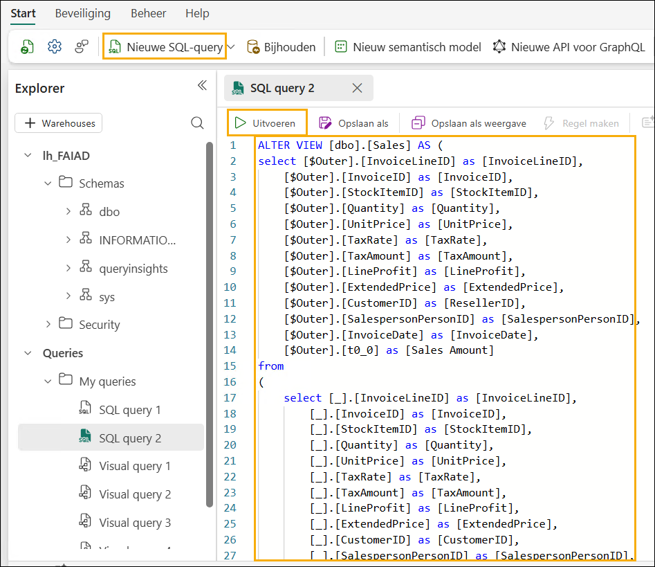

23. Select **rpt_Sales_Report** from the left menu bar to navigate back to the report.


24. From the top menu select the **Refresh Icon**. Notice now in the Line chart there is data for May 2024. Also, notice the Sales amount has increased.

    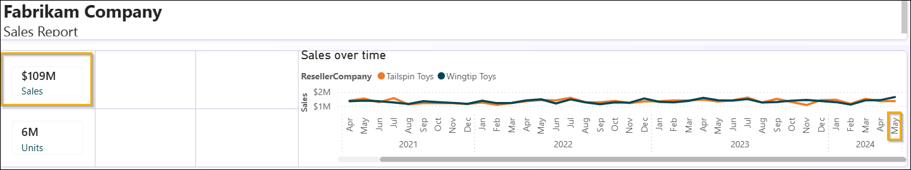

    We do not have to refresh the data model and report when data changes. This is the advantage of Direct Lake and Direct query.

    Let’s revisit the challenges that are listed in the problem statement:

    - **You need to refresh your dataset at least three times a day to accommodate the different update times for the different data sources**.

        We solved this using Direct Lake. Each individual Dataflow is refreshed on its schedule. Datasets and reports do not have to be refreshed.

    - **Your refresh operations take a long time as you need to do a full refresh every time to capture any updates that happened to the source systems**.

        Again, we solved this using Direct Lake. Each individual Dataflow is refreshed on its schedule. Datasets and reports do not have to be refreshed, so we do not have to worry about full refresh.

    - **Any errors in any of the data sources that you are pulling from will result in your dataset refresh breaking. A lot of times the employee file doesn’t upload on time resulting in your dataset refresh breaking**.

        Pipelines help to solve this problem, by providing the ability to retry refresh on failure and at different intervals.

    - **It takes a very long time to make any changes to your data model as Power Query takes a long time to refresh your previews, given the large data sizes and complex transformations**.

        We noticed Dataflows and Lakehouses are efficient and easy to make changes. Typically, preview in Dataflows and Lakehouses do not take long to load.

    - **You need a Windows PC to use Power BI Desktop even though the corporate standard is Mac**.

    Microsoft Fabric is a SaaS offering. All we need is a browser to access the service. We do not have to install any software on our desktops.

# Clean up Lab environment

Once you are ready to clean up the lab environment, follow the steps below.

1. Select **FAIAD_<inject key="Deployment ID" enableCopy="false"/>** workspace from the left panel to navigate to the workspace home.

2. From the top menu, select **Workspace settings**.

    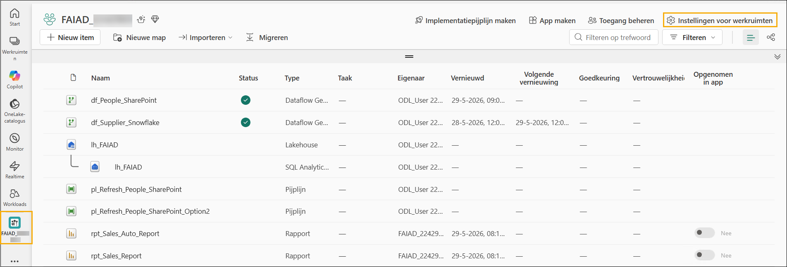

3. Workspace settings dialog opens. In **General** section, scroll down.

4. Select **Remove this workspace**.

5. Delete workspace dialog opens. Select **Delete**.

    This will delete the workspace and all the items that were contained in the workspace.

    

# References

Fabric Analyst in a Day (FAIAD) introduces you to some of the key functions available in Microsoft Fabric. In the menu of the service, the Help (?) section has links to some great resources.

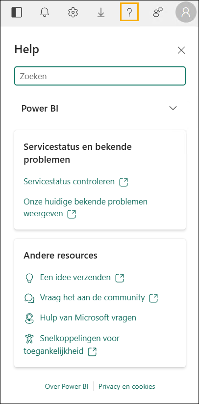

Here are a few more resources that will help you with your next steps with Microsoft Fabric.

- See blog post to read the full [Microsoft Fabric GA announcement](https://aka.ms/Fabric-Hero-Blog-Ignite23)

- Explore Fabric through the [Guided Tour](https://aka.ms/Fabric-GuidedTour)

- Sign up for the [Microsoft Fabric free trial](https://aka.ms/try-fabric)

- Visit the [Microsoft Fabric website](https://aka.ms/microsoft-fabric)

- Learn new skills by exploring the [Fabric Learning modules](https://aka.ms/learn-fabric)

- Explore the [Fabric technical documentation](https://aka.ms/fabric-docs)

- Read the [free e-book on getting started with Fabric](https://aka.ms/fabric-get-started-ebook)

- Join the [Fabric community](https://aka.ms/fabric-community) to post your questions, share your feedback, and learn from others

Read the more in-depth Fabric experience announcement blogs:

- [Data Factory experience in Fabric blog](https://aka.ms/Fabric-Data-Factory-Blog)

- [Synapse Data Engineering experience in Fabric blog](https://aka.ms/Fabric-DE-Blog)

- [Synapse Data Science experience in Fabric blog](https://aka.ms/Fabric-DS-Blog)

- [Synapse Data Warehousing experience in Fabric blog](https://aka.ms/Fabric-DW-Blog)

- [Synapse Real-Time Analytics experience in Fabric blog](https://aka.ms/Fabric-RTA-Blog)

- [Power BI announcement blog](https://aka.ms/Fabric-PBI-Blog)

- [Data Activator experience in Fabric blog](https://aka.ms/Fabric-DA-Blog)

- [Administration and governance in Fabric blog](https://aka.ms/Fabric-Admin-Gov-Blog)

- [OneLake in Fabric blog](https://aka.ms/Fabric-OneLake-Blog)

- [Dataverse and Microsoft Fabric integration blog](https://aka.ms/Dataverse-Fabric-Blog)

© 2026 Microsoft Corporation. All rights reserved. 

By using this demo/lab, you agree to the following terms:

The technology/functionality described in this demo/lab is provided by Microsoft Corporation for purposes of obtaining your feedback and to provide you with a learning experience. You may only use the demo/lab to evaluate such technology features and functionality and provide feedback to Microsoft. You may not use it for any other purpose. You may not modify, copy, distribute, transmit, display, perform, reproduce, publish, license, create derivative works from, transfer, or sell this demo/lab or any portion thereof.

COPYING OR REPRODUCTION OF THE DEMO/LAB (OR ANY PORTION OF IT) TO ANY OTHER SERVER OR LOCATION FOR FURTHER REPRODUCTION OR REDISTRIBUTION IS EXPRESSLY PROHIBITED.

THIS DEMO/LAB PROVIDES CERTAIN SOFTWARE TECHNOLOGY/PRODUCT FEATURES AND FUNCTIONALITY, INCLUDING POTENTIAL NEW FEATURES AND CONCEPTS, IN A SIMULATED ENVIRONMENT WITHOUT COMPLEX SET-UP OR INSTALLATION FOR THE PURPOSE DESCRIBED ABOVE. THE TECHNOLOGY/CONCEPTS REPRESENTED IN THIS DEMO/LAB MAY NOT REPRESENT FULL FEATURE FUNCTIONALITY AND MAY NOT WORK THE WAY A FINAL VERSION MAY WORK. WE ALSO MAY NOT RELEASE A FINAL VERSION OF SUCH FEATURES OR CONCEPTS. YOUR EXPERIENCE WITH USING SUCH FEATURES AND FUNCTIONALITY IN A PHYSICAL ENVIRONMENT MAY ALSO BE DIFFERENT.

**FEEDBACK**. If you give feedback about the technology features, functionality and/or concepts described in this demo/lab to Microsoft, you give to Microsoft, without charge, the right to use, share and commercialize your feedback in any way and for any purpose. You also give to third parties, without charge, any patent rights needed for their products, technologies and services to use or interface with any specific parts of a Microsoft software or service that includes the feedback. You will not give feedback that is subject to a license that requires Microsoft to license its software or documentation to third parties because we include your feedback in them. These rights survive this agreement.

MICROSOFT CORPORATION HEREBY DISCLAIMS ALL WARRANTIES AND CONDITIONS WITH REGARD TO THE DEMO/LAB, INCLUDING ALL WARRANTIES AND CONDITIONS OF MERCHANTABILITY, WHETHER EXPRESS, IMPLIED OR STATUTORY, FITNESS FOR A PARTICULAR PURPOSE, TITLE AND NON-INFRINGEMENT. MICROSOFT DOES NOT MAKE ANY ASSURANCES OR REPRESENTATIONS WITH REGARD TO THE ACCURACY OF THE RESULTS, OUTPUT THAT DERIVES FROM USE OF DEMO/ LAB, OR SUITABILITY OF THE INFORMATION CONTAINED IN THE DEMO/LAB FOR ANY PURPOSE. 

**DISCLAIMER** 

This demo/lab contains only a portion of new features and enhancements in Microsoft Power BI. Some of the features might change in future releases of the product. In this demo/lab, you will learn about some, but not all, new features.
