# Microsoft Fabric - Fabric Analyst in a Day - Lab 2

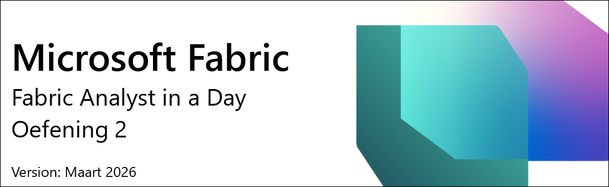

# Inhoudsopgave

- Inleiding

- Fabric-licentie

    - Taak 1: Een Microsoft Fabric-proeflicentie activeren

- Fabric Workspace

    - Taak 2: Een Fabric Workspace aanmaken

    - Taak 3: Een Lakehouse aanmaken

- Overzicht van Fabric-ervaringen

    - Taak 4: Data Factory-ervaring

    - Taak 5: Industry Solutions-ervaring

    - Taak 6: Real-Time Intelligence-ervaring

    - Taak 7: Data Engineering-ervaring

    - Taak 8: Data Science-ervaring

    - Taak 9: Data Warehouse-ervaring

    - Taak 10: Databases-ervaring

- Referenties

# Inleiding

Vandaag leert u over de verschillende belangrijke functies van Microsoft Fabric. Dit is een inleidende workshop bedoeld om u kennis te laten maken met de diverse productervaringen en items die beschikbaar zijn in Fabric. Aan het einde van deze workshop weet u hoe u Lakehouse, Dataflow Gen2, Pipeline, DirectLake en meer kunt gebruiken.

Aan het einde van dit lab heeft u geleerd:

- Hoe u een Fabric workspace aanmaakt

- Hoe u een Lakehouse aanmaakt

# Fabric-licentie

## Taak 1: Een Microsoft Fabric-proeflicentie activeren

1. Selecteer **Power BI Portal** op het bureaublad van de virtuele machine. Mogelijk wordt u gevraagd om in te loggen.

    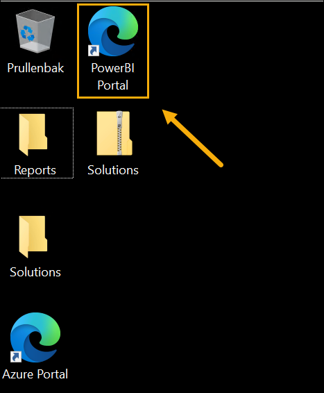

    >**Opmerking:** Als u de labomgeving gebruikt, wordt u mogelijk automatisch aangemeld.

    >**Opmerking:** Als Fabric niet opent, navigeert u in de browser naar http://app.fabric.microsoft.com/.

2. Kopieer de gebruikersnaam en plak deze in het veld E-mail van het dialoogvenster en selecteer Verzenden.

    - **E-mail/Gebruikersnaam:** <inject key="AzureAdUserEmail"></inject>

        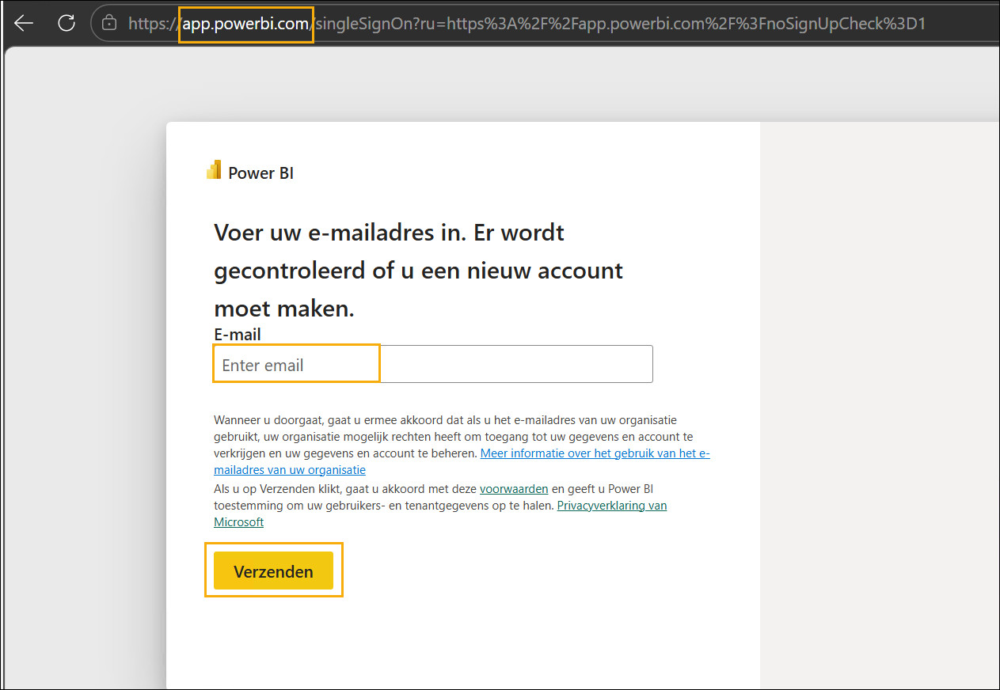

3. Op het tabblad **Aanmelden bij Microsoft Azure** ziet u het aanmeldingsscherm; voer vervolgens de volgende **E-mail/Gebruikersnaam** in en klik op **Volgende**.

    - **E-mail/Gebruikersnaam:** <inject key="AzureAdUserEmail"></inject>

        

4. Voer nu de volgende **Tijdelijke toegangscode** in en klik op **Aanmelden**.

    - **Tijdelijke toegangscode:** <inject key="AzureAdUserPassword"></inject>

        

5. U wordt doorgestuurd naar de vertrouwde **Power BI Service-startpagina**.

6. We gaan ervan uit dat u bekend bent met de indeling van Power BI Service. Als u vragen heeft, aarzel dan niet om de instructeur te vragen.

    Momenteel bevindt u zich in **Mijn werkruimte**. Om met Fabric-items te werken, heeft u een proeflicentie nodig en een workspace waaraan een Fabric-licentie is toegewezen. Laten we dit instellen.

7. Selecteer het **gebruiker**s**pictogram** in de rechterbovenhoek van het scherm.

8. Selecteer **Gratis proefversie**.

    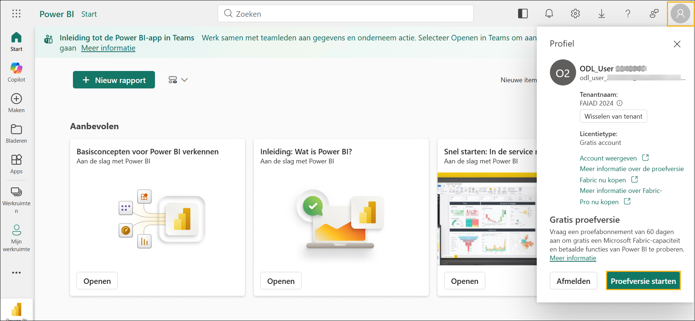

9. Het dialoogvenster Upgraden naar een gratis Microsoft Fabric-proefversie wordt geopend. Selecteer **Activeren**.

    >**Opmerking:** Wijzig de standaardregio niet. Laat deze ongewijzigd.

    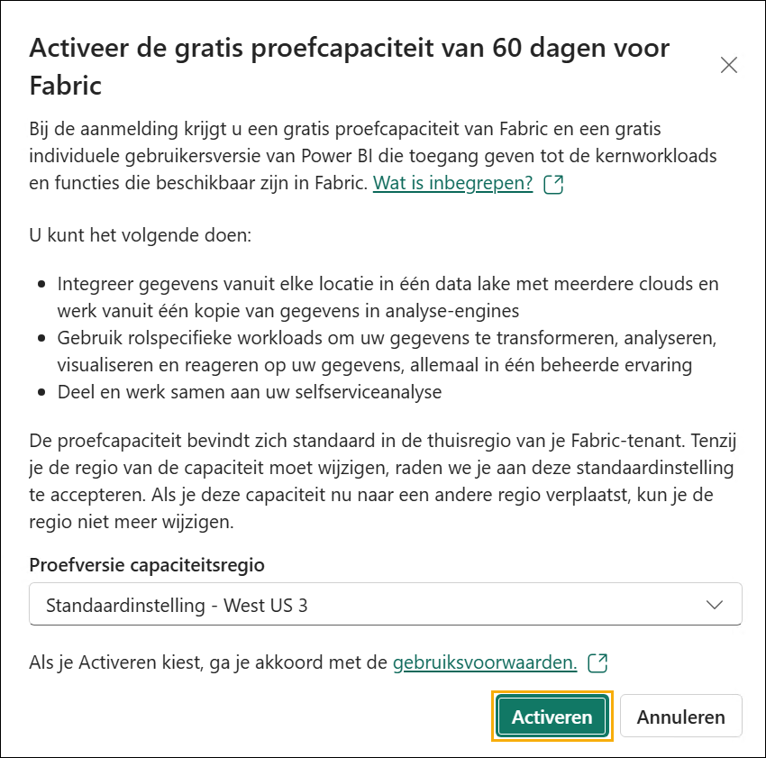

10. Het dialoogvenster Upgrade naar Microsoft Fabric geslaagd wordt geopend. Selecteer **Fabric-startpagina**.

    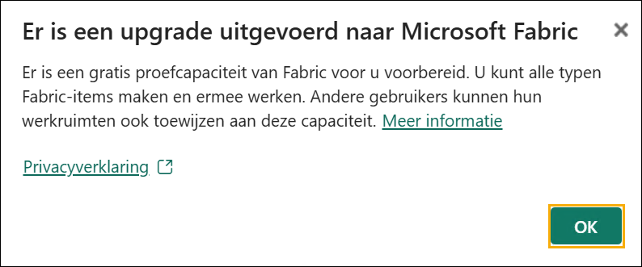

11. U wordt doorgestuurd naar de **Microsoft Fabric-startpagina**. Mogelijk wordt een dialoogvenster 'Welkom bij de Fabric-weergave' geopend. Als u dat wilt, kunt u **Rondleiding starten** of **Annuleren** selecteren.

    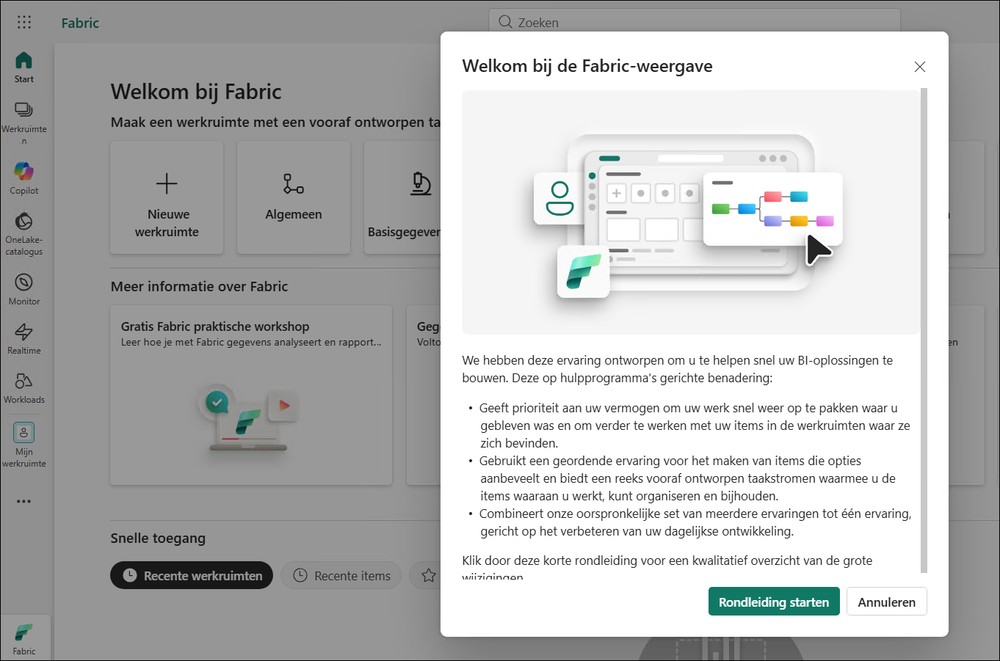

# Fabric Workspace

## Taak 2: Een Fabric Workspace aanmaken

1. Laten we nu een workspace aanmaken met een Fabric-licentie. Selecteer **Werkruimten** **(1)** in de linkernavigatiebalk. Er wordt een dialoogvenster geopend.

2. Klik op **+ Nieuwe werkruimte** **(2)** onderaan het pop-outmenu.

    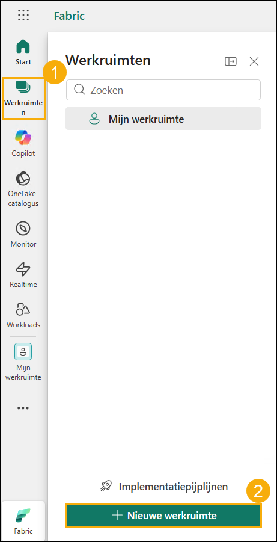

3. Het dialoogvenster **Werkruimte aanmaken** wordt aan de rechterkant van de browser geopend.

4. Voer in het veld **Naam** de waarde **FAIAD_<inject key="Deployment ID" enableCopy="false"/>** in.

    >**Opmerking:** De naam van de workspace moet uniek zijn. Zorg ervoor dat er een groen vinkje met de tekst 'Deze naam is beschikbaar' wordt weergegeven onder het veld Naam.

5. U kunt desgewenst een beschrijving voor de workspace invoeren. Dit is een optioneel veld.

6. Klik op **Geavanceerd** om de sectie uit te vouwen.

    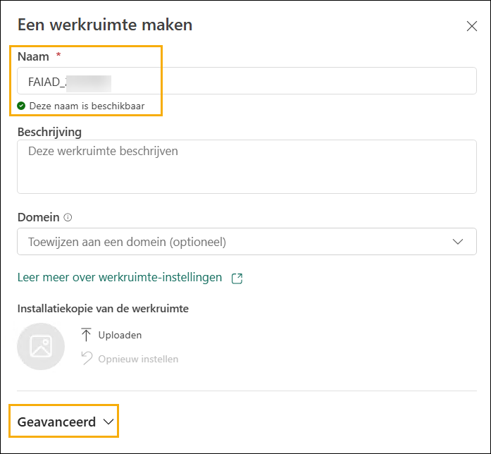

7. Zorg er onder **Licentiemodus** voor dat **Proefversie** is geselecteerd. (Dit is standaard geselecteerd.)

8. Selecteer **Toepassen** om een nieuwe workspace aan te maken.

    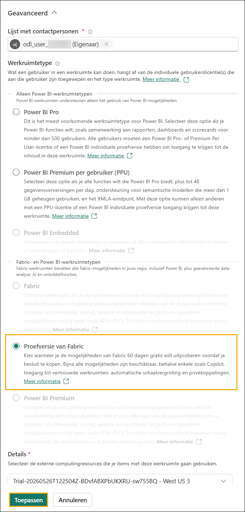

    U wordt doorgestuurd naar de zojuist aangemaakte workspace. We zullen data uit verschillende databronnen in een Lakehouse importeren en de data uit de Lakehouse gebruiken om ons model te bouwen en te rapporteren. De eerste stap is het aanmaken van een Lakehouse. Dit doen we hierna.

## Taak 3: Een Lakehouse aanmaken

1. Zoek in de zojuist aangemaakte workspace **FAIAD_<inject key="Deployment ID" enableCopy="false"/>** de knop **+ Nieuw item (1)** in het linkernavigatievenster. Hier kunt u nieuwe items in uw workspace aanmaken.

2. Typ in het zoekvak **Lakehouse (2)** en selecteer in de zoekresultaten de optie **Lakehouse (3)**. Hiermee kunt u een nieuwe Lakehouse aanmaken om uw big data op te slaan, te bevragen en te beheren.

    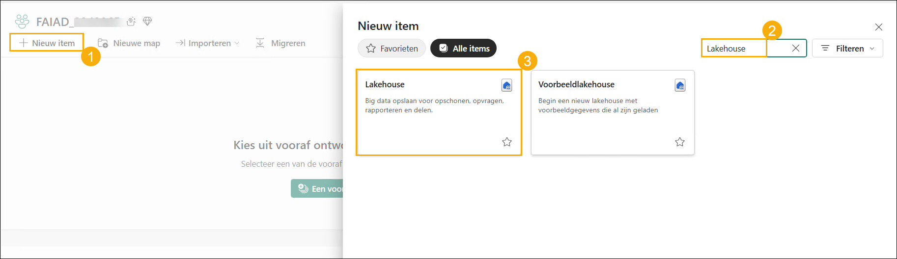

3. Er verschijnt een dialoogvenster voor een nieuwe Lakehouse. Voer **lh_FAIAD** in het tekstvak **Naam** in.

    >**Opmerking:** lh verwijst hier naar Lakehouse. We voegen het voorvoegsel lh toe zodat het gemakkelijk te herkennen en te zoeken is.

    >**Opmerking:** Deze functie bevindt zich niet langer in preview, **maar we hoeven deze nog steeds niet in te schakelen**.

4. Zorg ervoor dat **Lakehouse schemas (2)** is uitgevinkt.

5. Klik vervolgens op **Aanmaken (3)** om door te gaan.

    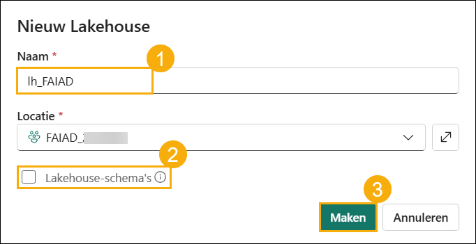

    >**Opmerking:** **Zorg ervoor dat u de Lakehouse Schema-functie uitvinkt, omdat deze nu standaard is ingeschakeld.**

    Na enkele ogenblikken wordt een Lakehouse aangemaakt en wordt u doorgestuurd naar de Lakehouse Explorer-interface. Linksboven, naast de Fabric-naam in de koptekst, ziet u het Lakehouse-pictogram. Het werkruimtepictogram in de linkernavigatie geeft aan dat het nu een item bevat.

    In de Lakehouse Explorer ziet u een sectie Tabellen en Bestanden. Een Lakehouse kan Azure Data Lake Storage Gen2-bestanden beschikbaar stellen onder de bestandssectie, of een dataflow kan data laden naar Lakehouse-tabellen. Er zijn diverse opties beschikbaar. We laten u enkele van de opties zien in de volgende labs.

    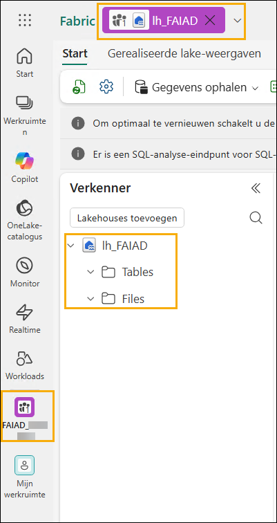

# Overzicht van Fabric-ervaringen

## Taak 4: Data Factory-ervaring

1. Selecteer het pictogram **Workloads** aan de linkerkant van uw scherm. Er wordt een dialoogvenster geopend met de lijst van Fabric-ervaringen. De lijst met ervaringen omvat Power BI, Data Factory, Industry Solutions, Real-Time Intelligence, Data Engineering, Data Science en Data Warehouse. Laten we dit verkennen.

    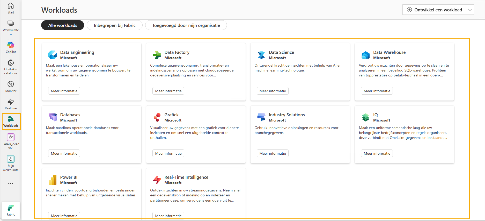

2. Selecteer **Data Factory**.

    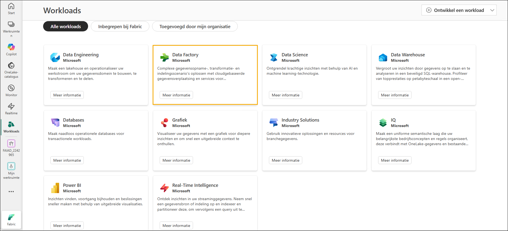

3. U wordt doorgestuurd naar de Data Factory-startpagina. Hieronder volgt een gedetailleerde uitleg van de secties, ontworpen om u stap voor stap te begeleiden bij het effectief gebruiken van Data Factory. Dataflow Gen2 is de volgende generatie van Dataflow.

    **Wat is Data Factory?**

    Data Factory is een hulpmiddel waarmee u data uit verschillende bronnen kunt beheren en organiseren. Het stelt u in staat om data te verzamelen, voor te bereiden en te transformeren zodat deze effectief kan worden gebruikt. Of u nu een beginner of een expert bent, Data Factory biedt hulpmiddelen om datatransformatie eenvoudiger en efficiënter te maken.

    **Itemtypen:**

    a. **Dataflow Gen2:** Dataflows zijn als recepten voor het transformeren van data. Ze bieden meer dan 300 verschillende transformaties die u op uw data kunt toepassen. Dit betekent dat u uw data op vele manieren kunt opschonen, combineren en aanpassen aan uw behoeften.

    b. **Pipeline:** Pipelines zijn workflows waarmee u dataprocessen kunt automatiseren. Ze stellen u in staat om flexibele dataworkflows te maken die kunnen worden afgestemd op uw specifieke vereisten. Dit maakt het eenvoudiger om data op een gestructureerde manier te beheren en te verwerken.

    c. **Azure Data Factory:** Azure Data Factory is een cloudgebaseerde data-integratieservice waarmee u datagestuurde workflows kunt maken voor het orkestreren en automatiseren van dataverplaatsing en datatransformatie.

    d. **Apache Airflow Job:** Apache Airflow is een open-sourceplatform dat wordt gebruikt om workflows programmatisch te ontwerpen, te plannen en te bewaken. In Data Factory stelt het u in staat om complexe dataworkflows te maken, te plannen en te beheren.

    e. **Copy Job:** Copy Job is een functie waarmee u data van de ene bron naar de andere kunt kopiëren. Het biedt een eenvoudige en efficiënte manier om data tussen verschillende data stores te verplaatsen.

    f. **Mirrored database:** Een functie voor het maken van gespiegelde versies van databases voor back-up, testen of alleen-lezen toegang.

    g. **Mirrored SAP:** Integreer uw bestaande SAP-omgeving naadloos met de rest van uw data in Fabric.

    h. **Mirrored Oracle (preview):** Mirroring in Fabric repliceert uw Oracle-databases naar een uniform platform, waardoor near-real-time analyse met lage latentie naast andere databronnen mogelijk is.

    i. **Mirrored Google Big Query (preview):** Mirroring in Fabric stelt u in staat om Google BigQuery-data continu te repliceren naar OneLake, waardoor complexe ETL wordt geëlimineerd en naadloos gebruik mogelijk is in analytics, AI en het delen van data.

    j. **Variable library:** bevat een lijst met variabelen en hun standaardwaarden. Het kan ook andere waardensets bevatten met alternatieve waarden.

    k. **dbt job (preview):** Hiermee kunt u dbt gebruiken en data transformeren met SQL in een vertrouwde omgeving.

    **Aan de slag:**

    Volg de onderstaande stappen om Data Factory te gaan gebruiken:

    a. **Leer Data Factory te gebruiken:** Deze sectie helpt u op weg met Data Factory. Het biedt begeleiding over hoe u effectief met het hulpmiddel kunt beginnen.

    b. **Maak uw eerste Dataflow aan:** Hier leert u hoe u uw eerste dataflow aanmaakt. Dataflows zijn essentieel voor het transformeren van uw data naar uw behoeften.

    c. **Maak uw eerste Pipeline aan:** Deze sectie begeleidt u bij het aanmaken van uw eerste pipeline. Pipelines helpen uw dataprocessen efficiënt te automatiseren en te beheren.

    d. **Leer Data Factory te bewaken:** Bewaking is essentieel om ervoor te zorgen dat uw dataprocessen soepel verlopen. In deze sectie leert u hoe u uw Data Factory-activiteiten kunt bewaken.

    e. **Leer data transformeren met Dataflows:** In deze sectie leert u hoe u dataflows kunt gebruiken om uw data effectief te transformeren.

    f. **Maak uw eerste API for GraphQL aan:** Als u geïnteresseerd bent in het gebruik van API's met GraphQL, begeleidt deze sectie u bij de eerste stappen.

    g. **Maak uw eerste User Data Functions aan:** Deze sectie helpt u bij het aanmaken van User Data Functions, die handig zijn voor het beheren en transformeren van gebruikersdata.

    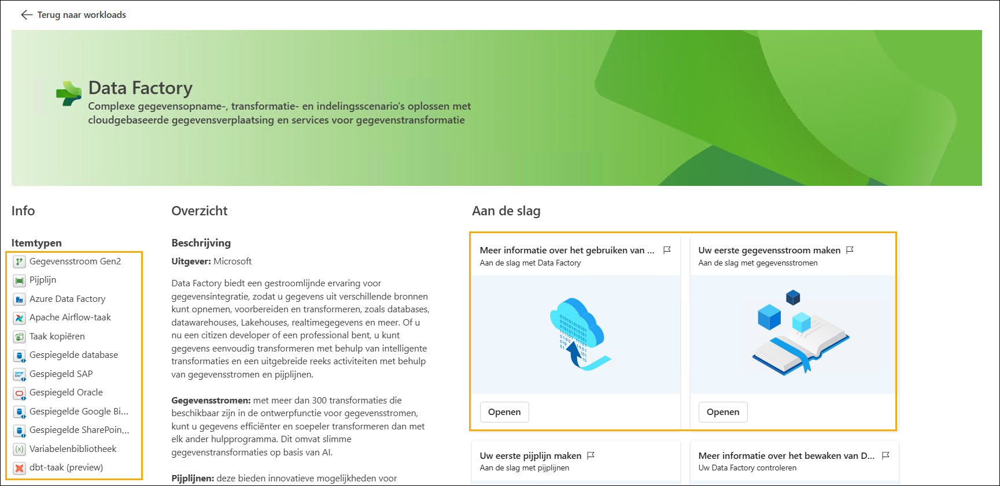

4. Klik op **Terug naar workloads** in de linkerbovenhoek van het scherm. Deze actie brengt u naar de hoofdpagina van workloads, waar u andere hulpmiddelen of secties kunt verkennen.

    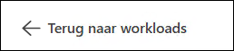

## Taak 5: Industry Solutions-ervaring

1. Klik op de pagina **Workloads** op **Industry Solutions** om door te gaan.

    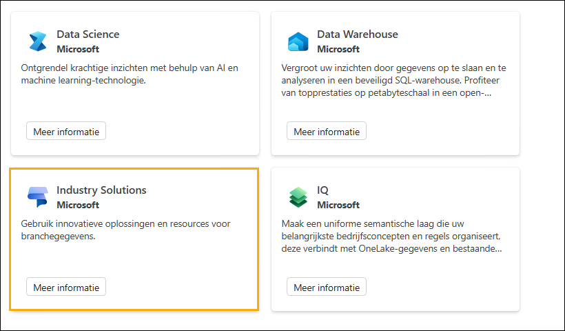

2. U wordt doorgestuurd naar de Industry Solutions-startpagina. Hieronder volgt een gedetailleerd overzicht van de secties, ontworpen om u te helpen Industry Solutions effectief en stap voor stap te gebruiken.

    **Wat zijn Industry Solutions?**

    Industry Solutions zijn kant-en-klare dataoplossingen in Microsoft Fabric die oplossingen en resources bieden voor diverse sectoren. Industry Solutions helpen u op weg met belangrijke bedrijfsscenario's door gebruik te maken van branchespecifieke datamodellen, connectors, transformaties, rapporten en andere assets.

    **Itemtypen:**

    a. **Sustainability solutions:** ondersteunt de opname, standaardisering en analyse van Environmental, Social, and Governance (ESG)-data.

    b. **Retail solutions:** helpt bij het beheren van grote hoeveelheden data, het integreren van data uit verschillende bronnen en het bieden van realtime analytics voor snelle besluitvorming. Retailers kunnen deze oplossingen gebruiken voor voorraadbeheer, klantssegmentatie, verkoopprognoses, dynamische prijsstelling en fraudedetectie.

    c. **Healthcare solutions:** zijn strategisch ontworpen om de tijd tot waarde voor klanten te versnellen door in te spelen op de kritische behoefte om healthcare-data efficiënt om te zetten naar een geschikt formaat voor analyse.

    >**Opmerking:** Sommige oplossingen zijn mogelijk niet zichtbaar voor u.

    **Aan de slag:**

    Volg de onderstaande stappen om Industry Solutions te gaan gebruiken:

    a. **Meer informatie over Healthcare Data Solutions:** Klik op de knop "Meer informatie" om te lezen over healthcare-dataoplossingen en te begrijpen hoe deze in uw projecten kunnen worden gebruikt.

    b. **Aan de slag met Healthcare-dataoplossingen:** Begin met het implementeren van healthcare-dataoplossingen in uw projecten.

    c. **Meer informatie over Sustainability Solutions:** Klik op de knop "Meer informatie" om te lezen over sustainability-oplossingen en te begrijpen hoe deze in uw projecten kunnen worden gebruikt.

    d. **Aan de slag met Sustainability Solutions:** Begin met het implementeren van sustainability-oplossingen in uw projecten.

    e. **Meer informatie over Retail Solutions:** Klik op de knop "Meer informatie" om te lezen over retail-oplossingen en te begrijpen hoe deze in uw projecten kunnen worden gebruikt.

    f. **Aan de slag met Retail Solutions:** Begin met het implementeren van retail-oplossingen in uw projecten.

    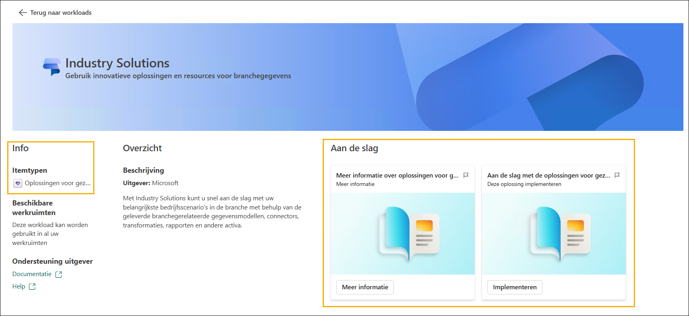

3. Klik op **Terug naar workloads** in de linkerbovenhoek van het scherm. Deze actie brengt u naar de hoofdpagina van workloads, waar u andere hulpmiddelen of secties kunt verkennen.

    

## Taak 6: Real-Time Intelligence-ervaring

1. Klik op de pagina **Workloads** op **Real-Time Intelligence** om door te gaan.

    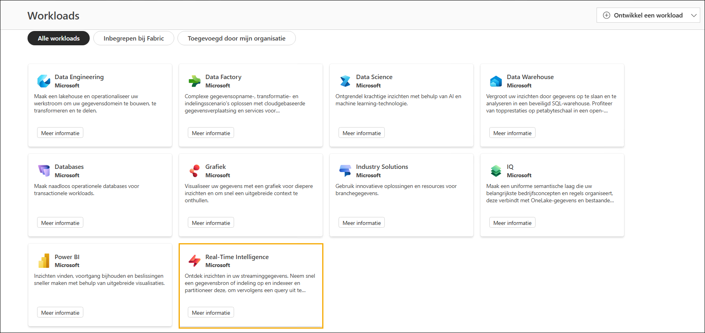

2. U wordt doorgestuurd naar de Real-Time Intelligence-startpagina. Hieronder volgt een gedetailleerd overzicht van de secties, ontworpen om u te helpen Real-Time Intelligence effectief en stap voor stap te gebruiken.

    **Wat is Real-Time Intelligence?**

    Real-Time Intelligence is een hulpmiddel waarmee u grote hoeveelheden gedetailleerde data uit verschillende bronnen kunt beheren en analyseren. Het stelt u in staat om uw data in realtime op te nemen, te analyseren en op te handelen, waardoor uw bedrijfsvoering wordt verbeterd door tijdige besluitvorming en acties.

    **Itemtypen:**

    a. **Eventhouse:** Wordt gebruikt om een workspace aan te maken van een of meerdere KQL-databases, die kunnen worden gedeeld tussen projecten.

    b. **KQL Queryset:** Wordt gebruikt om query's op de data uit te voeren om deelbare tabellen en visualisaties te produceren.

    c. **Real-Time Dashboard:** Wordt gebruikt om realtime dashboards te visualiseren binnen enkele seconden na data-opname.

    d. **Eventstream:** Wordt gebruikt om realtime event streams vast te leggen, te transformeren en te routeren.

    e. **Activator:** Wordt gebruikt om datasets, query's en event streams te bewaken op patronen.

    f. **Event Schema Set (preview):** Helpt u datastructuren (schema's) voor uw realtime analytics-workflows te organiseren en te standaardiseren, waardoor het eenvoudiger wordt om streamingdata consistent te verwerken en te analyseren.

    g. **Custom Stream Connector (preview):** Stelt u in staat om realtime events naar een eventstream te sturen vanuit uw eigen aangepaste endpoints en aangepaste apps.

    h. **Anomaly detector (Preview):** Anomaly detection identificeert automatisch ongebruikelijke patronen en uitschieters in uw Eventhouse-tabellen.

    i. **Operations agent (Preview):** Operations agents automatiseren de cyclus van observeren -> analyseren -> beslissen -> handelen. Ze volgen continu belangrijke statistieken, brengen inzichten aan het licht en bevelen gerichte acties aan.

    j. **Map (preview):** Brengt geospatiale inzichten naar Real-Time Intelligence, zodat iedereen kan visualiseren waar events plaatsvinden, ruimtelijke data kan integreren met andere Fabric-mogelijkheden en slimmere, locatiebewuste beslissingen kan nemen.

    k. **Digital Twin Builder (Preview):** Digital Twin Builder biedt gebruikers low-code/no-code-ervaringen om hun bedrijfsconcepten, zoals assets en processen, te bouwen en te modelleren via een ontologie.

    **Aan de slag:**

    Volg de onderstaande stappen om Real-Time Intelligence te gaan gebruiken:

    a. **End-to-end-ervaringen in realtime:** Klik op de knop "Aan de slag" om realtime dataanalyse met voorbeelddatasets te verkennen.

    b. **Real-Time Intelligence-voorbeeld verkennen:** Klik op de knop "Openen" om realtime dataanalyse met een voorbeeld te verkennen.

    c. **Een Eventhouse-voorbeeld verkennen:** Klik op de knop "Selecteren" om een voorbeeld te gebruiken en meer te leren over Real-Time Intelligence.

    d. **Inleiding tot Real-Time Intelligence:** Klik op de knop "Openen" voor een overzicht van Real-Time Intelligence en om effectief met het hulpmiddel te beginnen.

    e. **KQL leren met voorbeelddata:** Klik op de knop "Openen" om KQL te leren met behulp van voorbeelddata.

    f. **Wat is een Real-Time Hub:** Klik op de knop "Openen" om te leren wat een Real-Time Hub is en hoe deze kan worden gebruikt.

    g. **Een voorbeeld van Activator verkennen:** Klik op de knop "Openen" om een voorbeeld van Activator te gebruiken en de functies en mogelijkheden van Real-Time Intelligence te begrijpen.

    h. **Aan de slag met Activator:** Klik op de knop "Openen" om te beginnen met de concepten van Activator en het hulpmiddel effectief te gebruiken.

    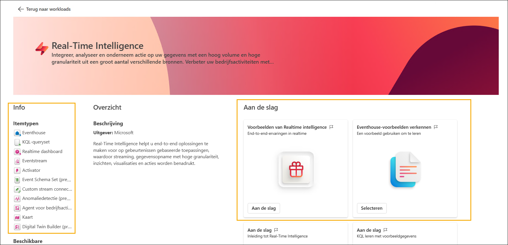

3. Klik op **Terug naar workloads** in de linkerbovenhoek van het scherm. Deze actie brengt u naar de hoofdpagina van workloads, waar u andere hulpmiddelen of secties kunt verkennen.

    

## Taak 7: Data Engineering-ervaring

1. Klik op de pagina **Workloads** op Data Engineering om door te gaan.

    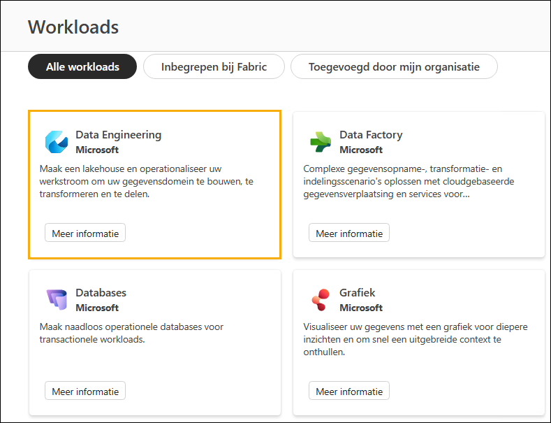

2. U wordt doorgestuurd naar de **Data Engineering**-startpagina. Hieronder volgt een gedetailleerd overzicht van de secties, ontworpen om u te helpen **Data Engineering** effectief en stap voor stap te gebruiken.

    **Wat is Data Engineering?**

    Data Engineering is een hulpmiddel waarmee u infrastructuren en systemen kunt ontwerpen, bouwen en onderhouden voor het verzamelen, opslaan, verwerken en analyseren van grote hoeveelheden data. Het stelt u in staat om een Lakehouse te maken en uw workflow te operationaliseren om uw data estate te bouwen, transformeren en te delen.

    **Itemtypen:**

    a. **Lakehouse:** Wordt gebruikt voor het opslaan van big data voor opschoning, bevraging, rapportage en delen.

    b. **Notebook:** Wordt gebruikt voor data-opname, voorbereiding, analyse en andere datagerelateerde taken met verschillende talen zoals Python en Scala.

    c. **Environment:** Wordt gebruikt voor het instellen van gedeelde bibliotheken, Spark-rekeninstelling en resources voor notebooks en Spark Job Definitions.

    d. **Spark Job Definition:** Wordt gebruikt voor het definiëren, plannen en beheren van Apache-taken.

    e. **User data functions:** platform waarmee u toepassingen in Fabric kunt hosten en uitvoeren.

    f. **API for GraphQL:** Dit is een API om meerdere databronnen te bevragen.

    g. **Snowflake database:** Stelt gebruikers in staat om de Snowflake-database te spiegelen binnen Fabric.

    **Aan de slag:**

    Volg de onderstaande stappen om Data Engineering te gaan gebruiken:

    a. **Een voorbeeld verkennen:** Klik op de knop "Selecteren" om een voorbeeld te gebruiken en meer te leren over Data Engineering.

    b. **Wat is een Lakehouse?:** Klik op de knop "Openen" om meer te leren over Lakehouses en hoe deze kunnen worden gebruikt.

    c. **Data-ervaring in Lakehouse opdoen:** Klik op de knop "Openen" om aan de slag te gaan met Data Engineering via Lakehouses.

    d. **Aan de slag met Spark Job Definitions:** Klik op de knop "Openen" om te leren hoe u Spark Job Definitions voor dataverwerking kunt gebruiken.

    e. **Notebooks ontwikkelen en uitvoeren:** Klik op de knop "Openen" om te leren hoe u notebooks kunt ontwikkelen en uitvoeren voor dataanalyse.

    f. **NotebookUtils gebruiken:** Klik op de knop "Openen" om te leren hoe u NotebookUtils kunt gebruiken voor uitgebreide dataanalyse.

    g. **Notebooks inzetten voor uw Lakehouse:** Klik op de knop "Openen" om te leren hoe u notebooks kunt inzetten voor uw Lakehouse.

    h. **Datasets inzetten voor uw Lakehouse:** Klik op de knop "Openen" om te leren hoe u datasets kunt inzetten voor uw Lakehouse.

    i. **Maak uw eerste User Data Functions aan:** Klik op de knop "Openen" om te leren hoe u User Data Functions aanmaakt.

    j. **Maak uw eerste API for GraphQL aan:** Klik op de knop "Openen" om te leren hoe u een API for GraphQL aanmaakt.

    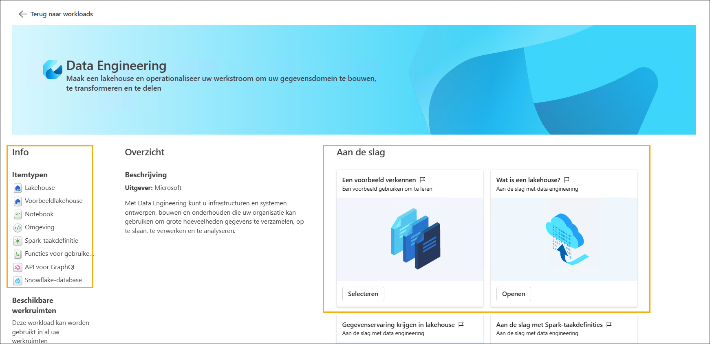

3. Klik op **Terug naar workloads** in de linkerbovenhoek van het scherm. Deze actie brengt u naar de hoofdpagina van workloads, waar u andere hulpmiddelen of secties kunt verkennen.

    

## Taak 8: Data Science-ervaring

1. Klik op de pagina **Workloads** op **Data Science** om door te gaan.

    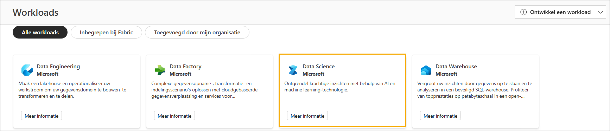

2. U wordt doorgestuurd naar de **Data Science**-startpagina. Hieronder volgt een gedetailleerd overzicht van de secties, ontworpen om u te helpen **Data Science** effectief te gebruiken.

    **Wat is Data Science?**

    Data Science is een hulpmiddel waarmee u krachtige inzichten kunt ontsluiten met behulp van AI- en machine learning-technologie. Het biedt AI-hulpmiddelen die zijn ontworpen om u te helpen bij het uitvoeren van volledige data science-workflows en het benutten van AI voor dataverrijking en zakelijke inzichten.

    **Itemtypen:**

    a. **ML model:** Wordt gebruikt voor het aanmaken van machine learning-modellen.

    b. **Experiment:** Wordt gebruikt voor het aanmaken, uitvoeren en bijhouden van de ontwikkeling van meerdere modellen.

    c. **Notebook:** Wordt gebruikt voor het verkennen van data en het bouwen van machine learning-oplossingen.

    d. **Environment:** Wordt gebruikt voor het instellen van gedeelde bibliotheken, Spark-rekeninstelling en resources voor notebooks en Spark Job Definitions.

    e. **Data agent (preview):** Wordt gebruikt voor het aanmaken van conversationele AI-ervaringen die vragen beantwoorden over data die is opgeslagen in Lakehouses, warehouses, Power BI-semantische modellen en KQL-databases.

    f. **Python Notebook:** Wordt gebruikt voor het importeren van Python-notebooks van een lokale machine.

    **Aan de slag:**

    Volg de onderstaande stappen om Data Science te gaan gebruiken:

    a. **Een voorbeeld verkennen:** Klik op de knop "Selecteren" om een voorbeeld te gebruiken en meer te leren over Data Science.

    b. **Aan de slag met ML-modellen:** Klik op de knop "Openen" om te leren hoe u aan de slag kunt gaan met machine learning-modellen.

    c. **Aan de slag met ML-experimenten:** Klik op de knop "Openen" om te leren hoe u machine learning-experimenten kunt uitvoeren.

    d. **Aan de slag met Notebooks:** Klik op de knop "Openen" om te leren hoe u aan de slag kunt gaan met notebooks.

    e. **Notebooks ontwikkelen en uitvoeren:** Klik op de knop "Openen" om te leren hoe u notebooks kunt ontwikkelen en uitvoeren voor dataanalyse.

    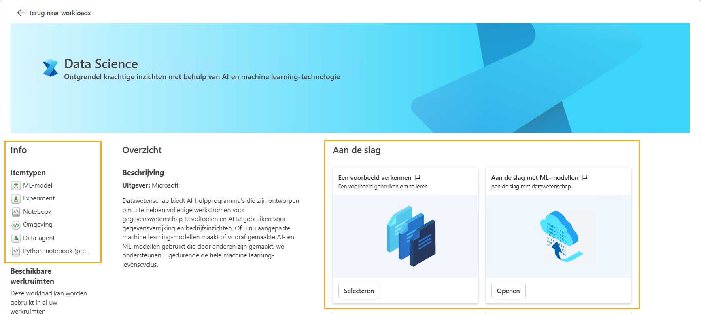

3. Klik op **Terug naar workloads** in de linkerbovenhoek van het scherm. Deze actie brengt u naar de hoofdpagina van workloads, waar u andere hulpmiddelen of secties kunt verkennen.

    

## Taak 9: Data Warehouse-ervaring

1. Klik op de pagina **Workloads** op **Data Warehouse** om door te gaan.

    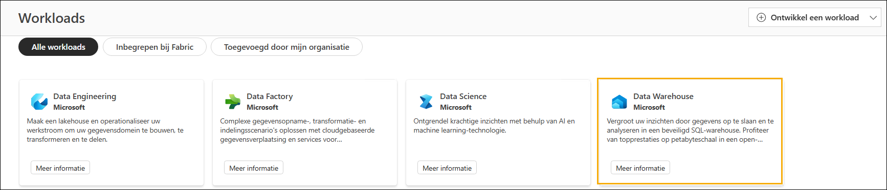

2. U wordt doorgestuurd naar de Data Warehouse-startpagina. Hieronder volgt een gedetailleerd overzicht van de secties, ontworpen om u te helpen Data Warehouse effectief en stap voor stap te gebruiken.

    **Wat is Data Warehouse?**

    Data Warehouse is een hulpmiddel waarmee u data op een veilige manier kunt opslaan en analyseren in een SQL-warehouse. Het stelt u in staat om uw inzichten op te schalen door te profiteren van topprestaties op petabyte-schaal in een open-dataformaat.

    **Itemtypen:**

    a. **Warehouse:** Wordt gebruikt voor het aanmaken van een Data Warehouse.

    b. **Sample Warehouse:** Wordt gebruikt voor het verkennen en testen van data warehousing-mogelijkheden met vooraf geconfigureerde datasets en modellen.

    c. **Notebook:** Wordt gebruikt voor het aanmaken en delen van interactieve dataanalyse- en visualisatietaken.

    d. **Mirrored Azure SQL Database:** Wordt gebruikt voor het spiegelen van Azure SQL Database.

    e. **Mirrored Azure Databricks Catalog:** Wordt gebruikt voor het spiegelen van data uit Azure Databricks voor verbeterde integratie en analytics.

    f. **Mirrored Snowflake:** Wordt gebruikt voor het spiegelen van Snowflake Database.

    g. **Mirrored Oracle (preview):** Wordt gebruikt voor het spiegelen van Oracle.

    h. **Mirrored Google Big Query (preview):** Wordt gebruikt voor het spiegelen van Google Big Query.

    i. **Mirrored Azure Cosmos DB:** Wordt gebruikt voor het spiegelen van Azure Cosmos DB.

    j. **Mirrored SQL Server:** Wordt gebruikt voor het spiegelen van SQL Server.

    k. **Mirrored Azure Database for PostgreSQL:** Wordt gebruikt voor het spiegelen van uw bestaande Azure Database for PostgreSQL.

    l. **Mirrored Azure SQL Managed Instance:** Wordt gebruikt voor het spiegelen van Azure SQL Managed Databases voor hoge beschikbaarheid en herstel na noodgevallen.

    m. **Mirrored Database:** Wordt gebruikt voor het repliceren van databases voor hoge beschikbaarheid en herstel na noodgevallen.

    **Aan de slag:**

    Volg de onderstaande stappen om Data Warehouse te gaan gebruiken:

    a. **Een voorbeeldwarehouse verkennen:** Start een nieuw warehouse met vooraf geladen voorbeelddata.

    b. **Aan de slag met Warehouse:** Klik op de knop "Openen" om te leren hoe u een warehouse kunt gebruiken om data te analyseren.

    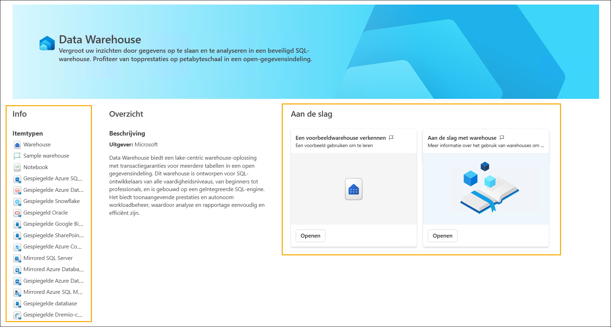

3. Klik op **Terug naar workloads** in de linkerbovenhoek van het scherm. Deze actie brengt u naar de hoofdpagina van workloads, waar u andere hulpmiddelen of secties kunt verkennen.

    

## Taak 10: Databases-ervaring

1. Klik op de pagina **Workloads** op **Databases** om door te gaan.

    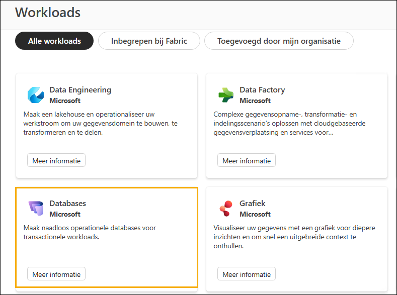

2. U wordt doorgestuurd naar de Databases-startpagina. Hieronder volgt een gedetailleerd overzicht van de secties, ontworpen om u te helpen Databases effectief te gebruiken.

    **Wat is een Fabric Database?**

    Een SQL-database in Microsoft Fabric is een ontwikkelaarsvriendelijke transactionele database, gebaseerd op Azure SQL Database, waarmee u eenvoudig uw operationele database in Fabric kunt aanmaken. Een SQL-database in Fabric gebruikt dezelfde SQL Database Engine als Azure SQL Database.

    **Itemtypen:**

    a. **SQL database:** Een SQL-database in Fabric maakt deel uit van de Database-workload, en de data is toegankelijk vanuit andere items in Fabric. Uw SQL-databasedata wordt ook actueel gehouden in een bevraagtbaar formaat in OneLake, zodat u alle verschillende services in Fabric kunt gebruiken, zoals het uitvoeren van analytics met Spark, het uitvoeren van notebooks, Data Engineering, visualiseren via Power BI-rapporten en meer.

    b. **Cosmos DB:** Cosmos DB in Microsoft Fabric is een AI-geoptimaliseerde NoSQL-database met een vereenvoudigde beheerervaring. Als ontwikkelaar kunt u Cosmos DB in Fabric gebruiken om AI-toepassingen te bouwen met minder wrijving en zonder typische databasebeheertaken op u te hoeven nemen.

    **Aan de slag:**

    Volg de onderstaande stappen om Databases te gaan gebruiken:

    a. **Verkennen:** Klik op de knop "Openen" om een voorbeelddatabase te verkennen.

    b. **Databaseconcepten:** Legt veelgebruikte termen en concepten rondom transactionele databases uit, zodat u vertrouwd raakt met het werken met SQL Database.

    c. **Databasesjablonen:** Bekijk een bibliotheek met vooraf gemaakte sjablonen van veelgebruikte databaseontwerpen.

    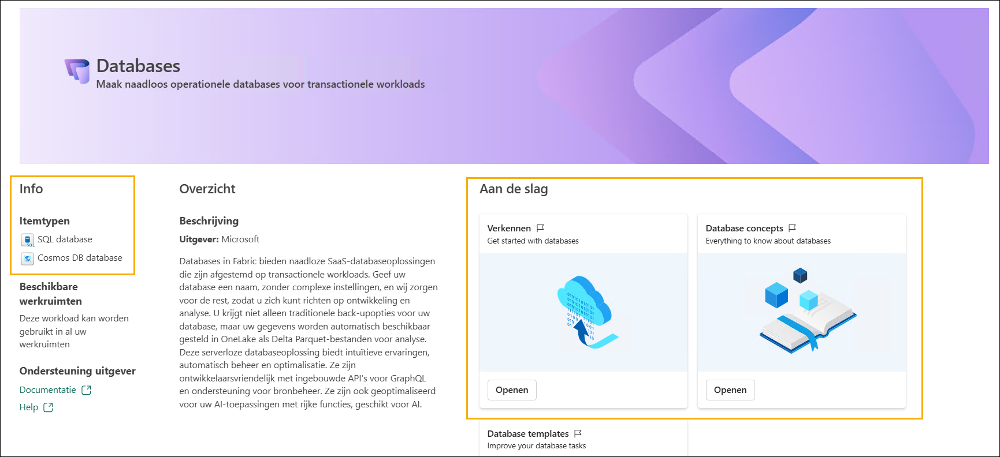

3. Klik op **Terug naar workloads** in de linkerbovenhoek van het scherm. Deze actie brengt u naar de hoofdpagina van workloads, waar u andere hulpmiddelen of secties kunt verkennen.

    

    In dit lab hebben we de Fabric-interface verkend en een Fabric workspace en een Lakehouse aangemaakt. In het volgende lab leren we hoe u Shortcuts in Lakehouse kunt gebruiken om verbinding te maken met ADLS Gen2-data en hoe u deze data kunt transformeren met behulp van views.

# Referenties

Fabric Analyst in a Day (FAIAD) introduceert u aan enkele van de belangrijkste functies die beschikbaar zijn in Microsoft Fabric. In het menu van de service bevat de sectie Help (?) links naar uitstekende bronnen.

Hier zijn nog een paar bronnen die u helpen bij uw volgende stappen met Microsoft Fabric.

- Lees de blogpost voor de volledige [aankondiging van Microsoft Fabric GA](https://aka.ms/Fabric-Hero-Blog-Ignite23)

- Verken Fabric via de [Begeleide rondleiding](https://aka.ms/Fabric-GuidedTour)

- Meld u aan voor de [gratis proefversie van Microsoft Fabric](https://aka.ms/try-fabric)

- Bezoek de [Microsoft Fabric-website](https://aka.ms/microsoft-fabric)

- Leer nieuwe vaardigheden door de [Fabric Learning-modules](https://aka.ms/learn-fabric) te verkennen

- Verken de [technische documentatie van Fabric](https://aka.ms/fabric-docs)

- Lees het [gratis e-book over aan de slag gaan met Fabric](https://aka.ms/fabric-get-started-ebook)

- Word lid van de [Fabric-community](https://aka.ms/fabric-community) om uw vragen te stellen, feedback te delen en van anderen te leren

Lees de meer uitgebreide aankondigingsblogs over Fabric-ervaringen:

- [Blog over Data Factory-ervaring in Fabric](https://aka.ms/Fabric-Data-Factory-Blog)

- [Blog over Synapse Data Engineering-ervaring in Fabric](https://aka.ms/Fabric-DE-Blog)

- [Blog over Synapse Data Science-ervaring in Fabric](https://aka.ms/Fabric-DS-Blog)

- [Blog over Synapse Data Warehousing-ervaring in Fabric](https://aka.ms/Fabric-DW-Blog)

- [Blog over Synapse Real-Time Analytics-ervaring in Fabric](https://aka.ms/Fabric-RTA-Blog)

- [Aankondigingsblog van Power BI](https://aka.ms/Fabric-PBI-Blog)

- [Blog over Data Activator-ervaring in Fabric](https://aka.ms/Fabric-DA-Blog)

- [Blog over beheer en governance in Fabric](https://aka.ms/Fabric-Admin-Gov-Blog)

- [Blog over OneLake in Fabric](https://aka.ms/Fabric-OneLake-Blog)

- [Blog over Dataverse- en Microsoft Fabric-integratie](https://aka.ms/Dataverse-Fabric-Blog)

© 2026 Microsoft Corporation. Alle rechten voorbehouden.

Door gebruik te maken van deze demo/dit lab, gaat u akkoord met de volgende voorwaarden:

De technologie/functionaliteit die in deze demo/dit lab wordt beschreven, wordt door Microsoft Corporation aangeboden met als doel uw feedback te verkrijgen en u een leerervaring te bieden. U mag de demo/het lab alleen gebruiken om dergelijke technologiefuncties en -functionaliteit te evalueren en feedback te geven aan Microsoft. U mag het niet voor andere doeleinden gebruiken. U mag deze demo/dit lab of een deel daarvan niet wijzigen, kopiëren, distribueren, verzenden, weergeven, uitvoeren, reproduceren, publiceren, in licentie geven, er afgeleide werken van maken, overdragen of verkopen.

HET KOPIËREN OF REPRODUCEREN VAN DE DEMO/HET LAB (OF EEN DEEL DAARVAN) NAAR ENIGE ANDERE SERVER OF LOCATIE VOOR VERDERE REPRODUCTIE OF VERDERE VERSPREIDING IS UITDRUKKELIJK VERBODEN.

DEZE DEMO/DIT LAB BIEDT BEPAALDE SOFTWARETECHNOLOGIE-/PRODUCTFUNCTIES EN -FUNCTIONALITEIT, INCLUSIEF MOGELIJKE NIEUWE FUNCTIES EN CONCEPTEN, IN EEN GESIMULEERDE OMGEVING ZONDER COMPLEXE INSTALLATIE OF CONFIGURATIE VOOR HET HIERBOVEN BESCHREVEN DOEL. DE TECHNOLOGIE/CONCEPTEN DIE IN DEZE DEMO/DIT LAB WORDEN GEPRESENTEERD, VERTEGENWOORDIGEN MOGELIJK NIET DE VOLLEDIGE FUNCTIEFUNCTIONALITEIT EN WERKEN MOGELIJK NIET OP DEZELFDE MANIER ALS EEN DEFINITIEVE VERSIE. WIJ KUNNEN OOK GEEN DEFINITIEVE VERSIE VAN DERGELIJKE FUNCTIES OF CONCEPTEN UITBRENGEN. UW ERVARING MET HET GEBRUIK VAN DERGELIJKE FUNCTIES EN FUNCTIONALITEIT IN EEN FYSIEKE OMGEVING KAN OOK ANDERS ZIJN.

**FEEDBACK**. Als u feedback geeft over de technologiefuncties, -functionaliteit en/of concepten die in deze demo/dit lab worden beschreven aan Microsoft, geeft u Microsoft, kosteloos, het recht om uw feedback op welke wijze dan ook en voor welk doel dan ook te gebruiken, te delen en te commercialiseren. U verleent ook aan derden, kosteloos, alle octrooirechten die nodig zijn voor hun producten, technologieën en diensten om specifieke onderdelen van een Microsoft-software of -dienst die de feedback bevat te gebruiken of te koppelen. U geeft geen feedback die onderworpen is aan een licentie die vereist dat Microsoft zijn software of documentatie aan derden in licentie geeft omdat wij uw feedback daarin opnemen. Deze rechten blijven van kracht na afloop van deze overeenkomst.

MICROSOFT CORPORATION WIJST HIERBIJ ALLE GARANTIES EN VOORWAARDEN MET BETREKKING TOT DE DEMO/HET LAB AF, INCLUSIEF ALLE GARANTIES EN VOORWAARDEN VAN VERKOOPBAARHEID, HETZIJ UITDRUKKELIJK, IMPLICIET OF WETTELIJK, GESCHIKTHEID VOOR EEN BEPAALD DOEL, TITEL EN NIET-INBREUK. MICROSOFT GEEFT GEEN GARANTIES OF VERKLARINGEN MET BETREKKING TOT DE NAUWKEURIGHEID VAN DE RESULTATEN, DE UITVOER DIE VOORTVLOEIT UIT HET GEBRUIK VAN DE DEMO/HET LAB, OF DE GESCHIKTHEID VAN DE INFORMATIE IN DE DEMO/HET LAB VOOR ENIG DOEL.

**VRIJWARING**

Deze demo/dit lab bevat slechts een deel van de nieuwe functies en verbeteringen in Microsoft Power BI. Sommige functies kunnen in toekomstige versies van het product worden gewijzigd. In deze demo/dit lab leert u over sommige, maar niet alle, nieuwe functies.