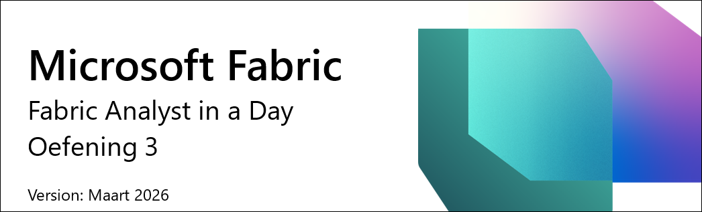

# Microsoft Fabric - Fabric Analyst in a Day - Oefening 3



# Inhoudsopgave

- Inleiding

- Shortcut naar ADLS Gen2

    - Taak 1: Shortcut aanmaken

- Gegevens transformeren met Visual Query

    - Taak 2: Geo-weergave aanmaken met Visual Query

    - Taak 3: Reseller-weergave aanmaken met Visual Query

    - Taak 4: Sales-weergave aanmaken met Visual query

    - Taak 5: Product-weergave aanmaken met Visual query

- Referenties

# Inleiding

In ons scenario komen verkoopgegevens uit het ERP-systeem en worden opgeslagen in een ADLS Gen2. De gegevens worden elke dag om 12:00 uur bijgewerkt. We moeten deze gegevens transformeren en inladen in de Lakehouse, zodat we ze in ons model kunnen gebruiken.

Er zijn meerdere manieren om deze gegevens in te laden.

- **Shortcuts:** Hiermee wordt een koppeling naar de gegevens gemaakt, en kunnen we Visual query-weergaven gebruiken om de gegevens te transformeren. We gaan Shortcuts gebruiken in dit lab.

- **Notebooks:** Hiervoor moeten we code schrijven. Dit is een ontwikkelaarsvriendelijke aanpak.

- **Dataflow Gen2:** U bent waarschijnlijk bekend met Power Query of Dataflow Gen1. Dataflow Gen2 is, zoals de naam aangeeft, de nieuwere versie van Dataflow. Het biedt alle mogelijkheden van Power Query / Dataflow Gen1, met de toegevoegde mogelijkheid om gegevens te transformeren en in te laden in meerdere gegevensbronnen. We zullen dit introduceren in de volgende labs.

- **Pipeline:** Dit is een orkestratietool. Activiteiten kunnen worden georkestreerd om gegevens te extraheren, transformeren en inladen. We zullen een Pipeline gebruiken om een Dataflow Gen2-activiteit uit te voeren, die op zijn beurt de extractie, transformatie en het inladen uitvoert.

We beginnen met het aanmaken van een Shortcut om gegevens vanuit een ADLS Gen2-gegevensbron in een Lakehouse in te laden. Nadat de gegevens zijn ingeladen, gaan we Visual query-weergaven gebruiken om ze te transformeren.

Aan het einde van dit lab heeft u geleerd:

- Hoe u Shortcuts aanmaakt in uw Lakehouse

- Hoe u gegevens transformeert met de Visual query-functie

# Shortcut naar ADLS Gen2

## Taak 1: Shortcut aanmaken

Shortcuts worden gebruikt om een koppeling naar de doellocatie te maken. Shortcuts bieden toegang tot de gegevens zonder dat de gegevens fysiek naar de Lakehouse hoeven te worden verplaatst. Dit is vergelijkbaar met het aanmaken van snelkoppelingen op het Windows-bureaublad.

1. Selecteer bovenaan uw scherm het tabblad **lh_FAIAD** om naar de Lakehouse te navigeren.

1. Als u geen tabblad heeft, kunt u teruggaan naar uw Workspace en de Lakehouse van daaruit openen.

1. Selecteer in het **Explorer**-paneel het **beletselteken** naast **Tables**.

1. Selecteer **New shortcut**.

    

1. Het dialoogvenster **New Shortcut** opent. Selecteer onder **External sources** de optie **Azure Data Lake Storage Gen2**.

    

1. Selecteer **New connection (1)**.

1. Voer de volgende koppeling in voor de eigenschap **URL**: https://stvnextblobstorage.dfs.core.windows.net/fabrikam-sales **(2):**

1. Klik op **Create New Connection (3)** onder de sectie Connection.

1. Selecteer **Shared Access Signature (SAS) (4)** in de vervolgkeuzelijst Authentication kind.

1. Kopieer het SAS-token en plak het in het veld SAS token **(5)**.

    - **SAS token:** <inject key="Sas token"></inject>

1. Selecteer **Next (6)** rechtsonder op het scherm.

    

1. U wordt verbonden met ADLS Gen2 en de mappenstructuur wordt weergegeven in het linkerdeelvenster. Vouw **Delta-Parquet-Format-FY25 (1)** uit.

1. **Selecteer** de volgende mappen **(2)** en klik vervolgens op **Next (3):**

    1. Application.Cities

    2. Application.Countries

    3. Application.StateProvinces

    4. DateDim

    5. Sales.BuyingGroups

    6. Sales.Customers

    7. Sales.InvoiceLines

    8. Sales.Invoices

    9. Warehouse.StockGroups

    10. Warehouse.StockItemStockGroups

    11. Warehouse.StockItems

        >**Opmerking:** Sales.Invoices_May is de enige map die **niet** is geselecteerd.

        

1. U wordt naar het volgende dialoogvenster geleid, waar u de namen kunt bewerken. Selecteer het **bewerkingspictogram (1)** onder Actions voor **Application.Cities**.

1. Hernoem **Application.Cities** naar **Cities (2)**.

1. Selecteer het vinkje naast de naam om de wijziging op te slaan **(3)**.

    

1. Hernoem de Shortcut-namen op dezelfde manier als hieronder:

    1. Application.Countries naar **Countries**

    2. Application.StateProvinces naar **States**

    3. DateDim naar **Date**

    4. Sales.BuyingGroups naar **BuyingGroups**

    5. Sales.Customers naar **Customers**

    6. Sales.InvoiceLines naar **InvoiceLineItems**

    7. Sales.Invoices naar **Invoices**

    8. Warehouse.StockGroups naar **ProductGroups**

    9. Warehouse.StockItemStockGroups naar **ProductItemGroup**

    10. Warehouse.StockItems naar **ProductItem**

    > **Opmerking:** Controleer de namen nogmaals. Een typefout veroorzaakt fouten tijdens het lab.

1. Selecteer **Create** om de Shortcut aan te maken.

    

1. U ziet dat alle Shortcuts zijn aangemaakt als Tables. Selecteer de tabel **BuyingGroups** en u ziet dat we een voorbeeld van de gegevens kunnen bekijken in het gegevensvenster.

    

    De volgende stap is het transformeren van de gegevens, zodat we een semantisch model kunnen maken. We gaan weergaven aanmaken om de gegevens te transformeren.

# Gegevens transformeren met Visual Query

## Taak 2: Geo-weergave aanmaken met Visual Query

1. We hebben toegang tot de Lakehouse via een SQL endpoint. Dit biedt de mogelijkheid om de gegevens op te vragen en weergaven aan te maken. Selecteer rechtsboven op het scherm **Lakehouse (1) -> SQL analytics endpoint (2)**.

    

    U wordt naar de SQL analytics endpoint geleid. Er is nu een nieuw item in uw bovenste navigatie en u kunt teruggaan naar de Lakehouse door dat tabblad te selecteren. U ziet dat het Explorer-paneel is gewijzigd. U kunt nu weergaven, opgeslagen procedures, query's en meer aanmaken. We gaan een visual query aanmaken, omdat dit een low-code interface biedt die vergelijkbaar is met Power Query. We slaan het resultaat op als een weergave.

    We beginnen met het aanmaken van een Geo-weergave. We moeten gegevens uit de tabellen Cities, States en Countries samenvoegen om de Geo-weergave te maken.

2. Klik in het bovenste menu op de vervolgkeuzelijst naast **New SQL query (1)** en selecteer vervolgens **New visual query (2)**.
    
    

3. Om een query op te bouwen, moeten we tabellen toevoegen aan het Visual Query-paneel. Klik in het Explorer-deelvenster op **Schemas (1)**, vouw **dbo (2)** uit, open **Tables (3)**, klik op het beletselteken naast **Cities (4)** en selecteer **Insert into canvas (5)**.

    

4. Herhaal dezelfde stappen voor de tabellen **States** en **Countries**.

    Vervolgens moeten we deze query's samenvoegen. De visual query editor biedt de optie om de Power Query editor te gebruiken. Laten we dit gebruiken, omdat we hiermee bekend zijn vanuit Power BI.

5. **Selecteer in het menu van de visual query editor** het pictogram **Open in popup** (aan de rechterkant). U wordt naar de Power Query editor geleid.
         
    >**Opmerking:** Mogelijk moet u naar rechts scrollen of uw tabblad voor de visual query opnieuw openen als u dit pictogram niet direct ziet.

    

6. Selecteer met de query **Cities (1)** geselecteerd in het lint van de Power Query editor de optie **Home (2) -> Combine (3) -> Merge queries (vervolgkeuzelijst) (4) -> Merge queries as new (5)**. Het dialoogvenster Merge queries opent.

    

7. Selecteer in de **Left table for merge** de tabel **Cities**.

8. Selecteer in de **Right table for merge** de tabel **States**.

9. Selecteer de kolommen **StateProvinceID** uit beide tabellen. We gaan samenvoegen op basis van deze kolom.

10. Selecteer **Inner** als **Join kind**.

11. Selecteer **OK**.

    

    Er is een nieuwe query met de naam **Merge** aangemaakt. We hebben een aantal kolommen uit States nodig.

12. Klik in de **Data view** (onderste paneel) op de **dubbele pijl** naast de kolom **States** (de laatste kolom aan de rechterkant).

13. Er opent een paneel. Zorg ervoor dat alleen de volgende kolommen zijn geselecteerd:

    1. StateProvinceCode

    2. StateProvinceName

    3. CountryID

    4. SalesTerritory

14. Selecteer **OK**.

    

    We moeten nu de query Countries samenvoegen.

15. Selecteer met de Merge-query geselecteerd **(1)** de optie **Home (2) -> Combine (3) -> Merge queries (vervolgkeuzelijst) (4) -> Merge queries (5)**.

    

16. Het dialoogvenster Merge query opent. Selecteer in de **Right table for merge** de tabel **Countries**.

17. Selecteer de kolommen **CountryID** uit beide tabellen. We gaan samenvoegen op basis van deze kolom.

18. Selecteer **Inner** als **Join kind**.

19. Selecteer **OK**.

    

    We hebben een aantal kolommen uit Countries nodig.

20. Klik in de **Data view** (onderste paneel) op de **dubbele pijl** naast de kolom **Countries**.

21. Er opent een paneel. Zorg ervoor dat alleen de volgende kolommen zijn geselecteerd:

    1. CountryName

    2. FormalName

    3. IsoAlpha3Code

    4. IsoNumericCode

    5. CountryType

    6. Continent

    7. Region

    8. Subregion

22. Selecteer **OK**.

    **Belangrijk:** Zorg ervoor dat u naar beneden scrolt en alle acht kolommen uit stap 21 selecteert. De onderstaande schermopname toont vanwege een UI-beperking alleen de eerste 5 kolommen.

    

    We hebben niet alle kolommen in de tabel **Merge** nodig. Zorg ervoor dat u alleen de kolommen selecteert die we nodig hebben.

23. Selecteer met de query **Merge** geselecteerd **(1)** in het lint de optie **Home (2) -> Choose columns (3) -> Choose columns (4)**.

    >**Opmerking:** Als de optie Choose columns niet zichtbaar is, kunt u deze vinden onder Manage columns.

    

24. Het dialoogvenster Choose columns opent. **Verwijder de selectie** van de volgende kolommen.

    1. StateProvinceID

    2. Location

    3. LastEditedBy

    4. ValidFrom

    5. ValidTo

    6. CountryID

25. Selecteer **OK**.

    

    U ziet dat het proces vergelijkbaar is met Power Query: alle stappen worden vastgelegd in het paneel Applied Steps aan de rechterkant en in de visuele weergave. Laten we de Merge-query hernoemen en Enable load inschakelen, zodat de gegevens vanuit deze query worden geladen.

26. **Klik met de rechtermuisknop** op de query **Merge** in het paneel Queries (links). Selecteer **Rename** en hernoem de query naar **Geo**.

27. **Klik met de rechtermuisknop** op de query **Geo** in het paneel Queries (links). Selecteer **Enable Load** om deze query in te schakelen.

28. Zorg ervoor dat de query's Cities, States en Countries **uitgeschakeld** zijn.

29. Selecteer **Save**, te vinden rechtsonder in de Power Query editor.

    

    U wordt naar de visual query editor geleid. Laten we deze query nu opslaan als een weergave.

    >**Opmerking:** Alle stappen die we hebben uitgevoerd in de Power Query editor, kunnen ook worden uitgevoerd in de visual query editor.

30. Selecteer in het menu van de visual query editor de optie **Save as view**.

    

    Het dialoogvenster Save as view opent. U ziet dat de SQL-query beschikbaar is. U kunt deze bekijken als u de SQL-code wilt controleren.

31. Voer **Geo** in als **View name**.

32. Selecteer **OK** om de weergave op te slaan.

    

    U ontvangt een melding zodra de weergave is opgeslagen.

33. Vouw in het Explorer-paneel (links) **Views** uit. We hebben de nieuw aangemaakte Geo-weergave.

    

## Taak 3: Reseller-weergave aanmaken met Visual Query

Laten we de Reseller-weergave aanmaken, die wordt gemaakt door de tabel Customers samen te voegen met de tabel BuyingGroups. Deze keer maken we de weergave aan via Visual query zonder de Power Query-optie te openen.

1. Klik in het bovenste menu op de vervolgkeuzelijst naast **New SQL query (1)** en selecteer vervolgens **New visual query (2)**.

    

2. Om een query op te bouwen, moeten we tabellen toevoegen aan het Visual Query-paneel. Klik op het beletselteken naast de tabel **BuyingGroups (1)** en selecteer **Insert into canvas (2)**.

    

3. Herhaal dezelfde stappen voor de tabel **Customers**.

4. **Selecteer de query Customers**. Wanneer deze is geselecteerd, heeft Customers een **"+"**-teken na Table (dit geeft aan dat we een stap toevoegen na Table. Als u het **"+"**-teken na Table niet ziet, heeft u mogelijk een andere stap geselecteerd. Selecteer Table en u bent klaar om verder te gaan).

5. Selecteer in het menu van de visual query de optie **Combine -> Merge queries**.

    

    Het dialoogvenster Merge opent met Customers geselecteerd als de bovenste tabel.

6. Selecteer in de **Right table for merge** de tabel **BuyingGroups**.

7. Selecteer de kolommen **BuyingGroupID** uit beide tabellen. We gaan samenvoegen op basis van deze kolom.

8. Selecteer **Inner** als **Join kind**.

9. Selecteer **OK**.

    

10. Klik in de **Data view** (onderste paneel) op de **dubbele pijl** naast de kolom **BuyingGroups** (de laatste kolom aan de rechterkant) om de kolommen te selecteren die we nodig hebben uit BuyingGroups.

11. Er opent een paneel. **Selecteer de kolom** **BuyingGroupName**.

12. Selecteer **OK**.

    

    We hebben niet alle kolommen in onze tabel Customer nodig. Laten we alleen de kolommen selecteren die we nodig hebben.

13. Selecteer in het menu van de visual query de optie **Manage columns -> Choose columns**.

    

14. Het dialoogvenster Choose columns opent. **Selecteer** de volgende kolommen.

    1. ResellerID

    2. ResellerName

    3. PostalCityID

    4. PhoneNumber

    5. FaxNumber

    6. WebsiteURL

    7. DeliveryAddressLine1

    8. DeliveryAddressLine2

    9. DeliveryPostalCode

    10. PostalAddressLine1

    11. PostalAddressLine2

    12. PostalPostalCode

    13. BuyingGroupName

15. Selecteer **OK**.

    

16. Laten we de kolom BuyingGroupName hernoemen. **Dubbelklik in de Data view op de kolomkop BuyingGroupName** om deze bewerkbaar te maken.

17. **Hernoem** de kolom naar **ResellerCompany**.

    

    U ziet dat de tabel Customer alle stappen heeft gedocumenteerd. Laten we deze weergave nu opslaan.

18. We moeten de query Customers opslaan, omdat deze alle stappen bevat. We moeten Enable load inschakelen. Selecteer het **beletselteken** in het queryvenster **Customers**.

19. Zorg ervoor dat **Enable load** is aangevinkt.

    

    >**Opmerking:** Het venster **Customer** moet een blauwe rand hebben als Enable load is ingeschakeld.

20. Selecteer in het menu van de visual query de optie **Save as view**.

    

    Het dialoogvenster Save as view opent. U ziet dat de SQL-query beschikbaar is. U kunt deze bekijken door erop te klikken.

21. Voer **Reseller** in als **View name**.

22. Selecteer **OK** om de weergave op te slaan.

    

    U ontvangt een melding zodra de weergave is opgeslagen.

23. Vouw in het Explorer-paneel (links) **Views** uit. We hebben de nieuw aangemaakte Reseller-weergave.

    

## Taak 4: Sales-weergave aanmaken met Visual query

Laten we de Sales-weergave aanmaken, die wordt gemaakt door de tabellen InvoiceLineItems en Invoices samen te voegen met de Reseller-weergave. We hebben deze query in Power BI Desktop. We kopiëren de code uit de Advanced Editor. Maar voordat we de code kopiëren, moeten we een samenvoegingstabel aanmaken via Visual query, omdat het aanmaken van een lege query niet mogelijk is in Visual query. Laten we deze methode uitproberen.

1. Klik in het bovenste menu op de vervolgkeuzelijst naast **New SQL query** en selecteer vervolgens **New visual query**. 

    

2. Vanuit de sectie **Explorer -> Table** moeten we tabellen toevoegen aan het Visual Query-paneel. Klik op het beletselteken naast de tabel **InvoiceLineItems** en selecteer **Insert into canvas**.

3. Herhaal dezelfde stappen voor de tabel **Invoices**.

4. Vanuit de sectie **Explorer -> Views** moeten we tabellen toevoegen aan het Visual Query-paneel. Klik op het beletselteken naast de tabel **Reseller** en selecteer **Insert into canvas**.

5. Selecteer in de visual query editor de optie **Open in popup** om de Power Query editor te openen.

    

6. Selecteer met de query **InvoiceLineItems** geselecteerd in het lint de optie **Home (2) -> Combine (3) -> Merge queries (vervolgkeuzelijst) (4) -> Merge queries as new (5)**. Het dialoogvenster Merge queries opent.

    

7. Selecteer in de **Left table for merge** de tabel **InvoiceLineItems**.

8. Selecteer in de **Right table for merge** de tabel **Invoices**.

9. Selecteer de kolommen **InvoiceID** uit beide tabellen. We gaan samenvoegen op basis van deze kolom.

10. Selecteer **Inner** als **Join kind**.

11. Selecteer **OK**.

    

    We gaan code kopiëren uit Power BI Desktop en plakken via de Advanced Editor.

12. Als u dit nog niet heeft gedaan, open dan **FAIAD.pbix** in de map **Reports** op het bureaublad van uw labomgeving.

13. Selecteer in het lint de optie **Home -> Transform data**. Het Power Query-venster opent. Zoals u in het vorige lab heeft gezien, zijn de query's in het linkerdeelvenster georganiseerd per gegevensbron.

    

14. Selecteer in het linkerdeelvenster **Queries** onder de map **ADLSData (1)** de query **Sales (2)**.

15. Selecteer in het lint de optie **Home -> Advanced Editor (3)**. Het dialoogvenster Advanced Editor opent.

    

    >**Opmerking:** Als u de Advanced Editor niet kunt vinden, kunt u deze openen via **Home -> Query -> Advanced Editor**.

16. **Selecteer de code vanaf regel 3** tot en met de laatste coderegel.

17. **Klik met de rechtermuisknop** en selecteer **Copy**.

18. Selecteer **Cancel** om de Advanced Editor te sluiten.

    

19. **Navigeer terug naar de browser** waar u de Power Query Editor open heeft.

20. Zorg ervoor dat de query **Merge** is geselecteerd.

21. Selecteer in het lint de optie **Home -> Advanced Editor**. Het dialoogvenster Advanced Editor opent.

    

22. **Voeg aan het einde van regel 2 een komma toe** (Source = Table.NestedJoin(InvoiceLineItems, {"InvoiceID"}, Invoices, {"InvoiceID"}, "Invoices", JoinKind.Inner)**,**

23. Klik op **Enter** om een nieuwe regel te beginnen.


24. Gebruik **Ctrl+V** op uw toetsenbord om de code te plakken die u heeft gekopieerd uit Power BI Desktop.

    >**Opmerking:** Als u in de labomgeving werkt, selecteer dan het **beletselteken (…)** rechtsboven op het scherm. Gebruik de schuifregelaar om **VM Native Clipboard** in te **schakelen**. Selecteer OK in het dialoogvenster. Nadat u de query's heeft geplakt, kunt u deze optie weer uitschakelen.

    

    

25. Markeer de laatste twee coderegels (in Source) en **verwijder** ze.

26. Selecteer **OK** om de wijzigingen op te slaan.

    

    Als het eenvoudiger is, verwijder dan alle code in de Advanced Editor en plak de onderstaande code in de Advanced Editor.

    ```
    let
    Source = Table.NestedJoin(InvoiceLineItems, {"InvoiceID"}, Invoices, {"InvoiceID"}, "Invoices", JoinKind.Inner),
        #"Expanded Invoice" = Table.ExpandTableColumn(Source, "Invoices", {"CustomerID", "BillToCustomerID", "SalespersonPersonID", "InvoiceDate"}, {"CustomerID", "BillToCustomerID", "SalespersonPersonID", "InvoiceDate"}),
        #"Removed Other Columns" = Table.SelectColumns(#"Expanded Invoice",{"InvoiceLineID", "InvoiceID", "StockItemID", "Quantity", "UnitPrice", "TaxRate", "TaxAmount", "LineProfit", "ExtendedPrice", "CustomerID", "SalespersonPersonID", "InvoiceDate"}),
        #"Renamed Columns" = Table.RenameColumns(#"Removed Other Columns",{{"CustomerID", "ResellerID"}}),
        #"Merged Queries" = Table.NestedJoin(#"Renamed Columns", {"ResellerID"}, Reseller, {"ResellerID"}, "Customer", JoinKind.Inner),
        #"Added Custom" = Table.AddColumn(#"Merged Queries", "Sales Amount", each [ExtendedPrice] - [TaxAmount]),
        #"Changed Type" = Table.TransformColumnTypes(#"Added Custom",{{"Sales Amount", type number}}),
        #"Removed Columns" = Table.RemoveColumns(#"Changed Type",{"Customer"})
    in
        #"Removed Columns"
    ```

27. U wordt teruggeleid naar de Power Query Editor. **Dubbelklik in het linkerdeelvenster Queries op de query Merge** om deze te hernoemen.

28. **Hernoem** de query Merge naar **Sales**.

29. Klik met de rechtermuisknop op de query Sales en selecteer **Enable load** om het laden van de query in te schakelen.

    

30. Selecteer **Save** om het Power Query-dialoogvenster op te slaan en te sluiten. U wordt naar de visual query editor geleid.

31. Selecteer in het menu van de visual query de optie **Save as view**. Het dialoogvenster Save as view opent. U ziet dat de SQL-query beschikbaar is. U kunt deze bekijken als u dat wilt.

32. Voer **Sales** in als **View name (1)**.

33. Selecteer **OK (2)** om de weergave op te slaan.

    

    U ontvangt een melding zodra de weergave is opgeslagen.

34. Vouw in het Explorer-paneel (links) **Views** uit. We hebben de nieuw aangemaakte Sales-weergave.

    

## Taak 5: Product-weergave aanmaken met Visual query

Laten we de Product-weergave aanmaken, die wordt gemaakt door de tabellen **ProductItem**, **ProductItemGroup** en **ProductGroups** samen te voegen. Om het proces te versnellen, gaan we code kopiëren in de Advanced Editor.

1. Klik in het bovenste menu op de vervolgkeuzelijst naast **New SQL query (1)** en selecteer vervolgens **New visual query (2)**.

    

2. Vanuit de sectie Explorer moeten we tabellen toevoegen aan het Visual Query-paneel. Klik op het beletselteken naast de tabel **ProductItem (1)** en selecteer **Insert into canvas (2)**.

    

3. Herhaal dezelfde stappen voor de tabellen **ProductItemGroup** en **ProductGroups**.

4. Selecteer in de visual query editor de optie **Open in popup** om de Power Query editor te openen.

    

5. Selecteer met de query **ProductItem** geselecteerd **(1)** in het lint de optie **Home (2) -> Combine (3) -> Merge queries (vervolgkeuzelijst) (4) -> Merge queries as new (5)**. Het dialoogvenster Merge opent.

    

6. Selecteer in de **Left table for merge** de tabel **ProductItem**.

7. Selecteer in de **Right table for merge** de tabel **ProductItemGroup**.

8. Selecteer de kolommen **StockItemID** uit beide tabellen. We gaan samenvoegen op basis van deze kolom.

9. Selecteer **Left outer** als **Join kind**.

10. Selecteer **OK**. Er wordt een nieuwe query Merge aangemaakt.

    

11. Selecteer met de query Merge geselecteerd in het lint de optie **Home -> Advanced editor**. Het dialoogvenster Advanced editor opent.

    

    >**Opmerking:** Als u de Advanced Editor niet kunt vinden, kunt u deze openen via **Home -> Query -> Advanced Editor**.

12. **Selecteer alle code** in de Advanced editor en **verwijder** deze.

13. **Plak** de onderstaande code in de Advanced editor.

    ```
    let
       Source = Table.NestedJoin(ProductItem, {"StockItemID"}, ProductItemGroup, {"StockItemID"}, "ProductItemGroup", JoinKind.LeftOuter),
       #"Expanded ProductItemGroup" = Table.ExpandTableColumn(Source, "ProductItemGroup", {"StockGroupID"}, {"StockGroupID"}),
       #"Merged queries" = Table.NestedJoin(#"Expanded ProductItemGroup", {"StockGroupID"}, ProductGroups, {"StockGroupID"}, "ProductGroups", JoinKind.LeftOuter),
       #"Expanded ProductGroups" = Table.ExpandTableColumn(#"Merged queries", "ProductGroups", {"StockGroupName"}, {"StockGroupName"}),
       #"Choose columns" = Table.SelectColumns(#"Expanded ProductGroups", {"StockItemID", "StockItemName", "SupplierID", "Size", "IsChillerStock", "TaxRate", "UnitPrice", "RecommendedRetailPrice", "TypicalWeightPerUnit", "StockGroupName"})
    in
       #"Choose columns"
    ```

14. Selecteer **OK** om de Advanced Editor te sluiten. U wordt teruggeleid naar de Power Query editor.

    

15. **Dubbelklik in het deelvenster Queries aan de linkerkant op de query Merge** om deze te hernoemen.

16. **Wijzig de naam** van de query Merge naar **Product**.

17. Klik met de rechtermuisknop op de query Product en selecteer **Enable load** om het laden van de query in te schakelen.

18. Selecteer **Save** om het Power Query-dialoogvenster op te slaan en te sluiten. U wordt naar de Visual query geleid.

    

19. Selecteer in het menu van de visual query de optie **Save as view**. Het dialoogvenster Save as view opent. U ziet dat de SQL-query beschikbaar is. U kunt deze bekijken als u dat wilt.

20. Voer **Product** in als **View name**.

21. Selecteer **OK** om de weergave op te slaan.

    

    U ontvangt een melding zodra de weergave is opgeslagen.

22. Vouw in het Explorer-paneel (links) **Views** uit. We hebben de nieuw aangemaakte Product-weergave.

    

    We hebben de gegevens vanuit de ADLS Gen2-gegevensbron getransformeerd. In dit lab hebben we geleerd hoe we shortcuts kunnen aanmaken en hebben we verschillende opties verkend voor het gebruik van visual query-weergaven om gegevens te transformeren.

    In het volgende lab leren we hoe we Dataflow Gen2 kunnen gebruiken en een Shortcut naar een andere Lakehouse kunnen aanmaken.

# Referenties

Fabric Analyst in a Day (FAIAD) maakt u kennis met enkele van de belangrijkste functies die beschikbaar zijn in Microsoft Fabric. In het menu van de service bevat de sectie Help (?) koppelingen naar nuttige resources.


Hier zijn nog een paar resources die u helpen bij uw volgende stappen met Microsoft Fabric.

- Lees de blogpost voor de volledige [aankondiging van Microsoft Fabric GA](https://aka.ms/Fabric-Hero-Blog-Ignite23)

- Verken Fabric via de [Guided Tour](https://aka.ms/Fabric-GuidedTour)

- Meld u aan voor de [gratis proefversie van Microsoft Fabric](https://aka.ms/try-fabric)

- Bezoek de [Microsoft Fabric-website](https://aka.ms/microsoft-fabric)

- Leer nieuwe vaardigheden door de [Fabric Learning-modules](https://aka.ms/learn-fabric) te verkennen

- Verken de [technische documentatie van Fabric](https://aka.ms/fabric-docs)

- Lees het [gratis e-book over aan de slag gaan met Fabric](https://aka.ms/fabric-get-started-ebook)

- Word lid van de [Fabric-community](https://aka.ms/fabric-community) om vragen te stellen, feedback te delen en van anderen te leren

Lees de meer gedetailleerde aankondigingsblogs over Fabric-ervaringen:

- [Blog over de Data Factory-ervaring in Fabric](https://aka.ms/Fabric-Data-Factory-Blog)

- [Blog over de Synapse Data Engineering-ervaring in Fabric](https://aka.ms/Fabric-DE-Blog)

- [Blog over de Synapse Data Science-ervaring in Fabric](https://aka.ms/Fabric-DS-Blog)

- [Blog over de Synapse Data Warehousing-ervaring in Fabric](https://aka.ms/Fabric-DW-Blog)

- [Blog over de Synapse Real-Time Analytics-ervaring in Fabric](https://aka.ms/Fabric-RTA-Blog)

- [Aankondigingsblog van Power BI](https://aka.ms/Fabric-PBI-Blog)

- [Blog over de Data Activator-ervaring in Fabric](https://aka.ms/Fabric-DA-Blog)

- [Blog over beheer en governance in Fabric](https://aka.ms/Fabric-Admin-Gov-Blog)

- [Blog over OneLake in Fabric](https://aka.ms/Fabric-OneLake-Blog)

- [Blog over de integratie van Dataverse en Microsoft Fabric](https://aka.ms/Dataverse-Fabric-Blog)

© 2026 Microsoft Corporation. Alle rechten voorbehouden.

Door gebruik te maken van deze demo/dit lab gaat u akkoord met de volgende voorwaarden:

De technologie/functionaliteit die in deze demo/dit lab wordt beschreven, wordt door Microsoft Corporation aangeboden met het doel uw feedback te verkrijgen en u een leerervaring te bieden. U mag de demo/het lab uitsluitend gebruiken om dergelijke technologiefuncties en -functionaliteit te evalueren en feedback te geven aan Microsoft. U mag het niet voor enig ander doel gebruiken. U mag deze demo/dit lab of een deel ervan niet wijzigen, kopiëren, distribueren, verzenden, weergeven, uitvoeren, reproduceren, publiceren, in licentie geven, afgeleide werken van maken, overdragen of verkopen.

KOPIËREN OF REPRODUCEREN VAN DE DEMO/HET LAB (OF EEN DEEL DAARVAN) NAAR ENIGE ANDERE SERVER OF LOCATIE TEN BEHOEVE VAN VERDERE REPRODUCTIE OF HERDISTRIBUTIE IS UITDRUKKELIJK VERBODEN.

DEZE DEMO/DIT LAB BIEDT BEPAALDE SOFTWARE-TECHNOLOGIE-/PRODUCTFUNCTIES EN -FUNCTIONALITEIT, INCLUSIEF MOGELIJKE NIEUWE FUNCTIES EN CONCEPTEN, IN EEN GESIMULEERDE OMGEVING ZONDER COMPLEXE INSTALLATIE OF CONFIGURATIE VOOR HET HIERBOVEN BESCHREVEN DOEL. DE TECHNOLOGIE/CONCEPTEN DIE IN DEZE DEMO/DIT LAB WORDEN GEPRESENTEERD, VERTEGENWOORDIGEN MOGELIJK NIET DE VOLLEDIGE FUNCTIEFUNCTIONALITEIT EN WERKEN MOGELIJK NIET OP DE MANIER WAAROP EEN DEFINITIEVE VERSIE ZOU WERKEN. WE KUNNEN OOK BESLUITEN GEEN DEFINITIEVE VERSIE VAN DERGELIJKE FUNCTIES OF CONCEPTEN UIT TE BRENGEN. UW ERVARING MET HET GEBRUIK VAN DERGELIJKE FUNCTIES EN FUNCTIONALITEIT IN EEN FYSIEKE OMGEVING KAN OOK AFWIJKEN.

**FEEDBACK**. Als u feedback geeft over de technologiefuncties, -functionaliteit en/of -concepten die in deze demo/dit lab worden beschreven aan Microsoft, geeft u Microsoft het recht, zonder vergoeding, om uw feedback op welke manier dan ook en voor welk doel dan ook te gebruiken, te delen en te commercialiseren. U geeft ook aan derden, zonder vergoeding, eventuele patentrechten die nodig zijn voor hun producten, technologieën en diensten om specifieke onderdelen van een Microsoft-software of -service die de feedback bevat te gebruiken of te koppelen. U geeft geen feedback die onderworpen is aan een licentie die vereist dat Microsoft zijn software of documentatie in licentie geeft aan derden omdat we uw feedback daarin opnemen. Deze rechten blijven van kracht na beëindiging van deze overeenkomst.

MICROSOFT CORPORATION WIJST HIERBIJ ALLE GARANTIES EN VOORWAARDEN MET BETREKKING TOT DE DEMO/HET LAB AF, INCLUSIEF ALLE GARANTIES EN VOORWAARDEN VAN VERKOOPBAARHEID, HETZIJ UITDRUKKELIJK, IMPLICIET OF WETTELIJK, GESCHIKTHEID VOOR EEN BEPAALD DOEL, TITEL EN NIET-INBREUK. MICROSOFT DOET GEEN TOEZEGGINGEN OF VERKLARINGEN MET BETREKKING TOT DE NAUWKEURIGHEID VAN DE RESULTATEN, DE UITVOER DIE VOORTVLOEIT UIT HET GEBRUIK VAN DE DEMO/HET LAB, OF DE GESCHIKTHEID VAN DE INFORMATIE IN DE DEMO/HET LAB VOOR ENIG DOEL.

**VRIJWARING**

Deze demo/dit lab bevat slechts een deel van de nieuwe functies en verbeteringen in Microsoft Power BI. Sommige functies kunnen wijzigen in toekomstige versies van het product. In deze demo/dit lab leert u over enkele, maar niet alle, nieuwe functies.
