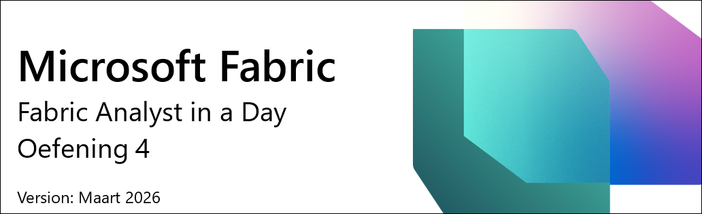

# Microsoft Fabric - Fabric Analyst in a Day - Oefening 4

# Inhoudsopgave

- Inleiding

- Dataflow Gen2

    - Taak 1: SharePoint-query's kopiëren naar Dataflow

    - Taak 2: SharePoint-verbinding aanmaken

    - Taak 3: Gegevensbestemming configureren voor de People-query

    - Taak 4: SharePoint Dataflow publiceren en hernoemen

    - Taak 5: Snowflake-query's kopiëren naar Dataflow

    - Taak 6: Verbinding aanmaken met Snowflake

    - Taak 7: Gegevensbestemming configureren voor de Supplier- en PO-query's

    - Taak 8: Snowflake Dataflow hernoemen en publiceren

- Shortcut naar interne Lakehouse

    - Taak 9: Hoe u een Shortcut naar Dataverse aanmaakt

    - Taak 10: Een Shortcut naar een Lakehouse aanmaken

- Referenties

# Inleiding

In ons scenario zijn leveranciersgegevens opgeslagen in Snowflake, klantgegevens in Dataverse, en medewerkergegevens in SharePoint. Al deze gegevensbronnen worden op verschillende tijdstippen bijgewerkt. Om het aantal gegevensvernieuwingen voor Dataflows te minimaliseren, gaan we afzonderlijke Dataflows aanmaken voor de Snowflake- en SharePoint-gegevensbronnen.

>**Opmerking:** Meerdere gegevensbronnen worden ondersteund binnen één enkele Dataflow.

Het IT-team heeft al een koppeling met Dataverse tot stand gebracht en de benodigde gegevenstransformaties toegepast, in navolging van die in het Power BI Desktop-bestand. Ze hebben deze gegevens ingeladen in de Lakehouse in de Admin-werkruimte en ons toegang verleend tot de tabellen. We gaan een shortcut aanmaken naar de tabellen die het IT-team van de Lakehouse heeft aangemaakt.

Aan het einde van dit lab heeft u geleerd:

- Hoe u verbinding maakt met SharePoint via Dataflow Gen2 en gegevens inlaadt in Lakehouse

- Hoe u verbinding maakt met Snowflake via Dataflow Gen2 en gegevens inlaadt in Lakehouse

- Hoe u gegevens inlaadt vanuit een gedeelde Lakehouse

# Dataflow Gen2

## Taak 1: SharePoint-query's kopiëren naar Dataflow

1. Laten we teruggaan naar de Fabric-werkruimte, **FAIAD_<inject key="Deployment ID" enableCopy="false"/>** **(1)** die u heeft aangemaakt in Lab 2, Taak 8.

2. Selecteer de optie **+ Nieuw item (2)** in de linkerbovenhoek.

3. Selecteer onder de sectie **Gegevens ophalen (3)** de optie **Gegevensstroom Gen2 (4)**.

    

    Laat de standaardnaam staan en zorg dat "Enable Git integration" is aangevinkt. Selecteer vervolgens **Create**. U wordt doorgestuurd naar de **Dataflow-pagina**. De interface van Dataflow Gen2 lijkt op Power Query in Power BI Desktop. We kunnen query's vanuit Power BI Desktop kopiëren naar Dataflow Gen2. Laten we dit uitproberen.

4. Als u het bestand nog niet heeft geopend, open dan **FAIAD.pbix** in de map **Reports** op het bureaublad van uw labomgeving.

5. Selecteer in het lint **Start -> Gegevens transformeren**. Het Power Query-venster wordt geopend. Zoals u in de vorige labs heeft opgemerkt, zijn de query's in het linkerdeelvenster georganiseerd per gegevensbron.

6. Selecteer in het linkerdeelvenster, onder de map SharePointData, de query **People**.

7. **Klik met de rechtermuisknop** en selecteer **Kopiëren**.

    

8. Navigeer terug naar het **Dataflow-scherm** in de browser.

9. Voer in het **Dataflow-deelvenster** **Ctrl+V** in (op dit moment wordt plakken via de rechtermuisknop niet ondersteund). Als u een Mac-apparaat gebruikt, gebruik dan Cmd+V om te plakken.

    

    >**Opmerking:** Als u in de labomgeving werkt, selecteer dan het beletselteken rechtsbovenaan het scherm. Gebruik de schuifregelaar om **VM Native Clipboard** **in te schakelen**. Selecteer OK in het dialoogvenster. Nadat u de query's heeft geplakt, kunt u deze optie weer uitschakelen.

    

    U ziet dat de query is geplakt en beschikbaar is in het linkerdeelvenster. Omdat er nog geen verbinding met SharePoint is aangemaakt, wordt een waarschuwingsbericht weergegeven met het verzoek de verbinding te configureren.
    
    

## Taak 2: SharePoint-verbinding aanmaken

1. Selecteer **Verbinding configureren**.

    

2. Het dialoogvenster Verbinding maken met gegevensbron wordt geopend. Zorg er in de vervolgkeuzelijst **Verbinding** voor dat **Nieuwe verbinding maken** is geselecteerd.

3. **Verificatietype** moet zijn ingesteld op **Organisatieaccount**.

4. Selecteer **Verbinden**.

    >**Opmerking:** U wordt aangemeld met uw eigen referenties. Deze zijn anders dan die in de onderstaande schermafbeelding.

    

## Taak 3: Gegevensbestemming configureren voor de People-query

De verbinding is tot stand gebracht en u kunt de gegevens bekijken in het voorbeeldpaneel. U kunt de Applied Steps van de query's vrij bekijken. Nu moeten we de People-gegevens inladen in de Lakehouse.

1. Selecteer de query **People (1)**.

2. Selecteer in het lint **Start -> Query (2) -> Gegevensbestemming toevoegen (3) -> Lakehouse (4)**.

    

3. Het dialoogvenster Verbinding maken met gegevensbestemming wordt geopend. We moeten een nieuwe verbinding met de Lakehouse aanmaken. Met **Nieuwe verbinding maken** geselecteerd in de vervolgkeuzelijst Connection en **Verificatietype** ingesteld op **Organisatieaccount**, selecteert u **Volgende**.

    

4. Het dialoogvenster Bestemmingsdoel kiezen wordt geopend. Zorg ervoor dat het keuzerondje **Nieuwe tabel** is geselecteerd, omdat we een nieuwe tabel aanmaken.

5. We willen de tabel aanmaken in de Lakehouse die we eerder hebben aangemaakt. Navigeer in het linkerdeelvenster naar **Lakehouse -> FAIAD_<inject key="Deployment ID" enableCopy="false"/>**.

6. Selecteer **lh_FAIAD -> dbo**

7. Laat de tabelnaam staan als **People**

8. Selecteer **Volgende**.

    

9. Het dialoogvenster Bestemmingsinstellingen kiezen wordt geopend. Zorg ervoor dat "**Automatische instellingen gebruiken**" is **ingeschakeld**.

    >**Opmerking:** U kunt de automatische instellingen uitschakelen en ziet dan opties voor de updatewijze en schema-opties. Nadat u dit heeft verkend, zorg dan dat "**Use automatic settings**" weer is **ingeschakeld**.

10. Selecteer **Instellingen opslaan**.

    

## Taak 4: SharePoint Dataflow publiceren en hernoemen

1. U wordt teruggestuurd naar het **Power Query-venster**. Let op de rechteronderhoek: de gegevensbestemming is ingesteld op **Lakehouse (1)**.

2. Selecteer in de linkerbovenhoek **Opslaan en uitvoeren (2)**. Zodra u de melding ziet dat een vernieuwing is gestart, kunt u de dataflow sluiten **(3)**.

    

    >**Opmerking:** U wordt teruggestuurd naar de werkruimte **FAIAD_<inject key="Deployment ID" enableCopy="false"/>**. Het kan even duren voordat de Dataflow klaar is met uitvoeren.

3. **Dataflow 1** is de dataflow waaraan we hebben gewerkt. Laten we deze hernoemen voordat we verdergaan. Klik op het **beletselteken (…)** naast Dataflow 1. Selecteer **Instellingen** (terwijl de Dataflow wordt uitgevoerd, heeft u geen toegang tot de instellingen).

    

4. Het venster Dataflow-instellingen wordt geopend. Wijzig de **naam** in **df_People_SharePoint (1)**.

5. Voeg in het tekstvak **Description** toe: **Dataflow to ingest People data from SharePoint to Lakehouse (2)**.

6. Sluit het instellingenvenster als u klaar bent **(3)**.

    

    U wordt teruggestuurd naar de werkruimte **FAIAD_<inject key="Deployment ID" enableCopy="false"/>**.

7. Selecteer **lh_FAIAD** om naar de Lakehouse te navigeren.

8. Zorg ervoor dat u de Lakehouse-weergave gebruikt (niet de SQL analytics endpoint).

9. U ziet dat de tabel **People** nu beschikbaar is in de Lakehouse.
         
    

    >**Opmerking:** Als u de nieuw aangemaakte tabellen niet ziet, selecteer dan het beletselteken naast Tables en selecteer refresh om de tabellen te vernieuwen.

## Taak 5: Snowflake-query's kopiëren naar Dataflow

1. Laten we teruggaan naar de Fabric-werkruimte, **FAIAD_<inject key="Deployment ID" enableCopy="false"/> (1)**.

2. Selecteer de optie **+ Nieuw item (2)** in de linkerbovenhoek.

3. Selecteer onder Aanbevolen items de optie **Gegevensstroom Gen2 (3)**.

    

    Laat de standaardnaam staan en zorg dat "Enable Git integration" is aangevinkt. Selecteer vervolgens **Create**. Als u een bericht ontvangt met de melding "A dataflow with this name already exists", wijzig de naam dan in **Dataflow 2**. U wordt doorgestuurd naar de **Dataflow-pagina**. Nu we bekend zijn met Dataflow, gaan we de query's vanuit Power BI Desktop kopiëren naar Dataflow.

4. Als u het bestand nog niet heeft geopend, open dan **FAIAD.pbix** in de map **Reports** op het bureaublad van uw labomgeving.

5. Selecteer in het lint **Gegevensstroom Gen2 (3)**. Het Power Query-venster wordt geopend. Zoals u in de vorige labs heeft opgemerkt, zijn de query's in het linkerdeelvenster georganiseerd per gegevensbron.

6. Selecteer in het linkerdeelvenster, onder de map **SnowflakeData**, via **Ctrl+Select** of Shift+Select de volgende query's:

    1. SupplierCategories

    2. Suppliers

    3. Supplier

    4. PO

    5. PO Line Items

7. **Klik met de rechtermuisknop** en selecteer **Kopiëren**.

    

8. Navigeer terug naar de **browser**.

9. Selecteer in het **Dataflow-deelvenster** het **middelste deelvenster** en voer **Ctrl+V** in (op dit moment wordt plakken via de rechtermuisknop niet ondersteund). Als u een Mac-apparaat gebruikt, gebruik dan Cmd+V om te plakken.

    >**Opmerking:** Als u in de labomgeving werkt, selecteer dan het **beletselteken (…)** rechtsbovenaan het scherm. Gebruik de schuifregelaar om **VM Native Clipboard** **in te schakelen**. Selecteer OK in het dialoogvenster. Nadat u de query's heeft geplakt, kunt u deze optie weer uitschakelen.

    

## Taak 6: Verbinding aanmaken met Snowflake

U ziet dat de vijf query's zijn geplakt en dat u nu het Query's-paneel aan de linkerkant heeft. Omdat er nog geen verbinding voor Snowflake is aangemaakt, wordt een waarschuwingsbericht weergegeven met het verzoek de verbinding te configureren.

1. Selecteer **Verbinding configureren**.

    

2. Het dialoogvenster Verbinding maken met gegevensbron wordt geopend. Zorg er in de vervolgkeuzelijst **Verbinding** voor dat **Nieuwe verbinding maken** is geselecteerd.

3. **Authentication kind** moet zijn ingesteld op **Snowflake**.

4. Voer de **Snowflake Username** en het **Snowflake Password** in zoals hieronder vermeld. Gebruik deze referenties om alle tabellen onder **Snowflake** te verbinden met Snowflake en selecteer vervolgens **Verbinden**.

    - Snowflake Username: <inject key="SnowFlake Username" enableCopy="false" />

    - Snowflake Password: <inject key="SnowFlake Password" enableCopy="false" />

        >**Opmerking**: Als u problemen ondervindt bij het verbinden met Snowflake via de referenties uit de omgevingsdetails, gebruik dan de onderstaande referenties.

    - **Snowflake Username:** SNOWFLAKE_BACKUP

    - **Snowflake Password:** 8UpfRpExVDXv2AC1

5. Selecteer **Verbinden**.

    

    De verbinding is tot stand gebracht en u kunt de gegevens bekijken in het voorbeeldpaneel. U kunt de Applied Steps van de query's vrij bekijken. De query Suppliers bevat de gegevens van leveranciers, en SupplierCategories bevat, zoals de naam aangeeft, alle leverancierscategorieën. Deze twee tabellen worden samengevoegd om de dimensie Supplier aan te maken, met de kolommen die we nodig hebben. Op vergelijkbare wijze worden PO Line Items en PO samengevoegd om de feitentabel PO aan te maken. Nu moeten we de Supplier- en PO-gegevens inladen in de Lakehouse.

## Taak 7: Gegevensbestemming configureren voor de Supplier- en PO-query's

1. Selecteer de query **Supplier (1)**.

2. Selecteer in het lint **Start (2) -> Query (3) -> Gegevensbestemming toevoegen (4) -> Lakehouse (5)**.

    

3. Het dialoogvenster Verbinding maken met gegevensbestemming wordt geopend. Selecteer in de vervolgkeuzelijst **Connection** de optie **Lakehouse odl_user_<inject key="Deployment ID" enableCopy="false"/> (none)**.

4. Selecteer **Volgende**.

    

5. Het dialoogvenster Bestemmingsdoel kiezen wordt geopend. Zorg ervoor dat het keuzerondje **New table** is geselecteerd, omdat we een nieuwe tabel aanmaken.

6. We willen de tabel aanmaken in de Lakehouse die we eerder hebben aangemaakt. Navigeer in het linkerdeelvenster naar **Lakehouse -> FAIAD_<inject key="Deployment ID" enableCopy="false"/>**.

7. Selecteer **lh_FAIAD -> dbo**

8. Laat de tabelnaam staan als **Supplier**

9. Selecteer **Volgende**.

    

10. Het dialoogvenster Bestemmingsinstellingen kiezen wordt geopend. We gebruiken de automatische instellingen, omdat hiermee een volledige update van de gegevens wordt uitgevoerd. Bovendien worden kolommen indien nodig hernoemd. Selecteer **Instellingen opslaan*.

    

11. U wordt teruggestuurd naar het **Power Query-venster**. Let op de rechteronderhoek: **Data destination** is ingesteld op **Lakehouse**. Configureer op vergelijkbare wijze **de gegevensbestemming voor de PO-query**. Zodra dit is gedaan, moet de **PO**-query **Data destination** hebben ingesteld op **Lakehouse**, zoals weergegeven in de onderstaande schermafbeelding.

    

## Taak 8: Snowflake Dataflow hernoemen en publiceren

1. Selecteer bovenaan het scherm de **pijl naast Dataflow 2 (de naam kan anders zijn)** om te hernoemen.

2. Wijzig in het dialoogvenster de naam in **df_Supplier_Snowflake**.

3. Klik op **Enter** om de naamswijziging op te slaan.

    

4. Selecteer in de linkerbovenhoek **Opslaan en uitvoeren (1)**. Zodra u de melding ziet dat een vernieuwing is gestart, kunt u de dataflow sluiten **(2)**.

    

    U wordt teruggestuurd naar de werkruimte **FAIAD_<inject key="Deployment ID" enableCopy="false"/>**. Het kan even duren voordat de dataflow is gepubliceerd.

5. Selecteer **lh_FAIAD** om naar de Lakehouse te navigeren.

6. Zorg ervoor dat u de Lakehouse-weergave gebruikt (niet de SQL analytics endpoint).

7. U ziet dat de tabellen **PO** en **Supplier** nu beschikbaar zijn in de Lakehouse.
         
    

    >**Opmerking:** Als u de nieuw aangemaakte tabellen niet ziet, selecteer dan het beletselteken naast Tables en selecteer refresh om de tabellen te vernieuwen.

    Nu gaan we een shortcut aanmaken om gegevens vanuit Dataverse in te laden.

# Shortcut naar interne Lakehouse

## Taak 9: Hoe u een Shortcut naar Dataverse aanmaakt

U bevindt zich in de Lakehouse **lh_FAIAD**. Zorg ervoor dat u de Lakehouse-weergave gebruikt (niet de SQL analytics endpoint).

1. Selecteer in het **Explorer**-paneel het **beletselteken** naast **Tables**.

2. Selecteer **Nieuwe snelkoppeling**.

    

3. Het dialoogvenster New shortcut wordt geopend. Selecteer onder **External sources** de optie **Dataverse**.

    >**Opmerking:** In het vorige lab hebben we vergelijkbare stappen gevolgd om een shortcut naar Azure Data Lake Storage Gen2 aan te maken.

    

4. **Selecteer Nieuwe verbinding (1)**; het dialoogvenster Verbindingsinstellingen wordt geopend. Voer **org6c18814a.crm.dynamics.com (2)** in als het **Environment domain**.

5. Laat **Verificatietype** staan op **Organisatieaccount (3)**.

6. Selecteer **Aanmelden** als u nog niet bent aangemeld.

    

7. Selecteer in het aanmeldingsvenster het **gebruikersaccount** dat u voor deze labs heeft gebruikt.

    >**Opmerking:** Uw account zal afwijken van de onderstaande schermafbeelding.

    

8. Selecteer **Volgende** in het dialoogvenster Verbindingsinstellingen.

    U wordt doorgestuurd naar een dialoogvenster waar u de verschillende bucket/mappen vanuit Dataverse kunt selecteren. U ziet dat er veel verschillende buckets beschikbaar zijn. We zouden de benodigde bucket(s) kunnen selecteren en het proces volgen zoals in Lab 3 (Visual query gebruiken om gegevens te transformeren en weergaven aan te maken). We zouden ook Dataflow Gen2 kunnen gebruiken, zoals eerder in dit lab, om verbinding te maken met SharePoint.

    In ons scenario heeft het IT-team al een koppeling met Dataverse tot stand gebracht en de benodigde gegevenstransformaties toegepast, in navolging van die in het Power BI Desktop-bestand. Ze hebben deze gegevens ingeladen in de Lakehouse in de Admin-werkruimte en ons toegang verleend tot de tabel(len). Omdat ons IT-team al het zware werk heeft gedaan, kunnen we een shortcut aanmaken naar deze Lakehouse in de Admin-werkruimte.

9. Selecteer **Annuleren** in het dialoogvenster **Nieuwe snelkoppeling** om terug te gaan naar de Lakehouse.

    

## Taak 10: Een Shortcut naar een Lakehouse aanmaken

1. Selecteer in het **Explorer**-paneel het **beletselteken** naast **Tables**.

2. Selecteer **Nieuwe snelkoppeling**.

    

3. Het dialoogvenster Nieuwe snelkoppeling wordt geopend. Selecteer de optie **Microsoft OneLake** onder Internal sources.

    

4. Selecteer **lh_dataverse**.

5. Selecteer **Volgende**.

    

6. Vouw in het linkerdeelvenster **lh_dataverse -> Tables** uit. U ziet dat de IT-beheerder toegang heeft verleend tot de tabel Customer.

7. Selecteer **Customer**.

8. Selecteer **Volgende**.

    

9. Selecteer **Create** in het volgende dialoogvenster. U wordt teruggestuurd naar de Lakehouse lh_FAIAD.

    

10. Let op in het **Explorer**-paneel aan de linkerkant: de nieuwe tabel **Customer** is aangemaakt.

11. Selecteer de tabel **Customer** om de gegevens te bekijken in het voorbeeldpaneel.

    

    We hebben met succes een shortcut naar een andere Lakehouse aangemaakt.

    We hebben nu alle benodigde gegevens ingeladen in onze Lakehouse. In het volgende lab plannen we een vernieuwing voor onze SharePoint Dataflow.

# Referenties

Fabric Analyst in a Day (FAIAD) introduceert u in een aantal van de belangrijkste functies die beschikbaar zijn in Microsoft Fabric. In het menu van de service vindt u in de sectie Help (?) koppelingen naar uitstekende bronnen.

Hier zijn nog een paar bronnen die u helpen met uw volgende stappen in Microsoft Fabric.

- Lees de blogpost voor de volledige aankondiging van [Microsoft Fabric GA](https://aka.ms/Fabric-Hero-Blog-Ignite23)

- Verken Fabric via de [Guided Tour](https://aka.ms/Fabric-GuidedTour)

- Meld u aan voor de [gratis proefversie van Microsoft Fabric](https://aka.ms/try-fabric)

- Bezoek de [Microsoft Fabric-website](https://aka.ms/microsoft-fabric)

- Leer nieuwe vaardigheden door de [Fabric Learning-modules](https://aka.ms/learn-fabric) te verkennen

- Raadpleeg de [technische documentatie van Fabric](https://aka.ms/fabric-docs)

- Lees het [gratis e-book over aan de slag gaan met Fabric](https://aka.ms/fabric-get-started-ebook)

- Word lid van de [Fabric-community](https://aka.ms/fabric-community) om uw vragen te stellen, feedback te delen en van anderen te leren

Lees de uitgebreidere aankondigingsblogs over de Fabric-ervaringen:

- [Blog over de Data Factory-ervaring in Fabric](https://aka.ms/Fabric-Data-Factory-Blog)

- [Blog over de Synapse Data Engineering-ervaring in Fabric](https://aka.ms/Fabric-DE-Blog)

- [Blog over de Synapse Data Science-ervaring in Fabric](https://aka.ms/Fabric-DS-Blog)

- [Blog over de Synapse Data Warehousing-ervaring in Fabric](https://aka.ms/Fabric-DW-Blog)

- [Blog over de Synapse Real-Time Analytics-ervaring in Fabric](https://aka.ms/Fabric-RTA-Blog)

- [Aankondigingsblog voor Power BI](https://aka.ms/Fabric-PBI-Blog)

- [Blog over de Data Activator-ervaring in Fabric](https://aka.ms/Fabric-DA-Blog)

- [Blog over beheer en governance in Fabric](https://aka.ms/Fabric-Admin-Gov-Blog)

- [Blog over OneLake in Fabric](https://aka.ms/Fabric-OneLake-Blog)

- [Blog over de integratie van Dataverse en Microsoft Fabric](https://aka.ms/Dataverse-Fabric-Blog)

© 2026 Microsoft Corporation. Alle rechten voorbehouden.

Door gebruik te maken van deze demo/dit lab gaat u akkoord met de volgende voorwaarden:

De technologie/functionaliteit die in deze demo/dit lab wordt beschreven, wordt door Microsoft Corporation aangeboden met als doel uw feedback te verzamelen en u een leerervaring te bieden. U mag de demo/het lab uitsluitend gebruiken om dergelijke technologiefuncties en -functionaliteit te evalueren en feedback aan Microsoft te geven. U mag het niet voor enig ander doel gebruiken. U mag deze demo/dit lab of enig deel daarvan niet wijzigen, kopiëren, distribueren, verzenden, weergeven, uitvoeren, reproduceren, publiceren, licentiëren, er afgeleide werken van maken, overdragen of verkopen.

HET KOPIËREN OF REPRODUCEREN VAN DE DEMO/HET LAB (OF EEN DEEL DAARVAN) NAAR ENIGE ANDERE SERVER OF LOCATIE VOOR VERDERE REPRODUCTIE OF VERDISTRIBUTIE IS UITDRUKKELIJK VERBODEN.

DEZE DEMO/DIT LAB BIEDT BEPAALDE SOFTWARE-TECHNOLOGIE-/PRODUCTFUNCTIES EN -FUNCTIONALITEIT, INCLUSIEF MOGELIJK NIEUWE FUNCTIES EN CONCEPTEN, IN EEN GESIMULEERDE OMGEVING ZONDER COMPLEXE INSTALLATIE OF CONFIGURATIE VOOR HET HIERBOVEN BESCHREVEN DOEL. DE TECHNOLOGIE/CONCEPTEN IN DEZE DEMO/DIT LAB VERTEGENWOORDIGEN MOGELIJK NIET DE VOLLEDIGE FUNCTIEFUNCTIONALITEIT EN WERKEN MOGELIJK NIET OP DEZELFDE MANIER ALS EEN DEFINITIEVE VERSIE. WE BRENGEN MOGELIJK OOK GEEN DEFINITIEVE VERSIE VAN DERGELIJKE FUNCTIES OF CONCEPTEN UIT. UW ERVARING MET HET GEBRUIK VAN DERGELIJKE FUNCTIES EN FUNCTIONALITEIT IN EEN FYSIEKE OMGEVING KAN OOK ANDERS ZIJN.

**FEEDBACK**. Als u feedback geeft over de technologiefuncties, -functionaliteit en/of -concepten die in deze demo/dit lab worden beschreven aan Microsoft, verleent u Microsoft het recht om uw feedback op welke manier dan ook en voor welk doel dan ook te gebruiken, te delen en te commercialiseren, kosteloos. U verleent ook aan derden, kosteloos, alle octrooirechten die nodig zijn voor hun producten, technologieën en diensten om gebruik te maken van of te koppelen aan specifieke onderdelen van een Microsoft-software of -service die de feedback bevat. U geeft geen feedback die onderworpen is aan een licentie die vereist dat Microsoft zijn software of documentatie aan derden in licentie geeft omdat we uw feedback daarin opnemen. Deze rechten blijven van kracht na het verstrijken van deze overeenkomst.

MICROSOFT CORPORATION WIJST HIERBIJ ALLE GARANTIES EN VOORWAARDEN MET BETREKKING TOT DE DEMO/HET LAB AF, INCLUSIEF ALLE GARANTIES EN VOORWAARDEN VAN VERKOOPBAARHEID, UITDRUKKELIJK, IMPLICIET OF WETTELIJK, GESCHIKTHEID VOOR EEN BEPAALD DOEL, EIGENDOMSRECHT EN NIET-INBREUK. MICROSOFT GEEFT GEEN GARANTIES OF VERKLARINGEN MET BETREKKING TOT DE NAUWKEURIGHEID VAN DE RESULTATEN, DE UITVOER DIE VOORTVLOEIT UIT HET GEBRUIK VAN DE DEMO/HET LAB, OF DE GESCHIKTHEID VAN DE INFORMATIE IN DE DEMO/HET LAB VOOR ENIG DOEL.

**DISCLAIMER**

Deze demo/dit lab bevat slechts een deel van de nieuwe functies en verbeteringen in Microsoft Power BI. Sommige functies kunnen veranderen in toekomstige versies van het product. In deze demo/dit lab leert u over enkele, maar niet alle, nieuwe functies.
