# Microsoft Fabric - Fabric Analyst in a Day - Oefening 6

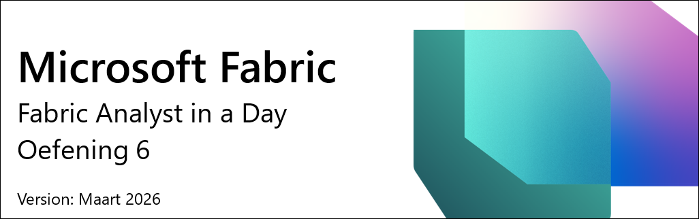

# Inhoudsopgave

- Inleiding

- Lakehouse – Gegevens analyseren

    - Taak 1: Gegevens opvragen met SQL

    - Taak 2: T-SQL-resultaat visualiseren

- Lakehouse – Semantisch modelleren

    - Taak 3: Semantisch model aanmaken

    - Taak 4: Relaties aanmaken

    - Taak 5: Metingen aanmaken

    - Taak 6: Optioneel gedeelte – Relaties aanmaken

    - Taak 7: Optioneel gedeelte – Metingen aanmaken

- Referenties

# Inleiding

We hebben gegevens uit verschillende bronnen ingeladen in de Lakehouse. In dit lab werkt u met het semantisch model. Doorgaans voerden we modelleringsactiviteiten zoals het aanmaken van relaties, toevoegen van metingen, enzovoort uit in Power BI Desktop. Hier leren we hoe u deze modelleringsactiviteiten uitvoert in de service.

Aan het einde van dit lab heeft u geleerd:

- SQL-weergave gebruiken in SQL analytics endpoint

- Hoe u een semantisch model aanmaakt

# Lakehouse – Gegevens analyseren

## Taak 1: Gegevens opvragen met SQL

1. Laten we teruggaan naar de Fabric-werkruimte, **FAIAD_<inject key="Deployment ID" enableCopy="false"/>**, die u heeft aangemaakt in Lab 2, Taak 8.

2. Als u dat wilt, **minimaliseert u de taakstroom** om de volledige lijst met items te bekijken.

3. U ziet drie elementen die zijn gekoppeld aan de lh_FAIAD – Lakehouse, Semantic model en SQL endpoint. We hebben de Lakehouse verkend en visuele query's aangemaakt met behulp van SQL analytics endpoint in een eerder lab. Selecteer de **FAIAD_<inject key="Deployment ID" enableCopy="false"/>** in de linkernavigatie en kies de optie **lh_FAIAD SQL analytics endpoint** om deze optie verder te verkennen. U wordt doorgestuurd naar de **SQL-weergave** van de Explorer.

    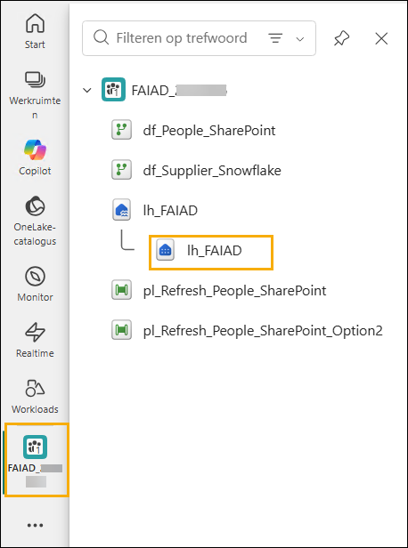

    Als u de gegevens wilt verkennen voordat u een datamodel aanmaakt, kunt u daarvoor SQL gebruiken. Er zijn twee opties om SQL te gebruiken. Optie één is de visuele query, die we in het eerdere lab hebben gebruikt. Optie twee is het schrijven van T-SQL-code. Dit is een ontwikkelaarsvriendelijke optie. Laten we dit verkennen.

    Stel dat u snel de verkochte Units per Supplier wilt opzoeken met behulp van SQL.

    In de Lakehouse SQL analytics endpoint ziet u in het linkerdeelvenster de tabellen. Als u de tabellen uitvouwt, kunt u de kolommen bekijken waaruit de tabel bestaat. Er zijn ook opties om SQL views, functies en stored procedures aan te maken. Als u een SQL-achtergrond heeft, kunt u deze opties gerust verkennen. Laten we proberen een eenvoudige SQL-query te schrijven.

4. Selecteer **New SQL query** in het **bovenste menu** of klik op **New SQL query** in het midden van het scherm. U wordt doorgestuurd naar de SQL query-weergave.

    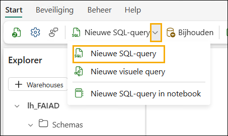

5. Plak de **onderstaande SQL-query** in het **queryvenster**. Deze query retourneert de units per leveranciersnaam. De query koppelt de Sales-tabel aan de Product- en Supplier-tabellen om dit te bereiken.

   ```
   SELECT su.SupplierName, SUM(Quantity) as Units
   FROM dbo.Sales s
   JOIN dbo.Product p on p.StockItemID = s.StockItemID
   JOIN dbo.Supplier su on su.SupplierID = p.SupplierID
   GROUP BY su.SupplierName
   ```

6. Klik op **Run** in het menu van de SQL-editor om de resultaten te bekijken.

7. U ziet dat er een optie is om deze query op te slaan als een View door **Save as view** te selecteren.

8. In het **linker** **Explorer**-deelvenster, onder de sectie **Queries**, ziet u dat deze query is opgeslagen onder **My queries** als **SQL query 1**. Dit biedt de mogelijkheid om de query een andere naam te geven en op te slaan voor toekomstig gebruik. Er is ook een optie om query's te bekijken die met u zijn gedeeld via de map **Shared queries**.

    >**Opmerking:** Visuele query's die u in eerdere labs heeft aangemaakt, zijn ook beschikbaar in de map My queries.

    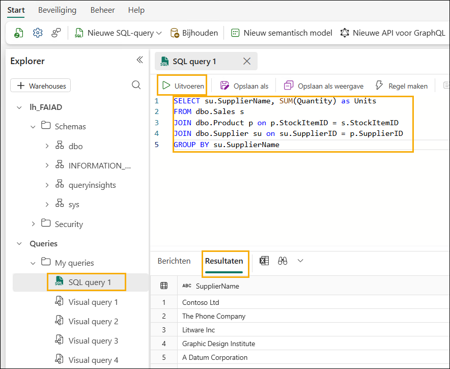

## Taak 2: T-SQL-resultaat visualiseren

1. We kunnen het resultaat van deze query ook visualiseren. **Markeer de query** in het querydeelvenster.

2. Selecteer in het menu van het resultatendeelvenster het vervolgkeuzepictogram **-> Visualize results**.

    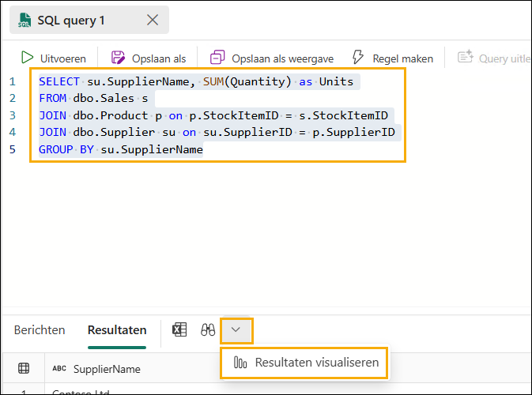

3. Het dialoogvenster **Visualize results** wordt geopend. Selecteer **Continue**.

    Het dialoogvenster Visualize results ziet eruit als de rapportweergave van Power BI Desktop. Het bevat alle functies die beschikbaar zijn in de rapportweergave van Power BI Desktop. U kunt de pagina opmaken, verschillende visuals selecteren, visuals opmaken, filters toevoegen, enzovoort. We zullen deze opties in deze cursus niet verder verkennen.

4. Vouw het **Data**-deelvenster uit en vouw **SQL query 1** uit.

5. Selecteer de velden **Supplier_Name** en **Units**. Er wordt een tabelvisualisatie aangemaakt.

    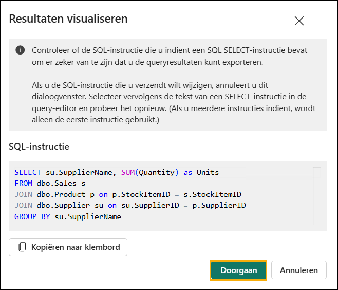

6. Wijzig het type visual in de sectie **Visualization** door de **Stacked column chart** te selecteren.

7. Selecteer **Save as report** rechtsonder in het scherm.

    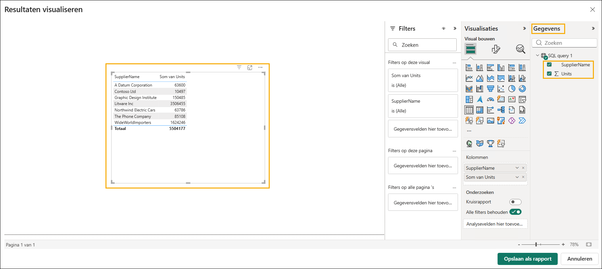

8. Het dialoogvenster Rapport opslaan wordt geopend. Typ **Units by Supplier** in het tekstvak **Enter a name for your report**.

9. Zorg ervoor dat de doelwerkruimte uw Fabric-werkruimte is, **FAIAD_<inject key="Deployment ID" enableCopy="false"/>**.

10. Selecteer **Save**.

    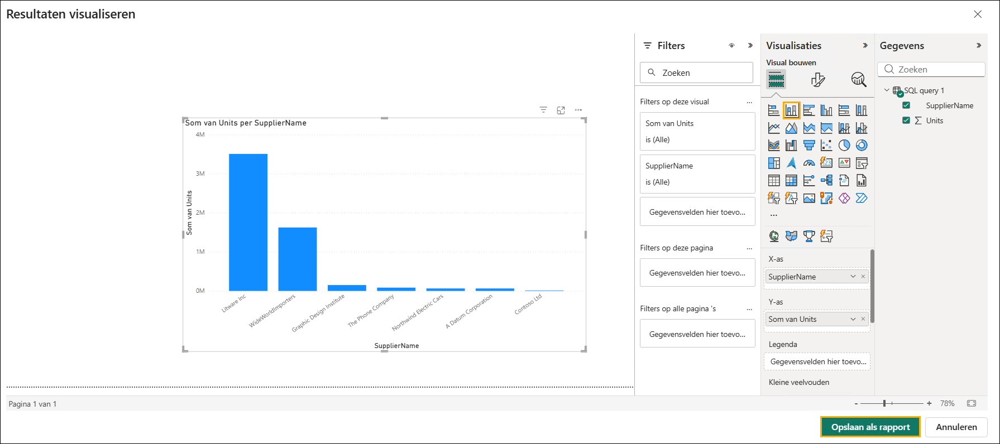

    U wordt teruggestuurd naar het SQL query-scherm.

# Lakehouse – Semantisch modelleren

## Taak 3: Semantisch model aanmaken

1. Selecteer **New semantic Model** in het menu van SQL analytics endpoint.

    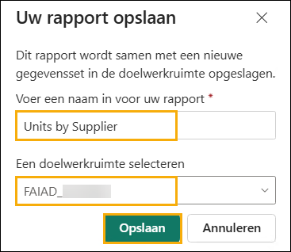

2. Het dialoogvenster **New semantic model** wordt geopend. Voer **sm_FAIAD** in als de naam van het Direct Lake semantisch model.

3. We hebben de optie om standaard een subset van de tabellen te selecteren. Vergeet niet dat we in het eerdere lab views hebben aangemaakt. We willen deze views opnemen in het model. Vouw het schema **dbo** uit; hier kunt u alle tabellen en views in uw lakehouse zien.

    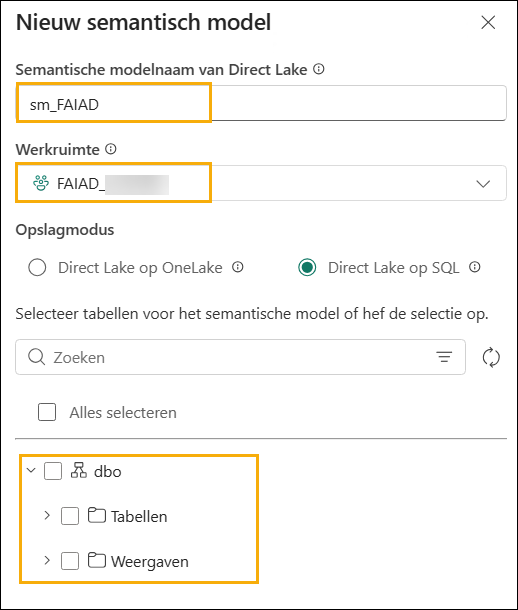

4. **Selecteer** de volgende tabellen/views:

    1. **Customer**

    2. **Date**

    3. **People**

    4. **PO**

    5. **Supplier**

    6. **Geo**

    7. **Product**

    8. **Reseller**

    9. **Sales**

5. Selecteer **Confirm**.

    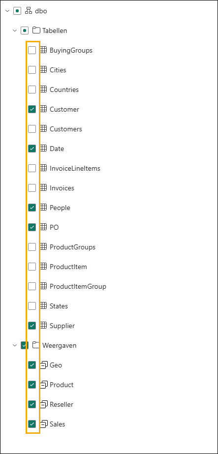

    U wordt doorgestuurd naar het nieuwe semantisch model met de geselecteerde tabellen. U kunt de tabellen naar behoefte **herschikken**. U ziet dat sommige tabellen (Geo, Reseller, Sales en Product) een waarschuwingssymbool rechtsboven op de tabel hebben. Dit is omdat het views zijn. Visuals die zijn aangemaakt met velden uit deze views, bevinden zich in Direct query-modus en niet in Direct Lake-modus.

    >**Opmerking:** Direct Lake-modus is sneller dan Direct query-modus.

## Taak 4: Relaties aanmaken

Als u momenteel niet in het zojuist aangemaakte semantisch model bevindt, laten we dan naar de juiste locatie navigeren.

1. Navigeer terug naar de **Fabric**-**werkruimte** en selecteer het semantisch model **sm_FAIAD**.

    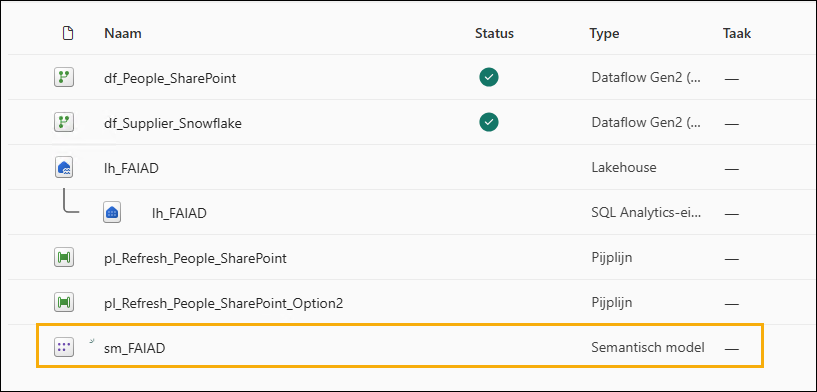

2. Klik op **Open semantic model**.

    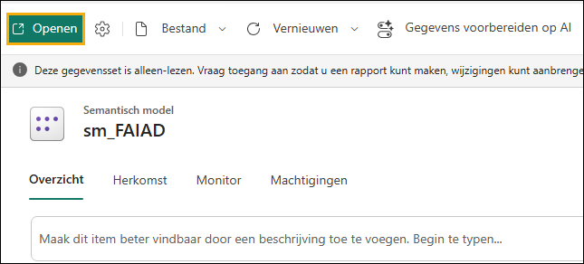

3. Zorg er in de rechterbovenhoek voor dat u zich in de **Editing**-modus bevindt.

    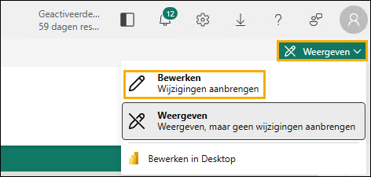

4. De eerste stap is het aanmaken van relaties tussen deze tabellen.

    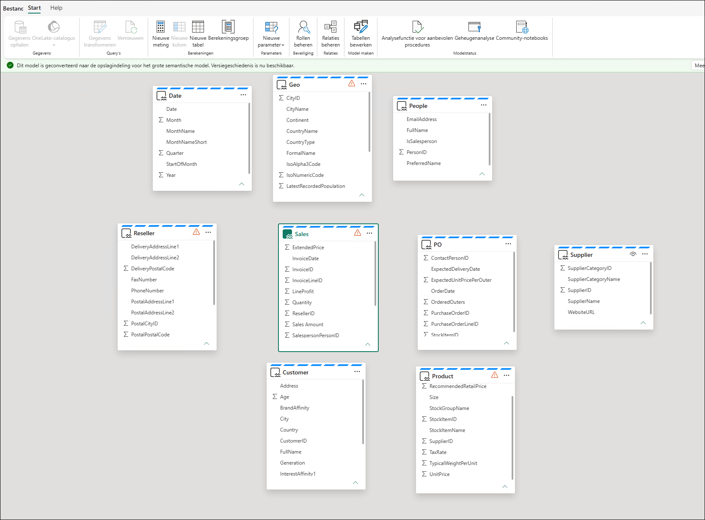

5. Laten we een relatie aanmaken tussen de tabellen Sales en Reseller. Selecteer **ResellerID** uit de tabel **Sales** en sleep het naar **ResellerID** in de tabel **Reseller**.

    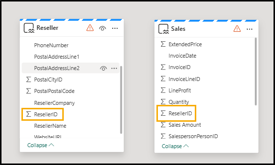

6. Het dialoogvenster Nieuwe relatie wordt geopend. Zorg ervoor dat **From table** **Sales** is en **Column** **ResellerID** is.

7. Zorg ervoor dat **To table** **Reseller** is en **Column** **ResellerID** is.

8. Zorg ervoor dat **Cardinality** **Many to one (*:1)** is.

9. Zorg ervoor dat **Cross filter direction** **Single** is.

10. Selecteer **Save**.

    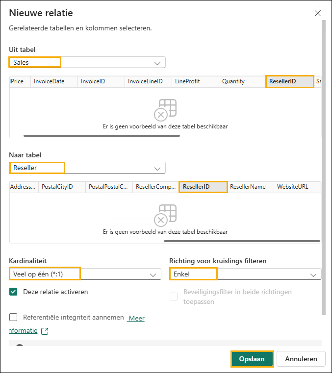

11. Maak op dezelfde manier een relatie aan tussen de tabellen Sales en Date. Selecteer **InvoiceDate** uit de tabel **Sales** en sleep het naar **Date** in de tabel **Date**.

12. Het dialoogvenster Nieuwe relatie wordt geopend. Zorg ervoor dat **From table** **Sales** is en **Column** **InvoiceDate** is.

13. Zorg ervoor dat **To table** **Date** is en **Column** **Date** is.

14. Zorg ervoor dat **Cardinality** **Many to one (*:1)** is.

15. Zorg ervoor dat **Cross filter direction** **Single** is.

16. Selecteer **Save**.

    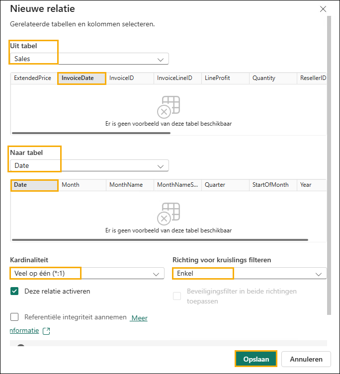

17. Maak op dezelfde manier een **veel-op-één**-relatie aan tussen de tabellen **Sales** en **Product**. Selecteer **StockItemID** uit de tabel **Sales** en **StockItemID** uit de tabel **Product**.

    >**Opmerking:** Al onze updates worden automatisch opgeslagen.

    **Controlepunt:** Uw model moet de drie relaties bevatten tussen de tabellen Sales en Reseller, Sales en Date, en Sales en Product, zoals weergegeven in de onderstaande schermafbeelding:

    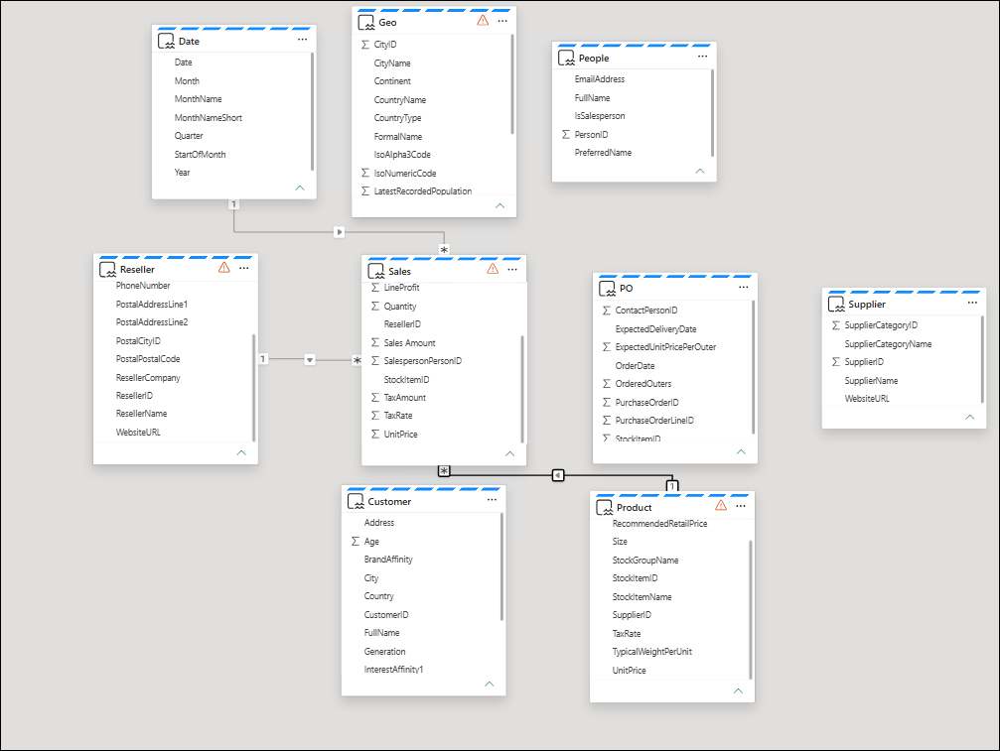

    Vanwege tijdgebrek zullen we niet alle relaties aanmaken. Als er tijd beschikbaar is, kunt u het optionele gedeelte aan het einde van het lab voltooien. Het optionele gedeelte beschrijft de stappen om de resterende relaties aan te maken.

## Taak 5: Metingen aanmaken

Laten we een aantal metingen toevoegen die we nodig hebben om het Sales-dashboard aan te maken.

1. Selecteer de tabel **Sales** in de modelweergave. We willen de metingen toevoegen aan de Sales-tabel.

2. Selecteer **Home -> New Measure** in het bovenste menu. U ziet dat de formulebalk wordt weergegeven.

3. Voer **Sales = SUM(Sales[Sales Amount])** in de **formulebalk** in.

4. Klik op het **vinkje** links van de formulebalk of klik op de knop **Enter**.

5. Vouw het deelvenster Properties aan de rechterkant uit.

6. Vouw de sectie **Formatting** uit.

7. Selecteer **Currency** in de vervolgkeuzelijst **Format**.

8. Stel Decimal places in op **0**.

    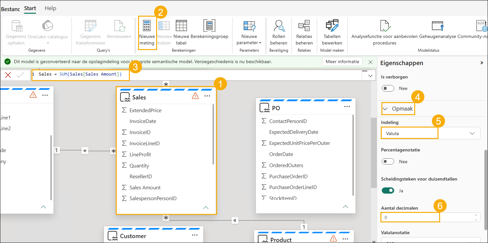

9. Selecteer met de tabel **Sales** geselecteerd in het bovenste menu **Home -> New Measure**. U ziet dat de formulebalk wordt weergegeven.

10. Voer **Units = SUM(Sales[Quantity])** in de **formulebalk** in.

11. Klik op het **vinkje** links van de formulebalk of klik op de knop **Enter**.

12. Vouw in het deelvenster Properties aan de rechterkant de sectie **Formatting** uit (het kan even duren voordat het deelvenster Properties wordt geladen).

13. Selecteer **Whole number** in de vervolgkeuzelijst **Format**.

14. Gebruik de schuifregelaar om **Thousands separator** in te stellen op **Yes**.

    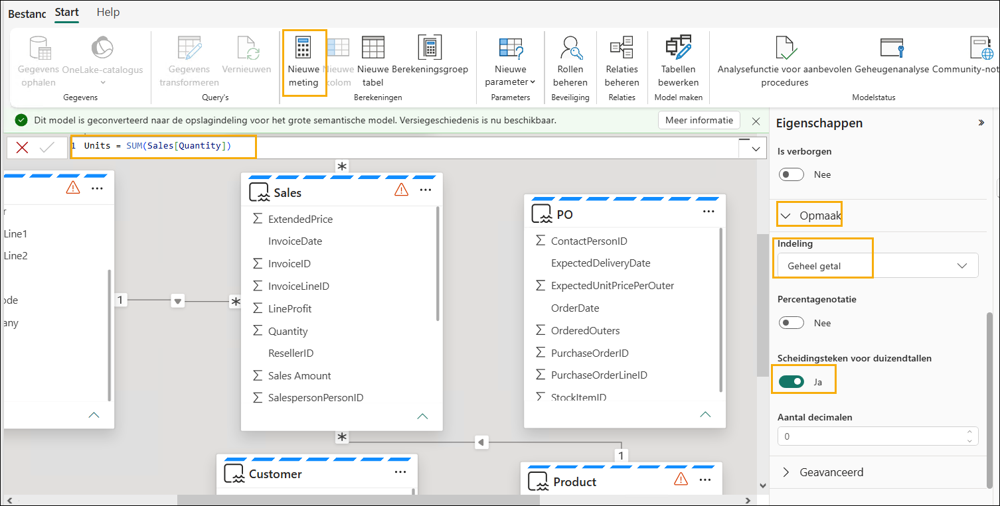

15. Selecteer met de tabel **Sales** geselecteerd in het bovenste menu **Home -> New Measure**. U ziet dat de formulebalk wordt weergegeven.

16. Voer **Sales Orders = DISTINCTCOUNT(Sales[InvoiceID])** in de **formulebalk** in.

17. Klik op het **vinkje** links van de formulebalk of klik op de knop **Enter**.

18. Vouw in het deelvenster Properties aan de rechterkant de sectie **Formatting** uit.

19. Selecteer **Whole number** in de vervolgkeuzelijst **Format**.

20. Gebruik de schuifregelaar om **Thousands separator** in te stellen op **Yes**.

    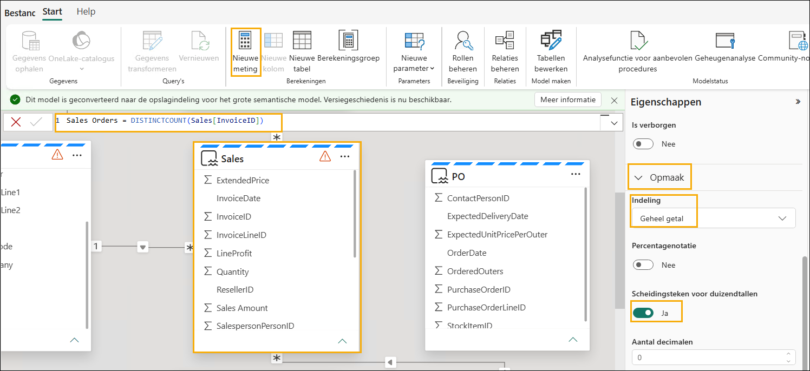

21. Selecteer in het **Data**-deelvenster (aan de rechterkant) **Model**. U ziet dat dit een weergave biedt waarmee u alle items in het semantisch model kunt ordenen.

22. Vouw **Semantic model -> Measures** uit om alle metingen te bekijken die u zojuist heeft aangemaakt.

23. U kunt ook **afzonderlijke tabellen uitvouwen** om de Columns, Hierarchies en Measures in elk ervan te bekijken.

    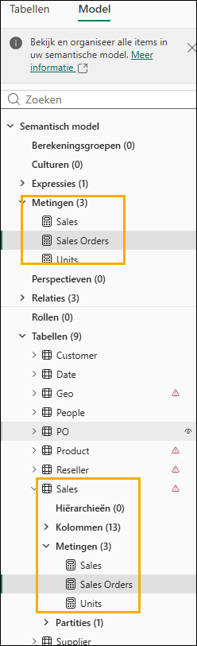

    Vanwege tijdgebrek zullen we ook niet alle metingen aanmaken. Als er tijd beschikbaar is, kunt u het optionele gedeelte aan het einde van het lab voltooien. Het optionele gedeelte beschrijft de stappen om de resterende metingen aan te maken.

    We hebben een semantisch model aangemaakt; de volgende stap is het aanmaken van een rapport. Dat doen we in het volgende lab.

## Taak 6: Optioneel gedeelte – Relaties aanmaken

Laten we de resterende relaties toevoegen.

1. Selecteer **Home -> Manage relationships** in het menu.

2. Het dialoogvenster Manage relationships wordt geopend. Selecteer **+** **New relationship**.

    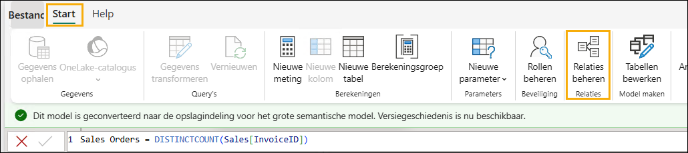

3. Het dialoogvenster Nieuwe relatie wordt geopend. Zorg ervoor dat **From table** **Sales** is en **Column** **SalespersonPersonID** is.

4. Zorg ervoor dat **To table** **People** is en **Column** **PersonID** is.

5. Zorg ervoor dat **Cardinality** **Many to one (*:1)** is.

6. Zorg ervoor dat **Cross-filter direction** **Single** is.

7. Selecteer **Save**. Het dialoogvenster Manage relationships wordt geopend met de nieuw toegevoegde relatie.

    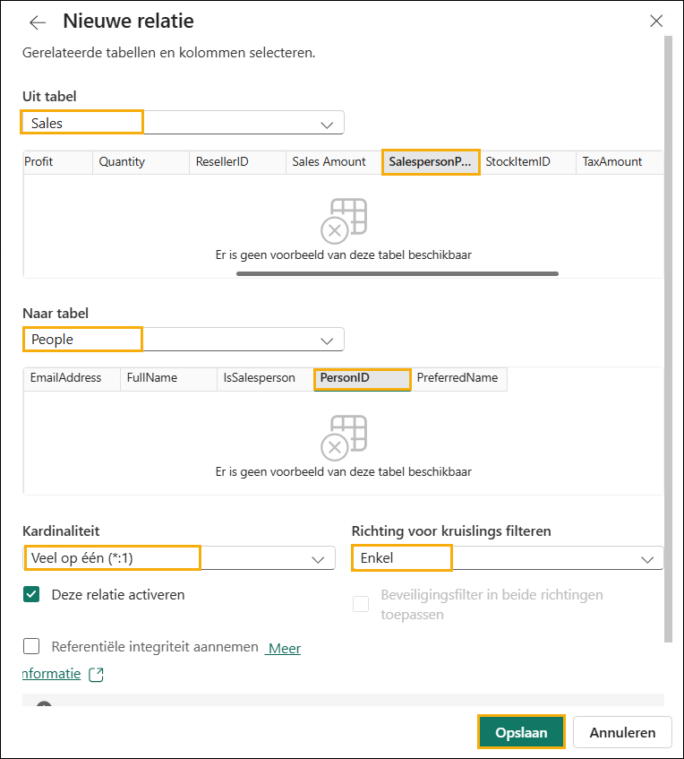

8. Laten we nu een relatie aanmaken tussen Product en Supplier. Selecteer **+** **New relationship**.

9. Zorg ervoor dat **From table** **Product** is en **Column** **SupplierID** is.

10. Zorg ervoor dat **To table** **Supplier** is en **Column** **SupplierID** is.

11. Zorg ervoor dat **Cardinality** **Many to one (*:1)** is.

12. Zorg ervoor dat **Cross-filter direction** **Both** is.

13. Selecteer **Save**.

    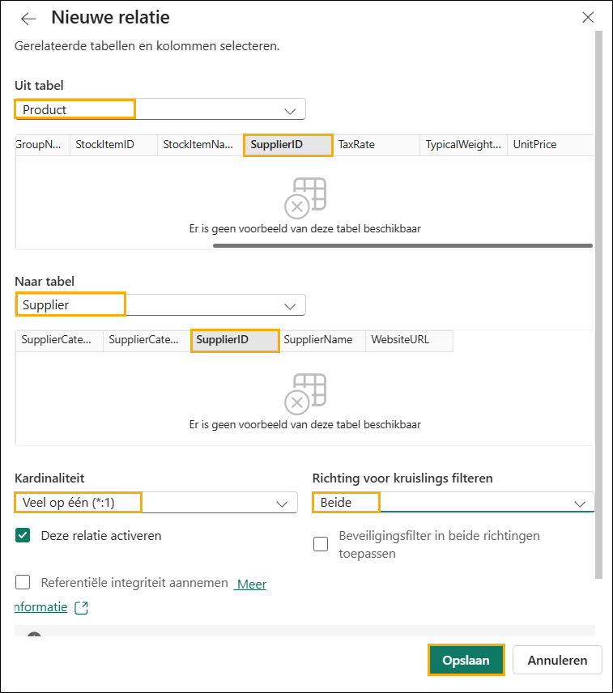

14. Laten we nu een relatie aanmaken tussen Reseller en Geo. Selecteer **+ New relationship**.

15. Het dialoogvenster Nieuwe relatie wordt geopend. Zorg ervoor dat **From table** **Reseller** is en **Column** **PostalCityID** is.

16. Zorg ervoor dat **To table** **Geo** is en **Column** **CityID** is.

17. Zorg ervoor dat **Cardinality** **Many to one (*:1)** is.

18. Zorg ervoor dat **Cross-filter direction** **Both** is.

19. Selecteer **Save**.

    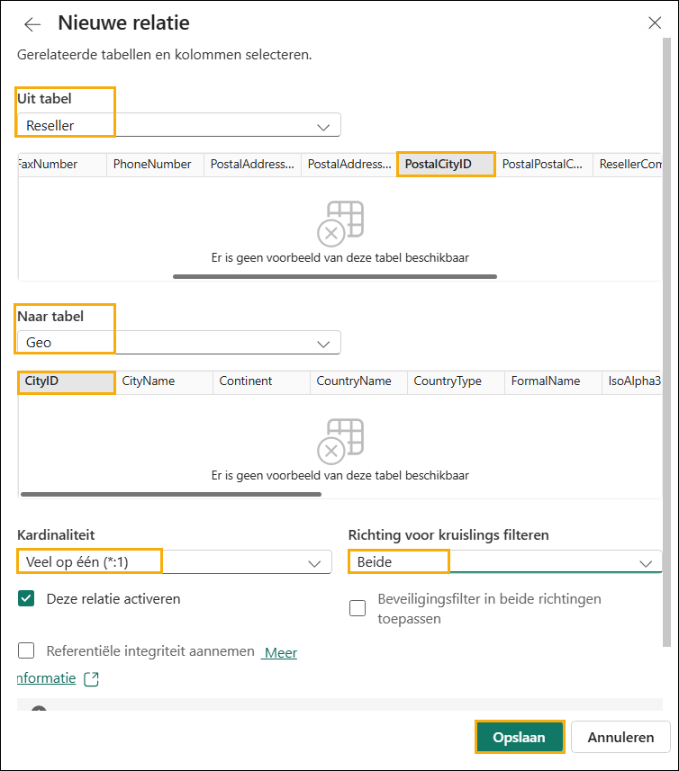

20. Maak op dezelfde manier een relatie aan tussen Customer en Reseller. Selecteer **+ New relationship**.

21. Het dialoogvenster Nieuwe relatie wordt geopend. Zorg ervoor dat **From table** **Customer** is en **Column** **ResellerID** is.

22. Zorg ervoor dat **To table** **Reseller** is en **Column** **ResellerID** is.

23. Zorg ervoor dat **Cardinality** **Many to one (*:1)** is.

24. Zorg ervoor dat **Cross-filter direction** **Single** is.

25. Selecteer **Save**.

    **Controlepunt:** Manage relationships moet eruitzien zoals in de onderstaande schermafbeelding.

    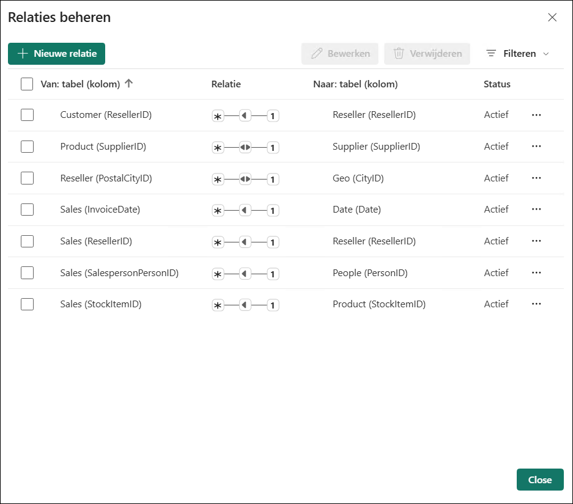

26. Maak op dezelfde manier een **veel-op-één**-relatie aan tussen **PO** en **Date**. Selecteer **Order_Date** uit **PO** en **Date** uit **Date**.

27. Maak op dezelfde manier een **veel-op-één**-relatie aan tussen **PO** en **Product**. Selecteer **StockItemID** uit **PO** en **StockItemID** uit **Product**.

28. Maak op dezelfde manier een **veel-op-één**-relatie aan tussen **PO** en **People**. Selecteer **ContactPersonID** uit **PO** en **PersonID** uit **People**.

29. Selecteer **Close** om het dialoogvenster Manage relationships te sluiten. Het aanmaken van alle relaties is nu voltooid.

    **Controlepunt:** Uw model moet eruitzien zoals in de onderstaande schermafbeelding.

    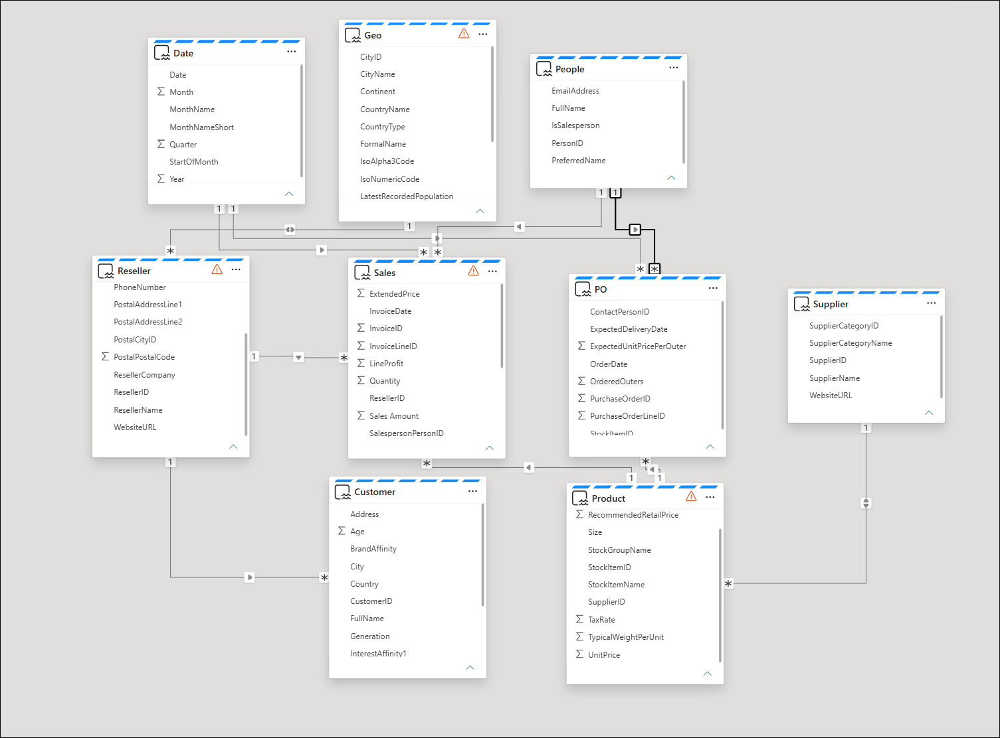

## Taak 7: Optioneel gedeelte – Metingen aanmaken

Laten we de resterende metingen toevoegen.

1. Selecteer de tabel **Sales** en selecteer **Home -> New Measure** in het bovenste menu.

2. Voer **Avg Order = DIVIDE([Sales], [Sales Orders])** in de formulebalk in.

3. Klik op het **vinkje** in de formulebalk of klik op de knop Enter.

4. Vouw het deelvenster Properties aan de rechterkant uit.

5. Vouw de sectie **Formatting** uit.

6. Selecteer **Currency** in de vervolgkeuzelijst **Format**.

7. Stel Decimal places in op **0**.

    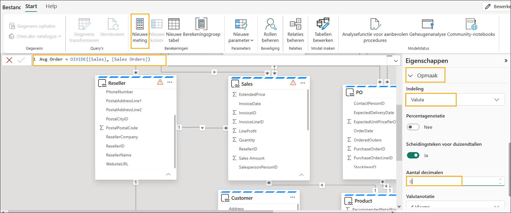

8. Volg vergelijkbare stappen om de volgende metingen toe te voegen:

    1. In de tabel **Sales**: **GM = SUM(Sales[LineProfit])** opgemaakt als **Currency met 0 decimalen**.

    2. In de tabel **Sales**: **GM% = DIVIDE([GM], [Sales])** opgemaakt als **Percentage met 0 decimalen**.

    3. In de tabel **Customer**: **No of Customers = COUNTROWS(Customer)** opgemaakt als **Whole Number met Thousands separator ingeschakeld**.

# Referenties

Fabric Analyst in a Day (FAIAD) introduceert u een aantal van de belangrijkste functies die beschikbaar zijn in Microsoft Fabric. In het menu van de service vindt u in de sectie Help (?) koppelingen naar een aantal uitstekende resources.


Hieronder vindt u nog een aantal resources die u zullen helpen bij uw volgende stappen met Microsoft Fabric.

- Lees de blogpost voor de volledige [aankondiging van Microsoft Fabric GA](https://aka.ms/Fabric-Hero-Blog-Ignite23)

- Verken Fabric via de [Guided Tour](https://aka.ms/Fabric-GuidedTour)

- Meld u aan voor de [gratis proefversie van Microsoft Fabric](https://aka.ms/try-fabric)

- Bezoek de [Microsoft Fabric-website](https://aka.ms/microsoft-fabric)

- Leer nieuwe vaardigheden door de [Fabric Learning-modules](https://aka.ms/learn-fabric) te verkennen

- Verken de [technische documentatie van Fabric](https://aka.ms/fabric-docs)

- Lees het [gratis e-book over aan de slag gaan met Fabric](https://aka.ms/fabric-get-started-ebook)

- Word lid van de [Fabric-community](https://aka.ms/fabric-community) om vragen te stellen, feedback te delen en van anderen te leren

Lees de meer gedetailleerde aankondigingsblogs over Fabric-ervaringen:

- [Blog over Data Factory-ervaring in Fabric](https://aka.ms/Fabric-Data-Factory-Blog)

- [Blog over Synapse Data Engineering-ervaring in Fabric](https://aka.ms/Fabric-DE-Blog)

- [Blog over Synapse Data Science-ervaring in Fabric](https://aka.ms/Fabric-DS-Blog)

- [Blog over Synapse Data Warehousing-ervaring in Fabric](https://aka.ms/Fabric-DW-Blog)

- [Blog over Synapse Real-Time Analytics-ervaring in Fabric](https://aka.ms/Fabric-RTA-Blog)

- [Aankondigingsblog van Power BI](https://aka.ms/Fabric-PBI-Blog)

- [Blog over Data Activator-ervaring in Fabric](https://aka.ms/Fabric-DA-Blog)

- [Blog over beheer en governance in Fabric](https://aka.ms/Fabric-Admin-Gov-Blog)

- [Blog over OneLake in Fabric](https://aka.ms/Fabric-OneLake-Blog)

- [Blog over Dataverse- en Microsoft Fabric-integratie](https://aka.ms/Dataverse-Fabric-Blog)

© 2026 Microsoft Corporation. Alle rechten voorbehouden.

Door gebruik te maken van deze demo/dit lab, gaat u akkoord met de volgende voorwaarden:

De technologie/functionaliteit die in deze demo/dit lab wordt beschreven, wordt door Microsoft Corporation aangeboden met als doel uw feedback te verkrijgen en u een leerervaring te bieden. U mag de demo/het lab uitsluitend gebruiken om dergelijke technologische functies en functionaliteit te evalueren en feedback aan Microsoft te geven. U mag het niet voor enig ander doel gebruiken. U mag deze demo/dit lab of een deel daarvan niet wijzigen, kopiëren, distribueren, verzenden, weergeven, uitvoeren, reproduceren, publiceren, in licentie geven, er afgeleide werken van maken, overdragen of verkopen.

HET KOPIËREN OF REPRODUCEREN VAN DE DEMO/HET LAB (OF EEN DEEL DAARVAN) NAAR ENIGE ANDERE SERVER OF LOCATIE VOOR VERDERE REPRODUCTIE OF HERDISTRIBUTIE IS UITDRUKKELIJK VERBODEN.

DEZE DEMO/DIT LAB BIEDT BEPAALDE SOFTWARE TECHNOLOGIE-/PRODUCTFUNCTIES EN -FUNCTIONALITEIT, INCLUSIEF MOGELIJKE NIEUWE FUNCTIES EN CONCEPTEN, IN EEN GESIMULEERDE OMGEVING ZONDER COMPLEXE INSTALLATIE OF CONFIGURATIE VOOR HET HIERBOVEN BESCHREVEN DOEL. DE TECHNOLOGIE/CONCEPTEN DIE IN DEZE DEMO/DIT LAB WORDEN WEERGEGEVEN, VERTEGENWOORDIGEN MOGELIJK NIET DE VOLLEDIGE FUNCTIEFUNCTIONALITEIT EN WERKEN MOGELIJK NIET OP DE MANIER WAAROP EEN DEFINITIEVE VERSIE ZAL WERKEN. WE KUNNEN OOK GEEN DEFINITIEVE VERSIE VAN DERGELIJKE FUNCTIES OF CONCEPTEN UITBRENGEN. UW ERVARING MET HET GEBRUIK VAN DERGELIJKE FUNCTIES EN FUNCTIONALITEIT IN EEN FYSIEKE OMGEVING KAN OOK ANDERS ZIJN.

**FEEDBACK**. Als u feedback geeft over de technologische functies, functionaliteit en/of concepten die in deze demo/dit lab worden beschreven aan Microsoft, verleent u Microsoft kosteloos het recht om uw feedback op welke manier dan ook en voor welk doel dan ook te gebruiken, te delen en te commercialiseren. U verleent derden ook kosteloos de eventuele octrooirechten die nodig zijn voor hun producten, technologieën en diensten om bepaalde onderdelen van een Microsoft-software of -service die de feedback bevat te gebruiken of te koppelen. U geeft geen feedback die onderworpen is aan een licentie die Microsoft verplicht zijn software of documentatie in licentie te geven aan derden omdat we uw feedback daarin opnemen. Deze rechten blijven van kracht na afloop van deze overeenkomst.

MICROSOFT CORPORATION WIJST HIERBIJ ALLE GARANTIES EN VOORWAARDEN MET BETREKKING TOT DE DEMO/HET LAB AF, MET INBEGRIP VAN ALLE GARANTIES EN VOORWAARDEN VAN VERKOOPBAARHEID, UITDRUKKELIJK, IMPLICIET OF WETTELIJK, GESCHIKTHEID VOOR EEN BEPAALD DOEL, EIGENDOM EN NIET-INBREUK. MICROSOFT GEEFT GEEN GARANTIES OF VERKLARINGEN MET BETREKKING TOT DE NAUWKEURIGHEID VAN DE RESULTATEN, DE UITVOER DIE VOORTVLOEIT UIT HET GEBRUIK VAN DE DEMO/HET LAB, OF DE GESCHIKTHEID VAN DE INFORMATIE IN DE DEMO/HET LAB VOOR ENIG DOEL.

**DISCLAIMER**

Deze demo/dit lab bevat slechts een deel van de nieuwe functies en verbeteringen in Microsoft Power BI. Sommige functies kunnen veranderen in toekomstige versies van het product. In deze demo/dit lab leert u over enkele, maar niet alle, nieuwe functies.